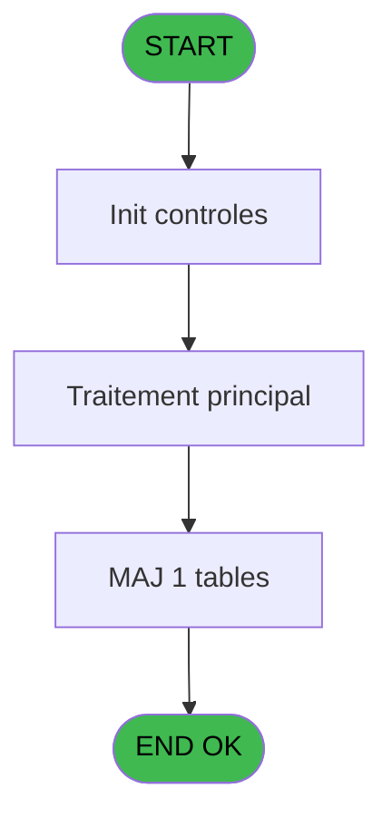
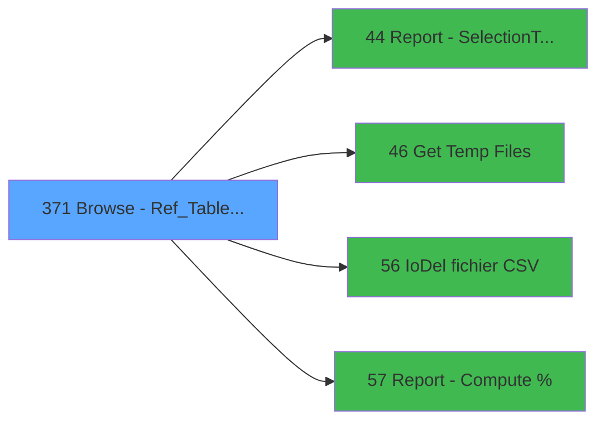

# PVE IDE 371 - Browse - Ref_Tables.product_pr

> **Analyse**: Phases 1-4 2026-02-03 19:49 -> 19:49 (11s) | Assemblage 19:49
> **Pipeline**: V7.2 Enrichi
> **Structure**: 4 onglets (Resume | Ecrans | Donnees | Connexions)

<!-- TAB:Resume -->

## 1. FICHE D'IDENTITE

| Attribut | Valeur |
|----------|--------|
| Projet | PVE |
| IDE Position | 371 |
| Nom Programme | Browse - Ref_Tables.product_pr |
| Fichier source | `Prg_371.xml` |
| Dossier IDE | A |
| Taches | 7 (1 ecrans visibles) |
| Tables modifiees | 1 |
| Programmes appeles | 4 |
| :warning: Statut | **ORPHELIN_POTENTIEL** |

## 2. DESCRIPTION FONCTIONNELLE

**Browse - Ref_Tables.product_pr** assure la gestion complete de ce processus.

Le flux de traitement s'organise en **2 blocs fonctionnels** :

- **Traitement** (4 taches) : traitements metier divers
- **Impression** (3 taches) : generation de tickets et documents

**Donnees modifiees** : 1 tables en ecriture (Table_1670).

Detail : phases du traitement

#### Phase 1 : Traitement (4 taches)

- **371** - Browse - Ref_Tables.product_pr **[[ECRAN]](#ecran-t1)**
- **371.1.1.1** - Lines
- **371.1.1.1.1** - Total
- **371.1.1.1.2.1** - Refund

Delegue a : [Get Temp Files (IDE 46)](PVE-IDE-46.md), [IoDel fichier CSV (IDE 56)](PVE-IDE-56.md), [Report - Compute % (IDE 57)](PVE-IDE-57.md)

#### Phase 2 : Impression (3 taches)

- **371.1** - Print
- **371.1.1** - EDITION
- **371.1.1.1.2** - Print Totaux

#### Tables impactees

| Table | Operations | Role metier |
|-------|-----------|-------------|
| Table_1670 | **W** (1 usages) |  |

## 3. BLOCS FONCTIONNELS

### 3.1 Traitement (4 taches)

Traitements internes.

---

#### 371 - Browse - Ref_Tables.product_pr [[ECRAN]](#ecran-t1)

**Role** : Traitement : Browse - Ref_Tables.product_pr.
**Ecran** : 824 x 195 DLU | [Voir mockup](#ecran-t1)

3 sous-taches directes

| Tache | Nom | Bloc |
|-------|-----|------|
| [371.1.1.1](#t4) | Lines | Traitement |
| [371.1.1.1.1](#t5) | Total | Traitement |
| [371.1.1.1.2.1](#t7) | Refund | Traitement |

**Delegue a** : [Get Temp Files (IDE 46)](PVE-IDE-46.md), [IoDel fichier CSV (IDE 56)](PVE-IDE-56.md), [Report - Compute % (IDE 57)](PVE-IDE-57.md)

---

#### 371.1.1.1 - Lines

**Role** : Traitement : Lines.
**Delegue a** : [Get Temp Files (IDE 46)](PVE-IDE-46.md), [IoDel fichier CSV (IDE 56)](PVE-IDE-56.md), [Report - Compute % (IDE 57)](PVE-IDE-57.md)

---

#### 371.1.1.1.1 - Total

**Role** : Traitement : Total.
**Variables liees** : B (V Total Revenue), C (V Total Cost)
**Delegue a** : [Get Temp Files (IDE 46)](PVE-IDE-46.md), [IoDel fichier CSV (IDE 56)](PVE-IDE-56.md), [Report - Compute % (IDE 57)](PVE-IDE-57.md)

---

#### 371.1.1.1.2.1 - Refund

**Role** : Traitement : Refund.
**Delegue a** : [Get Temp Files (IDE 46)](PVE-IDE-46.md), [IoDel fichier CSV (IDE 56)](PVE-IDE-56.md), [Report - Compute % (IDE 57)](PVE-IDE-57.md)

### 3.2 Impression (3 taches)

Generation des documents et tickets.

---

#### 371.1 - Print

**Role** : Generation du document : Print.

---

#### 371.1.1 - EDITION

**Role** : Generation du document : EDITION.

---

#### 371.1.1.1.2 - Print Totaux

**Role** : Generation du document : Print Totaux.

## 5. REGLES METIER

*(Aucune regle metier identifiee)*

## 6. CONTEXTE

- **Appele par**: (aucun)
- **Appelle**: 4 programmes | **Tables**: 3 (W:1 R:2 L:1) | **Taches**: 7 | **Expressions**: 14

<!-- TAB:Ecrans -->

## 8. ECRANS

### 8.1 Forms visibles (1 / 7)

| # | Position | Tache | Nom | Type | Largeur | Hauteur | Bloc |
|---|----------|-------|-----|------|---------|---------|------|
| 1 | 371 | 371 | Browse - Ref_Tables.product_pr | Type0 | 824 | 195 | Traitement |

### 8.2 Mockups Ecrans

---

#### 371 - Browse - Ref_Tables.product_pr
**Tache** : [371](#t1) | **Type** : Type0 | **Dimensions** : 824 x 195 DLU
**Bloc** : Traitement | **Titre IDE** : Browse - Ref_Tables.product_pr

<!-- FORM-DATA:
{
    "width":  824,
    "vFactor":  8,
    "type":  "Type0",
    "hFactor":  4,
    "controls":  [
                     {
                         "x":  8,
                         "type":  "table",
                         "var":  "",
                         "name":  "",
                         "titleH":  12,
                         "color":  "",
                         "w":  802,
                         "y":  8,
                         "fmt":  "",
                         "parent":  null,
                         "text":  "",
                         "rowH":  13,
                         "h":  182,
                         "cols":  [
                                      {
                                          "title":  "prp_id",
                                          "layer":  1,
                                          "w":  63
                                      },
                                      {
                                          "title":  "prp_seminar_name",
                                          "layer":  2,
                                          "w":  122
                                      },
                                      {
                                          "title":  "prp_service",
                                          "layer":  3,
                                          "w":  47
                                      },
                                      {
                                          "title":  "prp_cat",
                                          "layer":  4,
                                          "w":  63
                                      },
                                      {
                                          "title":  "prp_sub_cat",
                                          "layer":  5,
                                          "w":  63
                                      },
                                      {
                                          "title":  "prp_product",
                                          "layer":  6,
                                          "w":  63
                                      },
                                      {
                                          "title":  "prp_unit_price",
                                          "layer":  7,
                                          "w":  77
                                      },
                                      {
                                          "title":  "prp_reduct_percent",
                                          "layer":  8,
                                          "w":  78
                                      },
                                      {
                                          "title":  "prp_reduct_price",
                                          "layer":  9,
                                          "w":  106
                                      },
                                      {
                                          "title":  "prp_prise_en_charge_sem",
                                          "layer":  10,
                                          "w":  103
                                      }
                                  ],
                         "rows":  10
                     },
                     {
                         "x":  12,
                         "type":  "edit",
                         "var":  "",
                         "y":  23,
                         "w":  56,
                         "fmt":  "",
                         "name":  "prp_id",
                         "h":  10,
                         "color":  "",
                         "text":  "",
                         "parent":  1
                     },
                     {
                         "x":  75,
                         "type":  "edit",
                         "var":  "",
                         "y":  23,
                         "w":  115,
                         "fmt":  "",
                         "name":  "prp_seminar_name",
                         "h":  10,
                         "color":  "",
                         "text":  "",
                         "parent":  1
                     },
                     {
                         "x":  197,
                         "type":  "edit",
                         "var":  "",
                         "y":  23,
                         "w":  26,
                         "fmt":  "",
                         "name":  "prp_service",
                         "h":  10,
                         "color":  "",
                         "text":  "",
                         "parent":  1
                     },
                     {
                         "x":  244,
                         "type":  "edit",
                         "var":  "",
                         "y":  23,
                         "w":  56,
                         "fmt":  "",
                         "name":  "prp_cat",
                         "h":  10,
                         "color":  "",
                         "text":  "",
                         "parent":  1
                     },
                     {
                         "x":  307,
                         "type":  "edit",
                         "var":  "",
                         "y":  23,
                         "w":  56,
                         "fmt":  "",
                         "name":  "prp_sub_cat",
                         "h":  10,
                         "color":  "",
                         "text":  "",
                         "parent":  1
                     },
                     {
                         "x":  370,
                         "type":  "edit",
                         "var":  "",
                         "y":  23,
                         "w":  56,
                         "fmt":  "",
                         "name":  "prp_product",
                         "h":  10,
                         "color":  "",
                         "text":  "",
                         "parent":  1
                     },
                     {
                         "x":  433,
                         "type":  "edit",
                         "var":  "",
                         "y":  23,
                         "w":  70,
                         "fmt":  "",
                         "name":  "prp_unit_price",
                         "h":  10,
                         "color":  "",
                         "text":  "",
                         "parent":  1
                     },
                     {
                         "x":  510,
                         "type":  "edit",
                         "var":  "",
                         "y":  23,
                         "w":  32,
                         "fmt":  "",
                         "name":  "prp_reduct_percent",
                         "h":  10,
                         "color":  "",
                         "text":  "",
                         "parent":  1
                     },
                     {
                         "x":  588,
                         "type":  "edit",
                         "var":  "",
                         "y":  23,
                         "w":  99,
                         "fmt":  "",
                         "name":  "prp_reduct_price",
                         "h":  10,
                         "color":  "",
                         "text":  "",
                         "parent":  1
                     },
                     {
                         "x":  694,
                         "type":  "edit",
                         "var":  "",
                         "y":  23,
                         "w":  31,
                         "fmt":  "",
                         "name":  "prp_prise_en_charge_sem",
                         "h":  10,
                         "color":  "",
                         "text":  "",
                         "parent":  1
                     }
                 ],
    "taskId":  "371",
    "height":  195
}
-->

<strong>Champs : 10 champs</strong>

| Pos (x,y) | Nom | Variable | Type |
|-----------|-----|----------|------|
| 12,23 | prp_id | - | edit |
| 75,23 | prp_seminar_name | - | edit |
| 197,23 | prp_service | - | edit |
| 244,23 | prp_cat | - | edit |
| 307,23 | prp_sub_cat | - | edit |
| 370,23 | prp_product | - | edit |
| 433,23 | prp_unit_price | - | edit |
| 510,23 | prp_reduct_percent | - | edit |
| 588,23 | prp_reduct_price | - | edit |
| 694,23 | prp_prise_en_charge_sem | - | edit |

## 9. NAVIGATION

Ecran unique: **Browse - Ref_Tables.product_pr**

### 9.3 Structure hierarchique (7 taches)

| Position | Tache | Type | Dimensions | Bloc |
|----------|-------|------|------------|------|
| **371.1** | [**Browse - Ref_Tables.product_pr** (371)](#t1) [mockup](#ecran-t1) | - | 824x195 | Traitement |
| 371.1.1 | [Lines (371.1.1.1)](#t4) | MDI | - | |
| 371.1.2 | [Total (371.1.1.1.1)](#t5) | MDI | - | |
| 371.1.3 | [Refund (371.1.1.1.2.1)](#t7) | MDI | - | |
| **371.2** | [**Print** (371.1)](#t2) | MDI | - | Impression |
| 371.2.1 | [EDITION (371.1.1)](#t3) | MDI | - | |
| 371.2.2 | [Print Totaux (371.1.1.1.2)](#t6) | MDI | - | |

### 9.4 Algorigramme

> **Legende**: Vert = START/END OK | Rouge = END KO | Bleu = Decisions
> *Algorigramme auto-genere. Utiliser `/algorigramme` pour une synthese metier detaillee.*

<!-- TAB:Donnees -->

## 10. TABLES

### Tables utilisees (3)

| ID | Nom | Description | Type | R | W | L | Usages |
|----|-----|-------------|------|---|---|---|--------|
| 524 | update_table_codes_log |  | TMP | R |   | L | 3 |
| 765 | tranche_age |  | DB | R |   |   | 1 |
| 1670 | Table_1670 |  | MEM |   | **W** |   | 1 |

### Colonnes par table (1 / 3 tables avec colonnes identifiees)

Table 524 - update_table_codes_log (R/L) - 3 usages

| Lettre | Variable | Acces | Type |
|--------|----------|-------|------|
| A | Total Location | R | Numeric |
| B | Total General | R | Numeric |

Table 765 - tranche_age (R) - 1 usages

*Table utilisee uniquement en Link ou aucune colonne Real identifiee dans le DataView.*

Table 1670 - Table_1670 (**W**) - 1 usages

*Table utilisee uniquement en Link ou aucune colonne Real identifiee dans le DataView.*

## 11. VARIABLES

### 11.1 Variables de session (6)

Variables persistantes pendant toute la session.

| Lettre | Nom | Type | Usage dans |
|--------|-----|------|-----------|
| A | V is item selected | Logical | 2x session |
| B | V Total Revenue | Numeric | - |
| C | V Total Cost | Numeric | - |
| D | V is item Customer selected | Logical | - |
| E | V is item Package selected | Logical | - |
| F | V is item Account selected | Logical | - |

## 12. EXPRESSIONS

**14 / 14 expressions decodees (100%)**

### 12.1 Repartition par type

| Type | Expressions | Regles |
|------|-------------|--------|
| CONSTANTE | 2 | 0 |
| CONCATENATION | 1 | 0 |
| OTHER | 6 | 0 |
| NEGATION | 2 | 0 |
| CAST_LOGIQUE | 2 | 0 |
| CONDITION | 1 | 0 |

### 12.2 Expressions cles par type

#### CONSTANTE (2 expressions)

| Type | IDE | Expression | Regle |
|------|-----|------------|-------|
| CONSTANTE | 13 | `2` | - |
| CONSTANTE | 8 | `'V'` | - |

#### CONCATENATION (1 expressions)

| Type | IDE | Expression | Regle |
|------|-----|------------|-------|
| CONCATENATION | 9 | `'%club_exportdata%'&Trim (GetParam ('VILLAGECODE'))&Trim (GetParam ('SERVICE'))&'_costseller_'&DStr ({1,6},'YYYYMMDD')&'_'&DStr ({1,7},'YYYYMMDD')&'.csv'` | - |

#### OTHER (6 expressions)

| Type | IDE | Expression | Regle |
|------|-----|------------|-------|
| OTHER | 5 | `SetCrsr (1)` | - |
| OTHER | 12 | `'Excel '&ExpCalc('9'EXP)` | - |
| OTHER | 14 | `NOT(V is item Customer sel... [D]) OR NOT (V is item Package sele... [E]) OR NOT (V is item Account sele... [F])` | - |
| OTHER | 1 | `SetCrsr (2)` | - |
| OTHER | 2 | `DbDel ('{524,3}'DSOURCE,'')` | - |
| ... | | *+1 autres* | |

#### NEGATION (2 expressions)

| Type | IDE | Expression | Regle |
|------|-----|------------|-------|
| NEGATION | 10 | `NOT (GetParam ('Output')='Extraction')` | - |
| NEGATION | 3 | `NOT (V is item selected [A])` | - |

#### CAST_LOGIQUE (2 expressions)

| Type | IDE | Expression | Regle |
|------|-----|------------|-------|
| CAST_LOGIQUE | 7 | `'TRUE'LOG` | - |
| CAST_LOGIQUE | 6 | `'FALSE'LOG` | - |

#### CONDITION (1 expressions)

| Type | IDE | Expression | Regle |
|------|-----|------------|-------|
| CONDITION | 11 | `GetParam ('Output')='Extraction'` | - |

<!-- TAB:Connexions -->

## 13. GRAPHE D'APPELS

### 13.1 Chaine depuis Main (Callers)

**Chemin**: (pas de callers directs)

### 13.2 Callers

| IDE | Nom Programme | Nb Appels |
|-----|---------------|-----------|
| - | (aucun) | - |

### 13.3 Callees (programmes appeles)

### 13.4 Detail Callees avec contexte

| IDE | Nom Programme | Appels | Contexte |
|-----|---------------|--------|----------|
| [44](PVE-IDE-44.md) | Report - Selection/Tempo | 1 | Selection/consultation |
| [46](PVE-IDE-46.md) | Get Temp Files | 1 | Recuperation donnees |
| [56](PVE-IDE-56.md) | IoDel fichier CSV | 1 | Sous-programme |
| [57](PVE-IDE-57.md) | Report - Compute % | 1 | Sous-programme |

## 14. RECOMMANDATIONS MIGRATION

### 14.1 Profil du programme

| Metrique | Valeur | Impact migration |
|----------|--------|-----------------|
| Lignes de logique | 144 | Programme compact |
| Expressions | 14 | Peu de logique |
| Tables WRITE | 1 | Impact faible |
| Sous-programmes | 4 | Peu de dependances |
| Ecrans visibles | 1 | Ecran unique ou traitement batch |
| Code desactive | 0% (0 / 144) | Code sain |
| Regles metier | 0 | Pas de regle identifiee |

### 14.2 Plan de migration par bloc

#### Traitement (4 taches: 1 ecran, 3 traitements)

- **Strategie** : Orchestrateur avec 1 ecrans (Razor/React) et 3 traitements backend (services).
- Les ecrans deviennent des composants UI, les traitements invisibles deviennent des services injectables.
- 4 sous-programme(s) a migrer ou a reutiliser depuis les services existants.
- Decomposer les taches en services unitaires testables.

#### Impression (3 taches: 0 ecran, 3 traitements)

- **Strategie** : Templates HTML -> PDF via wkhtmltopdf ou Puppeteer.
- `PrintService` injectable avec choix imprimante

### 14.3 Dependances critiques

| Dependance | Type | Appels | Impact |
|------------|------|--------|--------|
| Table_1670 | Table WRITE (Memory) | 1x | Schema + repository |
| [IoDel fichier CSV (IDE 56)](PVE-IDE-56.md) | Sous-programme | 1x | Normale - Sous-programme |
| [Report - Compute % (IDE 57)](PVE-IDE-57.md) | Sous-programme | 1x | Normale - Sous-programme |
| [Report - Selection/Tempo (IDE 44)](PVE-IDE-44.md) | Sous-programme | 1x | Normale - Selection/consultation |
| [Get Temp Files (IDE 46)](PVE-IDE-46.md) | Sous-programme | 1x | Normale - Recuperation donnees |

---
*Spec DETAILED generee par Pipeline V7.2 - 2026-02-03 19:49*
