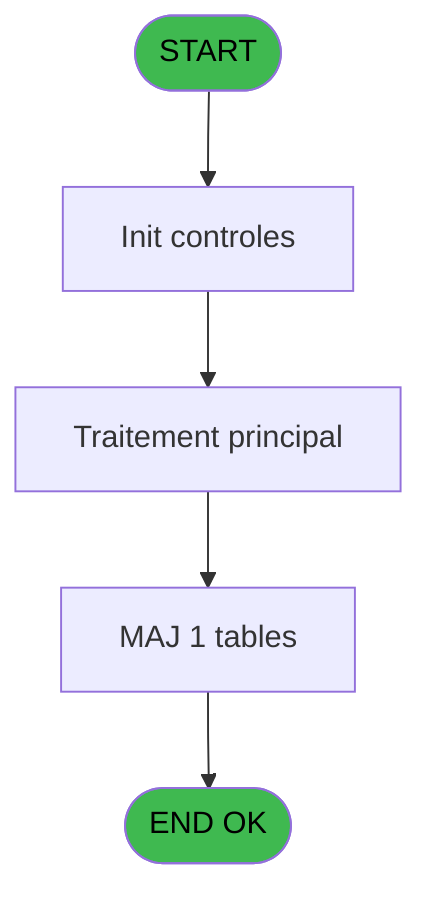
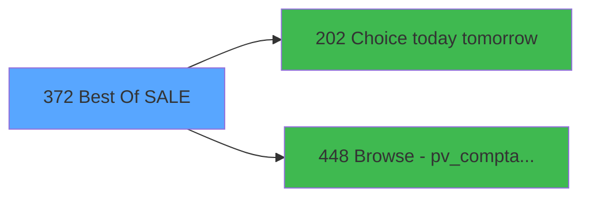

# PVE IDE 372 - Best Of (SALE)

> **Analyse**: Phases 1-4 2026-02-03 19:49 -> 19:49 (12s) | Assemblage 19:49
> **Pipeline**: V7.2 Enrichi
> **Structure**: 4 onglets (Resume | Ecrans | Donnees | Connexions)

<!-- TAB:Resume -->

## 1. FICHE D'IDENTITE

| Attribut | Valeur |
|----------|--------|
| Projet | PVE |
| IDE Position | 372 |
| Nom Programme | Best Of (SALE) |
| Fichier source | `Prg_372.xml` |
| Dossier IDE | A |
| Taches | 7 (0 ecrans visibles) |
| Tables modifiees | 1 |
| Programmes appeles | 2 |
| :warning: Statut | **ORPHELIN_POTENTIEL** |

## 2. DESCRIPTION FONCTIONNELLE

**Best Of (SALE)** assure la gestion complete de ce processus.

Le flux de traitement s'organise en **4 blocs fonctionnels** :

- **Impression** (3 taches) : generation de tickets et documents
- **Traitement** (2 taches) : traitements metier divers
- **Consultation** (1 tache) : ecrans de recherche, selection et consultation
- **Calcul** (1 tache) : calculs de montants, stocks ou compteurs

**Donnees modifiees** : 1 tables en ecriture (comptes_speciaux_spc_cash).

Detail : phases du traitement

#### Phase 1 : Impression (3 taches)

- **372** - Print Best Of **[[ECRAN]](#ecran-t1)**
- **372.1** - Print
- **372.1.2** - Printing

#### Phase 2 : Consultation (1 tache)

- **372.1.1** - SELECTION

#### Phase 3 : Calcul (1 tache)

- **372.1.1.1** - Selection compta

Delegue a : [Browse - pv_comptab_temp (IDE 448)](PVE-IDE-448.md)

#### Phase 4 : Traitement (2 taches)

- **372.1.1.1.1** - Temp generation
- **372.1.2.1** - Best of line

Delegue a : [Choice today tomorrow (IDE 202)](PVE-IDE-202.md)

#### Tables impactees

| Table | Operations | Role metier |
|-------|-----------|-------------|
| comptes_speciaux_spc_cash | **W**/L (2 usages) | Comptes GM (generaux) |

## 3. BLOCS FONCTIONNELS

### 3.1 Impression (3 taches)

Generation des documents et tickets.

---

#### 372 - Print Best Of [[ECRAN]](#ecran-t1)

**Role** : Generation du document : Print Best Of.
**Ecran** : 312 x 173 DLU (MDI) | [Voir mockup](#ecran-t1)

---

#### 372.1 - Print

**Role** : Generation du document : Print.

---

#### 372.1.2 - Printing

**Role** : Generation du document : Printing.

### 3.2 Consultation (1 tache)

Ecrans de recherche et consultation.

---

#### 372.1.1 - SELECTION

**Role** : Selection par l'operateur : SELECTION.

### 3.3 Calcul (1 tache)

Calculs metier : montants, stocks, compteurs.

---

#### 372.1.1.1 - Selection compta

**Role** : Selection par l'operateur : Selection compta.
**Delegue a** : [Browse - pv_comptab_temp (IDE 448)](PVE-IDE-448.md)

### 3.4 Traitement (2 taches)

Traitements internes.

---

#### 372.1.1.1.1 - Temp generation

**Role** : Traitement : Temp generation.
**Delegue a** : [Choice today tomorrow (IDE 202)](PVE-IDE-202.md)

---

#### 372.1.2.1 - Best of line

**Role** : Traitement : Best of line.
**Delegue a** : [Choice today tomorrow (IDE 202)](PVE-IDE-202.md)

## 5. REGLES METIER

*(Aucune regle metier identifiee)*

## 6. CONTEXTE

- **Appele par**: (aucun)
- **Appelle**: 2 programmes | **Tables**: 4 (W:1 R:3 L:1) | **Taches**: 7 | **Expressions**: 4

<!-- TAB:Ecrans -->

## 8. ECRANS

*(Programme sans ecran visible)*

## 9. NAVIGATION

### 9.3 Structure hierarchique (7 taches)

| Position | Tache | Type | Dimensions | Bloc |
|----------|-------|------|------------|------|
| **372.1** | [**Print Best Of** (372)](#t1) [mockup](#ecran-t1) | MDI | 312x173 | Impression |
| 372.1.1 | [Print (372.1)](#t2) | MDI | - | |
| 372.1.2 | [Printing (372.1.2)](#t6) | MDI | - | |
| **372.2** | [**SELECTION** (372.1.1)](#t3) | MDI | - | Consultation |
| **372.3** | [**Selection compta** (372.1.1.1)](#t4) | MDI | - | Calcul |
| **372.4** | [**Temp generation** (372.1.1.1.1)](#t5) | MDI | - | Traitement |
| 372.4.1 | [Best of line (372.1.2.1)](#t7) | MDI | - | |

### 9.4 Algorigramme

> **Legende**: Vert = START/END OK | Rouge = END KO | Bleu = Decisions
> *Algorigramme auto-genere. Utiliser `/algorigramme` pour une synthese metier detaillee.*

<!-- TAB:Donnees -->

## 10. TABLES

### Tables utilisees (4)

| ID | Nom | Description | Type | R | W | L | Usages |
|----|-----|-------------|------|---|---|---|--------|
| 403 | pv_sellers |  | DB | R |   |   | 1 |
| 523 | synthese_garanties | Depots et garanties | TMP | R |   |   | 1 |
| 534 | liste_des_caisses | Sessions de caisse | TMP | R |   |   | 1 |
| 758 | comptes_speciaux_spc_cash | Comptes GM (generaux) | DB |   | **W** | L | 2 |

### Colonnes par table (0 / 4 tables avec colonnes identifiees)

Table 403 - pv_sellers (R) - 1 usages

*Table utilisee uniquement en Link ou aucune colonne Real identifiee dans le DataView.*

Table 523 - synthese_garanties (R) - 1 usages

*Table utilisee uniquement en Link ou aucune colonne Real identifiee dans le DataView.*

Table 534 - liste_des_caisses (R) - 1 usages

*Table utilisee uniquement en Link ou aucune colonne Real identifiee dans le DataView.*

Table 758 - comptes_speciaux_spc_cash (**W**/L) - 2 usages

*Table utilisee uniquement en Link ou aucune colonne Real identifiee dans le DataView.*

## 11. VARIABLES

### 11.1 Parametres entrants (5)

Variables recues en parametre.

| Lettre | Nom | Type | Usage dans |
|--------|-----|------|-----------|
| A | P. Village name | Alpha | - |
| B | P. Currency | Alpha | - |
| C | P. Amount format | Alpha | - |
| D | P. Amount format sans Z | Alpha | - |
| E | P. Decimales | Numeric | - |

### 11.2 Variables de session (2)

Variables persistantes pendant toute la session.

| Lettre | Nom | Type | Usage dans |
|--------|-----|------|-----------|
| F | V Date mini | Date | 1x session |
| G | V Date maxi | Date | 2x session |

### 11.3 Autres (1)

Variables diverses.

| Lettre | Nom | Type | Usage dans |
|--------|-----|------|-----------|
| H | ; | Alpha | 1x refs |

## 12. EXPRESSIONS

**4 / 4 expressions decodees (100%)**

### 12.1 Repartition par type

| Type | Expressions | Regles |
|------|-------------|--------|
| CONDITION | 2 | 0 |
| CONSTANTE | 1 | 0 |
| CAST_LOGIQUE | 1 | 0 |

### 12.2 Expressions cles par type

#### CONDITION (2 expressions)

| Type | IDE | Expression | Regle |
|------|-----|------------|-------|
| CONDITION | 2 | `V Date maxi [G]<>'00/00/0000'DATE` | - |
| CONDITION | 1 | `V Date mini [F]='00/00/0000'DATE AND V Date maxi [G]='00/00/0000'DATE` | - |

#### CONSTANTE (1 expressions)

| Type | IDE | Expression | Regle |
|------|-----|------------|-------|
| CONSTANTE | 3 | `';'` | - |

#### CAST_LOGIQUE (1 expressions)

| Type | IDE | Expression | Regle |
|------|-----|------------|-------|
| CAST_LOGIQUE | 4 | `'FALSE'LOG` | - |

<!-- TAB:Connexions -->

## 13. GRAPHE D'APPELS

### 13.1 Chaine depuis Main (Callers)

**Chemin**: (pas de callers directs)

### 13.2 Callers

| IDE | Nom Programme | Nb Appels |
|-----|---------------|-----------|
| - | (aucun) | - |

### 13.3 Callees (programmes appeles)

### 13.4 Detail Callees avec contexte

| IDE | Nom Programme | Appels | Contexte |
|-----|---------------|--------|----------|
| [202](PVE-IDE-202.md) | Choice today tomorrow | 1 | Sous-programme |
| [448](PVE-IDE-448.md) | Browse - pv_comptab_temp | 1 | Sous-programme |

## 14. RECOMMANDATIONS MIGRATION

### 14.1 Profil du programme

| Metrique | Valeur | Impact migration |
|----------|--------|-----------------|
| Lignes de logique | 75 | Programme compact |
| Expressions | 4 | Peu de logique |
| Tables WRITE | 1 | Impact faible |
| Sous-programmes | 2 | Peu de dependances |
| Ecrans visibles | 0 | Ecran unique ou traitement batch |
| Code desactive | 0% (0 / 75) | Code sain |
| Regles metier | 0 | Pas de regle identifiee |

### 14.2 Plan de migration par bloc

#### Impression (3 taches: 1 ecran, 2 traitements)

- **Strategie** : Templates HTML -> PDF via wkhtmltopdf ou Puppeteer.
- `PrintService` injectable avec choix imprimante

#### Consultation (1 tache: 0 ecran, 1 traitement)

- **Strategie** : Composants de recherche/selection en modales.

#### Calcul (1 tache: 0 ecran, 1 traitement)

- **Strategie** : Services de calcul purs (Domain Services).
- Migrer la logique de calcul (stock, compteurs, montants)

#### Traitement (2 taches: 0 ecran, 2 traitements)

- **Strategie** : 2 service(s) backend injectable(s) (Domain Services).
- 2 sous-programme(s) a migrer ou a reutiliser depuis les services existants.
- Decomposer les taches en services unitaires testables.

### 14.3 Dependances critiques

| Dependance | Type | Appels | Impact |
|------------|------|--------|--------|
| comptes_speciaux_spc_cash | Table WRITE (Database) | 1x | Schema + repository |
| [Browse - pv_comptab_temp (IDE 448)](PVE-IDE-448.md) | Sous-programme | 1x | Normale - Sous-programme |
| [Choice today tomorrow (IDE 202)](PVE-IDE-202.md) | Sous-programme | 1x | Normale - Sous-programme |

---
*Spec DETAILED generee par Pipeline V7.2 - 2026-02-03 19:49*
