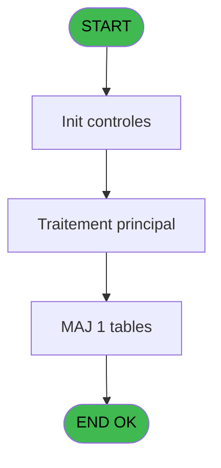
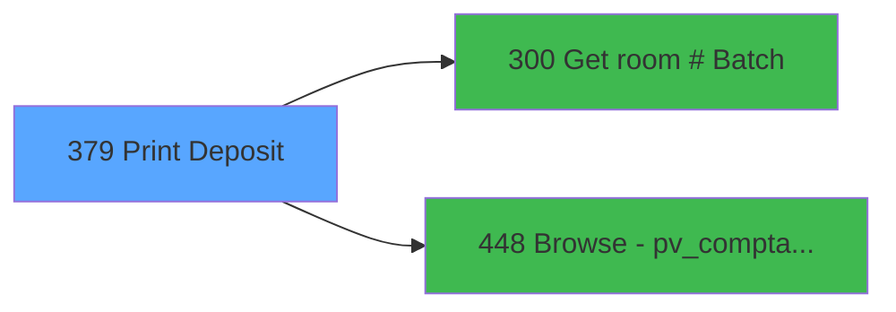

# PVE IDE 379 - Print Deposit

> **Analyse**: Phases 1-4 2026-02-03 19:51 -> 19:51 (11s) | Assemblage 19:51
> **Pipeline**: V7.2 Enrichi
> **Structure**: 4 onglets (Resume | Ecrans | Donnees | Connexions)

<!-- TAB:Resume -->

## 1. FICHE D'IDENTITE

| Attribut | Valeur |
|----------|--------|
| Projet | PVE |
| IDE Position | 379 |
| Nom Programme | Print Deposit |
| Fichier source | `Prg_379.xml` |
| Dossier IDE | A |
| Taches | 6 (1 ecrans visibles) |
| Tables modifiees | 1 |
| Programmes appeles | 2 |
| :warning: Statut | **ORPHELIN_POTENTIEL** |

## 2. DESCRIPTION FONCTIONNELLE

**Print Deposit** assure la gestion complete de ce processus.

Le flux de traitement s'organise en **4 blocs fonctionnels** :

- **Impression** (3 taches) : generation de tickets et documents
- **Creation** (1 tache) : insertion d'enregistrements en base (mouvements, prestations)
- **Consultation** (1 tache) : ecrans de recherche, selection et consultation
- **Traitement** (1 tache) : traitements metier divers

**Donnees modifiees** : 1 tables en ecriture (Table_527).

Detail : phases du traitement

#### Phase 1 : Impression (3 taches)

- **379** - Print Deposits **[[ECRAN]](#ecran-t1)**
- **379.1** - Print
- **379.1.1** - EDITION

#### Phase 2 : Traitement (1 tache)

- **379.1.1.1** - Read Temp file

Delegue a : [Get room # (Batch) (IDE 300)](PVE-IDE-300.md)

#### Phase 3 : Consultation (1 tache)

- **379.1.2** - GM Selection

Delegue a : [Get room # (Batch) (IDE 300)](PVE-IDE-300.md)

#### Phase 4 : Creation (1 tache)

- **379.1.2.1** - Create Temp

#### Tables impactees

| Table | Operations | Role metier |
|-------|-----------|-------------|
| Table_527 | **W** (2 usages) |  |

## 3. BLOCS FONCTIONNELS

### 3.1 Impression (3 taches)

Generation des documents et tickets.

---

#### 379 - Print Deposits [[ECRAN]](#ecran-t1)

**Role** : Generation du document : Print Deposits.
**Ecran** : 314 x 175 DLU (MDI) | [Voir mockup](#ecran-t1)

---

#### 379.1 - Print

**Role** : Generation du document : Print.

---

#### 379.1.1 - EDITION

**Role** : Generation du document : EDITION.

### 3.2 Traitement (1 tache)

Traitements internes.

---

#### 379.1.1.1 - Read Temp file

**Role** : Traitement : Read Temp file.
**Delegue a** : [Get room # (Batch) (IDE 300)](PVE-IDE-300.md)

### 3.3 Consultation (1 tache)

Ecrans de recherche et consultation.

---

#### 379.1.2 - GM Selection

**Role** : Selection par l'operateur : GM Selection.

### 3.4 Creation (1 tache)

Insertion de nouveaux enregistrements en base.

---

#### 379.1.2.1 - Create Temp

**Role** : Traitement : Create Temp.

## 5. REGLES METIER

*(Aucune regle metier identifiee)*

## 6. CONTEXTE

- **Appele par**: (aucun)
- **Appelle**: 2 programmes | **Tables**: 3 (W:1 R:1 L:1) | **Taches**: 6 | **Expressions**: 1

<!-- TAB:Ecrans -->

## 8. ECRANS

### 8.1 Forms visibles (1 / 6)

| # | Position | Tache | Nom | Type | Largeur | Hauteur | Bloc |
|---|----------|-------|-----|------|---------|---------|------|
| 1 | 379 | 379 | Print Deposits | MDI | 314 | 175 | Impression |

### 8.2 Mockups Ecrans

---

#### 379 - Print Deposits
**Tache** : [379](#t1) | **Type** : MDI | **Dimensions** : 314 x 175 DLU
**Bloc** : Impression | **Titre IDE** : Print Deposits

<!-- FORM-DATA:
{
    "width":  314,
    "vFactor":  8,
    "type":  "MDI",
    "hFactor":  4,
    "controls":  [
                     {
                         "x":  16,
                         "type":  "label",
                         "var":  "",
                         "y":  59,
                         "w":  281,
                         "fmt":  "",
                         "name":  "",
                         "h":  8,
                         "color":  "187",
                         "text":  "Select the range of starting dates for  customer begin of stay",
                         "parent":  null
                     },
                     {
                         "x":  90,
                         "type":  "label",
                         "var":  "",
                         "y":  83,
                         "w":  48,
                         "fmt":  "",
                         "name":  "",
                         "h":  12,
                         "color":  "183",
                         "text":  "Date min",
                         "parent":  null
                     },
                     {
                         "x":  90,
                         "type":  "label",
                         "var":  "",
                         "y":  107,
                         "w":  51,
                         "fmt":  "",
                         "name":  "",
                         "h":  12,
                         "color":  "183",
                         "text":  "Date max",
                         "parent":  null
                     },
                     {
                         "x":  0,
                         "type":  "label",
                         "var":  "",
                         "y":  0,
                         "w":  312,
                         "fmt":  "",
                         "name":  "",
                         "h":  42,
                         "color":  "182",
                         "text":  "",
                         "parent":  null
                     },
                     {
                         "x":  8,
                         "type":  "label",
                         "var":  "",
                         "y":  16,
                         "w":  253,
                         "fmt":  "",
                         "name":  "",
                         "h":  10,
                         "color":  "186",
                         "text":  "List of deposits for a specific period",
                         "parent":  6
                     },
                     {
                         "x":  0,
                         "type":  "label",
                         "var":  "",
                         "y":  139,
                         "w":  312,
                         "fmt":  "",
                         "name":  "",
                         "h":  34,
                         "color":  "6",
                         "text":  "",
                         "parent":  null
                     },
                     {
                         "x":  143,
                         "type":  "edit",
                         "var":  "",
                         "y":  83,
                         "w":  73,
                         "fmt":  "",
                         "name":  "",
                         "h":  12,
                         "color":  "110",
                         "text":  "",
                         "parent":  null
                     },
                     {
                         "x":  143,
                         "type":  "edit",
                         "var":  "",
                         "y":  107,
                         "w":  73,
                         "fmt":  "",
                         "name":  "",
                         "h":  12,
                         "color":  "110",
                         "text":  "",
                         "parent":  null
                     },
                     {
                         "x":  174,
                         "type":  "button",
                         "var":  "",
                         "y":  144,
                         "w":  68,
                         "fmt":  "Print",
                         "name":  "",
                         "h":  28,
                         "color":  "",
                         "text":  "",
                         "parent":  null
                     },
                     {
                         "x":  242,
                         "type":  "button",
                         "var":  "",
                         "y":  144,
                         "w":  68,
                         "fmt":  "Exit",
                         "name":  "",
                         "h":  28,
                         "color":  "",
                         "text":  "",
                         "parent":  null
                     },
                     {
                         "x":  262,
                         "type":  "image",
                         "var":  "",
                         "y":  4,
                         "w":  48,
                         "fmt":  "",
                         "name":  "",
                         "h":  37,
                         "color":  "",
                         "text":  "",
                         "parent":  6
                     }
                 ],
    "taskId":  "379",
    "height":  175
}
-->

<strong>Champs : 2 champs</strong>

| Pos (x,y) | Nom | Variable | Type |
|-----------|-----|----------|------|
| 143,83 | (sans nom) | - | edit |
| 143,107 | (sans nom) | - | edit |

<strong>Boutons : 2 boutons</strong>

| Bouton | Pos (x,y) | Action |
|--------|-----------|--------|
| Print | 174,144 | Lance l'impression |
| Exit | 242,144 | Quitte le programme |

## 9. NAVIGATION

Ecran unique: **Print Deposits**

### 9.3 Structure hierarchique (6 taches)

| Position | Tache | Type | Dimensions | Bloc |
|----------|-------|------|------------|------|
| **379.1** | [**Print Deposits** (379)](#t1) [mockup](#ecran-t1) | MDI | 314x175 | Impression |
| 379.1.1 | [Print (379.1)](#t2) | MDI | - | |
| 379.1.2 | [EDITION (379.1.1)](#t3) | MDI | - | |
| **379.2** | [**Read Temp file** (379.1.1.1)](#t4) | MDI | - | Traitement |
| **379.3** | [**GM Selection** (379.1.2)](#t5) | MDI | - | Consultation |
| **379.4** | [**Create Temp** (379.1.2.1)](#t6) | MDI | - | Creation |

### 9.4 Algorigramme

> **Legende**: Vert = START/END OK | Rouge = END KO | Bleu = Decisions
> *Algorigramme auto-genere. Utiliser `/algorigramme` pour une synthese metier detaillee.*

<!-- TAB:Donnees -->

## 10. TABLES

### Tables utilisees (3)

| ID | Nom | Description | Type | R | W | L | Usages |
|----|-----|-------------|------|---|---|---|--------|
| 30 | gm-recherche_____gmr | Index de recherche | DB | R |   |   | 1 |
| 382 | pv_discount_reasons |  | DB |   |   | L | 1 |
| 527 | Table_527 |  | TMP |   | **W** |   | 2 |

### Colonnes par table (0 / 2 tables avec colonnes identifiees)

Table 30 - gm-recherche_____gmr (R) - 1 usages

*Table utilisee uniquement en Link ou aucune colonne Real identifiee dans le DataView.*

Table 527 - Table_527 (**W**) - 2 usages

*Table utilisee uniquement en Link ou aucune colonne Real identifiee dans le DataView.*

## 11. VARIABLES

### 11.1 Autres (2)

Variables diverses.

| Lettre | Nom | Type | Usage dans |
|--------|-----|------|-----------|
| A | Date mini | Date | - |
| B | Date maxi | Date | - |

## 12. EXPRESSIONS

**1 / 1 expressions decodees (100%)**

### 12.1 Repartition par type

| Type | Expressions | Regles |
|------|-------------|--------|
| DATE | 1 | 0 |

### 12.2 Expressions cles par type

#### DATE (1 expressions)

| Type | IDE | Expression | Regle |
|------|-----|------------|-------|
| DATE | 1 | `Date ()` | - |

<!-- TAB:Connexions -->

## 13. GRAPHE D'APPELS

### 13.1 Chaine depuis Main (Callers)

**Chemin**: (pas de callers directs)

### 13.2 Callers

| IDE | Nom Programme | Nb Appels |
|-----|---------------|-----------|
| - | (aucun) | - |

### 13.3 Callees (programmes appeles)

### 13.4 Detail Callees avec contexte

| IDE | Nom Programme | Appels | Contexte |
|-----|---------------|--------|----------|
| [300](PVE-IDE-300.md) | Get room # (Batch) | 1 | Recuperation donnees |
| [448](PVE-IDE-448.md) | Browse - pv_comptab_temp | 1 | Sous-programme |

## 14. RECOMMANDATIONS MIGRATION

### 14.1 Profil du programme

| Metrique | Valeur | Impact migration |
|----------|--------|-----------------|
| Lignes de logique | 54 | Programme compact |
| Expressions | 1 | Peu de logique |
| Tables WRITE | 1 | Impact faible |
| Sous-programmes | 2 | Peu de dependances |
| Ecrans visibles | 1 | Ecran unique ou traitement batch |
| Code desactive | 0% (0 / 54) | Code sain |
| Regles metier | 0 | Pas de regle identifiee |

### 14.2 Plan de migration par bloc

#### Impression (3 taches: 1 ecran, 2 traitements)

- **Strategie** : Templates HTML -> PDF via wkhtmltopdf ou Puppeteer.
- `PrintService` injectable avec choix imprimante

#### Traitement (1 tache: 0 ecran, 1 traitement)

- **Strategie** : 1 service(s) backend injectable(s) (Domain Services).
- 2 sous-programme(s) a migrer ou a reutiliser depuis les services existants.
- Decomposer les taches en services unitaires testables.

#### Consultation (1 tache: 0 ecran, 1 traitement)

- **Strategie** : Composants de recherche/selection en modales.

#### Creation (1 tache: 0 ecran, 1 traitement)

- **Strategie** : Repository pattern avec Entity Framework Core.
- Insertion via `IRepository<T>.CreateAsync()`

### 14.3 Dependances critiques

| Dependance | Type | Appels | Impact |
|------------|------|--------|--------|
| Table_527 | Table WRITE (Temp) | 2x | Schema + repository |
| [Browse - pv_comptab_temp (IDE 448)](PVE-IDE-448.md) | Sous-programme | 1x | Normale - Sous-programme |
| [Get room # (Batch) (IDE 300)](PVE-IDE-300.md) | Sous-programme | 1x | Normale - Recuperation donnees |

---
*Spec DETAILED generee par Pipeline V7.2 - 2026-02-03 19:51*
