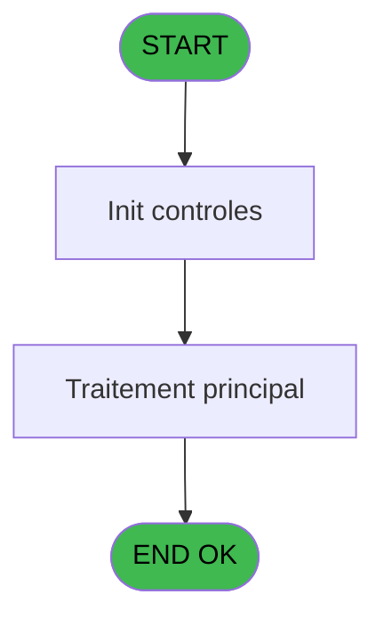
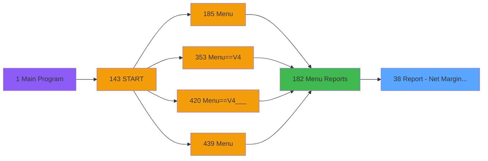
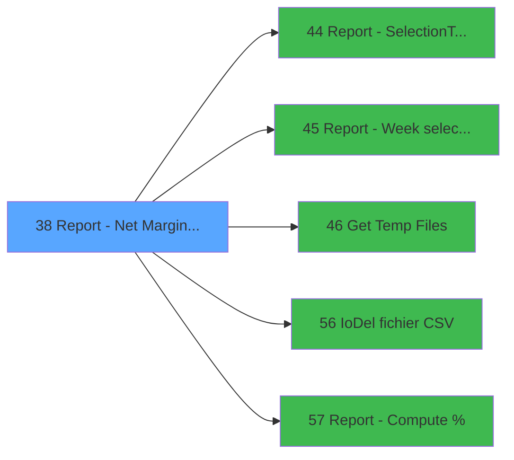

# PVE IDE 38 - Report - Net Margin by Product

> **Analyse**: Phases 1-4 2026-02-03 01:24 -> 01:25 (37s) | Assemblage 01:25
> **Pipeline**: V7.2 Enrichi
> **Structure**: 4 onglets (Resume | Ecrans | Donnees | Connexions)

<!-- TAB:Resume -->

## 1. FICHE D'IDENTITE

| Attribut | Valeur |
|----------|--------|
| Projet | PVE |
| IDE Position | 38 |
| Nom Programme | Report - Net Margin by Product |
| Fichier source | `Prg_38.xml` |
| Domaine metier | General |
| Taches | 6 (0 ecrans visibles) |
| Tables modifiees | 0 |
| Programmes appeles | 5 |

## 2. DESCRIPTION FONCTIONNELLE

**Report - Net Margin by Product** assure la gestion complete de ce processus, accessible depuis [Menu Reports (IDE 182)](PVE-IDE-182.md).

Le flux de traitement s'organise en **2 blocs fonctionnels** :

- **Impression** (3 taches) : generation de tickets et documents
- **Traitement** (3 taches) : traitements metier divers

Detail : phases du traitement

#### Phase 1 : Traitement (3 taches)

- **38** - Report - Revenue before tax **[[ECRAN]](#ecran-t1)**
- **38.1.1.1** - Lines
- **38.2** - Masse salariale

Delegue a : [Get Temp Files (IDE 46)](PVE-IDE-46.md), [IoDel fichier CSV (IDE 56)](PVE-IDE-56.md), [Report - Compute % (IDE 57)](PVE-IDE-57.md)

#### Phase 2 : Impression (3 taches)

- **38.1** - Print
- **38.1.1** - EDITION
- **38.1.1.1.1** - Print Totaux

## 3. BLOCS FONCTIONNELS

### 3.1 Traitement (3 taches)

Traitements internes.

---

#### 38 - Report - Revenue before tax [[ECRAN]](#ecran-t1)

**Role** : Traitement : Report - Revenue before tax.
**Ecran** : 590 x 282 DLU (MDI) | [Voir mockup](#ecran-t1)
**Delegue a** : [Report - Selection/Tempo (IDE 44)](PVE-IDE-44.md), [Report - Week selection (IDE 45)](PVE-IDE-45.md), [Get Temp Files (IDE 46)](PVE-IDE-46.md)

---

#### 38.1.1.1 - Lines

**Role** : Traitement : Lines.
**Delegue a** : [Get Temp Files (IDE 46)](PVE-IDE-46.md), [IoDel fichier CSV (IDE 56)](PVE-IDE-56.md), [Report - Compute % (IDE 57)](PVE-IDE-57.md)

---

#### 38.2 - Masse salariale

**Role** : Traitement : Masse salariale.
**Variables liees** : M (V Masse salariale)
**Delegue a** : [Get Temp Files (IDE 46)](PVE-IDE-46.md), [IoDel fichier CSV (IDE 56)](PVE-IDE-56.md), [Report - Compute % (IDE 57)](PVE-IDE-57.md)

### 3.2 Impression (3 taches)

Generation des documents et tickets.

---

#### 38.1 - Print

**Role** : Generation du document : Print.

---

#### 38.1.1 - EDITION

**Role** : Generation du document : EDITION.
**Variables liees** : N (VAnnule Edition)

---

#### 38.1.1.1.1 - Print Totaux

**Role** : Generation du document : Print Totaux.

## 5. REGLES METIER

*(Aucune regle metier identifiee)*

## 6. CONTEXTE

- **Appele par**: [Menu Reports (IDE 182)](PVE-IDE-182.md)
- **Appelle**: 5 programmes | **Tables**: 6 (W:0 R:2 L:4) | **Taches**: 6 | **Expressions**: 8

<!-- TAB:Ecrans -->

## 8. ECRANS

*(Programme sans ecran visible)*

## 9. NAVIGATION

### 9.3 Structure hierarchique (6 taches)

| Position | Tache | Type | Dimensions | Bloc |
|----------|-------|------|------------|------|
| **38.1** | [**Report - Revenue before tax** (38)](#t1) [mockup](#ecran-t1) | MDI | 590x282 | Traitement |
| 38.1.1 | [Lines (38.1.1.1)](#t4) | MDI | - | |
| 38.1.2 | [Masse salariale (38.2)](#t6) | MDI | - | |
| **38.2** | [**Print** (38.1)](#t2) | MDI | - | Impression |
| 38.2.1 | [EDITION (38.1.1)](#t3) | MDI | - | |
| 38.2.2 | [Print Totaux (38.1.1.1.1)](#t5) | MDI | - | |

### 9.4 Algorigramme

> **Legende**: Vert = START/END OK | Rouge = END KO | Bleu = Decisions
> *Algorigramme auto-genere. Utiliser `/algorigramme` pour une synthese metier detaillee.*

<!-- TAB:Donnees -->

## 10. TABLES

### Tables utilisees (6)

| ID | Nom | Description | Type | R | W | L | Usages |
|----|-----|-------------|------|---|---|---|--------|
| 379 | pv_customer_temp |  | DB | R |   |   | 1 |
| 381 | pv_days |  | DB | R |   |   | 1 |
| 403 | pv_sellers |  | DB |   |   | L | 1 |
| 408 | pv_status |  | DB |   |   | L | 1 |
| 413 | pv_tva |  | DB |   |   | L | 1 |
| 524 | update_table_codes_log |  | TMP |   |   | L | 1 |

### Colonnes par table (1 / 2 tables avec colonnes identifiees)

Table 379 - pv_customer_temp (R) - 1 usages

| Lettre | Variable | Acces | Type |
|--------|----------|-------|------|
| A | V UC | R | Numeric |
| B | V UR | R | Numeric |
| C | V UM | R | Numeric |

Table 381 - pv_days (R) - 1 usages

*Table utilisee uniquement en Link ou aucune colonne Real identifiee dans le DataView.*

## 11. VARIABLES

### 11.1 Parametres entrants (5)

Variables recues du programme appelant ([Menu Reports (IDE 182)](PVE-IDE-182.md)).

| Lettre | Nom | Type | Usage dans |
|--------|-----|------|-----------|
| A | P. Village Name | Alpha | - |
| B | P. Currency | Alpha | - |
| C | P. Masque | Alpha | - |
| D | P. Masque sans Z | Alpha | - |
| E | P. Decimales | Numeric | - |

### 11.2 Variables de session (7)

Variables persistantes pendant toute la session.

| Lettre | Nom | Type | Usage dans |
|--------|-----|------|-----------|
| F | V Période nombre JH | Numeric | - |
| G | V Jours période | Numeric | - |
| H | V Date mini | Date | - |
| I | V Date maxi | Date | - |
| J | V YYYYWW | Numeric | - |
| M | V Masse salariale | Numeric | - |
| O | v.NomFichierPdf | Alpha | 1x session |

### 11.3 Autres (3)

Variables diverses.

| Lettre | Nom | Type | Usage dans |
|--------|-----|------|-----------|
| K | Param Mode Global / Détail | Alpha | - |
| L | S | Alpha | 2x refs |
| N | VAnnule Edition | Logical | [38.1.1](#t3) |

## 12. EXPRESSIONS

**8 / 8 expressions decodees (100%)**

### 12.1 Repartition par type

| Type | Expressions | Regles |
|------|-------------|--------|
| CONSTANTE | 1 | 0 |
| CONCATENATION | 1 | 0 |
| REFERENCE_VG | 1 | 0 |
| CAST_LOGIQUE | 2 | 0 |
| OTHER | 1 | 0 |
| NEGATION | 1 | 0 |
| STRING | 1 | 0 |

### 12.2 Expressions cles par type

#### CONSTANTE (1 expressions)

| Type | IDE | Expression | Regle |
|------|-----|------------|-------|
| CONSTANTE | 1 | `'D'` | - |

#### CONCATENATION (1 expressions)

| Type | IDE | Expression | Regle |
|------|-----|------------|-------|
| CONCATENATION | 6 | `Translate ('%club_exportdata%')&Trim (GetParam ('VILLAGECODE'))&Trim (GetParam ('SERVICE'))&'_NET_MARGIN_BY_PRODUCT_'&DStr (Date(),'YYYYMMDD')&'_'&TStr (Time(),'HHMMSS')&'.Pdf'` | - |

#### REFERENCE_VG (1 expressions)

| Type | IDE | Expression | Regle |
|------|-----|------------|-------|
| REFERENCE_VG | 2 | `VG37` | - |

#### CAST_LOGIQUE (2 expressions)

| Type | IDE | Expression | Regle |
|------|-----|------------|-------|
| CAST_LOGIQUE | 5 | `'TRUE'LOG` | - |
| CAST_LOGIQUE | 3 | `'FALSE'LOG` | - |

#### OTHER (1 expressions)

| Type | IDE | Expression | Regle |
|------|-----|------------|-------|
| OTHER | 4 | `NOT(VAnnule Edition [N])` | - |

#### NEGATION (1 expressions)

| Type | IDE | Expression | Regle |
|------|-----|------------|-------|
| NEGATION | 8 | `NOT (GetParam ('Output')='Printer')` | - |

#### STRING (1 expressions)

| Type | IDE | Expression | Regle |
|------|-----|------------|-------|
| STRING | 7 | `FileDelete (Trim(v.NomFichierPdf [O]))` | - |

<!-- TAB:Connexions -->

## 13. GRAPHE D'APPELS

### 13.1 Chaine depuis Main (Callers)

Main -> ... -> [Menu Reports (IDE 182)](PVE-IDE-182.md) -> **Report - Net Margin by Product (IDE 38)**

### 13.2 Callers

| IDE | Nom Programme | Nb Appels |
|-----|---------------|-----------|
| [182](PVE-IDE-182.md) | Menu Reports | 1 |

### 13.3 Callees (programmes appeles)

### 13.4 Detail Callees avec contexte

| IDE | Nom Programme | Appels | Contexte |
|-----|---------------|--------|----------|
| [44](PVE-IDE-44.md) | Report - Selection/Tempo | 1 | Selection/consultation |
| [45](PVE-IDE-45.md) | Report - Week selection | 1 | Selection/consultation |
| [46](PVE-IDE-46.md) | Get Temp Files | 1 | Recuperation donnees |
| [56](PVE-IDE-56.md) | IoDel fichier CSV | 1 | Sous-programme |
| [57](PVE-IDE-57.md) | Report - Compute % | 1 | Sous-programme |

## 14. RECOMMANDATIONS MIGRATION

### 14.1 Profil du programme

| Metrique | Valeur | Impact migration |
|----------|--------|-----------------|
| Lignes de logique | 141 | Programme compact |
| Expressions | 8 | Peu de logique |
| Tables WRITE | 0 | Impact faible |
| Sous-programmes | 5 | Peu de dependances |
| Ecrans visibles | 0 | Ecran unique ou traitement batch |
| Code desactive | 0.7% (1 / 141) | Code sain |
| Regles metier | 0 | Pas de regle identifiee |

### 14.2 Plan de migration par bloc

#### Traitement (3 taches: 1 ecran, 2 traitements)

- **Strategie** : Orchestrateur avec 1 ecrans (Razor/React) et 2 traitements backend (services).
- Les ecrans deviennent des composants UI, les traitements invisibles deviennent des services injectables.
- 5 sous-programme(s) a migrer ou a reutiliser depuis les services existants.
- Decomposer les taches en services unitaires testables.

#### Impression (3 taches: 0 ecran, 3 traitements)

- **Strategie** : Templates HTML -> PDF via wkhtmltopdf ou Puppeteer.
- `PrintService` injectable avec choix imprimante

### 14.3 Dependances critiques

| Dependance | Type | Appels | Impact |
|------------|------|--------|--------|
| [IoDel fichier CSV (IDE 56)](PVE-IDE-56.md) | Sous-programme | 1x | Normale - Sous-programme |
| [Report - Compute % (IDE 57)](PVE-IDE-57.md) | Sous-programme | 1x | Normale - Sous-programme |
| [Get Temp Files (IDE 46)](PVE-IDE-46.md) | Sous-programme | 1x | Normale - Recuperation donnees |
| [Report - Selection/Tempo (IDE 44)](PVE-IDE-44.md) | Sous-programme | 1x | Normale - Selection/consultation |
| [Report - Week selection (IDE 45)](PVE-IDE-45.md) | Sous-programme | 1x | Normale - Selection/consultation |

---
*Spec DETAILED generee par Pipeline V7.2 - 2026-02-03 01:25*
