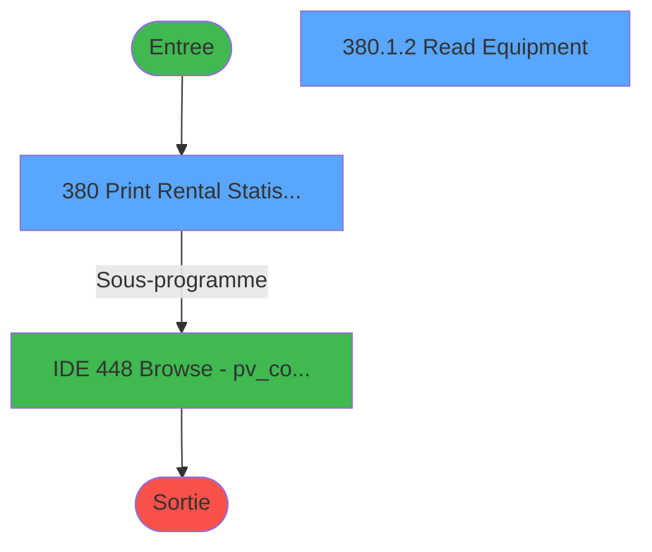
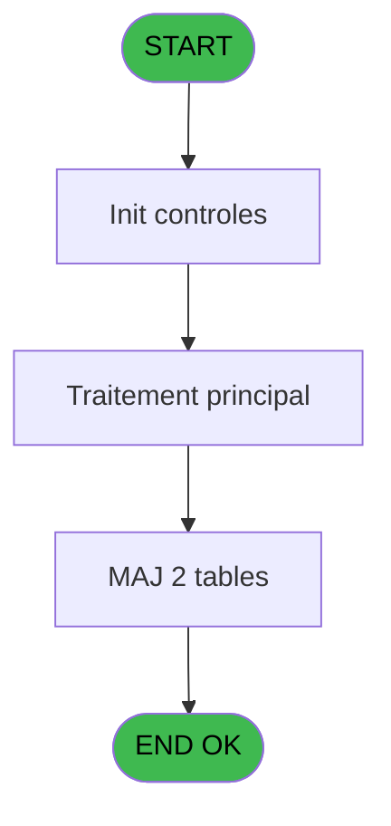

# PVE IDE 380 - Print Stat Ventes *NU*

> **Analyse**: Phases 1-4 2026-02-03 19:51 -> 19:51 (10s) | Assemblage 19:51
> **Pipeline**: V7.2 Enrichi
> **Structure**: 4 onglets (Resume | Ecrans | Donnees | Connexions)

<!-- TAB:Resume -->

## 1. FICHE D'IDENTITE

| Attribut | Valeur |
|----------|--------|
| Projet | PVE |
| IDE Position | 380 |
| Nom Programme | Print Stat Ventes *NU* |
| Fichier source | `Prg_380.xml` |
| Dossier IDE | A |
| Taches | 6 (2 ecrans visibles) |
| Tables modifiees | 2 |
| Programmes appeles | 1 |
| :warning: Statut | **ORPHELIN_POTENTIEL** |

## 2. DESCRIPTION FONCTIONNELLE

**Print Stat Ventes *NU*** assure la gestion complete de ce processus.

Le flux de traitement s'organise en **2 blocs fonctionnels** :

- **Traitement** (3 taches) : traitements metier divers
- **Impression** (3 taches) : generation de tickets et documents

**Donnees modifiees** : 2 tables en ecriture (sous-imputation_sup_100, tickets_tpe).

Detail : phases du traitement

#### Phase 1 : Impression (3 taches)

- **380** - Print Rental Statistics **[[ECRAN]](#ecran-t1)**
- **380.1** - Print
- **380.1.1** - EDITION

#### Phase 2 : Traitement (3 taches)

- **380.1.1.1** - Read Temp file
- **380.1.2** - Read Equipment **[[ECRAN]](#ecran-t5)**
- **380.1.2.1** - Read Rentals

#### Tables impactees

| Table | Operations | Role metier |
|-------|-----------|-------------|
| tickets_tpe | **W**/L (2 usages) |  |
| sous-imputation_sup_100 | **W** (1 usages) |  |

## 3. BLOCS FONCTIONNELS

### 3.1 Impression (3 taches)

Generation des documents et tickets.

---

#### 380 - Print Rental Statistics [[ECRAN]](#ecran-t1)

**Role** : Generation du document : Print Rental Statistics.
**Ecran** : 312 x 173 DLU (MDI) | [Voir mockup](#ecran-t1)
**Variables liees** : C (print modelManufacturer ID)

---

#### 380.1 - Print

**Role** : Generation du document : Print.
**Variables liees** : C (print modelManufacturer ID)

---

#### 380.1.1 - EDITION

**Role** : Generation du document : EDITION.

### 3.2 Traitement (3 taches)

Traitements internes.

---

#### 380.1.1.1 - Read Temp file

**Role** : Traitement : Read Temp file.

---

#### 380.1.2 - Read Equipment [[ECRAN]](#ecran-t5)

**Role** : Traitement : Read Equipment.
**Ecran** : 480 x 64 DLU (MDI) | [Voir mockup](#ecran-t5)

---

#### 380.1.2.1 - Read Rentals

**Role** : Traitement : Read Rentals.

## 5. REGLES METIER

*(Aucune regle metier identifiee)*

## 6. CONTEXTE

- **Appele par**: (aucun)
- **Appelle**: 1 programmes | **Tables**: 5 (W:2 R:1 L:3) | **Taches**: 6 | **Expressions**: 1

<!-- TAB:Ecrans -->

## 8. ECRANS

### 8.1 Forms visibles (2 / 6)

| # | Position | Tache | Nom | Type | Largeur | Hauteur | Bloc |
|---|----------|-------|-----|------|---------|---------|------|
| 1 | 380 | 380 | Print Rental Statistics | MDI | 312 | 173 | Impression |
| 2 | 380.1.2 | 380.1.2 | Read Equipment | MDI | 480 | 64 | Traitement |

### 8.2 Mockups Ecrans

---

#### 380 - Print Rental Statistics
**Tache** : [380](#t1) | **Type** : MDI | **Dimensions** : 312 x 173 DLU
**Bloc** : Impression | **Titre IDE** : Print Rental Statistics

<!-- FORM-DATA:
{
    "width":  312,
    "vFactor":  8,
    "type":  "MDI",
    "hFactor":  4,
    "controls":  [
                     {
                         "x":  16,
                         "type":  "label",
                         "var":  "",
                         "y":  59,
                         "w":  281,
                         "fmt":  "",
                         "name":  "",
                         "h":  8,
                         "color":  "187",
                         "text":  "Select the range of starting dates for  customer begin of stay",
                         "parent":  null
                     },
                     {
                         "x":  90,
                         "type":  "label",
                         "var":  "",
                         "y":  83,
                         "w":  48,
                         "fmt":  "",
                         "name":  "",
                         "h":  12,
                         "color":  "183",
                         "text":  "Date min",
                         "parent":  null
                     },
                     {
                         "x":  90,
                         "type":  "label",
                         "var":  "",
                         "y":  107,
                         "w":  51,
                         "fmt":  "",
                         "name":  "",
                         "h":  12,
                         "color":  "183",
                         "text":  "Date max",
                         "parent":  null
                     },
                     {
                         "x":  0,
                         "type":  "label",
                         "var":  "",
                         "y":  0,
                         "w":  312,
                         "fmt":  "",
                         "name":  "",
                         "h":  42,
                         "color":  "182",
                         "text":  "",
                         "parent":  null
                     },
                     {
                         "x":  8,
                         "type":  "label",
                         "var":  "",
                         "y":  16,
                         "w":  253,
                         "fmt":  "",
                         "name":  "",
                         "h":  10,
                         "color":  "186",
                         "text":  "Selling statistics for a specific period",
                         "parent":  6
                     },
                     {
                         "x":  0,
                         "type":  "label",
                         "var":  "",
                         "y":  139,
                         "w":  312,
                         "fmt":  "",
                         "name":  "",
                         "h":  34,
                         "color":  "6",
                         "text":  "",
                         "parent":  null
                     },
                     {
                         "x":  143,
                         "type":  "edit",
                         "var":  "",
                         "y":  83,
                         "w":  73,
                         "fmt":  "",
                         "name":  "",
                         "h":  12,
                         "color":  "110",
                         "text":  "",
                         "parent":  null
                     },
                     {
                         "x":  143,
                         "type":  "edit",
                         "var":  "",
                         "y":  107,
                         "w":  73,
                         "fmt":  "",
                         "name":  "",
                         "h":  12,
                         "color":  "110",
                         "text":  "",
                         "parent":  null
                     },
                     {
                         "x":  37,
                         "type":  "checkbox",
                         "var":  "",
                         "y":  125,
                         "w":  253,
                         "fmt":  "",
                         "name":  "",
                         "h":  14,
                         "color":  "186",
                         "text":  " Print Id of Manufacturer \u0026 Model",
                         "parent":  null
                     },
                     {
                         "x":  174,
                         "type":  "button",
                         "var":  "",
                         "y":  144,
                         "w":  68,
                         "fmt":  "Print",
                         "name":  "",
                         "h":  28,
                         "color":  "",
                         "text":  "",
                         "parent":  null
                     },
                     {
                         "x":  242,
                         "type":  "button",
                         "var":  "",
                         "y":  144,
                         "w":  68,
                         "fmt":  "Exit",
                         "name":  "",
                         "h":  28,
                         "color":  "",
                         "text":  "",
                         "parent":  null
                     },
                     {
                         "x":  262,
                         "type":  "image",
                         "var":  "",
                         "y":  4,
                         "w":  48,
                         "fmt":  "",
                         "name":  "",
                         "h":  37,
                         "color":  "",
                         "text":  "",
                         "parent":  8
                     }
                 ],
    "taskId":  "380",
    "height":  173
}
-->

<strong>Champs : 3 champs</strong>

| Pos (x,y) | Nom | Variable | Type |
|-----------|-----|----------|------|
| 143,83 | (sans nom) | - | edit |
| 143,107 | (sans nom) | - | edit |
| 37,125 |  Print Id of Manufacturer & Model | - | checkbox |

<strong>Boutons : 2 boutons</strong>

| Bouton | Pos (x,y) | Action |
|--------|-----------|--------|
| Print | 174,144 | Lance l'impression |
| Exit | 242,144 | Quitte le programme |

---

#### 380.1.2 - Read Equipment
**Tache** : [380.1.2](#t5) | **Type** : MDI | **Dimensions** : 480 x 64 DLU
**Bloc** : Traitement | **Titre IDE** : Read Equipment

<!-- FORM-DATA:
{
    "width":  480,
    "vFactor":  8,
    "type":  "MDI",
    "hFactor":  8,
    "controls":  [
                     {
                         "x":  2,
                         "type":  "label",
                         "var":  "",
                         "y":  1,
                         "w":  472,
                         "fmt":  "",
                         "name":  "",
                         "h":  29,
                         "color":  "",
                         "text":  "",
                         "parent":  null
                     },
                     {
                         "x":  165,
                         "type":  "label",
                         "var":  "",
                         "y":  8,
                         "w":  228,
                         "fmt":  "",
                         "name":  "",
                         "h":  12,
                         "color":  "7",
                         "text":  "Please Wait ...",
                         "parent":  null
                     },
                     {
                         "x":  0,
                         "type":  "label",
                         "var":  "",
                         "y":  30,
                         "w":  472,
                         "fmt":  "",
                         "name":  "",
                         "h":  32,
                         "color":  "",
                         "text":  "",
                         "parent":  null
                     },
                     {
                         "x":  14,
                         "type":  "image",
                         "var":  "",
                         "y":  3,
                         "w":  72,
                         "fmt":  "",
                         "name":  "",
                         "h":  25,
                         "color":  "",
                         "text":  "",
                         "parent":  null
                     },
                     {
                         "x":  22,
                         "type":  "edit",
                         "var":  "",
                         "y":  39,
                         "w":  441,
                         "fmt":  "",
                         "name":  "",
                         "h":  10,
                         "color":  "",
                         "text":  "",
                         "parent":  4
                     }
                 ],
    "taskId":  "380.1.2",
    "height":  64
}
-->

<strong>Champs : 1 champs</strong>

| Pos (x,y) | Nom | Variable | Type |
|-----------|-----|----------|------|
| 22,39 | (sans nom) | - | edit |

## 9. NAVIGATION

### 9.1 Enchainement des ecrans

**Detail par enchainement :**

| Depuis | Action | Vers | Retour |
|--------|--------|------|--------|
| Print Rental Statistics | Sous-programme | [Browse - pv_comptab_temp (IDE 448)](PVE-IDE-448.md) | Retour ecran |

### 9.3 Structure hierarchique (6 taches)

| Position | Tache | Type | Dimensions | Bloc |
|----------|-------|------|------------|------|
| **380.1** | [**Print Rental Statistics** (380)](#t1) [mockup](#ecran-t1) | MDI | 312x173 | Impression |
| 380.1.1 | [Print (380.1)](#t2) | MDI | - | |
| 380.1.2 | [EDITION (380.1.1)](#t3) | MDI | - | |
| **380.2** | [**Read Temp file** (380.1.1.1)](#t4) | MDI | - | Traitement |
| 380.2.1 | [Read Equipment (380.1.2)](#t5) [mockup](#ecran-t5) | MDI | 480x64 | |
| 380.2.2 | [Read Rentals (380.1.2.1)](#t6) | MDI | - | |

### 9.4 Algorigramme

> **Legende**: Vert = START/END OK | Rouge = END KO | Bleu = Decisions
> *Algorigramme auto-genere. Utiliser `/algorigramme` pour une synthese metier detaillee.*

<!-- TAB:Donnees -->

## 10. TABLES

### Tables utilisees (5)

| ID | Nom | Description | Type | R | W | L | Usages |
|----|-----|-------------|------|---|---|---|--------|
| 388 | pv_hotel_days |  | DB |   |   | L | 1 |
| 389 | pv_equipment_inventory |  | DB | R |   |   | 1 |
| 398 | pv_prestations | Prestations/services vendus | DB |   |   | L | 1 |
| 537 | sous-imputation_sup_100 |  | TMP |   | **W** |   | 1 |
| 538 | tickets_tpe |  | TMP |   | **W** | L | 2 |

### Colonnes par table (0 / 3 tables avec colonnes identifiees)

Table 389 - pv_equipment_inventory (R) - 1 usages

*Table utilisee uniquement en Link ou aucune colonne Real identifiee dans le DataView.*

Table 537 - sous-imputation_sup_100 (**W**) - 1 usages

*Table utilisee uniquement en Link ou aucune colonne Real identifiee dans le DataView.*

Table 538 - tickets_tpe (**W**/L) - 2 usages

*Table utilisee uniquement en Link ou aucune colonne Real identifiee dans le DataView.*

## 11. VARIABLES

### 11.1 Autres (3)

Variables diverses.

| Lettre | Nom | Type | Usage dans |
|--------|-----|------|-----------|
| A | Date mini | Date | - |
| B | Date maxi | Date | - |
| C | print modelManufacturer ID | Logical | - |

## 12. EXPRESSIONS

**1 / 1 expressions decodees (100%)**

### 12.1 Repartition par type

| Type | Expressions | Regles |
|------|-------------|--------|
| DATE | 1 | 0 |

### 12.2 Expressions cles par type

#### DATE (1 expressions)

| Type | IDE | Expression | Regle |
|------|-----|------------|-------|
| DATE | 1 | `Date ()` | - |

<!-- TAB:Connexions -->

## 13. GRAPHE D'APPELS

### 13.1 Chaine depuis Main (Callers)

**Chemin**: (pas de callers directs)

### 13.2 Callers

| IDE | Nom Programme | Nb Appels |
|-----|---------------|-----------|
| - | (aucun) | - |

### 13.3 Callees (programmes appeles)

### 13.4 Detail Callees avec contexte

| IDE | Nom Programme | Appels | Contexte |
|-----|---------------|--------|----------|
| [448](PVE-IDE-448.md) | Browse - pv_comptab_temp | 1 | Sous-programme |

## 14. RECOMMANDATIONS MIGRATION

### 14.1 Profil du programme

| Metrique | Valeur | Impact migration |
|----------|--------|-----------------|
| Lignes de logique | 72 | Programme compact |
| Expressions | 1 | Peu de logique |
| Tables WRITE | 2 | Impact faible |
| Sous-programmes | 1 | Peu de dependances |
| Ecrans visibles | 2 | Quelques ecrans |
| Code desactive | 0% (0 / 72) | Code sain |
| Regles metier | 0 | Pas de regle identifiee |

### 14.2 Plan de migration par bloc

#### Impression (3 taches: 1 ecran, 2 traitements)

- **Strategie** : Templates HTML -> PDF via wkhtmltopdf ou Puppeteer.
- `PrintService` injectable avec choix imprimante

#### Traitement (3 taches: 1 ecran, 2 traitements)

- **Strategie** : Orchestrateur avec 1 ecrans (Razor/React) et 2 traitements backend (services).
- Les ecrans deviennent des composants UI, les traitements invisibles deviennent des services injectables.
- 1 sous-programme(s) a migrer ou a reutiliser depuis les services existants.
- Decomposer les taches en services unitaires testables.

### 14.3 Dependances critiques

| Dependance | Type | Appels | Impact |
|------------|------|--------|--------|
| sous-imputation_sup_100 | Table WRITE (Temp) | 1x | Schema + repository |
| tickets_tpe | Table WRITE (Temp) | 1x | Schema + repository |
| [Browse - pv_comptab_temp (IDE 448)](PVE-IDE-448.md) | Sous-programme | 1x | Normale - Sous-programme |

---
*Spec DETAILED generee par Pipeline V7.2 - 2026-02-03 19:51*
