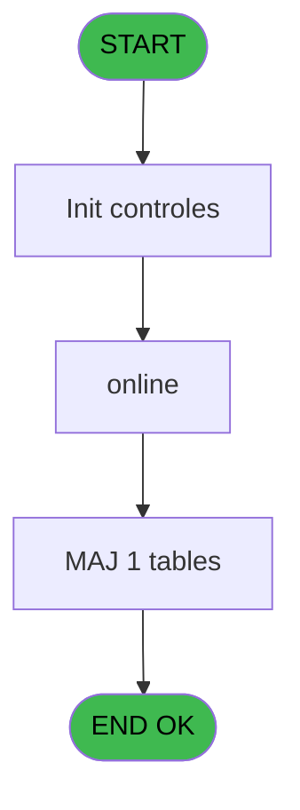
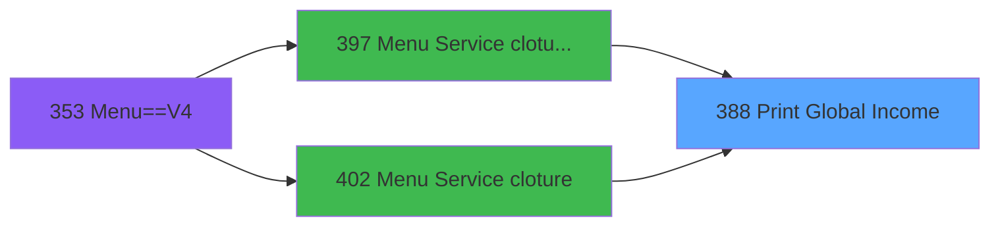

# PVE IDE 388 - Print Global Income

> **Analyse**: Phases 1-4 2026-02-03 19:53 -> 19:54 (11s) | Assemblage 19:54
> **Pipeline**: V7.2 Enrichi
> **Structure**: 4 onglets (Resume | Ecrans | Donnees | Connexions)

<!-- TAB:Resume -->

## 1. FICHE D'IDENTITE

| Attribut | Valeur |
|----------|--------|
| Projet | PVE |
| IDE Position | 388 |
| Nom Programme | Print Global Income |
| Fichier source | `Prg_388.xml` |
| Dossier IDE | A |
| Taches | 13 (1 ecrans visibles) |
| Tables modifiees | 1 |
| Programmes appeles | 1 |

## 2. DESCRIPTION FONCTIONNELLE

**Print Global Income** assure la gestion complete de ce processus, accessible depuis [Menu Service cloture v2 (IDE 397)](PVE-IDE-397.md), [Menu Service cloture (IDE 402)](PVE-IDE-402.md).

Le flux de traitement s'organise en **4 blocs fonctionnels** :

- **Traitement** (7 taches) : traitements metier divers
- **Impression** (4 taches) : generation de tickets et documents
- **Calcul** (1 tache) : calculs de montants, stocks ou compteurs
- **Consultation** (1 tache) : ecrans de recherche, selection et consultation

**Donnees modifiees** : 1 tables en ecriture (update_table_codes_log).

Detail : phases du traitement

#### Phase 1 : Impression (4 taches)

- **388** - Print Global Income **[[ECRAN]](#ecran-t1)**
- **388.2** - Print
- **388.2.2** - EDITION
- **388.2.2.1.2** - Print Totaux

#### Phase 2 : Traitement (7 taches)

- **388.1** - Global Income **[[ECRAN]](#ecran-t2)**
- **388.2.1.1.1** - Temp generation
- **388.2.1.1.1.1** - Temp generation
- **388.2.2.1** - Lines
- **388.2.2.1.1** - Total
- **388.2.2.1.2.1** - Read Total
- **388.2.2.1.2.2** - Refund

#### Phase 3 : Consultation (1 tache)

- **388.2.1** - SELECTION

#### Phase 4 : Calcul (1 tache)

- **388.2.1.1** - Selection compta

Delegue a : [Browse - pv_comptab_temp (IDE 448)](PVE-IDE-448.md)

#### Tables impactees

| Table | Operations | Role metier |
|-------|-----------|-------------|
| update_table_codes_log | R/**W**/L (6 usages) |  |

## 3. BLOCS FONCTIONNELS

### 3.1 Impression (4 taches)

Generation des documents et tickets.

---

#### 388 - Print Global Income [[ECRAN]](#ecran-t1)

**Role** : Generation du document : Print Global Income.
**Ecran** : 312 x 173 DLU (MDI) | [Voir mockup](#ecran-t1)

3 sous-taches directes

| Tache | Nom | Bloc |
|-------|-----|------|
| [388.2](#t3) | Print | Impression |
| [388.2.2](#t8) | EDITION | Impression |
| [388.2.2.1.2](#t11) | Print Totaux | Impression |

**Variables liees** : E (V Mode Global / Détail)

---

#### 388.2 - Print

**Role** : Generation du document : Print.

---

#### 388.2.2 - EDITION

**Role** : Generation du document : EDITION.

---

#### 388.2.2.1.2 - Print Totaux

**Role** : Generation du document : Print Totaux.

### 3.2 Traitement (7 taches)

Traitements internes.

---

#### 388.1 - Global Income [[ECRAN]](#ecran-t2)

**Role** : Traitement : Global Income.
**Ecran** : 312 x 173 DLU (MDI) | [Voir mockup](#ecran-t2)
**Variables liees** : E (V Mode Global / Détail)

---

#### 388.2.1.1.1 - Temp generation

**Role** : Traitement : Temp generation.

---

#### 388.2.1.1.1.1 - Temp generation

**Role** : Traitement : Temp generation.

---

#### 388.2.2.1 - Lines

**Role** : Traitement : Lines.

---

#### 388.2.2.1.1 - Total

**Role** : Traitement : Total.

---

#### 388.2.2.1.2.1 - Read Total

**Role** : Traitement : Read Total.

---

#### 388.2.2.1.2.2 - Refund

**Role** : Traitement : Refund.

### 3.3 Consultation (1 tache)

Ecrans de recherche et consultation.

---

#### 388.2.1 - SELECTION

**Role** : Selection par l'operateur : SELECTION.

### 3.4 Calcul (1 tache)

Calculs metier : montants, stocks, compteurs.

---

#### 388.2.1.1 - Selection compta

**Role** : Selection par l'operateur : Selection compta.
**Delegue a** : [Browse - pv_comptab_temp (IDE 448)](PVE-IDE-448.md)

## 5. REGLES METIER

*(Aucune regle metier identifiee)*

## 6. CONTEXTE

- **Appele par**: [Menu Service cloture v2 (IDE 397)](PVE-IDE-397.md), [Menu Service cloture (IDE 402)](PVE-IDE-402.md)
- **Appelle**: 1 programmes | **Tables**: 6 (W:1 R:4 L:3) | **Taches**: 13 | **Expressions**: 3

<!-- TAB:Ecrans -->

## 8. ECRANS

### 8.1 Forms visibles (1 / 13)

| # | Position | Tache | Nom | Type | Largeur | Hauteur | Bloc |
|---|----------|-------|-----|------|---------|---------|------|
| 1 | 388.1 | 388.1 | Global Income | MDI | 312 | 173 | Traitement |

### 8.2 Mockups Ecrans

---

#### 388.1 - Global Income
**Tache** : [388.1](#t2) | **Type** : MDI | **Dimensions** : 312 x 173 DLU
**Bloc** : Traitement | **Titre IDE** : Global Income

<!-- FORM-DATA:
{
    "width":  312,
    "vFactor":  8,
    "type":  "MDI",
    "hFactor":  4,
    "controls":  [
                     {
                         "x":  18,
                         "type":  "label",
                         "var":  "",
                         "y":  58,
                         "w":  265,
                         "fmt":  "",
                         "name":  "",
                         "h":  10,
                         "color":  "187",
                         "text":  "Select the accounting period you want to print",
                         "parent":  null
                     },
                     {
                         "x":  93,
                         "type":  "label",
                         "var":  "",
                         "y":  82,
                         "w":  48,
                         "fmt":  "",
                         "name":  "",
                         "h":  12,
                         "color":  "183",
                         "text":  "Date min",
                         "parent":  null
                     },
                     {
                         "x":  93,
                         "type":  "label",
                         "var":  "",
                         "y":  106,
                         "w":  51,
                         "fmt":  "",
                         "name":  "",
                         "h":  12,
                         "color":  "183",
                         "text":  "Date max",
                         "parent":  null
                     },
                     {
                         "x":  0,
                         "type":  "label",
                         "var":  "",
                         "y":  0,
                         "w":  312,
                         "fmt":  "",
                         "name":  "",
                         "h":  42,
                         "color":  "182",
                         "text":  "",
                         "parent":  null
                     },
                     {
                         "x":  13,
                         "type":  "label",
                         "var":  "",
                         "y":  16,
                         "w":  243,
                         "fmt":  "",
                         "name":  "",
                         "h":  10,
                         "color":  "186",
                         "text":  "Global income for an accounting period",
                         "parent":  6
                     },
                     {
                         "x":  0,
                         "type":  "label",
                         "var":  "",
                         "y":  139,
                         "w":  312,
                         "fmt":  "",
                         "name":  "",
                         "h":  34,
                         "color":  "6",
                         "text":  "",
                         "parent":  null
                     },
                     {
                         "x":  146,
                         "type":  "edit",
                         "var":  "",
                         "y":  82,
                         "w":  73,
                         "fmt":  "",
                         "name":  "",
                         "h":  12,
                         "color":  "110",
                         "text":  "",
                         "parent":  null
                     },
                     {
                         "x":  146,
                         "type":  "edit",
                         "var":  "",
                         "y":  106,
                         "w":  73,
                         "fmt":  "",
                         "name":  "",
                         "h":  12,
                         "color":  "110",
                         "text":  "",
                         "parent":  null
                     },
                     {
                         "x":  174,
                         "type":  "button",
                         "var":  "",
                         "y":  144,
                         "w":  68,
                         "fmt":  "\u0026Print",
                         "name":  "",
                         "h":  28,
                         "color":  "",
                         "text":  "",
                         "parent":  null
                     },
                     {
                         "x":  242,
                         "type":  "button",
                         "var":  "",
                         "y":  144,
                         "w":  68,
                         "fmt":  "\u0026Exit",
                         "name":  "",
                         "h":  28,
                         "color":  "",
                         "text":  "",
                         "parent":  null
                     },
                     {
                         "x":  262,
                         "type":  "image",
                         "var":  "",
                         "y":  4,
                         "w":  48,
                         "fmt":  "",
                         "name":  "",
                         "h":  37,
                         "color":  "",
                         "text":  "",
                         "parent":  6
                     }
                 ],
    "taskId":  "388.1",
    "height":  173
}
-->

<strong>Champs : 2 champs</strong>

| Pos (x,y) | Nom | Variable | Type |
|-----------|-----|----------|------|
| 146,82 | (sans nom) | - | edit |
| 146,106 | (sans nom) | - | edit |

<strong>Boutons : 2 boutons</strong>

| Bouton | Pos (x,y) | Action |
|--------|-----------|--------|
| Print | 174,144 | Lance l'impression |
| Exit | 242,144 | Quitte le programme |

## 9. NAVIGATION

Ecran unique: **Global Income**

### 9.3 Structure hierarchique (13 taches)

| Position | Tache | Type | Dimensions | Bloc |
|----------|-------|------|------------|------|
| **388.1** | [**Print Global Income** (388)](#t1) [mockup](#ecran-t1) | MDI | 312x173 | Impression |
| 388.1.1 | [Print (388.2)](#t3) | MDI | - | |
| 388.1.2 | [EDITION (388.2.2)](#t8) | MDI | - | |
| 388.1.3 | [Print Totaux (388.2.2.1.2)](#t11) | MDI | - | |
| **388.2** | [**Global Income** (388.1)](#t2) [mockup](#ecran-t2) | MDI | 312x173 | Traitement |
| 388.2.1 | [Temp generation (388.2.1.1.1)](#t6) | MDI | - | |
| 388.2.2 | [Temp generation (388.2.1.1.1.1)](#t7) | MDI | - | |
| 388.2.3 | [Lines (388.2.2.1)](#t9) | MDI | - | |
| 388.2.4 | [Total (388.2.2.1.1)](#t10) | MDI | - | |
| 388.2.5 | [Read Total (388.2.2.1.2.1)](#t12) | MDI | - | |
| 388.2.6 | [Refund (388.2.2.1.2.2)](#t13) | MDI | - | |
| **388.3** | [**SELECTION** (388.2.1)](#t4) | MDI | - | Consultation |
| **388.4** | [**Selection compta** (388.2.1.1)](#t5) | MDI | - | Calcul |

### 9.4 Algorigramme

> **Legende**: Vert = START/END OK | Rouge = END KO | Bleu = Decisions
> *Algorigramme auto-genere. Utiliser `/algorigramme` pour une synthese metier detaillee.*

<!-- TAB:Donnees -->

## 10. TABLES

### Tables utilisees (6)

| ID | Nom | Description | Type | R | W | L | Usages |
|----|-----|-------------|------|---|---|---|--------|
| 379 | pv_customer_temp |  | DB | R |   |   | 2 |
| 413 | pv_tva |  | DB |   |   | L | 1 |
| 420 | req_dispatch |  | DB | R |   |   | 1 |
| 523 | synthese_garanties | Depots et garanties | TMP | R |   |   | 1 |
| 524 | update_table_codes_log |  | TMP | R | **W** | L | 6 |
| 534 | liste_des_caisses | Sessions de caisse | TMP |   |   | L | 1 |

### Colonnes par table (1 / 4 tables avec colonnes identifiees)

Table 379 - pv_customer_temp (R) - 2 usages

*Table utilisee uniquement en Link ou aucune colonne Real identifiee dans le DataView.*

Table 420 - req_dispatch (R) - 1 usages

*Table utilisee uniquement en Link ou aucune colonne Real identifiee dans le DataView.*

Table 523 - synthese_garanties (R) - 1 usages

*Table utilisee uniquement en Link ou aucune colonne Real identifiee dans le DataView.*

Table 524 - update_table_codes_log (R/**W**/L) - 6 usages

| Lettre | Variable | Acces | Type |
|--------|----------|-------|------|
| A | p. refund | W | Logical |
| B | Total General | W | Numeric |

## 11. VARIABLES

### 11.1 Parametres entrants (4)

Variables recues du programme appelant ([Menu Service cloture v2 (IDE 397)](PVE-IDE-397.md)).

| Lettre | Nom | Type | Usage dans |
|--------|-----|------|-----------|
| A | P. Masque | Alpha | - |
| B | P. Masque sans Z | Alpha | - |
| C | P. ou V Date mini | Date | 1x parametre entrant |
| D | P. ou VDate maxi | Date | 2x parametre entrant |

### 11.2 Variables de session (1)

Variables persistantes pendant toute la session.

| Lettre | Nom | Type | Usage dans |
|--------|-----|------|-----------|
| E | V Mode Global / Détail | Alpha | - |

## 12. EXPRESSIONS

**3 / 3 expressions decodees (100%)**

### 12.1 Repartition par type

| Type | Expressions | Regles |
|------|-------------|--------|
| CONDITION | 2 | 0 |
| CONSTANTE | 1 | 0 |

### 12.2 Expressions cles par type

#### CONDITION (2 expressions)

| Type | IDE | Expression | Regle |
|------|-----|------------|-------|
| CONDITION | 2 | `P. ou VDate maxi [D]<>'00/00/0000'DATE` | - |
| CONDITION | 1 | `P. ou V Date mini [C]='00/00/0000'DATE AND P. ou VDate maxi [D]='00/00/0000'DATE` | - |

#### CONSTANTE (1 expressions)

| Type | IDE | Expression | Regle |
|------|-----|------------|-------|
| CONSTANTE | 3 | `'D'` | - |

<!-- TAB:Connexions -->

## 13. GRAPHE D'APPELS

### 13.1 Chaine depuis Main (Callers)

Main -> ... -> [Menu Service cloture v2 (IDE 397)](PVE-IDE-397.md) -> **Print Global Income (IDE 388)**

Main -> ... -> [Menu Service cloture (IDE 402)](PVE-IDE-402.md) -> **Print Global Income (IDE 388)**

### 13.2 Callers

| IDE | Nom Programme | Nb Appels |
|-----|---------------|-----------|
| [397](PVE-IDE-397.md) | Menu Service cloture v2 | 1 |
| [402](PVE-IDE-402.md) | Menu Service cloture | 1 |

### 13.3 Callees (programmes appeles)

### 13.4 Detail Callees avec contexte

| IDE | Nom Programme | Appels | Contexte |
|-----|---------------|--------|----------|
| [448](PVE-IDE-448.md) | Browse - pv_comptab_temp | 1 | Sous-programme |

## 14. RECOMMANDATIONS MIGRATION

### 14.1 Profil du programme

| Metrique | Valeur | Impact migration |
|----------|--------|-----------------|
| Lignes de logique | 185 | Programme compact |
| Expressions | 3 | Peu de logique |
| Tables WRITE | 1 | Impact faible |
| Sous-programmes | 1 | Peu de dependances |
| Ecrans visibles | 1 | Ecran unique ou traitement batch |
| Code desactive | 1.1% (2 / 185) | Code sain |
| Regles metier | 0 | Pas de regle identifiee |

### 14.2 Plan de migration par bloc

#### Impression (4 taches: 1 ecran, 3 traitements)

- **Strategie** : Templates HTML -> PDF via wkhtmltopdf ou Puppeteer.
- `PrintService` injectable avec choix imprimante

#### Traitement (7 taches: 1 ecran, 6 traitements)

- **Strategie** : Orchestrateur avec 1 ecrans (Razor/React) et 6 traitements backend (services).
- Les ecrans deviennent des composants UI, les traitements invisibles deviennent des services injectables.
- 1 sous-programme(s) a migrer ou a reutiliser depuis les services existants.
- Decomposer les taches en services unitaires testables.

#### Consultation (1 tache: 0 ecran, 1 traitement)

- **Strategie** : Composants de recherche/selection en modales.

#### Calcul (1 tache: 0 ecran, 1 traitement)

- **Strategie** : Services de calcul purs (Domain Services).
- Migrer la logique de calcul (stock, compteurs, montants)

### 14.3 Dependances critiques

| Dependance | Type | Appels | Impact |
|------------|------|--------|--------|
| update_table_codes_log | Table WRITE (Temp) | 2x | Schema + repository |
| [Browse - pv_comptab_temp (IDE 448)](PVE-IDE-448.md) | Sous-programme | 1x | Normale - Sous-programme |

---
*Spec DETAILED generee par Pipeline V7.2 - 2026-02-03 19:54*
