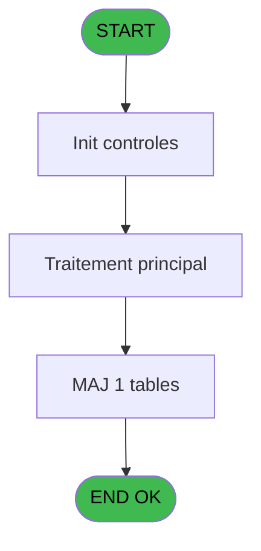
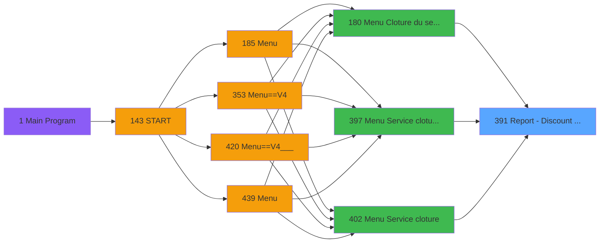
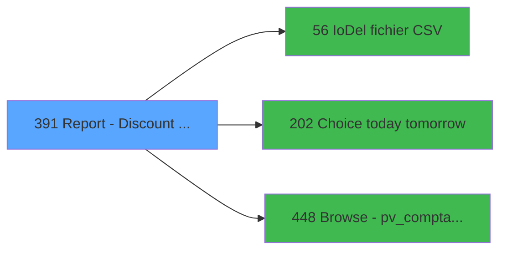

# PVE IDE 391 - Report - Discount & Gratuities

> **Analyse**: Phases 1-4 2026-02-03 19:54 -> 19:54 (11s) | Assemblage 19:54
> **Pipeline**: V7.2 Enrichi
> **Structure**: 4 onglets (Resume | Ecrans | Donnees | Connexions)

<!-- TAB:Resume -->

## 1. FICHE D'IDENTITE

| Attribut | Valeur |
|----------|--------|
| Projet | PVE |
| IDE Position | 391 |
| Nom Programme | Report - Discount & Gratuities |
| Fichier source | `Prg_391.xml` |
| Dossier IDE | A |
| Taches | 11 (0 ecrans visibles) |
| Tables modifiees | 1 |
| Programmes appeles | 3 |

## 2. DESCRIPTION FONCTIONNELLE

**Report - Discount & Gratuities** assure la gestion complete de ce processus, accessible depuis [Menu Cloture du service (IDE 180)](PVE-IDE-180.md), [Menu Service cloture v2 (IDE 397)](PVE-IDE-397.md), [Menu Service cloture (IDE 402)](PVE-IDE-402.md).

Le flux de traitement s'organise en **4 blocs fonctionnels** :

- **Traitement** (4 taches) : traitements metier divers
- **Impression** (4 taches) : generation de tickets et documents
- **Calcul** (2 taches) : calculs de montants, stocks ou compteurs
- **Consultation** (1 tache) : ecrans de recherche, selection et consultation

**Donnees modifiees** : 1 tables en ecriture (logement_par_village).

Detail : phases du traitement

#### Phase 1 : Impression (4 taches)

- **391** - Print Discounts **[[ECRAN]](#ecran-t1)**
- **391.1** - Print
- **391.1.1** - Printing
- **391.1.3** - Printing

#### Phase 2 : Traitement (4 taches)

- **391.1.1.1** - Discount line
- **391.1.2.2.1** - Temp generation
- **391.1.2.3** - Temp generation
- **391.1.3.1** - Discount line

Delegue a : [IoDel fichier CSV (IDE 56)](PVE-IDE-56.md), [Choice today tomorrow (IDE 202)](PVE-IDE-202.md)

#### Phase 3 : Consultation (1 tache)

- **391.1.2** - SELECTION

#### Phase 4 : Calcul (2 taches)

- **391.1.2.1** - Selection compta
- **391.1.2.2** - Selection compta

Delegue a : [Browse - pv_comptab_temp (IDE 448)](PVE-IDE-448.md)

#### Tables impactees

| Table | Operations | Role metier |
|-------|-----------|-------------|
| logement_par_village | R/**W** (4 usages) |  |

## 3. BLOCS FONCTIONNELS

### 3.1 Impression (4 taches)

Generation des documents et tickets.

---

#### 391 - Print Discounts [[ECRAN]](#ecran-t1)

**Role** : Generation du document : Print Discounts.
**Ecran** : 312 x 173 DLU (MDI) | [Voir mockup](#ecran-t1)

3 sous-taches directes

| Tache | Nom | Bloc |
|-------|-----|------|
| [391.1](#t2) | Print | Impression |
| [391.1.1](#t3) | Printing | Impression |
| [391.1.3](#t10) | Printing | Impression |

---

#### 391.1 - Print

**Role** : Generation du document : Print.

---

#### 391.1.1 - Printing

**Role** : Generation du document : Printing.

---

#### 391.1.3 - Printing

**Role** : Generation du document : Printing.

### 3.2 Traitement (4 taches)

Traitements internes.

---

#### 391.1.1.1 - Discount line

**Role** : Traitement : Discount line.
**Delegue a** : [IoDel fichier CSV (IDE 56)](PVE-IDE-56.md), [Choice today tomorrow (IDE 202)](PVE-IDE-202.md)

---

#### 391.1.2.2.1 - Temp generation

**Role** : Traitement : Temp generation.
**Delegue a** : [IoDel fichier CSV (IDE 56)](PVE-IDE-56.md), [Choice today tomorrow (IDE 202)](PVE-IDE-202.md)

---

#### 391.1.2.3 - Temp generation

**Role** : Traitement : Temp generation.
**Delegue a** : [IoDel fichier CSV (IDE 56)](PVE-IDE-56.md), [Choice today tomorrow (IDE 202)](PVE-IDE-202.md)

---

#### 391.1.3.1 - Discount line

**Role** : Traitement : Discount line.
**Delegue a** : [IoDel fichier CSV (IDE 56)](PVE-IDE-56.md), [Choice today tomorrow (IDE 202)](PVE-IDE-202.md)

### 3.3 Consultation (1 tache)

Ecrans de recherche et consultation.

---

#### 391.1.2 - SELECTION

**Role** : Selection par l'operateur : SELECTION.

### 3.4 Calcul (2 taches)

Calculs metier : montants, stocks, compteurs.

---

#### 391.1.2.1 - Selection compta

**Role** : Selection par l'operateur : Selection compta.
**Delegue a** : [Browse - pv_comptab_temp (IDE 448)](PVE-IDE-448.md)

---

#### 391.1.2.2 - Selection compta

**Role** : Selection par l'operateur : Selection compta.
**Delegue a** : [Browse - pv_comptab_temp (IDE 448)](PVE-IDE-448.md)

## 5. REGLES METIER

*(Aucune regle metier identifiee)*

## 6. CONTEXTE

- **Appele par**: [Menu Cloture du service (IDE 180)](PVE-IDE-180.md), [Menu Service cloture v2 (IDE 397)](PVE-IDE-397.md), [Menu Service cloture (IDE 402)](PVE-IDE-402.md)
- **Appelle**: 3 programmes | **Tables**: 11 (W:1 R:3 L:8) | **Taches**: 11 | **Expressions**: 3

<!-- TAB:Ecrans -->

## 8. ECRANS

*(Programme sans ecran visible)*

## 9. NAVIGATION

### 9.3 Structure hierarchique (11 taches)

| Position | Tache | Type | Dimensions | Bloc |
|----------|-------|------|------------|------|
| **391.1** | [**Print Discounts** (391)](#t1) [mockup](#ecran-t1) | MDI | 312x173 | Impression |
| 391.1.1 | [Print (391.1)](#t2) | MDI | - | |
| 391.1.2 | [Printing (391.1.1)](#t3) | MDI | - | |
| 391.1.3 | [Printing (391.1.3)](#t10) | MDI | - | |
| **391.2** | [**Discount line** (391.1.1.1)](#t4) | MDI | - | Traitement |
| 391.2.1 | [Temp generation (391.1.2.2.1)](#t8) | MDI | - | |
| 391.2.2 | [Temp generation (391.1.2.3)](#t9) | - | - | |
| 391.2.3 | [Discount line (391.1.3.1)](#t11) | MDI | - | |
| **391.3** | [**SELECTION** (391.1.2)](#t5) | MDI | - | Consultation |
| **391.4** | [**Selection compta** (391.1.2.1)](#t6) | MDI | - | Calcul |
| 391.4.1 | [Selection compta (391.1.2.2)](#t7) | MDI | - | |

### 9.4 Algorigramme

> **Legende**: Vert = START/END OK | Rouge = END KO | Bleu = Decisions
> *Algorigramme auto-genere. Utiliser `/algorigramme` pour une synthese metier detaillee.*

<!-- TAB:Donnees -->

## 10. TABLES

### Tables utilisees (11)

| ID | Nom | Description | Type | R | W | L | Usages |
|----|-----|-------------|------|---|---|---|--------|
| 30 | gm-recherche_____gmr | Index de recherche | DB |   |   | L | 1 |
| 31 | gm-complet_______gmc |  | DB |   |   | L | 1 |
| 38 | comptable_gratuite |  | DB |   |   | L | 1 |
| 386 | ski_frame |  | DB |   |   | L | 1 |
| 403 | pv_sellers |  | DB |   |   | L | 1 |
| 420 | req_dispatch |  | DB |   |   | L | 1 |
| 523 | synthese_garanties | Depots et garanties | TMP | R |   |   | 2 |
| 526 | liste_des_lieux |  | TMP |   |   | L | 1 |
| 528 | logement_par_village |  | TMP | R | **W** |   | 4 |
| 534 | liste_des_caisses | Sessions de caisse | TMP |   |   | L | 1 |
| 763 | pv_inv_stock | Articles et stock | DB | R |   |   | 1 |

### Colonnes par table (3 / 3 tables avec colonnes identifiees)

Table 523 - synthese_garanties (R) - 2 usages

*Table utilisee uniquement en Link ou aucune colonne Real identifiee dans le DataView.*

Table 528 - logement_par_village (R/**W**) - 4 usages

| Lettre | Variable | Acces | Type |
|--------|----------|-------|------|
| A | V.Regular_price | W | Numeric |
| B | V.Discounted price | W | Numeric |
| C | V.Total CA | W | Numeric |
| D | V.Total regular | W | Numeric |
| E | V.Total discounted | W | Numeric |

Table 763 - pv_inv_stock (R) - 1 usages

| Lettre | Variable | Acces | Type |
|--------|----------|-------|------|
| A | T.Gratuite | R | Logical |
| B | T.Credit conso | R | Logical |

## 11. VARIABLES

### 11.1 Parametres entrants (5)

Variables recues du programme appelant ([Menu Cloture du service (IDE 180)](PVE-IDE-180.md)).

| Lettre | Nom | Type | Usage dans |
|--------|-----|------|-----------|
| A | P. Village name | Alpha | - |
| B | P. Currency | Alpha | - |
| C | P. Amount format | Alpha | - |
| D | P. Amount format sans Z | Alpha | - |
| E | P. Decimales | Numeric | - |

### 11.2 Variables de session (4)

Variables persistantes pendant toute la session.

| Lettre | Nom | Type | Usage dans |
|--------|-----|------|-----------|
| F | V Période nombre JH | Numeric | - |
| G | V Jours Période | Numeric | - |
| H | V Date mini | Date | 1x session |
| I | V Date maxi | Date | 2x session |

### 11.3 Autres (1)

Variables diverses.

| Lettre | Nom | Type | Usage dans |
|--------|-----|------|-----------|
| J | S | Alpha | - |

## 12. EXPRESSIONS

**3 / 3 expressions decodees (100%)**

### 12.1 Repartition par type

| Type | Expressions | Regles |
|------|-------------|--------|
| CONDITION | 2 | 0 |
| REFERENCE_VG | 1 | 0 |

### 12.2 Expressions cles par type

#### CONDITION (2 expressions)

| Type | IDE | Expression | Regle |
|------|-----|------------|-------|
| CONDITION | 2 | `V Date maxi [I]<>'00/00/0000'DATE` | - |
| CONDITION | 1 | `V Date mini [H]='00/00/0000'DATE AND V Date maxi [I]='00/00/0000'DATE` | - |

#### REFERENCE_VG (1 expressions)

| Type | IDE | Expression | Regle |
|------|-----|------------|-------|
| REFERENCE_VG | 3 | `VG37` | - |

<!-- TAB:Connexions -->

## 13. GRAPHE D'APPELS

### 13.1 Chaine depuis Main (Callers)

Main -> ... -> [Menu Cloture du service (IDE 180)](PVE-IDE-180.md) -> **Report - Discount & Gratuities (IDE 391)**

Main -> ... -> [Menu Service cloture v2 (IDE 397)](PVE-IDE-397.md) -> **Report - Discount & Gratuities (IDE 391)**

Main -> ... -> [Menu Service cloture (IDE 402)](PVE-IDE-402.md) -> **Report - Discount & Gratuities (IDE 391)**

### 13.2 Callers

| IDE | Nom Programme | Nb Appels |
|-----|---------------|-----------|
| [180](PVE-IDE-180.md) | Menu Cloture du service | 1 |
| [397](PVE-IDE-397.md) | Menu Service cloture v2 | 1 |
| [402](PVE-IDE-402.md) | Menu Service cloture | 1 |

### 13.3 Callees (programmes appeles)

### 13.4 Detail Callees avec contexte

| IDE | Nom Programme | Appels | Contexte |
|-----|---------------|--------|----------|
| [56](PVE-IDE-56.md) | IoDel fichier CSV | 1 | Sous-programme |
| [202](PVE-IDE-202.md) | Choice today tomorrow | 1 | Sous-programme |
| [448](PVE-IDE-448.md) | Browse - pv_comptab_temp | 1 | Sous-programme |

## 14. RECOMMANDATIONS MIGRATION

### 14.1 Profil du programme

| Metrique | Valeur | Impact migration |
|----------|--------|-----------------|
| Lignes de logique | 303 | Taille moyenne |
| Expressions | 3 | Peu de logique |
| Tables WRITE | 1 | Impact faible |
| Sous-programmes | 3 | Peu de dependances |
| Ecrans visibles | 0 | Ecran unique ou traitement batch |
| Code desactive | 1% (3 / 303) | Code sain |
| Regles metier | 0 | Pas de regle identifiee |

### 14.2 Plan de migration par bloc

#### Impression (4 taches: 1 ecran, 3 traitements)

- **Strategie** : Templates HTML -> PDF via wkhtmltopdf ou Puppeteer.
- `PrintService` injectable avec choix imprimante

#### Traitement (4 taches: 0 ecran, 4 traitements)

- **Strategie** : 4 service(s) backend injectable(s) (Domain Services).
- 3 sous-programme(s) a migrer ou a reutiliser depuis les services existants.
- Decomposer les taches en services unitaires testables.

#### Consultation (1 tache: 0 ecran, 1 traitement)

- **Strategie** : Composants de recherche/selection en modales.

#### Calcul (2 taches: 0 ecran, 2 traitements)

- **Strategie** : Services de calcul purs (Domain Services).
- Migrer la logique de calcul (stock, compteurs, montants)

### 14.3 Dependances critiques

| Dependance | Type | Appels | Impact |
|------------|------|--------|--------|
| logement_par_village | Table WRITE (Temp) | 2x | Schema + repository |
| [Browse - pv_comptab_temp (IDE 448)](PVE-IDE-448.md) | Sous-programme | 1x | Normale - Sous-programme |
| [Choice today tomorrow (IDE 202)](PVE-IDE-202.md) | Sous-programme | 1x | Normale - Sous-programme |
| [IoDel fichier CSV (IDE 56)](PVE-IDE-56.md) | Sous-programme | 1x | Normale - Sous-programme |

---
*Spec DETAILED generee par Pipeline V7.2 - 2026-02-03 19:54*
