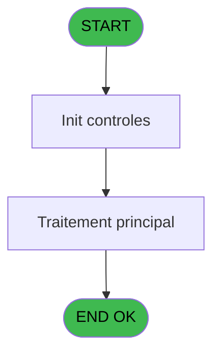
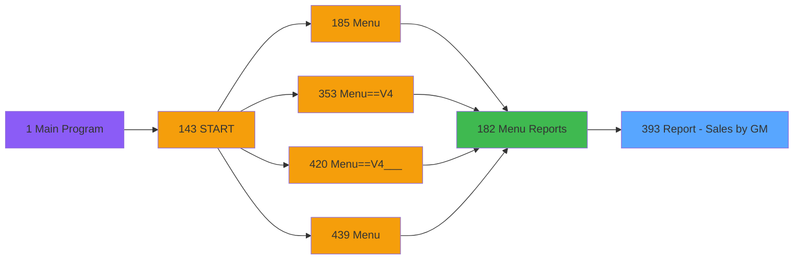
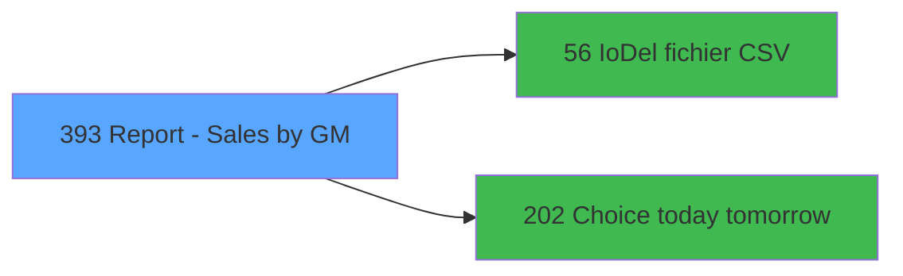

# PVE IDE 393 - Report - Sales by GM

> **Analyse**: Phases 1-4 2026-02-03 19:55 -> 19:55 (11s) | Assemblage 19:55
> **Pipeline**: V7.2 Enrichi
> **Structure**: 4 onglets (Resume | Ecrans | Donnees | Connexions)

<!-- TAB:Resume -->

## 1. FICHE D'IDENTITE

| Attribut | Valeur |
|----------|--------|
| Projet | PVE |
| IDE Position | 393 |
| Nom Programme | Report - Sales by GM |
| Fichier source | `Prg_393.xml` |
| Dossier IDE | A |
| Taches | 5 (0 ecrans visibles) |
| Tables modifiees | 0 |
| Programmes appeles | 2 |

## 2. DESCRIPTION FONCTIONNELLE

**Report - Sales by GM** assure la gestion complete de ce processus, accessible depuis [Menu Reports (IDE 182)](PVE-IDE-182.md).

Le flux de traitement s'organise en **2 blocs fonctionnels** :

- **Traitement** (3 taches) : traitements metier divers
- **Impression** (2 taches) : generation de tickets et documents

Detail : phases du traitement

#### Phase 1 : Traitement (3 taches)

- **393** - Report - Revenue before tax **[[ECRAN]](#ecran-t1)**
- **393.1.1.1** - Lines
- **393.1.1.1.1** - Total

Delegue a : [IoDel fichier CSV (IDE 56)](PVE-IDE-56.md), [Choice today tomorrow (IDE 202)](PVE-IDE-202.md)

#### Phase 2 : Impression (2 taches)

- **393.1** - Print
- **393.1.1** - EDITION

## 3. BLOCS FONCTIONNELS

### 3.1 Traitement (3 taches)

Traitements internes.

---

#### 393 - Report - Revenue before tax [[ECRAN]](#ecran-t1)

**Role** : Traitement : Report - Revenue before tax.
**Ecran** : 312 x 57 DLU (MDI) | [Voir mockup](#ecran-t1)
**Delegue a** : [IoDel fichier CSV (IDE 56)](PVE-IDE-56.md), [Choice today tomorrow (IDE 202)](PVE-IDE-202.md)

---

#### 393.1.1.1 - Lines

**Role** : Traitement : Lines.
**Delegue a** : [IoDel fichier CSV (IDE 56)](PVE-IDE-56.md), [Choice today tomorrow (IDE 202)](PVE-IDE-202.md)

---

#### 393.1.1.1.1 - Total

**Role** : Traitement : Total.
**Delegue a** : [IoDel fichier CSV (IDE 56)](PVE-IDE-56.md), [Choice today tomorrow (IDE 202)](PVE-IDE-202.md)

### 3.2 Impression (2 taches)

Generation des documents et tickets.

---

#### 393.1 - Print

**Role** : Generation du document : Print.

---

#### 393.1.1 - EDITION

**Role** : Generation du document : EDITION.

## 5. REGLES METIER

*(Aucune regle metier identifiee)*

## 6. CONTEXTE

- **Appele par**: [Menu Reports (IDE 182)](PVE-IDE-182.md)
- **Appelle**: 2 programmes | **Tables**: 2 (W:0 R:1 L:1) | **Taches**: 5 | **Expressions**: 5

<!-- TAB:Ecrans -->

## 8. ECRANS

*(Programme sans ecran visible)*

## 9. NAVIGATION

### 9.3 Structure hierarchique (5 taches)

| Position | Tache | Type | Dimensions | Bloc |
|----------|-------|------|------------|------|
| **393.1** | [**Report - Revenue before tax** (393)](#t1) [mockup](#ecran-t1) | MDI | 312x57 | Traitement |
| 393.1.1 | [Lines (393.1.1.1)](#t4) | MDI | - | |
| 393.1.2 | [Total (393.1.1.1.1)](#t5) | MDI | - | |
| **393.2** | [**Print** (393.1)](#t2) | MDI | - | Impression |
| 393.2.1 | [EDITION (393.1.1)](#t3) | MDI | - | |

### 9.4 Algorigramme

> **Legende**: Vert = START/END OK | Rouge = END KO | Bleu = Decisions
> *Algorigramme auto-genere. Utiliser `/algorigramme` pour une synthese metier detaillee.*

<!-- TAB:Donnees -->

## 10. TABLES

### Tables utilisees (2)

| ID | Nom | Description | Type | R | W | L | Usages |
|----|-----|-------------|------|---|---|---|--------|
| 395 | pv_ownership |  | DB | R |   |   | 1 |
| 396 | pv_cust_packages |  | DB |   |   | L | 1 |

### Colonnes par table (2 / 1 tables avec colonnes identifiees)

Table 395 - pv_ownership (R) - 1 usages

| Lettre | Variable | Acces | Type |
|--------|----------|-------|------|
| A | V.Total Date amount | R | Numeric |
| B | V.Nb customer | R | Numeric |
| C | V.Total General amount | R | Numeric |
| D | V.Total nb customer | R | Numeric |

## 11. VARIABLES

### 11.1 Parametres entrants (5)

Variables recues du programme appelant ([Menu Reports (IDE 182)](PVE-IDE-182.md)).

| Lettre | Nom | Type | Usage dans |
|--------|-----|------|-----------|
| A | P. Village Name | Alpha | - |
| B | P. Currency | Alpha | - |
| C | P. Masque | Alpha | - |
| D | P. Masque sans Z | Alpha | - |
| E | P. Decimales | Numeric | - |

### 11.2 Variables de session (4)

Variables persistantes pendant toute la session.

| Lettre | Nom | Type | Usage dans |
|--------|-----|------|-----------|
| F | V Date mini | Date | 1x session |
| G | V Date maxi | Date | 2x session |
| H | V Période nombre JH | Numeric | - |
| I | V Jours période | Numeric | - |

### 11.3 Autres (2)

Variables diverses.

| Lettre | Nom | Type | Usage dans |
|--------|-----|------|-----------|
| J | Param Mode Global / Détail | Alpha | - |
| K | ; | Alpha | 1x refs |

## 12. EXPRESSIONS

**5 / 5 expressions decodees (100%)**

### 12.1 Repartition par type

| Type | Expressions | Regles |
|------|-------------|--------|
| CONDITION | 2 | 0 |
| CONSTANTE | 2 | 0 |
| CAST_LOGIQUE | 1 | 0 |

### 12.2 Expressions cles par type

#### CONDITION (2 expressions)

| Type | IDE | Expression | Regle |
|------|-----|------------|-------|
| CONDITION | 2 | `V Date maxi [G]<>'00/00/0000'DATE` | - |
| CONDITION | 1 | `V Date mini [F]='00/00/0000'DATE AND V Date maxi [G]='00/00/0000'DATE` | - |

#### CONSTANTE (2 expressions)

| Type | IDE | Expression | Regle |
|------|-----|------------|-------|
| CONSTANTE | 4 | `';'` | - |
| CONSTANTE | 3 | `'D'` | - |

#### CAST_LOGIQUE (1 expressions)

| Type | IDE | Expression | Regle |
|------|-----|------------|-------|
| CAST_LOGIQUE | 5 | `'FALSE'LOG` | - |

<!-- TAB:Connexions -->

## 13. GRAPHE D'APPELS

### 13.1 Chaine depuis Main (Callers)

Main -> ... -> [Menu Reports (IDE 182)](PVE-IDE-182.md) -> **Report - Sales by GM (IDE 393)**

### 13.2 Callers

| IDE | Nom Programme | Nb Appels |
|-----|---------------|-----------|
| [182](PVE-IDE-182.md) | Menu Reports | 1 |

### 13.3 Callees (programmes appeles)

### 13.4 Detail Callees avec contexte

| IDE | Nom Programme | Appels | Contexte |
|-----|---------------|--------|----------|
| [56](PVE-IDE-56.md) | IoDel fichier CSV | 1 | Sous-programme |
| [202](PVE-IDE-202.md) | Choice today tomorrow | 1 | Sous-programme |

## 14. RECOMMANDATIONS MIGRATION

### 14.1 Profil du programme

| Metrique | Valeur | Impact migration |
|----------|--------|-----------------|
| Lignes de logique | 75 | Programme compact |
| Expressions | 5 | Peu de logique |
| Tables WRITE | 0 | Impact faible |
| Sous-programmes | 2 | Peu de dependances |
| Ecrans visibles | 0 | Ecran unique ou traitement batch |
| Code desactive | 0% (0 / 75) | Code sain |
| Regles metier | 0 | Pas de regle identifiee |

### 14.2 Plan de migration par bloc

#### Traitement (3 taches: 1 ecran, 2 traitements)

- **Strategie** : Orchestrateur avec 1 ecrans (Razor/React) et 2 traitements backend (services).
- Les ecrans deviennent des composants UI, les traitements invisibles deviennent des services injectables.
- 2 sous-programme(s) a migrer ou a reutiliser depuis les services existants.
- Decomposer les taches en services unitaires testables.

#### Impression (2 taches: 0 ecran, 2 traitements)

- **Strategie** : Templates HTML -> PDF via wkhtmltopdf ou Puppeteer.
- `PrintService` injectable avec choix imprimante

### 14.3 Dependances critiques

| Dependance | Type | Appels | Impact |
|------------|------|--------|--------|
| [Choice today tomorrow (IDE 202)](PVE-IDE-202.md) | Sous-programme | 1x | Normale - Sous-programme |
| [IoDel fichier CSV (IDE 56)](PVE-IDE-56.md) | Sous-programme | 1x | Normale - Sous-programme |

---
*Spec DETAILED generee par Pipeline V7.2 - 2026-02-03 19:55*
