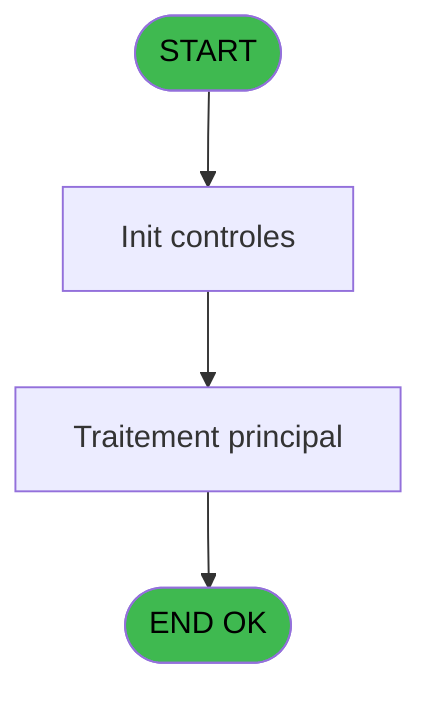
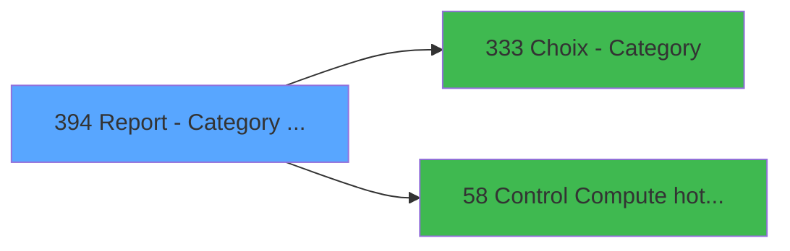

# PVE IDE 394 - Report - Category selection

> **Analyse**: Phases 1-4 2026-02-03 19:55 -> 19:55 (12s) | Assemblage 19:55
> **Pipeline**: V7.2 Enrichi
> **Structure**: 4 onglets (Resume | Ecrans | Donnees | Connexions)

<!-- TAB:Resume -->

## 1. FICHE D'IDENTITE

| Attribut | Valeur |
|----------|--------|
| Projet | PVE |
| IDE Position | 394 |
| Nom Programme | Report - Category selection |
| Fichier source | `Prg_394.xml` |
| Dossier IDE | A |
| Taches | 2 (1 ecrans visibles) |
| Tables modifiees | 0 |
| Programmes appeles | 2 |

## 2. DESCRIPTION FONCTIONNELLE

**Report - Category selection** assure la gestion complete de ce processus, accessible depuis [Report - Revenue by Product (IDE 382)](PVE-IDE-382.md).

Le flux de traitement s'organise en **2 blocs fonctionnels** :

- **Initialisation** (1 tache) : reinitialisation d'etats et de variables de travail
- **Consultation** (1 tache) : ecrans de recherche, selection et consultation

**Logique metier** : 2 regles identifiees couvrant conditions metier.

Detail : phases du traitement

#### Phase 1 : Consultation (1 tache)

- **394** - Selection **[[ECRAN]](#ecran-t1)**

Delegue a : [Choix - Category (IDE 333)](PVE-IDE-333.md)

#### Phase 2 : Initialisation (1 tache)

- **394.1** - Init cat

## 3. BLOCS FONCTIONNELS

### 3.1 Consultation (1 tache)

Ecrans de recherche et consultation.

---

#### 394 - Selection [[ECRAN]](#ecran-t1)

**Role** : Selection par l'operateur : Selection.
**Ecran** : 314 x 175 DLU (MDI) | [Voir mockup](#ecran-t1)
**Delegue a** : [Choix - Category (IDE 333)](PVE-IDE-333.md)

### 3.2 Initialisation (1 tache)

Reinitialisation d'etats et variables de travail.

---

#### 394.1 - Init cat

**Role** : Reinitialisation : Init cat.

## 5. REGLES METIER

2 regles identifiees:

### Autres (2 regles)

#### [RM-001] Si V Date Maxi [I]='00/00/0000'DATE alors V Date mini [H] sinon V Date Maxi [I])

| Element | Detail |
|---------|--------|
| **Condition** | `V Date Maxi [I]='00/00/0000'DATE` |
| **Si vrai** | V Date mini [H] |
| **Si faux** | V Date Maxi [I]) |
| **Variables** | H (V Date mini), I (V Date Maxi) |
| **Expression source** | Expression 2 : `IF (V Date Maxi [I]='00/00/0000'DATE,V Date mini [H],V Date ` |
| **Exemple** | Si V Date Maxi [I]='00/00/0000'DATE → V Date mini [H]. Sinon → V Date Maxi [I]) |

#### [RM-002] Si GetParam ('Output')='Printer' alors '&Print' sinon 'E&xtract')

| Element | Detail |
|---------|--------|
| **Condition** | `GetParam ('Output')='Printer'` |
| **Si vrai** | '&Print' |
| **Si faux** | 'E&xtract') |
| **Expression source** | Expression 15 : `IF (GetParam ('Output')='Printer','&Print','E&xtract')` |
| **Exemple** | Si GetParam ('Output')='Printer' → '&Print'. Sinon → 'E&xtract') |

## 6. CONTEXTE

- **Appele par**: [Report - Revenue by Product (IDE 382)](PVE-IDE-382.md)
- **Appelle**: 2 programmes | **Tables**: 1 (W:0 R:1 L:0) | **Taches**: 2 | **Expressions**: 15

<!-- TAB:Ecrans -->

## 8. ECRANS

### 8.1 Forms visibles (1 / 2)

| # | Position | Tache | Nom | Type | Largeur | Hauteur | Bloc |
|---|----------|-------|-----|------|---------|---------|------|
| 1 | 394 | 394 | Selection | MDI | 314 | 175 | Consultation |

### 8.2 Mockups Ecrans

---

#### 394 - Selection
**Tache** : [394](#t1) | **Type** : MDI | **Dimensions** : 314 x 175 DLU
**Bloc** : Consultation | **Titre IDE** : Selection

<!-- FORM-DATA:
{
    "width":  314,
    "vFactor":  8,
    "type":  "MDI",
    "hFactor":  4,
    "controls":  [
                     {
                         "x":  21,
                         "type":  "label",
                         "var":  "",
                         "y":  51,
                         "w":  265,
                         "fmt":  "",
                         "name":  "",
                         "h":  10,
                         "color":  "187",
                         "text":  "Select the accounting period you want to print",
                         "parent":  null
                     },
                     {
                         "x":  46,
                         "type":  "label",
                         "var":  "",
                         "y":  63,
                         "w":  48,
                         "fmt":  "",
                         "name":  "",
                         "h":  12,
                         "color":  "183",
                         "text":  "Date min",
                         "parent":  null
                     },
                     {
                         "x":  47,
                         "type":  "label",
                         "var":  "",
                         "y":  78,
                         "w":  51,
                         "fmt":  "",
                         "name":  "",
                         "h":  12,
                         "color":  "183",
                         "text":  "Date max",
                         "parent":  null
                     },
                     {
                         "x":  21,
                         "type":  "label",
                         "var":  "",
                         "y":  95,
                         "w":  265,
                         "fmt":  "",
                         "name":  "",
                         "h":  10,
                         "color":  "187",
                         "text":  "Select the range of categories you want to print",
                         "parent":  null
                     },
                     {
                         "x":  46,
                         "type":  "label",
                         "var":  "",
                         "y":  108,
                         "w":  69,
                         "fmt":  "",
                         "name":  "",
                         "h":  12,
                         "color":  "183",
                         "text":  "Category min",
                         "parent":  null
                     },
                     {
                         "x":  46,
                         "type":  "label",
                         "var":  "",
                         "y":  122,
                         "w":  72,
                         "fmt":  "",
                         "name":  "",
                         "h":  12,
                         "color":  "183",
                         "text":  "Category max",
                         "parent":  null
                     },
                     {
                         "x":  0,
                         "type":  "label",
                         "var":  "",
                         "y":  0,
                         "w":  312,
                         "fmt":  "",
                         "name":  "",
                         "h":  42,
                         "color":  "182",
                         "text":  "",
                         "parent":  null
                     },
                     {
                         "x":  14,
                         "type":  "label",
                         "var":  "",
                         "y":  14,
                         "w":  241,
                         "fmt":  "",
                         "name":  "",
                         "h":  10,
                         "color":  "186",
                         "text":  "Period and specific categories",
                         "parent":  13
                     },
                     {
                         "x":  0,
                         "type":  "label",
                         "var":  "",
                         "y":  138,
                         "w":  312,
                         "fmt":  "",
                         "name":  "",
                         "h":  35,
                         "color":  "6",
                         "text":  "",
                         "parent":  null
                     },
                     {
                         "x":  99,
                         "type":  "edit",
                         "var":  "",
                         "y":  63,
                         "w":  73,
                         "fmt":  "",
                         "name":  "",
                         "h":  12,
                         "color":  "110",
                         "text":  "",
                         "parent":  null
                     },
                     {
                         "x":  100,
                         "type":  "edit",
                         "var":  "",
                         "y":  78,
                         "w":  73,
                         "fmt":  "",
                         "name":  "",
                         "h":  12,
                         "color":  "110",
                         "text":  "",
                         "parent":  null
                     },
                     {
                         "x":  119,
                         "type":  "edit",
                         "var":  "",
                         "y":  108,
                         "w":  22,
                         "fmt":  "",
                         "name":  "CATMINI",
                         "h":  12,
                         "color":  "110",
                         "text":  "",
                         "parent":  null
                     },
                     {
                         "x":  148,
                         "type":  "edit",
                         "var":  "",
                         "y":  108,
                         "w":  152,
                         "fmt":  "",
                         "name":  "",
                         "h":  12,
                         "color":  "183",
                         "text":  "",
                         "parent":  null
                     },
                     {
                         "x":  119,
                         "type":  "edit",
                         "var":  "",
                         "y":  122,
                         "w":  22,
                         "fmt":  "",
                         "name":  "CATMAXI",
                         "h":  12,
                         "color":  "110",
                         "text":  "",
                         "parent":  null
                     },
                     {
                         "x":  149,
                         "type":  "edit",
                         "var":  "",
                         "y":  122,
                         "w":  152,
                         "fmt":  "",
                         "name":  "",
                         "h":  12,
                         "color":  "183",
                         "text":  "",
                         "parent":  null
                     },
                     {
                         "x":  172,
                         "type":  "button",
                         "var":  "",
                         "y":  144,
                         "w":  68,
                         "fmt":  "\u0026Exit",
                         "name":  "",
                         "h":  28,
                         "color":  "",
                         "text":  "",
                         "parent":  null
                     },
                     {
                         "x":  241,
                         "type":  "button",
                         "var":  "",
                         "y":  144,
                         "w":  68,
                         "fmt":  "\u0026Validate",
                         "name":  "Validate",
                         "h":  28,
                         "color":  "",
                         "text":  "",
                         "parent":  null
                     },
                     {
                         "x":  262,
                         "type":  "image",
                         "var":  "",
                         "y":  4,
                         "w":  48,
                         "fmt":  "",
                         "name":  "",
                         "h":  37,
                         "color":  "",
                         "text":  "",
                         "parent":  13
                     }
                 ],
    "taskId":  "394",
    "height":  175
}
-->

<strong>Champs : 6 champs</strong>

| Pos (x,y) | Nom | Variable | Type |
|-----------|-----|----------|------|
| 99,63 | (sans nom) | - | edit |
| 100,78 | (sans nom) | - | edit |
| 119,108 | CATMINI | - | edit |
| 148,108 | (sans nom) | - | edit |
| 119,122 | CATMAXI | - | edit |
| 149,122 | (sans nom) | - | edit |

<strong>Boutons : 2 boutons</strong>

| Bouton | Pos (x,y) | Action |
|--------|-----------|--------|
| Exit | 172,144 | Quitte le programme |
| Validate | 241,144 | Valide la saisie et enregistre |

## 9. NAVIGATION

Ecran unique: **Selection**

### 9.3 Structure hierarchique (2 taches)

| Position | Tache | Type | Dimensions | Bloc |
|----------|-------|------|------------|------|
| **394.1** | [**Selection** (394)](#t1) [mockup](#ecran-t1) | MDI | 314x175 | Consultation |
| **394.2** | [**Init cat** (394.1)](#t2) | MDI | - | Initialisation |

### 9.4 Algorigramme

> **Legende**: Vert = START/END OK | Rouge = END KO | Bleu = Decisions
> *Algorigramme auto-genere. Utiliser `/algorigramme` pour une synthese metier detaillee.*

<!-- TAB:Donnees -->

## 10. TABLES

### Tables utilisees (1)

| ID | Nom | Description | Type | R | W | L | Usages |
|----|-----|-------------|------|---|---|---|--------|
| 379 | pv_customer_temp |  | DB | R |   |   | 2 |

### Colonnes par table (1 / 1 tables avec colonnes identifiees)

Table 379 - pv_customer_temp (R) - 2 usages

| Lettre | Variable | Acces | Type |
|--------|----------|-------|------|
| A | P. Date mini | R | Date |
| B | P. Date Maxi | R | Date |
| C | P. Contrôle HD | R | Logical |
| D | P. Période nombre JH | R | Numeric |
| E | P. Jours période | R | Numeric |
| F | P. Cat mini | R | Numeric |
| G | P. Cat Maxi | R | Numeric |
| H | V Date mini | R | Date |
| I | V Date Maxi | R | Date |
| J | V Cat mini | R | Numeric |
| K | V Cat maxi | R | Numeric |
| L | V Masque sans Z | R | Alpha |
| M | V Date anomalie | R | Date |

## 11. VARIABLES

### 11.1 Parametres entrants (7)

Variables recues du programme appelant ([Report - Revenue by Product (IDE 382)](PVE-IDE-382.md)).

| Lettre | Nom | Type | Usage dans |
|--------|-----|------|-----------|
| A | P. Date mini | Date | - |
| B | P. Date Maxi | Date | - |
| C | P. Contrôle HD | Logical | 1x parametre entrant |
| D | P. Période nombre JH | Numeric | - |
| E | P. Jours période | Numeric | 1x parametre entrant |
| F | P. Cat mini | Numeric | - |
| G | P. Cat Maxi | Numeric | - |

### 11.2 Variables de session (6)

Variables persistantes pendant toute la session.

| Lettre | Nom | Type | Usage dans |
|--------|-----|------|-----------|
| H | V Date mini | Date | 3x session |
| I | V Date Maxi | Date | 3x session |
| J | V Cat mini | Numeric | 1x session |
| K | V Cat maxi | Numeric | - |
| L | V Masque sans Z | Alpha | - |
| M | V Date anomalie | Date | - |

## 12. EXPRESSIONS

**15 / 15 expressions decodees (100%)**

### 12.1 Repartition par type

| Type | Expressions | Regles |
|------|-------------|--------|
| CALCULATION | 1 | 0 |
| CONDITION | 4 | 5 |
| CONCATENATION | 1 | 5 |
| CONSTANTE | 1 | 0 |
| DATE | 2 | 0 |
| OTHER | 6 | 0 |

### 12.2 Expressions cles par type

#### CALCULATION (1 expressions)

| Type | IDE | Expression | Regle |
|------|-----|------------|-------|
| CALCULATION | 6 | `Left (Trim (GetParam ('AMOUNTFORMAT')),Len (Trim (GetParam ('AMOUNTFORMAT')))-1)` | - |

#### CONDITION (4 expressions)

| Type | IDE | Expression | Regle |
|------|-----|------------|-------|
| CONDITION | 2 | `IF (V Date Maxi [I]='00/00/0000'DATE,V Date mini [H],V Date Maxi [I])` | [RM-001](#rm-RM-001) |
| CONDITION | 10 | `P. Jours période [E]=0` | - |
| CONDITION | 9 | `V Date Maxi [I]='00/00/0000'DATE OR V Date Maxi [I]<V Date mini [H]` | - |
| CONDITION | 12 | `[S]<>'00/00/0000'DATE` | - |

#### CONCATENATION (1 expressions)

| Type | IDE | Expression | Regle |
|------|-----|------------|-------|
| CONCATENATION | 15 | `IF (GetParam ('Output')='Printer','&Print','E&xtract')` | [RM-002](#rm-RM-002) |

#### CONSTANTE (1 expressions)

| Type | IDE | Expression | Regle |
|------|-----|------------|-------|
| CONSTANTE | 8 | `0` | - |

#### DATE (2 expressions)

| Type | IDE | Expression | Regle |
|------|-----|------------|-------|
| DATE | 11 | `'No HD for '&DStr ([S],'##/##/####')` | - |
| DATE | 1 | `Date ()` | - |

#### OTHER (6 expressions)

| Type | IDE | Expression | Regle |
|------|-----|------------|-------|
| OTHER | 7 | `P. Contrôle HD [C]` | - |
| OTHER | 13 | `V Date mini [H]` | - |
| OTHER | 14 | `V Date Maxi [I]` | - |
| OTHER | 3 | `GetParam ('SERVICE')` | - |
| OTHER | 4 | `V Cat mini [J]` | - |
| ... | | *+1 autres* | |

<!-- TAB:Connexions -->

## 13. GRAPHE D'APPELS

### 13.1 Chaine depuis Main (Callers)

Main -> ... -> [Report - Revenue by Product (IDE 382)](PVE-IDE-382.md) -> **Report - Category selection (IDE 394)**

### 13.2 Callers

| IDE | Nom Programme | Nb Appels |
|-----|---------------|-----------|
| [382](PVE-IDE-382.md) | Report - Revenue by Product | 1 |

### 13.3 Callees (programmes appeles)

### 13.4 Detail Callees avec contexte

| IDE | Nom Programme | Appels | Contexte |
|-----|---------------|--------|----------|
| [333](PVE-IDE-333.md) | Choix - Category | 2 | Selection/consultation |
| [58](PVE-IDE-58.md) | Control & Compute hotel days | 1 | Sous-programme |

## 14. RECOMMANDATIONS MIGRATION

### 14.1 Profil du programme

| Metrique | Valeur | Impact migration |
|----------|--------|-----------------|
| Lignes de logique | 65 | Programme compact |
| Expressions | 15 | Peu de logique |
| Tables WRITE | 0 | Impact faible |
| Sous-programmes | 2 | Peu de dependances |
| Ecrans visibles | 1 | Ecran unique ou traitement batch |
| Code desactive | 0% (0 / 65) | Code sain |
| Regles metier | 2 | Quelques regles a preserver |

### 14.2 Plan de migration par bloc

#### Consultation (1 tache: 1 ecran, 0 traitement)

- **Strategie** : Composants de recherche/selection en modales.
- 1 ecran : Selection

#### Initialisation (1 tache: 0 ecran, 1 traitement)

- **Strategie** : Constructeur/methode `InitAsync()` dans l'orchestrateur.

### 14.3 Dependances critiques

| Dependance | Type | Appels | Impact |
|------------|------|--------|--------|
| [Choix - Category (IDE 333)](PVE-IDE-333.md) | Sous-programme | 2x | Haute - Selection/consultation |
| [Control & Compute hotel days (IDE 58)](PVE-IDE-58.md) | Sous-programme | 1x | Normale - Sous-programme |

---
*Spec DETAILED generee par Pipeline V7.2 - 2026-02-03 19:55*
