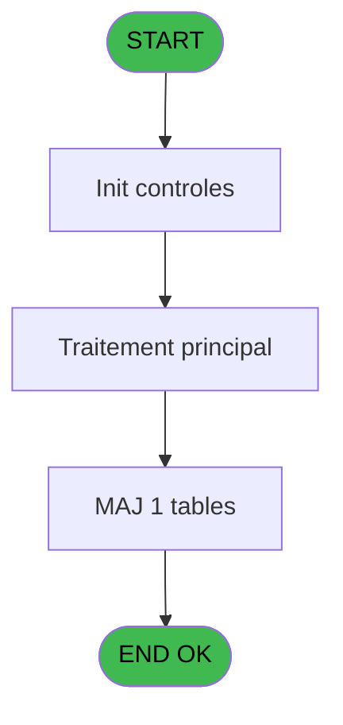

# PVE IDE 395 - Report - Selection/By Product

> **Analyse**: Phases 1-4 2026-02-03 19:55 -> 19:56 (12s) | Assemblage 19:56
> **Pipeline**: V7.2 Enrichi
> **Structure**: 4 onglets (Resume | Ecrans | Donnees | Connexions)

<!-- TAB:Resume -->

## 1. FICHE D'IDENTITE

| Attribut | Valeur |
|----------|--------|
| Projet | PVE |
| IDE Position | 395 |
| Nom Programme | Report - Selection/By Product |
| Fichier source | `Prg_395.xml` |
| Dossier IDE | A |
| Taches | 5 (0 ecrans visibles) |
| Tables modifiees | 1 |
| Programmes appeles | 0 |

## 2. DESCRIPTION FONCTIONNELLE

**Report - Selection/By Product** assure la gestion complete de ce processus, accessible depuis [Report - Revenue by Product (IDE 382)](PVE-IDE-382.md).

Le flux de traitement s'organise en **3 blocs fonctionnels** :

- **Traitement** (3 taches) : traitements metier divers
- **Consultation** (1 tache) : ecrans de recherche, selection et consultation
- **Calcul** (1 tache) : calculs de montants, stocks ou compteurs

**Donnees modifiees** : 1 tables en ecriture (update_table_codes_log).

Detail : phases du traitement

#### Phase 1 : Consultation (1 tache)

- **395** - SELECTION

#### Phase 2 : Calcul (1 tache)

- **395.1** - Selection compta

#### Phase 3 : Traitement (3 taches)

- **395.1.1** - Temp generation
- **395.1.1.1** - Temp generation
- **395.1.2** - Movements

#### Tables impactees

| Table | Operations | Role metier |
|-------|-----------|-------------|
| update_table_codes_log | **W** (2 usages) |  |

## 3. BLOCS FONCTIONNELS

### 3.1 Consultation (1 tache)

Ecrans de recherche et consultation.

---

#### 395 - SELECTION

**Role** : Selection par l'operateur : SELECTION.

### 3.2 Calcul (1 tache)

Calculs metier : montants, stocks, compteurs.

---

#### 395.1 - Selection compta

**Role** : Selection par l'operateur : Selection compta.

### 3.3 Traitement (3 taches)

Traitements internes.

---

#### 395.1.1 - Temp generation

**Role** : Traitement : Temp generation.

---

#### 395.1.1.1 - Temp generation

**Role** : Traitement : Temp generation.

---

#### 395.1.2 - Movements

**Role** : Traitement : Movements.

## 5. REGLES METIER

*(Aucune regle metier identifiee)*

## 6. CONTEXTE

- **Appele par**: [Report - Revenue by Product (IDE 382)](PVE-IDE-382.md)
- **Appelle**: 0 programmes | **Tables**: 7 (W:1 R:3 L:4) | **Taches**: 5 | **Expressions**: 17

<!-- TAB:Ecrans -->

## 8. ECRANS

*(Programme sans ecran visible)*

## 9. NAVIGATION

### 9.3 Structure hierarchique (5 taches)

| Position | Tache | Type | Dimensions | Bloc |
|----------|-------|------|------------|------|
| **395.1** | [**SELECTION** (395)](#t1) | MDI | - | Consultation |
| **395.2** | [**Selection compta** (395.1)](#t2) | MDI | - | Calcul |
| **395.3** | [**Temp generation** (395.1.1)](#t3) | MDI | - | Traitement |
| 395.3.1 | [Temp generation (395.1.1.1)](#t4) | MDI | - | |
| 395.3.2 | [Movements (395.1.2)](#t5) | MDI | - | |

### 9.4 Algorigramme

> **Legende**: Vert = START/END OK | Rouge = END KO | Bleu = Decisions
> *Algorigramme auto-genere. Utiliser `/algorigramme` pour une synthese metier detaillee.*

<!-- TAB:Donnees -->

## 10. TABLES

### Tables utilisees (7)

| ID | Nom | Description | Type | R | W | L | Usages |
|----|-----|-------------|------|---|---|---|--------|
| 379 | pv_customer_temp |  | DB | R |   |   | 1 |
| 403 | pv_sellers |  | DB |   |   | L | 1 |
| 413 | pv_tva |  | DB |   |   | L | 1 |
| 523 | synthese_garanties | Depots et garanties | TMP | R |   |   | 1 |
| 524 | update_table_codes_log |  | TMP |   | **W** |   | 2 |
| 534 | liste_des_caisses | Sessions de caisse | TMP |   |   | L | 1 |
| 762 | pv_mvt_stock_tempo | Table temporaire ecran | DB | R |   | L | 2 |

### Colonnes par table (2 / 4 tables avec colonnes identifiees)

Table 379 - pv_customer_temp (R) - 1 usages

| Lettre | Variable | Acces | Type |
|--------|----------|-------|------|
| A | P. Date mini | R | Date |
| B | P. Date Maxi | R | Date |
| C | P. Decimales | R | Numeric |
| D | P. Item selected | R | Logical |
| E | P. Total General | R | Numeric |
| F | P. D or C or P or L or V | R | Alpha |
| G | P. avec Cost | R | Logical |
| H | P. Total Cost | R | Numeric |
| I | P. Cat mini | R | Numeric |
| J | P. Cat Maxi | R | Numeric |
| K | P.Lieu Mini | R | Alpha |
| L | P.Lieu Maxi | R | Alpha |
| M | P.Vendeur mini | R | Alpha |
| N | P.Vendeur maxi | R | Alpha |
| O | P.Revenue HT | R | Numeric |
| P | P.Revenue TTC | R | Numeric |
| Q | V Product | R | Numeric |

Table 523 - synthese_garanties (R) - 1 usages

*Table utilisee uniquement en Link ou aucune colonne Real identifiee dans le DataView.*

Table 524 - update_table_codes_log (**W**) - 2 usages

| Lettre | Variable | Acces | Type |
|--------|----------|-------|------|
| A | P(0) Refund | W | Logical |
| B | V Montant HT ou TTC | W | Numeric |
| C | V.Montant HT | W | Numeric |
| D | V.Montant TTC | W | Numeric |
| E | V.Prepaid HT ou TTC | W | Numeric |
| F | V.Prepaid HT | W | Numeric |
| G | V.Prepaid TTC | W | Numeric |

Table 762 - pv_mvt_stock_tempo (R/L) - 2 usages

*Table utilisee uniquement en Link ou aucune colonne Real identifiee dans le DataView.*

## 11. VARIABLES

### 11.1 Parametres entrants (16)

Variables recues du programme appelant ([Report - Revenue by Product (IDE 382)](PVE-IDE-382.md)).

| Lettre | Nom | Type | Usage dans |
|--------|-----|------|-----------|
| A | P. Date mini | Date | 1x parametre entrant |
| B | P. Date Maxi | Date | 1x parametre entrant |
| C | P. Decimales | Numeric | - |
| D | P. Item selected | Logical | - |
| E | P. Total General | Numeric | - |
| F | P. D or C or P or L or V | Alpha | - |
| G | P. avec Cost | Logical | - |
| H | P. Total Cost | Numeric | - |
| I | P. Cat mini | Numeric | 1x parametre entrant |
| J | P. Cat Maxi | Numeric | 1x parametre entrant |
| K | P.Lieu Mini | Alpha | 1x parametre entrant |
| L | P.Lieu Maxi | Alpha | 1x parametre entrant |
| M | P.Vendeur mini | Alpha | 1x parametre entrant |
| N | P.Vendeur maxi | Alpha | 1x parametre entrant |
| O | P.Revenue HT | Numeric | - |
| P | P.Revenue TTC | Numeric | - |

### 11.2 Variables de session (1)

Variables persistantes pendant toute la session.

| Lettre | Nom | Type | Usage dans |
|--------|-----|------|-----------|
| Q | V Product | Numeric | 1x session |

Toutes les 17 variables (liste complete)

| Cat | Lettre | Nom Variable | Type |
|-----|--------|--------------|------|
| P0 | **A** | P. Date mini | Date |
| P0 | **B** | P. Date Maxi | Date |
| P0 | **C** | P. Decimales | Numeric |
| P0 | **D** | P. Item selected | Logical |
| P0 | **E** | P. Total General | Numeric |
| P0 | **F** | P. D or C or P or L or V | Alpha |
| P0 | **G** | P. avec Cost | Logical |
| P0 | **H** | P. Total Cost | Numeric |
| P0 | **I** | P. Cat mini | Numeric |
| P0 | **J** | P. Cat Maxi | Numeric |
| P0 | **K** | P.Lieu Mini | Alpha |
| P0 | **L** | P.Lieu Maxi | Alpha |
| P0 | **M** | P.Vendeur mini | Alpha |
| P0 | **N** | P.Vendeur maxi | Alpha |
| P0 | **O** | P.Revenue HT | Numeric |
| P0 | **P** | P.Revenue TTC | Numeric |
| V. | **Q** | V Product | Numeric |

## 12. EXPRESSIONS

**17 / 17 expressions decodees (100%)**

### 12.1 Repartition par type

| Type | Expressions | Regles |
|------|-------------|--------|
| CALCULATION | 1 | 0 |
| OTHER | 9 | 0 |
| CAST_LOGIQUE | 1 | 0 |
| CONDITION | 6 | 0 |

### 12.2 Expressions cles par type

#### CALCULATION (1 expressions)

| Type | IDE | Expression | Regle |
|------|-----|------------|-------|
| CALCULATION | 7 | `[T]*10^4+[U]*100+[V]` | - |

#### OTHER (9 expressions)

| Type | IDE | Expression | Regle |
|------|-----|------------|-------|
| OTHER | 8 | `[S]` | - |
| OTHER | 6 | `[U]` | - |
| OTHER | 10 | `[V]` | - |
| OTHER | 9 | `[AM]` | - |
| OTHER | 5 | `[T]` | - |
| ... | | *+4 autres* | |

#### CAST_LOGIQUE (1 expressions)

| Type | IDE | Expression | Regle |
|------|-----|------------|-------|
| CAST_LOGIQUE | 11 | `'TRUE'LOG` | - |

#### CONDITION (6 expressions)

| Type | IDE | Expression | Regle |
|------|-----|------------|-------|
| CONDITION | 15 | `CndRange(P.Lieu Maxi [L]<>'',P.Lieu Maxi [L])` | - |
| CONDITION | 16 | `CndRange(P.Vendeur mini [M]<>'',P.Vendeur mini [M])` | - |
| CONDITION | 17 | `CndRange(P.Vendeur maxi [N]<>'',P.Vendeur maxi [N])` | - |
| CONDITION | 12 | `CndRange(P. Cat mini [I]<>0,P. Cat mini [I])` | - |
| CONDITION | 13 | `CndRange(P. Cat Maxi [J]<>0,P. Cat Maxi [J])` | - |
| ... | | *+1 autres* | |

<!-- TAB:Connexions -->

## 13. GRAPHE D'APPELS

### 13.1 Chaine depuis Main (Callers)

Main -> ... -> [Report - Revenue by Product (IDE 382)](PVE-IDE-382.md) -> **Report - Selection/By Product (IDE 395)**

### 13.2 Callers

| IDE | Nom Programme | Nb Appels |
|-----|---------------|-----------|
| [382](PVE-IDE-382.md) | Report - Revenue by Product | 1 |

### 13.3 Callees (programmes appeles)

### 13.4 Detail Callees avec contexte

| IDE | Nom Programme | Appels | Contexte |
|-----|---------------|--------|----------|
| - | (aucun) | - | - |

## 14. RECOMMANDATIONS MIGRATION

### 14.1 Profil du programme

| Metrique | Valeur | Impact migration |
|----------|--------|-----------------|
| Lignes de logique | 210 | Taille moyenne |
| Expressions | 17 | Peu de logique |
| Tables WRITE | 1 | Impact faible |
| Sous-programmes | 0 | Peu de dependances |
| Ecrans visibles | 0 | Ecran unique ou traitement batch |
| Code desactive | 0% (0 / 210) | Code sain |
| Regles metier | 0 | Pas de regle identifiee |

### 14.2 Plan de migration par bloc

#### Consultation (1 tache: 0 ecran, 1 traitement)

- **Strategie** : Composants de recherche/selection en modales.

#### Calcul (1 tache: 0 ecran, 1 traitement)

- **Strategie** : Services de calcul purs (Domain Services).
- Migrer la logique de calcul (stock, compteurs, montants)

#### Traitement (3 taches: 0 ecran, 3 traitements)

- **Strategie** : 3 service(s) backend injectable(s) (Domain Services).
- Decomposer les taches en services unitaires testables.

### 14.3 Dependances critiques

| Dependance | Type | Appels | Impact |
|------------|------|--------|--------|
| update_table_codes_log | Table WRITE (Temp) | 2x | Schema + repository |

---
*Spec DETAILED generee par Pipeline V7.2 - 2026-02-03 19:56*
