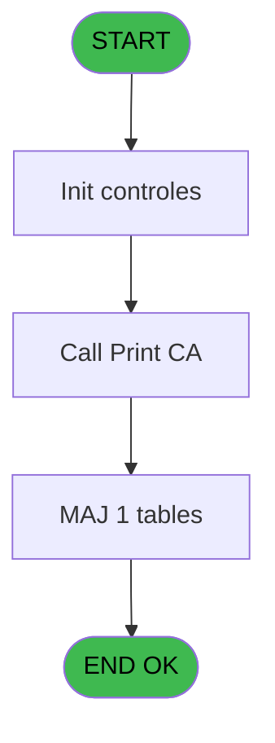
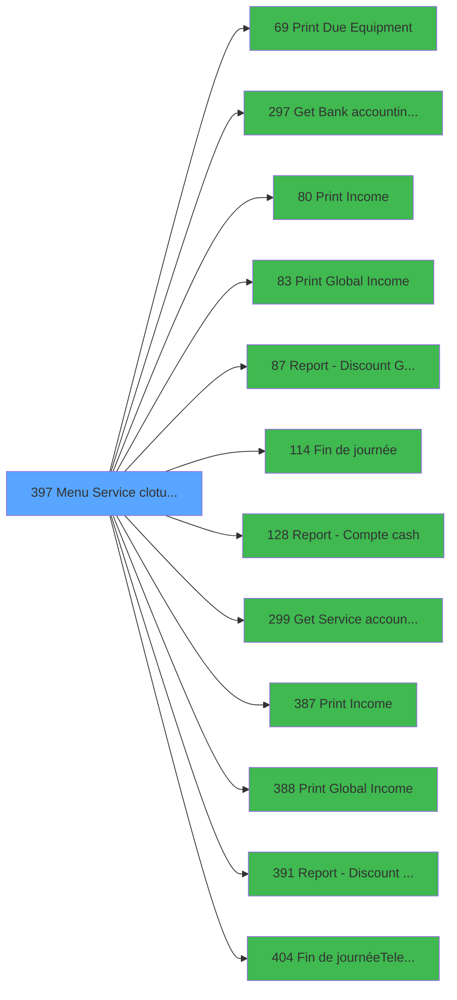

# PVE IDE 397 - Menu Service cloture v2

> **Analyse**: Phases 1-4 2026-02-03 19:56 -> 19:56 (10s) | Assemblage 19:56
> **Pipeline**: V7.2 Enrichi
> **Structure**: 4 onglets (Resume | Ecrans | Donnees | Connexions)

<!-- TAB:Resume -->

## 1. FICHE D'IDENTITE

| Attribut | Valeur |
|----------|--------|
| Projet | PVE |
| IDE Position | 397 |
| Nom Programme | Menu Service cloture v2 |
| Fichier source | `Prg_397.xml` |
| Dossier IDE | A |
| Taches | 8 (7 ecrans visibles) |
| Tables modifiees | 1 |
| Programmes appeles | 12 |
| :warning: Statut | **ORPHELIN_POTENTIEL** |

## 2. DESCRIPTION FONCTIONNELLE

**Menu Service cloture v2** assure la gestion complete de ce processus.

Le flux de traitement s'organise en **2 blocs fonctionnels** :

- **Impression** (4 taches) : generation de tickets et documents
- **Traitement** (4 taches) : traitements metier divers

**Donnees modifiees** : 1 tables en ecriture (pv_credit_card).

Detail : phases du traitement

#### Phase 1 : Traitement (4 taches)

- **397** - Service cloture **[[ECRAN]](#ecran-t1)**
- **397.5** - Change service accounting date **[[ECRAN]](#ecran-t6)**
- **397.5.1** - Change
- **397.6** - Change service accounting date **[[ECRAN]](#ecran-t8)**

Delegue a : [Get Bank accounting date (IDE 297)](PVE-IDE-297.md), [Report - Discount & Gratuities (IDE 87)](PVE-IDE-87.md), [Fin de journée (IDE 114)](PVE-IDE-114.md), [Get Service accounting date (IDE 299)](PVE-IDE-299.md), [Report - Discount & Gratuities (IDE 391)](PVE-IDE-391.md), [Fin de journée(Telecollecte) (IDE 404)](PVE-IDE-404.md)

#### Phase 2 : Impression (4 taches)

- **397.1** - Print types of payments **[[ECRAN]](#ecran-t2)**
- **397.2** - Print Compte cash **[[ECRAN]](#ecran-t3)**
- **397.3** - Print types of payments **[[ECRAN]](#ecran-t4)**
- **397.4** - Print types of payments **[[ECRAN]](#ecran-t5)**

Delegue a : [Print Due Equipment (IDE 69)](PVE-IDE-69.md), [Print Income (IDE 80)](PVE-IDE-80.md), [Print Global Income (IDE 83)](PVE-IDE-83.md), [Print Income (IDE 387)](PVE-IDE-387.md), [Print Global Income (IDE 388)](PVE-IDE-388.md)

#### Tables impactees

| Table | Operations | Role metier |
|-------|-----------|-------------|
| pv_credit_card | **W** (1 usages) |  |

## 3. BLOCS FONCTIONNELS

### 3.1 Traitement (4 taches)

Traitements internes.

---

#### 397 - Service cloture [[ECRAN]](#ecran-t1)

**Role** : Traitement : Service cloture.
**Ecran** : 809 x 342 DLU (MDI) | [Voir mockup](#ecran-t1)

3 sous-taches directes

| Tache | Nom | Bloc |
|-------|-----|------|
| [397.5](#t6) | Change service accounting date **[[ECRAN]](#ecran-t6)** | Traitement |
| [397.5.1](#t7) | Change | Traitement |
| [397.6](#t8) | Change service accounting date **[[ECRAN]](#ecran-t8)** | Traitement |

**Variables liees** : C (V Service accounting date)
**Delegue a** : [Get Bank accounting date (IDE 297)](PVE-IDE-297.md), [Report - Discount & Gratuities (IDE 87)](PVE-IDE-87.md), [Fin de journée (IDE 114)](PVE-IDE-114.md)

---

#### 397.5 - Change service accounting date [[ECRAN]](#ecran-t6)

**Role** : Traitement : Change service accounting date.
**Ecran** : 298 x 84 DLU (Modal) | [Voir mockup](#ecran-t6)
**Variables liees** : B (V Bank accounting date), C (V Service accounting date)
**Delegue a** : [Get Bank accounting date (IDE 297)](PVE-IDE-297.md), [Report - Discount & Gratuities (IDE 87)](PVE-IDE-87.md), [Fin de journée (IDE 114)](PVE-IDE-114.md)

---

#### 397.5.1 - Change

**Role** : Traitement : Change.
**Delegue a** : [Get Bank accounting date (IDE 297)](PVE-IDE-297.md), [Report - Discount & Gratuities (IDE 87)](PVE-IDE-87.md), [Fin de journée (IDE 114)](PVE-IDE-114.md)

---

#### 397.6 - Change service accounting date [[ECRAN]](#ecran-t8)

**Role** : Traitement : Change service accounting date.
**Ecran** : 300 x 86 DLU (Modal) | [Voir mockup](#ecran-t8)
**Variables liees** : B (V Bank accounting date), C (V Service accounting date)
**Delegue a** : [Get Bank accounting date (IDE 297)](PVE-IDE-297.md), [Report - Discount & Gratuities (IDE 87)](PVE-IDE-87.md), [Fin de journée (IDE 114)](PVE-IDE-114.md)

### 3.2 Impression (4 taches)

Generation des documents et tickets.

---

#### 397.1 - Print types of payments [[ECRAN]](#ecran-t2)

**Role** : Generation du document : Print types of payments.
**Ecran** : 296 x 85 DLU (Modal) | [Voir mockup](#ecran-t2)
**Delegue a** : [Print Due Equipment (IDE 69)](PVE-IDE-69.md), [Print Income (IDE 80)](PVE-IDE-80.md), [Print Global Income (IDE 83)](PVE-IDE-83.md)

---

#### 397.2 - Print Compte cash [[ECRAN]](#ecran-t3)

**Role** : Generation du document : Print Compte cash.
**Ecran** : 296 x 85 DLU (Modal) | [Voir mockup](#ecran-t3)
**Variables liees** : K (V.Existe compte cash ?)
**Delegue a** : [Print Due Equipment (IDE 69)](PVE-IDE-69.md), [Print Income (IDE 80)](PVE-IDE-80.md), [Print Global Income (IDE 83)](PVE-IDE-83.md)

---

#### 397.3 - Print types of payments [[ECRAN]](#ecran-t4)

**Role** : Generation du document : Print types of payments.
**Ecran** : 296 x 85 DLU (Modal) | [Voir mockup](#ecran-t4)
**Delegue a** : [Print Due Equipment (IDE 69)](PVE-IDE-69.md), [Print Income (IDE 80)](PVE-IDE-80.md), [Print Global Income (IDE 83)](PVE-IDE-83.md)

---

#### 397.4 - Print types of payments [[ECRAN]](#ecran-t5)

**Role** : Generation du document : Print types of payments.
**Ecran** : 296 x 85 DLU (Modal) | [Voir mockup](#ecran-t5)
**Delegue a** : [Print Due Equipment (IDE 69)](PVE-IDE-69.md), [Print Income (IDE 80)](PVE-IDE-80.md), [Print Global Income (IDE 83)](PVE-IDE-83.md)

## 5. REGLES METIER

*(Aucune regle metier identifiee)*

## 6. CONTEXTE

- **Appele par**: (aucun)
- **Appelle**: 12 programmes | **Tables**: 2 (W:1 R:1 L:0) | **Taches**: 8 | **Expressions**: 24

<!-- TAB:Ecrans -->

## 8. ECRANS

### 8.1 Forms visibles (7 / 8)

| # | Position | Tache | Nom | Type | Largeur | Hauteur | Bloc |
|---|----------|-------|-----|------|---------|---------|------|
| 1 | 397 | 397 | Service cloture | MDI | 809 | 342 | Traitement |
| 2 | 397.1 | 397.1 | Print types of payments | Modal | 296 | 85 | Impression |
| 3 | 397.2 | 397.2 | Print Compte cash | Modal | 296 | 85 | Impression |
| 4 | 397.3 | 397.3 | Print types of payments | Modal | 296 | 85 | Impression |
| 5 | 397.4 | 397.4 | Print types of payments | Modal | 296 | 85 | Impression |
| 6 | 397.5 | 397.5 | Change service accounting date | Modal | 298 | 84 | Traitement |
| 7 | 397.6 | 397.6 | Change service accounting date | Modal | 300 | 86 | Traitement |

### 8.2 Mockups Ecrans

---

#### 397 - Service cloture
**Tache** : [397](#t1) | **Type** : MDI | **Dimensions** : 809 x 342 DLU
**Bloc** : Traitement | **Titre IDE** : Service cloture

<!-- FORM-DATA:
{
    "width":  809,
    "vFactor":  8,
    "type":  "MDI",
    "hFactor":  4,
    "controls":  [
                     {
                         "x":  1,
                         "type":  "label",
                         "var":  "",
                         "y":  0,
                         "w":  808,
                         "fmt":  "",
                         "name":  "",
                         "h":  40,
                         "color":  "188",
                         "text":  "",
                         "parent":  null
                     },
                     {
                         "x":  6,
                         "type":  "label",
                         "var":  "",
                         "y":  10,
                         "w":  798,
                         "fmt":  "",
                         "name":  "",
                         "h":  26,
                         "color":  "188",
                         "text":  "\"CLOTURE\" CENTER",
                         "parent":  1
                     },
                     {
                         "x":  230,
                         "type":  "label",
                         "var":  "",
                         "y":  80,
                         "w":  348,
                         "fmt":  "",
                         "name":  "",
                         "h":  245,
                         "color":  "",
                         "text":  "",
                         "parent":  null
                     },
                     {
                         "x":  232,
                         "type":  "label",
                         "var":  "",
                         "y":  80,
                         "w":  346,
                         "fmt":  "",
                         "name":  "",
                         "h":  42,
                         "color":  "186",
                         "text":  "",
                         "parent":  null
                     },
                     {
                         "x":  248,
                         "type":  "label",
                         "var":  "",
                         "y":  94,
                         "w":  261,
                         "fmt":  "",
                         "name":  "",
                         "h":  11,
                         "color":  "186",
                         "text":  "Follow the steps to perform the daily cloture",
                         "parent":  5
                     },
                     {
                         "x":  250,
                         "type":  "label",
                         "var":  "",
                         "y":  151,
                         "w":  311,
                         "fmt":  "",
                         "name":  "",
                         "h":  162,
                         "color":  "7",
                         "text":  "",
                         "parent":  null
                     },
                     {
                         "x":  369,
                         "type":  "label",
                         "var":  "",
                         "y":  168,
                         "w":  176,
                         "fmt":  "",
                         "name":  "",
                         "h":  14,
                         "color":  "141",
                         "text":  "Bank accounting date",
                         "parent":  8
                     },
                     {
                         "x":  552,
                         "type":  "edit",
                         "var":  "",
                         "y":  14,
                         "w":  245,
                         "fmt":  "30",
                         "name":  "",
                         "h":  18,
                         "color":  "174",
                         "text":  "",
                         "parent":  2
                     },
                     {
                         "x":  528,
                         "type":  "image",
                         "var":  "",
                         "y":  85,
                         "w":  49,
                         "fmt":  "",
                         "name":  "",
                         "h":  35,
                         "color":  "",
                         "text":  "",
                         "parent":  5
                     },
                     {
                         "x":  257,
                         "type":  "image",
                         "var":  "",
                         "y":  157,
                         "w":  79,
                         "fmt":  "",
                         "name":  "",
                         "h":  54,
                         "color":  "",
                         "text":  "",
                         "parent":  8
                     },
                     {
                         "x":  486,
                         "type":  "edit",
                         "var":  "",
                         "y":  169,
                         "w":  58,
                         "fmt":  "",
                         "name":  "",
                         "h":  11,
                         "color":  "7",
                         "text":  "",
                         "parent":  8
                     }
                 ],
    "taskId":  "397",
    "height":  342
}
-->

<strong>Champs : 2 champs</strong>

| Pos (x,y) | Nom | Variable | Type |
|-----------|-----|----------|------|
| 552,14 | 30 | - | edit |
| 486,169 | (sans nom) | - | edit |

---

#### 397.1 - Print types of payments
**Tache** : [397.1](#t2) | **Type** : Modal | **Dimensions** : 296 x 85 DLU
**Bloc** : Impression | **Titre IDE** : Print types of payments

<!-- FORM-DATA:
{
    "width":  296,
    "vFactor":  8,
    "type":  "Modal",
    "hFactor":  4,
    "controls":  [
                     {
                         "x":  0,
                         "type":  "label",
                         "var":  "",
                         "y":  0,
                         "w":  294,
                         "fmt":  "",
                         "name":  "",
                         "h":  32,
                         "color":  "110",
                         "text":  "",
                         "parent":  null
                     },
                     {
                         "x":  12,
                         "type":  "label",
                         "var":  "",
                         "y":  10,
                         "w":  12,
                         "fmt":  "",
                         "name":  "",
                         "h":  12,
                         "color":  "144",
                         "text":  "1",
                         "parent":  1
                     },
                     {
                         "x":  30,
                         "type":  "label",
                         "var":  "",
                         "y":  10,
                         "w":  239,
                         "fmt":  "",
                         "name":  "",
                         "h":  12,
                         "color":  "110",
                         "text":  "Print daily income (Global \u0026 Detailed)",
                         "parent":  1
                     },
                     {
                         "x":  213,
                         "type":  "button",
                         "var":  "",
                         "y":  51,
                         "w":  77,
                         "fmt":  "\u0026Next",
                         "name":  "NEXT",
                         "h":  28,
                         "color":  "",
                         "text":  "",
                         "parent":  null
                     },
                     {
                         "x":  9,
                         "type":  "button",
                         "var":  "",
                         "y":  51,
                         "w":  77,
                         "fmt":  "\u0026Cancel",
                         "name":  "BACK",
                         "h":  28,
                         "color":  "",
                         "text":  "",
                         "parent":  null
                     }
                 ],
    "taskId":  "397.1",
    "height":  85
}
-->

<strong>Boutons : 2 boutons</strong>

| Bouton | Pos (x,y) | Action |
|--------|-----------|--------|
| Next | 213,51 | Bouton fonctionnel |
| Cancel | 9,51 | Annule et retour au menu |

---

#### 397.2 - Print Compte cash
**Tache** : [397.2](#t3) | **Type** : Modal | **Dimensions** : 296 x 85 DLU
**Bloc** : Impression | **Titre IDE** : Print Compte cash

<!-- FORM-DATA:
{
    "width":  296,
    "vFactor":  8,
    "type":  "Modal",
    "hFactor":  4,
    "controls":  [
                     {
                         "x":  0,
                         "type":  "label",
                         "var":  "",
                         "y":  0,
                         "w":  294,
                         "fmt":  "",
                         "name":  "",
                         "h":  32,
                         "color":  "110",
                         "text":  "",
                         "parent":  null
                     },
                     {
                         "x":  12,
                         "type":  "label",
                         "var":  "",
                         "y":  10,
                         "w":  12,
                         "fmt":  "",
                         "name":  "",
                         "h":  12,
                         "color":  "144",
                         "text":  "2",
                         "parent":  1
                     },
                     {
                         "x":  30,
                         "type":  "label",
                         "var":  "",
                         "y":  10,
                         "w":  239,
                         "fmt":  "",
                         "name":  "",
                         "h":  12,
                         "color":  "110",
                         "text":  "Print Cash Account",
                         "parent":  1
                     },
                     {
                         "x":  213,
                         "type":  "button",
                         "var":  "",
                         "y":  51,
                         "w":  77,
                         "fmt":  "\u0026Next",
                         "name":  "NEXT",
                         "h":  28,
                         "color":  "",
                         "text":  "",
                         "parent":  null
                     },
                     {
                         "x":  9,
                         "type":  "button",
                         "var":  "",
                         "y":  51,
                         "w":  77,
                         "fmt":  "\u0026Back",
                         "name":  "BACK",
                         "h":  28,
                         "color":  "",
                         "text":  "",
                         "parent":  null
                     }
                 ],
    "taskId":  "397.2",
    "height":  85
}
-->

<strong>Boutons : 2 boutons</strong>

| Bouton | Pos (x,y) | Action |
|--------|-----------|--------|
| Next | 213,51 | Bouton fonctionnel |
| Back | 9,51 | Bouton fonctionnel |

---

#### 397.3 - Print types of payments
**Tache** : [397.3](#t4) | **Type** : Modal | **Dimensions** : 296 x 85 DLU
**Bloc** : Impression | **Titre IDE** : Print types of payments

<!-- FORM-DATA:
{
    "width":  296,
    "vFactor":  8,
    "type":  "Modal",
    "hFactor":  4,
    "controls":  [
                     {
                         "x":  0,
                         "type":  "label",
                         "var":  "",
                         "y":  0,
                         "w":  294,
                         "fmt":  "",
                         "name":  "",
                         "h":  32,
                         "color":  "6",
                         "text":  "",
                         "parent":  null
                     },
                     {
                         "x":  8,
                         "type":  "label",
                         "var":  "",
                         "y":  10,
                         "w":  12,
                         "fmt":  "",
                         "name":  "",
                         "h":  12,
                         "color":  "144",
                         "text":  "3",
                         "parent":  1
                     },
                     {
                         "x":  25,
                         "type":  "label",
                         "var":  "",
                         "y":  10,
                         "w":  199,
                         "fmt":  "",
                         "name":  "",
                         "h":  12,
                         "color":  "110",
                         "text":  "Print discounts \u0026 gratuities",
                         "parent":  1
                     },
                     {
                         "x":  213,
                         "type":  "button",
                         "var":  "",
                         "y":  51,
                         "w":  77,
                         "fmt":  "\u0026Next",
                         "name":  "NEXT",
                         "h":  28,
                         "color":  "",
                         "text":  "",
                         "parent":  null
                     },
                     {
                         "x":  9,
                         "type":  "button",
                         "var":  "",
                         "y":  51,
                         "w":  77,
                         "fmt":  "\u0026Back",
                         "name":  "BACK",
                         "h":  28,
                         "color":  "",
                         "text":  "",
                         "parent":  null
                     }
                 ],
    "taskId":  "397.3",
    "height":  85
}
-->

<strong>Boutons : 2 boutons</strong>

| Bouton | Pos (x,y) | Action |
|--------|-----------|--------|
| Next | 213,51 | Bouton fonctionnel |
| Back | 9,51 | Bouton fonctionnel |

---

#### 397.4 - Print types of payments
**Tache** : [397.4](#t5) | **Type** : Modal | **Dimensions** : 296 x 85 DLU
**Bloc** : Impression | **Titre IDE** : Print types of payments

<!-- FORM-DATA:
{
    "width":  296,
    "vFactor":  8,
    "type":  "Modal",
    "hFactor":  4,
    "controls":  [
                     {
                         "x":  0,
                         "type":  "label",
                         "var":  "",
                         "y":  0,
                         "w":  294,
                         "fmt":  "",
                         "name":  "",
                         "h":  32,
                         "color":  "6",
                         "text":  "",
                         "parent":  null
                     },
                     {
                         "x":  10,
                         "type":  "label",
                         "var":  "",
                         "y":  10,
                         "w":  12,
                         "fmt":  "",
                         "name":  "",
                         "h":  12,
                         "color":  "144",
                         "text":  "4",
                         "parent":  1
                     },
                     {
                         "x":  27,
                         "type":  "label",
                         "var":  "",
                         "y":  10,
                         "w":  199,
                         "fmt":  "",
                         "name":  "",
                         "h":  12,
                         "color":  "110",
                         "text":  "Print equipments due",
                         "parent":  1
                     },
                     {
                         "x":  213,
                         "type":  "button",
                         "var":  "",
                         "y":  51,
                         "w":  77,
                         "fmt":  "\u0026Next",
                         "name":  "NEXT",
                         "h":  28,
                         "color":  "",
                         "text":  "",
                         "parent":  null
                     },
                     {
                         "x":  9,
                         "type":  "button",
                         "var":  "",
                         "y":  51,
                         "w":  77,
                         "fmt":  "\u0026Back",
                         "name":  "BACK",
                         "h":  28,
                         "color":  "",
                         "text":  "",
                         "parent":  null
                     }
                 ],
    "taskId":  "397.4",
    "height":  85
}
-->

<strong>Boutons : 2 boutons</strong>

| Bouton | Pos (x,y) | Action |
|--------|-----------|--------|
| Next | 213,51 | Bouton fonctionnel |
| Back | 9,51 | Bouton fonctionnel |

---

#### 397.5 - Change service accounting date
**Tache** : [397.5](#t6) | **Type** : Modal | **Dimensions** : 298 x 84 DLU
**Bloc** : Traitement | **Titre IDE** : Change service accounting date

<!-- FORM-DATA:
{
    "width":  298,
    "vFactor":  8,
    "type":  "Modal",
    "hFactor":  4,
    "controls":  [
                     {
                         "x":  0,
                         "type":  "label",
                         "var":  "",
                         "y":  0,
                         "w":  296,
                         "fmt":  "",
                         "name":  "",
                         "h":  32,
                         "color":  "6",
                         "text":  "",
                         "parent":  null
                     },
                     {
                         "x":  10,
                         "type":  "label",
                         "var":  "",
                         "y":  10,
                         "w":  12,
                         "fmt":  "",
                         "name":  "",
                         "h":  12,
                         "color":  "12",
                         "text":  "4",
                         "parent":  1
                     },
                     {
                         "x":  10,
                         "type":  "label",
                         "var":  "",
                         "y":  10,
                         "w":  12,
                         "fmt":  "",
                         "name":  "",
                         "h":  12,
                         "color":  "144",
                         "text":  "4",
                         "parent":  1
                     },
                     {
                         "x":  27,
                         "type":  "label",
                         "var":  "",
                         "y":  10,
                         "w":  68,
                         "fmt":  "",
                         "name":  "",
                         "h":  12,
                         "color":  "144",
                         "text":  "Validation",
                         "parent":  1
                     },
                     {
                         "x":  120,
                         "type":  "label",
                         "var":  "",
                         "y":  10,
                         "w":  168,
                         "fmt":  "",
                         "name":  "",
                         "h":  12,
                         "color":  "110",
                         "text":  "The service accounting date will change",
                         "parent":  1
                     },
                     {
                         "x":  213,
                         "type":  "button",
                         "var":  "",
                         "y":  51,
                         "w":  77,
                         "fmt":  "\u0026Next",
                         "name":  "NEXT",
                         "h":  28,
                         "color":  "",
                         "text":  "",
                         "parent":  null
                     },
                     {
                         "x":  9,
                         "type":  "button",
                         "var":  "",
                         "y":  51,
                         "w":  77,
                         "fmt":  "\u0026Back",
                         "name":  "BACK",
                         "h":  28,
                         "color":  "",
                         "text":  "",
                         "parent":  null
                     }
                 ],
    "taskId":  "397.5",
    "height":  84
}
-->

<strong>Boutons : 2 boutons</strong>

| Bouton | Pos (x,y) | Action |
|--------|-----------|--------|
| Next | 213,51 | Bouton fonctionnel |
| Back | 9,51 | Bouton fonctionnel |

---

#### 397.6 - Change service accounting date
**Tache** : [397.6](#t8) | **Type** : Modal | **Dimensions** : 300 x 86 DLU
**Bloc** : Traitement | **Titre IDE** : Change service accounting date

<!-- FORM-DATA:
{
    "width":  300,
    "vFactor":  8,
    "type":  "Modal",
    "hFactor":  4,
    "controls":  [
                     {
                         "x":  0,
                         "type":  "label",
                         "var":  "",
                         "y":  0,
                         "w":  300,
                         "fmt":  "",
                         "name":  "",
                         "h":  32,
                         "color":  "110",
                         "text":  "",
                         "parent":  null
                     },
                     {
                         "x":  10,
                         "type":  "label",
                         "var":  "",
                         "y":  10,
                         "w":  12,
                         "fmt":  "",
                         "name":  "",
                         "h":  12,
                         "color":  "12",
                         "text":  "4",
                         "parent":  1
                     },
                     {
                         "x":  10,
                         "type":  "label",
                         "var":  "",
                         "y":  10,
                         "w":  12,
                         "fmt":  "",
                         "name":  "",
                         "h":  12,
                         "color":  "144",
                         "text":  "4",
                         "parent":  1
                     },
                     {
                         "x":  27,
                         "type":  "label",
                         "var":  "",
                         "y":  10,
                         "w":  68,
                         "fmt":  "",
                         "name":  "",
                         "h":  12,
                         "color":  "110",
                         "text":  "Cloture",
                         "parent":  1
                     },
                     {
                         "x":  120,
                         "type":  "label",
                         "var":  "",
                         "y":  10,
                         "w":  168,
                         "fmt":  "",
                         "name":  "",
                         "h":  12,
                         "color":  "110",
                         "text":  "Perform service cloture",
                         "parent":  1
                     },
                     {
                         "x":  213,
                         "type":  "button",
                         "var":  "",
                         "y":  51,
                         "w":  77,
                         "fmt":  "\u0026Next",
                         "name":  "NEXT",
                         "h":  28,
                         "color":  "",
                         "text":  "",
                         "parent":  null
                     },
                     {
                         "x":  9,
                         "type":  "button",
                         "var":  "",
                         "y":  51,
                         "w":  77,
                         "fmt":  "\u0026Back",
                         "name":  "BACK",
                         "h":  28,
                         "color":  "",
                         "text":  "",
                         "parent":  null
                     }
                 ],
    "taskId":  "397.6",
    "height":  86
}
-->

<strong>Boutons : 2 boutons</strong>

| Bouton | Pos (x,y) | Action |
|--------|-----------|--------|
| Next | 213,51 | Bouton fonctionnel |
| Back | 9,51 | Bouton fonctionnel |

## 9. NAVIGATION

### 9.1 Enchainement des ecrans

```mermaid
flowchart TD
    START([Entree])
    style START fill:#3fb950
    VF1[397 Service cloture]
    style VF1 fill:#58a6ff
    VF2[397.1 Print types of paym...]
    style VF2 fill:#58a6ff
    VF3[397.2 Print Compte cash]
    style VF3 fill:#58a6ff
    VF4[397.3 Print types of paym...]
    style VF4 fill:#58a6ff
    VF5[397.4 Print types of paym...]
    style VF5 fill:#58a6ff
    VF6[397.5 Change service acco...]
    style VF6 fill:#58a6ff
    VF8[397.6 Change service acco...]
    style VF8 fill:#58a6ff
    EXT69[IDE 69 Print Due Equip...]
    style EXT69 fill:#3fb950
    EXT297[IDE 297 Get Bank accou...]
    style EXT297 fill:#3fb950
    EXT80[IDE 80 Print Income]
    style EXT80 fill:#3fb950
    EXT83[IDE 83 Print Global In...]
    style EXT83 fill:#3fb950
    EXT87[IDE 87 Report - Discou...]
    style EXT87 fill:#3fb950
    EXT114[IDE 114 Fin de journée]
    style EXT114 fill:#3fb950
    EXT128[IDE 128 Report - Compt...]
    style EXT128 fill:#3fb950
    EXT299[IDE 299 Get Service ac...]
    style EXT299 fill:#3fb950
    EXT387[IDE 387 Print Income]
    style EXT387 fill:#3fb950
    EXT388[IDE 388 Print Global I...]
    style EXT388 fill:#3fb950
    EXT391[IDE 391 Report - Disco...]
    style EXT391 fill:#3fb950
    EXT404[IDE 404 Fin de journée...]
    style EXT404 fill:#3fb950
    FIN([Sortie])
    style FIN fill:#f85149
    START --> VF1
    VF1 -->|Impression ticket/document| EXT69
    VF1 -->|Recuperation donnees| EXT297
    VF1 -->|Impression ticket/document| EXT80
    VF1 -->|Impression ticket/document| EXT83
    VF1 -->|Sous-programme| EXT87
    VF1 -->|Sous-programme| EXT114
    VF1 -->|Sous-programme| EXT128
    VF1 -->|Recuperation donnees| EXT299
    EXT404 --> FIN
```

**Detail par enchainement :**

| Depuis | Action | Vers | Retour |
|--------|--------|------|--------|
| Service cloture | Impression ticket/document | [Print Due Equipment (IDE 69)](PVE-IDE-69.md) | Retour ecran |
| Service cloture | Recuperation donnees | [Get Bank accounting date (IDE 297)](PVE-IDE-297.md) | Retour ecran |
| Service cloture | Impression ticket/document | [Print Income (IDE 80)](PVE-IDE-80.md) | Retour ecran |
| Service cloture | Impression ticket/document | [Print Global Income (IDE 83)](PVE-IDE-83.md) | Retour ecran |
| Service cloture | Sous-programme | [Report - Discount & Gratuities (IDE 87)](PVE-IDE-87.md) | Retour ecran |
| Service cloture | Sous-programme | [Fin de journée (IDE 114)](PVE-IDE-114.md) | Retour ecran |
| Service cloture | Sous-programme | [Report - Compte cash (IDE 128)](PVE-IDE-128.md) | Retour ecran |
| Service cloture | Recuperation donnees | [Get Service accounting date (IDE 299)](PVE-IDE-299.md) | Retour ecran |
| Service cloture | Impression ticket/document | [Print Income (IDE 387)](PVE-IDE-387.md) | Retour ecran |
| Service cloture | Impression ticket/document | [Print Global Income (IDE 388)](PVE-IDE-388.md) | Retour ecran |
| Service cloture | Sous-programme | [Report - Discount & Gratuities (IDE 391)](PVE-IDE-391.md) | Retour ecran |
| Service cloture | Sous-programme | [Fin de journée(Telecollecte) (IDE 404)](PVE-IDE-404.md) | Retour ecran |

### 9.3 Structure hierarchique (8 taches)

| Position | Tache | Type | Dimensions | Bloc |
|----------|-------|------|------------|------|
| **397.1** | [**Service cloture** (397)](#t1) [mockup](#ecran-t1) | MDI | 809x342 | Traitement |
| 397.1.1 | [Change service accounting date (397.5)](#t6) [mockup](#ecran-t6) | Modal | 298x84 | |
| 397.1.2 | [Change (397.5.1)](#t7) | MDI | - | |
| 397.1.3 | [Change service accounting date (397.6)](#t8) [mockup](#ecran-t8) | Modal | 300x86 | |
| **397.2** | [**Print types of payments** (397.1)](#t2) [mockup](#ecran-t2) | Modal | 296x85 | Impression |
| 397.2.1 | [Print Compte cash (397.2)](#t3) [mockup](#ecran-t3) | Modal | 296x85 | |
| 397.2.2 | [Print types of payments (397.3)](#t4) [mockup](#ecran-t4) | Modal | 296x85 | |
| 397.2.3 | [Print types of payments (397.4)](#t5) [mockup](#ecran-t5) | Modal | 296x85 | |

### 9.4 Algorigramme

> **Legende**: Vert = START/END OK | Rouge = END KO | Bleu = Decisions
> *Algorigramme auto-genere. Utiliser `/algorigramme` pour une synthese metier detaillee.*

<!-- TAB:Donnees -->

## 10. TABLES

### Tables utilisees (2)

| ID | Nom | Description | Type | R | W | L | Usages |
|----|-----|-------------|------|---|---|---|--------|
| 374 | pv_credit_card |  | DB |   | **W** |   | 1 |
| 786 | qualite_avant_reprise |  | DB | R |   |   | 1 |

### Colonnes par table (1 / 2 tables avec colonnes identifiees)

Table 374 - pv_credit_card (**W**) - 1 usages

*Table utilisee uniquement en Link ou aucune colonne Real identifiee dans le DataView.*

Table 786 - qualite_avant_reprise (R) - 1 usages

| Lettre | Variable | Acces | Type |
|--------|----------|-------|------|
| A | P. Societe | R | Alpha |
| B | V Bank accounting date | R | Date |
| C | V Service accounting date | R | Date |
| D | V Step | R | Numeric |
| E | V no exit | R | Logical |
| F | V Village name | R | Alpha |
| G | V Currency | R | Alpha |
| H | V Masque | R | Alpha |
| I | V Masque sans Z | R | Alpha |
| J | V Decimales | R | Numeric |
| K | V.Existe compte cash ? | R | Logical |
| L | v Back demandé | R | Logical |

## 11. VARIABLES

### 11.1 Parametres entrants (1)

Variables recues en parametre.

| Lettre | Nom | Type | Usage dans |
|--------|-----|------|-----------|
| A | P. Societe | Alpha | 1x parametre entrant |

### 11.2 Variables de session (11)

Variables persistantes pendant toute la session.

| Lettre | Nom | Type | Usage dans |
|--------|-----|------|-----------|
| B | V Bank accounting date | Date | [397.5](#t6), [397.6](#t8) |
| C | V Service accounting date | Date | [397](#t1), [397.5](#t6), [397.6](#t8) |
| D | V Step | Numeric | 7x session |
| E | V no exit | Logical | 1x session |
| F | V Village name | Alpha | - |
| G | V Currency | Alpha | - |
| H | V Masque | Alpha | 1x session |
| I | V Masque sans Z | Alpha | - |
| J | V Decimales | Numeric | - |
| K | V.Existe compte cash ? | Logical | [397.2](#t3) |
| L | v Back demandé | Logical | - |

## 12. EXPRESSIONS

**24 / 24 expressions decodees (100%)**

### 12.1 Repartition par type

| Type | Expressions | Regles |
|------|-------------|--------|
| CALCULATION | 2 | 0 |
| CONSTANTE | 3 | 0 |
| CONDITION | 6 | 0 |
| NEGATION | 2 | 0 |
| CAST_LOGIQUE | 4 | 0 |
| OTHER | 7 | 0 |

### 12.2 Expressions cles par type

#### CALCULATION (2 expressions)

| Type | IDE | Expression | Regle |
|------|-----|------------|-------|
| CALCULATION | 17 | `V Step [D]+1` | - |
| CALCULATION | 10 | `Left (Trim (V Masque [H]),Len (Trim (V Masque [H]))-1)` | - |

#### CONSTANTE (3 expressions)

| Type | IDE | Expression | Regle |
|------|-----|------------|-------|
| CONSTANTE | 22 | `'C'` | - |
| CONSTANTE | 6 | `'C'` | - |
| CONSTANTE | 1 | `1` | - |

#### CONDITION (6 expressions)

| Type | IDE | Expression | Regle |
|------|-----|------------|-------|
| CONDITION | 14 | `V Step [D]=2 AND V.Existe compte cash ? [K]` | - |
| CONDITION | 15 | `V Step [D]=3` | - |
| CONDITION | 18 | `V Step [D]=5` | - |
| CONDITION | 2 | `V Service accounting date [C]<=V Bank accounting date [B]` | - |
| CONDITION | 12 | `P. Societe [A]=''` | - |
| ... | | *+1 autres* | |

#### NEGATION (2 expressions)

| Type | IDE | Expression | Regle |
|------|-----|------------|-------|
| NEGATION | 20 | `NOT V no exit [E]` | - |
| NEGATION | 3 | `NOT (V Service accounting date [C]<=V Bank accounting date [B])` | - |

#### CAST_LOGIQUE (4 expressions)

| Type | IDE | Expression | Regle |
|------|-----|------------|-------|
| CAST_LOGIQUE | 16 | `V Step [D]=4 AND GetParam ('RENTAL')='TRUE'LOG` | - |
| CAST_LOGIQUE | 24 | `V Step [D]=4 AND GetParam ('RENTAL')='FALSE'LOG` | - |
| CAST_LOGIQUE | 4 | `'TRUE'LOG` | - |
| CAST_LOGIQUE | 5 | `'FALSE'LOG` | - |

#### OTHER (7 expressions)

| Type | IDE | Expression | Regle |
|------|-----|------------|-------|
| OTHER | 19 | `SetParam ('PrintPreview','N')` | - |
| OTHER | 21 | `' '&Upper(GetParam('SERVICELIB'))` | - |
| OTHER | 23 | `GetParam('SERVICE')` | - |
| OTHER | 11 | `GetParam ('DECIMALNUMBER')` | - |
| OTHER | 7 | `GetParam ('HEADERLINE02')` | - |
| ... | | *+2 autres* | |

### 12.3 Toutes les expressions (24)

Voir les 24 expressions

#### CALCULATION (2)

| IDE | Expression Decodee |
|-----|-------------------|
| 10 | `Left (Trim (V Masque [H]),Len (Trim (V Masque [H]))-1)` |
| 17 | `V Step [D]+1` |

#### CONSTANTE (3)

| IDE | Expression Decodee |
|-----|-------------------|
| 1 | `1` |
| 6 | `'C'` |
| 22 | `'C'` |

#### CONDITION (6)

| IDE | Expression Decodee |
|-----|-------------------|
| 2 | `V Service accounting date [C]<=V Bank accounting date [B]` |
| 12 | `P. Societe [A]=''` |
| 13 | `V Step [D]=1` |
| 14 | `V Step [D]=2 AND V.Existe compte cash ? [K]` |
| 15 | `V Step [D]=3` |
| 18 | `V Step [D]=5` |

#### NEGATION (2)

| IDE | Expression Decodee |
|-----|-------------------|
| 3 | `NOT (V Service accounting date [C]<=V Bank accounting date [B])` |
| 20 | `NOT V no exit [E]` |

#### CAST_LOGIQUE (4)

| IDE | Expression Decodee |
|-----|-------------------|
| 4 | `'TRUE'LOG` |
| 5 | `'FALSE'LOG` |
| 16 | `V Step [D]=4 AND GetParam ('RENTAL')='TRUE'LOG` |
| 24 | `V Step [D]=4 AND GetParam ('RENTAL')='FALSE'LOG` |

#### OTHER (7)

| IDE | Expression Decodee |
|-----|-------------------|
| 7 | `GetParam ('HEADERLINE02')` |
| 8 | `GetParam ('CURRENCYVALUE')` |
| 9 | `GetParam ('AMOUNTFORMAT')` |
| 11 | `GetParam ('DECIMALNUMBER')` |
| 19 | `SetParam ('PrintPreview','N')` |
| 21 | `' '&Upper(GetParam('SERVICELIB'))` |
| 23 | `GetParam('SERVICE')` |

<!-- TAB:Connexions -->

## 13. GRAPHE D'APPELS

### 13.1 Chaine depuis Main (Callers)

**Chemin**: (pas de callers directs)

### 13.2 Callers

| IDE | Nom Programme | Nb Appels |
|-----|---------------|-----------|
| - | (aucun) | - |

### 13.3 Callees (programmes appeles)

### 13.4 Detail Callees avec contexte

| IDE | Nom Programme | Appels | Contexte |
|-----|---------------|--------|----------|
| [69](PVE-IDE-69.md) | Print Due Equipment | 2 | Impression ticket/document |
| [297](PVE-IDE-297.md) | Get Bank accounting date | 2 | Recuperation donnees |
| [80](PVE-IDE-80.md) | Print Income | 1 | Impression ticket/document |
| [83](PVE-IDE-83.md) | Print Global Income | 1 | Impression ticket/document |
| [87](PVE-IDE-87.md) | Report - Discount & Gratuities | 1 | Sous-programme |
| [114](PVE-IDE-114.md) | Fin de journée | 1 | Sous-programme |
| [128](PVE-IDE-128.md) | Report - Compte cash | 1 | Sous-programme |
| [299](PVE-IDE-299.md) | Get Service accounting date | 1 | Recuperation donnees |
| [387](PVE-IDE-387.md) | Print Income | 1 | Impression ticket/document |
| [388](PVE-IDE-388.md) | Print Global Income | 1 | Impression ticket/document |
| [391](PVE-IDE-391.md) | Report - Discount & Gratuities | 1 | Sous-programme |
| [404](PVE-IDE-404.md) | Fin de journée(Telecollecte) | 1 | Sous-programme |

## 14. RECOMMANDATIONS MIGRATION

### 14.1 Profil du programme

| Metrique | Valeur | Impact migration |
|----------|--------|-----------------|
| Lignes de logique | 125 | Programme compact |
| Expressions | 24 | Peu de logique |
| Tables WRITE | 1 | Impact faible |
| Sous-programmes | 12 | Forte dependance |
| Ecrans visibles | 7 | Interface complexe multi-ecrans |
| Code desactive | 3.2% (4 / 125) | Code sain |
| Regles metier | 0 | Pas de regle identifiee |

### 14.2 Plan de migration par bloc

#### Traitement (4 taches: 3 ecrans, 1 traitement)

- **Strategie** : Orchestrateur avec 3 ecrans (Razor/React) et 1 traitements backend (services).
- Les ecrans deviennent des composants UI, les traitements invisibles deviennent des services injectables.
- 12 sous-programme(s) a migrer ou a reutiliser depuis les services existants.
- Decomposer les taches en services unitaires testables.

#### Impression (4 taches: 4 ecrans, 0 traitement)

- **Strategie** : Templates HTML -> PDF via wkhtmltopdf ou Puppeteer.
- `PrintService` injectable avec choix imprimante

### 14.3 Dependances critiques

| Dependance | Type | Appels | Impact |
|------------|------|--------|--------|
| pv_credit_card | Table WRITE (Database) | 1x | Schema + repository |
| [Get Bank accounting date (IDE 297)](PVE-IDE-297.md) | Sous-programme | 2x | Haute - Recuperation donnees |
| [Print Due Equipment (IDE 69)](PVE-IDE-69.md) | Sous-programme | 2x | Haute - Impression ticket/document |
| [Print Income (IDE 387)](PVE-IDE-387.md) | Sous-programme | 1x | Normale - Impression ticket/document |
| [Get Service accounting date (IDE 299)](PVE-IDE-299.md) | Sous-programme | 1x | Normale - Recuperation donnees |
| [Print Global Income (IDE 388)](PVE-IDE-388.md) | Sous-programme | 1x | Normale - Impression ticket/document |
| [Fin de journée(Telecollecte) (IDE 404)](PVE-IDE-404.md) | Sous-programme | 1x | Normale - Sous-programme |
| [Report - Discount & Gratuities (IDE 391)](PVE-IDE-391.md) | Sous-programme | 1x | Normale - Sous-programme |
| [Print Global Income (IDE 83)](PVE-IDE-83.md) | Sous-programme | 1x | Normale - Impression ticket/document |
| [Print Income (IDE 80)](PVE-IDE-80.md) | Sous-programme | 1x | Normale - Impression ticket/document |
| [Report - Discount & Gratuities (IDE 87)](PVE-IDE-87.md) | Sous-programme | 1x | Normale - Sous-programme |

---
*Spec DETAILED generee par Pipeline V7.2 - 2026-02-03 19:56*
