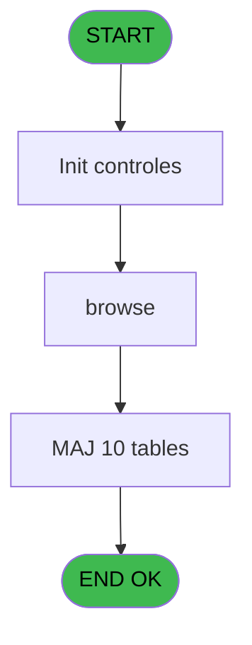
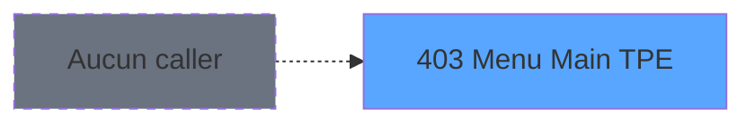
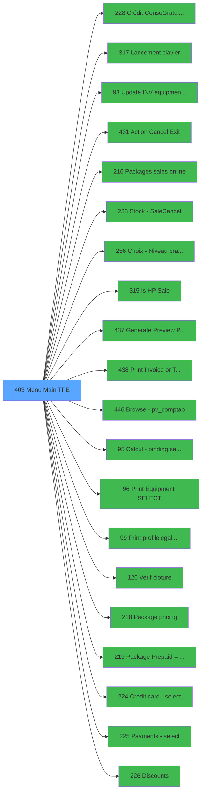

# PVE IDE 403 - Menu Main (TPE)

> **Analyse**: Phases 1-4 2026-02-03 19:58 -> 19:58 (12s) | Assemblage 19:58
> **Pipeline**: V7.2 Enrichi
> **Structure**: 4 onglets (Resume | Ecrans | Donnees | Connexions)

<!-- TAB:Resume -->

## 1. FICHE D'IDENTITE

| Attribut | Valeur |
|----------|--------|
| Projet | PVE |
| IDE Position | 403 |
| Nom Programme | Menu Main (TPE) |
| Fichier source | `Prg_403.xml` |
| Dossier IDE | A |
| Taches | 85 (27 ecrans visibles) |
| Tables modifiees | 10 |
| Programmes appeles | 20 |
| :warning: Statut | **ORPHELIN_POTENTIEL** |

## 2. DESCRIPTION FONCTIONNELLE

**Menu Main (TPE)** assure la gestion complete de ce processus.

Le flux de traitement s'organise en **6 blocs fonctionnels** :

- **Traitement** (74 taches) : traitements metier divers
- **Calcul** (5 taches) : calculs de montants, stocks ou compteurs
- **Creation** (2 taches) : insertion d'enregistrements en base (mouvements, prestations)
- **Saisie** (2 taches) : ecrans de saisie utilisateur (formulaires, champs, donnees)
- **Validation** (1 tache) : controles et verifications de coherence
- **Initialisation** (1 tache) : reinitialisation d'etats et de variables de travail

**Donnees modifiees** : 10 tables en ecriture (pv_comptable_tmp, depot_garantie___dga, comptable________cte, compte_gm________cgm, intermed_compta__ite, vente, pv_customer, pv_discount_reasons, pv_cust_rentals, pv_sellers_by_week).

**Logique metier** : 1 regles identifiees couvrant conditions metier.

Detail : phases du traitement

#### Phase 1 : Traitement (74 taches)

- **403** - PoS (Main)(TB) **[[ECRAN]](#ecran-t1)**
- **403.1** - Browse MOB **[[ECRAN]](#ecran-t2)**
- **403.1.1** - Transac not PMS **[[ECRAN]](#ecran-t3)**
- **403.1.2** - equip **[[ECRAN]](#ecran-t4)**
- **403.1.2.1** - Equipment check out **[[ECRAN]](#ecran-t5)**
- **403.1.2.1.1** - clear
- **403.1.2.2** - Equipment list **[[ECRAN]](#ecran-t7)**
- **403.1.2.2.1** - Equipment check out **[[ECRAN]](#ecran-t8)**
- **403.1.2.2.2** - Equipment list **[[ECRAN]](#ecran-t9)**
- **403.1.2.2.2.1** - Equipment check IN **[[ECRAN]](#ecran-t10)**
- **403.1.3** - Transac not PMS MBO **[[ECRAN]](#ecran-t11)**
- **403.1.3.1** - SQL Total payement **[[ECRAN]](#ecran-t12)**
- **403.1.4** - Package MOB **[[ECRAN]](#ecran-t13)**
- **403.1.4.1** - Renvoi Mail
- **403.1.4.2** - Special actions **[[ECRAN]](#ecran-t15)**
- **403.1.4.3** - Payment **[[ECRAN]](#ecran-t17)**
- **403.1.4.4** - Discount **[[ECRAN]](#ecran-t20)**
- **403.1.4.5** - Generate Preview OD **[[ECRAN]](#ecran-t22)**
- **403.1.4.5.1** - Payment preview **[[ECRAN]](#ecran-t23)**
- **403.1.4.5.2** - Batch 2 **[[ECRAN]](#ecran-t25)**
- **403.1.4.5.2.1** - Création d'un O.D **[[ECRAN]](#ecran-t26)**
- **403.1.4.5.2.1.1** - OD Debit 18 **[[ECRAN]](#ecran-t27)**
- **403.1.4.5.2.1.2** - credit 18 **[[ECRAN]](#ecran-t28)**
- **403.1.4.5.2.1.3** - debit 181 **[[ECRAN]](#ecran-t29)**
- **403.1.4.5.2.1.4** - credit 181 **[[ECRAN]](#ecran-t30)**
- **403.1.4.5.2.1.5** - debit xtrack **[[ECRAN]](#ecran-t31)**
- **403.1.4.5.2.1.6** - credit xtrack **[[ECRAN]](#ecran-t32)**
- **403.1.4.5.2.1.7** - OD cancel xtrack
- **403.1.4.5.2.1.7.1** - credit xtrack **[[ECRAN]](#ecran-t34)**
- **403.1.4.5.2.1.8** - OD cancel 18 **[[ECRAN]](#ecran-t35)**
- **403.1.4.5.2.1.8.1** - credit xtrack **[[ECRAN]](#ecran-t36)**
- **403.1.4.5.2.1.8.2** - credit xtrack **[[ECRAN]](#ecran-t37)**
- **403.1.4.5.2.1.9** - OD cancel 181
- **403.1.4.5.2.1.9.1** - credit xtrack **[[ECRAN]](#ecran-t39)**
- **403.1.4.5.2.1.10** - update cust rentals **[[ECRAN]](#ecran-t40)**
- **403.1.4.5.2.1.11** - Lecture IN PO **[[ECRAN]](#ecran-t43)**
- **403.1.4.5.2.1.11.1** - credit xtrack **[[ECRAN]](#ecran-t44)**
- **403.1.4.5.2.1.11.2** - credit 18 **[[ECRAN]](#ecran-t45)**
- **403.1.4.5.2.1.11.3** - credit 18 **[[ECRAN]](#ecran-t46)**
- **403.1.4.5.2.1.11.4** - credit 181 **[[ECRAN]](#ecran-t47)**
- **403.1.4.5.2.1.12** - Debit 18 **[[ECRAN]](#ecran-t48)**
- **403.1.4.5.2.1.13** - credit 18 **[[ECRAN]](#ecran-t49)**
- **403.1.4.5.2.2** - Payment preview **[[ECRAN]](#ecran-t50)**
- **403.1.4.5.2.4** - Search for Gift Pass **[[ECRAN]](#ecran-t52)**
- **403.1.4.5.2.5** - Read for Gift Pass **[[ECRAN]](#ecran-t53)**
- **403.1.4.5.2.6** - Read for Gift Pass **[[ECRAN]](#ecran-t54)**
- **403.1.4.5.2.7** - Input Amount Gift Pass **[[ECRAN]](#ecran-t56)**
- **403.1.4.5.3** - Annulation Garantie **[[ECRAN]](#ecran-t57)**
- **403.1.4.5.4** - Annulation Garantie **[[ECRAN]](#ecran-t58)**
- **403.1.4.5.5** - Suppression Gift Pass
- **403.1.4.5.6** - Suppression Gift Pass
- **403.1.4.6** - delete
- **403.1.4.6.1** - del
- **403.1.4.6.2** - del
- **403.1.4.6.3** - authorize del
- **403.1.4.6.4** - del
- **403.1.4.7** - Test Prepaid
- **403.1.4.8** - Check Rentals
- **403.1.4.9** - Check Payments **[[ECRAN]](#ecran-t68)**
- **403.1.4.10** - Check Comment Refus. To Sell **[[ECRAN]](#ecran-t69)**
- **403.1.4.11** - gen CardType
- **403.1.6** - Profile update
- **403.1.7** - Search room **[[ECRAN]](#ecran-t73)**
- **403.1.7.1** - Search room **[[ECRAN]](#ecran-t74)**
- **403.1.7.2** - Search room **[[ECRAN]](#ecran-t75)**
- **403.1.8** - Search equipment **[[ECRAN]](#ecran-t76)**
- **403.1.8.1** - Search equipment **[[ECRAN]](#ecran-t77)**
- **403.1.8.2** - Search equipment **[[ECRAN]](#ecran-t78)**
- **403.1.9** - Search room **[[ECRAN]](#ecran-t79)**
- **403.1.9.1** - Search room **[[ECRAN]](#ecran-t80)**
- **403.1.9.2** - Search room **[[ECRAN]](#ecran-t81)**
- **403.1.10** - Search Gartantie
- **403.1.11** - Maj Solde & Garantie
- **403.1.12** - Annulation Garantie **[[ECRAN]](#ecran-t85)**

Delegue a : [Crédit Conso/Gratuité (BAR) (IDE 228)](PVE-IDE-228.md), [Lancement clavier (IDE 317)](PVE-IDE-317.md), [Update INV equipment status (IDE 93)](PVE-IDE-93.md), [Action Cancel Exit (IDE 431)](PVE-IDE-431.md), [Packages sales online (IDE 216)](PVE-IDE-216.md), [Is HP Sale (IDE 315)](PVE-IDE-315.md), [Generate Preview Payment 1212E (IDE 437)](PVE-IDE-437.md), [    Package pricing (IDE 218)](PVE-IDE-218.md), [Package Prepaid => account (IDE 219)](PVE-IDE-219.md), [Discounts (IDE 226)](PVE-IDE-226.md)

#### Phase 2 : Saisie (2 taches)

- **403.1.4.2.1** - Saisie comment annulation **[[ECRAN]](#ecran-t16)**
- **403.1.4.4.1** - Saisie comment annulation **[[ECRAN]](#ecran-t21)**

#### Phase 3 : Initialisation (1 tache)

- **403.1.4.3.1** - init payer

#### Phase 4 : Creation (2 taches)

- **403.1.4.3.2** - create cardType
- **403.1.4.5.2.6.1** - Creation Ligne **[[ECRAN]](#ecran-t55)**

#### Phase 5 : Calcul (5 taches)

- **403.1.4.5.1.1** - calcul total
- **403.1.4.5.2.1.10.1** - Calcul days
- **403.1.4.5.2.1.10.1.1** - Lect PoS Compta
- **403.1.5** - calcul filiation
- **403.1.9.3** - Compte **[[ECRAN]](#ecran-t82)**

Delegue a : [Stock - Sale/Cancel (IDE 233)](PVE-IDE-233.md), [Browse - pv_comptab (IDE 446)](PVE-IDE-446.md), [Calcul - binding setting (IDE 95)](PVE-IDE-95.md)

#### Phase 6 : Validation (1 tache)

- **403.1.4.5.2.3** - Validation ecriture od **[[ECRAN]](#ecran-t51)**

Delegue a : [Verif cloture (IDE 126)](PVE-IDE-126.md)

#### Tables impactees

| Table | Operations | Role metier |
|-------|-----------|-------------|
| pv_discount_reasons | R/**W**/L (27 usages) |  |
| pv_cust_rentals | R/**W**/L (24 usages) |  |
| pv_sellers_by_week | R/**W**/L (11 usages) |  |
| compte_gm________cgm | **W**/L (10 usages) | Comptes GM (generaux) |
| pv_comptable_tmp | R/**W**/L (8 usages) |  |
| pv_customer | **W**/L (7 usages) |  |
| intermed_compta__ite | **W**/L (4 usages) |  |
| comptable________cte | **W**/L (4 usages) |  |
| depot_garantie___dga | **W**/L (4 usages) | Depots et garanties |
| vente | **W**/L (4 usages) | Donnees de ventes |

## 3. BLOCS FONCTIONNELS

### 3.1 Traitement (74 taches)

Traitements internes.

---

#### 403 - PoS (Main)(TB) [[ECRAN]](#ecran-t1)

**Role** : Tache d'orchestration : point d'entree du programme (74 sous-taches). Coordonne l'enchainement des traitements.
**Ecran** : 715 x 262 DLU (MDI) | [Voir mockup](#ecran-t1)

73 sous-taches directes

| Tache | Nom | Bloc |
|-------|-----|------|
| [403.1](#t2) | Browse MOB **[[ECRAN]](#ecran-t2)** | Traitement |
| [403.1.1](#t3) | Transac not PMS **[[ECRAN]](#ecran-t3)** | Traitement |
| [403.1.2](#t4) | equip **[[ECRAN]](#ecran-t4)** | Traitement |
| [403.1.2.1](#t5) | Equipment check out **[[ECRAN]](#ecran-t5)** | Traitement |
| [403.1.2.1.1](#t6) | clear | Traitement |
| [403.1.2.2](#t7) | Equipment list **[[ECRAN]](#ecran-t7)** | Traitement |
| [403.1.2.2.1](#t8) | Equipment check out **[[ECRAN]](#ecran-t8)** | Traitement |
| [403.1.2.2.2](#t9) | Equipment list **[[ECRAN]](#ecran-t9)** | Traitement |
| [403.1.2.2.2.1](#t10) | Equipment check IN **[[ECRAN]](#ecran-t10)** | Traitement |
| [403.1.3](#t11) | Transac not PMS MBO **[[ECRAN]](#ecran-t11)** | Traitement |
| [403.1.3.1](#t12) | SQL Total payement **[[ECRAN]](#ecran-t12)** | Traitement |
| [403.1.4](#t13) | Package MOB **[[ECRAN]](#ecran-t13)** | Traitement |
| [403.1.4.1](#t14) | Renvoi Mail | Traitement |
| [403.1.4.2](#t15) | Special actions **[[ECRAN]](#ecran-t15)** | Traitement |
| [403.1.4.3](#t17) | Payment **[[ECRAN]](#ecran-t17)** | Traitement |
| [403.1.4.4](#t20) | Discount **[[ECRAN]](#ecran-t20)** | Traitement |
| [403.1.4.5](#t22) | Generate Preview OD **[[ECRAN]](#ecran-t22)** | Traitement |
| [403.1.4.5.1](#t23) | Payment preview **[[ECRAN]](#ecran-t23)** | Traitement |
| [403.1.4.5.2](#t25) | Batch 2 **[[ECRAN]](#ecran-t25)** | Traitement |
| [403.1.4.5.2.1](#t26) | Création d'un O.D **[[ECRAN]](#ecran-t26)** | Traitement |
| [403.1.4.5.2.1.1](#t27) | OD Debit 18 **[[ECRAN]](#ecran-t27)** | Traitement |
| [403.1.4.5.2.1.2](#t28) | credit 18 **[[ECRAN]](#ecran-t28)** | Traitement |
| [403.1.4.5.2.1.3](#t29) | debit 181 **[[ECRAN]](#ecran-t29)** | Traitement |
| [403.1.4.5.2.1.4](#t30) | credit 181 **[[ECRAN]](#ecran-t30)** | Traitement |
| [403.1.4.5.2.1.5](#t31) | debit xtrack **[[ECRAN]](#ecran-t31)** | Traitement |
| [403.1.4.5.2.1.6](#t32) | credit xtrack **[[ECRAN]](#ecran-t32)** | Traitement |
| [403.1.4.5.2.1.7](#t33) | OD cancel xtrack | Traitement |
| [403.1.4.5.2.1.7.1](#t34) | credit xtrack **[[ECRAN]](#ecran-t34)** | Traitement |
| [403.1.4.5.2.1.8](#t35) | OD cancel 18 **[[ECRAN]](#ecran-t35)** | Traitement |
| [403.1.4.5.2.1.8.1](#t36) | credit xtrack **[[ECRAN]](#ecran-t36)** | Traitement |
| [403.1.4.5.2.1.8.2](#t37) | credit xtrack **[[ECRAN]](#ecran-t37)** | Traitement |
| [403.1.4.5.2.1.9](#t38) | OD cancel 181 | Traitement |
| [403.1.4.5.2.1.9.1](#t39) | credit xtrack **[[ECRAN]](#ecran-t39)** | Traitement |
| [403.1.4.5.2.1.10](#t40) | update cust rentals **[[ECRAN]](#ecran-t40)** | Traitement |
| [403.1.4.5.2.1.11](#t43) | Lecture IN PO **[[ECRAN]](#ecran-t43)** | Traitement |
| [403.1.4.5.2.1.11.1](#t44) | credit xtrack **[[ECRAN]](#ecran-t44)** | Traitement |
| [403.1.4.5.2.1.11.2](#t45) | credit 18 **[[ECRAN]](#ecran-t45)** | Traitement |
| [403.1.4.5.2.1.11.3](#t46) | credit 18 **[[ECRAN]](#ecran-t46)** | Traitement |
| [403.1.4.5.2.1.11.4](#t47) | credit 181 **[[ECRAN]](#ecran-t47)** | Traitement |
| [403.1.4.5.2.1.12](#t48) | Debit 18 **[[ECRAN]](#ecran-t48)** | Traitement |
| [403.1.4.5.2.1.13](#t49) | credit 18 **[[ECRAN]](#ecran-t49)** | Traitement |
| [403.1.4.5.2.2](#t50) | Payment preview **[[ECRAN]](#ecran-t50)** | Traitement |
| [403.1.4.5.2.4](#t52) | Search for Gift Pass **[[ECRAN]](#ecran-t52)** | Traitement |
| [403.1.4.5.2.5](#t53) | Read for Gift Pass **[[ECRAN]](#ecran-t53)** | Traitement |
| [403.1.4.5.2.6](#t54) | Read for Gift Pass **[[ECRAN]](#ecran-t54)** | Traitement |
| [403.1.4.5.2.7](#t56) | Input Amount Gift Pass **[[ECRAN]](#ecran-t56)** | Traitement |
| [403.1.4.5.3](#t57) | Annulation Garantie **[[ECRAN]](#ecran-t57)** | Traitement |
| [403.1.4.5.4](#t58) | Annulation Garantie **[[ECRAN]](#ecran-t58)** | Traitement |
| [403.1.4.5.5](#t59) | Suppression Gift Pass | Traitement |
| [403.1.4.5.6](#t60) | Suppression Gift Pass | Traitement |
| [403.1.4.6](#t61) | delete | Traitement |
| [403.1.4.6.1](#t62) | del | Traitement |
| [403.1.4.6.2](#t63) | del | Traitement |
| [403.1.4.6.3](#t64) | authorize del | Traitement |
| [403.1.4.6.4](#t65) | del | Traitement |
| [403.1.4.7](#t66) | Test Prepaid | Traitement |
| [403.1.4.8](#t67) | Check Rentals | Traitement |
| [403.1.4.9](#t68) | Check Payments **[[ECRAN]](#ecran-t68)** | Traitement |
| [403.1.4.10](#t69) | Check Comment Refus. To Sell **[[ECRAN]](#ecran-t69)** | Traitement |
| [403.1.4.11](#t70) | gen CardType | Traitement |
| [403.1.6](#t72) | Profile update | Traitement |
| [403.1.7](#t73) | Search room **[[ECRAN]](#ecran-t73)** | Traitement |
| [403.1.7.1](#t74) | Search room **[[ECRAN]](#ecran-t74)** | Traitement |
| [403.1.7.2](#t75) | Search room **[[ECRAN]](#ecran-t75)** | Traitement |
| [403.1.8](#t76) | Search equipment **[[ECRAN]](#ecran-t76)** | Traitement |
| [403.1.8.1](#t77) | Search equipment **[[ECRAN]](#ecran-t77)** | Traitement |
| [403.1.8.2](#t78) | Search equipment **[[ECRAN]](#ecran-t78)** | Traitement |
| [403.1.9](#t79) | Search room **[[ECRAN]](#ecran-t79)** | Traitement |
| [403.1.9.1](#t80) | Search room **[[ECRAN]](#ecran-t80)** | Traitement |
| [403.1.9.2](#t81) | Search room **[[ECRAN]](#ecran-t81)** | Traitement |
| [403.1.10](#t83) | Search Gartantie | Traitement |
| [403.1.11](#t84) | Maj Solde & Garantie | Traitement |
| [403.1.12](#t85) | Annulation Garantie **[[ECRAN]](#ecran-t85)** | Traitement |

---

#### 403.1 - Browse MOB [[ECRAN]](#ecran-t2)

**Role** : Traitement : Browse MOB.
**Ecran** : 1419 x 258 DLU (Modal) | [Voir mockup](#ecran-t2)

---

#### 403.1.1 - Transac not PMS [[ECRAN]](#ecran-t3)

**Role** : Traitement : Transac not PMS.
**Ecran** : 634 x 200 DLU (MDI) | [Voir mockup](#ecran-t3)

---

#### 403.1.2 - equip [[ECRAN]](#ecran-t4)

**Role** : Traitement : equip.
**Ecran** : 633 x 197 DLU (MDI) | [Voir mockup](#ecran-t4)
**Variables liees** : B (L.equipment id)

---

#### 403.1.2.1 - Equipment check out [[ECRAN]](#ecran-t5)

**Role** : Traitement : Equipment check out.
**Ecran** : 320 x 254 DLU (MDI) | [Voir mockup](#ecran-t5)
**Variables liees** : B (L.equipment id)

---

#### 403.1.2.1.1 - clear

**Role** : Traitement : clear.

---

#### 403.1.2.2 - Equipment list [[ECRAN]](#ecran-t7)

**Role** : Traitement : Equipment list.
**Ecran** : 188 x 280 DLU (MDI) | [Voir mockup](#ecran-t7)
**Variables liees** : B (L.equipment id)

---

#### 403.1.2.2.1 - Equipment check out [[ECRAN]](#ecran-t8)

**Role** : Traitement : Equipment check out.
**Ecran** : 322 x 282 DLU (MDI) | [Voir mockup](#ecran-t8)
**Variables liees** : B (L.equipment id)

---

#### 403.1.2.2.2 - Equipment list [[ECRAN]](#ecran-t9)

**Role** : Traitement : Equipment list.
**Ecran** : 190 x 280 DLU (MDI) | [Voir mockup](#ecran-t9)
**Variables liees** : B (L.equipment id)

---

#### 403.1.2.2.2.1 - Equipment check IN [[ECRAN]](#ecran-t10)

**Role** : Traitement : Equipment check IN.
**Ecran** : 321 x 281 DLU (MDI) | [Voir mockup](#ecran-t10)
**Variables liees** : B (L.equipment id)

---

#### 403.1.3 - Transac not PMS MBO [[ECRAN]](#ecran-t11)

**Role** : Traitement : Transac not PMS MBO.
**Ecran** : 599 x 167 DLU (MDI) | [Voir mockup](#ecran-t11)

---

#### 403.1.3.1 - SQL Total payement [[ECRAN]](#ecran-t12)

**Role** : Traitement : SQL Total payement.
**Ecran** : 115 x 195 DLU | [Voir mockup](#ecran-t12)

---

#### 403.1.4 - Package MOB [[ECRAN]](#ecran-t13)

**Role** : Traitement : Package MOB.
**Ecran** : 598 x 163 DLU (Modal) | [Voir mockup](#ecran-t13)
**Variables liees** : P (L.package id)

---

#### 403.1.4.1 - Renvoi Mail

**Role** : Traitement : Renvoi Mail.
**Variables liees** : BE (v.Envoi Email)

---

#### 403.1.4.2 - Special actions [[ECRAN]](#ecran-t15)

**Role** : Traitement : Special actions.
**Ecran** : 312 x 259 DLU (Type6) | [Voir mockup](#ecran-t15)

---

#### 403.1.4.3 - Payment [[ECRAN]](#ecran-t17)

**Role** : Traitement : Payment.
**Ecran** : 238 x 63 DLU (MDI) | [Voir mockup](#ecran-t17)

---

#### 403.1.4.4 - Discount [[ECRAN]](#ecran-t20)

**Role** : Traitement : Discount.
**Ecran** : 220 x 94 DLU (MDI) | [Voir mockup](#ecran-t20)
**Variables liees** : R (L.Test discount ?)

---

#### 403.1.4.5 - Generate Preview OD [[ECRAN]](#ecran-t22)

**Role** : Traitement : Generate Preview OD.
**Ecran** : 126 x 71 DLU (MDI) | [Voir mockup](#ecran-t22)

---

#### 403.1.4.5.1 - Payment preview [[ECRAN]](#ecran-t23)

**Role** : Traitement : Payment preview.
**Ecran** : 1476 x 327 DLU (MDI) | [Voir mockup](#ecran-t23)

---

#### 403.1.4.5.2 - Batch 2 [[ECRAN]](#ecran-t25)

**Role** : Traitement : Batch 2.
**Ecran** : 519 x 342 DLU | [Voir mockup](#ecran-t25)

---

#### 403.1.4.5.2.1 - Création d'un O.D [[ECRAN]](#ecran-t26)

**Role** : Traitement : Création d'un O.D.
**Ecran** : 830 x 229 DLU (MDI) | [Voir mockup](#ecran-t26)

---

#### 403.1.4.5.2.1.1 - OD Debit 18 [[ECRAN]](#ecran-t27)

**Role** : Traitement : OD Debit 18.
**Ecran** : 1010 x 398 DLU (MDI) | [Voir mockup](#ecran-t27)

---

#### 403.1.4.5.2.1.2 - credit 18 [[ECRAN]](#ecran-t28)

**Role** : Calcul fidelite/avantage : credit 18.
**Ecran** : 377 x 144 DLU (MDI) | [Voir mockup](#ecran-t28)

---

#### 403.1.4.5.2.1.3 - debit 181 [[ECRAN]](#ecran-t29)

**Role** : Traitement : debit 181.
**Ecran** : 153 x 63 DLU (MDI) | [Voir mockup](#ecran-t29)

---

#### 403.1.4.5.2.1.4 - credit 181 [[ECRAN]](#ecran-t30)

**Role** : Calcul fidelite/avantage : credit 181.
**Ecran** : 134 x 63 DLU (MDI) | [Voir mockup](#ecran-t30)

---

#### 403.1.4.5.2.1.5 - debit xtrack [[ECRAN]](#ecran-t31)

**Role** : Traitement : debit xtrack.
**Ecran** : 835 x 253 DLU (MDI) | [Voir mockup](#ecran-t31)

---

#### 403.1.4.5.2.1.6 - credit xtrack [[ECRAN]](#ecran-t32)

**Role** : Calcul fidelite/avantage : credit xtrack.
**Ecran** : 104 x 63 DLU (MDI) | [Voir mockup](#ecran-t32)

---

#### 403.1.4.5.2.1.7 - OD cancel xtrack

**Role** : Traitement : OD cancel xtrack.

---

#### 403.1.4.5.2.1.7.1 - credit xtrack [[ECRAN]](#ecran-t34)

**Role** : Calcul fidelite/avantage : credit xtrack.
**Ecran** : 104 x 63 DLU (MDI) | [Voir mockup](#ecran-t34)

---

#### 403.1.4.5.2.1.8 - OD cancel 18 [[ECRAN]](#ecran-t35)

**Role** : Traitement : OD cancel 18.
**Ecran** : 295 x 73 DLU (MDI) | [Voir mockup](#ecran-t35)

---

#### 403.1.4.5.2.1.8.1 - credit xtrack [[ECRAN]](#ecran-t36)

**Role** : Calcul fidelite/avantage : credit xtrack.
**Ecran** : 104 x 63 DLU (MDI) | [Voir mockup](#ecran-t36)

---

#### 403.1.4.5.2.1.8.2 - credit xtrack [[ECRAN]](#ecran-t37)

**Role** : Calcul fidelite/avantage : credit xtrack.
**Ecran** : 104 x 63 DLU (MDI) | [Voir mockup](#ecran-t37)

---

#### 403.1.4.5.2.1.9 - OD cancel 181

**Role** : Traitement : OD cancel 181.

---

#### 403.1.4.5.2.1.9.1 - credit xtrack [[ECRAN]](#ecran-t39)

**Role** : Calcul fidelite/avantage : credit xtrack.
**Ecran** : 104 x 63 DLU (MDI) | [Voir mockup](#ecran-t39)

---

#### 403.1.4.5.2.1.10 - update cust rentals [[ECRAN]](#ecran-t40)

**Role** : Traitement : update cust rentals.
**Ecran** : 266 x 102 DLU (MDI) | [Voir mockup](#ecran-t40)
**Variables liees** : C (V Update tab filiation), U (V.Clause where customer)

---

#### 403.1.4.5.2.1.11 - Lecture IN PO [[ECRAN]](#ecran-t43)

**Role** : Traitement : Lecture IN PO.
**Ecran** : 104 x 63 DLU (MDI) | [Voir mockup](#ecran-t43)

---

#### 403.1.4.5.2.1.11.1 - credit xtrack [[ECRAN]](#ecran-t44)

**Role** : Calcul fidelite/avantage : credit xtrack.
**Ecran** : 104 x 63 DLU (MDI) | [Voir mockup](#ecran-t44)

---

#### 403.1.4.5.2.1.11.2 - credit 18 [[ECRAN]](#ecran-t45)

**Role** : Calcul fidelite/avantage : credit 18.
**Ecran** : 223 x 119 DLU (MDI) | [Voir mockup](#ecran-t45)

---

#### 403.1.4.5.2.1.11.3 - credit 18 [[ECRAN]](#ecran-t46)

**Role** : Calcul fidelite/avantage : credit 18.
**Ecran** : 223 x 119 DLU (MDI) | [Voir mockup](#ecran-t46)

---

#### 403.1.4.5.2.1.11.4 - credit 181 [[ECRAN]](#ecran-t47)

**Role** : Calcul fidelite/avantage : credit 181.
**Ecran** : 134 x 63 DLU (MDI) | [Voir mockup](#ecran-t47)

---

#### 403.1.4.5.2.1.12 - Debit 18 [[ECRAN]](#ecran-t48)

**Role** : Traitement : Debit 18.
**Ecran** : 164 x 63 DLU (MDI) | [Voir mockup](#ecran-t48)

---

#### 403.1.4.5.2.1.13 - credit 18 [[ECRAN]](#ecran-t49)

**Role** : Calcul fidelite/avantage : credit 18.
**Ecran** : 223 x 119 DLU (MDI) | [Voir mockup](#ecran-t49)

---

#### 403.1.4.5.2.2 - Payment preview [[ECRAN]](#ecran-t50)

**Role** : Traitement : Payment preview.
**Ecran** : 635 x 292 DLU (MDI) | [Voir mockup](#ecran-t50)

---

#### 403.1.4.5.2.4 - Search for Gift Pass [[ECRAN]](#ecran-t52)

**Role** : Calcul fidelite/avantage : Search for Gift Pass.
**Ecran** : 175 x 195 DLU | [Voir mockup](#ecran-t52)
**Variables liees** : G (V.recherche clubmed pass), BA (v Existe Cr.Conso/Gift Pass)

---

#### 403.1.4.5.2.5 - Read for Gift Pass [[ECRAN]](#ecran-t53)

**Role** : Calcul fidelite/avantage : Read for Gift Pass.
**Ecran** : 1293 x 430 DLU | [Voir mockup](#ecran-t53)
**Variables liees** : G (V.recherche clubmed pass), BA (v Existe Cr.Conso/Gift Pass)

---

#### 403.1.4.5.2.6 - Read for Gift Pass [[ECRAN]](#ecran-t54)

**Role** : Calcul fidelite/avantage : Read for Gift Pass.
**Ecran** : 795 x 346 DLU | [Voir mockup](#ecran-t54)
**Variables liees** : G (V.recherche clubmed pass), BA (v Existe Cr.Conso/Gift Pass)

---

#### 403.1.4.5.2.7 - Input Amount Gift Pass [[ECRAN]](#ecran-t56)

**Role** : Calcul fidelite/avantage : Input Amount Gift Pass.
**Ecran** : 382 x 102 DLU | [Voir mockup](#ecran-t56)
**Variables liees** : G (V.recherche clubmed pass), BA (v Existe Cr.Conso/Gift Pass)

---

#### 403.1.4.5.3 - Annulation Garantie [[ECRAN]](#ecran-t57)

**Role** : Traitement : Annulation Garantie.
**Ecran** : 431 x 358 DLU | [Voir mockup](#ecran-t57)
**Variables liees** : Y (V Garantie (O/N)), Z (v Image Garantie)

---

#### 403.1.4.5.4 - Annulation Garantie [[ECRAN]](#ecran-t58)

**Role** : Traitement : Annulation Garantie.
**Ecran** : 723 x 460 DLU | [Voir mockup](#ecran-t58)
**Variables liees** : Y (V Garantie (O/N)), Z (v Image Garantie)

---

#### 403.1.4.5.5 - Suppression Gift Pass

**Role** : Calcul fidelite/avantage : Suppression Gift Pass.
**Variables liees** : G (V.recherche clubmed pass), BA (v Existe Cr.Conso/Gift Pass)

---

#### 403.1.4.5.6 - Suppression Gift Pass

**Role** : Calcul fidelite/avantage : Suppression Gift Pass.
**Variables liees** : G (V.recherche clubmed pass), BA (v Existe Cr.Conso/Gift Pass)

---

#### 403.1.4.6 - delete

**Role** : Traitement : delete.

---

#### 403.1.4.6.1 - del

**Role** : Traitement interne.

---

#### 403.1.4.6.2 - del

**Role** : Traitement interne.

---

#### 403.1.4.6.3 - authorize del

**Role** : Traitement : authorize del.

---

#### 403.1.4.6.4 - del

**Role** : Traitement interne.

---

#### 403.1.4.7 - Test Prepaid

**Role** : Verification : Test Prepaid.
**Variables liees** : R (L.Test discount ?)

---

#### 403.1.4.8 - Check Rentals

**Role** : Traitement : Check Rentals.

---

#### 403.1.4.9 - Check Payments [[ECRAN]](#ecran-t68)

**Role** : Traitement : Check Payments.
**Ecran** : 348 x 69 DLU (MDI) | [Voir mockup](#ecran-t68)

---

#### 403.1.4.10 - Check Comment Refus. To Sell [[ECRAN]](#ecran-t69)

**Role** : Traitement : Check Comment Refus. To Sell.
**Ecran** : 522 x 498 DLU | [Voir mockup](#ecran-t69)

---

#### 403.1.4.11 - gen CardType

**Role** : Traitement : gen CardType.

---

#### 403.1.6 - Profile update

**Role** : Traitement : Profile update.
**Variables liees** : C (V Update tab filiation)

---

#### 403.1.7 - Search room [[ECRAN]](#ecran-t73)

**Role** : Traitement : Search room.
**Ecran** : 326 x 206 DLU (MDI) | [Voir mockup](#ecran-t73)

---

#### 403.1.7.1 - Search room [[ECRAN]](#ecran-t74)

**Role** : Traitement : Search room.
**Ecran** : 330 x 202 DLU (MDI) | [Voir mockup](#ecran-t74)

---

#### 403.1.7.2 - Search room [[ECRAN]](#ecran-t75)

**Role** : Traitement : Search room.
**Ecran** : 321 x 216 DLU (MDI) | [Voir mockup](#ecran-t75)

---

#### 403.1.8 - Search equipment [[ECRAN]](#ecran-t76)

**Role** : Traitement : Search equipment.
**Ecran** : 357 x 320 DLU (MDI) | [Voir mockup](#ecran-t76)
**Variables liees** : B (L.equipment id)

---

#### 403.1.8.1 - Search equipment [[ECRAN]](#ecran-t77)

**Role** : Traitement : Search equipment.
**Ecran** : 330 x 236 DLU (Modal) | [Voir mockup](#ecran-t77)
**Variables liees** : B (L.equipment id)

---

#### 403.1.8.2 - Search equipment [[ECRAN]](#ecran-t78)

**Role** : Traitement : Search equipment.
**Ecran** : 329 x 236 DLU (Modal) | [Voir mockup](#ecran-t78)
**Variables liees** : B (L.equipment id)

---

#### 403.1.9 - Search room [[ECRAN]](#ecran-t79)

**Role** : Traitement : Search room.
**Ecran** : 326 x 108 DLU (MDI) | [Voir mockup](#ecran-t79)

---

#### 403.1.9.1 - Search room [[ECRAN]](#ecran-t80)

**Role** : Traitement : Search room.
**Ecran** : 446 x 157 DLU (MDI) | [Voir mockup](#ecran-t80)

---

#### 403.1.9.2 - Search room [[ECRAN]](#ecran-t81)

**Role** : Traitement : Search room.
**Ecran** : 321 x 216 DLU (MDI) | [Voir mockup](#ecran-t81)

---

#### 403.1.10 - Search Gartantie

**Role** : Traitement : Search Gartantie.

---

#### 403.1.11 - Maj Solde & Garantie

**Role** : Consultation/chargement : Maj Solde & Garantie.
**Variables liees** : X (v Solde Compte), Y (V Garantie (O/N)), Z (v Image Garantie)

---

#### 403.1.12 - Annulation Garantie [[ECRAN]](#ecran-t85)

**Role** : Traitement : Annulation Garantie.
**Ecran** : 431 x 358 DLU | [Voir mockup](#ecran-t85)
**Variables liees** : Y (V Garantie (O/N)), Z (v Image Garantie)

### 3.2 Saisie (2 taches)

L'operateur saisit les donnees de la transaction via 2 ecrans (Saisie comment annulation, Saisie comment annulation).

---

#### 403.1.4.2.1 - Saisie comment annulation [[ECRAN]](#ecran-t16)

**Role** : Saisie des donnees : Saisie comment annulation.
**Ecran** : 318 x 134 DLU (Type6) | [Voir mockup](#ecran-t16)
**Variables liees** : Q (V Saisie Keyboard)

---

#### 403.1.4.4.1 - Saisie comment annulation [[ECRAN]](#ecran-t21)

**Role** : Saisie des donnees : Saisie comment annulation.
**Ecran** : 318 x 134 DLU | [Voir mockup](#ecran-t21)
**Variables liees** : Q (V Saisie Keyboard)

### 3.3 Initialisation (1 tache)

Reinitialisation d'etats et variables de travail.

---

#### 403.1.4.3.1 - init payer

**Role** : Reinitialisation : init payer.

### 3.4 Creation (2 taches)

Insertion de nouveaux enregistrements en base.

---

#### 403.1.4.3.2 - create cardType

**Role** : Traitement : create cardType.

---

#### 403.1.4.5.2.6.1 - Creation Ligne [[ECRAN]](#ecran-t55)

**Role** : Creation d'enregistrement : Creation Ligne.
**Ecran** : 422 x 85 DLU | [Voir mockup](#ecran-t55)

### 3.5 Calcul (5 taches)

Calculs metier : montants, stocks, compteurs.

---

#### 403.1.4.5.1.1 - calcul total

**Role** : Calcul : calcul total.
**Delegue a** : [Stock - Sale/Cancel (IDE 233)](PVE-IDE-233.md), [Browse - pv_comptab (IDE 446)](PVE-IDE-446.md), [Calcul - binding setting (IDE 95)](PVE-IDE-95.md)

---

#### 403.1.4.5.2.1.10.1 - Calcul days

**Role** : Calcul : Calcul days.
**Delegue a** : [Stock - Sale/Cancel (IDE 233)](PVE-IDE-233.md), [Browse - pv_comptab (IDE 446)](PVE-IDE-446.md), [Calcul - binding setting (IDE 95)](PVE-IDE-95.md)

---

#### 403.1.4.5.2.1.10.1.1 - Lect PoS Compta

**Role** : Traitement : Lect PoS Compta.
**Delegue a** : [Stock - Sale/Cancel (IDE 233)](PVE-IDE-233.md), [Browse - pv_comptab (IDE 446)](PVE-IDE-446.md), [Calcul - binding setting (IDE 95)](PVE-IDE-95.md)

---

#### 403.1.5 - calcul filiation

**Role** : Calcul : calcul filiation.
**Variables liees** : C (V Update tab filiation)
**Delegue a** : [Stock - Sale/Cancel (IDE 233)](PVE-IDE-233.md), [Browse - pv_comptab (IDE 446)](PVE-IDE-446.md), [Calcul - binding setting (IDE 95)](PVE-IDE-95.md)

---

#### 403.1.9.3 - Compte [[ECRAN]](#ecran-t82)

**Role** : Traitement : Compte.
**Ecran** : 655 x 0 DLU | [Voir mockup](#ecran-t82)
**Variables liees** : H (V.Num Compte sauvegarde), N (V Lien Compte Spéciaux), X (v Solde Compte)
**Delegue a** : [Stock - Sale/Cancel (IDE 233)](PVE-IDE-233.md), [Browse - pv_comptab (IDE 446)](PVE-IDE-446.md), [Calcul - binding setting (IDE 95)](PVE-IDE-95.md)

### 3.6 Validation (1 tache)

Controles de coherence : 1 tache verifie les donnees et conditions.

---

#### 403.1.4.5.2.3 - Validation ecriture od [[ECRAN]](#ecran-t51)

**Role** : Verification : Validation ecriture od.
**Ecran** : 552 x 338 DLU | [Voir mockup](#ecran-t51)
**Delegue a** : [Verif cloture (IDE 126)](PVE-IDE-126.md)

## 5. REGLES METIER

1 regles identifiees:

### Autres (1 regles)

#### [RM-001] Si VG35<>1 alors 'V Update tab filiation [C]'FORM sinon 'L.equipment id [B]'FORM)

| Element | Detail |
|---------|--------|
| **Condition** | `VG35<>1` |
| **Si vrai** | 'V Update tab filiation [C]'FORM |
| **Si faux** | 'L.equipment id [B]'FORM) |
| **Variables** | C (V Update tab filiation), B (L.equipment id) |
| **Expression source** | Expression 7 : `IF(VG35<>1,'V Update tab filiation [C]'FORM,'L.equipment id ` |
| **Exemple** | Si VG35<>1 → 'V Update tab filiation [C]'FORM. Sinon → 'L.equipment id [B]'FORM) |
| **Impact** | [403.1.2 - equip](#t4) |

## 6. CONTEXTE

- **Appele par**: (aucun)
- **Appelle**: 20 programmes | **Tables**: 44 (W:10 R:12 L:41) | **Taches**: 85 | **Expressions**: 7

<!-- TAB:Ecrans -->

## 8. ECRANS

### 8.1 Forms visibles (27 / 85)

| # | Position | Tache | Nom | Type | Largeur | Hauteur | Bloc |
|---|----------|-------|-----|------|---------|---------|------|
| 1 | 403 | 403 | PoS (Main)(TB) | MDI | 715 | 262 | Traitement |
| 2 | 403.1 | 403.1 | Browse MOB | Modal | 1419 | 258 | Traitement |
| 3 | 403.1.1 | 403.1.1 | Transac not PMS | MDI | 634 | 200 | Traitement |
| 4 | 403.1.2 | 403.1.2 | equip | MDI | 633 | 197 | Traitement |
| 5 | 403.1.2.1 | 403.1.2.1 | Equipment check out | MDI | 320 | 254 | Traitement |
| 6 | 403.1.2.2 | 403.1.2.2 | Equipment list | MDI | 188 | 280 | Traitement |
| 7 | 403.1.2.2.1 | 403.1.2.2.1 | Equipment check out | MDI | 322 | 282 | Traitement |
| 8 | 403.1.2.2.2 | 403.1.2.2.2 | Equipment list | MDI | 190 | 280 | Traitement |
| 9 | 403.1.2.2.2.1 | 403.1.2.2.2.1 | Equipment check IN | MDI | 321 | 281 | Traitement |
| 10 | 403.1.3 | 403.1.3 | Transac not PMS MBO | MDI | 599 | 167 | Traitement |
| 11 | 403.1.4 | 403.1.4 | Package MOB | Modal | 598 | 163 | Traitement |
| 12 | 403.1.4.2 | 403.1.4.2 | Special actions | Type6 | 312 | 259 | Traitement |
| 13 | 403.1.4.2.1 | 403.1.4.2.1 | Saisie comment annulation | Type6 | 318 | 134 | Saisie |
| 14 | 403.1.4.4.1 | 403.1.4.4.1 | Saisie comment annulation | Type0 | 318 | 134 | Saisie |
| 15 | 403.1.4.5.1 | 403.1.4.5.1 | Payment preview | MDI | 1476 | 327 | Traitement |
| 16 | 403.1.4.5.2.7 | 403.1.4.5.2.7 | Input Amount Gift Pass | Type0 | 382 | 102 | Traitement |
| 17 | 403.1.4.5.3 | 403.1.4.5.3 | Annulation Garantie | Type0 | 431 | 358 | Traitement |
| 18 | 403.1.7 | 403.1.7 | Search room | MDI | 326 | 206 | Traitement |
| 19 | 403.1.7.1 | 403.1.7.1 | Search room | MDI | 330 | 202 | Traitement |
| 20 | 403.1.7.2 | 403.1.7.2 | Search room | MDI | 321 | 216 | Traitement |
| 21 | 403.1.8 | 403.1.8 | Search equipment | MDI | 357 | 320 | Traitement |
| 22 | 403.1.8.1 | 403.1.8.1 | Search equipment | Modal | 330 | 236 | Traitement |
| 23 | 403.1.8.2 | 403.1.8.2 | Search equipment | Modal | 329 | 236 | Traitement |
| 24 | 403.1.9 | 403.1.9 | Search room | MDI | 326 | 108 | Traitement |
| 25 | 403.1.9.1 | 403.1.9.1 | Search room | MDI | 446 | 157 | Traitement |
| 26 | 403.1.9.2 | 403.1.9.2 | Search room | MDI | 321 | 216 | Traitement |
| 27 | 403.1.12 | 403.1.12 | Annulation Garantie | Type0 | 431 | 358 | Traitement |

### 8.2 Mockups Ecrans

---

#### 403.1 - Browse MOB
**Tache** : [403.1](#t2) | **Type** : Modal | **Dimensions** : 1419 x 258 DLU
**Bloc** : Traitement | **Titre IDE** : Browse MOB

<!-- FORM-DATA:
{
    "width":  1419,
    "vFactor":  8,
    "type":  "Modal",
    "hFactor":  8,
    "controls":  [
                     {
                         "x":  813,
                         "type":  "label",
                         "var":  "",
                         "y":  0,
                         "w":  140,
                         "fmt":  "",
                         "name":  "",
                         "h":  11,
                         "color":  "187",
                         "text":  "Sales place",
                         "parent":  10
                     },
                     {
                         "x":  10,
                         "type":  "label",
                         "var":  "",
                         "y":  1,
                         "w":  172,
                         "fmt":  "",
                         "name":  "",
                         "h":  9,
                         "color":  "187",
                         "text":  "Customer Search",
                         "parent":  null
                     },
                     {
                         "x":  1277,
                         "type":  "label",
                         "var":  "",
                         "y":  3,
                         "w":  82,
                         "fmt":  "",
                         "name":  "",
                         "h":  7,
                         "color":  "187",
                         "text":  "Terminal",
                         "parent":  10
                     },
                     {
                         "x":  6,
                         "type":  "label",
                         "var":  "",
                         "y":  24,
                         "w":  88,
                         "fmt":  "",
                         "name":  "",
                         "h":  10,
                         "color":  "189",
                         "text":  "Customer #",
                         "parent":  null
                     },
                     {
                         "x":  0,
                         "type":  "label",
                         "var":  "",
                         "y":  11,
                         "w":  944,
                         "fmt":  "",
                         "name":  "",
                         "h":  56,
                         "color":  "183",
                         "text":  "",
                         "parent":  null
                     },
                     {
                         "x":  946,
                         "type":  "label",
                         "var":  "",
                         "y":  11,
                         "w":  412,
                         "fmt":  "",
                         "name":  "",
                         "h":  40,
                         "color":  "183",
                         "text":  "",
                         "parent":  null
                     },
                     {
                         "x":  6,
                         "type":  "table",
                         "var":  "",
                         "name":  "",
                         "titleH":  9,
                         "color":  "110",
                         "w":  878,
                         "y":  17,
                         "fmt":  "",
                         "parent":  null,
                         "text":  "",
                         "rowH":  19,
                         "h":  48,
                         "cols":  [
                                      {
                                          "title":  "Customer #",
                                          "layer":  1,
                                          "w":  92
                                      },
                                      {
                                          "title":  "Name",
                                          "layer":  2,
                                          "w":  161
                                      },
                                      {
                                          "title":  "First name",
                                          "layer":  3,
                                          "w":  134
                                      },
                                      {
                                          "title":  "Sex",
                                          "layer":  4,
                                          "w":  46
                                      },
                                      {
                                          "title":  "Type",
                                          "layer":  5,
                                          "w":  40
                                      },
                                      {
                                          "title":  "Room #",
                                          "layer":  6,
                                          "w":  58
                                      },
                                      {
                                          "title":  "Language",
                                          "layer":  7,
                                          "w":  82
                                      },
                                      {
                                          "title":  "",
                                          "layer":  8,
                                          "w":  258
                                      }
                                  ],
                         "rows":  8
                     },
                     {
                         "x":  232,
                         "type":  "label",
                         "var":  "",
                         "y":  79,
                         "w":  76,
                         "fmt":  "",
                         "name":  "",
                         "h":  7,
                         "color":  "110",
                         "text":  "Customer #",
                         "parent":  41
                     },
                     {
                         "x":  10,
                         "type":  "label",
                         "var":  "",
                         "y":  85,
                         "w":  214,
                         "fmt":  "",
                         "name":  "",
                         "h":  168,
                         "color":  "183",
                         "text":  "",
                         "parent":  41
                     },
                     {
                         "x":  14,
                         "type":  "label",
                         "var":  "",
                         "y":  91,
                         "w":  72,
                         "fmt":  "",
                         "name":  "",
                         "h":  14,
                         "color":  "181",
                         "text":  "Prepaid",
                         "parent":  46
                     },
                     {
                         "x":  14,
                         "type":  "label",
                         "var":  "",
                         "y":  107,
                         "w":  72,
                         "fmt":  "",
                         "name":  "",
                         "h":  14,
                         "color":  "181",
                         "text":  "Damage protection",
                         "parent":  46
                     },
                     {
                         "x":  15,
                         "type":  "label",
                         "var":  "",
                         "y":  124,
                         "w":  72,
                         "fmt":  "",
                         "name":  "",
                         "h":  14,
                         "color":  "181",
                         "text":  "Deposit",
                         "parent":  46
                     },
                     {
                         "x":  13,
                         "type":  "line",
                         "var":  "",
                         "y":  140,
                         "w":  210,
                         "fmt":  "",
                         "name":  "",
                         "h":  0,
                         "color":  "",
                         "text":  "",
                         "parent":  46
                     },
                     {
                         "x":  14,
                         "type":  "label",
                         "var":  "",
                         "y":  142,
                         "w":  72,
                         "fmt":  "",
                         "name":  "",
                         "h":  14,
                         "color":  "181",
                         "text":  "Weight",
                         "parent":  46
                     },
                     {
                         "x":  14,
                         "type":  "label",
                         "var":  "",
                         "y":  159,
                         "w":  72,
                         "fmt":  "",
                         "name":  "",
                         "h":  14,
                         "color":  "181",
                         "text":  "Height",
                         "parent":  46
                     },
                     {
                         "x":  14,
                         "type":  "label",
                         "var":  "",
                         "y":  176,
                         "w":  72,
                         "fmt":  "",
                         "name":  "",
                         "h":  14,
                         "color":  "181",
                         "text":  "Age",
                         "parent":  46
                     },
                     {
                         "x":  104,
                         "type":  "label",
                         "var":  "",
                         "y":  176,
                         "w":  110,
                         "fmt":  "",
                         "name":  "",
                         "h":  14,
                         "color":  "189",
                         "text":  "2",
                         "parent":  46
                     },
                     {
                         "x":  13,
                         "type":  "line",
                         "var":  "",
                         "y":  193,
                         "w":  210,
                         "fmt":  "",
                         "name":  "",
                         "h":  0,
                         "color":  "",
                         "text":  "",
                         "parent":  46
                     },
                     {
                         "x":  14,
                         "type":  "label",
                         "var":  "",
                         "y":  197,
                         "w":  72,
                         "fmt":  "",
                         "name":  "",
                         "h":  14,
                         "color":  "181",
                         "text":  "Skier type",
                         "parent":  46
                     },
                     {
                         "x":  14,
                         "type":  "label",
                         "var":  "",
                         "y":  215,
                         "w":  72,
                         "fmt":  "",
                         "name":  "",
                         "h":  14,
                         "color":  "181",
                         "text":  "S.B. type",
                         "parent":  46
                     },
                     {
                         "x":  18,
                         "type":  "label",
                         "var":  "",
                         "y":  234,
                         "w":  44,
                         "fmt":  "",
                         "name":  "",
                         "h":  17,
                         "color":  "181",
                         "text":  "Skier code",
                         "parent":  46
                     },
                     {
                         "x":  102,
                         "type":  "edit",
                         "var":  "",
                         "y":  29,
                         "w":  140,
                         "fmt":  "U30",
                         "name":  "GMNAME",
                         "h":  6,
                         "color":  "6",
                         "text":  "",
                         "parent":  17
                     },
                     {
                         "x":  265,
                         "type":  "edit",
                         "var":  "",
                         "y":  29,
                         "w":  120,
                         "fmt":  "UX19",
                         "name":  "GM prénom",
                         "h":  6,
                         "color":  "6",
                         "text":  "",
                         "parent":  17
                     },
                     {
                         "x":  14,
                         "type":  "edit",
                         "var":  "",
                         "y":  29,
                         "w":  80,
                         "fmt":  "",
                         "name":  "PoS id",
                         "h":  7,
                         "color":  "6",
                         "text":  "",
                         "parent":  17
                     },
                     {
                         "x":  481,
                         "type":  "edit",
                         "var":  "",
                         "y":  29,
                         "w":  52,
                         "fmt":  "U6",
                         "name":  "",
                         "h":  7,
                         "color":  "6",
                         "text":  "",
                         "parent":  17
                     },
                     {
                         "x":  4,
                         "type":  "tab",
                         "var":  "",
                         "y":  68,
                         "w":  1411,
                         "fmt":  "",
                         "name":  "Tab filiation",
                         "h":  188,
                         "color":  "6",
                         "text":  "1,2,3,...",
                         "parent":  null
                     },
                     {
                         "x":  441,
                         "type":  "edit",
                         "var":  "",
                         "y":  29,
                         "w":  26,
                         "fmt":  "",
                         "name":  "",
                         "h":  7,
                         "color":  "6",
                         "text":  "",
                         "parent":  17
                     },
                     {
                         "x":  312,
                         "type":  "edit",
                         "var":  "",
                         "y":  78,
                         "w":  116,
                         "fmt":  "",
                         "name":  "",
                         "h":  7,
                         "color":  "110",
                         "text":  "",
                         "parent":  41
                     },
                     {
                         "x":  640,
                         "type":  "edit",
                         "var":  "",
                         "y":  75,
                         "w":  514,
                         "fmt":  "",
                         "name":  "",
                         "h":  13,
                         "color":  "110",
                         "text":  "",
                         "parent":  41
                     },
                     {
                         "x":  105,
                         "type":  "button",
                         "var":  "",
                         "y":  107,
                         "w":  110,
                         "fmt":  "",
                         "name":  "PROTECT",
                         "h":  14,
                         "color":  "",
                         "text":  "",
                         "parent":  46
                     },
                     {
                         "x":  105,
                         "type":  "button",
                         "var":  "",
                         "y":  124,
                         "w":  110,
                         "fmt":  "",
                         "name":  "DEPOSIT",
                         "h":  14,
                         "color":  "",
                         "text":  "",
                         "parent":  46
                     },
                     {
                         "x":  104,
                         "type":  "button",
                         "var":  "",
                         "y":  197,
                         "w":  110,
                         "fmt":  "",
                         "name":  "SKIER",
                         "h":  14,
                         "color":  "",
                         "text":  "",
                         "parent":  46
                     },
                     {
                         "x":  104,
                         "type":  "button",
                         "var":  "",
                         "y":  215,
                         "w":  110,
                         "fmt":  "",
                         "name":  "SNOWBOARD",
                         "h":  14,
                         "color":  "",
                         "text":  "",
                         "parent":  46
                     },
                     {
                         "x":  102,
                         "type":  "edit",
                         "var":  "",
                         "y":  232,
                         "w":  46,
                         "fmt":  "",
                         "name":  "",
                         "h":  20,
                         "color":  "188",
                         "text":  "",
                         "parent":  46
                     },
                     {
                         "x":  105,
                         "type":  "button",
                         "var":  "",
                         "y":  91,
                         "w":  110,
                         "fmt":  "T",
                         "name":  "BP. Prestation",
                         "h":  14,
                         "color":  "",
                         "text":  "",
                         "parent":  46
                     },
                     {
                         "x":  543,
                         "type":  "edit",
                         "var":  "",
                         "y":  29,
                         "w":  74,
                         "fmt":  "",
                         "name":  "",
                         "h":  7,
                         "color":  "6",
                         "text":  "",
                         "parent":  17
                     },
                     {
                         "x":  224,
                         "type":  "tab",
                         "var":  "",
                         "y":  86,
                         "w":  1186,
                         "fmt":  "",
                         "name":  "Tab options",
                         "h":  168,
                         "color":  "63",
                         "text":  "Sale,Equipment,Payments,Scan Equipment",
                         "parent":  null
                     },
                     {
                         "x":  188,
                         "type":  "edit",
                         "var":  "",
                         "y":  2,
                         "w":  142,
                         "fmt":  "30",
                         "name":  "",
                         "h":  7,
                         "color":  "188",
                         "text":  "",
                         "parent":  null
                     },
                     {
                         "x":  1361,
                         "type":  "edit",
                         "var":  "",
                         "y":  3,
                         "w":  40,
                         "fmt":  "3",
                         "name":  "",
                         "h":  7,
                         "color":  "187",
                         "text":  "",
                         "parent":  10
                     },
                     {
                         "x":  887,
                         "type":  "button",
                         "var":  "",
                         "y":  29,
                         "w":  49,
                         "fmt":  "ñ",
                         "name":  "",
                         "h":  11,
                         "color":  "",
                         "text":  "",
                         "parent":  null
                     },
                     {
                         "x":  324,
                         "type":  "edit",
                         "var":  "",
                         "y":  2,
                         "w":  422,
                         "fmt":  "30",
                         "name":  "",
                         "h":  9,
                         "color":  "187",
                         "text":  "",
                         "parent":  null
                     },
                     {
                         "x":  401,
                         "type":  "edit",
                         "var":  "",
                         "y":  29,
                         "w":  20,
                         "fmt":  "2",
                         "name":  "",
                         "h":  7,
                         "color":  "6",
                         "text":  "",
                         "parent":  17
                     },
                     {
                         "x":  818,
                         "type":  "image",
                         "var":  "",
                         "y":  29,
                         "w":  18,
                         "fmt":  "",
                         "name":  "v Image Garantie",
                         "h":  9,
                         "color":  "6",
                         "text":  "",
                         "parent":  17
                     },
                     {
                         "x":  836,
                         "type":  "image",
                         "var":  "",
                         "y":  29,
                         "w":  18,
                         "fmt":  "",
                         "name":  "",
                         "h":  9,
                         "color":  "6",
                         "text":  "",
                         "parent":  17
                     },
                     {
                         "x":  887,
                         "type":  "button",
                         "var":  "",
                         "y":  41,
                         "w":  49,
                         "fmt":  "ò",
                         "name":  "",
                         "h":  11,
                         "color":  "",
                         "text":  "",
                         "parent":  null
                     },
                     {
                         "x":  952,
                         "type":  "button",
                         "var":  "",
                         "y":  33,
                         "w":  119,
                         "fmt":  "\u0026Keyboard",
                         "name":  "",
                         "h":  15,
                         "color":  "",
                         "text":  "",
                         "parent":  10
                     },
                     {
                         "x":  952,
                         "type":  "button",
                         "var":  "",
                         "y":  16,
                         "w":  119,
                         "fmt":  "\u0026PMS list",
                         "name":  "PMS",
                         "h":  15,
                         "color":  "",
                         "text":  "",
                         "parent":  10
                     },
                     {
                         "x":  1074,
                         "type":  "edit",
                         "var":  "",
                         "y":  33,
                         "w":  119,
                         "fmt":  "30",
                         "name":  "",
                         "h":  15,
                         "color":  "190",
                         "text":  "",
                         "parent":  10
                     },
                     {
                         "x":  1074,
                         "type":  "button",
                         "var":  "",
                         "y":  16,
                         "w":  119,
                         "fmt":  "Search \u0026room #",
                         "name":  "ROOM",
                         "h":  15,
                         "color":  "",
                         "text":  "",
                         "parent":  10
                     },
                     {
                         "x":  1197,
                         "type":  "button",
                         "var":  "",
                         "y":  16,
                         "w":  140,
                         "fmt":  "Search \u0026equipment",
                         "name":  "EQUIPMENT",
                         "h":  15,
                         "color":  "",
                         "text":  "",
                         "parent":  10
                     },
                     {
                         "x":  1197,
                         "type":  "button",
                         "var":  "",
                         "y":  33,
                         "w":  140,
                         "fmt":  "Search \u0026Clubmed Pass",
                         "name":  "PASS",
                         "h":  15,
                         "color":  "",
                         "text":  "",
                         "parent":  10
                     },
                     {
                         "x":  237,
                         "type":  "edit",
                         "var":  "",
                         "y":  92,
                         "w":  882,
                         "fmt":  "80",
                         "name":  "",
                         "h":  7,
                         "color":  "110",
                         "text":  "",
                         "parent":  41
                     },
                     {
                         "x":  165,
                         "type":  "button",
                         "var":  "",
                         "y":  232,
                         "w":  50,
                         "fmt":  "",
                         "name":  "",
                         "h":  20,
                         "color":  "",
                         "text":  "",
                         "parent":  46
                     },
                     {
                         "x":  226,
                         "type":  "subform",
                         "var":  "",
                         "y":  91,
                         "w":  1184,
                         "fmt":  "",
                         "name":  "Sale",
                         "h":  156,
                         "color":  "",
                         "text":  "",
                         "parent":  68
                     },
                     {
                         "x":  216,
                         "type":  "subform",
                         "var":  "",
                         "y":  89,
                         "w":  922,
                         "fmt":  "",
                         "name":  "Equipment",
                         "h":  147,
                         "color":  "",
                         "text":  "",
                         "parent":  68
                     },
                     {
                         "x":  226,
                         "type":  "subform",
                         "var":  "",
                         "y":  89,
                         "w":  908,
                         "fmt":  "",
                         "name":  "Payments",
                         "h":  147,
                         "color":  "",
                         "text":  "",
                         "parent":  68
                     },
                     {
                         "x":  214,
                         "type":  "subform",
                         "var":  "",
                         "y":  89,
                         "w":  910,
                         "fmt":  "",
                         "name":  "Scan Equipment",
                         "h":  147,
                         "color":  "",
                         "text":  "",
                         "parent":  68
                     },
                     {
                         "x":  952,
                         "type":  "edit",
                         "var":  "",
                         "y":  0,
                         "w":  286,
                         "fmt":  "50",
                         "name":  "VG.Libelle lieu de vente",
                         "h":  11,
                         "color":  "187",
                         "text":  "",
                         "parent":  10
                     },
                     {
                         "x":  104,
                         "type":  "button",
                         "var":  "",
                         "y":  142,
                         "w":  110,
                         "fmt":  "",
                         "name":  "WEIGHT",
                         "h":  14,
                         "color":  "",
                         "text":  "",
                         "parent":  46
                     },
                     {
                         "x":  104,
                         "type":  "button",
                         "var":  "",
                         "y":  159,
                         "w":  110,
                         "fmt":  "",
                         "name":  "HEIGHT",
                         "h":  14,
                         "color":  "",
                         "text":  "",
                         "parent":  46
                     },
                     {
                         "x":  625,
                         "type":  "edit",
                         "var":  "",
                         "y":  30,
                         "w":  192,
                         "fmt":  "25",
                         "name":  "libelle",
                         "h":  6,
                         "color":  "6",
                         "text":  "",
                         "parent":  17
                     },
                     {
                         "x":  887,
                         "type":  "button",
                         "var":  "",
                         "y":  18,
                         "w":  49,
                         "fmt":  "Ù",
                         "name":  "",
                         "h":  11,
                         "color":  "",
                         "text":  "",
                         "parent":  null
                     },
                     {
                         "x":  887,
                         "type":  "button",
                         "var":  "",
                         "y":  52,
                         "w":  49,
                         "fmt":  "Ú",
                         "name":  "",
                         "h":  11,
                         "color":  "",
                         "text":  "",
                         "parent":  null
                     },
                     {
                         "x":  1283,
                         "type":  "button",
                         "var":  "",
                         "y":  78,
                         "w":  54,
                         "fmt":  "",
                         "name":  "",
                         "h":  20,
                         "color":  "",
                         "text":  "",
                         "parent":  null
                     },
                     {
                         "x":  857,
                         "type":  "image",
                         "var":  "",
                         "y":  29,
                         "w":  18,
                         "fmt":  "",
                         "name":  "v Image Garantie",
                         "h":  9,
                         "color":  "6",
                         "text":  "",
                         "parent":  17
                     }
                 ],
    "taskId":  "403.1",
    "height":  258
}
-->

<strong>Champs : 17 champs</strong>

| Pos (x,y) | Nom | Variable | Type |
|-----------|-----|----------|------|
| 102,29 | GMNAME | - | edit |
| 265,29 | GM prénom | - | edit |
| 14,29 | PoS id | - | edit |
| 481,29 | U6 | - | edit |
| 441,29 | (sans nom) | - | edit |
| 312,78 | (sans nom) | - | edit |
| 640,75 | (sans nom) | - | edit |
| 102,232 | (sans nom) | - | edit |
| 543,29 | (sans nom) | - | edit |
| 188,2 | 30 | - | edit |
| 1361,3 | 3 | - | edit |
| 324,2 | 30 | - | edit |
| 401,29 | 2 | - | edit |
| 1074,33 | 30 | - | edit |
| 237,92 | 80 | - | edit |
| 952,0 | VG.Libelle lieu de vente | - | edit |
| 625,30 | libelle | - | edit |

<strong>Boutons : 18 boutons</strong>

| Bouton | Pos (x,y) | Action |
|--------|-----------|--------|
| PROTECT | 105,107 | Bouton fonctionnel |
| DEPOSIT | 105,124 | Bouton fonctionnel |
| SKIER | 104,197 | Bouton fonctionnel |
| SNOWBOARD | 104,215 | Bouton fonctionnel |
| T | 105,91 | Bouton fonctionnel |
| ñ | 887,29 | Bouton fonctionnel |
| ò | 887,41 | Bouton fonctionnel |
| Keyboard | 952,33 | Bouton fonctionnel |
| PMS list | 952,16 | Bouton fonctionnel |
| Search room # | 1074,16 | Ouvre la selection |
| Search equipment | 1197,16 | Ouvre la selection |
| Search Clubmed Pass | 1197,33 | Ouvre la selection |
| (sans nom) | 165,232 | Action declenchee |
| WEIGHT | 104,142 | Bouton fonctionnel |
| HEIGHT | 104,159 | Bouton fonctionnel |
| Ù | 887,18 | Bouton fonctionnel |
| Ú | 887,52 | Bouton fonctionnel |
| (sans nom) | 1283,78 | Action declenchee |

---

#### 403.1.1 - Transac not PMS
**Tache** : [403.1.1](#t3) | **Type** : MDI | **Dimensions** : 634 x 200 DLU
**Bloc** : Traitement | **Titre IDE** : Transac not PMS

<!-- FORM-DATA:
{
    "width":  634,
    "vFactor":  8,
    "type":  "MDI",
    "hFactor":  4,
    "controls":  [
                     {
                         "x":  183,
                         "type":  "label",
                         "var":  "",
                         "y":  51,
                         "w":  265,
                         "fmt":  "",
                         "name":  "",
                         "h":  96,
                         "color":  "186",
                         "text":  "",
                         "parent":  null
                     },
                     {
                         "x":  251,
                         "type":  "edit",
                         "var":  "",
                         "y":  87,
                         "w":  129,
                         "fmt":  "10",
                         "name":  "SERIAL",
                         "h":  24,
                         "color":  "110",
                         "text":  "",
                         "parent":  1
                     }
                 ],
    "taskId":  "403.1.1",
    "height":  200
}
-->

<strong>Champs : 1 champs</strong>

| Pos (x,y) | Nom | Variable | Type |
|-----------|-----|----------|------|
| 251,87 | SERIAL | - | edit |

---

#### 403.1.2 - equip
**Tache** : [403.1.2](#t4) | **Type** : MDI | **Dimensions** : 633 x 197 DLU
**Bloc** : Traitement | **Titre IDE** : equip

<!-- FORM-DATA:
{
    "width":  633,
    "vFactor":  8,
    "type":  "MDI",
    "hFactor":  4,
    "controls":  [
                     {
                         "x":  4,
                         "type":  "label",
                         "var":  "",
                         "y":  0,
                         "w":  628,
                         "fmt":  "",
                         "name":  "",
                         "h":  18,
                         "color":  "182",
                         "text":  "",
                         "parent":  null
                     },
                     {
                         "x":  6,
                         "type":  "label",
                         "var":  "",
                         "y":  160,
                         "w":  539,
                         "fmt":  "",
                         "name":  "",
                         "h":  35,
                         "color":  "182",
                         "text":  "",
                         "parent":  null
                     },
                     {
                         "x":  214,
                         "type":  "line",
                         "var":  "",
                         "y":  160,
                         "w":  0,
                         "fmt":  "",
                         "name":  "",
                         "h":  35,
                         "color":  "63",
                         "text":  "",
                         "parent":  null
                     },
                     {
                         "x":  350,
                         "type":  "line",
                         "var":  "",
                         "y":  160,
                         "w":  0,
                         "fmt":  "",
                         "name":  "",
                         "h":  35,
                         "color":  "63",
                         "text":  "",
                         "parent":  null
                     },
                     {
                         "x":  352,
                         "type":  "label",
                         "var":  "",
                         "y":  164,
                         "w":  46,
                         "fmt":  "",
                         "name":  "",
                         "h":  10,
                         "color":  "182",
                         "text":  "Comment",
                         "parent":  null
                     },
                     {
                         "x":  219,
                         "type":  "label",
                         "var":  "",
                         "y":  166,
                         "w":  63,
                         "fmt":  "",
                         "name":  "",
                         "h":  12,
                         "color":  "186",
                         "text":  "Heel piece",
                         "parent":  null
                     },
                     {
                         "x":  14,
                         "type":  "label",
                         "var":  "",
                         "y":  168,
                         "w":  46,
                         "fmt":  "",
                         "name":  "",
                         "h":  8,
                         "color":  "189",
                         "text":  "Creation",
                         "parent":  null
                     },
                     {
                         "x":  219,
                         "type":  "label",
                         "var":  "",
                         "y":  179,
                         "w":  63,
                         "fmt":  "",
                         "name":  "",
                         "h":  12,
                         "color":  "186",
                         "text":  "Toe piece",
                         "parent":  null
                     },
                     {
                         "x":  14,
                         "type":  "label",
                         "var":  "",
                         "y":  181,
                         "w":  46,
                         "fmt":  "",
                         "name":  "",
                         "h":  8,
                         "color":  "189",
                         "text":  "Modification",
                         "parent":  null
                     },
                     {
                         "x":  10,
                         "type":  "label",
                         "var":  "",
                         "y":  7,
                         "w":  48,
                         "fmt":  "",
                         "name":  "",
                         "h":  8,
                         "color":  "189",
                         "text":  "Package #",
                         "parent":  null
                     },
                     {
                         "x":  65,
                         "type":  "label",
                         "var":  "",
                         "y":  7,
                         "w":  34,
                         "fmt":  "",
                         "name":  "",
                         "h":  8,
                         "color":  "189",
                         "text":  "Action",
                         "parent":  null
                     },
                     {
                         "x":  117,
                         "type":  "label",
                         "var":  "",
                         "y":  7,
                         "w":  63,
                         "fmt":  "",
                         "name":  "",
                         "h":  8,
                         "color":  "189",
                         "text":  "Product",
                         "parent":  null
                     },
                     {
                         "x":  203,
                         "type":  "label",
                         "var":  "",
                         "y":  7,
                         "w":  62,
                         "fmt":  "",
                         "name":  "",
                         "h":  8,
                         "color":  "189",
                         "text":  "Classification",
                         "parent":  null
                     },
                     {
                         "x":  282,
                         "type":  "label",
                         "var":  "",
                         "y":  7,
                         "w":  34,
                         "fmt":  "",
                         "name":  "",
                         "h":  8,
                         "color":  "189",
                         "text":  "CODE",
                         "parent":  null
                     },
                     {
                         "x":  360,
                         "type":  "label",
                         "var":  "",
                         "y":  7,
                         "w":  26,
                         "fmt":  "",
                         "name":  "",
                         "h":  8,
                         "color":  "189",
                         "text":  "Days",
                         "parent":  null
                     },
                     {
                         "x":  393,
                         "type":  "label",
                         "var":  "",
                         "y":  7,
                         "w":  52,
                         "fmt":  "",
                         "name":  "",
                         "h":  8,
                         "color":  "189",
                         "text":  "Due",
                         "parent":  null
                     },
                     {
                         "x":  446,
                         "type":  "label",
                         "var":  "",
                         "y":  7,
                         "w":  50,
                         "fmt":  "",
                         "name":  "",
                         "h":  8,
                         "color":  "189",
                         "text":  "Out",
                         "parent":  null
                     },
                     {
                         "x":  501,
                         "type":  "label",
                         "var":  "",
                         "y":  7,
                         "w":  50,
                         "fmt":  "",
                         "name":  "",
                         "h":  8,
                         "color":  "189",
                         "text":  "In/Exchange",
                         "parent":  null
                     },
                     {
                         "x":  555,
                         "type":  "label",
                         "var":  "",
                         "y":  7,
                         "w":  46,
                         "fmt":  "",
                         "name":  "",
                         "h":  8,
                         "color":  "189",
                         "text":  "Status",
                         "parent":  null
                     },
                     {
                         "x":  3,
                         "type":  "table",
                         "var":  "",
                         "name":  "",
                         "titleH":  12,
                         "color":  "110",
                         "w":  612,
                         "y":  17,
                         "fmt":  "",
                         "parent":  null,
                         "text":  "",
                         "rowH":  24,
                         "h":  146,
                         "cols":  [
                                      {
                                          "title":  "",
                                          "layer":  1,
                                          "w":  56
                                      },
                                      {
                                          "title":  "",
                                          "layer":  2,
                                          "w":  54
                                      },
                                      {
                                          "title":  "",
                                          "layer":  3,
                                          "w":  84
                                      },
                                      {
                                          "title":  "",
                                          "layer":  4,
                                          "w":  188
                                      },
                                      {
                                          "title":  "",
                                          "layer":  5,
                                          "w":  54
                                      },
                                      {
                                          "title":  "",
                                          "layer":  6,
                                          "w":  173
                                      }
                                  ],
                         "rows":  6
                     },
                     {
                         "x":  6,
                         "type":  "edit",
                         "var":  "",
                         "y":  30,
                         "w":  53,
                         "fmt":  "",
                         "name":  "xcust_id",
                         "h":  9,
                         "color":  "110",
                         "text":  "",
                         "parent":  30
                     },
                     {
                         "x":  6,
                         "type":  "edit",
                         "var":  "",
                         "y":  19,
                         "w":  54,
                         "fmt":  "",
                         "name":  "package_id",
                         "h":  8,
                         "color":  "110",
                         "text":  "",
                         "parent":  30
                     },
                     {
                         "x":  391,
                         "type":  "edit",
                         "var":  "",
                         "y":  20,
                         "w":  48,
                         "fmt":  "##/##/##",
                         "name":  "date__end_",
                         "h":  19,
                         "color":  "110",
                         "text":  "",
                         "parent":  30
                     },
                     {
                         "x":  351,
                         "type":  "edit",
                         "var":  "",
                         "y":  173,
                         "w":  192,
                         "fmt":  "",
                         "name":  "comment",
                         "h":  20,
                         "color":  "110",
                         "text":  "",
                         "parent":  null
                     },
                     {
                         "x":  62,
                         "type":  "edit",
                         "var":  "",
                         "y":  20,
                         "w":  48,
                         "fmt":  "",
                         "name":  "action_type",
                         "h":  19,
                         "color":  "110",
                         "text":  "",
                         "parent":  30
                     },
                     {
                         "x":  116,
                         "type":  "edit",
                         "var":  "",
                         "y":  20,
                         "w":  81,
                         "fmt":  "",
                         "name":  "description",
                         "h":  19,
                         "color":  "110",
                         "text":  "",
                         "parent":  30
                     },
                     {
                         "x":  204,
                         "type":  "edit",
                         "var":  "",
                         "y":  20,
                         "w":  75,
                         "fmt":  "",
                         "name":  "description_0001",
                         "h":  19,
                         "color":  "110",
                         "text":  "",
                         "parent":  30
                     },
                     {
                         "x":  354,
                         "type":  "edit",
                         "var":  "",
                         "y":  20,
                         "w":  31,
                         "fmt":  "N3.1",
                         "name":  "#_rental_days_requested",
                         "h":  19,
                         "color":  "110",
                         "text":  "",
                         "parent":  30
                     },
                     {
                         "x":  280,
                         "type":  "button",
                         "var":  "",
                         "y":  18,
                         "w":  70,
                         "fmt":  "",
                         "name":  "SERIAL",
                         "h":  23,
                         "color":  "1",
                         "text":  "",
                         "parent":  30
                     },
                     {
                         "x":  288,
                         "type":  "edit",
                         "var":  "",
                         "y":  179,
                         "w":  26,
                         "fmt":  "",
                         "name":  "toe_piece",
                         "h":  12,
                         "color":  "186",
                         "text":  "",
                         "parent":  null
                     },
                     {
                         "x":  288,
                         "type":  "edit",
                         "var":  "",
                         "y":  166,
                         "w":  26,
                         "fmt":  "",
                         "name":  "heel_piece",
                         "h":  12,
                         "color":  "186",
                         "text":  "",
                         "parent":  null
                     },
                     {
                         "x":  319,
                         "type":  "edit",
                         "var":  "",
                         "y":  171,
                         "w":  26,
                         "fmt":  "",
                         "name":  "v.binding setting",
                         "h":  14,
                         "color":  "186",
                         "text":  "",
                         "parent":  null
                     },
                     {
                         "x":  446,
                         "type":  "edit",
                         "var":  "",
                         "y":  20,
                         "w":  49,
                         "fmt":  "##/##/##",
                         "name":  "date_out",
                         "h":  19,
                         "color":  "110",
                         "text":  "",
                         "parent":  30
                     },
                     {
                         "x":  552,
                         "type":  "edit",
                         "var":  "",
                         "y":  20,
                         "w":  58,
                         "fmt":  "",
                         "name":  "status",
                         "h":  19,
                         "color":  "110",
                         "text":  "",
                         "parent":  30
                     },
                     {
                         "x":  63,
                         "type":  "edit",
                         "var":  "",
                         "y":  168,
                         "w":  48,
                         "fmt":  "",
                         "name":  "date_create",
                         "h":  8,
                         "color":  "189",
                         "text":  "",
                         "parent":  null
                     },
                     {
                         "x":  115,
                         "type":  "edit",
                         "var":  "",
                         "y":  168,
                         "w":  31,
                         "fmt":  "",
                         "name":  "time_create",
                         "h":  8,
                         "color":  "189",
                         "text":  "",
                         "parent":  null
                     },
                     {
                         "x":  151,
                         "type":  "edit",
                         "var":  "",
                         "y":  168,
                         "w":  53,
                         "fmt":  "",
                         "name":  "user_create",
                         "h":  8,
                         "color":  "189",
                         "text":  "",
                         "parent":  null
                     },
                     {
                         "x":  63,
                         "type":  "edit",
                         "var":  "",
                         "y":  181,
                         "w":  48,
                         "fmt":  "",
                         "name":  "date_update",
                         "h":  8,
                         "color":  "189",
                         "text":  "",
                         "parent":  null
                     },
                     {
                         "x":  115,
                         "type":  "edit",
                         "var":  "",
                         "y":  181,
                         "w":  31,
                         "fmt":  "",
                         "name":  "time_update",
                         "h":  8,
                         "color":  "189",
                         "text":  "",
                         "parent":  null
                     },
                     {
                         "x":  151,
                         "type":  "edit",
                         "var":  "",
                         "y":  181,
                         "w":  53,
                         "fmt":  "",
                         "name":  "user_update",
                         "h":  8,
                         "color":  "189",
                         "text":  "",
                         "parent":  null
                     },
                     {
                         "x":  546,
                         "type":  "button",
                         "var":  "",
                         "y":  167,
                         "w":  38,
                         "fmt":  "",
                         "name":  "",
                         "h":  28,
                         "color":  "",
                         "text":  "",
                         "parent":  null
                     },
                     {
                         "x":  583,
                         "type":  "button",
                         "var":  "",
                         "y":  167,
                         "w":  48,
                         "fmt":  "Check Out",
                         "name":  "",
                         "h":  28,
                         "color":  "",
                         "text":  "",
                         "parent":  null
                     },
                     {
                         "x":  616,
                         "type":  "button",
                         "var":  "",
                         "y":  90,
                         "w":  17,
                         "fmt":  "ò",
                         "name":  "",
                         "h":  75,
                         "color":  "",
                         "text":  "",
                         "parent":  null
                     },
                     {
                         "x":  616,
                         "type":  "button",
                         "var":  "",
                         "y":  18,
                         "w":  17,
                         "fmt":  "ñ",
                         "name":  "",
                         "h":  72,
                         "color":  "",
                         "text":  "",
                         "parent":  null
                     },
                     {
                         "x":  498,
                         "type":  "button",
                         "var":  "",
                         "y":  18,
                         "w":  53,
                         "fmt":  "8",
                         "name":  "CHECK IN",
                         "h":  23,
                         "color":  "1",
                         "text":  "",
                         "parent":  30
                     }
                 ],
    "taskId":  "403.1.2",
    "height":  197
}
-->

<strong>Champs : 19 champs</strong>

| Pos (x,y) | Nom | Variable | Type |
|-----------|-----|----------|------|
| 6,30 | xcust_id | - | edit |
| 6,19 | package_id | - | edit |
| 391,20 | date__end_ | - | edit |
| 351,173 | comment | - | edit |
| 62,20 | action_type | - | edit |
| 116,20 | description | - | edit |
| 204,20 | description_0001 | - | edit |
| 354,20 | #_rental_days_requested | - | edit |
| 288,179 | toe_piece | - | edit |
| 288,166 | heel_piece | - | edit |
| 319,171 | v.binding setting | - | edit |
| 446,20 | date_out | - | edit |
| 552,20 | status | - | edit |
| 63,168 | date_create | - | edit |
| 115,168 | time_create | - | edit |
| 151,168 | user_create | - | edit |
| 63,181 | date_update | - | edit |
| 115,181 | time_update | - | edit |
| 151,181 | user_update | - | edit |

<strong>Boutons : 6 boutons</strong>

| Bouton | Pos (x,y) | Action |
|--------|-----------|--------|
| SERIAL | 280,18 | Bouton fonctionnel |
| (sans nom) | 546,167 | Action declenchee |
| Check Out | 583,167 | Bouton fonctionnel |
| ò | 616,90 | Bouton fonctionnel |
| ñ | 616,18 | Bouton fonctionnel |
| 8 | 498,18 | Bouton fonctionnel |

---

#### 403.1.2.1 - Equipment check out
**Tache** : [403.1.2.1](#t5) | **Type** : MDI | **Dimensions** : 320 x 254 DLU
**Bloc** : Traitement | **Titre IDE** : Equipment check out

<!-- FORM-DATA:
{
    "width":  320,
    "vFactor":  8,
    "type":  "MDI",
    "hFactor":  4,
    "controls":  [
                     {
                         "x":  34,
                         "type":  "label",
                         "var":  "",
                         "y":  87,
                         "w":  81,
                         "fmt":  "",
                         "name":  "",
                         "h":  10,
                         "color":  "187",
                         "text":  "Equipment :",
                         "parent":  null
                     },
                     {
                         "x":  34,
                         "type":  "label",
                         "var":  "",
                         "y":  102,
                         "w":  81,
                         "fmt":  "",
                         "name":  "",
                         "h":  10,
                         "color":  "187",
                         "text":  "Classification :",
                         "parent":  null
                     },
                     {
                         "x":  145,
                         "type":  "line",
                         "var":  "",
                         "y":  130,
                         "w":  0,
                         "fmt":  "",
                         "name":  "",
                         "h":  80,
                         "color":  "",
                         "text":  "",
                         "parent":  null
                     },
                     {
                         "x":  88,
                         "type":  "label",
                         "var":  "",
                         "y":  133,
                         "w":  50,
                         "fmt":  "",
                         "name":  "",
                         "h":  10,
                         "color":  "183",
                         "text":  "Model",
                         "parent":  null
                     },
                     {
                         "x":  88,
                         "type":  "label",
                         "var":  "",
                         "y":  146,
                         "w":  50,
                         "fmt":  "",
                         "name":  "",
                         "h":  10,
                         "color":  "183",
                         "text":  "Year",
                         "parent":  null
                     },
                     {
                         "x":  88,
                         "type":  "label",
                         "var":  "",
                         "y":  159,
                         "w":  52,
                         "fmt":  "",
                         "name":  "",
                         "h":  10,
                         "color":  "183",
                         "text":  "Manufacturer",
                         "parent":  null
                     },
                     {
                         "x":  72,
                         "type":  "line",
                         "var":  "",
                         "y":  175,
                         "w":  196,
                         "fmt":  "",
                         "name":  "",
                         "h":  0,
                         "color":  "",
                         "text":  "",
                         "parent":  null
                     },
                     {
                         "x":  88,
                         "type":  "label",
                         "var":  "",
                         "y":  181,
                         "w":  30,
                         "fmt":  "",
                         "name":  "",
                         "h":  10,
                         "color":  "183",
                         "text":  "Lenght",
                         "parent":  null
                     },
                     {
                         "x":  88,
                         "type":  "label",
                         "var":  "",
                         "y":  195,
                         "w":  42,
                         "fmt":  "",
                         "name":  "",
                         "h":  10,
                         "color":  "183",
                         "text":  "Nickname",
                         "parent":  null
                     },
                     {
                         "x":  0,
                         "type":  "label",
                         "var":  "",
                         "y":  0,
                         "w":  319,
                         "fmt":  "",
                         "name":  "",
                         "h":  42,
                         "color":  "182",
                         "text":  "",
                         "parent":  null
                     },
                     {
                         "x":  17,
                         "type":  "label",
                         "var":  "",
                         "y":  14,
                         "w":  133,
                         "fmt":  "",
                         "name":  "",
                         "h":  8,
                         "color":  "186",
                         "text":  "Text",
                         "parent":  18
                     },
                     {
                         "x":  0,
                         "type":  "label",
                         "var":  "",
                         "y":  222,
                         "w":  319,
                         "fmt":  "",
                         "name":  "",
                         "h":  31,
                         "color":  "6",
                         "text":  "",
                         "parent":  null
                     },
                     {
                         "x":  34,
                         "type":  "edit",
                         "var":  "",
                         "y":  52,
                         "w":  129,
                         "fmt":  "U10A",
                         "name":  "v.serial",
                         "h":  22,
                         "color":  "110",
                         "text":  "",
                         "parent":  null
                     },
                     {
                         "x":  152,
                         "type":  "edit",
                         "var":  "",
                         "y":  146,
                         "w":  30,
                         "fmt":  "",
                         "name":  "",
                         "h":  10,
                         "color":  "183",
                         "text":  "",
                         "parent":  null
                     },
                     {
                         "x":  152,
                         "type":  "edit",
                         "var":  "",
                         "y":  181,
                         "w":  24,
                         "fmt":  "",
                         "name":  "",
                         "h":  10,
                         "color":  "183",
                         "text":  "",
                         "parent":  null
                     },
                     {
                         "x":  152,
                         "type":  "edit",
                         "var":  "",
                         "y":  195,
                         "w":  63,
                         "fmt":  "",
                         "name":  "",
                         "h":  10,
                         "color":  "183",
                         "text":  "",
                         "parent":  null
                     },
                     {
                         "x":  122,
                         "type":  "edit",
                         "var":  "",
                         "y":  87,
                         "w":  175,
                         "fmt":  "30",
                         "name":  "",
                         "h":  10,
                         "color":  "187",
                         "text":  "",
                         "parent":  null
                     },
                     {
                         "x":  152,
                         "type":  "edit",
                         "var":  "",
                         "y":  159,
                         "w":  119,
                         "fmt":  "",
                         "name":  "",
                         "h":  10,
                         "color":  "183",
                         "text":  "",
                         "parent":  null
                     },
                     {
                         "x":  152,
                         "type":  "edit",
                         "var":  "",
                         "y":  133,
                         "w":  119,
                         "fmt":  "",
                         "name":  "",
                         "h":  10,
                         "color":  "183",
                         "text":  "",
                         "parent":  null
                     },
                     {
                         "x":  122,
                         "type":  "edit",
                         "var":  "",
                         "y":  102,
                         "w":  175,
                         "fmt":  "",
                         "name":  "",
                         "h":  10,
                         "color":  "187",
                         "text":  "",
                         "parent":  null
                     },
                     {
                         "x":  240,
                         "type":  "button",
                         "var":  "",
                         "y":  227,
                         "w":  77,
                         "fmt":  "\u0026Ok",
                         "name":  "bt ok",
                         "h":  24,
                         "color":  "",
                         "text":  "",
                         "parent":  null
                     },
                     {
                         "x":  270,
                         "type":  "image",
                         "var":  "",
                         "y":  4,
                         "w":  48,
                         "fmt":  "",
                         "name":  "",
                         "h":  37,
                         "color":  "",
                         "text":  "",
                         "parent":  18
                     },
                     {
                         "x":  164,
                         "type":  "button",
                         "var":  "",
                         "y":  52,
                         "w":  31,
                         "fmt":  "",
                         "name":  "CLEAR",
                         "h":  23,
                         "color":  "",
                         "text":  "",
                         "parent":  null
                     },
                     {
                         "x":  164,
                         "type":  "button",
                         "var":  "",
                         "y":  227,
                         "w":  77,
                         "fmt":  "\u0026Cancel",
                         "name":  "",
                         "h":  24,
                         "color":  "",
                         "text":  "",
                         "parent":  null
                     }
                 ],
    "taskId":  "403.1.2.1",
    "height":  254
}
-->

<strong>Champs : 8 champs</strong>

| Pos (x,y) | Nom | Variable | Type |
|-----------|-----|----------|------|
| 34,52 | v.serial | - | edit |
| 152,146 | (sans nom) | - | edit |
| 152,181 | (sans nom) | - | edit |
| 152,195 | (sans nom) | - | edit |
| 122,87 | 30 | - | edit |
| 152,159 | (sans nom) | - | edit |
| 152,133 | (sans nom) | - | edit |
| 122,102 | (sans nom) | - | edit |

<strong>Boutons : 3 boutons</strong>

| Bouton | Pos (x,y) | Action |
|--------|-----------|--------|
| Ok | 240,227 | Valide la saisie et enregistre |
| CLEAR | 164,52 | Bouton fonctionnel |
| Cancel | 164,227 | Appel [Action Cancel Exit (IDE 431)](PVE-IDE-431.md) |

---

#### 403.1.2.2 - Equipment list
**Tache** : [403.1.2.2](#t7) | **Type** : MDI | **Dimensions** : 188 x 280 DLU
**Bloc** : Traitement | **Titre IDE** : Equipment list

<!-- FORM-DATA:
{
    "width":  188,
    "vFactor":  8,
    "type":  "MDI",
    "hFactor":  4,
    "controls":  [
                     {
                         "x":  55,
                         "type":  "label",
                         "var":  "",
                         "y":  49,
                         "w":  77,
                         "fmt":  "",
                         "name":  "",
                         "h":  20,
                         "color":  "185",
                         "text":  "OUT",
                         "parent":  null
                     },
                     {
                         "x":  0,
                         "type":  "label",
                         "var":  "",
                         "y":  0,
                         "w":  186,
                         "fmt":  "",
                         "name":  "",
                         "h":  40,
                         "color":  "182",
                         "text":  "",
                         "parent":  null
                     },
                     {
                         "x":  10,
                         "type":  "label",
                         "var":  "",
                         "y":  14,
                         "w":  169,
                         "fmt":  "",
                         "name":  "",
                         "h":  11,
                         "color":  "186",
                         "text":  "Equipment to be checked Out",
                         "parent":  2
                     },
                     {
                         "x":  10,
                         "type":  "table",
                         "var":  "",
                         "name":  "",
                         "titleH":  12,
                         "color":  "110",
                         "w":  167,
                         "y":  76,
                         "fmt":  "",
                         "parent":  null,
                         "text":  "",
                         "rowH":  28,
                         "h":  172,
                         "cols":  [
                                      {
                                          "title":  "",
                                          "layer":  1,
                                          "w":  167
                                      }
                                  ],
                         "rows":  1
                     },
                     {
                         "x":  161,
                         "type":  "label",
                         "var":  "",
                         "y":  78,
                         "w":  14,
                         "fmt":  "",
                         "name":  "",
                         "h":  26,
                         "color":  "145",
                         "text":  "ü",
                         "parent":  4
                     },
                     {
                         "x":  13,
                         "type":  "edit",
                         "var":  "",
                         "y":  78,
                         "w":  145,
                         "fmt":  "",
                         "name":  "",
                         "h":  25,
                         "color":  "110",
                         "text":  "",
                         "parent":  4
                     }
                 ],
    "taskId":  "403.1.2.2",
    "height":  280
}
-->

<strong>Champs : 1 champs</strong>

| Pos (x,y) | Nom | Variable | Type |
|-----------|-----|----------|------|
| 13,78 | (sans nom) | - | edit |

---

#### 403.1.2.2.1 - Equipment check out
**Tache** : [403.1.2.2.1](#t8) | **Type** : MDI | **Dimensions** : 322 x 282 DLU
**Bloc** : Traitement | **Titre IDE** : Equipment check out

<!-- FORM-DATA:
{
    "width":  322,
    "vFactor":  8,
    "type":  "MDI",
    "hFactor":  4,
    "controls":  [
                     {
                         "x":  34,
                         "type":  "label",
                         "var":  "",
                         "y":  114,
                         "w":  81,
                         "fmt":  "",
                         "name":  "",
                         "h":  10,
                         "color":  "187",
                         "text":  "Equipment :",
                         "parent":  null
                     },
                     {
                         "x":  34,
                         "type":  "label",
                         "var":  "",
                         "y":  129,
                         "w":  81,
                         "fmt":  "",
                         "name":  "",
                         "h":  10,
                         "color":  "187",
                         "text":  "Classification :",
                         "parent":  null
                     },
                     {
                         "x":  145,
                         "type":  "line",
                         "var":  "",
                         "y":  157,
                         "w":  0,
                         "fmt":  "",
                         "name":  "",
                         "h":  80,
                         "color":  "",
                         "text":  "",
                         "parent":  null
                     },
                     {
                         "x":  88,
                         "type":  "label",
                         "var":  "",
                         "y":  160,
                         "w":  50,
                         "fmt":  "",
                         "name":  "",
                         "h":  10,
                         "color":  "183",
                         "text":  "Model",
                         "parent":  null
                     },
                     {
                         "x":  88,
                         "type":  "label",
                         "var":  "",
                         "y":  173,
                         "w":  50,
                         "fmt":  "",
                         "name":  "",
                         "h":  10,
                         "color":  "183",
                         "text":  "Year",
                         "parent":  null
                     },
                     {
                         "x":  88,
                         "type":  "label",
                         "var":  "",
                         "y":  186,
                         "w":  52,
                         "fmt":  "",
                         "name":  "",
                         "h":  10,
                         "color":  "183",
                         "text":  "Manufacturer",
                         "parent":  null
                     },
                     {
                         "x":  72,
                         "type":  "line",
                         "var":  "",
                         "y":  202,
                         "w":  196,
                         "fmt":  "",
                         "name":  "",
                         "h":  0,
                         "color":  "",
                         "text":  "",
                         "parent":  null
                     },
                     {
                         "x":  88,
                         "type":  "label",
                         "var":  "",
                         "y":  208,
                         "w":  30,
                         "fmt":  "",
                         "name":  "",
                         "h":  10,
                         "color":  "183",
                         "text":  "Lenght",
                         "parent":  null
                     },
                     {
                         "x":  88,
                         "type":  "label",
                         "var":  "",
                         "y":  222,
                         "w":  42,
                         "fmt":  "",
                         "name":  "",
                         "h":  10,
                         "color":  "183",
                         "text":  "Nickname",
                         "parent":  null
                     },
                     {
                         "x":  0,
                         "type":  "label",
                         "var":  "",
                         "y":  0,
                         "w":  319,
                         "fmt":  "",
                         "name":  "",
                         "h":  42,
                         "color":  "182",
                         "text":  "",
                         "parent":  null
                     },
                     {
                         "x":  17,
                         "type":  "label",
                         "var":  "",
                         "y":  14,
                         "w":  242,
                         "fmt":  "",
                         "name":  "",
                         "h":  10,
                         "color":  "186",
                         "text":  "Scan the equipment to check Out",
                         "parent":  20
                     },
                     {
                         "x":  0,
                         "type":  "label",
                         "var":  "",
                         "y":  249,
                         "w":  319,
                         "fmt":  "",
                         "name":  "",
                         "h":  31,
                         "color":  "6",
                         "text":  "",
                         "parent":  null
                     },
                     {
                         "x":  34,
                         "type":  "edit",
                         "var":  "",
                         "y":  79,
                         "w":  129,
                         "fmt":  "U10A",
                         "name":  "v.serial",
                         "h":  22,
                         "color":  "110",
                         "text":  "",
                         "parent":  null
                     },
                     {
                         "x":  152,
                         "type":  "edit",
                         "var":  "",
                         "y":  173,
                         "w":  30,
                         "fmt":  "",
                         "name":  "",
                         "h":  10,
                         "color":  "183",
                         "text":  "",
                         "parent":  null
                     },
                     {
                         "x":  152,
                         "type":  "edit",
                         "var":  "",
                         "y":  208,
                         "w":  24,
                         "fmt":  "",
                         "name":  "",
                         "h":  10,
                         "color":  "183",
                         "text":  "",
                         "parent":  null
                     },
                     {
                         "x":  152,
                         "type":  "edit",
                         "var":  "",
                         "y":  222,
                         "w":  63,
                         "fmt":  "",
                         "name":  "",
                         "h":  10,
                         "color":  "183",
                         "text":  "",
                         "parent":  null
                     },
                     {
                         "x":  121,
                         "type":  "edit",
                         "var":  "",
                         "y":  114,
                         "w":  175,
                         "fmt":  "30",
                         "name":  "",
                         "h":  10,
                         "color":  "187",
                         "text":  "",
                         "parent":  null
                     },
                     {
                         "x":  152,
                         "type":  "edit",
                         "var":  "",
                         "y":  186,
                         "w":  119,
                         "fmt":  "",
                         "name":  "",
                         "h":  10,
                         "color":  "183",
                         "text":  "",
                         "parent":  null
                     },
                     {
                         "x":  152,
                         "type":  "edit",
                         "var":  "",
                         "y":  160,
                         "w":  119,
                         "fmt":  "",
                         "name":  "",
                         "h":  10,
                         "color":  "183",
                         "text":  "",
                         "parent":  null
                     },
                     {
                         "x":  121,
                         "type":  "edit",
                         "var":  "",
                         "y":  129,
                         "w":  175,
                         "fmt":  "",
                         "name":  "",
                         "h":  10,
                         "color":  "187",
                         "text":  "",
                         "parent":  null
                     },
                     {
                         "x":  240,
                         "type":  "button",
                         "var":  "",
                         "y":  254,
                         "w":  77,
                         "fmt":  "\u0026Ok",
                         "name":  "bt ok",
                         "h":  24,
                         "color":  "",
                         "text":  "",
                         "parent":  null
                     },
                     {
                         "x":  270,
                         "type":  "image",
                         "var":  "",
                         "y":  4,
                         "w":  48,
                         "fmt":  "",
                         "name":  "",
                         "h":  37,
                         "color":  "",
                         "text":  "",
                         "parent":  22
                     },
                     {
                         "x":  55,
                         "type":  "edit",
                         "var":  "",
                         "y":  42,
                         "w":  214,
                         "fmt":  "",
                         "name":  "",
                         "h":  17,
                         "color":  "185",
                         "text":  "",
                         "parent":  null
                     },
                     {
                         "x":  55,
                         "type":  "edit",
                         "var":  "",
                         "y":  60,
                         "w":  214,
                         "fmt":  "",
                         "name":  "",
                         "h":  17,
                         "color":  "185",
                         "text":  "",
                         "parent":  null
                     },
                     {
                         "x":  164,
                         "type":  "button",
                         "var":  "",
                         "y":  254,
                         "w":  77,
                         "fmt":  "\u0026Cancel",
                         "name":  "",
                         "h":  24,
                         "color":  "",
                         "text":  "",
                         "parent":  null
                     }
                 ],
    "taskId":  "403.1.2.2.1",
    "height":  282
}
-->

<strong>Champs : 10 champs</strong>

| Pos (x,y) | Nom | Variable | Type |
|-----------|-----|----------|------|
| 34,79 | v.serial | - | edit |
| 152,173 | (sans nom) | - | edit |
| 152,208 | (sans nom) | - | edit |
| 152,222 | (sans nom) | - | edit |
| 121,114 | 30 | - | edit |
| 152,186 | (sans nom) | - | edit |
| 152,160 | (sans nom) | - | edit |
| 121,129 | (sans nom) | - | edit |
| 55,42 | (sans nom) | - | edit |
| 55,60 | (sans nom) | - | edit |

<strong>Boutons : 2 boutons</strong>

| Bouton | Pos (x,y) | Action |
|--------|-----------|--------|
| Ok | 240,254 | Valide la saisie et enregistre |
| Cancel | 164,254 | Appel [Action Cancel Exit (IDE 431)](PVE-IDE-431.md) |

---

#### 403.1.2.2.2 - Equipment list
**Tache** : [403.1.2.2.2](#t9) | **Type** : MDI | **Dimensions** : 190 x 280 DLU
**Bloc** : Traitement | **Titre IDE** : Equipment list

<!-- FORM-DATA:
{
    "width":  190,
    "vFactor":  8,
    "type":  "MDI",
    "hFactor":  4,
    "controls":  [
                     {
                         "x":  55,
                         "type":  "label",
                         "var":  "",
                         "y":  48,
                         "w":  77,
                         "fmt":  "",
                         "name":  "",
                         "h":  20,
                         "color":  "184",
                         "text":  "IN",
                         "parent":  null
                     },
                     {
                         "x":  0,
                         "type":  "label",
                         "var":  "",
                         "y":  0,
                         "w":  186,
                         "fmt":  "",
                         "name":  "",
                         "h":  40,
                         "color":  "182",
                         "text":  "",
                         "parent":  null
                     },
                     {
                         "x":  10,
                         "type":  "label",
                         "var":  "",
                         "y":  14,
                         "w":  164,
                         "fmt":  "",
                         "name":  "",
                         "h":  10,
                         "color":  "186",
                         "text":  "Equipments to check In first",
                         "parent":  2
                     },
                     {
                         "x":  10,
                         "type":  "table",
                         "var":  "",
                         "name":  "",
                         "titleH":  12,
                         "color":  "110",
                         "w":  170,
                         "y":  75,
                         "fmt":  "",
                         "parent":  null,
                         "text":  "",
                         "rowH":  28,
                         "h":  172,
                         "cols":  [
                                      {
                                          "title":  "",
                                          "layer":  1,
                                          "w":  167
                                      }
                                  ],
                         "rows":  1
                     },
                     {
                         "x":  161,
                         "type":  "label",
                         "var":  "",
                         "y":  77,
                         "w":  14,
                         "fmt":  "",
                         "name":  "",
                         "h":  26,
                         "color":  "145",
                         "text":  "ü",
                         "parent":  4
                     },
                     {
                         "x":  13,
                         "type":  "edit",
                         "var":  "",
                         "y":  77,
                         "w":  151,
                         "fmt":  "",
                         "name":  "",
                         "h":  12,
                         "color":  "110",
                         "text":  "",
                         "parent":  4
                     },
                     {
                         "x":  13,
                         "type":  "edit",
                         "var":  "",
                         "y":  91,
                         "w":  147,
                         "fmt":  "U15",
                         "name":  "",
                         "h":  11,
                         "color":  "110",
                         "text":  "",
                         "parent":  4
                     }
                 ],
    "taskId":  "403.1.2.2.2",
    "height":  280
}
-->

<strong>Champs : 2 champs</strong>

| Pos (x,y) | Nom | Variable | Type |
|-----------|-----|----------|------|
| 13,77 | (sans nom) | - | edit |
| 13,91 | U15 | - | edit |

---

#### 403.1.2.2.2.1 - Equipment check IN
**Tache** : [403.1.2.2.2.1](#t10) | **Type** : MDI | **Dimensions** : 321 x 281 DLU
**Bloc** : Traitement | **Titre IDE** : Equipment check IN

<!-- FORM-DATA:
{
    "width":  321,
    "vFactor":  8,
    "type":  "MDI",
    "hFactor":  4,
    "controls":  [
                     {
                         "x":  34,
                         "type":  "label",
                         "var":  "",
                         "y":  114,
                         "w":  81,
                         "fmt":  "",
                         "name":  "",
                         "h":  10,
                         "color":  "187",
                         "text":  "Equipment :",
                         "parent":  null
                     },
                     {
                         "x":  34,
                         "type":  "label",
                         "var":  "",
                         "y":  129,
                         "w":  81,
                         "fmt":  "",
                         "name":  "",
                         "h":  10,
                         "color":  "187",
                         "text":  "Classification :",
                         "parent":  null
                     },
                     {
                         "x":  145,
                         "type":  "line",
                         "var":  "",
                         "y":  157,
                         "w":  0,
                         "fmt":  "",
                         "name":  "",
                         "h":  80,
                         "color":  "",
                         "text":  "",
                         "parent":  null
                     },
                     {
                         "x":  88,
                         "type":  "label",
                         "var":  "",
                         "y":  160,
                         "w":  50,
                         "fmt":  "",
                         "name":  "",
                         "h":  10,
                         "color":  "183",
                         "text":  "Model",
                         "parent":  null
                     },
                     {
                         "x":  88,
                         "type":  "label",
                         "var":  "",
                         "y":  173,
                         "w":  50,
                         "fmt":  "",
                         "name":  "",
                         "h":  10,
                         "color":  "183",
                         "text":  "Year",
                         "parent":  null
                     },
                     {
                         "x":  88,
                         "type":  "label",
                         "var":  "",
                         "y":  186,
                         "w":  52,
                         "fmt":  "",
                         "name":  "",
                         "h":  10,
                         "color":  "183",
                         "text":  "Manufacturer",
                         "parent":  null
                     },
                     {
                         "x":  72,
                         "type":  "line",
                         "var":  "",
                         "y":  202,
                         "w":  196,
                         "fmt":  "",
                         "name":  "",
                         "h":  0,
                         "color":  "",
                         "text":  "",
                         "parent":  null
                     },
                     {
                         "x":  88,
                         "type":  "label",
                         "var":  "",
                         "y":  208,
                         "w":  30,
                         "fmt":  "",
                         "name":  "",
                         "h":  10,
                         "color":  "183",
                         "text":  "Lenght",
                         "parent":  null
                     },
                     {
                         "x":  88,
                         "type":  "label",
                         "var":  "",
                         "y":  222,
                         "w":  42,
                         "fmt":  "",
                         "name":  "",
                         "h":  10,
                         "color":  "183",
                         "text":  "Nickname",
                         "parent":  null
                     },
                     {
                         "x":  0,
                         "type":  "label",
                         "var":  "",
                         "y":  0,
                         "w":  319,
                         "fmt":  "",
                         "name":  "",
                         "h":  40,
                         "color":  "182",
                         "text":  "",
                         "parent":  null
                     },
                     {
                         "x":  17,
                         "type":  "label",
                         "var":  "",
                         "y":  14,
                         "w":  199,
                         "fmt":  "",
                         "name":  "",
                         "h":  12,
                         "color":  "186",
                         "text":  "Scan the equipement to Check In",
                         "parent":  21
                     },
                     {
                         "x":  0,
                         "type":  "label",
                         "var":  "",
                         "y":  249,
                         "w":  319,
                         "fmt":  "",
                         "name":  "",
                         "h":  31,
                         "color":  "6",
                         "text":  "",
                         "parent":  null
                     },
                     {
                         "x":  34,
                         "type":  "edit",
                         "var":  "",
                         "y":  79,
                         "w":  129,
                         "fmt":  "U10A",
                         "name":  "v.serial",
                         "h":  22,
                         "color":  "110",
                         "text":  "",
                         "parent":  null
                     },
                     {
                         "x":  152,
                         "type":  "edit",
                         "var":  "",
                         "y":  173,
                         "w":  30,
                         "fmt":  "",
                         "name":  "",
                         "h":  10,
                         "color":  "183",
                         "text":  "",
                         "parent":  null
                     },
                     {
                         "x":  152,
                         "type":  "edit",
                         "var":  "",
                         "y":  208,
                         "w":  24,
                         "fmt":  "",
                         "name":  "",
                         "h":  10,
                         "color":  "183",
                         "text":  "",
                         "parent":  null
                     },
                     {
                         "x":  152,
                         "type":  "edit",
                         "var":  "",
                         "y":  222,
                         "w":  63,
                         "fmt":  "",
                         "name":  "",
                         "h":  10,
                         "color":  "183",
                         "text":  "",
                         "parent":  null
                     },
                     {
                         "x":  122,
                         "type":  "edit",
                         "var":  "",
                         "y":  114,
                         "w":  175,
                         "fmt":  "30",
                         "name":  "",
                         "h":  10,
                         "color":  "187",
                         "text":  "",
                         "parent":  null
                     },
                     {
                         "x":  152,
                         "type":  "edit",
                         "var":  "",
                         "y":  186,
                         "w":  119,
                         "fmt":  "",
                         "name":  "",
                         "h":  10,
                         "color":  "183",
                         "text":  "",
                         "parent":  null
                     },
                     {
                         "x":  152,
                         "type":  "edit",
                         "var":  "",
                         "y":  160,
                         "w":  119,
                         "fmt":  "",
                         "name":  "",
                         "h":  10,
                         "color":  "183",
                         "text":  "",
                         "parent":  null
                     },
                     {
                         "x":  121,
                         "type":  "edit",
                         "var":  "",
                         "y":  129,
                         "w":  175,
                         "fmt":  "",
                         "name":  "",
                         "h":  10,
                         "color":  "187",
                         "text":  "",
                         "parent":  null
                     },
                     {
                         "x":  240,
                         "type":  "button",
                         "var":  "",
                         "y":  254,
                         "w":  77,
                         "fmt":  "\u0026Ok",
                         "name":  "bt ok",
                         "h":  24,
                         "color":  "",
                         "text":  "",
                         "parent":  null
                     },
                     {
                         "x":  269,
                         "type":  "image",
                         "var":  "",
                         "y":  1,
                         "w":  48,
                         "fmt":  "",
                         "name":  "",
                         "h":  37,
                         "color":  "",
                         "text":  "",
                         "parent":  null
                     },
                     {
                         "x":  55,
                         "type":  "edit",
                         "var":  "",
                         "y":  42,
                         "w":  214,
                         "fmt":  "",
                         "name":  "",
                         "h":  17,
                         "color":  "184",
                         "text":  "",
                         "parent":  null
                     },
                     {
                         "x":  55,
                         "type":  "edit",
                         "var":  "",
                         "y":  60,
                         "w":  214,
                         "fmt":  "",
                         "name":  "",
                         "h":  17,
                         "color":  "184",
                         "text":  "",
                         "parent":  null
                     },
                     {
                         "x":  164,
                         "type":  "button",
                         "var":  "",
                         "y":  254,
                         "w":  77,
                         "fmt":  "\u0026Cancel",
                         "name":  "",
                         "h":  24,
                         "color":  "",
                         "text":  "",
                         "parent":  null
                     }
                 ],
    "taskId":  "403.1.2.2.2.1",
    "height":  281
}
-->

<strong>Champs : 10 champs</strong>

| Pos (x,y) | Nom | Variable | Type |
|-----------|-----|----------|------|
| 34,79 | v.serial | - | edit |
| 152,173 | (sans nom) | - | edit |
| 152,208 | (sans nom) | - | edit |
| 152,222 | (sans nom) | - | edit |
| 122,114 | 30 | - | edit |
| 152,186 | (sans nom) | - | edit |
| 152,160 | (sans nom) | - | edit |
| 121,129 | (sans nom) | - | edit |
| 55,42 | (sans nom) | - | edit |
| 55,60 | (sans nom) | - | edit |

<strong>Boutons : 2 boutons</strong>

| Bouton | Pos (x,y) | Action |
|--------|-----------|--------|
| Ok | 240,254 | Valide la saisie et enregistre |
| Cancel | 164,254 | Appel [Action Cancel Exit (IDE 431)](PVE-IDE-431.md) |

---

#### 403.1.3 - Transac not PMS MBO
**Tache** : [403.1.3](#t11) | **Type** : MDI | **Dimensions** : 599 x 167 DLU
**Bloc** : Traitement | **Titre IDE** : Transac not PMS MBO

<!-- FORM-DATA:
{
    "width":  599,
    "vFactor":  8,
    "type":  "MDI",
    "hFactor":  4,
    "controls":  [
                     {
                         "x":  1,
                         "type":  "label",
                         "var":  "",
                         "y":  1,
                         "w":  595,
                         "fmt":  "",
                         "name":  "",
                         "h":  12,
                         "color":  "189",
                         "text":  "",
                         "parent":  null
                     },
                     {
                         "x":  4,
                         "type":  "label",
                         "var":  "",
                         "y":  3,
                         "w":  38,
                         "fmt":  "",
                         "name":  "",
                         "h":  7,
                         "color":  "189",
                         "text":  "Package #",
                         "parent":  null
                     },
                     {
                         "x":  44,
                         "type":  "label",
                         "var":  "",
                         "y":  3,
                         "w":  31,
                         "fmt":  "",
                         "name":  "",
                         "h":  7,
                         "color":  "189",
                         "text":  "Product",
                         "parent":  null
                     },
                     {
                         "x":  109,
                         "type":  "label",
                         "var":  "",
                         "y":  3,
                         "w":  59,
                         "fmt":  "",
                         "name":  "",
                         "h":  7,
                         "color":  "189",
                         "text":  "Customer",
                         "parent":  null
                     },
                     {
                         "x":  207,
                         "type":  "label",
                         "var":  "",
                         "y":  3,
                         "w":  35,
                         "fmt":  "",
                         "name":  "",
                         "h":  7,
                         "color":  "189",
                         "text":  "Payer",
                         "parent":  null
                     },
                     {
                         "x":  290,
                         "type":  "label",
                         "var":  "",
                         "y":  3,
                         "w":  60,
                         "fmt":  "",
                         "name":  "",
                         "h":  7,
                         "color":  "189",
                         "text":  "Payment",
                         "parent":  null
                     },
                     {
                         "x":  354,
                         "type":  "label",
                         "var":  "",
                         "y":  3,
                         "w":  48,
                         "fmt":  "",
                         "name":  "",
                         "h":  7,
                         "color":  "189",
                         "text":  "Quantity",
                         "parent":  null
                     },
                     {
                         "x":  409,
                         "type":  "label",
                         "var":  "",
                         "y":  3,
                         "w":  62,
                         "fmt":  "",
                         "name":  "",
                         "h":  7,
                         "color":  "189",
                         "text":  "Amount",
                         "parent":  null
                     },
                     {
                         "x":  1,
                         "type":  "label",
                         "var":  "",
                         "y":  142,
                         "w":  595,
                         "fmt":  "",
                         "name":  "",
                         "h":  12,
                         "color":  "189",
                         "text":  "",
                         "parent":  null
                     },
                     {
                         "x":  8,
                         "type":  "label",
                         "var":  "",
                         "y":  144,
                         "w":  29,
                         "fmt":  "",
                         "name":  "",
                         "h":  8,
                         "color":  "189",
                         "text":  "Creation",
                         "parent":  null
                     },
                     {
                         "x":  360,
                         "type":  "label",
                         "var":  "",
                         "y":  144,
                         "w":  26,
                         "fmt":  "",
                         "name":  "",
                         "h":  8,
                         "color":  "182",
                         "text":  "Total",
                         "parent":  null
                     },
                     {
                         "x":  1,
                         "type":  "table",
                         "var":  "",
                         "name":  "",
                         "titleH":  12,
                         "color":  "110",
                         "w":  570,
                         "y":  12,
                         "fmt":  "",
                         "parent":  null,
                         "text":  "",
                         "rowH":  18,
                         "h":  129,
                         "cols":  [
                                      {
                                          "title":  "",
                                          "layer":  1,
                                          "w":  41
                                      },
                                      {
                                          "title":  "cte_libelle",
                                          "layer":  2,
                                          "w":  65
                                      },
                                      {
                                          "title":  "gm_prenom client",
                                          "layer":  3,
                                          "w":  98
                                      },
                                      {
                                          "title":  "gm_prenom payeur",
                                          "layer":  4,
                                          "w":  83
                                      },
                                      {
                                          "title":  "payment_type",
                                          "layer":  5,
                                          "w":  64
                                      },
                                      {
                                          "title":  "",
                                          "layer":  6,
                                          "w":  55
                                      },
                                      {
                                          "title":  "cte_montant",
                                          "layer":  7,
                                          "w":  68
                                      },
                                      {
                                          "title":  "",
                                          "layer":  8,
                                          "w":  47
                                      }
                                  ],
                         "rows":  8
                     },
                     {
                         "x":  478,
                         "type":  "label",
                         "var":  "",
                         "y":  14,
                         "w":  37,
                         "fmt":  "",
                         "name":  "",
                         "h":  7,
                         "color":  "61",
                         "text":  "GIFT PASS",
                         "parent":  16
                     },
                     {
                         "x":  207,
                         "type":  "edit",
                         "var":  "",
                         "y":  15,
                         "w":  80,
                         "fmt":  "",
                         "name":  "",
                         "h":  6,
                         "color":  "110",
                         "text":  "",
                         "parent":  16
                     },
                     {
                         "x":  4,
                         "type":  "edit",
                         "var":  "",
                         "y":  14,
                         "w":  34,
                         "fmt":  "10P0Z",
                         "name":  "",
                         "h":  6,
                         "color":  "110",
                         "text":  "",
                         "parent":  16
                     },
                     {
                         "x":  44,
                         "type":  "edit",
                         "var":  "",
                         "y":  15,
                         "w":  60,
                         "fmt":  "",
                         "name":  "",
                         "h":  6,
                         "color":  "110",
                         "text":  "",
                         "parent":  16
                     },
                     {
                         "x":  44,
                         "type":  "edit",
                         "var":  "",
                         "y":  24,
                         "w":  60,
                         "fmt":  "",
                         "name":  "cte_libelle_supplem_",
                         "h":  6,
                         "color":  "110",
                         "text":  "",
                         "parent":  16
                     },
                     {
                         "x":  409,
                         "type":  "edit",
                         "var":  "",
                         "y":  15,
                         "w":  62,
                         "fmt":  "N10.3C",
                         "name":  "",
                         "h":  6,
                         "color":  "110",
                         "text":  "",
                         "parent":  16
                     },
                     {
                         "x":  41,
                         "type":  "edit",
                         "var":  "",
                         "y":  144,
                         "w":  34,
                         "fmt":  "",
                         "name":  "",
                         "h":  8,
                         "color":  "189",
                         "text":  "",
                         "parent":  null
                     },
                     {
                         "x":  78,
                         "type":  "edit",
                         "var":  "",
                         "y":  144,
                         "w":  22,
                         "fmt":  "HH:MM",
                         "name":  "",
                         "h":  8,
                         "color":  "189",
                         "text":  "",
                         "parent":  null
                     },
                     {
                         "x":  104,
                         "type":  "edit",
                         "var":  "",
                         "y":  144,
                         "w":  38,
                         "fmt":  "",
                         "name":  "",
                         "h":  8,
                         "color":  "189",
                         "text":  "",
                         "parent":  null
                     },
                     {
                         "x":  109,
                         "type":  "edit",
                         "var":  "",
                         "y":  24,
                         "w":  95,
                         "fmt":  "",
                         "name":  "gm_nom client",
                         "h":  6,
                         "color":  "110",
                         "text":  "",
                         "parent":  16
                     },
                     {
                         "x":  109,
                         "type":  "edit",
                         "var":  "",
                         "y":  15,
                         "w":  80,
                         "fmt":  "",
                         "name":  "",
                         "h":  6,
                         "color":  "110",
                         "text":  "",
                         "parent":  16
                     },
                     {
                         "x":  290,
                         "type":  "edit",
                         "var":  "",
                         "y":  15,
                         "w":  60,
                         "fmt":  "",
                         "name":  "",
                         "h":  6,
                         "color":  "110",
                         "text":  "",
                         "parent":  16
                     },
                     {
                         "x":  408,
                         "type":  "edit",
                         "var":  "",
                         "y":  144,
                         "w":  62,
                         "fmt":  "N10.3C",
                         "name":  "V.Total payement",
                         "h":  8,
                         "color":  "182",
                         "text":  "",
                         "parent":  null
                     },
                     {
                         "x":  354,
                         "type":  "edit",
                         "var":  "",
                         "y":  15,
                         "w":  48,
                         "fmt":  "N9.3Z",
                         "name":  "",
                         "h":  6,
                         "color":  "110",
                         "text":  "",
                         "parent":  16
                     },
                     {
                         "x":  207,
                         "type":  "edit",
                         "var":  "",
                         "y":  24,
                         "w":  95,
                         "fmt":  "",
                         "name":  "gm_nom payeur",
                         "h":  6,
                         "color":  "110",
                         "text":  "",
                         "parent":  16
                     },
                     {
                         "x":  570,
                         "type":  "button",
                         "var":  "",
                         "y":  109,
                         "w":  26,
                         "fmt":  "Ú",
                         "name":  "",
                         "h":  32,
                         "color":  "",
                         "text":  "",
                         "parent":  null
                     },
                     {
                         "x":  570,
                         "type":  "button",
                         "var":  "",
                         "y":  78,
                         "w":  26,
                         "fmt":  "ò",
                         "name":  "",
                         "h":  31,
                         "color":  "",
                         "text":  "",
                         "parent":  null
                     },
                     {
                         "x":  570,
                         "type":  "button",
                         "var":  "",
                         "y":  46,
                         "w":  26,
                         "fmt":  "ñ",
                         "name":  "",
                         "h":  32,
                         "color":  "",
                         "text":  "",
                         "parent":  null
                     },
                     {
                         "x":  570,
                         "type":  "button",
                         "var":  "",
                         "y":  12,
                         "w":  26,
                         "fmt":  "Ù",
                         "name":  "",
                         "h":  34,
                         "color":  "",
                         "text":  "",
                         "parent":  null
                     }
                 ],
    "taskId":  "403.1.3",
    "height":  167
}
-->

<strong>Champs : 14 champs</strong>

| Pos (x,y) | Nom | Variable | Type |
|-----------|-----|----------|------|
| 207,15 | (sans nom) | - | edit |
| 4,14 | 10P0Z | - | edit |
| 44,15 | (sans nom) | - | edit |
| 44,24 | cte_libelle_supplem_ | - | edit |
| 409,15 | N10.3C | - | edit |
| 41,144 | (sans nom) | - | edit |
| 78,144 | HH:MM | - | edit |
| 104,144 | (sans nom) | - | edit |
| 109,24 | gm_nom client | - | edit |
| 109,15 | (sans nom) | - | edit |
| 290,15 | (sans nom) | - | edit |
| 408,144 | V.Total payement | - | edit |
| 354,15 | N9.3Z | - | edit |
| 207,24 | gm_nom payeur | - | edit |

<strong>Boutons : 4 boutons</strong>

| Bouton | Pos (x,y) | Action |
|--------|-----------|--------|
| Ú | 570,109 | Bouton fonctionnel |
| ò | 570,78 | Bouton fonctionnel |
| ñ | 570,46 | Bouton fonctionnel |
| Ù | 570,12 | Bouton fonctionnel |

---

#### 403.1.4 - Package MOB
**Tache** : [403.1.4](#t13) | **Type** : Modal | **Dimensions** : 598 x 163 DLU
**Bloc** : Traitement | **Titre IDE** : Package MOB

<!-- FORM-DATA:
{
    "width":  598,
    "vFactor":  8,
    "type":  "Modal",
    "hFactor":  4,
    "controls":  [
                     {
                         "x":  388,
                         "type":  "label",
                         "var":  "",
                         "y":  126,
                         "w":  199,
                         "fmt":  "",
                         "name":  "",
                         "h":  23,
                         "color":  "187",
                         "text":  "",
                         "parent":  null
                     },
                     {
                         "x":  1,
                         "type":  "label",
                         "var":  "",
                         "y":  1,
                         "w":  585,
                         "fmt":  "",
                         "name":  "",
                         "h":  10,
                         "color":  "189",
                         "text":  "",
                         "parent":  null
                     },
                     {
                         "x":  5,
                         "type":  "label",
                         "var":  "",
                         "y":  3,
                         "w":  31,
                         "fmt":  "",
                         "name":  "",
                         "h":  7,
                         "color":  "189",
                         "text":  "Id",
                         "parent":  null
                     },
                     {
                         "x":  84,
                         "type":  "label",
                         "var":  "",
                         "y":  3,
                         "w":  190,
                         "fmt":  "",
                         "name":  "",
                         "h":  7,
                         "color":  "189",
                         "text":  "Description",
                         "parent":  null
                     },
                     {
                         "x":  226,
                         "type":  "label",
                         "var":  "",
                         "y":  3,
                         "w":  22,
                         "fmt":  "",
                         "name":  "",
                         "h":  7,
                         "color":  "189",
                         "text":  "From",
                         "parent":  null
                     },
                     {
                         "x":  253,
                         "type":  "label",
                         "var":  "",
                         "y":  3,
                         "w":  21,
                         "fmt":  "",
                         "name":  "",
                         "h":  7,
                         "color":  "189",
                         "text":  "To",
                         "parent":  null
                     },
                     {
                         "x":  280,
                         "type":  "label",
                         "var":  "",
                         "y":  3,
                         "w":  70,
                         "fmt":  "",
                         "name":  "",
                         "h":  7,
                         "color":  "189",
                         "text":  "Price",
                         "parent":  null
                     },
                     {
                         "x":  359,
                         "type":  "label",
                         "var":  "",
                         "y":  3,
                         "w":  29,
                         "fmt":  "",
                         "name":  "",
                         "h":  7,
                         "color":  "189",
                         "text":  "Quantity",
                         "parent":  null
                     },
                     {
                         "x":  423,
                         "type":  "label",
                         "var":  "",
                         "y":  3,
                         "w":  31,
                         "fmt":  "",
                         "name":  "",
                         "h":  7,
                         "color":  "189",
                         "text":  "Payment",
                         "parent":  null
                     },
                     {
                         "x":  3,
                         "type":  "label",
                         "var":  "",
                         "y":  126,
                         "w":  383,
                         "fmt":  "",
                         "name":  "",
                         "h":  23,
                         "color":  "187",
                         "text":  "",
                         "parent":  null
                     },
                     {
                         "x":  209,
                         "type":  "label",
                         "var":  "",
                         "y":  130,
                         "w":  32,
                         "fmt":  "",
                         "name":  "",
                         "h":  6,
                         "color":  "187",
                         "text":  "Comment",
                         "parent":  null
                     },
                     {
                         "x":  6,
                         "type":  "label",
                         "var":  "",
                         "y":  140,
                         "w":  33,
                         "fmt":  "",
                         "name":  "",
                         "h":  6,
                         "color":  "187",
                         "text":  "Creation",
                         "parent":  null
                     },
                     {
                         "x":  6,
                         "type":  "label",
                         "var":  "",
                         "y":  130,
                         "w":  45,
                         "fmt":  "",
                         "name":  "",
                         "h":  6,
                         "color":  "187",
                         "text":  "Modification",
                         "parent":  null
                     },
                     {
                         "x":  0,
                         "type":  "table",
                         "var":  "",
                         "name":  "",
                         "titleH":  12,
                         "color":  "110",
                         "w":  566,
                         "y":  11,
                         "fmt":  "",
                         "parent":  null,
                         "text":  "",
                         "rowH":  19,
                         "h":  112,
                         "cols":  [
                                      {
                                          "title":  "",
                                          "layer":  1,
                                          "w":  80
                                      },
                                      {
                                          "title":  "",
                                          "layer":  2,
                                          "w":  198
                                      },
                                      {
                                          "title":  "",
                                          "layer":  3,
                                          "w":  76
                                      },
                                      {
                                          "title":  "",
                                          "layer":  4,
                                          "w":  57
                                      },
                                      {
                                          "title":  "",
                                          "layer":  5,
                                          "w":  66
                                      },
                                      {
                                          "title":  "",
                                          "layer":  6,
                                          "w":  27
                                      },
                                      {
                                          "title":  "",
                                          "layer":  7,
                                          "w":  29
                                      },
                                      {
                                          "title":  "",
                                          "layer":  8,
                                          "w":  29
                                      }
                                  ],
                         "rows":  8
                     },
                     {
                         "x":  51,
                         "type":  "label",
                         "var":  "",
                         "y":  13,
                         "w":  17,
                         "fmt":  "",
                         "name":  "",
                         "h":  7,
                         "color":  "110",
                         "text":  "MOB",
                         "parent":  21
                     },
                     {
                         "x":  3,
                         "type":  "edit",
                         "var":  "",
                         "y":  22,
                         "w":  75,
                         "fmt":  "",
                         "name":  "",
                         "h":  6,
                         "color":  "110",
                         "text":  "",
                         "parent":  21
                     },
                     {
                         "x":  3,
                         "type":  "edit",
                         "var":  "",
                         "y":  13,
                         "w":  37,
                         "fmt":  "10P0",
                         "name":  "",
                         "h":  7,
                         "color":  "110",
                         "text":  "",
                         "parent":  21
                     },
                     {
                         "x":  229,
                         "type":  "edit",
                         "var":  "",
                         "y":  22,
                         "w":  22,
                         "fmt":  "DD/MM",
                         "name":  "",
                         "h":  7,
                         "color":  "110",
                         "text":  "",
                         "parent":  21
                     },
                     {
                         "x":  255,
                         "type":  "edit",
                         "var":  "",
                         "y":  22,
                         "w":  22,
                         "fmt":  "DD/MM",
                         "name":  "",
                         "h":  7,
                         "color":  "181",
                         "text":  "",
                         "parent":  21
                     },
                     {
                         "x":  83,
                         "type":  "edit",
                         "var":  "",
                         "y":  13,
                         "w":  138,
                         "fmt":  "",
                         "name":  "",
                         "h":  7,
                         "color":  "110",
                         "text":  "",
                         "parent":  21
                     },
                     {
                         "x":  231,
                         "type":  "edit",
                         "var":  "",
                         "y":  13,
                         "w":  45,
                         "fmt":  "",
                         "name":  "",
                         "h":  7,
                         "color":  "110",
                         "text":  "",
                         "parent":  21
                     },
                     {
                         "x":  280,
                         "type":  "edit",
                         "var":  "",
                         "y":  13,
                         "w":  45,
                         "fmt":  "N12.3",
                         "name":  "price",
                         "h":  7,
                         "color":  "110",
                         "text":  "",
                         "parent":  21
                     },
                     {
                         "x":  413,
                         "type":  "button",
                         "var":  "",
                         "y":  14,
                         "w":  62,
                         "fmt":  "",
                         "name":  "4",
                         "h":  15,
                         "color":  "1",
                         "text":  "",
                         "parent":  21
                     },
                     {
                         "x":  244,
                         "type":  "edit",
                         "var":  "",
                         "y":  130,
                         "w":  139,
                         "fmt":  "",
                         "name":  "Comment",
                         "h":  15,
                         "color":  "110",
                         "text":  "",
                         "parent":  null
                     },
                     {
                         "x":  61,
                         "type":  "edit",
                         "var":  "",
                         "y":  130,
                         "w":  34,
                         "fmt":  "",
                         "name":  "",
                         "h":  6,
                         "color":  "187",
                         "text":  "",
                         "parent":  null
                     },
                     {
                         "x":  98,
                         "type":  "edit",
                         "var":  "",
                         "y":  130,
                         "w":  22,
                         "fmt":  "",
                         "name":  "",
                         "h":  6,
                         "color":  "187",
                         "text":  "",
                         "parent":  null
                     },
                     {
                         "x":  124,
                         "type":  "edit",
                         "var":  "",
                         "y":  130,
                         "w":  36,
                         "fmt":  "",
                         "name":  "",
                         "h":  6,
                         "color":  "187",
                         "text":  "",
                         "parent":  null
                     },
                     {
                         "x":  61,
                         "type":  "edit",
                         "var":  "",
                         "y":  140,
                         "w":  34,
                         "fmt":  "",
                         "name":  "",
                         "h":  6,
                         "color":  "187",
                         "text":  "",
                         "parent":  null
                     },
                     {
                         "x":  98,
                         "type":  "edit",
                         "var":  "",
                         "y":  140,
                         "w":  22,
                         "fmt":  "",
                         "name":  "",
                         "h":  6,
                         "color":  "187",
                         "text":  "",
                         "parent":  null
                     },
                     {
                         "x":  124,
                         "type":  "edit",
                         "var":  "",
                         "y":  140,
                         "w":  37,
                         "fmt":  "",
                         "name":  "",
                         "h":  6,
                         "color":  "187",
                         "text":  "",
                         "parent":  null
                     },
                     {
                         "x":  327,
                         "type":  "button",
                         "var":  "",
                         "y":  14,
                         "w":  26,
                         "fmt":  "%",
                         "name":  "5",
                         "h":  15,
                         "color":  "1",
                         "text":  "",
                         "parent":  21
                     },
                     {
                         "x":  480,
                         "type":  "button",
                         "var":  "",
                         "y":  14,
                         "w":  21,
                         "fmt":  "",
                         "name":  "",
                         "h":  15,
                         "color":  "",
                         "text":  "",
                         "parent":  21
                     },
                     {
                         "x":  509,
                         "type":  "button",
                         "var":  "",
                         "y":  14,
                         "w":  21,
                         "fmt":  "",
                         "name":  "2",
                         "h":  15,
                         "color":  "",
                         "text":  "",
                         "parent":  21
                     },
                     {
                         "x":  539,
                         "type":  "button",
                         "var":  "",
                         "y":  14,
                         "w":  21,
                         "fmt":  "o",
                         "name":  "3",
                         "h":  15,
                         "color":  "1",
                         "text":  "",
                         "parent":  21
                     },
                     {
                         "x":  357,
                         "type":  "edit",
                         "var":  "",
                         "y":  13,
                         "w":  53,
                         "fmt":  "N9.3",
                         "name":  "",
                         "h":  7,
                         "color":  "110",
                         "text":  "",
                         "parent":  21
                     },
                     {
                         "x":  281,
                         "type":  "edit",
                         "var":  "",
                         "y":  22,
                         "w":  44,
                         "fmt":  "N5.3",
                         "name":  "",
                         "h":  6,
                         "color":  "110",
                         "text":  "",
                         "parent":  21
                     },
                     {
                         "x":  357,
                         "type":  "edit",
                         "var":  "",
                         "y":  22,
                         "w":  53,
                         "fmt":  "30",
                         "name":  "",
                         "h":  7,
                         "color":  "110",
                         "text":  "",
                         "parent":  21
                     },
                     {
                         "x":  567,
                         "type":  "button",
                         "var":  "",
                         "y":  40,
                         "w":  20,
                         "fmt":  "ñ",
                         "name":  "",
                         "h":  27,
                         "color":  "",
                         "text":  "",
                         "parent":  null
                     },
                     {
                         "x":  567,
                         "type":  "button",
                         "var":  "",
                         "y":  68,
                         "w":  20,
                         "fmt":  "ò",
                         "name":  "",
                         "h":  27,
                         "color":  "",
                         "text":  "",
                         "parent":  null
                     },
                     {
                         "x":  438,
                         "type":  "button",
                         "var":  "",
                         "y":  129,
                         "w":  27,
                         "fmt":  "%",
                         "name":  "+5",
                         "h":  18,
                         "color":  "",
                         "text":  "",
                         "parent":  1
                     },
                     {
                         "x":  472,
                         "type":  "button",
                         "var":  "",
                         "y":  129,
                         "w":  27,
                         "fmt":  "",
                         "name":  "+4",
                         "h":  18,
                         "color":  "",
                         "text":  "",
                         "parent":  1
                     },
                     {
                         "x":  506,
                         "type":  "button",
                         "var":  "",
                         "y":  129,
                         "w":  27,
                         "fmt":  "ü",
                         "name":  "+3",
                         "h":  18,
                         "color":  "",
                         "text":  "",
                         "parent":  1
                     },
                     {
                         "x":  540,
                         "type":  "button",
                         "var":  "",
                         "y":  129,
                         "w":  27,
                         "fmt":  "",
                         "name":  "AGAIN",
                         "h":  18,
                         "color":  "",
                         "text":  "",
                         "parent":  1
                     },
                     {
                         "x":  164,
                         "type":  "button",
                         "var":  "",
                         "y":  130,
                         "w":  41,
                         "fmt":  "\u0026Keyboard",
                         "name":  "",
                         "h":  15,
                         "color":  "",
                         "text":  "",
                         "parent":  null
                     },
                     {
                         "x":  404,
                         "type":  "button",
                         "var":  "",
                         "y":  129,
                         "w":  27,
                         "fmt":  "$",
                         "name":  "BP.Free Extra_0001",
                         "h":  18,
                         "color":  "",
                         "text":  "",
                         "parent":  1
                     },
                     {
                         "x":  567,
                         "type":  "button",
                         "var":  "",
                         "y":  12,
                         "w":  20,
                         "fmt":  "Ù",
                         "name":  "",
                         "h":  27,
                         "color":  "",
                         "text":  "",
                         "parent":  null
                     },
                     {
                         "x":  567,
                         "type":  "button",
                         "var":  "",
                         "y":  96,
                         "w":  20,
                         "fmt":  "Ú",
                         "name":  "",
                         "h":  27,
                         "color":  "",
                         "text":  "",
                         "parent":  null
                     }
                 ],
    "taskId":  "403.1.4",
    "height":  163
}
-->

<strong>Champs : 17 champs</strong>

| Pos (x,y) | Nom | Variable | Type |
|-----------|-----|----------|------|
| 3,22 | (sans nom) | - | edit |
| 3,13 | 10P0 | - | edit |
| 229,22 | DD/MM | - | edit |
| 255,22 | DD/MM | - | edit |
| 83,13 | (sans nom) | - | edit |
| 231,13 | (sans nom) | - | edit |
| 280,13 | price | - | edit |
| 244,130 | Comment | - | edit |
| 61,130 | (sans nom) | - | edit |
| 98,130 | (sans nom) | - | edit |
| 124,130 | (sans nom) | - | edit |
| 61,140 | (sans nom) | - | edit |
| 98,140 | (sans nom) | - | edit |
| 124,140 | (sans nom) | - | edit |
| 357,13 | N9.3 | - | edit |
| 281,22 | N5.3 | - | edit |
| 357,22 | 30 | - | edit |

<strong>Boutons : 15 boutons</strong>

| Bouton | Pos (x,y) | Action |
|--------|-----------|--------|
| 4 | 413,14 | Bouton fonctionnel |
| % | 327,14 | Bouton fonctionnel |
| (sans nom) | 480,14 | Action declenchee |
| 2 | 509,14 | Bouton fonctionnel |
| o | 539,14 | Bouton fonctionnel |
| ñ | 567,40 | Bouton fonctionnel |
| ò | 567,68 | Bouton fonctionnel |
| % | 438,129 | Bouton fonctionnel |
| +4 | 472,129 | Bouton fonctionnel |
| ü | 506,129 | Bouton fonctionnel |
| AGAIN | 540,129 | Bouton fonctionnel |
| Keyboard | 164,130 | Bouton fonctionnel |
| $ | 404,129 | Bouton fonctionnel |
| Ù | 567,12 | Bouton fonctionnel |
| Ú | 567,96 | Bouton fonctionnel |

---

#### 403.1.4.2 - Special actions
**Tache** : [403.1.4.2](#t15) | **Type** : Type6 | **Dimensions** : 312 x 259 DLU
**Bloc** : Traitement | **Titre IDE** : Special actions

<!-- FORM-DATA:
{
    "width":  312,
    "vFactor":  8,
    "type":  "Type6",
    "hFactor":  4,
    "controls":  [
                     {
                         "x":  30,
                         "type":  "label",
                         "var":  "",
                         "y":  48,
                         "w":  259,
                         "fmt":  "",
                         "name":  "",
                         "h":  22,
                         "color":  "187",
                         "text":  "Each update will generate a (+/-) charge on the account",
                         "parent":  null
                     },
                     {
                         "x":  0,
                         "type":  "label",
                         "var":  "",
                         "y":  0,
                         "w":  310,
                         "fmt":  "",
                         "name":  "",
                         "h":  42,
                         "color":  "186",
                         "text":  "",
                         "parent":  null
                     },
                     {
                         "x":  10,
                         "type":  "label",
                         "var":  "",
                         "y":  10,
                         "w":  235,
                         "fmt":  "",
                         "name":  "",
                         "h":  22,
                         "color":  "186",
                         "text":  "Select the update you want to perform on this package",
                         "parent":  2
                     },
                     {
                         "x":  23,
                         "type":  "label",
                         "var":  "",
                         "y":  76,
                         "w":  116,
                         "fmt":  "",
                         "name":  "",
                         "h":  34,
                         "color":  "186",
                         "text":  "",
                         "parent":  null
                     },
                     {
                         "x":  110,
                         "type":  "label",
                         "var":  "",
                         "y":  84,
                         "w":  26,
                         "fmt":  "",
                         "name":  "",
                         "h":  22,
                         "color":  "186",
                         "text":  "ç",
                         "parent":  5
                     },
                     {
                         "x":  172,
                         "type":  "label",
                         "var":  "",
                         "y":  76,
                         "w":  116,
                         "fmt":  "",
                         "name":  "",
                         "h":  34,
                         "color":  "186",
                         "text":  "",
                         "parent":  null
                     },
                     {
                         "x":  259,
                         "type":  "label",
                         "var":  "",
                         "y":  84,
                         "w":  26,
                         "fmt":  "",
                         "name":  "",
                         "h":  22,
                         "color":  "186",
                         "text":  "è",
                         "parent":  7
                     },
                     {
                         "x":  23,
                         "type":  "label",
                         "var":  "",
                         "y":  129,
                         "w":  116,
                         "fmt":  "",
                         "name":  "",
                         "h":  34,
                         "color":  "186",
                         "text":  "",
                         "parent":  null
                     },
                     {
                         "x":  111,
                         "type":  "label",
                         "var":  "",
                         "y":  134,
                         "w":  24,
                         "fmt":  "",
                         "name":  "",
                         "h":  13,
                         "color":  "186",
                         "text":  "è",
                         "parent":  11
                     },
                     {
                         "x":  73,
                         "type":  "label",
                         "var":  "",
                         "y":  135,
                         "w":  26,
                         "fmt":  "",
                         "name":  "",
                         "h":  22,
                         "color":  "66",
                         "text":  "è",
                         "parent":  11
                     },
                     {
                         "x":  111,
                         "type":  "label",
                         "var":  "",
                         "y":  148,
                         "w":  26,
                         "fmt":  "",
                         "name":  "",
                         "h":  14,
                         "color":  "186",
                         "text":  "ç",
                         "parent":  11
                     },
                     {
                         "x":  0,
                         "type":  "label",
                         "var":  "",
                         "y":  225,
                         "w":  310,
                         "fmt":  "",
                         "name":  "",
                         "h":  31,
                         "color":  "110",
                         "text":  "",
                         "parent":  null
                     },
                     {
                         "x":  208,
                         "type":  "button",
                         "var":  "",
                         "y":  230,
                         "w":  101,
                         "fmt":  "\u0026Exit",
                         "name":  "",
                         "h":  26,
                         "color":  "",
                         "text":  "",
                         "parent":  null
                     },
                     {
                         "x":  24,
                         "type":  "button",
                         "var":  "",
                         "y":  81,
                         "w":  86,
                         "fmt":  "\u0026CANCELATION",
                         "name":  "CANCEL",
                         "h":  28,
                         "color":  "",
                         "text":  "",
                         "parent":  null
                     },
                     {
                         "x":  173,
                         "type":  "button",
                         "var":  "",
                         "y":  81,
                         "w":  86,
                         "fmt":  "\u0026EXTEND",
                         "name":  "EXTEND",
                         "h":  28,
                         "color":  "",
                         "text":  "",
                         "parent":  null
                     },
                     {
                         "x":  25,
                         "type":  "button",
                         "var":  "",
                         "y":  134,
                         "w":  86,
                         "fmt":  "\u0026EXCHANGE",
                         "name":  "EXCHANGE",
                         "h":  28,
                         "color":  "",
                         "text":  "",
                         "parent":  null
                     },
                     {
                         "x":  261,
                         "type":  "image",
                         "var":  "",
                         "y":  4,
                         "w":  48,
                         "fmt":  "",
                         "name":  "",
                         "h":  37,
                         "color":  "",
                         "text":  "",
                         "parent":  4
                     }
                 ],
    "taskId":  "403.1.4.2",
    "height":  259
}
-->

<strong>Boutons : 4 boutons</strong>

| Bouton | Pos (x,y) | Action |
|--------|-----------|--------|
| Exit | 208,230 | Appel [Action Cancel Exit (IDE 431)](PVE-IDE-431.md) |
| CANCELATION | 24,81 | Appel [Action Cancel Exit (IDE 431)](PVE-IDE-431.md) |
| EXTEND | 173,81 | Bouton fonctionnel |
| EXCHANGE | 25,134 | Modifie l'element |

---

#### 403.1.4.2.1 - Saisie comment annulation
**Tache** : [403.1.4.2.1](#t16) | **Type** : Type6 | **Dimensions** : 318 x 134 DLU
**Bloc** : Saisie | **Titre IDE** : Saisie comment annulation

<!-- FORM-DATA:
{
    "width":  318,
    "vFactor":  8,
    "type":  "Type6",
    "hFactor":  4,
    "controls":  [
                     {
                         "x":  4,
                         "type":  "label",
                         "var":  "",
                         "y":  0,
                         "w":  310,
                         "fmt":  "",
                         "name":  "",
                         "h":  42,
                         "color":  "186",
                         "text":  "",
                         "parent":  null
                     },
                     {
                         "x":  14,
                         "type":  "label",
                         "var":  "",
                         "y":  10,
                         "w":  235,
                         "fmt":  "",
                         "name":  "",
                         "h":  22,
                         "color":  "186",
                         "text":  "Enter a comment for the cancelation",
                         "parent":  2
                     },
                     {
                         "x":  2,
                         "type":  "label",
                         "var":  "",
                         "y":  98,
                         "w":  313,
                         "fmt":  "",
                         "name":  "",
                         "h":  33,
                         "color":  "110",
                         "text":  "",
                         "parent":  null
                     },
                     {
                         "x":  265,
                         "type":  "image",
                         "var":  "",
                         "y":  4,
                         "w":  48,
                         "fmt":  "",
                         "name":  "",
                         "h":  37,
                         "color":  "",
                         "text":  "",
                         "parent":  4
                     },
                     {
                         "x":  43,
                         "type":  "edit",
                         "var":  "",
                         "y":  60,
                         "w":  234,
                         "fmt":  "",
                         "name":  "Comment",
                         "h":  19,
                         "color":  "110",
                         "text":  "",
                         "parent":  null
                     },
                     {
                         "x":  7,
                         "type":  "button",
                         "var":  "",
                         "y":  103,
                         "w":  41,
                         "fmt":  "\u0026Keyboard",
                         "name":  "",
                         "h":  26,
                         "color":  "",
                         "text":  "",
                         "parent":  null
                     },
                     {
                         "x":  112,
                         "type":  "button",
                         "var":  "",
                         "y":  103,
                         "w":  101,
                         "fmt":  "\u0026Exit",
                         "name":  "",
                         "h":  26,
                         "color":  "",
                         "text":  "",
                         "parent":  null
                     },
                     {
                         "x":  212,
                         "type":  "button",
                         "var":  "",
                         "y":  103,
                         "w":  101,
                         "fmt":  "\u0026OK",
                         "name":  "OK",
                         "h":  26,
                         "color":  "",
                         "text":  "",
                         "parent":  null
                     }
                 ],
    "taskId":  "403.1.4.2.1",
    "height":  134
}
-->

<strong>Champs : 1 champs</strong>

| Pos (x,y) | Nom | Variable | Type |
|-----------|-----|----------|------|
| 43,60 | Comment | - | edit |

<strong>Boutons : 3 boutons</strong>

| Bouton | Pos (x,y) | Action |
|--------|-----------|--------|
| Keyboard | 7,103 | Bouton fonctionnel |
| Exit | 112,103 | Appel [Action Cancel Exit (IDE 431)](PVE-IDE-431.md) |
| OK | 212,103 | Valide la saisie et enregistre |

---

#### 403.1.4.4.1 - Saisie comment annulation
**Tache** : [403.1.4.4.1](#t21) | **Type** : Type0 | **Dimensions** : 318 x 134 DLU
**Bloc** : Saisie | **Titre IDE** : Saisie comment annulation

<!-- FORM-DATA:
{
    "width":  318,
    "vFactor":  8,
    "type":  "Type0",
    "hFactor":  4,
    "controls":  [
                     {
                         "x":  4,
                         "type":  "label",
                         "var":  "",
                         "y":  0,
                         "w":  310,
                         "fmt":  "",
                         "name":  "",
                         "h":  42,
                         "color":  "186",
                         "text":  "",
                         "parent":  null
                     },
                     {
                         "x":  14,
                         "type":  "label",
                         "var":  "",
                         "y":  10,
                         "w":  235,
                         "fmt":  "",
                         "name":  "",
                         "h":  22,
                         "color":  "186",
                         "text":  "Enter a comment for the cancelation",
                         "parent":  2
                     },
                     {
                         "x":  2,
                         "type":  "label",
                         "var":  "",
                         "y":  98,
                         "w":  313,
                         "fmt":  "",
                         "name":  "",
                         "h":  33,
                         "color":  "110",
                         "text":  "",
                         "parent":  null
                     },
                     {
                         "x":  265,
                         "type":  "image",
                         "var":  "",
                         "y":  4,
                         "w":  48,
                         "fmt":  "",
                         "name":  "",
                         "h":  37,
                         "color":  "",
                         "text":  "",
                         "parent":  4
                     },
                     {
                         "x":  43,
                         "type":  "edit",
                         "var":  "",
                         "y":  60,
                         "w":  234,
                         "fmt":  "",
                         "name":  "Comment",
                         "h":  19,
                         "color":  "110",
                         "text":  "",
                         "parent":  null
                     },
                     {
                         "x":  7,
                         "type":  "button",
                         "var":  "",
                         "y":  103,
                         "w":  41,
                         "fmt":  "\u0026Keyboard",
                         "name":  "",
                         "h":  26,
                         "color":  "",
                         "text":  "",
                         "parent":  null
                     },
                     {
                         "x":  112,
                         "type":  "button",
                         "var":  "",
                         "y":  103,
                         "w":  101,
                         "fmt":  "\u0026Exit",
                         "name":  "",
                         "h":  26,
                         "color":  "",
                         "text":  "",
                         "parent":  null
                     },
                     {
                         "x":  212,
                         "type":  "button",
                         "var":  "",
                         "y":  103,
                         "w":  101,
                         "fmt":  "\u0026OK",
                         "name":  "CANCEL",
                         "h":  26,
                         "color":  "",
                         "text":  "",
                         "parent":  null
                     }
                 ],
    "taskId":  "403.1.4.4.1",
    "height":  134
}
-->

<strong>Champs : 1 champs</strong>

| Pos (x,y) | Nom | Variable | Type |
|-----------|-----|----------|------|
| 43,60 | Comment | - | edit |

<strong>Boutons : 3 boutons</strong>

| Bouton | Pos (x,y) | Action |
|--------|-----------|--------|
| Keyboard | 7,103 | Bouton fonctionnel |
| Exit | 112,103 | Appel [Action Cancel Exit (IDE 431)](PVE-IDE-431.md) |
| OK | 212,103 | Valide la saisie et enregistre |

---

#### 403.1.4.5.1 - Payment preview
**Tache** : [403.1.4.5.1](#t23) | **Type** : MDI | **Dimensions** : 1476 x 327 DLU
**Bloc** : Traitement | **Titre IDE** : Payment preview

<!-- FORM-DATA:
{
    "width":  1476,
    "vFactor":  8,
    "type":  "MDI",
    "hFactor":  8,
    "controls":  [
                     {
                         "x":  22,
                         "type":  "label",
                         "var":  "",
                         "y":  45,
                         "w":  140,
                         "fmt":  "",
                         "name":  "",
                         "h":  10,
                         "color":  "181",
                         "text":  "Customer",
                         "parent":  null
                     },
                     {
                         "x":  252,
                         "type":  "label",
                         "var":  "",
                         "y":  45,
                         "w":  88,
                         "fmt":  "",
                         "name":  "",
                         "h":  10,
                         "color":  "181",
                         "text":  "Article",
                         "parent":  null
                     },
                     {
                         "x":  436,
                         "type":  "label",
                         "var":  "",
                         "y":  45,
                         "w":  164,
                         "fmt":  "",
                         "name":  "",
                         "h":  10,
                         "color":  "181",
                         "text":  "Description",
                         "parent":  null
                     },
                     {
                         "x":  628,
                         "type":  "label",
                         "var":  "",
                         "y":  45,
                         "w":  98,
                         "fmt":  "",
                         "name":  "",
                         "h":  10,
                         "color":  "181",
                         "text":  "Payer",
                         "parent":  null
                     },
                     {
                         "x":  852,
                         "type":  "label",
                         "var":  "",
                         "y":  45,
                         "w":  144,
                         "fmt":  "",
                         "name":  "",
                         "h":  10,
                         "color":  "181",
                         "text":  "Payment type",
                         "parent":  null
                     },
                     {
                         "x":  1004,
                         "type":  "label",
                         "var":  "",
                         "y":  45,
                         "w":  104,
                         "fmt":  "",
                         "name":  "",
                         "h":  10,
                         "color":  "181",
                         "text":  "Package",
                         "parent":  null
                     },
                     {
                         "x":  1162,
                         "type":  "label",
                         "var":  "",
                         "y":  45,
                         "w":  82,
                         "fmt":  "",
                         "name":  "",
                         "h":  10,
                         "color":  "181",
                         "text":  "Quantity",
                         "parent":  null
                     },
                     {
                         "x":  1282,
                         "type":  "label",
                         "var":  "",
                         "y":  45,
                         "w":  78,
                         "fmt":  "",
                         "name":  "",
                         "h":  10,
                         "color":  "181",
                         "text":  "Amount",
                         "parent":  null
                     },
                     {
                         "x":  2,
                         "type":  "label",
                         "var":  "",
                         "y":  0,
                         "w":  1470,
                         "fmt":  "",
                         "name":  "",
                         "h":  40,
                         "color":  "186",
                         "text":  "",
                         "parent":  null
                     },
                     {
                         "x":  34,
                         "type":  "label",
                         "var":  "",
                         "y":  14,
                         "w":  690,
                         "fmt":  "",
                         "name":  "",
                         "h":  12,
                         "color":  "186",
                         "text":  "Review the transactions and validate them",
                         "parent":  9
                     },
                     {
                         "x":  16,
                         "type":  "table",
                         "var":  "",
                         "name":  "",
                         "titleH":  12,
                         "color":  "110",
                         "w":  1368,
                         "y":  57,
                         "fmt":  "",
                         "parent":  null,
                         "text":  "",
                         "rowH":  24,
                         "h":  193,
                         "cols":  [
                                      {
                                          "title":  "",
                                          "layer":  1,
                                          "w":  230
                                      },
                                      {
                                          "title":  "",
                                          "layer":  2,
                                          "w":  188
                                      },
                                      {
                                          "title":  "",
                                          "layer":  3,
                                          "w":  186
                                      },
                                      {
                                          "title":  "",
                                          "layer":  4,
                                          "w":  228
                                      },
                                      {
                                          "title":  "",
                                          "layer":  5,
                                          "w":  152
                                      },
                                      {
                                          "title":  "",
                                          "layer":  6,
                                          "w":  144
                                      },
                                      {
                                          "title":  "",
                                          "layer":  7,
                                          "w":  102
                                      },
                                      {
                                          "title":  "",
                                          "layer":  8,
                                          "w":  138
                                      }
                                  ],
                         "rows":  8
                     },
                     {
                         "x":  12,
                         "type":  "label",
                         "var":  "",
                         "y":  248,
                         "w":  1442,
                         "fmt":  "",
                         "name":  "",
                         "h":  37,
                         "color":  "",
                         "text":  "",
                         "parent":  null
                     },
                     {
                         "x":  14,
                         "type":  "label",
                         "var":  "",
                         "y":  252,
                         "w":  404,
                         "fmt":  "",
                         "name":  "",
                         "h":  32,
                         "color":  "182",
                         "text":  "",
                         "parent":  33
                     },
                     {
                         "x":  1236,
                         "type":  "label",
                         "var":  "",
                         "y":  254,
                         "w":  150,
                         "fmt":  "",
                         "name":  "",
                         "h":  16,
                         "color":  "110",
                         "text":  "",
                         "parent":  33
                     },
                     {
                         "x":  1140,
                         "type":  "label",
                         "var":  "",
                         "y":  255,
                         "w":  86,
                         "fmt":  "",
                         "name":  "",
                         "h":  14,
                         "color":  "",
                         "text":  "Total",
                         "parent":  33
                     },
                     {
                         "x":  22,
                         "type":  "label",
                         "var":  "",
                         "y":  257,
                         "w":  92,
                         "fmt":  "",
                         "name":  "",
                         "h":  8,
                         "color":  "182",
                         "text":  "Creation",
                         "parent":  33
                     },
                     {
                         "x":  2,
                         "type":  "label",
                         "var":  "",
                         "y":  292,
                         "w":  1470,
                         "fmt":  "",
                         "name":  "",
                         "h":  34,
                         "color":  "6",
                         "text":  "",
                         "parent":  null
                     },
                     {
                         "x":  1006,
                         "type":  "edit",
                         "var":  "",
                         "y":  60,
                         "w":  130,
                         "fmt":  "",
                         "name":  "",
                         "h":  19,
                         "color":  "110",
                         "text":  "",
                         "parent":  12
                     },
                     {
                         "x":  252,
                         "type":  "edit",
                         "var":  "",
                         "y":  60,
                         "w":  176,
                         "fmt":  "",
                         "name":  "",
                         "h":  19,
                         "color":  "110",
                         "text":  "",
                         "parent":  12
                     },
                     {
                         "x":  436,
                         "type":  "edit",
                         "var":  "",
                         "y":  60,
                         "w":  176,
                         "fmt":  "",
                         "name":  "",
                         "h":  19,
                         "color":  "110",
                         "text":  "",
                         "parent":  12
                     },
                     {
                         "x":  1256,
                         "type":  "edit",
                         "var":  "",
                         "y":  60,
                         "w":  122,
                         "fmt":  "4",
                         "name":  "",
                         "h":  19,
                         "color":  "110",
                         "text":  "",
                         "parent":  12
                     },
                     {
                         "x":  120,
                         "type":  "edit",
                         "var":  "",
                         "y":  257,
                         "w":  96,
                         "fmt":  "",
                         "name":  "",
                         "h":  8,
                         "color":  "182",
                         "text":  "",
                         "parent":  33
                     },
                     {
                         "x":  224,
                         "type":  "edit",
                         "var":  "",
                         "y":  257,
                         "w":  62,
                         "fmt":  "HH:MM",
                         "name":  "",
                         "h":  8,
                         "color":  "182",
                         "text":  "",
                         "parent":  33
                     },
                     {
                         "x":  296,
                         "type":  "edit",
                         "var":  "",
                         "y":  257,
                         "w":  106,
                         "fmt":  "",
                         "name":  "",
                         "h":  8,
                         "color":  "182",
                         "text":  "",
                         "parent":  33
                     },
                     {
                         "x":  20,
                         "type":  "edit",
                         "var":  "",
                         "y":  70,
                         "w":  218,
                         "fmt":  "",
                         "name":  "",
                         "h":  10,
                         "color":  "110",
                         "text":  "",
                         "parent":  12
                     },
                     {
                         "x":  20,
                         "type":  "edit",
                         "var":  "",
                         "y":  58,
                         "w":  218,
                         "fmt":  "",
                         "name":  "",
                         "h":  10,
                         "color":  "110",
                         "text":  "",
                         "parent":  12
                     },
                     {
                         "x":  854,
                         "type":  "edit",
                         "var":  "",
                         "y":  60,
                         "w":  142,
                         "fmt":  "",
                         "name":  "",
                         "h":  19,
                         "color":  "110",
                         "text":  "",
                         "parent":  12
                     },
                     {
                         "x":  624,
                         "type":  "edit",
                         "var":  "",
                         "y":  70,
                         "w":  218,
                         "fmt":  "",
                         "name":  "",
                         "h":  10,
                         "color":  "110",
                         "text":  "",
                         "parent":  12
                     },
                     {
                         "x":  624,
                         "type":  "edit",
                         "var":  "",
                         "y":  58,
                         "w":  218,
                         "fmt":  "",
                         "name":  "",
                         "h":  10,
                         "color":  "110",
                         "text":  "",
                         "parent":  12
                     },
                     {
                         "x":  1238,
                         "type":  "edit",
                         "var":  "",
                         "y":  255,
                         "w":  146,
                         "fmt":  "N10.3C",
                         "name":  "",
                         "h":  14,
                         "color":  "146",
                         "text":  "",
                         "parent":  33
                     },
                     {
                         "x":  1154,
                         "type":  "edit",
                         "var":  "",
                         "y":  60,
                         "w":  84,
                         "fmt":  "N9.3",
                         "name":  "",
                         "h":  19,
                         "color":  "110",
                         "text":  "",
                         "parent":  12
                     },
                     {
                         "x":  1386,
                         "type":  "button",
                         "var":  "",
                         "y":  58,
                         "w":  72,
                         "fmt":  "ñ",
                         "name":  "",
                         "h":  96,
                         "color":  "",
                         "text":  "",
                         "parent":  null
                     },
                     {
                         "x":  1386,
                         "type":  "button",
                         "var":  "",
                         "y":  153,
                         "w":  72,
                         "fmt":  "ò",
                         "name":  "",
                         "h":  98,
                         "color":  "",
                         "text":  "",
                         "parent":  null
                     },
                     {
                         "x":  1162,
                         "type":  "button",
                         "var":  "",
                         "y":  297,
                         "w":  154,
                         "fmt":  "\u0026Cancel",
                         "name":  "B Exit",
                         "h":  28,
                         "color":  "",
                         "text":  "",
                         "parent":  null
                     },
                     {
                         "x":  1316,
                         "type":  "button",
                         "var":  "",
                         "y":  297,
                         "w":  154,
                         "fmt":  "\u0026Validate",
                         "name":  "",
                         "h":  28,
                         "color":  "",
                         "text":  "",
                         "parent":  null
                     },
                     {
                         "x":  1372,
                         "type":  "image",
                         "var":  "",
                         "y":  3,
                         "w":  96,
                         "fmt":  "",
                         "name":  "",
                         "h":  36,
                         "color":  "",
                         "text":  "",
                         "parent":  9
                     }
                 ],
    "taskId":  "403.1.4.5.1",
    "height":  327
}
-->

<strong>Champs : 14 champs</strong>

| Pos (x,y) | Nom | Variable | Type |
|-----------|-----|----------|------|
| 1006,60 | (sans nom) | - | edit |
| 252,60 | (sans nom) | - | edit |
| 436,60 | (sans nom) | - | edit |
| 1256,60 | 4 | - | edit |
| 120,257 | (sans nom) | - | edit |
| 224,257 | HH:MM | - | edit |
| 296,257 | (sans nom) | - | edit |
| 20,70 | (sans nom) | - | edit |
| 20,58 | (sans nom) | - | edit |
| 854,60 | (sans nom) | - | edit |
| 624,70 | (sans nom) | - | edit |
| 624,58 | (sans nom) | - | edit |
| 1238,255 | N10.3C | - | edit |
| 1154,60 | N9.3 | - | edit |

<strong>Boutons : 4 boutons</strong>

| Bouton | Pos (x,y) | Action |
|--------|-----------|--------|
| ñ | 1386,58 | Bouton fonctionnel |
| ò | 1386,153 | Bouton fonctionnel |
| Cancel | 1162,297 | Appel [Action Cancel Exit (IDE 431)](PVE-IDE-431.md) |
| Validate | 1316,297 | Valide la saisie et enregistre |

---

#### 403.1.4.5.2.7 - Input Amount Gift Pass
**Tache** : [403.1.4.5.2.7](#t56) | **Type** : Type0 | **Dimensions** : 382 x 102 DLU
**Bloc** : Traitement | **Titre IDE** : Input Amount Gift Pass

<!-- FORM-DATA:
{
    "width":  382,
    "vFactor":  8,
    "type":  "Type0",
    "hFactor":  4,
    "controls":  [
                     {
                         "x":  10,
                         "type":  "label",
                         "var":  "",
                         "y":  9,
                         "w":  72,
                         "fmt":  "",
                         "name":  "",
                         "h":  16,
                         "color":  "187",
                         "text":  "BALANCE",
                         "parent":  null
                     },
                     {
                         "x":  10,
                         "type":  "label",
                         "var":  "",
                         "y":  38,
                         "w":  146,
                         "fmt":  "",
                         "name":  "",
                         "h":  16,
                         "color":  "187",
                         "text":  "MONTANT ELIGIBLE",
                         "parent":  null
                     },
                     {
                         "x":  3,
                         "type":  "line",
                         "var":  "",
                         "y":  63,
                         "w":  377,
                         "fmt":  "",
                         "name":  "",
                         "h":  0,
                         "color":  "",
                         "text":  "",
                         "parent":  null
                     },
                     {
                         "x":  166,
                         "type":  "edit",
                         "var":  "",
                         "y":  10,
                         "w":  104,
                         "fmt":  "13.2C",
                         "name":  "V Solde Free Extra",
                         "h":  15,
                         "color":  "110",
                         "text":  "",
                         "parent":  null
                     },
                     {
                         "x":  310,
                         "type":  "button",
                         "var":  "",
                         "y":  31,
                         "w":  69,
                         "fmt":  "Keyboard",
                         "name":  "b Clavier",
                         "h":  24,
                         "color":  "",
                         "text":  "",
                         "parent":  null
                     },
                     {
                         "x":  166,
                         "type":  "edit",
                         "var":  "",
                         "y":  36,
                         "w":  104,
                         "fmt":  "13.2C",
                         "name":  "JK",
                         "h":  18,
                         "color":  "110",
                         "text":  "",
                         "parent":  null
                     },
                     {
                         "x":  9,
                         "type":  "button",
                         "var":  "",
                         "y":  70,
                         "w":  99,
                         "fmt":  "Cancel",
                         "name":  "",
                         "h":  24,
                         "color":  "",
                         "text":  "",
                         "parent":  null
                     },
                     {
                         "x":  280,
                         "type":  "button",
                         "var":  "",
                         "y":  70,
                         "w":  99,
                         "fmt":  "Validate",
                         "name":  "b.Valider",
                         "h":  24,
                         "color":  "",
                         "text":  "",
                         "parent":  null
                     }
                 ],
    "taskId":  "403.1.4.5.2.7",
    "height":  102
}
-->

<strong>Champs : 2 champs</strong>

| Pos (x,y) | Nom | Variable | Type |
|-----------|-----|----------|------|
| 166,10 | V Solde Free Extra | - | edit |
| 166,36 | JK | - | edit |

<strong>Boutons : 3 boutons</strong>

| Bouton | Pos (x,y) | Action |
|--------|-----------|--------|
| Keyboard | 310,31 | Bouton fonctionnel |
| Cancel | 9,70 | Appel [Action Cancel Exit (IDE 431)](PVE-IDE-431.md) |
| Validate | 280,70 | Valide la saisie et enregistre |

---

#### 403.1.4.5.3 - Annulation Garantie
**Tache** : [403.1.4.5.3](#t57) | **Type** : Type0 | **Dimensions** : 431 x 358 DLU
**Bloc** : Traitement | **Titre IDE** : Annulation Garantie

<!-- FORM-DATA:
{
    "width":  431,
    "vFactor":  8,
    "type":  "Type0",
    "hFactor":  4,
    "controls":  [
                     {
                         "x":  4,
                         "type":  "label",
                         "var":  "",
                         "y":  8,
                         "w":  50,
                         "fmt":  "",
                         "name":  "",
                         "h":  9,
                         "color":  "",
                         "text":  "dga_societe:",
                         "parent":  null
                     },
                     {
                         "x":  4,
                         "type":  "label",
                         "var":  "",
                         "y":  26,
                         "w":  58,
                         "fmt":  "",
                         "name":  "",
                         "h":  9,
                         "color":  "",
                         "text":  "dga_code_gm:",
                         "parent":  null
                     },
                     {
                         "x":  4,
                         "type":  "label",
                         "var":  "",
                         "y":  44,
                         "w":  66,
                         "fmt":  "",
                         "name":  "",
                         "h":  9,
                         "color":  "",
                         "text":  "dga_date_retrait:",
                         "parent":  null
                     },
                     {
                         "x":  4,
                         "type":  "label",
                         "var":  "",
                         "y":  62,
                         "w":  70,
                         "fmt":  "",
                         "name":  "",
                         "h":  9,
                         "color":  "",
                         "text":  "dga_heure_retrait:",
                         "parent":  null
                     },
                     {
                         "x":  4,
                         "type":  "label",
                         "var":  "",
                         "y":  80,
                         "w":  38,
                         "fmt":  "",
                         "name":  "",
                         "h":  9,
                         "color":  "",
                         "text":  "dga_etat:",
                         "parent":  null
                     },
                     {
                         "x":  4,
                         "type":  "label",
                         "var":  "",
                         "y":  98,
                         "w":  59,
                         "fmt":  "",
                         "name":  "",
                         "h":  9,
                         "color":  "",
                         "text":  "dga_operateur:",
                         "parent":  null
                     },
                     {
                         "x":  4,
                         "type":  "label",
                         "var":  "",
                         "y":  116,
                         "w":  52,
                         "fmt":  "",
                         "name":  "",
                         "h":  9,
                         "color":  "",
                         "text":  "cgm_societe:",
                         "parent":  null
                     },
                     {
                         "x":  4,
                         "type":  "label",
                         "var":  "",
                         "y":  134,
                         "w":  82,
                         "fmt":  "",
                         "name":  "",
                         "h":  9,
                         "color":  "",
                         "text":  "cgm_code_adherent:",
                         "parent":  null
                     },
                     {
                         "x":  4,
                         "type":  "label",
                         "var":  "",
                         "y":  152,
                         "w":  50,
                         "fmt":  "",
                         "name":  "",
                         "h":  9,
                         "color":  "",
                         "text":  "cgm_garanti:",
                         "parent":  null
                     },
                     {
                         "x":  4,
                         "type":  "label",
                         "var":  "",
                         "y":  170,
                         "w":  31,
                         "fmt":  "",
                         "name":  "",
                         "h":  9,
                         "color":  "",
                         "text":  "societe:",
                         "parent":  null
                     },
                     {
                         "x":  4,
                         "type":  "label",
                         "var":  "",
                         "y":  188,
                         "w":  29,
                         "fmt":  "",
                         "name":  "",
                         "h":  9,
                         "color":  "",
                         "text":  "station:",
                         "parent":  null
                     },
                     {
                         "x":  4,
                         "type":  "label",
                         "var":  "",
                         "y":  206,
                         "w":  21,
                         "fmt":  "",
                         "name":  "",
                         "h":  9,
                         "color":  "",
                         "text":  "date:",
                         "parent":  null
                     },
                     {
                         "x":  4,
                         "type":  "label",
                         "var":  "",
                         "y":  224,
                         "w":  26,
                         "fmt":  "",
                         "name":  "",
                         "h":  9,
                         "color":  "",
                         "text":  "heure:",
                         "parent":  null
                     },
                     {
                         "x":  4,
                         "type":  "label",
                         "var":  "",
                         "y":  242,
                         "w":  33,
                         "fmt":  "",
                         "name":  "",
                         "h":  9,
                         "color":  "",
                         "text":  "codage:",
                         "parent":  null
                     },
                     {
                         "x":  90,
                         "type":  "edit",
                         "var":  "",
                         "y":  8,
                         "w":  9,
                         "fmt":  "",
                         "name":  "dga_societe",
                         "h":  10,
                         "color":  "",
                         "text":  "",
                         "parent":  null
                     },
                     {
                         "x":  90,
                         "type":  "edit",
                         "var":  "",
                         "y":  26,
                         "w":  42,
                         "fmt":  "",
                         "name":  "dga_code_gm",
                         "h":  10,
                         "color":  "",
                         "text":  "",
                         "parent":  null
                     },
                     {
                         "x":  90,
                         "type":  "edit",
                         "var":  "",
                         "y":  44,
                         "w":  61,
                         "fmt":  "",
                         "name":  "dga_date_retrait",
                         "h":  10,
                         "color":  "",
                         "text":  "",
                         "parent":  null
                     },
                     {
                         "x":  90,
                         "type":  "edit",
                         "var":  "",
                         "y":  62,
                         "w":  46,
                         "fmt":  "",
                         "name":  "dga_heure_retrait",
                         "h":  10,
                         "color":  "",
                         "text":  "",
                         "parent":  null
                     },
                     {
                         "x":  90,
                         "type":  "edit",
                         "var":  "",
                         "y":  80,
                         "w":  9,
                         "fmt":  "",
                         "name":  "dga_etat",
                         "h":  10,
                         "color":  "",
                         "text":  "",
                         "parent":  null
                     },
                     {
                         "x":  90,
                         "type":  "edit",
                         "var":  "",
                         "y":  98,
                         "w":  48,
                         "fmt":  "",
                         "name":  "dga_operateur",
                         "h":  10,
                         "color":  "",
                         "text":  "",
                         "parent":  null
                     },
                     {
                         "x":  90,
                         "type":  "edit",
                         "var":  "",
                         "y":  116,
                         "w":  9,
                         "fmt":  "",
                         "name":  "cgm_societe",
                         "h":  10,
                         "color":  "",
                         "text":  "",
                         "parent":  null
                     },
                     {
                         "x":  90,
                         "type":  "edit",
                         "var":  "",
                         "y":  134,
                         "w":  42,
                         "fmt":  "",
                         "name":  "cgm_code_adherent",
                         "h":  10,
                         "color":  "",
                         "text":  "",
                         "parent":  null
                     },
                     {
                         "x":  90,
                         "type":  "edit",
                         "var":  "",
                         "y":  152,
                         "w":  9,
                         "fmt":  "",
                         "name":  "cgm_garanti",
                         "h":  10,
                         "color":  "",
                         "text":  "",
                         "parent":  null
                     },
                     {
                         "x":  90,
                         "type":  "edit",
                         "var":  "",
                         "y":  170,
                         "w":  9,
                         "fmt":  "",
                         "name":  "societe",
                         "h":  10,
                         "color":  "",
                         "text":  "",
                         "parent":  null
                     },
                     {
                         "x":  90,
                         "type":  "edit",
                         "var":  "",
                         "y":  188,
                         "w":  59,
                         "fmt":  "",
                         "name":  "station",
                         "h":  10,
                         "color":  "",
                         "text":  "",
                         "parent":  null
                     },
                     {
                         "x":  90,
                         "type":  "edit",
                         "var":  "",
                         "y":  206,
                         "w":  61,
                         "fmt":  "",
                         "name":  "date",
                         "h":  10,
                         "color":  "",
                         "text":  "",
                         "parent":  null
                     },
                     {
                         "x":  90,
                         "type":  "edit",
                         "var":  "",
                         "y":  224,
                         "w":  46,
                         "fmt":  "",
                         "name":  "heure",
                         "h":  10,
                         "color":  "",
                         "text":  "",
                         "parent":  null
                     },
                     {
                         "x":  90,
                         "type":  "edit",
                         "var":  "",
                         "y":  242,
                         "w":  26,
                         "fmt":  "",
                         "name":  "codage",
                         "h":  10,
                         "color":  "",
                         "text":  "",
                         "parent":  null
                     }
                 ],
    "taskId":  "403.1.4.5.3",
    "height":  358
}
-->

<strong>Champs : 14 champs</strong>

| Pos (x,y) | Nom | Variable | Type |
|-----------|-----|----------|------|
| 90,8 | dga_societe | - | edit |
| 90,26 | dga_code_gm | - | edit |
| 90,44 | dga_date_retrait | - | edit |
| 90,62 | dga_heure_retrait | - | edit |
| 90,80 | dga_etat | - | edit |
| 90,98 | dga_operateur | - | edit |
| 90,116 | cgm_societe | - | edit |
| 90,134 | cgm_code_adherent | - | edit |
| 90,152 | cgm_garanti | - | edit |
| 90,170 | societe | - | edit |
| 90,188 | station | - | edit |
| 90,206 | date | - | edit |
| 90,224 | heure | - | edit |
| 90,242 | codage | - | edit |

---

#### 403.1.7 - Search room
**Tache** : [403.1.7](#t73) | **Type** : MDI | **Dimensions** : 326 x 206 DLU
**Bloc** : Traitement | **Titre IDE** : Search room

<!-- FORM-DATA:
{
    "width":  326,
    "vFactor":  8,
    "type":  "MDI",
    "hFactor":  4,
    "controls":  [
                     {
                         "x":  143,
                         "type":  "label",
                         "var":  "",
                         "y":  104,
                         "w":  147,
                         "fmt":  "",
                         "name":  "",
                         "h":  13,
                         "color":  "187",
                         "text":  "Type the room number",
                         "parent":  null
                     },
                     {
                         "x":  0,
                         "type":  "label",
                         "var":  "",
                         "y":  0,
                         "w":  319,
                         "fmt":  "",
                         "name":  "",
                         "h":  40,
                         "color":  "186",
                         "text":  "",
                         "parent":  null
                     },
                     {
                         "x":  13,
                         "type":  "label",
                         "var":  "",
                         "y":  13,
                         "w":  237,
                         "fmt":  "",
                         "name":  "",
                         "h":  12,
                         "color":  "186",
                         "text":  "Search customer according to his room #",
                         "parent":  3
                     },
                     {
                         "x":  0,
                         "type":  "label",
                         "var":  "",
                         "y":  171,
                         "w":  326,
                         "fmt":  "",
                         "name":  "",
                         "h":  33,
                         "color":  "62",
                         "text":  "",
                         "parent":  null
                     },
                     {
                         "x":  74,
                         "type":  "edit",
                         "var":  "",
                         "y":  104,
                         "w":  60,
                         "fmt":  "U6",
                         "name":  "Room",
                         "h":  13,
                         "color":  "110",
                         "text":  "",
                         "parent":  null
                     },
                     {
                         "x":  168,
                         "type":  "button",
                         "var":  "",
                         "y":  176,
                         "w":  77,
                         "fmt":  "\u0026Cancel",
                         "name":  "",
                         "h":  28,
                         "color":  "",
                         "text":  "",
                         "parent":  null
                     },
                     {
                         "x":  244,
                         "type":  "button",
                         "var":  "",
                         "y":  176,
                         "w":  77,
                         "fmt":  "\u0026Select",
                         "name":  "",
                         "h":  28,
                         "color":  "",
                         "text":  "",
                         "parent":  null
                     },
                     {
                         "x":  270,
                         "type":  "image",
                         "var":  "",
                         "y":  3,
                         "w":  48,
                         "fmt":  "",
                         "name":  "",
                         "h":  37,
                         "color":  "",
                         "text":  "",
                         "parent":  3
                     },
                     {
                         "x":  3,
                         "type":  "button",
                         "var":  "",
                         "y":  176,
                         "w":  77,
                         "fmt":  "\u0026Keyboard",
                         "name":  "",
                         "h":  28,
                         "color":  "",
                         "text":  "",
                         "parent":  null
                     }
                 ],
    "taskId":  "403.1.7",
    "height":  206
}
-->

<strong>Champs : 1 champs</strong>

| Pos (x,y) | Nom | Variable | Type |
|-----------|-----|----------|------|
| 74,104 | Room | - | edit |

<strong>Boutons : 3 boutons</strong>

| Bouton | Pos (x,y) | Action |
|--------|-----------|--------|
| Cancel | 168,176 | Appel [Action Cancel Exit (IDE 431)](PVE-IDE-431.md) |
| Select | 244,176 | Appel [Print Equipment SELECT (IDE 96)](PVE-IDE-96.md) |
| Keyboard | 3,176 | Bouton fonctionnel |

---

#### 403.1.7.1 - Search room
**Tache** : [403.1.7.1](#t74) | **Type** : MDI | **Dimensions** : 330 x 202 DLU
**Bloc** : Traitement | **Titre IDE** : Search room

<!-- FORM-DATA:
{
    "width":  330,
    "vFactor":  8,
    "type":  "MDI",
    "hFactor":  4,
    "controls":  [
                     {
                         "x":  14,
                         "type":  "label",
                         "var":  "",
                         "y":  40,
                         "w":  43,
                         "fmt":  "",
                         "name":  "",
                         "h":  9,
                         "color":  "183",
                         "text":  "Room #",
                         "parent":  null
                     },
                     {
                         "x":  67,
                         "type":  "label",
                         "var":  "",
                         "y":  40,
                         "w":  39,
                         "fmt":  "",
                         "name":  "",
                         "h":  9,
                         "color":  "183",
                         "text":  "Name",
                         "parent":  null
                     },
                     {
                         "x":  0,
                         "type":  "label",
                         "var":  "",
                         "y":  0,
                         "w":  319,
                         "fmt":  "",
                         "name":  "",
                         "h":  38,
                         "color":  "186",
                         "text":  "",
                         "parent":  null
                     },
                     {
                         "x":  17,
                         "type":  "label",
                         "var":  "",
                         "y":  14,
                         "w":  139,
                         "fmt":  "",
                         "name":  "",
                         "h":  12,
                         "color":  "186",
                         "text":  "Select the customer",
                         "parent":  4
                     },
                     {
                         "x":  13,
                         "type":  "table",
                         "var":  "",
                         "name":  "",
                         "titleH":  12,
                         "color":  "110",
                         "w":  243,
                         "y":  51,
                         "fmt":  "",
                         "parent":  null,
                         "text":  "",
                         "rowH":  24,
                         "h":  98,
                         "cols":  [
                                      {
                                          "title":  "",
                                          "layer":  1,
                                          "w":  47
                                      },
                                      {
                                          "title":  "",
                                          "layer":  2,
                                          "w":  193
                                      }
                                  ],
                         "rows":  2
                     },
                     {
                         "x":  0,
                         "type":  "label",
                         "var":  "",
                         "y":  162,
                         "w":  319,
                         "fmt":  "",
                         "name":  "",
                         "h":  33,
                         "color":  "6",
                         "text":  "",
                         "parent":  null
                     },
                     {
                         "x":  16,
                         "type":  "edit",
                         "var":  "",
                         "y":  53,
                         "w":  41,
                         "fmt":  "",
                         "name":  "",
                         "h":  10,
                         "color":  "6",
                         "text":  "",
                         "parent":  6
                     },
                     {
                         "x":  68,
                         "type":  "edit",
                         "var":  "",
                         "y":  64,
                         "w":  182,
                         "fmt":  "",
                         "name":  "",
                         "h":  9,
                         "color":  "6",
                         "text":  "",
                         "parent":  6
                     },
                     {
                         "x":  68,
                         "type":  "edit",
                         "var":  "",
                         "y":  53,
                         "w":  182,
                         "fmt":  "",
                         "name":  "",
                         "h":  10,
                         "color":  "6",
                         "text":  "",
                         "parent":  6
                     },
                     {
                         "x":  256,
                         "type":  "button",
                         "var":  "",
                         "y":  52,
                         "w":  44,
                         "fmt":  "ñ",
                         "name":  "",
                         "h":  49,
                         "color":  "",
                         "text":  "",
                         "parent":  null
                     },
                     {
                         "x":  256,
                         "type":  "button",
                         "var":  "",
                         "y":  101,
                         "w":  44,
                         "fmt":  "ò",
                         "name":  "",
                         "h":  48,
                         "color":  "",
                         "text":  "",
                         "parent":  null
                     },
                     {
                         "x":  166,
                         "type":  "button",
                         "var":  "",
                         "y":  167,
                         "w":  77,
                         "fmt":  "\u0026Cancel",
                         "name":  "",
                         "h":  28,
                         "color":  "",
                         "text":  "",
                         "parent":  null
                     },
                     {
                         "x":  242,
                         "type":  "button",
                         "var":  "",
                         "y":  167,
                         "w":  77,
                         "fmt":  "\u0026Select",
                         "name":  "",
                         "h":  28,
                         "color":  "",
                         "text":  "",
                         "parent":  null
                     },
                     {
                         "x":  270,
                         "type":  "image",
                         "var":  "",
                         "y":  1,
                         "w":  48,
                         "fmt":  "",
                         "name":  "",
                         "h":  37,
                         "color":  "",
                         "text":  "",
                         "parent":  null
                     }
                 ],
    "taskId":  "403.1.7.1",
    "height":  202
}
-->

<strong>Champs : 3 champs</strong>

| Pos (x,y) | Nom | Variable | Type |
|-----------|-----|----------|------|
| 16,53 | (sans nom) | - | edit |
| 68,64 | (sans nom) | - | edit |
| 68,53 | (sans nom) | - | edit |

<strong>Boutons : 4 boutons</strong>

| Bouton | Pos (x,y) | Action |
|--------|-----------|--------|
| ñ | 256,52 | Bouton fonctionnel |
| ò | 256,101 | Bouton fonctionnel |
| Cancel | 166,167 | Appel [Action Cancel Exit (IDE 431)](PVE-IDE-431.md) |
| Select | 242,167 | Appel [Print Equipment SELECT (IDE 96)](PVE-IDE-96.md) |

---

#### 403.1.7.2 - Search room
**Tache** : [403.1.7.2](#t75) | **Type** : MDI | **Dimensions** : 321 x 216 DLU
**Bloc** : Traitement | **Titre IDE** : Search room

<!-- FORM-DATA:
{
    "width":  321,
    "vFactor":  8,
    "type":  "MDI",
    "hFactor":  4,
    "controls":  [
                     {
                         "x":  18,
                         "type":  "label",
                         "var":  "",
                         "y":  62,
                         "w":  43,
                         "fmt":  "",
                         "name":  "",
                         "h":  9,
                         "color":  "183",
                         "text":  "Room #",
                         "parent":  null
                     },
                     {
                         "x":  71,
                         "type":  "label",
                         "var":  "",
                         "y":  62,
                         "w":  39,
                         "fmt":  "",
                         "name":  "",
                         "h":  9,
                         "color":  "183",
                         "text":  "Name",
                         "parent":  null
                     },
                     {
                         "x":  0,
                         "type":  "label",
                         "var":  "",
                         "y":  0,
                         "w":  319,
                         "fmt":  "",
                         "name":  "",
                         "h":  38,
                         "color":  "186",
                         "text":  "",
                         "parent":  null
                     },
                     {
                         "x":  17,
                         "type":  "label",
                         "var":  "",
                         "y":  14,
                         "w":  139,
                         "fmt":  "",
                         "name":  "",
                         "h":  12,
                         "color":  "186",
                         "text":  "Select the customer",
                         "parent":  4
                     },
                     {
                         "x":  17,
                         "type":  "table",
                         "var":  "",
                         "name":  "",
                         "titleH":  12,
                         "color":  "110",
                         "w":  240,
                         "y":  73,
                         "fmt":  "",
                         "parent":  null,
                         "text":  "",
                         "rowH":  24,
                         "h":  98,
                         "cols":  [
                                      {
                                          "title":  "",
                                          "layer":  1,
                                          "w":  47
                                      },
                                      {
                                          "title":  "",
                                          "layer":  2,
                                          "w":  193
                                      }
                                  ],
                         "rows":  2
                     },
                     {
                         "x":  0,
                         "type":  "label",
                         "var":  "",
                         "y":  180,
                         "w":  319,
                         "fmt":  "",
                         "name":  "",
                         "h":  33,
                         "color":  "6",
                         "text":  "",
                         "parent":  null
                     },
                     {
                         "x":  20,
                         "type":  "edit",
                         "var":  "",
                         "y":  75,
                         "w":  41,
                         "fmt":  "",
                         "name":  "",
                         "h":  10,
                         "color":  "6",
                         "text":  "",
                         "parent":  6
                     },
                     {
                         "x":  72,
                         "type":  "edit",
                         "var":  "",
                         "y":  86,
                         "w":  182,
                         "fmt":  "",
                         "name":  "",
                         "h":  9,
                         "color":  "6",
                         "text":  "",
                         "parent":  6
                     },
                     {
                         "x":  72,
                         "type":  "edit",
                         "var":  "",
                         "y":  75,
                         "w":  182,
                         "fmt":  "",
                         "name":  "",
                         "h":  10,
                         "color":  "6",
                         "text":  "",
                         "parent":  6
                     },
                     {
                         "x":  260,
                         "type":  "button",
                         "var":  "",
                         "y":  74,
                         "w":  44,
                         "fmt":  "ñ",
                         "name":  "",
                         "h":  49,
                         "color":  "",
                         "text":  "",
                         "parent":  null
                     },
                     {
                         "x":  260,
                         "type":  "button",
                         "var":  "",
                         "y":  123,
                         "w":  44,
                         "fmt":  "ò",
                         "name":  "",
                         "h":  48,
                         "color":  "",
                         "text":  "",
                         "parent":  null
                     },
                     {
                         "x":  166,
                         "type":  "button",
                         "var":  "",
                         "y":  185,
                         "w":  77,
                         "fmt":  "\u0026Cancel",
                         "name":  "",
                         "h":  28,
                         "color":  "",
                         "text":  "",
                         "parent":  null
                     },
                     {
                         "x":  242,
                         "type":  "button",
                         "var":  "",
                         "y":  185,
                         "w":  77,
                         "fmt":  "\u0026Select",
                         "name":  "",
                         "h":  28,
                         "color":  "",
                         "text":  "",
                         "parent":  null
                     },
                     {
                         "x":  270,
                         "type":  "image",
                         "var":  "",
                         "y":  1,
                         "w":  48,
                         "fmt":  "",
                         "name":  "",
                         "h":  37,
                         "color":  "",
                         "text":  "",
                         "parent":  null
                     }
                 ],
    "taskId":  "403.1.7.2",
    "height":  216
}
-->

<strong>Champs : 3 champs</strong>

| Pos (x,y) | Nom | Variable | Type |
|-----------|-----|----------|------|
| 20,75 | (sans nom) | - | edit |
| 72,86 | (sans nom) | - | edit |
| 72,75 | (sans nom) | - | edit |

<strong>Boutons : 4 boutons</strong>

| Bouton | Pos (x,y) | Action |
|--------|-----------|--------|
| ñ | 260,74 | Bouton fonctionnel |
| ò | 260,123 | Bouton fonctionnel |
| Cancel | 166,185 | Appel [Action Cancel Exit (IDE 431)](PVE-IDE-431.md) |
| Select | 242,185 | Appel [Print Equipment SELECT (IDE 96)](PVE-IDE-96.md) |

---

#### 403.1.8 - Search equipment
**Tache** : [403.1.8](#t76) | **Type** : MDI | **Dimensions** : 357 x 320 DLU
**Bloc** : Traitement | **Titre IDE** : Search equipment

<!-- FORM-DATA:
{
    "width":  357,
    "vFactor":  8,
    "type":  "MDI",
    "hFactor":  4,
    "controls":  [
                     {
                         "x":  0,
                         "type":  "label",
                         "var":  "",
                         "y":  0,
                         "w":  356,
                         "fmt":  "",
                         "name":  "",
                         "h":  40,
                         "color":  "186",
                         "text":  "",
                         "parent":  null
                     },
                     {
                         "x":  11,
                         "type":  "label",
                         "var":  "",
                         "y":  14,
                         "w":  291,
                         "fmt":  "",
                         "name":  "",
                         "h":  10,
                         "color":  "186",
                         "text":  "Scan the equipement# or serial# you are looking for",
                         "parent":  1
                     },
                     {
                         "x":  13,
                         "type":  "tab",
                         "var":  "",
                         "y":  53,
                         "w":  330,
                         "fmt":  "",
                         "name":  "v.tab",
                         "h":  254,
                         "color":  "63",
                         "text":  "",
                         "parent":  null
                     },
                     {
                         "x":  306,
                         "type":  "image",
                         "var":  "",
                         "y":  3,
                         "w":  48,
                         "fmt":  "",
                         "name":  "",
                         "h":  36,
                         "color":  "",
                         "text":  "",
                         "parent":  1
                     },
                     {
                         "x":  17,
                         "type":  "subform",
                         "var":  "",
                         "y":  71,
                         "w":  324,
                         "fmt":  "",
                         "name":  "by equipment id",
                         "h":  234,
                         "color":  "",
                         "text":  "",
                         "parent":  4
                     },
                     {
                         "x":  14,
                         "type":  "subform",
                         "var":  "",
                         "y":  69,
                         "w":  328,
                         "fmt":  "",
                         "name":  "by serial #",
                         "h":  236,
                         "color":  "",
                         "text":  "",
                         "parent":  4
                     }
                 ],
    "taskId":  "403.1.8",
    "height":  320
}
-->

---

#### 403.1.8.1 - Search equipment
**Tache** : [403.1.8.1](#t77) | **Type** : Modal | **Dimensions** : 330 x 236 DLU
**Bloc** : Traitement | **Titre IDE** : Search equipment

<!-- FORM-DATA:
{
    "width":  330,
    "vFactor":  8,
    "type":  "Modal",
    "hFactor":  4,
    "controls":  [
                     {
                         "x":  148,
                         "type":  "label",
                         "var":  "",
                         "y":  8,
                         "w":  101,
                         "fmt":  "",
                         "name":  "",
                         "h":  8,
                         "color":  "187",
                         "text":  "Scan the equipment",
                         "parent":  null
                     },
                     {
                         "x":  34,
                         "type":  "label",
                         "var":  "",
                         "y":  28,
                         "w":  69,
                         "fmt":  "",
                         "name":  "",
                         "h":  10,
                         "color":  "183",
                         "text":  "Equipment :",
                         "parent":  null
                     },
                     {
                         "x":  34,
                         "type":  "label",
                         "var":  "",
                         "y":  43,
                         "w":  69,
                         "fmt":  "",
                         "name":  "",
                         "h":  10,
                         "color":  "183",
                         "text":  "Classification :",
                         "parent":  null
                     },
                     {
                         "x":  139,
                         "type":  "line",
                         "var":  "",
                         "y":  59,
                         "w":  0,
                         "fmt":  "",
                         "name":  "",
                         "h":  80,
                         "color":  "",
                         "text":  "",
                         "parent":  null
                     },
                     {
                         "x":  82,
                         "type":  "label",
                         "var":  "",
                         "y":  62,
                         "w":  52,
                         "fmt":  "",
                         "name":  "",
                         "h":  10,
                         "color":  "183",
                         "text":  "Model",
                         "parent":  null
                     },
                     {
                         "x":  82,
                         "type":  "label",
                         "var":  "",
                         "y":  75,
                         "w":  52,
                         "fmt":  "",
                         "name":  "",
                         "h":  10,
                         "color":  "183",
                         "text":  "Year",
                         "parent":  null
                     },
                     {
                         "x":  82,
                         "type":  "label",
                         "var":  "",
                         "y":  88,
                         "w":  52,
                         "fmt":  "",
                         "name":  "",
                         "h":  10,
                         "color":  "183",
                         "text":  "Manufacturer",
                         "parent":  null
                     },
                     {
                         "x":  66,
                         "type":  "line",
                         "var":  "",
                         "y":  104,
                         "w":  196,
                         "fmt":  "",
                         "name":  "",
                         "h":  0,
                         "color":  "",
                         "text":  "",
                         "parent":  null
                     },
                     {
                         "x":  82,
                         "type":  "label",
                         "var":  "",
                         "y":  110,
                         "w":  52,
                         "fmt":  "",
                         "name":  "",
                         "h":  10,
                         "color":  "183",
                         "text":  "Lenght",
                         "parent":  null
                     },
                     {
                         "x":  82,
                         "type":  "label",
                         "var":  "",
                         "y":  124,
                         "w":  52,
                         "fmt":  "",
                         "name":  "",
                         "h":  10,
                         "color":  "183",
                         "text":  "Nickname",
                         "parent":  null
                     },
                     {
                         "x":  0,
                         "type":  "label",
                         "var":  "",
                         "y":  151,
                         "w":  319,
                         "fmt":  "",
                         "name":  "",
                         "h":  22,
                         "color":  "182",
                         "text":  "",
                         "parent":  null
                     },
                     {
                         "x":  17,
                         "type":  "label",
                         "var":  "",
                         "y":  157,
                         "w":  74,
                         "fmt":  "",
                         "name":  "",
                         "h":  10,
                         "color":  "181",
                         "text":  "Rented by :",
                         "parent":  20
                     },
                     {
                         "x":  0,
                         "type":  "label",
                         "var":  "",
                         "y":  191,
                         "w":  319,
                         "fmt":  "",
                         "name":  "",
                         "h":  33,
                         "color":  "182",
                         "text":  "",
                         "parent":  null
                     },
                     {
                         "x":  32,
                         "type":  "edit",
                         "var":  "",
                         "y":  4,
                         "w":  106,
                         "fmt":  "U10A",
                         "name":  "v.serial",
                         "h":  15,
                         "color":  "110",
                         "text":  "",
                         "parent":  null
                     },
                     {
                         "x":  146,
                         "type":  "edit",
                         "var":  "",
                         "y":  75,
                         "w":  30,
                         "fmt":  "",
                         "name":  "",
                         "h":  10,
                         "color":  "183",
                         "text":  "",
                         "parent":  null
                     },
                     {
                         "x":  146,
                         "type":  "edit",
                         "var":  "",
                         "y":  110,
                         "w":  24,
                         "fmt":  "",
                         "name":  "",
                         "h":  10,
                         "color":  "183",
                         "text":  "",
                         "parent":  null
                     },
                     {
                         "x":  146,
                         "type":  "edit",
                         "var":  "",
                         "y":  124,
                         "w":  63,
                         "fmt":  "",
                         "name":  "",
                         "h":  10,
                         "color":  "183",
                         "text":  "",
                         "parent":  null
                     },
                     {
                         "x":  146,
                         "type":  "edit",
                         "var":  "",
                         "y":  62,
                         "w":  119,
                         "fmt":  "",
                         "name":  "",
                         "h":  10,
                         "color":  "183",
                         "text":  "",
                         "parent":  null
                     },
                     {
                         "x":  146,
                         "type":  "edit",
                         "var":  "",
                         "y":  88,
                         "w":  119,
                         "fmt":  "",
                         "name":  "",
                         "h":  10,
                         "color":  "183",
                         "text":  "",
                         "parent":  null
                     },
                     {
                         "x":  108,
                         "type":  "edit",
                         "var":  "",
                         "y":  28,
                         "w":  175,
                         "fmt":  "30",
                         "name":  "",
                         "h":  10,
                         "color":  "183",
                         "text":  "",
                         "parent":  null
                     },
                     {
                         "x":  107,
                         "type":  "edit",
                         "var":  "",
                         "y":  43,
                         "w":  175,
                         "fmt":  "",
                         "name":  "",
                         "h":  10,
                         "color":  "183",
                         "text":  "",
                         "parent":  null
                     },
                     {
                         "x":  242,
                         "type":  "button",
                         "var":  "",
                         "y":  196,
                         "w":  77,
                         "fmt":  "\u0026Select",
                         "name":  "bt ok",
                         "h":  28,
                         "color":  "",
                         "text":  "",
                         "parent":  null
                     },
                     {
                         "x":  165,
                         "type":  "button",
                         "var":  "",
                         "y":  196,
                         "w":  77,
                         "fmt":  "\u0026Exit",
                         "name":  "bt exit",
                         "h":  28,
                         "color":  "",
                         "text":  "",
                         "parent":  null
                     },
                     {
                         "x":  34,
                         "type":  "edit",
                         "var":  "",
                         "y":  180,
                         "w":  225,
                         "fmt":  "60",
                         "name":  "",
                         "h":  10,
                         "color":  "183",
                         "text":  "",
                         "parent":  null
                     }
                 ],
    "taskId":  "403.1.8.1",
    "height":  236
}
-->

<strong>Champs : 9 champs</strong>

| Pos (x,y) | Nom | Variable | Type |
|-----------|-----|----------|------|
| 32,4 | v.serial | - | edit |
| 146,75 | (sans nom) | - | edit |
| 146,110 | (sans nom) | - | edit |
| 146,124 | (sans nom) | - | edit |
| 146,62 | (sans nom) | - | edit |
| 146,88 | (sans nom) | - | edit |
| 108,28 | 30 | - | edit |
| 107,43 | (sans nom) | - | edit |
| 34,180 | 60 | - | edit |

<strong>Boutons : 2 boutons</strong>

| Bouton | Pos (x,y) | Action |
|--------|-----------|--------|
| Select | 242,196 | Appel [Print Equipment SELECT (IDE 96)](PVE-IDE-96.md) |
| Exit | 165,196 | Appel [Action Cancel Exit (IDE 431)](PVE-IDE-431.md) |

---

#### 403.1.8.2 - Search equipment
**Tache** : [403.1.8.2](#t78) | **Type** : Modal | **Dimensions** : 329 x 236 DLU
**Bloc** : Traitement | **Titre IDE** : Search equipment

<!-- FORM-DATA:
{
    "width":  329,
    "vFactor":  8,
    "type":  "Modal",
    "hFactor":  4,
    "controls":  [
                     {
                         "x":  182,
                         "type":  "label",
                         "var":  "",
                         "y":  8,
                         "w":  101,
                         "fmt":  "",
                         "name":  "",
                         "h":  8,
                         "color":  "187",
                         "text":  "Scan the equipment",
                         "parent":  null
                     },
                     {
                         "x":  34,
                         "type":  "label",
                         "var":  "",
                         "y":  28,
                         "w":  69,
                         "fmt":  "",
                         "name":  "",
                         "h":  10,
                         "color":  "183",
                         "text":  "Equipment :",
                         "parent":  null
                     },
                     {
                         "x":  34,
                         "type":  "label",
                         "var":  "",
                         "y":  43,
                         "w":  69,
                         "fmt":  "",
                         "name":  "",
                         "h":  10,
                         "color":  "183",
                         "text":  "Classification :",
                         "parent":  null
                     },
                     {
                         "x":  139,
                         "type":  "line",
                         "var":  "",
                         "y":  59,
                         "w":  0,
                         "fmt":  "",
                         "name":  "",
                         "h":  80,
                         "color":  "",
                         "text":  "",
                         "parent":  null
                     },
                     {
                         "x":  82,
                         "type":  "label",
                         "var":  "",
                         "y":  62,
                         "w":  52,
                         "fmt":  "",
                         "name":  "",
                         "h":  10,
                         "color":  "183",
                         "text":  "Model",
                         "parent":  null
                     },
                     {
                         "x":  82,
                         "type":  "label",
                         "var":  "",
                         "y":  75,
                         "w":  52,
                         "fmt":  "",
                         "name":  "",
                         "h":  10,
                         "color":  "183",
                         "text":  "Year",
                         "parent":  null
                     },
                     {
                         "x":  82,
                         "type":  "label",
                         "var":  "",
                         "y":  88,
                         "w":  52,
                         "fmt":  "",
                         "name":  "",
                         "h":  10,
                         "color":  "183",
                         "text":  "Manufacturer",
                         "parent":  null
                     },
                     {
                         "x":  66,
                         "type":  "line",
                         "var":  "",
                         "y":  104,
                         "w":  196,
                         "fmt":  "",
                         "name":  "",
                         "h":  0,
                         "color":  "",
                         "text":  "",
                         "parent":  null
                     },
                     {
                         "x":  82,
                         "type":  "label",
                         "var":  "",
                         "y":  110,
                         "w":  52,
                         "fmt":  "",
                         "name":  "",
                         "h":  10,
                         "color":  "183",
                         "text":  "Lenght",
                         "parent":  null
                     },
                     {
                         "x":  82,
                         "type":  "label",
                         "var":  "",
                         "y":  124,
                         "w":  52,
                         "fmt":  "",
                         "name":  "",
                         "h":  10,
                         "color":  "183",
                         "text":  "Nickname",
                         "parent":  null
                     },
                     {
                         "x":  0,
                         "type":  "label",
                         "var":  "",
                         "y":  151,
                         "w":  319,
                         "fmt":  "",
                         "name":  "",
                         "h":  22,
                         "color":  "182",
                         "text":  "",
                         "parent":  null
                     },
                     {
                         "x":  17,
                         "type":  "label",
                         "var":  "",
                         "y":  157,
                         "w":  74,
                         "fmt":  "",
                         "name":  "",
                         "h":  10,
                         "color":  "181",
                         "text":  "Rented by :",
                         "parent":  20
                     },
                     {
                         "x":  0,
                         "type":  "label",
                         "var":  "",
                         "y":  190,
                         "w":  319,
                         "fmt":  "",
                         "name":  "",
                         "h":  34,
                         "color":  "182",
                         "text":  "",
                         "parent":  null
                     },
                     {
                         "x":  32,
                         "type":  "edit",
                         "var":  "",
                         "y":  4,
                         "w":  142,
                         "fmt":  "15A",
                         "name":  "v.serial",
                         "h":  15,
                         "color":  "110",
                         "text":  "",
                         "parent":  null
                     },
                     {
                         "x":  146,
                         "type":  "edit",
                         "var":  "",
                         "y":  75,
                         "w":  30,
                         "fmt":  "",
                         "name":  "",
                         "h":  10,
                         "color":  "183",
                         "text":  "",
                         "parent":  null
                     },
                     {
                         "x":  146,
                         "type":  "edit",
                         "var":  "",
                         "y":  110,
                         "w":  24,
                         "fmt":  "",
                         "name":  "",
                         "h":  10,
                         "color":  "183",
                         "text":  "",
                         "parent":  null
                     },
                     {
                         "x":  146,
                         "type":  "edit",
                         "var":  "",
                         "y":  124,
                         "w":  63,
                         "fmt":  "",
                         "name":  "",
                         "h":  10,
                         "color":  "183",
                         "text":  "",
                         "parent":  null
                     },
                     {
                         "x":  146,
                         "type":  "edit",
                         "var":  "",
                         "y":  62,
                         "w":  119,
                         "fmt":  "",
                         "name":  "",
                         "h":  10,
                         "color":  "183",
                         "text":  "",
                         "parent":  null
                     },
                     {
                         "x":  146,
                         "type":  "edit",
                         "var":  "",
                         "y":  88,
                         "w":  119,
                         "fmt":  "",
                         "name":  "",
                         "h":  10,
                         "color":  "183",
                         "text":  "",
                         "parent":  null
                     },
                     {
                         "x":  108,
                         "type":  "edit",
                         "var":  "",
                         "y":  28,
                         "w":  175,
                         "fmt":  "30",
                         "name":  "",
                         "h":  10,
                         "color":  "183",
                         "text":  "",
                         "parent":  null
                     },
                     {
                         "x":  107,
                         "type":  "edit",
                         "var":  "",
                         "y":  43,
                         "w":  175,
                         "fmt":  "",
                         "name":  "",
                         "h":  10,
                         "color":  "183",
                         "text":  "",
                         "parent":  null
                     },
                     {
                         "x":  242,
                         "type":  "button",
                         "var":  "",
                         "y":  196,
                         "w":  77,
                         "fmt":  "\u0026Select",
                         "name":  "bt ok",
                         "h":  28,
                         "color":  "",
                         "text":  "",
                         "parent":  null
                     },
                     {
                         "x":  165,
                         "type":  "button",
                         "var":  "",
                         "y":  196,
                         "w":  77,
                         "fmt":  "\u0026Exit",
                         "name":  "bt exit",
                         "h":  28,
                         "color":  "",
                         "text":  "",
                         "parent":  null
                     },
                     {
                         "x":  34,
                         "type":  "edit",
                         "var":  "",
                         "y":  180,
                         "w":  225,
                         "fmt":  "60",
                         "name":  "",
                         "h":  10,
                         "color":  "183",
                         "text":  "",
                         "parent":  null
                     }
                 ],
    "taskId":  "403.1.8.2",
    "height":  236
}
-->

<strong>Champs : 9 champs</strong>

| Pos (x,y) | Nom | Variable | Type |
|-----------|-----|----------|------|
| 32,4 | v.serial | - | edit |
| 146,75 | (sans nom) | - | edit |
| 146,110 | (sans nom) | - | edit |
| 146,124 | (sans nom) | - | edit |
| 146,62 | (sans nom) | - | edit |
| 146,88 | (sans nom) | - | edit |
| 108,28 | 30 | - | edit |
| 107,43 | (sans nom) | - | edit |
| 34,180 | 60 | - | edit |

<strong>Boutons : 2 boutons</strong>

| Bouton | Pos (x,y) | Action |
|--------|-----------|--------|
| Select | 242,196 | Appel [Print Equipment SELECT (IDE 96)](PVE-IDE-96.md) |
| Exit | 165,196 | Appel [Action Cancel Exit (IDE 431)](PVE-IDE-431.md) |

---

#### 403.1.9 - Search room
**Tache** : [403.1.9](#t79) | **Type** : MDI | **Dimensions** : 326 x 108 DLU
**Bloc** : Traitement | **Titre IDE** : Search room

<!-- FORM-DATA:
{
    "width":  326,
    "vFactor":  8,
    "type":  "MDI",
    "hFactor":  4,
    "controls":  [
                     {
                         "x":  123,
                         "type":  "label",
                         "var":  "",
                         "y":  51,
                         "w":  147,
                         "fmt":  "",
                         "name":  "",
                         "h":  13,
                         "color":  "187",
                         "text":  "Type the room number",
                         "parent":  null
                     },
                     {
                         "x":  0,
                         "type":  "label",
                         "var":  "",
                         "y":  0,
                         "w":  324,
                         "fmt":  "",
                         "name":  "",
                         "h":  40,
                         "color":  "186",
                         "text":  "",
                         "parent":  null
                     },
                     {
                         "x":  13,
                         "type":  "label",
                         "var":  "",
                         "y":  13,
                         "w":  237,
                         "fmt":  "",
                         "name":  "",
                         "h":  12,
                         "color":  "186",
                         "text":  "Search customer according to his room #",
                         "parent":  3
                     },
                     {
                         "x":  0,
                         "type":  "label",
                         "var":  "",
                         "y":  72,
                         "w":  322,
                         "fmt":  "",
                         "name":  "",
                         "h":  33,
                         "color":  "62",
                         "text":  "",
                         "parent":  null
                     },
                     {
                         "x":  54,
                         "type":  "edit",
                         "var":  "",
                         "y":  51,
                         "w":  60,
                         "fmt":  "U6",
                         "name":  "Room",
                         "h":  13,
                         "color":  "110",
                         "text":  "",
                         "parent":  null
                     },
                     {
                         "x":  168,
                         "type":  "button",
                         "var":  "",
                         "y":  77,
                         "w":  77,
                         "fmt":  "\u0026Cancel",
                         "name":  "",
                         "h":  28,
                         "color":  "",
                         "text":  "",
                         "parent":  null
                     },
                     {
                         "x":  244,
                         "type":  "button",
                         "var":  "",
                         "y":  77,
                         "w":  77,
                         "fmt":  "\u0026Select",
                         "name":  "",
                         "h":  28,
                         "color":  "",
                         "text":  "",
                         "parent":  null
                     },
                     {
                         "x":  272,
                         "type":  "image",
                         "var":  "",
                         "y":  3,
                         "w":  48,
                         "fmt":  "",
                         "name":  "",
                         "h":  37,
                         "color":  "",
                         "text":  "",
                         "parent":  3
                     },
                     {
                         "x":  3,
                         "type":  "button",
                         "var":  "",
                         "y":  77,
                         "w":  77,
                         "fmt":  "\u0026Keyboard",
                         "name":  "",
                         "h":  28,
                         "color":  "",
                         "text":  "",
                         "parent":  null
                     }
                 ],
    "taskId":  "403.1.9",
    "height":  108
}
-->

<strong>Champs : 1 champs</strong>

| Pos (x,y) | Nom | Variable | Type |
|-----------|-----|----------|------|
| 54,51 | Room | - | edit |

<strong>Boutons : 3 boutons</strong>

| Bouton | Pos (x,y) | Action |
|--------|-----------|--------|
| Cancel | 168,77 | Appel [Action Cancel Exit (IDE 431)](PVE-IDE-431.md) |
| Select | 244,77 | Appel [Print Equipment SELECT (IDE 96)](PVE-IDE-96.md) |
| Keyboard | 3,77 | Bouton fonctionnel |

---

#### 403.1.9.1 - Search room
**Tache** : [403.1.9.1](#t80) | **Type** : MDI | **Dimensions** : 446 x 157 DLU
**Bloc** : Traitement | **Titre IDE** : Search room

<!-- FORM-DATA:
{
    "width":  446,
    "vFactor":  8,
    "type":  "MDI",
    "hFactor":  4,
    "controls":  [
                     {
                         "x":  4,
                         "type":  "label",
                         "var":  "",
                         "y":  40,
                         "w":  43,
                         "fmt":  "",
                         "name":  "",
                         "h":  9,
                         "color":  "183",
                         "text":  "Room #",
                         "parent":  null
                     },
                     {
                         "x":  57,
                         "type":  "label",
                         "var":  "",
                         "y":  40,
                         "w":  97,
                         "fmt":  "",
                         "name":  "",
                         "h":  9,
                         "color":  "183",
                         "text":  "Name \u0026 First name",
                         "parent":  null
                     },
                     {
                         "x":  0,
                         "type":  "label",
                         "var":  "",
                         "y":  0,
                         "w":  445,
                         "fmt":  "",
                         "name":  "",
                         "h":  38,
                         "color":  "186",
                         "text":  "",
                         "parent":  null
                     },
                     {
                         "x":  17,
                         "type":  "label",
                         "var":  "",
                         "y":  14,
                         "w":  139,
                         "fmt":  "",
                         "name":  "",
                         "h":  12,
                         "color":  "186",
                         "text":  "Select the customer",
                         "parent":  4
                     },
                     {
                         "x":  3,
                         "type":  "table",
                         "var":  "",
                         "name":  "",
                         "titleH":  12,
                         "color":  "110",
                         "w":  397,
                         "y":  52,
                         "fmt":  "",
                         "parent":  null,
                         "text":  "",
                         "rowH":  13,
                         "h":  68,
                         "cols":  [
                                      {
                                          "title":  "",
                                          "layer":  1,
                                          "w":  47
                                      },
                                      {
                                          "title":  "",
                                          "layer":  2,
                                          "w":  343
                                      }
                                  ],
                         "rows":  2
                     },
                     {
                         "x":  0,
                         "type":  "label",
                         "var":  "",
                         "y":  122,
                         "w":  445,
                         "fmt":  "",
                         "name":  "",
                         "h":  33,
                         "color":  "6",
                         "text":  "",
                         "parent":  null
                     },
                     {
                         "x":  6,
                         "type":  "edit",
                         "var":  "",
                         "y":  54,
                         "w":  47,
                         "fmt":  "",
                         "name":  "",
                         "h":  10,
                         "color":  "6",
                         "text":  "",
                         "parent":  6
                     },
                     {
                         "x":  58,
                         "type":  "edit",
                         "var":  "",
                         "y":  54,
                         "w":  338,
                         "fmt":  "50",
                         "name":  "gm_nom",
                         "h":  10,
                         "color":  "6",
                         "text":  "",
                         "parent":  6
                     },
                     {
                         "x":  399,
                         "type":  "button",
                         "var":  "",
                         "y":  52,
                         "w":  44,
                         "fmt":  "ñ",
                         "name":  "",
                         "h":  35,
                         "color":  "",
                         "text":  "",
                         "parent":  null
                     },
                     {
                         "x":  399,
                         "type":  "button",
                         "var":  "",
                         "y":  87,
                         "w":  44,
                         "fmt":  "ò",
                         "name":  "",
                         "h":  33,
                         "color":  "",
                         "text":  "",
                         "parent":  null
                     },
                     {
                         "x":  289,
                         "type":  "button",
                         "var":  "",
                         "y":  127,
                         "w":  77,
                         "fmt":  "\u0026Cancel",
                         "name":  "",
                         "h":  28,
                         "color":  "",
                         "text":  "",
                         "parent":  null
                     },
                     {
                         "x":  365,
                         "type":  "button",
                         "var":  "",
                         "y":  127,
                         "w":  77,
                         "fmt":  "\u0026Select",
                         "name":  "",
                         "h":  28,
                         "color":  "",
                         "text":  "",
                         "parent":  null
                     },
                     {
                         "x":  270,
                         "type":  "image",
                         "var":  "",
                         "y":  1,
                         "w":  48,
                         "fmt":  "",
                         "name":  "",
                         "h":  37,
                         "color":  "",
                         "text":  "",
                         "parent":  null
                     }
                 ],
    "taskId":  "403.1.9.1",
    "height":  157
}
-->

<strong>Champs : 2 champs</strong>

| Pos (x,y) | Nom | Variable | Type |
|-----------|-----|----------|------|
| 6,54 | (sans nom) | - | edit |
| 58,54 | gm_nom | - | edit |

<strong>Boutons : 4 boutons</strong>

| Bouton | Pos (x,y) | Action |
|--------|-----------|--------|
| ñ | 399,52 | Bouton fonctionnel |
| ò | 399,87 | Bouton fonctionnel |
| Cancel | 289,127 | Appel [Action Cancel Exit (IDE 431)](PVE-IDE-431.md) |
| Select | 365,127 | Appel [Print Equipment SELECT (IDE 96)](PVE-IDE-96.md) |

---

#### 403.1.9.2 - Search room
**Tache** : [403.1.9.2](#t81) | **Type** : MDI | **Dimensions** : 321 x 216 DLU
**Bloc** : Traitement | **Titre IDE** : Search room

<!-- FORM-DATA:
{
    "width":  321,
    "vFactor":  8,
    "type":  "MDI",
    "hFactor":  4,
    "controls":  [
                     {
                         "x":  18,
                         "type":  "label",
                         "var":  "",
                         "y":  62,
                         "w":  43,
                         "fmt":  "",
                         "name":  "",
                         "h":  9,
                         "color":  "183",
                         "text":  "Room #",
                         "parent":  null
                     },
                     {
                         "x":  71,
                         "type":  "label",
                         "var":  "",
                         "y":  62,
                         "w":  39,
                         "fmt":  "",
                         "name":  "",
                         "h":  9,
                         "color":  "183",
                         "text":  "Name",
                         "parent":  null
                     },
                     {
                         "x":  0,
                         "type":  "label",
                         "var":  "",
                         "y":  0,
                         "w":  319,
                         "fmt":  "",
                         "name":  "",
                         "h":  38,
                         "color":  "186",
                         "text":  "",
                         "parent":  null
                     },
                     {
                         "x":  17,
                         "type":  "label",
                         "var":  "",
                         "y":  14,
                         "w":  139,
                         "fmt":  "",
                         "name":  "",
                         "h":  12,
                         "color":  "186",
                         "text":  "Select the customer",
                         "parent":  4
                     },
                     {
                         "x":  17,
                         "type":  "table",
                         "var":  "",
                         "name":  "",
                         "titleH":  12,
                         "color":  "110",
                         "w":  240,
                         "y":  73,
                         "fmt":  "",
                         "parent":  null,
                         "text":  "",
                         "rowH":  24,
                         "h":  98,
                         "cols":  [
                                      {
                                          "title":  "",
                                          "layer":  1,
                                          "w":  47
                                      },
                                      {
                                          "title":  "",
                                          "layer":  2,
                                          "w":  193
                                      }
                                  ],
                         "rows":  2
                     },
                     {
                         "x":  0,
                         "type":  "label",
                         "var":  "",
                         "y":  180,
                         "w":  319,
                         "fmt":  "",
                         "name":  "",
                         "h":  33,
                         "color":  "6",
                         "text":  "",
                         "parent":  null
                     },
                     {
                         "x":  20,
                         "type":  "edit",
                         "var":  "",
                         "y":  75,
                         "w":  41,
                         "fmt":  "",
                         "name":  "",
                         "h":  10,
                         "color":  "6",
                         "text":  "",
                         "parent":  6
                     },
                     {
                         "x":  72,
                         "type":  "edit",
                         "var":  "",
                         "y":  86,
                         "w":  182,
                         "fmt":  "",
                         "name":  "",
                         "h":  9,
                         "color":  "6",
                         "text":  "",
                         "parent":  6
                     },
                     {
                         "x":  72,
                         "type":  "edit",
                         "var":  "",
                         "y":  75,
                         "w":  182,
                         "fmt":  "",
                         "name":  "",
                         "h":  10,
                         "color":  "6",
                         "text":  "",
                         "parent":  6
                     },
                     {
                         "x":  260,
                         "type":  "button",
                         "var":  "",
                         "y":  74,
                         "w":  44,
                         "fmt":  "ñ",
                         "name":  "",
                         "h":  49,
                         "color":  "",
                         "text":  "",
                         "parent":  null
                     },
                     {
                         "x":  260,
                         "type":  "button",
                         "var":  "",
                         "y":  123,
                         "w":  44,
                         "fmt":  "ò",
                         "name":  "",
                         "h":  48,
                         "color":  "",
                         "text":  "",
                         "parent":  null
                     },
                     {
                         "x":  166,
                         "type":  "button",
                         "var":  "",
                         "y":  185,
                         "w":  77,
                         "fmt":  "\u0026Cancel",
                         "name":  "",
                         "h":  28,
                         "color":  "",
                         "text":  "",
                         "parent":  null
                     },
                     {
                         "x":  242,
                         "type":  "button",
                         "var":  "",
                         "y":  185,
                         "w":  77,
                         "fmt":  "\u0026Select",
                         "name":  "",
                         "h":  28,
                         "color":  "",
                         "text":  "",
                         "parent":  null
                     },
                     {
                         "x":  270,
                         "type":  "image",
                         "var":  "",
                         "y":  1,
                         "w":  48,
                         "fmt":  "",
                         "name":  "",
                         "h":  37,
                         "color":  "",
                         "text":  "",
                         "parent":  null
                     }
                 ],
    "taskId":  "403.1.9.2",
    "height":  216
}
-->

<strong>Champs : 3 champs</strong>

| Pos (x,y) | Nom | Variable | Type |
|-----------|-----|----------|------|
| 20,75 | (sans nom) | - | edit |
| 72,86 | (sans nom) | - | edit |
| 72,75 | (sans nom) | - | edit |

<strong>Boutons : 4 boutons</strong>

| Bouton | Pos (x,y) | Action |
|--------|-----------|--------|
| ñ | 260,74 | Bouton fonctionnel |
| ò | 260,123 | Bouton fonctionnel |
| Cancel | 166,185 | Appel [Action Cancel Exit (IDE 431)](PVE-IDE-431.md) |
| Select | 242,185 | Appel [Print Equipment SELECT (IDE 96)](PVE-IDE-96.md) |

---

#### 403.1.12 - Annulation Garantie
**Tache** : [403.1.12](#t85) | **Type** : Type0 | **Dimensions** : 431 x 358 DLU
**Bloc** : Traitement | **Titre IDE** : Annulation Garantie

<!-- FORM-DATA:
{
    "width":  431,
    "vFactor":  8,
    "type":  "Type0",
    "hFactor":  4,
    "controls":  [
                     {
                         "x":  4,
                         "type":  "label",
                         "var":  "",
                         "y":  8,
                         "w":  50,
                         "fmt":  "",
                         "name":  "",
                         "h":  9,
                         "color":  "",
                         "text":  "dga_societe:",
                         "parent":  null
                     },
                     {
                         "x":  4,
                         "type":  "label",
                         "var":  "",
                         "y":  26,
                         "w":  58,
                         "fmt":  "",
                         "name":  "",
                         "h":  9,
                         "color":  "",
                         "text":  "dga_code_gm:",
                         "parent":  null
                     },
                     {
                         "x":  268,
                         "type":  "label",
                         "var":  "",
                         "y":  40,
                         "w":  62,
                         "fmt":  "",
                         "name":  "",
                         "h":  9,
                         "color":  "",
                         "text":  "v Solde Compte",
                         "parent":  null
                     },
                     {
                         "x":  4,
                         "type":  "label",
                         "var":  "",
                         "y":  44,
                         "w":  66,
                         "fmt":  "",
                         "name":  "",
                         "h":  9,
                         "color":  "",
                         "text":  "dga_date_retrait:",
                         "parent":  null
                     },
                     {
                         "x":  4,
                         "type":  "label",
                         "var":  "",
                         "y":  62,
                         "w":  70,
                         "fmt":  "",
                         "name":  "",
                         "h":  9,
                         "color":  "",
                         "text":  "dga_heure_retrait:",
                         "parent":  null
                     },
                     {
                         "x":  4,
                         "type":  "label",
                         "var":  "",
                         "y":  80,
                         "w":  38,
                         "fmt":  "",
                         "name":  "",
                         "h":  9,
                         "color":  "",
                         "text":  "dga_etat:",
                         "parent":  null
                     },
                     {
                         "x":  4,
                         "type":  "label",
                         "var":  "",
                         "y":  98,
                         "w":  59,
                         "fmt":  "",
                         "name":  "",
                         "h":  9,
                         "color":  "",
                         "text":  "dga_operateur:",
                         "parent":  null
                     },
                     {
                         "x":  4,
                         "type":  "label",
                         "var":  "",
                         "y":  116,
                         "w":  52,
                         "fmt":  "",
                         "name":  "",
                         "h":  9,
                         "color":  "",
                         "text":  "cgm_societe:",
                         "parent":  null
                     },
                     {
                         "x":  4,
                         "type":  "label",
                         "var":  "",
                         "y":  134,
                         "w":  82,
                         "fmt":  "",
                         "name":  "",
                         "h":  9,
                         "color":  "",
                         "text":  "cgm_code_adherent:",
                         "parent":  null
                     },
                     {
                         "x":  4,
                         "type":  "label",
                         "var":  "",
                         "y":  152,
                         "w":  50,
                         "fmt":  "",
                         "name":  "",
                         "h":  9,
                         "color":  "",
                         "text":  "cgm_garanti:",
                         "parent":  null
                     },
                     {
                         "x":  4,
                         "type":  "label",
                         "var":  "",
                         "y":  170,
                         "w":  31,
                         "fmt":  "",
                         "name":  "",
                         "h":  9,
                         "color":  "",
                         "text":  "societe:",
                         "parent":  null
                     },
                     {
                         "x":  4,
                         "type":  "label",
                         "var":  "",
                         "y":  188,
                         "w":  29,
                         "fmt":  "",
                         "name":  "",
                         "h":  9,
                         "color":  "",
                         "text":  "station:",
                         "parent":  null
                     },
                     {
                         "x":  4,
                         "type":  "label",
                         "var":  "",
                         "y":  206,
                         "w":  21,
                         "fmt":  "",
                         "name":  "",
                         "h":  9,
                         "color":  "",
                         "text":  "date:",
                         "parent":  null
                     },
                     {
                         "x":  4,
                         "type":  "label",
                         "var":  "",
                         "y":  224,
                         "w":  26,
                         "fmt":  "",
                         "name":  "",
                         "h":  9,
                         "color":  "",
                         "text":  "heure:",
                         "parent":  null
                     },
                     {
                         "x":  4,
                         "type":  "label",
                         "var":  "",
                         "y":  242,
                         "w":  33,
                         "fmt":  "",
                         "name":  "",
                         "h":  9,
                         "color":  "",
                         "text":  "codage:",
                         "parent":  null
                     },
                     {
                         "x":  246,
                         "type":  "label",
                         "var":  "",
                         "y":  56,
                         "w":  66,
                         "fmt":  "",
                         "name":  "",
                         "h":  9,
                         "color":  "",
                         "text":  "V Garantie (O/N)",
                         "parent":  null
                     },
                     {
                         "x":  90,
                         "type":  "edit",
                         "var":  "",
                         "y":  8,
                         "w":  9,
                         "fmt":  "",
                         "name":  "dga_societe",
                         "h":  10,
                         "color":  "",
                         "text":  "",
                         "parent":  null
                     },
                     {
                         "x":  90,
                         "type":  "edit",
                         "var":  "",
                         "y":  26,
                         "w":  42,
                         "fmt":  "",
                         "name":  "dga_code_gm",
                         "h":  10,
                         "color":  "",
                         "text":  "",
                         "parent":  null
                     },
                     {
                         "x":  334,
                         "type":  "edit",
                         "var":  "",
                         "y":  40,
                         "w":  85,
                         "fmt":  "",
                         "name":  "v Solde Compte",
                         "h":  10,
                         "color":  "",
                         "text":  "",
                         "parent":  null
                     },
                     {
                         "x":  90,
                         "type":  "edit",
                         "var":  "",
                         "y":  44,
                         "w":  61,
                         "fmt":  "",
                         "name":  "dga_date_retrait",
                         "h":  10,
                         "color":  "",
                         "text":  "",
                         "parent":  null
                     },
                     {
                         "x":  316,
                         "type":  "edit",
                         "var":  "",
                         "y":  56,
                         "w":  115,
                         "fmt":  "",
                         "name":  "V Garantie (O/N)",
                         "h":  10,
                         "color":  "",
                         "text":  "",
                         "parent":  null
                     },
                     {
                         "x":  90,
                         "type":  "edit",
                         "var":  "",
                         "y":  62,
                         "w":  46,
                         "fmt":  "",
                         "name":  "dga_heure_retrait",
                         "h":  10,
                         "color":  "",
                         "text":  "",
                         "parent":  null
                     },
                     {
                         "x":  90,
                         "type":  "edit",
                         "var":  "",
                         "y":  80,
                         "w":  9,
                         "fmt":  "",
                         "name":  "dga_etat",
                         "h":  10,
                         "color":  "",
                         "text":  "",
                         "parent":  null
                     },
                     {
                         "x":  90,
                         "type":  "edit",
                         "var":  "",
                         "y":  98,
                         "w":  48,
                         "fmt":  "",
                         "name":  "dga_operateur",
                         "h":  10,
                         "color":  "",
                         "text":  "",
                         "parent":  null
                     },
                     {
                         "x":  90,
                         "type":  "edit",
                         "var":  "",
                         "y":  116,
                         "w":  9,
                         "fmt":  "",
                         "name":  "cgm_societe",
                         "h":  10,
                         "color":  "",
                         "text":  "",
                         "parent":  null
                     },
                     {
                         "x":  90,
                         "type":  "edit",
                         "var":  "",
                         "y":  134,
                         "w":  42,
                         "fmt":  "",
                         "name":  "cgm_code_adherent",
                         "h":  10,
                         "color":  "",
                         "text":  "",
                         "parent":  null
                     },
                     {
                         "x":  90,
                         "type":  "edit",
                         "var":  "",
                         "y":  152,
                         "w":  9,
                         "fmt":  "",
                         "name":  "cgm_garanti",
                         "h":  10,
                         "color":  "",
                         "text":  "",
                         "parent":  null
                     },
                     {
                         "x":  90,
                         "type":  "edit",
                         "var":  "",
                         "y":  170,
                         "w":  9,
                         "fmt":  "",
                         "name":  "societe",
                         "h":  10,
                         "color":  "",
                         "text":  "",
                         "parent":  null
                     },
                     {
                         "x":  90,
                         "type":  "edit",
                         "var":  "",
                         "y":  188,
                         "w":  59,
                         "fmt":  "",
                         "name":  "station",
                         "h":  10,
                         "color":  "",
                         "text":  "",
                         "parent":  null
                     },
                     {
                         "x":  90,
                         "type":  "edit",
                         "var":  "",
                         "y":  206,
                         "w":  61,
                         "fmt":  "",
                         "name":  "date",
                         "h":  10,
                         "color":  "",
                         "text":  "",
                         "parent":  null
                     },
                     {
                         "x":  90,
                         "type":  "edit",
                         "var":  "",
                         "y":  224,
                         "w":  46,
                         "fmt":  "",
                         "name":  "heure",
                         "h":  10,
                         "color":  "",
                         "text":  "",
                         "parent":  null
                     },
                     {
                         "x":  90,
                         "type":  "edit",
                         "var":  "",
                         "y":  242,
                         "w":  26,
                         "fmt":  "",
                         "name":  "codage",
                         "h":  10,
                         "color":  "",
                         "text":  "",
                         "parent":  null
                     }
                 ],
    "taskId":  "403.1.12",
    "height":  358
}
-->

<strong>Champs : 16 champs</strong>

| Pos (x,y) | Nom | Variable | Type |
|-----------|-----|----------|------|
| 90,8 | dga_societe | - | edit |
| 90,26 | dga_code_gm | - | edit |
| 334,40 | v Solde Compte | - | edit |
| 90,44 | dga_date_retrait | - | edit |
| 316,56 | V Garantie (O/N) | - | edit |
| 90,62 | dga_heure_retrait | - | edit |
| 90,80 | dga_etat | - | edit |
| 90,98 | dga_operateur | - | edit |
| 90,116 | cgm_societe | - | edit |
| 90,134 | cgm_code_adherent | - | edit |
| 90,152 | cgm_garanti | - | edit |
| 90,170 | societe | - | edit |
| 90,188 | station | - | edit |
| 90,206 | date | - | edit |
| 90,224 | heure | - | edit |
| 90,242 | codage | - | edit |

## 9. NAVIGATION

### 9.1 Enchainement des ecrans

```mermaid
flowchart TD
    START([Entree])
    style START fill:#3fb950
    VF1[403 PoS MainTB]
    style VF1 fill:#58a6ff
    VF2[403.1 Browse MOB]
    style VF2 fill:#58a6ff
    VF3[403.1.1 Transac not PMS]
    style VF3 fill:#58a6ff
    VF4[403.1.2 equip]
    style VF4 fill:#58a6ff
    VF5[403.1.2.1 Equipment check out]
    style VF5 fill:#58a6ff
    VF7[403.1.2.2 Equipment list]
    style VF7 fill:#58a6ff
    VF8[403.1.2.2.1 Equipment check out]
    style VF8 fill:#58a6ff
    VF9[403.1.2.2.2 Equipment list]
    style VF9 fill:#58a6ff
    VF10[403.1.2.2.2.1 Equipment check IN]
    style VF10 fill:#58a6ff
    VF11[403.1.3 Transac not PMS MBO]
    style VF11 fill:#58a6ff
    VF13[403.1.4 Package MOB]
    style VF13 fill:#58a6ff
    VF15[403.1.4.2 Special actions]
    style VF15 fill:#58a6ff
    VF16[403.1.4.2.1 Saisie comment ann...]
    style VF16 fill:#58a6ff
    VF21[403.1.4.4.1 Saisie comment ann...]
    style VF21 fill:#58a6ff
    VF23[403.1.4.5.1 Payment preview]
    style VF23 fill:#58a6ff
    VF56[403.1.4.5.2.7 Input Amount Gift ...]
    style VF56 fill:#58a6ff
    VF57[403.1.4.5.3 Annulation Garantie]
    style VF57 fill:#58a6ff
    VF73[403.1.7 Search room]
    style VF73 fill:#58a6ff
    VF74[403.1.7.1 Search room]
    style VF74 fill:#58a6ff
    VF75[403.1.7.2 Search room]
    style VF75 fill:#58a6ff
    VF76[403.1.8 Search equipment]
    style VF76 fill:#58a6ff
    VF77[403.1.8.1 Search equipment]
    style VF77 fill:#58a6ff
    VF78[403.1.8.2 Search equipment]
    style VF78 fill:#58a6ff
    VF79[403.1.9 Search room]
    style VF79 fill:#58a6ff
    VF80[403.1.9.1 Search room]
    style VF80 fill:#58a6ff
    VF81[403.1.9.2 Search room]
    style VF81 fill:#58a6ff
    VF85[403.1.12 Annulation Garantie]
    style VF85 fill:#58a6ff
    EXT228[IDE 228 Crédit ConsoGr...]
    style EXT228 fill:#3fb950
    EXT317[IDE 317 Lancement clavier]
    style EXT317 fill:#3fb950
    EXT93[IDE 93 Update INV equi...]
    style EXT93 fill:#3fb950
    EXT431[IDE 431 Action Cancel ...]
    style EXT431 fill:#3fb950
    EXT216[IDE 216 Packages sales...]
    style EXT216 fill:#3fb950
    EXT233[IDE 233 Stock - SaleCa...]
    style EXT233 fill:#3fb950
    EXT256[IDE 256 Choix - Niveau...]
    style EXT256 fill:#3fb950
    EXT315[IDE 315 Is HP Sale]
    style EXT315 fill:#3fb950
    EXT437[IDE 437 Generate Previ...]
    style EXT437 fill:#3fb950
    EXT438[IDE 438 Print Invoice ...]
    style EXT438 fill:#3fb950
    EXT446[IDE 446 Browse - pv_co...]
    style EXT446 fill:#3fb950
    EXT95[IDE 95 Calcul - bindin...]
    style EXT95 fill:#3fb950
    EXT96[IDE 96 Print Equipment...]
    style EXT96 fill:#3fb950
    EXT99[IDE 99 Print profilele...]
    style EXT99 fill:#3fb950
    EXT126[IDE 126 Verif cloture]
    style EXT126 fill:#3fb950
    EXT218[IDE 218 Package pricing]
    style EXT218 fill:#3fb950
    EXT219[IDE 219 Package Prepai...]
    style EXT219 fill:#3fb950
    EXT224[IDE 224 Credit card - ...]
    style EXT224 fill:#3fb950
    EXT225[IDE 225 Payments - select]
    style EXT225 fill:#3fb950
    EXT226[IDE 226 Discounts]
    style EXT226 fill:#3fb950
    FIN([Sortie])
    style FIN fill:#f85149
    START --> VF1
    VF1 -->|Sous-programme| EXT228
    VF1 -->|Sous-programme| EXT317
    VF1 -->|Mise a jour donnees| EXT93
    VF1 -->|Sous-programme| EXT431
    VF1 -->|Sous-programme| EXT216
    VF1 -->|Calcul de donnees| EXT233
    VF1 -->|Selection/consultation| EXT256
    VF1 -->|Sous-programme| EXT315
    EXT226 --> FIN
```

**Detail par enchainement :**

| Depuis | Action | Vers | Retour |
|--------|--------|------|--------|
| PoS (Main)(TB) | Sous-programme | [Crédit Conso/Gratuité (BAR) (IDE 228)](PVE-IDE-228.md) | Retour ecran |
| PoS (Main)(TB) | Sous-programme | [Lancement clavier (IDE 317)](PVE-IDE-317.md) | Retour ecran |
| PoS (Main)(TB) | Mise a jour donnees | [Update INV equipment status (IDE 93)](PVE-IDE-93.md) | Retour ecran |
| PoS (Main)(TB) | Sous-programme | [Action Cancel Exit (IDE 431)](PVE-IDE-431.md) | Retour ecran |
| PoS (Main)(TB) | Sous-programme | [Packages sales online (IDE 216)](PVE-IDE-216.md) | Retour ecran |
| PoS (Main)(TB) | Calcul de donnees | [Stock - Sale/Cancel (IDE 233)](PVE-IDE-233.md) | Retour ecran |
| PoS (Main)(TB) | Selection/consultation | [Choix - Niveau pratique (IDE 256)](PVE-IDE-256.md) | Retour ecran |
| PoS (Main)(TB) | Sous-programme | [Is HP Sale (IDE 315)](PVE-IDE-315.md) | Retour ecran |
| PoS (Main)(TB) | Sous-programme | [Generate Preview Payment 1212E (IDE 437)](PVE-IDE-437.md) | Retour ecran |
| PoS (Main)(TB) | Impression ticket/document | [Print Invoice or Ticket v2 (IDE 438)](PVE-IDE-438.md) | Retour ecran |
| PoS (Main)(TB) | Sous-programme | [Browse - pv_comptab (IDE 446)](PVE-IDE-446.md) | Retour ecran |
| PoS (Main)(TB) | Calcul de donnees | [Calcul - binding setting (IDE 95)](PVE-IDE-95.md) | Retour ecran |
| PoS (Main)(TB) | Impression ticket/document | [Print Equipment SELECT (IDE 96)](PVE-IDE-96.md) | Retour ecran |
| PoS (Main)(TB) | Impression ticket/document | [Print profile/legal form (IDE 99)](PVE-IDE-99.md) | Retour ecran |
| PoS (Main)(TB) | Controle/validation | [Verif cloture (IDE 126)](PVE-IDE-126.md) | Retour ecran |
| PoS (Main)(TB) | Sous-programme | [    Package pricing (IDE 218)](PVE-IDE-218.md) | Retour ecran |
| PoS (Main)(TB) | Sous-programme | [Package Prepaid => account (IDE 219)](PVE-IDE-219.md) | Retour ecran |
| PoS (Main)(TB) | Selection/consultation | [Credit card - select (IDE 224)](PVE-IDE-224.md) | Retour ecran |
| PoS (Main)(TB) | Selection/consultation | [Payments - select (IDE 225)](PVE-IDE-225.md) | Retour ecran |
| PoS (Main)(TB) | Sous-programme | [Discounts (IDE 226)](PVE-IDE-226.md) | Retour ecran |

### 9.3 Structure hierarchique (85 taches)

| Position | Tache | Type | Dimensions | Bloc |
|----------|-------|------|------------|------|
| **403.1** | [**PoS (Main)(TB)** (403)](#t1) [mockup](#ecran-t1) | MDI | 715x262 | Traitement |
| 403.1.1 | [Browse MOB (403.1)](#t2) [mockup](#ecran-t2) | Modal | 1419x258 | |
| 403.1.2 | [Transac not PMS (403.1.1)](#t3) [mockup](#ecran-t3) | MDI | 634x200 | |
| 403.1.3 | [equip (403.1.2)](#t4) [mockup](#ecran-t4) | MDI | 633x197 | |
| 403.1.4 | [Equipment check out (403.1.2.1)](#t5) [mockup](#ecran-t5) | MDI | 320x254 | |
| 403.1.5 | [clear (403.1.2.1.1)](#t6) | MDI | - | |
| 403.1.6 | [Equipment list (403.1.2.2)](#t7) [mockup](#ecran-t7) | MDI | 188x280 | |
| 403.1.7 | [Equipment check out (403.1.2.2.1)](#t8) [mockup](#ecran-t8) | MDI | 322x282 | |
| 403.1.8 | [Equipment list (403.1.2.2.2)](#t9) [mockup](#ecran-t9) | MDI | 190x280 | |
| 403.1.9 | [Equipment check IN (403.1.2.2.2.1)](#t10) [mockup](#ecran-t10) | MDI | 321x281 | |
| 403.1.10 | [Transac not PMS MBO (403.1.3)](#t11) [mockup](#ecran-t11) | MDI | 599x167 | |
| 403.1.11 | [SQL Total payement (403.1.3.1)](#t12) [mockup](#ecran-t12) | - | 115x195 | |
| 403.1.12 | [Package MOB (403.1.4)](#t13) [mockup](#ecran-t13) | Modal | 598x163 | |
| 403.1.13 | [Renvoi Mail (403.1.4.1)](#t14) | - | - | |
| 403.1.14 | [Special actions (403.1.4.2)](#t15) [mockup](#ecran-t15) | Type6 | 312x259 | |
| 403.1.15 | [Payment (403.1.4.3)](#t17) [mockup](#ecran-t17) | MDI | 238x63 | |
| 403.1.16 | [Discount (403.1.4.4)](#t20) [mockup](#ecran-t20) | MDI | 220x94 | |
| 403.1.17 | [Generate Preview OD (403.1.4.5)](#t22) [mockup](#ecran-t22) | MDI | 126x71 | |
| 403.1.18 | [Payment preview (403.1.4.5.1)](#t23) [mockup](#ecran-t23) | MDI | 1476x327 | |
| 403.1.19 | [Batch 2 (403.1.4.5.2)](#t25) [mockup](#ecran-t25) | - | 519x342 | |
| 403.1.20 | [Création d'un O.D (403.1.4.5.2.1)](#t26) [mockup](#ecran-t26) | MDI | 830x229 | |
| 403.1.21 | [OD Debit 18 (403.1.4.5.2.1.1)](#t27) [mockup](#ecran-t27) | MDI | 1010x398 | |
| 403.1.22 | [credit 18 (403.1.4.5.2.1.2)](#t28) [mockup](#ecran-t28) | MDI | 377x144 | |
| 403.1.23 | [debit 181 (403.1.4.5.2.1.3)](#t29) [mockup](#ecran-t29) | MDI | 153x63 | |
| 403.1.24 | [credit 181 (403.1.4.5.2.1.4)](#t30) [mockup](#ecran-t30) | MDI | 134x63 | |
| 403.1.25 | [debit xtrack (403.1.4.5.2.1.5)](#t31) [mockup](#ecran-t31) | MDI | 835x253 | |
| 403.1.26 | [credit xtrack (403.1.4.5.2.1.6)](#t32) [mockup](#ecran-t32) | MDI | 104x63 | |
| 403.1.27 | [OD cancel xtrack (403.1.4.5.2.1.7)](#t33) | MDI | - | |
| 403.1.28 | [credit xtrack (403.1.4.5.2.1.7.1)](#t34) [mockup](#ecran-t34) | MDI | 104x63 | |
| 403.1.29 | [OD cancel 18 (403.1.4.5.2.1.8)](#t35) [mockup](#ecran-t35) | MDI | 295x73 | |
| 403.1.30 | [credit xtrack (403.1.4.5.2.1.8.1)](#t36) [mockup](#ecran-t36) | MDI | 104x63 | |
| 403.1.31 | [credit xtrack (403.1.4.5.2.1.8.2)](#t37) [mockup](#ecran-t37) | MDI | 104x63 | |
| 403.1.32 | [OD cancel 181 (403.1.4.5.2.1.9)](#t38) | MDI | - | |
| 403.1.33 | [credit xtrack (403.1.4.5.2.1.9.1)](#t39) [mockup](#ecran-t39) | MDI | 104x63 | |
| 403.1.34 | [update cust rentals (403.1.4.5.2.1.10)](#t40) [mockup](#ecran-t40) | MDI | 266x102 | |
| 403.1.35 | [Lecture IN PO (403.1.4.5.2.1.11)](#t43) [mockup](#ecran-t43) | MDI | 104x63 | |
| 403.1.36 | [credit xtrack (403.1.4.5.2.1.11.1)](#t44) [mockup](#ecran-t44) | MDI | 104x63 | |
| 403.1.37 | [credit 18 (403.1.4.5.2.1.11.2)](#t45) [mockup](#ecran-t45) | MDI | 223x119 | |
| 403.1.38 | [credit 18 (403.1.4.5.2.1.11.3)](#t46) [mockup](#ecran-t46) | MDI | 223x119 | |
| 403.1.39 | [credit 181 (403.1.4.5.2.1.11.4)](#t47) [mockup](#ecran-t47) | MDI | 134x63 | |
| 403.1.40 | [Debit 18 (403.1.4.5.2.1.12)](#t48) [mockup](#ecran-t48) | MDI | 164x63 | |
| 403.1.41 | [credit 18 (403.1.4.5.2.1.13)](#t49) [mockup](#ecran-t49) | MDI | 223x119 | |
| 403.1.42 | [Payment preview (403.1.4.5.2.2)](#t50) [mockup](#ecran-t50) | MDI | 635x292 | |
| 403.1.43 | [Search for Gift Pass (403.1.4.5.2.4)](#t52) [mockup](#ecran-t52) | - | 175x195 | |
| 403.1.44 | [Read for Gift Pass (403.1.4.5.2.5)](#t53) [mockup](#ecran-t53) | - | 1293x430 | |
| 403.1.45 | [Read for Gift Pass (403.1.4.5.2.6)](#t54) [mockup](#ecran-t54) | - | 795x346 | |
| 403.1.46 | [Input Amount Gift Pass (403.1.4.5.2.7)](#t56) [mockup](#ecran-t56) | - | 382x102 | |
| 403.1.47 | [Annulation Garantie (403.1.4.5.3)](#t57) [mockup](#ecran-t57) | - | 431x358 | |
| 403.1.48 | [Annulation Garantie (403.1.4.5.4)](#t58) [mockup](#ecran-t58) | - | 723x460 | |
| 403.1.49 | [Suppression Gift Pass (403.1.4.5.5)](#t59) | - | - | |
| 403.1.50 | [Suppression Gift Pass (403.1.4.5.6)](#t60) | - | - | |
| 403.1.51 | [delete (403.1.4.6)](#t61) | MDI | - | |
| 403.1.52 | [del (403.1.4.6.1)](#t62) | MDI | - | |
| 403.1.53 | [del (403.1.4.6.2)](#t63) | MDI | - | |
| 403.1.54 | [authorize del (403.1.4.6.3)](#t64) | MDI | - | |
| 403.1.55 | [del (403.1.4.6.4)](#t65) | MDI | - | |
| 403.1.56 | [Test Prepaid (403.1.4.7)](#t66) | MDI | - | |
| 403.1.57 | [Check Rentals (403.1.4.8)](#t67) | MDI | - | |
| 403.1.58 | [Check Payments (403.1.4.9)](#t68) [mockup](#ecran-t68) | MDI | 348x69 | |
| 403.1.59 | [Check Comment Refus. To Sell (403.1.4.10)](#t69) [mockup](#ecran-t69) | - | 522x498 | |
| 403.1.60 | [gen CardType (403.1.4.11)](#t70) | MDI | - | |
| 403.1.61 | [Profile update (403.1.6)](#t72) | MDI | - | |
| 403.1.62 | [Search room (403.1.7)](#t73) [mockup](#ecran-t73) | MDI | 326x206 | |
| 403.1.63 | [Search room (403.1.7.1)](#t74) [mockup](#ecran-t74) | MDI | 330x202 | |
| 403.1.64 | [Search room (403.1.7.2)](#t75) [mockup](#ecran-t75) | MDI | 321x216 | |
| 403.1.65 | [Search equipment (403.1.8)](#t76) [mockup](#ecran-t76) | MDI | 357x320 | |
| 403.1.66 | [Search equipment (403.1.8.1)](#t77) [mockup](#ecran-t77) | Modal | 330x236 | |
| 403.1.67 | [Search equipment (403.1.8.2)](#t78) [mockup](#ecran-t78) | Modal | 329x236 | |
| 403.1.68 | [Search room (403.1.9)](#t79) [mockup](#ecran-t79) | MDI | 326x108 | |
| 403.1.69 | [Search room (403.1.9.1)](#t80) [mockup](#ecran-t80) | MDI | 446x157 | |
| 403.1.70 | [Search room (403.1.9.2)](#t81) [mockup](#ecran-t81) | MDI | 321x216 | |
| 403.1.71 | [Search Gartantie (403.1.10)](#t83) | - | - | |
| 403.1.72 | [Maj Solde & Garantie (403.1.11)](#t84) | - | - | |
| 403.1.73 | [Annulation Garantie (403.1.12)](#t85) [mockup](#ecran-t85) | - | 431x358 | |
| **403.2** | [**Saisie comment annulation** (403.1.4.2.1)](#t16) [mockup](#ecran-t16) | Type6 | 318x134 | Saisie |
| 403.2.1 | [Saisie comment annulation (403.1.4.4.1)](#t21) [mockup](#ecran-t21) | - | 318x134 | |
| **403.3** | [**init payer** (403.1.4.3.1)](#t18) | MDI | - | Initialisation |
| **403.4** | [**create cardType** (403.1.4.3.2)](#t19) | MDI | - | Creation |
| 403.4.1 | [Creation Ligne (403.1.4.5.2.6.1)](#t55) [mockup](#ecran-t55) | - | 422x85 | |
| **403.5** | [**calcul total** (403.1.4.5.1.1)](#t24) | MDI | - | Calcul |
| 403.5.1 | [Calcul days (403.1.4.5.2.1.10.1)](#t41) | MDI | - | |
| 403.5.2 | [Lect PoS Compta (403.1.4.5.2.1.10.1.1)](#t42) | MDI | - | |
| 403.5.3 | [calcul filiation (403.1.5)](#t71) | MDI | - | |
| 403.5.4 | [Compte (403.1.9.3)](#t82) [mockup](#ecran-t82) | - | 655x0 | |
| **403.6** | [**Validation ecriture od** (403.1.4.5.2.3)](#t51) [mockup](#ecran-t51) | - | 552x338 | Validation |

### 9.4 Algorigramme

> **Legende**: Vert = START/END OK | Rouge = END KO | Bleu = Decisions
> *Algorigramme auto-genere. Utiliser `/algorigramme` pour une synthese metier detaillee.*

<!-- TAB:Donnees -->

## 10. TABLES

### Tables utilisees (44)

| ID | Nom | Description | Type | R | W | L | Usages |
|----|-----|-------------|------|---|---|---|--------|
| 9 | pv_comptable_tmp |  | TMP | R | **W** | L | 8 |
| 30 | gm-recherche_____gmr | Index de recherche | DB |   |   | L | 2 |
| 31 | gm-complet_______gmc |  | DB |   |   | L | 1 |
| 33 | prestations______pre | Prestations/services vendus | DB |   |   | L | 1 |
| 34 | hebergement______heb | Hebergement (chambres) | DB | R |   |   | 7 |
| 39 | depot_garantie___dga | Depots et garanties | DB |   | **W** | L | 4 |
| 40 | comptable________cte |  | DB |   | **W** | L | 4 |
| 47 | compte_gm________cgm | Comptes GM (generaux) | DB |   | **W** | L | 10 |
| 67 | tables___________tab |  | DB | R |   | L | 2 |
| 77 | articles_________art | Articles et stock | DB | R |   | L | 13 |
| 88 | historik_station | Historique / journal | DB |   |   | L | 3 |
| 130 | fichier_langue |  | DB |   |   | L | 1 |
| 173 | intermed_compta__ite |  | DB |   | **W** | L | 4 |
| 263 | vente | Donnees de ventes | DB |   | **W** | L | 4 |
| 271 | cc_total |  | DB |   |   | L | 1 |
| 312 | ez_card |  | DB |   |   | L | 2 |
| 358 | import_mod |  | DB |   |   | L | 1 |
| 377 | pv_contracts |  | DB | R |   | L | 7 |
| 378 | pv_customer |  | DB |   | **W** | L | 7 |
| 380 | pv_day_modes |  | DB |   |   | L | 8 |
| 382 | pv_discount_reasons |  | DB | R | **W** | L | 27 |
| 388 | pv_hotel_days |  | DB |   |   | L | 5 |
| 389 | pv_equipment_inventory |  | DB | R |   | L | 7 |
| 396 | pv_cust_packages |  | DB | R |   |   | 1 |
| 398 | pv_prestations | Prestations/services vendus | DB |   |   | L | 5 |
| 400 | pv_cust_rentals |  | DB | R | **W** | L | 24 |
| 401 | pv_cust_rentals_histo | Historique / journal | DB |   |   | L | 1 |
| 403 | pv_sellers |  | DB | R |   | L | 10 |
| 404 | pv_sellers_by_week |  | DB | R | **W** | L | 11 |
| 411 | sk_testcab |  | DB |   |   | L | 1 |
| 413 | pv_tva |  | DB |   |   | L | 14 |
| 418 | pv_years |  | DB |   |   | L | 1 |
| 419 | realise_articles_caution | Articles et stock | DB |   |   | L | 8 |
| 420 | req_dispatch |  | DB |   |   | L | 3 |
| 738 | pv_selling_unit |  | DB |   |   | L | 1 |
| 766 | temp_forfait_ski |  | DB |   |   | L | 1 |
| 786 | qualite_avant_reprise |  | DB | R |   |   | 1 |
| 805 | vente_par_moyen_paiement | Donnees de ventes | DB |   |   | L | 1 |
| 806 | sale_channel |  | DB |   |   | L | 1 |
| 807 | plafond_lit |  | DB |   |   | L | 1 |
| 808 | Selection des noms a supprimer |  | DB |   |   | L | 1 |
| 845 | stat_vendeur_date |  | TMP |   |   | L | 1 |
| 1488 | Table_1488 |  | MEM |   |   | L | 1 |
| 1501 | Table_1501 |  | MEM |   |   | L | 1 |

### Colonnes par table (21 / 18 tables avec colonnes identifiees)

Table 9 - pv_comptable_tmp (R/**W**/L) - 8 usages

*Table utilisee uniquement en Link ou aucune colonne Real identifiee dans le DataView.*

Table 34 - hebergement______heb (R) - 7 usages

| Lettre | Variable | Acces | Type |
|--------|----------|-------|------|
| A | v.room # | R | Unicode |
| B | R.room | R | Logical |
| C | R.xtrack cust | R | Logical |
| D | v.Nbre enregistrement trouvé | R | Numeric |

Table 39 - depot_garantie___dga (**W**/L) - 4 usages

| Lettre | Variable | Acces | Type |
|--------|----------|-------|------|
| Q | v Annualtion Vente Garantie | W | Logical |
| R | v ReCredit Garantie | W | Logical |
| U | L.Vente > Garantie | W | Logical |
| V | V Montant Garantie | W | Numeric |
| W | V Confirme Vente / Garantie | W | Numeric |
| Y | V Garantie (O/N) | W | Alpha |
| Z | v Image Garantie | W | Alpha |

Table 40 - comptable________cte (**W**/L) - 4 usages

*Table utilisee uniquement en Link ou aucune colonne Real identifiee dans le DataView.*

Table 47 - compte_gm________cgm (**W**/L) - 10 usages

| Lettre | Variable | Acces | Type |
|--------|----------|-------|------|
| A | P.Montant | W | Numeric |
| B | P.Action | W | Alpha |

Table 67 - tables___________tab (R/L) - 2 usages

| Lettre | Variable | Acces | Type |
|--------|----------|-------|------|
| A | ----------------package OUT | R | Alpha |
| B | --- paiement to take | R | Alpha |
| C | ----------------package IN | R | Alpha |
| D | v.Lien EzCard | R | Logical |
| E | v.Lien VSERV | R | Logical |
| F | L Pas de débit | R | Logical |
| G | V Montant Ligne | R | Numeric |
| H | V Montant Ligne Gift Pass | R | Numeric |
| I | V Montant CC | R | Numeric |
| J | V blanc ou C(c) ou G(ratuity | R | Alpha |
| K | V Od Gift Pass | R | Numeric |
| L | V Iteration | R | Numeric |
| M | V Flag passage Gift Pass Conso | R | Logical |

Table 77 - articles_________art (R/L) - 13 usages

*Table utilisee uniquement en Link ou aucune colonne Real identifiee dans le DataView.*

Table 173 - intermed_compta__ite (**W**/L) - 4 usages

*Table utilisee uniquement en Link ou aucune colonne Real identifiee dans le DataView.*

Table 263 - vente (**W**/L) - 4 usages

| Lettre | Variable | Acces | Type |
|--------|----------|-------|------|
| H | V Lien Lieu Vente / Imputation | W | Logical |
| Q | v Annualtion Vente Garantie | W | Logical |
| S | v Total Vente | W | Numeric |
| U | L.Vente > Garantie | W | Logical |
| W | V Confirme Vente / Garantie | W | Numeric |

Table 377 - pv_contracts (R/L) - 7 usages

| Lettre | Variable | Acces | Type |
|--------|----------|-------|------|
| A | v Annule Gift Pass | R | Logical |
| B | v Montant Ligne | R | Numeric |

Table 378 - pv_customer (**W**/L) - 7 usages

| Lettre | Variable | Acces | Type |
|--------|----------|-------|------|
| A | v lien customer | W | Logical |
| C | v Lien pv_customer | W | Logical |
| U | V.Clause where customer | W | Alpha |

Table 382 - pv_discount_reasons (R/**W**/L) - 27 usages

| Lettre | Variable | Acces | Type |
|--------|----------|-------|------|
| A | P.Societe | W | Alpha |
| B | P.Compte | W | Numeric |
| C | P.Filiation | W | Numeric |
| D | v.binding setting | W | Numeric |
| E | v.color | W | Numeric |
| F | bt swap | W | Alpha |
| G | v.confirm deposit removal | W | Numeric |

Table 389 - pv_equipment_inventory (R/L) - 7 usages

| Lettre | Variable | Acces | Type |
|--------|----------|-------|------|
| A | v.serial | R | Alpha |
| B | v.confirm <> classif | R | Numeric |
| C | r.equipment | R | Logical |
| D | bt ok | R | Alpha |

Table 396 - pv_cust_packages (R) - 1 usages

| Lettre | Variable | Acces | Type |
|--------|----------|-------|------|
| A | R.xtrack cust | R | Logical |
| C | R.xtrack cust | R | Logical |
| K | V PoS cust id cc expected | R | Numeric |
| U | V.Clause where customer | R | Alpha |

Table 400 - pv_cust_rentals (R/**W**/L) - 24 usages

| Lettre | Variable | Acces | Type |
|--------|----------|-------|------|
| A | P.Societe | W | Alpha |
| B | P.Compte | W | Numeric |
| C | P.Filiation | W | Numeric |
| D | V Total | W | Numeric |
| E | V.Clause where | W | Alpha |
| F | V.Add jointure | W | Alpha |
| G | V pms account from card | W | Numeric |
| H | V pms filiation from card | W | Numeric |
| I | L no exit | W | Logical |
| J | V pms card account expected | W | Numeric |
| K | V PoS cust id cc expected | W | Numeric |
| L | L affiche cmp ? | W | Logical |
| M | L different cmp payers ? | W | Logical |
| N | L different cc payers ? | W | Logical |
| O | L different card types ? | W | Logical |
| P | L Anomalie Payer GM ? | W | Logical |
| Q | L Anomalie Cancel CMP ? | W | Logical |
| R | L.Payment credit card ? | W | Logical |
| S | L.transaction TPE validee | W | Logical |
| T | V.Mess erreur transaction TPE | W | Alpha |
| U | L.Vente > Garantie | W | Logical |
| V | V Montant Garantie | W | Numeric |
| W | V Confirme Vente / Garantie | W | Numeric |
| X | B Exit | W | Alpha |

Table 403 - pv_sellers (R/L) - 10 usages

| Lettre | Variable | Acces | Type |
|--------|----------|-------|------|
| A | P.Societe | R | Alpha |
| B | P.Compte | R | Numeric |
| C | P.Filiation | R | Numeric |
| D | v.Serial Id | R | Alpha |
| E | v.retour equipment | R | Logical |

Table 404 - pv_sellers_by_week (R/**W**/L) - 11 usages

*Table utilisee uniquement en Link ou aucune colonne Real identifiee dans le DataView.*

Table 786 - qualite_avant_reprise (R) - 1 usages

| Lettre | Variable | Acces | Type |
|--------|----------|-------|------|
| A | V Seller code | R | Alpha |
| B | V Seller nom | R | Alpha |
| C | BP. Seller | R | Alpha |
| D | V Room number | R | Alpha |
| E | V Filiation list | R | Alpha |
| F | Tab filiation1 | R | Alpha |
| G | Tab Filiation Outer Join | R | Numeric |
| H | BP. Damage | R | Alpha |
| I | BP. Deposit | R | Alpha |
| J | V. Num age | R | Numeric |
| K | L Presta ski | R | Logical |
| L | BP. Prestation | R | Alpha |
| M | V Lien Millesia | R | Logical |
| N | V Lien Compte Spéciaux | R | Logical |
| O | Tab options | R | Alpha |
| P | L.package id | R | Numeric |
| Q | V Saisie Keyboard | R | Alpha |
| R | L.Test discount ? | R | Logical |
| S | L.No exit ? | R | Logical |
| T | V.gm trouve ? | R | Logical |
| U | V.Clause where customer | R | Alpha |
| V | V.Libelle VIP | R | Alpha |
| W | v Code Fildelisation | R | Alpha |
| X | v Solde Compte | R | Numeric |
| Y | V Garantie (O/N) | R | Alpha |
| Z | v Image Garantie | R | Alpha |
| BA | v Existe Cr.Conso/Gift Pass | R | Logical |
| BB | PE.Type | R | Alpha |
| BC | PE.Montant | R | Numeric |

## 11. VARIABLES

### 11.1 Variables de session (21)

Variables persistantes pendant toute la session.

| Lettre | Nom | Type | Usage dans |
|--------|-----|------|-----------|
| A | V no exit | Logical | 1x session |
| C | V Update tab filiation | Logical | [403.1.4.5.2.1.10](#t40), [403.1.5](#t71), [403.1.6](#t72) |
| D | V Decimal | Numeric | - |
| E | V Masque | Alpha | 1x session |
| F | V Masque sans Z | Alpha | - |
| G | V.recherche clubmed pass | Alpha | - |
| H | V.Num Compte sauvegarde | Numeric | - |
| J | V. Num age | Numeric | - |
| M | V Lien Millesia | Logical | - |
| N | V Lien Compte Spéciaux | Logical | - |
| Q | V Saisie Keyboard | Alpha | - |
| T | V.gm trouve ? | Logical | - |
| U | V.Clause where customer | Alpha | - |
| V | V.Libelle VIP | Alpha | - |
| W | v Code Fildelisation | Alpha | - |
| X | v Solde Compte | Numeric | - |
| Y | V Garantie (O/N) | Alpha | - |
| Z | v Image Garantie | Alpha | - |
| BA | v Existe Cr.Conso/Gift Pass | Logical | - |
| BD | v.Langue | Alpha | - |
| BE | v.Envoi Email | Logical | - |

### 11.2 Autres (10)

Variables diverses.

| Lettre | Nom | Type | Usage dans |
|--------|-----|------|-----------|
| B | L.equipment id | Alpha | 1x refs |
| I | BP. Deposit | Alpha | - |
| K | L Presta ski | Logical | - |
| L | BP. Prestation | Alpha | - |
| O | Tab options | Alpha | - |
| P | L.package id | Numeric | - |
| R | L.Test discount ? | Logical | - |
| S | L.No exit ? | Logical | - |
| BB | PE.Type | Alpha | - |
| BC | PE.Montant | Numeric | - |

Toutes les 31 variables (liste complete)

| Cat | Lettre | Nom Variable | Type |
|-----|--------|--------------|------|
| V. | **A** | V no exit | Logical |
| V. | **C** | V Update tab filiation | Logical |
| V. | **D** | V Decimal | Numeric |
| V. | **E** | V Masque | Alpha |
| V. | **F** | V Masque sans Z | Alpha |
| V. | **G** | V.recherche clubmed pass | Alpha |
| V. | **H** | V.Num Compte sauvegarde | Numeric |
| V. | **J** | V. Num age | Numeric |
| V. | **M** | V Lien Millesia | Logical |
| V. | **N** | V Lien Compte Spéciaux | Logical |
| V. | **Q** | V Saisie Keyboard | Alpha |
| V. | **T** | V.gm trouve ? | Logical |
| V. | **U** | V.Clause where customer | Alpha |
| V. | **V** | V.Libelle VIP | Alpha |
| V. | **W** | v Code Fildelisation | Alpha |
| V. | **X** | v Solde Compte | Numeric |
| V. | **Y** | V Garantie (O/N) | Alpha |
| V. | **Z** | v Image Garantie | Alpha |
| V. | **BA** | v Existe Cr.Conso/Gift Pass | Logical |
| V. | **BD** | v.Langue | Alpha |
| V. | **BE** | v.Envoi Email | Logical |
| Autre | **B** | L.equipment id | Alpha |
| Autre | **I** | BP. Deposit | Alpha |
| Autre | **K** | L Presta ski | Logical |
| Autre | **L** | BP. Prestation | Alpha |
| Autre | **O** | Tab options | Alpha |
| Autre | **P** | L.package id | Numeric |
| Autre | **R** | L.Test discount ? | Logical |
| Autre | **S** | L.No exit ? | Logical |
| Autre | **BB** | PE.Type | Alpha |
| Autre | **BC** | PE.Montant | Numeric |

## 12. EXPRESSIONS

**7 / 7 expressions decodees (100%)**

### 12.1 Repartition par type

| Type | Expressions | Regles |
|------|-------------|--------|
| CALCULATION | 1 | 0 |
| CONDITION | 2 | 5 |
| NEGATION | 1 | 0 |
| CAST_LOGIQUE | 1 | 0 |
| OTHER | 2 | 0 |

### 12.2 Expressions cles par type

#### CALCULATION (1 expressions)

| Type | IDE | Expression | Regle |
|------|-----|------------|-------|
| CALCULATION | 5 | `Left (Trim (V Masque [E]),Len (Trim (V Masque [E]))-1)` | - |

#### CONDITION (2 expressions)

| Type | IDE | Expression | Regle |
|------|-----|------------|-------|
| CONDITION | 7 | `IF(VG35<>1,'V Update tab filiation [C]'FORM,'L.equipment id [B]'FORM)` | [RM-001](#rm-RM-001) |
| CONDITION | 6 | `VG17<>0` | - |

#### NEGATION (1 expressions)

| Type | IDE | Expression | Regle |
|------|-----|------------|-------|
| NEGATION | 1 | `NOT (V no exit [A])` | - |

#### CAST_LOGIQUE (1 expressions)

| Type | IDE | Expression | Regle |
|------|-----|------------|-------|
| CAST_LOGIQUE | 2 | `'TRUE'LOG` | - |

#### OTHER (2 expressions)

| Type | IDE | Expression | Regle |
|------|-----|------------|-------|
| OTHER | 4 | `GetParam ('AMOUNTFORMAT')` | - |
| OTHER | 3 | `GetParam ('DECIMALNUMBER')` | - |

<!-- TAB:Connexions -->

## 13. GRAPHE D'APPELS

### 13.1 Chaine depuis Main (Callers)

**Chemin**: (pas de callers directs)

### 13.2 Callers

| IDE | Nom Programme | Nb Appels |
|-----|---------------|-----------|
| - | (aucun) | - |

### 13.3 Callees (programmes appeles)

### 13.4 Detail Callees avec contexte

| IDE | Nom Programme | Appels | Contexte |
|-----|---------------|--------|----------|
| [228](PVE-IDE-228.md) | Crédit Conso/Gratuité (BAR) | 8 | Sous-programme |
| [317](PVE-IDE-317.md) | Lancement clavier | 6 | Sous-programme |
| [93](PVE-IDE-93.md) | Update INV equipment status | 4 | Mise a jour donnees |
| [431](PVE-IDE-431.md) | Action Cancel Exit | 3 | Sous-programme |
| [216](PVE-IDE-216.md) | Packages sales online | 2 | Sous-programme |
| [233](PVE-IDE-233.md) | Stock - Sale/Cancel | 2 | Calcul de donnees |
| [256](PVE-IDE-256.md) | Choix - Niveau pratique | 2 | Selection/consultation |
| [315](PVE-IDE-315.md) | Is HP Sale | 2 | Sous-programme |
| [437](PVE-IDE-437.md) | Generate Preview Payment 1212E | 2 | Sous-programme |
| [438](PVE-IDE-438.md) | Print Invoice or Ticket v2 | 2 | Impression ticket/document |
| [446](PVE-IDE-446.md) | Browse - pv_comptab | 2 | Sous-programme |
| [95](PVE-IDE-95.md) | Calcul - binding setting | 1 | Calcul de donnees |
| [96](PVE-IDE-96.md) | Print Equipment SELECT | 1 | Impression ticket/document |
| [99](PVE-IDE-99.md) | Print profile/legal form | 1 | Impression ticket/document |
| [126](PVE-IDE-126.md) | Verif cloture | 1 | Controle/validation |
| [218](PVE-IDE-218.md) |     Package pricing | 1 | Sous-programme |
| [219](PVE-IDE-219.md) | Package Prepaid => account | 1 | Sous-programme |
| [224](PVE-IDE-224.md) | Credit card - select | 1 | Selection/consultation |
| [225](PVE-IDE-225.md) | Payments - select | 1 | Selection/consultation |
| [226](PVE-IDE-226.md) | Discounts | 1 | Sous-programme |

## 14. RECOMMANDATIONS MIGRATION

### 14.1 Profil du programme

| Metrique | Valeur | Impact migration |
|----------|--------|-----------------|
| Lignes de logique | 4254 | Programme volumineux |
| Expressions | 7 | Peu de logique |
| Tables WRITE | 10 | Fort impact donnees |
| Sous-programmes | 20 | Forte dependance |
| Ecrans visibles | 27 | Interface complexe multi-ecrans |
| Code desactive | 0.6% (26 / 4254) | Code sain |
| Regles metier | 1 | Quelques regles a preserver |

### 14.2 Plan de migration par bloc

#### Traitement (74 taches: 57 ecrans, 17 traitements)

- **Strategie** : Orchestrateur avec 57 ecrans (Razor/React) et 17 traitements backend (services).
- Les ecrans deviennent des composants UI, les traitements invisibles deviennent des services injectables.
- 20 sous-programme(s) a migrer ou a reutiliser depuis les services existants.
- Decomposer les taches en services unitaires testables.

#### Saisie (2 taches: 2 ecrans, 0 traitement)

- **Strategie** : Formulaire React/Blazor avec validation Zod/FluentValidation.
- Reproduire 2 ecrans : Saisie comment annulation, Saisie comment annulation
- Validation temps reel cote client + serveur

#### Initialisation (1 tache: 0 ecran, 1 traitement)

- **Strategie** : Constructeur/methode `InitAsync()` dans l'orchestrateur.

#### Creation (2 taches: 1 ecran, 1 traitement)

- **Strategie** : Repository pattern avec Entity Framework Core.
- Insertion via `IRepository<T>.CreateAsync()`

#### Calcul (5 taches: 1 ecran, 4 traitements)

- **Strategie** : Services de calcul purs (Domain Services).
- Migrer la logique de calcul (stock, compteurs, montants)

#### Validation (1 tache: 1 ecran, 0 traitement)

- **Strategie** : FluentValidation avec validators specifiques.
- Chaque tache de validation -> un validator injectable

### 14.3 Dependances critiques

| Dependance | Type | Appels | Impact |
|------------|------|--------|--------|
| pv_comptable_tmp | Table WRITE (Temp) | 2x | Schema + repository |
| depot_garantie___dga | Table WRITE (Database) | 3x | Schema + repository |
| comptable________cte | Table WRITE (Database) | 1x | Schema + repository |
| compte_gm________cgm | Table WRITE (Database) | 5x | Schema + repository |
| intermed_compta__ite | Table WRITE (Database) | 1x | Schema + repository |
| vente | Table WRITE (Database) | 1x | Schema + repository |
| pv_customer | Table WRITE (Database) | 2x | Schema + repository |
| pv_discount_reasons | Table WRITE (Database) | 1x | Schema + repository |
| pv_cust_rentals | Table WRITE (Database) | 6x | Schema + repository |
| pv_sellers_by_week | Table WRITE (Database) | 3x | Schema + repository |
| [Crédit Conso/Gratuité (BAR) (IDE 228)](PVE-IDE-228.md) | Sous-programme | 8x | **CRITIQUE** - Sous-programme |
| [Lancement clavier (IDE 317)](PVE-IDE-317.md) | Sous-programme | 6x | **CRITIQUE** - Sous-programme |
| [Update INV equipment status (IDE 93)](PVE-IDE-93.md) | Sous-programme | 4x | **CRITIQUE** - Mise a jour donnees |
| [Action Cancel Exit (IDE 431)](PVE-IDE-431.md) | Sous-programme | 3x | **CRITIQUE** - Sous-programme |
| [Generate Preview Payment 1212E (IDE 437)](PVE-IDE-437.md) | Sous-programme | 2x | Haute - Sous-programme |
| [Print Invoice or Ticket v2 (IDE 438)](PVE-IDE-438.md) | Sous-programme | 2x | Haute - Impression ticket/document |
| [Browse - pv_comptab (IDE 446)](PVE-IDE-446.md) | Sous-programme | 2x | Haute - Sous-programme |
| [Is HP Sale (IDE 315)](PVE-IDE-315.md) | Sous-programme | 2x | Haute - Sous-programme |
| [Packages sales online (IDE 216)](PVE-IDE-216.md) | Sous-programme | 2x | Haute - Sous-programme |
| [Stock - Sale/Cancel (IDE 233)](PVE-IDE-233.md) | Sous-programme | 2x | Haute - Calcul de donnees |

---
*Spec DETAILED generee par Pipeline V7.2 - 2026-02-03 19:58*
