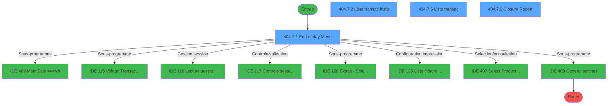
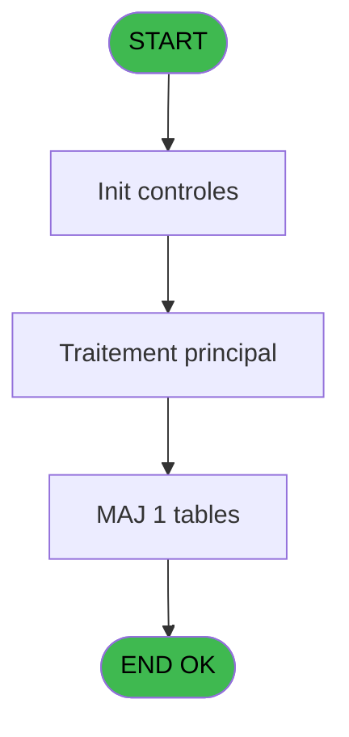
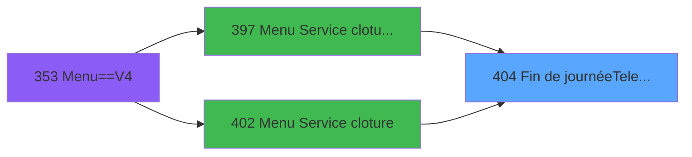
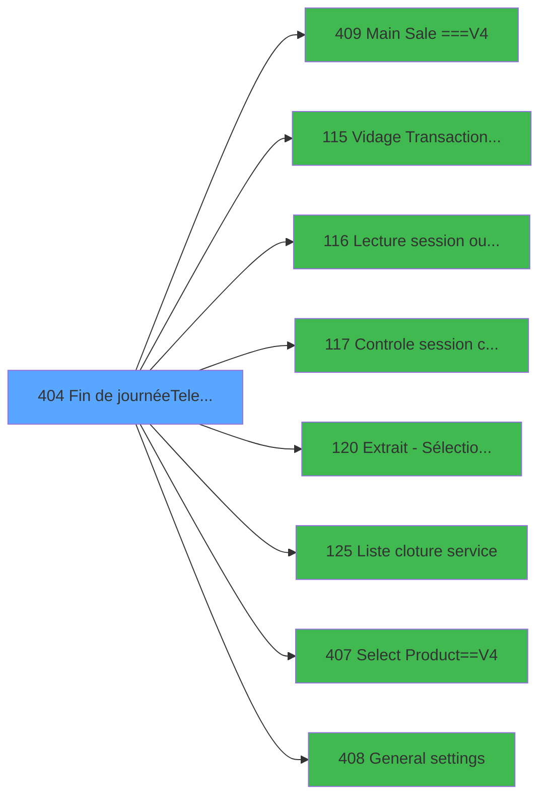

# PVE IDE 404 - Fin de journée(Telecollecte)

> **Analyse**: Phases 1-4 2026-02-03 19:58 -> 19:58 (12s) | Assemblage 19:58
> **Pipeline**: V7.2 Enrichi
> **Structure**: 4 onglets (Resume | Ecrans | Donnees | Connexions)

<!-- TAB:Resume -->

## 1. FICHE D'IDENTITE

| Attribut | Valeur |
|----------|--------|
| Projet | PVE |
| IDE Position | 404 |
| Nom Programme | Fin de journée(Telecollecte) |
| Fichier source | `Prg_404.xml` |
| Dossier IDE | A |
| Taches | 20 (4 ecrans visibles) |
| Tables modifiees | 1 |
| Programmes appeles | 8 |

## 2. DESCRIPTION FONCTIONNELLE

**Fin de journée(Telecollecte)** assure la gestion complete de ce processus, accessible depuis [Menu Service cloture v2 (IDE 397)](PVE-IDE-397.md), [Menu Service cloture (IDE 402)](PVE-IDE-402.md).

Le flux de traitement s'organise en **4 blocs fonctionnels** :

- **Traitement** (16 taches) : traitements metier divers
- **Saisie** (2 taches) : ecrans de saisie utilisateur (formulaires, champs, donnees)
- **Initialisation** (1 tache) : reinitialisation d'etats et de variables de travail
- **Calcul** (1 tache) : calculs de montants, stocks ou compteurs

**Donnees modifiees** : 1 tables en ecriture (communication_ims).

Detail : phases du traitement

#### Phase 1 : Traitement (16 taches)

- **404** - Menu **[[ECRAN]](#ecran-t1)**
- **404.1** - Est un term BOUT
- **404.2** - Est un term BOUT
- **404.4** - Paramètres PAR
- **404.6** - Param caisse
- **404.7** - CV  Autres tables **[[ECRAN]](#ecran-t8)**
- **404.7.1** - End of day Menu **[[ECRAN]](#ecran-t9)**
- **404.7.2** - Liste transac histo **[[ECRAN]](#ecran-t10)**
- **404.7.5** - Liste transac **[[ECRAN]](#ecran-t13)**
- **404.7.6** - Closure Report **[[ECRAN]](#ecran-t14)**
- **404.8** - read FROM_ADH
- **404.9** - read FROM_SKI
- **404.10** - read FROM_VIL sa
- **404.11** - write FROM_ADH
- **404.12** - write FROM_SKI
- **404.13** - write FROM_VIL sa

Delegue a : [Main Sale ===V4 (IDE 409)](PVE-IDE-409.md), [Lecture session ouverte (IDE 116)](PVE-IDE-116.md), [Extrait - Sélection d'un GM (IDE 120)](PVE-IDE-120.md), [Liste cloture service (IDE 125)](PVE-IDE-125.md), [General settings (IDE 408)](PVE-IDE-408.md)

#### Phase 2 : Initialisation (1 tache)

- **404.3** - Initialisation

#### Phase 3 : Calcul (1 tache)

- **404.5** - Date comptable

#### Phase 4 : Saisie (2 taches)

- **404.7.3** - Lance saisie TPE
- **404.7.4** - lance saisie OD

Delegue a : [Vidage Transactions en attente (IDE 115)](PVE-IDE-115.md)

#### Tables impactees

| Table | Operations | Role metier |
|-------|-----------|-------------|
| communication_ims | R/**W** (6 usages) |  |

## 3. BLOCS FONCTIONNELS

### 3.1 Traitement (16 taches)

Traitements internes.

---

#### 404 - Menu [[ECRAN]](#ecran-t1)

**Role** : Tache d'orchestration : point d'entree du programme (16 sous-taches). Coordonne l'enchainement des traitements.
**Ecran** : 875 x 209 DLU (MDI) | [Voir mockup](#ecran-t1)

15 sous-taches directes

| Tache | Nom | Bloc |
|-------|-----|------|
| [404.1](#t2) | Est un term BOUT | Traitement |
| [404.2](#t3) | Est un term BOUT | Traitement |
| [404.4](#t5) | Paramètres PAR | Traitement |
| [404.6](#t7) | Param caisse | Traitement |
| [404.7](#t8) | CV  Autres tables **[[ECRAN]](#ecran-t8)** | Traitement |
| [404.7.1](#t9) | End of day Menu **[[ECRAN]](#ecran-t9)** | Traitement |
| [404.7.2](#t10) | Liste transac histo **[[ECRAN]](#ecran-t10)** | Traitement |
| [404.7.5](#t13) | Liste transac **[[ECRAN]](#ecran-t13)** | Traitement |
| [404.7.6](#t14) | Closure Report **[[ECRAN]](#ecran-t14)** | Traitement |
| [404.8](#t15) | read FROM_ADH | Traitement |
| [404.9](#t16) | read FROM_SKI | Traitement |
| [404.10](#t17) | read FROM_VIL sa | Traitement |
| [404.11](#t18) | write FROM_ADH | Traitement |
| [404.12](#t19) | write FROM_SKI | Traitement |
| [404.13](#t20) | write FROM_VIL sa | Traitement |

---

#### 404.1 - Est un term BOUT

**Role** : Traitement : Est un term BOUT.
**Variables liees** : D (V Terminal IMS), O (V Utilisation bouti), BL (V Activité boutique), BM (V est un term boutique)

---

#### 404.2 - Est un term BOUT

**Role** : Traitement : Est un term BOUT.
**Variables liees** : D (V Terminal IMS), O (V Utilisation bouti), BL (V Activité boutique), BM (V est un term boutique)

---

#### 404.4 - Paramètres PAR

**Role** : Traitement : Paramètres PAR.

---

#### 404.6 - Param caisse

**Role** : Traitement : Param caisse.
**Variables liees** : Q (V Village nouvelle caisse), S (V autorisation parametre caiss)

---

#### 404.7 - CV  Autres tables [[ECRAN]](#ecran-t8)

**Role** : Traitement : CV  Autres tables.
**Ecran** : 2 x 1 DLU (MDI) | [Voir mockup](#ecran-t8)

---

#### 404.7.1 - End of day Menu [[ECRAN]](#ecran-t9)

**Role** : Traitement : End of day Menu.
**Ecran** : 1018 x 280 DLU (MDI) | [Voir mockup](#ecran-t9)

---

#### 404.7.2 - Liste transac histo [[ECRAN]](#ecran-t10)

**Role** : Traitement : Liste transac histo.
**Ecran** : 478 x 122 DLU (MDI) | [Voir mockup](#ecran-t10)
**Variables liees** : W (V Total transaction)

---

#### 404.7.5 - Liste transac [[ECRAN]](#ecran-t13)

**Role** : Traitement : Liste transac.
**Ecran** : 483 x 172 DLU (MDI) | [Voir mockup](#ecran-t13)
**Variables liees** : W (V Total transaction)

---

#### 404.7.6 - Closure Report [[ECRAN]](#ecran-t14)

**Role** : Traitement : Closure Report.
**Ecran** : 475 x 122 DLU (MDI) | [Voir mockup](#ecran-t14)

---

#### 404.8 - read FROM_ADH

**Role** : Traitement : read FROM_ADH.
**Variables liees** : BA (V FROM_ADH)

---

#### 404.9 - read FROM_SKI

**Role** : Traitement : read FROM_SKI.
**Variables liees** : BB (V FROM_SKI)

---

#### 404.10 - read FROM_VIL sa

**Role** : Traitement : read FROM_VIL sa.
**Variables liees** : BC (V FROM_VIL saisie articles)

---

#### 404.11 - write FROM_ADH

**Role** : Traitement : write FROM_ADH.
**Variables liees** : BA (V FROM_ADH)

---

#### 404.12 - write FROM_SKI

**Role** : Traitement : write FROM_SKI.
**Variables liees** : BB (V FROM_SKI)

---

#### 404.13 - write FROM_VIL sa

**Role** : Traitement : write FROM_VIL sa.
**Variables liees** : BC (V FROM_VIL saisie articles)

### 3.2 Initialisation (1 tache)

Reinitialisation d'etats et variables de travail.

---

#### 404.3 - Initialisation

**Role** : Reinitialisation : Initialisation.

### 3.3 Calcul (1 tache)

Calculs metier : montants, stocks, compteurs.

---

#### 404.5 - Date comptable

**Role** : Traitement : Date comptable.
**Variables liees** : U (V Date comptable), Y (V Date ouverture)

### 3.4 Saisie (2 taches)

Ce bloc traite la saisie des donnees de la transaction.

---

#### 404.7.3 - Lance saisie TPE

**Role** : Saisie des donnees : Lance saisie TPE.
**Variables liees** : BC (V FROM_VIL saisie articles)
**Delegue a** : [Vidage Transactions en attente (IDE 115)](PVE-IDE-115.md)

---

#### 404.7.4 - lance saisie OD

**Role** : Saisie des donnees : lance saisie OD.
**Variables liees** : BC (V FROM_VIL saisie articles)
**Delegue a** : [Vidage Transactions en attente (IDE 115)](PVE-IDE-115.md)

## 5. REGLES METIER

*(Aucune regle metier identifiee)*

## 6. CONTEXTE

- **Appele par**: [Menu Service cloture v2 (IDE 397)](PVE-IDE-397.md), [Menu Service cloture (IDE 402)](PVE-IDE-402.md)
- **Appelle**: 8 programmes | **Tables**: 8 (W:1 R:7 L:1) | **Taches**: 20 | **Expressions**: 11

<!-- TAB:Ecrans -->

## 8. ECRANS

### 8.1 Forms visibles (4 / 20)

| # | Position | Tache | Nom | Type | Largeur | Hauteur | Bloc |
|---|----------|-------|-----|------|---------|---------|------|
| 1 | 404.7.1 | 404.7.1 | End of day Menu | MDI | 1018 | 280 | Traitement |
| 2 | 404.7.2 | 404.7.2 | Liste transac histo | MDI | 478 | 122 | Traitement |
| 3 | 404.7.5 | 404.7.5 | Liste transac | MDI | 483 | 172 | Traitement |
| 4 | 404.7.6 | 404.7.6 | Closure Report | MDI | 475 | 122 | Traitement |

### 8.2 Mockups Ecrans

---

#### 404.7.1 - End of day Menu
**Tache** : [404.7.1](#t9) | **Type** : MDI | **Dimensions** : 1018 x 280 DLU
**Bloc** : Traitement | **Titre IDE** : End of day Menu

<!-- FORM-DATA:
{
    "width":  1018,
    "vFactor":  8,
    "type":  "MDI",
    "hFactor":  8,
    "controls":  [
                     {
                         "x":  6,
                         "type":  "label",
                         "var":  "",
                         "y":  5,
                         "w":  1002,
                         "fmt":  "",
                         "name":  "",
                         "h":  26,
                         "color":  "188",
                         "text":  "END OF DAY MENU",
                         "parent":  null
                     },
                     {
                         "x":  8,
                         "type":  "label",
                         "var":  "",
                         "y":  33,
                         "w":  1001,
                         "fmt":  "",
                         "name":  "",
                         "h":  31,
                         "color":  "110",
                         "text":  "",
                         "parent":  null
                     },
                     {
                         "x":  96,
                         "type":  "label",
                         "var":  "",
                         "y":  43,
                         "w":  232,
                         "fmt":  "",
                         "name":  "",
                         "h":  14,
                         "color":  "110",
                         "text":  "Accounting date",
                         "parent":  4
                     },
                     {
                         "x":  808,
                         "type":  "edit",
                         "var":  "",
                         "y":  255,
                         "w":  13,
                         "fmt":  "",
                         "name":  "",
                         "h":  10,
                         "color":  "",
                         "text":  "",
                         "parent":  null
                     },
                     {
                         "x":  343,
                         "type":  "edit",
                         "var":  "",
                         "y":  43,
                         "w":  192,
                         "fmt":  "",
                         "name":  "",
                         "h":  14,
                         "color":  "110",
                         "text":  "",
                         "parent":  4
                     },
                     {
                         "x":  846,
                         "type":  "image",
                         "var":  "",
                         "y":  74,
                         "w":  160,
                         "fmt":  "",
                         "name":  "",
                         "h":  62,
                         "color":  "",
                         "text":  "",
                         "parent":  null
                     },
                     {
                         "x":  44,
                         "type":  "button",
                         "var":  "",
                         "y":  89,
                         "w":  324,
                         "fmt":  "\u0026Statement of Account",
                         "name":  "EXTRAIT",
                         "h":  31,
                         "color":  "",
                         "text":  "",
                         "parent":  null
                     },
                     {
                         "x":  416,
                         "type":  "button",
                         "var":  "",
                         "y":  89,
                         "w":  324,
                         "fmt":  "Input telecollection \u0026TPE",
                         "name":  "TPE",
                         "h":  31,
                         "color":  "",
                         "text":  "",
                         "parent":  null
                     },
                     {
                         "x":  44,
                         "type":  "button",
                         "var":  "",
                         "y":  129,
                         "w":  324,
                         "fmt":  "Input \u0026OD",
                         "name":  "OD",
                         "h":  31,
                         "color":  "",
                         "text":  "",
                         "parent":  null
                     },
                     {
                         "x":  416,
                         "type":  "button",
                         "var":  "",
                         "y":  129,
                         "w":  324,
                         "fmt":  "Input Cash \u0026documents",
                         "name":  "CAISSE",
                         "h":  31,
                         "color":  "",
                         "text":  "",
                         "parent":  null
                     },
                     {
                         "x":  44,
                         "type":  "button",
                         "var":  "",
                         "y":  170,
                         "w":  324,
                         "fmt":  "Transactions \u0026List",
                         "name":  "TRANSLIST",
                         "h":  31,
                         "color":  "",
                         "text":  "",
                         "parent":  null
                     },
                     {
                         "x":  416,
                         "type":  "button",
                         "var":  "",
                         "y":  170,
                         "w":  324,
                         "fmt":  "Transactions \u0026History",
                         "name":  "TRANSHISTO",
                         "h":  31,
                         "color":  "",
                         "text":  "",
                         "parent":  null
                     },
                     {
                         "x":  44,
                         "type":  "button",
                         "var":  "",
                         "y":  210,
                         "w":  324,
                         "fmt":  "\u0026Closure List",
                         "name":  "CLOTURE",
                         "h":  31,
                         "color":  "",
                         "text":  "",
                         "parent":  null
                     },
                     {
                         "x":  821,
                         "type":  "button",
                         "var":  "",
                         "y":  246,
                         "w":  179,
                         "fmt":  "\u0026Exit",
                         "name":  "",
                         "h":  30,
                         "color":  "",
                         "text":  "",
                         "parent":  null
                     }
                 ],
    "taskId":  "404.7.1",
    "height":  280
}
-->

<strong>Champs : 2 champs</strong>

| Pos (x,y) | Nom | Variable | Type |
|-----------|-----|----------|------|
| 808,255 | (sans nom) | - | edit |
| 343,43 | (sans nom) | - | edit |

<strong>Boutons : 8 boutons</strong>

| Bouton | Pos (x,y) | Action |
|--------|-----------|--------|
| Statement of Account | 44,89 | Bouton fonctionnel |
| Input telecollection TPE | 416,89 | Bouton fonctionnel |
| Input OD | 44,129 | Bouton fonctionnel |
| Input Cash documents | 416,129 | Bouton fonctionnel |
| Transactions List | 44,170 | Appel [Vidage Transactions en attente (IDE 115)](PVE-IDE-115.md) |
| Transactions History | 416,170 | Appel [Vidage Transactions en attente (IDE 115)](PVE-IDE-115.md) |
| Closure List | 44,210 | Bouton fonctionnel |
| Exit | 821,246 | Quitte le programme |

---

#### 404.7.2 - Liste transac histo
**Tache** : [404.7.2](#t10) | **Type** : MDI | **Dimensions** : 478 x 122 DLU
**Bloc** : Traitement | **Titre IDE** : Liste transac histo

<!-- FORM-DATA:
{
    "width":  478,
    "vFactor":  8,
    "type":  "MDI",
    "hFactor":  8,
    "controls":  [
                     {
                         "x":  0,
                         "type":  "label",
                         "var":  "",
                         "y":  0,
                         "w":  472,
                         "fmt":  "",
                         "name":  "",
                         "h":  19,
                         "color":  "",
                         "text":  "",
                         "parent":  null
                     },
                     {
                         "x":  293,
                         "type":  "label",
                         "var":  "",
                         "y":  47,
                         "w":  149,
                         "fmt":  "",
                         "name":  "",
                         "h":  9,
                         "color":  "",
                         "text":  "date comptable",
                         "parent":  null
                     },
                     {
                         "x":  2,
                         "type":  "label",
                         "var":  "",
                         "y":  96,
                         "w":  472,
                         "fmt":  "",
                         "name":  "",
                         "h":  24,
                         "color":  "",
                         "text":  "",
                         "parent":  null
                     },
                     {
                         "x":  8,
                         "type":  "button",
                         "var":  "",
                         "y":  100,
                         "w":  154,
                         "fmt":  "",
                         "name":  "bouton quitter",
                         "h":  18,
                         "color":  "",
                         "text":  "",
                         "parent":  7
                     },
                     {
                         "x":  293,
                         "type":  "edit",
                         "var":  "",
                         "y":  63,
                         "w":  149,
                         "fmt":  "",
                         "name":  "v date comptable",
                         "h":  10,
                         "color":  "110",
                         "text":  "",
                         "parent":  null
                     },
                     {
                         "x":  309,
                         "type":  "button",
                         "var":  "",
                         "y":  100,
                         "w":  154,
                         "fmt":  "",
                         "name":  "bouton imprimer",
                         "h":  18,
                         "color":  "",
                         "text":  "",
                         "parent":  null
                     },
                     {
                         "x":  7,
                         "type":  "edit",
                         "var":  "",
                         "y":  5,
                         "w":  192,
                         "fmt":  "30",
                         "name":  "",
                         "h":  8,
                         "color":  "",
                         "text":  "",
                         "parent":  1
                     },
                     {
                         "x":  244,
                         "type":  "edit",
                         "var":  "",
                         "y":  5,
                         "w":  219,
                         "fmt":  "WWW DD MMM YYYYT",
                         "name":  "",
                         "h":  8,
                         "color":  "",
                         "text":  "",
                         "parent":  1
                     },
                     {
                         "x":  59,
                         "type":  "image",
                         "var":  "",
                         "y":  35,
                         "w":  160,
                         "fmt":  "",
                         "name":  "",
                         "h":  50,
                         "color":  "",
                         "text":  "",
                         "parent":  null
                     }
                 ],
    "taskId":  "404.7.2",
    "height":  122
}
-->

<strong>Champs : 3 champs</strong>

| Pos (x,y) | Nom | Variable | Type |
|-----------|-----|----------|------|
| 293,63 | v date comptable | - | edit |
| 7,5 | 30 | - | edit |
| 244,5 | WWW DD MMM YYYYT | - | edit |

<strong>Boutons : 2 boutons</strong>

| Bouton | Pos (x,y) | Action |
|--------|-----------|--------|
| quitter | 8,100 | Quitte le programme |
| imprimer | 309,100 | Lance l'impression |

---

#### 404.7.5 - Liste transac
**Tache** : [404.7.5](#t13) | **Type** : MDI | **Dimensions** : 483 x 172 DLU
**Bloc** : Traitement | **Titre IDE** : Liste transac

<!-- FORM-DATA:
{
    "width":  483,
    "vFactor":  8,
    "type":  "MDI",
    "hFactor":  8,
    "controls":  [
                     {
                         "x":  0,
                         "type":  "label",
                         "var":  "",
                         "y":  0,
                         "w":  472,
                         "fmt":  "",
                         "name":  "",
                         "h":  19,
                         "color":  "",
                         "text":  "",
                         "parent":  null
                     },
                     {
                         "x":  4,
                         "type":  "label",
                         "var":  "",
                         "y":  144,
                         "w":  472,
                         "fmt":  "",
                         "name":  "",
                         "h":  24,
                         "color":  "",
                         "text":  "",
                         "parent":  null
                     },
                     {
                         "x":  163,
                         "type":  "button",
                         "var":  "",
                         "y":  148,
                         "w":  154,
                         "fmt":  "\u0026Exit",
                         "name":  "bouton quitter",
                         "h":  18,
                         "color":  "",
                         "text":  "",
                         "parent":  4
                     },
                     {
                         "x":  163,
                         "type":  "combobox",
                         "var":  "",
                         "y":  49,
                         "w":  154,
                         "fmt":  "",
                         "name":  "TOUT OD VENTES",
                         "h":  12,
                         "color":  "110",
                         "text":  "",
                         "parent":  null
                     },
                     {
                         "x":  50,
                         "type":  "button",
                         "var":  "",
                         "y":  96,
                         "w":  154,
                         "fmt":  "\u0026Screen",
                         "name":  "bouton écran",
                         "h":  18,
                         "color":  "",
                         "text":  "",
                         "parent":  null
                     },
                     {
                         "x":  277,
                         "type":  "button",
                         "var":  "",
                         "y":  96,
                         "w":  154,
                         "fmt":  "\u0026Print",
                         "name":  "bouton imprimer",
                         "h":  18,
                         "color":  "",
                         "text":  "",
                         "parent":  null
                     },
                     {
                         "x":  7,
                         "type":  "edit",
                         "var":  "",
                         "y":  5,
                         "w":  192,
                         "fmt":  "30",
                         "name":  "",
                         "h":  8,
                         "color":  "",
                         "text":  "",
                         "parent":  1
                     },
                     {
                         "x":  244,
                         "type":  "edit",
                         "var":  "",
                         "y":  5,
                         "w":  219,
                         "fmt":  "WWW DD MMM YYYYT",
                         "name":  "",
                         "h":  8,
                         "color":  "",
                         "text":  "",
                         "parent":  1
                     }
                 ],
    "taskId":  "404.7.5",
    "height":  172
}
-->

<strong>Champs : 3 champs</strong>

| Pos (x,y) | Nom | Variable | Type |
|-----------|-----|----------|------|
| 163,49 | TOUT OD VENTES | - | combobox |
| 7,5 | 30 | - | edit |
| 244,5 | WWW DD MMM YYYYT | - | edit |

<strong>Boutons : 3 boutons</strong>

| Bouton | Pos (x,y) | Action |
|--------|-----------|--------|
| Exit | 163,148 | Quitte le programme |
| Screen | 50,96 | Bouton fonctionnel |
| Print | 277,96 | Lance l'impression |

---

#### 404.7.6 - Closure Report
**Tache** : [404.7.6](#t14) | **Type** : MDI | **Dimensions** : 475 x 122 DLU
**Bloc** : Traitement | **Titre IDE** : Closure Report

<!-- FORM-DATA:
{
    "width":  475,
    "vFactor":  8,
    "type":  "MDI",
    "hFactor":  8,
    "controls":  [
                     {
                         "x":  0,
                         "type":  "label",
                         "var":  "",
                         "y":  0,
                         "w":  472,
                         "fmt":  "",
                         "name":  "",
                         "h":  19,
                         "color":  "",
                         "text":  "",
                         "parent":  null
                     },
                     {
                         "x":  293,
                         "type":  "label",
                         "var":  "",
                         "y":  47,
                         "w":  149,
                         "fmt":  "",
                         "name":  "",
                         "h":  9,
                         "color":  "",
                         "text":  "accounting date",
                         "parent":  null
                     },
                     {
                         "x":  2,
                         "type":  "label",
                         "var":  "",
                         "y":  96,
                         "w":  472,
                         "fmt":  "",
                         "name":  "",
                         "h":  24,
                         "color":  "",
                         "text":  "",
                         "parent":  null
                     },
                     {
                         "x":  8,
                         "type":  "button",
                         "var":  "",
                         "y":  100,
                         "w":  154,
                         "fmt":  "\u0026Exit",
                         "name":  "BP. Exit",
                         "h":  18,
                         "color":  "",
                         "text":  "",
                         "parent":  7
                     },
                     {
                         "x":  293,
                         "type":  "edit",
                         "var":  "",
                         "y":  63,
                         "w":  149,
                         "fmt":  "",
                         "name":  "v date comptable",
                         "h":  10,
                         "color":  "110",
                         "text":  "",
                         "parent":  null
                     },
                     {
                         "x":  309,
                         "type":  "button",
                         "var":  "",
                         "y":  100,
                         "w":  154,
                         "fmt":  "\u0026Print",
                         "name":  "BP. Print",
                         "h":  18,
                         "color":  "",
                         "text":  "",
                         "parent":  null
                     },
                     {
                         "x":  7,
                         "type":  "edit",
                         "var":  "",
                         "y":  5,
                         "w":  192,
                         "fmt":  "30",
                         "name":  "",
                         "h":  8,
                         "color":  "",
                         "text":  "",
                         "parent":  1
                     },
                     {
                         "x":  244,
                         "type":  "edit",
                         "var":  "",
                         "y":  5,
                         "w":  219,
                         "fmt":  "WWW DD MMM YYYYT",
                         "name":  "",
                         "h":  8,
                         "color":  "",
                         "text":  "",
                         "parent":  1
                     },
                     {
                         "x":  59,
                         "type":  "image",
                         "var":  "",
                         "y":  35,
                         "w":  160,
                         "fmt":  "",
                         "name":  "",
                         "h":  50,
                         "color":  "",
                         "text":  "",
                         "parent":  null
                     }
                 ],
    "taskId":  "404.7.6",
    "height":  122
}
-->

<strong>Champs : 3 champs</strong>

| Pos (x,y) | Nom | Variable | Type |
|-----------|-----|----------|------|
| 293,63 | v date comptable | - | edit |
| 7,5 | 30 | - | edit |
| 244,5 | WWW DD MMM YYYYT | - | edit |

<strong>Boutons : 2 boutons</strong>

| Bouton | Pos (x,y) | Action |
|--------|-----------|--------|
| Exit | 8,100 | Quitte le programme |
| Print | 309,100 | Lance l'impression |

## 9. NAVIGATION

### 9.1 Enchainement des ecrans

**Detail par enchainement :**

| Depuis | Action | Vers | Retour |
|--------|--------|------|--------|
| End of day Menu | Sous-programme | [Main Sale ===V4 (IDE 409)](PVE-IDE-409.md) | Retour ecran |
| End of day Menu | Sous-programme | [Vidage Transactions en attente (IDE 115)](PVE-IDE-115.md) | Retour ecran |
| End of day Menu | Gestion session | [Lecture session ouverte (IDE 116)](PVE-IDE-116.md) | Retour ecran |
| End of day Menu | Controle/validation | [Controle session caisse (IDE 117)](PVE-IDE-117.md) | Retour ecran |
| End of day Menu | Sous-programme | [Extrait - Sélection d'un GM (IDE 120)](PVE-IDE-120.md) | Retour ecran |
| End of day Menu | Configuration impression | [Liste cloture service (IDE 125)](PVE-IDE-125.md) | Retour ecran |
| End of day Menu | Selection/consultation | [Select Product==V4 (IDE 407)](PVE-IDE-407.md) | Retour ecran |
| End of day Menu | Sous-programme | [General settings (IDE 408)](PVE-IDE-408.md) | Retour ecran |

### 9.3 Structure hierarchique (20 taches)

| Position | Tache | Type | Dimensions | Bloc |
|----------|-------|------|------------|------|
| **404.1** | [**Menu** (404)](#t1) [mockup](#ecran-t1) | MDI | 875x209 | Traitement |
| 404.1.1 | [Est un term BOUT (404.1)](#t2) | MDI | - | |
| 404.1.2 | [Est un term BOUT (404.2)](#t3) | MDI | - | |
| 404.1.3 | [Paramètres PAR (404.4)](#t5) | MDI | - | |
| 404.1.4 | [Param caisse (404.6)](#t7) | MDI | - | |
| 404.1.5 | [CV  Autres tables (404.7)](#t8) [mockup](#ecran-t8) | MDI | 2x1 | |
| 404.1.6 | [End of day Menu (404.7.1)](#t9) [mockup](#ecran-t9) | MDI | 1018x280 | |
| 404.1.7 | [Liste transac histo (404.7.2)](#t10) [mockup](#ecran-t10) | MDI | 478x122 | |
| 404.1.8 | [Liste transac (404.7.5)](#t13) [mockup](#ecran-t13) | MDI | 483x172 | |
| 404.1.9 | [Closure Report (404.7.6)](#t14) [mockup](#ecran-t14) | MDI | 475x122 | |
| 404.1.10 | [read FROM_ADH (404.8)](#t15) | MDI | - | |
| 404.1.11 | [read FROM_SKI (404.9)](#t16) | MDI | - | |
| 404.1.12 | [read FROM_VIL sa (404.10)](#t17) | MDI | - | |
| 404.1.13 | [write FROM_ADH (404.11)](#t18) | MDI | - | |
| 404.1.14 | [write FROM_SKI (404.12)](#t19) | MDI | - | |
| 404.1.15 | [write FROM_VIL sa (404.13)](#t20) | MDI | - | |
| **404.2** | [**Initialisation** (404.3)](#t4) | MDI | - | Initialisation |
| **404.3** | [**Date comptable** (404.5)](#t6) | MDI | - | Calcul |
| **404.4** | [**Lance saisie TPE** (404.7.3)](#t11) | MDI | - | Saisie |
| 404.4.1 | [lance saisie OD (404.7.4)](#t12) | MDI | - | |

### 9.4 Algorigramme

> **Legende**: Vert = START/END OK | Rouge = END KO | Bleu = Decisions
> *Algorigramme auto-genere. Utiliser `/algorigramme` pour une synthese metier detaillee.*

<!-- TAB:Donnees -->

## 10. TABLES

### Tables utilisees (8)

| ID | Nom | Description | Type | R | W | L | Usages |
|----|-----|-------------|------|---|---|---|--------|
| 63 | parametres___par |  | DB | R |   |   | 1 |
| 69 | initialisation___ini |  | DB | R |   |   | 1 |
| 70 | date_comptable___dat |  | DB | R |   |   | 1 |
| 71 | derniere_purge___pur |  | DB | R |   |   | 1 |
| 219 | communication_ims |  | DB | R | **W** |   | 6 |
| 256 | terminaux_boutique |  | DB | R |   |   | 2 |
| 697 | droits_applications | Droits operateur | DB | R |   |   | 1 |
| 728 | arc_cc_total |  | DB |   |   | L | 1 |

### Colonnes par table (5 / 7 tables avec colonnes identifiees)

Table 63 - parametres___par (R) - 1 usages

| Lettre | Variable | Acces | Type |
|--------|----------|-------|------|
| D | Autorisation parametres | R | Logical |

Table 69 - initialisation___ini (R) - 1 usages

*Table utilisee uniquement en Link ou aucune colonne Real identifiee dans le DataView.*

Table 70 - date_comptable___dat (R) - 1 usages

| Lettre | Variable | Acces | Type |
|--------|----------|-------|------|
| A | DATE DEMANDEE | R | Date |
| B | v date comptable | R | Date |
| U | V Date comptable | R | Date |
| Y | V Date ouverture | R | Date |

Table 71 - derniere_purge___pur (R) - 1 usages

| Lettre | Variable | Acces | Type |
|--------|----------|-------|------|
| A | bouton quitter | R | Alpha |
| B | v date comptable | R | Date |
| C | bouton imprimer | R | Alpha |

Table 219 - communication_ims (R/**W**) - 6 usages

*Table utilisee uniquement en Link ou aucune colonne Real identifiee dans le DataView.*

Table 256 - terminaux_boutique (R) - 2 usages

| Lettre | Variable | Acces | Type |
|--------|----------|-------|------|
| BL | V Activité boutique | R | Numeric |
| BM | V est un term boutique | R | Logical |

Table 697 - droits_applications (R) - 1 usages

*Table utilisee uniquement en Link ou aucune colonne Real identifiee dans le DataView.*

## 11. VARIABLES

### 11.1 Variables de session (39)

Variables persistantes pendant toute la session.

| Lettre | Nom | Type | Usage dans |
|--------|-----|------|-----------|
| A | V Société | Alpha | - |
| B | V Service | Alpha | - |
| C | V Service Libellé | Alpha | - |
| D | V Terminal IMS | Alpha | - |
| E | V Village CAM | Alpha | - |
| F | V Village TEL | Alpha | - |
| G | V Village BIBOP | Alpha | - |
| H | V Nb décimales | Numeric | - |
| I | V Devise locale | Alpha | - |
| J | V Code village | Alpha | - |
| K | V Nom village | Alpha | - |
| L | V Masque montant | Alpha | - |
| M | V Choix action | Alpha | 1x session |
| N | V Utilisation caiss | Alpha | - |
| O | V Utilisation bouti | Alpha | - |
| P | V Village PME | Alpha | - |
| Q | V Village nouvelle caisse | Alpha | - |
| R | V Fin tache | Alpha | 1x session |
| S | V autorisation parametre caiss | Logical | - |
| T | V uniBi | Alpha | - |
| U | V Date comptable | Date | - |
| V | V Masque cumul | Alpha | - |
| W | V Total transaction | Numeric | - |
| X | V Chrono session | Numeric | - |
| Y | V Date ouverture | Date | - |
| Z | V Time ouverture | Time | - |
| BA | V FROM_ADH | Alpha | - |
| BB | V FROM_SKI | Alpha | - |
| BC | V FROM_VIL saisie articles | Alpha | - |
| BD | V user déjà connecté | Logical | - |
| BE | V Service IMS sans session 1 | Alpha | - |
| BF | V Service IMS sans session 2 | Alpha | - |
| BG | V Service IMS sans session 3 | Alpha | - |
| BH | V Service IMS sans session 4 | Alpha | - |
| BI | V Service IMS sans session 5 | Alpha | - |
| BJ | V Cloture auto | Logical | - |
| BK | V est un service BarSpaSkiBou | Logical | - |
| BL | V Activité boutique | Numeric | - |
| BM | V est un term boutique | Logical | - |

Toutes les 39 variables (liste complete)

| Cat | Lettre | Nom Variable | Type |
|-----|--------|--------------|------|
| V. | **A** | V Société | Alpha |
| V. | **B** | V Service | Alpha |
| V. | **C** | V Service Libellé | Alpha |
| V. | **D** | V Terminal IMS | Alpha |
| V. | **E** | V Village CAM | Alpha |
| V. | **F** | V Village TEL | Alpha |
| V. | **G** | V Village BIBOP | Alpha |
| V. | **H** | V Nb décimales | Numeric |
| V. | **I** | V Devise locale | Alpha |
| V. | **J** | V Code village | Alpha |
| V. | **K** | V Nom village | Alpha |
| V. | **L** | V Masque montant | Alpha |
| V. | **M** | V Choix action | Alpha |
| V. | **N** | V Utilisation caiss | Alpha |
| V. | **O** | V Utilisation bouti | Alpha |
| V. | **P** | V Village PME | Alpha |
| V. | **Q** | V Village nouvelle caisse | Alpha |
| V. | **R** | V Fin tache | Alpha |
| V. | **S** | V autorisation parametre caiss | Logical |
| V. | **T** | V uniBi | Alpha |
| V. | **U** | V Date comptable | Date |
| V. | **V** | V Masque cumul | Alpha |
| V. | **W** | V Total transaction | Numeric |
| V. | **X** | V Chrono session | Numeric |
| V. | **Y** | V Date ouverture | Date |
| V. | **Z** | V Time ouverture | Time |
| V. | **BA** | V FROM_ADH | Alpha |
| V. | **BB** | V FROM_SKI | Alpha |
| V. | **BC** | V FROM_VIL saisie articles | Alpha |
| V. | **BD** | V user déjà connecté | Logical |
| V. | **BE** | V Service IMS sans session 1 | Alpha |
| V. | **BF** | V Service IMS sans session 2 | Alpha |
| V. | **BG** | V Service IMS sans session 3 | Alpha |
| V. | **BH** | V Service IMS sans session 4 | Alpha |
| V. | **BI** | V Service IMS sans session 5 | Alpha |
| V. | **BJ** | V Cloture auto | Logical |
| V. | **BK** | V est un service BarSpaSkiBou | Logical |
| V. | **BL** | V Activité boutique | Numeric |
| V. | **BM** | V est un term boutique | Logical |

## 12. EXPRESSIONS

**11 / 11 expressions decodees (100%)**

### 12.1 Repartition par type

| Type | Expressions | Regles |
|------|-------------|--------|
| CONSTANTE | 3 | 0 |
| OTHER | 2 | 0 |
| CONDITION | 3 | 0 |
| NEGATION | 1 | 0 |
| REFERENCE_VG | 1 | 0 |
| STRING | 1 | 0 |

### 12.2 Expressions cles par type

#### CONSTANTE (3 expressions)

| Type | IDE | Expression | Regle |
|------|-----|------------|-------|
| CONSTANTE | 9 | `''` | - |
| CONSTANTE | 8 | `'B'` | - |
| CONSTANTE | 1 | `'C'` | - |

#### OTHER (2 expressions)

| Type | IDE | Expression | Regle |
|------|-----|------------|-------|
| OTHER | 3 | `GetParam ('SERVICELIB')` | - |
| OTHER | 2 | `GetParam ('SERVICE')` | - |

#### CONDITION (3 expressions)

| Type | IDE | Expression | Regle |
|------|-----|------------|-------|
| CONDITION | 7 | `[AA]='O'` | - |
| CONDITION | 5 | `V Choix action [M]='B'` | - |
| CONDITION | 4 | `V Fin tache [R]='F'` | - |

#### NEGATION (1 expressions)

| Type | IDE | Expression | Regle |
|------|-----|------------|-------|
| NEGATION | 10 | `NOT VG104` | - |

#### REFERENCE_VG (1 expressions)

| Type | IDE | Expression | Regle |
|------|-----|------------|-------|
| REFERENCE_VG | 11 | `VG104` | - |

#### STRING (1 expressions)

| Type | IDE | Expression | Regle |
|------|-----|------------|-------|
| STRING | 6 | `Str (VG105,'#3')` | - |

<!-- TAB:Connexions -->

## 13. GRAPHE D'APPELS

### 13.1 Chaine depuis Main (Callers)

Main -> ... -> [Menu Service cloture v2 (IDE 397)](PVE-IDE-397.md) -> **Fin de journée(Telecollecte) (IDE 404)**

Main -> ... -> [Menu Service cloture (IDE 402)](PVE-IDE-402.md) -> **Fin de journée(Telecollecte) (IDE 404)**

### 13.2 Callers

| IDE | Nom Programme | Nb Appels |
|-----|---------------|-----------|
| [397](PVE-IDE-397.md) | Menu Service cloture v2 | 1 |
| [402](PVE-IDE-402.md) | Menu Service cloture | 1 |

### 13.3 Callees (programmes appeles)

### 13.4 Detail Callees avec contexte

| IDE | Nom Programme | Appels | Contexte |
|-----|---------------|--------|----------|
| [409](PVE-IDE-409.md) | Main Sale ===V4 | 2 | Sous-programme |
| [115](PVE-IDE-115.md) | Vidage Transactions en attente | 1 | Sous-programme |
| [116](PVE-IDE-116.md) | Lecture session ouverte | 1 | Gestion session |
| [117](PVE-IDE-117.md) | Controle session caisse | 1 | Controle/validation |
| [120](PVE-IDE-120.md) | Extrait - Sélection d'un GM | 1 | Sous-programme |
| [125](PVE-IDE-125.md) | Liste cloture service | 1 | Configuration impression |
| [407](PVE-IDE-407.md) | Select Product==V4 | 1 | Selection/consultation |
| [408](PVE-IDE-408.md) | General settings | 1 | Sous-programme |

## 14. RECOMMANDATIONS MIGRATION

### 14.1 Profil du programme

| Metrique | Valeur | Impact migration |
|----------|--------|-----------------|
| Lignes de logique | 336 | Taille moyenne |
| Expressions | 11 | Peu de logique |
| Tables WRITE | 1 | Impact faible |
| Sous-programmes | 8 | Dependances moderees |
| Ecrans visibles | 4 | Quelques ecrans |
| Code desactive | 1.2% (4 / 336) | Code sain |
| Regles metier | 0 | Pas de regle identifiee |

### 14.2 Plan de migration par bloc

#### Traitement (16 taches: 6 ecrans, 10 traitements)

- **Strategie** : Orchestrateur avec 6 ecrans (Razor/React) et 10 traitements backend (services).
- Les ecrans deviennent des composants UI, les traitements invisibles deviennent des services injectables.
- 8 sous-programme(s) a migrer ou a reutiliser depuis les services existants.
- Decomposer les taches en services unitaires testables.

#### Initialisation (1 tache: 0 ecran, 1 traitement)

- **Strategie** : Constructeur/methode `InitAsync()` dans l'orchestrateur.

#### Calcul (1 tache: 0 ecran, 1 traitement)

- **Strategie** : Services de calcul purs (Domain Services).
- Migrer la logique de calcul (stock, compteurs, montants)

#### Saisie (2 taches: 0 ecran, 2 traitements)

- **Strategie** : Formulaire React/Blazor avec validation Zod/FluentValidation.
- Validation temps reel cote client + serveur

### 14.3 Dependances critiques

| Dependance | Type | Appels | Impact |
|------------|------|--------|--------|
| communication_ims | Table WRITE (Database) | 3x | Schema + repository |
| [Main Sale ===V4 (IDE 409)](PVE-IDE-409.md) | Sous-programme | 2x | Haute - Sous-programme |
| [Liste cloture service (IDE 125)](PVE-IDE-125.md) | Sous-programme | 1x | Normale - Configuration impression |
| [Select Product==V4 (IDE 407)](PVE-IDE-407.md) | Sous-programme | 1x | Normale - Selection/consultation |
| [General settings (IDE 408)](PVE-IDE-408.md) | Sous-programme | 1x | Normale - Sous-programme |
| [Extrait - Sélection d'un GM (IDE 120)](PVE-IDE-120.md) | Sous-programme | 1x | Normale - Sous-programme |
| [Vidage Transactions en attente (IDE 115)](PVE-IDE-115.md) | Sous-programme | 1x | Normale - Sous-programme |
| [Lecture session ouverte (IDE 116)](PVE-IDE-116.md) | Sous-programme | 1x | Normale - Gestion session |
| [Controle session caisse (IDE 117)](PVE-IDE-117.md) | Sous-programme | 1x | Normale - Controle/validation |

---
*Spec DETAILED generee par Pipeline V7.2 - 2026-02-03 19:58*
