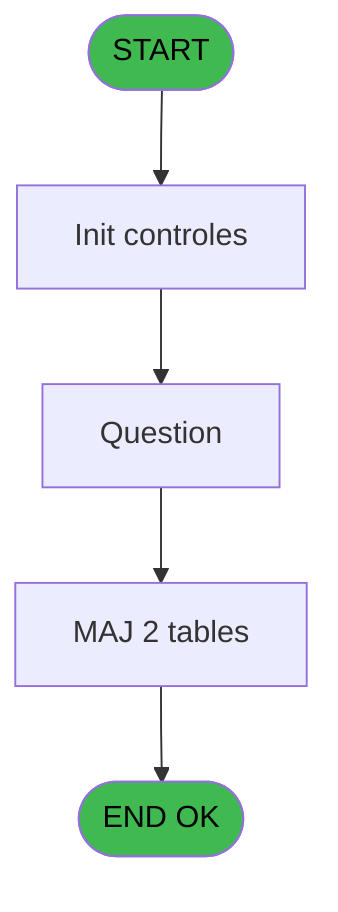
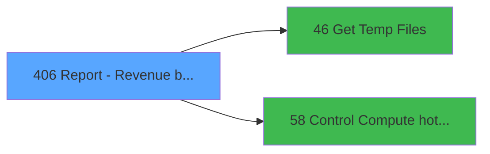

# PVE IDE 406 - Report - Revenue by Seller NEW

> **Analyse**: Phases 1-4 2026-02-03 19:58 -> 19:59 (11s) | Assemblage 19:59
> **Pipeline**: V7.2 Enrichi
> **Structure**: 4 onglets (Resume | Ecrans | Donnees | Connexions)

<!-- TAB:Resume -->

## 1. FICHE D'IDENTITE

| Attribut | Valeur |
|----------|--------|
| Projet | PVE |
| IDE Position | 406 |
| Nom Programme | Report - Revenue by Seller NEW |
| Fichier source | `Prg_406.xml` |
| Dossier IDE | A |
| Taches | 8 (1 ecrans visibles) |
| Tables modifiees | 2 |
| Programmes appeles | 2 |
| :warning: Statut | **ORPHELIN_POTENTIEL** |

## 2. DESCRIPTION FONCTIONNELLE

**Report - Revenue by Seller NEW** assure la gestion complete de ce processus.

Le flux de traitement s'organise en **4 blocs fonctionnels** :

- **Traitement** (4 taches) : traitements metier divers
- **Saisie** (2 taches) : ecrans de saisie utilisateur (formulaires, champs, donnees)
- **Impression** (1 tache) : generation de tickets et documents
- **Creation** (1 tache) : insertion d'enregistrements en base (mouvements, prestations)

**Donnees modifiees** : 2 tables en ecriture (Table_1470, Table_1471).

Detail : phases du traitement

#### Phase 1 : Traitement (4 taches)

- **406** - Report - Revenue by seller **[[ECRAN]](#ecran-t1)**
- **406.1.1** - Lines **[[ECRAN]](#ecran-t3)**
- **406.1.4** - Lines **[[ECRAN]](#ecran-t7)**
- **406.2** - Question **[[ECRAN]](#ecran-t8)**

Delegue a : [Get Temp Files (IDE 46)](PVE-IDE-46.md), [Control & Compute hotel days (IDE 58)](PVE-IDE-58.md)

#### Phase 2 : Impression (1 tache)

- **406.1** - Print

#### Phase 3 : Creation (1 tache)

- **406.1.1.1** - Creation

#### Phase 4 : Saisie (2 taches)

- **406.1.2** - Verif ventes periode
- **406.1.3** - Verif ventes periode

#### Tables impactees

| Table | Operations | Role metier |
|-------|-----------|-------------|
| Table_1471 | **W**/L (4 usages) |  |
| Table_1470 | R/**W** (2 usages) |  |

## 3. BLOCS FONCTIONNELS

### 3.1 Traitement (4 taches)

Traitements internes.

---

#### 406 - Report - Revenue by seller [[ECRAN]](#ecran-t1)

**Role** : Traitement : Report - Revenue by seller.
**Ecran** : 312 x 57 DLU (MDI) | [Voir mockup](#ecran-t1)

3 sous-taches directes

| Tache | Nom | Bloc |
|-------|-----|------|
| [406.1.1](#t3) | Lines **[[ECRAN]](#ecran-t3)** | Traitement |
| [406.1.4](#t7) | Lines **[[ECRAN]](#ecran-t7)** | Traitement |
| [406.2](#t8) | Question **[[ECRAN]](#ecran-t8)** | Traitement |

**Delegue a** : [Get Temp Files (IDE 46)](PVE-IDE-46.md), [Control & Compute hotel days (IDE 58)](PVE-IDE-58.md)

---

#### 406.1.1 - Lines [[ECRAN]](#ecran-t3)

**Role** : Traitement : Lines.
**Ecran** : 773 x 264 DLU (MDI) | [Voir mockup](#ecran-t3)
**Delegue a** : [Get Temp Files (IDE 46)](PVE-IDE-46.md), [Control & Compute hotel days (IDE 58)](PVE-IDE-58.md)

---

#### 406.1.4 - Lines [[ECRAN]](#ecran-t7)

**Role** : Traitement : Lines.
**Ecran** : 773 x 264 DLU (MDI) | [Voir mockup](#ecran-t7)
**Delegue a** : [Get Temp Files (IDE 46)](PVE-IDE-46.md), [Control & Compute hotel days (IDE 58)](PVE-IDE-58.md)

---

#### 406.2 - Question [[ECRAN]](#ecran-t8)

**Role** : Traitement : Question.
**Ecran** : 638 x 223 DLU | [Voir mockup](#ecran-t8)
**Delegue a** : [Get Temp Files (IDE 46)](PVE-IDE-46.md), [Control & Compute hotel days (IDE 58)](PVE-IDE-58.md)

### 3.2 Impression (1 tache)

Generation des documents et tickets.

---

#### 406.1 - Print

**Role** : Generation du document : Print.

### 3.3 Creation (1 tache)

Insertion de nouveaux enregistrements en base.

---

#### 406.1.1.1 - Creation

**Role** : Creation d'enregistrement : Creation.

### 3.4 Saisie (2 taches)

Ce bloc traite la saisie des donnees de la transaction.

---

#### 406.1.2 - Verif ventes periode

**Role** : Saisie des donnees : Verif ventes periode.

---

#### 406.1.3 - Verif ventes periode

**Role** : Saisie des donnees : Verif ventes periode.

## 5. REGLES METIER

*(Aucune regle metier identifiee)*

## 6. CONTEXTE

- **Appele par**: (aucun)
- **Appelle**: 2 programmes | **Tables**: 5 (W:2 R:2 L:3) | **Taches**: 8 | **Expressions**: 3

<!-- TAB:Ecrans -->

## 8. ECRANS

### 8.1 Forms visibles (1 / 8)

| # | Position | Tache | Nom | Type | Largeur | Hauteur | Bloc |
|---|----------|-------|-----|------|---------|---------|------|
| 1 | 406.2 | 406.2 | Question | Type0 | 638 | 223 | Traitement |

### 8.2 Mockups Ecrans

---

#### 406.2 - Question
**Tache** : [406.2](#t8) | **Type** : Type0 | **Dimensions** : 638 x 223 DLU
**Bloc** : Traitement | **Titre IDE** : Question

<!-- FORM-DATA:
{
    "width":  638,
    "vFactor":  8,
    "type":  "Type0",
    "hFactor":  4,
    "controls":  [
                     {
                         "x":  5,
                         "type":  "label",
                         "var":  "",
                         "y":  43,
                         "w":  222,
                         "fmt":  "",
                         "name":  "",
                         "h":  130,
                         "color":  "183",
                         "text":  "",
                         "parent":  null
                     },
                     {
                         "x":  231,
                         "type":  "label",
                         "var":  "",
                         "y":  43,
                         "w":  150,
                         "fmt":  "",
                         "name":  "",
                         "h":  130,
                         "color":  "183",
                         "text":  "",
                         "parent":  null
                     },
                     {
                         "x":  386,
                         "type":  "label",
                         "var":  "",
                         "y":  43,
                         "w":  250,
                         "fmt":  "",
                         "name":  "",
                         "h":  130,
                         "color":  "183",
                         "text":  "",
                         "parent":  null
                     },
                     {
                         "x":  273,
                         "type":  "label",
                         "var":  "",
                         "y":  47,
                         "w":  62,
                         "fmt":  "",
                         "name":  "",
                         "h":  15,
                         "color":  "187",
                         "text":  "Output",
                         "parent":  2
                     },
                     {
                         "x":  7,
                         "type":  "label",
                         "var":  "",
                         "y":  50,
                         "w":  215,
                         "fmt":  "",
                         "name":  "",
                         "h":  10,
                         "color":  "187",
                         "text":  "Select the accounting period you want to print",
                         "parent":  null
                     },
                     {
                         "x":  12,
                         "type":  "label",
                         "var":  "",
                         "y":  66,
                         "w":  48,
                         "fmt":  "",
                         "name":  "",
                         "h":  12,
                         "color":  "183",
                         "text":  "Date min",
                         "parent":  null
                     },
                     {
                         "x":  12,
                         "type":  "label",
                         "var":  "",
                         "y":  90,
                         "w":  51,
                         "fmt":  "",
                         "name":  "",
                         "h":  12,
                         "color":  "183",
                         "text":  "Date max",
                         "parent":  null
                     },
                     {
                         "x":  5,
                         "type":  "label",
                         "var":  "",
                         "y":  179,
                         "w":  631,
                         "fmt":  "",
                         "name":  "",
                         "h":  43,
                         "color":  "183",
                         "text":  "",
                         "parent":  null
                     },
                     {
                         "x":  1,
                         "type":  "label",
                         "var":  "",
                         "y":  1,
                         "w":  635,
                         "fmt":  "",
                         "name":  "",
                         "h":  41,
                         "color":  "182",
                         "text":  "",
                         "parent":  null
                     },
                     {
                         "x":  14,
                         "type":  "label",
                         "var":  "",
                         "y":  17,
                         "w":  243,
                         "fmt":  "",
                         "name":  "",
                         "h":  10,
                         "color":  "186",
                         "text":  "Accounting period and print options",
                         "parent":  11
                     },
                     {
                         "x":  67,
                         "type":  "edit",
                         "var":  "",
                         "y":  66,
                         "w":  73,
                         "fmt":  "",
                         "name":  "P Date mini",
                         "h":  12,
                         "color":  "110",
                         "text":  "",
                         "parent":  null
                     },
                     {
                         "x":  68,
                         "type":  "edit",
                         "var":  "",
                         "y":  89,
                         "w":  72,
                         "fmt":  "",
                         "name":  "P Date maxi",
                         "h":  12,
                         "color":  "110",
                         "text":  "",
                         "parent":  null
                     },
                     {
                         "x":  238,
                         "type":  "listbox",
                         "var":  "",
                         "y":  73,
                         "w":  133,
                         "fmt":  "",
                         "name":  "V Printer/Extract",
                         "h":  32,
                         "color":  "110",
                         "text":  "Printer,Extraction",
                         "parent":  2
                     },
                     {
                         "x":  392,
                         "type":  "radio",
                         "var":  "",
                         "y":  62,
                         "w":  162,
                         "fmt":  "",
                         "name":  "vChoix Edition",
                         "h":  98,
                         "color":  "183",
                         "text":  "1 Total, 2 Total per category,3  Total per sub category,4  Total per product,5  Total on the selected period",
                         "parent":  null
                     },
                     {
                         "x":  586,
                         "type":  "image",
                         "var":  "",
                         "y":  4,
                         "w":  48,
                         "fmt":  "",
                         "name":  "",
                         "h":  37,
                         "color":  "",
                         "text":  "",
                         "parent":  13
                     },
                     {
                         "x":  13,
                         "type":  "button",
                         "var":  "",
                         "y":  185,
                         "w":  68,
                         "fmt":  "\u0026Cancel",
                         "name":  "",
                         "h":  28,
                         "color":  "",
                         "text":  "",
                         "parent":  10
                     },
                     {
                         "x":  91,
                         "type":  "button",
                         "var":  "",
                         "y":  185,
                         "w":  68,
                         "fmt":  "\u0026Execute",
                         "name":  "",
                         "h":  28,
                         "color":  "",
                         "text":  "",
                         "parent":  10
                     }
                 ],
    "taskId":  "406.2",
    "height":  223
}
-->

<strong>Champs : 2 champs</strong>

| Pos (x,y) | Nom | Variable | Type |
|-----------|-----|----------|------|
| 67,66 | P Date mini | - | edit |
| 68,89 | P Date maxi | - | edit |

<strong>Boutons : 2 boutons</strong>

| Bouton | Pos (x,y) | Action |
|--------|-----------|--------|
| Cancel | 13,185 | Annule et retour au menu |
| Execute | 91,185 | Bouton fonctionnel |

## 9. NAVIGATION

Ecran unique: **Question**

### 9.3 Structure hierarchique (8 taches)

| Position | Tache | Type | Dimensions | Bloc |
|----------|-------|------|------------|------|
| **406.1** | [**Report - Revenue by seller** (406)](#t1) [mockup](#ecran-t1) | MDI | 312x57 | Traitement |
| 406.1.1 | [Lines (406.1.1)](#t3) [mockup](#ecran-t3) | MDI | 773x264 | |
| 406.1.2 | [Lines (406.1.4)](#t7) [mockup](#ecran-t7) | MDI | 773x264 | |
| 406.1.3 | [Question (406.2)](#t8) [mockup](#ecran-t8) | - | 638x223 | |
| **406.2** | [**Print** (406.1)](#t2) | MDI | - | Impression |
| **406.3** | [**Creation** (406.1.1.1)](#t4) | - | - | Creation |
| **406.4** | [**Verif ventes periode** (406.1.2)](#t5) | - | - | Saisie |
| 406.4.1 | [Verif ventes periode (406.1.3)](#t6) | - | - | |

### 9.4 Algorigramme

> **Legende**: Vert = START/END OK | Rouge = END KO | Bleu = Decisions
> *Algorigramme auto-genere. Utiliser `/algorigramme` pour une synthese metier detaillee.*

<!-- TAB:Donnees -->

## 10. TABLES

### Tables utilisees (5)

| ID | Nom | Description | Type | R | W | L | Usages |
|----|-----|-------------|------|---|---|---|--------|
| 379 | pv_customer_temp |  | DB | R |   |   | 2 |
| 413 | pv_tva |  | DB |   |   | L | 2 |
| 765 | tranche_age |  | DB |   |   | L | 2 |
| 1470 | Table_1470 |  | MEM | R | **W** |   | 2 |
| 1471 | Table_1471 |  | MEM |   | **W** | L | 4 |

### Colonnes par table (1 / 3 tables avec colonnes identifiees)

Table 379 - pv_customer_temp (R) - 2 usages

| Lettre | Variable | Acces | Type |
|--------|----------|-------|------|
| A | Mont-TTC | R | Numeric |
| B | Mont-HT | R | Numeric |
| C | Mont-TVA | R | Numeric |
| D | Total Vendeur HT | R | Numeric |
| E | Total Vendeur TTC | R | Numeric |
| F | Total Vendeur TVA | R | Numeric |
| G | Dispatch | R | Numeric |
| H | Total Cat HT | R | Numeric |
| I | Total Cat TTC | R | Numeric |
| J | Total Cat TVA | R | Numeric |
| K | Total Sous_Cat HT | R | Numeric |
| L | Total Sous_Cat TTC | R | Numeric |
| M | Total Sous_Cat TVA | R | Numeric |
| N | Total Produit HT | R | Numeric |
| O | Total Produit TTC | R | Numeric |
| P | Total Produit TVA | R | Numeric |
| Q | Total Final HT | R | Numeric |
| R | Total Final TVA | R | Numeric |
| S | Total FinalTTC | R | Numeric |
| T | v.Ligne | R | Alpha |
| U | v.Entete CSV | R | Logical |

Table 1470 - Table_1470 (R/**W**) - 2 usages

*Table utilisee uniquement en Link ou aucune colonne Real identifiee dans le DataView.*

Table 1471 - Table_1471 (**W**/L) - 4 usages

*Table utilisee uniquement en Link ou aucune colonne Real identifiee dans le DataView.*

## 11. VARIABLES

### 11.1 Parametres entrants (5)

Variables recues en parametre.

| Lettre | Nom | Type | Usage dans |
|--------|-----|------|-----------|
| A | P. Village Name | Alpha | - |
| B | P. Currency | Alpha | - |
| C | P. Masque | Alpha | - |
| D | P. Masque sans Z | Alpha | - |
| E | P. Decimales | Numeric | - |

### 11.2 Variables de session (9)

Variables persistantes pendant toute la session.

| Lettre | Nom | Type | Usage dans |
|--------|-----|------|-----------|
| F | v Période nombre JH | Numeric | 1x session |
| G | v Jours période | Numeric | - |
| H | v.Date Anomalie | Date | - |
| I | v Date mini | Date | 1x session |
| J | v Date maxi | Date | 1x session |
| K | v.Output | Alpha | - |
| M | v.Execute | Logical | - |
| T | v.Ligne | Alpha | - |
| U | v.Entete CSV | Logical | - |

### 11.3 Autres (7)

Variables diverses.

| Lettre | Nom | Type | Usage dans |
|--------|-----|------|-----------|
| L | vChoix Edition | Alpha | - |
| N | S | Alpha | 1x refs |
| O | Total Produit TTC | Numeric | - |
| P | Total Produit TVA | Numeric | - |
| Q | Total Final HT | Numeric | - |
| R | Total Final TVA | Numeric | - |
| S | Total FinalTTC | Numeric | - |

Toutes les 21 variables (liste complete)

| Cat | Lettre | Nom Variable | Type |
|-----|--------|--------------|------|
| P0 | **A** | P. Village Name | Alpha |
| P0 | **B** | P. Currency | Alpha |
| P0 | **C** | P. Masque | Alpha |
| P0 | **D** | P. Masque sans Z | Alpha |
| P0 | **E** | P. Decimales | Numeric |
| V. | **F** | v Période nombre JH | Numeric |
| V. | **G** | v Jours période | Numeric |
| V. | **H** | v.Date Anomalie | Date |
| V. | **I** | v Date mini | Date |
| V. | **J** | v Date maxi | Date |
| V. | **K** | v.Output | Alpha |
| V. | **M** | v.Execute | Logical |
| V. | **T** | v.Ligne | Alpha |
| V. | **U** | v.Entete CSV | Logical |
| Autre | **L** | vChoix Edition | Alpha |
| Autre | **N** | S | Alpha |
| Autre | **O** | Total Produit TTC | Numeric |
| Autre | **P** | Total Produit TVA | Numeric |
| Autre | **Q** | Total Final HT | Numeric |
| Autre | **R** | Total Final TVA | Numeric |
| Autre | **S** | Total FinalTTC | Numeric |

## 12. EXPRESSIONS

**3 / 3 expressions decodees (100%)**

### 12.1 Repartition par type

| Type | Expressions | Regles |
|------|-------------|--------|
| CONDITION | 1 | 0 |
| FORMAT | 1 | 0 |
| REFERENCE_VG | 1 | 0 |

### 12.2 Expressions cles par type

#### CONDITION (1 expressions)

| Type | IDE | Expression | Regle |
|------|-----|------------|-------|
| CONDITION | 1 | `v Date maxi [J]<>'00/00/0000'DATE` | - |

#### FORMAT (1 expressions)

| Type | IDE | Expression | Regle |
|------|-----|------------|-------|
| FORMAT | 3 | `DStr(v Date mini [I],'DD/MM/YYYY')&' '&Str(v Période nombre JH [F],'N5')` | - |

#### REFERENCE_VG (1 expressions)

| Type | IDE | Expression | Regle |
|------|-----|------------|-------|
| REFERENCE_VG | 2 | `VG37` | - |

<!-- TAB:Connexions -->

## 13. GRAPHE D'APPELS

### 13.1 Chaine depuis Main (Callers)

**Chemin**: (pas de callers directs)

### 13.2 Callers

| IDE | Nom Programme | Nb Appels |
|-----|---------------|-----------|
| - | (aucun) | - |

### 13.3 Callees (programmes appeles)

### 13.4 Detail Callees avec contexte

| IDE | Nom Programme | Appels | Contexte |
|-----|---------------|--------|----------|
| [46](PVE-IDE-46.md) | Get Temp Files | 1 | Recuperation donnees |
| [58](PVE-IDE-58.md) | Control & Compute hotel days | 1 | Sous-programme |

## 14. RECOMMANDATIONS MIGRATION

### 14.1 Profil du programme

| Metrique | Valeur | Impact migration |
|----------|--------|-----------------|
| Lignes de logique | 361 | Taille moyenne |
| Expressions | 3 | Peu de logique |
| Tables WRITE | 2 | Impact faible |
| Sous-programmes | 2 | Peu de dependances |
| Ecrans visibles | 1 | Ecran unique ou traitement batch |
| Code desactive | 4.2% (15 / 361) | Code sain |
| Regles metier | 0 | Pas de regle identifiee |

### 14.2 Plan de migration par bloc

#### Traitement (4 taches: 4 ecrans, 0 traitement)

- **Strategie** : 4 composant(s) UI (Razor/React) avec formulaires et validation.
- 2 sous-programme(s) a migrer ou a reutiliser depuis les services existants.
- Decomposer les taches en services unitaires testables.

#### Impression (1 tache: 0 ecran, 1 traitement)

- **Strategie** : Templates HTML -> PDF via wkhtmltopdf ou Puppeteer.
- `PrintService` injectable avec choix imprimante

#### Creation (1 tache: 0 ecran, 1 traitement)

- **Strategie** : Repository pattern avec Entity Framework Core.
- Insertion via `IRepository<T>.CreateAsync()`

#### Saisie (2 taches: 0 ecran, 2 traitements)

- **Strategie** : Formulaire React/Blazor avec validation Zod/FluentValidation.
- Validation temps reel cote client + serveur

### 14.3 Dependances critiques

| Dependance | Type | Appels | Impact |
|------------|------|--------|--------|
| Table_1470 | Table WRITE (Memory) | 1x | Schema + repository |
| Table_1471 | Table WRITE (Memory) | 1x | Schema + repository |
| [Control & Compute hotel days (IDE 58)](PVE-IDE-58.md) | Sous-programme | 1x | Normale - Sous-programme |
| [Get Temp Files (IDE 46)](PVE-IDE-46.md) | Sous-programme | 1x | Normale - Recuperation donnees |

---
*Spec DETAILED generee par Pipeline V7.2 - 2026-02-03 19:59*
