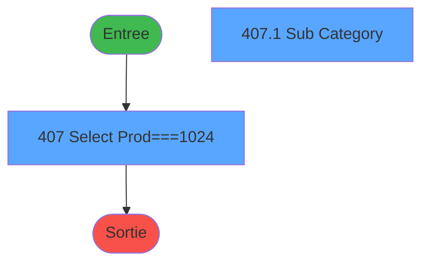
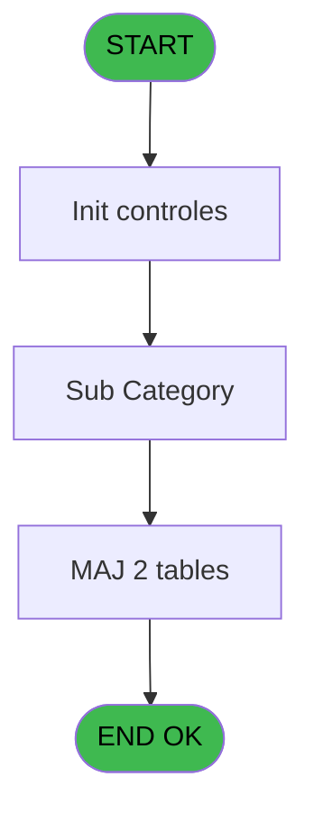
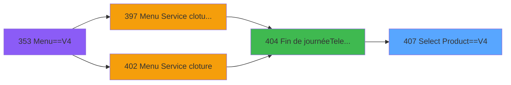
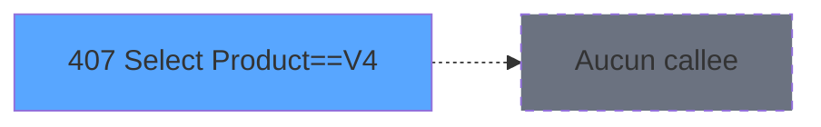

# PVE IDE 407 - Select Product==V4

> **Analyse**: Phases 1-4 2026-02-03 19:59 -> 19:59 (12s) | Assemblage 19:59
> **Pipeline**: V7.2 Enrichi
> **Structure**: 4 onglets (Resume | Ecrans | Donnees | Connexions)

<!-- TAB:Resume -->

## 1. FICHE D'IDENTITE

| Attribut | Valeur |
|----------|--------|
| Projet | PVE |
| IDE Position | 407 |
| Nom Programme | Select Product==V4 |
| Fichier source | `Prg_407.xml` |
| Dossier IDE | A |
| Taches | 2 (2 ecrans visibles) |
| Tables modifiees | 2 |
| Programmes appeles | 0 |

## 2. DESCRIPTION FONCTIONNELLE

**Select Product==V4** assure la gestion complete de ce processus, accessible depuis [Fin de journée(Telecollecte) (IDE 404)](PVE-IDE-404.md).

Le flux de traitement s'organise en **2 blocs fonctionnels** :

- **Traitement** (1 tache) : traitements metier divers
- **Consultation** (1 tache) : ecrans de recherche, selection et consultation

**Donnees modifiees** : 2 tables en ecriture (pv_customer_temp, pv_tva).

**Logique metier** : 1 regles identifiees couvrant valeurs par defaut.

Detail : phases du traitement

#### Phase 1 : Consultation (1 tache)

- **407** - Select Prod===1024 **[[ECRAN]](#ecran-t1)**

#### Phase 2 : Traitement (1 tache)

- **407.1** - Sub Category **[[ECRAN]](#ecran-t2)**

#### Tables impactees

| Table | Operations | Role metier |
|-------|-----------|-------------|
| pv_tva | **W**/L (2 usages) |  |
| pv_customer_temp | **W** (1 usages) |  |

## 3. BLOCS FONCTIONNELS

### 3.1 Consultation (1 tache)

Ecrans de recherche et consultation.

---

#### 407 - Select Prod===1024 [[ECRAN]](#ecran-t1)

**Role** : Traitement : Select Prod===1024.
**Ecran** : 639 x 306 DLU (Type6) | [Voir mockup](#ecran-t1)

### 3.2 Traitement (1 tache)

Traitements internes.

---

#### 407.1 - Sub Category [[ECRAN]](#ecran-t2)

**Role** : Traitement : Sub Category.
**Ecran** : 444 x 218 DLU | [Voir mockup](#ecran-t2)

## 5. REGLES METIER

1 regles identifiees:

### Autres (1 regles)

#### [RM-001] Valeur par defaut si Trim(v.Qté [D]) est vide

| Element | Detail |
|---------|--------|
| **Condition** | `Trim(v.Qté [D])=''` |
| **Si vrai** | '01' |
| **Si faux** | v.Qté [D]) |
| **Variables** | D (v.Qté) |
| **Expression source** | Expression 1 : `IF(Trim(v.Qté [D])='','01',v.Qté [D])` |
| **Exemple** | Si Trim(v.Qté [D])='' → '01'. Sinon → v.Qté [D]) |

## 6. CONTEXTE

- **Appele par**: [Fin de journée(Telecollecte) (IDE 404)](PVE-IDE-404.md)
- **Appelle**: 0 programmes | **Tables**: 2 (W:2 R:0 L:1) | **Taches**: 2 | **Expressions**: 11

<!-- TAB:Ecrans -->

## 8. ECRANS

### 8.1 Forms visibles (2 / 2)

| # | Position | Tache | Nom | Type | Largeur | Hauteur | Bloc |
|---|----------|-------|-----|------|---------|---------|------|
| 1 | 407 | 407 | Select Prod===1024 | Type6 | 639 | 306 | Consultation |
| 2 | 407.1 | 407.1 | Sub Category | Type0 | 444 | 218 | Traitement |

### 8.2 Mockups Ecrans

---

#### 407 - Select Prod===1024
**Tache** : [407](#t1) | **Type** : Type6 | **Dimensions** : 639 x 306 DLU
**Bloc** : Consultation | **Titre IDE** : Select Prod===1024

<!-- FORM-DATA:
{
    "width":  639,
    "vFactor":  8,
    "type":  "Type6",
    "hFactor":  8,
    "controls":  [
                     {
                         "x":  0,
                         "type":  "label",
                         "var":  "",
                         "y":  0,
                         "w":  634,
                         "fmt":  "",
                         "name":  "",
                         "h":  31,
                         "color":  "189",
                         "text":  "",
                         "parent":  null
                     },
                     {
                         "x":  178,
                         "type":  "label",
                         "var":  "",
                         "y":  11,
                         "w":  282,
                         "fmt":  "",
                         "name":  "",
                         "h":  10,
                         "color":  "186",
                         "text":  "Select your Sub Category",
                         "parent":  1
                     },
                     {
                         "x":  1,
                         "type":  "label",
                         "var":  "",
                         "y":  31,
                         "w":  633,
                         "fmt":  "",
                         "name":  "",
                         "h":  231,
                         "color":  "183",
                         "text":  "",
                         "parent":  null
                     },
                     {
                         "x":  7,
                         "type":  "label",
                         "var":  "",
                         "y":  33,
                         "w":  180,
                         "fmt":  "",
                         "name":  "",
                         "h":  7,
                         "color":  "183",
                         "text":  "Category",
                         "parent":  null
                     },
                     {
                         "x":  377,
                         "type":  "label",
                         "var":  "",
                         "y":  33,
                         "w":  142,
                         "fmt":  "",
                         "name":  "",
                         "h":  7,
                         "color":  "183",
                         "text":  "Sub Category",
                         "parent":  null
                     },
                     {
                         "x":  0,
                         "type":  "label",
                         "var":  "",
                         "y":  279,
                         "w":  634,
                         "fmt":  "",
                         "name":  "",
                         "h":  24,
                         "color":  "6",
                         "text":  "",
                         "parent":  null
                     },
                     {
                         "x":  3,
                         "type":  "table",
                         "var":  "",
                         "name":  "",
                         "titleH":  12,
                         "color":  "183",
                         "w":  190,
                         "y":  42,
                         "fmt":  "",
                         "parent":  null,
                         "text":  "",
                         "rowH":  24,
                         "h":  218,
                         "cols":  [
                                      {
                                          "title":  "label",
                                          "layer":  1,
                                          "w":  184
                                      }
                                  ],
                         "rows":  1
                     },
                     {
                         "x":  560,
                         "type":  "image",
                         "var":  "",
                         "y":  2,
                         "w":  70,
                         "fmt":  "",
                         "name":  "",
                         "h":  27,
                         "color":  "",
                         "text":  "",
                         "parent":  1
                     },
                     {
                         "x":  7,
                         "type":  "button",
                         "var":  "",
                         "y":  43,
                         "w":  180,
                         "fmt":  "",
                         "name":  "label",
                         "h":  24,
                         "color":  "",
                         "text":  "",
                         "parent":  8
                     },
                     {
                         "x":  193,
                         "type":  "button",
                         "var":  "",
                         "y":  42,
                         "w":  72,
                         "fmt":  "ñ",
                         "name":  "UP",
                         "h":  108,
                         "color":  "",
                         "text":  "",
                         "parent":  null
                     },
                     {
                         "x":  269,
                         "type":  "subform",
                         "var":  "",
                         "y":  43,
                         "w":  362,
                         "fmt":  "",
                         "name":  "SF_CATEG",
                         "h":  218,
                         "color":  "",
                         "text":  "",
                         "parent":  null
                     },
                     {
                         "x":  193,
                         "type":  "button",
                         "var":  "",
                         "y":  150,
                         "w":  72,
                         "fmt":  "ò",
                         "name":  "DOWN",
                         "h":  110,
                         "color":  "",
                         "text":  "",
                         "parent":  null
                     },
                     {
                         "x":  6,
                         "type":  "button",
                         "var":  "",
                         "y":  282,
                         "w":  256,
                         "fmt":  "Cancel",
                         "name":  "CANCEL",
                         "h":  18,
                         "color":  "",
                         "text":  "",
                         "parent":  null
                     },
                     {
                         "x":  314,
                         "type":  "button",
                         "var":  "",
                         "y":  283,
                         "w":  256,
                         "fmt":  "Select",
                         "name":  "VALID",
                         "h":  18,
                         "color":  "",
                         "text":  "",
                         "parent":  null
                     }
                 ],
    "taskId":  "407",
    "height":  306
}
-->

<strong>Boutons : 5 boutons</strong>

| Bouton | Pos (x,y) | Action |
|--------|-----------|--------|
| label | 7,43 | Bouton fonctionnel |
| ñ | 193,42 | Bouton fonctionnel |
| ò | 193,150 | Bouton fonctionnel |
| Cancel | 6,282 | Annule et retour au menu |
| Select | 314,283 | Ouvre la selection |

---

#### 407.1 - Sub Category
**Tache** : [407.1](#t2) | **Type** : Type0 | **Dimensions** : 444 x 218 DLU
**Bloc** : Traitement | **Titre IDE** : Sub Category

<!-- FORM-DATA:
{
    "width":  444,
    "vFactor":  8,
    "type":  "Type0",
    "hFactor":  4,
    "controls":  [
                     {
                         "x":  0,
                         "type":  "table",
                         "var":  "",
                         "name":  "",
                         "titleH":  12,
                         "color":  "183",
                         "w":  99,
                         "y":  0,
                         "fmt":  "",
                         "parent":  null,
                         "text":  "",
                         "rowH":  24,
                         "h":  216,
                         "cols":  [
                                      {
                                          "title":  "",
                                          "layer":  1,
                                          "w":  96
                                      }
                                  ],
                         "rows":  1
                     },
                     {
                         "x":  2,
                         "type":  "button",
                         "var":  "",
                         "y":  1,
                         "w":  94,
                         "fmt":  "",
                         "name":  "SUB_CAT",
                         "h":  23,
                         "color":  "",
                         "text":  "",
                         "parent":  1
                     },
                     {
                         "x":  99,
                         "type":  "button",
                         "var":  "",
                         "y":  0,
                         "w":  36,
                         "fmt":  "ñ",
                         "name":  "UP",
                         "h":  108,
                         "color":  "",
                         "text":  "",
                         "parent":  null
                     },
                     {
                         "x":  99,
                         "type":  "button",
                         "var":  "",
                         "y":  108,
                         "w":  36,
                         "fmt":  "ò",
                         "name":  "DOWN",
                         "h":  108,
                         "color":  "",
                         "text":  "",
                         "parent":  null
                     }
                 ],
    "taskId":  "407.1",
    "height":  218
}
-->

<strong>Boutons : 3 boutons</strong>

| Bouton | Pos (x,y) | Action |
|--------|-----------|--------|
| SUB_CAT | 2,1 | Bouton fonctionnel |
| ñ | 99,0 | Bouton fonctionnel |
| ò | 99,108 | Bouton fonctionnel |

## 9. NAVIGATION

### 9.1 Enchainement des ecrans

**Detail par enchainement :**

| Depuis | Action | Vers | Retour |
|--------|--------|------|--------|

### 9.3 Structure hierarchique (2 taches)

| Position | Tache | Type | Dimensions | Bloc |
|----------|-------|------|------------|------|
| **407.1** | [**Select Prod===1024** (407)](#t1) [mockup](#ecran-t1) | Type6 | 639x306 | Consultation |
| **407.2** | [**Sub Category** (407.1)](#t2) [mockup](#ecran-t2) | - | 444x218 | Traitement |

### 9.4 Algorigramme

> **Legende**: Vert = START/END OK | Rouge = END KO | Bleu = Decisions
> *Algorigramme auto-genere. Utiliser `/algorigramme` pour une synthese metier detaillee.*

<!-- TAB:Donnees -->

## 10. TABLES

### Tables utilisees (2)

| ID | Nom | Description | Type | R | W | L | Usages |
|----|-----|-------------|------|---|---|---|--------|
| 379 | pv_customer_temp |  | DB |   | **W** |   | 1 |
| 413 | pv_tva |  | DB |   | **W** | L | 2 |

### Colonnes par table (1 / 2 tables avec colonnes identifiees)

Table 379 - pv_customer_temp (**W**) - 1 usages

| Lettre | Variable | Acces | Type |
|--------|----------|-------|------|
| A | P.io.Cat | W | Numeric |
| B | P.io.Sub Cat | W | Numeric |
| C | v.Stock | W | Numeric |
| D | v.Qté | W | Alpha |
| E | V.Désigantion | W | Alpha |
| F | v.Fin | W | Logical |
| G | v.StopDelete | W | Logical |
| H | RetourQuestion | W | Numeric |
| I | v.TotalTicket | W | Numeric |
| J | v.PrixSaisie | W | Alpha |
| K | v.PrixZero | W | Logical |
| L | v.Cat | W | Numeric |
| M | v.Sub_Cat | W | Numeric |
| N | v.Prod_ID | W | Numeric |
| O | T S/Catégorie | W | Logical |
| P | v.TotalAValider | W | Numeric |
| Q | v.NbrProdWithoutBooking | W | Numeric |
| R | v.BookingID | W | Unicode |
| S | v.OrderID | W | Numeric |
| T | v.PackageID | W | Numeric |
| U | v.ProductIdBooker | W | Numeric |
| V | v.BtnQuitSearchClicked | W | Logical |

Table 413 - pv_tva (**W**/L) - 2 usages

*Table utilisee uniquement en Link ou aucune colonne Real identifiee dans le DataView.*

## 11. VARIABLES

### 11.1 Parametres entrants (2)

Variables recues du programme appelant ([Fin de journée(Telecollecte) (IDE 404)](PVE-IDE-404.md)).

| Lettre | Nom | Type | Usage dans |
|--------|-----|------|-----------|
| A | P.io.Cat | Numeric | 2x parametre entrant |
| B | P.io.Sub Cat | Numeric | 1x parametre entrant |

### 11.2 Variables de session (18)

Variables persistantes pendant toute la session.

| Lettre | Nom | Type | Usage dans |
|--------|-----|------|-----------|
| C | v.Stock | Numeric | - |
| D | v.Qté | Alpha | 1x session |
| E | V.Désigantion | Alpha | - |
| F | v.Fin | Logical | 1x session |
| G | v.StopDelete | Logical | - |
| I | v.TotalTicket | Numeric | - |
| J | v.PrixSaisie | Alpha | - |
| K | v.PrixZero | Logical | - |
| L | v.Cat | Numeric | - |
| M | v.Sub_Cat | Numeric | 1x session |
| N | v.Prod_ID | Numeric | - |
| P | v.TotalAValider | Numeric | - |
| Q | v.NbrProdWithoutBooking | Numeric | - |
| R | v.BookingID | Unicode | - |
| S | v.OrderID | Numeric | 1x session |
| T | v.PackageID | Numeric | - |
| U | v.ProductIdBooker | Numeric | - |
| V | v.BtnQuitSearchClicked | Logical | - |

### 11.3 Autres (2)

Variables diverses.

| Lettre | Nom | Type | Usage dans |
|--------|-----|------|-----------|
| H | RetourQuestion | Numeric | - |
| O | T S/Catégorie | Logical | 1x refs |

Toutes les 22 variables (liste complete)

| Cat | Lettre | Nom Variable | Type |
|-----|--------|--------------|------|
| P0 | **A** | P.io.Cat | Numeric |
| P0 | **B** | P.io.Sub Cat | Numeric |
| V. | **C** | v.Stock | Numeric |
| V. | **D** | v.Qté | Alpha |
| V. | **E** | V.Désigantion | Alpha |
| V. | **F** | v.Fin | Logical |
| V. | **G** | v.StopDelete | Logical |
| V. | **I** | v.TotalTicket | Numeric |
| V. | **J** | v.PrixSaisie | Alpha |
| V. | **K** | v.PrixZero | Logical |
| V. | **L** | v.Cat | Numeric |
| V. | **M** | v.Sub_Cat | Numeric |
| V. | **N** | v.Prod_ID | Numeric |
| V. | **P** | v.TotalAValider | Numeric |
| V. | **Q** | v.NbrProdWithoutBooking | Numeric |
| V. | **R** | v.BookingID | Unicode |
| V. | **S** | v.OrderID | Numeric |
| V. | **T** | v.PackageID | Numeric |
| V. | **U** | v.ProductIdBooker | Numeric |
| V. | **V** | v.BtnQuitSearchClicked | Logical |
| Autre | **H** | RetourQuestion | Numeric |
| Autre | **O** | T S/Catégorie | Logical |

## 12. EXPRESSIONS

**11 / 11 expressions decodees (100%)**

### 12.1 Repartition par type

| Type | Expressions | Regles |
|------|-------------|--------|
| CONDITION | 1 | 5 |
| CONSTANTE | 1 | 0 |
| CAST_LOGIQUE | 3 | 0 |
| OTHER | 5 | 0 |
| FORMAT | 1 | 0 |

### 12.2 Expressions cles par type

#### CONDITION (1 expressions)

| Type | IDE | Expression | Regle |
|------|-----|------------|-------|
| CONDITION | 1 | `IF(Trim(v.Qté [D])='','01',v.Qté [D])` | [RM-001](#rm-RM-001) |

#### CONSTANTE (1 expressions)

| Type | IDE | Expression | Regle |
|------|-----|------------|-------|
| CONSTANTE | 5 | `0` | - |

#### CAST_LOGIQUE (3 expressions)

| Type | IDE | Expression | Regle |
|------|-----|------------|-------|
| CAST_LOGIQUE | 8 | `'TRUE'LOG` | - |
| CAST_LOGIQUE | 3 | `'TRUE'LOG` | - |
| CAST_LOGIQUE | 2 | `v.Fin [F]='TRUE'LOG` | - |

#### OTHER (5 expressions)

| Type | IDE | Expression | Regle |
|------|-----|------------|-------|
| OTHER | 9 | `P.io.Cat [A]` | - |
| OTHER | 10 | `v.Sub_Cat [M]` | - |
| OTHER | 7 | `GetParam ('SERVICE')` | - |
| OTHER | 4 | `T S/Catégorie [O]` | - |
| OTHER | 6 | `v.OrderID [S]` | - |

#### FORMAT (1 expressions)

| Type | IDE | Expression | Regle |
|------|-----|------------|-------|
| FORMAT | 11 | `Str(P.io.Cat [A],'2')&Str(P.io.Sub Cat [B],'2')` | - |

<!-- TAB:Connexions -->

## 13. GRAPHE D'APPELS

### 13.1 Chaine depuis Main (Callers)

Main -> ... -> [Fin de journée(Telecollecte) (IDE 404)](PVE-IDE-404.md) -> **Select Product==V4 (IDE 407)**

### 13.2 Callers

| IDE | Nom Programme | Nb Appels |
|-----|---------------|-----------|
| [404](PVE-IDE-404.md) | Fin de journée(Telecollecte) | 1 |

### 13.3 Callees (programmes appeles)

### 13.4 Detail Callees avec contexte

| IDE | Nom Programme | Appels | Contexte |
|-----|---------------|--------|----------|
| - | (aucun) | - | - |

## 14. RECOMMANDATIONS MIGRATION

### 14.1 Profil du programme

| Metrique | Valeur | Impact migration |
|----------|--------|-----------------|
| Lignes de logique | 61 | Programme compact |
| Expressions | 11 | Peu de logique |
| Tables WRITE | 2 | Impact faible |
| Sous-programmes | 0 | Peu de dependances |
| Ecrans visibles | 2 | Quelques ecrans |
| Code desactive | 0% (0 / 61) | Code sain |
| Regles metier | 1 | Quelques regles a preserver |

### 14.2 Plan de migration par bloc

#### Consultation (1 tache: 1 ecran, 0 traitement)

- **Strategie** : Composants de recherche/selection en modales.
- 1 ecran : Select Prod===1024

#### Traitement (1 tache: 1 ecran, 0 traitement)

- **Strategie** : 1 composant(s) UI (Razor/React) avec formulaires et validation.
- Decomposer les taches en services unitaires testables.

### 14.3 Dependances critiques

| Dependance | Type | Appels | Impact |
|------------|------|--------|--------|
| pv_customer_temp | Table WRITE (Database) | 1x | Schema + repository |
| pv_tva | Table WRITE (Database) | 1x | Schema + repository |

---
*Spec DETAILED generee par Pipeline V7.2 - 2026-02-03 19:59*
