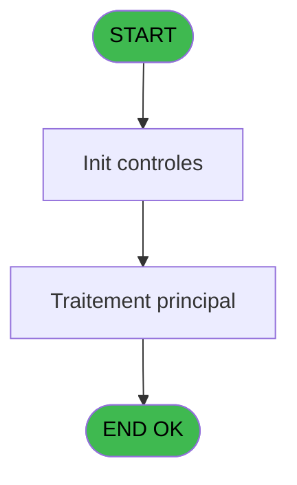
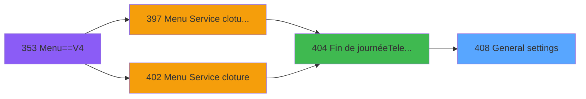
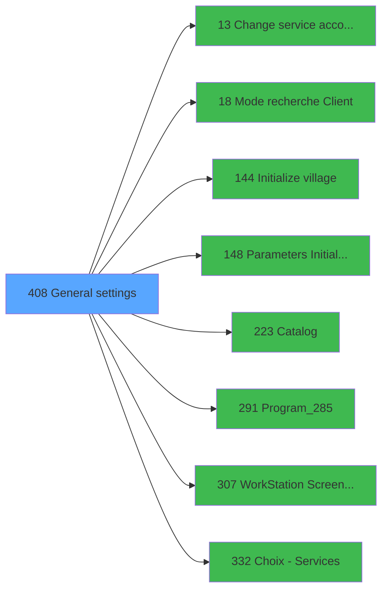

# PVE IDE 408 - General settings

> **Analyse**: Phases 1-4 2026-02-03 19:59 -> 19:59 (12s) | Assemblage 19:59
> **Pipeline**: V7.2 Enrichi
> **Structure**: 4 onglets (Resume | Ecrans | Donnees | Connexions)

<!-- TAB:Resume -->

## 1. FICHE D'IDENTITE

| Attribut | Valeur |
|----------|--------|
| Projet | PVE |
| IDE Position | 408 |
| Nom Programme | General settings |
| Fichier source | `Prg_408.xml` |
| Dossier IDE | A |
| Taches | 1 (1 ecrans visibles) |
| Tables modifiees | 0 |
| Programmes appeles | 8 |

## 2. DESCRIPTION FONCTIONNELLE

**General settings** assure la gestion complete de ce processus, accessible depuis [Fin de journée(Telecollecte) (IDE 404)](PVE-IDE-404.md).

Le flux de traitement s'organise en **1 blocs fonctionnels** :

- **Traitement** (1 tache) : traitements metier divers

**Logique metier** : 3 regles identifiees couvrant conditions metier.

## 3. BLOCS FONCTIONNELS

### 3.1 Traitement (1 tache)

Traitements internes.

---

#### 408 - Application settings [[ECRAN]](#ecran-t1)

**Role** : Traitement : Application settings.
**Ecran** : 604 x 337 DLU (MDI) | [Voir mockup](#ecran-t1)
**Delegue a** : [Change service accounting date (IDE 13)](PVE-IDE-13.md), [Catalog (IDE 223)](PVE-IDE-223.md), [Program_285 (IDE 291)](PVE-IDE-291.md)

## 5. REGLES METIER

3 regles identifiees:

### Autres (3 regles)

#### [RM-001] Si Trim([W]) <> '' alors 'File uploaded' sinon 'No file uploaded')

| Element | Detail |
|---------|--------|
| **Condition** | `Trim([W]) <> ''` |
| **Si vrai** | 'File uploaded' |
| **Si faux** | 'No file uploaded') |
| **Expression source** | Expression 20 : `IF(Trim([W]) <> '', 'File uploaded', 'No file uploaded')` |
| **Exemple** | Si Trim([W]) <> '' → 'File uploaded'. Sinon → 'No file uploaded') |

#### [RM-002] Si Trim([X]) <> '' alors 'File uploaded' sinon 'No file uploaded')

| Element | Detail |
|---------|--------|
| **Condition** | `Trim([X]) <> ''` |
| **Si vrai** | 'File uploaded' |
| **Si faux** | 'No file uploaded') |
| **Expression source** | Expression 21 : `IF(Trim([X]) <> '', 'File uploaded', 'No file uploaded')` |
| **Exemple** | Si Trim([X]) <> '' → 'File uploaded'. Sinon → 'No file uploaded') |

#### [RM-003] Si VG61 alors '1 sinon 2,3,4','1,2,3')

| Element | Detail |
|---------|--------|
| **Condition** | `VG61` |
| **Si vrai** | '1 |
| **Si faux** | 2,3,4','1,2,3') |
| **Expression source** | Expression 22 : `IF(VG61,'1,2,3,4','1,2,3')` |
| **Exemple** | Si VG61 → '1. Sinon → 2,3,4','1,2,3') |

## 6. CONTEXTE

- **Appele par**: [Fin de journée(Telecollecte) (IDE 404)](PVE-IDE-404.md)
- **Appelle**: 8 programmes | **Tables**: 2 (W:0 R:1 L:1) | **Taches**: 1 | **Expressions**: 24

<!-- TAB:Ecrans -->

## 8. ECRANS

### 8.1 Forms visibles (1 / 1)

| # | Position | Tache | Nom | Type | Largeur | Hauteur | Bloc |
|---|----------|-------|-----|------|---------|---------|------|
| 1 | 408 | 408 | Application settings | MDI | 604 | 337 | Traitement |

### 8.2 Mockups Ecrans

---

#### 408 - Application settings
**Tache** : [408](#t1) | **Type** : MDI | **Dimensions** : 604 x 337 DLU
**Bloc** : Traitement | **Titre IDE** : Application settings

<!-- FORM-DATA:
{
    "width":  604,
    "vFactor":  8,
    "type":  "MDI",
    "hFactor":  4,
    "controls":  [
                     {
                         "x":  4,
                         "type":  "label",
                         "var":  "",
                         "y":  5,
                         "w":  587,
                         "fmt":  "",
                         "name":  "",
                         "h":  18,
                         "color":  "180",
                         "text":  "",
                         "parent":  null
                     },
                     {
                         "x":  38,
                         "type":  "label",
                         "var":  "",
                         "y":  8,
                         "w":  46,
                         "fmt":  "",
                         "name":  "",
                         "h":  12,
                         "color":  "180",
                         "text":  "Service",
                         "parent":  null
                     },
                     {
                         "x":  4,
                         "type":  "label",
                         "var":  "",
                         "y":  31,
                         "w":  587,
                         "fmt":  "",
                         "name":  "",
                         "h":  296,
                         "color":  "182",
                         "text":  "",
                         "parent":  null
                     },
                     {
                         "x":  188,
                         "type":  "label",
                         "var":  "",
                         "y":  35,
                         "w":  197,
                         "fmt":  "",
                         "name":  "",
                         "h":  15,
                         "color":  "186",
                         "text":  "General settings",
                         "parent":  null
                     },
                     {
                         "x":  5,
                         "type":  "label",
                         "var":  "",
                         "y":  69,
                         "w":  586,
                         "fmt":  "",
                         "name":  "",
                         "h":  226,
                         "color":  "182",
                         "text":  "",
                         "parent":  7
                     },
                     {
                         "x":  5,
                         "type":  "label",
                         "var":  "",
                         "y":  69,
                         "w":  586,
                         "fmt":  "",
                         "name":  "",
                         "h":  226,
                         "color":  "182",
                         "text":  "",
                         "parent":  7
                     },
                     {
                         "x":  5,
                         "type":  "label",
                         "var":  "",
                         "y":  69,
                         "w":  586,
                         "fmt":  "",
                         "name":  "",
                         "h":  226,
                         "color":  "182",
                         "text":  "",
                         "parent":  7
                     },
                     {
                         "x":  5,
                         "type":  "label",
                         "var":  "",
                         "y":  69,
                         "w":  586,
                         "fmt":  "",
                         "name":  "",
                         "h":  226,
                         "color":  "182",
                         "text":  "",
                         "parent":  7
                     },
                     {
                         "x":  30,
                         "type":  "label",
                         "var":  "",
                         "y":  85,
                         "w":  322,
                         "fmt":  "",
                         "name":  "",
                         "h":  18,
                         "color":  "187",
                         "text":  "Link with Booking Application",
                         "parent":  11
                     },
                     {
                         "x":  30,
                         "type":  "label",
                         "var":  "",
                         "y":  85,
                         "w":  322,
                         "fmt":  "",
                         "name":  "",
                         "h":  18,
                         "color":  "187",
                         "text":  "Default # days auto-generated per subcat",
                         "parent":  10
                     },
                     {
                         "x":  30,
                         "type":  "label",
                         "var":  "",
                         "y":  85,
                         "w":  322,
                         "fmt":  "",
                         "name":  "",
                         "h":  18,
                         "color":  "187",
                         "text":  "Autorise payment if no guaranty",
                         "parent":  9
                     },
                     {
                         "x":  30,
                         "type":  "label",
                         "var":  "",
                         "y":  85,
                         "w":  322,
                         "fmt":  "",
                         "name":  "",
                         "h":  18,
                         "color":  "187",
                         "text":  "Display Message on Ticket",
                         "parent":  8
                     },
                     {
                         "x":  30,
                         "type":  "label",
                         "var":  "",
                         "y":  107,
                         "w":  322,
                         "fmt":  "",
                         "name":  "",
                         "h":  18,
                         "color":  "187",
                         "text":  "Geographic zone",
                         "parent":  10
                     },
                     {
                         "x":  30,
                         "type":  "label",
                         "var":  "",
                         "y":  109,
                         "w":  322,
                         "fmt":  "",
                         "name":  "",
                         "h":  18,
                         "color":  "187",
                         "text":  "Booker Api Address",
                         "parent":  11
                     },
                     {
                         "x":  30,
                         "type":  "label",
                         "var":  "",
                         "y":  111,
                         "w":  322,
                         "fmt":  "",
                         "name":  "",
                         "h":  18,
                         "color":  "187",
                         "text":  "Sales Cancelation Delay (in days)",
                         "parent":  9
                     },
                     {
                         "x":  30,
                         "type":  "label",
                         "var":  "",
                         "y":  129,
                         "w":  322,
                         "fmt":  "",
                         "name":  "",
                         "h":  18,
                         "color":  "187",
                         "text":  "Insurance category ID",
                         "parent":  10
                     },
                     {
                         "x":  30,
                         "type":  "label",
                         "var":  "",
                         "y":  133,
                         "w":  322,
                         "fmt":  "",
                         "name":  "",
                         "h":  18,
                         "color":  "187",
                         "text":  "Proxy Address",
                         "parent":  11
                     },
                     {
                         "x":  30,
                         "type":  "label",
                         "var":  "",
                         "y":  137,
                         "w":  322,
                         "fmt":  "",
                         "name":  "",
                         "h":  18,
                         "color":  "187",
                         "text":  "Validate sales on all filiations",
                         "parent":  9
                     },
                     {
                         "x":  30,
                         "type":  "label",
                         "var":  "",
                         "y":  157,
                         "w":  322,
                         "fmt":  "",
                         "name":  "",
                         "h":  18,
                         "color":  "187",
                         "text":  "Booker Location ID",
                         "parent":  11
                     },
                     {
                         "x":  30,
                         "type":  "label",
                         "var":  "",
                         "y":  163,
                         "w":  322,
                         "fmt":  "",
                         "name":  "",
                         "h":  18,
                         "color":  "187",
                         "text":  "Use credit card on mobility",
                         "parent":  9
                     },
                     {
                         "x":  30,
                         "type":  "label",
                         "var":  "",
                         "y":  181,
                         "w":  322,
                         "fmt":  "",
                         "name":  "",
                         "h":  18,
                         "color":  "187",
                         "text":  "Time difference",
                         "parent":  11
                     },
                     {
                         "x":  30,
                         "type":  "label",
                         "var":  "",
                         "y":  110,
                         "w":  322,
                         "fmt":  "",
                         "name":  "",
                         "h":  28,
                         "color":  "183",
                         "text":  "Sales terms and conditions file",
                         "parent":  8
                     },
                     {
                         "x":  30,
                         "type":  "label",
                         "var":  "",
                         "y":  145,
                         "w":  322,
                         "fmt":  "",
                         "name":  "",
                         "h":  28,
                         "color":  "183",
                         "text":  "Rentals terms and conditions file",
                         "parent":  8
                     },
                     {
                         "x":  30,
                         "type":  "label",
                         "var":  "",
                         "y":  180,
                         "w":  322,
                         "fmt":  "",
                         "name":  "",
                         "h":  18,
                         "color":  "187",
                         "text":  "Account opening by credit card",
                         "parent":  8
                     },
                     {
                         "x":  5,
                         "type":  "label",
                         "var":  "",
                         "y":  291,
                         "w":  586,
                         "fmt":  "",
                         "name":  "",
                         "h":  36,
                         "color":  "182",
                         "text":  "",
                         "parent":  null
                     },
                     {
                         "x":  88,
                         "type":  "edit",
                         "var":  "",
                         "y":  8,
                         "w":  50,
                         "fmt":  "",
                         "name":  "",
                         "h":  12,
                         "color":  "63",
                         "text":  "",
                         "parent":  null
                     },
                     {
                         "x":  317,
                         "type":  "edit",
                         "var":  "",
                         "y":  86,
                         "w":  34,
                         "fmt":  "",
                         "name":  "CTRL_001",
                         "h":  16,
                         "color":  "110",
                         "text":  "",
                         "parent":  10
                     },
                     {
                         "x":  277,
                         "type":  "combobox",
                         "var":  "",
                         "y":  108,
                         "w":  74,
                         "fmt":  "",
                         "name":  "CTRL_002",
                         "h":  12,
                         "color":  "110",
                         "text":  "1 US,2 Europe,3 Asia",
                         "parent":  10
                     },
                     {
                         "x":  302,
                         "type":  "combobox",
                         "var":  "",
                         "y":  86,
                         "w":  49,
                         "fmt":  "",
                         "name":  "CTRL_003",
                         "h":  12,
                         "color":  "110",
                         "text":  "Yes,No",
                         "parent":  9
                     },
                     {
                         "x":  317,
                         "type":  "edit",
                         "var":  "",
                         "y":  129,
                         "w":  34,
                         "fmt":  "",
                         "name":  "CTRL_004",
                         "h":  17,
                         "color":  "110",
                         "text":  "",
                         "parent":  10
                     },
                     {
                         "x":  147,
                         "type":  "edit",
                         "var":  "",
                         "y":  8,
                         "w":  170,
                         "fmt":  "30",
                         "name":  "",
                         "h":  12,
                         "color":  "180",
                         "text":  "",
                         "parent":  null
                     },
                     {
                         "x":  407,
                         "type":  "button",
                         "var":  "",
                         "y":  85,
                         "w":  151,
                         "fmt":  "\u0026Village configuration",
                         "name":  "",
                         "h":  30,
                         "color":  "",
                         "text":  "",
                         "parent":  8
                     },
                     {
                         "x":  302,
                         "type":  "edit",
                         "var":  "",
                         "y":  112,
                         "w":  49,
                         "fmt":  "2.1",
                         "name":  "sales_cancel",
                         "h":  16,
                         "color":  "110",
                         "text":  "",
                         "parent":  9
                     },
                     {
                         "x":  407,
                         "type":  "button",
                         "var":  "",
                         "y":  122,
                         "w":  151,
                         "fmt":  "\u0026Payment Terminal Settings",
                         "name":  "",
                         "h":  30,
                         "color":  "",
                         "text":  "",
                         "parent":  9
                     },
                     {
                         "x":  407,
                         "type":  "button",
                         "var":  "",
                         "y":  85,
                         "w":  151,
                         "fmt":  "Change the accounting date",
                         "name":  "",
                         "h":  30,
                         "color":  "",
                         "text":  "",
                         "parent":  9
                     },
                     {
                         "x":  490,
                         "type":  "button",
                         "var":  "",
                         "y":  296,
                         "w":  99,
                         "fmt":  "\u0026Exit",
                         "name":  "",
                         "h":  29,
                         "color":  "",
                         "text":  "",
                         "parent":  null
                     },
                     {
                         "x":  302,
                         "type":  "combobox",
                         "var":  "",
                         "y":  86,
                         "w":  49,
                         "fmt":  "",
                         "name":  "pg2_logique_1_0001",
                         "h":  12,
                         "color":  "110",
                         "text":  "Yes,No",
                         "parent":  15
                     },
                     {
                         "x":  407,
                         "type":  "button",
                         "var":  "",
                         "y":  122,
                         "w":  151,
                         "fmt":  "\u0026Workstation Screen Resolution",
                         "name":  "",
                         "h":  30,
                         "color":  "",
                         "text":  "",
                         "parent":  8
                     },
                     {
                         "x":  302,
                         "type":  "combobox",
                         "var":  "",
                         "y":  138,
                         "w":  49,
                         "fmt":  "",
                         "name":  "pg2_logique_2_0001",
                         "h":  12,
                         "color":  "110",
                         "text":  "Yes,No",
                         "parent":  26
                     },
                     {
                         "x":  302,
                         "type":  "combobox",
                         "var":  "",
                         "y":  164,
                         "w":  49,
                         "fmt":  "",
                         "name":  "pg2_logique_3_0001",
                         "h":  12,
                         "color":  "110",
                         "text":  "Yes,No",
                         "parent":  29
                     },
                     {
                         "x":  302,
                         "type":  "combobox",
                         "var":  "",
                         "y":  86,
                         "w":  49,
                         "fmt":  "",
                         "name":  "bokking_is_active",
                         "h":  12,
                         "color":  "110",
                         "text":  "Yes,No",
                         "parent":  12
                     },
                     {
                         "x":  151,
                         "type":  "edit",
                         "var":  "",
                         "y":  110,
                         "w":  200,
                         "fmt":  "",
                         "name":  "booker_api_url",
                         "h":  16,
                         "color":  "110",
                         "text":  "",
                         "parent":  18
                     },
                     {
                         "x":  151,
                         "type":  "edit",
                         "var":  "",
                         "y":  134,
                         "w":  200,
                         "fmt":  "",
                         "name":  "proxy_address",
                         "h":  16,
                         "color":  "110",
                         "text":  "",
                         "parent":  24
                     },
                     {
                         "x":  151,
                         "type":  "edit",
                         "var":  "",
                         "y":  158,
                         "w":  200,
                         "fmt":  "10Z",
                         "name":  "booker_location_id",
                         "h":  16,
                         "color":  "110",
                         "text":  "",
                         "parent":  27
                     },
                     {
                         "x":  317,
                         "type":  "edit",
                         "var":  "",
                         "y":  182,
                         "w":  34,
                         "fmt":  "",
                         "name":  "booker_decalage_horaire",
                         "h":  16,
                         "color":  "110",
                         "text":  "",
                         "parent":  30
                     },
                     {
                         "x":  407,
                         "type":  "button",
                         "var":  "",
                         "y":  159,
                         "w":  151,
                         "fmt":  "Default customer search mode",
                         "name":  "Btn.ModeRecherche",
                         "h":  30,
                         "color":  "",
                         "text":  "",
                         "parent":  8
                     },
                     {
                         "x":  5,
                         "type":  "tab",
                         "var":  "",
                         "y":  54,
                         "w":  586,
                         "fmt":  "",
                         "name":  "V.Onglet",
                         "h":  240,
                         "color":  "",
                         "text":  "1,2,3,4",
                         "parent":  null
                     },
                     {
                         "x":  35,
                         "type":  "edit",
                         "var":  "",
                         "y":  119,
                         "w":  283,
                         "fmt":  "",
                         "name":  "v.sales_cgv_file",
                         "h":  14,
                         "color":  "110",
                         "text":  "",
                         "parent":  36
                     },
                     {
                         "x":  319,
                         "type":  "button",
                         "var":  "",
                         "y":  119,
                         "w":  29,
                         "fmt":  "...",
                         "name":  "Btn.SearchSalesFile",
                         "h":  14,
                         "color":  "",
                         "text":  "",
                         "parent":  36
                     },
                     {
                         "x":  35,
                         "type":  "edit",
                         "var":  "",
                         "y":  154,
                         "w":  283,
                         "fmt":  "",
                         "name":  "v.rentals_cgv_file",
                         "h":  14,
                         "color":  "110",
                         "text":  "",
                         "parent":  38
                     },
                     {
                         "x":  319,
                         "type":  "button",
                         "var":  "",
                         "y":  154,
                         "w":  29,
                         "fmt":  "...",
                         "name":  "Btn.SearchRentalsFile",
                         "h":  14,
                         "color":  "",
                         "text":  "",
                         "parent":  38
                     },
                     {
                         "x":  302,
                         "type":  "combobox",
                         "var":  "",
                         "y":  181,
                         "w":  49,
                         "fmt":  "",
                         "name":  "pg2_logique_4_0001",
                         "h":  12,
                         "color":  "110",
                         "text":  "Yes,No",
                         "parent":  45
                     }
                 ],
    "taskId":  "408",
    "height":  337
}
-->

<strong>Champs : 18 champs</strong>

| Pos (x,y) | Nom | Variable | Type |
|-----------|-----|----------|------|
| 88,8 | (sans nom) | - | edit |
| 317,86 | CTRL_001 | - | edit |
| 277,108 | CTRL_002 | - | combobox |
| 302,86 | CTRL_003 | - | combobox |
| 317,129 | CTRL_004 | - | edit |
| 147,8 | 30 | - | edit |
| 302,112 | sales_cancel | - | edit |
| 302,86 | pg2_logique_1_0001 | - | combobox |
| 302,138 | pg2_logique_2_0001 | - | combobox |
| 302,164 | pg2_logique_3_0001 | - | combobox |
| 302,86 | bokking_is_active | - | combobox |
| 151,110 | booker_api_url | - | edit |
| 151,134 | proxy_address | - | edit |
| 151,158 | booker_location_id | - | edit |
| 317,182 | booker_decalage_horaire | - | edit |
| 35,119 | v.sales_cgv_file | - | edit |
| 35,154 | v.rentals_cgv_file | - | edit |
| 302,181 | pg2_logique_4_0001 | - | combobox |

<strong>Boutons : 8 boutons</strong>

| Bouton | Pos (x,y) | Action |
|--------|-----------|--------|
| Village configuration | 407,85 | Appel [Initialize village (IDE 144)](PVE-IDE-144.md) |
| Payment Terminal Settings | 407,122 | Bouton fonctionnel |
| Change the accounting date | 407,85 | Appel [Change service accounting date (IDE 13)](PVE-IDE-13.md) |
| Exit | 490,296 | Quitte le programme |
| Workstation Screen Resolution | 407,122 | Appel [WorkStation Screen Resolution (IDE 307)](PVE-IDE-307.md) |
| Default customer search mode | 407,159 | Ouvre la selection |
| ... | 319,119 | Bouton fonctionnel |
| ... | 319,154 | Bouton fonctionnel |

## 9. NAVIGATION

Ecran unique: **Application settings**

### 9.3 Structure hierarchique (1 tache)

| Position | Tache | Type | Dimensions | Bloc |
|----------|-------|------|------------|------|
| **408.1** | [**Application settings** (408)](#t1) [mockup](#ecran-t1) | MDI | 604x337 | Traitement |

### 9.4 Algorigramme

> **Legende**: Vert = START/END OK | Rouge = END KO | Bleu = Decisions
> *Algorigramme auto-genere. Utiliser `/algorigramme` pour une synthese metier detaillee.*

<!-- TAB:Donnees -->

## 10. TABLES

### Tables utilisees (2)

| ID | Nom | Description | Type | R | W | L | Usages |
|----|-----|-------------|------|---|---|---|--------|
| 728 | arc_cc_total |  | DB | R |   |   | 1 |
| 731 | arc_tai_gm |  | DB |   |   | L | 1 |

### Colonnes par table (0 / 1 tables avec colonnes identifiees)

Table 728 - arc_cc_total (R) - 1 usages

*Table utilisee uniquement en Link ou aucune colonne Real identifiee dans le DataView.*

## 11. VARIABLES

### 11.1 Variables de session (7)

Variables persistantes pendant toute la session.

| Lettre | Nom | Type | Usage dans |
|--------|-----|------|-----------|
| A | v.Record Update | Logical | - |
| B | v.sales_cgv_file | Unicode | - |
| C | v.rentals_cgv_file | Unicode | - |
| F | v.test | Blob | - |
| G | v.SalesFileSelected | Unicode | - |
| H | v.RentalsFileSelected | Unicode | - |
| J | V.Onglet | Numeric | 1x session |

### 11.2 Autres (3)

Variables diverses.

| Lettre | Nom | Type | Usage dans |
|--------|-----|------|-----------|
| D | Btn.SearchSalesFile | Unicode | - |
| E | Btn.SearchRentalsFile | Unicode | - |
| I | Btn.ModeRecherche | Alpha | 1x refs |

## 12. EXPRESSIONS

**24 / 24 expressions decodees (100%)**

### 12.1 Repartition par type

| Type | Expressions | Regles |
|------|-------------|--------|
| CALCULATION | 1 | 0 |
| CONDITION | 9 | 3 |
| CONSTANTE | 2 | 0 |
| OTHER | 6 | 0 |
| CAST_LOGIQUE | 2 | 0 |
| REFERENCE_VG | 2 | 0 |
| STRING | 2 | 0 |

### 12.2 Expressions cles par type

#### CALCULATION (1 expressions)

| Type | IDE | Expression | Regle |
|------|-----|------------|-------|
| CALCULATION | 15 | `FileDlg('','*.pdf')` | - |

#### CONDITION (9 expressions)

| Type | IDE | Expression | Regle |
|------|-----|------------|-------|
| CONDITION | 22 | `IF(VG61,'1,2,3,4','1,2,3')` | [RM-003](#rm-RM-003) |
| CONDITION | 21 | `IF(Trim([X]) <> '', 'File uploaded', 'No file uploaded')` | [RM-002](#rm-RM-002) |
| CONDITION | 20 | `IF(Trim([W]) <> '', 'File uploaded', 'No file uploaded')` | [RM-001](#rm-RM-001) |
| CONDITION | 9 | `(GetParam ('GROUP')='INFORMATICIEN' OR GetParam ('GROUP')='GESTION')` | - |
| CONDITION | 18 | `Trim([AD]) <> ''` | - |
| ... | | *+4 autres* | |

#### CONSTANTE (2 expressions)

| Type | IDE | Expression | Regle |
|------|-----|------------|-------|
| CONSTANTE | 3 | `'C'` | - |
| CONSTANTE | 2 | `''` | - |

#### OTHER (6 expressions)

| Type | IDE | Expression | Regle |
|------|-----|------------|-------|
| OTHER | 11 | `[Q]` | - |
| OTHER | 12 | `[R] AND VG10` | - |
| OTHER | 13 | `VG61 AND VG10` | - |
| OTHER | 1 | `GetParam ('SERVICE')` | - |
| OTHER | 5 | `SetParam ('LOGO',V.Onglet [J])` | - |
| ... | | *+1 autres* | |

#### CAST_LOGIQUE (2 expressions)

| Type | IDE | Expression | Regle |
|------|-----|------------|-------|
| CAST_LOGIQUE | 10 | `'TRUE'LOG` | - |
| CAST_LOGIQUE | 7 | `'FALSE'LOG` | - |

#### REFERENCE_VG (2 expressions)

| Type | IDE | Expression | Regle |
|------|-----|------------|-------|
| REFERENCE_VG | 24 | `VG86` | - |
| REFERENCE_VG | 14 | `VG61` | - |

#### STRING (2 expressions)

| Type | IDE | Expression | Regle |
|------|-----|------------|-------|
| STRING | 17 | `File2Blb(Trim([AE]))` | - |
| STRING | 16 | `File2Blb(Trim([AD]))` | - |

### 12.3 Toutes les expressions (24)

Voir les 24 expressions

#### CALCULATION (1)

| IDE | Expression Decodee |
|-----|-------------------|
| 15 | `FileDlg('','*.pdf')` |

#### CONDITION (9)

| IDE | Expression Decodee |
|-----|-------------------|
| 20 | `IF(Trim([W]) <> '', 'File uploaded', 'No file uploaded')` |
| 21 | `IF(Trim([X]) <> '', 'File uploaded', 'No file uploaded')` |
| 22 | `IF(VG61,'1,2,3,4','1,2,3')` |
| 23 | `IF(VG61,'General,Payment,Rental,Booking Application','General,Payment,Rental')` |
| 4 | `Btn.ModeRecherche [I]='O'` |
| 8 | `VG10 OR GetParam ('GROUP')='GESTION'` |
| 9 | `(GetParam ('GROUP')='INFORMATICIEN' OR GetParam ('GROUP')='GESTION')` |
| 18 | `Trim([AD]) <> ''` |
| 19 | `Trim([AE]) <> ''` |

#### CONSTANTE (2)

| IDE | Expression Decodee |
|-----|-------------------|
| 2 | `''` |
| 3 | `'C'` |

#### OTHER (6)

| IDE | Expression Decodee |
|-----|-------------------|
| 1 | `GetParam ('SERVICE')` |
| 5 | `SetParam ('LOGO',V.Onglet [J])` |
| 6 | `GetParam ('SERVICELIB')` |
| 11 | `[Q]` |
| 12 | `[R] AND VG10` |
| 13 | `VG61 AND VG10` |

#### CAST_LOGIQUE (2)

| IDE | Expression Decodee |
|-----|-------------------|
| 7 | `'FALSE'LOG` |
| 10 | `'TRUE'LOG` |

#### REFERENCE_VG (2)

| IDE | Expression Decodee |
|-----|-------------------|
| 14 | `VG61` |
| 24 | `VG86` |

#### STRING (2)

| IDE | Expression Decodee |
|-----|-------------------|
| 16 | `File2Blb(Trim([AD]))` |
| 17 | `File2Blb(Trim([AE]))` |

<!-- TAB:Connexions -->

## 13. GRAPHE D'APPELS

### 13.1 Chaine depuis Main (Callers)

Main -> ... -> [Fin de journée(Telecollecte) (IDE 404)](PVE-IDE-404.md) -> **General settings (IDE 408)**

### 13.2 Callers

| IDE | Nom Programme | Nb Appels |
|-----|---------------|-----------|
| [404](PVE-IDE-404.md) | Fin de journée(Telecollecte) | 1 |

### 13.3 Callees (programmes appeles)

### 13.4 Detail Callees avec contexte

| IDE | Nom Programme | Appels | Contexte |
|-----|---------------|--------|----------|
| [13](PVE-IDE-13.md) | Change service accounting date | 1 | Sous-programme |
| [18](PVE-IDE-18.md) | Mode recherche Client | 1 | Sous-programme |
| [144](PVE-IDE-144.md) | Initialize village | 1 | Reinitialisation |
| [148](PVE-IDE-148.md) | Parameters Initialization | 1 | Reinitialisation |
| [223](PVE-IDE-223.md) | Catalog | 1 | Sous-programme |
| [291](PVE-IDE-291.md) | Program_285 | 1 | Sous-programme |
| [307](PVE-IDE-307.md) | WorkStation Screen Resolution | 1 | Sous-programme |
| [332](PVE-IDE-332.md) | Choix - Services | 1 | Selection/consultation |

## 14. RECOMMANDATIONS MIGRATION

### 14.1 Profil du programme

| Metrique | Valeur | Impact migration |
|----------|--------|-----------------|
| Lignes de logique | 71 | Programme compact |
| Expressions | 24 | Peu de logique |
| Tables WRITE | 0 | Impact faible |
| Sous-programmes | 8 | Dependances moderees |
| Ecrans visibles | 1 | Ecran unique ou traitement batch |
| Code desactive | 0% (0 / 71) | Code sain |
| Regles metier | 3 | Quelques regles a preserver |

### 14.2 Plan de migration par bloc

#### Traitement (1 tache: 1 ecran, 0 traitement)

- **Strategie** : 1 composant(s) UI (Razor/React) avec formulaires et validation.
- 8 sous-programme(s) a migrer ou a reutiliser depuis les services existants.
- Decomposer les taches en services unitaires testables.

### 14.3 Dependances critiques

| Dependance | Type | Appels | Impact |
|------------|------|--------|--------|
| [Program_285 (IDE 291)](PVE-IDE-291.md) | Sous-programme | 1x | Normale - Sous-programme |
| [Catalog (IDE 223)](PVE-IDE-223.md) | Sous-programme | 1x | Normale - Sous-programme |
| [Choix - Services (IDE 332)](PVE-IDE-332.md) | Sous-programme | 1x | Normale - Selection/consultation |
| [WorkStation Screen Resolution (IDE 307)](PVE-IDE-307.md) | Sous-programme | 1x | Normale - Sous-programme |
| [Mode recherche Client (IDE 18)](PVE-IDE-18.md) | Sous-programme | 1x | Normale - Sous-programme |
| [Change service accounting date (IDE 13)](PVE-IDE-13.md) | Sous-programme | 1x | Normale - Sous-programme |
| [Parameters Initialization (IDE 148)](PVE-IDE-148.md) | Sous-programme | 1x | Normale - Reinitialisation |
| [Initialize village (IDE 144)](PVE-IDE-144.md) | Sous-programme | 1x | Normale - Reinitialisation |

---
*Spec DETAILED generee par Pipeline V7.2 - 2026-02-03 19:59*
