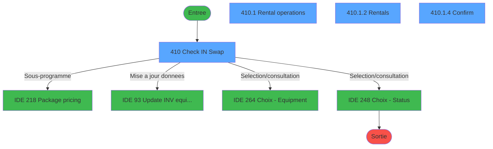
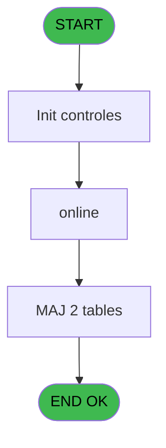
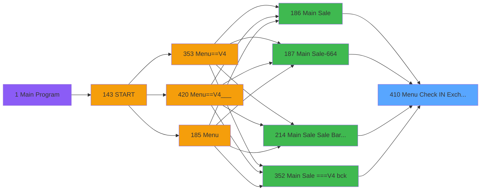
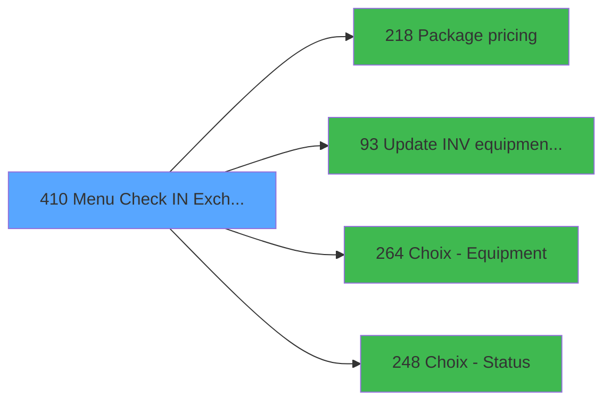

# PVE IDE 410 - Menu Check IN / Exchange

> **Analyse**: Phases 1-4 2026-02-03 20:00 -> 20:00 (11s) | Assemblage 20:00
> **Pipeline**: V7.2 Enrichi
> **Structure**: 4 onglets (Resume | Ecrans | Donnees | Connexions)

<!-- TAB:Resume -->

## 1. FICHE D'IDENTITE

| Attribut | Valeur |
|----------|--------|
| Projet | PVE |
| IDE Position | 410 |
| Nom Programme | Menu Check IN / Exchange |
| Fichier source | `Prg_410.xml` |
| Dossier IDE | A |
| Taches | 7 (4 ecrans visibles) |
| Tables modifiees | 2 |
| Programmes appeles | 4 |

## 2. DESCRIPTION FONCTIONNELLE

**Menu Check IN / Exchange** assure la gestion complete de ce processus, accessible depuis [Main Sale ===V4 bck (IDE 352)](PVE-IDE-352.md), [Main Sale ===V4 (IDE 0)](PVE-IDE-0.md), [Main Sale (IDE 186)](PVE-IDE-186.md), [Main Sale-664 (IDE 187)](PVE-IDE-187.md), [Main Sale Sale Bar Code (IDE 214)](PVE-IDE-214.md), [Main Sale ===V4 (IDE 354)](PVE-IDE-354.md), [Main Sale ===V4 (IDE 359)](PVE-IDE-359.md), [Main Sale (IDE 363)](PVE-IDE-363.md), [Main Sale-664 (IDE 364)](PVE-IDE-364.md), [Menu Main (TPE) (IDE 403)](PVE-IDE-403.md), [Main Sale ===V4 (IDE 409)](PVE-IDE-409.md), [Main Sale ===V4 (IDE 415)](PVE-IDE-415.md), [Main Sale ===V4 Booking ACTUEL (IDE 417)](PVE-IDE-417.md), [Main Sale (IDE 440)](PVE-IDE-440.md).

Le flux de traitement s'organise en **2 blocs fonctionnels** :

- **Traitement** (6 taches) : traitements metier divers
- **Creation** (1 tache) : insertion d'enregistrements en base (mouvements, prestations)

**Donnees modifiees** : 2 tables en ecriture (pv_sellers_by_week, vente_par_moyen_paiement).

Detail : phases du traitement

#### Phase 1 : Traitement (6 taches)

- **410** - Check IN / Swap **[[ECRAN]](#ecran-t1)**
- **410.1** - Rental operations **[[ECRAN]](#ecran-t2)**
- **410.1.1** - add rental
- **410.1.2** - Rentals **[[ECRAN]](#ecran-t4)**
- **410.1.3** - Rentals
- **410.1.4** - Confirm **[[ECRAN]](#ecran-t6)**

Delegue a : [    Package pricing (IDE 218)](PVE-IDE-218.md), [Update INV equipment status (IDE 93)](PVE-IDE-93.md)

#### Phase 2 : Creation (1 tache)

- **410.1.5** - create reponse

#### Tables impactees

| Table | Operations | Role metier |
|-------|-----------|-------------|
| pv_sellers_by_week | R/**W**/L (4 usages) |  |
| vente_par_moyen_paiement | **W** (1 usages) | Donnees de ventes |

## 3. BLOCS FONCTIONNELS

### 3.1 Traitement (6 taches)

Traitements internes.

---

#### 410 - Check IN / Swap [[ECRAN]](#ecran-t1)

**Role** : Tache d'orchestration : point d'entree du programme (6 sous-taches). Coordonne l'enchainement des traitements.
**Ecran** : 810 x 393 DLU (MDI) | [Voir mockup](#ecran-t1)

5 sous-taches directes

| Tache | Nom | Bloc |
|-------|-----|------|
| [410.1](#t2) | Rental operations **[[ECRAN]](#ecran-t2)** | Traitement |
| [410.1.1](#t3) | add rental | Traitement |
| [410.1.2](#t4) | Rentals **[[ECRAN]](#ecran-t4)** | Traitement |
| [410.1.3](#t5) | Rentals | Traitement |
| [410.1.4](#t6) | Confirm **[[ECRAN]](#ecran-t6)** | Traitement |

**Delegue a** : [    Package pricing (IDE 218)](PVE-IDE-218.md), [Update INV equipment status (IDE 93)](PVE-IDE-93.md)

---

#### 410.1 - Rental operations [[ECRAN]](#ecran-t2)

**Role** : Traitement : Rental operations.
**Ecran** : 809 x 392 DLU (Modal) | [Voir mockup](#ecran-t2)
**Variables liees** : E (R.cust rental)
**Delegue a** : [    Package pricing (IDE 218)](PVE-IDE-218.md), [Update INV equipment status (IDE 93)](PVE-IDE-93.md)

---

#### 410.1.1 - add rental

**Role** : Traitement : add rental.
**Variables liees** : E (R.cust rental)
**Delegue a** : [    Package pricing (IDE 218)](PVE-IDE-218.md), [Update INV equipment status (IDE 93)](PVE-IDE-93.md)

---

#### 410.1.2 - Rentals [[ECRAN]](#ecran-t4)

**Role** : Traitement : Rentals.
**Ecran** : 486 x 159 DLU (Modal) | [Voir mockup](#ecran-t4)
**Delegue a** : [    Package pricing (IDE 218)](PVE-IDE-218.md), [Update INV equipment status (IDE 93)](PVE-IDE-93.md)

---

#### 410.1.3 - Rentals

**Role** : Traitement : Rentals.
**Delegue a** : [    Package pricing (IDE 218)](PVE-IDE-218.md), [Update INV equipment status (IDE 93)](PVE-IDE-93.md)

---

#### 410.1.4 - Confirm [[ECRAN]](#ecran-t6)

**Role** : Traitement : Confirm.
**Ecran** : 554 x 157 DLU (MDI) | [Voir mockup](#ecran-t6)
**Variables liees** : G (v.confirm <> classif)
**Delegue a** : [    Package pricing (IDE 218)](PVE-IDE-218.md), [Update INV equipment status (IDE 93)](PVE-IDE-93.md)

### 3.2 Creation (1 tache)

Insertion de nouveaux enregistrements en base.

---

#### 410.1.5 - create reponse

**Role** : Traitement : create reponse.

## 5. REGLES METIER

*(Aucune regle metier identifiee)*

## 6. CONTEXTE

- **Appele par**: [Main Sale ===V4 bck (IDE 352)](PVE-IDE-352.md), [Main Sale ===V4 (IDE 0)](PVE-IDE-0.md), [Main Sale (IDE 186)](PVE-IDE-186.md), [Main Sale-664 (IDE 187)](PVE-IDE-187.md), [Main Sale Sale Bar Code (IDE 214)](PVE-IDE-214.md), [Main Sale ===V4 (IDE 354)](PVE-IDE-354.md), [Main Sale ===V4 (IDE 359)](PVE-IDE-359.md), [Main Sale (IDE 363)](PVE-IDE-363.md), [Main Sale-664 (IDE 364)](PVE-IDE-364.md), [Menu Main (TPE) (IDE 403)](PVE-IDE-403.md), [Main Sale ===V4 (IDE 409)](PVE-IDE-409.md), [Main Sale ===V4 (IDE 415)](PVE-IDE-415.md), [Main Sale ===V4 Booking ACTUEL (IDE 417)](PVE-IDE-417.md), [Main Sale (IDE 440)](PVE-IDE-440.md)
- **Appelle**: 4 programmes | **Tables**: 12 (W:2 R:2 L:10) | **Taches**: 7 | **Expressions**: 3

<!-- TAB:Ecrans -->

## 8. ECRANS

### 8.1 Forms visibles (4 / 7)

| # | Position | Tache | Nom | Type | Largeur | Hauteur | Bloc |
|---|----------|-------|-----|------|---------|---------|------|
| 1 | 410 | 410 | Check IN / Swap | MDI | 810 | 393 | Traitement |
| 2 | 410.1 | 410.1 | Rental operations | Modal | 809 | 392 | Traitement |
| 3 | 410.1.2 | 410.1.2 | Rentals | Modal | 486 | 159 | Traitement |
| 4 | 410.1.4 | 410.1.4 | Confirm | MDI | 554 | 157 | Traitement |

### 8.2 Mockups Ecrans

---

#### 410.1 - Rental operations
**Tache** : [410.1](#t2) | **Type** : Modal | **Dimensions** : 809 x 392 DLU
**Bloc** : Traitement | **Titre IDE** : Rental operations

<!-- FORM-DATA:
{
    "width":  809,
    "vFactor":  8,
    "type":  "Modal",
    "hFactor":  4,
    "controls":  [
                     {
                         "x":  126,
                         "type":  "label",
                         "var":  "",
                         "y":  42,
                         "w":  79,
                         "fmt":  "",
                         "name":  "",
                         "h":  14,
                         "color":  "143",
                         "text":  "IN",
                         "parent":  null
                     },
                     {
                         "x":  601,
                         "type":  "label",
                         "var":  "",
                         "y":  42,
                         "w":  79,
                         "fmt":  "",
                         "name":  "",
                         "h":  14,
                         "color":  "181",
                         "text":  "OUT",
                         "parent":  null
                     },
                     {
                         "x":  299,
                         "type":  "label",
                         "var":  "",
                         "y":  60,
                         "w":  203,
                         "fmt":  "",
                         "name":  "",
                         "h":  12,
                         "color":  "181",
                         "text":  "Equipment to be checked \"IN\"",
                         "parent":  null
                     },
                     {
                         "x":  558,
                         "type":  "label",
                         "var":  "",
                         "y":  270,
                         "w":  232,
                         "fmt":  "",
                         "name":  "",
                         "h":  66,
                         "color":  "187",
                         "text":  "Scan the equipment to be checked in.\r\n\r\nThen select the RETURN action or scan the equipment to be checked out if your customer is swaping equipments.",
                         "parent":  6
                     },
                     {
                         "x":  0,
                         "type":  "label",
                         "var":  "",
                         "y":  0,
                         "w":  809,
                         "fmt":  "",
                         "name":  "",
                         "h":  42,
                         "color":  "188",
                         "text":  "",
                         "parent":  null
                     },
                     {
                         "x":  219,
                         "type":  "label",
                         "var":  "",
                         "y":  16,
                         "w":  325,
                         "fmt":  "",
                         "name":  "",
                         "h":  14,
                         "color":  "188",
                         "text":  "EQUIPMENT CHECK IN   \u0026   EXCHANGE",
                         "parent":  6
                     },
                     {
                         "x":  27,
                         "type":  "label",
                         "var":  "",
                         "y":  56,
                         "w":  265,
                         "fmt":  "",
                         "name":  "",
                         "h":  96,
                         "color":  "186",
                         "text":  "",
                         "parent":  null
                     },
                     {
                         "x":  37,
                         "type":  "label",
                         "var":  "",
                         "y":  90,
                         "w":  77,
                         "fmt":  "",
                         "name":  "",
                         "h":  12,
                         "color":  "181",
                         "text":  "Equipment :",
                         "parent":  10
                     },
                     {
                         "x":  37,
                         "type":  "label",
                         "var":  "",
                         "y":  109,
                         "w":  81,
                         "fmt":  "",
                         "name":  "",
                         "h":  10,
                         "color":  "181",
                         "text":  "Classification :",
                         "parent":  10
                     },
                     {
                         "x":  519,
                         "type":  "label",
                         "var":  "",
                         "y":  56,
                         "w":  265,
                         "fmt":  "",
                         "name":  "",
                         "h":  96,
                         "color":  "186",
                         "text":  "",
                         "parent":  null
                     },
                     {
                         "x":  529,
                         "type":  "label",
                         "var":  "",
                         "y":  90,
                         "w":  75,
                         "fmt":  "",
                         "name":  "",
                         "h":  12,
                         "color":  "181",
                         "text":  "Equipment :",
                         "parent":  17
                     },
                     {
                         "x":  529,
                         "type":  "label",
                         "var":  "",
                         "y":  109,
                         "w":  83,
                         "fmt":  "",
                         "name":  "",
                         "h":  10,
                         "color":  "181",
                         "text":  "Classification :",
                         "parent":  17
                     },
                     {
                         "x":  347,
                         "type":  "label",
                         "var":  "",
                         "y":  88,
                         "w":  110,
                         "fmt":  "",
                         "name":  "",
                         "h":  31,
                         "color":  "186",
                         "text":  "",
                         "parent":  null
                     },
                     {
                         "x":  427,
                         "type":  "label",
                         "var":  "",
                         "y":  94,
                         "w":  26,
                         "fmt":  "",
                         "name":  "",
                         "h":  23,
                         "color":  "186",
                         "text":  "è",
                         "parent":  23
                     },
                     {
                         "x":  347,
                         "type":  "label",
                         "var":  "",
                         "y":  120,
                         "w":  110,
                         "fmt":  "",
                         "name":  "",
                         "h":  31,
                         "color":  "186",
                         "text":  "",
                         "parent":  null
                     },
                     {
                         "x":  351,
                         "type":  "label",
                         "var":  "",
                         "y":  127,
                         "w":  26,
                         "fmt":  "",
                         "name":  "",
                         "h":  22,
                         "color":  "186",
                         "text":  "ç",
                         "parent":  26
                     },
                     {
                         "x":  27,
                         "type":  "label",
                         "var":  "",
                         "y":  151,
                         "w":  492,
                         "fmt":  "",
                         "name":  "",
                         "h":  33,
                         "color":  "187",
                         "text":  "",
                         "parent":  null
                     },
                     {
                         "x":  51,
                         "type":  "label",
                         "var":  "",
                         "y":  161,
                         "w":  129,
                         "fmt":  "",
                         "name":  "",
                         "h":  12,
                         "color":  "181",
                         "text":  "Status of equipment",
                         "parent":  29
                     },
                     {
                         "x":  27,
                         "type":  "label",
                         "var":  "",
                         "y":  182,
                         "w":  492,
                         "fmt":  "",
                         "name":  "",
                         "h":  177,
                         "color":  "182",
                         "text":  "",
                         "parent":  null
                     },
                     {
                         "x":  51,
                         "type":  "label",
                         "var":  "",
                         "y":  187,
                         "w":  53,
                         "fmt":  "",
                         "name":  "",
                         "h":  12,
                         "color":  "186",
                         "text":  "Renter",
                         "parent":  33
                     },
                     {
                         "x":  0,
                         "type":  "label",
                         "var":  "",
                         "y":  359,
                         "w":  809,
                         "fmt":  "",
                         "name":  "",
                         "h":  33,
                         "color":  "6",
                         "text":  "",
                         "parent":  null
                     },
                     {
                         "x":  75,
                         "type":  "edit",
                         "var":  "",
                         "y":  61,
                         "w":  129,
                         "fmt":  "U10",
                         "name":  "v.serial IN",
                         "h":  27,
                         "color":  "110",
                         "text":  "",
                         "parent":  10
                     },
                     {
                         "x":  207,
                         "type":  "button",
                         "var":  "",
                         "y":  61,
                         "w":  37,
                         "fmt":  "",
                         "name":  "v.zoom",
                         "h":  29,
                         "color":  "",
                         "text":  "",
                         "parent":  10
                     },
                     {
                         "x":  587,
                         "type":  "edit",
                         "var":  "",
                         "y":  61,
                         "w":  129,
                         "fmt":  "U10",
                         "name":  "v.serial OUT",
                         "h":  27,
                         "color":  "110",
                         "text":  "",
                         "parent":  17
                     },
                     {
                         "x":  125,
                         "type":  "edit",
                         "var":  "",
                         "y":  90,
                         "w":  164,
                         "fmt":  "30",
                         "name":  "",
                         "h":  12,
                         "color":  "181",
                         "text":  "",
                         "parent":  10
                     },
                     {
                         "x":  125,
                         "type":  "edit",
                         "var":  "",
                         "y":  109,
                         "w":  164,
                         "fmt":  "",
                         "name":  "",
                         "h":  10,
                         "color":  "181",
                         "text":  "",
                         "parent":  10
                     },
                     {
                         "x":  614,
                         "type":  "edit",
                         "var":  "",
                         "y":  90,
                         "w":  164,
                         "fmt":  "30",
                         "name":  "",
                         "h":  12,
                         "color":  "181",
                         "text":  "",
                         "parent":  17
                     },
                     {
                         "x":  614,
                         "type":  "edit",
                         "var":  "",
                         "y":  109,
                         "w":  164,
                         "fmt":  "",
                         "name":  "",
                         "h":  10,
                         "color":  "181",
                         "text":  "",
                         "parent":  17
                     },
                     {
                         "x":  759,
                         "type":  "image",
                         "var":  "",
                         "y":  7,
                         "w":  48,
                         "fmt":  "",
                         "name":  "",
                         "h":  34,
                         "color":  "",
                         "text":  "",
                         "parent":  6
                     },
                     {
                         "x":  292,
                         "type":  "edit",
                         "var":  "",
                         "y":  56,
                         "w":  228,
                         "fmt":  "",
                         "name":  "",
                         "h":  30,
                         "color":  "191",
                         "text":  "",
                         "parent":  null
                     },
                     {
                         "x":  348,
                         "type":  "button",
                         "var":  "",
                         "y":  93,
                         "w":  75,
                         "fmt":  "\u0026EXCHANGE",
                         "name":  "SWAP",
                         "h":  24,
                         "color":  "",
                         "text":  "",
                         "parent":  null
                     },
                     {
                         "x":  380,
                         "type":  "button",
                         "var":  "",
                         "y":  125,
                         "w":  75,
                         "fmt":  "\u0026RETURN",
                         "name":  "RETURN",
                         "h":  24,
                         "color":  "",
                         "text":  "",
                         "parent":  null
                     },
                     {
                         "x":  224,
                         "type":  "button",
                         "var":  "",
                         "y":  154,
                         "w":  77,
                         "fmt":  "Button",
                         "name":  "",
                         "h":  28,
                         "color":  "",
                         "text":  "",
                         "parent":  null
                     },
                     {
                         "x":  310,
                         "type":  "edit",
                         "var":  "",
                         "y":  161,
                         "w":  189,
                         "fmt":  "30",
                         "name":  "",
                         "h":  15,
                         "color":  "183",
                         "text":  "",
                         "parent":  29
                     },
                     {
                         "x":  107,
                         "type":  "edit",
                         "var":  "",
                         "y":  187,
                         "w":  402,
                         "fmt":  "50",
                         "name":  "",
                         "h":  12,
                         "color":  "189",
                         "text":  "",
                         "parent":  33
                     },
                     {
                         "x":  732,
                         "type":  "button",
                         "var":  "",
                         "y":  364,
                         "w":  77,
                         "fmt":  "\u0026Exit",
                         "name":  "",
                         "h":  28,
                         "color":  "",
                         "text":  "",
                         "parent":  null
                     },
                     {
                         "x":  552,
                         "type":  "edit",
                         "var":  "",
                         "y":  14,
                         "w":  203,
                         "fmt":  "30",
                         "name":  "",
                         "h":  18,
                         "color":  "174",
                         "text":  "",
                         "parent":  6
                     },
                     {
                         "x":  30,
                         "type":  "subform",
                         "var":  "",
                         "y":  202,
                         "w":  486,
                         "fmt":  "",
                         "name":  "Rentals",
                         "h":  154,
                         "color":  "",
                         "text":  "",
                         "parent":  33
                     }
                 ],
    "taskId":  "410.1",
    "height":  392
}
-->

<strong>Champs : 10 champs</strong>

| Pos (x,y) | Nom | Variable | Type |
|-----------|-----|----------|------|
| 75,61 | v.serial IN | - | edit |
| 587,61 | v.serial OUT | - | edit |
| 125,90 | 30 | - | edit |
| 125,109 | (sans nom) | - | edit |
| 614,90 | 30 | - | edit |
| 614,109 | (sans nom) | - | edit |
| 292,56 | (sans nom) | - | edit |
| 310,161 | 30 | - | edit |
| 107,187 | 50 | - | edit |
| 552,14 | 30 | - | edit |

<strong>Boutons : 5 boutons</strong>

| Bouton | Pos (x,y) | Action |
|--------|-----------|--------|
| v.zoom | 207,61 | Ouvre la selection |
| EXCHANGE | 348,93 | Modifie l'element |
| RETURN | 380,125 | Bouton fonctionnel |
| Button | 224,154 | Bouton fonctionnel |
| Exit | 732,364 | Quitte le programme |

---

#### 410.1.2 - Rentals
**Tache** : [410.1.2](#t4) | **Type** : Modal | **Dimensions** : 486 x 159 DLU
**Bloc** : Traitement | **Titre IDE** : Rentals

<!-- FORM-DATA:
{
    "width":  486,
    "vFactor":  8,
    "type":  "Modal",
    "hFactor":  4,
    "controls":  [
                     {
                         "x":  0,
                         "type":  "table",
                         "var":  "",
                         "name":  "",
                         "titleH":  12,
                         "color":  "110",
                         "w":  459,
                         "y":  1,
                         "fmt":  "",
                         "parent":  null,
                         "text":  "",
                         "rowH":  24,
                         "h":  153,
                         "cols":  [
                                      {
                                          "title":  "Product",
                                          "layer":  1,
                                          "w":  63
                                      },
                                      {
                                          "title":  "Classification",
                                          "layer":  2,
                                          "w":  65
                                      },
                                      {
                                          "title":  "Days",
                                          "layer":  3,
                                          "w":  26
                                      },
                                      {
                                          "title":  "Code",
                                          "layer":  4,
                                          "w":  78
                                      },
                                      {
                                          "title":  "Date out",
                                          "layer":  5,
                                          "w":  53
                                      },
                                      {
                                          "title":  "Date due",
                                          "layer":  6,
                                          "w":  54
                                      },
                                      {
                                          "title":  "Date in",
                                          "layer":  7,
                                          "w":  55
                                      },
                                      {
                                          "title":  "Status",
                                          "layer":  8,
                                          "w":  62
                                      }
                                  ],
                         "rows":  8
                     },
                     {
                         "x":  287,
                         "type":  "edit",
                         "var":  "",
                         "y":  15,
                         "w":  50,
                         "fmt":  "",
                         "name":  "",
                         "h":  22,
                         "color":  "110",
                         "text":  "",
                         "parent":  1
                     },
                     {
                         "x":  3,
                         "type":  "edit",
                         "var":  "",
                         "y":  15,
                         "w":  57,
                         "fmt":  "",
                         "name":  "",
                         "h":  22,
                         "color":  "110",
                         "text":  "",
                         "parent":  1
                     },
                     {
                         "x":  66,
                         "type":  "edit",
                         "var":  "",
                         "y":  15,
                         "w":  60,
                         "fmt":  "",
                         "name":  "",
                         "h":  22,
                         "color":  "110",
                         "text":  "",
                         "parent":  1
                     },
                     {
                         "x":  131,
                         "type":  "edit",
                         "var":  "",
                         "y":  15,
                         "w":  21,
                         "fmt":  "3",
                         "name":  "",
                         "h":  22,
                         "color":  "110",
                         "text":  "",
                         "parent":  1
                     },
                     {
                         "x":  158,
                         "type":  "edit",
                         "var":  "",
                         "y":  15,
                         "w":  71,
                         "fmt":  "U15",
                         "name":  "",
                         "h":  22,
                         "color":  "110",
                         "text":  "",
                         "parent":  1
                     },
                     {
                         "x":  234,
                         "type":  "edit",
                         "var":  "",
                         "y":  15,
                         "w":  49,
                         "fmt":  "",
                         "name":  "",
                         "h":  22,
                         "color":  "110",
                         "text":  "",
                         "parent":  1
                     },
                     {
                         "x":  397,
                         "type":  "edit",
                         "var":  "",
                         "y":  15,
                         "w":  51,
                         "fmt":  "",
                         "name":  "",
                         "h":  22,
                         "color":  "110",
                         "text":  "",
                         "parent":  1
                     },
                     {
                         "x":  458,
                         "type":  "button",
                         "var":  "",
                         "y":  1,
                         "w":  26,
                         "fmt":  "ñ",
                         "name":  "",
                         "h":  78,
                         "color":  "",
                         "text":  "",
                         "parent":  null
                     },
                     {
                         "x":  458,
                         "type":  "button",
                         "var":  "",
                         "y":  79,
                         "w":  26,
                         "fmt":  "ò",
                         "name":  "",
                         "h":  78,
                         "color":  "",
                         "text":  "",
                         "parent":  null
                     },
                     {
                         "x":  343,
                         "type":  "edit",
                         "var":  "",
                         "y":  15,
                         "w":  50,
                         "fmt":  "10",
                         "name":  "",
                         "h":  22,
                         "color":  "110",
                         "text":  "",
                         "parent":  1
                     }
                 ],
    "taskId":  "410.1.2",
    "height":  159
}
-->

<strong>Champs : 8 champs</strong>

| Pos (x,y) | Nom | Variable | Type |
|-----------|-----|----------|------|
| 287,15 | (sans nom) | - | edit |
| 3,15 | (sans nom) | - | edit |
| 66,15 | (sans nom) | - | edit |
| 131,15 | 3 | - | edit |
| 158,15 | U15 | - | edit |
| 234,15 | (sans nom) | - | edit |
| 397,15 | (sans nom) | - | edit |
| 343,15 | 10 | - | edit |

<strong>Boutons : 2 boutons</strong>

| Bouton | Pos (x,y) | Action |
|--------|-----------|--------|
| ñ | 458,1 | Bouton fonctionnel |
| ò | 458,79 | Bouton fonctionnel |

---

#### 410.1.4 - Confirm
**Tache** : [410.1.4](#t6) | **Type** : MDI | **Dimensions** : 554 x 157 DLU
**Bloc** : Traitement | **Titre IDE** : Confirm

<!-- FORM-DATA:
{
    "width":  554,
    "vFactor":  8,
    "type":  "MDI",
    "hFactor":  8,
    "controls":  [
                     {
                         "x":  26,
                         "type":  "label",
                         "var":  "",
                         "y":  40,
                         "w":  501,
                         "fmt":  "",
                         "name":  "",
                         "h":  18,
                         "color":  "183",
                         "text":  "Please confirm what you intend to do :",
                         "parent":  null
                     },
                     {
                         "x":  3,
                         "type":  "label",
                         "var":  "",
                         "y":  0,
                         "w":  546,
                         "fmt":  "",
                         "name":  "",
                         "h":  36,
                         "color":  "182",
                         "text":  "",
                         "parent":  null
                     },
                     {
                         "x":  199,
                         "type":  "button",
                         "var":  "",
                         "y":  130,
                         "w":  154,
                         "fmt":  "\u0026Ok",
                         "name":  "",
                         "h":  24,
                         "color":  "",
                         "text":  "",
                         "parent":  null
                     },
                     {
                         "x":  5,
                         "type":  "image",
                         "var":  "",
                         "y":  5,
                         "w":  76,
                         "fmt":  "",
                         "name":  "",
                         "h":  30,
                         "color":  "",
                         "text":  "",
                         "parent":  2
                     },
                     {
                         "x":  26,
                         "type":  "radio",
                         "var":  "",
                         "y":  60,
                         "w":  501,
                         "fmt":  "",
                         "name":  "V.action",
                         "h":  53,
                         "color":  "183",
                         "text":  "Exchange the equipments (Charged),Cancel",
                         "parent":  null
                     }
                 ],
    "taskId":  "410.1.4",
    "height":  157
}
-->

<strong>Boutons : 1 boutons</strong>

| Bouton | Pos (x,y) | Action |
|--------|-----------|--------|
| Ok | 199,130 | Valide la saisie et enregistre |

## 9. NAVIGATION

### 9.1 Enchainement des ecrans

**Detail par enchainement :**

| Depuis | Action | Vers | Retour |
|--------|--------|------|--------|
| Check IN / Swap | Sous-programme | [    Package pricing (IDE 218)](PVE-IDE-218.md) | Retour ecran |
| Check IN / Swap | Mise a jour donnees | [Update INV equipment status (IDE 93)](PVE-IDE-93.md) | Retour ecran |
| Check IN / Swap | Selection/consultation | [Choix - Equipment (IDE 264)](PVE-IDE-264.md) | Retour ecran |
| Check IN / Swap | Selection/consultation | [Choix - Status (IDE 248)](PVE-IDE-248.md) | Retour ecran |

### 9.3 Structure hierarchique (7 taches)

| Position | Tache | Type | Dimensions | Bloc |
|----------|-------|------|------------|------|
| **410.1** | [**Check IN / Swap** (410)](#t1) [mockup](#ecran-t1) | MDI | 810x393 | Traitement |
| 410.1.1 | [Rental operations (410.1)](#t2) [mockup](#ecran-t2) | Modal | 809x392 | |
| 410.1.2 | [add rental (410.1.1)](#t3) | MDI | - | |
| 410.1.3 | [Rentals (410.1.2)](#t4) [mockup](#ecran-t4) | Modal | 486x159 | |
| 410.1.4 | [Rentals (410.1.3)](#t5) | Modal | - | |
| 410.1.5 | [Confirm (410.1.4)](#t6) [mockup](#ecran-t6) | MDI | 554x157 | |
| **410.2** | [**create reponse** (410.1.5)](#t7) | - | - | Creation |

### 9.4 Algorigramme

> **Legende**: Vert = START/END OK | Rouge = END KO | Bleu = Decisions
> *Algorigramme auto-genere. Utiliser `/algorigramme` pour une synthese metier detaillee.*

<!-- TAB:Donnees -->

## 10. TABLES

### Tables utilisees (12)

| ID | Nom | Description | Type | R | W | L | Usages |
|----|-----|-------------|------|---|---|---|--------|
| 380 | pv_day_modes |  | DB |   |   | L | 2 |
| 382 | pv_discount_reasons |  | DB | R |   |   | 2 |
| 388 | pv_hotel_days |  | DB |   |   | L | 1 |
| 389 | pv_equipment_inventory |  | DB |   |   | L | 2 |
| 398 | pv_prestations | Prestations/services vendus | DB |   |   | L | 1 |
| 400 | pv_cust_rentals |  | DB |   |   | L | 2 |
| 404 | pv_sellers_by_week |  | DB | R | **W** | L | 4 |
| 413 | pv_tva |  | DB |   |   | L | 1 |
| 419 | realise_articles_caution | Articles et stock | DB |   |   | L | 2 |
| 805 | vente_par_moyen_paiement | Donnees de ventes | DB |   | **W** |   | 1 |
| 806 | sale_channel |  | DB |   |   | L | 1 |
| 807 | plafond_lit |  | DB |   |   | L | 1 |

### Colonnes par table (3 / 3 tables avec colonnes identifiees)

Table 382 - pv_discount_reasons (R) - 2 usages

| Lettre | Variable | Acces | Type |
|--------|----------|-------|------|
| A | r.equipment rental | R | Numeric |
| B | v.serial IN | R | Alpha |
| C | v.zoom | R | Alpha |
| D | v.serial OUT | R | Alpha |
| E | R.cust rental | R | Logical |
| F | R.Equipment | R | Logical |
| G | v.confirm <> classif | R | Logical |
| H | v.cancel requested | R | Logical |
| I | v.operation choice | R | Alpha |
| J | v.new package id | R | Numeric |
| K | v.access serial in | R | Logical |
| L | v.flagDate | R | Numeric |
| M | V.Valider | R | Logical |

Table 404 - pv_sellers_by_week (R/**W**/L) - 4 usages

*Table utilisee uniquement en Link ou aucune colonne Real identifiee dans le DataView.*

Table 805 - vente_par_moyen_paiement (**W**) - 1 usages

*Table utilisee uniquement en Link ou aucune colonne Real identifiee dans le DataView.*

## 11. VARIABLES

### 11.1 Parametres entrants (3)

Variables recues du programme appelant ([Main Sale ===V4 bck (IDE 352)](PVE-IDE-352.md)).

| Lettre | Nom | Type | Usage dans |
|--------|-----|------|-----------|
| A | p.serial in | Alpha | 1x parametre entrant |
| B | p.serial out | Alpha | - |
| C | P Code Fidelisation | Alpha | - |

### 11.2 Variables de session (8)

Variables persistantes pendant toute la session.

| Lettre | Nom | Type | Usage dans |
|--------|-----|------|-----------|
| D | v.no exit | Logical | 1x session |
| G | v.confirm <> classif | Logical | - |
| H | v.cancel requested | Logical | - |
| I | v.operation choice | Alpha | - |
| J | v.new package id | Numeric | - |
| K | v.access serial in | Logical | - |
| L | v.flagDate | Numeric | - |
| M | V.Valider | Logical | - |

### 11.3 Autres (2)

Variables diverses.

| Lettre | Nom | Type | Usage dans |
|--------|-----|------|-----------|
| E | R.cust rental | Logical | - |
| F | R.Equipment | Logical | - |

## 12. EXPRESSIONS

**3 / 3 expressions decodees (100%)**

### 12.1 Repartition par type

| Type | Expressions | Regles |
|------|-------------|--------|
| OTHER | 1 | 0 |
| CAST_LOGIQUE | 1 | 0 |
| NEGATION | 1 | 0 |

### 12.2 Expressions cles par type

#### OTHER (1 expressions)

| Type | IDE | Expression | Regle |
|------|-----|------------|-------|
| OTHER | 1 | `p.serial in [A]` | - |

#### CAST_LOGIQUE (1 expressions)

| Type | IDE | Expression | Regle |
|------|-----|------------|-------|
| CAST_LOGIQUE | 2 | `'FALSE'LOG` | - |

#### NEGATION (1 expressions)

| Type | IDE | Expression | Regle |
|------|-----|------------|-------|
| NEGATION | 3 | `NOT (v.no exit [D])` | - |

<!-- TAB:Connexions -->

## 13. GRAPHE D'APPELS

### 13.1 Chaine depuis Main (Callers)

Main -> ... -> [Main Sale ===V4 bck (IDE 352)](PVE-IDE-352.md) -> **Menu Check IN / Exchange (IDE 410)**

Main -> ... -> [Main Sale ===V4 (IDE 0)](PVE-IDE-0.md) -> **Menu Check IN / Exchange (IDE 410)**

Main -> ... -> [Main Sale (IDE 186)](PVE-IDE-186.md) -> **Menu Check IN / Exchange (IDE 410)**

Main -> ... -> [Main Sale-664 (IDE 187)](PVE-IDE-187.md) -> **Menu Check IN / Exchange (IDE 410)**

Main -> ... -> [Main Sale Sale Bar Code (IDE 214)](PVE-IDE-214.md) -> **Menu Check IN / Exchange (IDE 410)**

Main -> ... -> [Main Sale ===V4 (IDE 354)](PVE-IDE-354.md) -> **Menu Check IN / Exchange (IDE 410)**

Main -> ... -> [Main Sale ===V4 (IDE 359)](PVE-IDE-359.md) -> **Menu Check IN / Exchange (IDE 410)**

Main -> ... -> [Main Sale (IDE 363)](PVE-IDE-363.md) -> **Menu Check IN / Exchange (IDE 410)**

Main -> ... -> [Main Sale-664 (IDE 364)](PVE-IDE-364.md) -> **Menu Check IN / Exchange (IDE 410)**

Main -> ... -> [Menu Main (TPE) (IDE 403)](PVE-IDE-403.md) -> **Menu Check IN / Exchange (IDE 410)**

Main -> ... -> [Main Sale ===V4 (IDE 409)](PVE-IDE-409.md) -> **Menu Check IN / Exchange (IDE 410)**

Main -> ... -> [Main Sale ===V4 (IDE 415)](PVE-IDE-415.md) -> **Menu Check IN / Exchange (IDE 410)**

Main -> ... -> [Main Sale ===V4 Booking ACTUEL (IDE 417)](PVE-IDE-417.md) -> **Menu Check IN / Exchange (IDE 410)**

Main -> ... -> [Main Sale (IDE 440)](PVE-IDE-440.md) -> **Menu Check IN / Exchange (IDE 410)**

### 13.2 Callers

| IDE | Nom Programme | Nb Appels |
|-----|---------------|-----------|
| [352](PVE-IDE-352.md) | Main Sale ===V4 bck | 2 |
| [0](PVE-IDE-0.md) | Main Sale ===V4 | 1 |
| [186](PVE-IDE-186.md) | Main Sale | 1 |
| [187](PVE-IDE-187.md) | Main Sale-664 | 1 |
| [214](PVE-IDE-214.md) | Main Sale Sale Bar Code | 1 |
| [354](PVE-IDE-354.md) | Main Sale ===V4 | 1 |
| [359](PVE-IDE-359.md) | Main Sale ===V4 | 1 |
| [363](PVE-IDE-363.md) | Main Sale | 1 |
| [364](PVE-IDE-364.md) | Main Sale-664 | 1 |
| [403](PVE-IDE-403.md) | Menu Main (TPE) | 1 |
| [409](PVE-IDE-409.md) | Main Sale ===V4 | 1 |
| [415](PVE-IDE-415.md) | Main Sale ===V4 | 1 |
| [417](PVE-IDE-417.md) | Main Sale ===V4 Booking ACTUEL | 1 |
| [440](PVE-IDE-440.md) | Main Sale | 1 |

### 13.3 Callees (programmes appeles)

### 13.4 Detail Callees avec contexte

| IDE | Nom Programme | Appels | Contexte |
|-----|---------------|--------|----------|
| [218](PVE-IDE-218.md) |     Package pricing | 6 | Sous-programme |
| [93](PVE-IDE-93.md) | Update INV equipment status | 3 | Mise a jour donnees |
| [264](PVE-IDE-264.md) | Choix - Equipment | 2 | Selection/consultation |
| [248](PVE-IDE-248.md) | Choix - Status | 1 | Selection/consultation |

## 14. RECOMMANDATIONS MIGRATION

### 14.1 Profil du programme

| Metrique | Valeur | Impact migration |
|----------|--------|-----------------|
| Lignes de logique | 422 | Taille moyenne |
| Expressions | 3 | Peu de logique |
| Tables WRITE | 2 | Impact faible |
| Sous-programmes | 4 | Peu de dependances |
| Ecrans visibles | 4 | Quelques ecrans |
| Code desactive | 0.5% (2 / 422) | Code sain |
| Regles metier | 0 | Pas de regle identifiee |

### 14.2 Plan de migration par bloc

#### Traitement (6 taches: 4 ecrans, 2 traitements)

- **Strategie** : Orchestrateur avec 4 ecrans (Razor/React) et 2 traitements backend (services).
- Les ecrans deviennent des composants UI, les traitements invisibles deviennent des services injectables.
- 4 sous-programme(s) a migrer ou a reutiliser depuis les services existants.
- Decomposer les taches en services unitaires testables.

#### Creation (1 tache: 0 ecran, 1 traitement)

- **Strategie** : Repository pattern avec Entity Framework Core.
- Insertion via `IRepository<T>.CreateAsync()`

### 14.3 Dependances critiques

| Dependance | Type | Appels | Impact |
|------------|------|--------|--------|
| pv_sellers_by_week | Table WRITE (Database) | 1x | Schema + repository |
| vente_par_moyen_paiement | Table WRITE (Database) | 1x | Schema + repository |
| [    Package pricing (IDE 218)](PVE-IDE-218.md) | Sous-programme | 6x | **CRITIQUE** - Sous-programme |
| [Update INV equipment status (IDE 93)](PVE-IDE-93.md) | Sous-programme | 3x | **CRITIQUE** - Mise a jour donnees |
| [Choix - Equipment (IDE 264)](PVE-IDE-264.md) | Sous-programme | 2x | Haute - Selection/consultation |
| [Choix - Status (IDE 248)](PVE-IDE-248.md) | Sous-programme | 1x | Normale - Selection/consultation |

---
*Spec DETAILED generee par Pipeline V7.2 - 2026-02-03 20:00*
