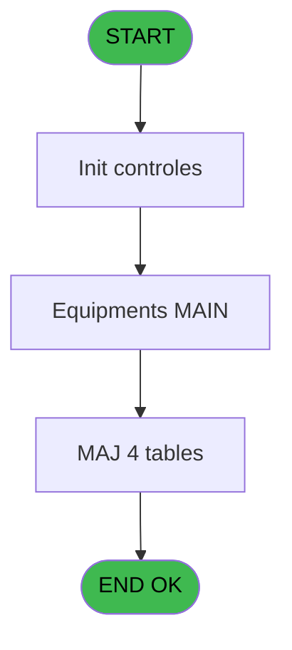
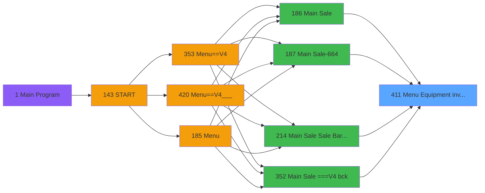
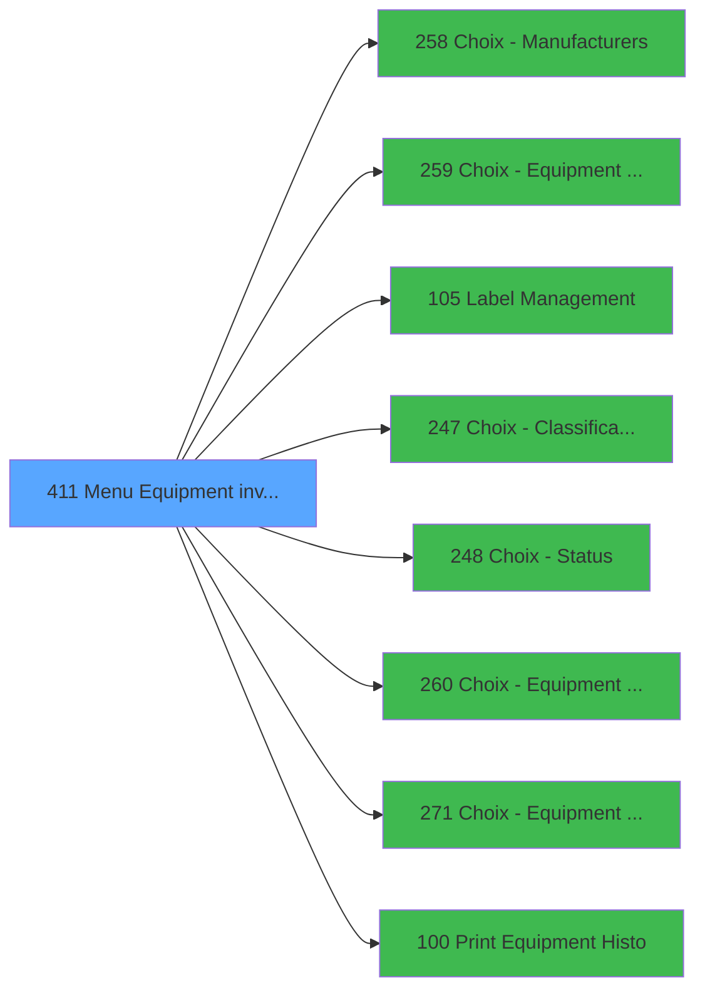

# PVE IDE 411 - Menu Equipment inventory

> **Analyse**: Phases 1-4 2026-02-03 20:00 -> 20:00 (11s) | Assemblage 20:00
> **Pipeline**: V7.2 Enrichi
> **Structure**: 4 onglets (Resume | Ecrans | Donnees | Connexions)

<!-- TAB:Resume -->

## 1. FICHE D'IDENTITE

| Attribut | Valeur |
|----------|--------|
| Projet | PVE |
| IDE Position | 411 |
| Nom Programme | Menu Equipment inventory |
| Fichier source | `Prg_411.xml` |
| Dossier IDE | A |
| Taches | 18 (8 ecrans visibles) |
| Tables modifiees | 4 |
| Programmes appeles | 8 |

## 2. DESCRIPTION FONCTIONNELLE

**Menu Equipment inventory** assure la gestion complete de ce processus, accessible depuis [Main Sale ===V4 (IDE 0)](PVE-IDE-0.md), [Main Sale (IDE 186)](PVE-IDE-186.md), [Main Sale-664 (IDE 187)](PVE-IDE-187.md), [Main Sale Sale Bar Code (IDE 214)](PVE-IDE-214.md), [Main Sale ===V4 bck (IDE 352)](PVE-IDE-352.md), [Main Sale ===V4 (IDE 354)](PVE-IDE-354.md), [Main Sale ===V4 (IDE 359)](PVE-IDE-359.md), [Main Sale (IDE 363)](PVE-IDE-363.md), [Main Sale-664 (IDE 364)](PVE-IDE-364.md), [Main Sale ===V4 (IDE 409)](PVE-IDE-409.md), [Main Sale ===V4 (IDE 415)](PVE-IDE-415.md), [Main Sale ===V4 Booking ACTUEL (IDE 417)](PVE-IDE-417.md), [Main Sale (IDE 440)](PVE-IDE-440.md).

Le flux de traitement s'organise en **3 blocs fonctionnels** :

- **Traitement** (15 taches) : traitements metier divers
- **Creation** (2 taches) : insertion d'enregistrements en base (mouvements, prestations)
- **Validation** (1 tache) : controles et verifications de coherence

**Donnees modifiees** : 4 tables en ecriture (pv_day_modes, pv_equipment_inventory, pv_invoicehistoprintagain, pv_manufacturers).

Detail : phases du traitement

#### Phase 1 : Traitement (15 taches)

- **411** - Equipment inventory **[[ECRAN]](#ecran-t1)**
- **411.1** - Equipment inventory **[[ECRAN]](#ecran-t2)**
- **411.1.1** - duplicate
- **411.1.2** - Range **[[ECRAN]](#ecran-t4)**
- **411.1.2.1** - Set Purge Status
- **411.2** - purge
- **411.2.1** - Equipment purge
- **411.3** - Inventories **[[ECRAN]](#ecran-t8)**
- **411.3.1** - Inventory historics **[[ECRAN]](#ecran-t9)**
- **411.3.1.2** - Inventory **[[ECRAN]](#ecran-t12)**
- **411.3.1.2.1** - inventory **[[ECRAN]](#ecran-t13)**
- **411.3.1.2.1.1** - online **[[ECRAN]](#ecran-t14)**
- **411.3.1.2.1.1.1** - update key
- **411.3.1.2.2** - add in inventory
- **411.3.1.2.3** - Reconciliation

Delegue a : [Label Management (IDE 105)](PVE-IDE-105.md)

#### Phase 2 : Creation (2 taches)

- **411.3.1.1** - Create new Inventory **[[ECRAN]](#ecran-t10)**
- **411.3.1.1.1** - batch create

#### Phase 3 : Validation (1 tache)

- **411.3.1.2.4** - Validation

#### Tables impactees

| Table | Operations | Role metier |
|-------|-----------|-------------|
| pv_equipment_inventory | R/**W**/L (6 usages) |  |
| pv_invoicehistoprintagain | **W**/L (5 usages) | Historique / journal |
| pv_day_modes | **W**/L (3 usages) |  |
| pv_manufacturers | **W** (2 usages) |  |

## 3. BLOCS FONCTIONNELS

### 3.1 Traitement (15 taches)

Traitements internes.

---

#### 411 - Equipment inventory [[ECRAN]](#ecran-t1)

**Role** : Tache d'orchestration : point d'entree du programme (15 sous-taches). Coordonne l'enchainement des traitements.
**Ecran** : 809 x 392 DLU (MDI) | [Voir mockup](#ecran-t1)

14 sous-taches directes

| Tache | Nom | Bloc |
|-------|-----|------|
| [411.1](#t2) | Equipment inventory **[[ECRAN]](#ecran-t2)** | Traitement |
| [411.1.1](#t3) | duplicate | Traitement |
| [411.1.2](#t4) | Range **[[ECRAN]](#ecran-t4)** | Traitement |
| [411.1.2.1](#t5) | Set Purge Status | Traitement |
| [411.2](#t6) | purge | Traitement |
| [411.2.1](#t7) | Equipment purge | Traitement |
| [411.3](#t8) | Inventories **[[ECRAN]](#ecran-t8)** | Traitement |
| [411.3.1](#t9) | Inventory historics **[[ECRAN]](#ecran-t9)** | Traitement |
| [411.3.1.2](#t12) | Inventory **[[ECRAN]](#ecran-t12)** | Traitement |
| [411.3.1.2.1](#t13) | inventory **[[ECRAN]](#ecran-t13)** | Traitement |
| [411.3.1.2.1.1](#t14) | online **[[ECRAN]](#ecran-t14)** | Traitement |
| [411.3.1.2.1.1.1](#t15) | update key | Traitement |
| [411.3.1.2.2](#t16) | add in inventory | Traitement |
| [411.3.1.2.3](#t17) | Reconciliation | Traitement |

---

#### 411.1 - Equipment inventory [[ECRAN]](#ecran-t2)

**Role** : Traitement : Equipment inventory.
**Ecran** : 809 x 392 DLU (Modal) | [Voir mockup](#ecran-t2)

---

#### 411.1.1 - duplicate

**Role** : Traitement : duplicate.
**Variables liees** : J (v duplicate)

---

#### 411.1.2 - Range [[ECRAN]](#ecran-t4)

**Role** : Traitement : Range.
**Ecran** : 786 x 130 DLU (MDI) | [Voir mockup](#ecran-t4)

---

#### 411.1.2.1 - Set Purge Status

**Role** : Traitement : Set Purge Status.
**Variables liees** : G (v status), T (v status)

---

#### 411.2 - purge

**Role** : Traitement : purge.

---

#### 411.2.1 - Equipment purge

**Role** : Traitement : Equipment purge.

---

#### 411.3 - Inventories [[ECRAN]](#ecran-t8)

**Role** : Traitement : Inventories.
**Ecran** : 102 x 64 DLU (MDI) | [Voir mockup](#ecran-t8)

---

#### 411.3.1 - Inventory historics [[ECRAN]](#ecran-t9)

**Role** : Traitement : Inventory historics.
**Ecran** : 810 x 393 DLU (MDI) | [Voir mockup](#ecran-t9)

---

#### 411.3.1.2 - Inventory [[ECRAN]](#ecran-t12)

**Role** : Traitement : Inventory.
**Ecran** : 810 x 393 DLU (MDI) | [Voir mockup](#ecran-t12)

---

#### 411.3.1.2.1 - inventory [[ECRAN]](#ecran-t13)

**Role** : Traitement : inventory.
**Ecran** : 809 x 285 DLU (Modal) | [Voir mockup](#ecran-t13)

---

#### 411.3.1.2.1.1 - online [[ECRAN]](#ecran-t14)

**Role** : Traitement : online.
**Ecran** : 802 x 271 DLU (Modal) | [Voir mockup](#ecran-t14)

---

#### 411.3.1.2.1.1.1 - update key

**Role** : Traitement : update key.

---

#### 411.3.1.2.2 - add in inventory

**Role** : Traitement : add in inventory.

---

#### 411.3.1.2.3 - Reconciliation

**Role** : Traitement : Reconciliation.

### 3.2 Creation (2 taches)

Insertion de nouveaux enregistrements en base.

---

#### 411.3.1.1 - Create new Inventory [[ECRAN]](#ecran-t10)

**Role** : Traitement : Create new Inventory.
**Ecran** : 336 x 234 DLU (MDI) | [Voir mockup](#ecran-t10)

---

#### 411.3.1.1.1 - batch create

**Role** : Traitement : batch create.

### 3.3 Validation (1 tache)

Controles de coherence : 1 tache verifie les donnees et conditions.

---

#### 411.3.1.2.4 - Validation

**Role** : Verification : Validation.

## 5. REGLES METIER

*(Aucune regle metier identifiee)*

## 6. CONTEXTE

- **Appele par**: [Main Sale ===V4 (IDE 0)](PVE-IDE-0.md), [Main Sale (IDE 186)](PVE-IDE-186.md), [Main Sale-664 (IDE 187)](PVE-IDE-187.md), [Main Sale Sale Bar Code (IDE 214)](PVE-IDE-214.md), [Main Sale ===V4 bck (IDE 352)](PVE-IDE-352.md), [Main Sale ===V4 (IDE 354)](PVE-IDE-354.md), [Main Sale ===V4 (IDE 359)](PVE-IDE-359.md), [Main Sale (IDE 363)](PVE-IDE-363.md), [Main Sale-664 (IDE 364)](PVE-IDE-364.md), [Main Sale ===V4 (IDE 409)](PVE-IDE-409.md), [Main Sale ===V4 (IDE 415)](PVE-IDE-415.md), [Main Sale ===V4 Booking ACTUEL (IDE 417)](PVE-IDE-417.md), [Main Sale (IDE 440)](PVE-IDE-440.md)
- **Appelle**: 8 programmes | **Tables**: 10 (W:4 R:2 L:8) | **Taches**: 18 | **Expressions**: 8

<!-- TAB:Ecrans -->

## 8. ECRANS

### 8.1 Forms visibles (8 / 18)

| # | Position | Tache | Nom | Type | Largeur | Hauteur | Bloc |
|---|----------|-------|-----|------|---------|---------|------|
| 1 | 411 | 411 | Equipment inventory | MDI | 809 | 392 | Traitement |
| 2 | 411.1 | 411.1 | Equipment inventory | Modal | 809 | 392 | Traitement |
| 3 | 411.1.2 | 411.1.2 | Range | MDI | 786 | 130 | Traitement |
| 4 | 411.3.1 | 411.3.1 | Inventory historics | MDI | 810 | 393 | Traitement |
| 5 | 411.3.1.1 | 411.3.1.1 | Create new Inventory | MDI | 336 | 234 | Creation |
| 6 | 411.3.1.2 | 411.3.1.2 | Inventory | MDI | 810 | 393 | Traitement |
| 7 | 411.3.1.2.1 | 411.3.1.2.1 | inventory | Modal | 809 | 285 | Traitement |
| 8 | 411.3.1.2.1.1 | 411.3.1.2.1.1 | online | Modal | 802 | 271 | Traitement |

### 8.2 Mockups Ecrans

---

#### 411.1 - Equipment inventory
**Tache** : [411.1](#t2) | **Type** : Modal | **Dimensions** : 809 x 392 DLU
**Bloc** : Traitement | **Titre IDE** : Equipment inventory

<!-- FORM-DATA:
{
    "width":  809,
    "vFactor":  8,
    "type":  "Modal",
    "hFactor":  4,
    "controls":  [
                     {
                         "x":  0,
                         "type":  "label",
                         "var":  "",
                         "y":  0,
                         "w":  809,
                         "fmt":  "",
                         "name":  "",
                         "h":  42,
                         "color":  "188",
                         "text":  "",
                         "parent":  null
                     },
                     {
                         "x":  300,
                         "type":  "label",
                         "var":  "",
                         "y":  14,
                         "w":  209,
                         "fmt":  "",
                         "name":  "",
                         "h":  14,
                         "color":  "188",
                         "text":  "EQUIPMENT CENTER",
                         "parent":  1
                     },
                     {
                         "x":  7,
                         "type":  "table",
                         "var":  "",
                         "name":  "",
                         "titleH":  24,
                         "color":  "110",
                         "w":  768,
                         "y":  49,
                         "fmt":  "",
                         "parent":  null,
                         "text":  "",
                         "rowH":  24,
                         "h":  263,
                         "cols":  [
                                      {
                                          "title":  "Equipement Id",
                                          "layer":  1,
                                          "w":  82
                                      },
                                      {
                                          "title":  "Serial number",
                                          "layer":  2,
                                          "w":  85
                                      },
                                      {
                                          "title":  "Equipement type",
                                          "layer":  3,
                                          "w":  107
                                      },
                                      {
                                          "title":  "Manufacturer",
                                          "layer":  4,
                                          "w":  94
                                      },
                                      {
                                          "title":  "Model",
                                          "layer":  5,
                                          "w":  122
                                      },
                                      {
                                          "title":  "Model year",
                                          "layer":  6,
                                          "w":  46
                                      },
                                      {
                                          "title":  "Length",
                                          "layer":  7,
                                          "w":  33
                                      },
                                      {
                                          "title":  "Status",
                                          "layer":  8,
                                          "w":  73
                                      },
                                      {
                                          "title":  "Classification",
                                          "layer":  9,
                                          "w":  88
                                      },
                                      {
                                          "title":  "",
                                          "layer":  10,
                                          "w":  33
                                      }
                                  ],
                         "rows":  10
                     },
                     {
                         "x":  464,
                         "type":  "label",
                         "var":  "",
                         "y":  317,
                         "w":  188,
                         "fmt":  "",
                         "name":  "",
                         "h":  37,
                         "color":  "183",
                         "text":  "Owner",
                         "parent":  null
                     },
                     {
                         "x":  9,
                         "type":  "label",
                         "var":  "",
                         "y":  318,
                         "w":  435,
                         "fmt":  "",
                         "name":  "",
                         "h":  35,
                         "color":  "183",
                         "text":  "Bindings",
                         "parent":  null
                     },
                     {
                         "x":  17,
                         "type":  "label",
                         "var":  "",
                         "y":  332,
                         "w":  53,
                         "fmt":  "",
                         "name":  "",
                         "h":  12,
                         "color":  "183",
                         "text":  "Manufacturer",
                         "parent":  29
                     },
                     {
                         "x":  210,
                         "type":  "label",
                         "var":  "",
                         "y":  332,
                         "w":  28,
                         "fmt":  "",
                         "name":  "",
                         "h":  12,
                         "color":  "183",
                         "text":  "Model",
                         "parent":  29
                     },
                     {
                         "x":  370,
                         "type":  "label",
                         "var":  "",
                         "y":  332,
                         "w":  22,
                         "fmt":  "",
                         "name":  "",
                         "h":  12,
                         "color":  "183",
                         "text":  "Year",
                         "parent":  29
                     },
                     {
                         "x":  0,
                         "type":  "label",
                         "var":  "",
                         "y":  359,
                         "w":  809,
                         "fmt":  "",
                         "name":  "",
                         "h":  33,
                         "color":  "6",
                         "text":  "",
                         "parent":  null
                     },
                     {
                         "x":  11,
                         "type":  "edit",
                         "var":  "",
                         "y":  76,
                         "w":  78,
                         "fmt":  "8",
                         "name":  "CTRL_001",
                         "h":  20,
                         "color":  "110",
                         "text":  "",
                         "parent":  5
                     },
                     {
                         "x":  97,
                         "type":  "edit",
                         "var":  "",
                         "y":  76,
                         "w":  71,
                         "fmt":  "",
                         "name":  "CTRL_002",
                         "h":  20,
                         "color":  "110",
                         "text":  "",
                         "parent":  5
                     },
                     {
                         "x":  177,
                         "type":  "button",
                         "var":  "",
                         "y":  75,
                         "w":  105,
                         "fmt":  "",
                         "name":  "btn type matos",
                         "h":  22,
                         "color":  "",
                         "text":  "",
                         "parent":  5
                     },
                     {
                         "x":  285,
                         "type":  "button",
                         "var":  "",
                         "y":  75,
                         "w":  91,
                         "fmt":  "",
                         "name":  "CTRL_003",
                         "h":  22,
                         "color":  "",
                         "text":  "",
                         "parent":  5
                     },
                     {
                         "x":  378,
                         "type":  "button",
                         "var":  "",
                         "y":  75,
                         "w":  122,
                         "fmt":  "",
                         "name":  "CTRL_004",
                         "h":  22,
                         "color":  "",
                         "text":  "",
                         "parent":  5
                     },
                     {
                         "x":  501,
                         "type":  "edit",
                         "var":  "",
                         "y":  76,
                         "w":  39,
                         "fmt":  "",
                         "name":  "CTRL_005",
                         "h":  20,
                         "color":  "110",
                         "text":  "",
                         "parent":  5
                     },
                     {
                         "x":  547,
                         "type":  "edit",
                         "var":  "",
                         "y":  76,
                         "w":  26,
                         "fmt":  "",
                         "name":  "CTRL_006",
                         "h":  20,
                         "color":  "110",
                         "text":  "",
                         "parent":  5
                     },
                     {
                         "x":  579,
                         "type":  "button",
                         "var":  "",
                         "y":  75,
                         "w":  72,
                         "fmt":  "",
                         "name":  "CTRL_010",
                         "h":  22,
                         "color":  "",
                         "text":  "",
                         "parent":  5
                     },
                     {
                         "x":  652,
                         "type":  "button",
                         "var":  "",
                         "y":  75,
                         "w":  88,
                         "fmt":  "30",
                         "name":  "btn classif",
                         "h":  22,
                         "color":  "",
                         "text":  "",
                         "parent":  5
                     },
                     {
                         "x":  75,
                         "type":  "button",
                         "var":  "",
                         "y":  327,
                         "w":  121,
                         "fmt":  "",
                         "name":  "CTRL_007",
                         "h":  22,
                         "color":  "",
                         "text":  "",
                         "parent":  null
                     },
                     {
                         "x":  243,
                         "type":  "button",
                         "var":  "",
                         "y":  327,
                         "w":  122,
                         "fmt":  "",
                         "name":  "CTRL_008",
                         "h":  22,
                         "color":  "",
                         "text":  "",
                         "parent":  null
                     },
                     {
                         "x":  393,
                         "type":  "edit",
                         "var":  "",
                         "y":  332,
                         "w":  42,
                         "fmt":  "",
                         "name":  "CTRL_009",
                         "h":  12,
                         "color":  "110",
                         "text":  "",
                         "parent":  29
                     },
                     {
                         "x":  509,
                         "type":  "button",
                         "var":  "",
                         "y":  326,
                         "w":  138,
                         "fmt":  "",
                         "name":  "CTRL_011",
                         "h":  24,
                         "color":  "",
                         "text":  "",
                         "parent":  null
                     },
                     {
                         "x":  740,
                         "type":  "button",
                         "var":  "",
                         "y":  75,
                         "w":  29,
                         "fmt":  "",
                         "name":  "bt print label",
                         "h":  22,
                         "color":  "",
                         "text":  "",
                         "parent":  5
                     },
                     {
                         "x":  760,
                         "type":  "image",
                         "var":  "",
                         "y":  6,
                         "w":  48,
                         "fmt":  "",
                         "name":  "",
                         "h":  35,
                         "color":  "",
                         "text":  "",
                         "parent":  1
                     },
                     {
                         "x":  774,
                         "type":  "button",
                         "var":  "",
                         "y":  50,
                         "w":  32,
                         "fmt":  "ñ",
                         "name":  "",
                         "h":  133,
                         "color":  "",
                         "text":  "",
                         "parent":  null
                     },
                     {
                         "x":  774,
                         "type":  "button",
                         "var":  "",
                         "y":  183,
                         "w":  32,
                         "fmt":  "ò",
                         "name":  "",
                         "h":  131,
                         "color":  "",
                         "text":  "",
                         "parent":  null
                     },
                     {
                         "x":  1,
                         "type":  "button",
                         "var":  "",
                         "y":  364,
                         "w":  99,
                         "fmt":  "\u0026Purge",
                         "name":  "PURGE",
                         "h":  28,
                         "color":  "",
                         "text":  "",
                         "parent":  null
                     },
                     {
                         "x":  99,
                         "type":  "button",
                         "var":  "",
                         "y":  364,
                         "w":  99,
                         "fmt":  "\u0026Inventories",
                         "name":  "INVENTORIES",
                         "h":  28,
                         "color":  "",
                         "text":  "",
                         "parent":  null
                     },
                     {
                         "x":  198,
                         "type":  "button",
                         "var":  "",
                         "y":  364,
                         "w":  99,
                         "fmt":  "\u0026Modify mode",
                         "name":  "",
                         "h":  28,
                         "color":  "",
                         "text":  "",
                         "parent":  null
                     },
                     {
                         "x":  297,
                         "type":  "button",
                         "var":  "",
                         "y":  364,
                         "w":  99,
                         "fmt":  "\u0026Range",
                         "name":  "",
                         "h":  28,
                         "color":  "",
                         "text":  "",
                         "parent":  null
                     },
                     {
                         "x":  396,
                         "type":  "button",
                         "var":  "",
                         "y":  364,
                         "w":  99,
                         "fmt":  "\u0026Historic",
                         "name":  "",
                         "h":  28,
                         "color":  "",
                         "text":  "",
                         "parent":  null
                     },
                     {
                         "x":  510,
                         "type":  "button",
                         "var":  "",
                         "y":  364,
                         "w":  99,
                         "fmt":  "\u0026Duplicate",
                         "name":  "",
                         "h":  28,
                         "color":  "",
                         "text":  "",
                         "parent":  null
                     },
                     {
                         "x":  608,
                         "type":  "button",
                         "var":  "",
                         "y":  364,
                         "w":  100,
                         "fmt":  "\u0026Labels",
                         "name":  "",
                         "h":  28,
                         "color":  "",
                         "text":  "",
                         "parent":  null
                     },
                     {
                         "x":  707,
                         "type":  "button",
                         "var":  "",
                         "y":  364,
                         "w":  99,
                         "fmt":  "\u0026Exit",
                         "name":  "",
                         "h":  28,
                         "color":  "",
                         "text":  "",
                         "parent":  null
                     },
                     {
                         "x":  511,
                         "type":  "edit",
                         "var":  "",
                         "y":  13,
                         "w":  245,
                         "fmt":  "30",
                         "name":  "",
                         "h":  18,
                         "color":  "174",
                         "text":  "",
                         "parent":  1
                     }
                 ],
    "taskId":  "411.1",
    "height":  392
}
-->

<strong>Champs : 6 champs</strong>

| Pos (x,y) | Nom | Variable | Type |
|-----------|-----|----------|------|
| 11,76 | CTRL_001 | - | edit |
| 97,76 | CTRL_002 | - | edit |
| 501,76 | CTRL_005 | - | edit |
| 547,76 | CTRL_006 | - | edit |
| 393,332 | CTRL_009 | - | edit |
| 511,13 | 30 | - | edit |

<strong>Boutons : 19 boutons</strong>

| Bouton | Pos (x,y) | Action |
|--------|-----------|--------|
| btn type matos | 177,75 | Bouton fonctionnel |
| CTRL_003 | 285,75 | Bouton fonctionnel |
| CTRL_004 | 378,75 | Bouton fonctionnel |
| CTRL_010 | 579,75 | Bouton fonctionnel |
| 30 | 652,75 | Bouton fonctionnel |
| CTRL_007 | 75,327 | Bouton fonctionnel |
| CTRL_008 | 243,327 | Bouton fonctionnel |
| CTRL_011 | 509,326 | Bouton fonctionnel |
| bt print label | 740,75 | Lance l'impression |
| ñ | 774,50 | Bouton fonctionnel |
| ò | 774,183 | Bouton fonctionnel |
| Purge | 1,364 | Bouton fonctionnel |
| Inventories | 99,364 | Bouton fonctionnel |
| Modify mode | 198,364 | Modifie l'element |
| Range | 297,364 | Bouton fonctionnel |
| Historic | 396,364 | Appel [Print Equipment Histo (IDE 100)](PVE-IDE-100.md) |
| Duplicate | 510,364 | Bouton fonctionnel |
| Labels | 608,364 | Appel [Label Management (IDE 105)](PVE-IDE-105.md) |
| Exit | 707,364 | Quitte le programme |

---

#### 411.1.2 - Range
**Tache** : [411.1.2](#t4) | **Type** : MDI | **Dimensions** : 786 x 130 DLU
**Bloc** : Traitement | **Titre IDE** : Range

<!-- FORM-DATA:
{
    "width":  786,
    "vFactor":  8,
    "type":  "MDI",
    "hFactor":  8,
    "controls":  [
                     {
                         "x":  8,
                         "type":  "label",
                         "var":  "",
                         "y":  3,
                         "w":  200,
                         "fmt":  "",
                         "name":  "",
                         "h":  37,
                         "color":  "183",
                         "text":  "Equipment Type",
                         "parent":  null
                     },
                     {
                         "x":  293,
                         "type":  "label",
                         "var":  "",
                         "y":  3,
                         "w":  200,
                         "fmt":  "",
                         "name":  "",
                         "h":  37,
                         "color":  "183",
                         "text":  "Manufacturer",
                         "parent":  null
                     },
                     {
                         "x":  579,
                         "type":  "label",
                         "var":  "",
                         "y":  3,
                         "w":  200,
                         "fmt":  "",
                         "name":  "",
                         "h":  37,
                         "color":  "183",
                         "text":  "Model",
                         "parent":  null
                     },
                     {
                         "x":  8,
                         "type":  "label",
                         "var":  "",
                         "y":  47,
                         "w":  200,
                         "fmt":  "",
                         "name":  "",
                         "h":  37,
                         "color":  "183",
                         "text":  "Status",
                         "parent":  null
                     },
                     {
                         "x":  293,
                         "type":  "label",
                         "var":  "",
                         "y":  47,
                         "w":  200,
                         "fmt":  "",
                         "name":  "",
                         "h":  37,
                         "color":  "183",
                         "text":  "Classification",
                         "parent":  null
                     },
                     {
                         "x":  579,
                         "type":  "label",
                         "var":  "",
                         "y":  47,
                         "w":  200,
                         "fmt":  "",
                         "name":  "",
                         "h":  37,
                         "color":  "183",
                         "text":  "Owner",
                         "parent":  null
                     },
                     {
                         "x":  6,
                         "type":  "label",
                         "var":  "",
                         "y":  96,
                         "w":  773,
                         "fmt":  "",
                         "name":  "",
                         "h":  31,
                         "color":  "6",
                         "text":  "",
                         "parent":  null
                     },
                     {
                         "x":  16,
                         "type":  "button",
                         "var":  "",
                         "y":  14,
                         "w":  182,
                         "fmt":  "",
                         "name":  "CTRL_001",
                         "h":  22,
                         "color":  "",
                         "text":  "",
                         "parent":  1
                     },
                     {
                         "x":  301,
                         "type":  "button",
                         "var":  "",
                         "y":  14,
                         "w":  182,
                         "fmt":  "",
                         "name":  "CTRL_002",
                         "h":  22,
                         "color":  "",
                         "text":  "",
                         "parent":  3
                     },
                     {
                         "x":  590,
                         "type":  "button",
                         "var":  "",
                         "y":  14,
                         "w":  182,
                         "fmt":  "",
                         "name":  "CTRL_003",
                         "h":  22,
                         "color":  "",
                         "text":  "",
                         "parent":  5
                     },
                     {
                         "x":  16,
                         "type":  "button",
                         "var":  "",
                         "y":  58,
                         "w":  182,
                         "fmt":  "",
                         "name":  "CTRL_004",
                         "h":  22,
                         "color":  "",
                         "text":  "",
                         "parent":  7
                     },
                     {
                         "x":  301,
                         "type":  "button",
                         "var":  "",
                         "y":  58,
                         "w":  182,
                         "fmt":  "",
                         "name":  "CTRL_005",
                         "h":  22,
                         "color":  "",
                         "text":  "",
                         "parent":  9
                     },
                     {
                         "x":  590,
                         "type":  "button",
                         "var":  "",
                         "y":  58,
                         "w":  182,
                         "fmt":  "",
                         "name":  "CTRL_006",
                         "h":  22,
                         "color":  "",
                         "text":  "",
                         "parent":  11
                     },
                     {
                         "x":  165,
                         "type":  "button",
                         "var":  "",
                         "y":  101,
                         "w":  145,
                         "fmt":  "",
                         "name":  "b init",
                         "h":  22,
                         "color":  "",
                         "text":  "",
                         "parent":  null
                     },
                     {
                         "x":  14,
                         "type":  "button",
                         "var":  "",
                         "y":  101,
                         "w":  145,
                         "fmt":  "\u0026Exit",
                         "name":  "",
                         "h":  22,
                         "color":  "",
                         "text":  "",
                         "parent":  null
                     },
                     {
                         "x":  316,
                         "type":  "button",
                         "var":  "",
                         "y":  101,
                         "w":  145,
                         "fmt":  "\u0026Purge",
                         "name":  "Purge",
                         "h":  22,
                         "color":  "",
                         "text":  "",
                         "parent":  null
                     },
                     {
                         "x":  467,
                         "type":  "button",
                         "var":  "",
                         "y":  101,
                         "w":  145,
                         "fmt":  "\u0026Cancel Purge",
                         "name":  "CPurge",
                         "h":  22,
                         "color":  "",
                         "text":  "",
                         "parent":  null
                     },
                     {
                         "x":  621,
                         "type":  "button",
                         "var":  "",
                         "y":  101,
                         "w":  145,
                         "fmt":  "\u0026Ok",
                         "name":  "",
                         "h":  22,
                         "color":  "",
                         "text":  "",
                         "parent":  null
                     }
                 ],
    "taskId":  "411.1.2",
    "height":  130
}
-->

<strong>Boutons : 11 boutons</strong>

| Bouton | Pos (x,y) | Action |
|--------|-----------|--------|
| CTRL_001 | 16,14 | Bouton fonctionnel |
| CTRL_002 | 301,14 | Bouton fonctionnel |
| CTRL_003 | 590,14 | Bouton fonctionnel |
| CTRL_004 | 16,58 | Bouton fonctionnel |
| CTRL_005 | 301,58 | Bouton fonctionnel |
| CTRL_006 | 590,58 | Bouton fonctionnel |
| b init | 165,101 | Bouton fonctionnel |
| Exit | 14,101 | Quitte le programme |
| Purge | 316,101 | Bouton fonctionnel |
| Cancel Purge | 467,101 | Annule et retour au menu |
| Ok | 621,101 | Valide la saisie et enregistre |

---

#### 411.3.1 - Inventory historics
**Tache** : [411.3.1](#t9) | **Type** : MDI | **Dimensions** : 810 x 393 DLU
**Bloc** : Traitement | **Titre IDE** : Inventory historics

<!-- FORM-DATA:
{
    "width":  810,
    "vFactor":  8,
    "type":  "MDI",
    "hFactor":  4,
    "controls":  [
                     {
                         "x":  34,
                         "type":  "label",
                         "var":  "",
                         "y":  68,
                         "w":  89,
                         "fmt":  "",
                         "name":  "",
                         "h":  12,
                         "color":  "183",
                         "text":  "Date",
                         "parent":  null
                     },
                     {
                         "x":  130,
                         "type":  "label",
                         "var":  "",
                         "y":  68,
                         "w":  154,
                         "fmt":  "",
                         "name":  "",
                         "h":  12,
                         "color":  "183",
                         "text":  "Description",
                         "parent":  null
                     },
                     {
                         "x":  319,
                         "type":  "label",
                         "var":  "",
                         "y":  68,
                         "w":  138,
                         "fmt":  "",
                         "name":  "",
                         "h":  12,
                         "color":  "183",
                         "text":  "Comment",
                         "parent":  null
                     },
                     {
                         "x":  0,
                         "type":  "label",
                         "var":  "",
                         "y":  0,
                         "w":  809,
                         "fmt":  "",
                         "name":  "",
                         "h":  42,
                         "color":  "182",
                         "text":  "",
                         "parent":  null
                     },
                     {
                         "x":  19,
                         "type":  "label",
                         "var":  "",
                         "y":  13,
                         "w":  719,
                         "fmt":  "",
                         "name":  "",
                         "h":  14,
                         "color":  "186",
                         "text":  "INVENTORIES CENTER",
                         "parent":  4
                     },
                     {
                         "x":  29,
                         "type":  "table",
                         "var":  "",
                         "name":  "",
                         "titleH":  12,
                         "color":  "6",
                         "w":  711,
                         "y":  82,
                         "fmt":  "",
                         "parent":  null,
                         "text":  "",
                         "rowH":  29,
                         "h":  233,
                         "cols":  [
                                      {
                                          "title":  "",
                                          "layer":  1,
                                          "w":  95
                                      },
                                      {
                                          "title":  "",
                                          "layer":  2,
                                          "w":  192
                                      },
                                      {
                                          "title":  "",
                                          "layer":  3,
                                          "w":  421
                                      }
                                  ],
                         "rows":  3
                     },
                     {
                         "x":  33,
                         "type":  "label",
                         "var":  "",
                         "y":  85,
                         "w":  17,
                         "fmt":  "",
                         "name":  "",
                         "h":  24,
                         "color":  "110",
                         "text":  "ü",
                         "parent":  7
                     },
                     {
                         "x":  0,
                         "type":  "label",
                         "var":  "",
                         "y":  358,
                         "w":  809,
                         "fmt":  "",
                         "name":  "",
                         "h":  34,
                         "color":  "6",
                         "text":  "",
                         "parent":  null
                     },
                     {
                         "x":  61,
                         "type":  "edit",
                         "var":  "",
                         "y":  90,
                         "w":  59,
                         "fmt":  "",
                         "name":  "",
                         "h":  13,
                         "color":  "110",
                         "text":  "",
                         "parent":  7
                     },
                     {
                         "x":  130,
                         "type":  "edit",
                         "var":  "",
                         "y":  90,
                         "w":  182,
                         "fmt":  "",
                         "name":  "",
                         "h":  14,
                         "color":  "110",
                         "text":  "",
                         "parent":  7
                     },
                     {
                         "x":  322,
                         "type":  "edit",
                         "var":  "",
                         "y":  85,
                         "w":  376,
                         "fmt":  "",
                         "name":  "",
                         "h":  24,
                         "color":  "110",
                         "text":  "",
                         "parent":  7
                     },
                     {
                         "x":  699,
                         "type":  "button",
                         "var":  "",
                         "y":  82,
                         "w":  37,
                         "fmt":  "",
                         "name":  "SCAN",
                         "h":  29,
                         "color":  "",
                         "text":  "",
                         "parent":  7
                     },
                     {
                         "x":  739,
                         "type":  "button",
                         "var":  "",
                         "y":  83,
                         "w":  44,
                         "fmt":  "ñ",
                         "name":  "",
                         "h":  116,
                         "color":  "",
                         "text":  "",
                         "parent":  null
                     },
                     {
                         "x":  739,
                         "type":  "button",
                         "var":  "",
                         "y":  199,
                         "w":  44,
                         "fmt":  "ò",
                         "name":  "",
                         "h":  116,
                         "color":  "",
                         "text":  "",
                         "parent":  null
                     },
                     {
                         "x":  1,
                         "type":  "button",
                         "var":  "",
                         "y":  363,
                         "w":  78,
                         "fmt":  "\u0026Modify mode",
                         "name":  "",
                         "h":  28,
                         "color":  "",
                         "text":  "",
                         "parent":  null
                     },
                     {
                         "x":  78,
                         "type":  "button",
                         "var":  "",
                         "y":  363,
                         "w":  77,
                         "fmt":  "\u0026Create",
                         "name":  "CREATE",
                         "h":  28,
                         "color":  "",
                         "text":  "",
                         "parent":  null
                     },
                     {
                         "x":  730,
                         "type":  "button",
                         "var":  "",
                         "y":  363,
                         "w":  77,
                         "fmt":  "\u0026Exit",
                         "name":  "",
                         "h":  28,
                         "color":  "",
                         "text":  "",
                         "parent":  null
                     },
                     {
                         "x":  759,
                         "type":  "image",
                         "var":  "",
                         "y":  4,
                         "w":  48,
                         "fmt":  "",
                         "name":  "",
                         "h":  37,
                         "color":  "",
                         "text":  "",
                         "parent":  6
                     }
                 ],
    "taskId":  "411.3.1",
    "height":  393
}
-->

<strong>Champs : 3 champs</strong>

| Pos (x,y) | Nom | Variable | Type |
|-----------|-----|----------|------|
| 61,90 | (sans nom) | - | edit |
| 130,90 | (sans nom) | - | edit |
| 322,85 | (sans nom) | - | edit |

<strong>Boutons : 6 boutons</strong>

| Bouton | Pos (x,y) | Action |
|--------|-----------|--------|
| SCAN | 699,82 | Bouton fonctionnel |
| ñ | 739,83 | Bouton fonctionnel |
| ò | 739,199 | Bouton fonctionnel |
| Modify mode | 1,363 | Modifie l'element |
| Create | 78,363 | Bouton fonctionnel |
| Exit | 730,363 | Quitte le programme |

---

#### 411.3.1.1 - Create new Inventory
**Tache** : [411.3.1.1](#t10) | **Type** : MDI | **Dimensions** : 336 x 234 DLU
**Bloc** : Creation | **Titre IDE** : Create new Inventory

<!-- FORM-DATA:
{
    "width":  336,
    "vFactor":  8,
    "type":  "MDI",
    "hFactor":  4,
    "controls":  [
                     {
                         "x":  61,
                         "type":  "label",
                         "var":  "",
                         "y":  62,
                         "w":  32,
                         "fmt":  "",
                         "name":  "",
                         "h":  13,
                         "color":  "183",
                         "text":  "Date",
                         "parent":  null
                     },
                     {
                         "x":  61,
                         "type":  "label",
                         "var":  "",
                         "y":  82,
                         "w":  56,
                         "fmt":  "",
                         "name":  "",
                         "h":  13,
                         "color":  "183",
                         "text":  "Description",
                         "parent":  null
                     },
                     {
                         "x":  61,
                         "type":  "label",
                         "var":  "",
                         "y":  107,
                         "w":  78,
                         "fmt":  "",
                         "name":  "",
                         "h":  13,
                         "color":  "183",
                         "text":  "Comment",
                         "parent":  null
                     },
                     {
                         "x":  0,
                         "type":  "label",
                         "var":  "",
                         "y":  0,
                         "w":  334,
                         "fmt":  "",
                         "name":  "",
                         "h":  42,
                         "color":  "182",
                         "text":  "",
                         "parent":  null
                     },
                     {
                         "x":  14,
                         "type":  "label",
                         "var":  "",
                         "y":  15,
                         "w":  77,
                         "fmt":  "",
                         "name":  "",
                         "h":  10,
                         "color":  "186",
                         "text":  "Text",
                         "parent":  7
                     },
                     {
                         "x":  0,
                         "type":  "label",
                         "var":  "",
                         "y":  199,
                         "w":  334,
                         "fmt":  "",
                         "name":  "",
                         "h":  34,
                         "color":  "6",
                         "text":  "",
                         "parent":  null
                     },
                     {
                         "x":  120,
                         "type":  "edit",
                         "var":  "",
                         "y":  62,
                         "w":  73,
                         "fmt":  "",
                         "name":  "",
                         "h":  12,
                         "color":  "110",
                         "text":  "",
                         "parent":  null
                     },
                     {
                         "x":  120,
                         "type":  "edit",
                         "var":  "",
                         "y":  82,
                         "w":  137,
                         "fmt":  "",
                         "name":  "",
                         "h":  12,
                         "color":  "110",
                         "text":  "",
                         "parent":  null
                     },
                     {
                         "x":  61,
                         "type":  "edit",
                         "var":  "",
                         "y":  121,
                         "w":  231,
                         "fmt":  "",
                         "name":  "",
                         "h":  50,
                         "color":  "110",
                         "text":  "",
                         "parent":  null
                     },
                     {
                         "x":  180,
                         "type":  "button",
                         "var":  "",
                         "y":  204,
                         "w":  77,
                         "fmt":  "Select",
                         "name":  "",
                         "h":  28,
                         "color":  "",
                         "text":  "",
                         "parent":  null
                     },
                     {
                         "x":  256,
                         "type":  "button",
                         "var":  "",
                         "y":  204,
                         "w":  77,
                         "fmt":  "Cancel",
                         "name":  "",
                         "h":  28,
                         "color":  "",
                         "text":  "",
                         "parent":  null
                     },
                     {
                         "x":  285,
                         "type":  "image",
                         "var":  "",
                         "y":  4,
                         "w":  48,
                         "fmt":  "",
                         "name":  "",
                         "h":  37,
                         "color":  "",
                         "text":  "",
                         "parent":  7
                     }
                 ],
    "taskId":  "411.3.1.1",
    "height":  234
}
-->

<strong>Champs : 3 champs</strong>

| Pos (x,y) | Nom | Variable | Type |
|-----------|-----|----------|------|
| 120,62 | (sans nom) | - | edit |
| 120,82 | (sans nom) | - | edit |
| 61,121 | (sans nom) | - | edit |

<strong>Boutons : 2 boutons</strong>

| Bouton | Pos (x,y) | Action |
|--------|-----------|--------|
| Select | 180,204 | Ouvre la selection |
| Cancel | 256,204 | Annule et retour au menu |

---

#### 411.3.1.2 - Inventory
**Tache** : [411.3.1.2](#t12) | **Type** : MDI | **Dimensions** : 810 x 393 DLU
**Bloc** : Traitement | **Titre IDE** : Inventory

<!-- FORM-DATA:
{
    "width":  810,
    "vFactor":  8,
    "type":  "MDI",
    "hFactor":  4,
    "controls":  [
                     {
                         "x":  14,
                         "type":  "label",
                         "var":  "",
                         "y":  51,
                         "w":  64,
                         "fmt":  "",
                         "name":  "",
                         "h":  15,
                         "color":  "183",
                         "text":  "Equipment Id",
                         "parent":  null
                     },
                     {
                         "x":  190,
                         "type":  "label",
                         "var":  "",
                         "y":  52,
                         "w":  195,
                         "fmt":  "",
                         "name":  "",
                         "h":  15,
                         "color":  "188",
                         "text":  "Scan your equipment or type the ID in",
                         "parent":  null
                     },
                     {
                         "x":  0,
                         "type":  "label",
                         "var":  "",
                         "y":  0,
                         "w":  809,
                         "fmt":  "",
                         "name":  "",
                         "h":  41,
                         "color":  "182",
                         "text":  "",
                         "parent":  null
                     },
                     {
                         "x":  22,
                         "type":  "label",
                         "var":  "",
                         "y":  15,
                         "w":  509,
                         "fmt":  "",
                         "name":  "",
                         "h":  10,
                         "color":  "186",
                         "text":  "Scan the equipment to be entered into your new inventory",
                         "parent":  4
                     },
                     {
                         "x":  535,
                         "type":  "label",
                         "var":  "",
                         "y":  44,
                         "w":  271,
                         "fmt":  "",
                         "name":  "",
                         "h":  27,
                         "color":  "183",
                         "text":  "Inventory",
                         "parent":  null
                     },
                     {
                         "x":  0,
                         "type":  "label",
                         "var":  "",
                         "y":  360,
                         "w":  809,
                         "fmt":  "",
                         "name":  "",
                         "h":  32,
                         "color":  "6",
                         "text":  "",
                         "parent":  null
                     },
                     {
                         "x":  82,
                         "type":  "edit",
                         "var":  "",
                         "y":  51,
                         "w":  98,
                         "fmt":  "10A",
                         "name":  "v.equipment id",
                         "h":  15,
                         "color":  "110",
                         "text":  "",
                         "parent":  null
                     },
                     {
                         "x":  759,
                         "type":  "image",
                         "var":  "",
                         "y":  3,
                         "w":  48,
                         "fmt":  "",
                         "name":  "",
                         "h":  37,
                         "color":  "",
                         "text":  "",
                         "parent":  6
                     },
                     {
                         "x":  578,
                         "type":  "edit",
                         "var":  "",
                         "y":  56,
                         "w":  63,
                         "fmt":  "",
                         "name":  "",
                         "h":  10,
                         "color":  "187",
                         "text":  "",
                         "parent":  7
                     },
                     {
                         "x":  678,
                         "type":  "edit",
                         "var":  "",
                         "y":  56,
                         "w":  119,
                         "fmt":  "",
                         "name":  "",
                         "h":  10,
                         "color":  "187",
                         "text":  "",
                         "parent":  7
                     },
                     {
                         "x":  1,
                         "type":  "button",
                         "var":  "",
                         "y":  366,
                         "w":  99,
                         "fmt":  "\u0026Reconcile",
                         "name":  "",
                         "h":  25,
                         "color":  "",
                         "text":  "",
                         "parent":  null
                     },
                     {
                         "x":  99,
                         "type":  "button",
                         "var":  "",
                         "y":  366,
                         "w":  99,
                         "fmt":  "\u0026Validate",
                         "name":  "",
                         "h":  25,
                         "color":  "",
                         "text":  "",
                         "parent":  null
                     },
                     {
                         "x":  708,
                         "type":  "button",
                         "var":  "",
                         "y":  366,
                         "w":  99,
                         "fmt":  "\u0026Exit",
                         "name":  "",
                         "h":  25,
                         "color":  "",
                         "text":  "",
                         "parent":  null
                     }
                 ],
    "taskId":  "411.3.1.2",
    "height":  393
}
-->

<strong>Champs : 3 champs</strong>

| Pos (x,y) | Nom | Variable | Type |
|-----------|-----|----------|------|
| 82,51 | v.equipment id | - | edit |
| 578,56 | (sans nom) | - | edit |
| 678,56 | (sans nom) | - | edit |

<strong>Boutons : 3 boutons</strong>

| Bouton | Pos (x,y) | Action |
|--------|-----------|--------|
| Reconcile | 1,366 | Bouton fonctionnel |
| Validate | 99,366 | Valide la saisie et enregistre |
| Exit | 708,366 | Quitte le programme |

---

#### 411.3.1.2.1.1 - online
**Tache** : [411.3.1.2.1.1](#t14) | **Type** : Modal | **Dimensions** : 802 x 271 DLU
**Bloc** : Traitement | **Titre IDE** : online

<!-- FORM-DATA:
{
    "width":  802,
    "vFactor":  8,
    "type":  "Modal",
    "hFactor":  4,
    "controls":  [
                     {
                         "x":  4,
                         "type":  "table",
                         "var":  "",
                         "name":  "",
                         "titleH":  24,
                         "color":  "110",
                         "w":  798,
                         "y":  7,
                         "fmt":  "",
                         "parent":  null,
                         "text":  "",
                         "rowH":  24,
                         "h":  259,
                         "cols":  [
                                      {
                                          "title":  "Serial number",
                                          "layer":  1,
                                          "w":  82
                                      },
                                      {
                                          "title":  "Equipment Id",
                                          "layer":  2,
                                          "w":  85
                                      },
                                      {
                                          "title":  "Equipment type",
                                          "layer":  3,
                                          "w":  105
                                      },
                                      {
                                          "title":  "Manufacturer",
                                          "layer":  4,
                                          "w":  126
                                      },
                                      {
                                          "title":  "Model",
                                          "layer":  5,
                                          "w":  124
                                      },
                                      {
                                          "title":  "Model year",
                                          "layer":  6,
                                          "w":  47
                                      },
                                      {
                                          "title":  "Length",
                                          "layer":  7,
                                          "w":  33
                                      },
                                      {
                                          "title":  "Classification",
                                          "layer":  8,
                                          "w":  92
                                      },
                                      {
                                          "title":  "Status",
                                          "layer":  9,
                                          "w":  101
                                      }
                                  ],
                         "rows":  9
                     },
                     {
                         "x":  701,
                         "type":  "label",
                         "var":  "",
                         "y":  34,
                         "w":  29,
                         "fmt":  "",
                         "name":  "",
                         "h":  22,
                         "color":  "6",
                         "text":  "",
                         "parent":  1
                     },
                     {
                         "x":  176,
                         "type":  "edit",
                         "var":  "",
                         "y":  34,
                         "w":  101,
                         "fmt":  "",
                         "name":  "",
                         "h":  20,
                         "color":  "110",
                         "text":  "",
                         "parent":  1
                     },
                     {
                         "x":  608,
                         "type":  "edit",
                         "var":  "",
                         "y":  34,
                         "w":  86,
                         "fmt":  "",
                         "name":  "",
                         "h":  20,
                         "color":  "110",
                         "text":  "",
                         "parent":  1
                     },
                     {
                         "x":  8,
                         "type":  "edit",
                         "var":  "",
                         "y":  34,
                         "w":  78,
                         "fmt":  "",
                         "name":  "",
                         "h":  20,
                         "color":  "110",
                         "text":  "",
                         "parent":  1
                     },
                     {
                         "x":  93,
                         "type":  "edit",
                         "var":  "",
                         "y":  34,
                         "w":  71,
                         "fmt":  "",
                         "name":  "",
                         "h":  20,
                         "color":  "110",
                         "text":  "",
                         "parent":  1
                     },
                     {
                         "x":  530,
                         "type":  "edit",
                         "var":  "",
                         "y":  34,
                         "w":  35,
                         "fmt":  "",
                         "name":  "",
                         "h":  20,
                         "color":  "110",
                         "text":  "",
                         "parent":  1
                     },
                     {
                         "x":  282,
                         "type":  "edit",
                         "var":  "",
                         "y":  34,
                         "w":  119,
                         "fmt":  "",
                         "name":  "",
                         "h":  20,
                         "color":  "110",
                         "text":  "",
                         "parent":  1
                     },
                     {
                         "x":  406,
                         "type":  "edit",
                         "var":  "",
                         "y":  34,
                         "w":  101,
                         "fmt":  "",
                         "name":  "",
                         "h":  20,
                         "color":  "110",
                         "text":  "",
                         "parent":  1
                     },
                     {
                         "x":  575,
                         "type":  "edit",
                         "var":  "",
                         "y":  34,
                         "w":  26,
                         "fmt":  "",
                         "name":  "",
                         "h":  20,
                         "color":  "110",
                         "text":  "",
                         "parent":  1
                     },
                     {
                         "x":  731,
                         "type":  "button",
                         "var":  "",
                         "y":  33,
                         "w":  68,
                         "fmt":  "",
                         "name":  "",
                         "h":  23,
                         "color":  "",
                         "text":  "",
                         "parent":  1
                     }
                 ],
    "taskId":  "411.3.1.2.1.1",
    "height":  271
}
-->

<strong>Champs : 8 champs</strong>

| Pos (x,y) | Nom | Variable | Type |
|-----------|-----|----------|------|
| 176,34 | (sans nom) | - | edit |
| 608,34 | (sans nom) | - | edit |
| 8,34 | (sans nom) | - | edit |
| 93,34 | (sans nom) | - | edit |
| 530,34 | (sans nom) | - | edit |
| 282,34 | (sans nom) | - | edit |
| 406,34 | (sans nom) | - | edit |
| 575,34 | (sans nom) | - | edit |

<strong>Boutons : 1 boutons</strong>

| Bouton | Pos (x,y) | Action |
|--------|-----------|--------|
| (sans nom) | 731,33 | Action declenchee |

## 9. NAVIGATION

### 9.1 Enchainement des ecrans

```mermaid
flowchart TD
    START([Entree])
    style START fill:#3fb950
    VF1[411 Equipment inventory]
    style VF1 fill:#58a6ff
    VF2[411.1 Equipment inventory]
    style VF2 fill:#58a6ff
    VF4[411.1.2 Range]
    style VF4 fill:#58a6ff
    VF9[411.3.1 Inventory historics]
    style VF9 fill:#58a6ff
    VF10[411.3.1.1 Create new Inventory]
    style VF10 fill:#58a6ff
    VF12[411.3.1.2 Inventory]
    style VF12 fill:#58a6ff
    VF13[411.3.1.2.1 inventory]
    style VF13 fill:#58a6ff
    VF14[411.3.1.2.1.1 online]
    style VF14 fill:#58a6ff
    EXT258[IDE 258 Choix - Manufa...]
    style EXT258 fill:#3fb950
    EXT259[IDE 259 Choix - Equipm...]
    style EXT259 fill:#3fb950
    EXT105[IDE 105 Label Management]
    style EXT105 fill:#3fb950
    EXT247[IDE 247 Choix - Classi...]
    style EXT247 fill:#3fb950
    EXT248[IDE 248 Choix - Status]
    style EXT248 fill:#3fb950
    EXT260[IDE 260 Choix - Equipm...]
    style EXT260 fill:#3fb950
    EXT271[IDE 271 Choix - Equipm...]
    style EXT271 fill:#3fb950
    EXT100[IDE 100 Print Equipmen...]
    style EXT100 fill:#3fb950
    FIN([Sortie])
    style FIN fill:#f85149
    START --> VF1
    VF1 -->|Selection/consultation| EXT258
    VF1 -->|Selection/consultation| EXT259
    VF1 -->|Sous-programme| EXT105
    VF1 -->|Selection/consultation| EXT247
    VF1 -->|Selection/consultation| EXT248
    VF1 -->|Selection/consultation| EXT260
    VF1 -->|Selection/consultation| EXT271
    VF1 -->|Impression ticket/document| EXT100
    EXT100 --> FIN
```

**Detail par enchainement :**

| Depuis | Action | Vers | Retour |
|--------|--------|------|--------|
| Equipment inventory | Selection/consultation | [Choix - Manufacturers (IDE 258)](PVE-IDE-258.md) | Retour ecran |
| Equipment inventory | Selection/consultation | [Choix - Equipment models (IDE 259)](PVE-IDE-259.md) | Retour ecran |
| Equipment inventory | Sous-programme | [Label Management (IDE 105)](PVE-IDE-105.md) | Retour ecran |
| Equipment inventory | Selection/consultation | [Choix - Classification (IDE 247)](PVE-IDE-247.md) | Retour ecran |
| Equipment inventory | Selection/consultation | [Choix - Status (IDE 248)](PVE-IDE-248.md) | Retour ecran |
| Equipment inventory | Selection/consultation | [Choix - Equipment owners (IDE 260)](PVE-IDE-260.md) | Retour ecran |
| Equipment inventory | Selection/consultation | [Choix - Equipment type (IDE 271)](PVE-IDE-271.md) | Retour ecran |
| Equipment inventory | Impression ticket/document | [Print Equipment Histo (IDE 100)](PVE-IDE-100.md) | Retour ecran |

### 9.3 Structure hierarchique (18 taches)

| Position | Tache | Type | Dimensions | Bloc |
|----------|-------|------|------------|------|
| **411.1** | [**Equipment inventory** (411)](#t1) [mockup](#ecran-t1) | MDI | 809x392 | Traitement |
| 411.1.1 | [Equipment inventory (411.1)](#t2) [mockup](#ecran-t2) | Modal | 809x392 | |
| 411.1.2 | [duplicate (411.1.1)](#t3) | MDI | - | |
| 411.1.3 | [Range (411.1.2)](#t4) [mockup](#ecran-t4) | MDI | 786x130 | |
| 411.1.4 | [Set Purge Status (411.1.2.1)](#t5) | MDI | - | |
| 411.1.5 | [purge (411.2)](#t6) | MDI | - | |
| 411.1.6 | [Equipment purge (411.2.1)](#t7) | MDI | - | |
| 411.1.7 | [Inventories (411.3)](#t8) [mockup](#ecran-t8) | MDI | 102x64 | |
| 411.1.8 | [Inventory historics (411.3.1)](#t9) [mockup](#ecran-t9) | MDI | 810x393 | |
| 411.1.9 | [Inventory (411.3.1.2)](#t12) [mockup](#ecran-t12) | MDI | 810x393 | |
| 411.1.10 | [inventory (411.3.1.2.1)](#t13) [mockup](#ecran-t13) | Modal | 809x285 | |
| 411.1.11 | [online (411.3.1.2.1.1)](#t14) [mockup](#ecran-t14) | Modal | 802x271 | |
| 411.1.12 | [update key (411.3.1.2.1.1.1)](#t15) | MDI | - | |
| 411.1.13 | [add in inventory (411.3.1.2.2)](#t16) | MDI | - | |
| 411.1.14 | [Reconciliation (411.3.1.2.3)](#t17) | MDI | - | |
| **411.2** | [**Create new Inventory** (411.3.1.1)](#t10) [mockup](#ecran-t10) | MDI | 336x234 | Creation |
| 411.2.1 | [batch create (411.3.1.1.1)](#t11) | MDI | - | |
| **411.3** | [**Validation** (411.3.1.2.4)](#t18) | MDI | - | Validation |

### 9.4 Algorigramme

> **Legende**: Vert = START/END OK | Rouge = END KO | Bleu = Decisions
> *Algorigramme auto-genere. Utiliser `/algorigramme` pour une synthese metier detaillee.*

<!-- TAB:Donnees -->

## 10. TABLES

### Tables utilisees (10)

| ID | Nom | Description | Type | R | W | L | Usages |
|----|-----|-------------|------|---|---|---|--------|
| 380 | pv_day_modes |  | DB |   | **W** | L | 3 |
| 388 | pv_hotel_days |  | DB |   |   | L | 3 |
| 389 | pv_equipment_inventory |  | DB | R | **W** | L | 6 |
| 393 | pv_invoicehistoprintagain | Historique / journal | DB |   | **W** | L | 5 |
| 394 | pv_manufacturers |  | DB |   | **W** |   | 2 |
| 398 | pv_prestations | Prestations/services vendus | DB |   |   | L | 3 |
| 399 | pv_package_price |  | DB |   |   | L | 2 |
| 404 | pv_sellers_by_week |  | DB | R |   |   | 1 |
| 412 | sk_testski |  | DB |   |   | L | 2 |
| 419 | realise_articles_caution | Articles et stock | DB |   |   | L | 3 |

### Colonnes par table (2 / 5 tables avec colonnes identifiees)

Table 380 - pv_day_modes (**W**/L) - 3 usages

*Table utilisee uniquement en Link ou aucune colonne Real identifiee dans le DataView.*

Table 389 - pv_equipment_inventory (R/**W**/L) - 6 usages

| Lettre | Variable | Acces | Type |
|--------|----------|-------|------|
| A | v.equipment id | W | Alpha |
| B | R.referentiel | W | Logical |
| C | v.confirmation | W | Numeric |

Table 393 - pv_invoicehistoprintagain (**W**/L) - 5 usages

*Table utilisee uniquement en Link ou aucune colonne Real identifiee dans le DataView.*

Table 394 - pv_manufacturers (**W**) - 2 usages

*Table utilisee uniquement en Link ou aucune colonne Real identifiee dans le DataView.*

Table 404 - pv_sellers_by_week (R) - 1 usages

| Lettre | Variable | Acces | Type |
|--------|----------|-------|------|
| A | v.retour cust rental | R | Logical |
| B | btn type matos | R | Alpha |
| C | btn classif | R | Alpha |
| D | bt print label | R | Alpha |

## 11. VARIABLES

### 11.1 Variables de session (19)

Variables persistantes pendant toute la session.

| Lettre | Nom | Type | Usage dans |
|--------|-----|------|-----------|
| A | v.no exit | Logical | 3x session |
| D | v type | Numeric | - |
| E | v manufacturer | Numeric | - |
| F | v model | Numeric | - |
| G | v status | Alpha | - |
| H | v classif | Numeric | - |
| I | v owner | Numeric | - |
| J | v duplicate | Logical | - |
| K | v type matos | Numeric | - |
| L | v classification | Numeric | - |
| M | v model | Numeric | - |
| N | v year | Alpha | - |
| O | v manufacturer | Numeric | - |
| P | v length | Numeric | - |
| Q | v binding model | Numeric | - |
| R | v bind manufacturer | Numeric | - |
| S | v bind year | Alpha | - |
| T | v status | Alpha | - |
| U | v owner | Numeric | - |

### 11.2 Autres (2)

Variables diverses.

| Lettre | Nom | Type | Usage dans |
|--------|-----|------|-----------|
| B | key | Numeric | - |
| C | mode | Alpha | 1x refs |

Toutes les 21 variables (liste complete)

| Cat | Lettre | Nom Variable | Type |
|-----|--------|--------------|------|
| V. | **A** | v.no exit | Logical |
| V. | **D** | v type | Numeric |
| V. | **E** | v manufacturer | Numeric |
| V. | **F** | v model | Numeric |
| V. | **G** | v status | Alpha |
| V. | **H** | v classif | Numeric |
| V. | **I** | v owner | Numeric |
| V. | **J** | v duplicate | Logical |
| V. | **K** | v type matos | Numeric |
| V. | **L** | v classification | Numeric |
| V. | **M** | v model | Numeric |
| V. | **N** | v year | Alpha |
| V. | **O** | v manufacturer | Numeric |
| V. | **P** | v length | Numeric |
| V. | **Q** | v binding model | Numeric |
| V. | **R** | v bind manufacturer | Numeric |
| V. | **S** | v bind year | Alpha |
| V. | **T** | v status | Alpha |
| V. | **U** | v owner | Numeric |
| Autre | **B** | key | Numeric |
| Autre | **C** | mode | Alpha |

## 12. EXPRESSIONS

**8 / 8 expressions decodees (100%)**

### 12.1 Repartition par type

| Type | Expressions | Regles |
|------|-------------|--------|
| CONSTANTE | 1 | 0 |
| NEGATION | 1 | 0 |
| CAST_LOGIQUE | 3 | 0 |
| OTHER | 1 | 0 |
| CONDITION | 2 | 0 |

### 12.2 Expressions cles par type

#### CONSTANTE (1 expressions)

| Type | IDE | Expression | Regle |
|------|-----|------------|-------|
| CONSTANTE | 3 | `1` | - |

#### NEGATION (1 expressions)

| Type | IDE | Expression | Regle |
|------|-----|------------|-------|
| NEGATION | 1 | `NOT (v.no exit [A])` | - |

#### CAST_LOGIQUE (3 expressions)

| Type | IDE | Expression | Regle |
|------|-----|------------|-------|
| CAST_LOGIQUE | 8 | `INIPut ('RepositionAfterModify=Y','FALSE'LOG)` | - |
| CAST_LOGIQUE | 7 | `INIPut ('RepositionAfterModify=N','FALSE'LOG)` | - |
| CAST_LOGIQUE | 2 | `'FALSE'LOG` | - |

#### OTHER (1 expressions)

| Type | IDE | Expression | Regle |
|------|-----|------------|-------|
| OTHER | 4 | `'E'MODE` | - |

#### CONDITION (2 expressions)

| Type | IDE | Expression | Regle |
|------|-----|------------|-------|
| CONDITION | 6 | `v.no exit [A] AND LastClicked ()='INVENTORIES'` | - |
| CONDITION | 5 | `v.no exit [A] AND LastClicked ()='PURGE'` | - |

<!-- TAB:Connexions -->

## 13. GRAPHE D'APPELS

### 13.1 Chaine depuis Main (Callers)

Main -> ... -> [Main Sale ===V4 (IDE 0)](PVE-IDE-0.md) -> **Menu Equipment inventory (IDE 411)**

Main -> ... -> [Main Sale (IDE 186)](PVE-IDE-186.md) -> **Menu Equipment inventory (IDE 411)**

Main -> ... -> [Main Sale-664 (IDE 187)](PVE-IDE-187.md) -> **Menu Equipment inventory (IDE 411)**

Main -> ... -> [Main Sale Sale Bar Code (IDE 214)](PVE-IDE-214.md) -> **Menu Equipment inventory (IDE 411)**

Main -> ... -> [Main Sale ===V4 bck (IDE 352)](PVE-IDE-352.md) -> **Menu Equipment inventory (IDE 411)**

Main -> ... -> [Main Sale ===V4 (IDE 354)](PVE-IDE-354.md) -> **Menu Equipment inventory (IDE 411)**

Main -> ... -> [Main Sale ===V4 (IDE 359)](PVE-IDE-359.md) -> **Menu Equipment inventory (IDE 411)**

Main -> ... -> [Main Sale (IDE 363)](PVE-IDE-363.md) -> **Menu Equipment inventory (IDE 411)**

Main -> ... -> [Main Sale-664 (IDE 364)](PVE-IDE-364.md) -> **Menu Equipment inventory (IDE 411)**

Main -> ... -> [Main Sale ===V4 (IDE 409)](PVE-IDE-409.md) -> **Menu Equipment inventory (IDE 411)**

Main -> ... -> [Main Sale ===V4 (IDE 415)](PVE-IDE-415.md) -> **Menu Equipment inventory (IDE 411)**

Main -> ... -> [Main Sale ===V4 Booking ACTUEL (IDE 417)](PVE-IDE-417.md) -> **Menu Equipment inventory (IDE 411)**

Main -> ... -> [Main Sale (IDE 440)](PVE-IDE-440.md) -> **Menu Equipment inventory (IDE 411)**

### 13.2 Callers

| IDE | Nom Programme | Nb Appels |
|-----|---------------|-----------|
| [0](PVE-IDE-0.md) | Main Sale ===V4 | 1 |
| [186](PVE-IDE-186.md) | Main Sale | 1 |
| [187](PVE-IDE-187.md) | Main Sale-664 | 1 |
| [214](PVE-IDE-214.md) | Main Sale Sale Bar Code | 1 |
| [352](PVE-IDE-352.md) | Main Sale ===V4 bck | 1 |
| [354](PVE-IDE-354.md) | Main Sale ===V4 | 1 |
| [359](PVE-IDE-359.md) | Main Sale ===V4 | 1 |
| [363](PVE-IDE-363.md) | Main Sale | 1 |
| [364](PVE-IDE-364.md) | Main Sale-664 | 1 |
| [409](PVE-IDE-409.md) | Main Sale ===V4 | 1 |
| [415](PVE-IDE-415.md) | Main Sale ===V4 | 1 |
| [417](PVE-IDE-417.md) | Main Sale ===V4 Booking ACTUEL | 1 |
| [440](PVE-IDE-440.md) | Main Sale | 1 |

### 13.3 Callees (programmes appeles)

### 13.4 Detail Callees avec contexte

| IDE | Nom Programme | Appels | Contexte |
|-----|---------------|--------|----------|
| [258](PVE-IDE-258.md) | Choix - Manufacturers | 3 | Selection/consultation |
| [259](PVE-IDE-259.md) | Choix - Equipment models | 3 | Selection/consultation |
| [105](PVE-IDE-105.md) | Label Management | 2 | Sous-programme |
| [247](PVE-IDE-247.md) | Choix - Classification | 2 | Selection/consultation |
| [248](PVE-IDE-248.md) | Choix - Status | 2 | Selection/consultation |
| [260](PVE-IDE-260.md) | Choix - Equipment owners | 2 | Selection/consultation |
| [271](PVE-IDE-271.md) | Choix - Equipment type | 2 | Selection/consultation |
| [100](PVE-IDE-100.md) | Print Equipment Histo | 1 | Impression ticket/document |

## 14. RECOMMANDATIONS MIGRATION

### 14.1 Profil du programme

| Metrique | Valeur | Impact migration |
|----------|--------|-----------------|
| Lignes de logique | 491 | Taille moyenne |
| Expressions | 8 | Peu de logique |
| Tables WRITE | 4 | Impact modere |
| Sous-programmes | 8 | Dependances moderees |
| Ecrans visibles | 8 | Interface complexe multi-ecrans |
| Code desactive | 0% (0 / 491) | Code sain |
| Regles metier | 0 | Pas de regle identifiee |

### 14.2 Plan de migration par bloc

#### Traitement (15 taches: 8 ecrans, 7 traitements)

- **Strategie** : Orchestrateur avec 8 ecrans (Razor/React) et 7 traitements backend (services).
- Les ecrans deviennent des composants UI, les traitements invisibles deviennent des services injectables.
- 8 sous-programme(s) a migrer ou a reutiliser depuis les services existants.
- Decomposer les taches en services unitaires testables.

#### Creation (2 taches: 1 ecran, 1 traitement)

- **Strategie** : Repository pattern avec Entity Framework Core.
- Insertion via `IRepository<T>.CreateAsync()`

#### Validation (1 tache: 0 ecran, 1 traitement)

- **Strategie** : FluentValidation avec validators specifiques.
- Chaque tache de validation -> un validator injectable

### 14.3 Dependances critiques

| Dependance | Type | Appels | Impact |
|------------|------|--------|--------|
| pv_day_modes | Table WRITE (Database) | 1x | Schema + repository |
| pv_equipment_inventory | Table WRITE (Database) | 4x | Schema + repository |
| pv_invoicehistoprintagain | Table WRITE (Database) | 3x | Schema + repository |
| pv_manufacturers | Table WRITE (Database) | 2x | Schema + repository |
| [Choix - Equipment models (IDE 259)](PVE-IDE-259.md) | Sous-programme | 3x | **CRITIQUE** - Selection/consultation |
| [Choix - Manufacturers (IDE 258)](PVE-IDE-258.md) | Sous-programme | 3x | **CRITIQUE** - Selection/consultation |
| [Choix - Equipment owners (IDE 260)](PVE-IDE-260.md) | Sous-programme | 2x | Haute - Selection/consultation |
| [Choix - Equipment type (IDE 271)](PVE-IDE-271.md) | Sous-programme | 2x | Haute - Selection/consultation |
| [Choix - Status (IDE 248)](PVE-IDE-248.md) | Sous-programme | 2x | Haute - Selection/consultation |
| [Label Management (IDE 105)](PVE-IDE-105.md) | Sous-programme | 2x | Haute - Sous-programme |
| [Choix - Classification (IDE 247)](PVE-IDE-247.md) | Sous-programme | 2x | Haute - Selection/consultation |
| [Print Equipment Histo (IDE 100)](PVE-IDE-100.md) | Sous-programme | 1x | Normale - Impression ticket/document |

---
*Spec DETAILED generee par Pipeline V7.2 - 2026-02-03 20:00*
