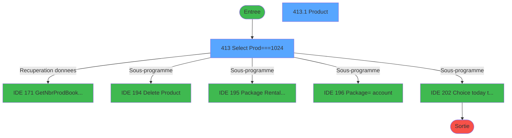
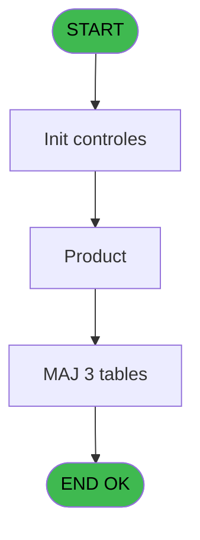
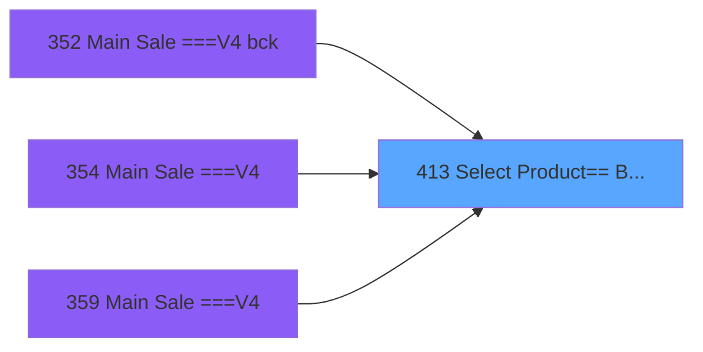
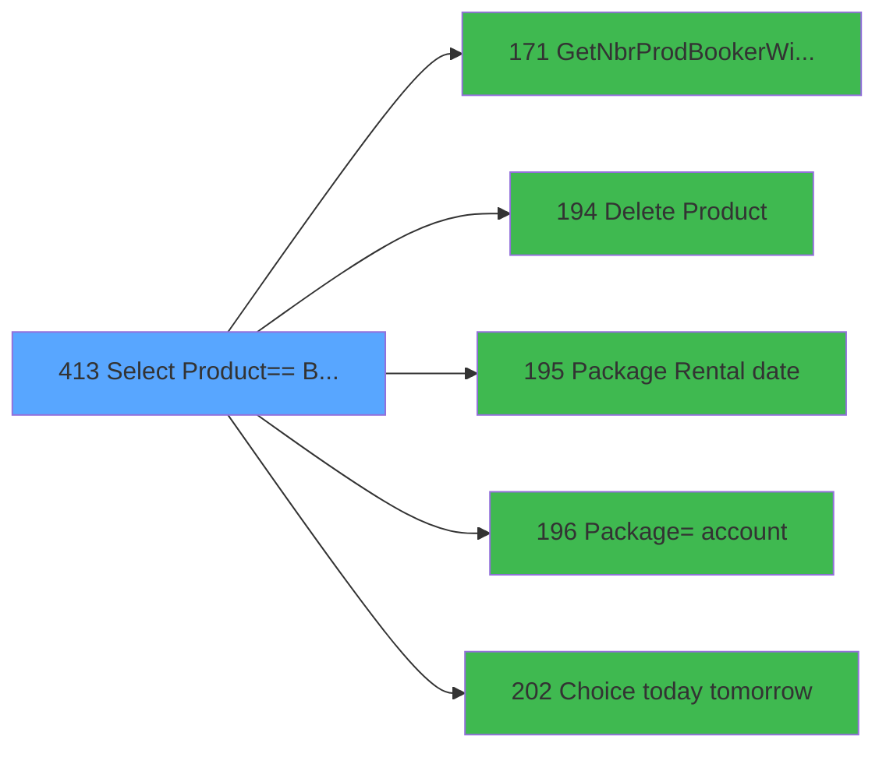

# PVE IDE 413 - Select Product== Best Of

> **Analyse**: Phases 1-4 2026-02-03 20:00 -> 20:01 (12s) | Assemblage 20:01
> **Pipeline**: V7.2 Enrichi
> **Structure**: 4 onglets (Resume | Ecrans | Donnees | Connexions)

<!-- TAB:Resume -->

## 1. FICHE D'IDENTITE

| Attribut | Valeur |
|----------|--------|
| Projet | PVE |
| IDE Position | 413 |
| Nom Programme | Select Product== Best Of |
| Fichier source | `Prg_413.xml` |
| Dossier IDE | A |
| Taches | 3 (2 ecrans visibles) |
| Tables modifiees | 3 |
| Programmes appeles | 5 |

## 2. DESCRIPTION FONCTIONNELLE

**Select Product== Best Of** assure la gestion complete de ce processus, accessible depuis [Main Sale ===V4 bck (IDE 352)](PVE-IDE-352.md), [Main Sale ===V4 (IDE 354)](PVE-IDE-354.md), [Main Sale ===V4 (IDE 359)](PVE-IDE-359.md).

Le flux de traitement s'organise en **3 blocs fonctionnels** :

- **Impression** (1 tache) : generation de tickets et documents
- **Traitement** (1 tache) : traitements metier divers
- **Consultation** (1 tache) : ecrans de recherche, selection et consultation

**Donnees modifiees** : 3 tables en ecriture (pv_customer_temp, pv_cust_rentals, pv_sellers).

**Logique metier** : 1 regles identifiees couvrant valeurs par defaut.

Detail : phases du traitement

#### Phase 1 : Consultation (1 tache)

- **413** - Select Prod===1024 **[[ECRAN]](#ecran-t1)**

Delegue a : [GetNbrProdBookerWithoutBooking (IDE 171)](PVE-IDE-171.md)

#### Phase 2 : Traitement (1 tache)

- **413.1** - Product **[[ECRAN]](#ecran-t2)**

Delegue a : [GetNbrProdBookerWithoutBooking (IDE 171)](PVE-IDE-171.md), [Delete Product (IDE 194)](PVE-IDE-194.md), [  Package Rental date (IDE 195)](PVE-IDE-195.md), [      Package=> account (IDE 196)](PVE-IDE-196.md), [Choice today tomorrow (IDE 202)](PVE-IDE-202.md)

#### Phase 3 : Impression (1 tache)

- **413.2** - Vidage Ticket

#### Tables impactees

| Table | Operations | Role metier |
|-------|-----------|-------------|
| pv_cust_rentals | **W** (1 usages) |  |
| pv_customer_temp | **W** (1 usages) |  |
| pv_sellers | **W** (1 usages) |  |

## 3. BLOCS FONCTIONNELS

### 3.1 Consultation (1 tache)

Ecrans de recherche et consultation.

---

#### 413 - Select Prod===1024 [[ECRAN]](#ecran-t1)

**Role** : Traitement : Select Prod===1024.
**Ecran** : 406 x 306 DLU (Type6) | [Voir mockup](#ecran-t1)

### 3.2 Traitement (1 tache)

Traitements internes.

---

#### 413.1 - Product [[ECRAN]](#ecran-t2)

**Role** : Traitement : Product.
**Ecran** : 369 x 194 DLU | [Voir mockup](#ecran-t2)
**Variables liees** : Z (v.ProductIdBooker)
**Delegue a** : [GetNbrProdBookerWithoutBooking (IDE 171)](PVE-IDE-171.md), [Delete Product (IDE 194)](PVE-IDE-194.md), [  Package Rental date (IDE 195)](PVE-IDE-195.md)

### 3.3 Impression (1 tache)

Generation des documents et tickets.

---

#### 413.2 - Vidage Ticket

**Role** : Generation du document : Vidage Ticket.
**Variables liees** : N (v.TotalTicket)

## 5. REGLES METIER

1 regles identifiees:

### Autres (1 regles)

#### [RM-001] Valeur par defaut si Trim(v.Qté [I]) est vide

| Element | Detail |
|---------|--------|
| **Condition** | `Trim(v.Qté [I])=''` |
| **Si vrai** | '01' |
| **Si faux** | v.Qté [I]) |
| **Variables** | I (v.Qté) |
| **Expression source** | Expression 1 : `IF(Trim(v.Qté [I])='','01',v.Qté [I])` |
| **Exemple** | Si Trim(v.Qté [I])='' → '01'. Sinon → v.Qté [I]) |

## 6. CONTEXTE

- **Appele par**: [Main Sale ===V4 bck (IDE 352)](PVE-IDE-352.md), [Main Sale ===V4 (IDE 354)](PVE-IDE-354.md), [Main Sale ===V4 (IDE 359)](PVE-IDE-359.md)
- **Appelle**: 5 programmes | **Tables**: 4 (W:3 R:0 L:1) | **Taches**: 3 | **Expressions**: 18

<!-- TAB:Ecrans -->

## 8. ECRANS

### 8.1 Forms visibles (2 / 3)

| # | Position | Tache | Nom | Type | Largeur | Hauteur | Bloc |
|---|----------|-------|-----|------|---------|---------|------|
| 1 | 413 | 413 | Select Prod===1024 | Type6 | 406 | 306 | Consultation |
| 2 | 413.1 | 413.1 | Product | Type0 | 369 | 194 | Traitement |

### 8.2 Mockups Ecrans

---

#### 413 - Select Prod===1024
**Tache** : [413](#t1) | **Type** : Type6 | **Dimensions** : 406 x 306 DLU
**Bloc** : Consultation | **Titre IDE** : Select Prod===1024

<!-- FORM-DATA:
{
    "width":  406,
    "vFactor":  8,
    "type":  "Type6",
    "hFactor":  8,
    "controls":  [
                     {
                         "x":  0,
                         "type":  "label",
                         "var":  "",
                         "y":  0,
                         "w":  395,
                         "fmt":  "",
                         "name":  "",
                         "h":  31,
                         "color":  "189",
                         "text":  "",
                         "parent":  null
                     },
                     {
                         "x":  40,
                         "type":  "label",
                         "var":  "",
                         "y":  11,
                         "w":  282,
                         "fmt":  "",
                         "name":  "",
                         "h":  10,
                         "color":  "186",
                         "text":  "Select your product",
                         "parent":  1
                     },
                     {
                         "x":  1,
                         "type":  "label",
                         "var":  "",
                         "y":  31,
                         "w":  394,
                         "fmt":  "",
                         "name":  "",
                         "h":  231,
                         "color":  "183",
                         "text":  "",
                         "parent":  null
                     },
                     {
                         "x":  7,
                         "type":  "label",
                         "var":  "",
                         "y":  33,
                         "w":  180,
                         "fmt":  "",
                         "name":  "",
                         "h":  7,
                         "color":  "183",
                         "text":  "Category",
                         "parent":  null
                     },
                     {
                         "x":  227,
                         "type":  "label",
                         "var":  "",
                         "y":  33,
                         "w":  142,
                         "fmt":  "",
                         "name":  "",
                         "h":  7,
                         "color":  "183",
                         "text":  "Sub Category",
                         "parent":  null
                     },
                     {
                         "x":  122,
                         "type":  "label",
                         "var":  "",
                         "y":  54,
                         "w":  142,
                         "fmt":  "",
                         "name":  "",
                         "h":  7,
                         "color":  "183",
                         "text":  "Product",
                         "parent":  null
                     },
                     {
                         "x":  0,
                         "type":  "label",
                         "var":  "",
                         "y":  279,
                         "w":  392,
                         "fmt":  "",
                         "name":  "",
                         "h":  24,
                         "color":  "6",
                         "text":  "",
                         "parent":  null
                     },
                     {
                         "x":  321,
                         "type":  "image",
                         "var":  "",
                         "y":  2,
                         "w":  70,
                         "fmt":  "",
                         "name":  "",
                         "h":  27,
                         "color":  "",
                         "text":  "",
                         "parent":  1
                     },
                     {
                         "x":  14,
                         "type":  "edit",
                         "var":  "",
                         "y":  42,
                         "w":  165,
                         "fmt":  "",
                         "name":  "label",
                         "h":  8,
                         "color":  "",
                         "text":  "",
                         "parent":  null
                     },
                     {
                         "x":  215,
                         "type":  "edit",
                         "var":  "",
                         "y":  42,
                         "w":  165,
                         "fmt":  "",
                         "name":  "label  \u003e\u003e Sub Cat \u003c\u003c",
                         "h":  8,
                         "color":  "",
                         "text":  "",
                         "parent":  null
                     },
                     {
                         "x":  13,
                         "type":  "subform",
                         "var":  "",
                         "y":  63,
                         "w":  374,
                         "fmt":  "",
                         "name":  "SF_CATEG",
                         "h":  195,
                         "color":  "",
                         "text":  "",
                         "parent":  null
                     },
                     {
                         "x":  35,
                         "type":  "edit",
                         "var":  "",
                         "y":  265,
                         "w":  125,
                         "fmt":  "",
                         "name":  "V.Désigantion",
                         "h":  11,
                         "color":  "183",
                         "text":  "",
                         "parent":  null
                     },
                     {
                         "x":  228,
                         "type":  "edit",
                         "var":  "",
                         "y":  265,
                         "w":  112,
                         "fmt":  "N8.3Z",
                         "name":  "v.TotalTicket",
                         "h":  11,
                         "color":  "183",
                         "text":  "",
                         "parent":  null
                     },
                     {
                         "x":  22,
                         "type":  "button",
                         "var":  "",
                         "y":  283,
                         "w":  84,
                         "fmt":  "Cancel",
                         "name":  "CANCEL",
                         "h":  18,
                         "color":  "",
                         "text":  "",
                         "parent":  null
                     },
                     {
                         "x":  185,
                         "type":  "button",
                         "var":  "",
                         "y":  283,
                         "w":  148,
                         "fmt":  "Validate Order",
                         "name":  "VALID",
                         "h":  18,
                         "color":  "",
                         "text":  "",
                         "parent":  null
                     }
                 ],
    "taskId":  "413",
    "height":  306
}
-->

<strong>Champs : 4 champs</strong>

| Pos (x,y) | Nom | Variable | Type |
|-----------|-----|----------|------|
| 14,42 | label | - | edit |
| 215,42 | label  >> Sub Cat << | - | edit |
| 35,265 | V.Désigantion | - | edit |
| 228,265 | v.TotalTicket | - | edit |

<strong>Boutons : 2 boutons</strong>

| Bouton | Pos (x,y) | Action |
|--------|-----------|--------|
| Cancel | 22,283 | Annule et retour au menu |
| Validate Order | 185,283 | Valide la saisie et enregistre |

---

#### 413.1 - Product
**Tache** : [413.1](#t2) | **Type** : Type0 | **Dimensions** : 369 x 194 DLU
**Bloc** : Traitement | **Titre IDE** : Product

<!-- FORM-DATA:
{
    "width":  369,
    "vFactor":  8,
    "type":  "Type0",
    "hFactor":  8,
    "controls":  [
                     {
                         "x":  5,
                         "type":  "table",
                         "var":  "",
                         "name":  "",
                         "titleH":  12,
                         "color":  "183",
                         "w":  289,
                         "y":  0,
                         "fmt":  "",
                         "parent":  null,
                         "text":  "",
                         "rowH":  24,
                         "h":  193,
                         "cols":  [
                                      {
                                          "title":  "",
                                          "layer":  1,
                                          "w":  222
                                      },
                                      {
                                          "title":  "",
                                          "layer":  2,
                                          "w":  62
                                      }
                                  ],
                         "rows":  2
                     },
                     {
                         "x":  9,
                         "type":  "button",
                         "var":  "",
                         "y":  2,
                         "w":  218,
                         "fmt":  "",
                         "name":  "SAVE",
                         "h":  23,
                         "color":  "",
                         "text":  "",
                         "parent":  1
                     },
                     {
                         "x":  233,
                         "type":  "edit",
                         "var":  "",
                         "y":  3,
                         "w":  58,
                         "fmt":  "N12.3C",
                         "name":  "prix_de_vente",
                         "h":  22,
                         "color":  "",
                         "text":  "",
                         "parent":  1
                     },
                     {
                         "x":  295,
                         "type":  "button",
                         "var":  "",
                         "y":  1,
                         "w":  72,
                         "fmt":  "ñ",
                         "name":  "UP",
                         "h":  95,
                         "color":  "",
                         "text":  "",
                         "parent":  null
                     },
                     {
                         "x":  295,
                         "type":  "button",
                         "var":  "",
                         "y":  97,
                         "w":  72,
                         "fmt":  "ò",
                         "name":  "DOWN",
                         "h":  95,
                         "color":  "",
                         "text":  "",
                         "parent":  null
                     }
                 ],
    "taskId":  "413.1",
    "height":  194
}
-->

<strong>Champs : 1 champs</strong>

| Pos (x,y) | Nom | Variable | Type |
|-----------|-----|----------|------|
| 233,3 | prix_de_vente | - | edit |

<strong>Boutons : 3 boutons</strong>

| Bouton | Pos (x,y) | Action |
|--------|-----------|--------|
| SAVE | 9,2 | Bouton fonctionnel |
| ñ | 295,1 | Bouton fonctionnel |
| ò | 295,97 | Bouton fonctionnel |

## 9. NAVIGATION

### 9.1 Enchainement des ecrans

**Detail par enchainement :**

| Depuis | Action | Vers | Retour |
|--------|--------|------|--------|
| Select Prod===1024 | Recuperation donnees | [GetNbrProdBookerWithoutBooking (IDE 171)](PVE-IDE-171.md) | Retour ecran |
| Select Prod===1024 | Sous-programme | [Delete Product (IDE 194)](PVE-IDE-194.md) | Retour ecran |
| Select Prod===1024 | Sous-programme | [  Package Rental date (IDE 195)](PVE-IDE-195.md) | Retour ecran |
| Select Prod===1024 | Sous-programme | [      Package=> account (IDE 196)](PVE-IDE-196.md) | Retour ecran |
| Select Prod===1024 | Sous-programme | [Choice today tomorrow (IDE 202)](PVE-IDE-202.md) | Retour ecran |

### 9.3 Structure hierarchique (3 taches)

| Position | Tache | Type | Dimensions | Bloc |
|----------|-------|------|------------|------|
| **413.1** | [**Select Prod===1024** (413)](#t1) [mockup](#ecran-t1) | Type6 | 406x306 | Consultation |
| **413.2** | [**Product** (413.1)](#t2) [mockup](#ecran-t2) | - | 369x194 | Traitement |
| **413.3** | [**Vidage Ticket** (413.2)](#t3) | - | - | Impression |

### 9.4 Algorigramme

> **Legende**: Vert = START/END OK | Rouge = END KO | Bleu = Decisions
> *Algorigramme auto-genere. Utiliser `/algorigramme` pour une synthese metier detaillee.*

<!-- TAB:Donnees -->

## 10. TABLES

### Tables utilisees (4)

| ID | Nom | Description | Type | R | W | L | Usages |
|----|-----|-------------|------|---|---|---|--------|
| 379 | pv_customer_temp |  | DB |   | **W** |   | 1 |
| 400 | pv_cust_rentals |  | DB |   | **W** |   | 1 |
| 403 | pv_sellers |  | DB |   | **W** |   | 1 |
| 413 | pv_tva |  | DB |   |   | L | 1 |

### Colonnes par table (3 / 3 tables avec colonnes identifiees)

Table 379 - pv_customer_temp (**W**) - 1 usages

| Lettre | Variable | Acces | Type |
|--------|----------|-------|------|
| A | p.Customer_Id | W | Numeric |
| B | p.Masque_Sans_Z | W | Alpha |
| C | p.V.valid_all | W | Logical |
| D | P.date debut sejour | W | Date |
| E | P.FocusOngletBooking | W | Logical |
| F | pi.Cat | W | Numeric |
| G | pi.Sub Cat | W | Numeric |
| H | v.Stock | W | Numeric |
| I | v.Qté | W | Alpha |
| J | V.Désigantion | W | Alpha |
| K | v.Fin | W | Logical |
| L | v.StopDelete | W | Logical |
| M | RetourQuestion | W | Numeric |
| N | v.TotalTicket | W | Numeric |
| O | v.PrixSaisie | W | Alpha |
| P | v.PrixZero | W | Logical |
| Q | v.Cat | W | Numeric |
| R | v.Sub_Cat | W | Numeric |
| S | v.Prod_ID | W | Numeric |
| T | T S/Catégorie | W | Logical |
| U | v.TotalAValider | W | Numeric |
| V | v.NbrProdWithoutBooking | W | Numeric |
| W | v.BookingID | W | Unicode |
| X | v.OrderID | W | Numeric |
| Y | v.PackageID | W | Numeric |
| Z | v.ProductIdBooker | W | Numeric |
| BA | v.BtnQuitSearchClicked | W | Logical |

Table 400 - pv_cust_rentals (**W**) - 1 usages

| Lettre | Variable | Acces | Type |
|--------|----------|-------|------|
| A | p.Customer_Id | W | Numeric |

Table 403 - pv_sellers (**W**) - 1 usages

| Lettre | Variable | Acces | Type |
|--------|----------|-------|------|
| A | p.Category | W | Numeric |
| B | p.Sub_Category | W | Numeric |
| C | v.Retour Massage | W | Numeric |
| D | v.DbleClick | W | Logical |
| E | V.today ? | W | Logical |
| F | V.start rental date | W | Date |
| G | v.Article sans prix | W | Logical |

## 11. VARIABLES

### 11.1 Parametres entrants (7)

Variables recues du programme appelant ([Main Sale ===V4 bck (IDE 352)](PVE-IDE-352.md)).

| Lettre | Nom | Type | Usage dans |
|--------|-----|------|-----------|
| A | p.Customer_Id | Numeric | - |
| B | p.Masque_Sans_Z | Alpha | 1x parametre entrant |
| C | p.V.valid_all | Logical | - |
| D | P.date debut sejour | Date | - |
| E | P.FocusOngletBooking | Logical | - |
| F | pi.Cat | Numeric | 1x parametre entrant |
| G | pi.Sub Cat | Numeric | 1x parametre entrant |

### 11.2 Variables de session (18)

Variables persistantes pendant toute la session.

| Lettre | Nom | Type | Usage dans |
|--------|-----|------|-----------|
| H | v.Stock | Numeric | - |
| I | v.Qté | Alpha | 2x session |
| J | V.Désigantion | Alpha | - |
| K | v.Fin | Logical | - |
| L | v.StopDelete | Logical | - |
| N | v.TotalTicket | Numeric | 2x session |
| O | v.PrixSaisie | Alpha | - |
| P | v.PrixZero | Logical | - |
| Q | v.Cat | Numeric | - |
| R | v.Sub_Cat | Numeric | - |
| S | v.Prod_ID | Numeric | - |
| U | v.TotalAValider | Numeric | - |
| V | v.NbrProdWithoutBooking | Numeric | - |
| W | v.BookingID | Unicode | - |
| X | v.OrderID | Numeric | 1x session |
| Y | v.PackageID | Numeric | - |
| Z | v.ProductIdBooker | Numeric | - |
| BA | v.BtnQuitSearchClicked | Logical | - |

### 11.3 Autres (2)

Variables diverses.

| Lettre | Nom | Type | Usage dans |
|--------|-----|------|-----------|
| M | RetourQuestion | Numeric | 1x refs |
| T | T S/Catégorie | Logical | 1x refs |

Toutes les 27 variables (liste complete)

| Cat | Lettre | Nom Variable | Type |
|-----|--------|--------------|------|
| P0 | **A** | p.Customer_Id | Numeric |
| P0 | **B** | p.Masque_Sans_Z | Alpha |
| P0 | **C** | p.V.valid_all | Logical |
| P0 | **D** | P.date debut sejour | Date |
| P0 | **E** | P.FocusOngletBooking | Logical |
| P0 | **F** | pi.Cat | Numeric |
| P0 | **G** | pi.Sub Cat | Numeric |
| V. | **H** | v.Stock | Numeric |
| V. | **I** | v.Qté | Alpha |
| V. | **J** | V.Désigantion | Alpha |
| V. | **K** | v.Fin | Logical |
| V. | **L** | v.StopDelete | Logical |
| V. | **N** | v.TotalTicket | Numeric |
| V. | **O** | v.PrixSaisie | Alpha |
| V. | **P** | v.PrixZero | Logical |
| V. | **Q** | v.Cat | Numeric |
| V. | **R** | v.Sub_Cat | Numeric |
| V. | **S** | v.Prod_ID | Numeric |
| V. | **U** | v.TotalAValider | Numeric |
| V. | **V** | v.NbrProdWithoutBooking | Numeric |
| V. | **W** | v.BookingID | Unicode |
| V. | **X** | v.OrderID | Numeric |
| V. | **Y** | v.PackageID | Numeric |
| V. | **Z** | v.ProductIdBooker | Numeric |
| V. | **BA** | v.BtnQuitSearchClicked | Logical |
| Autre | **M** | RetourQuestion | Numeric |
| Autre | **T** | T S/Catégorie | Logical |

## 12. EXPRESSIONS

**18 / 18 expressions decodees (100%)**

### 12.1 Repartition par type

| Type | Expressions | Regles |
|------|-------------|--------|
| CONDITION | 6 | 5 |
| CONSTANTE | 2 | 0 |
| CAST_LOGIQUE | 3 | 0 |
| OTHER | 5 | 0 |
| REFERENCE_VG | 1 | 0 |
| STRING | 1 | 0 |

### 12.2 Expressions cles par type

#### CONDITION (6 expressions)

| Type | IDE | Expression | Regle |
|------|-----|------------|-------|
| CONDITION | 1 | `IF(Trim(v.Qté [I])='','01',v.Qté [I])` | [RM-001](#rm-RM-001) |
| CONDITION | 16 | `[AE] > 0` | - |
| CONDITION | 2 | `Trim(v.Qté [I])='01'` | - |
| CONDITION | 14 | `RetourQuestion [M]=6` | - |
| CONDITION | 6 | `v.TotalTicket [N]>0` | - |
| ... | | *+1 autres* | |

#### CONSTANTE (2 expressions)

| Type | IDE | Expression | Regle |
|------|-----|------------|-------|
| CONSTANTE | 13 | `''` | - |
| CONSTANTE | 5 | `0` | - |

#### CAST_LOGIQUE (3 expressions)

| Type | IDE | Expression | Regle |
|------|-----|------------|-------|
| CAST_LOGIQUE | 12 | `'FALSE'LOG` | - |
| CAST_LOGIQUE | 10 | `'TRUE'LOG` | - |
| CAST_LOGIQUE | 3 | `'TRUE'LOG` | - |

#### OTHER (5 expressions)

| Type | IDE | Expression | Regle |
|------|-----|------------|-------|
| OTHER | 17 | `pi.Cat [F]` | - |
| OTHER | 18 | `pi.Sub Cat [G]` | - |
| OTHER | 9 | `GetParam ('SERVICE')` | - |
| OTHER | 4 | `T S/Catégorie [T]` | - |
| OTHER | 8 | `v.OrderID [X]` | - |

#### REFERENCE_VG (1 expressions)

| Type | IDE | Expression | Regle |
|------|-----|------------|-------|
| REFERENCE_VG | 15 | `VG65` | - |

#### STRING (1 expressions)

| Type | IDE | Expression | Regle |
|------|-----|------------|-------|
| STRING | 11 | `Trim(p.Masque_Sans_Z [B])` | - |

<!-- TAB:Connexions -->

## 13. GRAPHE D'APPELS

### 13.1 Chaine depuis Main (Callers)

Main -> ... -> [Main Sale ===V4 bck (IDE 352)](PVE-IDE-352.md) -> **Select Product== Best Of (IDE 413)**

Main -> ... -> [Main Sale ===V4 (IDE 354)](PVE-IDE-354.md) -> **Select Product== Best Of (IDE 413)**

Main -> ... -> [Main Sale ===V4 (IDE 359)](PVE-IDE-359.md) -> **Select Product== Best Of (IDE 413)**

### 13.2 Callers

| IDE | Nom Programme | Nb Appels |
|-----|---------------|-----------|
| [352](PVE-IDE-352.md) | Main Sale ===V4 bck | 1 |
| [354](PVE-IDE-354.md) | Main Sale ===V4 | 1 |
| [359](PVE-IDE-359.md) | Main Sale ===V4 | 1 |

### 13.3 Callees (programmes appeles)

### 13.4 Detail Callees avec contexte

| IDE | Nom Programme | Appels | Contexte |
|-----|---------------|--------|----------|
| [171](PVE-IDE-171.md) | GetNbrProdBookerWithoutBooking | 1 | Recuperation donnees |
| [194](PVE-IDE-194.md) | Delete Product | 1 | Sous-programme |
| [195](PVE-IDE-195.md) |   Package Rental date | 1 | Sous-programme |
| [196](PVE-IDE-196.md) |       Package=> account | 1 | Sous-programme |
| [202](PVE-IDE-202.md) | Choice today tomorrow | 1 | Sous-programme |

## 14. RECOMMANDATIONS MIGRATION

### 14.1 Profil du programme

| Metrique | Valeur | Impact migration |
|----------|--------|-----------------|
| Lignes de logique | 137 | Programme compact |
| Expressions | 18 | Peu de logique |
| Tables WRITE | 3 | Impact modere |
| Sous-programmes | 5 | Peu de dependances |
| Ecrans visibles | 2 | Quelques ecrans |
| Code desactive | 1.5% (2 / 137) | Code sain |
| Regles metier | 1 | Quelques regles a preserver |

### 14.2 Plan de migration par bloc

#### Consultation (1 tache: 1 ecran, 0 traitement)

- **Strategie** : Composants de recherche/selection en modales.
- 1 ecran : Select Prod===1024

#### Traitement (1 tache: 1 ecran, 0 traitement)

- **Strategie** : 1 composant(s) UI (Razor/React) avec formulaires et validation.
- 5 sous-programme(s) a migrer ou a reutiliser depuis les services existants.
- Decomposer les taches en services unitaires testables.

#### Impression (1 tache: 0 ecran, 1 traitement)

- **Strategie** : Templates HTML -> PDF via wkhtmltopdf ou Puppeteer.
- `PrintService` injectable avec choix imprimante

### 14.3 Dependances critiques

| Dependance | Type | Appels | Impact |
|------------|------|--------|--------|
| pv_customer_temp | Table WRITE (Database) | 1x | Schema + repository |
| pv_cust_rentals | Table WRITE (Database) | 1x | Schema + repository |
| pv_sellers | Table WRITE (Database) | 1x | Schema + repository |
| [      Package=> account (IDE 196)](PVE-IDE-196.md) | Sous-programme | 1x | Normale - Sous-programme |
| [Choice today tomorrow (IDE 202)](PVE-IDE-202.md) | Sous-programme | 1x | Normale - Sous-programme |
| [  Package Rental date (IDE 195)](PVE-IDE-195.md) | Sous-programme | 1x | Normale - Sous-programme |
| [GetNbrProdBookerWithoutBooking (IDE 171)](PVE-IDE-171.md) | Sous-programme | 1x | Normale - Recuperation donnees |
| [Delete Product (IDE 194)](PVE-IDE-194.md) | Sous-programme | 1x | Normale - Sous-programme |

---
*Spec DETAILED generee par Pipeline V7.2 - 2026-02-03 20:01*
