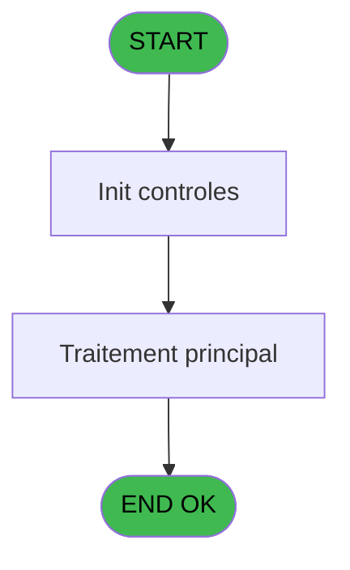

# PVE IDE 416 - Lock workstation (NU)

> **Analyse**: Phases 1-4 2026-02-03 20:01 -> 20:01 (10s) | Assemblage 20:01
> **Pipeline**: V7.2 Enrichi
> **Structure**: 4 onglets (Resume | Ecrans | Donnees | Connexions)

<!-- TAB:Resume -->

## 1. FICHE D'IDENTITE

| Attribut | Valeur |
|----------|--------|
| Projet | PVE |
| IDE Position | 416 |
| Nom Programme | Lock workstation (NU) |
| Fichier source | `Prg_416.xml` |
| Dossier IDE | A |
| Taches | 1 (1 ecrans visibles) |
| Tables modifiees | 0 |
| Programmes appeles | 0 |
| :warning: Statut | **ORPHELIN_POTENTIEL** |

## 2. DESCRIPTION FONCTIONNELLE

**Lock workstation (NU)** assure la gestion complete de ce processus.

Le flux de traitement s'organise en **1 blocs fonctionnels** :

- **Traitement** (1 tache) : traitements metier divers

## 3. BLOCS FONCTIONNELS

### 3.1 Traitement (1 tache)

Traitements internes.

---

#### 416 - welcome [[ECRAN]](#ecran-t1)

**Role** : Traitement : welcome.
**Ecran** : 809 x 424 DLU (MDI) | [Voir mockup](#ecran-t1)

## 5. REGLES METIER

*(Aucune regle metier identifiee)*

## 6. CONTEXTE

- **Appele par**: (aucun)
- **Appelle**: 0 programmes | **Tables**: 1 (W:0 R:1 L:0) | **Taches**: 1 | **Expressions**: 4

<!-- TAB:Ecrans -->

## 8. ECRANS

### 8.1 Forms visibles (1 / 1)

| # | Position | Tache | Nom | Type | Largeur | Hauteur | Bloc |
|---|----------|-------|-----|------|---------|---------|------|
| 1 | 416 | 416 | welcome | MDI | 809 | 424 | Traitement |

### 8.2 Mockups Ecrans

---

#### 416 - welcome
**Tache** : [416](#t1) | **Type** : MDI | **Dimensions** : 809 x 424 DLU
**Bloc** : Traitement | **Titre IDE** : welcome

<!-- FORM-DATA:
{
    "width":  809,
    "vFactor":  8,
    "type":  "MDI",
    "hFactor":  4,
    "controls":  [
                     {
                         "x":  126,
                         "type":  "label",
                         "var":  "",
                         "y":  49,
                         "w":  559,
                         "fmt":  "",
                         "name":  "",
                         "h":  38,
                         "color":  "187",
                         "text":  "The worksation is locked. Type your password to unlock it.",
                         "parent":  null
                     },
                     {
                         "x":  279,
                         "type":  "label",
                         "var":  "",
                         "y":  110,
                         "w":  254,
                         "fmt":  "",
                         "name":  "",
                         "h":  180,
                         "color":  "183",
                         "text":  "Text",
                         "parent":  null
                     },
                     {
                         "x":  303,
                         "type":  "label",
                         "var":  "",
                         "y":  257,
                         "w":  147,
                         "fmt":  "",
                         "name":  "",
                         "h":  20,
                         "color":  "183",
                         "text":  "Your password",
                         "parent":  null
                     },
                     {
                         "x":  451,
                         "type":  "edit",
                         "var":  "",
                         "y":  257,
                         "w":  57,
                         "fmt":  "U3A",
                         "name":  "V code",
                         "h":  20,
                         "color":  "183",
                         "text":  "",
                         "parent":  null
                     },
                     {
                         "x":  284,
                         "type":  "edit",
                         "var":  "",
                         "y":  114,
                         "w":  245,
                         "fmt":  "30",
                         "name":  "",
                         "h":  10,
                         "color":  "188",
                         "text":  "",
                         "parent":  null
                     },
                     {
                         "x":  281,
                         "type":  "image",
                         "var":  "",
                         "y":  132,
                         "w":  249,
                         "fmt":  "",
                         "name":  "",
                         "h":  120,
                         "color":  "183",
                         "text":  "",
                         "parent":  null
                     }
                 ],
    "taskId":  "416",
    "height":  424
}
-->

<strong>Champs : 2 champs</strong>

| Pos (x,y) | Nom | Variable | Type |
|-----------|-----|----------|------|
| 451,257 | V code | - | edit |
| 284,114 | 30 | - | edit |

## 9. NAVIGATION

Ecran unique: **welcome**

### 9.3 Structure hierarchique (1 tache)

| Position | Tache | Type | Dimensions | Bloc |
|----------|-------|------|------------|------|
| **416.1** | [**welcome** (416)](#t1) [mockup](#ecran-t1) | MDI | 809x424 | Traitement |

### 9.4 Algorigramme

> **Legende**: Vert = START/END OK | Rouge = END KO | Bleu = Decisions
> *Algorigramme auto-genere. Utiliser `/algorigramme` pour une synthese metier detaillee.*

<!-- TAB:Donnees -->

## 10. TABLES

### Tables utilisees (1)

| ID | Nom | Description | Type | R | W | L | Usages |
|----|-----|-------------|------|---|---|---|--------|
| 731 | arc_tai_gm |  | DB | R |   |   | 1 |

### Colonnes par table (0 / 1 tables avec colonnes identifiees)

Table 731 - arc_tai_gm (R) - 1 usages

*Table utilisee uniquement en Link ou aucune colonne Real identifiee dans le DataView.*

## 11. VARIABLES

*(Programme sans variables locales mappees)*

## 12. EXPRESSIONS

**4 / 4 expressions decodees (100%)**

### 12.1 Repartition par type

| Type | Expressions | Regles |
|------|-------------|--------|
| OTHER | 1 | 0 |
| REFERENCE_VG | 1 | 0 |
| CAST_LOGIQUE | 1 | 0 |
| CONDITION | 1 | 0 |

### 12.2 Expressions cles par type

#### OTHER (1 expressions)

| Type | IDE | Expression | Regle |
|------|-----|------------|-------|
| OTHER | 1 | `GetParam ('SERVICE')` | - |

#### REFERENCE_VG (1 expressions)

| Type | IDE | Expression | Regle |
|------|-----|------------|-------|
| REFERENCE_VG | 2 | `VG2` | - |

#### CAST_LOGIQUE (1 expressions)

| Type | IDE | Expression | Regle |
|------|-----|------------|-------|
| CAST_LOGIQUE | 4 | `GetParam ('LOGO')='TRUE'LOG` | - |

#### CONDITION (1 expressions)

| Type | IDE | Expression | Regle |
|------|-----|------------|-------|
| CONDITION | 3 | `V code [A]<>Trim ([D])` | - |

<!-- TAB:Connexions -->

## 13. GRAPHE D'APPELS

### 13.1 Chaine depuis Main (Callers)

**Chemin**: (pas de callers directs)

### 13.2 Callers

| IDE | Nom Programme | Nb Appels |
|-----|---------------|-----------|
| - | (aucun) | - |

### 13.3 Callees (programmes appeles)

### 13.4 Detail Callees avec contexte

| IDE | Nom Programme | Appels | Contexte |
|-----|---------------|--------|----------|
| - | (aucun) | - | - |

## 14. RECOMMANDATIONS MIGRATION

### 14.1 Profil du programme

| Metrique | Valeur | Impact migration |
|----------|--------|-----------------|
| Lignes de logique | 10 | Programme compact |
| Expressions | 4 | Peu de logique |
| Tables WRITE | 0 | Impact faible |
| Sous-programmes | 0 | Peu de dependances |
| Ecrans visibles | 1 | Ecran unique ou traitement batch |
| Code desactive | 0% (0 / 10) | Code sain |
| Regles metier | 0 | Pas de regle identifiee |

### 14.2 Plan de migration par bloc

#### Traitement (1 tache: 1 ecran, 0 traitement)

- **Strategie** : 1 composant(s) UI (Razor/React) avec formulaires et validation.
- Decomposer les taches en services unitaires testables.

### 14.3 Dependances critiques

| Dependance | Type | Appels | Impact |
|------------|------|--------|--------|

---
*Spec DETAILED generee par Pipeline V7.2 - 2026-02-03 20:01*
