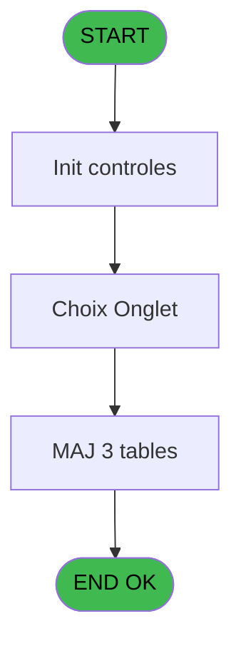
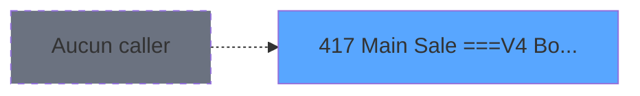
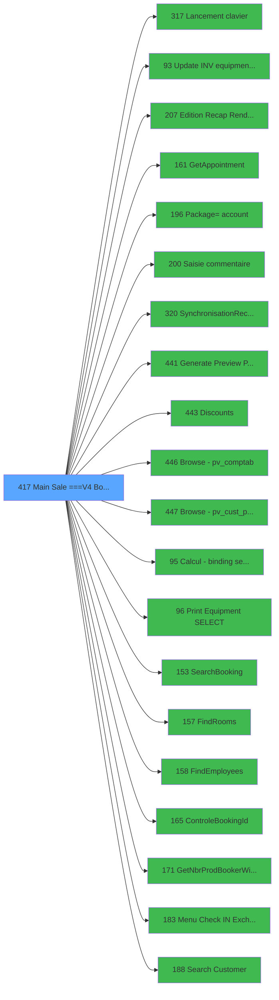

# PVE IDE 417 - Main Sale ===V4 Booking ACTUEL

> **Analyse**: Phases 1-4 2026-02-03 20:02 -> 20:02 (12s) | Assemblage 20:02
> **Pipeline**: V7.2 Enrichi
> **Structure**: 4 onglets (Resume | Ecrans | Donnees | Connexions)

<!-- TAB:Resume -->

## 1. FICHE D'IDENTITE

| Attribut | Valeur |
|----------|--------|
| Projet | PVE |
| IDE Position | 417 |
| Nom Programme | Main Sale ===V4 Booking ACTUEL |
| Fichier source | `Prg_417.xml` |
| Dossier IDE | A |
| Taches | 39 (20 ecrans visibles) |
| Tables modifiees | 3 |
| Programmes appeles | 20 |
| :warning: Statut | **ORPHELIN_POTENTIEL** |

## 2. DESCRIPTION FONCTIONNELLE

**Main Sale ===V4 Booking ACTUEL** assure la gestion complete de ce processus.

Le flux de traitement s'organise en **6 blocs fonctionnels** :

- **Traitement** (30 taches) : traitements metier divers
- **Saisie** (3 taches) : ecrans de saisie utilisateur (formulaires, champs, donnees)
- **Creation** (3 taches) : insertion d'enregistrements en base (mouvements, prestations)
- **Calcul** (1 tache) : calculs de montants, stocks ou compteurs
- **Consultation** (1 tache) : ecrans de recherche, selection et consultation
- **Initialisation** (1 tache) : reinitialisation d'etats et de variables de travail

**Donnees modifiees** : 3 tables en ecriture (pv_customer, pv_sellers_by_week, Table_1501).

**Logique metier** : 14 regles identifiees couvrant conditions metier, valeurs par defaut.

Detail : phases du traitement

#### Phase 1 : Traitement (30 taches)

- **417** - Main Sale V4 **[[ECRAN]](#ecran-t1)**
- **417.1.1** - Booking_ID **[[ECRAN]](#ecran-t3)**
- **417.1.2** - Onglet Booking **[[ECRAN]](#ecran-t5)**
- **417.1.2.1** - Booking **[[ECRAN]](#ecran-t6)**
- **417.1.2.2** - Screen **[[ECRAN]](#ecran-t7)**
- **417.1.2.3** - GetBookigsInfo
- **417.1.3** - Transac not PMS **[[ECRAN]](#ecran-t10)**
- **417.1.3.1** - Get prod id
- **417.1.4** - equip **[[ECRAN]](#ecran-t12)**
- **417.1.4.1** - Equipment check out **[[ECRAN]](#ecran-t13)**
- **417.1.4.1.1** - clear
- **417.1.4.1.2** - Récupère équipement dispo
- **417.1.4.2** - Equipment list **[[ECRAN]](#ecran-t16)**
- **417.1.4.2.1** - Equipment check out **[[ECRAN]](#ecran-t17)**
- **417.1.4.2.2** - Equipment list **[[ECRAN]](#ecran-t18)**
- **417.1.4.2.2.1** - Equipment check IN **[[ECRAN]](#ecran-t19)**
- **417.1.5** - Sales and Payment **[[ECRAN]](#ecran-t20)**
- **417.1.5.1** - Payment **[[ECRAN]](#ecran-t21)**
- **417.1.5.1.2** - View
- **417.1.5.2** - Discount **[[ECRAN]](#ecran-t25)**
- **417.1.5.3** - Test Prepaid
- **417.1.5.4** - Special actions **[[ECRAN]](#ecran-t28)**
- **417.1.5.4.2** - End of rental **[[ECRAN]](#ecran-t30)**
- **417.1.5.4.3** - UpdateCustRentals
- **417.1.5.5** - Check Rentals
- **417.1.5.6** - Check Payments **[[ECRAN]](#ecran-t33)**
- **417.1.5.7** - Check Comment Refus. To Sell **[[ECRAN]](#ecran-t34)**
- **417.1.5.8** - Discount **[[ECRAN]](#ecran-t35)**
- **417.1.6** - Transac not PMS MBO **[[ECRAN]](#ecran-t37)**
- **417.1.6.1** - SQL Total payement **[[ECRAN]](#ecran-t38)**

Delegue a : [Lancement clavier (IDE 317)](PVE-IDE-317.md), [Update INV equipment status (IDE 93)](PVE-IDE-93.md), [GetAppointment (IDE 161)](PVE-IDE-161.md), [      Package=> account (IDE 196)](PVE-IDE-196.md), [SynchronisationRecuPDF (IDE 320)](PVE-IDE-320.md), [Generate Preview Payments (IDE 441)](PVE-IDE-441.md), [Discounts (IDE 443)](PVE-IDE-443.md), [Browse - pv_cust_package (IDE 447)](PVE-IDE-447.md), [SearchBooking (IDE 153)](PVE-IDE-153.md), [FindRooms (IDE 157)](PVE-IDE-157.md), [FindEmployees (IDE 158)](PVE-IDE-158.md), [GetNbrProdBookerWithoutBooking (IDE 171)](PVE-IDE-171.md), [Menu Check IN / Exchange (IDE 183)](PVE-IDE-183.md), [Search Customer (IDE 188)](PVE-IDE-188.md)

#### Phase 2 : Consultation (1 tache)

- **417.1** - Choix Onglet **[[ECRAN]](#ecran-t2)**

Delegue a : [GetAppointment (IDE 161)](PVE-IDE-161.md), [SynchronisationRecuPDF (IDE 320)](PVE-IDE-320.md), [GetNbrProdBookerWithoutBooking (IDE 171)](PVE-IDE-171.md)

#### Phase 3 : Creation (3 taches)

- **417.1.1.1** - CreateSales
- **417.1.2.4** - CreateMail
- **417.1.5.1.3** - create cardType

#### Phase 4 : Initialisation (1 tache)

- **417.1.5.1.1** - init payer

#### Phase 5 : Saisie (3 taches)

- **417.1.5.2.1** - Saisie comment annulation **[[ECRAN]](#ecran-t26)**
- **417.1.5.4.1** - Saisie comment annulation **[[ECRAN]](#ecran-t29)**
- **417.1.5.8.1** - Saisie comment annulation **[[ECRAN]](#ecran-t36)**

Delegue a : [Saisie commentaire (IDE 200)](PVE-IDE-200.md)

#### Phase 6 : Calcul (1 tache)

- **417.2** - calcul filiation

Delegue a : [Browse - pv_comptab (IDE 446)](PVE-IDE-446.md), [Calcul - binding setting (IDE 95)](PVE-IDE-95.md)

#### Tables impactees

| Table | Operations | Role metier |
|-------|-----------|-------------|
| pv_sellers_by_week | **W**/L (6 usages) |  |
| pv_customer | **W** (1 usages) |  |
| Table_1501 | **W** (1 usages) |  |

## 3. BLOCS FONCTIONNELS

### 3.1 Traitement (30 taches)

Traitements internes.

---

#### 417 - Main Sale V4 [[ECRAN]](#ecran-t1)

**Role** : Tache d'orchestration : point d'entree du programme (30 sous-taches). Coordonne l'enchainement des traitements.
**Ecran** : 1990 x 392 DLU (Modal) | [Voir mockup](#ecran-t1)

29 sous-taches directes

| Tache | Nom | Bloc |
|-------|-----|------|
| [417.1.1](#t3) | Booking_ID **[[ECRAN]](#ecran-t3)** | Traitement |
| [417.1.2](#t5) | Onglet Booking **[[ECRAN]](#ecran-t5)** | Traitement |
| [417.1.2.1](#t6) | Booking **[[ECRAN]](#ecran-t6)** | Traitement |
| [417.1.2.2](#t7) | Screen **[[ECRAN]](#ecran-t7)** | Traitement |
| [417.1.2.3](#t8) | GetBookigsInfo | Traitement |
| [417.1.3](#t10) | Transac not PMS **[[ECRAN]](#ecran-t10)** | Traitement |
| [417.1.3.1](#t11) | Get prod id | Traitement |
| [417.1.4](#t12) | equip **[[ECRAN]](#ecran-t12)** | Traitement |
| [417.1.4.1](#t13) | Equipment check out **[[ECRAN]](#ecran-t13)** | Traitement |
| [417.1.4.1.1](#t14) | clear | Traitement |
| [417.1.4.1.2](#t15) | Récupère équipement dispo | Traitement |
| [417.1.4.2](#t16) | Equipment list **[[ECRAN]](#ecran-t16)** | Traitement |
| [417.1.4.2.1](#t17) | Equipment check out **[[ECRAN]](#ecran-t17)** | Traitement |
| [417.1.4.2.2](#t18) | Equipment list **[[ECRAN]](#ecran-t18)** | Traitement |
| [417.1.4.2.2.1](#t19) | Equipment check IN **[[ECRAN]](#ecran-t19)** | Traitement |
| [417.1.5](#t20) | Sales and Payment **[[ECRAN]](#ecran-t20)** | Traitement |
| [417.1.5.1](#t21) | Payment **[[ECRAN]](#ecran-t21)** | Traitement |
| [417.1.5.1.2](#t23) | View | Traitement |
| [417.1.5.2](#t25) | Discount **[[ECRAN]](#ecran-t25)** | Traitement |
| [417.1.5.3](#t27) | Test Prepaid | Traitement |
| [417.1.5.4](#t28) | Special actions **[[ECRAN]](#ecran-t28)** | Traitement |
| [417.1.5.4.2](#t30) | End of rental **[[ECRAN]](#ecran-t30)** | Traitement |
| [417.1.5.4.3](#t31) | UpdateCustRentals | Traitement |
| [417.1.5.5](#t32) | Check Rentals | Traitement |
| [417.1.5.6](#t33) | Check Payments **[[ECRAN]](#ecran-t33)** | Traitement |
| [417.1.5.7](#t34) | Check Comment Refus. To Sell **[[ECRAN]](#ecran-t34)** | Traitement |
| [417.1.5.8](#t35) | Discount **[[ECRAN]](#ecran-t35)** | Traitement |
| [417.1.6](#t37) | Transac not PMS MBO **[[ECRAN]](#ecran-t37)** | Traitement |
| [417.1.6.1](#t38) | SQL Total payement **[[ECRAN]](#ecran-t38)** | Traitement |

---

#### 417.1.1 - Booking_ID [[ECRAN]](#ecran-t3)

**Role** : Traitement : Booking_ID.
**Ecran** : 973 x 248 DLU (Modal) | [Voir mockup](#ecran-t3)

---

#### 417.1.2 - Onglet Booking [[ECRAN]](#ecran-t5)

**Role** : Traitement : Onglet Booking.
**Ecran** : 976 x 239 DLU (Modal) | [Voir mockup](#ecran-t5)
**Variables liees** : BN (v.FocusOngletBooking)

---

#### 417.1.2.1 - Booking [[ECRAN]](#ecran-t6)

**Role** : Traitement : Booking.
**Ecran** : 440 x 136 DLU (Type6) | [Voir mockup](#ecran-t6)
**Variables liees** : BN (v.FocusOngletBooking)

---

#### 417.1.2.2 - Screen [[ECRAN]](#ecran-t7)

**Role** : Traitement : Screen.
**Ecran** : 1716 x 248 DLU (Type6) | [Voir mockup](#ecran-t7)

---

#### 417.1.2.3 - GetBookigsInfo

**Role** : Consultation/chargement : GetBookigsInfo.

---

#### 417.1.3 - Transac not PMS [[ECRAN]](#ecran-t10)

**Role** : Traitement : Transac not PMS.
**Ecran** : 973 x 248 DLU (Modal) | [Voir mockup](#ecran-t10)

---

#### 417.1.3.1 - Get prod id

**Role** : Consultation/chargement : Get prod id.
**Variables liees** : BG (v.Valid_Product_All)

---

#### 417.1.4 - equip [[ECRAN]](#ecran-t12)

**Role** : Traitement : equip.
**Ecran** : 971 x 229 DLU (Modal) | [Voir mockup](#ecran-t12)
**Variables liees** : B (v.LequipmentId), T (v.LequipementID)

---

#### 417.1.4.1 - Equipment check out [[ECRAN]](#ecran-t13)

**Role** : Traitement : Equipment check out.
**Ecran** : 320 x 254 DLU (MDI) | [Voir mockup](#ecran-t13)
**Variables liees** : B (v.LequipmentId)

---

#### 417.1.4.1.1 - clear

**Role** : Traitement : clear.

---

#### 417.1.4.1.2 - Récupère équipement dispo

**Role** : Traitement : Récupère équipement dispo.

---

#### 417.1.4.2 - Equipment list [[ECRAN]](#ecran-t16)

**Role** : Traitement : Equipment list.
**Ecran** : 269 x 280 DLU (MDI) | [Voir mockup](#ecran-t16)
**Variables liees** : B (v.LequipmentId), M (v.Filiation_List)

---

#### 417.1.4.2.1 - Equipment check out [[ECRAN]](#ecran-t17)

**Role** : Traitement : Equipment check out.
**Ecran** : 322 x 282 DLU (MDI) | [Voir mockup](#ecran-t17)
**Variables liees** : B (v.LequipmentId)

---

#### 417.1.4.2.2 - Equipment list [[ECRAN]](#ecran-t18)

**Role** : Traitement : Equipment list.
**Ecran** : 190 x 280 DLU (MDI) | [Voir mockup](#ecran-t18)
**Variables liees** : B (v.LequipmentId), M (v.Filiation_List)

---

#### 417.1.4.2.2.1 - Equipment check IN [[ECRAN]](#ecran-t19)

**Role** : Traitement : Equipment check IN.
**Ecran** : 642 x 281 DLU (Type6) | [Voir mockup](#ecran-t19)
**Variables liees** : B (v.LequipmentId)

---

#### 417.1.5 - Sales and Payment [[ECRAN]](#ecran-t20)

**Role** : Traitement : Sales and Payment.
**Ecran** : 976 x 239 DLU (Modal) | [Voir mockup](#ecran-t20)
**Variables liees** : BA (v.All.Payment ?)

---

#### 417.1.5.1 - Payment [[ECRAN]](#ecran-t21)

**Role** : Traitement : Payment.
**Ecran** : 238 x 63 DLU (MDI) | [Voir mockup](#ecran-t21)
**Variables liees** : BA (v.All.Payment ?)

---

#### 417.1.5.1.2 - View

**Role** : Traitement : View.

---

#### 417.1.5.2 - Discount [[ECRAN]](#ecran-t25)

**Role** : Traitement : Discount.
**Ecran** : 220 x 94 DLU (MDI) | [Voir mockup](#ecran-t25)
**Variables liees** : BB (v.L.Test Discount ?)

---

#### 417.1.5.3 - Test Prepaid

**Role** : Verification : Test Prepaid.
**Variables liees** : BB (v.L.Test Discount ?)

---

#### 417.1.5.4 - Special actions [[ECRAN]](#ecran-t28)

**Role** : Traitement : Special actions.
**Ecran** : 312 x 259 DLU (Type6) | [Voir mockup](#ecran-t28)

---

#### 417.1.5.4.2 - End of rental [[ECRAN]](#ecran-t30)

**Role** : Traitement : End of rental.
**Ecran** : 384 x 305 DLU (Type6) | [Voir mockup](#ecran-t30)

---

#### 417.1.5.4.3 - UpdateCustRentals

**Role** : Traitement : UpdateCustRentals.

---

#### 417.1.5.5 - Check Rentals

**Role** : Traitement : Check Rentals.

---

#### 417.1.5.6 - Check Payments [[ECRAN]](#ecran-t33)

**Role** : Traitement : Check Payments.
**Ecran** : 926 x 449 DLU (MDI) | [Voir mockup](#ecran-t33)

---

#### 417.1.5.7 - Check Comment Refus. To Sell [[ECRAN]](#ecran-t34)

**Role** : Traitement : Check Comment Refus. To Sell.
**Ecran** : 522 x 498 DLU | [Voir mockup](#ecran-t34)

---

#### 417.1.5.8 - Discount [[ECRAN]](#ecran-t35)

**Role** : Traitement : Discount.
**Ecran** : 854 x 202 DLU (MDI) | [Voir mockup](#ecran-t35)
**Variables liees** : BB (v.L.Test Discount ?)

---

#### 417.1.6 - Transac not PMS MBO [[ECRAN]](#ecran-t37)

**Role** : Traitement : Transac not PMS MBO.
**Ecran** : 695 x 143 DLU (MDI) | [Voir mockup](#ecran-t37)

---

#### 417.1.6.1 - SQL Total payement [[ECRAN]](#ecran-t38)

**Role** : Traitement : SQL Total payement.
**Ecran** : 115 x 195 DLU | [Voir mockup](#ecran-t38)

### 3.2 Consultation (1 tache)

Ecrans de recherche et consultation.

---

#### 417.1 - Choix Onglet [[ECRAN]](#ecran-t2)

**Role** : Selection par l'operateur : Choix Onglet.
**Ecran** : 987 x 261 DLU (MDI) | [Voir mockup](#ecran-t2)
**Variables liees** : BN (v.FocusOngletBooking)

### 3.3 Creation (3 taches)

Insertion de nouveaux enregistrements en base.

---

#### 417.1.1.1 - CreateSales

**Role** : Traitement : CreateSales.

---

#### 417.1.2.4 - CreateMail

**Role** : Traitement : CreateMail.

---

#### 417.1.5.1.3 - create cardType

**Role** : Traitement : create cardType.

### 3.4 Initialisation (1 tache)

Reinitialisation d'etats et variables de travail.

---

#### 417.1.5.1.1 - init payer

**Role** : Reinitialisation : init payer.
**Variables liees** : P (V PoS payer id from card)

### 3.5 Saisie (3 taches)

L'operateur saisit les donnees de la transaction via 3 ecrans (Saisie comment annulation, Saisie comment annulation, Saisie comment annulation).

---

#### 417.1.5.2.1 - Saisie comment annulation [[ECRAN]](#ecran-t26)

**Role** : Saisie des donnees : Saisie comment annulation.
**Ecran** : 318 x 135 DLU | [Voir mockup](#ecran-t26)
**Delegue a** : [Saisie commentaire (IDE 200)](PVE-IDE-200.md)

---

#### 417.1.5.4.1 - Saisie comment annulation [[ECRAN]](#ecran-t29)

**Role** : Saisie des donnees : Saisie comment annulation.
**Ecran** : 322 x 136 DLU (Type6) | [Voir mockup](#ecran-t29)
**Delegue a** : [Saisie commentaire (IDE 200)](PVE-IDE-200.md)

---

#### 417.1.5.8.1 - Saisie comment annulation [[ECRAN]](#ecran-t36)

**Role** : Saisie des donnees : Saisie comment annulation.
**Ecran** : 318 x 135 DLU | [Voir mockup](#ecran-t36)
**Delegue a** : [Saisie commentaire (IDE 200)](PVE-IDE-200.md)

### 3.6 Calcul (1 tache)

Calculs metier : montants, stocks, compteurs.

---

#### 417.2 - calcul filiation

**Role** : Calcul : calcul filiation.
**Variables liees** : C (v.Update Tab Filiation), M (v.Filiation_List), R (V pms filiation from card)
**Delegue a** : [Browse - pv_comptab (IDE 446)](PVE-IDE-446.md), [Calcul - binding setting (IDE 95)](PVE-IDE-95.md)

## 5. REGLES METIER

14 regles identifiees:

### Autres (14 regles)

#### [RM-001] Si Date()>[AI] OR Date()<[AH] alors 43 sinon 6)

| Element | Detail |
|---------|--------|
| **Condition** | `Date()>[AI] OR Date()<[AH]` |
| **Si vrai** | 43 |
| **Si faux** | 6) |
| **Expression source** | Expression 2 : `IF(Date()>[AI] OR Date()<[AH],43,6)` |
| **Exemple** | Si Date()>[AI] OR Date()<[AH] → 43. Sinon → 6) |

#### [RM-002] Si Trim(VG33)='WS' alors 'TB' sinon IF(Trim(VG33)='TB','WS',VG33))

| Element | Detail |
|---------|--------|
| **Condition** | `Trim(VG33)='WS'` |
| **Si vrai** | 'TB' |
| **Si faux** | IF(Trim(VG33)='TB','WS',VG33)) |
| **Expression source** | Expression 3 : `IF(Trim(VG33)='WS','TB',IF(Trim(VG33)='TB','WS',VG33))` |
| **Exemple** | Si Trim(VG33)='WS' → 'TB'. Sinon → IF(Trim(VG33)='TB','WS',VG33)) |

#### [RM-003] Si VG41 alors 'v.Update Tab Filiation [C]'FORM sinon 'v.LequipmentId [B]'FORM)

| Element | Detail |
|---------|--------|
| **Condition** | `VG41` |
| **Si vrai** | 'v.Update Tab Filiation [C]'FORM |
| **Si faux** | 'v.LequipmentId [B]'FORM) |
| **Variables** | B (v.LequipmentId), C (v.Update Tab Filiation) |
| **Expression source** | Expression 8 : `IF(VG41,'v.Update Tab Filiation [C]'FORM,'v.LequipmentId [B]` |
| **Exemple** | Si VG41 → 'v.Update Tab Filiation [C]'FORM. Sinon → 'v.LequipmentId [B]'FORM) |
| **Impact** | [417.1.4 - equip](#t12) |

#### [RM-004] Valeur par defaut si v.LequipementID [T] est vide

| Element | Detail |
|---------|--------|
| **Condition** | `v.LequipementID [T]=''` |
| **Si vrai** | 'Sale' |
| **Si faux** | 'Equipment') |
| **Variables** | T (v.LequipementID) |
| **Expression source** | Expression 13 : `IF(v.LequipementID [T]='','Sale','Equipment')` |
| **Exemple** | Si v.LequipementID [T]='' → 'Sale'. Sinon → 'Equipment') |
| **Impact** | [417.1.4 - equip](#t12) |

#### [RM-005] Si [BV]='V' alors 'VIP' sinon IF([BV]='T','TOP VIP',''))

| Element | Detail |
|---------|--------|
| **Condition** | `[BV]='V'` |
| **Si vrai** | 'VIP' |
| **Si faux** | IF([BV]='T','TOP VIP','')) |
| **Expression source** | Expression 17 : `IF([BV]='V','VIP',IF([BV]='T','TOP VIP',''))` |
| **Exemple** | Si [BV]='V' → 'VIP'. Sinon → IF([BV]='T','TOP VIP','')) |

#### [RM-006] Traitement si Trim(v.Libelle VIP [Z]) est renseigne

| Element | Detail |
|---------|--------|
| **Condition** | `Trim(v.Libelle VIP [Z])<>''` |
| **Si vrai** | Trim(v.Libelle VIP [Z]) |
| **Si faux** | Trim([CF])) |
| **Variables** | Z (v.Libelle VIP) |
| **Expression source** | Expression 18 : `IF(Trim(v.Libelle VIP [Z])<>'',Trim(v.Libelle VIP [Z]),Trim(` |
| **Exemple** | Si Trim(v.Libelle VIP [Z])<>'' → Trim(v.Libelle VIP [Z]). Sinon → Trim([CF])) |

#### [RM-007] Condition toujours vraie (flag actif)

| Element | Detail |
|---------|--------|
| **Condition** | `v.Qualite [BJ]='O' OR v.Garantie [U]='O'` |
| **Si vrai** | 'TRUE'LOG |
| **Si faux** | 'FALSE'LOG) |
| **Variables** | U (v.Garantie), BJ (v.Qualite) |
| **Expression source** | Expression 19 : `IF(v.Qualite [BJ]='O' OR v.Garantie [U]='O','TRUE'LOG,'FALSE` |
| **Exemple** | Si v.Qualite [BJ]='O' OR v.Garantie [U]='O' → 'TRUE'LOG. Sinon → 'FALSE'LOG) |

#### [RM-008] Si VG87 alors v.Qualite [BJ]='O' OR v.Garantie [U]='O' sinon v.Qualite [BJ]='O')

| Element | Detail |
|---------|--------|
| **Condition** | `VG87` |
| **Si vrai** | v.Qualite [BJ]='O' OR v.Garantie [U]='O' |
| **Si faux** | v.Qualite [BJ]='O') |
| **Variables** | U (v.Garantie), BJ (v.Qualite) |
| **Expression source** | Expression 20 : `IF(VG87,v.Qualite [BJ]='O' OR v.Garantie [U]='O',v.Qualite [` |
| **Exemple** | Si VG87 → v.Qualite [BJ]='O' OR v.Garantie [U]='O'. Sinon → v.Qualite [BJ]='O') |

#### [RM-009] Si VG17<>[AO] OR v.Update Tab Filiation [C] alors Trim (Str ([AN] sinon '3')),v.Tab_Filation1 [A])

| Element | Detail |
|---------|--------|
| **Condition** | `VG17<>[AO] OR v.Update Tab Filiation [C]` |
| **Si vrai** | Trim (Str ([AN] |
| **Si faux** | '3')),v.Tab_Filation1 [A]) |
| **Variables** | A (v.Tab_Filation1), C (v.Update Tab Filiation) |
| **Expression source** | Expression 21 : `IF(VG17<>[AO] OR v.Update Tab Filiation [C],Trim (Str ([AN],` |
| **Exemple** | Si VG17<>[AO] OR v.Update Tab Filiation [C] → Trim (Str ([AN]. Sinon → '3')),v.Tab_Filation1 [A]) |

#### [RM-010] Si NOT(VG18) alors [BU] sinon [BT])

| Element | Detail |
|---------|--------|
| **Condition** | `NOT(VG18)` |
| **Si vrai** | [BU] |
| **Si faux** | [BT]) |
| **Expression source** | Expression 40 : `IF(NOT(VG18),[BU],[BT])` |
| **Exemple** | Si NOT(VG18) → [BU]. Sinon → [BT]) |

#### [RM-011] Condition toujours vraie (flag actif)

| Element | Detail |
|---------|--------|
| **Condition** | `GetParam ('RENTAL')='TRUE'LOG` |
| **Si vrai** | 'Insurance' |
| **Si faux** | '') |
| **Expression source** | Expression 46 : `IF(GetParam ('RENTAL')='TRUE'LOG,'Insurance','')` |
| **Exemple** | Si GetParam ('RENTAL')='TRUE'LOG → 'Insurance'. Sinon → '') |

#### [RM-012] Si [AY] alors 'Yes' sinon 'No')

| Element | Detail |
|---------|--------|
| **Condition** | `[AY]` |
| **Si vrai** | 'Yes' |
| **Si faux** | 'No') |
| **Expression source** | Expression 47 : `IF([AY],'Yes','No')` |
| **Exemple** | Si [AY] → 'Yes'. Sinon → 'No') |

#### [RM-013] Traitement si [CK],'Booking',IF(Trim(VG59) est renseigne

| Element | Detail |
|---------|--------|
| **Condition** | `[CK]` |
| **Si vrai** | 'Booking' |
| **Si faux** | IF(Trim(VG59)<>'',VG59,'Sale')) |
| **Expression source** | Expression 76 : `IF([CK],'Booking',IF(Trim(VG59)<>'',VG59,'Sale'))` |
| **Exemple** | Si [CK] → 'Booking'. Sinon → IF(Trim(VG59)<>'',VG59,'Sale')) |
| **Impact** | [417.1.2.1 - Booking](#t6) |

#### [RM-014] Valeur par defaut si VG89 est vide

| Element | Detail |
|---------|--------|
| **Condition** | `VG89=''` |
| **Si vrai** | 247.5 |
| **Si faux** | 123.7) |
| **Expression source** | Expression 84 : `IF(VG89='',247.5,123.7)` |
| **Exemple** | Si VG89='' → 247.5. Sinon → 123.7) |

## 6. CONTEXTE

- **Appele par**: (aucun)
- **Appelle**: 20 programmes | **Tables**: 29 (W:3 R:9 L:23) | **Taches**: 39 | **Expressions**: 91

<!-- TAB:Ecrans -->

## 8. ECRANS

### 8.1 Forms visibles (20 / 39)

| # | Position | Tache | Nom | Type | Largeur | Hauteur | Bloc |
|---|----------|-------|-----|------|---------|---------|------|
| 1 | 417 | 417 | Main Sale V4 | Modal | 1990 | 392 | Traitement |
| 2 | 417.1 | 417.1 | Choix Onglet | MDI | 987 | 261 | Consultation |
| 3 | 417.1.1 | 417.1.1 | Booking_ID | Modal | 973 | 248 | Traitement |
| 4 | 417.1.2 | 417.1.2 | Onglet Booking | Modal | 976 | 239 | Traitement |
| 5 | 417.1.2.1 | 417.1.2.1 | Booking | Type6 | 440 | 136 | Traitement |
| 6 | 417.1.2.2 | 417.1.2.2 | Screen | Type6 | 1716 | 248 | Traitement |
| 7 | 417.1.3 | 417.1.3 | Transac not PMS | Modal | 973 | 248 | Traitement |
| 8 | 417.1.4 | 417.1.4 | equip | Modal | 971 | 229 | Traitement |
| 9 | 417.1.4.1 | 417.1.4.1 | Equipment check out | MDI | 320 | 254 | Traitement |
| 10 | 417.1.4.2 | 417.1.4.2 | Equipment list | MDI | 269 | 280 | Traitement |
| 11 | 417.1.4.2.1 | 417.1.4.2.1 | Equipment check out | MDI | 322 | 282 | Traitement |
| 12 | 417.1.4.2.2 | 417.1.4.2.2 | Equipment list | MDI | 190 | 280 | Traitement |
| 13 | 417.1.4.2.2.1 | 417.1.4.2.2.1 | Equipment check IN | Type6 | 642 | 281 | Traitement |
| 14 | 417.1.5 | 417.1.5 | Sales and Payment | Modal | 976 | 239 | Traitement |
| 15 | 417.1.5.2.1 | 417.1.5.2.1 | Saisie comment annulation | Type0 | 318 | 135 | Saisie |
| 16 | 417.1.5.4 | 417.1.5.4 | Special actions | Type6 | 312 | 259 | Traitement |
| 17 | 417.1.5.4.1 | 417.1.5.4.1 | Saisie comment annulation | Type6 | 322 | 136 | Saisie |
| 18 | 417.1.5.4.2 | 417.1.5.4.2 | End of rental | Type6 | 384 | 305 | Traitement |
| 19 | 417.1.5.8.1 | 417.1.5.8.1 | Saisie comment annulation | Type0 | 318 | 135 | Saisie |
| 20 | 417.1.6 | 417.1.6 | Transac not PMS MBO | MDI | 695 | 143 | Traitement |

### 8.2 Mockups Ecrans

---

#### 417 - Main Sale V4
**Tache** : [417](#t1) | **Type** : Modal | **Dimensions** : 1990 x 392 DLU
**Bloc** : Traitement | **Titre IDE** : Main Sale V4

<!-- FORM-DATA:
{
    "width":  1990,
    "vFactor":  8,
    "type":  "Modal",
    "hFactor":  8,
    "controls":  [
                     {
                         "x":  2,
                         "type":  "label",
                         "var":  "",
                         "y":  61,
                         "w":  1974,
                         "fmt":  "",
                         "name":  "",
                         "h":  33,
                         "color":  "6",
                         "text":  "",
                         "parent":  null
                     },
                     {
                         "x":  328,
                         "type":  "label",
                         "var":  "",
                         "y":  62,
                         "w":  96,
                         "fmt":  "",
                         "name":  "",
                         "h":  12,
                         "color":  "",
                         "text":  "Gender",
                         "parent":  1
                     },
                     {
                         "x":  424,
                         "type":  "label",
                         "var":  "",
                         "y":  62,
                         "w":  104,
                         "fmt":  "",
                         "name":  "",
                         "h":  12,
                         "color":  "",
                         "text":  "Type",
                         "parent":  1
                     },
                     {
                         "x":  528,
                         "type":  "label",
                         "var":  "",
                         "y":  62,
                         "w":  106,
                         "fmt":  "",
                         "name":  "",
                         "h":  12,
                         "color":  "",
                         "text":  "Room #",
                         "parent":  1
                     },
                     {
                         "x":  634,
                         "type":  "label",
                         "var":  "",
                         "y":  62,
                         "w":  108,
                         "fmt":  "",
                         "name":  "",
                         "h":  12,
                         "color":  "",
                         "text":  "Age",
                         "parent":  1
                     },
                     {
                         "x":  742,
                         "type":  "label",
                         "var":  "",
                         "y":  62,
                         "w":  218,
                         "fmt":  "",
                         "name":  "",
                         "h":  12,
                         "color":  "",
                         "text":  "Fidelity",
                         "parent":  1
                     },
                     {
                         "x":  962,
                         "type":  "label",
                         "var":  "",
                         "y":  62,
                         "w":  246,
                         "fmt":  "",
                         "name":  "",
                         "h":  12,
                         "color":  "",
                         "text":  "",
                         "parent":  1
                     },
                     {
                         "x":  1208,
                         "type":  "label",
                         "var":  "",
                         "y":  62,
                         "w":  142,
                         "fmt":  "",
                         "name":  "",
                         "h":  12,
                         "color":  "",
                         "text":  "From",
                         "parent":  1
                     },
                     {
                         "x":  1350,
                         "type":  "label",
                         "var":  "",
                         "y":  62,
                         "w":  142,
                         "fmt":  "",
                         "name":  "",
                         "h":  12,
                         "color":  "",
                         "text":  "To",
                         "parent":  1
                     },
                     {
                         "x":  1494,
                         "type":  "label",
                         "var":  "",
                         "y":  62,
                         "w":  142,
                         "fmt":  "",
                         "name":  "",
                         "h":  12,
                         "color":  "",
                         "text":  "Quality",
                         "parent":  1
                     },
                     {
                         "x":  1636,
                         "type":  "label",
                         "var":  "",
                         "y":  62,
                         "w":  136,
                         "fmt":  "",
                         "name":  "",
                         "h":  12,
                         "color":  "",
                         "text":  "",
                         "parent":  1
                     },
                     {
                         "x":  12,
                         "type":  "label",
                         "var":  "",
                         "y":  63,
                         "w":  110,
                         "fmt":  "",
                         "name":  "",
                         "h":  28,
                         "color":  "6",
                         "text":  "Customer #",
                         "parent":  1
                     },
                     {
                         "x":  328,
                         "type":  "line",
                         "var":  "",
                         "y":  74,
                         "w":  0,
                         "fmt":  "",
                         "name":  "",
                         "h":  20,
                         "color":  "",
                         "text":  "",
                         "parent":  1
                     },
                     {
                         "x":  420,
                         "type":  "line",
                         "var":  "",
                         "y":  74,
                         "w":  0,
                         "fmt":  "",
                         "name":  "",
                         "h":  20,
                         "color":  "",
                         "text":  "",
                         "parent":  1
                     },
                     {
                         "x":  524,
                         "type":  "line",
                         "var":  "",
                         "y":  74,
                         "w":  0,
                         "fmt":  "",
                         "name":  "",
                         "h":  20,
                         "color":  "",
                         "text":  "",
                         "parent":  1
                     },
                     {
                         "x":  630,
                         "type":  "line",
                         "var":  "",
                         "y":  74,
                         "w":  0,
                         "fmt":  "",
                         "name":  "",
                         "h":  20,
                         "color":  "",
                         "text":  "",
                         "parent":  1
                     },
                     {
                         "x":  740,
                         "type":  "line",
                         "var":  "",
                         "y":  74,
                         "w":  0,
                         "fmt":  "",
                         "name":  "",
                         "h":  20,
                         "color":  "",
                         "text":  "",
                         "parent":  1
                     },
                     {
                         "x":  958,
                         "type":  "line",
                         "var":  "",
                         "y":  74,
                         "w":  0,
                         "fmt":  "",
                         "name":  "",
                         "h":  20,
                         "color":  "",
                         "text":  "",
                         "parent":  1
                     },
                     {
                         "x":  1206,
                         "type":  "line",
                         "var":  "",
                         "y":  74,
                         "w":  0,
                         "fmt":  "",
                         "name":  "",
                         "h":  20,
                         "color":  "",
                         "text":  "",
                         "parent":  1
                     },
                     {
                         "x":  1348,
                         "type":  "line",
                         "var":  "",
                         "y":  74,
                         "w":  0,
                         "fmt":  "",
                         "name":  "",
                         "h":  20,
                         "color":  "",
                         "text":  "",
                         "parent":  1
                     },
                     {
                         "x":  1490,
                         "type":  "line",
                         "var":  "",
                         "y":  74,
                         "w":  0,
                         "fmt":  "",
                         "name":  "",
                         "h":  20,
                         "color":  "",
                         "text":  "",
                         "parent":  1
                     },
                     {
                         "x":  1632,
                         "type":  "line",
                         "var":  "",
                         "y":  74,
                         "w":  0,
                         "fmt":  "",
                         "name":  "",
                         "h":  20,
                         "color":  "",
                         "text":  "",
                         "parent":  1
                     },
                     {
                         "x":  2,
                         "type":  "button",
                         "var":  "",
                         "y":  1,
                         "w":  1980,
                         "fmt":  "SELLER -",
                         "name":  "SELLER",
                         "h":  28,
                         "color":  "",
                         "text":  "",
                         "parent":  null
                     },
                     {
                         "x":  2,
                         "type":  "button",
                         "var":  "",
                         "y":  31,
                         "w":  1980,
                         "fmt":  "CUSTOMER -",
                         "name":  "CUSTOMER",
                         "h":  28,
                         "color":  "",
                         "text":  "",
                         "parent":  null
                     },
                     {
                         "x":  140,
                         "type":  "edit",
                         "var":  "",
                         "y":  63,
                         "w":  182,
                         "fmt":  "10P0Z",
                         "name":  "xcust_id",
                         "h":  28,
                         "color":  "6",
                         "text":  "",
                         "parent":  1
                     },
                     {
                         "x":  1784,
                         "type":  "button",
                         "var":  "",
                         "y":  63,
                         "w":  84,
                         "fmt":  "$",
                         "name":  "$",
                         "h":  29,
                         "color":  "",
                         "text":  "",
                         "parent":  1
                     },
                     {
                         "x":  1882,
                         "type":  "button",
                         "var":  "",
                         "y":  63,
                         "w":  84,
                         "fmt":  "F",
                         "name":  "F",
                         "h":  29,
                         "color":  "",
                         "text":  "",
                         "parent":  1
                     },
                     {
                         "x":  986,
                         "type":  "image",
                         "var":  "",
                         "y":  76,
                         "w":  34,
                         "fmt":  "",
                         "name":  "v Image Garantie",
                         "h":  12,
                         "color":  "6",
                         "text":  "",
                         "parent":  1
                     },
                     {
                         "x":  370,
                         "type":  "edit",
                         "var":  "",
                         "y":  77,
                         "w":  18,
                         "fmt":  "",
                         "name":  "gm_sexe",
                         "h":  11,
                         "color":  "6",
                         "text":  "",
                         "parent":  1
                     },
                     {
                         "x":  448,
                         "type":  "edit",
                         "var":  "",
                         "y":  77,
                         "w":  52,
                         "fmt":  "",
                         "name":  "cgm_qualite",
                         "h":  11,
                         "color":  "6",
                         "text":  "",
                         "parent":  1
                     },
                     {
                         "x":  538,
                         "type":  "edit",
                         "var":  "",
                         "y":  77,
                         "w":  92,
                         "fmt":  "",
                         "name":  "v.RoomNumber",
                         "h":  11,
                         "color":  "6",
                         "text":  "",
                         "parent":  1
                     },
                     {
                         "x":  668,
                         "type":  "edit",
                         "var":  "",
                         "y":  77,
                         "w":  40,
                         "fmt":  "##Z",
                         "name":  "gm_age",
                         "h":  11,
                         "color":  "6",
                         "text":  "",
                         "parent":  1
                     },
                     {
                         "x":  758,
                         "type":  "edit",
                         "var":  "",
                         "y":  77,
                         "w":  188,
                         "fmt":  "30",
                         "name":  "",
                         "h":  11,
                         "color":  "6",
                         "text":  "",
                         "parent":  1
                     },
                     {
                         "x":  1038,
                         "type":  "image",
                         "var":  "",
                         "y":  77,
                         "w":  34,
                         "fmt":  "",
                         "name":  "",
                         "h":  12,
                         "color":  "6",
                         "text":  "",
                         "parent":  1
                     },
                     {
                         "x":  1086,
                         "type":  "image",
                         "var":  "",
                         "y":  77,
                         "w":  34,
                         "fmt":  "",
                         "name":  "v Image Garantie",
                         "h":  12,
                         "color":  "6",
                         "text":  "",
                         "parent":  1
                     },
                     {
                         "x":  1214,
                         "type":  "edit",
                         "var":  "",
                         "y":  77,
                         "w":  131,
                         "fmt":  "WWW ##/##/####Z",
                         "name":  "gmr_debut_sejour",
                         "h":  11,
                         "color":  "6",
                         "text":  "",
                         "parent":  1
                     },
                     {
                         "x":  1356,
                         "type":  "edit",
                         "var":  "",
                         "y":  77,
                         "w":  131,
                         "fmt":  "WWW ##/##/####Z",
                         "name":  "gmr_debut_sejour_0001",
                         "h":  11,
                         "color":  "6",
                         "text":  "",
                         "parent":  1
                     },
                     {
                         "x":  1501,
                         "type":  "edit",
                         "var":  "",
                         "y":  77,
                         "w":  130,
                         "fmt":  "",
                         "name":  "v.Qualite_0001",
                         "h":  11,
                         "color":  "6",
                         "text":  "",
                         "parent":  1
                     },
                     {
                         "x":  1640,
                         "type":  "edit",
                         "var":  "",
                         "y":  77,
                         "w":  130,
                         "fmt":  "30",
                         "name":  "v.Insurance",
                         "h":  11,
                         "color":  "6",
                         "text":  "",
                         "parent":  1
                     },
                     {
                         "x":  0,
                         "type":  "button",
                         "var":  "",
                         "y":  96,
                         "w":  1980,
                         "fmt":  "PRODUCT SELECTION",
                         "name":  "NEW SALE",
                         "h":  28,
                         "color":  "",
                         "text":  "",
                         "parent":  null
                     },
                     {
                         "x":  990,
                         "type":  "button",
                         "var":  "",
                         "y":  96,
                         "w":  990,
                         "fmt":  "Best Of",
                         "name":  "Best Of",
                         "h":  28,
                         "color":  "",
                         "text":  "",
                         "parent":  null
                     },
                     {
                         "x":  2,
                         "type":  "subform",
                         "var":  "",
                         "y":  127,
                         "w":  1980,
                         "fmt":  "",
                         "name":  "SB_List Sales",
                         "h":  264,
                         "color":  "",
                         "text":  "",
                         "parent":  null
                     }
                 ],
    "taskId":  "417",
    "height":  392
}
-->

<strong>Champs : 10 champs</strong>

| Pos (x,y) | Nom | Variable | Type |
|-----------|-----|----------|------|
| 140,63 | xcust_id | - | edit |
| 370,77 | gm_sexe | - | edit |
| 448,77 | cgm_qualite | - | edit |
| 538,77 | v.RoomNumber | - | edit |
| 668,77 | gm_age | - | edit |
| 758,77 | 30 | - | edit |
| 1214,77 | gmr_debut_sejour | - | edit |
| 1356,77 | gmr_debut_sejour_0001 | - | edit |
| 1501,77 | v.Qualite_0001 | - | edit |
| 1640,77 | v.Insurance | - | edit |

<strong>Boutons : 6 boutons</strong>

| Bouton | Pos (x,y) | Action |
|--------|-----------|--------|
| SELLER - | 2,1 | Bouton fonctionnel |
| CUSTOMER - | 2,31 | Appel [Search Customer (IDE 188)](PVE-IDE-188.md) |
| $ | 1784,63 | Bouton fonctionnel |
| F | 1882,63 | Bouton fonctionnel |
| PRODUCT SELECTION | 0,96 | Ouvre la selection |
| Best Of | 990,96 | Bouton fonctionnel |

---

#### 417.1 - Choix Onglet
**Tache** : [417.1](#t2) | **Type** : MDI | **Dimensions** : 987 x 261 DLU
**Bloc** : Consultation | **Titre IDE** : Choix Onglet

<!-- FORM-DATA:
{
    "width":  987,
    "vFactor":  8,
    "type":  "MDI",
    "hFactor":  4,
    "controls":  [
                     {
                         "x":  2,
                         "type":  "tab",
                         "var":  "",
                         "y":  1,
                         "w":  985,
                         "fmt":  "",
                         "name":  "Onglet",
                         "h":  258,
                         "color":  "",
                         "text":  "Sale,Equipment,Payments,Scan Equipment,Booking,Booking ID",
                         "parent":  null
                     },
                     {
                         "x":  6,
                         "type":  "subform",
                         "var":  "",
                         "y":  6,
                         "w":  979,
                         "fmt":  "",
                         "name":  "Sales and Payment",
                         "h":  253,
                         "color":  "",
                         "text":  "",
                         "parent":  1
                     },
                     {
                         "x":  4,
                         "type":  "subform",
                         "var":  "",
                         "y":  12,
                         "w":  978,
                         "fmt":  "",
                         "name":  "Equipment",
                         "h":  244,
                         "color":  "",
                         "text":  "",
                         "parent":  1
                     },
                     {
                         "x":  0,
                         "type":  "subform",
                         "var":  "",
                         "y":  17,
                         "w":  981,
                         "fmt":  "",
                         "name":  "Payment",
                         "h":  238,
                         "color":  "",
                         "text":  "",
                         "parent":  1
                     },
                     {
                         "x":  4,
                         "type":  "subform",
                         "var":  "",
                         "y":  18,
                         "w":  977,
                         "fmt":  "",
                         "name":  "Scan",
                         "h":  238,
                         "color":  "",
                         "text":  "",
                         "parent":  1
                     },
                     {
                         "x":  2,
                         "type":  "subform",
                         "var":  "",
                         "y":  11,
                         "w":  978,
                         "fmt":  "",
                         "name":  "Booking",
                         "h":  244,
                         "color":  "",
                         "text":  "",
                         "parent":  1
                     },
                     {
                         "x":  2,
                         "type":  "subform",
                         "var":  "",
                         "y":  17,
                         "w":  977,
                         "fmt":  "",
                         "name":  "BookingID",
                         "h":  238,
                         "color":  "",
                         "text":  "",
                         "parent":  1
                     }
                 ],
    "taskId":  "417.1",
    "height":  261
}
-->

---

#### 417.1.1 - Booking_ID
**Tache** : [417.1.1](#t3) | **Type** : Modal | **Dimensions** : 973 x 248 DLU
**Bloc** : Traitement | **Titre IDE** : Booking_ID

<!-- FORM-DATA:
{
    "width":  973,
    "vFactor":  8,
    "type":  "Modal",
    "hFactor":  4,
    "controls":  [
                     {
                         "x":  354,
                         "type":  "label",
                         "var":  "",
                         "y":  76,
                         "w":  265,
                         "fmt":  "",
                         "name":  "",
                         "h":  96,
                         "color":  "186",
                         "text":  "",
                         "parent":  null
                     },
                     {
                         "x":  422,
                         "type":  "edit",
                         "var":  "",
                         "y":  112,
                         "w":  129,
                         "fmt":  "18Z",
                         "name":  "BookingID",
                         "h":  24,
                         "color":  "110",
                         "text":  "",
                         "parent":  1
                     },
                     {
                         "x":  5,
                         "type":  "button",
                         "var":  "",
                         "y":  201,
                         "w":  121,
                         "fmt":  "\u0026Keyboard",
                         "name":  "KEYBORD",
                         "h":  24,
                         "color":  "",
                         "text":  "",
                         "parent":  null
                     },
                     {
                         "x":  142,
                         "type":  "button",
                         "var":  "",
                         "y":  201,
                         "w":  121,
                         "fmt":  "\u0026Validate",
                         "name":  "VALIDATE",
                         "h":  24,
                         "color":  "",
                         "text":  "",
                         "parent":  null
                     }
                 ],
    "taskId":  "417.1.1",
    "height":  248
}
-->

<strong>Champs : 1 champs</strong>

| Pos (x,y) | Nom | Variable | Type |
|-----------|-----|----------|------|
| 422,112 | BookingID | - | edit |

<strong>Boutons : 2 boutons</strong>

| Bouton | Pos (x,y) | Action |
|--------|-----------|--------|
| Keyboard | 5,201 | Bouton fonctionnel |
| Validate | 142,201 | Valide la saisie et enregistre |

---

#### 417.1.2 - Onglet Booking
**Tache** : [417.1.2](#t5) | **Type** : Modal | **Dimensions** : 976 x 239 DLU
**Bloc** : Traitement | **Titre IDE** : Onglet Booking

<!-- FORM-DATA:
{
    "width":  976,
    "vFactor":  8,
    "type":  "Modal",
    "hFactor":  4,
    "controls":  [
                     {
                         "x":  2,
                         "type":  "table",
                         "var":  "",
                         "name":  "",
                         "titleH":  12,
                         "color":  "6",
                         "w":  928,
                         "y":  0,
                         "fmt":  "",
                         "parent":  null,
                         "text":  "",
                         "rowH":  24,
                         "h":  152,
                         "cols":  [
                                      {
                                          "title":  "Package #",
                                          "layer":  1,
                                          "w":  64
                                      },
                                      {
                                          "title":  "Description",
                                          "layer":  2,
                                          "w":  210
                                      },
                                      {
                                          "title":  "Booking ID",
                                          "layer":  3,
                                          "w":  156
                                      },
                                      {
                                          "title":  "Status",
                                          "layer":  4,
                                          "w":  143
                                      },
                                      {
                                          "title":  "Print selection",
                                          "layer":  5,
                                          "w":  107
                                      }
                                  ],
                         "rows":  5
                     },
                     {
                         "x":  5,
                         "type":  "edit",
                         "var":  "",
                         "y":  18,
                         "w":  53,
                         "fmt":  "10Z",
                         "name":  "package_id_out",
                         "h":  17,
                         "color":  "6",
                         "text":  "",
                         "parent":  1
                     },
                     {
                         "x":  72,
                         "type":  "edit",
                         "var":  "",
                         "y":  18,
                         "w":  201,
                         "fmt":  "",
                         "name":  "description",
                         "h":  17,
                         "color":  "6",
                         "text":  "",
                         "parent":  1
                     },
                     {
                         "x":  280,
                         "type":  "button",
                         "var":  "",
                         "y":  17,
                         "w":  146,
                         "fmt":  "30",
                         "name":  "booking_ID",
                         "h":  17,
                         "color":  "1",
                         "text":  "",
                         "parent":  1
                     },
                     {
                         "x":  439,
                         "type":  "button",
                         "var":  "",
                         "y":  17,
                         "w":  130,
                         "fmt":  "30",
                         "name":  "Status_Booking",
                         "h":  17,
                         "color":  "1",
                         "text":  "",
                         "parent":  1
                     },
                     {
                         "x":  604,
                         "type":  "checkbox",
                         "var":  "",
                         "y":  17,
                         "w":  20,
                         "fmt":  "",
                         "name":  "Checked",
                         "h":  16,
                         "color":  "",
                         "text":  "o",
                         "parent":  1
                     },
                     {
                         "x":  931,
                         "type":  "button",
                         "var":  "",
                         "y":  0,
                         "w":  41,
                         "fmt":  "ñ",
                         "name":  "UP",
                         "h":  76,
                         "color":  "",
                         "text":  "",
                         "parent":  null
                     },
                     {
                         "x":  931,
                         "type":  "button",
                         "var":  "",
                         "y":  77,
                         "w":  41,
                         "fmt":  "ò",
                         "name":  "DOWN",
                         "h":  76,
                         "color":  "",
                         "text":  "",
                         "parent":  null
                     },
                     {
                         "x":  495,
                         "type":  "button",
                         "var":  "",
                         "y":  154,
                         "w":  140,
                         "fmt":  "\u0026Screen",
                         "name":  "Screen",
                         "h":  27,
                         "color":  "",
                         "text":  "",
                         "parent":  null
                     },
                     {
                         "x":  642,
                         "type":  "button",
                         "var":  "",
                         "y":  154,
                         "w":  140,
                         "fmt":  "\u0026Email",
                         "name":  "Email",
                         "h":  27,
                         "color":  "",
                         "text":  "",
                         "parent":  null
                     },
                     {
                         "x":  790,
                         "type":  "button",
                         "var":  "",
                         "y":  154,
                         "w":  140,
                         "fmt":  "\u0026Print",
                         "name":  "Print",
                         "h":  27,
                         "color":  "",
                         "text":  "",
                         "parent":  null
                     }
                 ],
    "taskId":  "417.1.2",
    "height":  239
}
-->

<strong>Champs : 3 champs</strong>

| Pos (x,y) | Nom | Variable | Type |
|-----------|-----|----------|------|
| 5,18 | package_id_out | - | edit |
| 72,18 | description | - | edit |
| 604,17 | Checked | - | checkbox |

<strong>Boutons : 7 boutons</strong>

| Bouton | Pos (x,y) | Action |
|--------|-----------|--------|
| 30 | 280,17 | Bouton fonctionnel |
| 30 | 439,17 | Bouton fonctionnel |
| ñ | 931,0 | Bouton fonctionnel |
| ò | 931,77 | Bouton fonctionnel |
| Screen | 495,154 | Bouton fonctionnel |
| Email | 642,154 | Bouton fonctionnel |
| Print | 790,154 | Appel [Print Equipment SELECT (IDE 96)](PVE-IDE-96.md) |

---

#### 417.1.2.1 - Booking
**Tache** : [417.1.2.1](#t6) | **Type** : Type6 | **Dimensions** : 440 x 136 DLU
**Bloc** : Traitement | **Titre IDE** : Booking

<!-- FORM-DATA:
{
    "width":  440,
    "vFactor":  8,
    "type":  "Type6",
    "hFactor":  4,
    "controls":  [
                     {
                         "x":  4,
                         "type":  "label",
                         "var":  "",
                         "y":  102,
                         "w":  434,
                         "fmt":  "",
                         "name":  "",
                         "h":  32,
                         "color":  "6",
                         "text":  "",
                         "parent":  null
                     },
                     {
                         "x":  4,
                         "type":  "label",
                         "var":  "",
                         "y":  0,
                         "w":  434,
                         "fmt":  "",
                         "name":  "",
                         "h":  42,
                         "color":  "186",
                         "text":  "",
                         "parent":  null
                     },
                     {
                         "x":  14,
                         "type":  "label",
                         "var":  "",
                         "y":  10,
                         "w":  235,
                         "fmt":  "",
                         "name":  "",
                         "h":  22,
                         "color":  "186",
                         "text":  "Enter a booking ID",
                         "parent":  3
                     },
                     {
                         "x":  389,
                         "type":  "image",
                         "var":  "",
                         "y":  4,
                         "w":  48,
                         "fmt":  "",
                         "name":  "",
                         "h":  37,
                         "color":  "",
                         "text":  "",
                         "parent":  5
                     },
                     {
                         "x":  4,
                         "type":  "edit",
                         "var":  "",
                         "y":  60,
                         "w":  434,
                         "fmt":  "18Z",
                         "name":  "Booking ID",
                         "h":  19,
                         "color":  "110",
                         "text":  "",
                         "parent":  null
                     },
                     {
                         "x":  5,
                         "type":  "button",
                         "var":  "",
                         "y":  107,
                         "w":  121,
                         "fmt":  "\u0026Keyboard",
                         "name":  "KEYBORD",
                         "h":  24,
                         "color":  "",
                         "text":  "",
                         "parent":  2
                     },
                     {
                         "x":  160,
                         "type":  "button",
                         "var":  "",
                         "y":  107,
                         "w":  121,
                         "fmt":  "\u0026Exit",
                         "name":  "",
                         "h":  24,
                         "color":  "",
                         "text":  "",
                         "parent":  2
                     },
                     {
                         "x":  316,
                         "type":  "button",
                         "var":  "",
                         "y":  107,
                         "w":  121,
                         "fmt":  "\u0026OK",
                         "name":  "OK",
                         "h":  24,
                         "color":  "",
                         "text":  "",
                         "parent":  2
                     }
                 ],
    "taskId":  "417.1.2.1",
    "height":  136
}
-->

<strong>Champs : 1 champs</strong>

| Pos (x,y) | Nom | Variable | Type |
|-----------|-----|----------|------|
| 4,60 | Booking ID | - | edit |

<strong>Boutons : 3 boutons</strong>

| Bouton | Pos (x,y) | Action |
|--------|-----------|--------|
| Keyboard | 5,107 | Bouton fonctionnel |
| Exit | 160,107 | Quitte le programme |
| OK | 316,107 | Valide la saisie et enregistre |

---

#### 417.1.2.2 - Screen
**Tache** : [417.1.2.2](#t7) | **Type** : Type6 | **Dimensions** : 1716 x 248 DLU
**Bloc** : Traitement | **Titre IDE** : Screen

<!-- FORM-DATA:
{
    "width":  1716,
    "vFactor":  8,
    "type":  "Type6",
    "hFactor":  8,
    "controls":  [
                     {
                         "x":  2,
                         "type":  "label",
                         "var":  "",
                         "y":  2,
                         "w":  1714,
                         "fmt":  "",
                         "name":  "",
                         "h":  42,
                         "color":  "182",
                         "text":  "",
                         "parent":  null
                     },
                     {
                         "x":  11,
                         "type":  "label",
                         "var":  "",
                         "y":  15,
                         "w":  524,
                         "fmt":  "",
                         "name":  "",
                         "h":  14,
                         "color":  "186",
                         "text":  "BOOKING ITEMS",
                         "parent":  1
                     },
                     {
                         "x":  1,
                         "type":  "table",
                         "var":  "",
                         "name":  "",
                         "titleH":  12,
                         "color":  "6",
                         "w":  2477,
                         "y":  46,
                         "fmt":  "",
                         "parent":  null,
                         "text":  "",
                         "rowH":  24,
                         "h":  168,
                         "cols":  [
                                      {
                                          "title":  "Package #",
                                          "layer":  1,
                                          "w":  159
                                      },
                                      {
                                          "title":  "Description",
                                          "layer":  2,
                                          "w":  321
                                      },
                                      {
                                          "title":  "Start date",
                                          "layer":  3,
                                          "w":  140
                                      },
                                      {
                                          "title":  "Start time",
                                          "layer":  4,
                                          "w":  117
                                      },
                                      {
                                          "title":  "End date",
                                          "layer":  5,
                                          "w":  134
                                      },
                                      {
                                          "title":  "End time",
                                          "layer":  6,
                                          "w":  105
                                      },
                                      {
                                          "title":  "Employee",
                                          "layer":  7,
                                          "w":  357
                                      },
                                      {
                                          "title":  "Room",
                                          "layer":  8,
                                          "w":  375
                                      }
                                  ],
                         "rows":  8
                     },
                     {
                         "x":  1620,
                         "type":  "image",
                         "var":  "",
                         "y":  6,
                         "w":  96,
                         "fmt":  "",
                         "name":  "",
                         "h":  37,
                         "color":  "",
                         "text":  "",
                         "parent":  3
                     },
                     {
                         "x":  8,
                         "type":  "edit",
                         "var":  "",
                         "y":  61,
                         "w":  142,
                         "fmt":  "10Z",
                         "name":  "package_id_out",
                         "h":  17,
                         "color":  "6",
                         "text":  "",
                         "parent":  4
                     },
                     {
                         "x":  166,
                         "type":  "edit",
                         "var":  "",
                         "y":  61,
                         "w":  305,
                         "fmt":  "",
                         "name":  "description",
                         "h":  17,
                         "color":  "6",
                         "text":  "",
                         "parent":  4
                     },
                     {
                         "x":  487,
                         "type":  "edit",
                         "var":  "",
                         "y":  61,
                         "w":  126,
                         "fmt":  "##/##/####Z",
                         "name":  "Date",
                         "h":  17,
                         "color":  "6",
                         "text":  "",
                         "parent":  4
                     },
                     {
                         "x":  628,
                         "type":  "edit",
                         "var":  "",
                         "y":  61,
                         "w":  86,
                         "fmt":  "HH:MMZ",
                         "name":  "Heure",
                         "h":  17,
                         "color":  "6",
                         "text":  "",
                         "parent":  4
                     },
                     {
                         "x":  744,
                         "type":  "edit",
                         "var":  "",
                         "y":  61,
                         "w":  122,
                         "fmt":  "##/##/####Z",
                         "name":  "DateFin",
                         "h":  17,
                         "color":  "6",
                         "text":  "",
                         "parent":  4
                     },
                     {
                         "x":  879,
                         "type":  "edit",
                         "var":  "",
                         "y":  61,
                         "w":  93,
                         "fmt":  "HH:MMZ",
                         "name":  "HeureFin",
                         "h":  17,
                         "color":  "6",
                         "text":  "",
                         "parent":  4
                     },
                     {
                         "x":  983,
                         "type":  "edit",
                         "var":  "",
                         "y":  61,
                         "w":  342,
                         "fmt":  "",
                         "name":  "PraticienFullName",
                         "h":  17,
                         "color":  "6",
                         "text":  "",
                         "parent":  4
                     },
                     {
                         "x":  1340,
                         "type":  "edit",
                         "var":  "",
                         "y":  61,
                         "w":  326,
                         "fmt":  "",
                         "name":  "CabineName",
                         "h":  17,
                         "color":  "6",
                         "text":  "",
                         "parent":  4
                     },
                     {
                         "x":  1274,
                         "type":  "button",
                         "var":  "",
                         "y":  219,
                         "w":  140,
                         "fmt":  "\u0026Email",
                         "name":  "Email",
                         "h":  27,
                         "color":  "",
                         "text":  "",
                         "parent":  null
                     },
                     {
                         "x":  1422,
                         "type":  "button",
                         "var":  "",
                         "y":  219,
                         "w":  140,
                         "fmt":  "\u0026Print",
                         "name":  "Print",
                         "h":  27,
                         "color":  "",
                         "text":  "",
                         "parent":  null
                     },
                     {
                         "x":  1570,
                         "type":  "button",
                         "var":  "",
                         "y":  219,
                         "w":  140,
                         "fmt":  "\u0026Exit",
                         "name":  "Exit",
                         "h":  27,
                         "color":  "",
                         "text":  "",
                         "parent":  null
                     }
                 ],
    "taskId":  "417.1.2.2",
    "height":  248
}
-->

<strong>Champs : 8 champs</strong>

| Pos (x,y) | Nom | Variable | Type |
|-----------|-----|----------|------|
| 8,61 | package_id_out | - | edit |
| 166,61 | description | - | edit |
| 487,61 | Date | - | edit |
| 628,61 | Heure | - | edit |
| 744,61 | DateFin | - | edit |
| 879,61 | HeureFin | - | edit |
| 983,61 | PraticienFullName | - | edit |
| 1340,61 | CabineName | - | edit |

<strong>Boutons : 3 boutons</strong>

| Bouton | Pos (x,y) | Action |
|--------|-----------|--------|
| Email | 1274,219 | Bouton fonctionnel |
| Print | 1422,219 | Appel [Print Equipment SELECT (IDE 96)](PVE-IDE-96.md) |
| Exit | 1570,219 | Quitte le programme |

---

#### 417.1.3 - Transac not PMS
**Tache** : [417.1.3](#t10) | **Type** : Modal | **Dimensions** : 973 x 248 DLU
**Bloc** : Traitement | **Titre IDE** : Transac not PMS

<!-- FORM-DATA:
{
    "width":  973,
    "vFactor":  8,
    "type":  "Modal",
    "hFactor":  4,
    "controls":  [
                     {
                         "x":  354,
                         "type":  "label",
                         "var":  "",
                         "y":  76,
                         "w":  265,
                         "fmt":  "",
                         "name":  "",
                         "h":  96,
                         "color":  "186",
                         "text":  "",
                         "parent":  null
                     },
                     {
                         "x":  422,
                         "type":  "edit",
                         "var":  "",
                         "y":  112,
                         "w":  129,
                         "fmt":  "10",
                         "name":  "SERIAL",
                         "h":  24,
                         "color":  "110",
                         "text":  "",
                         "parent":  1
                     },
                     {
                         "x":  5,
                         "type":  "button",
                         "var":  "",
                         "y":  201,
                         "w":  121,
                         "fmt":  "\u0026Keyboard",
                         "name":  "KEYBORD",
                         "h":  24,
                         "color":  "",
                         "text":  "",
                         "parent":  null
                     },
                     {
                         "x":  142,
                         "type":  "button",
                         "var":  "",
                         "y":  201,
                         "w":  121,
                         "fmt":  "\u0026Validate",
                         "name":  "VALIDATE",
                         "h":  24,
                         "color":  "",
                         "text":  "",
                         "parent":  null
                     }
                 ],
    "taskId":  "417.1.3",
    "height":  248
}
-->

<strong>Champs : 1 champs</strong>

| Pos (x,y) | Nom | Variable | Type |
|-----------|-----|----------|------|
| 422,112 | SERIAL | - | edit |

<strong>Boutons : 2 boutons</strong>

| Bouton | Pos (x,y) | Action |
|--------|-----------|--------|
| Keyboard | 5,201 | Bouton fonctionnel |
| Validate | 142,201 | Valide la saisie et enregistre |

---

#### 417.1.4 - equip
**Tache** : [417.1.4](#t12) | **Type** : Modal | **Dimensions** : 971 x 229 DLU
**Bloc** : Traitement | **Titre IDE** : equip

<!-- FORM-DATA:
{
    "width":  971,
    "vFactor":  8,
    "type":  "Modal",
    "hFactor":  4,
    "controls":  [
                     {
                         "x":  4,
                         "type":  "label",
                         "var":  "",
                         "y":  0,
                         "w":  954,
                         "fmt":  "",
                         "name":  "",
                         "h":  18,
                         "color":  "182",
                         "text":  "",
                         "parent":  null
                     },
                     {
                         "x":  6,
                         "type":  "label",
                         "var":  "",
                         "y":  164,
                         "w":  805,
                         "fmt":  "",
                         "name":  "",
                         "h":  39,
                         "color":  "182",
                         "text":  "",
                         "parent":  null
                     },
                     {
                         "x":  214,
                         "type":  "line",
                         "var":  "",
                         "y":  164,
                         "w":  0,
                         "fmt":  "",
                         "name":  "",
                         "h":  39,
                         "color":  "63",
                         "text":  "",
                         "parent":  null
                     },
                     {
                         "x":  540,
                         "type":  "line",
                         "var":  "",
                         "y":  164,
                         "w":  0,
                         "fmt":  "",
                         "name":  "",
                         "h":  39,
                         "color":  "63",
                         "text":  "",
                         "parent":  null
                     },
                     {
                         "x":  568,
                         "type":  "label",
                         "var":  "",
                         "y":  167,
                         "w":  46,
                         "fmt":  "",
                         "name":  "",
                         "h":  10,
                         "color":  "182",
                         "text":  "Comment",
                         "parent":  null
                     },
                     {
                         "x":  219,
                         "type":  "label",
                         "var":  "",
                         "y":  166,
                         "w":  63,
                         "fmt":  "",
                         "name":  "",
                         "h":  12,
                         "color":  "186",
                         "text":  "Heel piece",
                         "parent":  null
                     },
                     {
                         "x":  14,
                         "type":  "label",
                         "var":  "",
                         "y":  168,
                         "w":  46,
                         "fmt":  "",
                         "name":  "",
                         "h":  8,
                         "color":  "189",
                         "text":  "Creation",
                         "parent":  null
                     },
                     {
                         "x":  219,
                         "type":  "label",
                         "var":  "",
                         "y":  184,
                         "w":  63,
                         "fmt":  "",
                         "name":  "",
                         "h":  12,
                         "color":  "186",
                         "text":  "Toe piece",
                         "parent":  null
                     },
                     {
                         "x":  14,
                         "type":  "label",
                         "var":  "",
                         "y":  181,
                         "w":  46,
                         "fmt":  "",
                         "name":  "",
                         "h":  8,
                         "color":  "189",
                         "text":  "Modification",
                         "parent":  null
                     },
                     {
                         "x":  10,
                         "type":  "label",
                         "var":  "",
                         "y":  7,
                         "w":  48,
                         "fmt":  "",
                         "name":  "",
                         "h":  8,
                         "color":  "189",
                         "text":  "Package #",
                         "parent":  null
                     },
                     {
                         "x":  78,
                         "type":  "label",
                         "var":  "",
                         "y":  7,
                         "w":  34,
                         "fmt":  "",
                         "name":  "",
                         "h":  8,
                         "color":  "189",
                         "text":  "Action",
                         "parent":  null
                     },
                     {
                         "x":  141,
                         "type":  "label",
                         "var":  "",
                         "y":  7,
                         "w":  63,
                         "fmt":  "",
                         "name":  "",
                         "h":  8,
                         "color":  "189",
                         "text":  "Product",
                         "parent":  null
                     },
                     {
                         "x":  257,
                         "type":  "label",
                         "var":  "",
                         "y":  7,
                         "w":  62,
                         "fmt":  "",
                         "name":  "",
                         "h":  8,
                         "color":  "189",
                         "text":  "Classification",
                         "parent":  null
                     },
                     {
                         "x":  456,
                         "type":  "label",
                         "var":  "",
                         "y":  7,
                         "w":  34,
                         "fmt":  "",
                         "name":  "",
                         "h":  8,
                         "color":  "189",
                         "text":  "CODE",
                         "parent":  null
                     },
                     {
                         "x":  524,
                         "type":  "label",
                         "var":  "",
                         "y":  7,
                         "w":  26,
                         "fmt":  "",
                         "name":  "",
                         "h":  8,
                         "color":  "189",
                         "text":  "Days",
                         "parent":  null
                     },
                     {
                         "x":  577,
                         "type":  "label",
                         "var":  "",
                         "y":  5,
                         "w":  52,
                         "fmt":  "",
                         "name":  "",
                         "h":  8,
                         "color":  "189",
                         "text":  "Due",
                         "parent":  null
                     },
                     {
                         "x":  659,
                         "type":  "label",
                         "var":  "",
                         "y":  6,
                         "w":  50,
                         "fmt":  "",
                         "name":  "",
                         "h":  8,
                         "color":  "189",
                         "text":  "Out",
                         "parent":  null
                     },
                     {
                         "x":  747,
                         "type":  "label",
                         "var":  "",
                         "y":  6,
                         "w":  50,
                         "fmt":  "",
                         "name":  "",
                         "h":  8,
                         "color":  "189",
                         "text":  "In/Exchange",
                         "parent":  null
                     },
                     {
                         "x":  836,
                         "type":  "label",
                         "var":  "",
                         "y":  6,
                         "w":  64,
                         "fmt":  "",
                         "name":  "",
                         "h":  8,
                         "color":  "189",
                         "text":  "Rental Status",
                         "parent":  null
                     },
                     {
                         "x":  2,
                         "type":  "table",
                         "var":  "",
                         "name":  "",
                         "titleH":  12,
                         "color":  "110",
                         "w":  917,
                         "y":  17,
                         "fmt":  "",
                         "parent":  null,
                         "text":  "",
                         "rowH":  25,
                         "h":  146,
                         "cols":  [
                                      {
                                          "title":  "",
                                          "layer":  1,
                                          "w":  64
                                      },
                                      {
                                          "title":  "",
                                          "layer":  2,
                                          "w":  64
                                      },
                                      {
                                          "title":  "",
                                          "layer":  3,
                                          "w":  112
                                      },
                                      {
                                          "title":  "",
                                          "layer":  4,
                                          "w":  320
                                      },
                                      {
                                          "title":  "",
                                          "layer":  5,
                                          "w":  76
                                      },
                                      {
                                          "title":  "",
                                          "layer":  6,
                                          "w":  260
                                      }
                                  ],
                         "rows":  6
                     },
                     {
                         "x":  6,
                         "type":  "edit",
                         "var":  "",
                         "y":  30,
                         "w":  56,
                         "fmt":  "",
                         "name":  "xcust_id",
                         "h":  9,
                         "color":  "110",
                         "text":  "",
                         "parent":  30
                     },
                     {
                         "x":  6,
                         "type":  "edit",
                         "var":  "",
                         "y":  19,
                         "w":  58,
                         "fmt":  "",
                         "name":  "package_id",
                         "h":  8,
                         "color":  "110",
                         "text":  "",
                         "parent":  30
                     },
                     {
                         "x":  568,
                         "type":  "edit",
                         "var":  "",
                         "y":  20,
                         "w":  69,
                         "fmt":  "##/##/####",
                         "name":  "date__end_",
                         "h":  19,
                         "color":  "110",
                         "text":  "",
                         "parent":  30
                     },
                     {
                         "x":  568,
                         "type":  "edit",
                         "var":  "",
                         "y":  178,
                         "w":  238,
                         "fmt":  "",
                         "name":  "comment",
                         "h":  22,
                         "color":  "110",
                         "text":  "",
                         "parent":  null
                     },
                     {
                         "x":  70,
                         "type":  "edit",
                         "var":  "",
                         "y":  20,
                         "w":  58,
                         "fmt":  "",
                         "name":  "action_type",
                         "h":  19,
                         "color":  "110",
                         "text":  "",
                         "parent":  30
                     },
                     {
                         "x":  134,
                         "type":  "edit",
                         "var":  "",
                         "y":  20,
                         "w":  104,
                         "fmt":  "",
                         "name":  "description",
                         "h":  19,
                         "color":  "110",
                         "text":  "",
                         "parent":  30
                     },
                     {
                         "x":  250,
                         "type":  "edit",
                         "var":  "",
                         "y":  20,
                         "w":  183,
                         "fmt":  "",
                         "name":  "description_0001",
                         "h":  19,
                         "color":  "110",
                         "text":  "",
                         "parent":  30
                     },
                     {
                         "x":  518,
                         "type":  "edit",
                         "var":  "",
                         "y":  20,
                         "w":  37,
                         "fmt":  "N3.1",
                         "name":  "#_rental_days_requested",
                         "h":  19,
                         "color":  "110",
                         "text":  "",
                         "parent":  30
                     },
                     {
                         "x":  437,
                         "type":  "button",
                         "var":  "",
                         "y":  19,
                         "w":  76,
                         "fmt":  "",
                         "name":  "SERIAL",
                         "h":  23,
                         "color":  "1",
                         "text":  "",
                         "parent":  30
                     },
                     {
                         "x":  288,
                         "type":  "edit",
                         "var":  "",
                         "y":  184,
                         "w":  26,
                         "fmt":  "",
                         "name":  "toe_piece",
                         "h":  12,
                         "color":  "186",
                         "text":  "",
                         "parent":  null
                     },
                     {
                         "x":  288,
                         "type":  "edit",
                         "var":  "",
                         "y":  166,
                         "w":  26,
                         "fmt":  "",
                         "name":  "heel_piece",
                         "h":  12,
                         "color":  "186",
                         "text":  "",
                         "parent":  null
                     },
                     {
                         "x":  351,
                         "type":  "edit",
                         "var":  "",
                         "y":  174,
                         "w":  26,
                         "fmt":  "",
                         "name":  "v.binding setting",
                         "h":  14,
                         "color":  "186",
                         "text":  "",
                         "parent":  null
                     },
                     {
                         "x":  644,
                         "type":  "edit",
                         "var":  "",
                         "y":  20,
                         "w":  69,
                         "fmt":  "##/##/####",
                         "name":  "date_out",
                         "h":  19,
                         "color":  "110",
                         "text":  "",
                         "parent":  30
                     },
                     {
                         "x":  836,
                         "type":  "edit",
                         "var":  "",
                         "y":  20,
                         "w":  64,
                         "fmt":  "",
                         "name":  "status",
                         "h":  19,
                         "color":  "110",
                         "text":  "",
                         "parent":  30
                     },
                     {
                         "x":  63,
                         "type":  "edit",
                         "var":  "",
                         "y":  168,
                         "w":  48,
                         "fmt":  "",
                         "name":  "date_create",
                         "h":  8,
                         "color":  "189",
                         "text":  "",
                         "parent":  null
                     },
                     {
                         "x":  115,
                         "type":  "edit",
                         "var":  "",
                         "y":  168,
                         "w":  31,
                         "fmt":  "",
                         "name":  "time_create",
                         "h":  8,
                         "color":  "189",
                         "text":  "",
                         "parent":  null
                     },
                     {
                         "x":  151,
                         "type":  "edit",
                         "var":  "",
                         "y":  168,
                         "w":  53,
                         "fmt":  "",
                         "name":  "user_create",
                         "h":  8,
                         "color":  "189",
                         "text":  "",
                         "parent":  null
                     },
                     {
                         "x":  63,
                         "type":  "edit",
                         "var":  "",
                         "y":  181,
                         "w":  48,
                         "fmt":  "",
                         "name":  "date_update",
                         "h":  8,
                         "color":  "189",
                         "text":  "",
                         "parent":  null
                     },
                     {
                         "x":  115,
                         "type":  "edit",
                         "var":  "",
                         "y":  181,
                         "w":  31,
                         "fmt":  "",
                         "name":  "time_update",
                         "h":  8,
                         "color":  "189",
                         "text":  "",
                         "parent":  null
                     },
                     {
                         "x":  151,
                         "type":  "edit",
                         "var":  "",
                         "y":  181,
                         "w":  53,
                         "fmt":  "",
                         "name":  "user_update",
                         "h":  8,
                         "color":  "189",
                         "text":  "",
                         "parent":  null
                     },
                     {
                         "x":  811,
                         "type":  "button",
                         "var":  "",
                         "y":  164,
                         "w":  54,
                         "fmt":  "",
                         "name":  "",
                         "h":  39,
                         "color":  "",
                         "text":  "",
                         "parent":  null
                     },
                     {
                         "x":  865,
                         "type":  "button",
                         "var":  "",
                         "y":  164,
                         "w":  91,
                         "fmt":  "Check Out",
                         "name":  "",
                         "h":  39,
                         "color":  "",
                         "text":  "",
                         "parent":  null
                     },
                     {
                         "x":  921,
                         "type":  "button",
                         "var":  "",
                         "y":  90,
                         "w":  35,
                         "fmt":  "ò",
                         "name":  "",
                         "h":  75,
                         "color":  "",
                         "text":  "",
                         "parent":  null
                     },
                     {
                         "x":  921,
                         "type":  "button",
                         "var":  "",
                         "y":  18,
                         "w":  35,
                         "fmt":  "ñ",
                         "name":  "",
                         "h":  72,
                         "color":  "",
                         "text":  "",
                         "parent":  null
                     },
                     {
                         "x":  739,
                         "type":  "button",
                         "var":  "",
                         "y":  17,
                         "w":  76,
                         "fmt":  "8",
                         "name":  "CHECK IN",
                         "h":  23,
                         "color":  "1",
                         "text":  "",
                         "parent":  30
                     }
                 ],
    "taskId":  "417.1.4",
    "height":  229
}
-->

<strong>Champs : 19 champs</strong>

| Pos (x,y) | Nom | Variable | Type |
|-----------|-----|----------|------|
| 6,30 | xcust_id | - | edit |
| 6,19 | package_id | - | edit |
| 568,20 | date__end_ | - | edit |
| 568,178 | comment | - | edit |
| 70,20 | action_type | - | edit |
| 134,20 | description | - | edit |
| 250,20 | description_0001 | - | edit |
| 518,20 | #_rental_days_requested | - | edit |
| 288,184 | toe_piece | - | edit |
| 288,166 | heel_piece | - | edit |
| 351,174 | v.binding setting | - | edit |
| 644,20 | date_out | - | edit |
| 836,20 | status | - | edit |
| 63,168 | date_create | - | edit |
| 115,168 | time_create | - | edit |
| 151,168 | user_create | - | edit |
| 63,181 | date_update | - | edit |
| 115,181 | time_update | - | edit |
| 151,181 | user_update | - | edit |

<strong>Boutons : 6 boutons</strong>

| Bouton | Pos (x,y) | Action |
|--------|-----------|--------|
| SERIAL | 437,19 | Bouton fonctionnel |
| (sans nom) | 811,164 | Action declenchee |
| Check Out | 865,164 | Appel [Menu Check IN / Exchange (IDE 183)](PVE-IDE-183.md) |
| ò | 921,90 | Bouton fonctionnel |
| ñ | 921,18 | Bouton fonctionnel |
| 8 | 739,17 | Bouton fonctionnel |

---

#### 417.1.4.1 - Equipment check out
**Tache** : [417.1.4.1](#t13) | **Type** : MDI | **Dimensions** : 320 x 254 DLU
**Bloc** : Traitement | **Titre IDE** : Equipment check out

<!-- FORM-DATA:
{
    "width":  320,
    "vFactor":  8,
    "type":  "MDI",
    "hFactor":  4,
    "controls":  [
                     {
                         "x":  34,
                         "type":  "label",
                         "var":  "",
                         "y":  87,
                         "w":  81,
                         "fmt":  "",
                         "name":  "",
                         "h":  10,
                         "color":  "187",
                         "text":  "Equipment :",
                         "parent":  null
                     },
                     {
                         "x":  34,
                         "type":  "label",
                         "var":  "",
                         "y":  102,
                         "w":  81,
                         "fmt":  "",
                         "name":  "",
                         "h":  10,
                         "color":  "187",
                         "text":  "Classification :",
                         "parent":  null
                     },
                     {
                         "x":  145,
                         "type":  "line",
                         "var":  "",
                         "y":  130,
                         "w":  0,
                         "fmt":  "",
                         "name":  "",
                         "h":  80,
                         "color":  "",
                         "text":  "",
                         "parent":  null
                     },
                     {
                         "x":  88,
                         "type":  "label",
                         "var":  "",
                         "y":  133,
                         "w":  50,
                         "fmt":  "",
                         "name":  "",
                         "h":  10,
                         "color":  "183",
                         "text":  "Model",
                         "parent":  null
                     },
                     {
                         "x":  88,
                         "type":  "label",
                         "var":  "",
                         "y":  146,
                         "w":  50,
                         "fmt":  "",
                         "name":  "",
                         "h":  10,
                         "color":  "183",
                         "text":  "Year",
                         "parent":  null
                     },
                     {
                         "x":  88,
                         "type":  "label",
                         "var":  "",
                         "y":  159,
                         "w":  52,
                         "fmt":  "",
                         "name":  "",
                         "h":  10,
                         "color":  "183",
                         "text":  "Manufacturer",
                         "parent":  null
                     },
                     {
                         "x":  72,
                         "type":  "line",
                         "var":  "",
                         "y":  175,
                         "w":  196,
                         "fmt":  "",
                         "name":  "",
                         "h":  0,
                         "color":  "",
                         "text":  "",
                         "parent":  null
                     },
                     {
                         "x":  88,
                         "type":  "label",
                         "var":  "",
                         "y":  181,
                         "w":  30,
                         "fmt":  "",
                         "name":  "",
                         "h":  10,
                         "color":  "183",
                         "text":  "Lenght",
                         "parent":  null
                     },
                     {
                         "x":  88,
                         "type":  "label",
                         "var":  "",
                         "y":  195,
                         "w":  42,
                         "fmt":  "",
                         "name":  "",
                         "h":  10,
                         "color":  "183",
                         "text":  "Nickname",
                         "parent":  null
                     },
                     {
                         "x":  0,
                         "type":  "label",
                         "var":  "",
                         "y":  0,
                         "w":  319,
                         "fmt":  "",
                         "name":  "",
                         "h":  42,
                         "color":  "182",
                         "text":  "",
                         "parent":  null
                     },
                     {
                         "x":  17,
                         "type":  "label",
                         "var":  "",
                         "y":  14,
                         "w":  133,
                         "fmt":  "",
                         "name":  "",
                         "h":  8,
                         "color":  "186",
                         "text":  "Text",
                         "parent":  18
                     },
                     {
                         "x":  0,
                         "type":  "label",
                         "var":  "",
                         "y":  222,
                         "w":  319,
                         "fmt":  "",
                         "name":  "",
                         "h":  31,
                         "color":  "6",
                         "text":  "",
                         "parent":  null
                     },
                     {
                         "x":  34,
                         "type":  "edit",
                         "var":  "",
                         "y":  52,
                         "w":  129,
                         "fmt":  "U10A",
                         "name":  "v.serial",
                         "h":  22,
                         "color":  "110",
                         "text":  "",
                         "parent":  null
                     },
                     {
                         "x":  152,
                         "type":  "edit",
                         "var":  "",
                         "y":  146,
                         "w":  30,
                         "fmt":  "",
                         "name":  "",
                         "h":  10,
                         "color":  "183",
                         "text":  "",
                         "parent":  null
                     },
                     {
                         "x":  152,
                         "type":  "edit",
                         "var":  "",
                         "y":  181,
                         "w":  24,
                         "fmt":  "",
                         "name":  "",
                         "h":  10,
                         "color":  "183",
                         "text":  "",
                         "parent":  null
                     },
                     {
                         "x":  152,
                         "type":  "edit",
                         "var":  "",
                         "y":  195,
                         "w":  63,
                         "fmt":  "",
                         "name":  "",
                         "h":  10,
                         "color":  "183",
                         "text":  "",
                         "parent":  null
                     },
                     {
                         "x":  122,
                         "type":  "edit",
                         "var":  "",
                         "y":  87,
                         "w":  175,
                         "fmt":  "30",
                         "name":  "",
                         "h":  10,
                         "color":  "187",
                         "text":  "",
                         "parent":  null
                     },
                     {
                         "x":  152,
                         "type":  "edit",
                         "var":  "",
                         "y":  159,
                         "w":  119,
                         "fmt":  "",
                         "name":  "",
                         "h":  10,
                         "color":  "183",
                         "text":  "",
                         "parent":  null
                     },
                     {
                         "x":  152,
                         "type":  "edit",
                         "var":  "",
                         "y":  133,
                         "w":  119,
                         "fmt":  "",
                         "name":  "",
                         "h":  10,
                         "color":  "183",
                         "text":  "",
                         "parent":  null
                     },
                     {
                         "x":  122,
                         "type":  "edit",
                         "var":  "",
                         "y":  102,
                         "w":  175,
                         "fmt":  "",
                         "name":  "",
                         "h":  10,
                         "color":  "187",
                         "text":  "",
                         "parent":  null
                     },
                     {
                         "x":  240,
                         "type":  "button",
                         "var":  "",
                         "y":  227,
                         "w":  77,
                         "fmt":  "\u0026Ok",
                         "name":  "bt ok",
                         "h":  24,
                         "color":  "",
                         "text":  "",
                         "parent":  null
                     },
                     {
                         "x":  270,
                         "type":  "image",
                         "var":  "",
                         "y":  4,
                         "w":  48,
                         "fmt":  "",
                         "name":  "",
                         "h":  37,
                         "color":  "",
                         "text":  "",
                         "parent":  18
                     },
                     {
                         "x":  164,
                         "type":  "button",
                         "var":  "",
                         "y":  52,
                         "w":  31,
                         "fmt":  "",
                         "name":  "CLEAR",
                         "h":  23,
                         "color":  "",
                         "text":  "",
                         "parent":  null
                     },
                     {
                         "x":  164,
                         "type":  "button",
                         "var":  "",
                         "y":  227,
                         "w":  77,
                         "fmt":  "\u0026Cancel",
                         "name":  "",
                         "h":  24,
                         "color":  "",
                         "text":  "",
                         "parent":  null
                     }
                 ],
    "taskId":  "417.1.4.1",
    "height":  254
}
-->

<strong>Champs : 8 champs</strong>

| Pos (x,y) | Nom | Variable | Type |
|-----------|-----|----------|------|
| 34,52 | v.serial | - | edit |
| 152,146 | (sans nom) | - | edit |
| 152,181 | (sans nom) | - | edit |
| 152,195 | (sans nom) | - | edit |
| 122,87 | 30 | - | edit |
| 152,159 | (sans nom) | - | edit |
| 152,133 | (sans nom) | - | edit |
| 122,102 | (sans nom) | - | edit |

<strong>Boutons : 3 boutons</strong>

| Bouton | Pos (x,y) | Action |
|--------|-----------|--------|
| Ok | 240,227 | Valide la saisie et enregistre |
| CLEAR | 164,52 | Bouton fonctionnel |
| Cancel | 164,227 | Annule et retour au menu |

---

#### 417.1.4.2 - Equipment list
**Tache** : [417.1.4.2](#t16) | **Type** : MDI | **Dimensions** : 269 x 280 DLU
**Bloc** : Traitement | **Titre IDE** : Equipment list

<!-- FORM-DATA:
{
    "width":  269,
    "vFactor":  8,
    "type":  "MDI",
    "hFactor":  4,
    "controls":  [
                     {
                         "x":  55,
                         "type":  "label",
                         "var":  "",
                         "y":  49,
                         "w":  77,
                         "fmt":  "",
                         "name":  "",
                         "h":  20,
                         "color":  "185",
                         "text":  "OUT",
                         "parent":  null
                     },
                     {
                         "x":  0,
                         "type":  "label",
                         "var":  "",
                         "y":  0,
                         "w":  269,
                         "fmt":  "",
                         "name":  "",
                         "h":  42,
                         "color":  "182",
                         "text":  "",
                         "parent":  null
                     },
                     {
                         "x":  50,
                         "type":  "label",
                         "var":  "",
                         "y":  14,
                         "w":  169,
                         "fmt":  "",
                         "name":  "",
                         "h":  11,
                         "color":  "186",
                         "text":  "Equipment to be checked Out",
                         "parent":  2
                     },
                     {
                         "x":  10,
                         "type":  "table",
                         "var":  "",
                         "name":  "",
                         "titleH":  12,
                         "color":  "110",
                         "w":  249,
                         "y":  76,
                         "fmt":  "",
                         "parent":  null,
                         "text":  "",
                         "rowH":  28,
                         "h":  172,
                         "cols":  [
                                      {
                                          "title":  "",
                                          "layer":  1,
                                          "w":  226
                                      },
                                      {
                                          "title":  "",
                                          "layer":  2,
                                          "w":  20
                                      }
                                  ],
                         "rows":  2
                     },
                     {
                         "x":  13,
                         "type":  "edit",
                         "var":  "",
                         "y":  78,
                         "w":  225,
                         "fmt":  "61",
                         "name":  "",
                         "h":  25,
                         "color":  "110",
                         "text":  "",
                         "parent":  4
                     },
                     {
                         "x":  239,
                         "type":  "edit",
                         "var":  "",
                         "y":  79,
                         "w":  17,
                         "fmt":  "",
                         "name":  "coche",
                         "h":  25,
                         "color":  "145",
                         "text":  "",
                         "parent":  4
                     }
                 ],
    "taskId":  "417.1.4.2",
    "height":  280
}
-->

<strong>Champs : 2 champs</strong>

| Pos (x,y) | Nom | Variable | Type |
|-----------|-----|----------|------|
| 13,78 | 61 | - | edit |
| 239,79 | coche | - | edit |

---

#### 417.1.4.2.1 - Equipment check out
**Tache** : [417.1.4.2.1](#t17) | **Type** : MDI | **Dimensions** : 322 x 282 DLU
**Bloc** : Traitement | **Titre IDE** : Equipment check out

<!-- FORM-DATA:
{
    "width":  322,
    "vFactor":  8,
    "type":  "MDI",
    "hFactor":  4,
    "controls":  [
                     {
                         "x":  34,
                         "type":  "label",
                         "var":  "",
                         "y":  114,
                         "w":  81,
                         "fmt":  "",
                         "name":  "",
                         "h":  10,
                         "color":  "187",
                         "text":  "Equipment :",
                         "parent":  null
                     },
                     {
                         "x":  34,
                         "type":  "label",
                         "var":  "",
                         "y":  129,
                         "w":  81,
                         "fmt":  "",
                         "name":  "",
                         "h":  10,
                         "color":  "187",
                         "text":  "Classification :",
                         "parent":  null
                     },
                     {
                         "x":  145,
                         "type":  "line",
                         "var":  "",
                         "y":  157,
                         "w":  0,
                         "fmt":  "",
                         "name":  "",
                         "h":  80,
                         "color":  "",
                         "text":  "",
                         "parent":  null
                     },
                     {
                         "x":  88,
                         "type":  "label",
                         "var":  "",
                         "y":  160,
                         "w":  50,
                         "fmt":  "",
                         "name":  "",
                         "h":  10,
                         "color":  "183",
                         "text":  "Model",
                         "parent":  null
                     },
                     {
                         "x":  88,
                         "type":  "label",
                         "var":  "",
                         "y":  173,
                         "w":  50,
                         "fmt":  "",
                         "name":  "",
                         "h":  10,
                         "color":  "183",
                         "text":  "Year",
                         "parent":  null
                     },
                     {
                         "x":  88,
                         "type":  "label",
                         "var":  "",
                         "y":  186,
                         "w":  52,
                         "fmt":  "",
                         "name":  "",
                         "h":  10,
                         "color":  "183",
                         "text":  "Manufacturer",
                         "parent":  null
                     },
                     {
                         "x":  72,
                         "type":  "line",
                         "var":  "",
                         "y":  202,
                         "w":  196,
                         "fmt":  "",
                         "name":  "",
                         "h":  0,
                         "color":  "",
                         "text":  "",
                         "parent":  null
                     },
                     {
                         "x":  88,
                         "type":  "label",
                         "var":  "",
                         "y":  208,
                         "w":  30,
                         "fmt":  "",
                         "name":  "",
                         "h":  10,
                         "color":  "183",
                         "text":  "Lenght",
                         "parent":  null
                     },
                     {
                         "x":  88,
                         "type":  "label",
                         "var":  "",
                         "y":  222,
                         "w":  42,
                         "fmt":  "",
                         "name":  "",
                         "h":  10,
                         "color":  "183",
                         "text":  "Nickname",
                         "parent":  null
                     },
                     {
                         "x":  0,
                         "type":  "label",
                         "var":  "",
                         "y":  0,
                         "w":  319,
                         "fmt":  "",
                         "name":  "",
                         "h":  42,
                         "color":  "182",
                         "text":  "",
                         "parent":  null
                     },
                     {
                         "x":  17,
                         "type":  "label",
                         "var":  "",
                         "y":  14,
                         "w":  242,
                         "fmt":  "",
                         "name":  "",
                         "h":  10,
                         "color":  "186",
                         "text":  "Scan the equipment to check Out",
                         "parent":  20
                     },
                     {
                         "x":  0,
                         "type":  "label",
                         "var":  "",
                         "y":  249,
                         "w":  319,
                         "fmt":  "",
                         "name":  "",
                         "h":  31,
                         "color":  "6",
                         "text":  "",
                         "parent":  null
                     },
                     {
                         "x":  34,
                         "type":  "edit",
                         "var":  "",
                         "y":  79,
                         "w":  129,
                         "fmt":  "U10A",
                         "name":  "v.serial",
                         "h":  22,
                         "color":  "110",
                         "text":  "",
                         "parent":  null
                     },
                     {
                         "x":  152,
                         "type":  "edit",
                         "var":  "",
                         "y":  173,
                         "w":  30,
                         "fmt":  "",
                         "name":  "",
                         "h":  10,
                         "color":  "183",
                         "text":  "",
                         "parent":  null
                     },
                     {
                         "x":  152,
                         "type":  "edit",
                         "var":  "",
                         "y":  208,
                         "w":  24,
                         "fmt":  "",
                         "name":  "",
                         "h":  10,
                         "color":  "183",
                         "text":  "",
                         "parent":  null
                     },
                     {
                         "x":  152,
                         "type":  "edit",
                         "var":  "",
                         "y":  222,
                         "w":  63,
                         "fmt":  "",
                         "name":  "",
                         "h":  10,
                         "color":  "183",
                         "text":  "",
                         "parent":  null
                     },
                     {
                         "x":  121,
                         "type":  "edit",
                         "var":  "",
                         "y":  114,
                         "w":  175,
                         "fmt":  "30",
                         "name":  "",
                         "h":  10,
                         "color":  "187",
                         "text":  "",
                         "parent":  null
                     },
                     {
                         "x":  152,
                         "type":  "edit",
                         "var":  "",
                         "y":  186,
                         "w":  119,
                         "fmt":  "",
                         "name":  "",
                         "h":  10,
                         "color":  "183",
                         "text":  "",
                         "parent":  null
                     },
                     {
                         "x":  152,
                         "type":  "edit",
                         "var":  "",
                         "y":  160,
                         "w":  119,
                         "fmt":  "",
                         "name":  "",
                         "h":  10,
                         "color":  "183",
                         "text":  "",
                         "parent":  null
                     },
                     {
                         "x":  121,
                         "type":  "edit",
                         "var":  "",
                         "y":  129,
                         "w":  175,
                         "fmt":  "",
                         "name":  "",
                         "h":  10,
                         "color":  "187",
                         "text":  "",
                         "parent":  null
                     },
                     {
                         "x":  240,
                         "type":  "button",
                         "var":  "",
                         "y":  254,
                         "w":  77,
                         "fmt":  "\u0026Ok",
                         "name":  "bt ok",
                         "h":  24,
                         "color":  "",
                         "text":  "",
                         "parent":  null
                     },
                     {
                         "x":  270,
                         "type":  "image",
                         "var":  "",
                         "y":  4,
                         "w":  48,
                         "fmt":  "",
                         "name":  "",
                         "h":  37,
                         "color":  "",
                         "text":  "",
                         "parent":  22
                     },
                     {
                         "x":  55,
                         "type":  "edit",
                         "var":  "",
                         "y":  42,
                         "w":  214,
                         "fmt":  "",
                         "name":  "",
                         "h":  17,
                         "color":  "185",
                         "text":  "",
                         "parent":  null
                     },
                     {
                         "x":  55,
                         "type":  "edit",
                         "var":  "",
                         "y":  60,
                         "w":  214,
                         "fmt":  "",
                         "name":  "",
                         "h":  17,
                         "color":  "185",
                         "text":  "",
                         "parent":  null
                     },
                     {
                         "x":  164,
                         "type":  "button",
                         "var":  "",
                         "y":  254,
                         "w":  77,
                         "fmt":  "\u0026Cancel",
                         "name":  "",
                         "h":  24,
                         "color":  "",
                         "text":  "",
                         "parent":  null
                     }
                 ],
    "taskId":  "417.1.4.2.1",
    "height":  282
}
-->

<strong>Champs : 10 champs</strong>

| Pos (x,y) | Nom | Variable | Type |
|-----------|-----|----------|------|
| 34,79 | v.serial | - | edit |
| 152,173 | (sans nom) | - | edit |
| 152,208 | (sans nom) | - | edit |
| 152,222 | (sans nom) | - | edit |
| 121,114 | 30 | - | edit |
| 152,186 | (sans nom) | - | edit |
| 152,160 | (sans nom) | - | edit |
| 121,129 | (sans nom) | - | edit |
| 55,42 | (sans nom) | - | edit |
| 55,60 | (sans nom) | - | edit |

<strong>Boutons : 2 boutons</strong>

| Bouton | Pos (x,y) | Action |
|--------|-----------|--------|
| Ok | 240,254 | Valide la saisie et enregistre |
| Cancel | 164,254 | Annule et retour au menu |

---

#### 417.1.4.2.2 - Equipment list
**Tache** : [417.1.4.2.2](#t18) | **Type** : MDI | **Dimensions** : 190 x 280 DLU
**Bloc** : Traitement | **Titre IDE** : Equipment list

<!-- FORM-DATA:
{
    "width":  190,
    "vFactor":  8,
    "type":  "MDI",
    "hFactor":  4,
    "controls":  [
                     {
                         "x":  55,
                         "type":  "label",
                         "var":  "",
                         "y":  48,
                         "w":  77,
                         "fmt":  "",
                         "name":  "",
                         "h":  20,
                         "color":  "184",
                         "text":  "IN",
                         "parent":  null
                     },
                     {
                         "x":  0,
                         "type":  "label",
                         "var":  "",
                         "y":  0,
                         "w":  186,
                         "fmt":  "",
                         "name":  "",
                         "h":  42,
                         "color":  "182",
                         "text":  "",
                         "parent":  null
                     },
                     {
                         "x":  10,
                         "type":  "label",
                         "var":  "",
                         "y":  14,
                         "w":  164,
                         "fmt":  "",
                         "name":  "",
                         "h":  10,
                         "color":  "186",
                         "text":  "Equipments to check In first",
                         "parent":  2
                     },
                     {
                         "x":  10,
                         "type":  "table",
                         "var":  "",
                         "name":  "",
                         "titleH":  12,
                         "color":  "110",
                         "w":  170,
                         "y":  75,
                         "fmt":  "",
                         "parent":  null,
                         "text":  "",
                         "rowH":  28,
                         "h":  172,
                         "cols":  [
                                      {
                                          "title":  "",
                                          "layer":  1,
                                          "w":  152
                                      },
                                      {
                                          "title":  "",
                                          "layer":  2,
                                          "w":  15
                                      }
                                  ],
                         "rows":  2
                     },
                     {
                         "x":  13,
                         "type":  "edit",
                         "var":  "",
                         "y":  77,
                         "w":  151,
                         "fmt":  "",
                         "name":  "",
                         "h":  12,
                         "color":  "110",
                         "text":  "",
                         "parent":  4
                     },
                     {
                         "x":  13,
                         "type":  "edit",
                         "var":  "",
                         "y":  91,
                         "w":  147,
                         "fmt":  "U15",
                         "name":  "",
                         "h":  11,
                         "color":  "110",
                         "text":  "",
                         "parent":  4
                     },
                     {
                         "x":  165,
                         "type":  "edit",
                         "var":  "",
                         "y":  78,
                         "w":  12,
                         "fmt":  "",
                         "name":  "V.coche check in",
                         "h":  25,
                         "color":  "145",
                         "text":  "",
                         "parent":  4
                     }
                 ],
    "taskId":  "417.1.4.2.2",
    "height":  280
}
-->

<strong>Champs : 3 champs</strong>

| Pos (x,y) | Nom | Variable | Type |
|-----------|-----|----------|------|
| 13,77 | (sans nom) | - | edit |
| 13,91 | U15 | - | edit |
| 165,78 | V.coche check in | - | edit |

---

#### 417.1.4.2.2.1 - Equipment check IN
**Tache** : [417.1.4.2.2.1](#t19) | **Type** : Type6 | **Dimensions** : 642 x 281 DLU
**Bloc** : Traitement | **Titre IDE** : Equipment check IN

<!-- FORM-DATA:
{
    "width":  642,
    "vFactor":  8,
    "type":  "Type6",
    "hFactor":  8,
    "controls":  [
                     {
                         "x":  68,
                         "type":  "label",
                         "var":  "",
                         "y":  114,
                         "w":  162,
                         "fmt":  "",
                         "name":  "",
                         "h":  10,
                         "color":  "187",
                         "text":  "Equipment :",
                         "parent":  null
                     },
                     {
                         "x":  68,
                         "type":  "label",
                         "var":  "",
                         "y":  129,
                         "w":  162,
                         "fmt":  "",
                         "name":  "",
                         "h":  10,
                         "color":  "187",
                         "text":  "Classification :",
                         "parent":  null
                     },
                     {
                         "x":  290,
                         "type":  "line",
                         "var":  "",
                         "y":  157,
                         "w":  0,
                         "fmt":  "",
                         "name":  "",
                         "h":  80,
                         "color":  "",
                         "text":  "",
                         "parent":  null
                     },
                     {
                         "x":  176,
                         "type":  "label",
                         "var":  "",
                         "y":  160,
                         "w":  100,
                         "fmt":  "",
                         "name":  "",
                         "h":  10,
                         "color":  "183",
                         "text":  "Model",
                         "parent":  null
                     },
                     {
                         "x":  176,
                         "type":  "label",
                         "var":  "",
                         "y":  173,
                         "w":  100,
                         "fmt":  "",
                         "name":  "",
                         "h":  10,
                         "color":  "183",
                         "text":  "Year",
                         "parent":  null
                     },
                     {
                         "x":  176,
                         "type":  "label",
                         "var":  "",
                         "y":  186,
                         "w":  104,
                         "fmt":  "",
                         "name":  "",
                         "h":  10,
                         "color":  "183",
                         "text":  "Manufacturer",
                         "parent":  null
                     },
                     {
                         "x":  144,
                         "type":  "line",
                         "var":  "",
                         "y":  202,
                         "w":  392,
                         "fmt":  "",
                         "name":  "",
                         "h":  0,
                         "color":  "",
                         "text":  "",
                         "parent":  null
                     },
                     {
                         "x":  176,
                         "type":  "label",
                         "var":  "",
                         "y":  208,
                         "w":  60,
                         "fmt":  "",
                         "name":  "",
                         "h":  10,
                         "color":  "183",
                         "text":  "Lenght",
                         "parent":  null
                     },
                     {
                         "x":  176,
                         "type":  "label",
                         "var":  "",
                         "y":  222,
                         "w":  84,
                         "fmt":  "",
                         "name":  "",
                         "h":  10,
                         "color":  "183",
                         "text":  "Nickname",
                         "parent":  null
                     },
                     {
                         "x":  0,
                         "type":  "label",
                         "var":  "",
                         "y":  0,
                         "w":  638,
                         "fmt":  "",
                         "name":  "",
                         "h":  42,
                         "color":  "182",
                         "text":  "",
                         "parent":  null
                     },
                     {
                         "x":  34,
                         "type":  "label",
                         "var":  "",
                         "y":  14,
                         "w":  398,
                         "fmt":  "",
                         "name":  "",
                         "h":  12,
                         "color":  "186",
                         "text":  "Scan the equipement to Check In",
                         "parent":  21
                     },
                     {
                         "x":  0,
                         "type":  "label",
                         "var":  "",
                         "y":  249,
                         "w":  638,
                         "fmt":  "",
                         "name":  "",
                         "h":  31,
                         "color":  "6",
                         "text":  "",
                         "parent":  null
                     },
                     {
                         "x":  68,
                         "type":  "edit",
                         "var":  "",
                         "y":  79,
                         "w":  258,
                         "fmt":  "U10A",
                         "name":  "v.serial",
                         "h":  22,
                         "color":  "110",
                         "text":  "",
                         "parent":  null
                     },
                     {
                         "x":  304,
                         "type":  "edit",
                         "var":  "",
                         "y":  173,
                         "w":  60,
                         "fmt":  "",
                         "name":  "",
                         "h":  10,
                         "color":  "183",
                         "text":  "",
                         "parent":  null
                     },
                     {
                         "x":  304,
                         "type":  "edit",
                         "var":  "",
                         "y":  208,
                         "w":  48,
                         "fmt":  "",
                         "name":  "",
                         "h":  10,
                         "color":  "183",
                         "text":  "",
                         "parent":  null
                     },
                     {
                         "x":  304,
                         "type":  "edit",
                         "var":  "",
                         "y":  222,
                         "w":  126,
                         "fmt":  "",
                         "name":  "",
                         "h":  10,
                         "color":  "183",
                         "text":  "",
                         "parent":  null
                     },
                     {
                         "x":  244,
                         "type":  "edit",
                         "var":  "",
                         "y":  114,
                         "w":  350,
                         "fmt":  "30",
                         "name":  "",
                         "h":  10,
                         "color":  "187",
                         "text":  "",
                         "parent":  null
                     },
                     {
                         "x":  304,
                         "type":  "edit",
                         "var":  "",
                         "y":  186,
                         "w":  238,
                         "fmt":  "",
                         "name":  "",
                         "h":  10,
                         "color":  "183",
                         "text":  "",
                         "parent":  null
                     },
                     {
                         "x":  304,
                         "type":  "edit",
                         "var":  "",
                         "y":  160,
                         "w":  238,
                         "fmt":  "",
                         "name":  "",
                         "h":  10,
                         "color":  "183",
                         "text":  "",
                         "parent":  null
                     },
                     {
                         "x":  242,
                         "type":  "edit",
                         "var":  "",
                         "y":  129,
                         "w":  350,
                         "fmt":  "",
                         "name":  "",
                         "h":  10,
                         "color":  "187",
                         "text":  "",
                         "parent":  null
                     },
                     {
                         "x":  480,
                         "type":  "button",
                         "var":  "",
                         "y":  254,
                         "w":  154,
                         "fmt":  "\u0026Ok",
                         "name":  "bt ok",
                         "h":  24,
                         "color":  "",
                         "text":  "",
                         "parent":  null
                     },
                     {
                         "x":  538,
                         "type":  "image",
                         "var":  "",
                         "y":  1,
                         "w":  96,
                         "fmt":  "",
                         "name":  "",
                         "h":  37,
                         "color":  "",
                         "text":  "",
                         "parent":  null
                     },
                     {
                         "x":  110,
                         "type":  "edit",
                         "var":  "",
                         "y":  42,
                         "w":  428,
                         "fmt":  "",
                         "name":  "",
                         "h":  17,
                         "color":  "184",
                         "text":  "",
                         "parent":  null
                     },
                     {
                         "x":  110,
                         "type":  "edit",
                         "var":  "",
                         "y":  60,
                         "w":  428,
                         "fmt":  "",
                         "name":  "",
                         "h":  17,
                         "color":  "184",
                         "text":  "",
                         "parent":  null
                     },
                     {
                         "x":  328,
                         "type":  "button",
                         "var":  "",
                         "y":  254,
                         "w":  154,
                         "fmt":  "\u0026Cancel",
                         "name":  "",
                         "h":  24,
                         "color":  "",
                         "text":  "",
                         "parent":  null
                     }
                 ],
    "taskId":  "417.1.4.2.2.1",
    "height":  281
}
-->

<strong>Champs : 10 champs</strong>

| Pos (x,y) | Nom | Variable | Type |
|-----------|-----|----------|------|
| 68,79 | v.serial | - | edit |
| 304,173 | (sans nom) | - | edit |
| 304,208 | (sans nom) | - | edit |
| 304,222 | (sans nom) | - | edit |
| 244,114 | 30 | - | edit |
| 304,186 | (sans nom) | - | edit |
| 304,160 | (sans nom) | - | edit |
| 242,129 | (sans nom) | - | edit |
| 110,42 | (sans nom) | - | edit |
| 110,60 | (sans nom) | - | edit |

<strong>Boutons : 2 boutons</strong>

| Bouton | Pos (x,y) | Action |
|--------|-----------|--------|
| Ok | 480,254 | Valide la saisie et enregistre |
| Cancel | 328,254 | Annule et retour au menu |

---

#### 417.1.5 - Sales and Payment
**Tache** : [417.1.5](#t20) | **Type** : Modal | **Dimensions** : 976 x 239 DLU
**Bloc** : Traitement | **Titre IDE** : Sales and Payment

<!-- FORM-DATA:
{
    "width":  976,
    "vFactor":  8,
    "type":  "Modal",
    "hFactor":  4,
    "controls":  [
                     {
                         "x":  2,
                         "type":  "table",
                         "var":  "",
                         "name":  "",
                         "titleH":  15,
                         "color":  "6",
                         "w":  928,
                         "y":  0,
                         "fmt":  "",
                         "parent":  null,
                         "text":  "",
                         "rowH":  27,
                         "h":  152,
                         "cols":  [
                                      {
                                          "title":  "Date / Time",
                                          "layer":  1,
                                          "w":  62
                                      },
                                      {
                                          "title":  "User / Seller",
                                          "layer":  2,
                                          "w":  65
                                      },
                                      {
                                          "title":  "ID",
                                          "layer":  3,
                                          "w":  44
                                      },
                                      {
                                          "title":  "Description",
                                          "layer":  4,
                                          "w":  220
                                      },
                                      {
                                          "title":  "Comt",
                                          "layer":  5,
                                          "w":  32
                                      },
                                      {
                                          "title":  "",
                                          "layer":  6,
                                          "w":  73
                                      },
                                      {
                                          "title":  "Price",
                                          "layer":  7,
                                          "w":  111
                                      },
                                      {
                                          "title":  "Quantity",
                                          "layer":  8,
                                          "w":  58
                                      },
                                      {
                                          "title":  "Payment",
                                          "layer":  9,
                                          "w":  260
                                      }
                                  ],
                         "rows":  9
                     },
                     {
                         "x":  6,
                         "type":  "edit",
                         "var":  "",
                         "y":  18,
                         "w":  56,
                         "fmt":  "##/##/####Z",
                         "name":  "date_update",
                         "h":  10,
                         "color":  "6",
                         "text":  "",
                         "parent":  1
                     },
                     {
                         "x":  13,
                         "type":  "edit",
                         "var":  "",
                         "y":  30,
                         "w":  33,
                         "fmt":  "HH:MMZ",
                         "name":  "time_update",
                         "h":  10,
                         "color":  "6",
                         "text":  "",
                         "parent":  1
                     },
                     {
                         "x":  67,
                         "type":  "edit",
                         "var":  "",
                         "y":  18,
                         "w":  59,
                         "fmt":  "",
                         "name":  "user_create",
                         "h":  12,
                         "color":  "6",
                         "text":  "",
                         "parent":  1
                     },
                     {
                         "x":  67,
                         "type":  "button",
                         "var":  "",
                         "y":  30,
                         "w":  61,
                         "fmt":  "Vendeur",
                         "name":  "B.Vendeur",
                         "h":  12,
                         "color":  "",
                         "text":  "",
                         "parent":  1
                     },
                     {
                         "x":  132,
                         "type":  "edit",
                         "var":  "",
                         "y":  18,
                         "w":  39,
                         "fmt":  "10Z",
                         "name":  "package_id_out",
                         "h":  12,
                         "color":  "6",
                         "text":  "",
                         "parent":  1
                     },
                     {
                         "x":  178,
                         "type":  "edit",
                         "var":  "",
                         "y":  18,
                         "w":  210,
                         "fmt":  "",
                         "name":  "description",
                         "h":  12,
                         "color":  "6",
                         "text":  "",
                         "parent":  1
                     },
                     {
                         "x":  395,
                         "type":  "button",
                         "var":  "",
                         "y":  18,
                         "w":  30,
                         "fmt":  "*",
                         "name":  "COMMENT",
                         "h":  24,
                         "color":  "2",
                         "text":  "",
                         "parent":  1
                     },
                     {
                         "x":  435,
                         "type":  "edit",
                         "var":  "",
                         "y":  18,
                         "w":  56,
                         "fmt":  "",
                         "name":  "action_type",
                         "h":  12,
                         "color":  "6",
                         "text":  "",
                         "parent":  1
                     },
                     {
                         "x":  428,
                         "type":  "edit",
                         "var":  "",
                         "y":  30,
                         "w":  32,
                         "fmt":  "DD/MM",
                         "name":  "date__end_",
                         "h":  10,
                         "color":  "6",
                         "text":  "",
                         "parent":  1
                     },
                     {
                         "x":  464,
                         "type":  "edit",
                         "var":  "",
                         "y":  30,
                         "w":  32,
                         "fmt":  "DD/MM",
                         "name":  "date__start_",
                         "h":  10,
                         "color":  "6",
                         "text":  "",
                         "parent":  1
                     },
                     {
                         "x":  572,
                         "type":  "button",
                         "var":  "",
                         "y":  17,
                         "w":  37,
                         "fmt":  "--%",
                         "name":  "DISCOUNT",
                         "h":  24,
                         "color":  "",
                         "text":  "",
                         "parent":  1
                     },
                     {
                         "x":  506,
                         "type":  "edit",
                         "var":  "",
                         "y":  18,
                         "w":  61,
                         "fmt":  "N8.3CZ",
                         "name":  "price",
                         "h":  12,
                         "color":  "6",
                         "text":  "",
                         "parent":  1
                     },
                     {
                         "x":  506,
                         "type":  "edit",
                         "var":  "",
                         "y":  30,
                         "w":  61,
                         "fmt":  "N5.3CZ",
                         "name":  "price",
                         "h":  12,
                         "color":  "6",
                         "text":  "",
                         "parent":  1
                     },
                     {
                         "x":  616,
                         "type":  "edit",
                         "var":  "",
                         "y":  18,
                         "w":  41,
                         "fmt":  "N9.3Z",
                         "name":  "cpk_quantity",
                         "h":  12,
                         "color":  "6",
                         "text":  "",
                         "parent":  1
                     },
                     {
                         "x":  748,
                         "type":  "button",
                         "var":  "",
                         "y":  17,
                         "w":  82,
                         "fmt":  "15",
                         "name":  "PAYMENT",
                         "h":  24,
                         "color":  "1",
                         "text":  "",
                         "parent":  1
                     },
                     {
                         "x":  832,
                         "type":  "button",
                         "var":  "",
                         "y":  17,
                         "w":  30,
                         "fmt":  "",
                         "name":  "DELETE",
                         "h":  24,
                         "color":  "",
                         "text":  "",
                         "parent":  1
                     },
                     {
                         "x":  866,
                         "type":  "button",
                         "var":  "",
                         "y":  17,
                         "w":  30,
                         "fmt":  "",
                         "name":  "ACTION",
                         "h":  24,
                         "color":  "",
                         "text":  "",
                         "parent":  1
                     },
                     {
                         "x":  899,
                         "type":  "button",
                         "var":  "",
                         "y":  17,
                         "w":  30,
                         "fmt":  "o",
                         "name":  "VALIDER_LIGNE",
                         "h":  24,
                         "color":  "1",
                         "text":  "",
                         "parent":  1
                     },
                     {
                         "x":  671,
                         "type":  "edit",
                         "var":  "",
                         "y":  18,
                         "w":  71,
                         "fmt":  "30",
                         "name":  "",
                         "h":  20,
                         "color":  "6",
                         "text":  "",
                         "parent":  1
                     },
                     {
                         "x":  931,
                         "type":  "button",
                         "var":  "",
                         "y":  0,
                         "w":  41,
                         "fmt":  "ñ",
                         "name":  "UP",
                         "h":  76,
                         "color":  "",
                         "text":  "",
                         "parent":  null
                     },
                     {
                         "x":  931,
                         "type":  "button",
                         "var":  "",
                         "y":  77,
                         "w":  41,
                         "fmt":  "ò",
                         "name":  "DOWN",
                         "h":  76,
                         "color":  "",
                         "text":  "",
                         "parent":  null
                     },
                     {
                         "x":  2,
                         "type":  "button",
                         "var":  "",
                         "y":  154,
                         "w":  970,
                         "fmt":  "DISCOUNT",
                         "name":  "DISCOUNT ALL",
                         "h":  27,
                         "color":  "",
                         "text":  "",
                         "parent":  null
                     },
                     {
                         "x":  2,
                         "type":  "button",
                         "var":  "",
                         "y":  182,
                         "w":  487,
                         "fmt":  "PAYMENT",
                         "name":  "VALIDATION_ALL",
                         "h":  27,
                         "color":  "",
                         "text":  "",
                         "parent":  null
                     },
                     {
                         "x":  497,
                         "type":  "button",
                         "var":  "",
                         "y":  182,
                         "w":  475,
                         "fmt":  "PAYMENT - ALL FILIATIONS",
                         "name":  "VALIDATION_ALLF",
                         "h":  27,
                         "color":  "",
                         "text":  "",
                         "parent":  null
                     },
                     {
                         "x":  2,
                         "type":  "button",
                         "var":  "",
                         "y":  210,
                         "w":  970,
                         "fmt":  "RECEIPTS",
                         "name":  "RECEIPTS",
                         "h":  26,
                         "color":  "",
                         "text":  "",
                         "parent":  null
                     }
                 ],
    "taskId":  "417.1.5",
    "height":  239
}
-->

<strong>Champs : 12 champs</strong>

| Pos (x,y) | Nom | Variable | Type |
|-----------|-----|----------|------|
| 6,18 | date_update | - | edit |
| 13,30 | time_update | - | edit |
| 67,18 | user_create | - | edit |
| 132,18 | package_id_out | - | edit |
| 178,18 | description | - | edit |
| 435,18 | action_type | - | edit |
| 428,30 | date__end_ | - | edit |
| 464,30 | date__start_ | - | edit |
| 506,18 | price | - | edit |
| 506,30 | price | - | edit |
| 616,18 | cpk_quantity | - | edit |
| 671,18 | 30 | - | edit |

<strong>Boutons : 13 boutons</strong>

| Bouton | Pos (x,y) | Action |
|--------|-----------|--------|
| Vendeur | 67,30 | Bouton fonctionnel |
| * | 395,18 | Bouton fonctionnel |
| --% | 572,17 | Bouton fonctionnel |
| 15 | 748,17 | Bouton fonctionnel |
| DELETE | 832,17 | Supprime l'element selectionne |
| ACTION | 866,17 | Bouton fonctionnel |
| o | 899,17 | Bouton fonctionnel |
| ñ | 931,0 | Bouton fonctionnel |
| ò | 931,77 | Bouton fonctionnel |
| DISCOUNT | 2,154 | Appel [Discounts (IDE 443)](PVE-IDE-443.md) |
| PAYMENT | 2,182 | Appel [Generate Preview Payments (IDE 441)](PVE-IDE-441.md) |
| PAYMENT - ALL FILIATIONS | 497,182 | Appel [Generate Preview Payments (IDE 441)](PVE-IDE-441.md) |
| RECEIPTS | 2,210 | Bouton fonctionnel |

---

#### 417.1.5.2.1 - Saisie comment annulation
**Tache** : [417.1.5.2.1](#t26) | **Type** : Type0 | **Dimensions** : 318 x 135 DLU
**Bloc** : Saisie | **Titre IDE** : Saisie comment annulation

<!-- FORM-DATA:
{
    "width":  318,
    "vFactor":  8,
    "type":  "Type0",
    "hFactor":  4,
    "controls":  [
                     {
                         "x":  0,
                         "type":  "label",
                         "var":  "",
                         "y":  102,
                         "w":  314,
                         "fmt":  "",
                         "name":  "",
                         "h":  32,
                         "color":  "6",
                         "text":  "",
                         "parent":  null
                     },
                     {
                         "x":  4,
                         "type":  "label",
                         "var":  "",
                         "y":  0,
                         "w":  310,
                         "fmt":  "",
                         "name":  "",
                         "h":  42,
                         "color":  "186",
                         "text":  "",
                         "parent":  null
                     },
                     {
                         "x":  14,
                         "type":  "label",
                         "var":  "",
                         "y":  10,
                         "w":  235,
                         "fmt":  "",
                         "name":  "",
                         "h":  22,
                         "color":  "186",
                         "text":  "Enter a comment for the cancelation",
                         "parent":  3
                     },
                     {
                         "x":  265,
                         "type":  "image",
                         "var":  "",
                         "y":  4,
                         "w":  48,
                         "fmt":  "",
                         "name":  "",
                         "h":  37,
                         "color":  "",
                         "text":  "",
                         "parent":  5
                     },
                     {
                         "x":  43,
                         "type":  "edit",
                         "var":  "",
                         "y":  60,
                         "w":  234,
                         "fmt":  "",
                         "name":  "Comment",
                         "h":  19,
                         "color":  "110",
                         "text":  "",
                         "parent":  null
                     },
                     {
                         "x":  5,
                         "type":  "button",
                         "var":  "",
                         "y":  106,
                         "w":  97,
                         "fmt":  "\u0026Keyboard",
                         "name":  "CLAVIER",
                         "h":  24,
                         "color":  "",
                         "text":  "",
                         "parent":  null
                     },
                     {
                         "x":  155,
                         "type":  "button",
                         "var":  "",
                         "y":  106,
                         "w":  74,
                         "fmt":  "\u0026Exit",
                         "name":  "",
                         "h":  24,
                         "color":  "",
                         "text":  "",
                         "parent":  null
                     },
                     {
                         "x":  235,
                         "type":  "button",
                         "var":  "",
                         "y":  106,
                         "w":  74,
                         "fmt":  "\u0026OK",
                         "name":  "CANCEL",
                         "h":  24,
                         "color":  "",
                         "text":  "",
                         "parent":  null
                     }
                 ],
    "taskId":  "417.1.5.2.1",
    "height":  135
}
-->

<strong>Champs : 1 champs</strong>

| Pos (x,y) | Nom | Variable | Type |
|-----------|-----|----------|------|
| 43,60 | Comment | - | edit |

<strong>Boutons : 3 boutons</strong>

| Bouton | Pos (x,y) | Action |
|--------|-----------|--------|
| Keyboard | 5,106 | Bouton fonctionnel |
| Exit | 155,106 | Quitte le programme |
| OK | 235,106 | Valide la saisie et enregistre |

---

#### 417.1.5.4 - Special actions
**Tache** : [417.1.5.4](#t28) | **Type** : Type6 | **Dimensions** : 312 x 259 DLU
**Bloc** : Traitement | **Titre IDE** : Special actions

<!-- FORM-DATA:
{
    "width":  312,
    "vFactor":  8,
    "type":  "Type6",
    "hFactor":  4,
    "controls":  [
                     {
                         "x":  30,
                         "type":  "label",
                         "var":  "",
                         "y":  48,
                         "w":  259,
                         "fmt":  "",
                         "name":  "",
                         "h":  22,
                         "color":  "187",
                         "text":  "Each update will generate a (+/-) charge on the account",
                         "parent":  null
                     },
                     {
                         "x":  0,
                         "type":  "label",
                         "var":  "",
                         "y":  227,
                         "w":  312,
                         "fmt":  "",
                         "name":  "",
                         "h":  32,
                         "color":  "",
                         "text":  "",
                         "parent":  null
                     },
                     {
                         "x":  0,
                         "type":  "label",
                         "var":  "",
                         "y":  0,
                         "w":  310,
                         "fmt":  "",
                         "name":  "",
                         "h":  42,
                         "color":  "186",
                         "text":  "",
                         "parent":  null
                     },
                     {
                         "x":  10,
                         "type":  "label",
                         "var":  "",
                         "y":  10,
                         "w":  235,
                         "fmt":  "",
                         "name":  "",
                         "h":  22,
                         "color":  "186",
                         "text":  "Select the update you want to perform on this package",
                         "parent":  3
                     },
                     {
                         "x":  23,
                         "type":  "label",
                         "var":  "",
                         "y":  76,
                         "w":  116,
                         "fmt":  "",
                         "name":  "",
                         "h":  34,
                         "color":  "186",
                         "text":  "",
                         "parent":  null
                     },
                     {
                         "x":  110,
                         "type":  "label",
                         "var":  "",
                         "y":  84,
                         "w":  26,
                         "fmt":  "",
                         "name":  "",
                         "h":  22,
                         "color":  "186",
                         "text":  "ç",
                         "parent":  6
                     },
                     {
                         "x":  172,
                         "type":  "label",
                         "var":  "",
                         "y":  76,
                         "w":  116,
                         "fmt":  "",
                         "name":  "",
                         "h":  34,
                         "color":  "186",
                         "text":  "",
                         "parent":  null
                     },
                     {
                         "x":  259,
                         "type":  "label",
                         "var":  "",
                         "y":  84,
                         "w":  26,
                         "fmt":  "",
                         "name":  "",
                         "h":  22,
                         "color":  "186",
                         "text":  "è",
                         "parent":  8
                     },
                     {
                         "x":  23,
                         "type":  "label",
                         "var":  "",
                         "y":  129,
                         "w":  116,
                         "fmt":  "",
                         "name":  "",
                         "h":  34,
                         "color":  "186",
                         "text":  "",
                         "parent":  null
                     },
                     {
                         "x":  111,
                         "type":  "label",
                         "var":  "",
                         "y":  134,
                         "w":  24,
                         "fmt":  "",
                         "name":  "",
                         "h":  13,
                         "color":  "186",
                         "text":  "è",
                         "parent":  12
                     },
                     {
                         "x":  73,
                         "type":  "label",
                         "var":  "",
                         "y":  135,
                         "w":  26,
                         "fmt":  "",
                         "name":  "",
                         "h":  22,
                         "color":  "66",
                         "text":  "è",
                         "parent":  12
                     },
                     {
                         "x":  111,
                         "type":  "label",
                         "var":  "",
                         "y":  148,
                         "w":  26,
                         "fmt":  "",
                         "name":  "",
                         "h":  14,
                         "color":  "186",
                         "text":  "ç",
                         "parent":  12
                     },
                     {
                         "x":  205,
                         "type":  "button",
                         "var":  "",
                         "y":  232,
                         "w":  100,
                         "fmt":  "\u0026Exit",
                         "name":  "",
                         "h":  24,
                         "color":  "",
                         "text":  "",
                         "parent":  null
                     },
                     {
                         "x":  24,
                         "type":  "button",
                         "var":  "",
                         "y":  81,
                         "w":  86,
                         "fmt":  "\u0026CANCELATION",
                         "name":  "CANCEL",
                         "h":  28,
                         "color":  "",
                         "text":  "",
                         "parent":  null
                     },
                     {
                         "x":  173,
                         "type":  "button",
                         "var":  "",
                         "y":  81,
                         "w":  86,
                         "fmt":  "\u0026EXTEND",
                         "name":  "EXTEND",
                         "h":  28,
                         "color":  "",
                         "text":  "",
                         "parent":  null
                     },
                     {
                         "x":  25,
                         "type":  "button",
                         "var":  "",
                         "y":  134,
                         "w":  86,
                         "fmt":  "\u0026EXCHANGE",
                         "name":  "EXCHANGE",
                         "h":  28,
                         "color":  "",
                         "text":  "",
                         "parent":  null
                     },
                     {
                         "x":  261,
                         "type":  "image",
                         "var":  "",
                         "y":  4,
                         "w":  48,
                         "fmt":  "",
                         "name":  "",
                         "h":  37,
                         "color":  "",
                         "text":  "",
                         "parent":  5
                     }
                 ],
    "taskId":  "417.1.5.4",
    "height":  259
}
-->

<strong>Boutons : 4 boutons</strong>

| Bouton | Pos (x,y) | Action |
|--------|-----------|--------|
| Exit | 205,232 | Quitte le programme |
| CANCELATION | 24,81 | Annule et retour au menu |
| EXTEND | 173,81 | Bouton fonctionnel |
| EXCHANGE | 25,134 | Appel [Menu Check IN / Exchange (IDE 183)](PVE-IDE-183.md) |

---

#### 417.1.5.4.1 - Saisie comment annulation
**Tache** : [417.1.5.4.1](#t29) | **Type** : Type6 | **Dimensions** : 322 x 136 DLU
**Bloc** : Saisie | **Titre IDE** : Saisie comment annulation

<!-- FORM-DATA:
{
    "width":  322,
    "vFactor":  8,
    "type":  "Type6",
    "hFactor":  4,
    "controls":  [
                     {
                         "x":  0,
                         "type":  "label",
                         "var":  "",
                         "y":  102,
                         "w":  318,
                         "fmt":  "",
                         "name":  "",
                         "h":  32,
                         "color":  "6",
                         "text":  "",
                         "parent":  null
                     },
                     {
                         "x":  4,
                         "type":  "label",
                         "var":  "",
                         "y":  0,
                         "w":  310,
                         "fmt":  "",
                         "name":  "",
                         "h":  42,
                         "color":  "186",
                         "text":  "",
                         "parent":  null
                     },
                     {
                         "x":  14,
                         "type":  "label",
                         "var":  "",
                         "y":  10,
                         "w":  235,
                         "fmt":  "",
                         "name":  "",
                         "h":  22,
                         "color":  "186",
                         "text":  "Enter a comment for the cancelation",
                         "parent":  3
                     },
                     {
                         "x":  265,
                         "type":  "image",
                         "var":  "",
                         "y":  4,
                         "w":  48,
                         "fmt":  "",
                         "name":  "",
                         "h":  37,
                         "color":  "",
                         "text":  "",
                         "parent":  5
                     },
                     {
                         "x":  43,
                         "type":  "edit",
                         "var":  "",
                         "y":  60,
                         "w":  234,
                         "fmt":  "",
                         "name":  "Comment",
                         "h":  19,
                         "color":  "110",
                         "text":  "",
                         "parent":  null
                     },
                     {
                         "x":  5,
                         "type":  "button",
                         "var":  "",
                         "y":  107,
                         "w":  100,
                         "fmt":  "\u0026Keyboard",
                         "name":  "KEYBORD",
                         "h":  24,
                         "color":  "",
                         "text":  "",
                         "parent":  null
                     },
                     {
                         "x":  110,
                         "type":  "button",
                         "var":  "",
                         "y":  107,
                         "w":  100,
                         "fmt":  "\u0026Exit",
                         "name":  "",
                         "h":  24,
                         "color":  "",
                         "text":  "",
                         "parent":  null
                     },
                     {
                         "x":  215,
                         "type":  "button",
                         "var":  "",
                         "y":  107,
                         "w":  100,
                         "fmt":  "\u0026OK",
                         "name":  "OK",
                         "h":  24,
                         "color":  "",
                         "text":  "",
                         "parent":  null
                     }
                 ],
    "taskId":  "417.1.5.4.1",
    "height":  136
}
-->

<strong>Champs : 1 champs</strong>

| Pos (x,y) | Nom | Variable | Type |
|-----------|-----|----------|------|
| 43,60 | Comment | - | edit |

<strong>Boutons : 3 boutons</strong>

| Bouton | Pos (x,y) | Action |
|--------|-----------|--------|
| Keyboard | 5,107 | Bouton fonctionnel |
| Exit | 110,107 | Quitte le programme |
| OK | 215,107 | Valide la saisie et enregistre |

---

#### 417.1.5.4.2 - End of rental
**Tache** : [417.1.5.4.2](#t30) | **Type** : Type6 | **Dimensions** : 384 x 305 DLU
**Bloc** : Traitement | **Titre IDE** : End of rental

<!-- FORM-DATA:
{
    "width":  384,
    "vFactor":  8,
    "type":  "Type6",
    "hFactor":  4,
    "controls":  [
                     {
                         "x":  0,
                         "type":  "label",
                         "var":  "",
                         "y":  1,
                         "w":  382,
                         "fmt":  "",
                         "name":  "",
                         "h":  42,
                         "color":  "186",
                         "text":  "",
                         "parent":  null
                     },
                     {
                         "x":  10,
                         "type":  "label",
                         "var":  "",
                         "y":  11,
                         "w":  167,
                         "fmt":  "",
                         "name":  "",
                         "h":  12,
                         "color":  "186",
                         "text":  "Select the last day of rental",
                         "parent":  2
                     },
                     {
                         "x":  7,
                         "type":  "label",
                         "var":  "",
                         "y":  175,
                         "w":  370,
                         "fmt":  "",
                         "name":  "",
                         "h":  98,
                         "color":  "182",
                         "text":  "Selected Date Range",
                         "parent":  null
                     },
                     {
                         "x":  18,
                         "type":  "label",
                         "var":  "",
                         "y":  195,
                         "w":  178,
                         "fmt":  "",
                         "name":  "",
                         "h":  18,
                         "color":  "187",
                         "text":  " Start :",
                         "parent":  5
                     },
                     {
                         "x":  18,
                         "type":  "label",
                         "var":  "",
                         "y":  219,
                         "w":  178,
                         "fmt":  "",
                         "name":  "",
                         "h":  18,
                         "color":  "187",
                         "text":  " End :",
                         "parent":  5
                     },
                     {
                         "x":  18,
                         "type":  "label",
                         "var":  "",
                         "y":  243,
                         "w":  178,
                         "fmt":  "",
                         "name":  "",
                         "h":  18,
                         "color":  "187",
                         "text":  " Cancel the entire period",
                         "parent":  5
                     },
                     {
                         "x":  334,
                         "type":  "image",
                         "var":  "",
                         "y":  5,
                         "w":  48,
                         "fmt":  "",
                         "name":  "",
                         "h":  37,
                         "color":  "",
                         "text":  "",
                         "parent":  4
                     },
                     {
                         "x":  7,
                         "type":  "edit",
                         "var":  "",
                         "y":  63,
                         "w":  370,
                         "fmt":  "",
                         "name":  "V.Calendar",
                         "h":  102,
                         "color":  "",
                         "text":  "",
                         "parent":  null
                     },
                     {
                         "x":  62,
                         "type":  "edit",
                         "var":  "",
                         "y":  196,
                         "w":  133,
                         "fmt":  "",
                         "name":  "V.DateSatrtSelected",
                         "h":  16,
                         "color":  "110",
                         "text":  "",
                         "parent":  6
                     },
                     {
                         "x":  62,
                         "type":  "edit",
                         "var":  "",
                         "y":  220,
                         "w":  133,
                         "fmt":  "",
                         "name":  "V.DateEndSelected",
                         "h":  16,
                         "color":  "110",
                         "text":  "",
                         "parent":  8
                     },
                     {
                         "x":  175,
                         "type":  "checkbox",
                         "var":  "",
                         "y":  245,
                         "w":  20,
                         "fmt":  "",
                         "name":  "Checked",
                         "h":  15,
                         "color":  "",
                         "text":  "o",
                         "parent":  10
                     },
                     {
                         "x":  7,
                         "type":  "button",
                         "var":  "",
                         "y":  278,
                         "w":  100,
                         "fmt":  "\u0026Exit",
                         "name":  "",
                         "h":  24,
                         "color":  "",
                         "text":  "",
                         "parent":  null
                     },
                     {
                         "x":  277,
                         "type":  "button",
                         "var":  "",
                         "y":  278,
                         "w":  100,
                         "fmt":  "\u0026OK",
                         "name":  "Valider",
                         "h":  24,
                         "color":  "",
                         "text":  "",
                         "parent":  null
                     }
                 ],
    "taskId":  "417.1.5.4.2",
    "height":  305
}
-->

<strong>Champs : 4 champs</strong>

| Pos (x,y) | Nom | Variable | Type |
|-----------|-----|----------|------|
| 7,63 | V.Calendar | - | edit |
| 62,196 | V.DateSatrtSelected | - | edit |
| 62,220 | V.DateEndSelected | - | edit |
| 175,245 | Checked | - | checkbox |

<strong>Boutons : 2 boutons</strong>

| Bouton | Pos (x,y) | Action |
|--------|-----------|--------|
| Exit | 7,278 | Quitte le programme |
| OK | 277,278 | Valide la saisie et enregistre |

---

#### 417.1.5.8.1 - Saisie comment annulation
**Tache** : [417.1.5.8.1](#t36) | **Type** : Type0 | **Dimensions** : 318 x 135 DLU
**Bloc** : Saisie | **Titre IDE** : Saisie comment annulation

<!-- FORM-DATA:
{
    "width":  318,
    "vFactor":  8,
    "type":  "Type0",
    "hFactor":  4,
    "controls":  [
                     {
                         "x":  0,
                         "type":  "label",
                         "var":  "",
                         "y":  102,
                         "w":  314,
                         "fmt":  "",
                         "name":  "",
                         "h":  32,
                         "color":  "6",
                         "text":  "",
                         "parent":  null
                     },
                     {
                         "x":  4,
                         "type":  "label",
                         "var":  "",
                         "y":  0,
                         "w":  310,
                         "fmt":  "",
                         "name":  "",
                         "h":  42,
                         "color":  "186",
                         "text":  "",
                         "parent":  null
                     },
                     {
                         "x":  14,
                         "type":  "label",
                         "var":  "",
                         "y":  10,
                         "w":  235,
                         "fmt":  "",
                         "name":  "",
                         "h":  22,
                         "color":  "186",
                         "text":  "Enter a comment for the cancelation",
                         "parent":  3
                     },
                     {
                         "x":  265,
                         "type":  "image",
                         "var":  "",
                         "y":  4,
                         "w":  48,
                         "fmt":  "",
                         "name":  "",
                         "h":  37,
                         "color":  "",
                         "text":  "",
                         "parent":  5
                     },
                     {
                         "x":  43,
                         "type":  "edit",
                         "var":  "",
                         "y":  60,
                         "w":  234,
                         "fmt":  "",
                         "name":  "Comment",
                         "h":  19,
                         "color":  "110",
                         "text":  "",
                         "parent":  null
                     },
                     {
                         "x":  5,
                         "type":  "button",
                         "var":  "",
                         "y":  106,
                         "w":  97,
                         "fmt":  "\u0026Keyboard",
                         "name":  "CLAVIER",
                         "h":  24,
                         "color":  "",
                         "text":  "",
                         "parent":  null
                     },
                     {
                         "x":  155,
                         "type":  "button",
                         "var":  "",
                         "y":  106,
                         "w":  74,
                         "fmt":  "\u0026Exit",
                         "name":  "",
                         "h":  24,
                         "color":  "",
                         "text":  "",
                         "parent":  null
                     },
                     {
                         "x":  235,
                         "type":  "button",
                         "var":  "",
                         "y":  106,
                         "w":  74,
                         "fmt":  "\u0026OK",
                         "name":  "CANCEL",
                         "h":  24,
                         "color":  "",
                         "text":  "",
                         "parent":  null
                     }
                 ],
    "taskId":  "417.1.5.8.1",
    "height":  135
}
-->

<strong>Champs : 1 champs</strong>

| Pos (x,y) | Nom | Variable | Type |
|-----------|-----|----------|------|
| 43,60 | Comment | - | edit |

<strong>Boutons : 3 boutons</strong>

| Bouton | Pos (x,y) | Action |
|--------|-----------|--------|
| Keyboard | 5,106 | Bouton fonctionnel |
| Exit | 155,106 | Quitte le programme |
| OK | 235,106 | Valide la saisie et enregistre |

---

#### 417.1.6 - Transac not PMS MBO
**Tache** : [417.1.6](#t37) | **Type** : MDI | **Dimensions** : 695 x 143 DLU
**Bloc** : Traitement | **Titre IDE** : Transac not PMS MBO

<!-- FORM-DATA:
{
    "width":  695,
    "vFactor":  8,
    "type":  "MDI",
    "hFactor":  4,
    "controls":  [
                     {
                         "x":  1,
                         "type":  "label",
                         "var":  "",
                         "y":  1,
                         "w":  690,
                         "fmt":  "",
                         "name":  "",
                         "h":  12,
                         "color":  "189",
                         "text":  "",
                         "parent":  null
                     },
                     {
                         "x":  4,
                         "type":  "label",
                         "var":  "",
                         "y":  3,
                         "w":  38,
                         "fmt":  "",
                         "name":  "",
                         "h":  7,
                         "color":  "189",
                         "text":  "Package #",
                         "parent":  null
                     },
                     {
                         "x":  44,
                         "type":  "label",
                         "var":  "",
                         "y":  3,
                         "w":  31,
                         "fmt":  "",
                         "name":  "",
                         "h":  7,
                         "color":  "189",
                         "text":  "Product",
                         "parent":  null
                     },
                     {
                         "x":  109,
                         "type":  "label",
                         "var":  "",
                         "y":  3,
                         "w":  59,
                         "fmt":  "",
                         "name":  "",
                         "h":  7,
                         "color":  "189",
                         "text":  "Customer",
                         "parent":  null
                     },
                     {
                         "x":  207,
                         "type":  "label",
                         "var":  "",
                         "y":  3,
                         "w":  35,
                         "fmt":  "",
                         "name":  "",
                         "h":  7,
                         "color":  "189",
                         "text":  "Payer",
                         "parent":  null
                     },
                     {
                         "x":  290,
                         "type":  "label",
                         "var":  "",
                         "y":  3,
                         "w":  60,
                         "fmt":  "",
                         "name":  "",
                         "h":  7,
                         "color":  "189",
                         "text":  "Payment",
                         "parent":  null
                     },
                     {
                         "x":  354,
                         "type":  "label",
                         "var":  "",
                         "y":  3,
                         "w":  48,
                         "fmt":  "",
                         "name":  "",
                         "h":  7,
                         "color":  "189",
                         "text":  "Quantity",
                         "parent":  null
                     },
                     {
                         "x":  409,
                         "type":  "label",
                         "var":  "",
                         "y":  3,
                         "w":  62,
                         "fmt":  "",
                         "name":  "",
                         "h":  7,
                         "color":  "189",
                         "text":  "Amount",
                         "parent":  null
                     },
                     {
                         "x":  1,
                         "type":  "label",
                         "var":  "",
                         "y":  126,
                         "w":  690,
                         "fmt":  "",
                         "name":  "",
                         "h":  12,
                         "color":  "189",
                         "text":  "",
                         "parent":  null
                     },
                     {
                         "x":  7,
                         "type":  "label",
                         "var":  "",
                         "y":  128,
                         "w":  29,
                         "fmt":  "",
                         "name":  "",
                         "h":  8,
                         "color":  "189",
                         "text":  "Creation",
                         "parent":  9
                     },
                     {
                         "x":  359,
                         "type":  "label",
                         "var":  "",
                         "y":  128,
                         "w":  26,
                         "fmt":  "",
                         "name":  "",
                         "h":  8,
                         "color":  "182",
                         "text":  "Total",
                         "parent":  9
                     },
                     {
                         "x":  1,
                         "type":  "table",
                         "var":  "",
                         "name":  "",
                         "titleH":  12,
                         "color":  "110",
                         "w":  659,
                         "y":  12,
                         "fmt":  "",
                         "parent":  null,
                         "text":  "",
                         "rowH":  18,
                         "h":  111,
                         "cols":  [
                                      {
                                          "title":  "",
                                          "layer":  1,
                                          "w":  41
                                      },
                                      {
                                          "title":  "cte_libelle",
                                          "layer":  2,
                                          "w":  65
                                      },
                                      {
                                          "title":  "gm_prenom client",
                                          "layer":  3,
                                          "w":  98
                                      },
                                      {
                                          "title":  "gm_prenom payeur",
                                          "layer":  4,
                                          "w":  83
                                      },
                                      {
                                          "title":  "payment_type",
                                          "layer":  5,
                                          "w":  64
                                      },
                                      {
                                          "title":  "",
                                          "layer":  6,
                                          "w":  55
                                      },
                                      {
                                          "title":  "cte_montant",
                                          "layer":  7,
                                          "w":  68
                                      },
                                      {
                                          "title":  "",
                                          "layer":  8,
                                          "w":  47
                                      }
                                  ],
                         "rows":  8
                     },
                     {
                         "x":  478,
                         "type":  "label",
                         "var":  "",
                         "y":  14,
                         "w":  48,
                         "fmt":  "",
                         "name":  "",
                         "h":  7,
                         "color":  "61",
                         "text":  "GIFT PASS",
                         "parent":  16
                     },
                     {
                         "x":  207,
                         "type":  "edit",
                         "var":  "",
                         "y":  15,
                         "w":  80,
                         "fmt":  "",
                         "name":  "",
                         "h":  6,
                         "color":  "110",
                         "text":  "",
                         "parent":  16
                     },
                     {
                         "x":  4,
                         "type":  "edit",
                         "var":  "",
                         "y":  14,
                         "w":  34,
                         "fmt":  "10P0Z",
                         "name":  "",
                         "h":  6,
                         "color":  "110",
                         "text":  "",
                         "parent":  16
                     },
                     {
                         "x":  44,
                         "type":  "edit",
                         "var":  "",
                         "y":  15,
                         "w":  60,
                         "fmt":  "",
                         "name":  "",
                         "h":  6,
                         "color":  "110",
                         "text":  "",
                         "parent":  16
                     },
                     {
                         "x":  44,
                         "type":  "edit",
                         "var":  "",
                         "y":  24,
                         "w":  60,
                         "fmt":  "",
                         "name":  "cte_libelle_supplem_",
                         "h":  6,
                         "color":  "110",
                         "text":  "",
                         "parent":  16
                     },
                     {
                         "x":  409,
                         "type":  "edit",
                         "var":  "",
                         "y":  15,
                         "w":  62,
                         "fmt":  "N10.3C",
                         "name":  "",
                         "h":  6,
                         "color":  "110",
                         "text":  "",
                         "parent":  16
                     },
                     {
                         "x":  40,
                         "type":  "edit",
                         "var":  "",
                         "y":  128,
                         "w":  34,
                         "fmt":  "",
                         "name":  "",
                         "h":  8,
                         "color":  "189",
                         "text":  "",
                         "parent":  9
                     },
                     {
                         "x":  77,
                         "type":  "edit",
                         "var":  "",
                         "y":  128,
                         "w":  22,
                         "fmt":  "HH:MM",
                         "name":  "",
                         "h":  8,
                         "color":  "189",
                         "text":  "",
                         "parent":  9
                     },
                     {
                         "x":  103,
                         "type":  "edit",
                         "var":  "",
                         "y":  128,
                         "w":  38,
                         "fmt":  "",
                         "name":  "",
                         "h":  8,
                         "color":  "189",
                         "text":  "",
                         "parent":  9
                     },
                     {
                         "x":  109,
                         "type":  "edit",
                         "var":  "",
                         "y":  24,
                         "w":  95,
                         "fmt":  "",
                         "name":  "gm_nom client",
                         "h":  6,
                         "color":  "110",
                         "text":  "",
                         "parent":  16
                     },
                     {
                         "x":  109,
                         "type":  "edit",
                         "var":  "",
                         "y":  15,
                         "w":  80,
                         "fmt":  "",
                         "name":  "",
                         "h":  6,
                         "color":  "110",
                         "text":  "",
                         "parent":  16
                     },
                     {
                         "x":  290,
                         "type":  "edit",
                         "var":  "",
                         "y":  15,
                         "w":  60,
                         "fmt":  "",
                         "name":  "",
                         "h":  6,
                         "color":  "110",
                         "text":  "",
                         "parent":  16
                     },
                     {
                         "x":  407,
                         "type":  "edit",
                         "var":  "",
                         "y":  128,
                         "w":  62,
                         "fmt":  "N10.3C",
                         "name":  "V.Total payement",
                         "h":  8,
                         "color":  "182",
                         "text":  "",
                         "parent":  9
                     },
                     {
                         "x":  354,
                         "type":  "edit",
                         "var":  "",
                         "y":  15,
                         "w":  48,
                         "fmt":  "N9.3Z",
                         "name":  "",
                         "h":  6,
                         "color":  "110",
                         "text":  "",
                         "parent":  16
                     },
                     {
                         "x":  207,
                         "type":  "edit",
                         "var":  "",
                         "y":  24,
                         "w":  95,
                         "fmt":  "",
                         "name":  "gm_nom payeur",
                         "h":  6,
                         "color":  "110",
                         "text":  "",
                         "parent":  16
                     },
                     {
                         "x":  660,
                         "type":  "button",
                         "var":  "",
                         "y":  67,
                         "w":  31,
                         "fmt":  "ò",
                         "name":  "",
                         "h":  56,
                         "color":  "",
                         "text":  "",
                         "parent":  null
                     },
                     {
                         "x":  660,
                         "type":  "button",
                         "var":  "",
                         "y":  13,
                         "w":  31,
                         "fmt":  "ñ",
                         "name":  "",
                         "h":  53,
                         "color":  "",
                         "text":  "",
                         "parent":  null
                     }
                 ],
    "taskId":  "417.1.6",
    "height":  143
}
-->

<strong>Champs : 14 champs</strong>

| Pos (x,y) | Nom | Variable | Type |
|-----------|-----|----------|------|
| 207,15 | (sans nom) | - | edit |
| 4,14 | 10P0Z | - | edit |
| 44,15 | (sans nom) | - | edit |
| 44,24 | cte_libelle_supplem_ | - | edit |
| 409,15 | N10.3C | - | edit |
| 40,128 | (sans nom) | - | edit |
| 77,128 | HH:MM | - | edit |
| 103,128 | (sans nom) | - | edit |
| 109,24 | gm_nom client | - | edit |
| 109,15 | (sans nom) | - | edit |
| 290,15 | (sans nom) | - | edit |
| 407,128 | V.Total payement | - | edit |
| 354,15 | N9.3Z | - | edit |
| 207,24 | gm_nom payeur | - | edit |

<strong>Boutons : 2 boutons</strong>

| Bouton | Pos (x,y) | Action |
|--------|-----------|--------|
| ò | 660,67 | Bouton fonctionnel |
| ñ | 660,13 | Bouton fonctionnel |

## 9. NAVIGATION

### 9.1 Enchainement des ecrans

```mermaid
flowchart TD
    START([Entree])
    style START fill:#3fb950
    VF1[417 Main Sale V4]
    style VF1 fill:#58a6ff
    VF2[417.1 Choix Onglet]
    style VF2 fill:#58a6ff
    VF3[417.1.1 Booking_ID]
    style VF3 fill:#58a6ff
    VF5[417.1.2 Onglet Booking]
    style VF5 fill:#58a6ff
    VF6[417.1.2.1 Booking]
    style VF6 fill:#58a6ff
    VF7[417.1.2.2 Screen]
    style VF7 fill:#58a6ff
    VF10[417.1.3 Transac not PMS]
    style VF10 fill:#58a6ff
    VF12[417.1.4 equip]
    style VF12 fill:#58a6ff
    VF13[417.1.4.1 Equipment check out]
    style VF13 fill:#58a6ff
    VF16[417.1.4.2 Equipment list]
    style VF16 fill:#58a6ff
    VF17[417.1.4.2.1 Equipment check out]
    style VF17 fill:#58a6ff
    VF18[417.1.4.2.2 Equipment list]
    style VF18 fill:#58a6ff
    VF19[417.1.4.2.2.1 Equipment check IN]
    style VF19 fill:#58a6ff
    VF20[417.1.5 Sales and Payment]
    style VF20 fill:#58a6ff
    VF26[417.1.5.2.1 Saisie comment ann...]
    style VF26 fill:#58a6ff
    VF28[417.1.5.4 Special actions]
    style VF28 fill:#58a6ff
    VF29[417.1.5.4.1 Saisie comment ann...]
    style VF29 fill:#58a6ff
    VF30[417.1.5.4.2 End of rental]
    style VF30 fill:#58a6ff
    VF36[417.1.5.8.1 Saisie comment ann...]
    style VF36 fill:#58a6ff
    VF37[417.1.6 Transac not PMS MBO]
    style VF37 fill:#58a6ff
    EXT317[IDE 317 Lancement clavier]
    style EXT317 fill:#3fb950
    EXT93[IDE 93 Update INV equi...]
    style EXT93 fill:#3fb950
    EXT207[IDE 207 Edition Recap ...]
    style EXT207 fill:#3fb950
    EXT161[IDE 161 GetAppointment]
    style EXT161 fill:#3fb950
    EXT196[IDE 196 Package= account]
    style EXT196 fill:#3fb950
    EXT200[IDE 200 Saisie comment...]
    style EXT200 fill:#3fb950
    EXT320[IDE 320 Synchronisatio...]
    style EXT320 fill:#3fb950
    EXT441[IDE 441 Generate Previ...]
    style EXT441 fill:#3fb950
    EXT443[IDE 443 Discounts]
    style EXT443 fill:#3fb950
    EXT446[IDE 446 Browse - pv_co...]
    style EXT446 fill:#3fb950
    EXT447[IDE 447 Browse - pv_cu...]
    style EXT447 fill:#3fb950
    EXT95[IDE 95 Calcul - bindin...]
    style EXT95 fill:#3fb950
    EXT96[IDE 96 Print Equipment...]
    style EXT96 fill:#3fb950
    EXT153[IDE 153 SearchBooking]
    style EXT153 fill:#3fb950
    EXT157[IDE 157 FindRooms]
    style EXT157 fill:#3fb950
    EXT158[IDE 158 FindEmployees]
    style EXT158 fill:#3fb950
    EXT165[IDE 165 ControleBookingId]
    style EXT165 fill:#3fb950
    EXT171[IDE 171 GetNbrProdBook...]
    style EXT171 fill:#3fb950
    EXT183[IDE 183 Menu Check IN ...]
    style EXT183 fill:#3fb950
    EXT188[IDE 188 Search Customer]
    style EXT188 fill:#3fb950
    FIN([Sortie])
    style FIN fill:#f85149
    START --> VF1
    VF1 -->|Sous-programme| EXT317
    VF1 -->|Mise a jour donnees| EXT93
    VF1 -->|Impression ticket/document| EXT207
    VF1 -->|Recuperation donnees| EXT161
    VF1 -->|Sous-programme| EXT196
    VF1 -->|Sous-programme| EXT200
    VF1 -->|Recuperation donnees| EXT320
    VF1 -->|Sous-programme| EXT441
    EXT188 --> FIN
```

**Detail par enchainement :**

| Depuis | Action | Vers | Retour |
|--------|--------|------|--------|
| Main Sale V4 | Sous-programme | [Lancement clavier (IDE 317)](PVE-IDE-317.md) | Retour ecran |
| Main Sale V4 | Mise a jour donnees | [Update INV equipment status (IDE 93)](PVE-IDE-93.md) | Retour ecran |
| Main Sale V4 | Impression ticket/document | [Edition Recap Rendez-vous (IDE 207)](PVE-IDE-207.md) | Retour ecran |
| Main Sale V4 | Recuperation donnees | [GetAppointment (IDE 161)](PVE-IDE-161.md) | Retour ecran |
| Main Sale V4 | Sous-programme | [      Package=> account (IDE 196)](PVE-IDE-196.md) | Retour ecran |
| Main Sale V4 | Sous-programme | [Saisie commentaire (IDE 200)](PVE-IDE-200.md) | Retour ecran |
| Main Sale V4 | Recuperation donnees | [SynchronisationRecuPDF (IDE 320)](PVE-IDE-320.md) | Retour ecran |
| Main Sale V4 | Sous-programme | [Generate Preview Payments (IDE 441)](PVE-IDE-441.md) | Retour ecran |
| Main Sale V4 | Sous-programme | [Discounts (IDE 443)](PVE-IDE-443.md) | Retour ecran |
| Main Sale V4 | Sous-programme | [Browse - pv_comptab (IDE 446)](PVE-IDE-446.md) | Retour ecran |
| Main Sale V4 | Sous-programme | [Browse - pv_cust_package (IDE 447)](PVE-IDE-447.md) | Retour ecran |
| Main Sale V4 | Calcul de donnees | [Calcul - binding setting (IDE 95)](PVE-IDE-95.md) | Retour ecran |
| Main Sale V4 | Impression ticket/document | [Print Equipment SELECT (IDE 96)](PVE-IDE-96.md) | Retour ecran |
| Main Sale V4 | Sous-programme | [SearchBooking (IDE 153)](PVE-IDE-153.md) | Retour ecran |
| Main Sale V4 | Sous-programme | [FindRooms (IDE 157)](PVE-IDE-157.md) | Retour ecran |
| Main Sale V4 | Sous-programme | [FindEmployees (IDE 158)](PVE-IDE-158.md) | Retour ecran |
| Main Sale V4 | Controle/validation | [ControleBookingId (IDE 165)](PVE-IDE-165.md) | Retour ecran |
| Main Sale V4 | Recuperation donnees | [GetNbrProdBookerWithoutBooking (IDE 171)](PVE-IDE-171.md) | Retour ecran |
| Main Sale V4 | Navigation menu | [Menu Check IN / Exchange (IDE 183)](PVE-IDE-183.md) | Retour ecran |
| Main Sale V4 | Sous-programme | [Search Customer (IDE 188)](PVE-IDE-188.md) | Retour ecran |

### 9.3 Structure hierarchique (39 taches)

| Position | Tache | Type | Dimensions | Bloc |
|----------|-------|------|------------|------|
| **417.1** | [**Main Sale V4** (417)](#t1) [mockup](#ecran-t1) | Modal | 1990x392 | Traitement |
| 417.1.1 | [Booking_ID (417.1.1)](#t3) [mockup](#ecran-t3) | Modal | 973x248 | |
| 417.1.2 | [Onglet Booking (417.1.2)](#t5) [mockup](#ecran-t5) | Modal | 976x239 | |
| 417.1.3 | [Booking (417.1.2.1)](#t6) [mockup](#ecran-t6) | Type6 | 440x136 | |
| 417.1.4 | [Screen (417.1.2.2)](#t7) [mockup](#ecran-t7) | Type6 | 1716x248 | |
| 417.1.5 | [GetBookigsInfo (417.1.2.3)](#t8) | - | - | |
| 417.1.6 | [Transac not PMS (417.1.3)](#t10) [mockup](#ecran-t10) | Modal | 973x248 | |
| 417.1.7 | [Get prod id (417.1.3.1)](#t11) | - | - | |
| 417.1.8 | [equip (417.1.4)](#t12) [mockup](#ecran-t12) | Modal | 971x229 | |
| 417.1.9 | [Equipment check out (417.1.4.1)](#t13) [mockup](#ecran-t13) | MDI | 320x254 | |
| 417.1.10 | [clear (417.1.4.1.1)](#t14) | MDI | - | |
| 417.1.11 | [Récupère équipement dispo (417.1.4.1.2)](#t15) | - | - | |
| 417.1.12 | [Equipment list (417.1.4.2)](#t16) [mockup](#ecran-t16) | MDI | 269x280 | |
| 417.1.13 | [Equipment check out (417.1.4.2.1)](#t17) [mockup](#ecran-t17) | MDI | 322x282 | |
| 417.1.14 | [Equipment list (417.1.4.2.2)](#t18) [mockup](#ecran-t18) | MDI | 190x280 | |
| 417.1.15 | [Equipment check IN (417.1.4.2.2.1)](#t19) [mockup](#ecran-t19) | Type6 | 642x281 | |
| 417.1.16 | [Sales and Payment (417.1.5)](#t20) [mockup](#ecran-t20) | Modal | 976x239 | |
| 417.1.17 | [Payment (417.1.5.1)](#t21) [mockup](#ecran-t21) | MDI | 238x63 | |
| 417.1.18 | [View (417.1.5.1.2)](#t23) | - | - | |
| 417.1.19 | [Discount (417.1.5.2)](#t25) [mockup](#ecran-t25) | MDI | 220x94 | |
| 417.1.20 | [Test Prepaid (417.1.5.3)](#t27) | MDI | - | |
| 417.1.21 | [Special actions (417.1.5.4)](#t28) [mockup](#ecran-t28) | Type6 | 312x259 | |
| 417.1.22 | [End of rental (417.1.5.4.2)](#t30) [mockup](#ecran-t30) | Type6 | 384x305 | |
| 417.1.23 | [UpdateCustRentals (417.1.5.4.3)](#t31) | - | - | |
| 417.1.24 | [Check Rentals (417.1.5.5)](#t32) | MDI | - | |
| 417.1.25 | [Check Payments (417.1.5.6)](#t33) [mockup](#ecran-t33) | MDI | 926x449 | |
| 417.1.26 | [Check Comment Refus. To Sell (417.1.5.7)](#t34) [mockup](#ecran-t34) | - | 522x498 | |
| 417.1.27 | [Discount (417.1.5.8)](#t35) [mockup](#ecran-t35) | MDI | 854x202 | |
| 417.1.28 | [Transac not PMS MBO (417.1.6)](#t37) [mockup](#ecran-t37) | MDI | 695x143 | |
| 417.1.29 | [SQL Total payement (417.1.6.1)](#t38) [mockup](#ecran-t38) | - | 115x195 | |
| **417.2** | [**Choix Onglet** (417.1)](#t2) [mockup](#ecran-t2) | MDI | 987x261 | Consultation |
| **417.3** | [**CreateSales** (417.1.1.1)](#t4) | - | - | Creation |
| 417.3.1 | [CreateMail (417.1.2.4)](#t9) | - | - | |
| 417.3.2 | [create cardType (417.1.5.1.3)](#t24) | MDI | - | |
| **417.4** | [**init payer** (417.1.5.1.1)](#t22) | MDI | - | Initialisation |
| **417.5** | [**Saisie comment annulation** (417.1.5.2.1)](#t26) [mockup](#ecran-t26) | - | 318x135 | Saisie |
| 417.5.1 | [Saisie comment annulation (417.1.5.4.1)](#t29) [mockup](#ecran-t29) | Type6 | 322x136 | |
| 417.5.2 | [Saisie comment annulation (417.1.5.8.1)](#t36) [mockup](#ecran-t36) | - | 318x135 | |
| **417.6** | [**calcul filiation** (417.2)](#t39) | MDI | - | Calcul |

### 9.4 Algorigramme

> **Legende**: Vert = START/END OK | Rouge = END KO | Bleu = Decisions
> *Algorigramme auto-genere. Utiliser `/algorigramme` pour une synthese metier detaillee.*

<!-- TAB:Donnees -->

## 10. TABLES

### Tables utilisees (29)

| ID | Nom | Description | Type | R | W | L | Usages |
|----|-----|-------------|------|---|---|---|--------|
| 30 | gm-recherche_____gmr | Index de recherche | DB | R |   |   | 1 |
| 39 | depot_garantie___dga | Depots et garanties | DB |   |   | L | 1 |
| 47 | compte_gm________cgm | Comptes GM (generaux) | DB |   |   | L | 1 |
| 77 | articles_________art | Articles et stock | DB | R |   |   | 1 |
| 358 | import_mod |  | DB |   |   | L | 1 |
| 377 | pv_contracts |  | DB |   |   | L | 1 |
| 378 | pv_customer |  | DB |   | **W** |   | 1 |
| 379 | pv_customer_temp |  | DB | R |   |   | 1 |
| 380 | pv_day_modes |  | DB |   |   | L | 6 |
| 382 | pv_discount_reasons |  | DB | R |   | L | 13 |
| 388 | pv_hotel_days |  | DB |   |   | L | 3 |
| 389 | pv_equipment_inventory |  | DB | R |   | L | 7 |
| 398 | pv_prestations | Prestations/services vendus | DB |   |   | L | 3 |
| 400 | pv_cust_rentals |  | DB | R |   | L | 15 |
| 401 | pv_cust_rentals_histo | Historique / journal | DB | R |   |   | 1 |
| 403 | pv_sellers |  | DB | R |   | L | 11 |
| 404 | pv_sellers_by_week |  | DB |   | **W** | L | 6 |
| 411 | sk_testcab |  | DB |   |   | L | 1 |
| 413 | pv_tva |  | DB |   |   | L | 2 |
| 419 | realise_articles_caution | Articles et stock | DB |   |   | L | 6 |
| 765 | tranche_age |  | DB |   |   | L | 1 |
| 766 | temp_forfait_ski |  | DB |   |   | L | 1 |
| 786 | qualite_avant_reprise |  | DB |   |   | L | 1 |
| 845 | stat_vendeur_date |  | TMP |   |   | L | 1 |
| 1488 | Table_1488 |  | MEM |   |   | L | 1 |
| 1501 | Table_1501 |  | MEM |   | **W** |   | 1 |
| 1539 | Table_1539 |  | MEM | R |   | L | 6 |
| 1548 | Table_1548 |  | MEM |   |   | L | 2 |
| 1550 | Table_1550 |  | MEM |   |   | L | 3 |

### Colonnes par table (16 / 12 tables avec colonnes identifiees)

Table 30 - gm-recherche_____gmr (R) - 1 usages

| Lettre | Variable | Acces | Type |
|--------|----------|-------|------|
| A | v.Tab_Filation1 | R | Alpha |
| B | v.LequipmentId | R | Alpha |
| C | v.Update Tab Filiation | R | Logical |
| D | v.Decimal | R | Numeric |
| E | v.Masque | R | Alpha |
| F | v.Masque sans Z | R | Alpha |
| G | v.RechercheClubmedPass | R | Alpha |
| H | v.Compte Sauvegarde | R | Numeric |
| I | v.Societe | R | Unicode |
| J | v.Compte | R | Numeric |
| K | v..Filation | R | Numeric |
| L | v.Customer_ID | R | Numeric |
| M | v.Filiation_List | R | Alpha |
| N | v.TabOption | R | Alpha |
| O | v.RoomNumber | R | Alpha |
| P | V PoS payer id from card | R | Numeric |
| Q | V pms account from card | R | Numeric |
| R | V pms filiation from card | R | Numeric |
| S | V EZcard | R | Alpha |
| T | v.LequipementID | R | Alpha |
| U | v.Garantie | R | Unicode |
| V | v Existe Cr.Conso/Gift Pass | R | Logical |
| W | v.Titre Bt Customer | R | Alpha |
| X | L.Pakage_Id | R | Numeric |
| Y | v.Code fidelisation | R | Alpha |
| Z | v.Libelle VIP | R | Alpha |
| BA | v.All.Payment ? | R | Logical |
| BB | v.L.Test Discount ? | R | Logical |
| BC | v.SodeCompte== | R | Numeric |
| BD | V Garantie (O/N) | R | Alpha |
| BE | v.Clause Where | R | Alpha |
| BF | R.retour Message | R | Numeric |
| BG | v.Valid_Product_All | R | Logical |
| BH | v.Deb_Sejour | R | Date |
| BI | v.Fin_sejour | R | Date |
| BJ | v.Qualite | R | Unicode |
| BK | v.End | R | Logical |
| BL | V Lien Compte Spéciaux | R | Logical |
| BM | v.Insurance | R | Alpha |
| BN | v.FocusOngletBooking | R | Logical |

Table 77 - articles_________art (R) - 1 usages

| Lettre | Variable | Acces | Type |
|--------|----------|-------|------|
| A | p.Customer_ID | R | Numeric |
| B | v.Onglet | R | Alpha |
| C | v.RetourMessage | R | Numeric |
| D | v.Stop Delete | R | Logical |
| E | L_Package_IN | R | Logical |
| F | v.Existe Remise_Great_Number | R | Logical |
| G | v.Lien lieu vente / imputation | R | Logical |
| H | v.lien imputation article | R | Logical |
| I | v.Lien Package non valide | R | Logical |
| J | PackageIdOrigine | R | Numeric |
| K | BP.Gift Pass | R | Alpha |
| L | BP. Print | R | Alpha |
| M | V Action type | R | Alpha |
| N | V Solde Gift Pass | R | Numeric |
| O | V Montant  Eligible Gift Pass | R | Numeric |
| P | V Type | R | Alpha |
| Q | v.Card Type (Param) | R | Alpha |
| R | v.Prépaid ? | R | Logical |
| S | v.EmptyRental | R | Logical |
| T | v.EmptyPayment | R | Logical |
| U | V empty comment(Refus.to sell) | R | Logical |
| V | v.Action Type | R | Alpha |
| W | v.Confirme Action | R | Numeric |
| X | v.AllPayments | R | Logical |
| Y | v.AnnulPayment | R | Logical |
| Z |  v Montant Credit Conso / Free | R | Numeric |
| BA | v.Adresse Mail | R | Alpha |
| BB | v.Langue | R | Alpha |
| BC | v.Envoi Email | R | Logical |
| BD | v.nbrTotalAValider | R | Numeric |
| BE | v.NbrwithoutBooking | R | Numeric |
| BF | v.NotCancelBooking | R | Logical |
| BG | ConfirmCancelBooking | R | Numeric |

Table 378 - pv_customer (**W**) - 1 usages

| Lettre | Variable | Acces | Type |
|--------|----------|-------|------|
| A | p.Customer_ID | W | Numeric |
| L | v.Customer_ID | W | Numeric |
| W | v.Titre Bt Customer | W | Alpha |

Table 379 - pv_customer_temp (R) - 1 usages

| Lettre | Variable | Acces | Type |
|--------|----------|-------|------|
| A | V Payment type | R | Alpha |
| B | V Transaction ? | R | Logical |
| C | V Payer id | R | Numeric |
| D | V. Commentaire | R | Unicode |
| E | V CardType | R | Alpha |

Table 382 - pv_discount_reasons (R/L) - 13 usages

| Lettre | Variable | Acces | Type |
|--------|----------|-------|------|
| A | P.Societe | R | Alpha |
| B | P.Compte | R | Numeric |
| C | P.Filiation | R | Numeric |
| D | v.binding setting | R | Numeric |
| E | v.color | R | Numeric |
| F | bt swap | R | Alpha |
| G | V.Exchange automatique | R | Numeric |

Table 389 - pv_equipment_inventory (R/L) - 7 usages

| Lettre | Variable | Acces | Type |
|--------|----------|-------|------|
| A | v.serial | R | Alpha |
| B | v.confirm <> classif | R | Numeric |
| C | r.equipment | R | Logical |
| D | bt ok | R | Alpha |

Table 400 - pv_cust_rentals (R/L) - 15 usages

| Lettre | Variable | Acces | Type |
|--------|----------|-------|------|
| A | p.Customer_ID | R | Numeric |
| B | BookingStatus | R | Unicode |
| C | IsCanceled | R | Logical |
| D | V.PrintIsNotEmpty | R | Logical |
| E | PDFFileName | R | Unicode |
| F | v.AdresseMail | R | Alpha |
| G | v.Langue | R | Alpha |
| H | v.EnvoieMail | R | Logical |
| I | v.Cancel | R | Logical |

Table 401 - pv_cust_rentals_histo (R) - 1 usages

| Lettre | Variable | Acces | Type |
|--------|----------|-------|------|
| A | P.Societe | R | Alpha |
| B | P.Compte | R | Numeric |
| C | P.Filiation | R | Numeric |
| D | v.Serial Id | R | Alpha |
| E | v.retour equipment | R | Logical |
| F | V.Exist package price ? | R | Logical |
| G | V.Start rental date | R | Date |
| H | V.Today ? | R | Logical |
| I | V.Prod id | R | Numeric |

Table 403 - pv_sellers (R/L) - 11 usages

| Lettre | Variable | Acces | Type |
|--------|----------|-------|------|
| A | P.BookingID | R | Unicode |
| B | P.OrderID | R | Numeric |
| C | Exists? | R | Logical |
| D | V.BookingNumber | R | Numeric |
| E | V.BookingID | R | Unicode |
| F | BookingIDIsOK? | R | Logical |
| G | BouttonValiderGrise? | R | Logical |
| H | V.OrderID | R | Numeric |
| I | B Ok | R | Alpha |

Table 404 - pv_sellers_by_week (**W**/L) - 6 usages

*Table utilisee uniquement en Link ou aucune colonne Real identifiee dans le DataView.*

Table 1501 - Table_1501 (**W**) - 1 usages

*Table utilisee uniquement en Link ou aucune colonne Real identifiee dans le DataView.*

Table 1539 - Table_1539 (R/L) - 6 usages

| Lettre | Variable | Acces | Type |
|--------|----------|-------|------|
| A | BookingID | R | Unicode |
| B | BookingNumber | R | Numeric |
| C | IsSuccessGetBooking | R | Logical |
| D | ErrorMessage | R | Alpha |
| E | Exists? | R | Logical |

## 11. VARIABLES

### 11.1 Variables de session (38)

Variables persistantes pendant toute la session.

| Lettre | Nom | Type | Usage dans |
|--------|-----|------|-----------|
| A | v.Tab_Filation1 | Alpha | 1x session |
| B | v.LequipmentId | Alpha | 1x session |
| C | v.Update Tab Filiation | Logical | [417.2](#t39) |
| D | v.Decimal | Numeric | - |
| E | v.Masque | Alpha | 1x session |
| F | v.Masque sans Z | Alpha | - |
| G | v.RechercheClubmedPass | Alpha | - |
| H | v.Compte Sauvegarde | Numeric | - |
| I | v.Societe | Unicode | 2x session |
| J | v.Compte | Numeric | 2x session |
| K | v..Filation | Numeric | 2x session |
| L | v.Customer_ID | Numeric | 2x session |
| M | v.Filiation_List | Alpha | - |
| N | v.TabOption | Alpha | - |
| O | v.RoomNumber | Alpha | 1x session |
| P | V PoS payer id from card | Numeric | [417.1.5.1.1](#t22), [417.1.5.1.3](#t24) |
| Q | V pms account from card | Numeric | [417.1.5.1.3](#t24) |
| R | V pms filiation from card | Numeric | [417.1.5.1.3](#t24), [417.2](#t39) |
| S | V EZcard | Alpha | 1x session |
| T | v.LequipementID | Alpha | 1x session |
| U | v.Garantie | Unicode | 2x session |
| V | v Existe Cr.Conso/Gift Pass | Logical | - |
| W | v.Titre Bt Customer | Alpha | 2x session |
| Y | v.Code fidelisation | Alpha | - |
| Z | v.Libelle VIP | Alpha | 1x session |
| BA | v.All.Payment ? | Logical | - |
| BB | v.L.Test Discount ? | Logical | - |
| BC | v.SodeCompte== | Numeric | - |
| BD | V Garantie (O/N) | Alpha | - |
| BE | v.Clause Where | Alpha | - |
| BG | v.Valid_Product_All | Logical | - |
| BH | v.Deb_Sejour | Date | - |
| BI | v.Fin_sejour | Date | - |
| BJ | v.Qualite | Unicode | 3x session |
| BK | v.End | Logical | 1x session |
| BL | V Lien Compte Spéciaux | Logical | 1x session |
| BM | v.Insurance | Alpha | - |
| BN | v.FocusOngletBooking | Logical | - |

### 11.2 Autres (2)

Variables diverses.

| Lettre | Nom | Type | Usage dans |
|--------|-----|------|-----------|
| X | L.Pakage_Id | Numeric | - |
| BF | R.retour Message | Numeric | - |

Toutes les 40 variables (liste complete)

| Cat | Lettre | Nom Variable | Type |
|-----|--------|--------------|------|
| V. | **A** | v.Tab_Filation1 | Alpha |
| V. | **B** | v.LequipmentId | Alpha |
| V. | **C** | v.Update Tab Filiation | Logical |
| V. | **D** | v.Decimal | Numeric |
| V. | **E** | v.Masque | Alpha |
| V. | **F** | v.Masque sans Z | Alpha |
| V. | **G** | v.RechercheClubmedPass | Alpha |
| V. | **H** | v.Compte Sauvegarde | Numeric |
| V. | **I** | v.Societe | Unicode |
| V. | **J** | v.Compte | Numeric |
| V. | **K** | v..Filation | Numeric |
| V. | **L** | v.Customer_ID | Numeric |
| V. | **M** | v.Filiation_List | Alpha |
| V. | **N** | v.TabOption | Alpha |
| V. | **O** | v.RoomNumber | Alpha |
| V. | **P** | V PoS payer id from card | Numeric |
| V. | **Q** | V pms account from card | Numeric |
| V. | **R** | V pms filiation from card | Numeric |
| V. | **S** | V EZcard | Alpha |
| V. | **T** | v.LequipementID | Alpha |
| V. | **U** | v.Garantie | Unicode |
| V. | **V** | v Existe Cr.Conso/Gift Pass | Logical |
| V. | **W** | v.Titre Bt Customer | Alpha |
| V. | **Y** | v.Code fidelisation | Alpha |
| V. | **Z** | v.Libelle VIP | Alpha |
| V. | **BA** | v.All.Payment ? | Logical |
| V. | **BB** | v.L.Test Discount ? | Logical |
| V. | **BC** | v.SodeCompte== | Numeric |
| V. | **BD** | V Garantie (O/N) | Alpha |
| V. | **BE** | v.Clause Where | Alpha |
| V. | **BG** | v.Valid_Product_All | Logical |
| V. | **BH** | v.Deb_Sejour | Date |
| V. | **BI** | v.Fin_sejour | Date |
| V. | **BJ** | v.Qualite | Unicode |
| V. | **BK** | v.End | Logical |
| V. | **BL** | V Lien Compte Spéciaux | Logical |
| V. | **BM** | v.Insurance | Alpha |
| V. | **BN** | v.FocusOngletBooking | Logical |
| Autre | **X** | L.Pakage_Id | Numeric |
| Autre | **BF** | R.retour Message | Numeric |

## 12. EXPRESSIONS

**91 / 91 expressions decodees (100%)**

### 12.1 Repartition par type

| Type | Expressions | Regles |
|------|-------------|--------|
| CALCULATION | 8 | 0 |
| CAST_LOGIQUE | 7 | 2 |
| CONDITION | 23 | 12 |
| CONSTANTE | 6 | 0 |
| OTHER | 31 | 0 |
| REFERENCE_VG | 14 | 0 |
| STRING | 2 | 0 |

### 12.2 Expressions cles par type

#### CALCULATION (8 expressions)

| Type | IDE | Expression | Regle |
|------|-----|------------|-------|
| CALCULATION | 39 | `Left (Trim (v.Masque [E]),Len (Trim (v.Masque [E]))-1)` | - |
| CALCULATION | 37 | `CallProg ('{305,-1}'PROG,[AL],[AM])` | - |
| CALCULATION | 88 | `'BEST OF -  '&GetParam('LIBELBESTOF')` | - |
| CALCULATION | 85 | `'BEST OF -  '&GetParam('LIBELBESTOF')` | - |
| CALCULATION | 31 | `'USER LOGON - '&Trim(VG39)` | - |
| ... | | *+3 autres* | |

#### CAST_LOGIQUE (7 expressions)

| Type | IDE | Expression | Regle |
|------|-----|------------|-------|
| CAST_LOGIQUE | 46 | `IF(GetParam ('RENTAL')='TRUE'LOG,'Insurance','')` | [RM-011](#rm-RM-011) |
| CAST_LOGIQUE | 19 | `IF(v.Qualite [BJ]='O' OR v.Garantie [U]='O','TRUE'LOG,'FALSE'LOG)` | [RM-007](#rm-RM-007) |
| CAST_LOGIQUE | 48 | `GetParam ('RENTAL')='TRUE'LOG` | - |
| CAST_LOGIQUE | 82 | `'FALSE'LOG` | - |
| CAST_LOGIQUE | 45 | `INIPut('AllowUpdateInQuery=Y','FALSE'LOG)` | - |
| ... | | *+2 autres* | |

#### CONDITION (23 expressions)

| Type | IDE | Expression | Regle |
|------|-----|------------|-------|
| CONDITION | 40 | `IF(NOT(VG18),[BU],[BT])` | [RM-010](#rm-RM-010) |
| CONDITION | 21 | `IF(VG17<>[AO] OR v.Update Tab Filiation [C],Trim (Str ([AN],'3')),v.Tab_Filation1 [A])` | [RM-009](#rm-RM-009) |
| CONDITION | 20 | `IF(VG87,v.Qualite [BJ]='O' OR v.Garantie [U]='O',v.Qualite [BJ]='O')` | [RM-008](#rm-RM-008) |
| CONDITION | 84 | `IF(VG89='',247.5,123.7)` | [RM-014](#rm-RM-014) |
| CONDITION | 76 | `IF([CK],'Booking',IF(Trim(VG59)<>'',VG59,'Sale'))` | [RM-013](#rm-RM-013) |
| ... | | *+18 autres* | |

#### CONSTANTE (6 expressions)

| Type | IDE | Expression | Regle |
|------|-----|------------|-------|
| CONSTANTE | 78 | `'Sale'` | - |
| CONSTANTE | 83 | `'P'` | - |
| CONSTANTE | 91 | `''` | - |
| CONSTANTE | 5 | `'R'` | - |
| CONSTANTE | 14 | `0` | - |
| ... | | *+1 autres* | |

#### OTHER (31 expressions)

| Type | IDE | Expression | Regle |
|------|-----|------------|-------|
| OTHER | 67 | `V PoS payer id from card [P]` | - |
| OTHER | 68 | `V pms account from card [Q]` | - |
| OTHER | 69 | `V pms filiation from card [R]` | - |
| OTHER | 66 | `v..Filation [K]` | - |
| OTHER | 63 | `v.Customer_ID [L]` | - |
| ... | | *+26 autres* | |

#### REFERENCE_VG (14 expressions)

| Type | IDE | Expression | Regle |
|------|-----|------------|-------|
| REFERENCE_VG | 57 | `VG54` | - |
| REFERENCE_VG | 56 | `VG53` | - |
| REFERENCE_VG | 55 | `VG52` | - |
| REFERENCE_VG | 58 | `VG55` | - |
| REFERENCE_VG | 61 | `VG58` | - |
| ... | | *+9 autres* | |

#### STRING (2 expressions)

| Type | IDE | Expression | Regle |
|------|-----|------------|-------|
| STRING | 90 | `Val(Right(VG89,2),'2P0')` | - |
| STRING | 89 | `Val(Left(VG89,2),'2P0')` | - |

### 12.3 Toutes les expressions (91)

Voir les 91 expressions

#### CALCULATION (8)

| IDE | Expression Decodee |
|-----|-------------------|
| 9 | `CallProg ('{305,-1}'PROG,[AL],[AM])` |
| 31 | `'USER LOGON - '&Trim(VG39)` |
| 32 | `'SELECT CUSTOMER - '&Trim(v.Titre Bt Customer [W])` |
| 36 | `CallProg ('{295,-1}'PROG,[AL],[AM],[AN])` |
| 37 | `CallProg ('{305,-1}'PROG,[AL],[AM])` |
| 39 | `Left (Trim (v.Masque [E]),Len (Trim (v.Masque [E]))-1)` |
| 85 | `'BEST OF -  '&GetParam('LIBELBESTOF')` |
| 88 | `'BEST OF -  '&GetParam('LIBELBESTOF')` |

#### CAST_LOGIQUE (7)

| IDE | Expression Decodee |
|-----|-------------------|
| 41 | `'Version = '& Trim(VG3)& '  -  Mobilité = '&IF(VG32='TRUE'LOG,'Vrai','Faux')&'  --- Support = '&Trim(VG33)& '===> Voulez-vous changer ?'` |
| 19 | `IF(v.Qualite [BJ]='O' OR v.Garantie [U]='O','TRUE'LOG,'FALSE'LOG)` |
| 46 | `IF(GetParam ('RENTAL')='TRUE'LOG,'Insurance','')` |
| 1 | `'TRUE'LOG` |
| 45 | `INIPut('AllowUpdateInQuery=Y','FALSE'LOG)` |
| 48 | `GetParam ('RENTAL')='TRUE'LOG` |
| 82 | `'FALSE'LOG` |

#### CONDITION (23)

| IDE | Expression Decodee |
|-----|-------------------|
| 2 | `IF(Date()>[AI] OR Date()<[AH],43,6)` |
| 3 | `IF(Trim(VG33)='WS','TB',IF(Trim(VG33)='TB','WS',VG33))` |
| 8 | `IF(VG41,'v.Update Tab Filiation [C]'FORM,'v.LequipmentId [B]'FORM)` |
| 13 | `IF(v.LequipementID [T]='','Sale','Equipment')` |
| 17 | `IF([BV]='V','VIP',IF([BV]='T','TOP VIP',''))` |
| 18 | `IF(Trim(v.Libelle VIP [Z])<>'',Trim(v.Libelle VIP [Z]),Trim([CF]))` |
| 20 | `IF(VG87,v.Qualite [BJ]='O' OR v.Garantie [U]='O',v.Qualite [BJ]='O')` |
| 21 | `IF(VG17<>[AO] OR v.Update Tab Filiation [C],Trim (Str ([AN],'3')),v.Tab_Filation1 [A])` |
| 40 | `IF(NOT(VG18),[BU],[BT])` |
| 47 | `IF([AY],'Yes','No')` |
| 76 | `IF([CK],'Booking',IF(Trim(VG59)<>'',VG59,'Sale'))` |
| 84 | `IF(VG89='',247.5,123.7)` |
| 87 | `IF(VG89='',200.625,100)` |
| 6 | `VG17<>0` |
| 7 | `[AF]=6` |
| 15 | `V Lien Compte Spéciaux [BL]='R'` |
| 16 | `[BX]='O'` |
| 33 | `GetParam ('SERVICELIB')<>''` |
| 35 | `[AO]<>0` |
| 42 | `[CI]>0` |
| 75 | `[AO]<>0` |
| 86 | `VG89<>''` |
| 34 | `Trim(VG38)<>''` |

#### CONSTANTE (6)

| IDE | Expression Decodee |
|-----|-------------------|
| 5 | `'R'` |
| 14 | `0` |
| 77 | `'SB_List Sales'` |
| 78 | `'Sale'` |
| 83 | `'P'` |
| 91 | `''` |

#### OTHER (31)

| IDE | Expression Decodee |
|-----|-------------------|
| 4 | `[AK]` |
| 10 | `v.End [BK]` |
| 11 | `v.Qualite [BJ]` |
| 12 | `GetParam ('DECIMALNUMBER')` |
| 22 | `[BU]` |
| 23 | `[AL]` |
| 25 | `[AM]` |
| 26 | `[AN]` |
| 27 | `v.Societe [I]` |
| 28 | `v.Compte [J]` |
| 29 | `v..Filation [K]` |
| 30 | `v.Customer_ID [L]` |
| 38 | `GetParam ('AMOUNTFORMAT')` |
| 43 | `[AO]` |
| 44 | `GetParam('SERVICE')` |
| 62 | `v.Titre Bt Customer [W]` |
| 63 | `v.Customer_ID [L]` |
| 64 | `v.Societe [I]` |
| 65 | `v.Compte [J]` |
| 66 | `v..Filation [K]` |
| 67 | `V PoS payer id from card [P]` |
| 68 | `V pms account from card [Q]` |
| 69 | `V pms filiation from card [R]` |
| 70 | `V EZcard [S]` |
| 71 | `[AH]` |
| 72 | `[AI]` |
| 73 | `v.RoomNumber [O]` |
| 74 | `[AJ]` |
| 79 | `NOT([CK])` |
| 80 | `[AH]` |
| 81 | `[AI]` |

#### REFERENCE_VG (14)

| IDE | Expression Decodee |
|-----|-------------------|
| 24 | `VG19` |
| 49 | `VG46` |
| 50 | `VG47` |
| 51 | `VG48` |
| 52 | `VG49` |
| 53 | `VG50` |
| 54 | `VG51` |
| 55 | `VG52` |
| 56 | `VG53` |
| 57 | `VG54` |
| 58 | `VG55` |
| 59 | `VG56` |
| 60 | `VG57` |
| 61 | `VG58` |

#### STRING (2)

| IDE | Expression Decodee |
|-----|-------------------|
| 89 | `Val(Left(VG89,2),'2P0')` |
| 90 | `Val(Right(VG89,2),'2P0')` |

<!-- TAB:Connexions -->

## 13. GRAPHE D'APPELS

### 13.1 Chaine depuis Main (Callers)

**Chemin**: (pas de callers directs)

### 13.2 Callers

| IDE | Nom Programme | Nb Appels |
|-----|---------------|-----------|
| - | (aucun) | - |

### 13.3 Callees (programmes appeles)

### 13.4 Detail Callees avec contexte

| IDE | Nom Programme | Appels | Contexte |
|-----|---------------|--------|----------|
| [317](PVE-IDE-317.md) | Lancement clavier | 6 | Sous-programme |
| [93](PVE-IDE-93.md) | Update INV equipment status | 5 | Mise a jour donnees |
| [207](PVE-IDE-207.md) | Edition Recap Rendez-vous | 4 | Impression ticket/document |
| [161](PVE-IDE-161.md) | GetAppointment | 3 | Recuperation donnees |
| [196](PVE-IDE-196.md) |       Package=> account | 3 | Sous-programme |
| [200](PVE-IDE-200.md) | Saisie commentaire | 3 | Sous-programme |
| [320](PVE-IDE-320.md) | SynchronisationRecuPDF | 2 | Recuperation donnees |
| [441](PVE-IDE-441.md) | Generate Preview Payments | 2 | Sous-programme |
| [443](PVE-IDE-443.md) | Discounts | 2 | Sous-programme |
| [446](PVE-IDE-446.md) | Browse - pv_comptab | 2 | Sous-programme |
| [447](PVE-IDE-447.md) | Browse - pv_cust_package | 2 | Sous-programme |
| [95](PVE-IDE-95.md) | Calcul - binding setting | 1 | Calcul de donnees |
| [96](PVE-IDE-96.md) | Print Equipment SELECT | 1 | Impression ticket/document |
| [153](PVE-IDE-153.md) | SearchBooking | 1 | Sous-programme |
| [157](PVE-IDE-157.md) | FindRooms | 1 | Sous-programme |
| [158](PVE-IDE-158.md) | FindEmployees | 1 | Sous-programme |
| [165](PVE-IDE-165.md) | ControleBookingId | 1 | Controle/validation |
| [171](PVE-IDE-171.md) | GetNbrProdBookerWithoutBooking | 1 | Recuperation donnees |
| [183](PVE-IDE-183.md) | Menu Check IN / Exchange | 1 | Navigation menu |
| [188](PVE-IDE-188.md) | Search Customer | 1 | Sous-programme |

## 14. RECOMMANDATIONS MIGRATION

### 14.1 Profil du programme

| Metrique | Valeur | Impact migration |
|----------|--------|-----------------|
| Lignes de logique | 1792 | Programme volumineux |
| Expressions | 91 | Logique moderee |
| Tables WRITE | 3 | Impact modere |
| Sous-programmes | 20 | Forte dependance |
| Ecrans visibles | 20 | Interface complexe multi-ecrans |
| Code desactive | 0.9% (17 / 1792) | Code sain |
| Regles metier | 14 | Logique metier riche |

### 14.2 Plan de migration par bloc

#### Traitement (30 taches: 22 ecrans, 8 traitements)

- **Strategie** : Orchestrateur avec 22 ecrans (Razor/React) et 8 traitements backend (services).
- Les ecrans deviennent des composants UI, les traitements invisibles deviennent des services injectables.
- 20 sous-programme(s) a migrer ou a reutiliser depuis les services existants.
- Decomposer les taches en services unitaires testables.

#### Consultation (1 tache: 1 ecran, 0 traitement)

- **Strategie** : Composants de recherche/selection en modales.
- 1 ecran : Choix Onglet

#### Creation (3 taches: 0 ecran, 3 traitements)

- **Strategie** : Repository pattern avec Entity Framework Core.
- Insertion via `IRepository<T>.CreateAsync()`

#### Initialisation (1 tache: 0 ecran, 1 traitement)

- **Strategie** : Constructeur/methode `InitAsync()` dans l'orchestrateur.

#### Saisie (3 taches: 3 ecrans, 0 traitement)

- **Strategie** : Formulaire React/Blazor avec validation Zod/FluentValidation.
- Reproduire 3 ecrans : Saisie comment annulation, Saisie comment annulation, Saisie comment annulation
- Validation temps reel cote client + serveur

#### Calcul (1 tache: 0 ecran, 1 traitement)

- **Strategie** : Services de calcul purs (Domain Services).
- Migrer la logique de calcul (stock, compteurs, montants)

### 14.3 Dependances critiques

| Dependance | Type | Appels | Impact |
|------------|------|--------|--------|
| pv_customer | Table WRITE (Database) | 1x | Schema + repository |
| pv_sellers_by_week | Table WRITE (Database) | 2x | Schema + repository |
| Table_1501 | Table WRITE (Memory) | 1x | Schema + repository |
| [Lancement clavier (IDE 317)](PVE-IDE-317.md) | Sous-programme | 6x | **CRITIQUE** - Sous-programme |
| [Update INV equipment status (IDE 93)](PVE-IDE-93.md) | Sous-programme | 5x | **CRITIQUE** - Mise a jour donnees |
| [Edition Recap Rendez-vous (IDE 207)](PVE-IDE-207.md) | Sous-programme | 4x | **CRITIQUE** - Impression ticket/document |
| [Saisie commentaire (IDE 200)](PVE-IDE-200.md) | Sous-programme | 3x | **CRITIQUE** - Sous-programme |
| [      Package=> account (IDE 196)](PVE-IDE-196.md) | Sous-programme | 3x | **CRITIQUE** - Sous-programme |
| [GetAppointment (IDE 161)](PVE-IDE-161.md) | Sous-programme | 3x | **CRITIQUE** - Recuperation donnees |
| [Browse - pv_comptab (IDE 446)](PVE-IDE-446.md) | Sous-programme | 2x | Haute - Sous-programme |
| [Browse - pv_cust_package (IDE 447)](PVE-IDE-447.md) | Sous-programme | 2x | Haute - Sous-programme |
| [Discounts (IDE 443)](PVE-IDE-443.md) | Sous-programme | 2x | Haute - Sous-programme |
| [SynchronisationRecuPDF (IDE 320)](PVE-IDE-320.md) | Sous-programme | 2x | Haute - Recuperation donnees |

---
*Spec DETAILED generee par Pipeline V7.2 - 2026-02-03 20:02*
