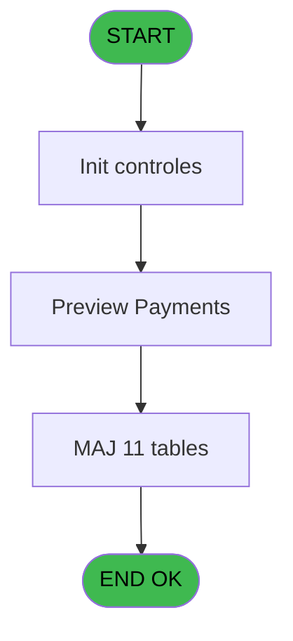
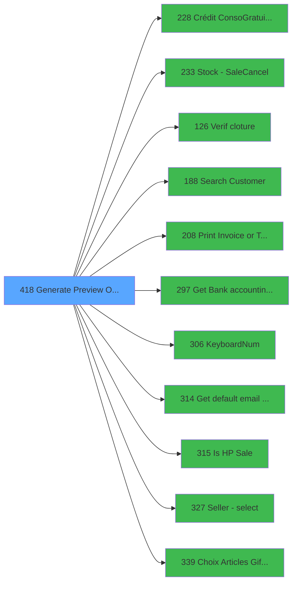

# PVE IDE 418 - Generate Preview OD==LEX Book

> **Analyse**: Phases 1-4 2026-02-03 20:02 -> 20:02 (11s) | Assemblage 20:02
> **Pipeline**: V7.2 Enrichi
> **Structure**: 4 onglets (Resume | Ecrans | Donnees | Connexions)

<!-- TAB:Resume -->

## 1. FICHE D'IDENTITE

| Attribut | Valeur |
|----------|--------|
| Projet | PVE |
| IDE Position | 418 |
| Nom Programme | Generate Preview OD==LEX Book |
| Fichier source | `Prg_418.xml` |
| Dossier IDE | A |
| Taches | 51 (4 ecrans visibles) |
| Tables modifiees | 11 |
| Programmes appeles | 11 |
| :warning: Statut | **ORPHELIN_POTENTIEL** |

## 2. DESCRIPTION FONCTIONNELLE

**Generate Preview OD==LEX Book** assure la gestion complete de ce processus.

Le flux de traitement s'organise en **5 blocs fonctionnels** :

- **Traitement** (42 taches) : traitements metier divers
- **Creation** (3 taches) : insertion d'enregistrements en base (mouvements, prestations)
- **Calcul** (3 taches) : calculs de montants, stocks ou compteurs
- **Validation** (2 taches) : controles et verifications de coherence
- **Consultation** (1 tache) : ecrans de recherche, selection et consultation

**Donnees modifiees** : 11 tables en ecriture (pv_comptable_tmp, depot_garantie___dga, comptable________cte, compte_gm________cgm, intermed_compta__ite, vente, pv_discount_reasons, pv_cust_rentals, pv_sellers_by_week, Table_1564, Table_1567).

Detail : phases du traitement

#### Phase 1 : Traitement (42 taches)

- **418** - Generate Preview OD==LEX Book **[[ECRAN]](#ecran-t1)**
- **418.1** - Payment preview Signature **[[ECRAN]](#ecran-t2)**
- **418.2** - Batch 2 **[[ECRAN]](#ecran-t4)**
- **418.2.1** - Création d'un O.D **[[ECRAN]](#ecran-t5)**
- **418.2.1.1** - OD Debit 18 **[[ECRAN]](#ecran-t6)**
- **418.2.1.2** - credit 18 **[[ECRAN]](#ecran-t7)**
- **418.2.1.3** - debit 181 **[[ECRAN]](#ecran-t8)**
- **418.2.1.4** - credit 181 **[[ECRAN]](#ecran-t9)**
- **418.2.1.5** - debit xtrack **[[ECRAN]](#ecran-t10)**
- **418.2.1.6** - credit xtrack **[[ECRAN]](#ecran-t11)**
- **418.2.1.7** - OD cancel xtrack
- **418.2.1.7.1** - credit xtrack **[[ECRAN]](#ecran-t13)**
- **418.2.1.8** - OD cancel 18 **[[ECRAN]](#ecran-t14)**
- **418.2.1.8.1** - credit xtrack **[[ECRAN]](#ecran-t15)**
- **418.2.1.8.2** - credit xtrack **[[ECRAN]](#ecran-t16)**
- **418.2.1.9** - OD cancel 181
- **418.2.1.9.1** - credit xtrack **[[ECRAN]](#ecran-t18)**
- **418.2.1.10** - update cust rentals **[[ECRAN]](#ecran-t19)**
- **418.2.1.11** - Lecture IN PO **[[ECRAN]](#ecran-t22)**
- **418.2.1.11.1** - credit xtrack **[[ECRAN]](#ecran-t23)**
- **418.2.1.11.2** - credit 18 **[[ECRAN]](#ecran-t24)**
- **418.2.1.11.3** - credit 18 **[[ECRAN]](#ecran-t25)**
- **418.2.1.11.4** - credit 181 **[[ECRAN]](#ecran-t26)**
- **418.2.1.12** - Debit 18 **[[ECRAN]](#ecran-t27)**
- **418.2.1.13** - credit 18 **[[ECRAN]](#ecran-t28)**
- **418.2.1.14** - View **[[ECRAN]](#ecran-t29)**
- **418.2.1.15** - Upd Customer
- **418.2.2** - Payment preview **[[ECRAN]](#ecran-t31)**
- **418.2.4** - Search for Gift Pass **[[ECRAN]](#ecran-t33)**
- **418.2.5** - Read for Gift Pass **[[ECRAN]](#ecran-t34)**
- **418.2.6** - Read for Gift Pass **[[ECRAN]](#ecran-t35)**
- **418.2.7** - Read for Gift Pass **[[ECRAN]](#ecran-t36)**
- **418.2.8** - Read for Resort Credit **[[ECRAN]](#ecran-t38)**
- **418.2.9** - Input Amount Gift Pass **[[ECRAN]](#ecran-t40)**
- **418.3** - Annulation Garantie **[[ECRAN]](#ecran-t41)**
- **418.4** - Annulation Garantie **[[ECRAN]](#ecran-t42)**
- **418.5** - Suppression Gift Pass
- **418.6** - Suppression Gift Pass
- **418.8** - Get List Articles GP
- **418.9** - Get Solde Gift Pass
- **418.10** - Get Solde ResortCredit
- **418.11** - Appliquer Gift Pass

Delegue a : [Crédit Conso/Gratuité (BAR) (IDE 228)](PVE-IDE-228.md), [Search Customer (IDE 188)](PVE-IDE-188.md), [Get Bank accounting date (IDE 297)](PVE-IDE-297.md), [KeyboardNum (IDE 306)](PVE-IDE-306.md), [Get default email address (IDE 314)](PVE-IDE-314.md), [Is HP Sale (IDE 315)](PVE-IDE-315.md)

#### Phase 2 : Calcul (3 taches)

- **418.1.1** - calcul total
- **418.2.1.10.1** - Calcul days
- **418.2.1.10.1.1** - Lect PoS Compta

Delegue a : [Stock - Sale/Cancel (IDE 233)](PVE-IDE-233.md)

#### Phase 3 : Validation (2 taches)

- **418.2.3** - Validation ecriture od **[[ECRAN]](#ecran-t32)**
- **418.7** - Devalidation annulations GP

Delegue a : [Verif cloture (IDE 126)](PVE-IDE-126.md)

#### Phase 4 : Creation (3 taches)

- **418.2.7.1** - Creation Ligne **[[ECRAN]](#ecran-t37)**
- **418.2.8.1** - Creation Ligne **[[ECRAN]](#ecran-t39)**
- **418.11.1** - CreateLines Gift Pass

#### Phase 5 : Consultation (1 tache)

- **418.8.1** - Add To liste choix

Delegue a : [Get Bank accounting date (IDE 297)](PVE-IDE-297.md), [Get default email address (IDE 314)](PVE-IDE-314.md), [Seller - select (IDE 327)](PVE-IDE-327.md), [Choix Articles Gift Pass (IDE 339)](PVE-IDE-339.md)

#### Tables impactees

| Table | Operations | Role metier |
|-------|-----------|-------------|
| pv_cust_rentals | R/**W**/L (20 usages) |  |
| pv_comptable_tmp | R/**W**/L (8 usages) |  |
| pv_discount_reasons | R/**W**/L (8 usages) |  |
| compte_gm________cgm | **W**/L (6 usages) | Comptes GM (generaux) |
| intermed_compta__ite | **W**/L (4 usages) |  |
| comptable________cte | **W**/L (4 usages) |  |
| vente | **W**/L (4 usages) | Donnees de ventes |
| pv_sellers_by_week | **W**/L (2 usages) |  |
| depot_garantie___dga | **W** (2 usages) | Depots et garanties |
| Table_1564 | **W**/L (2 usages) |  |
| Table_1567 | **W** (1 usages) |  |

## 3. BLOCS FONCTIONNELS

### 3.1 Traitement (42 taches)

Traitements internes.

---

#### 418 - Generate Preview OD==LEX Book [[ECRAN]](#ecran-t1)

**Role** : Tache d'orchestration : point d'entree du programme (42 sous-taches). Coordonne l'enchainement des traitements.
**Ecran** : 126 x 71 DLU (MDI) | [Voir mockup](#ecran-t1)

41 sous-taches directes

| Tache | Nom | Bloc |
|-------|-----|------|
| [418.1](#t2) | Payment preview Signature **[[ECRAN]](#ecran-t2)** | Traitement |
| [418.2](#t4) | Batch 2 **[[ECRAN]](#ecran-t4)** | Traitement |
| [418.2.1](#t5) | Création d'un O.D **[[ECRAN]](#ecran-t5)** | Traitement |
| [418.2.1.1](#t6) | OD Debit 18 **[[ECRAN]](#ecran-t6)** | Traitement |
| [418.2.1.2](#t7) | credit 18 **[[ECRAN]](#ecran-t7)** | Traitement |
| [418.2.1.3](#t8) | debit 181 **[[ECRAN]](#ecran-t8)** | Traitement |
| [418.2.1.4](#t9) | credit 181 **[[ECRAN]](#ecran-t9)** | Traitement |
| [418.2.1.5](#t10) | debit xtrack **[[ECRAN]](#ecran-t10)** | Traitement |
| [418.2.1.6](#t11) | credit xtrack **[[ECRAN]](#ecran-t11)** | Traitement |
| [418.2.1.7](#t12) | OD cancel xtrack | Traitement |
| [418.2.1.7.1](#t13) | credit xtrack **[[ECRAN]](#ecran-t13)** | Traitement |
| [418.2.1.8](#t14) | OD cancel 18 **[[ECRAN]](#ecran-t14)** | Traitement |
| [418.2.1.8.1](#t15) | credit xtrack **[[ECRAN]](#ecran-t15)** | Traitement |
| [418.2.1.8.2](#t16) | credit xtrack **[[ECRAN]](#ecran-t16)** | Traitement |
| [418.2.1.9](#t17) | OD cancel 181 | Traitement |
| [418.2.1.9.1](#t18) | credit xtrack **[[ECRAN]](#ecran-t18)** | Traitement |
| [418.2.1.10](#t19) | update cust rentals **[[ECRAN]](#ecran-t19)** | Traitement |
| [418.2.1.11](#t22) | Lecture IN PO **[[ECRAN]](#ecran-t22)** | Traitement |
| [418.2.1.11.1](#t23) | credit xtrack **[[ECRAN]](#ecran-t23)** | Traitement |
| [418.2.1.11.2](#t24) | credit 18 **[[ECRAN]](#ecran-t24)** | Traitement |
| [418.2.1.11.3](#t25) | credit 18 **[[ECRAN]](#ecran-t25)** | Traitement |
| [418.2.1.11.4](#t26) | credit 181 **[[ECRAN]](#ecran-t26)** | Traitement |
| [418.2.1.12](#t27) | Debit 18 **[[ECRAN]](#ecran-t27)** | Traitement |
| [418.2.1.13](#t28) | credit 18 **[[ECRAN]](#ecran-t28)** | Traitement |
| [418.2.1.14](#t29) | View **[[ECRAN]](#ecran-t29)** | Traitement |
| [418.2.1.15](#t30) | Upd Customer | Traitement |
| [418.2.2](#t31) | Payment preview **[[ECRAN]](#ecran-t31)** | Traitement |
| [418.2.4](#t33) | Search for Gift Pass **[[ECRAN]](#ecran-t33)** | Traitement |
| [418.2.5](#t34) | Read for Gift Pass **[[ECRAN]](#ecran-t34)** | Traitement |
| [418.2.6](#t35) | Read for Gift Pass **[[ECRAN]](#ecran-t35)** | Traitement |
| [418.2.7](#t36) | Read for Gift Pass **[[ECRAN]](#ecran-t36)** | Traitement |
| [418.2.8](#t38) | Read for Resort Credit **[[ECRAN]](#ecran-t38)** | Traitement |
| [418.2.9](#t40) | Input Amount Gift Pass **[[ECRAN]](#ecran-t40)** | Traitement |
| [418.3](#t41) | Annulation Garantie **[[ECRAN]](#ecran-t41)** | Traitement |
| [418.4](#t42) | Annulation Garantie **[[ECRAN]](#ecran-t42)** | Traitement |
| [418.5](#t43) | Suppression Gift Pass | Traitement |
| [418.6](#t44) | Suppression Gift Pass | Traitement |
| [418.8](#t46) | Get List Articles GP | Traitement |
| [418.9](#t48) | Get Solde Gift Pass | Traitement |
| [418.10](#t49) | Get Solde ResortCredit | Traitement |
| [418.11](#t50) | Appliquer Gift Pass | Traitement |

**Variables liees** : BO (p.NotCancelBooking)

---

#### 418.1 - Payment preview Signature [[ECRAN]](#ecran-t2)

**Role** : Traitement : Payment preview Signature.
**Ecran** : 1984 x 431 DLU (Type6) | [Voir mockup](#ecran-t2)
**Variables liees** : C (P.v.annulPayment), I (p.Payment_Type)

---

#### 418.2 - Batch 2 [[ECRAN]](#ecran-t4)

**Role** : Traitement : Batch 2.
**Ecran** : 519 x 342 DLU | [Voir mockup](#ecran-t4)

---

#### 418.2.1 - Création d'un O.D [[ECRAN]](#ecran-t5)

**Role** : Traitement : Création d'un O.D.
**Ecran** : 1170 x 229 DLU (MDI) | [Voir mockup](#ecran-t5)

---

#### 418.2.1.1 - OD Debit 18 [[ECRAN]](#ecran-t6)

**Role** : Traitement : OD Debit 18.
**Ecran** : 1010 x 398 DLU (MDI) | [Voir mockup](#ecran-t6)

---

#### 418.2.1.2 - credit 18 [[ECRAN]](#ecran-t7)

**Role** : Calcul fidelite/avantage : credit 18.
**Ecran** : 377 x 144 DLU (MDI) | [Voir mockup](#ecran-t7)
**Variables liees** : CG (v ReCredit Garantie), CP (v.SoldeResortCredit), CR (v.MontantEligibleResortCredit), CQ (ConfirmeUtilisationResortCredit)

---

#### 418.2.1.3 - debit 181 [[ECRAN]](#ecran-t8)

**Role** : Traitement : debit 181.
**Ecran** : 153 x 63 DLU (MDI) | [Voir mockup](#ecran-t8)

---

#### 418.2.1.4 - credit 181 [[ECRAN]](#ecran-t9)

**Role** : Calcul fidelite/avantage : credit 181.
**Ecran** : 134 x 63 DLU (MDI) | [Voir mockup](#ecran-t9)
**Variables liees** : CG (v ReCredit Garantie), CP (v.SoldeResortCredit), CR (v.MontantEligibleResortCredit), CQ (ConfirmeUtilisationResortCredit)

---

#### 418.2.1.5 - debit xtrack [[ECRAN]](#ecran-t10)

**Role** : Traitement : debit xtrack.
**Ecran** : 835 x 253 DLU (MDI) | [Voir mockup](#ecran-t10)

---

#### 418.2.1.6 - credit xtrack [[ECRAN]](#ecran-t11)

**Role** : Calcul fidelite/avantage : credit xtrack.
**Ecran** : 104 x 63 DLU (MDI) | [Voir mockup](#ecran-t11)
**Variables liees** : CG (v ReCredit Garantie), CP (v.SoldeResortCredit), CR (v.MontantEligibleResortCredit), CQ (ConfirmeUtilisationResortCredit)

---

#### 418.2.1.7 - OD cancel xtrack

**Role** : Traitement : OD cancel xtrack.
**Variables liees** : BO (p.NotCancelBooking), CE (V Cancel pour pour Gift Pass)

---

#### 418.2.1.7.1 - credit xtrack [[ECRAN]](#ecran-t13)

**Role** : Calcul fidelite/avantage : credit xtrack.
**Ecran** : 104 x 63 DLU (MDI) | [Voir mockup](#ecran-t13)
**Variables liees** : CG (v ReCredit Garantie), CP (v.SoldeResortCredit), CR (v.MontantEligibleResortCredit), CQ (ConfirmeUtilisationResortCredit)

---

#### 418.2.1.8 - OD cancel 18 [[ECRAN]](#ecran-t14)

**Role** : Traitement : OD cancel 18.
**Ecran** : 677 x 270 DLU (MDI) | [Voir mockup](#ecran-t14)
**Variables liees** : BO (p.NotCancelBooking), CE (V Cancel pour pour Gift Pass)

---

#### 418.2.1.8.1 - credit xtrack [[ECRAN]](#ecran-t15)

**Role** : Calcul fidelite/avantage : credit xtrack.
**Ecran** : 104 x 63 DLU (MDI) | [Voir mockup](#ecran-t15)
**Variables liees** : CG (v ReCredit Garantie), CP (v.SoldeResortCredit), CR (v.MontantEligibleResortCredit), CQ (ConfirmeUtilisationResortCredit)

---

#### 418.2.1.8.2 - credit xtrack [[ECRAN]](#ecran-t16)

**Role** : Calcul fidelite/avantage : credit xtrack.
**Ecran** : 104 x 63 DLU (MDI) | [Voir mockup](#ecran-t16)
**Variables liees** : CG (v ReCredit Garantie), CP (v.SoldeResortCredit), CR (v.MontantEligibleResortCredit), CQ (ConfirmeUtilisationResortCredit)

---

#### 418.2.1.9 - OD cancel 181

**Role** : Traitement : OD cancel 181.
**Variables liees** : BO (p.NotCancelBooking), CE (V Cancel pour pour Gift Pass)

---

#### 418.2.1.9.1 - credit xtrack [[ECRAN]](#ecran-t18)

**Role** : Calcul fidelite/avantage : credit xtrack.
**Ecran** : 104 x 63 DLU (MDI) | [Voir mockup](#ecran-t18)
**Variables liees** : CG (v ReCredit Garantie), CP (v.SoldeResortCredit), CR (v.MontantEligibleResortCredit), CQ (ConfirmeUtilisationResortCredit)

---

#### 418.2.1.10 - update cust rentals [[ECRAN]](#ecran-t19)

**Role** : Traitement : update cust rentals.
**Ecran** : 266 x 102 DLU (MDI) | [Voir mockup](#ecran-t19)
**Variables liees** : BC (p.date_update_ligne), BD (p.Time_update_ligne), BH (p.payer_xcust_ID)

---

#### 418.2.1.11 - Lecture IN PO [[ECRAN]](#ecran-t22)

**Role** : Traitement : Lecture IN PO.
**Ecran** : 104 x 63 DLU (MDI) | [Voir mockup](#ecran-t22)

---

#### 418.2.1.11.1 - credit xtrack [[ECRAN]](#ecran-t23)

**Role** : Calcul fidelite/avantage : credit xtrack.
**Ecran** : 104 x 63 DLU (MDI) | [Voir mockup](#ecran-t23)
**Variables liees** : CG (v ReCredit Garantie), CP (v.SoldeResortCredit), CR (v.MontantEligibleResortCredit), CQ (ConfirmeUtilisationResortCredit)

---

#### 418.2.1.11.2 - credit 18 [[ECRAN]](#ecran-t24)

**Role** : Calcul fidelite/avantage : credit 18.
**Ecran** : 223 x 119 DLU (MDI) | [Voir mockup](#ecran-t24)
**Variables liees** : CG (v ReCredit Garantie), CP (v.SoldeResortCredit), CR (v.MontantEligibleResortCredit), CQ (ConfirmeUtilisationResortCredit)

---

#### 418.2.1.11.3 - credit 18 [[ECRAN]](#ecran-t25)

**Role** : Calcul fidelite/avantage : credit 18.
**Ecran** : 223 x 119 DLU (MDI) | [Voir mockup](#ecran-t25)
**Variables liees** : CG (v ReCredit Garantie), CP (v.SoldeResortCredit), CR (v.MontantEligibleResortCredit), CQ (ConfirmeUtilisationResortCredit)

---

#### 418.2.1.11.4 - credit 181 [[ECRAN]](#ecran-t26)

**Role** : Calcul fidelite/avantage : credit 181.
**Ecran** : 134 x 63 DLU (MDI) | [Voir mockup](#ecran-t26)
**Variables liees** : CG (v ReCredit Garantie), CP (v.SoldeResortCredit), CR (v.MontantEligibleResortCredit), CQ (ConfirmeUtilisationResortCredit)

---

#### 418.2.1.12 - Debit 18 [[ECRAN]](#ecran-t27)

**Role** : Traitement : Debit 18.
**Ecran** : 164 x 63 DLU (MDI) | [Voir mockup](#ecran-t27)

---

#### 418.2.1.13 - credit 18 [[ECRAN]](#ecran-t28)

**Role** : Calcul fidelite/avantage : credit 18.
**Ecran** : 223 x 119 DLU (MDI) | [Voir mockup](#ecran-t28)
**Variables liees** : CG (v ReCredit Garantie), CP (v.SoldeResortCredit), CR (v.MontantEligibleResortCredit), CQ (ConfirmeUtilisationResortCredit)

---

#### 418.2.1.14 - View [[ECRAN]](#ecran-t29)

**Role** : Traitement : View.
**Ecran** : 662 x 486 DLU | [Voir mockup](#ecran-t29)

---

#### 418.2.1.15 - Upd Customer

**Role** : Traitement : Upd Customer.

---

#### 418.2.2 - Payment preview [[ECRAN]](#ecran-t31)

**Role** : Traitement : Payment preview.
**Ecran** : 635 x 292 DLU (MDI) | [Voir mockup](#ecran-t31)
**Variables liees** : C (P.v.annulPayment), I (p.Payment_Type)

---

#### 418.2.4 - Search for Gift Pass [[ECRAN]](#ecran-t33)

**Role** : Calcul fidelite/avantage : Search for Gift Pass.
**Ecran** : 175 x 195 DLU | [Voir mockup](#ecran-t33)
**Variables liees** : E (p.V.recherche_ClubmedPass), K (p.Montant_Eligible_Gift_Pass), L (p.V.solde_Gift Pass), BM (p.Check_CM_Pass), CE (V Cancel pour pour Gift Pass)

---

#### 418.2.5 - Read for Gift Pass [[ECRAN]](#ecran-t34)

**Role** : Calcul fidelite/avantage : Read for Gift Pass.
**Ecran** : 1293 x 430 DLU | [Voir mockup](#ecran-t34)
**Variables liees** : E (p.V.recherche_ClubmedPass), K (p.Montant_Eligible_Gift_Pass), L (p.V.solde_Gift Pass), BM (p.Check_CM_Pass), CE (V Cancel pour pour Gift Pass)

---

#### 418.2.6 - Read for Gift Pass [[ECRAN]](#ecran-t35)

**Role** : Calcul fidelite/avantage : Read for Gift Pass.
**Ecran** : 1293 x 430 DLU | [Voir mockup](#ecran-t35)
**Variables liees** : E (p.V.recherche_ClubmedPass), K (p.Montant_Eligible_Gift_Pass), L (p.V.solde_Gift Pass), BM (p.Check_CM_Pass), CE (V Cancel pour pour Gift Pass)

---

#### 418.2.7 - Read for Gift Pass [[ECRAN]](#ecran-t36)

**Role** : Calcul fidelite/avantage : Read for Gift Pass.
**Ecran** : 795 x 346 DLU | [Voir mockup](#ecran-t36)
**Variables liees** : E (p.V.recherche_ClubmedPass), K (p.Montant_Eligible_Gift_Pass), L (p.V.solde_Gift Pass), BM (p.Check_CM_Pass), CE (V Cancel pour pour Gift Pass)

---

#### 418.2.8 - Read for Resort Credit [[ECRAN]](#ecran-t38)

**Role** : Calcul fidelite/avantage : Read for Resort Credit.
**Ecran** : 795 x 346 DLU | [Voir mockup](#ecran-t38)
**Variables liees** : CG (v ReCredit Garantie), CP (v.SoldeResortCredit), CR (v.MontantEligibleResortCredit), CQ (ConfirmeUtilisationResortCredit)

---

#### 418.2.9 - Input Amount Gift Pass [[ECRAN]](#ecran-t40)

**Role** : Calcul fidelite/avantage : Input Amount Gift Pass.
**Ecran** : 382 x 102 DLU | [Voir mockup](#ecran-t40)
**Variables liees** : E (p.V.recherche_ClubmedPass), K (p.Montant_Eligible_Gift_Pass), L (p.V.solde_Gift Pass), BM (p.Check_CM_Pass), CE (V Cancel pour pour Gift Pass)

---

#### 418.3 - Annulation Garantie [[ECRAN]](#ecran-t41)

**Role** : Traitement : Annulation Garantie.
**Ecran** : 431 x 358 DLU | [Voir mockup](#ecran-t41)
**Variables liees** : BI (p.V.Garantie O/N), CF (v Annualtion Vente Garantie), CG (v ReCredit Garantie)

---

#### 418.4 - Annulation Garantie [[ECRAN]](#ecran-t42)

**Role** : Traitement : Annulation Garantie.
**Ecran** : 723 x 460 DLU | [Voir mockup](#ecran-t42)
**Variables liees** : BI (p.V.Garantie O/N), CF (v Annualtion Vente Garantie), CG (v ReCredit Garantie)

---

#### 418.5 - Suppression Gift Pass

**Role** : Calcul fidelite/avantage : Suppression Gift Pass.
**Variables liees** : E (p.V.recherche_ClubmedPass), K (p.Montant_Eligible_Gift_Pass), L (p.V.solde_Gift Pass), BM (p.Check_CM_Pass), CE (V Cancel pour pour Gift Pass)

---

#### 418.6 - Suppression Gift Pass

**Role** : Calcul fidelite/avantage : Suppression Gift Pass.
**Variables liees** : E (p.V.recherche_ClubmedPass), K (p.Montant_Eligible_Gift_Pass), L (p.V.solde_Gift Pass), BM (p.Check_CM_Pass), CE (V Cancel pour pour Gift Pass)

---

#### 418.8 - Get List Articles GP

**Role** : Consultation/chargement : Get List Articles GP.
**Variables liees** : CM (v.ExisteArticlesEligibleGP)

---

#### 418.9 - Get Solde Gift Pass

**Role** : Consultation/chargement : Get Solde Gift Pass.
**Variables liees** : E (p.V.recherche_ClubmedPass), H (p.V.solde_Compte), K (p.Montant_Eligible_Gift_Pass), L (p.V.solde_Gift Pass), BM (p.Check_CM_Pass)

---

#### 418.10 - Get Solde ResortCredit

**Role** : Consultation/chargement : Get Solde ResortCredit.
**Variables liees** : H (p.V.solde_Compte), L (p.V.solde_Gift Pass), CL (v.SoldeGiftPass), CP (v.SoldeResortCredit), CR (v.MontantEligibleResortCredit)

---

#### 418.11 - Appliquer Gift Pass

**Role** : Calcul fidelite/avantage : Appliquer Gift Pass.
**Variables liees** : E (p.V.recherche_ClubmedPass), K (p.Montant_Eligible_Gift_Pass), L (p.V.solde_Gift Pass), BM (p.Check_CM_Pass), CE (V Cancel pour pour Gift Pass)

### 3.2 Calcul (3 taches)

Calculs metier : montants, stocks, compteurs.

---

#### 418.1.1 - calcul total

**Role** : Calcul : calcul total.
**Variables liees** : BV (V Total Ticket), BW (V Total CréditConso), CH (v Total Vente)
**Delegue a** : [Stock - Sale/Cancel (IDE 233)](PVE-IDE-233.md)

---

#### 418.2.1.10.1 - Calcul days

**Role** : Calcul : Calcul days.
**Delegue a** : [Stock - Sale/Cancel (IDE 233)](PVE-IDE-233.md)

---

#### 418.2.1.10.1.1 - Lect PoS Compta

**Role** : Traitement : Lect PoS Compta.
**Variables liees** : A (P select all ?)
**Delegue a** : [Stock - Sale/Cancel (IDE 233)](PVE-IDE-233.md)

### 3.3 Validation (2 taches)

Controles de coherence : 2 taches verifient les donnees et conditions.

---

#### 418.2.3 - Validation ecriture od [[ECRAN]](#ecran-t32)

**Role** : Verification : Validation ecriture od.
**Ecran** : 552 x 338 DLU | [Voir mockup](#ecran-t32)
**Variables liees** : CK (v.Validation_Mail)
**Delegue a** : [Verif cloture (IDE 126)](PVE-IDE-126.md)

---

#### 418.7 - Devalidation annulations GP

**Role** : Verification : Devalidation annulations GP.
**Delegue a** : [Verif cloture (IDE 126)](PVE-IDE-126.md)

### 3.4 Creation (3 taches)

Insertion de nouveaux enregistrements en base.

---

#### 418.2.7.1 - Creation Ligne [[ECRAN]](#ecran-t37)

**Role** : Creation d'enregistrement : Creation Ligne.
**Ecran** : 422 x 85 DLU | [Voir mockup](#ecran-t37)
**Variables liees** : N (p.Price_Ligne), O (p.Pakage_ID_Out_Ligne), P (p.Discount_Ligne), BC (p.date_update_ligne), BD (p.Time_update_ligne)

---

#### 418.2.8.1 - Creation Ligne [[ECRAN]](#ecran-t39)

**Role** : Creation d'enregistrement : Creation Ligne.
**Ecran** : 422 x 85 DLU | [Voir mockup](#ecran-t39)
**Variables liees** : N (p.Price_Ligne), O (p.Pakage_ID_Out_Ligne), P (p.Discount_Ligne), BC (p.date_update_ligne), BD (p.Time_update_ligne)

---

#### 418.11.1 - CreateLines Gift Pass

**Role** : Calcul fidelite/avantage : CreateLines Gift Pass.
**Variables liees** : E (p.V.recherche_ClubmedPass), K (p.Montant_Eligible_Gift_Pass), L (p.V.solde_Gift Pass), BM (p.Check_CM_Pass), CE (V Cancel pour pour Gift Pass)

### 3.5 Consultation (1 tache)

Ecrans de recherche et consultation.

---

#### 418.8.1 - Add To liste choix

**Role** : Selection par l'operateur : Add To liste choix.
**Variables liees** : CN (v.ValiderChoixGiftPass)
**Delegue a** : [Seller - select (IDE 327)](PVE-IDE-327.md), [Choix Articles Gift Pass (IDE 339)](PVE-IDE-339.md)

## 5. REGLES METIER

*(Aucune regle metier identifiee)*

## 6. CONTEXTE

- **Appele par**: (aucun)
- **Appelle**: 11 programmes | **Tables**: 28 (W:11 R:8 L:24) | **Taches**: 51 | **Expressions**: 20

<!-- TAB:Ecrans -->

## 8. ECRANS

### 8.1 Forms visibles (4 / 51)

| # | Position | Tache | Nom | Type | Largeur | Hauteur | Bloc |
|---|----------|-------|-----|------|---------|---------|------|
| 1 | 418.1 | 418.1 | Payment preview Signature | Type6 | 1984 | 431 | Traitement |
| 2 | 418.2.1.14 | 418.2.1.14 | View | Type0 | 662 | 486 | Traitement |
| 3 | 418.2.9 | 418.2.9 | Input Amount Gift Pass | Type0 | 382 | 102 | Traitement |
| 4 | 418.3 | 418.3 | Annulation Garantie | Type0 | 431 | 358 | Traitement |

### 8.2 Mockups Ecrans

---

#### 418.1 - Payment preview Signature
**Tache** : [418.1](#t2) | **Type** : Type6 | **Dimensions** : 1984 x 431 DLU
**Bloc** : Traitement | **Titre IDE** : Payment preview Signature

<!-- FORM-DATA:
{
    "width":  1984,
    "vFactor":  8,
    "type":  "Type6",
    "hFactor":  8,
    "controls":  [
                     {
                         "x":  102,
                         "type":  "label",
                         "var":  "",
                         "y":  45,
                         "w":  140,
                         "fmt":  "",
                         "name":  "",
                         "h":  10,
                         "color":  "181",
                         "text":  "Customer",
                         "parent":  null
                     },
                     {
                         "x":  602,
                         "type":  "label",
                         "var":  "",
                         "y":  45,
                         "w":  164,
                         "fmt":  "",
                         "name":  "",
                         "h":  10,
                         "color":  "181",
                         "text":  "Description",
                         "parent":  null
                     },
                     {
                         "x":  930,
                         "type":  "label",
                         "var":  "",
                         "y":  45,
                         "w":  98,
                         "fmt":  "",
                         "name":  "",
                         "h":  10,
                         "color":  "181",
                         "text":  "Payer",
                         "parent":  null
                     },
                     {
                         "x":  1159,
                         "type":  "label",
                         "var":  "",
                         "y":  45,
                         "w":  144,
                         "fmt":  "",
                         "name":  "",
                         "h":  10,
                         "color":  "181",
                         "text":  "Payment type",
                         "parent":  null
                     },
                     {
                         "x":  1374,
                         "type":  "label",
                         "var":  "",
                         "y":  45,
                         "w":  104,
                         "fmt":  "",
                         "name":  "",
                         "h":  10,
                         "color":  "181",
                         "text":  "Package",
                         "parent":  null
                     },
                     {
                         "x":  1630,
                         "type":  "label",
                         "var":  "",
                         "y":  45,
                         "w":  82,
                         "fmt":  "",
                         "name":  "",
                         "h":  10,
                         "color":  "181",
                         "text":  "Quantity",
                         "parent":  null
                     },
                     {
                         "x":  1791,
                         "type":  "label",
                         "var":  "",
                         "y":  45,
                         "w":  78,
                         "fmt":  "",
                         "name":  "",
                         "h":  10,
                         "color":  "181",
                         "text":  "Amount",
                         "parent":  null
                     },
                     {
                         "x":  16,
                         "type":  "label",
                         "var":  "",
                         "y":  157,
                         "w":  1960,
                         "fmt":  "",
                         "name":  "",
                         "h":  28,
                         "color":  "",
                         "text":  "",
                         "parent":  null
                     },
                     {
                         "x":  26,
                         "type":  "label",
                         "var":  "",
                         "y":  160,
                         "w":  404,
                         "fmt":  "",
                         "name":  "",
                         "h":  22,
                         "color":  "182",
                         "text":  "",
                         "parent":  8
                     },
                     {
                         "x":  1634,
                         "type":  "label",
                         "var":  "",
                         "y":  164,
                         "w":  86,
                         "fmt":  "",
                         "name":  "",
                         "h":  14,
                         "color":  "",
                         "text":  "Total",
                         "parent":  8
                     },
                     {
                         "x":  34,
                         "type":  "label",
                         "var":  "",
                         "y":  166,
                         "w":  92,
                         "fmt":  "",
                         "name":  "",
                         "h":  8,
                         "color":  "182",
                         "text":  "Creation",
                         "parent":  8
                     },
                     {
                         "x":  2,
                         "type":  "label",
                         "var":  "",
                         "y":  0,
                         "w":  1982,
                         "fmt":  "",
                         "name":  "",
                         "h":  40,
                         "color":  "186",
                         "text":  "",
                         "parent":  null
                     },
                     {
                         "x":  34,
                         "type":  "label",
                         "var":  "",
                         "y":  14,
                         "w":  690,
                         "fmt":  "",
                         "name":  "",
                         "h":  12,
                         "color":  "186",
                         "text":  "Review the transactions and validate them",
                         "parent":  16
                     },
                     {
                         "x":  16,
                         "type":  "table",
                         "var":  "",
                         "name":  "",
                         "titleH":  12,
                         "color":  "110",
                         "w":  1888,
                         "y":  59,
                         "fmt":  "",
                         "parent":  null,
                         "text":  "",
                         "rowH":  24,
                         "h":  97,
                         "cols":  [
                                      {
                                          "title":  "",
                                          "layer":  1,
                                          "w":  320
                                      },
                                      {
                                          "title":  " ",
                                          "layer":  2,
                                          "w":  240
                                      },
                                      {
                                          "title":  "",
                                          "layer":  3,
                                          "w":  240
                                      },
                                      {
                                          "title":  "",
                                          "layer":  4,
                                          "w":  320
                                      },
                                      {
                                          "title":  "",
                                          "layer":  5,
                                          "w":  200
                                      },
                                      {
                                          "title":  "",
                                          "layer":  6,
                                          "w":  200
                                      },
                                      {
                                          "title":  "",
                                          "layer":  7,
                                          "w":  200
                                      },
                                      {
                                          "title":  "",
                                          "layer":  8,
                                          "w":  160
                                      }
                                  ],
                         "rows":  8
                     },
                     {
                         "x":  346,
                         "type":  "label",
                         "var":  "",
                         "y":  45,
                         "w":  140,
                         "fmt":  "",
                         "name":  "",
                         "h":  10,
                         "color":  "181",
                         "text":  "Product",
                         "parent":  null
                     },
                     {
                         "x":  1350,
                         "type":  "edit",
                         "var":  "",
                         "y":  61,
                         "w":  175,
                         "fmt":  "",
                         "name":  "",
                         "h":  21,
                         "color":  "110",
                         "text":  "",
                         "parent":  19
                     },
                     {
                         "x":  345,
                         "type":  "edit",
                         "var":  "",
                         "y":  73,
                         "w":  228,
                         "fmt":  "30",
                         "name":  "",
                         "h":  10,
                         "color":  "110",
                         "text":  "",
                         "parent":  19
                     },
                     {
                         "x":  595,
                         "type":  "edit",
                         "var":  "",
                         "y":  61,
                         "w":  214,
                         "fmt":  "",
                         "name":  "",
                         "h":  21,
                         "color":  "110",
                         "text":  "",
                         "parent":  19
                     },
                     {
                         "x":  1755,
                         "type":  "edit",
                         "var":  "",
                         "y":  61,
                         "w":  122,
                         "fmt":  "4",
                         "name":  "",
                         "h":  21,
                         "color":  "110",
                         "text":  "",
                         "parent":  19
                     },
                     {
                         "x":  132,
                         "type":  "edit",
                         "var":  "",
                         "y":  166,
                         "w":  96,
                         "fmt":  "",
                         "name":  "",
                         "h":  8,
                         "color":  "182",
                         "text":  "",
                         "parent":  8
                     },
                     {
                         "x":  236,
                         "type":  "edit",
                         "var":  "",
                         "y":  166,
                         "w":  62,
                         "fmt":  "HH:MM",
                         "name":  "",
                         "h":  8,
                         "color":  "182",
                         "text":  "",
                         "parent":  8
                     },
                     {
                         "x":  311,
                         "type":  "edit",
                         "var":  "",
                         "y":  166,
                         "w":  106,
                         "fmt":  "",
                         "name":  "",
                         "h":  8,
                         "color":  "182",
                         "text":  "",
                         "parent":  8
                     },
                     {
                         "x":  21,
                         "type":  "edit",
                         "var":  "",
                         "y":  73,
                         "w":  308,
                         "fmt":  "",
                         "name":  "",
                         "h":  10,
                         "color":  "110",
                         "text":  "",
                         "parent":  19
                     },
                     {
                         "x":  21,
                         "type":  "edit",
                         "var":  "",
                         "y":  61,
                         "w":  308,
                         "fmt":  "",
                         "name":  "",
                         "h":  10,
                         "color":  "110",
                         "text":  "",
                         "parent":  19
                     },
                     {
                         "x":  1150,
                         "type":  "edit",
                         "var":  "",
                         "y":  61,
                         "w":  176,
                         "fmt":  "",
                         "name":  "",
                         "h":  21,
                         "color":  "110",
                         "text":  "",
                         "parent":  19
                     },
                     {
                         "x":  820,
                         "type":  "edit",
                         "var":  "",
                         "y":  73,
                         "w":  311,
                         "fmt":  "",
                         "name":  "",
                         "h":  10,
                         "color":  "110",
                         "text":  "",
                         "parent":  19
                     },
                     {
                         "x":  820,
                         "type":  "edit",
                         "var":  "",
                         "y":  61,
                         "w":  311,
                         "fmt":  "",
                         "name":  "",
                         "h":  10,
                         "color":  "110",
                         "text":  "",
                         "parent":  19
                     },
                     {
                         "x":  1731,
                         "type":  "edit",
                         "var":  "",
                         "y":  164,
                         "w":  146,
                         "fmt":  "N10.3C",
                         "name":  "",
                         "h":  14,
                         "color":  "146",
                         "text":  "",
                         "parent":  8
                     },
                     {
                         "x":  1564,
                         "type":  "edit",
                         "var":  "",
                         "y":  61,
                         "w":  148,
                         "fmt":  "N9.3",
                         "name":  "",
                         "h":  21,
                         "color":  "110",
                         "text":  "",
                         "parent":  19
                     },
                     {
                         "x":  1904,
                         "type":  "button",
                         "var":  "",
                         "y":  59,
                         "w":  72,
                         "fmt":  "ñ",
                         "name":  "",
                         "h":  49,
                         "color":  "",
                         "text":  "",
                         "parent":  null
                     },
                     {
                         "x":  1904,
                         "type":  "button",
                         "var":  "",
                         "y":  108,
                         "w":  72,
                         "fmt":  "ò",
                         "name":  "",
                         "h":  48,
                         "color":  "",
                         "text":  "",
                         "parent":  null
                     },
                     {
                         "x":  16,
                         "type":  "button",
                         "var":  "",
                         "y":  404,
                         "w":  974,
                         "fmt":  "\u0026Cancel",
                         "name":  "B Exit",
                         "h":  24,
                         "color":  "",
                         "text":  "",
                         "parent":  null
                     },
                     {
                         "x":  1002,
                         "type":  "button",
                         "var":  "",
                         "y":  404,
                         "w":  974,
                         "fmt":  "\u0026Validate",
                         "name":  "B Valid",
                         "h":  24,
                         "color":  "",
                         "text":  "",
                         "parent":  null
                     },
                     {
                         "x":  1884,
                         "type":  "image",
                         "var":  "",
                         "y":  3,
                         "w":  96,
                         "fmt":  "",
                         "name":  "",
                         "h":  36,
                         "color":  "",
                         "text":  "",
                         "parent":  16
                     },
                     {
                         "x":  16,
                         "type":  "subform",
                         "var":  "",
                         "y":  186,
                         "w":  1961,
                         "fmt":  "",
                         "name":  "SB_SIGNATURE",
                         "h":  217,
                         "color":  "",
                         "text":  "",
                         "parent":  null
                     },
                     {
                         "x":  346,
                         "type":  "edit",
                         "var":  "",
                         "y":  61,
                         "w":  228,
                         "fmt":  "30",
                         "name":  "label",
                         "h":  10,
                         "color":  "110",
                         "text":  "",
                         "parent":  19
                     }
                 ],
    "taskId":  "418.1",
    "height":  431
}
-->

<strong>Champs : 15 champs</strong>

| Pos (x,y) | Nom | Variable | Type |
|-----------|-----|----------|------|
| 1350,61 | (sans nom) | - | edit |
| 345,73 | 30 | - | edit |
| 595,61 | (sans nom) | - | edit |
| 1755,61 | 4 | - | edit |
| 132,166 | (sans nom) | - | edit |
| 236,166 | HH:MM | - | edit |
| 311,166 | (sans nom) | - | edit |
| 21,73 | (sans nom) | - | edit |
| 21,61 | (sans nom) | - | edit |
| 1150,61 | (sans nom) | - | edit |
| 820,73 | (sans nom) | - | edit |
| 820,61 | (sans nom) | - | edit |
| 1731,164 | N10.3C | - | edit |
| 1564,61 | N9.3 | - | edit |
| 346,61 | label | - | edit |

<strong>Boutons : 4 boutons</strong>

| Bouton | Pos (x,y) | Action |
|--------|-----------|--------|
| ñ | 1904,59 | Bouton fonctionnel |
| ò | 1904,108 | Bouton fonctionnel |
| Cancel | 16,404 | Appel [Stock - Sale/Cancel (IDE 233)](PVE-IDE-233.md) |
| Validate | 1002,404 | Valide la saisie et enregistre |

---

#### 418.2.1.14 - View
**Tache** : [418.2.1.14](#t29) | **Type** : Type0 | **Dimensions** : 662 x 486 DLU
**Bloc** : Traitement | **Titre IDE** : View

<!-- FORM-DATA:
{
    "width":  662,
    "vFactor":  8,
    "type":  "Type0",
    "hFactor":  4,
    "controls":  [
                     {
                         "x":  8,
                         "type":  "label",
                         "var":  "",
                         "y":  16,
                         "w":  56,
                         "fmt":  "",
                         "name":  "",
                         "h":  9,
                         "color":  "",
                         "text":  "L Pas de débit",
                         "parent":  null
                     },
                     {
                         "x":  8,
                         "type":  "label",
                         "var":  "",
                         "y":  32,
                         "w":  54,
                         "fmt":  "",
                         "name":  "",
                         "h":  9,
                         "color":  "",
                         "text":  "V Montant CC",
                         "parent":  null
                     },
                     {
                         "x":  12,
                         "type":  "label",
                         "var":  "",
                         "y":  48,
                         "w":  64,
                         "fmt":  "",
                         "name":  "",
                         "h":  9,
                         "color":  "",
                         "text":  "V Montant Ligne",
                         "parent":  null
                     },
                     {
                         "x":  12,
                         "type":  "label",
                         "var":  "",
                         "y":  64,
                         "w":  100,
                         "fmt":  "",
                         "name":  "",
                         "h":  9,
                         "color":  "",
                         "text":  "V Montant Ligne Gift Pass",
                         "parent":  null
                     },
                     {
                         "x":  16,
                         "type":  "label",
                         "var":  "",
                         "y":  80,
                         "w":  106,
                         "fmt":  "",
                         "name":  "",
                         "h":  9,
                         "color":  "",
                         "text":  "V blanc ou C(c) ou G(ratuity",
                         "parent":  null
                     },
                     {
                         "x":  20,
                         "type":  "label",
                         "var":  "",
                         "y":  96,
                         "w":  73,
                         "fmt":  "",
                         "name":  "",
                         "h":  9,
                         "color":  "",
                         "text":  "pms_transaction__",
                         "parent":  null
                     },
                     {
                         "x":  20,
                         "type":  "label",
                         "var":  "",
                         "y":  112,
                         "w":  39,
                         "fmt":  "",
                         "name":  "",
                         "h":  9,
                         "color":  "",
                         "text":  "free_extra",
                         "parent":  null
                     },
                     {
                         "x":  4,
                         "type":  "edit",
                         "var":  "",
                         "y":  0,
                         "w":  9,
                         "fmt":  "",
                         "name":  "Texte",
                         "h":  10,
                         "color":  "",
                         "text":  "",
                         "parent":  null
                     },
                     {
                         "x":  68,
                         "type":  "edit",
                         "var":  "",
                         "y":  16,
                         "w":  31,
                         "fmt":  "",
                         "name":  "L Pas de débit",
                         "h":  10,
                         "color":  "",
                         "text":  "",
                         "parent":  null
                     },
                     {
                         "x":  66,
                         "type":  "edit",
                         "var":  "",
                         "y":  32,
                         "w":  75,
                         "fmt":  "",
                         "name":  "V Montant CC",
                         "h":  10,
                         "color":  "",
                         "text":  "",
                         "parent":  null
                     },
                     {
                         "x":  80,
                         "type":  "edit",
                         "var":  "",
                         "y":  48,
                         "w":  75,
                         "fmt":  "",
                         "name":  "V Montant Ligne",
                         "h":  10,
                         "color":  "",
                         "text":  "",
                         "parent":  null
                     },
                     {
                         "x":  116,
                         "type":  "edit",
                         "var":  "",
                         "y":  64,
                         "w":  75,
                         "fmt":  "",
                         "name":  "V Montant Ligne Gift Pass",
                         "h":  10,
                         "color":  "",
                         "text":  "",
                         "parent":  null
                     },
                     {
                         "x":  126,
                         "type":  "edit",
                         "var":  "",
                         "y":  80,
                         "w":  9,
                         "fmt":  "",
                         "name":  "V blanc ou C(c) ou G(ratuity",
                         "h":  10,
                         "color":  "",
                         "text":  "",
                         "parent":  null
                     },
                     {
                         "x":  97,
                         "type":  "edit",
                         "var":  "",
                         "y":  96,
                         "w":  31,
                         "fmt":  "",
                         "name":  "pms_transaction__",
                         "h":  10,
                         "color":  "",
                         "text":  "",
                         "parent":  null
                     },
                     {
                         "x":  63,
                         "type":  "edit",
                         "var":  "",
                         "y":  112,
                         "w":  31,
                         "fmt":  "",
                         "name":  "free_extra",
                         "h":  10,
                         "color":  "",
                         "text":  "",
                         "parent":  null
                     }
                 ],
    "taskId":  "418.2.1.14",
    "height":  486
}
-->

<strong>Champs : 8 champs</strong>

| Pos (x,y) | Nom | Variable | Type |
|-----------|-----|----------|------|
| 4,0 | Texte | - | edit |
| 68,16 | L Pas de débit | - | edit |
| 66,32 | V Montant CC | - | edit |
| 80,48 | V Montant Ligne | - | edit |
| 116,64 | V Montant Ligne Gift Pass | - | edit |
| 126,80 | V blanc ou C(c) ou G(ratuity | - | edit |
| 97,96 | pms_transaction__ | - | edit |
| 63,112 | free_extra | - | edit |

---

#### 418.2.9 - Input Amount Gift Pass
**Tache** : [418.2.9](#t40) | **Type** : Type0 | **Dimensions** : 382 x 102 DLU
**Bloc** : Traitement | **Titre IDE** : Input Amount Gift Pass

<!-- FORM-DATA:
{
    "width":  382,
    "vFactor":  8,
    "type":  "Type0",
    "hFactor":  4,
    "controls":  [
                     {
                         "x":  10,
                         "type":  "label",
                         "var":  "",
                         "y":  9,
                         "w":  72,
                         "fmt":  "",
                         "name":  "",
                         "h":  16,
                         "color":  "187",
                         "text":  "BALANCE",
                         "parent":  null
                     },
                     {
                         "x":  10,
                         "type":  "label",
                         "var":  "",
                         "y":  38,
                         "w":  146,
                         "fmt":  "",
                         "name":  "",
                         "h":  16,
                         "color":  "187",
                         "text":  "MONTANT ELIGIBLE",
                         "parent":  null
                     },
                     {
                         "x":  3,
                         "type":  "line",
                         "var":  "",
                         "y":  63,
                         "w":  377,
                         "fmt":  "",
                         "name":  "",
                         "h":  0,
                         "color":  "",
                         "text":  "",
                         "parent":  null
                     },
                     {
                         "x":  166,
                         "type":  "edit",
                         "var":  "",
                         "y":  10,
                         "w":  104,
                         "fmt":  "13.2C",
                         "name":  "V Solde Free Extra",
                         "h":  15,
                         "color":  "110",
                         "text":  "",
                         "parent":  null
                     },
                     {
                         "x":  166,
                         "type":  "edit",
                         "var":  "",
                         "y":  36,
                         "w":  104,
                         "fmt":  "13.2C",
                         "name":  "JK",
                         "h":  18,
                         "color":  "110",
                         "text":  "",
                         "parent":  null
                     },
                     {
                         "x":  7,
                         "type":  "button",
                         "var":  "",
                         "y":  72,
                         "w":  113,
                         "fmt":  "Keyboard",
                         "name":  "b Clavier",
                         "h":  24,
                         "color":  "",
                         "text":  "",
                         "parent":  null
                     },
                     {
                         "x":  150,
                         "type":  "button",
                         "var":  "",
                         "y":  72,
                         "w":  99,
                         "fmt":  "Cancel",
                         "name":  "",
                         "h":  24,
                         "color":  "",
                         "text":  "",
                         "parent":  null
                     },
                     {
                         "x":  280,
                         "type":  "button",
                         "var":  "",
                         "y":  72,
                         "w":  99,
                         "fmt":  "Validate",
                         "name":  "b.Valider",
                         "h":  24,
                         "color":  "",
                         "text":  "",
                         "parent":  null
                     }
                 ],
    "taskId":  "418.2.9",
    "height":  102
}
-->

<strong>Champs : 2 champs</strong>

| Pos (x,y) | Nom | Variable | Type |
|-----------|-----|----------|------|
| 166,10 | V Solde Free Extra | - | edit |
| 166,36 | JK | - | edit |

<strong>Boutons : 3 boutons</strong>

| Bouton | Pos (x,y) | Action |
|--------|-----------|--------|
| Keyboard | 7,72 | Appel [KeyboardNum (IDE 306)](PVE-IDE-306.md) |
| Cancel | 150,72 | Appel [Stock - Sale/Cancel (IDE 233)](PVE-IDE-233.md) |
| Validate | 280,72 | Valide la saisie et enregistre |

---

#### 418.3 - Annulation Garantie
**Tache** : [418.3](#t41) | **Type** : Type0 | **Dimensions** : 431 x 358 DLU
**Bloc** : Traitement | **Titre IDE** : Annulation Garantie

<!-- FORM-DATA:
{
    "width":  431,
    "vFactor":  8,
    "type":  "Type0",
    "hFactor":  4,
    "controls":  [
                     {
                         "x":  4,
                         "type":  "label",
                         "var":  "",
                         "y":  8,
                         "w":  50,
                         "fmt":  "",
                         "name":  "",
                         "h":  9,
                         "color":  "",
                         "text":  "dga_societe:",
                         "parent":  null
                     },
                     {
                         "x":  4,
                         "type":  "label",
                         "var":  "",
                         "y":  26,
                         "w":  58,
                         "fmt":  "",
                         "name":  "",
                         "h":  9,
                         "color":  "",
                         "text":  "dga_code_gm:",
                         "parent":  null
                     },
                     {
                         "x":  4,
                         "type":  "label",
                         "var":  "",
                         "y":  44,
                         "w":  66,
                         "fmt":  "",
                         "name":  "",
                         "h":  9,
                         "color":  "",
                         "text":  "dga_date_retrait:",
                         "parent":  null
                     },
                     {
                         "x":  4,
                         "type":  "label",
                         "var":  "",
                         "y":  62,
                         "w":  70,
                         "fmt":  "",
                         "name":  "",
                         "h":  9,
                         "color":  "",
                         "text":  "dga_heure_retrait:",
                         "parent":  null
                     },
                     {
                         "x":  4,
                         "type":  "label",
                         "var":  "",
                         "y":  80,
                         "w":  38,
                         "fmt":  "",
                         "name":  "",
                         "h":  9,
                         "color":  "",
                         "text":  "dga_etat:",
                         "parent":  null
                     },
                     {
                         "x":  4,
                         "type":  "label",
                         "var":  "",
                         "y":  98,
                         "w":  59,
                         "fmt":  "",
                         "name":  "",
                         "h":  9,
                         "color":  "",
                         "text":  "dga_operateur:",
                         "parent":  null
                     },
                     {
                         "x":  4,
                         "type":  "label",
                         "var":  "",
                         "y":  116,
                         "w":  52,
                         "fmt":  "",
                         "name":  "",
                         "h":  9,
                         "color":  "",
                         "text":  "cgm_societe:",
                         "parent":  null
                     },
                     {
                         "x":  4,
                         "type":  "label",
                         "var":  "",
                         "y":  134,
                         "w":  82,
                         "fmt":  "",
                         "name":  "",
                         "h":  9,
                         "color":  "",
                         "text":  "cgm_code_adherent:",
                         "parent":  null
                     },
                     {
                         "x":  4,
                         "type":  "label",
                         "var":  "",
                         "y":  152,
                         "w":  50,
                         "fmt":  "",
                         "name":  "",
                         "h":  9,
                         "color":  "",
                         "text":  "cgm_garanti:",
                         "parent":  null
                     },
                     {
                         "x":  4,
                         "type":  "label",
                         "var":  "",
                         "y":  170,
                         "w":  31,
                         "fmt":  "",
                         "name":  "",
                         "h":  9,
                         "color":  "",
                         "text":  "societe:",
                         "parent":  null
                     },
                     {
                         "x":  4,
                         "type":  "label",
                         "var":  "",
                         "y":  188,
                         "w":  29,
                         "fmt":  "",
                         "name":  "",
                         "h":  9,
                         "color":  "",
                         "text":  "station:",
                         "parent":  null
                     },
                     {
                         "x":  4,
                         "type":  "label",
                         "var":  "",
                         "y":  206,
                         "w":  21,
                         "fmt":  "",
                         "name":  "",
                         "h":  9,
                         "color":  "",
                         "text":  "date:",
                         "parent":  null
                     },
                     {
                         "x":  4,
                         "type":  "label",
                         "var":  "",
                         "y":  224,
                         "w":  26,
                         "fmt":  "",
                         "name":  "",
                         "h":  9,
                         "color":  "",
                         "text":  "heure:",
                         "parent":  null
                     },
                     {
                         "x":  4,
                         "type":  "label",
                         "var":  "",
                         "y":  242,
                         "w":  33,
                         "fmt":  "",
                         "name":  "",
                         "h":  9,
                         "color":  "",
                         "text":  "codage:",
                         "parent":  null
                     },
                     {
                         "x":  90,
                         "type":  "edit",
                         "var":  "",
                         "y":  8,
                         "w":  9,
                         "fmt":  "",
                         "name":  "dga_societe",
                         "h":  10,
                         "color":  "",
                         "text":  "",
                         "parent":  null
                     },
                     {
                         "x":  90,
                         "type":  "edit",
                         "var":  "",
                         "y":  26,
                         "w":  42,
                         "fmt":  "",
                         "name":  "dga_code_gm",
                         "h":  10,
                         "color":  "",
                         "text":  "",
                         "parent":  null
                     },
                     {
                         "x":  90,
                         "type":  "edit",
                         "var":  "",
                         "y":  44,
                         "w":  61,
                         "fmt":  "",
                         "name":  "dga_date_retrait",
                         "h":  10,
                         "color":  "",
                         "text":  "",
                         "parent":  null
                     },
                     {
                         "x":  90,
                         "type":  "edit",
                         "var":  "",
                         "y":  62,
                         "w":  46,
                         "fmt":  "",
                         "name":  "dga_heure_retrait",
                         "h":  10,
                         "color":  "",
                         "text":  "",
                         "parent":  null
                     },
                     {
                         "x":  90,
                         "type":  "edit",
                         "var":  "",
                         "y":  80,
                         "w":  9,
                         "fmt":  "",
                         "name":  "dga_etat",
                         "h":  10,
                         "color":  "",
                         "text":  "",
                         "parent":  null
                     },
                     {
                         "x":  90,
                         "type":  "edit",
                         "var":  "",
                         "y":  98,
                         "w":  48,
                         "fmt":  "",
                         "name":  "dga_operateur",
                         "h":  10,
                         "color":  "",
                         "text":  "",
                         "parent":  null
                     },
                     {
                         "x":  90,
                         "type":  "edit",
                         "var":  "",
                         "y":  116,
                         "w":  9,
                         "fmt":  "",
                         "name":  "cgm_societe",
                         "h":  10,
                         "color":  "",
                         "text":  "",
                         "parent":  null
                     },
                     {
                         "x":  90,
                         "type":  "edit",
                         "var":  "",
                         "y":  134,
                         "w":  42,
                         "fmt":  "",
                         "name":  "cgm_code_adherent",
                         "h":  10,
                         "color":  "",
                         "text":  "",
                         "parent":  null
                     },
                     {
                         "x":  90,
                         "type":  "edit",
                         "var":  "",
                         "y":  152,
                         "w":  9,
                         "fmt":  "",
                         "name":  "cgm_garanti",
                         "h":  10,
                         "color":  "",
                         "text":  "",
                         "parent":  null
                     },
                     {
                         "x":  90,
                         "type":  "edit",
                         "var":  "",
                         "y":  170,
                         "w":  9,
                         "fmt":  "",
                         "name":  "societe",
                         "h":  10,
                         "color":  "",
                         "text":  "",
                         "parent":  null
                     },
                     {
                         "x":  90,
                         "type":  "edit",
                         "var":  "",
                         "y":  188,
                         "w":  59,
                         "fmt":  "",
                         "name":  "station",
                         "h":  10,
                         "color":  "",
                         "text":  "",
                         "parent":  null
                     },
                     {
                         "x":  90,
                         "type":  "edit",
                         "var":  "",
                         "y":  206,
                         "w":  61,
                         "fmt":  "",
                         "name":  "date",
                         "h":  10,
                         "color":  "",
                         "text":  "",
                         "parent":  null
                     },
                     {
                         "x":  90,
                         "type":  "edit",
                         "var":  "",
                         "y":  224,
                         "w":  46,
                         "fmt":  "",
                         "name":  "heure",
                         "h":  10,
                         "color":  "",
                         "text":  "",
                         "parent":  null
                     },
                     {
                         "x":  90,
                         "type":  "edit",
                         "var":  "",
                         "y":  242,
                         "w":  26,
                         "fmt":  "",
                         "name":  "codage",
                         "h":  10,
                         "color":  "",
                         "text":  "",
                         "parent":  null
                     }
                 ],
    "taskId":  "418.3",
    "height":  358
}
-->

<strong>Champs : 14 champs</strong>

| Pos (x,y) | Nom | Variable | Type |
|-----------|-----|----------|------|
| 90,8 | dga_societe | - | edit |
| 90,26 | dga_code_gm | - | edit |
| 90,44 | dga_date_retrait | - | edit |
| 90,62 | dga_heure_retrait | - | edit |
| 90,80 | dga_etat | - | edit |
| 90,98 | dga_operateur | - | edit |
| 90,116 | cgm_societe | - | edit |
| 90,134 | cgm_code_adherent | - | edit |
| 90,152 | cgm_garanti | - | edit |
| 90,170 | societe | - | edit |
| 90,188 | station | - | edit |
| 90,206 | date | - | edit |
| 90,224 | heure | - | edit |
| 90,242 | codage | - | edit |

## 9. NAVIGATION

### 9.1 Enchainement des ecrans

```mermaid
flowchart TD
    START([Entree])
    style START fill:#3fb950
    VF2[418.1 Payment preview Sig...]
    style VF2 fill:#58a6ff
    VF29[418.2.1.14 View]
    style VF29 fill:#58a6ff
    VF40[418.2.9 Input Amount Gift ...]
    style VF40 fill:#58a6ff
    VF41[418.3 Annulation Garantie]
    style VF41 fill:#58a6ff
    EXT228[IDE 228 Crédit ConsoGr...]
    style EXT228 fill:#3fb950
    EXT233[IDE 233 Stock - SaleCa...]
    style EXT233 fill:#3fb950
    EXT126[IDE 126 Verif cloture]
    style EXT126 fill:#3fb950
    EXT188[IDE 188 Search Customer]
    style EXT188 fill:#3fb950
    EXT208[IDE 208 Print Invoice ...]
    style EXT208 fill:#3fb950
    EXT297[IDE 297 Get Bank accou...]
    style EXT297 fill:#3fb950
    EXT306[IDE 306 KeyboardNum]
    style EXT306 fill:#3fb950
    EXT314[IDE 314 Get default em...]
    style EXT314 fill:#3fb950
    EXT315[IDE 315 Is HP Sale]
    style EXT315 fill:#3fb950
    EXT327[IDE 327 Seller - select]
    style EXT327 fill:#3fb950
    EXT339[IDE 339 Choix Articles...]
    style EXT339 fill:#3fb950
    FIN([Sortie])
    style FIN fill:#f85149
    START --> VF2
    VF2 -->|Sous-programme| EXT228
    VF2 -->|Calcul de donnees| EXT233
    VF2 -->|Controle/validation| EXT126
    VF2 -->|Sous-programme| EXT188
    VF2 -->|Impression ticket/document| EXT208
    VF2 -->|Recuperation donnees| EXT297
    VF2 -->|Sous-programme| EXT306
    VF2 -->|Recuperation donnees| EXT314
    EXT339 --> FIN
```

**Detail par enchainement :**

| Depuis | Action | Vers | Retour |
|--------|--------|------|--------|
| Payment preview Signature | Sous-programme | [Crédit Conso/Gratuité (BAR) (IDE 228)](PVE-IDE-228.md) | Retour ecran |
| Payment preview Signature | Calcul de donnees | [Stock - Sale/Cancel (IDE 233)](PVE-IDE-233.md) | Retour ecran |
| Payment preview Signature | Controle/validation | [Verif cloture (IDE 126)](PVE-IDE-126.md) | Retour ecran |
| Payment preview Signature | Sous-programme | [Search Customer (IDE 188)](PVE-IDE-188.md) | Retour ecran |
| Payment preview Signature | Impression ticket/document | [Print Invoice or Ticket (IDE 208)](PVE-IDE-208.md) | Retour ecran |
| Payment preview Signature | Recuperation donnees | [Get Bank accounting date (IDE 297)](PVE-IDE-297.md) | Retour ecran |
| Payment preview Signature | Sous-programme | [KeyboardNum (IDE 306)](PVE-IDE-306.md) | Retour ecran |
| Payment preview Signature | Recuperation donnees | [Get default email address (IDE 314)](PVE-IDE-314.md) | Retour ecran |
| Payment preview Signature | Sous-programme | [Is HP Sale (IDE 315)](PVE-IDE-315.md) | Retour ecran |
| Payment preview Signature | Selection/consultation | [Seller - select (IDE 327)](PVE-IDE-327.md) | Retour ecran |
| Payment preview Signature | Selection/consultation | [Choix Articles Gift Pass (IDE 339)](PVE-IDE-339.md) | Retour ecran |

### 9.3 Structure hierarchique (51 taches)

| Position | Tache | Type | Dimensions | Bloc |
|----------|-------|------|------------|------|
| **418.1** | [**Generate Preview OD==LEX Book** (418)](#t1) [mockup](#ecran-t1) | MDI | 126x71 | Traitement |
| 418.1.1 | [Payment preview Signature (418.1)](#t2) [mockup](#ecran-t2) | Type6 | 1984x431 | |
| 418.1.2 | [Batch 2 (418.2)](#t4) [mockup](#ecran-t4) | - | 519x342 | |
| 418.1.3 | [Création d'un O.D (418.2.1)](#t5) [mockup](#ecran-t5) | MDI | 1170x229 | |
| 418.1.4 | [OD Debit 18 (418.2.1.1)](#t6) [mockup](#ecran-t6) | MDI | 1010x398 | |
| 418.1.5 | [credit 18 (418.2.1.2)](#t7) [mockup](#ecran-t7) | MDI | 377x144 | |
| 418.1.6 | [debit 181 (418.2.1.3)](#t8) [mockup](#ecran-t8) | MDI | 153x63 | |
| 418.1.7 | [credit 181 (418.2.1.4)](#t9) [mockup](#ecran-t9) | MDI | 134x63 | |
| 418.1.8 | [debit xtrack (418.2.1.5)](#t10) [mockup](#ecran-t10) | MDI | 835x253 | |
| 418.1.9 | [credit xtrack (418.2.1.6)](#t11) [mockup](#ecran-t11) | MDI | 104x63 | |
| 418.1.10 | [OD cancel xtrack (418.2.1.7)](#t12) | MDI | - | |
| 418.1.11 | [credit xtrack (418.2.1.7.1)](#t13) [mockup](#ecran-t13) | MDI | 104x63 | |
| 418.1.12 | [OD cancel 18 (418.2.1.8)](#t14) [mockup](#ecran-t14) | MDI | 677x270 | |
| 418.1.13 | [credit xtrack (418.2.1.8.1)](#t15) [mockup](#ecran-t15) | MDI | 104x63 | |
| 418.1.14 | [credit xtrack (418.2.1.8.2)](#t16) [mockup](#ecran-t16) | MDI | 104x63 | |
| 418.1.15 | [OD cancel 181 (418.2.1.9)](#t17) | MDI | - | |
| 418.1.16 | [credit xtrack (418.2.1.9.1)](#t18) [mockup](#ecran-t18) | MDI | 104x63 | |
| 418.1.17 | [update cust rentals (418.2.1.10)](#t19) [mockup](#ecran-t19) | MDI | 266x102 | |
| 418.1.18 | [Lecture IN PO (418.2.1.11)](#t22) [mockup](#ecran-t22) | MDI | 104x63 | |
| 418.1.19 | [credit xtrack (418.2.1.11.1)](#t23) [mockup](#ecran-t23) | MDI | 104x63 | |
| 418.1.20 | [credit 18 (418.2.1.11.2)](#t24) [mockup](#ecran-t24) | MDI | 223x119 | |
| 418.1.21 | [credit 18 (418.2.1.11.3)](#t25) [mockup](#ecran-t25) | MDI | 223x119 | |
| 418.1.22 | [credit 181 (418.2.1.11.4)](#t26) [mockup](#ecran-t26) | MDI | 134x63 | |
| 418.1.23 | [Debit 18 (418.2.1.12)](#t27) [mockup](#ecran-t27) | MDI | 164x63 | |
| 418.1.24 | [credit 18 (418.2.1.13)](#t28) [mockup](#ecran-t28) | MDI | 223x119 | |
| 418.1.25 | [View (418.2.1.14)](#t29) [mockup](#ecran-t29) | - | 662x486 | |
| 418.1.26 | [Upd Customer (418.2.1.15)](#t30) | - | - | |
| 418.1.27 | [Payment preview (418.2.2)](#t31) [mockup](#ecran-t31) | MDI | 635x292 | |
| 418.1.28 | [Search for Gift Pass (418.2.4)](#t33) [mockup](#ecran-t33) | - | 175x195 | |
| 418.1.29 | [Read for Gift Pass (418.2.5)](#t34) [mockup](#ecran-t34) | - | 1293x430 | |
| 418.1.30 | [Read for Gift Pass (418.2.6)](#t35) [mockup](#ecran-t35) | - | 1293x430 | |
| 418.1.31 | [Read for Gift Pass (418.2.7)](#t36) [mockup](#ecran-t36) | - | 795x346 | |
| 418.1.32 | [Read for Resort Credit (418.2.8)](#t38) [mockup](#ecran-t38) | - | 795x346 | |
| 418.1.33 | [Input Amount Gift Pass (418.2.9)](#t40) [mockup](#ecran-t40) | - | 382x102 | |
| 418.1.34 | [Annulation Garantie (418.3)](#t41) [mockup](#ecran-t41) | - | 431x358 | |
| 418.1.35 | [Annulation Garantie (418.4)](#t42) [mockup](#ecran-t42) | - | 723x460 | |
| 418.1.36 | [Suppression Gift Pass (418.5)](#t43) | - | - | |
| 418.1.37 | [Suppression Gift Pass (418.6)](#t44) | - | - | |
| 418.1.38 | [Get List Articles GP (418.8)](#t46) | - | - | |
| 418.1.39 | [Get Solde Gift Pass (418.9)](#t48) | - | - | |
| 418.1.40 | [Get Solde ResortCredit (418.10)](#t49) | - | - | |
| 418.1.41 | [Appliquer Gift Pass (418.11)](#t50) | - | - | |
| **418.2** | [**calcul total** (418.1.1)](#t3) | MDI | - | Calcul |
| 418.2.1 | [Calcul days (418.2.1.10.1)](#t20) | MDI | - | |
| 418.2.2 | [Lect PoS Compta (418.2.1.10.1.1)](#t21) | MDI | - | |
| **418.3** | [**Validation ecriture od** (418.2.3)](#t32) [mockup](#ecran-t32) | - | 552x338 | Validation |
| 418.3.1 | [Devalidation annulations GP (418.7)](#t45) | - | - | |
| **418.4** | [**Creation Ligne** (418.2.7.1)](#t37) [mockup](#ecran-t37) | - | 422x85 | Creation |
| 418.4.1 | [Creation Ligne (418.2.8.1)](#t39) [mockup](#ecran-t39) | - | 422x85 | |
| 418.4.2 | [CreateLines Gift Pass (418.11.1)](#t51) | - | - | |
| **418.5** | [**Add To liste choix** (418.8.1)](#t47) | - | - | Consultation |

### 9.4 Algorigramme

> **Legende**: Vert = START/END OK | Rouge = END KO | Bleu = Decisions
> *Algorigramme auto-genere. Utiliser `/algorigramme` pour une synthese metier detaillee.*

<!-- TAB:Donnees -->

## 10. TABLES

### Tables utilisees (28)

| ID | Nom | Description | Type | R | W | L | Usages |
|----|-----|-------------|------|---|---|---|--------|
| 9 | pv_comptable_tmp |  | TMP | R | **W** | L | 8 |
| 30 | gm-recherche_____gmr | Index de recherche | DB |   |   | L | 1 |
| 31 | gm-complet_______gmc |  | DB |   |   | L | 1 |
| 39 | depot_garantie___dga | Depots et garanties | DB |   | **W** |   | 2 |
| 40 | comptable________cte |  | DB |   | **W** | L | 4 |
| 47 | compte_gm________cgm | Comptes GM (generaux) | DB |   | **W** | L | 6 |
| 67 | tables___________tab |  | DB |   |   | L | 2 |
| 77 | articles_________art | Articles et stock | DB | R |   | L | 15 |
| 88 | historik_station | Historique / journal | DB |   |   | L | 2 |
| 173 | intermed_compta__ite |  | DB |   | **W** | L | 4 |
| 263 | vente | Donnees de ventes | DB |   | **W** | L | 4 |
| 268 | cc_total_par_type |  | DB | R |   |   | 1 |
| 271 | cc_total |  | DB |   |   | L | 1 |
| 312 | ez_card |  | DB |   |   | L | 2 |
| 377 | pv_contracts |  | DB | R |   | L | 5 |
| 378 | pv_customer |  | DB |   |   | L | 5 |
| 379 | pv_customer_temp |  | DB | R |   | L | 3 |
| 382 | pv_discount_reasons |  | DB | R | **W** | L | 8 |
| 400 | pv_cust_rentals |  | DB | R | **W** | L | 20 |
| 403 | pv_sellers |  | DB |   |   | L | 9 |
| 404 | pv_sellers_by_week |  | DB |   | **W** | L | 2 |
| 413 | pv_tva |  | DB |   |   | L | 15 |
| 418 | pv_years |  | DB |   |   | L | 1 |
| 420 | req_dispatch |  | DB |   |   | L | 2 |
| 786 | qualite_avant_reprise |  | DB | R |   |   | 1 |
| 1539 | Table_1539 |  | MEM |   |   | L | 1 |
| 1564 | Table_1564 |  | MEM |   | **W** | L | 2 |
| 1567 | Table_1567 |  | MEM |   | **W** |   | 1 |

### Colonnes par table (11 / 16 tables avec colonnes identifiees)

Table 9 - pv_comptable_tmp (R/**W**/L) - 8 usages

*Table utilisee uniquement en Link ou aucune colonne Real identifiee dans le DataView.*

Table 39 - depot_garantie___dga (**W**) - 2 usages

| Lettre | Variable | Acces | Type |
|--------|----------|-------|------|
| BI | p.V.Garantie O/N | W | Alpha |
| CF | v Annualtion Vente Garantie | W | Logical |
| CG | v ReCredit Garantie | W | Logical |
| U | L.Vente > Garantie | W | Logical |
| V | V Montant Garantie | W | Numeric |
| W | V Confirme Vente / Garantie | W | Numeric |

Table 40 - comptable________cte (**W**/L) - 4 usages

*Table utilisee uniquement en Link ou aucune colonne Real identifiee dans le DataView.*

Table 47 - compte_gm________cgm (**W**/L) - 6 usages

| Lettre | Variable | Acces | Type |
|--------|----------|-------|------|
| F | p.V.NumCompteSauvegarde | W | Numeric |
| G | p.gm_Compte | W | Numeric |
| H | p.V.solde_Compte | W | Numeric |
| W | p.L.Compte Speciaux | W | Logical |

Table 77 - articles_________art (R/L) - 15 usages

| Lettre | Variable | Acces | Type |
|--------|----------|-------|------|
| CM | v.ExisteArticlesEligibleGP | R | Logical |

Table 173 - intermed_compta__ite (**W**/L) - 4 usages

*Table utilisee uniquement en Link ou aucune colonne Real identifiee dans le DataView.*

Table 263 - vente (**W**/L) - 4 usages

| Lettre | Variable | Acces | Type |
|--------|----------|-------|------|
| BE | p.Vente_en_Mobilité_ligne | W | Logical |
| CF | v Annualtion Vente Garantie | W | Logical |
| CH | v Total Vente | W | Numeric |
| U | L.Vente > Garantie | W | Logical |
| V | p.L_lieu de vente imputation | W | Logical |
| W | V Confirme Vente / Garantie | W | Numeric |

Table 268 - cc_total_par_type (R) - 1 usages

| Lettre | Variable | Acces | Type |
|--------|----------|-------|------|
| A | V.Total CLUBMED PASS | R | Numeric |
| B | V Total | R | Numeric |
| BF | p.V.Type | R | Alpha |
| BV | V Total Ticket | R | Numeric |
| BW | V Total CréditConso | R | Numeric |
| C | V Total CreditCard | R | Numeric |
| CH | v Total Vente | R | Numeric |
| D | p.Action_Type | R | Unicode |
| I | p.Payment_Type | R | Unicode |
| O | L different card types ? | R | Logical |
| Y | p.V.Card Type(param) | R | Alpha |

Table 377 - pv_contracts (R/L) - 5 usages

*Table utilisee uniquement en Link ou aucune colonne Real identifiee dans le DataView.*

Table 379 - pv_customer_temp (R/L) - 3 usages

| Lettre | Variable | Acces | Type |
|--------|----------|-------|------|
| A | P(0) Type_Maj X/P/Q/T | R | Alpha |
| B | __________IN (père) | R | Alpha |

Table 382 - pv_discount_reasons (R/**W**/L) - 8 usages

| Lettre | Variable | Acces | Type |
|--------|----------|-------|------|
| A | T Existence GM | W | Logical |
| B | V Previous payer | W | Numeric |
| C | V Previous payment | W | Alpha |
| D | v Reste Gift Pass | W | Numeric |
| E | v ordre Edition | W | Numeric |
| F | v Montant Gift Pass Eligible | W | Numeric |

Table 400 - pv_cust_rentals (R/**W**/L) - 20 usages

| Lettre | Variable | Acces | Type |
|--------|----------|-------|------|
| A | V.Total CLUBMED PASS | W | Numeric |
| B | V Total | W | Numeric |
| C | V Total CreditCard | W | Numeric |
| D | L different payers ? | W | Logical |
| E | L different payment ? | W | Logical |
| F | V PoS payer id from card | W | Numeric |
| G | V pms account from card | W | Numeric |
| H | V pms filiation from card | W | Numeric |
| I | L no exit | W | Logical |
| J | V pms card account expected | W | Numeric |
| K | V PoS cust id cc expected | W | Numeric |
| L | L affiche cmp ? | W | Logical |
| M | L different cmp payers ? | W | Logical |
| N | L different cc payers ? | W | Logical |
| O | L different card types ? | W | Logical |
| P | L Anomalie Payer GM ? | W | Logical |
| Q | L Anomalie Cancel CMP ? | W | Logical |
| R | L.Payment credit card ? | W | Logical |
| S | L.transaction TPE validee | W | Logical |
| T | V.Mess erreur transaction TPE | W | Alpha |
| U | L.Vente > Garantie | W | Logical |
| V | V Montant Garantie | W | Numeric |
| W | V Confirme Vente / Garantie | W | Numeric |
| X | B Exit | W | Alpha |
| Y | v.Nbre_Sign | W | Alpha |
| Z | v.VAD ? | W | Logical |

Table 404 - pv_sellers_by_week (**W**/L) - 2 usages

*Table utilisee uniquement en Link ou aucune colonne Real identifiee dans le DataView.*

Table 786 - qualite_avant_reprise (R) - 1 usages

| Lettre | Variable | Acces | Type |
|--------|----------|-------|------|
| A | ----------------package OUT | R | Alpha |
| B | --- paiement to take | R | Alpha |
| C | ----------------package IN | R | Alpha |
| D | L.Retour Equip non affect | R | Logical |
| E | v.Lien EzCard | R | Logical |
| F | v.Lien VSERV | R | Logical |
| G | v.packageIdOrigine | R | Numeric |
| H | L Pas de débit | R | Logical |
| I | V Montant Ligne | R | Numeric |
| J | V Montant Ligne Gift Pass | R | Numeric |
| K | V Montant CC | R | Numeric |
| L | V blanc ou C(c) ou G(ratuity | R | Alpha |
| M | V Od Gift Pass | R | Numeric |
| N | V Iteration | R | Numeric |
| O | V Flag passage Gift Pass Conso | R | Logical |

Table 1564 - Table_1564 (**W**/L) - 2 usages

*Table utilisee uniquement en Link ou aucune colonne Real identifiee dans le DataView.*

Table 1567 - Table_1567 (**W**) - 1 usages

*Table utilisee uniquement en Link ou aucune colonne Real identifiee dans le DataView.*

## 11. VARIABLES

### 11.1 Parametres entrants (41)

Variables recues en parametre.

| Lettre | Nom | Type | Usage dans |
|--------|-----|------|-----------|
| A | P select all ? | Logical | - |
| B | P.gm.Societe | Alpha | - |
| C | P.v.annulPayment | Logical | - |
| D | p.Action_Type | Unicode | 2x parametre entrant |
| E | p.V.recherche_ClubmedPass | Alpha | 2x parametre entrant |
| F | p.V.NumCompteSauvegarde | Numeric | 1x parametre entrant |
| G | p.gm_Compte | Numeric | - |
| H | p.V.solde_Compte | Numeric | - |
| I | p.Payment_Type | Unicode | - |
| J | p.Masque_sans Z | Alpha | - |
| K | p.Montant_Eligible_Gift_Pass | Numeric | - |
| L | p.V.solde_Gift Pass | Numeric | - |
| M | p.V.Decimal | Numeric | - |
| N | p.Price_Ligne | Numeric | - |
| O | p.Pakage_ID_Out_Ligne | Numeric | - |
| P | p.Discount_Ligne | Numeric | - |
| Q | p.V.clause_Where | Alpha | - |
| R | p.Tab_Filiation_1 | Alpha | - |
| S | p.Pos_Id | Numeric | - |
| T | p.art.Imputation_LVE | Numeric | - |
| U | p.art.Sous_Imputation_LVE | Numeric | - |
| V | p.L_lieu de vente imputation | Logical | - |
| W | p.L.Compte Speciaux | Logical | - |
| X | p.gm_Filiation | Numeric | - |
| Y | p.V.Card Type(param) | Alpha | - |
| Z | p.gmr_Code_gm | Numeric | - |
| BA | p.gmr_filiation_village | Numeric | - |
| BB | p.Validated___ | Logical | - |
| BC | p.date_update_ligne | Date | - |
| BD | p.Time_update_ligne | Time | - |
| BE | p.Vente_en_Mobilité_ligne | Logical | 1x parametre entrant |
| BF | p.V.Type | Alpha | 1x parametre entrant |
| BG | p.Montant_Free_Extra | Numeric | - |
| BH | p.payer_xcust_ID | Numeric | - |
| BI | p.V.Garantie O/N | Alpha | - |
| BJ | p.V PoS payer id from card | Numeric | - |
| BK | p.V pms account from card | Numeric | - |
| BL | p.V pms filiation from card | Numeric | - |
| BM | p.Check_CM_Pass | Alpha | 1x parametre entrant |
| BN | p.Insurance | Alpha | 1x parametre entrant |
| BO | p.NotCancelBooking | Logical | - |

### 11.2 Variables de session (23)

Variables persistantes pendant toute la session.

| Lettre | Nom | Type | Usage dans |
|--------|-----|------|-----------|
| BP | V bank accounting date | Date | [418.2.1.10](#t19) |
| BQ | V ski accounting date | Date | [418.2.1.10](#t19) |
| BV | V Total Ticket | Numeric | - |
| BW | V Total CréditConso | Numeric | - |
| BX | V EZcard | Alpha | - |
| BY | V.Id transaction PMS | Alpha | - |
| BZ | V.Id transaction AXIS | Alpha | - |
| CA | V.Num Acceptation | Alpha | - |
| CB | V.MOP TPE | Alpha | - |
| CC | V.MOP PMS | Alpha | - |
| CD | V.ITERATION | Numeric | - |
| CE | V Cancel pour pour Gift Pass | Logical | - |
| CF | v Annualtion Vente Garantie | Logical | - |
| CG | v ReCredit Garantie | Logical | - |
| CH | v Total Vente | Numeric | - |
| CI | V.No_Package_Lng_1 | Numeric | - |
| CJ | v.Adresse Mail | Alpha | - |
| CK | v.Validation_Mail | Logical | - |
| CL | v.SoldeGiftPass | Numeric | - |
| CM | v.ExisteArticlesEligibleGP | Logical | - |
| CN | v.ValiderChoixGiftPass | Logical | - |
| CP | v.SoldeResortCredit | Numeric | - |
| CR | v.MontantEligibleResortCredit | Numeric | - |

### 11.3 Autres (6)

Variables diverses.

| Lettre | Nom | Type | Usage dans |
|--------|-----|------|-----------|
| BR | L cloture in progress ? | Logical | - |
| BS | L confirmation ? | Numeric | - |
| BT | L error equipment ? | Logical | - |
| BU | L error payeur ? | Logical | - |
| CO | ConfirmeUtilisationGiftPass | Numeric | - |
| CQ | ConfirmeUtilisationResortCredit | Numeric | - |

Toutes les 70 variables (liste complete)

| Cat | Lettre | Nom Variable | Type |
|-----|--------|--------------|------|
| P0 | **A** | P select all ? | Logical |
| P0 | **B** | P.gm.Societe | Alpha |
| P0 | **C** | P.v.annulPayment | Logical |
| P0 | **D** | p.Action_Type | Unicode |
| P0 | **E** | p.V.recherche_ClubmedPass | Alpha |
| P0 | **F** | p.V.NumCompteSauvegarde | Numeric |
| P0 | **G** | p.gm_Compte | Numeric |
| P0 | **H** | p.V.solde_Compte | Numeric |
| P0 | **I** | p.Payment_Type | Unicode |
| P0 | **J** | p.Masque_sans Z | Alpha |
| P0 | **K** | p.Montant_Eligible_Gift_Pass | Numeric |
| P0 | **L** | p.V.solde_Gift Pass | Numeric |
| P0 | **M** | p.V.Decimal | Numeric |
| P0 | **N** | p.Price_Ligne | Numeric |
| P0 | **O** | p.Pakage_ID_Out_Ligne | Numeric |
| P0 | **P** | p.Discount_Ligne | Numeric |
| P0 | **Q** | p.V.clause_Where | Alpha |
| P0 | **R** | p.Tab_Filiation_1 | Alpha |
| P0 | **S** | p.Pos_Id | Numeric |
| P0 | **T** | p.art.Imputation_LVE | Numeric |
| P0 | **U** | p.art.Sous_Imputation_LVE | Numeric |
| P0 | **V** | p.L_lieu de vente imputation | Logical |
| P0 | **W** | p.L.Compte Speciaux | Logical |
| P0 | **X** | p.gm_Filiation | Numeric |
| P0 | **Y** | p.V.Card Type(param) | Alpha |
| P0 | **Z** | p.gmr_Code_gm | Numeric |
| P0 | **BA** | p.gmr_filiation_village | Numeric |
| P0 | **BB** | p.Validated___ | Logical |
| P0 | **BC** | p.date_update_ligne | Date |
| P0 | **BD** | p.Time_update_ligne | Time |
| P0 | **BE** | p.Vente_en_Mobilité_ligne | Logical |
| P0 | **BF** | p.V.Type | Alpha |
| P0 | **BG** | p.Montant_Free_Extra | Numeric |
| P0 | **BH** | p.payer_xcust_ID | Numeric |
| P0 | **BI** | p.V.Garantie O/N | Alpha |
| P0 | **BJ** | p.V PoS payer id from card | Numeric |
| P0 | **BK** | p.V pms account from card | Numeric |
| P0 | **BL** | p.V pms filiation from card | Numeric |
| P0 | **BM** | p.Check_CM_Pass | Alpha |
| P0 | **BN** | p.Insurance | Alpha |
| P0 | **BO** | p.NotCancelBooking | Logical |
| V. | **BP** | V bank accounting date | Date |
| V. | **BQ** | V ski accounting date | Date |
| V. | **BV** | V Total Ticket | Numeric |
| V. | **BW** | V Total CréditConso | Numeric |
| V. | **BX** | V EZcard | Alpha |
| V. | **BY** | V.Id transaction PMS | Alpha |
| V. | **BZ** | V.Id transaction AXIS | Alpha |
| V. | **CA** | V.Num Acceptation | Alpha |
| V. | **CB** | V.MOP TPE | Alpha |
| V. | **CC** | V.MOP PMS | Alpha |
| V. | **CD** | V.ITERATION | Numeric |
| V. | **CE** | V Cancel pour pour Gift Pass | Logical |
| V. | **CF** | v Annualtion Vente Garantie | Logical |
| V. | **CG** | v ReCredit Garantie | Logical |
| V. | **CH** | v Total Vente | Numeric |
| V. | **CI** | V.No_Package_Lng_1 | Numeric |
| V. | **CJ** | v.Adresse Mail | Alpha |
| V. | **CK** | v.Validation_Mail | Logical |
| V. | **CL** | v.SoldeGiftPass | Numeric |
| V. | **CM** | v.ExisteArticlesEligibleGP | Logical |
| V. | **CN** | v.ValiderChoixGiftPass | Logical |
| V. | **CP** | v.SoldeResortCredit | Numeric |
| V. | **CR** | v.MontantEligibleResortCredit | Numeric |
| Autre | **BR** | L cloture in progress ? | Logical |
| Autre | **BS** | L confirmation ? | Numeric |
| Autre | **BT** | L error equipment ? | Logical |
| Autre | **BU** | L error payeur ? | Logical |
| Autre | **CO** | ConfirmeUtilisationGiftPass | Numeric |
| Autre | **CQ** | ConfirmeUtilisationResortCredit | Numeric |

## 12. EXPRESSIONS

**20 / 20 expressions decodees (100%)**

### 12.1 Repartition par type

| Type | Expressions | Regles |
|------|-------------|--------|
| FORMAT | 1 | 0 |
| CONSTANTE | 1 | 0 |
| CONDITION | 7 | 0 |
| OTHER | 7 | 0 |
| NEGATION | 1 | 0 |
| CAST_LOGIQUE | 3 | 0 |

### 12.2 Expressions cles par type

#### FORMAT (1 expressions)

| Type | IDE | Expression | Regle |
|------|-----|------------|-------|
| FORMAT | 9 | `'ClubMed Pass= '&Trim(p.V.recherche_ClubmedPass [E])&' / Compte Payeur= '&Trim(Str([AK],'N10'))&' / Compte sauvegarde = '&Trim(Str(p.V.NumCompteSauvegarde [F],'N10'))&' / Version 3 = '&'VRAI'` | - |

#### CONSTANTE (1 expressions)

| Type | IDE | Expression | Regle |
|------|-----|------------|-------|
| CONSTANTE | 6 | `1` | - |

#### CONDITION (7 expressions)

| Type | IDE | Expression | Regle |
|------|-----|------------|-------|
| CONDITION | 14 | `VG88 AND p.V pms filiation from... [BL] > 0` | - |
| CONDITION | 19 | `VG91 AND V bank accounting date [BP] > 0` | - |
| CONDITION | 20 | `V ski accounting date [BQ] <> 6` | - |
| CONDITION | 10 | `VG31 AND p.Action_Type [D]='CANCEL'` | - |
| CONDITION | 1 | `[AS]=6` | - |
| ... | | *+2 autres* | |

#### OTHER (7 expressions)

| Type | IDE | Expression | Regle |
|------|-----|------------|-------|
| OTHER | 16 | `p.Check_CM_Pass [BM]` | - |
| OTHER | 17 | `DbDel ('{1564,3}'DSOURCE,'')` | - |
| OTHER | 18 | `p.Insurance [BN]` | - |
| OTHER | 11 | `p.Vente_en_Mobilité_ligne [BE]` | - |
| OTHER | 2 | `DbDel ('{9,3}'DSOURCE,'')` | - |
| ... | | *+2 autres* | |

#### NEGATION (1 expressions)

| Type | IDE | Expression | Regle |
|------|-----|------------|-------|
| NEGATION | 3 | `NOT ([AT])` | - |

#### CAST_LOGIQUE (3 expressions)

| Type | IDE | Expression | Regle |
|------|-----|------------|-------|
| CAST_LOGIQUE | 15 | `'FALSE'LOG` | - |
| CAST_LOGIQUE | 13 | `'FALSE'LOG` | - |
| CAST_LOGIQUE | 12 | `'TRUE'LOG` | - |

<!-- TAB:Connexions -->

## 13. GRAPHE D'APPELS

### 13.1 Chaine depuis Main (Callers)

**Chemin**: (pas de callers directs)

### 13.2 Callers

| IDE | Nom Programme | Nb Appels |
|-----|---------------|-----------|
| - | (aucun) | - |

### 13.3 Callees (programmes appeles)

### 13.4 Detail Callees avec contexte

| IDE | Nom Programme | Appels | Contexte |
|-----|---------------|--------|----------|
| [228](PVE-IDE-228.md) | Crédit Conso/Gratuité (BAR) | 8 | Sous-programme |
| [233](PVE-IDE-233.md) | Stock - Sale/Cancel | 2 | Calcul de donnees |
| [126](PVE-IDE-126.md) | Verif cloture | 1 | Controle/validation |
| [188](PVE-IDE-188.md) | Search Customer | 1 | Sous-programme |
| [208](PVE-IDE-208.md) | Print Invoice or Ticket | 1 | Impression ticket/document |
| [297](PVE-IDE-297.md) | Get Bank accounting date | 1 | Recuperation donnees |
| [306](PVE-IDE-306.md) | KeyboardNum | 1 | Sous-programme |
| [314](PVE-IDE-314.md) | Get default email address | 1 | Recuperation donnees |
| [315](PVE-IDE-315.md) | Is HP Sale | 1 | Sous-programme |
| [327](PVE-IDE-327.md) | Seller - select | 1 | Selection/consultation |
| [339](PVE-IDE-339.md) | Choix Articles Gift Pass | 1 | Selection/consultation |

## 14. RECOMMANDATIONS MIGRATION

### 14.1 Profil du programme

| Metrique | Valeur | Impact migration |
|----------|--------|-----------------|
| Lignes de logique | 3286 | Programme volumineux |
| Expressions | 20 | Peu de logique |
| Tables WRITE | 11 | Fort impact donnees |
| Sous-programmes | 11 | Forte dependance |
| Ecrans visibles | 4 | Quelques ecrans |
| Code desactive | 3% (99 / 3286) | Code sain |
| Regles metier | 0 | Pas de regle identifiee |

### 14.2 Plan de migration par bloc

#### Traitement (42 taches: 33 ecrans, 9 traitements)

- **Strategie** : Orchestrateur avec 33 ecrans (Razor/React) et 9 traitements backend (services).
- Les ecrans deviennent des composants UI, les traitements invisibles deviennent des services injectables.
- 11 sous-programme(s) a migrer ou a reutiliser depuis les services existants.
- Decomposer les taches en services unitaires testables.

#### Calcul (3 taches: 0 ecran, 3 traitements)

- **Strategie** : Services de calcul purs (Domain Services).
- Migrer la logique de calcul (stock, compteurs, montants)

#### Validation (2 taches: 1 ecran, 1 traitement)

- **Strategie** : FluentValidation avec validators specifiques.
- Chaque tache de validation -> un validator injectable

#### Creation (3 taches: 2 ecrans, 1 traitement)

- **Strategie** : Repository pattern avec Entity Framework Core.
- Insertion via `IRepository<T>.CreateAsync()`

#### Consultation (1 tache: 0 ecran, 1 traitement)

- **Strategie** : Composants de recherche/selection en modales.

### 14.3 Dependances critiques

| Dependance | Type | Appels | Impact |
|------------|------|--------|--------|
| pv_comptable_tmp | Table WRITE (Temp) | 2x | Schema + repository |
| depot_garantie___dga | Table WRITE (Database) | 2x | Schema + repository |
| comptable________cte | Table WRITE (Database) | 1x | Schema + repository |
| compte_gm________cgm | Table WRITE (Database) | 3x | Schema + repository |
| intermed_compta__ite | Table WRITE (Database) | 1x | Schema + repository |
| vente | Table WRITE (Database) | 1x | Schema + repository |
| pv_discount_reasons | Table WRITE (Database) | 1x | Schema + repository |
| pv_cust_rentals | Table WRITE (Database) | 8x | Schema + repository |
| pv_sellers_by_week | Table WRITE (Database) | 1x | Schema + repository |
| Table_1564 | Table WRITE (Memory) | 1x | Schema + repository |
| Table_1567 | Table WRITE (Memory) | 1x | Schema + repository |
| [Crédit Conso/Gratuité (BAR) (IDE 228)](PVE-IDE-228.md) | Sous-programme | 8x | **CRITIQUE** - Sous-programme |
| [Stock - Sale/Cancel (IDE 233)](PVE-IDE-233.md) | Sous-programme | 2x | Haute - Calcul de donnees |
| [Is HP Sale (IDE 315)](PVE-IDE-315.md) | Sous-programme | 1x | Normale - Sous-programme |
| [Get default email address (IDE 314)](PVE-IDE-314.md) | Sous-programme | 1x | Normale - Recuperation donnees |
| [Choix Articles Gift Pass (IDE 339)](PVE-IDE-339.md) | Sous-programme | 1x | Normale - Selection/consultation |
| [Seller - select (IDE 327)](PVE-IDE-327.md) | Sous-programme | 1x | Normale - Selection/consultation |
| [KeyboardNum (IDE 306)](PVE-IDE-306.md) | Sous-programme | 1x | Normale - Sous-programme |
| [Search Customer (IDE 188)](PVE-IDE-188.md) | Sous-programme | 1x | Normale - Sous-programme |
| [Verif cloture (IDE 126)](PVE-IDE-126.md) | Sous-programme | 1x | Normale - Controle/validation |
| [Get Bank accounting date (IDE 297)](PVE-IDE-297.md) | Sous-programme | 1x | Normale - Recuperation donnees |

---
*Spec DETAILED generee par Pipeline V7.2 - 2026-02-03 20:02*
