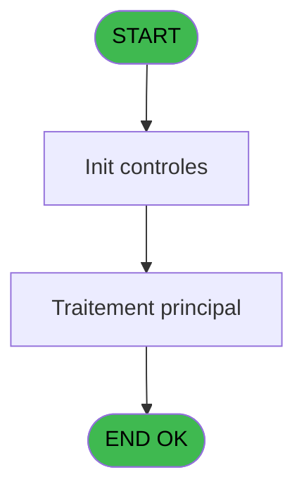

# PVE IDE 419 - Export Insurance

> **Analyse**: Phases 1-4 2026-02-03 20:02 -> 20:02 (11s) | Assemblage 20:02
> **Pipeline**: V7.2 Enrichi
> **Structure**: 4 onglets (Resume | Ecrans | Donnees | Connexions)

<!-- TAB:Resume -->

## 1. FICHE D'IDENTITE

| Attribut | Valeur |
|----------|--------|
| Projet | PVE |
| IDE Position | 419 |
| Nom Programme | Export Insurance |
| Fichier source | `Prg_419.xml` |
| Dossier IDE | A |
| Taches | 4 (0 ecrans visibles) |
| Tables modifiees | 0 |
| Programmes appeles | 1 |
| :warning: Statut | **ORPHELIN_POTENTIEL** |

## 2. DESCRIPTION FONCTIONNELLE

**Export Insurance** assure la gestion complete de ce processus.

Le flux de traitement s'organise en **3 blocs fonctionnels** :

- **Traitement** (2 taches) : traitements metier divers
- **Calcul** (1 tache) : calculs de montants, stocks ou compteurs
- **Consultation** (1 tache) : ecrans de recherche, selection et consultation

Detail : phases du traitement

#### Phase 1 : Traitement (2 taches)

- **419** - Export Insurance **[[ECRAN]](#ecran-t1)**
- **419.2** - Export SQL

Delegue a : [Get Temp Files (IDE 46)](PVE-IDE-46.md)

#### Phase 2 : Consultation (1 tache)

- **419.1** - SELECTION **[[ECRAN]](#ecran-t2)**

Delegue a : [Get Temp Files (IDE 46)](PVE-IDE-46.md)

#### Phase 3 : Calcul (1 tache)

- **419.1.1** - Selection compta

## 3. BLOCS FONCTIONNELS

### 3.1 Traitement (2 taches)

Traitements internes.

---

#### 419 - Export Insurance [[ECRAN]](#ecran-t1)

**Role** : Traitement : Export Insurance.
**Ecran** : 312 x 121 DLU (MDI) | [Voir mockup](#ecran-t1)
**Delegue a** : [Get Temp Files (IDE 46)](PVE-IDE-46.md)

---

#### 419.2 - Export SQL

**Role** : Traitement : Export SQL.
**Delegue a** : [Get Temp Files (IDE 46)](PVE-IDE-46.md)

### 3.2 Consultation (1 tache)

Ecrans de recherche et consultation.

---

#### 419.1 - SELECTION [[ECRAN]](#ecran-t2)

**Role** : Selection par l'operateur : SELECTION.
**Ecran** : 994 x 548 DLU (MDI) | [Voir mockup](#ecran-t2)

### 3.3 Calcul (1 tache)

Calculs metier : montants, stocks, compteurs.

---

#### 419.1.1 - Selection compta

**Role** : Selection par l'operateur : Selection compta.

## 5. REGLES METIER

*(Aucune regle metier identifiee)*

## 6. CONTEXTE

- **Appele par**: (aucun)
- **Appelle**: 1 programmes | **Tables**: 4 (W:0 R:2 L:2) | **Taches**: 4 | **Expressions**: 10

<!-- TAB:Ecrans -->

## 8. ECRANS

*(Programme sans ecran visible)*

## 9. NAVIGATION

### 9.3 Structure hierarchique (4 taches)

| Position | Tache | Type | Dimensions | Bloc |
|----------|-------|------|------------|------|
| **419.1** | [**Export Insurance** (419)](#t1) [mockup](#ecran-t1) | MDI | 312x121 | Traitement |
| 419.1.1 | [Export SQL (419.2)](#t4) | - | - | |
| **419.2** | [**SELECTION** (419.1)](#t2) [mockup](#ecran-t2) | MDI | 994x548 | Consultation |
| **419.3** | [**Selection compta** (419.1.1)](#t3) | MDI | - | Calcul |

### 9.4 Algorigramme

> **Legende**: Vert = START/END OK | Rouge = END KO | Bleu = Decisions
> *Algorigramme auto-genere. Utiliser `/algorigramme` pour une synthese metier detaillee.*

<!-- TAB:Donnees -->

## 10. TABLES

### Tables utilisees (4)

| ID | Nom | Description | Type | R | W | L | Usages |
|----|-----|-------------|------|---|---|---|--------|
| 30 | gm-recherche_____gmr | Index de recherche | DB | R |   |   | 1 |
| 523 | synthese_garanties | Depots et garanties | TMP | R |   |   | 1 |
| 1468 | Table_1468 |  | MEM |   |   | L | 1 |
| 1471 | Table_1471 |  | MEM |   |   | L | 1 |

### Colonnes par table (1 / 2 tables avec colonnes identifiees)

Table 30 - gm-recherche_____gmr (R) - 1 usages

| Lettre | Variable | Acces | Type |
|--------|----------|-------|------|
| A | v.lien Gm Recherce | R | Logical |
| B | V date debut sejour customer | R | Date |
| C | V date fin sejour customer | R | Date |

Table 523 - synthese_garanties (R) - 1 usages

*Table utilisee uniquement en Link ou aucune colonne Real identifiee dans le DataView.*

## 11. VARIABLES

### 11.1 Parametres entrants (2)

Variables recues en parametre.

| Lettre | Nom | Type | Usage dans |
|--------|-----|------|-----------|
| A | P Date mini | Date | - |
| B | P Date maxi | Date | - |

### 11.2 Variables de session (4)

Variables persistantes pendant toute la session.

| Lettre | Nom | Type | Usage dans |
|--------|-----|------|-----------|
| D | v is item selected | Logical | 2x session |
| E | v is Item Customer selected | Logical | - |
| F | v is Item Package selected | Logical | - |
| G | v is Item Account selected | Logical | - |

### 11.3 Autres (7)

Variables diverses.

| Lettre | Nom | Type | Usage dans |
|--------|-----|------|-----------|
| C | Delimiter | Alpha | - |
| H | prenom | Unicode | - |
| I | debut_sejour | Alpha | - |
| J | fin_sejour | Alpha | - |
| K | qualite | Unicode | - |
| L | lieu | Unicode | - |
| M | Code NA | Unicode | - |

## 12. EXPRESSIONS

**10 / 10 expressions decodees (100%)**

### 12.1 Repartition par type

| Type | Expressions | Regles |
|------|-------------|--------|
| CONSTANTE | 1 | 0 |
| CONCATENATION | 1 | 0 |
| NEGATION | 1 | 0 |
| OTHER | 4 | 0 |
| CAST_LOGIQUE | 3 | 0 |

### 12.2 Expressions cles par type

#### CONSTANTE (1 expressions)

| Type | IDE | Expression | Regle |
|------|-----|------------|-------|
| CONSTANTE | 5 | `2` | - |

#### CONCATENATION (1 expressions)

| Type | IDE | Expression | Regle |
|------|-----|------------|-------|
| CONCATENATION | 9 | `'Excel '&'%club_exportdata%'&'insurance_'&DStr (Date (),'YYYYMMDD')&'.csv'` | - |

#### NEGATION (1 expressions)

| Type | IDE | Expression | Regle |
|------|-----|------------|-------|
| NEGATION | 1 | `NOT (v is Item Customer sel... [E]) OR NOT(v is Item Package sele... [F]) OR NOT(v is Item Account sele... [G])` | - |

#### OTHER (4 expressions)

| Type | IDE | Expression | Regle |
|------|-----|------------|-------|
| OTHER | 7 | `NOT(v is item selected [D])` | - |
| OTHER | 10 | `NOT(VG90)` | - |
| OTHER | 2 | `INIGet ('[MAGIC_LOGICAL_NAMES]club_excel_separator')` | - |
| OTHER | 6 | `v is item selected [D]` | - |

#### CAST_LOGIQUE (3 expressions)

| Type | IDE | Expression | Regle |
|------|-----|------------|-------|
| CAST_LOGIQUE | 8 | `'TRUE'LOG` | - |
| CAST_LOGIQUE | 4 | `'FALSE'LOG` | - |
| CAST_LOGIQUE | 3 | `'TRUE'LOG` | - |

<!-- TAB:Connexions -->

## 13. GRAPHE D'APPELS

### 13.1 Chaine depuis Main (Callers)

**Chemin**: (pas de callers directs)

### 13.2 Callers

| IDE | Nom Programme | Nb Appels |
|-----|---------------|-----------|
| - | (aucun) | - |

### 13.3 Callees (programmes appeles)

### 13.4 Detail Callees avec contexte

| IDE | Nom Programme | Appels | Contexte |
|-----|---------------|--------|----------|
| [46](PVE-IDE-46.md) | Get Temp Files | 1 | Recuperation donnees |

## 14. RECOMMANDATIONS MIGRATION

### 14.1 Profil du programme

| Metrique | Valeur | Impact migration |
|----------|--------|-----------------|
| Lignes de logique | 95 | Programme compact |
| Expressions | 10 | Peu de logique |
| Tables WRITE | 0 | Impact faible |
| Sous-programmes | 1 | Peu de dependances |
| Ecrans visibles | 0 | Ecran unique ou traitement batch |
| Code desactive | 0% (0 / 95) | Code sain |
| Regles metier | 0 | Pas de regle identifiee |

### 14.2 Plan de migration par bloc

#### Traitement (2 taches: 1 ecran, 1 traitement)

- **Strategie** : Orchestrateur avec 1 ecrans (Razor/React) et 1 traitements backend (services).
- Les ecrans deviennent des composants UI, les traitements invisibles deviennent des services injectables.
- 1 sous-programme(s) a migrer ou a reutiliser depuis les services existants.
- Decomposer les taches en services unitaires testables.

#### Consultation (1 tache: 1 ecran, 0 traitement)

- **Strategie** : Composants de recherche/selection en modales.
- 1 ecran : SELECTION

#### Calcul (1 tache: 0 ecran, 1 traitement)

- **Strategie** : Services de calcul purs (Domain Services).
- Migrer la logique de calcul (stock, compteurs, montants)

### 14.3 Dependances critiques

| Dependance | Type | Appels | Impact |
|------------|------|--------|--------|
| [Get Temp Files (IDE 46)](PVE-IDE-46.md) | Sous-programme | 1x | Normale - Recuperation donnees |

---
*Spec DETAILED generee par Pipeline V7.2 - 2026-02-03 20:02*
