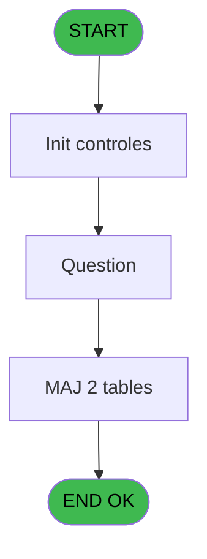
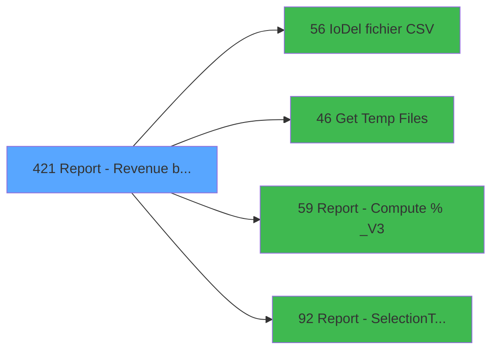

# PVE IDE 421 - Report - Revenue by Place *NU*

> **Analyse**: Phases 1-4 2026-02-03 20:03 -> 20:03 (12s) | Assemblage 20:03
> **Pipeline**: V7.2 Enrichi
> **Structure**: 4 onglets (Resume | Ecrans | Donnees | Connexions)

<!-- TAB:Resume -->

## 1. FICHE D'IDENTITE

| Attribut | Valeur |
|----------|--------|
| Projet | PVE |
| IDE Position | 421 |
| Nom Programme | Report - Revenue by Place *NU* |
| Fichier source | `Prg_421.xml` |
| Dossier IDE | A |
| Taches | 16 (1 ecrans visibles) |
| Tables modifiees | 2 |
| Programmes appeles | 4 |
| :warning: Statut | **ORPHELIN_POTENTIEL** |

## 2. DESCRIPTION FONCTIONNELLE

**Report - Revenue by Place *NU*** assure la gestion complete de ce processus.

Le flux de traitement s'organise en **3 blocs fonctionnels** :

- **Traitement** (9 taches) : traitements metier divers
- **Creation** (4 taches) : insertion d'enregistrements en base (mouvements, prestations)
- **Impression** (3 taches) : generation de tickets et documents

**Donnees modifiees** : 2 tables en ecriture (Table_1477, Table_1478).

Detail : phases du traitement

#### Phase 1 : Traitement (9 taches)

- **421** - Report - Revenue before tax **[[ECRAN]](#ecran-t1)**
- **421.1.1.1** - Lines
- **421.1.1.1.1** - Total
- **421.1.1.1.2.1** - Refund
- **421.1.1.2** - Details / Lieu **[[ECRAN]](#ecran-t8)**
- **421.1.1.3** - Details / Lieu **[[ECRAN]](#ecran-t9)**
- **421.1.2** - Details / Vendeur
- **421.1.3** - Details / Vendeur **[[ECRAN]](#ecran-t13)**
- **421.2** - Question **[[ECRAN]](#ecran-t16)**

Delegue a : [IoDel fichier CSV (IDE 56)](PVE-IDE-56.md), [Get Temp Files (IDE 46)](PVE-IDE-46.md), [Report - Compute % _V3 (IDE 59)](PVE-IDE-59.md)

#### Phase 2 : Impression (3 taches)

- **421.1** - Print
- **421.1.1** - EDITION
- **421.1.1.1.2** - Print Totaux

#### Phase 3 : Creation (4 taches)

- **421.1.2.1** - Creation
- **421.1.2.2** - Creation
- **421.1.3.1** - Creation
- **421.1.3.2** - Creation

#### Tables impactees

| Table | Operations | Role metier |
|-------|-----------|-------------|
| Table_1477 | **W**/L (3 usages) |  |
| Table_1478 | **W**/L (3 usages) |  |

## 3. BLOCS FONCTIONNELS

### 3.1 Traitement (9 taches)

Traitements internes.

---

#### 421 - Report - Revenue before tax [[ECRAN]](#ecran-t1)

**Role** : Tache d'orchestration : point d'entree du programme (9 sous-taches). Coordonne l'enchainement des traitements.
**Ecran** : 312 x 57 DLU (MDI) | [Voir mockup](#ecran-t1)

8 sous-taches directes

| Tache | Nom | Bloc |
|-------|-----|------|
| [421.1.1.1](#t4) | Lines | Traitement |
| [421.1.1.1.1](#t5) | Total | Traitement |
| [421.1.1.1.2.1](#t7) | Refund | Traitement |
| [421.1.1.2](#t8) | Details / Lieu **[[ECRAN]](#ecran-t8)** | Traitement |
| [421.1.1.3](#t9) | Details / Lieu **[[ECRAN]](#ecran-t9)** | Traitement |
| [421.1.2](#t10) | Details / Vendeur | Traitement |
| [421.1.3](#t13) | Details / Vendeur **[[ECRAN]](#ecran-t13)** | Traitement |
| [421.2](#t16) | Question **[[ECRAN]](#ecran-t16)** | Traitement |

**Delegue a** : [IoDel fichier CSV (IDE 56)](PVE-IDE-56.md), [Get Temp Files (IDE 46)](PVE-IDE-46.md), [Report - Compute % _V3 (IDE 59)](PVE-IDE-59.md)

---

#### 421.1.1.1 - Lines

**Role** : Traitement : Lines.
**Delegue a** : [IoDel fichier CSV (IDE 56)](PVE-IDE-56.md), [Get Temp Files (IDE 46)](PVE-IDE-46.md), [Report - Compute % _V3 (IDE 59)](PVE-IDE-59.md)

---

#### 421.1.1.1.1 - Total

**Role** : Traitement : Total.
**Delegue a** : [IoDel fichier CSV (IDE 56)](PVE-IDE-56.md), [Get Temp Files (IDE 46)](PVE-IDE-46.md), [Report - Compute % _V3 (IDE 59)](PVE-IDE-59.md)

---

#### 421.1.1.1.2.1 - Refund

**Role** : Traitement : Refund.
**Delegue a** : [IoDel fichier CSV (IDE 56)](PVE-IDE-56.md), [Get Temp Files (IDE 46)](PVE-IDE-46.md), [Report - Compute % _V3 (IDE 59)](PVE-IDE-59.md)

---

#### 421.1.1.2 - Details / Lieu [[ECRAN]](#ecran-t8)

**Role** : Traitement : Details / Lieu.
**Ecran** : 498 x 0 DLU | [Voir mockup](#ecran-t8)
**Variables liees** : L (v Edition Details/Place), M (v Edition Details/Place/Date), R (v Concatenation Prepaid et Lieu)
**Delegue a** : [IoDel fichier CSV (IDE 56)](PVE-IDE-56.md), [Get Temp Files (IDE 46)](PVE-IDE-46.md), [Report - Compute % _V3 (IDE 59)](PVE-IDE-59.md)

---

#### 421.1.1.3 - Details / Lieu [[ECRAN]](#ecran-t9)

**Role** : Traitement : Details / Lieu.
**Ecran** : 498 x 0 DLU | [Voir mockup](#ecran-t9)
**Variables liees** : L (v Edition Details/Place), M (v Edition Details/Place/Date), R (v Concatenation Prepaid et Lieu)
**Delegue a** : [IoDel fichier CSV (IDE 56)](PVE-IDE-56.md), [Get Temp Files (IDE 46)](PVE-IDE-46.md), [Report - Compute % _V3 (IDE 59)](PVE-IDE-59.md)

---

#### 421.1.2 - Details / Vendeur

**Role** : Traitement : Details / Vendeur.
**Variables liees** : L (v Edition Details/Place), M (v Edition Details/Place/Date)
**Delegue a** : [IoDel fichier CSV (IDE 56)](PVE-IDE-56.md), [Get Temp Files (IDE 46)](PVE-IDE-46.md), [Report - Compute % _V3 (IDE 59)](PVE-IDE-59.md)

---

#### 421.1.3 - Details / Vendeur [[ECRAN]](#ecran-t13)

**Role** : Traitement : Details / Vendeur.
**Ecran** : 526 x 0 DLU | [Voir mockup](#ecran-t13)
**Variables liees** : L (v Edition Details/Place), M (v Edition Details/Place/Date)
**Delegue a** : [IoDel fichier CSV (IDE 56)](PVE-IDE-56.md), [Get Temp Files (IDE 46)](PVE-IDE-46.md), [Report - Compute % _V3 (IDE 59)](PVE-IDE-59.md)

---

#### 421.2 - Question [[ECRAN]](#ecran-t16)

**Role** : Traitement : Question.
**Ecran** : 469 x 154 DLU | [Voir mockup](#ecran-t16)
**Delegue a** : [IoDel fichier CSV (IDE 56)](PVE-IDE-56.md), [Get Temp Files (IDE 46)](PVE-IDE-46.md), [Report - Compute % _V3 (IDE 59)](PVE-IDE-59.md)

### 3.2 Impression (3 taches)

Generation des documents et tickets.

---

#### 421.1 - Print

**Role** : Generation du document : Print.

---

#### 421.1.1 - EDITION

**Role** : Generation du document : EDITION.
**Variables liees** : L (v Edition Details/Place), M (v Edition Details/Place/Date), N (v Edition Synthese)

---

#### 421.1.1.1.2 - Print Totaux

**Role** : Generation du document : Print Totaux.

### 3.3 Creation (4 taches)

Insertion de nouveaux enregistrements en base.

---

#### 421.1.2.1 - Creation

**Role** : Creation d'enregistrement : Creation.

---

#### 421.1.2.2 - Creation

**Role** : Creation d'enregistrement : Creation.

---

#### 421.1.3.1 - Creation

**Role** : Creation d'enregistrement : Creation.

---

#### 421.1.3.2 - Creation

**Role** : Creation d'enregistrement : Creation.

## 5. REGLES METIER

*(Aucune regle metier identifiee)*

## 6. CONTEXTE

- **Appele par**: (aucun)
- **Appelle**: 4 programmes | **Tables**: 9 (W:2 R:3 L:8) | **Taches**: 16 | **Expressions**: 6

<!-- TAB:Ecrans -->

## 8. ECRANS

### 8.1 Forms visibles (1 / 16)

| # | Position | Tache | Nom | Type | Largeur | Hauteur | Bloc |
|---|----------|-------|-----|------|---------|---------|------|
| 1 | 421.2 | 421.2 | Question | Type0 | 469 | 154 | Traitement |

### 8.2 Mockups Ecrans

---

#### 421.2 - Question
**Tache** : [421.2](#t16) | **Type** : Type0 | **Dimensions** : 469 x 154 DLU
**Bloc** : Traitement | **Titre IDE** : Question

<!-- FORM-DATA:
{
    "width":  469,
    "vFactor":  8,
    "type":  "Type0",
    "hFactor":  4,
    "controls":  [
                     {
                         "x":  5,
                         "type":  "label",
                         "var":  "",
                         "y":  4,
                         "w":  458,
                         "fmt":  "",
                         "name":  "",
                         "h":  19,
                         "color":  "",
                         "text":  "",
                         "parent":  null
                     },
                     {
                         "x":  5,
                         "type":  "label",
                         "var":  "",
                         "y":  27,
                         "w":  460,
                         "fmt":  "",
                         "name":  "",
                         "h":  86,
                         "color":  "189",
                         "text":  "",
                         "parent":  null
                     },
                     {
                         "x":  10,
                         "type":  "label",
                         "var":  "",
                         "y":  40,
                         "w":  187,
                         "fmt":  "",
                         "name":  "",
                         "h":  14,
                         "color":  "189",
                         "text":  "Print  Report By  Place",
                         "parent":  null
                     },
                     {
                         "x":  10,
                         "type":  "label",
                         "var":  "",
                         "y":  61,
                         "w":  384,
                         "fmt":  "",
                         "name":  "",
                         "h":  14,
                         "color":  "189",
                         "text":  "Print Report  by  Place / Date / Category / Sub-Category ?",
                         "parent":  null
                     },
                     {
                         "x":  8,
                         "type":  "label",
                         "var":  "",
                         "y":  82,
                         "w":  339,
                         "fmt":  "",
                         "name":  "",
                         "h":  14,
                         "color":  "189",
                         "text":  "Print Report  by  Place / Category / Sub-Category ?",
                         "parent":  null
                     },
                     {
                         "x":  12,
                         "type":  "edit",
                         "var":  "",
                         "y":  9,
                         "w":  192,
                         "fmt":  "30",
                         "name":  "",
                         "h":  8,
                         "color":  "",
                         "text":  "",
                         "parent":  1
                     },
                     {
                         "x":  237,
                         "type":  "edit",
                         "var":  "",
                         "y":  11,
                         "w":  219,
                         "fmt":  "WWW DD MMM YYYYT",
                         "name":  "",
                         "h":  8,
                         "color":  "",
                         "text":  "",
                         "parent":  1
                     },
                     {
                         "x":  401,
                         "type":  "combobox",
                         "var":  "",
                         "y":  40,
                         "w":  56,
                         "fmt":  "",
                         "name":  "v Edition Synthese_0001",
                         "h":  12,
                         "color":  "",
                         "text":  "Yes,No",
                         "parent":  null
                     },
                     {
                         "x":  401,
                         "type":  "combobox",
                         "var":  "",
                         "y":  61,
                         "w":  56,
                         "fmt":  "",
                         "name":  "Details/Vendeur/Date",
                         "h":  14,
                         "color":  "",
                         "text":  "Yes,No",
                         "parent":  null
                     },
                     {
                         "x":  401,
                         "type":  "combobox",
                         "var":  "",
                         "y":  82,
                         "w":  56,
                         "fmt":  "",
                         "name":  "v Edition Details",
                         "h":  12,
                         "color":  "",
                         "text":  "Yes,No",
                         "parent":  null
                     },
                     {
                         "x":  195,
                         "type":  "button",
                         "var":  "",
                         "y":  124,
                         "w":  79,
                         "fmt":  "OK",
                         "name":  "",
                         "h":  24,
                         "color":  "",
                         "text":  "",
                         "parent":  null
                     }
                 ],
    "taskId":  "421.2",
    "height":  154
}
-->

<strong>Champs : 5 champs</strong>

| Pos (x,y) | Nom | Variable | Type |
|-----------|-----|----------|------|
| 12,9 | 30 | - | edit |
| 237,11 | WWW DD MMM YYYYT | - | edit |
| 401,40 | v Edition Synthese_0001 | - | combobox |
| 401,61 | Details/Vendeur/Date | - | combobox |
| 401,82 | v Edition Details | - | combobox |

<strong>Boutons : 1 boutons</strong>

| Bouton | Pos (x,y) | Action |
|--------|-----------|--------|
| OK | 195,124 | Valide la saisie et enregistre |

## 9. NAVIGATION

Ecran unique: **Question**

### 9.3 Structure hierarchique (16 taches)

| Position | Tache | Type | Dimensions | Bloc |
|----------|-------|------|------------|------|
| **421.1** | [**Report - Revenue before tax** (421)](#t1) [mockup](#ecran-t1) | MDI | 312x57 | Traitement |
| 421.1.1 | [Lines (421.1.1.1)](#t4) | MDI | - | |
| 421.1.2 | [Total (421.1.1.1.1)](#t5) | MDI | - | |
| 421.1.3 | [Refund (421.1.1.1.2.1)](#t7) | MDI | - | |
| 421.1.4 | [Details / Lieu (421.1.1.2)](#t8) [mockup](#ecran-t8) | - | 498x0 | |
| 421.1.5 | [Details / Lieu (421.1.1.3)](#t9) [mockup](#ecran-t9) | - | 498x0 | |
| 421.1.6 | [Details / Vendeur (421.1.2)](#t10) | - | - | |
| 421.1.7 | [Details / Vendeur (421.1.3)](#t13) [mockup](#ecran-t13) | - | 526x0 | |
| 421.1.8 | [Question (421.2)](#t16) [mockup](#ecran-t16) | - | 469x154 | |
| **421.2** | [**Print** (421.1)](#t2) | MDI | - | Impression |
| 421.2.1 | [EDITION (421.1.1)](#t3) | MDI | - | |
| 421.2.2 | [Print Totaux (421.1.1.1.2)](#t6) | MDI | - | |
| **421.3** | [**Creation** (421.1.2.1)](#t11) | - | - | Creation |
| 421.3.1 | [Creation (421.1.2.2)](#t12) | - | - | |
| 421.3.2 | [Creation (421.1.3.1)](#t14) | - | - | |
| 421.3.3 | [Creation (421.1.3.2)](#t15) | - | - | |

### 9.4 Algorigramme

> **Legende**: Vert = START/END OK | Rouge = END KO | Bleu = Decisions
> *Algorigramme auto-genere. Utiliser `/algorigramme` pour une synthese metier detaillee.*

<!-- TAB:Donnees -->

## 10. TABLES

### Tables utilisees (9)

| ID | Nom | Description | Type | R | W | L | Usages |
|----|-----|-------------|------|---|---|---|--------|
| 379 | pv_customer_temp |  | DB | R |   |   | 4 |
| 413 | pv_tva |  | DB |   |   | L | 4 |
| 523 | synthese_garanties | Depots et garanties | TMP |   |   | L | 3 |
| 765 | tranche_age |  | DB |   |   | L | 1 |
| 766 | temp_forfait_ski |  | DB | R |   | L | 3 |
| 1461 | Table_1461 |  | MEM | R |   | L | 3 |
| 1471 | Table_1471 |  | MEM |   |   | L | 2 |
| 1477 | Table_1477 |  | MEM |   | **W** | L | 3 |
| 1478 | Table_1478 |  | MEM |   | **W** | L | 3 |

### Colonnes par table (4 / 5 tables avec colonnes identifiees)

Table 379 - pv_customer_temp (R) - 4 usages

| Lettre | Variable | Acces | Type |
|--------|----------|-------|------|
| A | v Total Lieu_ttc | R | Numeric |
| B | v Total Categorie_ttc | R | Numeric |
| C | v Total SousCatégorie_ttc | R | Numeric |
| D | v Total Lieu_ht | R | Numeric |
| E | v Total Categorie_ht | R | Numeric |
| F | v Total SousCatégorie_ht | R | Numeric |
| G | v Total Lieu_tva | R | Numeric |
| H | v Total Categorie_tva | R | Numeric |
| I | v Total SousCatégorie_tva | R | Numeric |
| J | v Total ttc PrepaidorNot | R | Numeric |
| K | v Total ht PrepaidorNot | R | Numeric |
| L | v Total tva PrepaidorNot | R | Numeric |
| M | V Cellule Vide | R | Alpha |
| N | v CompteurAffichS/Cat | R | Numeric |
| O | v Concatenation Prepaid et Lieu | R | Alpha |
| P | V Cellule Vide | R | Alpha |
| Q | v Affichage Libellé S/Cat | R | Numeric |
| R | v Concatenation Prepaid et Lieu | R | Alpha |

Table 766 - temp_forfait_ski (R/L) - 3 usages

| Lettre | Variable | Acces | Type |
|--------|----------|-------|------|
| A | Total Lieu | R | Numeric |
| B | Total lieu HT | R | Numeric |
| C | Total lieu TTC | R | Numeric |
| D | Total lieu TVA | R | Numeric |
| E | Total PREPAID HT | R | Numeric |
| F | Total PREPAID TTC | R | Numeric |
| G | Total PREPAID TVA | R | Numeric |

Table 1461 - Table_1461 (R/L) - 3 usages

| Lettre | Variable | Acces | Type |
|--------|----------|-------|------|
| A | Total location | R | Numeric |
| B | Total location HT | R | Numeric |
| C | Total location TTC | R | Numeric |
| D | Total location TVA | R | Numeric |
| E | Total General | R | Numeric |
| F | Total PREPAID HT | R | Numeric |
| G | Total PREPAID TTC | R | Numeric |
| H | Total PREPAIDTVA | R | Numeric |
| I | Total General HT | R | Numeric |
| J | Total General TTC | R | Numeric |
| K | Total General TVA | R | Numeric |

Table 1477 - Table_1477 (**W**/L) - 3 usages

*Table utilisee uniquement en Link ou aucune colonne Real identifiee dans le DataView.*

Table 1478 - Table_1478 (**W**/L) - 3 usages

*Table utilisee uniquement en Link ou aucune colonne Real identifiee dans le DataView.*

## 11. VARIABLES

### 11.1 Parametres entrants (9)

Variables recues en parametre.

| Lettre | Nom | Type | Usage dans |
|--------|-----|------|-----------|
| A | P. Village Name | Alpha | - |
| B | P. Currency | Alpha | - |
| C | P. Masque | Alpha | - |
| D | P. Masque sans Z | Alpha | - |
| E | P. Decimales | Numeric | - |
| F | P Date mini | Date | - |
| G | P Date maxi | Date | 1x parametre entrant |
| H | P Période nombre JH | Numeric | - |
| I | P Jours période | Numeric | - |

### 11.2 Variables de session (7)

Variables persistantes pendant toute la session.

| Lettre | Nom | Type | Usage dans |
|--------|-----|------|-----------|
| L | v Edition Details/Place | Logical | - |
| M | v Edition Details/Place/Date | Logical | - |
| N | v Edition Synthese | Logical | - |
| O | v.NomFichierPdf | Alpha | 1x session |
| P | V Cellule Vide | Alpha | - |
| Q | v Affichage Libellé S/Cat | Numeric | - |
| R | v Concatenation Prepaid et Lieu | Alpha | - |

### 11.3 Autres (2)

Variables diverses.

| Lettre | Nom | Type | Usage dans |
|--------|-----|------|-----------|
| J | Param Mode Global / Détail | Alpha | - |
| K | S | Alpha | 1x refs |

Toutes les 18 variables (liste complete)

| Cat | Lettre | Nom Variable | Type |
|-----|--------|--------------|------|
| P0 | **A** | P. Village Name | Alpha |
| P0 | **B** | P. Currency | Alpha |
| P0 | **C** | P. Masque | Alpha |
| P0 | **D** | P. Masque sans Z | Alpha |
| P0 | **E** | P. Decimales | Numeric |
| P0 | **F** | P Date mini | Date |
| P0 | **G** | P Date maxi | Date |
| P0 | **H** | P Période nombre JH | Numeric |
| P0 | **I** | P Jours période | Numeric |
| V. | **L** | v Edition Details/Place | Logical |
| V. | **M** | v Edition Details/Place/Date | Logical |
| V. | **N** | v Edition Synthese | Logical |
| V. | **O** | v.NomFichierPdf | Alpha |
| V. | **P** | V Cellule Vide | Alpha |
| V. | **Q** | v Affichage Libellé S/Cat | Numeric |
| V. | **R** | v Concatenation Prepaid et Lieu | Alpha |
| Autre | **J** | Param Mode Global / Détail | Alpha |
| Autre | **K** | S | Alpha |

## 12. EXPRESSIONS

**6 / 6 expressions decodees (100%)**

### 12.1 Repartition par type

| Type | Expressions | Regles |
|------|-------------|--------|
| CONDITION | 1 | 0 |
| CONSTANTE | 1 | 0 |
| CONCATENATION | 1 | 0 |
| REFERENCE_VG | 1 | 0 |
| NEGATION | 1 | 0 |
| STRING | 1 | 0 |

### 12.2 Expressions cles par type

#### CONDITION (1 expressions)

| Type | IDE | Expression | Regle |
|------|-----|------------|-------|
| CONDITION | 1 | `P Date maxi [G]<>'00/00/0000'DATE` | - |

#### CONSTANTE (1 expressions)

| Type | IDE | Expression | Regle |
|------|-----|------------|-------|
| CONSTANTE | 2 | `'D'` | - |

#### CONCATENATION (1 expressions)

| Type | IDE | Expression | Regle |
|------|-----|------------|-------|
| CONCATENATION | 4 | `Translate ('%club_exportdata%')&Trim (GetParam ('VILLAGECODE'))&Trim (GetParam ('SERVICE'))&'_REVENUE_BY_SALE_PLACE_'&DStr (Date(),'YYYYMMDD')&'_'&TStr (Time(),'HHMMSS')&'.Pdf'` | - |

#### REFERENCE_VG (1 expressions)

| Type | IDE | Expression | Regle |
|------|-----|------------|-------|
| REFERENCE_VG | 3 | `VG37` | - |

#### NEGATION (1 expressions)

| Type | IDE | Expression | Regle |
|------|-----|------------|-------|
| NEGATION | 6 | `NOT (GetParam ('Output')='Printer')` | - |

#### STRING (1 expressions)

| Type | IDE | Expression | Regle |
|------|-----|------------|-------|
| STRING | 5 | `FileDelete (Trim(v.NomFichierPdf [O]))` | - |

<!-- TAB:Connexions -->

## 13. GRAPHE D'APPELS

### 13.1 Chaine depuis Main (Callers)

**Chemin**: (pas de callers directs)

### 13.2 Callers

| IDE | Nom Programme | Nb Appels |
|-----|---------------|-----------|
| - | (aucun) | - |

### 13.3 Callees (programmes appeles)

### 13.4 Detail Callees avec contexte

| IDE | Nom Programme | Appels | Contexte |
|-----|---------------|--------|----------|
| [56](PVE-IDE-56.md) | IoDel fichier CSV | 2 | Sous-programme |
| [46](PVE-IDE-46.md) | Get Temp Files | 1 | Recuperation donnees |
| [59](PVE-IDE-59.md) | Report - Compute % _V3 | 1 | Sous-programme |
| [92](PVE-IDE-92.md) | Report - Selection/Tempo | 1 | Selection/consultation |

## 14. RECOMMANDATIONS MIGRATION

### 14.1 Profil du programme

| Metrique | Valeur | Impact migration |
|----------|--------|-----------------|
| Lignes de logique | 717 | Programme volumineux |
| Expressions | 6 | Peu de logique |
| Tables WRITE | 2 | Impact faible |
| Sous-programmes | 4 | Peu de dependances |
| Ecrans visibles | 1 | Ecran unique ou traitement batch |
| Code desactive | 0.6% (4 / 717) | Code sain |
| Regles metier | 0 | Pas de regle identifiee |

### 14.2 Plan de migration par bloc

#### Traitement (9 taches: 5 ecrans, 4 traitements)

- **Strategie** : Orchestrateur avec 5 ecrans (Razor/React) et 4 traitements backend (services).
- Les ecrans deviennent des composants UI, les traitements invisibles deviennent des services injectables.
- 4 sous-programme(s) a migrer ou a reutiliser depuis les services existants.
- Decomposer les taches en services unitaires testables.

#### Impression (3 taches: 0 ecran, 3 traitements)

- **Strategie** : Templates HTML -> PDF via wkhtmltopdf ou Puppeteer.
- `PrintService` injectable avec choix imprimante

#### Creation (4 taches: 0 ecran, 4 traitements)

- **Strategie** : Repository pattern avec Entity Framework Core.
- Insertion via `IRepository<T>.CreateAsync()`

### 14.3 Dependances critiques

| Dependance | Type | Appels | Impact |
|------------|------|--------|--------|
| Table_1477 | Table WRITE (Memory) | 2x | Schema + repository |
| Table_1478 | Table WRITE (Memory) | 2x | Schema + repository |
| [IoDel fichier CSV (IDE 56)](PVE-IDE-56.md) | Sous-programme | 2x | Haute - Sous-programme |
| [Report - Selection/Tempo (IDE 92)](PVE-IDE-92.md) | Sous-programme | 1x | Normale - Selection/consultation |
| [Report - Compute % _V3 (IDE 59)](PVE-IDE-59.md) | Sous-programme | 1x | Normale - Sous-programme |
| [Get Temp Files (IDE 46)](PVE-IDE-46.md) | Sous-programme | 1x | Normale - Recuperation donnees |

---
*Spec DETAILED generee par Pipeline V7.2 - 2026-02-03 20:03*
