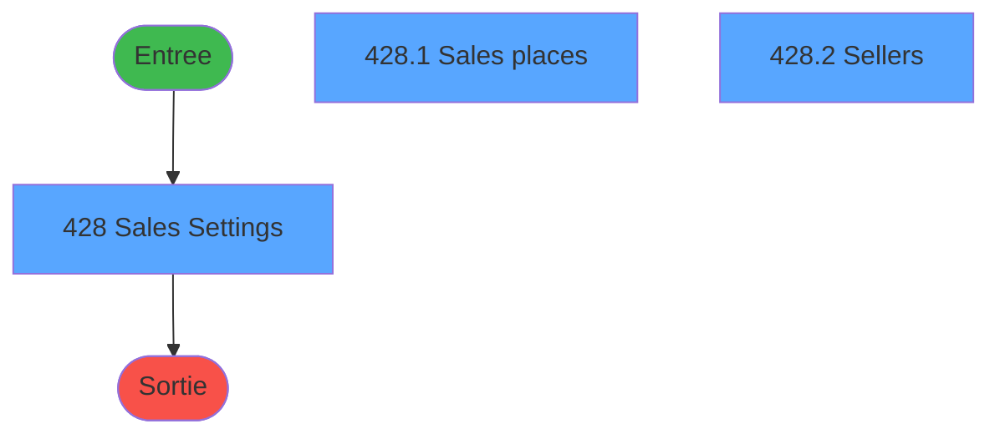
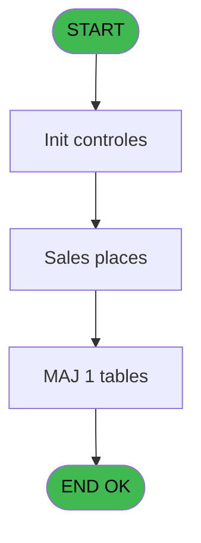
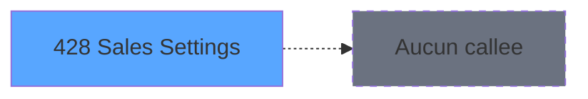

# PVE IDE 428 - Sales Settings

> **Analyse**: Phases 1-4 2026-02-03 20:05 -> 20:05 (15s) | Assemblage 20:05
> **Pipeline**: V7.2 Enrichi
> **Structure**: 4 onglets (Resume | Ecrans | Donnees | Connexions)

<!-- TAB:Resume -->

## 1. FICHE D'IDENTITE

| Attribut | Valeur |
|----------|--------|
| Projet | PVE |
| IDE Position | 428 |
| Nom Programme | Sales Settings |
| Fichier source | `Prg_428.xml` |
| Dossier IDE | A |
| Taches | 3 (3 ecrans visibles) |
| Tables modifiees | 1 |
| Programmes appeles | 0 |
| :warning: Statut | **ORPHELIN_POTENTIEL** |

## 2. DESCRIPTION FONCTIONNELLE

**Sales Settings** assure la gestion complete de ce processus.

Le flux de traitement s'organise en **1 blocs fonctionnels** :

- **Traitement** (3 taches) : traitements metier divers

**Donnees modifiees** : 1 tables en ecriture (code_reduction).

**Logique metier** : 1 regles identifiees couvrant conditions metier.

## 3. BLOCS FONCTIONNELS

### 3.1 Traitement (3 taches)

Traitements internes.

---

#### 428 - Sales Settings [[ECRAN]](#ecran-t1)

**Role** : Traitement : Sales Settings.
**Ecran** : 661 x 411 DLU (MDI) | [Voir mockup](#ecran-t1)

---

#### 428.1 - Sales places [[ECRAN]](#ecran-t2)

**Role** : Traitement : Sales places.
**Ecran** : 633 x 120 DLU | [Voir mockup](#ecran-t2)

---

#### 428.2 - Sellers [[ECRAN]](#ecran-t3)

**Role** : Traitement : Sellers.
**Ecran** : 639 x 120 DLU | [Voir mockup](#ecran-t3)

## 5. REGLES METIER

1 regles identifiees:

### Autres (1 regles)

#### [RM-001] Si V.Actif ? (Logique) [E]='A' alors '' sinon V.Actif ? (Logique) [E])

| Element | Detail |
|---------|--------|
| **Condition** | `V.Actif ? (Logique) [E]='A'` |
| **Si vrai** | '' |
| **Si faux** | V.Actif ? (Logique) [E]) |
| **Variables** | E (V.Actif ? (Logique)) |
| **Expression source** | Expression 4 : `IF(V.Actif ? (Logique) [E]='A','',V.Actif ? (Logique) [E])` |
| **Exemple** | Si V.Actif ? (Logique) [E]='A' → ''. Sinon → V.Actif ? (Logique) [E]) |

## 6. CONTEXTE

- **Appele par**: (aucun)
- **Appelle**: 0 programmes | **Tables**: 5 (W:1 R:1 L:3) | **Taches**: 3 | **Expressions**: 4

<!-- TAB:Ecrans -->

## 8. ECRANS

### 8.1 Forms visibles (3 / 3)

| # | Position | Tache | Nom | Type | Largeur | Hauteur | Bloc |
|---|----------|-------|-----|------|---------|---------|------|
| 1 | 428 | 428 | Sales Settings | MDI | 661 | 411 | Traitement |
| 2 | 428.1 | 428.1 | Sales places | Type0 | 633 | 120 | Traitement |
| 3 | 428.2 | 428.2 | Sellers | Type0 | 639 | 120 | Traitement |

### 8.2 Mockups Ecrans

---

#### 428 - Sales Settings
**Tache** : [428](#t1) | **Type** : MDI | **Dimensions** : 661 x 411 DLU
**Bloc** : Traitement | **Titre IDE** : Sales Settings

<!-- FORM-DATA:
{
    "width":  661,
    "vFactor":  8,
    "type":  "MDI",
    "hFactor":  4,
    "controls":  [
                     {
                         "x":  1,
                         "type":  "label",
                         "var":  "",
                         "y":  0,
                         "w":  598,
                         "fmt":  "",
                         "name":  "",
                         "h":  29,
                         "color":  "182",
                         "text":  "",
                         "parent":  null
                     },
                     {
                         "x":  14,
                         "type":  "label",
                         "var":  "",
                         "y":  10,
                         "w":  102,
                         "fmt":  "",
                         "name":  "",
                         "h":  10,
                         "color":  "186",
                         "text":  "Sales Settings",
                         "parent":  2
                     },
                     {
                         "x":  147,
                         "type":  "label",
                         "var":  "",
                         "y":  10,
                         "w":  53,
                         "fmt":  "",
                         "name":  "",
                         "h":  10,
                         "color":  "186",
                         "text":  "Service :",
                         "parent":  2
                     },
                     {
                         "x":  4,
                         "type":  "label",
                         "var":  "",
                         "y":  46,
                         "w":  651,
                         "fmt":  "",
                         "name":  "",
                         "h":  139,
                         "color":  "187",
                         "text":  "Sales Places",
                         "parent":  null
                     },
                     {
                         "x":  4,
                         "type":  "label",
                         "var":  "",
                         "y":  202,
                         "w":  651,
                         "fmt":  "",
                         "name":  "",
                         "h":  176,
                         "color":  "187",
                         "text":  "Sellers",
                         "parent":  null
                     },
                     {
                         "x":  3,
                         "type":  "label",
                         "var":  "",
                         "y":  378,
                         "w":  650,
                         "fmt":  "",
                         "name":  "",
                         "h":  32,
                         "color":  "183",
                         "text":  "",
                         "parent":  null
                     },
                     {
                         "x":  606,
                         "type":  "image",
                         "var":  "",
                         "y":  2,
                         "w":  48,
                         "fmt":  "",
                         "name":  "",
                         "h":  36,
                         "color":  "",
                         "text":  "",
                         "parent":  2
                     },
                     {
                         "x":  573,
                         "type":  "button",
                         "var":  "",
                         "y":  383,
                         "w":  77,
                         "fmt":  "\u0026Exit",
                         "name":  "Bt.Quitter",
                         "h":  26,
                         "color":  "",
                         "text":  "",
                         "parent":  null
                     },
                     {
                         "x":  9,
                         "type":  "checkbox",
                         "var":  "",
                         "y":  31,
                         "w":  178,
                         "fmt":  "",
                         "name":  "V Preview",
                         "h":  15,
                         "color":  "187",
                         "text":  "Manage Sales Places ?",
                         "parent":  null
                     },
                     {
                         "x":  9,
                         "type":  "checkbox",
                         "var":  "",
                         "y":  186,
                         "w":  178,
                         "fmt":  "",
                         "name":  "V Show Printers",
                         "h":  14,
                         "color":  "187",
                         "text":  "Manage Sellers ?",
                         "parent":  null
                     },
                     {
                         "x":  9,
                         "type":  "subform",
                         "var":  "",
                         "y":  57,
                         "w":  642,
                         "fmt":  "",
                         "name":  "Sales places",
                         "h":  123,
                         "color":  "",
                         "text":  "",
                         "parent":  null
                     },
                     {
                         "x":  9,
                         "type":  "subform",
                         "var":  "",
                         "y":  233,
                         "w":  642,
                         "fmt":  "",
                         "name":  "Sellers",
                         "h":  142,
                         "color":  "",
                         "text":  "",
                         "parent":  null
                     },
                     {
                         "x":  201,
                         "type":  "edit",
                         "var":  "",
                         "y":  10,
                         "w":  35,
                         "fmt":  "4",
                         "name":  "",
                         "h":  10,
                         "color":  "186",
                         "text":  "",
                         "parent":  2
                     },
                     {
                         "x":  243,
                         "type":  "edit",
                         "var":  "",
                         "y":  10,
                         "w":  216,
                         "fmt":  "30",
                         "name":  "",
                         "h":  10,
                         "color":  "186",
                         "text":  "",
                         "parent":  2
                     },
                     {
                         "x":  243,
                         "type":  "combobox",
                         "var":  "",
                         "y":  210,
                         "w":  173,
                         "fmt":  "",
                         "name":  "v.STATUT",
                         "h":  23,
                         "color":  "103",
                         "text":  "A,O,N",
                         "parent":  null
                     }
                 ],
    "taskId":  "428",
    "height":  411
}
-->

<strong>Champs : 5 champs</strong>

| Pos (x,y) | Nom | Variable | Type |
|-----------|-----|----------|------|
| 9,31 | V Preview | - | checkbox |
| 9,186 | V Show Printers | - | checkbox |
| 201,10 | 4 | - | edit |
| 243,10 | 30 | - | edit |
| 243,210 | v.STATUT | - | combobox |

<strong>Boutons : 1 boutons</strong>

| Bouton | Pos (x,y) | Action |
|--------|-----------|--------|
| Exit | 573,383 | Quitte le programme |

---

#### 428.1 - Sales places
**Tache** : [428.1](#t2) | **Type** : Type0 | **Dimensions** : 633 x 120 DLU
**Bloc** : Traitement | **Titre IDE** : Sales places

<!-- FORM-DATA:
{
    "width":  633,
    "vFactor":  8,
    "type":  "Type0",
    "hFactor":  4,
    "controls":  [
                     {
                         "x":  531,
                         "type":  "label",
                         "var":  "",
                         "y":  0,
                         "w":  73,
                         "fmt":  "",
                         "name":  "",
                         "h":  13,
                         "color":  "183",
                         "text":  "Active place ?",
                         "parent":  null
                     },
                     {
                         "x":  8,
                         "type":  "label",
                         "var":  "",
                         "y":  2,
                         "w":  53,
                         "fmt":  "",
                         "name":  "",
                         "h":  13,
                         "color":  "183",
                         "text":  "Code",
                         "parent":  null
                     },
                     {
                         "x":  74,
                         "type":  "label",
                         "var":  "",
                         "y":  2,
                         "w":  96,
                         "fmt":  "",
                         "name":  "",
                         "h":  13,
                         "color":  "183",
                         "text":  "Name",
                         "parent":  null
                     },
                     {
                         "x":  3,
                         "type":  "table",
                         "var":  "",
                         "name":  "",
                         "titleH":  12,
                         "color":  "110",
                         "w":  584,
                         "y":  14,
                         "fmt":  "",
                         "parent":  null,
                         "text":  "",
                         "rowH":  18,
                         "h":  79,
                         "cols":  [
                                      {
                                          "title":  "",
                                          "layer":  1,
                                          "w":  65
                                      },
                                      {
                                          "title":  "",
                                          "layer":  2,
                                          "w":  461
                                      },
                                      {
                                          "title":  "",
                                          "layer":  3,
                                          "w":  44
                                      }
                                  ],
                         "rows":  3
                     },
                     {
                         "x":  2,
                         "type":  "label",
                         "var":  "",
                         "y":  90,
                         "w":  630,
                         "fmt":  "",
                         "name":  "",
                         "h":  25,
                         "color":  "6",
                         "text":  "",
                         "parent":  null
                     },
                     {
                         "x":  8,
                         "type":  "edit",
                         "var":  "",
                         "y":  19,
                         "w":  58,
                         "fmt":  "",
                         "name":  "CODE_LIEU",
                         "h":  12,
                         "color":  "110",
                         "text":  "",
                         "parent":  4
                     },
                     {
                         "x":  73,
                         "type":  "edit",
                         "var":  "",
                         "y":  18,
                         "w":  386,
                         "fmt":  "",
                         "name":  "LIBELLE_LIEU",
                         "h":  12,
                         "color":  "110",
                         "text":  "",
                         "parent":  4
                     },
                     {
                         "x":  550,
                         "type":  "checkbox",
                         "var":  "",
                         "y":  20,
                         "w":  12,
                         "fmt":  "",
                         "name":  "v.Lieu (Logique)",
                         "h":  9,
                         "color":  "110",
                         "text":  "",
                         "parent":  4
                     },
                     {
                         "x":  587,
                         "type":  "button",
                         "var":  "",
                         "y":  14,
                         "w":  44,
                         "fmt":  "ñ",
                         "name":  "",
                         "h":  37,
                         "color":  "",
                         "text":  "",
                         "parent":  null
                     },
                     {
                         "x":  587,
                         "type":  "button",
                         "var":  "",
                         "y":  51,
                         "w":  44,
                         "fmt":  "ò",
                         "name":  "",
                         "h":  37,
                         "color":  "",
                         "text":  "",
                         "parent":  null
                     },
                     {
                         "x":  4,
                         "type":  "button",
                         "var":  "",
                         "y":  96,
                         "w":  78,
                         "fmt":  "\u0026Modify mode",
                         "name":  "",
                         "h":  18,
                         "color":  "",
                         "text":  "",
                         "parent":  null
                     },
                     {
                         "x":  82,
                         "type":  "button",
                         "var":  "",
                         "y":  96,
                         "w":  77,
                         "fmt":  "\u0026Add",
                         "name":  "",
                         "h":  18,
                         "color":  "",
                         "text":  "",
                         "parent":  null
                     },
                     {
                         "x":  159,
                         "type":  "button",
                         "var":  "",
                         "y":  96,
                         "w":  77,
                         "fmt":  "\u0026Delete",
                         "name":  "",
                         "h":  18,
                         "color":  "",
                         "text":  "",
                         "parent":  null
                     },
                     {
                         "x":  235,
                         "type":  "button",
                         "var":  "",
                         "y":  96,
                         "w":  77,
                         "fmt":  "\u0026Cancel",
                         "name":  "",
                         "h":  18,
                         "color":  "",
                         "text":  "",
                         "parent":  null
                     }
                 ],
    "taskId":  "428.1",
    "height":  120
}
-->

<strong>Champs : 3 champs</strong>

| Pos (x,y) | Nom | Variable | Type |
|-----------|-----|----------|------|
| 8,19 | CODE_LIEU | - | edit |
| 73,18 | LIBELLE_LIEU | - | edit |
| 550,20 | v.Lieu (Logique) | - | checkbox |

<strong>Boutons : 6 boutons</strong>

| Bouton | Pos (x,y) | Action |
|--------|-----------|--------|
| ñ | 587,14 | Bouton fonctionnel |
| ò | 587,51 | Bouton fonctionnel |
| Modify mode | 4,96 | Modifie l'element |
| Add | 82,96 | Ajoute un element |
| Delete | 159,96 | Supprime l'element selectionne |
| Cancel | 235,96 | Annule et retour au menu |

---

#### 428.2 - Sellers
**Tache** : [428.2](#t3) | **Type** : Type0 | **Dimensions** : 639 x 120 DLU
**Bloc** : Traitement | **Titre IDE** : Sellers

<!-- FORM-DATA:
{
    "width":  639,
    "vFactor":  8,
    "type":  "Type0",
    "hFactor":  4,
    "controls":  [
                     {
                         "x":  7,
                         "type":  "label",
                         "var":  "",
                         "y":  0,
                         "w":  76,
                         "fmt":  "",
                         "name":  "",
                         "h":  13,
                         "color":  "183",
                         "text":  "Seller Id",
                         "parent":  null
                     },
                     {
                         "x":  89,
                         "type":  "label",
                         "var":  "",
                         "y":  0,
                         "w":  96,
                         "fmt":  "",
                         "name":  "",
                         "h":  13,
                         "color":  "183",
                         "text":  "Name",
                         "parent":  null
                     },
                     {
                         "x":  531,
                         "type":  "label",
                         "var":  "",
                         "y":  0,
                         "w":  69,
                         "fmt":  "",
                         "name":  "",
                         "h":  13,
                         "color":  "183",
                         "text":  "Active seller ?",
                         "parent":  null
                     },
                     {
                         "x":  449,
                         "type":  "label",
                         "var":  "",
                         "y":  1,
                         "w":  74,
                         "fmt":  "",
                         "name":  "",
                         "h":  13,
                         "color":  "183",
                         "text":  "Login Id",
                         "parent":  null
                     },
                     {
                         "x":  4,
                         "type":  "table",
                         "var":  "",
                         "name":  "",
                         "titleH":  12,
                         "color":  "110",
                         "w":  583,
                         "y":  12,
                         "fmt":  "",
                         "parent":  null,
                         "text":  "",
                         "rowH":  18,
                         "h":  77,
                         "cols":  [
                                      {
                                          "title":  "",
                                          "layer":  1,
                                          "w":  82
                                      },
                                      {
                                          "title":  "",
                                          "layer":  2,
                                          "w":  360
                                      },
                                      {
                                          "title":  "",
                                          "layer":  3,
                                          "w":  80
                                      },
                                      {
                                          "title":  "",
                                          "layer":  4,
                                          "w":  56
                                      }
                                  ],
                         "rows":  4
                     },
                     {
                         "x":  1,
                         "type":  "label",
                         "var":  "",
                         "y":  90,
                         "w":  632,
                         "fmt":  "",
                         "name":  "",
                         "h":  25,
                         "color":  "6",
                         "text":  "",
                         "parent":  null
                     },
                     {
                         "x":  8,
                         "type":  "edit",
                         "var":  "",
                         "y":  15,
                         "w":  70,
                         "fmt":  "",
                         "name":  "PVD_Code_vendeur",
                         "h":  12,
                         "color":  "110",
                         "text":  "",
                         "parent":  5
                     },
                     {
                         "x":  90,
                         "type":  "edit",
                         "var":  "",
                         "y":  15,
                         "w":  323,
                         "fmt":  "",
                         "name":  "NOM",
                         "h":  12,
                         "color":  "110",
                         "text":  "",
                         "parent":  5
                     },
                     {
                         "x":  453,
                         "type":  "edit",
                         "var":  "",
                         "y":  15,
                         "w":  65,
                         "fmt":  "#6",
                         "name":  "PVD_Id_vendeur",
                         "h":  12,
                         "color":  "110",
                         "text":  "",
                         "parent":  5
                     },
                     {
                         "x":  545,
                         "type":  "checkbox",
                         "var":  "",
                         "y":  15,
                         "w":  12,
                         "fmt":  "",
                         "name":  "V.Actif ? (Logique)",
                         "h":  12,
                         "color":  "",
                         "text":  "",
                         "parent":  5
                     },
                     {
                         "x":  587,
                         "type":  "button",
                         "var":  "",
                         "y":  13,
                         "w":  44,
                         "fmt":  "ñ",
                         "name":  "",
                         "h":  37,
                         "color":  "",
                         "text":  "",
                         "parent":  null
                     },
                     {
                         "x":  587,
                         "type":  "button",
                         "var":  "",
                         "y":  50,
                         "w":  44,
                         "fmt":  "ò",
                         "name":  "",
                         "h":  37,
                         "color":  "",
                         "text":  "",
                         "parent":  null
                     },
                     {
                         "x":  2,
                         "type":  "button",
                         "var":  "",
                         "y":  96,
                         "w":  78,
                         "fmt":  "\u0026Modify mode",
                         "name":  "",
                         "h":  18,
                         "color":  "",
                         "text":  "",
                         "parent":  null
                     },
                     {
                         "x":  79,
                         "type":  "button",
                         "var":  "",
                         "y":  96,
                         "w":  77,
                         "fmt":  "\u0026Add",
                         "name":  "",
                         "h":  18,
                         "color":  "",
                         "text":  "",
                         "parent":  null
                     },
                     {
                         "x":  155,
                         "type":  "button",
                         "var":  "",
                         "y":  96,
                         "w":  77,
                         "fmt":  "\u0026Delete",
                         "name":  "",
                         "h":  18,
                         "color":  "",
                         "text":  "",
                         "parent":  null
                     },
                     {
                         "x":  231,
                         "type":  "button",
                         "var":  "",
                         "y":  96,
                         "w":  77,
                         "fmt":  "\u0026Cancel",
                         "name":  "",
                         "h":  18,
                         "color":  "",
                         "text":  "",
                         "parent":  null
                     }
                 ],
    "taskId":  "428.2",
    "height":  120
}
-->

<strong>Champs : 4 champs</strong>

| Pos (x,y) | Nom | Variable | Type |
|-----------|-----|----------|------|
| 8,15 | PVD_Code_vendeur | - | edit |
| 90,15 | NOM | - | edit |
| 453,15 | PVD_Id_vendeur | - | edit |
| 545,15 | V.Actif ? (Logique) | - | checkbox |

<strong>Boutons : 6 boutons</strong>

| Bouton | Pos (x,y) | Action |
|--------|-----------|--------|
| ñ | 587,13 | Bouton fonctionnel |
| ò | 587,50 | Bouton fonctionnel |
| Modify mode | 2,96 | Modifie l'element |
| Add | 79,96 | Ajoute un element |
| Delete | 155,96 | Supprime l'element selectionne |
| Cancel | 231,96 | Annule et retour au menu |

## 9. NAVIGATION

### 9.1 Enchainement des ecrans

**Detail par enchainement :**

| Depuis | Action | Vers | Retour |
|--------|--------|------|--------|

### 9.3 Structure hierarchique (3 taches)

| Position | Tache | Type | Dimensions | Bloc |
|----------|-------|------|------------|------|
| **428.1** | [**Sales Settings** (428)](#t1) [mockup](#ecran-t1) | MDI | 661x411 | Traitement |
| 428.1.1 | [Sales places (428.1)](#t2) [mockup](#ecran-t2) | - | 633x120 | |
| 428.1.2 | [Sellers (428.2)](#t3) [mockup](#ecran-t3) | - | 639x120 | |

### 9.4 Algorigramme

> **Legende**: Vert = START/END OK | Rouge = END KO | Bleu = Decisions
> *Algorigramme auto-genere. Utiliser `/algorigramme` pour une synthese metier detaillee.*

<!-- TAB:Donnees -->

## 10. TABLES

### Tables utilisees (5)

| ID | Nom | Description | Type | R | W | L | Usages |
|----|-----|-------------|------|---|---|---|--------|
| 400 | pv_cust_rentals |  | DB | R |   |   | 2 |
| 756 | Country_ISO |  | DB |   |   | L | 2 |
| 765 | tranche_age |  | DB |   |   | L | 1 |
| 766 | temp_forfait_ski |  | DB |   |   | L | 1 |
| 767 | code_reduction |  | DB |   | **W** |   | 1 |

### Colonnes par table (2 / 2 tables avec colonnes identifiees)

Table 400 - pv_cust_rentals (R) - 2 usages

| Lettre | Variable | Acces | Type |
|--------|----------|-------|------|
| A | v.Lieu (Logique) | R | Logical |
| B | T.Lieu existe | R | Logical |
| C | T.Lieu affecte | R | Logical |
| D | T.Lieu affecte archive | R | Logical |
| E | V.Actif ? (Logique) | R | Logical |
| F | L.Id Existe | R | Logical |

Table 767 - code_reduction (**W**) - 1 usages

| Lettre | Variable | Acces | Type |
|--------|----------|-------|------|
| A | Bt.Quitter | W | Alpha |
| B | V.Combo_Statut | W | Unicode |

## 11. VARIABLES

### 11.1 Variables de session (2)

Variables persistantes pendant toute la session.

| Lettre | Nom | Type | Usage dans |
|--------|-----|------|-----------|
| B | V.Combo_Statut | Unicode | - |
| E | V.Actif ? (Logique) | Logical | 1x session |

### 11.2 Autres (4)

Variables diverses.

| Lettre | Nom | Type | Usage dans |
|--------|-----|------|-----------|
| A | Bt.Quitter | Alpha | - |
| C | T.Lieu affecte | Logical | - |
| D | T.Lieu affecte archive | Logical | - |
| F | L.Id Existe | Logical | - |

## 12. EXPRESSIONS

**4 / 4 expressions decodees (100%)**

### 12.1 Repartition par type

| Type | Expressions | Regles |
|------|-------------|--------|
| CONDITION | 1 | 5 |
| CONSTANTE | 1 | 0 |
| OTHER | 2 | 0 |

### 12.2 Expressions cles par type

#### CONDITION (1 expressions)

| Type | IDE | Expression | Regle |
|------|-----|------------|-------|
| CONDITION | 4 | `IF(V.Actif ? (Logique) [E]='A','',V.Actif ? (Logique) [E])` | [RM-001](#rm-RM-001) |

#### CONSTANTE (1 expressions)

| Type | IDE | Expression | Regle |
|------|-----|------------|-------|
| CONSTANTE | 3 | `'A'` | - |

#### OTHER (2 expressions)

| Type | IDE | Expression | Regle |
|------|-----|------------|-------|
| OTHER | 2 | `GetParam('SERVICELIB')` | - |
| OTHER | 1 | `GetParam ('SERVICE')` | - |

<!-- TAB:Connexions -->

## 13. GRAPHE D'APPELS

### 13.1 Chaine depuis Main (Callers)

**Chemin**: (pas de callers directs)

### 13.2 Callers

| IDE | Nom Programme | Nb Appels |
|-----|---------------|-----------|
| - | (aucun) | - |

### 13.3 Callees (programmes appeles)

### 13.4 Detail Callees avec contexte

| IDE | Nom Programme | Appels | Contexte |
|-----|---------------|--------|----------|
| - | (aucun) | - | - |

## 14. RECOMMANDATIONS MIGRATION

### 14.1 Profil du programme

| Metrique | Valeur | Impact migration |
|----------|--------|-----------------|
| Lignes de logique | 78 | Programme compact |
| Expressions | 4 | Peu de logique |
| Tables WRITE | 1 | Impact faible |
| Sous-programmes | 0 | Peu de dependances |
| Ecrans visibles | 3 | Quelques ecrans |
| Code desactive | 0% (0 / 78) | Code sain |
| Regles metier | 1 | Quelques regles a preserver |

### 14.2 Plan de migration par bloc

#### Traitement (3 taches: 3 ecrans, 0 traitement)

- **Strategie** : 3 composant(s) UI (Razor/React) avec formulaires et validation.
- Decomposer les taches en services unitaires testables.

### 14.3 Dependances critiques

| Dependance | Type | Appels | Impact |
|------------|------|--------|--------|
| code_reduction | Table WRITE (Database) | 1x | Schema + repository |

---
*Spec DETAILED generee par Pipeline V7.2 - 2026-02-03 20:05*
