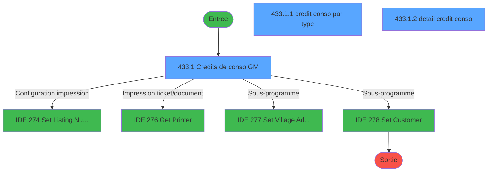
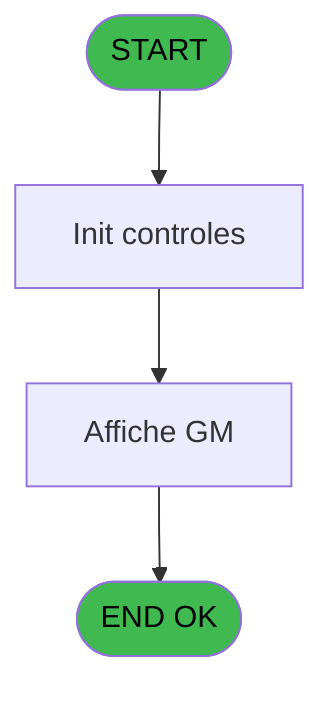
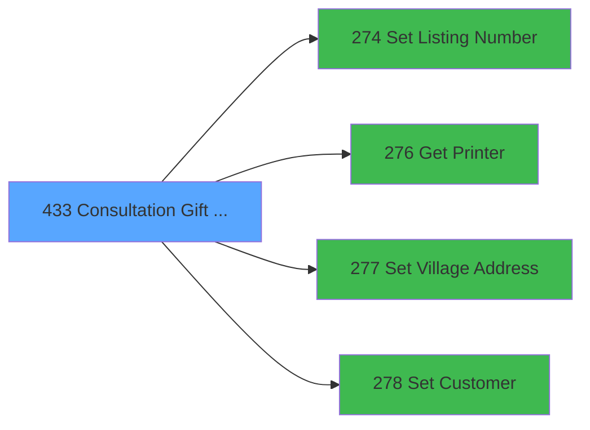

# PVE IDE 433 - Consultation Gift Pass

> **Analyse**: Phases 1-4 2026-02-03 20:07 -> 20:07 (16s) | Assemblage 20:07
> **Pipeline**: V7.2 Enrichi
> **Structure**: 4 onglets (Resume | Ecrans | Donnees | Connexions)

<!-- TAB:Resume -->

## 1. FICHE D'IDENTITE

| Attribut | Valeur |
|----------|--------|
| Projet | PVE |
| IDE Position | 433 |
| Nom Programme | Consultation Gift Pass |
| Fichier source | `Prg_433.xml` |
| Dossier IDE | A |
| Taches | 7 (3 ecrans visibles) |
| Tables modifiees | 0 |
| Programmes appeles | 4 |
| :warning: Statut | **ORPHELIN_POTENTIEL** |

## 2. DESCRIPTION FONCTIONNELLE

**Consultation Gift Pass** assure la gestion complete de ce processus.

Le flux de traitement s'organise en **1 blocs fonctionnels** :

- **Traitement** (7 taches) : traitements metier divers

Detail : phases du traitement

#### Phase 1 : Traitement (7 taches)

- **433** - Consultation Gift Pass **[[ECRAN]](#ecran-t1)**
- **433.1** - Credits de conso GM **[[ECRAN]](#ecran-t2)**
- **433.1.1** - credit conso par type **[[ECRAN]](#ecran-t3)**
- **433.1.2** - detail credit conso **[[ECRAN]](#ecran-t4)**
- **433.2** - Gratuites bar GM **[[ECRAN]](#ecran-t5)**
- **433.2.1** - Browse - CC detail **[[ECRAN]](#ecran-t6)**
- **433.2.2** - Browse - CC par type

Delegue a : [Set Listing Number (IDE 274)](PVE-IDE-274.md), [Set Village Address (IDE 277)](PVE-IDE-277.md), [Set Customer (IDE 278)](PVE-IDE-278.md)

## 3. BLOCS FONCTIONNELS

### 3.1 Traitement (7 taches)

Traitements internes.

---

#### 433 - Consultation Gift Pass [[ECRAN]](#ecran-t1)

**Role** : Tache d'orchestration : point d'entree du programme (7 sous-taches). Coordonne l'enchainement des traitements.
**Ecran** : 713 x 453 DLU (MDI) | [Voir mockup](#ecran-t1)

6 sous-taches directes

| Tache | Nom | Bloc |
|-------|-----|------|
| [433.1](#t2) | Credits de conso GM **[[ECRAN]](#ecran-t2)** | Traitement |
| [433.1.1](#t3) | credit conso par type **[[ECRAN]](#ecran-t3)** | Traitement |
| [433.1.2](#t4) | detail credit conso **[[ECRAN]](#ecran-t4)** | Traitement |
| [433.2](#t5) | Gratuites bar GM **[[ECRAN]](#ecran-t5)** | Traitement |
| [433.2.1](#t6) | Browse - CC detail **[[ECRAN]](#ecran-t6)** | Traitement |
| [433.2.2](#t7) | Browse - CC par type | Traitement |

**Delegue a** : [Set Listing Number (IDE 274)](PVE-IDE-274.md), [Set Village Address (IDE 277)](PVE-IDE-277.md), [Set Customer (IDE 278)](PVE-IDE-278.md)

---

#### 433.1 - Credits de conso GM [[ECRAN]](#ecran-t2)

**Role** : Calcul fidelite/avantage : Credits de conso GM.
**Ecran** : 981 x 241 DLU (MDI) | [Voir mockup](#ecran-t2)
**Delegue a** : [Set Listing Number (IDE 274)](PVE-IDE-274.md), [Set Village Address (IDE 277)](PVE-IDE-277.md), [Set Customer (IDE 278)](PVE-IDE-278.md)

---

#### 433.1.1 - credit conso par type [[ECRAN]](#ecran-t3)

**Role** : Calcul fidelite/avantage : credit conso par type.
**Ecran** : 255 x 79 DLU (Modal) | [Voir mockup](#ecran-t3)
**Variables liees** : D (P type), F (P Type GO/GM), M (v.type CS), N (v.List combo type CS), P (v.Edtion type)
**Delegue a** : [Set Listing Number (IDE 274)](PVE-IDE-274.md), [Set Village Address (IDE 277)](PVE-IDE-277.md), [Set Customer (IDE 278)](PVE-IDE-278.md)

---

#### 433.1.2 - detail credit conso [[ECRAN]](#ecran-t4)

**Role** : Calcul fidelite/avantage : detail credit conso.
**Ecran** : 226 x 77 DLU (Modal) | [Voir mockup](#ecran-t4)
**Delegue a** : [Set Listing Number (IDE 274)](PVE-IDE-274.md), [Set Village Address (IDE 277)](PVE-IDE-277.md), [Set Customer (IDE 278)](PVE-IDE-278.md)

---

#### 433.2 - Gratuites bar GM [[ECRAN]](#ecran-t5)

**Role** : Traitement : Gratuites bar GM.
**Ecran** : 424 x 57 DLU (MDI) | [Voir mockup](#ecran-t5)
**Delegue a** : [Set Listing Number (IDE 274)](PVE-IDE-274.md), [Set Village Address (IDE 277)](PVE-IDE-277.md), [Set Customer (IDE 278)](PVE-IDE-278.md)

---

#### 433.2.1 - Browse - CC detail [[ECRAN]](#ecran-t6)

**Role** : Traitement : Browse - CC detail.
**Ecran** : 680 x 0 DLU (MDI) | [Voir mockup](#ecran-t6)
**Delegue a** : [Set Listing Number (IDE 274)](PVE-IDE-274.md), [Set Village Address (IDE 277)](PVE-IDE-277.md), [Set Customer (IDE 278)](PVE-IDE-278.md)

---

#### 433.2.2 - Browse - CC par type

**Role** : Traitement : Browse - CC par type.
**Variables liees** : D (P type), F (P Type GO/GM), M (v.type CS), N (v.List combo type CS), P (v.Edtion type)
**Delegue a** : [Set Listing Number (IDE 274)](PVE-IDE-274.md), [Set Village Address (IDE 277)](PVE-IDE-277.md), [Set Customer (IDE 278)](PVE-IDE-278.md)

## 5. REGLES METIER

*(Aucune regle metier identifiee)*

## 6. CONTEXTE

- **Appele par**: (aucun)
- **Appelle**: 4 programmes | **Tables**: 6 (W:0 R:4 L:5) | **Taches**: 7 | **Expressions**: 8

<!-- TAB:Ecrans -->

## 8. ECRANS

### 8.1 Forms visibles (3 / 7)

| # | Position | Tache | Nom | Type | Largeur | Hauteur | Bloc |
|---|----------|-------|-----|------|---------|---------|------|
| 1 | 433.1 | 433.1 | Credits de conso GM | MDI | 981 | 241 | Traitement |
| 2 | 433.1.1 | 433.1.1 | credit conso par type | Modal | 255 | 79 | Traitement |
| 3 | 433.1.2 | 433.1.2 | detail credit conso | Modal | 226 | 77 | Traitement |

### 8.2 Mockups Ecrans

---

#### 433.1 - Credits de conso GM
**Tache** : [433.1](#t2) | **Type** : MDI | **Dimensions** : 981 x 241 DLU
**Bloc** : Traitement | **Titre IDE** : Credits de conso GM

<!-- FORM-DATA:
{
    "width":  981,
    "vFactor":  8,
    "type":  "MDI",
    "hFactor":  8,
    "controls":  [
                     {
                         "x":  0,
                         "type":  "label",
                         "var":  "",
                         "y":  5,
                         "w":  962,
                         "fmt":  "",
                         "name":  "",
                         "h":  18,
                         "color":  "183",
                         "text":  "",
                         "parent":  null
                     },
                     {
                         "x":  241,
                         "type":  "label",
                         "var":  "",
                         "y":  27,
                         "w":  38,
                         "fmt":  "",
                         "name":  "",
                         "h":  9,
                         "color":  "187",
                         "text":  "Nom",
                         "parent":  null
                     },
                     {
                         "x":  503,
                         "type":  "label",
                         "var":  "",
                         "y":  27,
                         "w":  61,
                         "fmt":  "",
                         "name":  "",
                         "h":  9,
                         "color":  "187",
                         "text":  "Prénom",
                         "parent":  null
                     },
                     {
                         "x":  241,
                         "type":  "label",
                         "var":  "",
                         "y":  49,
                         "w":  88,
                         "fmt":  "",
                         "name":  "",
                         "h":  9,
                         "color":  "187",
                         "text":  "Date début",
                         "parent":  null
                     },
                     {
                         "x":  504,
                         "type":  "label",
                         "var":  "",
                         "y":  49,
                         "w":  88,
                         "fmt":  "",
                         "name":  "",
                         "h":  9,
                         "color":  "187",
                         "text":  "Date fin",
                         "parent":  null
                     },
                     {
                         "x":  14,
                         "type":  "label",
                         "var":  "",
                         "y":  107,
                         "w":  462,
                         "fmt":  "",
                         "name":  "",
                         "h":  12,
                         "color":  "187",
                         "text":  "Position par type de credit",
                         "parent":  null
                     },
                     {
                         "x":  528,
                         "type":  "label",
                         "var":  "",
                         "y":  107,
                         "w":  416,
                         "fmt":  "",
                         "name":  "",
                         "h":  12,
                         "color":  "187",
                         "text":  "Historique des crédits effectués",
                         "parent":  null
                     },
                     {
                         "x":  0,
                         "type":  "label",
                         "var":  "",
                         "y":  208,
                         "w":  962,
                         "fmt":  "",
                         "name":  "",
                         "h":  29,
                         "color":  "183",
                         "text":  "",
                         "parent":  null
                     },
                     {
                         "x":  1,
                         "type":  "label",
                         "var":  "",
                         "y":  25,
                         "w":  206,
                         "fmt":  "",
                         "name":  "",
                         "h":  35,
                         "color":  "183",
                         "text":  "Filtre",
                         "parent":  null
                     },
                     {
                         "x":  215,
                         "type":  "label",
                         "var":  "",
                         "y":  72,
                         "w":  501,
                         "fmt":  "",
                         "name":  "",
                         "h":  32,
                         "color":  "183",
                         "text":  "",
                         "parent":  null
                     },
                     {
                         "x":  246,
                         "type":  "label",
                         "var":  "",
                         "y":  86,
                         "w":  220,
                         "fmt":  "",
                         "name":  "",
                         "h":  13,
                         "color":  "187",
                         "text":  "SOLDE",
                         "parent":  17
                     },
                     {
                         "x":  241,
                         "type":  "edit",
                         "var":  "",
                         "y":  37,
                         "w":  200,
                         "fmt":  "",
                         "name":  "GM nom",
                         "h":  11,
                         "color":  "187",
                         "text":  "",
                         "parent":  null
                     },
                     {
                         "x":  504,
                         "type":  "edit",
                         "var":  "",
                         "y":  37,
                         "w":  122,
                         "fmt":  "",
                         "name":  "GM prenom",
                         "h":  11,
                         "color":  "187",
                         "text":  "",
                         "parent":  null
                     },
                     {
                         "x":  241,
                         "type":  "edit",
                         "var":  "",
                         "y":  61,
                         "w":  120,
                         "fmt":  "",
                         "name":  "gmr_debut_sejour",
                         "h":  11,
                         "color":  "187",
                         "text":  "",
                         "parent":  null
                     },
                     {
                         "x":  504,
                         "type":  "edit",
                         "var":  "",
                         "y":  61,
                         "w":  120,
                         "fmt":  "",
                         "name":  "gmr_fin_sejour",
                         "h":  11,
                         "color":  "187",
                         "text":  "",
                         "parent":  null
                     },
                     {
                         "x":  494,
                         "type":  "edit",
                         "var":  "",
                         "y":  86,
                         "w":  194,
                         "fmt":  "",
                         "name":  "solde_credit_conso_0001",
                         "h":  11,
                         "color":  "187",
                         "text":  "",
                         "parent":  17
                     },
                     {
                         "x":  18,
                         "type":  "combobox",
                         "var":  "",
                         "y":  39,
                         "w":  159,
                         "fmt":  "",
                         "name":  "v.combo type",
                         "h":  12,
                         "color":  "110",
                         "text":  "30,99",
                         "parent":  null
                     },
                     {
                         "x":  14,
                         "type":  "edit",
                         "var":  "",
                         "y":  7,
                         "w":  396,
                         "fmt":  "30",
                         "name":  "",
                         "h":  11,
                         "color":  "187",
                         "text":  "",
                         "parent":  null
                     },
                     {
                         "x":  646,
                         "type":  "edit",
                         "var":  "",
                         "y":  7,
                         "w":  298,
                         "fmt":  "WWW DD MMM YYYYT",
                         "name":  "",
                         "h":  11,
                         "color":  "187",
                         "text":  "",
                         "parent":  null
                     },
                     {
                         "x":  818,
                         "type":  "button",
                         "var":  "",
                         "y":  210,
                         "w":  129,
                         "fmt":  "Impression",
                         "name":  "HI",
                         "h":  24,
                         "color":  "",
                         "text":  "",
                         "parent":  null
                     },
                     {
                         "x":  9,
                         "type":  "button",
                         "var":  "",
                         "y":  210,
                         "w":  168,
                         "fmt":  "Quitter",
                         "name":  "",
                         "h":  24,
                         "color":  "",
                         "text":  "",
                         "parent":  null
                     },
                     {
                         "x":  0,
                         "type":  "subform",
                         "var":  "",
                         "y":  124,
                         "w":  510,
                         "fmt":  "",
                         "name":  "credit conso par type",
                         "h":  77,
                         "color":  "",
                         "text":  "",
                         "parent":  null
                     },
                     {
                         "x":  519,
                         "type":  "subform",
                         "var":  "",
                         "y":  124,
                         "w":  448,
                         "fmt":  "",
                         "name":  "detail credit conso",
                         "h":  77,
                         "color":  "",
                         "text":  "",
                         "parent":  null
                     }
                 ],
    "taskId":  "433.1",
    "height":  241
}
-->

<strong>Champs : 8 champs</strong>

| Pos (x,y) | Nom | Variable | Type |
|-----------|-----|----------|------|
| 241,37 | GM nom | - | edit |
| 504,37 | GM prenom | - | edit |
| 241,61 | gmr_debut_sejour | - | edit |
| 504,61 | gmr_fin_sejour | - | edit |
| 494,86 | solde_credit_conso_0001 | - | edit |
| 18,39 | v.combo type | - | combobox |
| 14,7 | 30 | - | edit |
| 646,7 | WWW DD MMM YYYYT | - | edit |

<strong>Boutons : 2 boutons</strong>

| Bouton | Pos (x,y) | Action |
|--------|-----------|--------|
| Impression | 818,210 | Bouton fonctionnel |
| Quitter | 9,210 | Quitte le programme |

---

#### 433.1.1 - credit conso par type
**Tache** : [433.1.1](#t3) | **Type** : Modal | **Dimensions** : 255 x 79 DLU
**Bloc** : Traitement | **Titre IDE** : credit conso par type

<!-- FORM-DATA:
{
    "width":  255,
    "vFactor":  8,
    "type":  "Modal",
    "hFactor":  4,
    "controls":  [
                     {
                         "x":  5,
                         "type":  "label",
                         "var":  "",
                         "y":  5,
                         "w":  233,
                         "fmt":  "",
                         "name":  "",
                         "h":  15,
                         "color":  "",
                         "text":  "",
                         "parent":  null
                     },
                     {
                         "x":  4,
                         "type":  "table",
                         "var":  "",
                         "name":  "",
                         "titleH":  16,
                         "color":  "6",
                         "w":  240,
                         "y":  0,
                         "fmt":  "",
                         "parent":  null,
                         "text":  "",
                         "rowH":  12,
                         "h":  66,
                         "cols":  [
                                      {
                                          "title":  "Type de crédit",
                                          "layer":  1,
                                          "w":  125
                                      },
                                      {
                                          "title":  "Solde",
                                          "layer":  2,
                                          "w":  97
                                      }
                                  ],
                         "rows":  2
                     },
                     {
                         "x":  133,
                         "type":  "edit",
                         "var":  "",
                         "y":  18,
                         "w":  87,
                         "fmt":  "",
                         "name":  "",
                         "h":  10,
                         "color":  "6",
                         "text":  "",
                         "parent":  2
                     },
                     {
                         "x":  9,
                         "type":  "edit",
                         "var":  "",
                         "y":  18,
                         "w":  115,
                         "fmt":  "",
                         "name":  "libelle_credit",
                         "h":  10,
                         "color":  "6",
                         "text":  "",
                         "parent":  2
                     }
                 ],
    "taskId":  "433.1.1",
    "height":  79
}
-->

<strong>Champs : 2 champs</strong>

| Pos (x,y) | Nom | Variable | Type |
|-----------|-----|----------|------|
| 133,18 | (sans nom) | - | edit |
| 9,18 | libelle_credit | - | edit |

---

#### 433.1.2 - detail credit conso
**Tache** : [433.1.2](#t4) | **Type** : Modal | **Dimensions** : 226 x 77 DLU
**Bloc** : Traitement | **Titre IDE** : detail credit conso

<!-- FORM-DATA:
{
    "width":  226,
    "vFactor":  8,
    "type":  "Modal",
    "hFactor":  4,
    "controls":  [
                     {
                         "x":  0,
                         "type":  "table",
                         "var":  "",
                         "name":  "",
                         "titleH":  16,
                         "color":  "6",
                         "w":  217,
                         "y":  0,
                         "fmt":  "",
                         "parent":  null,
                         "text":  "",
                         "rowH":  12,
                         "h":  66,
                         "cols":  [
                                      {
                                          "title":  "Montant",
                                          "layer":  1,
                                          "w":  69
                                      },
                                      {
                                          "title":  "Type de crédit",
                                          "layer":  2,
                                          "w":  65
                                      },
                                      {
                                          "title":  "Date",
                                          "layer":  3,
                                          "w":  63
                                      }
                                  ],
                         "rows":  3
                     },
                     {
                         "x":  4,
                         "type":  "edit",
                         "var":  "",
                         "y":  17,
                         "w":  61,
                         "fmt":  "",
                         "name":  "",
                         "h":  11,
                         "color":  "6",
                         "text":  "",
                         "parent":  1
                     },
                     {
                         "x":  138,
                         "type":  "edit",
                         "var":  "",
                         "y":  17,
                         "w":  56,
                         "fmt":  "",
                         "name":  "",
                         "h":  11,
                         "color":  "6",
                         "text":  "",
                         "parent":  1
                     },
                     {
                         "x":  73,
                         "type":  "edit",
                         "var":  "",
                         "y":  17,
                         "w":  56,
                         "fmt":  "10",
                         "name":  "",
                         "h":  8,
                         "color":  "6",
                         "text":  "",
                         "parent":  1
                     }
                 ],
    "taskId":  "433.1.2",
    "height":  77
}
-->

<strong>Champs : 3 champs</strong>

| Pos (x,y) | Nom | Variable | Type |
|-----------|-----|----------|------|
| 4,17 | (sans nom) | - | edit |
| 138,17 | (sans nom) | - | edit |
| 73,17 | 10 | - | edit |

## 9. NAVIGATION

### 9.1 Enchainement des ecrans

**Detail par enchainement :**

| Depuis | Action | Vers | Retour |
|--------|--------|------|--------|
| Credits de conso GM | Configuration impression | [Set Listing Number (IDE 274)](PVE-IDE-274.md) | Retour ecran |
| Credits de conso GM | Impression ticket/document | [Get Printer (IDE 276)](PVE-IDE-276.md) | Retour ecran |
| Credits de conso GM | Sous-programme | [Set Village Address (IDE 277)](PVE-IDE-277.md) | Retour ecran |
| Credits de conso GM | Sous-programme | [Set Customer (IDE 278)](PVE-IDE-278.md) | Retour ecran |

### 9.3 Structure hierarchique (7 taches)

| Position | Tache | Type | Dimensions | Bloc |
|----------|-------|------|------------|------|
| **433.1** | [**Consultation Gift Pass** (433)](#t1) [mockup](#ecran-t1) | MDI | 713x453 | Traitement |
| 433.1.1 | [Credits de conso GM (433.1)](#t2) [mockup](#ecran-t2) | MDI | 981x241 | |
| 433.1.2 | [credit conso par type (433.1.1)](#t3) [mockup](#ecran-t3) | Modal | 255x79 | |
| 433.1.3 | [detail credit conso (433.1.2)](#t4) [mockup](#ecran-t4) | Modal | 226x77 | |
| 433.1.4 | [Gratuites bar GM (433.2)](#t5) [mockup](#ecran-t5) | MDI | 424x57 | |
| 433.1.5 | [Browse - CC detail (433.2.1)](#t6) [mockup](#ecran-t6) | MDI | 680x0 | |
| 433.1.6 | [Browse - CC par type (433.2.2)](#t7) | MDI | - | |

### 9.4 Algorigramme

> **Legende**: Vert = START/END OK | Rouge = END KO | Bleu = Decisions
> *Algorigramme auto-genere. Utiliser `/algorigramme` pour une synthese metier detaillee.*

<!-- TAB:Donnees -->

## 10. TABLES

### Tables utilisees (6)

| ID | Nom | Description | Type | R | W | L | Usages |
|----|-----|-------------|------|---|---|---|--------|
| 30 | gm-recherche_____gmr | Index de recherche | DB | R |   |   | 2 |
| 268 | cc_total_par_type |  | DB | R |   | L | 3 |
| 271 | cc_total |  | DB |   |   | L | 1 |
| 272 | cc_type_detail |  | DB | R |   | L | 3 |
| 273 | cc_type |  | DB | R |   | L | 3 |
| 382 | pv_discount_reasons |  | DB |   |   | L | 2 |

### Colonnes par table (5 / 4 tables avec colonnes identifiees)

Table 30 - gm-recherche_____gmr (R) - 2 usages

| Lettre | Variable | Acces | Type |
|--------|----------|-------|------|
| A | v.combo type | R | Alpha |
| B | v.cummul type depose | R | Numeric |
| C | v.total restant | R | Numeric |
| D | v.total depose | R | Numeric |
| E | v.nom prenom cpt | R | Alpha |

Table 268 - cc_total_par_type (R/L) - 3 usages

| Lettre | Variable | Acces | Type |
|--------|----------|-------|------|
| A | v.combo type | R | Alpha |
| B | v.cummul type depose | R | Numeric |
| C | v.total restant | R | Numeric |
| D | P type | R | Alpha |
| F | P Type GO/GM | R | Alpha |
| M | v.type CS | R | Alpha |
| N | v.List combo type CS | R | Alpha |
| P | v.Edtion type | R | Alpha |

Table 272 - cc_type_detail (R/L) - 3 usages

| Lettre | Variable | Acces | Type |
|--------|----------|-------|------|
| A | v.combo type | R | Alpha |
| B | v.cummul type depose | R | Numeric |
| D | P type | R | Alpha |
| F | P Type GO/GM | R | Alpha |
| M | v.type CS | R | Alpha |
| N | v.List combo type CS | R | Alpha |
| P | v.Edtion type | R | Alpha |

Table 273 - cc_type (R/L) - 3 usages

| Lettre | Variable | Acces | Type |
|--------|----------|-------|------|
| A | P.Societe | R | Alpha |
| B | P.Compte | R | Numeric |
| C | P.Filiale | R | Numeric |
| D | P type | R | Alpha |
| E | P.Service | R | Alpha |
| F | P Type GO/GM | R | Alpha |
| G | p.code-devise | R | Alpha |
| H | p.nom village | R | Alpha |
| I | p.masque-mtt | R | Alpha |
| J | p.masque-mtt sans Z | R | Alpha |
| K | v.action | R | Alpha |
| L | v.montant | R | Numeric |
| M | v.type CS | R | Alpha |
| N | v.List combo type CS | R | Alpha |
| O | v.last name | R | Alpha |
| P | v.Edtion type | R | Alpha |

## 11. VARIABLES

### 11.1 Parametres entrants (10)

Variables recues en parametre.

| Lettre | Nom | Type | Usage dans |
|--------|-----|------|-----------|
| A | P.Societe | Alpha | - |
| B | P.Compte | Numeric | - |
| C | P.Filiale | Numeric | - |
| D | P type | Alpha | - |
| E | P.Service | Alpha | - |
| F | P Type GO/GM | Alpha | - |
| G | p.code-devise | Alpha | - |
| H | p.nom village | Alpha | - |
| I | p.masque-mtt | Alpha | 1x parametre entrant |
| J | p.masque-mtt sans Z | Alpha | - |

### 11.2 Variables de session (6)

Variables persistantes pendant toute la session.

| Lettre | Nom | Type | Usage dans |
|--------|-----|------|-----------|
| K | v.action | Alpha | 2x session |
| L | v.montant | Numeric | - |
| M | v.type CS | Alpha | 1x session |
| N | v.List combo type CS | Alpha | - |
| O | v.last name | Alpha | - |
| P | v.Edtion type | Alpha | - |

Toutes les 16 variables (liste complete)

| Cat | Lettre | Nom Variable | Type |
|-----|--------|--------------|------|
| P0 | **A** | P.Societe | Alpha |
| P0 | **B** | P.Compte | Numeric |
| P0 | **C** | P.Filiale | Numeric |
| P0 | **D** | P type | Alpha |
| P0 | **E** | P.Service | Alpha |
| P0 | **F** | P Type GO/GM | Alpha |
| P0 | **G** | p.code-devise | Alpha |
| P0 | **H** | p.nom village | Alpha |
| P0 | **I** | p.masque-mtt | Alpha |
| P0 | **J** | p.masque-mtt sans Z | Alpha |
| V. | **K** | v.action | Alpha |
| V. | **L** | v.montant | Numeric |
| V. | **M** | v.type CS | Alpha |
| V. | **N** | v.List combo type CS | Alpha |
| V. | **O** | v.last name | Alpha |
| V. | **P** | v.Edtion type | Alpha |

## 12. EXPRESSIONS

**8 / 8 expressions decodees (100%)**

### 12.1 Repartition par type

| Type | Expressions | Regles |
|------|-------------|--------|
| CALCULATION | 1 | 0 |
| CONSTANTE | 1 | 0 |
| CONDITION | 2 | 0 |
| OTHER | 4 | 0 |

### 12.2 Expressions cles par type

#### CALCULATION (1 expressions)

| Type | IDE | Expression | Regle |
|------|-----|------------|-------|
| CALCULATION | 7 | `Left (Trim (p.masque-mtt [I]),Len (Trim (p.masque-mtt [I]))-1)` | - |

#### CONSTANTE (1 expressions)

| Type | IDE | Expression | Regle |
|------|-----|------------|-------|
| CONSTANTE | 1 | `'F'` | - |

#### CONDITION (2 expressions)

| Type | IDE | Expression | Regle |
|------|-----|------------|-------|
| CONDITION | 8 | `v.action [K]='I'` | - |
| CONDITION | 2 | `v.action [K]='F'` | - |

#### OTHER (4 expressions)

| Type | IDE | Expression | Regle |
|------|-----|------------|-------|
| OTHER | 5 | `GetParam ('HEADERLINE02')` | - |
| OTHER | 6 | `GetParam ('AMOUNTFORMAT')` | - |
| OTHER | 3 | `v.type CS [M]` | - |
| OTHER | 4 | `GetParam ('CURRENCYVALUE')` | - |

<!-- TAB:Connexions -->

## 13. GRAPHE D'APPELS

### 13.1 Chaine depuis Main (Callers)

**Chemin**: (pas de callers directs)

### 13.2 Callers

| IDE | Nom Programme | Nb Appels |
|-----|---------------|-----------|
| - | (aucun) | - |

### 13.3 Callees (programmes appeles)

### 13.4 Detail Callees avec contexte

| IDE | Nom Programme | Appels | Contexte |
|-----|---------------|--------|----------|
| [274](PVE-IDE-274.md) | Set Listing Number | 1 | Configuration impression |
| [276](PVE-IDE-276.md) | Get Printer | 1 | Impression ticket/document |
| [277](PVE-IDE-277.md) | Set Village Address | 1 | Sous-programme |
| [278](PVE-IDE-278.md) | Set Customer | 1 | Sous-programme |

## 14. RECOMMANDATIONS MIGRATION

### 14.1 Profil du programme

| Metrique | Valeur | Impact migration |
|----------|--------|-----------------|
| Lignes de logique | 153 | Programme compact |
| Expressions | 8 | Peu de logique |
| Tables WRITE | 0 | Impact faible |
| Sous-programmes | 4 | Peu de dependances |
| Ecrans visibles | 3 | Quelques ecrans |
| Code desactive | 0% (0 / 153) | Code sain |
| Regles metier | 0 | Pas de regle identifiee |

### 14.2 Plan de migration par bloc

#### Traitement (7 taches: 6 ecrans, 1 traitement)

- **Strategie** : Orchestrateur avec 6 ecrans (Razor/React) et 1 traitements backend (services).
- Les ecrans deviennent des composants UI, les traitements invisibles deviennent des services injectables.
- 4 sous-programme(s) a migrer ou a reutiliser depuis les services existants.
- Decomposer les taches en services unitaires testables.

### 14.3 Dependances critiques

| Dependance | Type | Appels | Impact |
|------------|------|--------|--------|
| [Set Village Address (IDE 277)](PVE-IDE-277.md) | Sous-programme | 1x | Normale - Sous-programme |
| [Set Customer (IDE 278)](PVE-IDE-278.md) | Sous-programme | 1x | Normale - Sous-programme |
| [Set Listing Number (IDE 274)](PVE-IDE-274.md) | Sous-programme | 1x | Normale - Configuration impression |
| [Get Printer (IDE 276)](PVE-IDE-276.md) | Sous-programme | 1x | Normale - Impression ticket/document |

---
*Spec DETAILED generee par Pipeline V7.2 - 2026-02-03 20:07*
