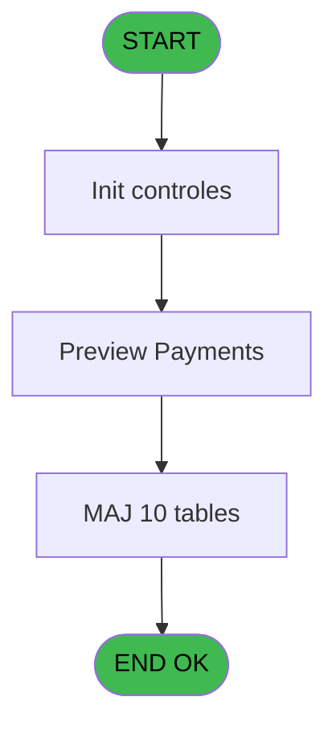
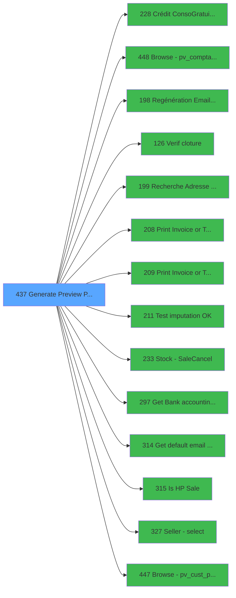

# PVE IDE 437 - Generate Preview Payment 1212E

> **Analyse**: Phases 1-4 2026-02-03 20:08 -> 20:09 (16s) | Assemblage 20:09
> **Pipeline**: V7.2 Enrichi
> **Structure**: 4 onglets (Resume | Ecrans | Donnees | Connexions)

<!-- TAB:Resume -->

## 1. FICHE D'IDENTITE

| Attribut | Valeur |
|----------|--------|
| Projet | PVE |
| IDE Position | 437 |
| Nom Programme | Generate Preview Payment 1212E |
| Fichier source | `Prg_437.xml` |
| Dossier IDE | A |
| Taches | 58 (2 ecrans visibles) |
| Tables modifiees | 10 |
| Programmes appeles | 14 |

## 2. DESCRIPTION FONCTIONNELLE

**Generate Preview Payment 1212E** assure la gestion complete de ce processus, accessible depuis [Menu Main (TPE) (IDE 403)](PVE-IDE-403.md).

Le flux de traitement s'organise en **4 blocs fonctionnels** :

- **Traitement** (49 taches) : traitements metier divers
- **Calcul** (5 taches) : calculs de montants, stocks ou compteurs
- **Creation** (2 taches) : insertion d'enregistrements en base (mouvements, prestations)
- **Validation** (2 taches) : controles et verifications de coherence

**Donnees modifiees** : 10 tables en ecriture (pv_comptable_tmp, depot_garantie___dga, comptable________cte, compte_gm________cgm, intermed_compta__ite, vente, pv_discount_reasons, pv_ownership, pv_cust_rentals, pv_sellers_by_week).

Detail : phases du traitement

#### Phase 1 : Traitement (49 taches)

- **437** - Generate Preview OD==LEX BooEC **[[ECRAN]](#ecran-t1)**
- **437.1** - Annulation Garantie **[[ECRAN]](#ecran-t57)**
- **437.2** - check 0 soucis **[[ECRAN]](#ecran-t68)**
- **437.3** - Payment preview Signature **[[ECRAN]](#ecran-t87)**
- **437.3.3** - Insurance paper card **[[ECRAN]](#ecran-t90)**
- **437.4** - Check service managé
- **437.5** - Get Solde ResortCredit
- **437.6** - Get Solde Gift Pass
- **437.6.1** - Get List Articles GP
- **437.8** - Suppression Gift Pass
- **437.9** - Batch 2 **[[ECRAN]](#ecran-t204)**
- **437.9.1** - Création d'un O.D **[[ECRAN]](#ecran-t205)**
- **437.9.1.1** - Upd Customer
- **437.9.1.2** - Cas: Credit Card ou VAD
- **437.9.1.2.1** - Debit 18 **[[ECRAN]](#ecran-t208)**
- **437.9.1.2.2** - credit 18 **[[ECRAN]](#ecran-t209)**
- **437.9.1.3** - Cas: Credit Card ou VAD
- **437.9.1.3.1** - credit 18 **[[ECRAN]](#ecran-t212)**
- **437.9.1.4** - Cas de cloture en cours
- **437.9.1.4.1** - debit 181 **[[ECRAN]](#ecran-t214)**
- **437.9.1.4.2** - credit 181 **[[ECRAN]](#ecran-t215)**
- **437.9.1.4.3** - OD cancel 181
- **437.9.1.4.3.1** - credit xtrack **[[ECRAN]](#ecran-t217)**
- **437.9.1.5** - OD cancel 18 **[[ECRAN]](#ecran-t224)**
- **437.9.1.5.1** - credit xtrack **[[ECRAN]](#ecran-t225)**
- **437.9.1.5.2** - Update Id Annulation
- **437.9.1.5.3** - credit xtrack **[[ECRAN]](#ecran-t227)**
- **437.9.1.5.4** - Update Id Annulation
- **437.9.1.6** - update cust rentals **[[ECRAN]](#ecran-t234)**
- **437.9.2** - Search for Gift Pass **[[ECRAN]](#ecran-t240)**
- **437.9.3** - Read for Gift Pass **[[ECRAN]](#ecran-t241)**
- **437.9.4** - Read for Gift Pass **[[ECRAN]](#ecran-t242)**
- **437.9.5** - Read for Gift Pass **[[ECRAN]](#ecran-t244)**
- **437.9.6** - Read for Resort Credit **[[ECRAN]](#ecran-t245)**
- **437.9.1.3.2** - OD Debit 18 **[[ECRAN]](#ecran-t264)**
- **437.9.1.7** - Cas: Credit Card ou VAD
- **437.9.1.7.1** - credit xtrack **[[ECRAN]](#ecran-t285)**
- **437.9.1.7.2** - credit xtrack **[[ECRAN]](#ecran-t286)**
- **437.9.1.7.3** - OD cancel xtrack
- **437.9.1.7.3.1** - credit xtrack **[[ECRAN]](#ecran-t288)**
- **437.9.1.8** - Lecture IN PO **[[ECRAN]](#ecran-t290)**
- **437.9.1.8.1** - credit xtrack **[[ECRAN]](#ecran-t291)**
- **437.9.1.8.2** - credit 18 **[[ECRAN]](#ecran-t292)**
- **437.9.1.8.3** - credit 18 **[[ECRAN]](#ecran-t293)**
- **437.9.1.8.4** - credit 181 **[[ECRAN]](#ecran-t294)**
- **437.9.1.9** - Enregistrement et édition
- **437.9.1.9.2** - Payment preview **[[ECRAN]](#ecran-t305)**
- **437.9.1.7.4** - debit xtrack **[[ECRAN]](#ecran-t317)**
- **437.9.1.7.5** - debit xtrack **[[ECRAN]](#ecran-t320)**

Delegue a : [Crédit Conso/Gratuité (BAR) (IDE 228)](PVE-IDE-228.md), [Regénération Email Liste Temp (IDE 198)](PVE-IDE-198.md), [  Test imputation OK ? (IDE 211)](PVE-IDE-211.md), [Get Bank accounting date (IDE 297)](PVE-IDE-297.md), [Get default email address (IDE 314)](PVE-IDE-314.md), [Is HP Sale (IDE 315)](PVE-IDE-315.md), [Browse - pv_cust_package (IDE 447)](PVE-IDE-447.md)

#### Phase 2 : Calcul (5 taches)

- **437.3.1** - Vérifie param comptabilité **[[ECRAN]](#ecran-t88)**
- **437.3.2** - calcul total
- **437.9.1.6.1** - Calcul days
- **437.9.1.6.1.1** - Lect PoS Compta
- **437.9.1.9.3** - Stockage fact. Presta

Delegue a : [Browse - pv_comptab_temp (IDE 448)](PVE-IDE-448.md), [Stock - Sale/Cancel (IDE 233)](PVE-IDE-233.md)

#### Phase 3 : Validation (2 taches)

- **437.7** - Devalidation annulations GP
- **437.9.1.9.1** - Validation ecriture od **[[ECRAN]](#ecran-t237)**

Delegue a : [Verif cloture (IDE 126)](PVE-IDE-126.md)

#### Phase 4 : Creation (2 taches)

- **437.9.4.1** - Creation Ligne **[[ECRAN]](#ecran-t243)**
- **437.9.6.1** - Creation Ligne **[[ECRAN]](#ecran-t246)**

#### Tables impactees

| Table | Operations | Role metier |
|-------|-----------|-------------|
| pv_cust_rentals | R/**W**/L (20 usages) |  |
| pv_comptable_tmp | R/**W**/L (12 usages) |  |
| pv_discount_reasons | R/**W**/L (11 usages) |  |
| vente | R/**W**/L (6 usages) | Donnees de ventes |
| comptable________cte | R/**W**/L (6 usages) |  |
| compte_gm________cgm | **W**/L (5 usages) | Comptes GM (generaux) |
| intermed_compta__ite | **W**/L (4 usages) |  |
| pv_sellers_by_week | **W**/L (2 usages) |  |
| pv_ownership | **W** (1 usages) |  |
| depot_garantie___dga | **W** (1 usages) | Depots et garanties |

## 3. BLOCS FONCTIONNELS

### 3.1 Traitement (49 taches)

Traitements internes.

---

#### 437 - Generate Preview OD==LEX BooEC [[ECRAN]](#ecran-t1)

**Role** : Tache d'orchestration : point d'entree du programme (49 sous-taches). Coordonne l'enchainement des traitements.
**Ecran** : 126 x 71 DLU (MDI) | [Voir mockup](#ecran-t1)

48 sous-taches directes

| Tache | Nom | Bloc |
|-------|-----|------|
| [437.1](#t57) | Annulation Garantie **[[ECRAN]](#ecran-t57)** | Traitement |
| [437.2](#t68) | check 0 soucis **[[ECRAN]](#ecran-t68)** | Traitement |
| [437.3](#t87) | Payment preview Signature **[[ECRAN]](#ecran-t87)** | Traitement |
| [437.3.3](#t90) | Insurance paper card **[[ECRAN]](#ecran-t90)** | Traitement |
| [437.4](#t95) | Check service managé | Traitement |
| [437.5](#t97) | Get Solde ResortCredit | Traitement |
| [437.6](#t103) | Get Solde Gift Pass | Traitement |
| [437.6.1](#t111) | Get List Articles GP | Traitement |
| [437.8](#t115) | Suppression Gift Pass | Traitement |
| [437.9](#t204) | Batch 2 **[[ECRAN]](#ecran-t204)** | Traitement |
| [437.9.1](#t205) | Création d'un O.D **[[ECRAN]](#ecran-t205)** | Traitement |
| [437.9.1.1](#t206) | Upd Customer | Traitement |
| [437.9.1.2](#t207) | Cas: Credit Card ou VAD | Traitement |
| [437.9.1.2.1](#t208) | Debit 18 **[[ECRAN]](#ecran-t208)** | Traitement |
| [437.9.1.2.2](#t209) | credit 18 **[[ECRAN]](#ecran-t209)** | Traitement |
| [437.9.1.3](#t210) | Cas: Credit Card ou VAD | Traitement |
| [437.9.1.3.1](#t212) | credit 18 **[[ECRAN]](#ecran-t212)** | Traitement |
| [437.9.1.4](#t213) | Cas de cloture en cours | Traitement |
| [437.9.1.4.1](#t214) | debit 181 **[[ECRAN]](#ecran-t214)** | Traitement |
| [437.9.1.4.2](#t215) | credit 181 **[[ECRAN]](#ecran-t215)** | Traitement |
| [437.9.1.4.3](#t216) | OD cancel 181 | Traitement |
| [437.9.1.4.3.1](#t217) | credit xtrack **[[ECRAN]](#ecran-t217)** | Traitement |
| [437.9.1.5](#t224) | OD cancel 18 **[[ECRAN]](#ecran-t224)** | Traitement |
| [437.9.1.5.1](#t225) | credit xtrack **[[ECRAN]](#ecran-t225)** | Traitement |
| [437.9.1.5.2](#t226) | Update Id Annulation | Traitement |
| [437.9.1.5.3](#t227) | credit xtrack **[[ECRAN]](#ecran-t227)** | Traitement |
| [437.9.1.5.4](#t228) | Update Id Annulation | Traitement |
| [437.9.1.6](#t234) | update cust rentals **[[ECRAN]](#ecran-t234)** | Traitement |
| [437.9.2](#t240) | Search for Gift Pass **[[ECRAN]](#ecran-t240)** | Traitement |
| [437.9.3](#t241) | Read for Gift Pass **[[ECRAN]](#ecran-t241)** | Traitement |
| [437.9.4](#t242) | Read for Gift Pass **[[ECRAN]](#ecran-t242)** | Traitement |
| [437.9.5](#t244) | Read for Gift Pass **[[ECRAN]](#ecran-t244)** | Traitement |
| [437.9.6](#t245) | Read for Resort Credit **[[ECRAN]](#ecran-t245)** | Traitement |
| [437.9.1.3.2](#t264) | OD Debit 18 **[[ECRAN]](#ecran-t264)** | Traitement |
| [437.9.1.7](#t283) | Cas: Credit Card ou VAD | Traitement |
| [437.9.1.7.1](#t285) | credit xtrack **[[ECRAN]](#ecran-t285)** | Traitement |
| [437.9.1.7.2](#t286) | credit xtrack **[[ECRAN]](#ecran-t286)** | Traitement |
| [437.9.1.7.3](#t287) | OD cancel xtrack | Traitement |
| [437.9.1.7.3.1](#t288) | credit xtrack **[[ECRAN]](#ecran-t288)** | Traitement |
| [437.9.1.8](#t290) | Lecture IN PO **[[ECRAN]](#ecran-t290)** | Traitement |
| [437.9.1.8.1](#t291) | credit xtrack **[[ECRAN]](#ecran-t291)** | Traitement |
| [437.9.1.8.2](#t292) | credit 18 **[[ECRAN]](#ecran-t292)** | Traitement |
| [437.9.1.8.3](#t293) | credit 18 **[[ECRAN]](#ecran-t293)** | Traitement |
| [437.9.1.8.4](#t294) | credit 181 **[[ECRAN]](#ecran-t294)** | Traitement |
| [437.9.1.9](#t301) | Enregistrement et édition | Traitement |
| [437.9.1.9.2](#t305) | Payment preview **[[ECRAN]](#ecran-t305)** | Traitement |
| [437.9.1.7.4](#t317) | debit xtrack **[[ECRAN]](#ecran-t317)** | Traitement |
| [437.9.1.7.5](#t320) | debit xtrack **[[ECRAN]](#ecran-t320)** | Traitement |

---

#### 437.1 - Annulation Garantie [[ECRAN]](#ecran-t57)

**Role** : Traitement : Annulation Garantie.
**Ecran** : 723 x 460 DLU | [Voir mockup](#ecran-t57)
**Variables liees** : BI (p.V.Garantie O/N), CG (v Annulation Vente Garantie)

---

#### 437.2 - check 0 soucis [[ECRAN]](#ecran-t68)

**Role** : Traitement : check 0 soucis.
**Ecran** : 715 x 439 DLU (MDI) | [Voir mockup](#ecran-t68)
**Variables liees** : BM (p.Check_CM_Pass), CU (v.vente ass-0-soucis ?)

---

#### 437.3 - Payment preview Signature [[ECRAN]](#ecran-t87)

**Role** : Traitement : Payment preview Signature.
**Ecran** : 1984 x 438 DLU (Type6) | [Voir mockup](#ecran-t87)
**Variables liees** : C (P.v.annulPayment), I (p.Payment_Type)

---

#### 437.3.3 - Insurance paper card [[ECRAN]](#ecran-t90)

**Role** : Traitement : Insurance paper card.
**Ecran** : 333 x 99 DLU | [Voir mockup](#ecran-t90)
**Variables liees** : Y (p.V.Card Type(param)), BJ (p.V PoS payer id from card), BK (p.V pms account from card), BL (p.V pms filiation from card), CV (v.reason paper card)

---

#### 437.4 - Check service managé

**Role** : Traitement : Check service managé.
**Variables liees** : BM (p.Check_CM_Pass), CH (v.Service RENTAL?), CS (v.Type service)

---

#### 437.5 - Get Solde ResortCredit

**Role** : Consultation/chargement : Get Solde ResortCredit.
**Variables liees** : H (p.V.solde_Compte), L (p.V.solde_Gift Pass), CL (v.SoldeGiftPass), CP (v.SoldeResortCredit), CQ (v.ConfirmeResortCredit)

---

#### 437.6 - Get Solde Gift Pass

**Role** : Consultation/chargement : Get Solde Gift Pass.
**Variables liees** : E (p.V.recherche_ClubmedPass), H (p.V.solde_Compte), K (p.Montant_Eligible_Gift_Pass), L (p.V.solde_Gift Pass), BM (p.Check_CM_Pass)

---

#### 437.6.1 - Get List Articles GP

**Role** : Consultation/chargement : Get List Articles GP.
**Variables liees** : CM (v.ExisteArticlesEligibleGP)

---

#### 437.8 - Suppression Gift Pass

**Role** : Calcul fidelite/avantage : Suppression Gift Pass.
**Variables liees** : E (p.V.recherche_ClubmedPass), K (p.Montant_Eligible_Gift_Pass), L (p.V.solde_Gift Pass), BM (p.Check_CM_Pass), BX (v.Club Med Pass)

---

#### 437.9 - Batch 2 [[ECRAN]](#ecran-t204)

**Role** : Traitement : Batch 2.
**Ecran** : 519 x 342 DLU | [Voir mockup](#ecran-t204)

---

#### 437.9.1 - Création d'un O.D [[ECRAN]](#ecran-t205)

**Role** : Traitement : Création d'un O.D.
**Ecran** : 1170 x 229 DLU (MDI) | [Voir mockup](#ecran-t205)

---

#### 437.9.1.1 - Upd Customer

**Role** : Traitement : Upd Customer.

---

#### 437.9.1.2 - Cas: Credit Card ou VAD

**Role** : Calcul fidelite/avantage : Cas: Credit Card ou VAD.
**Variables liees** : Y (p.V.Card Type(param)), BJ (p.V PoS payer id from card), BK (p.V pms account from card), BL (p.V pms filiation from card), CP (v.SoldeResortCredit)

---

#### 437.9.1.2.1 - Debit 18 [[ECRAN]](#ecran-t208)

**Role** : Traitement : Debit 18.
**Ecran** : 164 x 63 DLU (MDI) | [Voir mockup](#ecran-t208)

---

#### 437.9.1.2.2 - credit 18 [[ECRAN]](#ecran-t209)

**Role** : Calcul fidelite/avantage : credit 18.
**Ecran** : 223 x 119 DLU (MDI) | [Voir mockup](#ecran-t209)
**Variables liees** : CP (v.SoldeResortCredit), CQ (v.ConfirmeResortCredit), CR (v.MontantEligibleResortCredit)

---

#### 437.9.1.3 - Cas: Credit Card ou VAD

**Role** : Calcul fidelite/avantage : Cas: Credit Card ou VAD.
**Variables liees** : Y (p.V.Card Type(param)), BJ (p.V PoS payer id from card), BK (p.V pms account from card), BL (p.V pms filiation from card), CP (v.SoldeResortCredit)

---

#### 437.9.1.3.1 - credit 18 [[ECRAN]](#ecran-t212)

**Role** : Calcul fidelite/avantage : credit 18.
**Ecran** : 377 x 144 DLU (MDI) | [Voir mockup](#ecran-t212)
**Variables liees** : CP (v.SoldeResortCredit), CQ (v.ConfirmeResortCredit), CR (v.MontantEligibleResortCredit)

---

#### 437.9.1.4 - Cas de cloture en cours

**Role** : Traitement : Cas de cloture en cours.
**Variables liees** : BR (v.cloture in progress ?)

---

#### 437.9.1.4.1 - debit 181 [[ECRAN]](#ecran-t214)

**Role** : Traitement : debit 181.
**Ecran** : 153 x 63 DLU (MDI) | [Voir mockup](#ecran-t214)

---

#### 437.9.1.4.2 - credit 181 [[ECRAN]](#ecran-t215)

**Role** : Calcul fidelite/avantage : credit 181.
**Ecran** : 134 x 63 DLU (MDI) | [Voir mockup](#ecran-t215)
**Variables liees** : CP (v.SoldeResortCredit), CQ (v.ConfirmeResortCredit), CR (v.MontantEligibleResortCredit)

---

#### 437.9.1.4.3 - OD cancel 181

**Role** : Traitement : OD cancel 181.
**Variables liees** : BN (p.NotCancelBooking), CF (v.Cancel pour Gift Pass)

---

#### 437.9.1.4.3.1 - credit xtrack [[ECRAN]](#ecran-t217)

**Role** : Calcul fidelite/avantage : credit xtrack.
**Ecran** : 104 x 63 DLU (MDI) | [Voir mockup](#ecran-t217)
**Variables liees** : CP (v.SoldeResortCredit), CQ (v.ConfirmeResortCredit), CR (v.MontantEligibleResortCredit)

---

#### 437.9.1.5 - OD cancel 18 [[ECRAN]](#ecran-t224)

**Role** : Traitement : OD cancel 18.
**Ecran** : 677 x 270 DLU (MDI) | [Voir mockup](#ecran-t224)
**Variables liees** : BN (p.NotCancelBooking), CF (v.Cancel pour Gift Pass)

---

#### 437.9.1.5.1 - credit xtrack [[ECRAN]](#ecran-t225)

**Role** : Calcul fidelite/avantage : credit xtrack.
**Ecran** : 104 x 63 DLU (MDI) | [Voir mockup](#ecran-t225)
**Variables liees** : CP (v.SoldeResortCredit), CQ (v.ConfirmeResortCredit), CR (v.MontantEligibleResortCredit)

---

#### 437.9.1.5.2 - Update Id Annulation

**Role** : Traitement : Update Id Annulation.
**Variables liees** : BC (p.date_update_ligne), BD (p.Time_update_ligne), CG (v Annulation Vente Garantie)

---

#### 437.9.1.5.3 - credit xtrack [[ECRAN]](#ecran-t227)

**Role** : Calcul fidelite/avantage : credit xtrack.
**Ecran** : 104 x 63 DLU (MDI) | [Voir mockup](#ecran-t227)
**Variables liees** : CP (v.SoldeResortCredit), CQ (v.ConfirmeResortCredit), CR (v.MontantEligibleResortCredit)

---

#### 437.9.1.5.4 - Update Id Annulation

**Role** : Traitement : Update Id Annulation.
**Variables liees** : BC (p.date_update_ligne), BD (p.Time_update_ligne), CG (v Annulation Vente Garantie)

---

#### 437.9.1.6 - update cust rentals [[ECRAN]](#ecran-t234)

**Role** : Traitement : update cust rentals.
**Ecran** : 266 x 102 DLU (MDI) | [Voir mockup](#ecran-t234)
**Variables liees** : BC (p.date_update_ligne), BD (p.Time_update_ligne), BH (p.payer_xcust_ID)

---

#### 437.9.2 - Search for Gift Pass [[ECRAN]](#ecran-t240)

**Role** : Calcul fidelite/avantage : Search for Gift Pass.
**Ecran** : 175 x 195 DLU | [Voir mockup](#ecran-t240)
**Variables liees** : E (p.V.recherche_ClubmedPass), K (p.Montant_Eligible_Gift_Pass), L (p.V.solde_Gift Pass), BM (p.Check_CM_Pass), BX (v.Club Med Pass)

---

#### 437.9.3 - Read for Gift Pass [[ECRAN]](#ecran-t241)

**Role** : Calcul fidelite/avantage : Read for Gift Pass.
**Ecran** : 1293 x 430 DLU | [Voir mockup](#ecran-t241)
**Variables liees** : E (p.V.recherche_ClubmedPass), K (p.Montant_Eligible_Gift_Pass), L (p.V.solde_Gift Pass), BM (p.Check_CM_Pass), BX (v.Club Med Pass)

---

#### 437.9.4 - Read for Gift Pass [[ECRAN]](#ecran-t242)

**Role** : Calcul fidelite/avantage : Read for Gift Pass.
**Ecran** : 795 x 346 DLU | [Voir mockup](#ecran-t242)
**Variables liees** : E (p.V.recherche_ClubmedPass), K (p.Montant_Eligible_Gift_Pass), L (p.V.solde_Gift Pass), BM (p.Check_CM_Pass), BX (v.Club Med Pass)

---

#### 437.9.5 - Read for Gift Pass [[ECRAN]](#ecran-t244)

**Role** : Calcul fidelite/avantage : Read for Gift Pass.
**Ecran** : 1293 x 430 DLU | [Voir mockup](#ecran-t244)
**Variables liees** : E (p.V.recherche_ClubmedPass), K (p.Montant_Eligible_Gift_Pass), L (p.V.solde_Gift Pass), BM (p.Check_CM_Pass), BX (v.Club Med Pass)

---

#### 437.9.6 - Read for Resort Credit [[ECRAN]](#ecran-t245)

**Role** : Calcul fidelite/avantage : Read for Resort Credit.
**Ecran** : 795 x 346 DLU | [Voir mockup](#ecran-t245)
**Variables liees** : CP (v.SoldeResortCredit), CQ (v.ConfirmeResortCredit), CR (v.MontantEligibleResortCredit)

---

#### 437.9.1.3.2 - OD Debit 18 [[ECRAN]](#ecran-t264)

**Role** : Traitement : OD Debit 18.
**Ecran** : 1010 x 398 DLU (MDI) | [Voir mockup](#ecran-t264)

---

#### 437.9.1.7 - Cas: Credit Card ou VAD

**Role** : Calcul fidelite/avantage : Cas: Credit Card ou VAD.
**Variables liees** : Y (p.V.Card Type(param)), BJ (p.V PoS payer id from card), BK (p.V pms account from card), BL (p.V pms filiation from card), CP (v.SoldeResortCredit)

---

#### 437.9.1.7.1 - credit xtrack [[ECRAN]](#ecran-t285)

**Role** : Calcul fidelite/avantage : credit xtrack.
**Ecran** : 104 x 63 DLU (MDI) | [Voir mockup](#ecran-t285)
**Variables liees** : CP (v.SoldeResortCredit), CQ (v.ConfirmeResortCredit), CR (v.MontantEligibleResortCredit)

---

#### 437.9.1.7.2 - credit xtrack [[ECRAN]](#ecran-t286)

**Role** : Calcul fidelite/avantage : credit xtrack.
**Ecran** : 104 x 63 DLU (MDI) | [Voir mockup](#ecran-t286)
**Variables liees** : CP (v.SoldeResortCredit), CQ (v.ConfirmeResortCredit), CR (v.MontantEligibleResortCredit)

---

#### 437.9.1.7.3 - OD cancel xtrack

**Role** : Traitement : OD cancel xtrack.
**Variables liees** : BN (p.NotCancelBooking), CF (v.Cancel pour Gift Pass)

---

#### 437.9.1.7.3.1 - credit xtrack [[ECRAN]](#ecran-t288)

**Role** : Calcul fidelite/avantage : credit xtrack.
**Ecran** : 104 x 63 DLU (MDI) | [Voir mockup](#ecran-t288)
**Variables liees** : CP (v.SoldeResortCredit), CQ (v.ConfirmeResortCredit), CR (v.MontantEligibleResortCredit)

---

#### 437.9.1.8 - Lecture IN PO [[ECRAN]](#ecran-t290)

**Role** : Traitement : Lecture IN PO.
**Ecran** : 104 x 63 DLU (MDI) | [Voir mockup](#ecran-t290)

---

#### 437.9.1.8.1 - credit xtrack [[ECRAN]](#ecran-t291)

**Role** : Calcul fidelite/avantage : credit xtrack.
**Ecran** : 104 x 63 DLU (MDI) | [Voir mockup](#ecran-t291)
**Variables liees** : CP (v.SoldeResortCredit), CQ (v.ConfirmeResortCredit), CR (v.MontantEligibleResortCredit)

---

#### 437.9.1.8.2 - credit 18 [[ECRAN]](#ecran-t292)

**Role** : Calcul fidelite/avantage : credit 18.
**Ecran** : 223 x 119 DLU (MDI) | [Voir mockup](#ecran-t292)
**Variables liees** : CP (v.SoldeResortCredit), CQ (v.ConfirmeResortCredit), CR (v.MontantEligibleResortCredit)

---

#### 437.9.1.8.3 - credit 18 [[ECRAN]](#ecran-t293)

**Role** : Calcul fidelite/avantage : credit 18.
**Ecran** : 223 x 119 DLU (MDI) | [Voir mockup](#ecran-t293)
**Variables liees** : CP (v.SoldeResortCredit), CQ (v.ConfirmeResortCredit), CR (v.MontantEligibleResortCredit)

---

#### 437.9.1.8.4 - credit 181 [[ECRAN]](#ecran-t294)

**Role** : Calcul fidelite/avantage : credit 181.
**Ecran** : 134 x 63 DLU (MDI) | [Voir mockup](#ecran-t294)
**Variables liees** : CP (v.SoldeResortCredit), CQ (v.ConfirmeResortCredit), CR (v.MontantEligibleResortCredit)

---

#### 437.9.1.9 - Enregistrement et édition

**Role** : Traitement : Enregistrement et édition.

---

#### 437.9.1.9.2 - Payment preview [[ECRAN]](#ecran-t305)

**Role** : Traitement : Payment preview.
**Ecran** : 635 x 292 DLU (MDI) | [Voir mockup](#ecran-t305)
**Variables liees** : C (P.v.annulPayment), I (p.Payment_Type)

---

#### 437.9.1.7.4 - debit xtrack [[ECRAN]](#ecran-t317)

**Role** : Traitement : debit xtrack.
**Ecran** : 835 x 253 DLU (MDI) | [Voir mockup](#ecran-t317)

---

#### 437.9.1.7.5 - debit xtrack [[ECRAN]](#ecran-t320)

**Role** : Traitement : debit xtrack.
**Ecran** : 835 x 253 DLU (MDI) | [Voir mockup](#ecran-t320)

### 3.2 Calcul (5 taches)

Calculs metier : montants, stocks, compteurs.

---

#### 437.3.1 - Vérifie param comptabilité [[ECRAN]](#ecran-t88)

**Role** : Traitement : Vérifie param comptabilité.
**Ecran** : 606 x 157 DLU (Type6) | [Voir mockup](#ecran-t88)
**Variables liees** : Y (p.V.Card Type(param))
**Delegue a** : [Browse - pv_comptab_temp (IDE 448)](PVE-IDE-448.md), [Stock - Sale/Cancel (IDE 233)](PVE-IDE-233.md)

---

#### 437.3.2 - calcul total

**Role** : Calcul : calcul total.
**Variables liees** : BV (v.Total Ticket), BW (v.Total CréditConso)
**Delegue a** : [Browse - pv_comptab_temp (IDE 448)](PVE-IDE-448.md), [Stock - Sale/Cancel (IDE 233)](PVE-IDE-233.md)

---

#### 437.9.1.6.1 - Calcul days

**Role** : Calcul : Calcul days.
**Delegue a** : [Browse - pv_comptab_temp (IDE 448)](PVE-IDE-448.md), [Stock - Sale/Cancel (IDE 233)](PVE-IDE-233.md)

---

#### 437.9.1.6.1.1 - Lect PoS Compta

**Role** : Traitement : Lect PoS Compta.
**Variables liees** : A (P select all ?)
**Delegue a** : [Browse - pv_comptab_temp (IDE 448)](PVE-IDE-448.md), [Stock - Sale/Cancel (IDE 233)](PVE-IDE-233.md)

---

#### 437.9.1.9.3 - Stockage fact. Presta

**Role** : Calcul : Stockage fact. Presta.
**Variables liees** : DB (v. flag chargement fact. presta), DC (v. Répertoire fact. detaillee)
**Delegue a** : [Browse - pv_comptab_temp (IDE 448)](PVE-IDE-448.md), [Stock - Sale/Cancel (IDE 233)](PVE-IDE-233.md)

### 3.3 Validation (2 taches)

Controles de coherence : 2 taches verifient les donnees et conditions.

---

#### 437.7 - Devalidation annulations GP

**Role** : Verification : Devalidation annulations GP.
**Delegue a** : [Verif cloture (IDE 126)](PVE-IDE-126.md)

---

#### 437.9.1.9.1 - Validation ecriture od [[ECRAN]](#ecran-t237)

**Role** : Verification : Validation ecriture od.
**Ecran** : 1052 x 448 DLU | [Voir mockup](#ecran-t237)
**Variables liees** : CK (v.Validation_Mail?)
**Delegue a** : [Verif cloture (IDE 126)](PVE-IDE-126.md)

### 3.4 Creation (2 taches)

Insertion de nouveaux enregistrements en base.

---

#### 437.9.4.1 - Creation Ligne [[ECRAN]](#ecran-t243)

**Role** : Creation d'enregistrement : Creation Ligne.
**Ecran** : 604 x 85 DLU | [Voir mockup](#ecran-t243)
**Variables liees** : N (p.Price_Ligne), O (p.Pakage_ID_Out_Ligne), P (p.Discount_Ligne), BC (p.date_update_ligne), BD (p.Time_update_ligne)

---

#### 437.9.6.1 - Creation Ligne [[ECRAN]](#ecran-t246)

**Role** : Creation d'enregistrement : Creation Ligne.
**Ecran** : 422 x 85 DLU | [Voir mockup](#ecran-t246)
**Variables liees** : N (p.Price_Ligne), O (p.Pakage_ID_Out_Ligne), P (p.Discount_Ligne), BC (p.date_update_ligne), BD (p.Time_update_ligne)

## 5. REGLES METIER

*(Aucune regle metier identifiee)*

## 6. CONTEXTE

- **Appele par**: [Menu Main (TPE) (IDE 403)](PVE-IDE-403.md)
- **Appelle**: 14 programmes | **Tables**: 31 (W:10 R:12 L:26) | **Taches**: 58 | **Expressions**: 34

<!-- TAB:Ecrans -->

## 8. ECRANS

### 8.1 Forms visibles (2 / 58)

| # | Position | Tache | Nom | Type | Largeur | Hauteur | Bloc |
|---|----------|-------|-----|------|---------|---------|------|
| 1 | 437.6 | 437.3 | Payment preview Signature | Type6 | 1984 | 438 | Traitement |
| 2 | 437.6.3 | 437.3.3 | Insurance paper card | Type0 | 333 | 99 | Traitement |

### 8.2 Mockups Ecrans

---

#### 437.6 - Payment preview Signature
**Tache** : [437.3](#t87) | **Type** : Type6 | **Dimensions** : 1984 x 438 DLU
**Bloc** : Traitement | **Titre IDE** : Payment preview Signature

<!-- FORM-DATA:
{
    "width":  1984,
    "vFactor":  8,
    "type":  "Type6",
    "hFactor":  8,
    "controls":  [
                     {
                         "x":  102,
                         "type":  "label",
                         "var":  "",
                         "y":  41,
                         "w":  140,
                         "fmt":  "",
                         "name":  "",
                         "h":  10,
                         "color":  "181",
                         "text":  "Customer",
                         "parent":  null
                     },
                     {
                         "x":  602,
                         "type":  "label",
                         "var":  "",
                         "y":  41,
                         "w":  164,
                         "fmt":  "",
                         "name":  "",
                         "h":  10,
                         "color":  "181",
                         "text":  "Description",
                         "parent":  null
                     },
                     {
                         "x":  930,
                         "type":  "label",
                         "var":  "",
                         "y":  41,
                         "w":  98,
                         "fmt":  "",
                         "name":  "",
                         "h":  10,
                         "color":  "181",
                         "text":  "Payer",
                         "parent":  null
                     },
                     {
                         "x":  1159,
                         "type":  "label",
                         "var":  "",
                         "y":  41,
                         "w":  144,
                         "fmt":  "",
                         "name":  "",
                         "h":  10,
                         "color":  "181",
                         "text":  "Payment type",
                         "parent":  null
                     },
                     {
                         "x":  1374,
                         "type":  "label",
                         "var":  "",
                         "y":  41,
                         "w":  104,
                         "fmt":  "",
                         "name":  "",
                         "h":  10,
                         "color":  "181",
                         "text":  "Package",
                         "parent":  null
                     },
                     {
                         "x":  1630,
                         "type":  "label",
                         "var":  "",
                         "y":  41,
                         "w":  82,
                         "fmt":  "",
                         "name":  "",
                         "h":  10,
                         "color":  "181",
                         "text":  "Quantity",
                         "parent":  null
                     },
                     {
                         "x":  1791,
                         "type":  "label",
                         "var":  "",
                         "y":  41,
                         "w":  78,
                         "fmt":  "",
                         "name":  "",
                         "h":  10,
                         "color":  "181",
                         "text":  "Amount",
                         "parent":  null
                     },
                     {
                         "x":  16,
                         "type":  "label",
                         "var":  "",
                         "y":  153,
                         "w":  1960,
                         "fmt":  "",
                         "name":  "",
                         "h":  42,
                         "color":  "",
                         "text":  "",
                         "parent":  null
                     },
                     {
                         "x":  26,
                         "type":  "label",
                         "var":  "",
                         "y":  156,
                         "w":  404,
                         "fmt":  "",
                         "name":  "",
                         "h":  22,
                         "color":  "182",
                         "text":  "",
                         "parent":  8
                     },
                     {
                         "x":  34,
                         "type":  "label",
                         "var":  "",
                         "y":  162,
                         "w":  92,
                         "fmt":  "",
                         "name":  "",
                         "h":  8,
                         "color":  "182",
                         "text":  "Creation",
                         "parent":  8
                     },
                     {
                         "x":  2,
                         "type":  "label",
                         "var":  "",
                         "y":  0,
                         "w":  1982,
                         "fmt":  "",
                         "name":  "",
                         "h":  40,
                         "color":  "186",
                         "text":  "",
                         "parent":  null
                     },
                     {
                         "x":  34,
                         "type":  "label",
                         "var":  "",
                         "y":  14,
                         "w":  690,
                         "fmt":  "",
                         "name":  "",
                         "h":  12,
                         "color":  "186",
                         "text":  "Review the transactions and validate them",
                         "parent":  16
                     },
                     {
                         "x":  16,
                         "type":  "table",
                         "var":  "",
                         "name":  "",
                         "titleH":  12,
                         "color":  "110",
                         "w":  1888,
                         "y":  55,
                         "fmt":  "",
                         "parent":  null,
                         "text":  "",
                         "rowH":  24,
                         "h":  97,
                         "cols":  [
                                      {
                                          "title":  "",
                                          "layer":  1,
                                          "w":  320
                                      },
                                      {
                                          "title":  " ",
                                          "layer":  2,
                                          "w":  240
                                      },
                                      {
                                          "title":  "",
                                          "layer":  3,
                                          "w":  240
                                      },
                                      {
                                          "title":  "",
                                          "layer":  4,
                                          "w":  320
                                      },
                                      {
                                          "title":  "",
                                          "layer":  5,
                                          "w":  200
                                      },
                                      {
                                          "title":  "",
                                          "layer":  6,
                                          "w":  200
                                      },
                                      {
                                          "title":  "",
                                          "layer":  7,
                                          "w":  200
                                      },
                                      {
                                          "title":  "",
                                          "layer":  8,
                                          "w":  160
                                      }
                                  ],
                         "rows":  8
                     },
                     {
                         "x":  346,
                         "type":  "label",
                         "var":  "",
                         "y":  41,
                         "w":  140,
                         "fmt":  "",
                         "name":  "",
                         "h":  10,
                         "color":  "181",
                         "text":  "Product",
                         "parent":  null
                     },
                     {
                         "x":  1538,
                         "type":  "label",
                         "var":  "",
                         "y":  180,
                         "w":  198,
                         "fmt":  "",
                         "name":  "",
                         "h":  14,
                         "color":  "",
                         "text":  "Total à payer",
                         "parent":  null
                     },
                     {
                         "x":  1556,
                         "type":  "label",
                         "var":  "",
                         "y":  154,
                         "w":  180,
                         "fmt":  "",
                         "name":  "",
                         "h":  14,
                         "color":  "",
                         "text":  "Valeur Ticket",
                         "parent":  null
                     },
                     {
                         "x":  1556,
                         "type":  "label",
                         "var":  "",
                         "y":  167,
                         "w":  180,
                         "fmt":  "",
                         "name":  "",
                         "h":  14,
                         "color":  "",
                         "text":  "Total GP",
                         "parent":  null
                     },
                     {
                         "x":  16,
                         "type":  "subform",
                         "var":  "",
                         "y":  196,
                         "w":  1961,
                         "fmt":  "",
                         "name":  "SB_SIGNATURE",
                         "h":  217,
                         "color":  "",
                         "text":  "",
                         "parent":  null
                     },
                     {
                         "x":  1350,
                         "type":  "edit",
                         "var":  "",
                         "y":  57,
                         "w":  175,
                         "fmt":  "",
                         "name":  "",
                         "h":  21,
                         "color":  "110",
                         "text":  "",
                         "parent":  19
                     },
                     {
                         "x":  346,
                         "type":  "edit",
                         "var":  "",
                         "y":  69,
                         "w":  228,
                         "fmt":  "30",
                         "name":  "",
                         "h":  10,
                         "color":  "110",
                         "text":  "",
                         "parent":  19
                     },
                     {
                         "x":  595,
                         "type":  "edit",
                         "var":  "",
                         "y":  57,
                         "w":  214,
                         "fmt":  "",
                         "name":  "",
                         "h":  21,
                         "color":  "110",
                         "text":  "",
                         "parent":  19
                     },
                     {
                         "x":  1755,
                         "type":  "edit",
                         "var":  "",
                         "y":  57,
                         "w":  122,
                         "fmt":  "N9.3",
                         "name":  "v.Amount",
                         "h":  21,
                         "color":  "110",
                         "text":  "",
                         "parent":  19
                     },
                     {
                         "x":  132,
                         "type":  "edit",
                         "var":  "",
                         "y":  162,
                         "w":  96,
                         "fmt":  "",
                         "name":  "",
                         "h":  8,
                         "color":  "182",
                         "text":  "",
                         "parent":  8
                     },
                     {
                         "x":  236,
                         "type":  "edit",
                         "var":  "",
                         "y":  162,
                         "w":  62,
                         "fmt":  "HH:MM",
                         "name":  "",
                         "h":  8,
                         "color":  "182",
                         "text":  "",
                         "parent":  8
                     },
                     {
                         "x":  311,
                         "type":  "edit",
                         "var":  "",
                         "y":  162,
                         "w":  106,
                         "fmt":  "",
                         "name":  "",
                         "h":  8,
                         "color":  "182",
                         "text":  "",
                         "parent":  8
                     },
                     {
                         "x":  21,
                         "type":  "edit",
                         "var":  "",
                         "y":  69,
                         "w":  308,
                         "fmt":  "",
                         "name":  "",
                         "h":  10,
                         "color":  "110",
                         "text":  "",
                         "parent":  19
                     },
                     {
                         "x":  21,
                         "type":  "edit",
                         "var":  "",
                         "y":  57,
                         "w":  308,
                         "fmt":  "",
                         "name":  "",
                         "h":  10,
                         "color":  "110",
                         "text":  "",
                         "parent":  19
                     },
                     {
                         "x":  1150,
                         "type":  "edit",
                         "var":  "",
                         "y":  57,
                         "w":  176,
                         "fmt":  "",
                         "name":  "",
                         "h":  21,
                         "color":  "110",
                         "text":  "",
                         "parent":  19
                     },
                     {
                         "x":  821,
                         "type":  "edit",
                         "var":  "",
                         "y":  69,
                         "w":  311,
                         "fmt":  "",
                         "name":  "",
                         "h":  10,
                         "color":  "110",
                         "text":  "",
                         "parent":  19
                     },
                     {
                         "x":  821,
                         "type":  "edit",
                         "var":  "",
                         "y":  57,
                         "w":  311,
                         "fmt":  "",
                         "name":  "",
                         "h":  10,
                         "color":  "110",
                         "text":  "",
                         "parent":  19
                     },
                     {
                         "x":  1565,
                         "type":  "edit",
                         "var":  "",
                         "y":  57,
                         "w":  148,
                         "fmt":  "N9.3",
                         "name":  "v.Nombre article",
                         "h":  21,
                         "color":  "110",
                         "text":  "",
                         "parent":  19
                     },
                     {
                         "x":  1904,
                         "type":  "button",
                         "var":  "",
                         "y":  55,
                         "w":  72,
                         "fmt":  "ñ",
                         "name":  "",
                         "h":  49,
                         "color":  "",
                         "text":  "",
                         "parent":  null
                     },
                     {
                         "x":  1904,
                         "type":  "button",
                         "var":  "",
                         "y":  104,
                         "w":  72,
                         "fmt":  "ò",
                         "name":  "",
                         "h":  48,
                         "color":  "",
                         "text":  "",
                         "parent":  null
                     },
                     {
                         "x":  16,
                         "type":  "button",
                         "var":  "",
                         "y":  414,
                         "w":  974,
                         "fmt":  "\u0026Cancel",
                         "name":  "B Exit",
                         "h":  24,
                         "color":  "",
                         "text":  "",
                         "parent":  null
                     },
                     {
                         "x":  1002,
                         "type":  "button",
                         "var":  "",
                         "y":  414,
                         "w":  974,
                         "fmt":  "\u0026Validate",
                         "name":  "B Valid",
                         "h":  24,
                         "color":  "",
                         "text":  "",
                         "parent":  null
                     },
                     {
                         "x":  1884,
                         "type":  "image",
                         "var":  "",
                         "y":  3,
                         "w":  96,
                         "fmt":  "",
                         "name":  "",
                         "h":  36,
                         "color":  "",
                         "text":  "",
                         "parent":  16
                     },
                     {
                         "x":  346,
                         "type":  "edit",
                         "var":  "",
                         "y":  57,
                         "w":  228,
                         "fmt":  "30",
                         "name":  "label",
                         "h":  10,
                         "color":  "110",
                         "text":  "",
                         "parent":  19
                     },
                     {
                         "x":  1749,
                         "type":  "edit",
                         "var":  "",
                         "y":  180,
                         "w":  146,
                         "fmt":  "N10.3C",
                         "name":  "V Total",
                         "h":  14,
                         "color":  "146",
                         "text":  "",
                         "parent":  null
                     },
                     {
                         "x":  1749,
                         "type":  "edit",
                         "var":  "",
                         "y":  167,
                         "w":  146,
                         "fmt":  "N10.3C",
                         "name":  "V.Total GIFT PASS_0001",
                         "h":  14,
                         "color":  "146",
                         "text":  "",
                         "parent":  null
                     },
                     {
                         "x":  1749,
                         "type":  "edit",
                         "var":  "",
                         "y":  154,
                         "w":  146,
                         "fmt":  "N10.3C",
                         "name":  "v.Nouveau total_0001",
                         "h":  14,
                         "color":  "146",
                         "text":  "",
                         "parent":  null
                     }
                 ],
    "taskId":  "437.6",
    "height":  438
}
-->

<strong>Champs : 17 champs</strong>

| Pos (x,y) | Nom | Variable | Type |
|-----------|-----|----------|------|
| 1350,57 | (sans nom) | - | edit |
| 346,69 | 30 | - | edit |
| 595,57 | (sans nom) | - | edit |
| 1755,57 | v.Amount | - | edit |
| 132,162 | (sans nom) | - | edit |
| 236,162 | HH:MM | - | edit |
| 311,162 | (sans nom) | - | edit |
| 21,69 | (sans nom) | - | edit |
| 21,57 | (sans nom) | - | edit |
| 1150,57 | (sans nom) | - | edit |
| 821,69 | (sans nom) | - | edit |
| 821,57 | (sans nom) | - | edit |
| 1565,57 | v.Nombre article | - | edit |
| 346,57 | label | - | edit |
| 1749,180 | V Total | - | edit |
| 1749,167 | V.Total GIFT PASS_0001 | - | edit |
| 1749,154 | v.Nouveau total_0001 | - | edit |

<strong>Boutons : 4 boutons</strong>

| Bouton | Pos (x,y) | Action |
|--------|-----------|--------|
| ñ | 1904,55 | Bouton fonctionnel |
| ò | 1904,104 | Bouton fonctionnel |
| Cancel | 16,414 | Appel [Stock - Sale/Cancel (IDE 233)](PVE-IDE-233.md) |
| Validate | 1002,414 | Valide la saisie et enregistre |

---

#### 437.6.3 - Insurance paper card
**Tache** : [437.3.3](#t90) | **Type** : Type0 | **Dimensions** : 333 x 99 DLU
**Bloc** : Traitement | **Titre IDE** : Insurance paper card

<!-- FORM-DATA:
{
    "width":  333,
    "vFactor":  8,
    "type":  "Type0",
    "hFactor":  4,
    "controls":  [
                     {
                         "x":  0,
                         "type":  "label",
                         "var":  "",
                         "y":  0,
                         "w":  333,
                         "fmt":  "",
                         "name":  "",
                         "h":  16,
                         "color":  "189",
                         "text":  "Why the GM want an insurance paper card ?",
                         "parent":  null
                     },
                     {
                         "x":  18,
                         "type":  "combobox",
                         "var":  "",
                         "y":  32,
                         "w":  297,
                         "fmt":  "",
                         "name":  "v.reason paper card",
                         "h":  12,
                         "color":  "",
                         "text":  "",
                         "parent":  null
                     },
                     {
                         "x":  9,
                         "type":  "button",
                         "var":  "",
                         "y":  64,
                         "w":  108,
                         "fmt":  "\u0026Cancel",
                         "name":  "\u0026Cancel",
                         "h":  24,
                         "color":  "",
                         "text":  "",
                         "parent":  null
                     },
                     {
                         "x":  207,
                         "type":  "button",
                         "var":  "",
                         "y":  64,
                         "w":  117,
                         "fmt":  "\u0026Continue",
                         "name":  "Bt.Continue",
                         "h":  24,
                         "color":  "",
                         "text":  "",
                         "parent":  null
                     }
                 ],
    "taskId":  "437.6.3",
    "height":  99
}
-->

<strong>Champs : 1 champs</strong>

| Pos (x,y) | Nom | Variable | Type |
|-----------|-----|----------|------|
| 18,32 | v.reason paper card | - | combobox |

<strong>Boutons : 2 boutons</strong>

| Bouton | Pos (x,y) | Action |
|--------|-----------|--------|
| Cancel | 9,64 | Appel [Stock - Sale/Cancel (IDE 233)](PVE-IDE-233.md) |
| Continue | 207,64 | Bouton fonctionnel |

## 9. NAVIGATION

### 9.1 Enchainement des ecrans

```mermaid
flowchart TD
    START([Entree])
    style START fill:#3fb950
    VF87[437.3 Payment preview Si...]
    style VF87 fill:#58a6ff
    VF90[437.3.3 Insurance paper card]
    style VF90 fill:#58a6ff
    EXT228[IDE 228 Crédit ConsoGr...]
    style EXT228 fill:#3fb950
    EXT448[IDE 448 Browse - pv_co...]
    style EXT448 fill:#3fb950
    EXT198[IDE 198 Regénération E...]
    style EXT198 fill:#3fb950
    EXT126[IDE 126 Verif cloture]
    style EXT126 fill:#3fb950
    EXT199[IDE 199 Recherche Adre...]
    style EXT199 fill:#3fb950
    EXT208[IDE 208 Print Invoice ...]
    style EXT208 fill:#3fb950
    EXT209[IDE 209 Print Invoice ...]
    style EXT209 fill:#3fb950
    EXT211[IDE 211 Test imputatio...]
    style EXT211 fill:#3fb950
    EXT233[IDE 233 Stock - SaleCa...]
    style EXT233 fill:#3fb950
    EXT297[IDE 297 Get Bank accou...]
    style EXT297 fill:#3fb950
    EXT314[IDE 314 Get default em...]
    style EXT314 fill:#3fb950
    EXT315[IDE 315 Is HP Sale]
    style EXT315 fill:#3fb950
    EXT327[IDE 327 Seller - select]
    style EXT327 fill:#3fb950
    EXT447[IDE 447 Browse - pv_cu...]
    style EXT447 fill:#3fb950
    FIN([Sortie])
    style FIN fill:#f85149
    START --> VF87
    VF87 -->|Sous-programme| EXT228
    VF87 -->|Sous-programme| EXT448
    VF87 -->|Configuration impression| EXT198
    VF87 -->|Controle/validation| EXT126
    VF87 -->|Sous-programme| EXT199
    VF87 -->|Impression ticket/document| EXT208
    VF87 -->|Impression ticket/document| EXT209
    VF87 -->|Sous-programme| EXT211
    EXT447 --> FIN
```

**Detail par enchainement :**

| Depuis | Action | Vers | Retour |
|--------|--------|------|--------|
| Payment preview Signature | Sous-programme | [Crédit Conso/Gratuité (BAR) (IDE 228)](PVE-IDE-228.md) | Retour ecran |
| Payment preview Signature | Sous-programme | [Browse - pv_comptab_temp (IDE 448)](PVE-IDE-448.md) | Retour ecran |
| Payment preview Signature | Configuration impression | [Regénération Email Liste Temp (IDE 198)](PVE-IDE-198.md) | Retour ecran |
| Payment preview Signature | Controle/validation | [Verif cloture (IDE 126)](PVE-IDE-126.md) | Retour ecran |
| Payment preview Signature | Sous-programme | [Recherche Adresse Mail (IDE 199)](PVE-IDE-199.md) | Retour ecran |
| Payment preview Signature | Impression ticket/document | [Print Invoice or Ticket (IDE 208)](PVE-IDE-208.md) | Retour ecran |
| Payment preview Signature | Impression ticket/document | [Print Invoice or Ticket-664 (IDE 209)](PVE-IDE-209.md) | Retour ecran |
| Payment preview Signature | Sous-programme | [  Test imputation OK ? (IDE 211)](PVE-IDE-211.md) | Retour ecran |
| Payment preview Signature | Calcul de donnees | [Stock - Sale/Cancel (IDE 233)](PVE-IDE-233.md) | Retour ecran |
| Payment preview Signature | Recuperation donnees | [Get Bank accounting date (IDE 297)](PVE-IDE-297.md) | Retour ecran |
| Payment preview Signature | Recuperation donnees | [Get default email address (IDE 314)](PVE-IDE-314.md) | Retour ecran |
| Payment preview Signature | Sous-programme | [Is HP Sale (IDE 315)](PVE-IDE-315.md) | Retour ecran |
| Payment preview Signature | Selection/consultation | [Seller - select (IDE 327)](PVE-IDE-327.md) | Retour ecran |
| Payment preview Signature | Sous-programme | [Browse - pv_cust_package (IDE 447)](PVE-IDE-447.md) | Retour ecran |

### 9.3 Structure hierarchique (58 taches)

| Position | Tache | Type | Dimensions | Bloc |
|----------|-------|------|------------|------|
| **437.1** | [**Generate Preview OD==LEX BooEC** (437)](#t1) [mockup](#ecran-t1) | MDI | 126x71 | Traitement |
| 437.1.1 | [Annulation Garantie (437.1)](#t57) [mockup](#ecran-t57) | - | 723x460 | |
| 437.1.2 | [check 0 soucis (437.2)](#t68) [mockup](#ecran-t68) | MDI | 715x439 | |
| 437.1.3 | [Payment preview Signature (437.3)](#t87) [mockup](#ecran-t87) | Type6 | 1984x438 | |
| 437.1.4 | [Insurance paper card (437.3.3)](#t90) [mockup](#ecran-t90) | - | 333x99 | |
| 437.1.5 | [Check service managé (437.4)](#t95) | - | - | |
| 437.1.6 | [Get Solde ResortCredit (437.5)](#t97) | - | - | |
| 437.1.7 | [Get Solde Gift Pass (437.6)](#t103) | - | - | |
| 437.1.8 | [Get List Articles GP (437.6.1)](#t111) | - | - | |
| 437.1.9 | [Suppression Gift Pass (437.8)](#t115) | - | - | |
| 437.1.10 | [Batch 2 (437.9)](#t204) [mockup](#ecran-t204) | - | 519x342 | |
| 437.1.11 | [Création d'un O.D (437.9.1)](#t205) [mockup](#ecran-t205) | MDI | 1170x229 | |
| 437.1.12 | [Upd Customer (437.9.1.1)](#t206) | - | - | |
| 437.1.13 | [Cas: Credit Card ou VAD (437.9.1.2)](#t207) | - | - | |
| 437.1.14 | [Debit 18 (437.9.1.2.1)](#t208) [mockup](#ecran-t208) | MDI | 164x63 | |
| 437.1.15 | [credit 18 (437.9.1.2.2)](#t209) [mockup](#ecran-t209) | MDI | 223x119 | |
| 437.1.16 | [Cas: Credit Card ou VAD (437.9.1.3)](#t210) | - | - | |
| 437.1.17 | [credit 18 (437.9.1.3.1)](#t212) [mockup](#ecran-t212) | MDI | 377x144 | |
| 437.1.18 | [Cas de cloture en cours (437.9.1.4)](#t213) | - | - | |
| 437.1.19 | [debit 181 (437.9.1.4.1)](#t214) [mockup](#ecran-t214) | MDI | 153x63 | |
| 437.1.20 | [credit 181 (437.9.1.4.2)](#t215) [mockup](#ecran-t215) | MDI | 134x63 | |
| 437.1.21 | [OD cancel 181 (437.9.1.4.3)](#t216) | MDI | - | |
| 437.1.22 | [credit xtrack (437.9.1.4.3.1)](#t217) [mockup](#ecran-t217) | MDI | 104x63 | |
| 437.1.23 | [OD cancel 18 (437.9.1.5)](#t224) [mockup](#ecran-t224) | MDI | 677x270 | |
| 437.1.24 | [credit xtrack (437.9.1.5.1)](#t225) [mockup](#ecran-t225) | MDI | 104x63 | |
| 437.1.25 | [Update Id Annulation (437.9.1.5.2)](#t226) | - | - | |
| 437.1.26 | [credit xtrack (437.9.1.5.3)](#t227) [mockup](#ecran-t227) | MDI | 104x63 | |
| 437.1.27 | [Update Id Annulation (437.9.1.5.4)](#t228) | - | - | |
| 437.1.28 | [update cust rentals (437.9.1.6)](#t234) [mockup](#ecran-t234) | MDI | 266x102 | |
| 437.1.29 | [Search for Gift Pass (437.9.2)](#t240) [mockup](#ecran-t240) | - | 175x195 | |
| 437.1.30 | [Read for Gift Pass (437.9.3)](#t241) [mockup](#ecran-t241) | - | 1293x430 | |
| 437.1.31 | [Read for Gift Pass (437.9.4)](#t242) [mockup](#ecran-t242) | - | 795x346 | |
| 437.1.32 | [Read for Gift Pass (437.9.5)](#t244) [mockup](#ecran-t244) | - | 1293x430 | |
| 437.1.33 | [Read for Resort Credit (437.9.6)](#t245) [mockup](#ecran-t245) | - | 795x346 | |
| 437.1.34 | [OD Debit 18 (437.9.1.3.2)](#t264) [mockup](#ecran-t264) | MDI | 1010x398 | |
| 437.1.35 | [Cas: Credit Card ou VAD (437.9.1.7)](#t283) | - | - | |
| 437.1.36 | [credit xtrack (437.9.1.7.1)](#t285) [mockup](#ecran-t285) | MDI | 104x63 | |
| 437.1.37 | [credit xtrack (437.9.1.7.2)](#t286) [mockup](#ecran-t286) | MDI | 104x63 | |
| 437.1.38 | [OD cancel xtrack (437.9.1.7.3)](#t287) | MDI | - | |
| 437.1.39 | [credit xtrack (437.9.1.7.3.1)](#t288) [mockup](#ecran-t288) | MDI | 104x63 | |
| 437.1.40 | [Lecture IN PO (437.9.1.8)](#t290) [mockup](#ecran-t290) | MDI | 104x63 | |
| 437.1.41 | [credit xtrack (437.9.1.8.1)](#t291) [mockup](#ecran-t291) | MDI | 104x63 | |
| 437.1.42 | [credit 18 (437.9.1.8.2)](#t292) [mockup](#ecran-t292) | MDI | 223x119 | |
| 437.1.43 | [credit 18 (437.9.1.8.3)](#t293) [mockup](#ecran-t293) | MDI | 223x119 | |
| 437.1.44 | [credit 181 (437.9.1.8.4)](#t294) [mockup](#ecran-t294) | MDI | 134x63 | |
| 437.1.45 | [Enregistrement et édition (437.9.1.9)](#t301) | - | - | |
| 437.1.46 | [Payment preview (437.9.1.9.2)](#t305) [mockup](#ecran-t305) | MDI | 635x292 | |
| 437.1.47 | [debit xtrack (437.9.1.7.4)](#t317) [mockup](#ecran-t317) | MDI | 835x253 | |
| 437.1.48 | [debit xtrack (437.9.1.7.5)](#t320) [mockup](#ecran-t320) | MDI | 835x253 | |
| **437.2** | [**Vérifie param comptabilité** (437.3.1)](#t88) [mockup](#ecran-t88) | Type6 | 606x157 | Calcul |
| 437.2.1 | [calcul total (437.3.2)](#t89) | MDI | - | |
| 437.2.2 | [Calcul days (437.9.1.6.1)](#t235) | MDI | - | |
| 437.2.3 | [Lect PoS Compta (437.9.1.6.1.1)](#t236) | MDI | - | |
| 437.2.4 | [Stockage fact. Presta (437.9.1.9.3)](#t310) | - | - | |
| **437.3** | [**Devalidation annulations GP** (437.7)](#t113) | - | - | Validation |
| 437.3.1 | [Validation ecriture od (437.9.1.9.1)](#t237) [mockup](#ecran-t237) | - | 1052x448 | |
| **437.4** | [**Creation Ligne** (437.9.4.1)](#t243) [mockup](#ecran-t243) | - | 604x85 | Creation |
| 437.4.1 | [Creation Ligne (437.9.6.1)](#t246) [mockup](#ecran-t246) | - | 422x85 | |

### 9.4 Algorigramme

> **Legende**: Vert = START/END OK | Rouge = END KO | Bleu = Decisions
> *Algorigramme auto-genere. Utiliser `/algorigramme` pour une synthese metier detaillee.*

<!-- TAB:Donnees -->

## 10. TABLES

### Tables utilisees (31)

| ID | Nom | Description | Type | R | W | L | Usages |
|----|-----|-------------|------|---|---|---|--------|
| 9 | pv_comptable_tmp |  | TMP | R | **W** | L | 12 |
| 30 | gm-recherche_____gmr | Index de recherche | DB |   |   | L | 1 |
| 31 | gm-complet_______gmc |  | DB |   |   | L | 1 |
| 39 | depot_garantie___dga | Depots et garanties | DB |   | **W** |   | 1 |
| 40 | comptable________cte |  | DB | R | **W** | L | 6 |
| 47 | compte_gm________cgm | Comptes GM (generaux) | DB |   | **W** | L | 5 |
| 67 | tables___________tab |  | DB | R |   | L | 2 |
| 77 | articles_________art | Articles et stock | DB | R |   | L | 12 |
| 88 | historik_station | Historique / journal | DB |   |   | L | 1 |
| 173 | intermed_compta__ite |  | DB |   | **W** | L | 4 |
| 263 | vente | Donnees de ventes | DB | R | **W** | L | 6 |
| 268 | cc_total_par_type |  | DB | R |   |   | 1 |
| 271 | cc_total |  | DB |   |   | L | 1 |
| 285 | email |  | DB |   |   | L | 1 |
| 312 | ez_card |  | DB |   |   | L | 2 |
| 377 | pv_contracts |  | DB | R |   | L | 6 |
| 378 | pv_customer |  | DB |   |   | L | 5 |
| 379 | pv_customer_temp |  | DB | R |   | L | 3 |
| 382 | pv_discount_reasons |  | DB | R | **W** | L | 11 |
| 395 | pv_ownership |  | DB |   | **W** |   | 1 |
| 400 | pv_cust_rentals |  | DB | R | **W** | L | 20 |
| 403 | pv_sellers |  | DB |   |   | L | 10 |
| 404 | pv_sellers_by_week |  | DB |   | **W** | L | 2 |
| 413 | pv_tva |  | DB |   |   | L | 12 |
| 418 | pv_years |  | DB |   |   | L | 1 |
| 420 | req_dispatch |  | DB |   |   | L | 2 |
| 731 | arc_tai_gm |  | DB | R |   |   | 1 |
| 786 | qualite_avant_reprise |  | DB |   |   | L | 1 |
| 1539 | Table_1539 |  | MEM |   |   | L | 1 |
| 1567 | Table_1567 |  | MEM | R |   |   | 1 |
| 1657 | Table_1657 |  | MEM |   |   | L | 1 |

### Colonnes par table (19 / 17 tables avec colonnes identifiees)

Table 9 - pv_comptable_tmp (R/**W**/L) - 12 usages

| Lettre | Variable | Acces | Type |
|--------|----------|-------|------|
| A | v.Exchange? | W | Logical |
| B | v.condition19 | W | Logical |
| C | v.condition24 | W | Logical |
| D | V.Montant_free_Extra Comptable | W | Numeric |

Table 39 - depot_garantie___dga (**W**) - 1 usages

| Lettre | Variable | Acces | Type |
|--------|----------|-------|------|
| BI | p.V.Garantie O/N | W | Alpha |
| CG | v Annulation Vente Garantie | W | Logical |
| X | L.Vente > Garantie | W | Logical |
| Y | V Montant Garantie | W | Numeric |
| Z | V Confirme Vente / Garantie | W | Numeric |

Table 40 - comptable________cte (R/**W**/L) - 6 usages

| Lettre | Variable | Acces | Type |
|--------|----------|-------|------|
| BD | v.Paramétrage comptable OK ? | W | Logical |
| C | V.Montant pour Comptable | W | Numeric |
| D | V.Montant_free_Extra Comptable | W | Numeric |

Table 47 - compte_gm________cgm (**W**/L) - 5 usages

| Lettre | Variable | Acces | Type |
|--------|----------|-------|------|
| F | p.V.NumCompteSauvegarde | W | Numeric |
| G | p.gm_Compte | W | Numeric |
| H | p.V.solde_Compte | W | Numeric |
| W | p.L.Compte Speciaux | W | Logical |

Table 67 - tables___________tab (R/L) - 2 usages

*Table utilisee uniquement en Link ou aucune colonne Real identifiee dans le DataView.*

Table 77 - articles_________art (R/L) - 12 usages

| Lettre | Variable | Acces | Type |
|--------|----------|-------|------|
| CM | v.ExisteArticlesEligibleGP | R | Logical |

Table 173 - intermed_compta__ite (**W**/L) - 4 usages

| Lettre | Variable | Acces | Type |
|--------|----------|-------|------|
| BD | v.Paramétrage comptable OK ? | W | Logical |
| C | V.Montant pour Comptable | W | Numeric |
| D | V.Montant_free_Extra Comptable | W | Numeric |

Table 263 - vente (R/**W**/L) - 6 usages

| Lettre | Variable | Acces | Type |
|--------|----------|-------|------|
| BE | p.Vente_en_Mobilité_ligne | W | Logical |
| CG | v Annulation Vente Garantie | W | Logical |
| CU | v.vente ass-0-soucis ? | W | Logical |
| V | p.L_lieu de vente imputation | W | Logical |
| X | L.Vente > Garantie | W | Logical |
| Z | V Confirme Vente / Garantie | W | Numeric |

Table 268 - cc_total_par_type (R) - 1 usages

| Lettre | Variable | Acces | Type |
|--------|----------|-------|------|
| A | type_de_credit | R | Unicode |
| B | V.Total CLUBMED PASS | R | Numeric |
| BF | p.V.Type | R | Alpha |
| BI | P.TypeMessage (Error\Warning) | R | Unicode |
| BV | v.Total Ticket | R | Numeric |
| BW | v.Total CréditConso | R | Numeric |
| C | V Total CreditCard | R | Numeric |
| CS | v.Type service | R | Alpha |
| D | p.Action_Type | R | Unicode |
| E | V Total | R | Numeric |
| F | v.Nouveau total | R | Numeric |
| I | p.Payment_Type | R | Unicode |
| R | L different card types ? | R | Logical |
| Y | p.V.Card Type(param) | R | Alpha |

Table 377 - pv_contracts (R/L) - 6 usages

| Lettre | Variable | Acces | Type |
|--------|----------|-------|------|
| A | ----------------package OUT | R | Alpha |
| B | --- paiement to take | R | Alpha |
| C | v.package IN? | R | Logical |
| D | L.Retour Equip non affect | R | Logical |
| E | v.Lien Club Med Pass | R | Logical |
| F | v.packageIdOrigine | R | Numeric |
| G | v.Retour Booking | R | Logical |
| H | L Pas de débit | R | Logical |
| I | V Montant Ligne | R | Numeric |
| J | V Montant CC | R | Numeric |
| K | V blanc ou C(c) ou G(ratuity | R | Alpha |
| L | V Iteration | R | Numeric |
| M | V Flag passage Gift Pass Conso | R | Logical |
| N | v.Libellé v2  ¤ | R | Unicode |
| O | v.Libellé supplément v2 ¤ | R | Unicode |
| P | v.Ligne assurance? | R | Logical |

Table 379 - pv_customer_temp (R/L) - 3 usages

| Lettre | Variable | Acces | Type |
|--------|----------|-------|------|
| A | P(0) Type_Maj X/P/Q/T | R | Alpha |
| B | __________IN (père) | R | Alpha |

Table 382 - pv_discount_reasons (R/**W**/L) - 11 usages

| Lettre | Variable | Acces | Type |
|--------|----------|-------|------|
| A | EligbleGiftPass? | W | Logical |
| B | v Montant Nv Ligne | W | Numeric |
| C | v Price pour Gift Pass | W | Numeric |
| D | v Reste Gift Pass | W | Numeric |
| E | v ordre Edition | W | Numeric |
| F | v Montant Gift Pass Eligible | W | Numeric |

Table 395 - pv_ownership (**W**) - 1 usages

*Table utilisee uniquement en Link ou aucune colonne Real identifiee dans le DataView.*

Table 400 - pv_cust_rentals (R/**W**/L) - 20 usages

| Lettre | Variable | Acces | Type |
|--------|----------|-------|------|
| A | P.Validation | W | Logical |
| B | nombreJoursConsommés | W | Numeric |
| C | filliation | W | Numeric |
| D | v.Amount | W | Numeric |
| E | V Total | W | Numeric |
| F | v.Nouveau total | W | Numeric |
| G | L different payers ? | W | Logical |
| H | L different payment ? | W | Logical |
| I | V PoS payer id from card | W | Numeric |
| J | V pms account from card | W | Numeric |
| K | V pms filiation from card | W | Numeric |
| L | L no exit | W | Logical |
| M | V pms card account expected | W | Numeric |
| N | V PoS cust id cc expected | W | Numeric |
| O | L affiche cmp ? | W | Logical |
| P | L different cmp payers ? | W | Logical |
| Q | L different cc payers ? | W | Logical |
| R | L different card types ? | W | Logical |
| S | L Anomalie Payer GM ? | W | Logical |
| T | L Anomalie Cancel CMP ? | W | Logical |
| U | L.Payment credit card ? | W | Logical |
| V | L.transaction TPE validee | W | Logical |
| W | V.Mess erreur transaction TPE | W | Alpha |
| X | L.Vente > Garantie | W | Logical |
| Y | V Montant Garantie | W | Numeric |
| Z | V Confirme Vente / Garantie | W | Numeric |
| BA | B Exit | W | Alpha |
| BB | v.Nbre_Sign | W | Alpha |
| BC | v.VAD ? | W | Logical |
| BD | v.Paramétrage comptable OK ? | W | Logical |
| BE | v.Affichage bandeau assurance? | W | Logical |
| BF | v.papercard ? | W | Logical |
| BG | v.Email | W | Alpha |
| BH | v.Amount | W | Numeric |
| BI | P.TypeMessage (Error\Warning) | W | Unicode |
| BJ | P.Message erreur | W | Unicode |

Table 404 - pv_sellers_by_week (**W**/L) - 2 usages

*Table utilisee uniquement en Link ou aucune colonne Real identifiee dans le DataView.*

Table 731 - arc_tai_gm (R) - 1 usages

| Lettre | Variable | Acces | Type |
|--------|----------|-------|------|
| A | v Montant Ligne | R | Numeric |
| B | v Filiation Gift Pass | R | Numeric |
| C | v.Clause Where Resort Credit | R | Alpha |
| D | v.Date opération | R | Date |
| E | v.Heure Opération | R | Time |
| F | v.N° Chrono Sales | R | Numeric |
| G | v.Copies | R | Numeric |

Table 1567 - Table_1567 (R) - 1 usages

| Lettre | Variable | Acces | Type |
|--------|----------|-------|------|
| BD | v.Paramétrage comptable OK ? | R | Logical |
| C | V.Montant pour Comptable | R | Numeric |
| D | V.Montant_free_Extra Comptable | R | Numeric |

## 11. VARIABLES

### 11.1 Parametres entrants (41)

Variables recues du programme appelant ([Menu Main (TPE) (IDE 403)](PVE-IDE-403.md)).

| Lettre | Nom | Type | Usage dans |
|--------|-----|------|-----------|
| A | P select all ? | Logical | - |
| B | P.gm.Societe | Alpha | - |
| C | P.v.annulPayment | Logical | - |
| D | p.Action_Type | Unicode | 4x parametre entrant |
| E | p.V.recherche_ClubmedPass | Alpha | - |
| F | p.V.NumCompteSauvegarde | Numeric | - |
| G | p.gm_Compte | Numeric | - |
| H | p.V.solde_Compte | Numeric | - |
| I | p.Payment_Type | Unicode | - |
| J | p.Masque_sans Z | Alpha | 1x parametre entrant |
| K | p.Montant_Eligible_Gift_Pass | Numeric | - |
| L | p.V.solde_Gift Pass | Numeric | - |
| M | p.V.Decimal | Numeric | - |
| N | p.Price_Ligne | Numeric | - |
| O | p.Pakage_ID_Out_Ligne | Numeric | - |
| P | p.Discount_Ligne | Numeric | - |
| Q | p.V.clause_Where | Alpha | - |
| R | p.Tab_Filiation_1 | Alpha | - |
| S | p.Pos_Id | Numeric | - |
| T | p.art.Imputation_LVE | Numeric | - |
| U | p.art.Sous_Imputation_LVE | Numeric | - |
| V | p.L_lieu de vente imputation | Logical | - |
| W | p.L.Compte Speciaux | Logical | - |
| X | p.gm_Filiation | Numeric | - |
| Y | p.V.Card Type(param) | Alpha | - |
| Z | p.gmr_Code_gm | Numeric | - |
| BA | p.gmr_filiation_village | Numeric | - |
| BB | p.Validated___ | Logical | - |
| BC | p.date_update_ligne | Date | - |
| BD | p.Time_update_ligne | Time | - |
| BE | p.Vente_en_Mobilité_ligne | Logical | - |
| BF | p.V.Type | Alpha | - |
| BG | p.Montant_Free_Extra | Numeric | 1x parametre entrant |
| BH | p.payer_xcust_ID | Numeric | 1x parametre entrant |
| BI | p.V.Garantie O/N | Alpha | - |
| BJ | p.V PoS payer id from card | Numeric | - |
| BK | p.V pms account from card | Numeric | - |
| BL | p.V pms filiation from card | Numeric | - |
| BM | p.Check_CM_Pass | Alpha | - |
| BN | p.NotCancelBooking | Logical | - |
| BO | P.Forfait(O/N) | Logical | - |

### 11.2 Variables de session (39)

Variables persistantes pendant toute la session.

| Lettre | Nom | Type | Usage dans |
|--------|-----|------|-----------|
| BP | v.bank accounting date | Date | - |
| BQ | v.ski accounting date | Date | - |
| BR | v.cloture in progress ? | Logical | 2x session |
| BS | v.confirmation ? | Numeric | 1x session |
| BT | v.traitement en mode validatio? | Logical | - |
| BU | v.error equipment ? | Logical | - |
| BV | v.Total Ticket | Numeric | - |
| BW | v.Total CréditConso | Numeric | 1x session |
| BX | v.Club Med Pass | Alpha | - |
| BY | v.Id transaction PMS | Alpha | - |
| BZ | v.Id transaction AXIS | Alpha | - |
| CA | v.Token Id | Unicode | 1x session |
| CB | v.Transaction Id | Unicode | - |
| CC | v.Num Autorisation | Alpha | 2x session |
| CD | v.MOP TPE | Alpha | 2x session |
| CE | v.MOP PMS | Alpha | - |
| CF | v.Cancel pour Gift Pass | Logical | - |
| CG | v Annulation Vente Garantie | Logical | - |
| CH | v.Service RENTAL? | Logical | - |
| CI | V.No_Package_Lng_1 | Numeric | - |
| CJ | v.Adresse Mail | Alpha | 1x session |
| CK | v.Validation_Mail? | Logical | - |
| CL | v.SoldeGiftPass | Numeric | - |
| CM | v.ExisteArticlesEligibleGP | Logical | - |
| CN | v.Clause Where Gift Pass | Alpha | [437.6](#t103), [437.8](#t115), [437.9.2](#t240) |
| CO | v.Montant Eligible Gift Pass | Numeric | - |
| CP | v.SoldeResortCredit | Numeric | - |
| CQ | v.ConfirmeResortCredit | Numeric | - |
| CR | v.MontantEligibleResortCredit | Numeric | - |
| CS | v.Type service | Alpha | - |
| CT | v. Doc facture pdf | Blob | - |
| CU | v.vente ass-0-soucis ? | Logical | - |
| CV | v.reason paper card | Alpha | - |
| CW | v.RetourchoixEditionImpres | Numeric | - |
| CY | v.Interface en Mode Mobilité? | Logical | - |
| CZ | V.Early Return? | Logical | - |
| DA | V.Exchange? | Logical | - |
| DB | v. flag chargement fact. presta | Numeric | - |
| DC | v. Répertoire fact. detaillee | Alpha | - |

### 11.3 Autres (1)

Variables diverses.

| Lettre | Nom | Type | Usage dans |
|--------|-----|------|-----------|
| CX | Affichage retour Edit/Impres? | Logical | - |

Toutes les 81 variables (liste complete)

| Cat | Lettre | Nom Variable | Type |
|-----|--------|--------------|------|
| P0 | **A** | P select all ? | Logical |
| P0 | **B** | P.gm.Societe | Alpha |
| P0 | **C** | P.v.annulPayment | Logical |
| P0 | **D** | p.Action_Type | Unicode |
| P0 | **E** | p.V.recherche_ClubmedPass | Alpha |
| P0 | **F** | p.V.NumCompteSauvegarde | Numeric |
| P0 | **G** | p.gm_Compte | Numeric |
| P0 | **H** | p.V.solde_Compte | Numeric |
| P0 | **I** | p.Payment_Type | Unicode |
| P0 | **J** | p.Masque_sans Z | Alpha |
| P0 | **K** | p.Montant_Eligible_Gift_Pass | Numeric |
| P0 | **L** | p.V.solde_Gift Pass | Numeric |
| P0 | **M** | p.V.Decimal | Numeric |
| P0 | **N** | p.Price_Ligne | Numeric |
| P0 | **O** | p.Pakage_ID_Out_Ligne | Numeric |
| P0 | **P** | p.Discount_Ligne | Numeric |
| P0 | **Q** | p.V.clause_Where | Alpha |
| P0 | **R** | p.Tab_Filiation_1 | Alpha |
| P0 | **S** | p.Pos_Id | Numeric |
| P0 | **T** | p.art.Imputation_LVE | Numeric |
| P0 | **U** | p.art.Sous_Imputation_LVE | Numeric |
| P0 | **V** | p.L_lieu de vente imputation | Logical |
| P0 | **W** | p.L.Compte Speciaux | Logical |
| P0 | **X** | p.gm_Filiation | Numeric |
| P0 | **Y** | p.V.Card Type(param) | Alpha |
| P0 | **Z** | p.gmr_Code_gm | Numeric |
| P0 | **BA** | p.gmr_filiation_village | Numeric |
| P0 | **BB** | p.Validated___ | Logical |
| P0 | **BC** | p.date_update_ligne | Date |
| P0 | **BD** | p.Time_update_ligne | Time |
| P0 | **BE** | p.Vente_en_Mobilité_ligne | Logical |
| P0 | **BF** | p.V.Type | Alpha |
| P0 | **BG** | p.Montant_Free_Extra | Numeric |
| P0 | **BH** | p.payer_xcust_ID | Numeric |
| P0 | **BI** | p.V.Garantie O/N | Alpha |
| P0 | **BJ** | p.V PoS payer id from card | Numeric |
| P0 | **BK** | p.V pms account from card | Numeric |
| P0 | **BL** | p.V pms filiation from card | Numeric |
| P0 | **BM** | p.Check_CM_Pass | Alpha |
| P0 | **BN** | p.NotCancelBooking | Logical |
| P0 | **BO** | P.Forfait(O/N) | Logical |
| V. | **BP** | v.bank accounting date | Date |
| V. | **BQ** | v.ski accounting date | Date |
| V. | **BR** | v.cloture in progress ? | Logical |
| V. | **BS** | v.confirmation ? | Numeric |
| V. | **BT** | v.traitement en mode validatio? | Logical |
| V. | **BU** | v.error equipment ? | Logical |
| V. | **BV** | v.Total Ticket | Numeric |
| V. | **BW** | v.Total CréditConso | Numeric |
| V. | **BX** | v.Club Med Pass | Alpha |
| V. | **BY** | v.Id transaction PMS | Alpha |
| V. | **BZ** | v.Id transaction AXIS | Alpha |
| V. | **CA** | v.Token Id | Unicode |
| V. | **CB** | v.Transaction Id | Unicode |
| V. | **CC** | v.Num Autorisation | Alpha |
| V. | **CD** | v.MOP TPE | Alpha |
| V. | **CE** | v.MOP PMS | Alpha |
| V. | **CF** | v.Cancel pour Gift Pass | Logical |
| V. | **CG** | v Annulation Vente Garantie | Logical |
| V. | **CH** | v.Service RENTAL? | Logical |
| V. | **CI** | V.No_Package_Lng_1 | Numeric |
| V. | **CJ** | v.Adresse Mail | Alpha |
| V. | **CK** | v.Validation_Mail? | Logical |
| V. | **CL** | v.SoldeGiftPass | Numeric |
| V. | **CM** | v.ExisteArticlesEligibleGP | Logical |
| V. | **CN** | v.Clause Where Gift Pass | Alpha |
| V. | **CO** | v.Montant Eligible Gift Pass | Numeric |
| V. | **CP** | v.SoldeResortCredit | Numeric |
| V. | **CQ** | v.ConfirmeResortCredit | Numeric |
| V. | **CR** | v.MontantEligibleResortCredit | Numeric |
| V. | **CS** | v.Type service | Alpha |
| V. | **CT** | v. Doc facture pdf | Blob |
| V. | **CU** | v.vente ass-0-soucis ? | Logical |
| V. | **CV** | v.reason paper card | Alpha |
| V. | **CW** | v.RetourchoixEditionImpres | Numeric |
| V. | **CY** | v.Interface en Mode Mobilité? | Logical |
| V. | **CZ** | V.Early Return? | Logical |
| V. | **DA** | V.Exchange? | Logical |
| V. | **DB** | v. flag chargement fact. presta | Numeric |
| V. | **DC** | v. Répertoire fact. detaillee | Alpha |
| Autre | **CX** | Affichage retour Edit/Impres? | Logical |

## 12. EXPRESSIONS

**34 / 34 expressions decodees (100%)**

### 12.1 Repartition par type

| Type | Expressions | Regles |
|------|-------------|--------|
| CONCATENATION | 2 | 0 |
| CONDITION | 10 | 0 |
| CONSTANTE | 5 | 0 |
| OTHER | 10 | 0 |
| CAST_LOGIQUE | 4 | 0 |
| REFERENCE_VG | 2 | 0 |
| FORMAT | 1 | 0 |

### 12.2 Expressions cles par type

#### CONCATENATION (2 expressions)

| Type | IDE | Expression | Regle |
|------|-----|------------|-------|
| CONCATENATION | 25 | `FileDlg('Document PDF','*.pdf'& ASCIIChr(0) & 'All Files (*.*)' & ASCIIChr(0)& '*.pdf')` | - |
| CONCATENATION | 18 | `'Do you want to MAIL or PRINT the receipt?'&IF(VG114 AND v.Token Id [CA],ASCIIChr (13)&'By clicking MAIL, receipt and insurance will be sent to the same e-mail address','')` | - |

#### CONDITION (10 expressions)

| Type | IDE | Expression | Regle |
|------|-----|------------|-------|
| CONDITION | 23 | `VG109 AND v.Total CréditConso [BW]='M'` | - |
| CONDITION | 14 | `v.confirmation ? [BS] <> 6` | - |
| CONDITION | 24 | `v.Clause Where Gift Pass [CN]=6` | - |
| CONDITION | 32 | `Trim(p.Action_Type [D])='EXCHANGE'` | - |
| CONDITION | 30 | `(Trim(VG33)='TB') OR (VG115 AND v.Num Autorisation [CC]=2)` | - |
| ... | | *+5 autres* | |

#### CONSTANTE (5 expressions)

| Type | IDE | Expression | Regle |
|------|-----|------------|-------|
| CONSTANTE | 21 | `'PRINT'` | - |
| CONSTANTE | 22 | `0` | - |
| CONSTANTE | 20 | `'MAIL'` | - |
| CONSTANTE | 17 | `'Warning'` | - |
| CONSTANTE | 19 | `'CANCEL'` | - |

#### OTHER (10 expressions)

| Type | IDE | Expression | Regle |
|------|-----|------------|-------|
| OTHER | 26 | `File2Blb(v.Montant Eligible Gif... [CO])` | - |
| OTHER | 12 | `DbDel ('{1564,3}'DSOURCE,'')` | - |
| OTHER | 27 | `VG115 AND GetParam('RENTAL')` | - |
| OTHER | 33 | `v.Adresse Mail [CJ]` | - |
| OTHER | 28 | `v.MOP TPE [CD]` | - |
| ... | | *+5 autres* | |

#### CAST_LOGIQUE (4 expressions)

| Type | IDE | Expression | Regle |
|------|-----|------------|-------|
| CAST_LOGIQUE | 11 | `'FALSE'LOG` | - |
| CAST_LOGIQUE | 29 | `GetParam ('RENTAL')='TRUE'LOG` | - |
| CAST_LOGIQUE | 4 | `NOT ([AT]) AND IF(v.MOP TPE [CD],IN(v.Num Autorisation [CC],2,3),'TRUE'LOG)` | - |
| CAST_LOGIQUE | 10 | `'TRUE'LOG` | - |

#### REFERENCE_VG (2 expressions)

| Type | IDE | Expression | Regle |
|------|-----|------------|-------|
| REFERENCE_VG | 34 | `VG31` | - |
| REFERENCE_VG | 15 | `VG91` | - |

#### FORMAT (1 expressions)

| Type | IDE | Expression | Regle |
|------|-----|------------|-------|
| FORMAT | 16 | `'You have a resort credit amount of '&Trim(Str(v.cloture in progress ? [BR],Trim(p.Masque_sans Z [J])))&'. Do you want to use it ?'` | - |

### 12.3 Toutes les expressions (34)

Voir les 34 expressions

#### CONCATENATION (2)

| IDE | Expression Decodee |
|-----|-------------------|
| 18 | `'Do you want to MAIL or PRINT the receipt?'&IF(VG114 AND v.Token Id [CA],ASCIIChr (13)&'By clicking MAIL, receipt and insurance will be sent to the same e-mail address','')` |
| 25 | `FileDlg('Document PDF','*.pdf'& ASCIIChr(0) & 'All Files (*.*)' & ASCIIChr(0)& '*.pdf')` |

#### CONDITION (10)

| IDE | Expression Decodee |
|-----|-------------------|
| 31 | `Trim(p.Action_Type [D])='RETURN-'` |
| 1 | `[AS]=6` |
| 7 | `p.payer_xcust_ID [BH] AND p.Action_Type [D]<>'CANCEL'` |
| 8 | `p.Action_Type [D]='CANCEL'` |
| 13 | `VG91 AND v.cloture in progress ? [BR] > 0` |
| 14 | `v.confirmation ? [BS] <> 6` |
| 23 | `VG109 AND v.Total CréditConso [BW]='M'` |
| 24 | `v.Clause Where Gift Pass [CN]=6` |
| 30 | `(Trim(VG33)='TB') OR (VG115 AND v.Num Autorisation [CC]=2)` |
| 32 | `Trim(p.Action_Type [D])='EXCHANGE'` |

#### CONSTANTE (5)

| IDE | Expression Decodee |
|-----|-------------------|
| 17 | `'Warning'` |
| 19 | `'CANCEL'` |
| 20 | `'MAIL'` |
| 21 | `'PRINT'` |
| 22 | `0` |

#### OTHER (10)

| IDE | Expression Decodee |
|-----|-------------------|
| 2 | `v.ExisteArticlesEligib... [CM]` |
| 3 | `DbDel ('{9,3}'DSOURCE,'')` |
| 5 | `[AT]` |
| 6 | `[AP]` |
| 9 | `p.Montant_Free_Extra [BG]` |
| 12 | `DbDel ('{1564,3}'DSOURCE,'')` |
| 26 | `File2Blb(v.Montant Eligible Gif... [CO])` |
| 27 | `VG115 AND GetParam('RENTAL')` |
| 28 | `v.MOP TPE [CD]` |
| 33 | `v.Adresse Mail [CJ]` |

#### CAST_LOGIQUE (4)

| IDE | Expression Decodee |
|-----|-------------------|
| 4 | `NOT ([AT]) AND IF(v.MOP TPE [CD],IN(v.Num Autorisation [CC],2,3),'TRUE'LOG)` |
| 10 | `'TRUE'LOG` |
| 11 | `'FALSE'LOG` |
| 29 | `GetParam ('RENTAL')='TRUE'LOG` |

#### REFERENCE_VG (2)

| IDE | Expression Decodee |
|-----|-------------------|
| 15 | `VG91` |
| 34 | `VG31` |

#### FORMAT (1)

| IDE | Expression Decodee |
|-----|-------------------|
| 16 | `'You have a resort credit amount of '&Trim(Str(v.cloture in progress ? [BR],Trim(p.Masque_sans Z [J])))&'. Do you want to use it ?'` |

<!-- TAB:Connexions -->

## 13. GRAPHE D'APPELS

### 13.1 Chaine depuis Main (Callers)

Main -> ... -> [Menu Main (TPE) (IDE 403)](PVE-IDE-403.md) -> **Generate Preview Payment 1212E (IDE 437)**

### 13.2 Callers

| IDE | Nom Programme | Nb Appels |
|-----|---------------|-----------|
| [403](PVE-IDE-403.md) | Menu Main (TPE) | 2 |

### 13.3 Callees (programmes appeles)

### 13.4 Detail Callees avec contexte

| IDE | Nom Programme | Appels | Contexte |
|-----|---------------|--------|----------|
| [228](PVE-IDE-228.md) | Crédit Conso/Gratuité (BAR) | 6 | Sous-programme |
| [448](PVE-IDE-448.md) | Browse - pv_comptab_temp | 5 | Sous-programme |
| [198](PVE-IDE-198.md) | Regénération Email Liste Temp | 2 | Configuration impression |
| [126](PVE-IDE-126.md) | Verif cloture | 1 | Controle/validation |
| [199](PVE-IDE-199.md) | Recherche Adresse Mail | 1 | Sous-programme |
| [208](PVE-IDE-208.md) | Print Invoice or Ticket | 1 | Impression ticket/document |
| [209](PVE-IDE-209.md) | Print Invoice or Ticket-664 | 1 | Impression ticket/document |
| [211](PVE-IDE-211.md) |   Test imputation OK ? | 1 | Sous-programme |
| [233](PVE-IDE-233.md) | Stock - Sale/Cancel | 1 | Calcul de donnees |
| [297](PVE-IDE-297.md) | Get Bank accounting date | 1 | Recuperation donnees |
| [314](PVE-IDE-314.md) | Get default email address | 1 | Recuperation donnees |
| [315](PVE-IDE-315.md) | Is HP Sale | 1 | Sous-programme |
| [327](PVE-IDE-327.md) | Seller - select | 1 | Selection/consultation |
| [447](PVE-IDE-447.md) | Browse - pv_cust_package | 1 | Sous-programme |

## 14. RECOMMANDATIONS MIGRATION

### 14.1 Profil du programme

| Metrique | Valeur | Impact migration |
|----------|--------|-----------------|
| Lignes de logique | 3852 | Programme volumineux |
| Expressions | 34 | Peu de logique |
| Tables WRITE | 10 | Fort impact donnees |
| Sous-programmes | 14 | Forte dependance |
| Ecrans visibles | 2 | Quelques ecrans |
| Code desactive | 1.5% (58 / 3852) | Code sain |
| Regles metier | 0 | Pas de regle identifiee |

### 14.2 Plan de migration par bloc

#### Traitement (49 taches: 34 ecrans, 15 traitements)

- **Strategie** : Orchestrateur avec 34 ecrans (Razor/React) et 15 traitements backend (services).
- Les ecrans deviennent des composants UI, les traitements invisibles deviennent des services injectables.
- 14 sous-programme(s) a migrer ou a reutiliser depuis les services existants.
- Decomposer les taches en services unitaires testables.

#### Calcul (5 taches: 1 ecran, 4 traitements)

- **Strategie** : Services de calcul purs (Domain Services).
- Migrer la logique de calcul (stock, compteurs, montants)

#### Validation (2 taches: 1 ecran, 1 traitement)

- **Strategie** : FluentValidation avec validators specifiques.
- Chaque tache de validation -> un validator injectable

#### Creation (2 taches: 2 ecrans, 0 traitement)

- **Strategie** : Repository pattern avec Entity Framework Core.
- Insertion via `IRepository<T>.CreateAsync()`

### 14.3 Dependances critiques

| Dependance | Type | Appels | Impact |
|------------|------|--------|--------|
| pv_comptable_tmp | Table WRITE (Temp) | 5x | Schema + repository |
| depot_garantie___dga | Table WRITE (Database) | 1x | Schema + repository |
| comptable________cte | Table WRITE (Database) | 2x | Schema + repository |
| compte_gm________cgm | Table WRITE (Database) | 3x | Schema + repository |
| intermed_compta__ite | Table WRITE (Database) | 2x | Schema + repository |
| vente | Table WRITE (Database) | 1x | Schema + repository |
| pv_discount_reasons | Table WRITE (Database) | 1x | Schema + repository |
| pv_ownership | Table WRITE (Database) | 1x | Schema + repository |
| pv_cust_rentals | Table WRITE (Database) | 3x | Schema + repository |
| pv_sellers_by_week | Table WRITE (Database) | 1x | Schema + repository |
| [Crédit Conso/Gratuité (BAR) (IDE 228)](PVE-IDE-228.md) | Sous-programme | 6x | **CRITIQUE** - Sous-programme |
| [Browse - pv_comptab_temp (IDE 448)](PVE-IDE-448.md) | Sous-programme | 5x | **CRITIQUE** - Sous-programme |
| [Regénération Email Liste Temp (IDE 198)](PVE-IDE-198.md) | Sous-programme | 2x | Haute - Configuration impression |
| [Get default email address (IDE 314)](PVE-IDE-314.md) | Sous-programme | 1x | Normale - Recuperation donnees |
| [Get Bank accounting date (IDE 297)](PVE-IDE-297.md) | Sous-programme | 1x | Normale - Recuperation donnees |
| [Is HP Sale (IDE 315)](PVE-IDE-315.md) | Sous-programme | 1x | Normale - Sous-programme |
| [Browse - pv_cust_package (IDE 447)](PVE-IDE-447.md) | Sous-programme | 1x | Normale - Sous-programme |
| [Seller - select (IDE 327)](PVE-IDE-327.md) | Sous-programme | 1x | Normale - Selection/consultation |
| [Stock - Sale/Cancel (IDE 233)](PVE-IDE-233.md) | Sous-programme | 1x | Normale - Calcul de donnees |
| [Recherche Adresse Mail (IDE 199)](PVE-IDE-199.md) | Sous-programme | 1x | Normale - Sous-programme |

---
*Spec DETAILED generee par Pipeline V7.2 - 2026-02-03 20:09*
