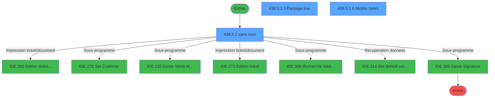
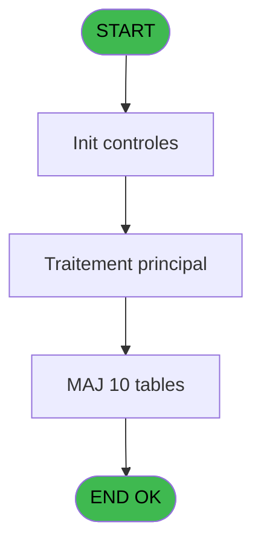
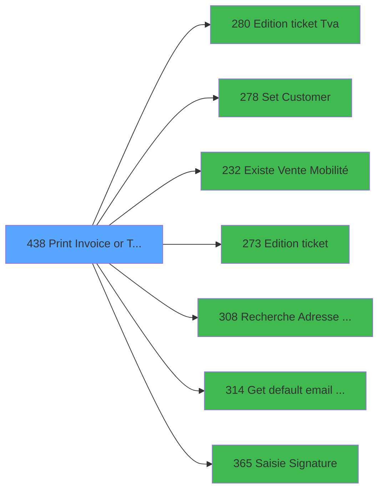

# PVE IDE 438 - Print Invoice or Ticket v2

> **Analyse**: Phases 1-4 2026-02-03 20:09 -> 20:09 (15s) | Assemblage 20:09
> **Pipeline**: V7.2 Enrichi
> **Structure**: 4 onglets (Resume | Ecrans | Donnees | Connexions)

<!-- TAB:Resume -->

## 1. FICHE D'IDENTITE

| Attribut | Valeur |
|----------|--------|
| Projet | PVE |
| IDE Position | 438 |
| Nom Programme | Print Invoice or Ticket v2 |
| Fichier source | `Prg_438.xml` |
| Dossier IDE | A |
| Taches | 39 (3 ecrans visibles) |
| Tables modifiees | 10 |
| Programmes appeles | 7 |

## 2. DESCRIPTION FONCTIONNELLE

**Print Invoice or Ticket v2** assure la gestion complete de ce processus, accessible depuis [Menu Main (TPE) (IDE 403)](PVE-IDE-403.md).

Le flux de traitement s'organise en **6 blocs fonctionnels** :

- **Traitement** (26 taches) : traitements metier divers
- **Consultation** (4 taches) : ecrans de recherche, selection et consultation
- **Impression** (4 taches) : generation de tickets et documents
- **Initialisation** (2 taches) : reinitialisation d'etats et de variables de travail
- **Calcul** (2 taches) : calculs de montants, stocks ou compteurs
- **Creation** (1 tache) : insertion d'enregistrements en base (mouvements, prestations)

**Donnees modifiees** : 10 tables en ecriture (transac_detail_bar, transac_entete_bar, comptable________cte, pv_ownership, pv_cust_packages, pv_package_composants, village_a_traiter, import_avertiss__an_val, cumul_mvt_stock_histo, Table_1501).

Detail : phases du traitement

#### Phase 1 : Impression (4 taches)

- **438** - Print Invoice **[[ECRAN]](#ecran-t1)**
- **438.3** - EDITION
- **438.5** - PRINT AGAIN **[[ECRAN]](#ecran-t23)**
- **438.5.1.1** - Print Again Gener

Delegue a : [Edition ticket (Tva) (IDE 280)](PVE-IDE-280.md), [Edition ticket (IDE 273)](PVE-IDE-273.md)

#### Phase 2 : Traitement (26 taches)

- **438.1** - PARAMETERS
- **438.2.1.1.1** - Temp generation
- **438.2.1.1.2** - Temp generation Gift Pass
- **438.2.2.1** - Temp generation
- **438.3.1** - Package line **[[ECRAN]](#ecran-t11)**
- **438.3.1.1** - Package line
- **438.3.2** - Package blank line
- **438.3.3** - Filiations
- **438.3.3.1** - Ski Shoes Name
- **438.4** - HISTO
- **438.4.1** - Generation
- **438.4.1.1** - header
- **438.4.1.1.1** - Club Med Pass
- **438.4.1.2** - Lines
- **438.4.2** - Package line
- **438.4.2.1** - Club Med Pass
- **438.5.1** - (sans nom) **[[ECRAN]](#ecran-t24)**
- **438.5.1.1.2.1** - Temp generation
- **438.5.1.2** - Trace Again
- **438.5.1.3** - Package line **[[ECRAN]](#ecran-t30)**
- **438.5.1.4** - Package line
- **438.5.1.6** - Mobile Sales **[[ECRAN]](#ecran-t33)**
- **438.6** - CHECK HISTO
- **438.7.1** - Package
- **438.7.2** - Filiation
- **438.8** - Search for Gift Pass **[[ECRAN]](#ecran-t38)**

Delegue a : [Set Customer (IDE 278)](PVE-IDE-278.md), [Get default email address (IDE 314)](PVE-IDE-314.md)

#### Phase 3 : Consultation (4 taches)

- **438.2** - SELECTION **[[ECRAN]](#ecran-t3)**
- **438.2.1** - Selection Packages **[[ECRAN]](#ecran-t4)**
- **438.2.2** - Selection Filiations
- **438.5.1.1.2** - Selection Filiations

Delegue a : [Recherche Adresse Mail (IDE 308)](PVE-IDE-308.md), [Get default email address (IDE 314)](PVE-IDE-314.md)

#### Phase 4 : Calcul (2 taches)

- **438.2.1.1** - Selection Pv_Compta
- **438.5.1.1.1** - Load temp compta

#### Phase 5 : Initialisation (2 taches)

- **438.5.1.5** - Raz Tempo
- **438.7** - RAZ TEMPO

#### Phase 6 : Creation (1 tache)

- **438.9** - CreationMail pour File Traitem

#### Tables impactees

| Table | Operations | Role metier |
|-------|-----------|-------------|
| cumul_mvt_stock_histo | **W**/L (12 usages) | Articles et stock |
| pv_ownership | R/**W**/L (4 usages) |  |
| import_avertiss__an_val | **W**/L (4 usages) |  |
| village_a_traiter | **W**/L (3 usages) |  |
| pv_cust_packages | **W**/L (3 usages) |  |
| pv_package_composants | **W** (1 usages) |  |
| comptable________cte | **W** (1 usages) |  |
| Table_1501 | **W** (1 usages) |  |
| transac_entete_bar | **W** (1 usages) |  |
| transac_detail_bar | **W** (1 usages) |  |

## 3. BLOCS FONCTIONNELS

### 3.1 Impression (4 taches)

Generation des documents et tickets.

---

#### 438 - Print Invoice [[ECRAN]](#ecran-t1)

**Role** : Generation du document : Print Invoice.
**Ecran** : 640 x 65 DLU (MDI) | [Voir mockup](#ecran-t1)

3 sous-taches directes

| Tache | Nom | Bloc |
|-------|-----|------|
| [438.3](#t10) | EDITION | Impression |
| [438.5](#t23) | PRINT AGAIN **[[ECRAN]](#ecran-t23)** | Impression |
| [438.5.1.1](#t25) | Print Again Gener | Impression |

**Variables liees** : G (P. PrintAgain), V (PrintAgainExecution), W (PrintAgainPreview), X (PrintAgainCopy)
**Delegue a** : [Edition ticket (Tva) (IDE 280)](PVE-IDE-280.md), [Edition ticket (IDE 273)](PVE-IDE-273.md)

---

#### 438.3 - EDITION

**Role** : Generation du document : EDITION.
**Delegue a** : [Edition ticket (Tva) (IDE 280)](PVE-IDE-280.md), [Edition ticket (IDE 273)](PVE-IDE-273.md)

---

#### 438.5 - PRINT AGAIN [[ECRAN]](#ecran-t23)

**Role** : Generation du document : PRINT AGAIN.
**Ecran** : 375 x 240 DLU (MDI) | [Voir mockup](#ecran-t23)
**Variables liees** : G (P. PrintAgain), V (PrintAgainExecution), W (PrintAgainPreview), X (PrintAgainCopy)
**Delegue a** : [Edition ticket (Tva) (IDE 280)](PVE-IDE-280.md), [Edition ticket (IDE 273)](PVE-IDE-273.md)

---

#### 438.5.1.1 - Print Again Gener

**Role** : Generation du document : Print Again Gener.
**Variables liees** : G (P. PrintAgain), V (PrintAgainExecution), W (PrintAgainPreview), X (PrintAgainCopy)
**Delegue a** : [Edition ticket (Tva) (IDE 280)](PVE-IDE-280.md), [Edition ticket (IDE 273)](PVE-IDE-273.md)

### 3.2 Traitement (26 taches)

Traitements internes.

---

#### 438.1 - PARAMETERS

**Role** : Traitement : PARAMETERS.

---

#### 438.2.1.1.1 - Temp generation

**Role** : Traitement : Temp generation.

---

#### 438.2.1.1.2 - Temp generation Gift Pass

**Role** : Calcul fidelite/avantage : Temp generation Gift Pass.
**Variables liees** : K (P. Club Med Pass), BL (v Solde Gift Pass), BM (v Existe Gift Pass), BN (v.Message Solde Gift Pass)

---

#### 438.2.2.1 - Temp generation

**Role** : Traitement : Temp generation.

---

#### 438.3.1 - Package line [[ECRAN]](#ecran-t11)

**Role** : Traitement : Package line.
**Ecran** : 557 x 327 DLU (MDI) | [Voir mockup](#ecran-t11)
**Variables liees** : F (P. Package id), Z (HeaderLine01), BA (HeaderLine02), BB (HeaderLine03), BC (HeaderLine04)

---

#### 438.3.1.1 - Package line

**Role** : Traitement : Package line.
**Variables liees** : F (P. Package id), Z (HeaderLine01), BA (HeaderLine02), BB (HeaderLine03), BC (HeaderLine04)

---

#### 438.3.2 - Package blank line

**Role** : Traitement : Package blank line.
**Variables liees** : F (P. Package id), Z (HeaderLine01), BA (HeaderLine02), BB (HeaderLine03), BC (HeaderLine04)

---

#### 438.3.3 - Filiations

**Role** : Traitement : Filiations.

---

#### 438.3.3.1 - Ski Shoes Name

**Role** : Traitement : Ski Shoes Name.

---

#### 438.4 - HISTO

**Role** : Traitement : HISTO.
**Variables liees** : Y (L ExistHistoric ?)

---

#### 438.4.1 - Generation

**Role** : Traitement : Generation.

---

#### 438.4.1.1 - header

**Role** : Traitement : header.
**Variables liees** : Z (HeaderLine01), BA (HeaderLine02), BB (HeaderLine03), BC (HeaderLine04), BD (HeaderLine05)

---

#### 438.4.1.1.1 - Club Med Pass

**Role** : Traitement : Club Med Pass.
**Variables liees** : K (P. Club Med Pass), BL (v Solde Gift Pass), BM (v Existe Gift Pass), BN (v.Message Solde Gift Pass)

---

#### 438.4.1.2 - Lines

**Role** : Traitement : Lines.

---

#### 438.4.2 - Package line

**Role** : Traitement : Package line.
**Variables liees** : F (P. Package id), Z (HeaderLine01), BA (HeaderLine02), BB (HeaderLine03), BC (HeaderLine04)

---

#### 438.4.2.1 - Club Med Pass

**Role** : Traitement : Club Med Pass.
**Variables liees** : K (P. Club Med Pass), BL (v Solde Gift Pass), BM (v Existe Gift Pass), BN (v.Message Solde Gift Pass)

---

#### 438.5.1 - (sans nom) [[ECRAN]](#ecran-t24)

**Role** : Traitement interne.
**Ecran** : 530 x 271 DLU (MDI) | [Voir mockup](#ecran-t24)

---

#### 438.5.1.1.2.1 - Temp generation

**Role** : Traitement : Temp generation.

---

#### 438.5.1.2 - Trace Again

**Role** : Traitement : Trace Again.
**Variables liees** : G (P. PrintAgain), V (PrintAgainExecution), W (PrintAgainPreview), X (PrintAgainCopy)

---

#### 438.5.1.3 - Package line [[ECRAN]](#ecran-t30)

**Role** : Traitement : Package line.
**Ecran** : 430 x 198 DLU (MDI) | [Voir mockup](#ecran-t30)
**Variables liees** : F (P. Package id), Z (HeaderLine01), BA (HeaderLine02), BB (HeaderLine03), BC (HeaderLine04)

---

#### 438.5.1.4 - Package line

**Role** : Traitement : Package line.
**Variables liees** : F (P. Package id), Z (HeaderLine01), BA (HeaderLine02), BB (HeaderLine03), BC (HeaderLine04)

---

#### 438.5.1.6 - Mobile Sales [[ECRAN]](#ecran-t33)

**Role** : Traitement : Mobile Sales.
**Ecran** : 589 x 276 DLU | [Voir mockup](#ecran-t33)

---

#### 438.6 - CHECK HISTO

**Role** : Traitement : CHECK HISTO.
**Variables liees** : Y (L ExistHistoric ?)

---

#### 438.7.1 - Package

**Role** : Traitement : Package.
**Variables liees** : F (P. Package id)

---

#### 438.7.2 - Filiation

**Role** : Traitement : Filiation.
**Variables liees** : E (P. Filiation), P (P.Filiation)

---

#### 438.8 - Search for Gift Pass [[ECRAN]](#ecran-t38)

**Role** : Calcul fidelite/avantage : Search for Gift Pass.
**Ecran** : 175 x 195 DLU | [Voir mockup](#ecran-t38)
**Variables liees** : K (P. Club Med Pass), BL (v Solde Gift Pass), BM (v Existe Gift Pass), BN (v.Message Solde Gift Pass)

### 3.3 Consultation (4 taches)

Ecrans de recherche et consultation.

---

#### 438.2 - SELECTION [[ECRAN]](#ecran-t3)

**Role** : Selection par l'operateur : SELECTION.
**Ecran** : 640 x 0 DLU (MDI) | [Voir mockup](#ecran-t3)
**Delegue a** : [Recherche Adresse Mail (IDE 308)](PVE-IDE-308.md)

---

#### 438.2.1 - Selection Packages [[ECRAN]](#ecran-t4)

**Role** : Selection par l'operateur : Selection Packages.
**Ecran** : 814 x 0 DLU (MDI) | [Voir mockup](#ecran-t4)
**Delegue a** : [Recherche Adresse Mail (IDE 308)](PVE-IDE-308.md)

---

#### 438.2.2 - Selection Filiations

**Role** : Selection par l'operateur : Selection Filiations.
**Delegue a** : [Recherche Adresse Mail (IDE 308)](PVE-IDE-308.md)

---

#### 438.5.1.1.2 - Selection Filiations

**Role** : Selection par l'operateur : Selection Filiations.
**Delegue a** : [Recherche Adresse Mail (IDE 308)](PVE-IDE-308.md)

### 3.4 Calcul (2 taches)

Calculs metier : montants, stocks, compteurs.

---

#### 438.2.1.1 - Selection Pv_Compta

**Role** : Selection par l'operateur : Selection Pv_Compta.

---

#### 438.5.1.1.1 - Load temp compta

**Role** : Traitement : Load temp compta.

### 3.5 Initialisation (2 taches)

Reinitialisation d'etats et variables de travail.

---

#### 438.5.1.5 - Raz Tempo

**Role** : Reinitialisation : Raz Tempo.

---

#### 438.7 - RAZ TEMPO

**Role** : Reinitialisation : RAZ TEMPO.

### 3.6 Creation (1 tache)

Insertion de nouveaux enregistrements en base.

---

#### 438.9 - CreationMail pour File Traitem

**Role** : Creation d'enregistrement : CreationMail pour File Traitem.

## 5. REGLES METIER

*(Aucune regle metier identifiee)*

## 6. CONTEXTE

- **Appele par**: [Menu Main (TPE) (IDE 403)](PVE-IDE-403.md)
- **Appelle**: 7 programmes | **Tables**: 19 (W:10 R:6 L:11) | **Taches**: 39 | **Expressions**: 34

<!-- TAB:Ecrans -->

## 8. ECRANS

### 8.1 Forms visibles (3 / 39)

| # | Position | Tache | Nom | Type | Largeur | Hauteur | Bloc |
|---|----------|-------|-----|------|---------|---------|------|
| 1 | 438.5.1 | 438.5.1 | (sans nom) | MDI | 530 | 271 | Traitement |
| 2 | 438.5.1.3 | 438.5.1.3 | Package line | MDI | 430 | 198 | Traitement |
| 3 | 438.5.1.6 | 438.5.1.6 | Mobile Sales | Type0 | 589 | 276 | Traitement |

### 8.2 Mockups Ecrans

---

#### 438.5.1 - (sans nom)
**Tache** : [438.5.1](#t24) | **Type** : MDI | **Dimensions** : 530 x 271 DLU
**Bloc** : Traitement | **Titre IDE** : (sans nom)

<!-- FORM-DATA:
{
    "width":  530,
    "vFactor":  8,
    "type":  "MDI",
    "hFactor":  4,
    "controls":  [
                     {
                         "x":  30,
                         "type":  "label",
                         "var":  "",
                         "y":  59,
                         "w":  42,
                         "fmt":  "",
                         "name":  "",
                         "h":  10,
                         "color":  "183",
                         "text":  " # Invoice",
                         "parent":  null
                     },
                     {
                         "x":  90,
                         "type":  "label",
                         "var":  "",
                         "y":  59,
                         "w":  40,
                         "fmt":  "",
                         "name":  "",
                         "h":  10,
                         "color":  "183",
                         "text":  "Print date",
                         "parent":  null
                     },
                     {
                         "x":  153,
                         "type":  "label",
                         "var":  "",
                         "y":  59,
                         "w":  44,
                         "fmt":  "",
                         "name":  "",
                         "h":  10,
                         "color":  "183",
                         "text":  "Print time",
                         "parent":  null
                     },
                     {
                         "x":  246,
                         "type":  "label",
                         "var":  "",
                         "y":  72,
                         "w":  249,
                         "fmt":  "",
                         "name":  "",
                         "h":  143,
                         "color":  "182",
                         "text":  "",
                         "parent":  null
                     },
                     {
                         "x":  326,
                         "type":  "label",
                         "var":  "",
                         "y":  186,
                         "w":  49,
                         "fmt":  "",
                         "name":  "",
                         "h":  14,
                         "color":  "186",
                         "text":  "Copy :",
                         "parent":  null
                     },
                     {
                         "x":  0,
                         "type":  "label",
                         "var":  "",
                         "y":  0,
                         "w":  528,
                         "fmt":  "",
                         "name":  "",
                         "h":  41,
                         "color":  "182",
                         "text":  "",
                         "parent":  null
                     },
                     {
                         "x":  13,
                         "type":  "label",
                         "var":  "",
                         "y":  15,
                         "w":  99,
                         "fmt":  "",
                         "name":  "",
                         "h":  10,
                         "color":  "186",
                         "text":  "Re-Print invoices",
                         "parent":  8
                     },
                     {
                         "x":  23,
                         "type":  "table",
                         "var":  "",
                         "name":  "",
                         "titleH":  12,
                         "color":  "110",
                         "w":  178,
                         "y":  70,
                         "fmt":  "",
                         "parent":  null,
                         "text":  "",
                         "rowH":  24,
                         "h":  145,
                         "cols":  [
                                      {
                                          "title":  "",
                                          "layer":  1,
                                          "w":  54
                                      },
                                      {
                                          "title":  "",
                                          "layer":  2,
                                          "w":  64
                                      },
                                      {
                                          "title":  "",
                                          "layer":  3,
                                          "w":  53
                                      }
                                  ],
                         "rows":  3
                     },
                     {
                         "x":  0,
                         "type":  "label",
                         "var":  "",
                         "y":  236,
                         "w":  528,
                         "fmt":  "",
                         "name":  "",
                         "h":  34,
                         "color":  "6",
                         "text":  "",
                         "parent":  null
                     },
                     {
                         "x":  25,
                         "type":  "edit",
                         "var":  "",
                         "y":  73,
                         "w":  52,
                         "fmt":  "6Z",
                         "name":  "",
                         "h":  20,
                         "color":  "110",
                         "text":  "",
                         "parent":  11
                     },
                     {
                         "x":  82,
                         "type":  "edit",
                         "var":  "",
                         "y":  73,
                         "w":  56,
                         "fmt":  "##/##/##Z",
                         "name":  "CTRL_001",
                         "h":  20,
                         "color":  "110",
                         "text":  "",
                         "parent":  11
                     },
                     {
                         "x":  147,
                         "type":  "edit",
                         "var":  "",
                         "y":  73,
                         "w":  50,
                         "fmt":  "HH:MMZ",
                         "name":  "CTRL_002",
                         "h":  20,
                         "color":  "110",
                         "text":  "",
                         "parent":  11
                     },
                     {
                         "x":  324,
                         "type":  "checkbox",
                         "var":  "",
                         "y":  164,
                         "w":  97,
                         "fmt":  "",
                         "name":  "Print Preview",
                         "h":  14,
                         "color":  "186",
                         "text":  " Print Preview",
                         "parent":  null
                     },
                     {
                         "x":  397,
                         "type":  "edit",
                         "var":  "",
                         "y":  186,
                         "w":  19,
                         "fmt":  "1Z",
                         "name":  "Copy",
                         "h":  14,
                         "color":  "186",
                         "text":  "",
                         "parent":  null
                     },
                     {
                         "x":  478,
                         "type":  "image",
                         "var":  "",
                         "y":  3,
                         "w":  48,
                         "fmt":  "",
                         "name":  "",
                         "h":  37,
                         "color":  "",
                         "text":  "",
                         "parent":  8
                     },
                     {
                         "x":  246,
                         "type":  "image",
                         "var":  "",
                         "y":  43,
                         "w":  249,
                         "fmt":  "",
                         "name":  "",
                         "h":  113,
                         "color":  "142",
                         "text":  "",
                         "parent":  null
                     },
                     {
                         "x":  201,
                         "type":  "button",
                         "var":  "",
                         "y":  71,
                         "w":  44,
                         "fmt":  "Ù",
                         "name":  "",
                         "h":  28,
                         "color":  "",
                         "text":  "",
                         "parent":  null
                     },
                     {
                         "x":  201,
                         "type":  "button",
                         "var":  "",
                         "y":  99,
                         "w":  44,
                         "fmt":  "ñ",
                         "name":  "",
                         "h":  44,
                         "color":  "",
                         "text":  "",
                         "parent":  null
                     },
                     {
                         "x":  201,
                         "type":  "button",
                         "var":  "",
                         "y":  143,
                         "w":  44,
                         "fmt":  "ò",
                         "name":  "",
                         "h":  44,
                         "color":  "",
                         "text":  "",
                         "parent":  null
                     },
                     {
                         "x":  201,
                         "type":  "button",
                         "var":  "",
                         "y":  187,
                         "w":  44,
                         "fmt":  "Ú",
                         "name":  "",
                         "h":  28,
                         "color":  "",
                         "text":  "",
                         "parent":  null
                     },
                     {
                         "x":  374,
                         "type":  "button",
                         "var":  "",
                         "y":  241,
                         "w":  38,
                         "fmt":  "",
                         "name":  "BTZOOM",
                         "h":  28,
                         "color":  "",
                         "text":  "",
                         "parent":  null
                     },
                     {
                         "x":  411,
                         "type":  "button",
                         "var":  "",
                         "y":  241,
                         "w":  38,
                         "fmt":  "",
                         "name":  "BTPRINT",
                         "h":  28,
                         "color":  "",
                         "text":  "",
                         "parent":  null
                     },
                     {
                         "x":  449,
                         "type":  "button",
                         "var":  "",
                         "y":  241,
                         "w":  77,
                         "fmt":  "\u0026Exit",
                         "name":  "BTEXIT",
                         "h":  28,
                         "color":  "",
                         "text":  "",
                         "parent":  null
                     },
                     {
                         "x":  4,
                         "type":  "button",
                         "var":  "",
                         "y":  241,
                         "w":  77,
                         "fmt":  "\u0026Mobile Sales",
                         "name":  "BT_Mobil_sales",
                         "h":  28,
                         "color":  "",
                         "text":  "",
                         "parent":  23
                     }
                 ],
    "taskId":  "438.5.1",
    "height":  271
}
-->

<strong>Champs : 5 champs</strong>

| Pos (x,y) | Nom | Variable | Type |
|-----------|-----|----------|------|
| 25,73 | 6Z | - | edit |
| 82,73 | CTRL_001 | - | edit |
| 147,73 | CTRL_002 | - | edit |
| 324,164 | Print Preview | - | checkbox |
| 397,186 | Copy | - | edit |

<strong>Boutons : 8 boutons</strong>

| Bouton | Pos (x,y) | Action |
|--------|-----------|--------|
| Ù | 201,71 | Bouton fonctionnel |
| ñ | 201,99 | Bouton fonctionnel |
| ò | 201,143 | Bouton fonctionnel |
| Ú | 201,187 | Bouton fonctionnel |
| BTZOOM | 374,241 | Ouvre la selection |
| BTPRINT | 411,241 | Lance l'impression |
| Exit | 449,241 | Quitte le programme |
| Mobile Sales | 4,241 | Appel [Existe Vente Mobilité (IDE 232)](PVE-IDE-232.md) |

---

#### 438.5.1.3 - Package line
**Tache** : [438.5.1.3](#t30) | **Type** : MDI | **Dimensions** : 430 x 198 DLU
**Bloc** : Traitement | **Titre IDE** : Package line

<!-- FORM-DATA:
{
    "width":  430,
    "vFactor":  8,
    "type":  "MDI",
    "hFactor":  4,
    "controls":  [
                     {
                         "x":  5,
                         "type":  "label",
                         "var":  "",
                         "y":  2,
                         "w":  134,
                         "fmt":  "",
                         "name":  "",
                         "h":  12,
                         "color":  "183",
                         "text":  "Description",
                         "parent":  null
                     },
                     {
                         "x":  176,
                         "type":  "label",
                         "var":  "",
                         "y":  2,
                         "w":  52,
                         "fmt":  "",
                         "name":  "",
                         "h":  12,
                         "color":  "183",
                         "text":  "Date out",
                         "parent":  null
                     },
                     {
                         "x":  230,
                         "type":  "label",
                         "var":  "",
                         "y":  2,
                         "w":  52,
                         "fmt":  "",
                         "name":  "",
                         "h":  12,
                         "color":  "183",
                         "text":  "Date in",
                         "parent":  null
                     },
                     {
                         "x":  284,
                         "type":  "label",
                         "var":  "",
                         "y":  2,
                         "w":  27,
                         "fmt":  "",
                         "name":  "",
                         "h":  12,
                         "color":  "183",
                         "text":  "# Days",
                         "parent":  null
                     },
                     {
                         "x":  313,
                         "type":  "label",
                         "var":  "",
                         "y":  2,
                         "w":  64,
                         "fmt":  "",
                         "name":  "",
                         "h":  12,
                         "color":  "183",
                         "text":  "Amount",
                         "parent":  null
                     },
                     {
                         "x":  4,
                         "type":  "table",
                         "var":  "",
                         "name":  "",
                         "titleH":  12,
                         "color":  "110",
                         "w":  375,
                         "y":  15,
                         "fmt":  "",
                         "parent":  null,
                         "text":  "",
                         "rowH":  24,
                         "h":  142,
                         "cols":  [
                                      {
                                          "title":  "",
                                          "layer":  1,
                                          "w":  170
                                      },
                                      {
                                          "title":  "",
                                          "layer":  2,
                                          "w":  53
                                      },
                                      {
                                          "title":  "",
                                          "layer":  3,
                                          "w":  55
                                      },
                                      {
                                          "title":  "",
                                          "layer":  4,
                                          "w":  29
                                      },
                                      {
                                          "title":  "",
                                          "layer":  5,
                                          "w":  68
                                      }
                                  ],
                         "rows":  5
                     },
                     {
                         "x":  0,
                         "type":  "label",
                         "var":  "",
                         "y":  162,
                         "w":  428,
                         "fmt":  "",
                         "name":  "",
                         "h":  34,
                         "color":  "6",
                         "text":  "",
                         "parent":  null
                     },
                     {
                         "x":  313,
                         "type":  "edit",
                         "var":  "",
                         "y":  17,
                         "w":  64,
                         "fmt":  "N10.3C",
                         "name":  "CTRL_001",
                         "h":  20,
                         "color":  "110",
                         "text":  "",
                         "parent":  6
                     },
                     {
                         "x":  5,
                         "type":  "edit",
                         "var":  "",
                         "y":  17,
                         "w":  169,
                         "fmt":  "",
                         "name":  "CTRL_002",
                         "h":  20,
                         "color":  "110",
                         "text":  "",
                         "parent":  6
                     },
                     {
                         "x":  176,
                         "type":  "edit",
                         "var":  "",
                         "y":  17,
                         "w":  52,
                         "fmt":  "",
                         "name":  "",
                         "h":  20,
                         "color":  "110",
                         "text":  "",
                         "parent":  6
                     },
                     {
                         "x":  230,
                         "type":  "edit",
                         "var":  "",
                         "y":  17,
                         "w":  52,
                         "fmt":  "##/##/####Z",
                         "name":  "",
                         "h":  20,
                         "color":  "110",
                         "text":  "",
                         "parent":  6
                     },
                     {
                         "x":  284,
                         "type":  "edit",
                         "var":  "",
                         "y":  17,
                         "w":  27,
                         "fmt":  "3.1Z",
                         "name":  "",
                         "h":  20,
                         "color":  "110",
                         "text":  "",
                         "parent":  6
                     },
                     {
                         "x":  382,
                         "type":  "button",
                         "var":  "",
                         "y":  16,
                         "w":  44,
                         "fmt":  "Ù",
                         "name":  "",
                         "h":  28,
                         "color":  "",
                         "text":  "",
                         "parent":  null
                     },
                     {
                         "x":  382,
                         "type":  "button",
                         "var":  "",
                         "y":  44,
                         "w":  44,
                         "fmt":  "ñ",
                         "name":  "",
                         "h":  44,
                         "color":  "",
                         "text":  "",
                         "parent":  null
                     },
                     {
                         "x":  382,
                         "type":  "button",
                         "var":  "",
                         "y":  87,
                         "w":  44,
                         "fmt":  "ò",
                         "name":  "",
                         "h":  44,
                         "color":  "",
                         "text":  "",
                         "parent":  null
                     },
                     {
                         "x":  382,
                         "type":  "button",
                         "var":  "",
                         "y":  131,
                         "w":  44,
                         "fmt":  "Ú",
                         "name":  "",
                         "h":  28,
                         "color":  "",
                         "text":  "",
                         "parent":  null
                     },
                     {
                         "x":  350,
                         "type":  "button",
                         "var":  "",
                         "y":  167,
                         "w":  77,
                         "fmt":  "\u0026Exit",
                         "name":  "",
                         "h":  28,
                         "color":  "",
                         "text":  "",
                         "parent":  null
                     }
                 ],
    "taskId":  "438.5.1.3",
    "height":  198
}
-->

<strong>Champs : 5 champs</strong>

| Pos (x,y) | Nom | Variable | Type |
|-----------|-----|----------|------|
| 313,17 | CTRL_001 | - | edit |
| 5,17 | CTRL_002 | - | edit |
| 176,17 | (sans nom) | - | edit |
| 230,17 | ##/##/####Z | - | edit |
| 284,17 | 3.1Z | - | edit |

<strong>Boutons : 5 boutons</strong>

| Bouton | Pos (x,y) | Action |
|--------|-----------|--------|
| Ù | 382,16 | Bouton fonctionnel |
| ñ | 382,44 | Bouton fonctionnel |
| ò | 382,87 | Bouton fonctionnel |
| Ú | 382,131 | Bouton fonctionnel |
| Exit | 350,167 | Quitte le programme |

---

#### 438.5.1.6 - Mobile Sales
**Tache** : [438.5.1.6](#t33) | **Type** : Type0 | **Dimensions** : 589 x 276 DLU
**Bloc** : Traitement | **Titre IDE** : Mobile Sales

<!-- FORM-DATA:
{
    "width":  589,
    "vFactor":  8,
    "type":  "Type0",
    "hFactor":  4,
    "controls":  [
                     {
                         "x":  5,
                         "type":  "label",
                         "var":  "",
                         "y":  48,
                         "w":  40,
                         "fmt":  "",
                         "name":  "",
                         "h":  10,
                         "color":  "183",
                         "text":  "Print date",
                         "parent":  null
                     },
                     {
                         "x":  80,
                         "type":  "label",
                         "var":  "",
                         "y":  48,
                         "w":  44,
                         "fmt":  "",
                         "name":  "",
                         "h":  10,
                         "color":  "183",
                         "text":  "Print time",
                         "parent":  null
                     },
                     {
                         "x":  145,
                         "type":  "label",
                         "var":  "",
                         "y":  48,
                         "w":  42,
                         "fmt":  "",
                         "name":  "",
                         "h":  10,
                         "color":  "183",
                         "text":  " # Invoice",
                         "parent":  null
                     },
                     {
                         "x":  195,
                         "type":  "label",
                         "var":  "",
                         "y":  48,
                         "w":  42,
                         "fmt":  "",
                         "name":  "",
                         "h":  10,
                         "color":  "183",
                         "text":  "Service",
                         "parent":  null
                     },
                     {
                         "x":  238,
                         "type":  "label",
                         "var":  "",
                         "y":  48,
                         "w":  64,
                         "fmt":  "",
                         "name":  "",
                         "h":  10,
                         "color":  "183",
                         "text":  "Customer Name",
                         "parent":  null
                     },
                     {
                         "x":  5,
                         "type":  "label",
                         "var":  "",
                         "y":  206,
                         "w":  584,
                         "fmt":  "",
                         "name":  "",
                         "h":  31,
                         "color":  "182",
                         "text":  "",
                         "parent":  null
                     },
                     {
                         "x":  204,
                         "type":  "label",
                         "var":  "",
                         "y":  217,
                         "w":  49,
                         "fmt":  "",
                         "name":  "",
                         "h":  14,
                         "color":  "186",
                         "text":  "Copy :",
                         "parent":  null
                     },
                     {
                         "x":  2,
                         "type":  "label",
                         "var":  "",
                         "y":  4,
                         "w":  584,
                         "fmt":  "",
                         "name":  "",
                         "h":  41,
                         "color":  "182",
                         "text":  "",
                         "parent":  null
                     },
                     {
                         "x":  15,
                         "type":  "label",
                         "var":  "",
                         "y":  19,
                         "w":  99,
                         "fmt":  "",
                         "name":  "",
                         "h":  10,
                         "color":  "186",
                         "text":  "Re-Print invoices",
                         "parent":  9
                     },
                     {
                         "x":  3,
                         "type":  "table",
                         "var":  "",
                         "name":  "",
                         "titleH":  12,
                         "color":  "110",
                         "w":  543,
                         "y":  59,
                         "fmt":  "",
                         "parent":  null,
                         "text":  "",
                         "rowH":  24,
                         "h":  145,
                         "cols":  [
                                      {
                                          "title":  "",
                                          "layer":  1,
                                          "w":  72
                                      },
                                      {
                                          "title":  "",
                                          "layer":  2,
                                          "w":  60
                                      },
                                      {
                                          "title":  "",
                                          "layer":  3,
                                          "w":  53
                                      },
                                      {
                                          "title":  "",
                                          "layer":  4,
                                          "w":  41
                                      },
                                      {
                                          "title":  " ",
                                          "layer":  5,
                                          "w":  303
                                      }
                                  ],
                         "rows":  5
                     },
                     {
                         "x":  2,
                         "type":  "label",
                         "var":  "",
                         "y":  240,
                         "w":  584,
                         "fmt":  "",
                         "name":  "",
                         "h":  34,
                         "color":  "6",
                         "text":  "",
                         "parent":  null
                     },
                     {
                         "x":  536,
                         "type":  "image",
                         "var":  "",
                         "y":  9,
                         "w":  48,
                         "fmt":  "",
                         "name":  "",
                         "h":  35,
                         "color":  "",
                         "text":  "",
                         "parent":  9
                     },
                     {
                         "x":  6,
                         "type":  "edit",
                         "var":  "",
                         "y":  62,
                         "w":  68,
                         "fmt":  "",
                         "name":  "hpph_date",
                         "h":  20,
                         "color":  "110",
                         "text":  "",
                         "parent":  12
                     },
                     {
                         "x":  86,
                         "type":  "edit",
                         "var":  "",
                         "y":  63,
                         "w":  48,
                         "fmt":  "HH:MM",
                         "name":  "CTRL_001",
                         "h":  20,
                         "color":  "110",
                         "text":  "",
                         "parent":  12
                     },
                     {
                         "x":  141,
                         "type":  "edit",
                         "var":  "",
                         "y":  62,
                         "w":  44,
                         "fmt":  "6",
                         "name":  "hpph_chrono",
                         "h":  20,
                         "color":  "110",
                         "text":  "",
                         "parent":  12
                     },
                     {
                         "x":  192,
                         "type":  "edit",
                         "var":  "",
                         "y":  62,
                         "w":  35,
                         "fmt":  "",
                         "name":  "pv_service",
                         "h":  20,
                         "color":  "110",
                         "text":  "",
                         "parent":  12
                     },
                     {
                         "x":  239,
                         "type":  "edit",
                         "var":  "",
                         "y":  62,
                         "w":  303,
                         "fmt":  "",
                         "name":  "gm_nom",
                         "h":  20,
                         "color":  "110",
                         "text":  "",
                         "parent":  12
                     },
                     {
                         "x":  545,
                         "type":  "button",
                         "var":  "",
                         "y":  60,
                         "w":  44,
                         "fmt":  "Ù",
                         "name":  "",
                         "h":  28,
                         "color":  "",
                         "text":  "",
                         "parent":  null
                     },
                     {
                         "x":  545,
                         "type":  "button",
                         "var":  "",
                         "y":  88,
                         "w":  44,
                         "fmt":  "ñ",
                         "name":  "",
                         "h":  44,
                         "color":  "",
                         "text":  "",
                         "parent":  null
                     },
                     {
                         "x":  545,
                         "type":  "button",
                         "var":  "",
                         "y":  132,
                         "w":  44,
                         "fmt":  "ò",
                         "name":  "",
                         "h":  44,
                         "color":  "",
                         "text":  "",
                         "parent":  null
                     },
                     {
                         "x":  545,
                         "type":  "button",
                         "var":  "",
                         "y":  176,
                         "w":  44,
                         "fmt":  "Ú",
                         "name":  "",
                         "h":  28,
                         "color":  "",
                         "text":  "",
                         "parent":  null
                     },
                     {
                         "x":  22,
                         "type":  "checkbox",
                         "var":  "",
                         "y":  217,
                         "w":  97,
                         "fmt":  "",
                         "name":  "Print Preview",
                         "h":  14,
                         "color":  "186",
                         "text":  " Print Preview",
                         "parent":  null
                     },
                     {
                         "x":  275,
                         "type":  "edit",
                         "var":  "",
                         "y":  217,
                         "w":  19,
                         "fmt":  "1Z",
                         "name":  "Copy",
                         "h":  14,
                         "color":  "186",
                         "text":  "",
                         "parent":  null
                     },
                     {
                         "x":  432,
                         "type":  "button",
                         "var":  "",
                         "y":  245,
                         "w":  38,
                         "fmt":  "",
                         "name":  "BTZOOM",
                         "h":  28,
                         "color":  "",
                         "text":  "",
                         "parent":  null
                     },
                     {
                         "x":  469,
                         "type":  "button",
                         "var":  "",
                         "y":  245,
                         "w":  38,
                         "fmt":  "",
                         "name":  "BTPRINTM",
                         "h":  28,
                         "color":  "",
                         "text":  "",
                         "parent":  null
                     },
                     {
                         "x":  507,
                         "type":  "button",
                         "var":  "",
                         "y":  245,
                         "w":  77,
                         "fmt":  "\u0026Exit",
                         "name":  "BTEXIT",
                         "h":  28,
                         "color":  "",
                         "text":  "",
                         "parent":  null
                     }
                 ],
    "taskId":  "438.5.1.6",
    "height":  276
}
-->

<strong>Champs : 7 champs</strong>

| Pos (x,y) | Nom | Variable | Type |
|-----------|-----|----------|------|
| 6,62 | hpph_date | - | edit |
| 86,63 | CTRL_001 | - | edit |
| 141,62 | hpph_chrono | - | edit |
| 192,62 | pv_service | - | edit |
| 239,62 | gm_nom | - | edit |
| 22,217 | Print Preview | - | checkbox |
| 275,217 | Copy | - | edit |

<strong>Boutons : 7 boutons</strong>

| Bouton | Pos (x,y) | Action |
|--------|-----------|--------|
| Ù | 545,60 | Bouton fonctionnel |
| ñ | 545,88 | Bouton fonctionnel |
| ò | 545,132 | Bouton fonctionnel |
| Ú | 545,176 | Bouton fonctionnel |
| BTZOOM | 432,245 | Ouvre la selection |
| BTPRINTM | 469,245 | Lance l'impression |
| Exit | 507,245 | Quitte le programme |

## 9. NAVIGATION

### 9.1 Enchainement des ecrans

**Detail par enchainement :**

| Depuis | Action | Vers | Retour |
|--------|--------|------|--------|
|  | Impression ticket/document | [Edition ticket (Tva) (IDE 280)](PVE-IDE-280.md) | Retour ecran |
|  | Sous-programme | [Set Customer (IDE 278)](PVE-IDE-278.md) | Retour ecran |
|  | Sous-programme | [Existe Vente Mobilité (IDE 232)](PVE-IDE-232.md) | Retour ecran |
|  | Impression ticket/document | [Edition ticket (IDE 273)](PVE-IDE-273.md) | Retour ecran |
|  | Sous-programme | [Recherche Adresse Mail (IDE 308)](PVE-IDE-308.md) | Retour ecran |
|  | Recuperation donnees | [Get default email address (IDE 314)](PVE-IDE-314.md) | Retour ecran |
|  | Sous-programme | [Saisie Signature (IDE 365)](PVE-IDE-365.md) | Retour ecran |

### 9.3 Structure hierarchique (39 taches)

| Position | Tache | Type | Dimensions | Bloc |
|----------|-------|------|------------|------|
| **438.1** | [**Print Invoice** (438)](#t1) [mockup](#ecran-t1) | MDI | 640x65 | Impression |
| 438.1.1 | [EDITION (438.3)](#t10) | MDI | - | |
| 438.1.2 | [PRINT AGAIN (438.5)](#t23) [mockup](#ecran-t23) | MDI | 375x240 | |
| 438.1.3 | [Print Again Gener (438.5.1.1)](#t25) | MDI | - | |
| **438.2** | [**PARAMETERS** (438.1)](#t2) | MDI | - | Traitement |
| 438.2.1 | [Temp generation (438.2.1.1.1)](#t6) | MDI | - | |
| 438.2.2 | [Temp generation Gift Pass (438.2.1.1.2)](#t7) | MDI | - | |
| 438.2.3 | [Temp generation (438.2.2.1)](#t9) | MDI | - | |
| 438.2.4 | [Package line (438.3.1)](#t11) [mockup](#ecran-t11) | MDI | 557x327 | |
| 438.2.5 | [Package line (438.3.1.1)](#t12) | MDI | - | |
| 438.2.6 | [Package blank line (438.3.2)](#t13) | MDI | - | |
| 438.2.7 | [Filiations (438.3.3)](#t14) | MDI | - | |
| 438.2.8 | [Ski Shoes Name (438.3.3.1)](#t15) | MDI | - | |
| 438.2.9 | [HISTO (438.4)](#t16) | MDI | - | |
| 438.2.10 | [Generation (438.4.1)](#t17) | MDI | - | |
| 438.2.11 | [header (438.4.1.1)](#t18) | MDI | - | |
| 438.2.12 | [Club Med Pass (438.4.1.1.1)](#t19) | MDI | - | |
| 438.2.13 | [Lines (438.4.1.2)](#t20) | MDI | - | |
| 438.2.14 | [Package line (438.4.2)](#t21) | MDI | - | |
| 438.2.15 | [Club Med Pass (438.4.2.1)](#t22) | MDI | - | |
| 438.2.16 | [(sans nom) (438.5.1)](#t24) [mockup](#ecran-t24) | MDI | 530x271 | |
| 438.2.17 | [Temp generation (438.5.1.1.2.1)](#t28) | MDI | - | |
| 438.2.18 | [Trace Again (438.5.1.2)](#t29) | MDI | - | |
| 438.2.19 | [Package line (438.5.1.3)](#t30) [mockup](#ecran-t30) | MDI | 430x198 | |
| 438.2.20 | [Package line (438.5.1.4)](#t31) | MDI | - | |
| 438.2.21 | [Mobile Sales (438.5.1.6)](#t33) [mockup](#ecran-t33) | - | 589x276 | |
| 438.2.22 | [CHECK HISTO (438.6)](#t34) | MDI | - | |
| 438.2.23 | [Package (438.7.1)](#t36) | MDI | - | |
| 438.2.24 | [Filiation (438.7.2)](#t37) | MDI | - | |
| 438.2.25 | [Search for Gift Pass (438.8)](#t38) [mockup](#ecran-t38) | - | 175x195 | |
| **438.3** | [**SELECTION** (438.2)](#t3) [mockup](#ecran-t3) | MDI | 640x0 | Consultation |
| 438.3.1 | [Selection Packages (438.2.1)](#t4) [mockup](#ecran-t4) | MDI | 814x0 | |
| 438.3.2 | [Selection Filiations (438.2.2)](#t8) | MDI | - | |
| 438.3.3 | [Selection Filiations (438.5.1.1.2)](#t27) | MDI | - | |
| **438.4** | [**Selection Pv_Compta** (438.2.1.1)](#t5) | MDI | - | Calcul |
| 438.4.1 | [Load temp compta (438.5.1.1.1)](#t26) | MDI | - | |
| **438.5** | [**Raz Tempo** (438.5.1.5)](#t32) | MDI | - | Initialisation |
| 438.5.1 | [RAZ TEMPO (438.7)](#t35) | MDI | - | |
| **438.6** | [**CreationMail pour File Traitem** (438.9)](#t39) | - | - | Creation |

### 9.4 Algorigramme

> **Legende**: Vert = START/END OK | Rouge = END KO | Bleu = Decisions
> *Algorigramme auto-genere. Utiliser `/algorigramme` pour une synthese metier detaillee.*

<!-- TAB:Donnees -->

## 10. TABLES

### Tables utilisees (19)

| ID | Nom | Description | Type | R | W | L | Usages |
|----|-----|-------------|------|---|---|---|--------|
| 14 | transac_detail_bar |  | DB |   | **W** |   | 1 |
| 15 | transac_entete_bar |  | DB |   | **W** |   | 1 |
| 31 | gm-complet_______gmc |  | DB | R |   |   | 2 |
| 34 | hebergement______heb | Hebergement (chambres) | DB |   |   | L | 1 |
| 40 | comptable________cte |  | DB |   | **W** |   | 1 |
| 67 | tables___________tab |  | DB | R |   |   | 1 |
| 263 | vente | Donnees de ventes | DB |   |   | L | 1 |
| 377 | pv_contracts |  | DB | R |   |   | 1 |
| 382 | pv_discount_reasons |  | DB | R |   | L | 10 |
| 395 | pv_ownership |  | DB | R | **W** | L | 4 |
| 396 | pv_cust_packages |  | DB |   | **W** | L | 3 |
| 397 | pv_package_composants |  | DB |   | **W** |   | 1 |
| 400 | pv_cust_rentals |  | DB |   |   | L | 6 |
| 404 | pv_sellers_by_week |  | DB | R |   | L | 5 |
| 419 | realise_articles_caution | Articles et stock | DB |   |   | L | 4 |
| 529 | village_a_traiter |  | TMP |   | **W** | L | 3 |
| 531 | import_avertiss__an_val |  | DB |   | **W** | L | 4 |
| 533 | cumul_mvt_stock_histo | Articles et stock | TMP |   | **W** | L | 12 |
| 1501 | Table_1501 |  | MEM |   | **W** |   | 1 |

### Colonnes par table (12 / 15 tables avec colonnes identifiees)

Table 14 - transac_detail_bar (**W**) - 1 usages

*Table utilisee uniquement en Link ou aucune colonne Real identifiee dans le DataView.*

Table 15 - transac_entete_bar (**W**) - 1 usages

*Table utilisee uniquement en Link ou aucune colonne Real identifiee dans le DataView.*

Table 31 - gm-complet_______gmc (R) - 2 usages

| Lettre | Variable | Acces | Type |
|--------|----------|-------|------|
| A | CautionExist | R | Logical |
| B | PrintLinePackagesInCurrentPage | R | Numeric |
| C | CurrentLinePackagesChrono | R | Numeric |
| D | TotalLinePackagesChrono | R | Numeric |
| E | PageNumber | R | Numeric |
| F | TotalLinePackages | R | Numeric |
| G | TotalTVA | R | Numeric |
| H | TotalTTCDiscounted | R | Numeric |
| I | TotalTo Pay | R | Numeric |
| J | TotalOnAccount | R | Numeric |
| K | ExisteMontantTva | R | Logical |
| L | AssuranceOnly | R | Logical |

Table 40 - comptable________cte (**W**) - 1 usages

| Lettre | Variable | Acces | Type |
|--------|----------|-------|------|
| A | T OD ? | W | Logical |
| B | T Vente ? | W | Logical |

Table 67 - tables___________tab (R) - 1 usages

| Lettre | Variable | Acces | Type |
|--------|----------|-------|------|
| A | P. Payer XCust Id | R | Numeric |
| B | P. Customer Id | R | Numeric |
| C | P. Societe | R | Alpha |
| D | P. Compte | R | Numeric |
| E | P. Filiation | R | Numeric |
| F | P. Package id | R | Numeric |
| G | P. PrintAgain | R | Logical |
| H | P. Copies | R | Numeric |
| I | P. Total Ticket | R | Numeric |
| J | P. Total Crédit Conso | R | Numeric |
| K | P. Club Med Pass | R | Alpha |
| L | P. Card type | R | Alpha |
| M | P. Service | R | Alpha |
| N | P.Societe | R | Alpha |
| O | P.Adherent | R | Numeric |
| P | P.Filiation | R | Numeric |
| Q | V VillageCode | R | Alpha |
| R | V AmountFormat | R | Alpha |
| S | V VatValue | R | Numeric |
| T | V Currency | R | Alpha |
| U | V Decimal | R | Numeric |
| V | PrintAgainExecution | R | Logical |
| W | PrintAgainPreview | R | Logical |
| X | PrintAgainCopy | R | Numeric |
| Y | L ExistHistoric ? | R | Logical |
| Z | HeaderLine01 | R | Alpha |
| BA | HeaderLine02 | R | Alpha |
| BB | HeaderLine03 | R | Alpha |
| BC | HeaderLine04 | R | Alpha |
| BD | HeaderLine05 | R | Alpha |
| BE | HeaderLine06 | R | Alpha |
| BF | HeaderLine07 | R | Alpha |
| BG | HeaderLine08 | R | Alpha |
| BH | HeaderLine09 | R | Alpha |
| BI | HeaderLine10 | R | Alpha |
| BJ | HeaderLine11 | R | Alpha |
| BK | V Facture | R | Numeric |
| BL | v Solde Gift Pass | R | Numeric |
| BM | v Existe Gift Pass | R | Logical |
| BN | v.Message Solde Gift Pass | R | Alpha |
| BO | v Adresse Mail (MOB) | R | Alpha |
| BP | V Nom Fic Pdf Ticket Mobilit | R | Alpha |
| BQ | v Langue Mail | R | Alpha |
| BR | v Existe Vente Mobilité | R | Logical |
| BS | v Validation envoi mail ? | R | Logical |

Table 377 - pv_contracts (R) - 1 usages

*Table utilisee uniquement en Link ou aucune colonne Real identifiee dans le DataView.*

Table 382 - pv_discount_reasons (R/L) - 10 usages

| Lettre | Variable | Acces | Type |
|--------|----------|-------|------|
| A | -------------package OUT | R | Alpha |
| B | v lien Package Out | R | Logical |
| C | -------------rentals OUT | R | Alpha |
| D | -------------rentals IN | R | Alpha |
| E | Libellé | R | Alpha |
| F | StartDate | R | Date |
| G | EndDate | R | Date |
| H | Days | R | Numeric |
| I | EndDate | R | Date |
| J | Days | R | Numeric |
| K | LibelléAssurance | R | Alpha |
| L | Iteration Edit Gift Pass | R | Numeric |

Table 395 - pv_ownership (R/**W**/L) - 4 usages

| Lettre | Variable | Acces | Type |
|--------|----------|-------|------|
| A | B Mobiles Sales | W | Alpha |
| B | V Print Preview | W | Logical |
| C | V Copy | W | Numeric |
| D | V Reedtion Mobilité | W | Logical |
| E | V xcustId Reedtion Mobilite | W | Numeric |
| F | PE.Numchrono | W | Numeric |
| G | PE.Numchrono | W | Numeric |

Table 396 - pv_cust_packages (**W**/L) - 3 usages

| Lettre | Variable | Acces | Type |
|--------|----------|-------|------|
| A | P. Payer XCust Id | W | Numeric |
| B | P. Customer Id | W | Numeric |
| C | CurrentLinePackagesChrono | W | Numeric |
| D | TotalLinePackagesChrono | W | Numeric |
| E | V xcustId Reedtion Mobilite | W | Numeric |
| F | TotalLinePackages | W | Numeric |

Table 397 - pv_package_composants (**W**) - 1 usages

| Lettre | Variable | Acces | Type |
|--------|----------|-------|------|
| A | -------------package OUT | W | Alpha |
| B | PrintLinePackagesInCurrentPage | W | Numeric |
| C | CurrentLinePackagesChrono | W | Numeric |
| D | TotalLinePackagesChrono | W | Numeric |
| E | v lien Package In | W | Logical |
| F | P. Package id | W | Numeric |

Table 404 - pv_sellers_by_week (R/L) - 5 usages

*Table utilisee uniquement en Link ou aucune colonne Real identifiee dans le DataView.*

Table 529 - village_a_traiter (**W**/L) - 3 usages

| Lettre | Variable | Acces | Type |
|--------|----------|-------|------|
| Q | V VillageCode | W | Alpha |

Table 531 - import_avertiss__an_val (**W**/L) - 4 usages

*Table utilisee uniquement en Link ou aucune colonne Real identifiee dans le DataView.*

Table 533 - cumul_mvt_stock_histo (**W**/L) - 12 usages

| Lettre | Variable | Acces | Type |
|--------|----------|-------|------|
| Y | L ExistHistoric ? | W | Logical |

Table 1501 - Table_1501 (**W**) - 1 usages

*Table utilisee uniquement en Link ou aucune colonne Real identifiee dans le DataView.*

## 11. VARIABLES

### 11.1 Parametres entrants (16)

Variables recues du programme appelant ([Menu Main (TPE) (IDE 403)](PVE-IDE-403.md)).

| Lettre | Nom | Type | Usage dans |
|--------|-----|------|-----------|
| A | P. Payer XCust Id | Numeric | 2x parametre entrant |
| B | P. Customer Id | Numeric | 1x parametre entrant |
| C | P. Societe | Alpha | - |
| D | P. Compte | Numeric | - |
| E | P. Filiation | Numeric | - |
| F | P. Package id | Numeric | - |
| G | P. PrintAgain | Logical | 2x parametre entrant |
| H | P. Copies | Numeric | - |
| I | P. Total Ticket | Numeric | - |
| J | P. Total Crédit Conso | Numeric | - |
| K | P. Club Med Pass | Alpha | - |
| L | P. Card type | Alpha | - |
| M | P. Service | Alpha | 1x parametre entrant |
| N | P.Societe | Alpha | - |
| O | P.Adherent | Numeric | - |
| P | P.Filiation | Numeric | - |

### 11.2 Variables de session (14)

Variables persistantes pendant toute la session.

| Lettre | Nom | Type | Usage dans |
|--------|-----|------|-----------|
| Q | V VillageCode | Alpha | - |
| R | V AmountFormat | Alpha | - |
| S | V VatValue | Numeric | - |
| T | V Currency | Alpha | - |
| U | V Decimal | Numeric | - |
| BK | V Facture | Numeric | - |
| BL | v Solde Gift Pass | Numeric | - |
| BM | v Existe Gift Pass | Logical | - |
| BN | v.Message Solde Gift Pass | Alpha | - |
| BO | v Adresse Mail (MOB) | Alpha | - |
| BP | V Nom Fic Pdf Ticket Mobilit | Alpha | - |
| BQ | v Langue Mail | Alpha | - |
| BR | v Existe Vente Mobilité | Logical | - |
| BS | v Validation envoi mail ? | Logical | - |

### 11.3 Autres (15)

Variables diverses.

| Lettre | Nom | Type | Usage dans |
|--------|-----|------|-----------|
| V | PrintAgainExecution | Logical | 1x refs |
| W | PrintAgainPreview | Logical | - |
| X | PrintAgainCopy | Numeric | - |
| Y | L ExistHistoric ? | Logical | 1x refs |
| Z | HeaderLine01 | Alpha | - |
| BA | HeaderLine02 | Alpha | - |
| BB | HeaderLine03 | Alpha | - |
| BC | HeaderLine04 | Alpha | - |
| BD | HeaderLine05 | Alpha | - |
| BE | HeaderLine06 | Alpha | - |
| BF | HeaderLine07 | Alpha | - |
| BG | HeaderLine08 | Alpha | - |
| BH | HeaderLine09 | Alpha | - |
| BI | HeaderLine10 | Alpha | - |
| BJ | HeaderLine11 | Alpha | - |

Toutes les 45 variables (liste complete)

| Cat | Lettre | Nom Variable | Type |
|-----|--------|--------------|------|
| P0 | **A** | P. Payer XCust Id | Numeric |
| P0 | **B** | P. Customer Id | Numeric |
| P0 | **C** | P. Societe | Alpha |
| P0 | **D** | P. Compte | Numeric |
| P0 | **E** | P. Filiation | Numeric |
| P0 | **F** | P. Package id | Numeric |
| P0 | **G** | P. PrintAgain | Logical |
| P0 | **H** | P. Copies | Numeric |
| P0 | **I** | P. Total Ticket | Numeric |
| P0 | **J** | P. Total Crédit Conso | Numeric |
| P0 | **K** | P. Club Med Pass | Alpha |
| P0 | **L** | P. Card type | Alpha |
| P0 | **M** | P. Service | Alpha |
| P0 | **N** | P.Societe | Alpha |
| P0 | **O** | P.Adherent | Numeric |
| P0 | **P** | P.Filiation | Numeric |
| V. | **Q** | V VillageCode | Alpha |
| V. | **R** | V AmountFormat | Alpha |
| V. | **S** | V VatValue | Numeric |
| V. | **T** | V Currency | Alpha |
| V. | **U** | V Decimal | Numeric |
| V. | **BK** | V Facture | Numeric |
| V. | **BL** | v Solde Gift Pass | Numeric |
| V. | **BM** | v Existe Gift Pass | Logical |
| V. | **BN** | v.Message Solde Gift Pass | Alpha |
| V. | **BO** | v Adresse Mail (MOB) | Alpha |
| V. | **BP** | V Nom Fic Pdf Ticket Mobilit | Alpha |
| V. | **BQ** | v Langue Mail | Alpha |
| V. | **BR** | v Existe Vente Mobilité | Logical |
| V. | **BS** | v Validation envoi mail ? | Logical |
| Autre | **V** | PrintAgainExecution | Logical |
| Autre | **W** | PrintAgainPreview | Logical |
| Autre | **X** | PrintAgainCopy | Numeric |
| Autre | **Y** | L ExistHistoric ? | Logical |
| Autre | **Z** | HeaderLine01 | Alpha |
| Autre | **BA** | HeaderLine02 | Alpha |
| Autre | **BB** | HeaderLine03 | Alpha |
| Autre | **BC** | HeaderLine04 | Alpha |
| Autre | **BD** | HeaderLine05 | Alpha |
| Autre | **BE** | HeaderLine06 | Alpha |
| Autre | **BF** | HeaderLine07 | Alpha |
| Autre | **BG** | HeaderLine08 | Alpha |
| Autre | **BH** | HeaderLine09 | Alpha |
| Autre | **BI** | HeaderLine10 | Alpha |
| Autre | **BJ** | HeaderLine11 | Alpha |

## 12. EXPRESSIONS

**34 / 34 expressions decodees (100%)**

### 12.1 Repartition par type

| Type | Expressions | Regles |
|------|-------------|--------|
| CONSTANTE | 5 | 0 |
| FORMAT | 3 | 0 |
| CONDITION | 7 | 0 |
| NEGATION | 3 | 0 |
| OTHER | 11 | 0 |
| REFERENCE_VG | 1 | 0 |
| CAST_LOGIQUE | 2 | 0 |
| STRING | 1 | 0 |
| CONCATENATION | 1 | 0 |

### 12.2 Expressions cles par type

#### CONSTANTE (5 expressions)

| Type | IDE | Expression | Regle |
|------|-----|------------|-------|
| CONSTANTE | 24 | `'Ticket has been generated, and will be send by an Email .'` | - |
| CONSTANTE | 25 | `'Ticket has been generated.'` | - |
| CONSTANTE | 12 | `'O'` | - |
| CONSTANTE | 2 | `1` | - |
| CONSTANTE | 11 | `'VSERV'` | - |

#### FORMAT (3 expressions)

| Type | IDE | Expression | Regle |
|------|-----|------------|-------|
| FORMAT | 30 | `Trim(VG80)&Trim(Str([AK],'6Z'))&'.gif'` | - |
| FORMAT | 21 | `'Receipt_'&Trim(P. Service [M])&'_'&Trim(Str([AK],'6Z'))&'_'&DStr(Date(),'YYYYMMDD')&'.pdf'` | - |
| FORMAT | 15 | `'Solde Free  Extra au : '&DStr(Date(),'DD/MM/YYYY')&' à : '&TStr(Time(),('HH:MM:SS'))` | - |

#### CONDITION (7 expressions)

| Type | IDE | Expression | Regle |
|------|-----|------------|-------|
| CONDITION | 22 | `VG32 AND VG33='WS'` | - |
| CONDITION | 31 | `Trim([AS])=''` | - |
| CONDITION | 33 | `Trim([AS])<>''` | - |
| CONDITION | 9 | `GetParam ('SERVICE')='SKIN'` | - |
| CONDITION | 1 | `P. Payer XCust Id [A]=0` | - |
| ... | | *+2 autres* | |

#### NEGATION (3 expressions)

| Type | IDE | Expression | Regle |
|------|-----|------------|-------|
| NEGATION | 10 | `NOT (GetParam ('SERVICE')='SKIN')` | - |
| NEGATION | 8 | `NOT (L ExistHistoric ? [Y])` | - |
| NEGATION | 5 | `NOT (P. PrintAgain [G])` | - |

#### OTHER (11 expressions)

| Type | IDE | Expression | Regle |
|------|-----|------------|-------|
| OTHER | 27 | `NOT([AW])` | - |
| OTHER | 26 | `[AW]` | - |
| OTHER | 28 | `P. Payer XCust Id [A]` | - |
| OTHER | 34 | `FileDelete(ExpCalc('30'EXP))` | - |
| OTHER | 29 | `P. Customer Id [B]` | - |
| ... | | *+6 autres* | |

#### REFERENCE_VG (1 expressions)

| Type | IDE | Expression | Regle |
|------|-----|------------|-------|
| REFERENCE_VG | 16 | `VG29` | - |

#### CAST_LOGIQUE (2 expressions)

| Type | IDE | Expression | Regle |
|------|-----|------------|-------|
| CAST_LOGIQUE | 32 | `'TRUE'LOG` | - |
| CAST_LOGIQUE | 19 | `VG32='TRUE'LOG AND VG33='TB'` | - |

#### STRING (1 expressions)

| Type | IDE | Expression | Regle |
|------|-----|------------|-------|
| STRING | 18 | `FileDelete (Trim([AT]))` | - |

#### CONCATENATION (1 expressions)

| Type | IDE | Expression | Regle |
|------|-----|------------|-------|
| CONCATENATION | 20 | `INIGet ('[MAGIC_LOGICAL_NAMES]club_exportdata')&'Ticket\'&Trim([AT])` | - |

### 12.3 Toutes les expressions (34)

Voir les 34 expressions

#### CONSTANTE (5)

| IDE | Expression Decodee |
|-----|-------------------|
| 2 | `1` |
| 11 | `'VSERV'` |
| 12 | `'O'` |
| 24 | `'Ticket has been generated, and will be send by an Email .'` |
| 25 | `'Ticket has been generated.'` |

#### FORMAT (3)

| IDE | Expression Decodee |
|-----|-------------------|
| 15 | `'Solde Free  Extra au : '&DStr(Date(),'DD/MM/YYYY')&' à : '&TStr(Time(),('HH:MM:SS'))` |
| 21 | `'Receipt_'&Trim(P. Service [M])&'_'&Trim(Str([AK],'6Z'))&'_'&DStr(Date(),'YYYYMMDD')&'.pdf'` |
| 30 | `Trim(VG80)&Trim(Str([AK],'6Z'))&'.gif'` |

#### CONDITION (7)

| IDE | Expression Decodee |
|-----|-------------------|
| 1 | `P. Payer XCust Id [A]=0` |
| 3 | `DbRecs ('{533,3}'DSOURCE,'')=0` |
| 4 | `DbRecs ('{533,3}'DSOURCE,'')>0` |
| 9 | `GetParam ('SERVICE')='SKIN'` |
| 22 | `VG32 AND VG33='WS'` |
| 31 | `Trim([AS])=''` |
| 33 | `Trim([AS])<>''` |

#### NEGATION (3)

| IDE | Expression Decodee |
|-----|-------------------|
| 5 | `NOT (P. PrintAgain [G])` |
| 8 | `NOT (L ExistHistoric ? [Y])` |
| 10 | `NOT (GetParam ('SERVICE')='SKIN')` |

#### OTHER (11)

| IDE | Expression Decodee |
|-----|-------------------|
| 6 | `P. PrintAgain [G]` |
| 7 | `PrintAgainExecution [V]` |
| 13 | `GetParam('SERVICE')` |
| 14 | `NOT(VG20)` |
| 17 | `[AQ]` |
| 23 | `SetCrsr (1)` |
| 26 | `[AW]` |
| 27 | `NOT([AW])` |
| 28 | `P. Payer XCust Id [A]` |
| 29 | `P. Customer Id [B]` |
| 34 | `FileDelete(ExpCalc('30'EXP))` |

#### REFERENCE_VG (1)

| IDE | Expression Decodee |
|-----|-------------------|
| 16 | `VG29` |

#### CAST_LOGIQUE (2)

| IDE | Expression Decodee |
|-----|-------------------|
| 19 | `VG32='TRUE'LOG AND VG33='TB'` |
| 32 | `'TRUE'LOG` |

#### STRING (1)

| IDE | Expression Decodee |
|-----|-------------------|
| 18 | `FileDelete (Trim([AT]))` |

#### CONCATENATION (1)

| IDE | Expression Decodee |
|-----|-------------------|
| 20 | `INIGet ('[MAGIC_LOGICAL_NAMES]club_exportdata')&'Ticket\'&Trim([AT])` |

<!-- TAB:Connexions -->

## 13. GRAPHE D'APPELS

### 13.1 Chaine depuis Main (Callers)

Main -> ... -> [Menu Main (TPE) (IDE 403)](PVE-IDE-403.md) -> **Print Invoice or Ticket v2 (IDE 438)**

### 13.2 Callers

| IDE | Nom Programme | Nb Appels |
|-----|---------------|-----------|
| [403](PVE-IDE-403.md) | Menu Main (TPE) | 2 |

### 13.3 Callees (programmes appeles)

### 13.4 Detail Callees avec contexte

| IDE | Nom Programme | Appels | Contexte |
|-----|---------------|--------|----------|
| [280](PVE-IDE-280.md) | Edition ticket (Tva) | 3 | Impression ticket/document |
| [278](PVE-IDE-278.md) | Set Customer | 2 | Sous-programme |
| [232](PVE-IDE-232.md) | Existe Vente Mobilité | 1 | Sous-programme |
| [273](PVE-IDE-273.md) | Edition ticket | 1 | Impression ticket/document |
| [308](PVE-IDE-308.md) | Recherche Adresse Mail | 1 | Sous-programme |
| [314](PVE-IDE-314.md) | Get default email address | 1 | Recuperation donnees |
| [365](PVE-IDE-365.md) | Saisie Signature | 1 | Sous-programme |

## 14. RECOMMANDATIONS MIGRATION

### 14.1 Profil du programme

| Metrique | Valeur | Impact migration |
|----------|--------|-----------------|
| Lignes de logique | 1394 | Programme volumineux |
| Expressions | 34 | Peu de logique |
| Tables WRITE | 10 | Fort impact donnees |
| Sous-programmes | 7 | Dependances moderees |
| Ecrans visibles | 3 | Quelques ecrans |
| Code desactive | 2.7% (37 / 1394) | Code sain |
| Regles metier | 0 | Pas de regle identifiee |

### 14.2 Plan de migration par bloc

#### Impression (4 taches: 2 ecrans, 2 traitements)

- **Strategie** : Templates HTML -> PDF via wkhtmltopdf ou Puppeteer.
- `PrintService` injectable avec choix imprimante

#### Traitement (26 taches: 5 ecrans, 21 traitements)

- **Strategie** : Orchestrateur avec 5 ecrans (Razor/React) et 21 traitements backend (services).
- Les ecrans deviennent des composants UI, les traitements invisibles deviennent des services injectables.
- 7 sous-programme(s) a migrer ou a reutiliser depuis les services existants.
- Decomposer les taches en services unitaires testables.

#### Consultation (4 taches: 2 ecrans, 2 traitements)

- **Strategie** : Composants de recherche/selection en modales.
- 2 ecrans : SELECTION, Selection Packages

#### Calcul (2 taches: 0 ecran, 2 traitements)

- **Strategie** : Services de calcul purs (Domain Services).
- Migrer la logique de calcul (stock, compteurs, montants)

#### Initialisation (2 taches: 0 ecran, 2 traitements)

- **Strategie** : Constructeur/methode `InitAsync()` dans l'orchestrateur.

#### Creation (1 tache: 0 ecran, 1 traitement)

- **Strategie** : Repository pattern avec Entity Framework Core.
- Insertion via `IRepository<T>.CreateAsync()`

### 14.3 Dependances critiques

| Dependance | Type | Appels | Impact |
|------------|------|--------|--------|
| transac_detail_bar | Table WRITE (Database) | 1x | Schema + repository |
| transac_entete_bar | Table WRITE (Database) | 1x | Schema + repository |
| comptable________cte | Table WRITE (Database) | 1x | Schema + repository |
| pv_ownership | Table WRITE (Database) | 1x | Schema + repository |
| pv_cust_packages | Table WRITE (Database) | 1x | Schema + repository |
| pv_package_composants | Table WRITE (Database) | 1x | Schema + repository |
| village_a_traiter | Table WRITE (Temp) | 2x | Schema + repository |
| import_avertiss__an_val | Table WRITE (Database) | 3x | Schema + repository |
| cumul_mvt_stock_histo | Table WRITE (Temp) | 5x | Schema + repository |
| Table_1501 | Table WRITE (Memory) | 1x | Schema + repository |
| [Edition ticket (Tva) (IDE 280)](PVE-IDE-280.md) | Sous-programme | 3x | **CRITIQUE** - Impression ticket/document |
| [Set Customer (IDE 278)](PVE-IDE-278.md) | Sous-programme | 2x | Haute - Sous-programme |
| [Get default email address (IDE 314)](PVE-IDE-314.md) | Sous-programme | 1x | Normale - Recuperation donnees |
| [Saisie Signature (IDE 365)](PVE-IDE-365.md) | Sous-programme | 1x | Normale - Sous-programme |
| [Recherche Adresse Mail (IDE 308)](PVE-IDE-308.md) | Sous-programme | 1x | Normale - Sous-programme |
| [Existe Vente Mobilité (IDE 232)](PVE-IDE-232.md) | Sous-programme | 1x | Normale - Sous-programme |
| [Edition ticket (IDE 273)](PVE-IDE-273.md) | Sous-programme | 1x | Normale - Impression ticket/document |

---
*Spec DETAILED generee par Pipeline V7.2 - 2026-02-03 20:09*
