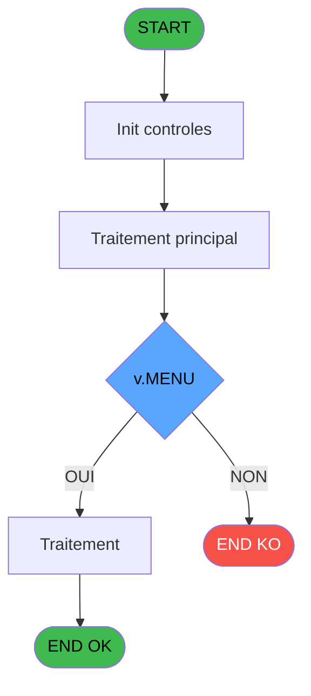
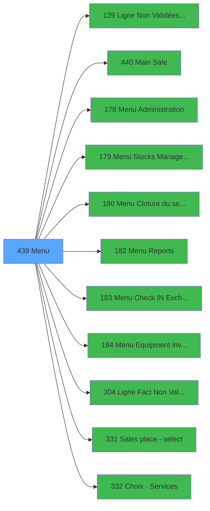

# PVE IDE 439 - Menu

> **Analyse**: Phases 1-4 2026-02-03 20:09 -> 20:10 (16s) | Assemblage 20:10
> **Pipeline**: V7.2 Enrichi
> **Structure**: 4 onglets (Resume | Ecrans | Donnees | Connexions)

<!-- TAB:Resume -->

## 1. FICHE D'IDENTITE

| Attribut | Valeur |
|----------|--------|
| Projet | PVE |
| IDE Position | 439 |
| Nom Programme | Menu |
| Fichier source | `Prg_439.xml` |
| Dossier IDE | A |
| Taches | 3 (1 ecrans visibles) |
| Tables modifiees | 0 |
| Programmes appeles | 11 |
| :warning: Statut | **ORPHELIN_POTENTIEL** |

## 2. DESCRIPTION FONCTIONNELLE

**Menu** assure la gestion complete de ce processus.

Le flux de traitement s'organise en **2 blocs fonctionnels** :

- **Traitement** (2 taches) : traitements metier divers
- **Calcul** (1 tache) : calculs de montants, stocks ou compteurs

**Logique metier** : 3 regles identifiees couvrant conditions metier, valeurs par defaut.

Detail : phases du traitement

#### Phase 1 : Traitement (2 taches)

- **439** - Main (TPE) **[[ECRAN]](#ecran-t1)**
- **439.2** - Exist place

Delegue a : [Main Sale (IDE 440)](PVE-IDE-440.md), [Menu Administration (IDE 178)](PVE-IDE-178.md), [Menu Cloture du service (IDE 180)](PVE-IDE-180.md), [Menu Reports (IDE 182)](PVE-IDE-182.md), [Menu Check IN / Exchange (IDE 183)](PVE-IDE-183.md), [Menu Equipment inventory (IDE 184)](PVE-IDE-184.md)

#### Phase 2 : Calcul (1 tache)

- **439.1** - Lecture solde du compte

Delegue a : [Menu Stocks Management (IDE 179)](PVE-IDE-179.md)

## 3. BLOCS FONCTIONNELS

### 3.1 Traitement (2 taches)

Traitements internes.

---

#### 439 - Main (TPE) [[ECRAN]](#ecran-t1)

**Role** : Traitement : Main (TPE).
**Ecran** : 994 x 432 DLU | [Voir mockup](#ecran-t1)
**Delegue a** : [Main Sale (IDE 440)](PVE-IDE-440.md), [Menu Administration (IDE 178)](PVE-IDE-178.md), [Menu Cloture du service (IDE 180)](PVE-IDE-180.md)

---

#### 439.2 - Exist place

**Role** : Traitement : Exist place.
**Variables liees** : G (v.LieuExist)
**Delegue a** : [Main Sale (IDE 440)](PVE-IDE-440.md), [Menu Administration (IDE 178)](PVE-IDE-178.md), [Menu Cloture du service (IDE 180)](PVE-IDE-180.md)

### 3.2 Calcul (1 tache)

Calculs metier : montants, stocks, compteurs.

---

#### 439.1 - Lecture solde du compte

**Role** : Consultation/chargement : Lecture solde du compte.
**Variables liees** : H (v.Solde du compte)
**Delegue a** : [Menu Stocks Management (IDE 179)](PVE-IDE-179.md)

## 5. REGLES METIER

3 regles identifiees:

### Autres (3 regles)

#### [RM-001] Valeur par defaut si Trim(v.MENU [B]) est vide

| Element | Detail |
|---------|--------|
| **Condition** | `Trim(v.MENU [B])=''` |
| **Si vrai** | 'POS' |
| **Si faux** | v.MENU [B]) |
| **Variables** | B (v.MENU) |
| **Expression source** | Expression 2 : `IF(Trim(v.MENU [B])='','POS',v.MENU [B])` |
| **Exemple** | Si Trim(v.MENU [B])='' → 'POS'. Sinon → v.MENU [B]) |

#### [RM-002] Si VG41 alors 'v.Retour ? [C]'FORM sinon 'v.MENU [B]'FORM)

| Element | Detail |
|---------|--------|
| **Condition** | `VG41` |
| **Si vrai** | 'v.Retour ? [C]'FORM |
| **Si faux** | 'v.MENU [B]'FORM) |
| **Variables** | B (v.MENU), C (v.Retour ?) |
| **Expression source** | Expression 4 : `IF(VG41,'v.Retour ? [C]'FORM,'v.MENU [B]'FORM)` |
| **Exemple** | Si VG41 → 'v.Retour ? [C]'FORM. Sinon → 'v.MENU [B]'FORM) |

#### [RM-003] Si VG33 vaut 'TB' alors 'TABLET', sinon 'WORKSTATION'

| Element | Detail |
|---------|--------|
| **Condition** | `VG33='TB'` |
| **Si vrai** | 'TABLET' |
| **Si faux** | 'WORKSTATION') |
| **Expression source** | Expression 37 : `IF(VG33='TB','TABLET','WORKSTATION')` |
| **Exemple** | Si VG33='TB' → 'TABLET'. Sinon → 'WORKSTATION') |

## 6. CONTEXTE

- **Appele par**: (aucun)
- **Appelle**: 11 programmes | **Tables**: 3 (W:0 R:2 L:1) | **Taches**: 3 | **Expressions**: 43

<!-- TAB:Ecrans -->

## 8. ECRANS

### 8.1 Forms visibles (1 / 3)

| # | Position | Tache | Nom | Type | Largeur | Hauteur | Bloc |
|---|----------|-------|-----|------|---------|---------|------|
| 1 | 439 | 439 | Main (TPE) | Type0 | 994 | 432 | Traitement |

### 8.2 Mockups Ecrans

---

#### 439 - Main (TPE)
**Tache** : [439](#t1) | **Type** : Type0 | **Dimensions** : 994 x 432 DLU
**Bloc** : Traitement | **Titre IDE** : Main (TPE)

<!-- FORM-DATA:
{
    "width":  994,
    "vFactor":  8,
    "type":  "Type0",
    "hFactor":  4,
    "controls":  [
                     {
                         "x":  0,
                         "type":  "label",
                         "var":  "",
                         "y":  2,
                         "w":  992,
                         "fmt":  "",
                         "name":  "",
                         "h":  32,
                         "color":  "103",
                         "text":  "",
                         "parent":  null
                     },
                     {
                         "x":  0,
                         "type":  "subform",
                         "var":  "",
                         "y":  35,
                         "w":  992,
                         "fmt":  "",
                         "name":  "SB_MAIN_TPE",
                         "h":  395,
                         "color":  "",
                         "text":  "",
                         "parent":  null
                     },
                     {
                         "x":  4,
                         "type":  "button",
                         "var":  "",
                         "y":  6,
                         "w":  264,
                         "fmt":  "LIEU",
                         "name":  "LIEU",
                         "h":  24,
                         "color":  "",
                         "text":  "",
                         "parent":  null
                     },
                     {
                         "x":  484,
                         "type":  "button",
                         "var":  "",
                         "y":  6,
                         "w":  120,
                         "fmt":  "20",
                         "name":  "v.bouton mode",
                         "h":  24,
                         "color":  "",
                         "text":  "",
                         "parent":  null
                     },
                     {
                         "x":  626,
                         "type":  "button",
                         "var":  "",
                         "y":  6,
                         "w":  120,
                         "fmt":  "CHECK IN",
                         "name":  "CHECKIN",
                         "h":  24,
                         "color":  "",
                         "text":  "",
                         "parent":  null
                     },
                     {
                         "x":  746,
                         "type":  "button",
                         "var":  "",
                         "y":  6,
                         "w":  120,
                         "fmt":  "INVENTORY",
                         "name":  "INVENTORY",
                         "h":  24,
                         "color":  "",
                         "text":  "",
                         "parent":  null
                     },
                     {
                         "x":  866,
                         "type":  "button",
                         "var":  "",
                         "y":  6,
                         "w":  120,
                         "fmt":  "EXIT",
                         "name":  "EXIT",
                         "h":  24,
                         "color":  "",
                         "text":  "",
                         "parent":  null
                     },
                     {
                         "x":  274,
                         "type":  "combobox",
                         "var":  "",
                         "y":  7,
                         "w":  204,
                         "fmt":  "",
                         "name":  "v.MENU",
                         "h":  23,
                         "color":  "103",
                         "text":  "POS,CLOSING,REPORTS,STOCK,SERVICES,ADMIN",
                         "parent":  null
                     }
                 ],
    "taskId":  "439",
    "height":  432
}
-->

<strong>Champs : 1 champs</strong>

| Pos (x,y) | Nom | Variable | Type |
|-----------|-----|----------|------|
| 274,7 | v.MENU | - | combobox |

<strong>Boutons : 5 boutons</strong>

| Bouton | Pos (x,y) | Action |
|--------|-----------|--------|
| LIEU | 4,6 | Bouton fonctionnel |
| 20 | 484,6 | Bouton fonctionnel |
| CHECK IN | 626,6 | Appel [Menu Check IN / Exchange (IDE 183)](PVE-IDE-183.md) |
| INVENTORY | 746,6 | Appel [Menu Equipment inventory (IDE 184)](PVE-IDE-184.md) |
| EXIT | 866,6 | Quitte le programme |

## 9. NAVIGATION

Ecran unique: **Main (TPE)**

### 9.3 Structure hierarchique (3 taches)

| Position | Tache | Type | Dimensions | Bloc |
|----------|-------|------|------------|------|
| **439.1** | [**Main (TPE)** (439)](#t1) [mockup](#ecran-t1) | - | 994x432 | Traitement |
| 439.1.1 | [Exist place (439.2)](#t3) | - | - | |
| **439.2** | [**Lecture solde du compte** (439.1)](#t2) | - | - | Calcul |

### 9.4 Algorigramme

> **Legende**: Vert = START/END OK | Rouge = END KO | Bleu = Decisions
> *Algorigramme auto-genere. Utiliser `/algorigramme` pour une synthese metier detaillee.*

<!-- TAB:Donnees -->

## 10. TABLES

### Tables utilisees (3)

| ID | Nom | Description | Type | R | W | L | Usages |
|----|-----|-------------|------|---|---|---|--------|
| 47 | compte_gm________cgm | Comptes GM (generaux) | DB | R |   |   | 1 |
| 766 | temp_forfait_ski |  | DB | R |   |   | 1 |
| 786 | qualite_avant_reprise |  | DB |   |   | L | 1 |

### Colonnes par table (1 / 2 tables avec colonnes identifiees)

Table 47 - compte_gm________cgm (R) - 1 usages

| Lettre | Variable | Acces | Type |
|--------|----------|-------|------|
| H | v.Solde du compte | R | Numeric |

Table 766 - temp_forfait_ski (R) - 1 usages

*Table utilisee uniquement en Link ou aucune colonne Real identifiee dans le DataView.*

## 11. VARIABLES

### 11.1 Parametres entrants (2)

Variables recues en parametre.

| Lettre | Nom | Type | Usage dans |
|--------|-----|------|-----------|
| L | P.Change Reason | Numeric | - |
| M | P.Prev Value | Alpha | 1x parametre entrant |

### 11.2 Variables de session (11)

Variables persistantes pendant toute la session.

| Lettre | Nom | Type | Usage dans |
|--------|-----|------|-----------|
| A | v.Lieu de vente | Alpha | - |
| B | v.MENU | Alpha | 16x session |
| C | v.Retour ? | Numeric | 2x session |
| D | V.Nbre d'enregistrement non val | Numeric | - |
| E | v.Passage | Logical | 1x session |
| F | v.End | Logical | 1x session |
| G | v.LieuExist | Logical | 1x session |
| H | v.Solde du compte | Numeric | [439.1](#t2) |
| I | v.confirm closure | Numeric | 1x session |
| J | v.bouton mode | Alpha | - |
| K | V.CustomerSelected | Logical | 1x session |

## 12. EXPRESSIONS

**43 / 43 expressions decodees (100%)**

### 12.1 Repartition par type

| Type | Expressions | Regles |
|------|-------------|--------|
| CONCATENATION | 2 | 0 |
| CONDITION | 22 | 3 |
| CONSTANTE | 7 | 0 |
| OTHER | 5 | 0 |
| CAST_LOGIQUE | 3 | 0 |
| REFERENCE_VG | 1 | 0 |
| NEGATION | 2 | 0 |
| FORMAT | 1 | 0 |

### 12.2 Expressions cles par type

#### CONCATENATION (2 expressions)

| Type | IDE | Expression | Regle |
|------|-----|------------|-------|
| CONCATENATION | 42 | `'POS,CLOSING,REPORTS,STOCK,SERVICES,ADMIN'&IF(VG24,',TPE INIT,TPE DIARY','')&IF(GetParam('RENTAL'),',EQUIPMENT STATUS','')` | - |
| CONCATENATION | 1 | `Trim(GetParam ('SERVICELIB'))&'  -  POS '&Trim(VG6)` | - |

#### CONDITION (22 expressions)

| Type | IDE | Expression | Regle |
|------|-----|------------|-------|
| CONDITION | 4 | `IF(VG41,'v.Retour ? [C]'FORM,'v.MENU [B]'FORM)` | [RM-002](#rm-RM-002) |
| CONDITION | 2 | `IF(Trim(v.MENU [B])='','POS',v.MENU [B])` | [RM-001](#rm-RM-001) |
| CONDITION | 37 | `IF(VG33='TB','TABLET','WORKSTATION')` | [RM-003](#rm-RM-003) |
| CONDITION | 22 | `Trim(v.MENU [B])='STOCK'` | - |
| CONDITION | 24 | `Trim(v.MENU [B])='SERVICES'` | - |
| ... | | *+17 autres* | |

#### CONSTANTE (7 expressions)

| Type | IDE | Expression | Regle |
|------|-----|------------|-------|
| CONSTANTE | 28 | `'SB_MAIN_TPE'` | - |
| CONSTANTE | 31 | `'I'` | - |
| CONSTANTE | 34 | `'J'` | - |
| CONSTANTE | 27 | `'POS'` | - |
| CONSTANTE | 8 | `''` | - |
| ... | | *+2 autres* | |

#### OTHER (5 expressions)

| Type | IDE | Expression | Regle |
|------|-----|------------|-------|
| OTHER | 32 | `P.Prev Value [M]` | - |
| OTHER | 39 | `CtrlGoto('SB_MAIN_TPE',0,0)` | - |
| OTHER | 17 | `GetParam ('SERVICE')` | - |
| OTHER | 3 | `v.LieuExist [G]` | - |
| OTHER | 12 | `v.End [F]` | - |

#### CAST_LOGIQUE (3 expressions)

| Type | IDE | Expression | Regle |
|------|-----|------------|-------|
| CAST_LOGIQUE | 14 | `'TRUE'LOG` | - |
| CAST_LOGIQUE | 11 | `'TRUE'LOG` | - |
| CAST_LOGIQUE | 5 | `GetParam ('RENTAL')='TRUE'LOG` | - |

#### REFERENCE_VG (1 expressions)

| Type | IDE | Expression | Regle |
|------|-----|------------|-------|
| REFERENCE_VG | 7 | `VG14` | - |

#### NEGATION (2 expressions)

| Type | IDE | Expression | Regle |
|------|-----|------------|-------|
| NEGATION | 41 | `NOT VG10` | - |
| NEGATION | 13 | `NOT v.Passage [E]` | - |

#### FORMAT (1 expressions)

| Type | IDE | Expression | Regle |
|------|-----|------------|-------|
| FORMAT | 30 | `Str(VG105,'8P0')` | - |

### 12.3 Toutes les expressions (43)

Voir les 43 expressions

#### CONCATENATION (2)

| IDE | Expression Decodee |
|-----|-------------------|
| 1 | `Trim(GetParam ('SERVICELIB'))&'  -  POS '&Trim(VG6)` |
| 42 | `'POS,CLOSING,REPORTS,STOCK,SERVICES,ADMIN'&IF(VG24,',TPE INIT,TPE DIARY','')&IF(GetParam('RENTAL'),',EQUIPMENT STATUS','')` |

#### CONDITION (22)

| IDE | Expression Decodee |
|-----|-------------------|
| 23 | `Trim(v.MENU [B])='SERVICES' AND IN(GetParam ('GROUP'),'INFORMATICIEN','GESTION','C D V - H S M')` |
| 2 | `IF(Trim(v.MENU [B])='','POS',v.MENU [B])` |
| 4 | `IF(VG41,'v.Retour ? [C]'FORM,'v.MENU [B]'FORM)` |
| 37 | `IF(VG33='TB','TABLET','WORKSTATION')` |
| 38 | `IF(VG33='TB','WS','TB')` |
| 6 | `v.Retour ? [C]=6` |
| 35 | `v.Solde du compte [H]<>0` |
| 36 | `(v.Solde du compte [H]=0 OR (v.Solde du compte [H]<>0 AND v.confirm closure [I]=6)) AND NOT(V.CustomerSelected [K])` |
| 40 | `MID(VG34,5,2)='TB' OR VG9 OR VG10` |
| 15 | `Trim(v.MENU [B])='POS'` |
| 16 | `Trim(v.MENU [B])='CLOSING' AND VG13` |
| 18 | `Trim(v.MENU [B])='CLOSING'` |
| 19 | `Trim(v.MENU [B])='REPORTS' AND VG13` |
| 20 | `Trim(v.MENU [B])='REPORTS'` |
| 21 | `Trim(v.MENU [B])='STOCK' AND VG13` |
| 22 | `Trim(v.MENU [B])='STOCK'` |
| 24 | `Trim(v.MENU [B])='SERVICES'` |
| 25 | `Trim(v.MENU [B])='ADMIN' AND VG9` |
| 26 | `Trim(v.MENU [B])='ADMIN'` |
| 29 | `Trim(v.MENU [B])='TPE INIT'` |
| 33 | `Trim(v.MENU [B])='TPE DIARY'` |
| 43 | `Trim(v.MENU [B])='EQUIPMENT STATUS'` |

#### CONSTANTE (7)

| IDE | Expression Decodee |
|-----|-------------------|
| 8 | `''` |
| 9 | `0` |
| 10 | `'C'` |
| 27 | `'POS'` |
| 28 | `'SB_MAIN_TPE'` |
| 31 | `'I'` |
| 34 | `'J'` |

#### OTHER (5)

| IDE | Expression Decodee |
|-----|-------------------|
| 3 | `v.LieuExist [G]` |
| 12 | `v.End [F]` |
| 17 | `GetParam ('SERVICE')` |
| 32 | `P.Prev Value [M]` |
| 39 | `CtrlGoto('SB_MAIN_TPE',0,0)` |

#### CAST_LOGIQUE (3)

| IDE | Expression Decodee |
|-----|-------------------|
| 5 | `GetParam ('RENTAL')='TRUE'LOG` |
| 11 | `'TRUE'LOG` |
| 14 | `'TRUE'LOG` |

#### REFERENCE_VG (1)

| IDE | Expression Decodee |
|-----|-------------------|
| 7 | `VG14` |

#### NEGATION (2)

| IDE | Expression Decodee |
|-----|-------------------|
| 13 | `NOT v.Passage [E]` |
| 41 | `NOT VG10` |

#### FORMAT (1)

| IDE | Expression Decodee |
|-----|-------------------|
| 30 | `Str(VG105,'8P0')` |

<!-- TAB:Connexions -->

## 13. GRAPHE D'APPELS

### 13.1 Chaine depuis Main (Callers)

**Chemin**: (pas de callers directs)

### 13.2 Callers

| IDE | Nom Programme | Nb Appels |
|-----|---------------|-----------|
| - | (aucun) | - |

### 13.3 Callees (programmes appeles)

### 13.4 Detail Callees avec contexte

| IDE | Nom Programme | Appels | Contexte |
|-----|---------------|--------|----------|
| [129](PVE-IDE-129.md) | Ligne Non Validées & Edit Book | 2 | Sous-programme |
| [440](PVE-IDE-440.md) | Main Sale | 2 | Sous-programme |
| [178](PVE-IDE-178.md) | Menu Administration | 1 | Navigation menu |
| [179](PVE-IDE-179.md) | Menu Stocks Management | 1 | Calcul de donnees |
| [180](PVE-IDE-180.md) | Menu Cloture du service | 1 | Fermeture session |
| [182](PVE-IDE-182.md) | Menu Reports | 1 | Navigation menu |
| [183](PVE-IDE-183.md) | Menu Check IN / Exchange | 1 | Navigation menu |
| [184](PVE-IDE-184.md) | Menu Equipment inventory | 1 | Navigation menu |
| [304](PVE-IDE-304.md) | Ligne Fact Non Validées & Edit | 1 | Sous-programme |
| [331](PVE-IDE-331.md) | Sales place - select | 1 | Selection/consultation |
| [332](PVE-IDE-332.md) | Choix - Services | 1 | Selection/consultation |

## 14. RECOMMANDATIONS MIGRATION

### 14.1 Profil du programme

| Metrique | Valeur | Impact migration |
|----------|--------|-----------------|
| Lignes de logique | 152 | Programme compact |
| Expressions | 43 | Peu de logique |
| Tables WRITE | 0 | Impact faible |
| Sous-programmes | 11 | Forte dependance |
| Ecrans visibles | 1 | Ecran unique ou traitement batch |
| Code desactive | 1.3% (2 / 152) | Code sain |
| Regles metier | 3 | Quelques regles a preserver |

### 14.2 Plan de migration par bloc

#### Traitement (2 taches: 1 ecran, 1 traitement)

- **Strategie** : Orchestrateur avec 1 ecrans (Razor/React) et 1 traitements backend (services).
- Les ecrans deviennent des composants UI, les traitements invisibles deviennent des services injectables.
- 11 sous-programme(s) a migrer ou a reutiliser depuis les services existants.
- Decomposer les taches en services unitaires testables.

#### Calcul (1 tache: 0 ecran, 1 traitement)

- **Strategie** : Services de calcul purs (Domain Services).
- Migrer la logique de calcul (stock, compteurs, montants)

### 14.3 Dependances critiques

| Dependance | Type | Appels | Impact |
|------------|------|--------|--------|
| [Main Sale (IDE 440)](PVE-IDE-440.md) | Sous-programme | 2x | Haute - Sous-programme |
| [Ligne Non Validées & Edit Book (IDE 129)](PVE-IDE-129.md) | Sous-programme | 2x | Haute - Sous-programme |
| [Ligne Fact Non Validées & Edit (IDE 304)](PVE-IDE-304.md) | Sous-programme | 1x | Normale - Sous-programme |
| [Menu Equipment inventory (IDE 184)](PVE-IDE-184.md) | Sous-programme | 1x | Normale - Navigation menu |
| [Choix - Services (IDE 332)](PVE-IDE-332.md) | Sous-programme | 1x | Normale - Selection/consultation |
| [Sales place - select (IDE 331)](PVE-IDE-331.md) | Sous-programme | 1x | Normale - Selection/consultation |
| [Menu Check IN / Exchange (IDE 183)](PVE-IDE-183.md) | Sous-programme | 1x | Normale - Navigation menu |
| [Menu Stocks Management (IDE 179)](PVE-IDE-179.md) | Sous-programme | 1x | Normale - Calcul de donnees |
| [Menu Administration (IDE 178)](PVE-IDE-178.md) | Sous-programme | 1x | Normale - Navigation menu |
| [Menu Reports (IDE 182)](PVE-IDE-182.md) | Sous-programme | 1x | Normale - Navigation menu |

---
*Spec DETAILED generee par Pipeline V7.2 - 2026-02-03 20:10*
