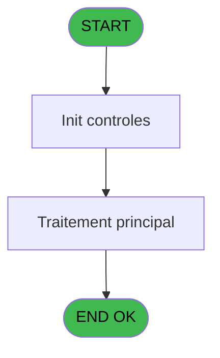
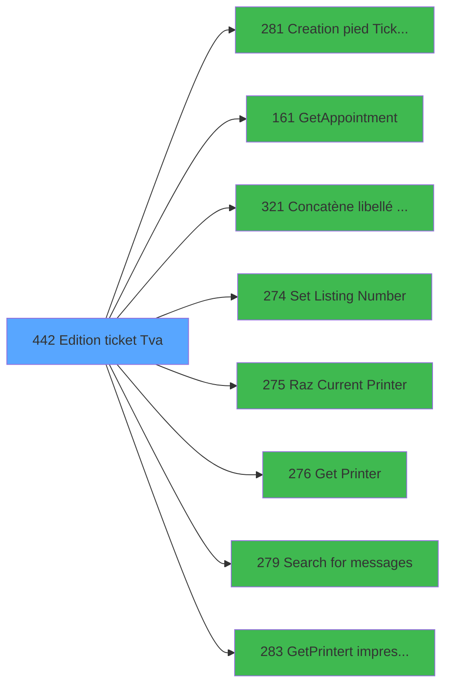

# PVE IDE 442 - Edition ticket (Tva)

> **Analyse**: Phases 1-4 2026-02-03 20:11 -> 20:11 (16s) | Assemblage 20:11
> **Pipeline**: V7.2 Enrichi
> **Structure**: 4 onglets (Resume | Ecrans | Donnees | Connexions)

<!-- TAB:Resume -->

## 1. FICHE D'IDENTITE

| Attribut | Valeur |
|----------|--------|
| Projet | PVE |
| IDE Position | 442 |
| Nom Programme | Edition ticket (Tva) |
| Fichier source | `Prg_442.xml` |
| Dossier IDE | A |
| Taches | 33 (1 ecrans visibles) |
| Tables modifiees | 0 |
| Programmes appeles | 8 |
| :warning: Statut | **ORPHELIN_POTENTIEL** |

## 2. DESCRIPTION FONCTIONNELLE

**Edition ticket (Tva)** assure la gestion complete de ce processus.

Le flux de traitement s'organise en **2 blocs fonctionnels** :

- **Traitement** (22 taches) : traitements metier divers
- **Impression** (11 taches) : generation de tickets et documents

Detail : phases du traitement

#### Phase 1 : Traitement (22 taches)

- **442** - Please be patient ... **[[ECRAN]](#ecran-t1)**
- **442.1.1** - Impression reçu change **[[ECRAN]](#ecran-t3)**
- **442.1.2** - Impression reçu change **[[ECRAN]](#ecran-t4)**
- **442.1.2.2** - Impression reçu change **[[ECRAN]](#ecran-t6)**
- **442.1.2.3** - GetBookigsInfo
- **442.2** - Counter
- **442.2.1** - Impression reçu change
- **442.2.2** - Impression reçu change
- **442.2.2.2** - Impression reçu change **[[ECRAN]](#ecran-t13)**
- **442.3.1** - Veuillez patienter ... **[[ECRAN]](#ecran-t15)**
- **442.3.2** - Veuillez patienter ... **[[ECRAN]](#ecran-t16)**
- **442.3.2.2** - Veuillez patienter ... **[[ECRAN]](#ecran-t18)**
- **442.4.1** - Veuillez patienter ... **[[ECRAN]](#ecran-t20)**
- **442.4.2** - Veuillez patienter ... **[[ECRAN]](#ecran-t21)**
- **442.4.2.2** - Veuillez patienter ... **[[ECRAN]](#ecran-t23)**
- **442.4.2.3** - GetBookigsInfo
- **442.5** - Counter
- **442.5.1** - Impression reçu change **[[ECRAN]](#ecran-t27)**
- **442.5.2** - Impression reçu change **[[ECRAN]](#ecran-t28)**
- **442.5.2.2** - Impression reçu change **[[ECRAN]](#ecran-t30)**
- **442.5.2.3** - GetBookigsInfo
- **442.6** - Search Gift Pass

Delegue a : [GetAppointment (IDE 161)](PVE-IDE-161.md), [Concatène libellé Cat/Ss-Cat (IDE 321)](PVE-IDE-321.md), [Set Listing Number (IDE 274)](PVE-IDE-274.md), [Search  for messages (IDE 279)](PVE-IDE-279.md)

#### Phase 2 : Impression (11 taches)

- **442.1** - Printer 1
- **442.1.2.1** - Print Tva **[[ECRAN]](#ecran-t5)**
- **442.1.2.4** - Print Appointments **[[ECRAN]](#ecran-t8)**
- **442.2.2.1** - Print Tva **[[ECRAN]](#ecran-t12)**
- **442.3** - Printer 5 **[[ECRAN]](#ecran-t14)**
- **442.3.2.1** - Print Tva **[[ECRAN]](#ecran-t17)**
- **442.4** - Printer 9 **[[ECRAN]](#ecran-t19)**
- **442.4.2.1** - Print Tva **[[ECRAN]](#ecran-t22)**
- **442.4.2.4** - Print Appointments **[[ECRAN]](#ecran-t25)**
- **442.5.2.1** - Print Tva **[[ECRAN]](#ecran-t29)**
- **442.5.2.4** - Print Appointments **[[ECRAN]](#ecran-t32)**

Delegue a : [Creation pied Ticket(Tva) (IDE 281)](PVE-IDE-281.md), [Set Listing Number (IDE 274)](PVE-IDE-274.md), [Raz Current Printer (IDE 275)](PVE-IDE-275.md), [Get Printer (IDE 276)](PVE-IDE-276.md), [GetPrinter/t impression (IDE 283)](PVE-IDE-283.md)

## 3. BLOCS FONCTIONNELS

### 3.1 Traitement (22 taches)

Traitements internes.

---

#### 442 - Please be patient ... [[ECRAN]](#ecran-t1)

**Role** : Tache d'orchestration : point d'entree du programme (22 sous-taches). Coordonne l'enchainement des traitements.
**Ecran** : 427 x 57 DLU (MDI) | [Voir mockup](#ecran-t1)

21 sous-taches directes

| Tache | Nom | Bloc |
|-------|-----|------|
| [442.1.1](#t3) | Impression reçu change **[[ECRAN]](#ecran-t3)** | Traitement |
| [442.1.2](#t4) | Impression reçu change **[[ECRAN]](#ecran-t4)** | Traitement |
| [442.1.2.2](#t6) | Impression reçu change **[[ECRAN]](#ecran-t6)** | Traitement |
| [442.1.2.3](#t7) | GetBookigsInfo | Traitement |
| [442.2](#t9) | Counter | Traitement |
| [442.2.1](#t10) | Impression reçu change | Traitement |
| [442.2.2](#t11) | Impression reçu change | Traitement |
| [442.2.2.2](#t13) | Impression reçu change **[[ECRAN]](#ecran-t13)** | Traitement |
| [442.3.1](#t15) | Veuillez patienter ... **[[ECRAN]](#ecran-t15)** | Traitement |
| [442.3.2](#t16) | Veuillez patienter ... **[[ECRAN]](#ecran-t16)** | Traitement |
| [442.3.2.2](#t18) | Veuillez patienter ... **[[ECRAN]](#ecran-t18)** | Traitement |
| [442.4.1](#t20) | Veuillez patienter ... **[[ECRAN]](#ecran-t20)** | Traitement |
| [442.4.2](#t21) | Veuillez patienter ... **[[ECRAN]](#ecran-t21)** | Traitement |
| [442.4.2.2](#t23) | Veuillez patienter ... **[[ECRAN]](#ecran-t23)** | Traitement |
| [442.4.2.3](#t24) | GetBookigsInfo | Traitement |
| [442.5](#t26) | Counter | Traitement |
| [442.5.1](#t27) | Impression reçu change **[[ECRAN]](#ecran-t27)** | Traitement |
| [442.5.2](#t28) | Impression reçu change **[[ECRAN]](#ecran-t28)** | Traitement |
| [442.5.2.2](#t30) | Impression reçu change **[[ECRAN]](#ecran-t30)** | Traitement |
| [442.5.2.3](#t31) | GetBookigsInfo | Traitement |
| [442.6](#t33) | Search Gift Pass | Traitement |

---

#### 442.1.1 - Impression reçu change [[ECRAN]](#ecran-t3)

**Role** : Generation du document : Impression reçu change.
**Ecran** : 630 x 0 DLU (MDI) | [Voir mockup](#ecran-t3)

---

#### 442.1.2 - Impression reçu change [[ECRAN]](#ecran-t4)

**Role** : Generation du document : Impression reçu change.
**Ecran** : 1205 x 0 DLU (MDI) | [Voir mockup](#ecran-t4)

---

#### 442.1.2.2 - Impression reçu change [[ECRAN]](#ecran-t6)

**Role** : Generation du document : Impression reçu change.
**Ecran** : 574 x 0 DLU (MDI) | [Voir mockup](#ecran-t6)

---

#### 442.1.2.3 - GetBookigsInfo

**Role** : Consultation/chargement : GetBookigsInfo.

---

#### 442.2 - Counter

**Role** : Traitement : Counter.

---

#### 442.2.1 - Impression reçu change

**Role** : Generation du document : Impression reçu change.

---

#### 442.2.2 - Impression reçu change

**Role** : Generation du document : Impression reçu change.

---

#### 442.2.2.2 - Impression reçu change [[ECRAN]](#ecran-t13)

**Role** : Generation du document : Impression reçu change.
**Ecran** : 574 x 0 DLU (MDI) | [Voir mockup](#ecran-t13)

---

#### 442.3.1 - Veuillez patienter ... [[ECRAN]](#ecran-t15)

**Role** : Traitement : Veuillez patienter ....
**Ecran** : 426 x 57 DLU (MDI) | [Voir mockup](#ecran-t15)

---

#### 442.3.2 - Veuillez patienter ... [[ECRAN]](#ecran-t16)

**Role** : Traitement : Veuillez patienter ....
**Ecran** : 424 x 56 DLU (MDI) | [Voir mockup](#ecran-t16)

---

#### 442.3.2.2 - Veuillez patienter ... [[ECRAN]](#ecran-t18)

**Role** : Traitement : Veuillez patienter ....
**Ecran** : 424 x 56 DLU (MDI) | [Voir mockup](#ecran-t18)

---

#### 442.4.1 - Veuillez patienter ... [[ECRAN]](#ecran-t20)

**Role** : Traitement : Veuillez patienter ....
**Ecran** : 424 x 56 DLU (MDI) | [Voir mockup](#ecran-t20)

---

#### 442.4.2 - Veuillez patienter ... [[ECRAN]](#ecran-t21)

**Role** : Traitement : Veuillez patienter ....
**Ecran** : 1242 x 399 DLU (MDI) | [Voir mockup](#ecran-t21)

---

#### 442.4.2.2 - Veuillez patienter ... [[ECRAN]](#ecran-t23)

**Role** : Traitement : Veuillez patienter ....
**Ecran** : 424 x 56 DLU (MDI) | [Voir mockup](#ecran-t23)

---

#### 442.4.2.3 - GetBookigsInfo

**Role** : Consultation/chargement : GetBookigsInfo.

---

#### 442.5 - Counter

**Role** : Traitement : Counter.

---

#### 442.5.1 - Impression reçu change [[ECRAN]](#ecran-t27)

**Role** : Generation du document : Impression reçu change.
**Ecran** : 630 x 0 DLU (MDI) | [Voir mockup](#ecran-t27)

---

#### 442.5.2 - Impression reçu change [[ECRAN]](#ecran-t28)

**Role** : Generation du document : Impression reçu change.
**Ecran** : 574 x 0 DLU (MDI) | [Voir mockup](#ecran-t28)

---

#### 442.5.2.2 - Impression reçu change [[ECRAN]](#ecran-t30)

**Role** : Generation du document : Impression reçu change.
**Ecran** : 574 x 0 DLU (MDI) | [Voir mockup](#ecran-t30)

---

#### 442.5.2.3 - GetBookigsInfo

**Role** : Consultation/chargement : GetBookigsInfo.

---

#### 442.6 - Search Gift Pass

**Role** : Calcul fidelite/avantage : Search Gift Pass.
**Variables liees** : BC (V Existe Gift Pass), BD (V.Solde  Gift Pass), BE (V.Message Solde Gift Pass), BF (V Editer Solde Gift Pass a 0)

### 3.2 Impression (11 taches)

Generation des documents et tickets.

---

#### 442.1 - Printer 1

**Role** : Generation du document : Printer 1.

---

#### 442.1.2.1 - Print Tva [[ECRAN]](#ecran-t5)

**Role** : Generation du document : Print Tva.
**Ecran** : 506 x 0 DLU | [Voir mockup](#ecran-t5)
**Variables liees** : B (P. PrintAgainExecution), C (P. PrintAgainPreview)

---

#### 442.1.2.4 - Print Appointments [[ECRAN]](#ecran-t8)

**Role** : Generation du document : Print Appointments.
**Ecran** : 506 x 0 DLU | [Voir mockup](#ecran-t8)
**Variables liees** : B (P. PrintAgainExecution), C (P. PrintAgainPreview)

---

#### 442.2.2.1 - Print Tva [[ECRAN]](#ecran-t12)

**Role** : Generation du document : Print Tva.
**Ecran** : 127 x 0 DLU | [Voir mockup](#ecran-t12)
**Variables liees** : B (P. PrintAgainExecution), C (P. PrintAgainPreview)

---

#### 442.3 - Printer 5 [[ECRAN]](#ecran-t14)

**Role** : Generation du document : Printer 5.
**Ecran** : 424 x 56 DLU (MDI) | [Voir mockup](#ecran-t14)

---

#### 442.3.2.1 - Print Tva [[ECRAN]](#ecran-t17)

**Role** : Generation du document : Print Tva.
**Ecran** : 506 x 0 DLU | [Voir mockup](#ecran-t17)
**Variables liees** : B (P. PrintAgainExecution), C (P. PrintAgainPreview)

---

#### 442.4 - Printer 9 [[ECRAN]](#ecran-t19)

**Role** : Generation du document : Printer 9.
**Ecran** : 424 x 56 DLU (MDI) | [Voir mockup](#ecran-t19)

---

#### 442.4.2.1 - Print Tva [[ECRAN]](#ecran-t22)

**Role** : Generation du document : Print Tva.
**Ecran** : 506 x 0 DLU | [Voir mockup](#ecran-t22)
**Variables liees** : B (P. PrintAgainExecution), C (P. PrintAgainPreview)

---

#### 442.4.2.4 - Print Appointments [[ECRAN]](#ecran-t25)

**Role** : Generation du document : Print Appointments.
**Ecran** : 506 x 0 DLU | [Voir mockup](#ecran-t25)
**Variables liees** : B (P. PrintAgainExecution), C (P. PrintAgainPreview)

---

#### 442.5.2.1 - Print Tva [[ECRAN]](#ecran-t29)

**Role** : Generation du document : Print Tva.
**Ecran** : 506 x 0 DLU | [Voir mockup](#ecran-t29)
**Variables liees** : B (P. PrintAgainExecution), C (P. PrintAgainPreview)

---

#### 442.5.2.4 - Print Appointments [[ECRAN]](#ecran-t32)

**Role** : Generation du document : Print Appointments.
**Ecran** : 506 x 0 DLU | [Voir mockup](#ecran-t32)
**Variables liees** : B (P. PrintAgainExecution), C (P. PrintAgainPreview)

## 5. REGLES METIER

*(Aucune regle metier identifiee)*

## 6. CONTEXTE

- **Appele par**: (aucun)
- **Appelle**: 8 programmes | **Tables**: 13 (W:0 R:6 L:10) | **Taches**: 33 | **Expressions**: 36

<!-- TAB:Ecrans -->

## 8. ECRANS

### 8.1 Forms visibles (1 / 33)

| # | Position | Tache | Nom | Type | Largeur | Hauteur | Bloc |
|---|----------|-------|-----|------|---------|---------|------|
| 1 | 442 | 442 | Please be patient ... | MDI | 427 | 57 | Traitement |

### 8.2 Mockups Ecrans

---

#### 442 - Please be patient ...
**Tache** : [442](#t1) | **Type** : MDI | **Dimensions** : 427 x 57 DLU
**Bloc** : Traitement | **Titre IDE** : Please be patient ...

<!-- FORM-DATA:
{
    "width":  427,
    "vFactor":  8,
    "type":  "MDI",
    "hFactor":  8,
    "controls":  [
                     {
                         "x":  0,
                         "type":  "label",
                         "var":  "",
                         "y":  0,
                         "w":  423,
                         "fmt":  "",
                         "name":  "",
                         "h":  29,
                         "color":  "",
                         "text":  "",
                         "parent":  null
                     },
                     {
                         "x":  120,
                         "type":  "label",
                         "var":  "",
                         "y":  10,
                         "w":  221,
                         "fmt":  "",
                         "name":  "",
                         "h":  8,
                         "color":  "7",
                         "text":  "Print in progress ...",
                         "parent":  null
                     },
                     {
                         "x":  0,
                         "type":  "label",
                         "var":  "",
                         "y":  29,
                         "w":  423,
                         "fmt":  "",
                         "name":  "",
                         "h":  27,
                         "color":  "",
                         "text":  "",
                         "parent":  null
                     },
                     {
                         "x":  114,
                         "type":  "label",
                         "var":  "",
                         "y":  38,
                         "w":  203,
                         "fmt":  "",
                         "name":  "",
                         "h":  8,
                         "color":  "",
                         "text":  "Ticket edition",
                         "parent":  null
                     },
                     {
                         "x":  4,
                         "type":  "image",
                         "var":  "",
                         "y":  2,
                         "w":  72,
                         "fmt":  "",
                         "name":  "",
                         "h":  25,
                         "color":  "",
                         "text":  "",
                         "parent":  null
                     }
                 ],
    "taskId":  "442",
    "height":  57
}
-->

## 9. NAVIGATION

Ecran unique: **Please be patient ...**

### 9.3 Structure hierarchique (33 taches)

| Position | Tache | Type | Dimensions | Bloc |
|----------|-------|------|------------|------|
| **442.1** | [**Please be patient ...** (442)](#t1) [mockup](#ecran-t1) | MDI | 427x57 | Traitement |
| 442.1.1 | [Impression reçu change (442.1.1)](#t3) [mockup](#ecran-t3) | MDI | 630x0 | |
| 442.1.2 | [Impression reçu change (442.1.2)](#t4) [mockup](#ecran-t4) | MDI | 1205x0 | |
| 442.1.3 | [Impression reçu change (442.1.2.2)](#t6) [mockup](#ecran-t6) | MDI | 574x0 | |
| 442.1.4 | [GetBookigsInfo (442.1.2.3)](#t7) | - | - | |
| 442.1.5 | [Counter (442.2)](#t9) | MDI | - | |
| 442.1.6 | [Impression reçu change (442.2.1)](#t10) | MDI | - | |
| 442.1.7 | [Impression reçu change (442.2.2)](#t11) | MDI | - | |
| 442.1.8 | [Impression reçu change (442.2.2.2)](#t13) [mockup](#ecran-t13) | MDI | 574x0 | |
| 442.1.9 | [Veuillez patienter ... (442.3.1)](#t15) [mockup](#ecran-t15) | MDI | 426x57 | |
| 442.1.10 | [Veuillez patienter ... (442.3.2)](#t16) [mockup](#ecran-t16) | MDI | 424x56 | |
| 442.1.11 | [Veuillez patienter ... (442.3.2.2)](#t18) [mockup](#ecran-t18) | MDI | 424x56 | |
| 442.1.12 | [Veuillez patienter ... (442.4.1)](#t20) [mockup](#ecran-t20) | MDI | 424x56 | |
| 442.1.13 | [Veuillez patienter ... (442.4.2)](#t21) [mockup](#ecran-t21) | MDI | 1242x399 | |
| 442.1.14 | [Veuillez patienter ... (442.4.2.2)](#t23) [mockup](#ecran-t23) | MDI | 424x56 | |
| 442.1.15 | [GetBookigsInfo (442.4.2.3)](#t24) | - | - | |
| 442.1.16 | [Counter (442.5)](#t26) | MDI | - | |
| 442.1.17 | [Impression reçu change (442.5.1)](#t27) [mockup](#ecran-t27) | MDI | 630x0 | |
| 442.1.18 | [Impression reçu change (442.5.2)](#t28) [mockup](#ecran-t28) | MDI | 574x0 | |
| 442.1.19 | [Impression reçu change (442.5.2.2)](#t30) [mockup](#ecran-t30) | MDI | 574x0 | |
| 442.1.20 | [GetBookigsInfo (442.5.2.3)](#t31) | - | - | |
| 442.1.21 | [Search Gift Pass (442.6)](#t33) | - | - | |
| **442.2** | [**Printer 1** (442.1)](#t2) | MDI | - | Impression |
| 442.2.1 | [Print Tva (442.1.2.1)](#t5) [mockup](#ecran-t5) | - | 506x0 | |
| 442.2.2 | [Print Appointments (442.1.2.4)](#t8) [mockup](#ecran-t8) | - | 506x0 | |
| 442.2.3 | [Print Tva (442.2.2.1)](#t12) [mockup](#ecran-t12) | - | 127x0 | |
| 442.2.4 | [Printer 5 (442.3)](#t14) [mockup](#ecran-t14) | MDI | 424x56 | |
| 442.2.5 | [Print Tva (442.3.2.1)](#t17) [mockup](#ecran-t17) | - | 506x0 | |
| 442.2.6 | [Printer 9 (442.4)](#t19) [mockup](#ecran-t19) | MDI | 424x56 | |
| 442.2.7 | [Print Tva (442.4.2.1)](#t22) [mockup](#ecran-t22) | - | 506x0 | |
| 442.2.8 | [Print Appointments (442.4.2.4)](#t25) [mockup](#ecran-t25) | - | 506x0 | |
| 442.2.9 | [Print Tva (442.5.2.1)](#t29) [mockup](#ecran-t29) | - | 506x0 | |
| 442.2.10 | [Print Appointments (442.5.2.4)](#t32) [mockup](#ecran-t32) | - | 506x0 | |

### 9.4 Algorigramme

> **Legende**: Vert = START/END OK | Rouge = END KO | Bleu = Decisions
> *Algorigramme auto-genere. Utiliser `/algorigramme` pour une synthese metier detaillee.*

<!-- TAB:Donnees -->

## 10. TABLES

### Tables utilisees (13)

| ID | Nom | Description | Type | R | W | L | Usages |
|----|-----|-------------|------|---|---|---|--------|
| 31 | gm-complet_______gmc |  | DB | R |   |   | 1 |
| 67 | tables___________tab |  | DB |   |   | L | 1 |
| 69 | initialisation___ini |  | DB |   |   | L | 1 |
| 268 | cc_total_par_type |  | DB | R |   |   | 1 |
| 378 | pv_customer |  | DB | R |   | L | 5 |
| 379 | pv_customer_temp |  | DB |   |   | L | 3 |
| 382 | pv_discount_reasons |  | DB |   |   | L | 1 |
| 400 | pv_cust_rentals |  | DB | R |   | L | 18 |
| 403 | pv_sellers |  | DB | R |   | L | 13 |
| 533 | cumul_mvt_stock_histo | Articles et stock | TMP |   |   | L | 19 |
| 868 | Affectation_Gift_Pass |  | DB | R |   |   | 5 |
| 1539 | Table_1539 |  | MEM |   |   | L | 3 |
| 1548 | Table_1548 |  | MEM |   |   | L | 3 |

### Colonnes par table (7 / 6 tables avec colonnes identifiees)

Table 31 - gm-complet_______gmc (R) - 1 usages

| Lettre | Variable | Acces | Type |
|--------|----------|-------|------|
| A | P. Decimal | R | Numeric |
| B | P. PrintAgainExecution | R | Logical |
| C | P. PrintAgainPreview | R | Logical |
| D | P. Facture | R | Numeric |
| E | P.Service | R | Alpha |
| F | P.Nom Pdf Ticket Mobilite | R | Alpha |
| G | P Viens de reedition Mobilite | R | Logical |
| H | p.File_Name_Signature | R | Numeric |
| I | p.NomVendeur | R | Alpha |
| J | p.Vente Mobility | R | Logical |
| K | p.Mail | R | Logical |
| L | p.Num Dossier AXIS | R | Alpha |
| M | p.Num Acceptation | R | Alpha |
| N | V Devise locale | R | Alpha |
| O | V Masque | R | Alpha |
| P | V Masque sans Z | R | Alpha |
| Q | V Date | R | Date |
| R | V Fin tâche | R | Alpha |
| S | V Imprimante 2 | R | Numeric |
| T | V Copies | R | Numeric |
| U | L Avec Réduction | R | Logical |
| V | L Annulation | R | Logical |
| W | V Type Paiement | R | Alpha |
| X | V Masque TM88III | R | Alpha |
| Y | V.Customer | R | Alpha |
| Z | V.Payer | R | Alpha |
| BA | V.Message on Ticket ? | R | Logical |
| BB | V.Message | R | Alpha |
| BC | V Existe Gift Pass | R | Logical |
| BD | V.Solde  Gift Pass | R | Numeric |
| BE | V.Message Solde Gift Pass | R | Alpha |
| BF | V Editer Solde Gift Pass a 0 | R | Logical |
| BG | v Editer TVA | R | Logical |

Table 268 - cc_total_par_type (R) - 1 usages

| Lettre | Variable | Acces | Type |
|--------|----------|-------|------|
| A | V TOTAL | R | Numeric |
| B | V Total | R | Numeric |
| W | V Type Paiement | R | Alpha |

Table 378 - pv_customer (R/L) - 5 usages

| Lettre | Variable | Acces | Type |
|--------|----------|-------|------|
| B | V Total Ticket | R | Numeric |
| C | V Ligne Montant TTC | R | Numeric |
| D | V Ligne Montant HT | R | Numeric |

Table 400 - pv_cust_rentals (R/L) - 18 usages

| Lettre | Variable | Acces | Type |
|--------|----------|-------|------|
| A | P.CustomerID | R | Numeric |
| Y | V.Customer | R | Alpha |

Table 403 - pv_sellers (R/L) - 13 usages

| Lettre | Variable | Acces | Type |
|--------|----------|-------|------|
| A | Durée | R | Time |
| B | PassageGroupe | R | Logical |

Table 868 - Affectation_Gift_Pass (R) - 5 usages

| Lettre | Variable | Acces | Type |
|--------|----------|-------|------|
| B | PassageGroupe | R | Logical |
| BC | V Existe Gift Pass | R | Logical |
| BD | V.Solde  Gift Pass | R | Numeric |
| BE | V.Message Solde Gift Pass | R | Alpha |
| BF | V Editer Solde Gift Pass a 0 | R | Logical |
| M | V Ecrire Ligne Gift Pass | R | Numeric |
| O | V Editer Ligne Gift Pass | R | Logical |

## 11. VARIABLES

### 11.1 Parametres entrants (13)

Variables recues en parametre.

| Lettre | Nom | Type | Usage dans |
|--------|-----|------|-----------|
| A | P. Decimal | Numeric | - |
| B | P. PrintAgainExecution | Logical | - |
| C | P. PrintAgainPreview | Logical | - |
| D | P. Facture | Numeric | - |
| E | P.Service | Alpha | 1x parametre entrant |
| F | P.Nom Pdf Ticket Mobilite | Alpha | - |
| G | P Viens de reedition Mobilite | Logical | - |
| H | p.File_Name_Signature | Numeric | - |
| I | p.NomVendeur | Alpha | - |
| J | p.Vente Mobility | Logical | 2x parametre entrant |
| K | p.Mail | Logical | 2x parametre entrant |
| L | p.Num Dossier AXIS | Alpha | - |
| M | p.Num Acceptation | Alpha | - |

### 11.2 Variables de session (18)

Variables persistantes pendant toute la session.

| Lettre | Nom | Type | Usage dans |
|--------|-----|------|-----------|
| N | V Devise locale | Alpha | - |
| O | V Masque | Alpha | 1x session |
| P | V Masque sans Z | Alpha | - |
| Q | V Date | Date | - |
| R | V Fin tâche | Alpha | - |
| S | V Imprimante 2 | Numeric | - |
| T | V Copies | Numeric | - |
| W | V Type Paiement | Alpha | 1x session |
| X | V Masque TM88III | Alpha | - |
| Y | V.Customer | Alpha | - |
| Z | V.Payer | Alpha | - |
| BA | V.Message on Ticket ? | Logical | - |
| BB | V.Message | Alpha | - |
| BC | V Existe Gift Pass | Logical | - |
| BD | V.Solde  Gift Pass | Numeric | - |
| BE | V.Message Solde Gift Pass | Alpha | - |
| BF | V Editer Solde Gift Pass a 0 | Logical | - |
| BG | v Editer TVA | Logical | - |

### 11.3 Autres (2)

Variables diverses.

| Lettre | Nom | Type | Usage dans |
|--------|-----|------|-----------|
| U | L Avec Réduction | Logical | - |
| V | L Annulation | Logical | - |

Toutes les 33 variables (liste complete)

| Cat | Lettre | Nom Variable | Type |
|-----|--------|--------------|------|
| P0 | **A** | P. Decimal | Numeric |
| P0 | **B** | P. PrintAgainExecution | Logical |
| P0 | **C** | P. PrintAgainPreview | Logical |
| P0 | **D** | P. Facture | Numeric |
| P0 | **E** | P.Service | Alpha |
| P0 | **F** | P.Nom Pdf Ticket Mobilite | Alpha |
| P0 | **G** | P Viens de reedition Mobilite | Logical |
| P0 | **H** | p.File_Name_Signature | Numeric |
| P0 | **I** | p.NomVendeur | Alpha |
| P0 | **J** | p.Vente Mobility | Logical |
| P0 | **K** | p.Mail | Logical |
| P0 | **L** | p.Num Dossier AXIS | Alpha |
| P0 | **M** | p.Num Acceptation | Alpha |
| V. | **N** | V Devise locale | Alpha |
| V. | **O** | V Masque | Alpha |
| V. | **P** | V Masque sans Z | Alpha |
| V. | **Q** | V Date | Date |
| V. | **R** | V Fin tâche | Alpha |
| V. | **S** | V Imprimante 2 | Numeric |
| V. | **T** | V Copies | Numeric |
| V. | **W** | V Type Paiement | Alpha |
| V. | **X** | V Masque TM88III | Alpha |
| V. | **Y** | V.Customer | Alpha |
| V. | **Z** | V.Payer | Alpha |
| V. | **BA** | V.Message on Ticket ? | Logical |
| V. | **BB** | V.Message | Alpha |
| V. | **BC** | V Existe Gift Pass | Logical |
| V. | **BD** | V.Solde  Gift Pass | Numeric |
| V. | **BE** | V.Message Solde Gift Pass | Alpha |
| V. | **BF** | V Editer Solde Gift Pass a 0 | Logical |
| V. | **BG** | v Editer TVA | Logical |
| Autre | **U** | L Avec Réduction | Logical |
| Autre | **V** | L Annulation | Logical |

## 12. EXPRESSIONS

**36 / 36 expressions decodees (100%)**

### 12.1 Repartition par type

| Type | Expressions | Regles |
|------|-------------|--------|
| CALCULATION | 1 | 0 |
| FORMAT | 2 | 0 |
| CONSTANTE | 5 | 0 |
| DATE | 1 | 0 |
| OTHER | 16 | 0 |
| CONDITION | 6 | 0 |
| CONCATENATION | 3 | 0 |
| CAST_LOGIQUE | 1 | 0 |
| REFERENCE_VG | 1 | 0 |

### 12.2 Expressions cles par type

#### CALCULATION (1 expressions)

| Type | IDE | Expression | Regle |
|------|-----|------------|-------|
| CALCULATION | 9 | `Left (Trim (V Masque [O]),Len (Trim (V Masque [O]))-1)` | - |

#### FORMAT (2 expressions)

| Type | IDE | Expression | Regle |
|------|-----|------------|-------|
| FORMAT | 30 | `'Gift Pass Balance'&' : '&Str([BJ],'N7.2')&' as of '&DStr(Date(),'DD/MM/YYYY')&' '&TStr(Time(),('HH:MM:SS'))` | - |
| FORMAT | 35 | `Str([AY],'##')&' / '&VG33&' / '&IF(p.Mail [K],'Mail=oui','Mail=NON')&' / '&IF(p.Vente Mobility [J],'Vente Mobility=OUI','Vente Mobility=NON')` | - |

#### CONSTANTE (5 expressions)

| Type | IDE | Expression | Regle |
|------|-----|------------|-------|
| CONSTANTE | 17 | `'O'` | - |
| CONSTANTE | 36 | `201` | - |
| CONSTANTE | 15 | `'VSERV'` | - |
| CONSTANTE | 11 | `201` | - |
| CONSTANTE | 12 | `1` | - |

#### DATE (1 expressions)

| Type | IDE | Expression | Regle |
|------|-----|------------|-------|
| DATE | 10 | `Date ()` | - |

#### OTHER (16 expressions)

| Type | IDE | Expression | Regle |
|------|-----|------------|-------|
| OTHER | 25 | `[AQ]` | - |
| OTHER | 26 | `[AR]` | - |
| OTHER | 23 | `[AI]` | - |
| OTHER | 24 | `[AC]` | - |
| OTHER | 32 | `[BI]` | - |
| ... | | *+11 autres* | |

#### CONDITION (6 expressions)

| Type | IDE | Expression | Regle |
|------|-----|------------|-------|
| CONDITION | 6 | `[AY]=9` | - |
| CONDITION | 13 | `[AZ]=0` | - |
| CONDITION | 34 | `VG33='WS' AND NOT (p.Vente Mobility [J]) OR VG33='TB' AND NOT (p.Vente Mobility [J]) AND NOT(p.Mail [K])` | - |
| CONDITION | 3 | `[AY]=1` | - |
| CONDITION | 4 | `[AY]=4` | - |
| ... | | *+1 autres* | |

#### CONCATENATION (3 expressions)

| Type | IDE | Expression | Regle |
|------|-----|------------|-------|
| CONCATENATION | 19 | `Trim([AW])&' '&Trim([AX])` | - |
| CONCATENATION | 18 | `Trim([AM])&' '&Trim([AN])` | - |
| CONCATENATION | 14 | `'N'&Right ('## ### ### ###'&Left ('.',V Type Paiement [W])&Fill ('#',V Type Paiement [W]),13)` | - |

#### CAST_LOGIQUE (1 expressions)

| Type | IDE | Expression | Regle |
|------|-----|------------|-------|
| CAST_LOGIQUE | 28 | `'TRUE'LOG` | - |

#### REFERENCE_VG (1 expressions)

| Type | IDE | Expression | Regle |
|------|-----|------------|-------|
| REFERENCE_VG | 31 | `VG29` | - |

### 12.3 Toutes les expressions (36)

Voir les 36 expressions

#### CALCULATION (1)

| IDE | Expression Decodee |
|-----|-------------------|
| 9 | `Left (Trim (V Masque [O]),Len (Trim (V Masque [O]))-1)` |

#### FORMAT (2)

| IDE | Expression Decodee |
|-----|-------------------|
| 35 | `Str([AY],'##')&' / '&VG33&' / '&IF(p.Mail [K],'Mail=oui','Mail=NON')&' / '&IF(p.Vente Mobility [J],'Vente Mobility=OUI','Vente Mobility=NON')` |
| 30 | `'Gift Pass Balance'&' : '&Str([BJ],'N7.2')&' as of '&DStr(Date(),'DD/MM/YYYY')&' '&TStr(Time(),('HH:MM:SS'))` |

#### CONSTANTE (5)

| IDE | Expression Decodee |
|-----|-------------------|
| 11 | `201` |
| 12 | `1` |
| 15 | `'VSERV'` |
| 17 | `'O'` |
| 36 | `201` |

#### DATE (1)

| IDE | Expression Decodee |
|-----|-------------------|
| 10 | `Date ()` |

#### OTHER (16)

| IDE | Expression Decodee |
|-----|-------------------|
| 1 | `SetCrsr (2)` |
| 2 | `SetCrsr (1)` |
| 7 | `GetParam ('CURRENCYVALUE')` |
| 8 | `GetParam ('AMOUNTFORMAT')` |
| 16 | `P.Service [E]` |
| 20 | `[AD]` |
| 21 | `[AG]` |
| 22 | `[AH]` |
| 23 | `[AI]` |
| 24 | `[AC]` |
| 25 | `[AQ]` |
| 26 | `[AR]` |
| 27 | `[AS]` |
| 29 | `DbDel('{868,3}'DSOURCE,'')` |
| 32 | `[BI]` |
| 33 | `[AA]` |

#### CONDITION (6)

| IDE | Expression Decodee |
|-----|-------------------|
| 3 | `[AY]=1` |
| 4 | `[AY]=4` |
| 5 | `[AY]=8` |
| 6 | `[AY]=9` |
| 13 | `[AZ]=0` |
| 34 | `VG33='WS' AND NOT (p.Vente Mobility [J]) OR VG33='TB' AND NOT (p.Vente Mobility [J]) AND NOT(p.Mail [K])` |

#### CONCATENATION (3)

| IDE | Expression Decodee |
|-----|-------------------|
| 14 | `'N'&Right ('## ### ### ###'&Left ('.',V Type Paiement [W])&Fill ('#',V Type Paiement [W]),13)` |
| 18 | `Trim([AM])&' '&Trim([AN])` |
| 19 | `Trim([AW])&' '&Trim([AX])` |

#### CAST_LOGIQUE (1)

| IDE | Expression Decodee |
|-----|-------------------|
| 28 | `'TRUE'LOG` |

#### REFERENCE_VG (1)

| IDE | Expression Decodee |
|-----|-------------------|
| 31 | `VG29` |

<!-- TAB:Connexions -->

## 13. GRAPHE D'APPELS

### 13.1 Chaine depuis Main (Callers)

**Chemin**: (pas de callers directs)

### 13.2 Callers

| IDE | Nom Programme | Nb Appels |
|-----|---------------|-----------|
| - | (aucun) | - |

### 13.3 Callees (programmes appeles)

### 13.4 Detail Callees avec contexte

| IDE | Nom Programme | Appels | Contexte |
|-----|---------------|--------|----------|
| [281](PVE-IDE-281.md) | Creation pied Ticket(Tva) | 5 | Impression ticket/document |
| [161](PVE-IDE-161.md) | GetAppointment | 3 | Recuperation donnees |
| [321](PVE-IDE-321.md) | Concatène libellé Cat/Ss-Cat | 3 | Sous-programme |
| [274](PVE-IDE-274.md) | Set Listing Number | 1 | Configuration impression |
| [275](PVE-IDE-275.md) | Raz Current Printer | 1 | Impression ticket/document |
| [276](PVE-IDE-276.md) | Get Printer | 1 | Impression ticket/document |
| [279](PVE-IDE-279.md) | Search  for messages | 1 | Sous-programme |
| [283](PVE-IDE-283.md) | GetPrinter/t impression | 1 | Impression ticket/document |

## 14. RECOMMANDATIONS MIGRATION

### 14.1 Profil du programme

| Metrique | Valeur | Impact migration |
|----------|--------|-----------------|
| Lignes de logique | 1507 | Programme volumineux |
| Expressions | 36 | Peu de logique |
| Tables WRITE | 0 | Impact faible |
| Sous-programmes | 8 | Dependances moderees |
| Ecrans visibles | 1 | Ecran unique ou traitement batch |
| Code desactive | 0.7% (11 / 1507) | Code sain |
| Regles metier | 0 | Pas de regle identifiee |

### 14.2 Plan de migration par bloc

#### Traitement (22 taches: 14 ecrans, 8 traitements)

- **Strategie** : Orchestrateur avec 14 ecrans (Razor/React) et 8 traitements backend (services).
- Les ecrans deviennent des composants UI, les traitements invisibles deviennent des services injectables.
- 8 sous-programme(s) a migrer ou a reutiliser depuis les services existants.
- Decomposer les taches en services unitaires testables.

#### Impression (11 taches: 10 ecrans, 1 traitement)

- **Strategie** : Templates HTML -> PDF via wkhtmltopdf ou Puppeteer.
- `PrintService` injectable avec choix imprimante

### 14.3 Dependances critiques

| Dependance | Type | Appels | Impact |
|------------|------|--------|--------|
| [Creation pied Ticket(Tva) (IDE 281)](PVE-IDE-281.md) | Sous-programme | 5x | **CRITIQUE** - Impression ticket/document |
| [Concatène libellé Cat/Ss-Cat (IDE 321)](PVE-IDE-321.md) | Sous-programme | 3x | **CRITIQUE** - Sous-programme |
| [GetAppointment (IDE 161)](PVE-IDE-161.md) | Sous-programme | 3x | **CRITIQUE** - Recuperation donnees |
| [Search  for messages (IDE 279)](PVE-IDE-279.md) | Sous-programme | 1x | Normale - Sous-programme |
| [GetPrinter/t impression (IDE 283)](PVE-IDE-283.md) | Sous-programme | 1x | Normale - Impression ticket/document |
| [Get Printer (IDE 276)](PVE-IDE-276.md) | Sous-programme | 1x | Normale - Impression ticket/document |
| [Set Listing Number (IDE 274)](PVE-IDE-274.md) | Sous-programme | 1x | Normale - Configuration impression |
| [Raz Current Printer (IDE 275)](PVE-IDE-275.md) | Sous-programme | 1x | Normale - Impression ticket/document |

---
*Spec DETAILED generee par Pipeline V7.2 - 2026-02-03 20:11*
