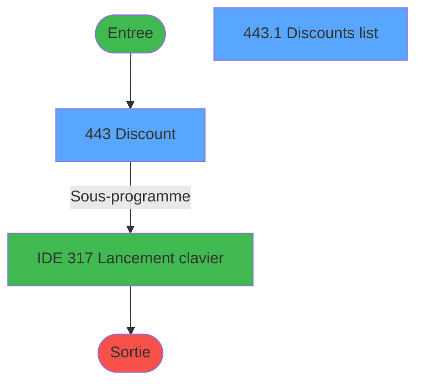
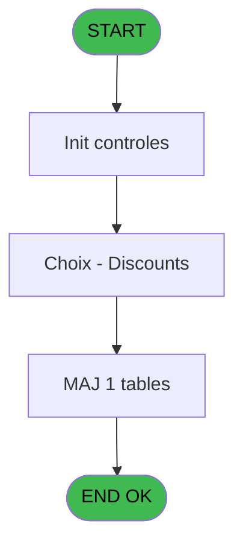
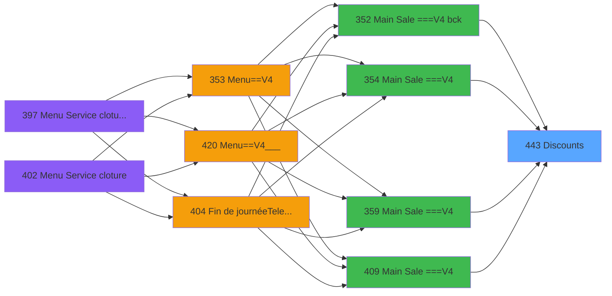
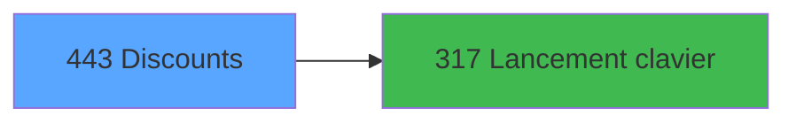

# PVE IDE 443 - Discounts

> **Analyse**: Phases 1-4 2026-02-03 20:11 -> 20:11 (15s) | Assemblage 20:11
> **Pipeline**: V7.2 Enrichi
> **Structure**: 4 onglets (Resume | Ecrans | Donnees | Connexions)

<!-- TAB:Resume -->

## 1. FICHE D'IDENTITE

| Attribut | Valeur |
|----------|--------|
| Projet | PVE |
| IDE Position | 443 |
| Nom Programme | Discounts |
| Fichier source | `Prg_443.xml` |
| Dossier IDE | A |
| Taches | 3 (2 ecrans visibles) |
| Tables modifiees | 1 |
| Programmes appeles | 1 |

## 2. DESCRIPTION FONCTIONNELLE

**Discounts** assure la gestion complete de ce processus, accessible depuis [Main Sale ===V4 (IDE 0)](PVE-IDE-0.md), [Main Sale ===V4 bck (IDE 352)](PVE-IDE-352.md), [Main Sale ===V4 (IDE 354)](PVE-IDE-354.md), [Main Sale ===V4 (IDE 359)](PVE-IDE-359.md), [Main Sale ===V4 (IDE 409)](PVE-IDE-409.md), [Main Sale ===V4 (IDE 415)](PVE-IDE-415.md), [Main Sale ===V4 Booking ACTUEL (IDE 417)](PVE-IDE-417.md), [Main Sale (IDE 440)](PVE-IDE-440.md).

Le flux de traitement s'organise en **1 blocs fonctionnels** :

- **Traitement** (3 taches) : traitements metier divers

**Donnees modifiees** : 1 tables en ecriture (pv_height).

**Logique metier** : 3 regles identifiees couvrant conditions metier.

## 3. BLOCS FONCTIONNELS

### 3.1 Traitement (3 taches)

Traitements internes.

---

#### 443 - Discount [[ECRAN]](#ecran-t1)

**Role** : Traitement : Discount.
**Ecran** : 1138 x 310 DLU (Type6) | [Voir mockup](#ecran-t1)
**Variables liees** : A (P. Discount), H (T Discount)
**Delegue a** : [Lancement clavier (IDE 317)](PVE-IDE-317.md)

---

#### 443.1 - Discounts list [[ECRAN]](#ecran-t2)

**Role** : Traitement : Discounts list.
**Ecran** : 245 x 161 DLU (Type6) | [Voir mockup](#ecran-t2)
**Delegue a** : [Lancement clavier (IDE 317)](PVE-IDE-317.md)

---

#### 443.2 - Keyboard [[ECRAN]](#ecran-t3)

**Role** : Traitement : Keyboard.
**Ecran** : 199 x 80 DLU (MDI) | [Voir mockup](#ecran-t3)
**Delegue a** : [Lancement clavier (IDE 317)](PVE-IDE-317.md)

## 5. REGLES METIER

3 regles identifiees:

### Autres (3 regles)

#### [RM-001] Traitement si Val (V Tab [K],'') est non nul

| Element | Detail |
|---------|--------|
| **Condition** | `Val (V Tab [K]` |
| **Si vrai** | '')<>0 |
| **Si faux** | 100*(1-Val (V Tab [K],'10')/P. Price [C]),0) |
| **Variables** | C (P. Price), K (V Tab) |
| **Expression source** | Expression 4 : `IF (Val (V Tab [K],'')<>0,100*(1-Val (V Tab [K],'10')/P. Pri` |
| **Exemple** | Si Val (V Tab [K] → '')<>0. Sinon → 100*(1-Val (V Tab [K],'10')/P. Price [C]),0) |

#### [RM-002] Traitement conditionnel si P. Discount [A] est a zero

| Element | Detail |
|---------|--------|
| **Condition** | `P. Discount [A]=0` |
| **Si vrai** | 0 |
| **Si faux** | [N]) |
| **Variables** | A (P. Discount) |
| **Expression source** | Expression 6 : `IF (P. Discount [A]=0,0,[N])` |
| **Exemple** | Si P. Discount [A]=0 → 0. Sinon → [N]) |
| **Impact** | [443 - Discount](#t1) |

#### [RM-003] Si P. Discount [A]<>100 alors 'Select the discount %'&IF (GetParam ('SERVICE')='SKIN' sinon ' or the discounted price','')&' and justify it with a reason from the list','justify discount with a reason from the list')

| Element | Detail |
|---------|--------|
| **Condition** | `P. Discount [A]<>100` |
| **Si vrai** | 'Select the discount %'&IF (GetParam ('SERVICE')='SKIN' |
| **Si faux** | ' or the discounted price','')&' and justify it with a reason from the list','justify discount with a reason from the list') |
| **Variables** | A (P. Discount) |
| **Expression source** | Expression 19 : `IF(P. Discount [A]<>100,'Select the discount %'&IF (GetParam` |
| **Exemple** | Si P. Discount [A]<>100 → 'Select the discount %'&IF (GetParam ('SERVICE')='SKIN' |
| **Impact** | [443 - Discount](#t1) |

## 6. CONTEXTE

- **Appele par**: [Main Sale ===V4 (IDE 0)](PVE-IDE-0.md), [Main Sale ===V4 bck (IDE 352)](PVE-IDE-352.md), [Main Sale ===V4 (IDE 354)](PVE-IDE-354.md), [Main Sale ===V4 (IDE 359)](PVE-IDE-359.md), [Main Sale ===V4 (IDE 409)](PVE-IDE-409.md), [Main Sale ===V4 (IDE 415)](PVE-IDE-415.md), [Main Sale ===V4 Booking ACTUEL (IDE 417)](PVE-IDE-417.md), [Main Sale (IDE 440)](PVE-IDE-440.md)
- **Appelle**: 1 programmes | **Tables**: 2 (W:1 R:1 L:1) | **Taches**: 3 | **Expressions**: 29

<!-- TAB:Ecrans -->

## 8. ECRANS

### 8.1 Forms visibles (2 / 3)

| # | Position | Tache | Nom | Type | Largeur | Hauteur | Bloc |
|---|----------|-------|-----|------|---------|---------|------|
| 1 | 443 | 443 | Discount | Type6 | 1138 | 310 | Traitement |
| 2 | 443.1 | 443.1 | Discounts list | Type6 | 245 | 161 | Traitement |

### 8.2 Mockups Ecrans

---

#### 443 - Discount
**Tache** : [443](#t1) | **Type** : Type6 | **Dimensions** : 1138 x 310 DLU
**Bloc** : Traitement | **Titre IDE** : Discount

<!-- FORM-DATA:
{
    "width":  1138,
    "vFactor":  8,
    "type":  "Type6",
    "hFactor":  8,
    "controls":  [
                     {
                         "x":  64,
                         "type":  "label",
                         "var":  "",
                         "y":  94,
                         "w":  162,
                         "fmt":  "",
                         "name":  "",
                         "h":  67,
                         "color":  "189",
                         "text":  "",
                         "parent":  1
                     },
                     {
                         "x":  64,
                         "type":  "label",
                         "var":  "",
                         "y":  177,
                         "w":  162,
                         "fmt":  "",
                         "name":  "",
                         "h":  63,
                         "color":  "189",
                         "text":  "",
                         "parent":  1
                     },
                     {
                         "x":  77,
                         "type":  "label",
                         "var":  "",
                         "y":  100,
                         "w":  138,
                         "fmt":  "",
                         "name":  "",
                         "h":  22,
                         "color":  "189",
                         "text":  "Discounted price",
                         "parent":  2
                     },
                     {
                         "x":  77,
                         "type":  "label",
                         "var":  "",
                         "y":  185,
                         "w":  138,
                         "fmt":  "",
                         "name":  "",
                         "h":  14,
                         "color":  "189",
                         "text":  "Discount %",
                         "parent":  3
                     },
                     {
                         "x":  662,
                         "type":  "label",
                         "var":  "",
                         "y":  51,
                         "w":  228,
                         "fmt":  "",
                         "name":  "",
                         "h":  10,
                         "color":  "183",
                         "text":  "Reason",
                         "parent":  null
                     },
                     {
                         "x":  0,
                         "type":  "label",
                         "var":  "",
                         "y":  0,
                         "w":  1118,
                         "fmt":  "",
                         "name":  "",
                         "h":  42,
                         "color":  "182",
                         "text":  "",
                         "parent":  null
                     },
                     {
                         "x":  658,
                         "type":  "table",
                         "var":  "",
                         "name":  "",
                         "titleH":  12,
                         "color":  "110",
                         "w":  342,
                         "y":  63,
                         "fmt":  "",
                         "parent":  null,
                         "text":  "",
                         "rowH":  24,
                         "h":  193,
                         "cols":  [
                                      {
                                          "title":  "",
                                          "layer":  1,
                                          "w":  336
                                      }
                                  ],
                         "rows":  1
                     },
                     {
                         "x":  0,
                         "type":  "label",
                         "var":  "",
                         "y":  267,
                         "w":  1120,
                         "fmt":  "",
                         "name":  "",
                         "h":  37,
                         "color":  "110",
                         "text":  "",
                         "parent":  null
                     },
                     {
                         "x":  22,
                         "type":  "label",
                         "var":  "",
                         "y":  280,
                         "w":  88,
                         "fmt":  "",
                         "name":  "",
                         "h":  11,
                         "color":  "110",
                         "text":  "Comment :",
                         "parent":  30
                     },
                     {
                         "x":  28,
                         "type":  "tab",
                         "var":  "",
                         "y":  50,
                         "w":  582,
                         "fmt":  "",
                         "name":  "V Tab",
                         "h":  208,
                         "color":  "62",
                         "text":  "%,Price",
                         "parent":  null
                     },
                     {
                         "x":  77,
                         "type":  "edit",
                         "var":  "",
                         "y":  126,
                         "w":  140,
                         "fmt":  "",
                         "name":  "V Chaine disc price",
                         "h":  19,
                         "color":  "110",
                         "text":  "",
                         "parent":  2
                     },
                     {
                         "x":  112,
                         "type":  "edit",
                         "var":  "",
                         "y":  279,
                         "w":  647,
                         "fmt":  "",
                         "name":  "Comment",
                         "h":  12,
                         "color":  "110",
                         "text":  "",
                         "parent":  30
                     },
                     {
                         "x":  717,
                         "type":  "edit",
                         "var":  "",
                         "y":  65,
                         "w":  274,
                         "fmt":  "",
                         "name":  "CTRL_001",
                         "h":  21,
                         "color":  "110",
                         "text":  "",
                         "parent":  25
                     },
                     {
                         "x":  1020,
                         "type":  "image",
                         "var":  "",
                         "y":  4,
                         "w":  96,
                         "fmt":  "",
                         "name":  "",
                         "h":  37,
                         "color":  "",
                         "text":  "",
                         "parent":  24
                     },
                     {
                         "x":  22,
                         "type":  "edit",
                         "var":  "",
                         "y":  14,
                         "w":  956,
                         "fmt":  "100",
                         "name":  "",
                         "h":  10,
                         "color":  "186",
                         "text":  "",
                         "parent":  22
                     },
                     {
                         "x":  76,
                         "type":  "edit",
                         "var":  "",
                         "y":  206,
                         "w":  140,
                         "fmt":  "N3.2",
                         "name":  "",
                         "h":  19,
                         "color":  "186",
                         "text":  "",
                         "parent":  19
                     },
                     {
                         "x":  1000,
                         "type":  "button",
                         "var":  "",
                         "y":  64,
                         "w":  88,
                         "fmt":  "ñ",
                         "name":  "",
                         "h":  98,
                         "color":  "",
                         "text":  "",
                         "parent":  null
                     },
                     {
                         "x":  264,
                         "type":  "button",
                         "var":  "",
                         "y":  79,
                         "w":  106,
                         "fmt":  "1",
                         "name":  "*1",
                         "h":  42,
                         "color":  "",
                         "text":  "",
                         "parent":  1
                     },
                     {
                         "x":  368,
                         "type":  "button",
                         "var":  "",
                         "y":  79,
                         "w":  106,
                         "fmt":  "2",
                         "name":  "*2",
                         "h":  42,
                         "color":  "",
                         "text":  "",
                         "parent":  1
                     },
                     {
                         "x":  472,
                         "type":  "button",
                         "var":  "",
                         "y":  79,
                         "w":  106,
                         "fmt":  "3",
                         "name":  "*3",
                         "h":  42,
                         "color":  "",
                         "text":  "",
                         "parent":  1
                     },
                     {
                         "x":  264,
                         "type":  "button",
                         "var":  "",
                         "y":  121,
                         "w":  106,
                         "fmt":  "4",
                         "name":  "*4",
                         "h":  42,
                         "color":  "",
                         "text":  "",
                         "parent":  1
                     },
                     {
                         "x":  368,
                         "type":  "button",
                         "var":  "",
                         "y":  121,
                         "w":  106,
                         "fmt":  "5",
                         "name":  "*5",
                         "h":  42,
                         "color":  "",
                         "text":  "",
                         "parent":  1
                     },
                     {
                         "x":  472,
                         "type":  "button",
                         "var":  "",
                         "y":  121,
                         "w":  106,
                         "fmt":  "6",
                         "name":  "*6",
                         "h":  42,
                         "color":  "",
                         "text":  "",
                         "parent":  1
                     },
                     {
                         "x":  264,
                         "type":  "button",
                         "var":  "",
                         "y":  163,
                         "w":  106,
                         "fmt":  "7",
                         "name":  "*7",
                         "h":  42,
                         "color":  "",
                         "text":  "",
                         "parent":  1
                     },
                     {
                         "x":  368,
                         "type":  "button",
                         "var":  "",
                         "y":  163,
                         "w":  106,
                         "fmt":  "8",
                         "name":  "*8",
                         "h":  42,
                         "color":  "",
                         "text":  "",
                         "parent":  1
                     },
                     {
                         "x":  472,
                         "type":  "button",
                         "var":  "",
                         "y":  163,
                         "w":  106,
                         "fmt":  "9",
                         "name":  "*9",
                         "h":  42,
                         "color":  "",
                         "text":  "",
                         "parent":  1
                     },
                     {
                         "x":  1000,
                         "type":  "button",
                         "var":  "",
                         "y":  161,
                         "w":  88,
                         "fmt":  "ò",
                         "name":  "",
                         "h":  95,
                         "color":  "",
                         "text":  "",
                         "parent":  null
                     },
                     {
                         "x":  264,
                         "type":  "button",
                         "var":  "",
                         "y":  205,
                         "w":  106,
                         "fmt":  "Clear",
                         "name":  "+CLEAR",
                         "h":  42,
                         "color":  "",
                         "text":  "",
                         "parent":  1
                     },
                     {
                         "x":  368,
                         "type":  "button",
                         "var":  "",
                         "y":  205,
                         "w":  106,
                         "fmt":  "0",
                         "name":  "*0",
                         "h":  42,
                         "color":  "",
                         "text":  "",
                         "parent":  1
                     },
                     {
                         "x":  472,
                         "type":  "button",
                         "var":  "",
                         "y":  205,
                         "w":  106,
                         "fmt":  "Del",
                         "name":  "+BACKSPACE",
                         "h":  42,
                         "color":  "",
                         "text":  "",
                         "parent":  1
                     },
                     {
                         "x":  884,
                         "type":  "button",
                         "var":  "",
                         "y":  272,
                         "w":  116,
                         "fmt":  "\u0026Cancel",
                         "name":  "B.Cancel",
                         "h":  28,
                         "color":  "",
                         "text":  "",
                         "parent":  null
                     },
                     {
                         "x":  768,
                         "type":  "button",
                         "var":  "",
                         "y":  272,
                         "w":  116,
                         "fmt":  "\u0026Keyboard",
                         "name":  "KEYBOARD",
                         "h":  28,
                         "color":  "",
                         "text":  "",
                         "parent":  null
                     },
                     {
                         "x":  1000,
                         "type":  "button",
                         "var":  "",
                         "y":  272,
                         "w":  116,
                         "fmt":  "\u0026Select",
                         "name":  "",
                         "h":  28,
                         "color":  "",
                         "text":  "",
                         "parent":  null
                     },
                     {
                         "x":  42,
                         "type":  "subform",
                         "var":  "",
                         "y":  76,
                         "w":  547,
                         "fmt":  "",
                         "name":  "Choix - Discounts",
                         "h":  177,
                         "color":  "",
                         "text":  "",
                         "parent":  1
                     }
                 ],
    "taskId":  "443",
    "height":  310
}
-->

<strong>Champs : 5 champs</strong>

| Pos (x,y) | Nom | Variable | Type |
|-----------|-----|----------|------|
| 77,126 | V Chaine disc price | - | edit |
| 112,279 | Comment | - | edit |
| 717,65 | CTRL_001 | - | edit |
| 22,14 | 100 | - | edit |
| 76,206 | N3.2 | - | edit |

<strong>Boutons : 17 boutons</strong>

| Bouton | Pos (x,y) | Action |
|--------|-----------|--------|
| ñ | 1000,64 | Bouton fonctionnel |
| 1 | 264,79 | Bouton fonctionnel |
| 2 | 368,79 | Bouton fonctionnel |
| 3 | 472,79 | Bouton fonctionnel |
| 4 | 264,121 | Bouton fonctionnel |
| 5 | 368,121 | Bouton fonctionnel |
| 6 | 472,121 | Bouton fonctionnel |
| 7 | 264,163 | Bouton fonctionnel |
| 8 | 368,163 | Bouton fonctionnel |
| 9 | 472,163 | Bouton fonctionnel |
| ò | 1000,161 | Bouton fonctionnel |
| Clear | 264,205 | Bouton fonctionnel |
| 0 | 368,205 | Bouton fonctionnel |
| Del | 472,205 | Bouton fonctionnel |
| Cancel | 884,272 | Annule et retour au menu |
| Keyboard | 768,272 | Bouton fonctionnel |
| Select | 1000,272 | Ouvre la selection |

---

#### 443.1 - Discounts list
**Tache** : [443.1](#t2) | **Type** : Type6 | **Dimensions** : 245 x 161 DLU
**Bloc** : Traitement | **Titre IDE** : Discounts list

<!-- FORM-DATA:
{
    "width":  245,
    "vFactor":  8,
    "type":  "Type6",
    "hFactor":  4,
    "controls":  [
                     {
                         "x":  6,
                         "type":  "label",
                         "var":  "",
                         "y":  1,
                         "w":  53,
                         "fmt":  "",
                         "name":  "",
                         "h":  13,
                         "color":  "183",
                         "text":  "%",
                         "parent":  null
                     },
                     {
                         "x":  72,
                         "type":  "label",
                         "var":  "",
                         "y":  1,
                         "w":  96,
                         "fmt":  "",
                         "name":  "",
                         "h":  13,
                         "color":  "183",
                         "text":  "Description",
                         "parent":  null
                     },
                     {
                         "x":  1,
                         "type":  "table",
                         "var":  "",
                         "name":  "",
                         "titleH":  12,
                         "color":  "110",
                         "w":  198,
                         "y":  15,
                         "fmt":  "",
                         "parent":  null,
                         "text":  "",
                         "rowH":  28,
                         "h":  143,
                         "cols":  [
                                      {
                                          "title":  "",
                                          "layer":  1,
                                          "w":  65
                                      },
                                      {
                                          "title":  "",
                                          "layer":  2,
                                          "w":  128
                                      }
                                  ],
                         "rows":  2
                     },
                     {
                         "x":  6,
                         "type":  "edit",
                         "var":  "",
                         "y":  17,
                         "w":  52,
                         "fmt":  "#2",
                         "name":  "",
                         "h":  24,
                         "color":  "110",
                         "text":  "",
                         "parent":  3
                     },
                     {
                         "x":  71,
                         "type":  "edit",
                         "var":  "",
                         "y":  18,
                         "w":  120,
                         "fmt":  "",
                         "name":  "",
                         "h":  24,
                         "color":  "110",
                         "text":  "",
                         "parent":  3
                     },
                     {
                         "x":  199,
                         "type":  "button",
                         "var":  "",
                         "y":  15,
                         "w":  44,
                         "fmt":  "ñ",
                         "name":  "",
                         "h":  72,
                         "color":  "",
                         "text":  "",
                         "parent":  null
                     },
                     {
                         "x":  199,
                         "type":  "button",
                         "var":  "",
                         "y":  87,
                         "w":  44,
                         "fmt":  "ò",
                         "name":  "",
                         "h":  72,
                         "color":  "",
                         "text":  "",
                         "parent":  null
                     }
                 ],
    "taskId":  "443.1",
    "height":  161
}
-->

<strong>Champs : 2 champs</strong>

| Pos (x,y) | Nom | Variable | Type |
|-----------|-----|----------|------|
| 6,17 | #2 | - | edit |
| 71,18 | (sans nom) | - | edit |

<strong>Boutons : 2 boutons</strong>

| Bouton | Pos (x,y) | Action |
|--------|-----------|--------|
| ñ | 199,15 | Bouton fonctionnel |
| ò | 199,87 | Bouton fonctionnel |

## 9. NAVIGATION

### 9.1 Enchainement des ecrans

**Detail par enchainement :**

| Depuis | Action | Vers | Retour |
|--------|--------|------|--------|
| Discount | Sous-programme | [Lancement clavier (IDE 317)](PVE-IDE-317.md) | Retour ecran |

### 9.3 Structure hierarchique (3 taches)

| Position | Tache | Type | Dimensions | Bloc |
|----------|-------|------|------------|------|
| **443.1** | [**Discount** (443)](#t1) [mockup](#ecran-t1) | Type6 | 1138x310 | Traitement |
| 443.1.1 | [Discounts list (443.1)](#t2) [mockup](#ecran-t2) | Type6 | 245x161 | |
| 443.1.2 | [Keyboard (443.2)](#t3) [mockup](#ecran-t3) | MDI | 199x80 | |

### 9.4 Algorigramme

> **Legende**: Vert = START/END OK | Rouge = END KO | Bleu = Decisions
> *Algorigramme auto-genere. Utiliser `/algorigramme` pour une synthese metier detaillee.*

<!-- TAB:Donnees -->

## 10. TABLES

### Tables utilisees (2)

| ID | Nom | Description | Type | R | W | L | Usages |
|----|-----|-------------|------|---|---|---|--------|
| 386 | ski_frame |  | DB | R |   |   | 1 |
| 387 | pv_height |  | DB |   | **W** | L | 2 |

### Colonnes par table (2 / 2 tables avec colonnes identifiees)

Table 386 - ski_frame (R) - 1 usages

| Lettre | Variable | Acces | Type |
|--------|----------|-------|------|
| A | P. Discount | R | Numeric |
| B | P. Reason | R | Numeric |
| C | P. Price | R | Numeric |
| D | P. Label | R | Alpha |
| E | P. Comment | R | Alpha |
| F | P Remise Great Members | R | Logical |
| G | V Chaine % | R | Alpha |
| H | T Discount | R | Logical |
| I | V Chaine disc price | R | Alpha |
| J | V Comment | R | Alpha |
| K | V Tab | R | Alpha |
| L | V.Echap | R | Logical |

Table 387 - pv_height (**W**/L) - 2 usages

| Lettre | Variable | Acces | Type |
|--------|----------|-------|------|
| A | P. Discount | W | Alpha |
| B | P.Remise Great Members | W | Logical |

## 11. VARIABLES

### 11.1 Parametres entrants (6)

Variables recues du programme appelant ([Main Sale ===V4 (IDE 0)](PVE-IDE-0.md)).

| Lettre | Nom | Type | Usage dans |
|--------|-----|------|-----------|
| A | P. Discount | Numeric | [443](#t1), [443.1](#t2) |
| B | P. Reason | Numeric | 1x parametre entrant |
| C | P. Price | Numeric | 3x parametre entrant |
| D | P. Label | Alpha | - |
| E | P. Comment | Alpha | 1x parametre entrant |
| F | P Remise Great Members | Logical | - |

### 11.2 Variables de session (5)

Variables persistantes pendant toute la session.

| Lettre | Nom | Type | Usage dans |
|--------|-----|------|-----------|
| G | V Chaine % | Alpha | 5x session |
| I | V Chaine disc price | Alpha | - |
| J | V Comment | Alpha | - |
| K | V Tab | Alpha | 3x session |
| L | V.Echap | Logical | 1x session |

### 11.3 Autres (1)

Variables diverses.

| Lettre | Nom | Type | Usage dans |
|--------|-----|------|-----------|
| H | T Discount | Logical | - |

## 12. EXPRESSIONS

**29 / 29 expressions decodees (100%)**

### 12.1 Repartition par type

| Type | Expressions | Regles |
|------|-------------|--------|
| CALCUL | 2 | 5 |
| CONDITION | 15 | 2 |
| CONSTANTE | 4 | 0 |
| OTHER | 5 | 0 |
| CAST_LOGIQUE | 1 | 0 |
| STRING | 2 | 0 |

### 12.2 Expressions cles par type

#### CALCUL (2 expressions)

| Type | IDE | Expression | Regle |
|------|-----|------------|-------|
| CALCUL | 4 | `IF (Val (V Tab [K],'')<>0,100*(1-Val (V Tab [K],'10')/P. Price [C]),0)` | [RM-001](#rm-RM-001) |
| CALCUL | 5 | `100-100*Val (V Tab [K],'')/P. Price [C]` | - |

#### CONDITION (15 expressions)

| Type | IDE | Expression | Regle |
|------|-----|------------|-------|
| CONDITION | 19 | `IF(P. Discount [A]<>100,'Select the discount %'&IF (GetParam ('SERVICE')='SKIN',' or the discounted price','')&' and justify it with a reason from the list','justify discount with a reason from the list')` | [RM-003](#rm-RM-003) |
| CONDITION | 6 | `IF (P. Discount [A]=0,0,[N])` | [RM-002](#rm-RM-002) |
| CONDITION | 24 | `VG33='TB'` | - |
| CONDITION | 23 | `VG33<>'TB'` | - |
| CONDITION | 22 | `V Chaine % [G]<>'100'` | - |
| ... | | *+10 autres* | |

#### CONSTANTE (4 expressions)

| Type | IDE | Expression | Regle |
|------|-----|------------|-------|
| CONSTANTE | 26 | `0` | - |
| CONSTANTE | 27 | `''` | - |
| CONSTANTE | 10 | `'%'` | - |
| CONSTANTE | 16 | `''` | - |

#### OTHER (5 expressions)

| Type | IDE | Expression | Regle |
|------|-----|------------|-------|
| OTHER | 11 | `P. Comment [E]` | - |
| OTHER | 25 | `CtrlGoto('Comment',0,0)` | - |
| OTHER | 8 | `V.Echap [L]` | - |
| OTHER | 1 | `GetParam ('SERVICE')` | - |
| OTHER | 7 | `[O]` | - |

#### CAST_LOGIQUE (1 expressions)

| Type | IDE | Expression | Regle |
|------|-----|------------|-------|
| CAST_LOGIQUE | 28 | `'TRUE'LOG` | - |

#### STRING (2 expressions)

| Type | IDE | Expression | Regle |
|------|-----|------------|-------|
| STRING | 3 | `Val (V Chaine % [G],'3')` | - |
| STRING | 2 | `Trim (Str (P. Discount [A],'3'))` | - |

### 12.3 Toutes les expressions (29)

Voir les 29 expressions

#### CALCUL (2)

| IDE | Expression Decodee |
|-----|-------------------|
| 5 | `100-100*Val (V Tab [K],'')/P. Price [C]` |
| 4 | `IF (Val (V Tab [K],'')<>0,100*(1-Val (V Tab [K],'10')/P. Price [C]),0)` |

#### CONDITION (15)

| IDE | Expression Decodee |
|-----|-------------------|
| 6 | `IF (P. Discount [A]=0,0,[N])` |
| 19 | `IF(P. Discount [A]<>100,'Select the discount %'&IF (GetParam ('SERVICE')='SKIN',' or the discounted price','')&' and justify it with a reason from the list','justify discount with a reason from the list')` |
| 9 | `CndRange (P. Reason [B]<>0,P. Reason [B])` |
| 12 | `[P]='%'` |
| 13 | `[P]='P'` |
| 14 | `P. Discount [A]<>100` |
| 15 | `P. Discount [A]<>100 AND V Chaine % [G]='100'` |
| 20 | `[P]='P'` |
| 21 | `V Chaine % [G]='100'` |
| 22 | `V Chaine % [G]<>'100'` |
| 23 | `VG33<>'TB'` |
| 24 | `VG33='TB'` |
| 29 | `P. Discount [A]<>100` |
| 17 | `Val (V Chaine % [G],'3')>100` |
| 18 | `Val (V Tab [K],'')>=P. Price [C]` |

#### CONSTANTE (4)

| IDE | Expression Decodee |
|-----|-------------------|
| 10 | `'%'` |
| 16 | `''` |
| 26 | `0` |
| 27 | `''` |

#### OTHER (5)

| IDE | Expression Decodee |
|-----|-------------------|
| 1 | `GetParam ('SERVICE')` |
| 7 | `[O]` |
| 8 | `V.Echap [L]` |
| 11 | `P. Comment [E]` |
| 25 | `CtrlGoto('Comment',0,0)` |

#### CAST_LOGIQUE (1)

| IDE | Expression Decodee |
|-----|-------------------|
| 28 | `'TRUE'LOG` |

#### STRING (2)

| IDE | Expression Decodee |
|-----|-------------------|
| 2 | `Trim (Str (P. Discount [A],'3'))` |
| 3 | `Val (V Chaine % [G],'3')` |

<!-- TAB:Connexions -->

## 13. GRAPHE D'APPELS

### 13.1 Chaine depuis Main (Callers)

Main -> ... -> [Main Sale ===V4 (IDE 0)](PVE-IDE-0.md) -> **Discounts (IDE 443)**

Main -> ... -> [Main Sale ===V4 bck (IDE 352)](PVE-IDE-352.md) -> **Discounts (IDE 443)**

Main -> ... -> [Main Sale ===V4 (IDE 354)](PVE-IDE-354.md) -> **Discounts (IDE 443)**

Main -> ... -> [Main Sale ===V4 (IDE 359)](PVE-IDE-359.md) -> **Discounts (IDE 443)**

Main -> ... -> [Main Sale ===V4 (IDE 409)](PVE-IDE-409.md) -> **Discounts (IDE 443)**

Main -> ... -> [Main Sale ===V4 (IDE 415)](PVE-IDE-415.md) -> **Discounts (IDE 443)**

Main -> ... -> [Main Sale ===V4 Booking ACTUEL (IDE 417)](PVE-IDE-417.md) -> **Discounts (IDE 443)**

Main -> ... -> [Main Sale (IDE 440)](PVE-IDE-440.md) -> **Discounts (IDE 443)**

### 13.2 Callers

| IDE | Nom Programme | Nb Appels |
|-----|---------------|-----------|
| [0](PVE-IDE-0.md) | Main Sale ===V4 | 2 |
| [352](PVE-IDE-352.md) | Main Sale ===V4 bck | 2 |
| [354](PVE-IDE-354.md) | Main Sale ===V4 | 2 |
| [359](PVE-IDE-359.md) | Main Sale ===V4 | 2 |
| [409](PVE-IDE-409.md) | Main Sale ===V4 | 2 |
| [415](PVE-IDE-415.md) | Main Sale ===V4 | 2 |
| [417](PVE-IDE-417.md) | Main Sale ===V4 Booking ACTUEL | 2 |
| [440](PVE-IDE-440.md) | Main Sale | 2 |

### 13.3 Callees (programmes appeles)

### 13.4 Detail Callees avec contexte

| IDE | Nom Programme | Appels | Contexte |
|-----|---------------|--------|----------|
| [317](PVE-IDE-317.md) | Lancement clavier | 1 | Sous-programme |

## 14. RECOMMANDATIONS MIGRATION

### 14.1 Profil du programme

| Metrique | Valeur | Impact migration |
|----------|--------|-----------------|
| Lignes de logique | 100 | Programme compact |
| Expressions | 29 | Peu de logique |
| Tables WRITE | 1 | Impact faible |
| Sous-programmes | 1 | Peu de dependances |
| Ecrans visibles | 2 | Quelques ecrans |
| Code desactive | 0% (0 / 100) | Code sain |
| Regles metier | 3 | Quelques regles a preserver |

### 14.2 Plan de migration par bloc

#### Traitement (3 taches: 3 ecrans, 0 traitement)

- **Strategie** : 3 composant(s) UI (Razor/React) avec formulaires et validation.
- 1 sous-programme(s) a migrer ou a reutiliser depuis les services existants.
- Decomposer les taches en services unitaires testables.

### 14.3 Dependances critiques

| Dependance | Type | Appels | Impact |
|------------|------|--------|--------|
| pv_height | Table WRITE (Database) | 1x | Schema + repository |
| [Lancement clavier (IDE 317)](PVE-IDE-317.md) | Sous-programme | 1x | Normale - Sous-programme |

---
*Spec DETAILED generee par Pipeline V7.2 - 2026-02-03 20:11*
