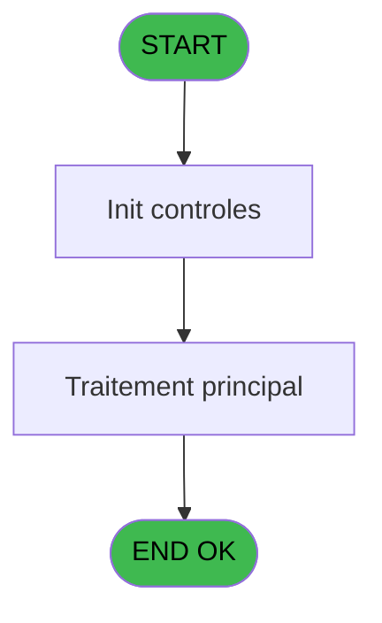
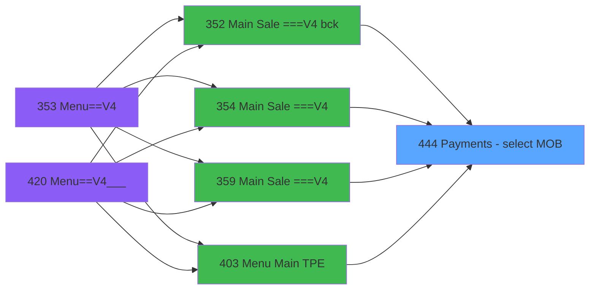
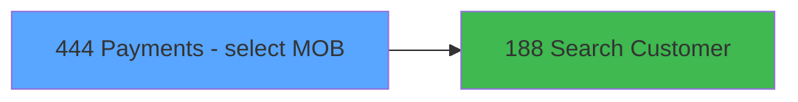

# PVE IDE 444 - Payments - select (MOB)

> **Analyse**: Phases 1-4 2026-02-03 20:11 -> 20:12 (16s) | Assemblage 20:12
> **Pipeline**: V7.2 Enrichi
> **Structure**: 4 onglets (Resume | Ecrans | Donnees | Connexions)

<!-- TAB:Resume -->

## 1. FICHE D'IDENTITE

| Attribut | Valeur |
|----------|--------|
| Projet | PVE |
| IDE Position | 444 |
| Nom Programme | Payments - select (MOB) |
| Fichier source | `Prg_444.xml` |
| Dossier IDE | A |
| Taches | 1 (1 ecrans visibles) |
| Tables modifiees | 0 |
| Programmes appeles | 1 |

## 2. DESCRIPTION FONCTIONNELLE

**Payments - select (MOB)** assure la gestion complete de ce processus, accessible depuis [Main Sale ===V4 (IDE 0)](PVE-IDE-0.md), [Main Sale ===V4 bck (IDE 352)](PVE-IDE-352.md), [Main Sale ===V4 (IDE 354)](PVE-IDE-354.md), [Main Sale ===V4 (IDE 359)](PVE-IDE-359.md), [Menu Main (TPE) (IDE 403)](PVE-IDE-403.md), [Main Sale ===V4 (IDE 409)](PVE-IDE-409.md), [Main Sale ===V4 (IDE 415)](PVE-IDE-415.md), [Main Sale ===V4 Booking ACTUEL (IDE 417)](PVE-IDE-417.md), [Main Sale (IDE 440)](PVE-IDE-440.md).

Le flux de traitement s'organise en **1 blocs fonctionnels** :

- **Traitement** (1 tache) : traitements metier divers

**Logique metier** : 2 regles identifiees couvrant conditions metier.

## 3. BLOCS FONCTIONNELS

### 3.1 Traitement (1 tache)

Traitements internes.

---

#### 444 - Payment [[ECRAN]](#ecran-t1)

**Role** : Traitement : Payment.
**Ecran** : 471 x 334 DLU (MDI) | [Voir mockup](#ecran-t1)
**Variables liees** : A (P. Payment type)
**Delegue a** : [Search Customer (IDE 188)](PVE-IDE-188.md)

## 5. REGLES METIER

2 regles identifiees:

### Autres (2 regles)

#### [RM-001] Condition toujours vraie (flag actif)

| Element | Detail |
|---------|--------|
| **Condition** | `VG36` |
| **Si vrai** | 'TRUE'LOG |
| **Si faux** | L Customer ? [I]<>'CREDIT CARD') |
| **Variables** | I (L Customer ?) |
| **Expression source** | Expression 1 : `IF(VG36,'TRUE'LOG,L Customer ? [I]<>'CREDIT CARD')` |
| **Exemple** | Si VG36 → 'TRUE'LOG. Sinon → L Customer ? [I]<>'CREDIT CARD') |

#### [RM-002] Condition toujours vraie (flag actif)

| Element | Detail |
|---------|--------|
| **Condition** | `[K] AND L Customer ? [I]<>'REFUSAL TO SELL' AND P.Bolquer Free ? [G]` |
| **Si vrai** | 'TRUE'LOG |
| **Si faux** | 'FALSE'LOG) |
| **Variables** | G (P.Bolquer Free ?), I (L Customer ?) |
| **Expression source** | Expression 17 : `IF([K] AND L Customer ? [I]<>'REFUSAL TO SELL' AND P.Bolquer` |
| **Exemple** | Si [K] AND L Customer ? [I]<>'REFUSAL TO SELL' AND P.Bolquer Free ? [G] → 'TRUE'LOG. Sinon → 'FALSE'LOG) |

## 6. CONTEXTE

- **Appele par**: [Main Sale ===V4 (IDE 0)](PVE-IDE-0.md), [Main Sale ===V4 bck (IDE 352)](PVE-IDE-352.md), [Main Sale ===V4 (IDE 354)](PVE-IDE-354.md), [Main Sale ===V4 (IDE 359)](PVE-IDE-359.md), [Menu Main (TPE) (IDE 403)](PVE-IDE-403.md), [Main Sale ===V4 (IDE 409)](PVE-IDE-409.md), [Main Sale ===V4 (IDE 415)](PVE-IDE-415.md), [Main Sale ===V4 Booking ACTUEL (IDE 417)](PVE-IDE-417.md), [Main Sale (IDE 440)](PVE-IDE-440.md)
- **Appelle**: 1 programmes | **Tables**: 3 (W:0 R:1 L:2) | **Taches**: 1 | **Expressions**: 17

<!-- TAB:Ecrans -->

## 8. ECRANS

### 8.1 Forms visibles (1 / 1)

| # | Position | Tache | Nom | Type | Largeur | Hauteur | Bloc |
|---|----------|-------|-----|------|---------|---------|------|
| 1 | 444 | 444 | Payment | MDI | 471 | 334 | Traitement |

### 8.2 Mockups Ecrans

---

#### 444 - Payment
**Tache** : [444](#t1) | **Type** : MDI | **Dimensions** : 471 x 334 DLU
**Bloc** : Traitement | **Titre IDE** : Payment

<!-- FORM-DATA:
{
    "width":  471,
    "vFactor":  8,
    "type":  "MDI",
    "hFactor":  4,
    "controls":  [
                     {
                         "x":  0,
                         "type":  "label",
                         "var":  "",
                         "y":  0,
                         "w":  471,
                         "fmt":  "",
                         "name":  "",
                         "h":  42,
                         "color":  "182",
                         "text":  "",
                         "parent":  null
                     },
                     {
                         "x":  16,
                         "type":  "label",
                         "var":  "",
                         "y":  15,
                         "w":  367,
                         "fmt":  "",
                         "name":  "",
                         "h":  10,
                         "color":  "186",
                         "text":  "Select the payer and the type of payment for this sale",
                         "parent":  1
                     },
                     {
                         "x":  25,
                         "type":  "label",
                         "var":  "",
                         "y":  47,
                         "w":  423,
                         "fmt":  "",
                         "name":  "",
                         "h":  52,
                         "color":  "183",
                         "text":  "Person paying",
                         "parent":  null
                     },
                     {
                         "x":  37,
                         "type":  "label",
                         "var":  "",
                         "y":  64,
                         "w":  253,
                         "fmt":  "",
                         "name":  "",
                         "h":  28,
                         "color":  "189",
                         "text":  "",
                         "parent":  4
                     },
                     {
                         "x":  25,
                         "type":  "label",
                         "var":  "",
                         "y":  109,
                         "w":  423,
                         "fmt":  "",
                         "name":  "",
                         "h":  183,
                         "color":  "183",
                         "text":  "Type of payment",
                         "parent":  null
                     },
                     {
                         "x":  215,
                         "type":  "table",
                         "var":  "",
                         "name":  "",
                         "titleH":  12,
                         "color":  "110",
                         "w":  160,
                         "y":  133,
                         "fmt":  "",
                         "parent":  null,
                         "text":  "",
                         "rowH":  28,
                         "h":  142,
                         "cols":  [
                                      {
                                          "title":  "",
                                          "layer":  1,
                                          "w":  155
                                      }
                                  ],
                         "rows":  1
                     },
                     {
                         "x":  0,
                         "type":  "label",
                         "var":  "",
                         "y":  300,
                         "w":  471,
                         "fmt":  "",
                         "name":  "",
                         "h":  34,
                         "color":  "6",
                         "text":  "",
                         "parent":  null
                     },
                     {
                         "x":  216,
                         "type":  "button",
                         "var":  "",
                         "y":  134,
                         "w":  154,
                         "fmt":  "",
                         "name":  "PAYMENT",
                         "h":  28,
                         "color":  "",
                         "text":  "",
                         "parent":  10
                     },
                     {
                         "x":  309,
                         "type":  "button",
                         "var":  "",
                         "y":  64,
                         "w":  126,
                         "fmt":  "Different \\Account",
                         "name":  "BP. Other account",
                         "h":  28,
                         "color":  "",
                         "text":  "",
                         "parent":  null
                     },
                     {
                         "x":  422,
                         "type":  "image",
                         "var":  "",
                         "y":  4,
                         "w":  48,
                         "fmt":  "",
                         "name":  "",
                         "h":  37,
                         "color":  "",
                         "text":  "",
                         "parent":  1
                     },
                     {
                         "x":  41,
                         "type":  "edit",
                         "var":  "",
                         "y":  67,
                         "w":  245,
                         "fmt":  "30",
                         "name":  "",
                         "h":  21,
                         "color":  "191",
                         "text":  "",
                         "parent":  4
                     },
                     {
                         "x":  373,
                         "type":  "button",
                         "var":  "",
                         "y":  134,
                         "w":  52,
                         "fmt":  "ñ",
                         "name":  "",
                         "h":  72,
                         "color":  "",
                         "text":  "",
                         "parent":  null
                     },
                     {
                         "x":  57,
                         "type":  "image",
                         "var":  "",
                         "y":  134,
                         "w":  82,
                         "fmt":  "",
                         "name":  "",
                         "h":  44,
                         "color":  "",
                         "text":  "",
                         "parent":  8
                     },
                     {
                         "x":  373,
                         "type":  "button",
                         "var":  "",
                         "y":  205,
                         "w":  52,
                         "fmt":  "ò",
                         "name":  "",
                         "h":  71,
                         "color":  "",
                         "text":  "",
                         "parent":  null
                     },
                     {
                         "x":  393,
                         "type":  "button",
                         "var":  "",
                         "y":  305,
                         "w":  77,
                         "fmt":  "\u0026Cancel",
                         "name":  "",
                         "h":  28,
                         "color":  "",
                         "text":  "",
                         "parent":  null
                     }
                 ],
    "taskId":  "444",
    "height":  334
}
-->

<strong>Champs : 1 champs</strong>

| Pos (x,y) | Nom | Variable | Type |
|-----------|-----|----------|------|
| 41,67 | 30 | - | edit |

<strong>Boutons : 5 boutons</strong>

| Bouton | Pos (x,y) | Action |
|--------|-----------|--------|
| PAYMENT | 216,134 | Bouton fonctionnel |
| Different \Account | 309,64 | Bouton fonctionnel |
| ñ | 373,134 | Bouton fonctionnel |
| ò | 373,205 | Bouton fonctionnel |
| Cancel | 393,305 | Annule et retour au menu |

## 9. NAVIGATION

Ecran unique: **Payment**

### 9.3 Structure hierarchique (1 tache)

| Position | Tache | Type | Dimensions | Bloc |
|----------|-------|------|------------|------|
| **444.1** | [**Payment** (444)](#t1) [mockup](#ecran-t1) | MDI | 471x334 | Traitement |

### 9.4 Algorigramme

> **Legende**: Vert = START/END OK | Rouge = END KO | Bleu = Decisions
> *Algorigramme auto-genere. Utiliser `/algorigramme` pour une synthese metier detaillee.*

<!-- TAB:Donnees -->

## 10. TABLES

### Tables utilisees (3)

| ID | Nom | Description | Type | R | W | L | Usages |
|----|-----|-------------|------|---|---|---|--------|
| 47 | compte_gm________cgm | Comptes GM (generaux) | DB | R |   |   | 1 |
| 382 | pv_discount_reasons |  | DB |   |   | L | 1 |
| 420 | req_dispatch |  | DB |   |   | L | 1 |

### Colonnes par table (2 / 1 tables avec colonnes identifiees)

Table 47 - compte_gm________cgm (R) - 1 usages

| Lettre | Variable | Acces | Type |
|--------|----------|-------|------|
| A | P. Payment type | R | Alpha |
| B | P. Customer id payer | R | Numeric |
| C | P. Clubmed transaction ? | R | Logical |
| D | P. Free ? | R | Logical |
| E | P. Action type | R | Alpha |
| F | P.Bloquer Discount ? | R | Logical |
| G | P.Bolquer Free ? | R | Logical |
| H | BP. Other account | R | Alpha |
| I | L Customer ? | R | Logical |
| J | v Blocage | R | Logical |

## 11. VARIABLES

### 11.1 Parametres entrants (7)

Variables recues du programme appelant ([Main Sale ===V4 (IDE 0)](PVE-IDE-0.md)).

| Lettre | Nom | Type | Usage dans |
|--------|-----|------|-----------|
| A | P. Payment type | Alpha | - |
| B | P. Customer id payer | Numeric | 1x parametre entrant |
| C | P. Clubmed transaction ? | Logical | - |
| D | P. Free ? | Logical | - |
| E | P. Action type | Alpha | 3x parametre entrant |
| F | P.Bloquer Discount ? | Logical | - |
| G | P.Bolquer Free ? | Logical | 1x parametre entrant |

### 11.2 Variables de session (1)

Variables persistantes pendant toute la session.

| Lettre | Nom | Type | Usage dans |
|--------|-----|------|-----------|
| J | v Blocage | Logical | 3x session |

### 11.3 Autres (2)

Variables diverses.

| Lettre | Nom | Type | Usage dans |
|--------|-----|------|-----------|
| H | BP. Other account | Alpha | - |
| I | L Customer ? | Logical | 4x refs |

## 12. EXPRESSIONS

**17 / 17 expressions decodees (100%)**

### 12.1 Repartition par type

| Type | Expressions | Regles |
|------|-------------|--------|
| CAST_LOGIQUE | 4 | 2 |
| OTHER | 8 | 0 |
| CONDITION | 4 | 0 |
| CONCATENATION | 1 | 0 |

### 12.2 Expressions cles par type

#### CAST_LOGIQUE (4 expressions)

| Type | IDE | Expression | Regle |
|------|-----|------------|-------|
| CAST_LOGIQUE | 17 | `IF([K] AND L Customer ? [I]<>'REFUSAL TO SELL' AND P.Bolquer Free ? [G],'TRUE'LOG,'FALSE'LOG)` | [RM-002](#rm-RM-002) |
| CAST_LOGIQUE | 1 | `IF(VG36,'TRUE'LOG,L Customer ? [I]<>'CREDIT CARD')` | [RM-001](#rm-RM-001) |
| CAST_LOGIQUE | 16 | `[W]='FALSE'LOG` | - |
| CAST_LOGIQUE | 3 | `'FALSE'LOG` | - |

#### OTHER (8 expressions)

| Type | IDE | Expression | Regle |
|------|-----|------------|-------|
| OTHER | 11 | `[R]` | - |
| OTHER | 9 | `P. Customer id payer [B]` | - |
| OTHER | 14 | `Stat (0,'C'MODE)` | - |
| OTHER | 12 | `[S]` | - |
| OTHER | 4 | `L Customer ? [I]` | - |
| ... | | *+3 autres* | |

#### CONDITION (4 expressions)

| Type | IDE | Expression | Regle |
|------|-----|------------|-------|
| CONDITION | 13 | `L Customer ? [I]<>'CREDIT CARD'` | - |
| CONDITION | 15 | `P. Action type [E]<>'CANCEL'` | - |
| CONDITION | 5 | `v Blocage [J] AND NOT (GetParam ('OKNOGUARANTY')) AND [V]<>'O' AND P. Action type [E]<>'CANCEL'` | - |
| CONDITION | 6 | `v Blocage [J] AND NOT (GetParam ('OKNOGUARANTY')) AND [V]<>'O' AND P. Action type [E]='CANCEL'` | - |

#### CONCATENATION (1 expressions)

| Type | IDE | Expression | Regle |
|------|-----|------------|-------|
| CONCATENATION | 10 | `Trim ([Q])&' '&Trim ([P])` | - |

<!-- TAB:Connexions -->

## 13. GRAPHE D'APPELS

### 13.1 Chaine depuis Main (Callers)

Main -> ... -> [Main Sale ===V4 (IDE 0)](PVE-IDE-0.md) -> **Payments - select (MOB) (IDE 444)**

Main -> ... -> [Main Sale ===V4 bck (IDE 352)](PVE-IDE-352.md) -> **Payments - select (MOB) (IDE 444)**

Main -> ... -> [Main Sale ===V4 (IDE 354)](PVE-IDE-354.md) -> **Payments - select (MOB) (IDE 444)**

Main -> ... -> [Main Sale ===V4 (IDE 359)](PVE-IDE-359.md) -> **Payments - select (MOB) (IDE 444)**

Main -> ... -> [Menu Main (TPE) (IDE 403)](PVE-IDE-403.md) -> **Payments - select (MOB) (IDE 444)**

Main -> ... -> [Main Sale ===V4 (IDE 409)](PVE-IDE-409.md) -> **Payments - select (MOB) (IDE 444)**

Main -> ... -> [Main Sale ===V4 (IDE 415)](PVE-IDE-415.md) -> **Payments - select (MOB) (IDE 444)**

Main -> ... -> [Main Sale ===V4 Booking ACTUEL (IDE 417)](PVE-IDE-417.md) -> **Payments - select (MOB) (IDE 444)**

Main -> ... -> [Main Sale (IDE 440)](PVE-IDE-440.md) -> **Payments - select (MOB) (IDE 444)**

### 13.2 Callers

| IDE | Nom Programme | Nb Appels |
|-----|---------------|-----------|
| [0](PVE-IDE-0.md) | Main Sale ===V4 | 1 |
| [352](PVE-IDE-352.md) | Main Sale ===V4 bck | 1 |
| [354](PVE-IDE-354.md) | Main Sale ===V4 | 1 |
| [359](PVE-IDE-359.md) | Main Sale ===V4 | 1 |
| [403](PVE-IDE-403.md) | Menu Main (TPE) | 1 |
| [409](PVE-IDE-409.md) | Main Sale ===V4 | 1 |
| [415](PVE-IDE-415.md) | Main Sale ===V4 | 1 |
| [417](PVE-IDE-417.md) | Main Sale ===V4 Booking ACTUEL | 1 |
| [440](PVE-IDE-440.md) | Main Sale | 1 |

### 13.3 Callees (programmes appeles)

### 13.4 Detail Callees avec contexte

| IDE | Nom Programme | Appels | Contexte |
|-----|---------------|--------|----------|
| [188](PVE-IDE-188.md) | Search Customer | 1 | Sous-programme |

## 14. RECOMMANDATIONS MIGRATION

### 14.1 Profil du programme

| Metrique | Valeur | Impact migration |
|----------|--------|-----------------|
| Lignes de logique | 55 | Programme compact |
| Expressions | 17 | Peu de logique |
| Tables WRITE | 0 | Impact faible |
| Sous-programmes | 1 | Peu de dependances |
| Ecrans visibles | 1 | Ecran unique ou traitement batch |
| Code desactive | 0% (0 / 55) | Code sain |
| Regles metier | 2 | Quelques regles a preserver |

### 14.2 Plan de migration par bloc

#### Traitement (1 tache: 1 ecran, 0 traitement)

- **Strategie** : 1 composant(s) UI (Razor/React) avec formulaires et validation.
- 1 sous-programme(s) a migrer ou a reutiliser depuis les services existants.
- Decomposer les taches en services unitaires testables.

### 14.3 Dependances critiques

| Dependance | Type | Appels | Impact |
|------------|------|--------|--------|
| [Search Customer (IDE 188)](PVE-IDE-188.md) | Sous-programme | 1x | Normale - Sous-programme |

---
*Spec DETAILED generee par Pipeline V7.2 - 2026-02-03 20:12*
