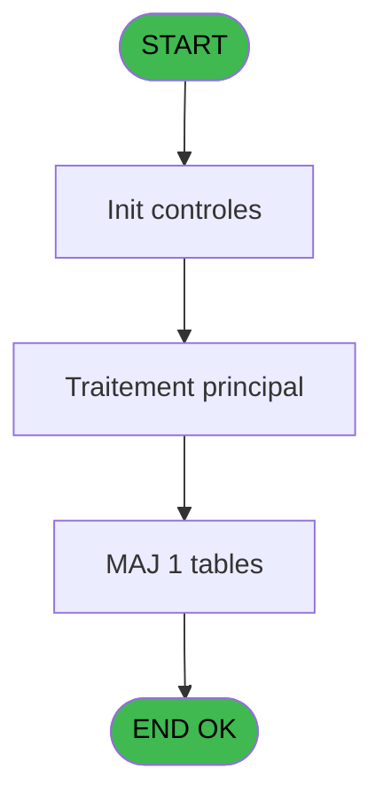

# PVE IDE 445 - Import - Products

> **Analyse**: Phases 1-4 2026-02-03 20:12 -> 20:12 (17s) | Assemblage 20:12
> **Pipeline**: V7.2 Enrichi
> **Structure**: 4 onglets (Resume | Ecrans | Donnees | Connexions)

<!-- TAB:Resume -->

## 1. FICHE D'IDENTITE

| Attribut | Valeur |
|----------|--------|
| Projet | PVE |
| IDE Position | 445 |
| Nom Programme | Import - Products |
| Fichier source | `Prg_445.xml` |
| Dossier IDE | A |
| Taches | 2 (0 ecrans visibles) |
| Tables modifiees | 1 |
| Programmes appeles | 1 |
| :warning: Statut | **ORPHELIN_POTENTIEL** |

## 2. DESCRIPTION FONCTIONNELLE

**Import - Products** assure la gestion complete de ce processus.

Le flux de traitement s'organise en **1 blocs fonctionnels** :

- **Traitement** (2 taches) : traitements metier divers

**Donnees modifiees** : 1 tables en ecriture (pv_sellers).

## 3. BLOCS FONCTIONNELS

### 3.1 Traitement (2 taches)

Traitements internes.

---

#### 445 - Import - Products * [[ECRAN]](#ecran-t1)

**Role** : Traitement : Import - Products *.
**Ecran** : 795 x 446 DLU (MDI) | [Voir mockup](#ecran-t1)
**Delegue a** : [Trace Modification package (IDE 229)](PVE-IDE-229.md)

---

#### 445.1 - Mise à jour Product

**Role** : Traitement : Mise à jour Product.
**Delegue a** : [Trace Modification package (IDE 229)](PVE-IDE-229.md)

## 5. REGLES METIER

*(Aucune regle metier identifiee)*

## 6. CONTEXTE

- **Appele par**: (aucun)
- **Appelle**: 1 programmes | **Tables**: 1 (W:1 R:0 L:0) | **Taches**: 2 | **Expressions**: 21

<!-- TAB:Ecrans -->

## 8. ECRANS

*(Programme sans ecran visible)*

## 9. NAVIGATION

### 9.3 Structure hierarchique (2 taches)

| Position | Tache | Type | Dimensions | Bloc |
|----------|-------|------|------------|------|
| **445.1** | [**Import - Products *** (445)](#t1) [mockup](#ecran-t1) | MDI | 795x446 | Traitement |
| 445.1.1 | [Mise à jour Product (445.1)](#t2) | MDI | - | |

### 9.4 Algorigramme

> **Legende**: Vert = START/END OK | Rouge = END KO | Bleu = Decisions
> *Algorigramme auto-genere. Utiliser `/algorigramme` pour une synthese metier detaillee.*

<!-- TAB:Donnees -->

## 10. TABLES

### Tables utilisees (1)

| ID | Nom | Description | Type | R | W | L | Usages |
|----|-----|-------------|------|---|---|---|--------|
| 403 | pv_sellers |  | DB |   | **W** |   | 1 |

### Colonnes par table (0 / 1 tables avec colonnes identifiees)

Table 403 - pv_sellers (**W**) - 1 usages

*Table utilisee uniquement en Link ou aucune colonne Real identifiee dans le DataView.*

## 11. VARIABLES

### 11.1 Parametres entrants (2)

Variables recues en parametre.

| Lettre | Nom | Type | Usage dans |
|--------|-----|------|-----------|
| A | P. Nom Fichier CSV | Alpha | 1x parametre entrant |
| B | P.LastCategorieID | Numeric | - |

### 11.2 Variables de session (1)

Variables persistantes pendant toute la session.

| Lettre | Nom | Type | Usage dans |
|--------|-----|------|-----------|
| C | V Ascii | Alpha | 18x session |

### 11.3 Autres (18)

Variables diverses.

| Lettre | Nom | Type | Usage dans |
|--------|-----|------|-----------|
| D | ICat | Numeric | - |
| E | ISubCat | Numeric | - |
| F | IProdId | Numeric | - |
| G | ILabel | Alpha | - |
| H | IPrixdeVente | Numeric | - |
| I | IUnitédeVente | Alpha | - |
| J | IBlockFree | Alpha | - |
| K | IBlockDiscount | Alpha | - |
| L | ICodeArticle | Alpha | - |
| M | IPrixAchat | Numeric | - |
| N | INongereenstock | Alpha | - |
| O | ITva | Numeric | - |
| P | IVolumeVendu | Numeric | - |
| Q | IDecimales | Numeric | - |
| R | IActif | Alpha | - |
| S | INb Days | Numeric | - |
| T | IFreeExtra | Alpha | - |
| U | ISales Place Independant | Alpha | - |

Toutes les 21 variables (liste complete)

| Cat | Lettre | Nom Variable | Type |
|-----|--------|--------------|------|
| P0 | **A** | P. Nom Fichier CSV | Alpha |
| P0 | **B** | P.LastCategorieID | Numeric |
| V. | **C** | V Ascii | Alpha |
| Autre | **D** | ICat | Numeric |
| Autre | **E** | ISubCat | Numeric |
| Autre | **F** | IProdId | Numeric |
| Autre | **G** | ILabel | Alpha |
| Autre | **H** | IPrixdeVente | Numeric |
| Autre | **I** | IUnitédeVente | Alpha |
| Autre | **J** | IBlockFree | Alpha |
| Autre | **K** | IBlockDiscount | Alpha |
| Autre | **L** | ICodeArticle | Alpha |
| Autre | **M** | IPrixAchat | Numeric |
| Autre | **N** | INongereenstock | Alpha |
| Autre | **O** | ITva | Numeric |
| Autre | **P** | IVolumeVendu | Numeric |
| Autre | **Q** | IDecimales | Numeric |
| Autre | **R** | IActif | Alpha |
| Autre | **S** | INb Days | Numeric |
| Autre | **T** | IFreeExtra | Alpha |
| Autre | **U** | ISales Place Independant | Alpha |

## 12. EXPRESSIONS

**21 / 21 expressions decodees (100%)**

### 12.1 Repartition par type

| Type | Expressions | Regles |
|------|-------------|--------|
| OTHER | 11 | 0 |
| CONDITION | 1 | 0 |
| STRING | 9 | 0 |

### 12.2 Expressions cles par type

#### OTHER (11 expressions)

| Type | IDE | Expression | Regle |
|------|-----|------------|-------|
| OTHER | 17 | `StrToken(V Ascii [C],15,';')` | - |
| OTHER | 13 | `StrToken(V Ascii [C],11,';')` | - |
| OTHER | 19 | `StrToken(V Ascii [C],23,';')` | - |
| OTHER | 21 | `EOF (0,1)` | - |
| OTHER | 20 | `StrToken(V Ascii [C],17,';')` | - |
| ... | | *+6 autres* | |

#### CONDITION (1 expressions)

| Type | IDE | Expression | Regle |
|------|-----|------------|-------|
| CONDITION | 2 | `Counter (0)>1` | - |

#### STRING (9 expressions)

| Type | IDE | Expression | Regle |
|------|-----|------------|-------|
| STRING | 15 | `Val(StrToken(V Ascii [C],13,';'),'')` | - |
| STRING | 14 | `Val(StrToken(V Ascii [C],12,';'),'')` | - |
| STRING | 18 | `Val(StrToken(V Ascii [C],16,';'),'')` | - |
| STRING | 16 | `Val(StrToken(V Ascii [C],14,';'),'#')` | - |
| STRING | 12 | `Val(StrToken(V Ascii [C],10,';'),'')` | - |
| ... | | *+4 autres* | |

### 12.3 Toutes les expressions (21)

Voir les 21 expressions

#### OTHER (11)

| IDE | Expression Decodee |
|-----|-------------------|
| 1 | `P. Nom Fichier CSV [A]` |
| 6 | `StrToken(V Ascii [C],4,';')` |
| 8 | `StrToken(V Ascii [C],6,';')` |
| 9 | `StrToken(V Ascii [C],7,';')` |
| 10 | `StrToken(V Ascii [C],8,';')` |
| 11 | `StrToken(V Ascii [C],9,';')` |
| 13 | `StrToken(V Ascii [C],11,';')` |
| 17 | `StrToken(V Ascii [C],15,';')` |
| 19 | `StrToken(V Ascii [C],23,';')` |
| 20 | `StrToken(V Ascii [C],17,';')` |
| 21 | `EOF (0,1)` |

#### CONDITION (1)

| IDE | Expression Decodee |
|-----|-------------------|
| 2 | `Counter (0)>1` |

#### STRING (9)

| IDE | Expression Decodee |
|-----|-------------------|
| 3 | `Val(StrToken(V Ascii [C],1,';'),'2P0')` |
| 4 | `Val(StrToken(V Ascii [C],2,';'),'2P0')` |
| 5 | `Val(StrToken(V Ascii [C],3,';'),'2P0')` |
| 7 | `Val(StrToken(V Ascii [C],5,';'),'')` |
| 12 | `Val(StrToken(V Ascii [C],10,';'),'')` |
| 14 | `Val(StrToken(V Ascii [C],12,';'),'')` |
| 15 | `Val(StrToken(V Ascii [C],13,';'),'')` |
| 16 | `Val(StrToken(V Ascii [C],14,';'),'#')` |
| 18 | `Val(StrToken(V Ascii [C],16,';'),'')` |

<!-- TAB:Connexions -->

## 13. GRAPHE D'APPELS

### 13.1 Chaine depuis Main (Callers)

**Chemin**: (pas de callers directs)

### 13.2 Callers

| IDE | Nom Programme | Nb Appels |
|-----|---------------|-----------|
| - | (aucun) | - |

### 13.3 Callees (programmes appeles)

### 13.4 Detail Callees avec contexte

| IDE | Nom Programme | Appels | Contexte |
|-----|---------------|--------|----------|
| [229](PVE-IDE-229.md) | Trace Modification package | 1 | Sous-programme |

## 14. RECOMMANDATIONS MIGRATION

### 14.1 Profil du programme

| Metrique | Valeur | Impact migration |
|----------|--------|-----------------|
| Lignes de logique | 101 | Programme compact |
| Expressions | 21 | Peu de logique |
| Tables WRITE | 1 | Impact faible |
| Sous-programmes | 1 | Peu de dependances |
| Ecrans visibles | 0 | Ecran unique ou traitement batch |
| Code desactive | 1% (1 / 101) | Code sain |
| Regles metier | 0 | Pas de regle identifiee |

### 14.2 Plan de migration par bloc

#### Traitement (2 taches: 1 ecran, 1 traitement)

- **Strategie** : Orchestrateur avec 1 ecrans (Razor/React) et 1 traitements backend (services).
- Les ecrans deviennent des composants UI, les traitements invisibles deviennent des services injectables.
- 1 sous-programme(s) a migrer ou a reutiliser depuis les services existants.
- Decomposer les taches en services unitaires testables.

### 14.3 Dependances critiques

| Dependance | Type | Appels | Impact |
|------------|------|--------|--------|
| pv_sellers | Table WRITE (Database) | 1x | Schema + repository |
| [Trace Modification package (IDE 229)](PVE-IDE-229.md) | Sous-programme | 1x | Normale - Sous-programme |

---
*Spec DETAILED generee par Pipeline V7.2 - 2026-02-03 20:12*
