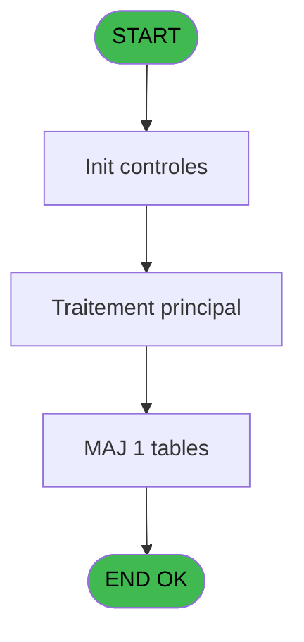
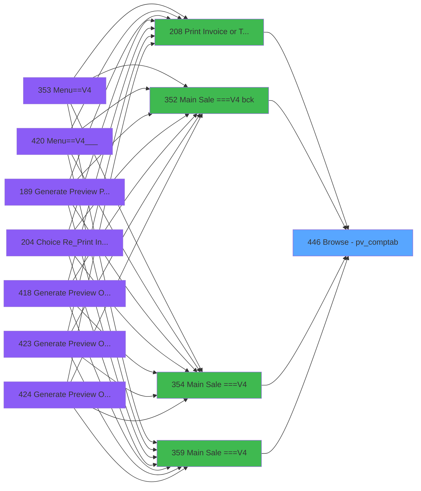

# PVE IDE 446 - Browse - pv_comptab

> **Analyse**: Phases 1-4 2026-02-03 20:12 -> 20:12 (15s) | Assemblage 20:12
> **Pipeline**: V7.2 Enrichi
> **Structure**: 4 onglets (Resume | Ecrans | Donnees | Connexions)

<!-- TAB:Resume -->

## 1. FICHE D'IDENTITE

| Attribut | Valeur |
|----------|--------|
| Projet | PVE |
| IDE Position | 446 |
| Nom Programme | Browse - pv_comptab |
| Fichier source | `Prg_446.xml` |
| Dossier IDE | A |
| Taches | 1 (1 ecrans visibles) |
| Tables modifiees | 1 |
| Programmes appeles | 0 |

## 2. DESCRIPTION FONCTIONNELLE

**Browse - pv_comptab** assure la gestion complete de ce processus, accessible depuis [Main Sale (IDE 440)](PVE-IDE-440.md), [Main Sale ===V4 (IDE 0)](PVE-IDE-0.md), [Main Sale ===V4 bck (IDE 352)](PVE-IDE-352.md), [Main Sale ===V4 (IDE 354)](PVE-IDE-354.md), [Main Sale ===V4 (IDE 359)](PVE-IDE-359.md), [Menu Main (TPE) (IDE 403)](PVE-IDE-403.md), [Main Sale ===V4 (IDE 409)](PVE-IDE-409.md), [Main Sale ===V4 (IDE 415)](PVE-IDE-415.md), [Main Sale ===V4 Booking ACTUEL (IDE 417)](PVE-IDE-417.md), [Print Invoice or Ticket (IDE 208)](PVE-IDE-208.md).

Le flux de traitement s'organise en **1 blocs fonctionnels** :

- **Calcul** (1 tache) : calculs de montants, stocks ou compteurs

**Donnees modifiees** : 1 tables en ecriture (pv_contracts).

## 3. BLOCS FONCTIONNELS

### 3.1 Calcul (1 tache)

Calculs metier : montants, stocks, compteurs.

---

#### 446 - Browse - Ref_Tables.pv_comptab [[ECRAN]](#ecran-t1)

**Role** : Traitement : Browse - Ref_Tables.pv_comptab.
**Ecran** : 2221 x 195 DLU | [Voir mockup](#ecran-t1)

## 5. REGLES METIER

*(Aucune regle metier identifiee)*

## 6. CONTEXTE

- **Appele par**: [Main Sale (IDE 440)](PVE-IDE-440.md), [Main Sale ===V4 (IDE 0)](PVE-IDE-0.md), [Main Sale ===V4 bck (IDE 352)](PVE-IDE-352.md), [Main Sale ===V4 (IDE 354)](PVE-IDE-354.md), [Main Sale ===V4 (IDE 359)](PVE-IDE-359.md), [Menu Main (TPE) (IDE 403)](PVE-IDE-403.md), [Main Sale ===V4 (IDE 409)](PVE-IDE-409.md), [Main Sale ===V4 (IDE 415)](PVE-IDE-415.md), [Main Sale ===V4 Booking ACTUEL (IDE 417)](PVE-IDE-417.md), [Print Invoice or Ticket (IDE 208)](PVE-IDE-208.md)
- **Appelle**: 0 programmes | **Tables**: 1 (W:1 R:0 L:0) | **Taches**: 1 | **Expressions**: 1

<!-- TAB:Ecrans -->

## 8. ECRANS

### 8.1 Forms visibles (1 / 1)

| # | Position | Tache | Nom | Type | Largeur | Hauteur | Bloc |
|---|----------|-------|-----|------|---------|---------|------|
| 1 | 446 | 446 | Browse - Ref_Tables.pv_comptab | Type0 | 2221 | 195 | Calcul |

### 8.2 Mockups Ecrans

---

#### 446 - Browse - Ref_Tables.pv_comptab
**Tache** : [446](#t1) | **Type** : Type0 | **Dimensions** : 2221 x 195 DLU
**Bloc** : Calcul | **Titre IDE** : Browse - Ref_Tables.pv_comptab

<!-- FORM-DATA:
{
    "width":  2221,
    "vFactor":  8,
    "type":  "Type0",
    "hFactor":  4,
    "controls":  [
                     {
                         "x":  8,
                         "type":  "table",
                         "var":  "",
                         "name":  "",
                         "titleH":  12,
                         "color":  "",
                         "w":  2199,
                         "y":  8,
                         "fmt":  "",
                         "parent":  null,
                         "text":  "",
                         "rowH":  13,
                         "h":  182,
                         "cols":  [
                                      {
                                          "title":  "pos_customer_payer_id",
                                          "layer":  1,
                                          "w":  93
                                      },
                                      {
                                          "title":  "pos_customer_id",
                                          "layer":  2,
                                          "w":  67
                                      },
                                      {
                                          "title":  "pos_package_id_out",
                                          "layer":  3,
                                          "w":  83
                                      },
                                      {
                                          "title":  "pos_package_id_in",
                                          "layer":  4,
                                          "w":  78
                                      },
                                      {
                                          "title":  "cte_filiation",
                                          "layer":  5,
                                          "w":  46
                                      },
                                      {
                                          "title":  "cte_imputation",
                                          "layer":  6,
                                          "w":  58
                                      },
                                      {
                                          "title":  "cte_sous_mputation",
                                          "layer":  7,
                                          "w":  79
                                      },
                                      {
                                          "title":  "cte_libelle",
                                          "layer":  8,
                                          "w":  122
                                      },
                                      {
                                          "title":  "cte_libelle_supplem_",
                                          "layer":  9,
                                          "w":  122
                                      },
                                      {
                                          "title":  "cte_credit_debit",
                                          "layer":  10,
                                          "w":  64
                                      },
                                      {
                                          "title":  "cte_flag_annulation",
                                          "layer":  11,
                                          "w":  78
                                      },
                                      {
                                          "title":  "cte_code_type",
                                          "layer":  12,
                                          "w":  60
                                      },
                                      {
                                          "title":  "cte_numero_chrono",
                                          "layer":  13,
                                          "w":  79
                                      },
                                      {
                                          "title":  "cte_avec_change",
                                          "layer":  14,
                                          "w":  73
                                      },
                                      {
                                          "title":  "cte_mode_de_paiement",
                                          "layer":  15,
                                          "w":  94
                                      },
                                      {
                                          "title":  "cte_montant",
                                          "layer":  16,
                                          "w":  101
                                      },
                                      {
                                          "title":  "cte_date_comptable",
                                          "layer":  17,
                                          "w":  81
                                      },
                                      {
                                          "title":  "cte_date_d_operation",
                                          "layer":  18,
                                          "w":  86
                                      },
                                      {
                                          "title":  "cte_heure_operation",
                                          "layer":  19,
                                          "w":  82
                                      },
                                      {
                                          "title":  "cte_nbre_d_articles",
                                          "layer":  20,
                                          "w":  78
                                      },
                                      {
                                          "title":  "cte_flag_hotesses",
                                          "layer":  21,
                                          "w":  72
                                      },
                                      {
                                          "title":  "cte_type_transaction",
                                          "layer":  22,
                                          "w":  82
                                      },
                                      {
                                          "title":  "cte_operateur",
                                          "layer":  23,
                                          "w":  56
                                      },
                                      {
                                          "title":  "pv_service",
                                          "layer":  24,
                                          "w":  45
                                      },
                                      {
                                          "title":  "RowId_377",
                                          "layer":  25,
                                          "w":  58
                                      },
                                      {
                                          "title":  "cte_free_extra",
                                          "layer":  26,
                                          "w":  58
                                      },
                                      {
                                          "title":  "cte_montant_free_extra",
                                          "layer":  27,
                                          "w":  101
                                      },
                                      {
                                          "title":  "pv_vente_en_mobilite",
                                          "layer":  28,
                                          "w":  86
                                      }
                                  ],
                         "rows":  28
                     },
                     {
                         "x":  12,
                         "type":  "edit",
                         "var":  "",
                         "y":  23,
                         "w":  51,
                         "fmt":  "",
                         "name":  "pos_customer_payer_id",
                         "h":  10,
                         "color":  "",
                         "text":  "",
                         "parent":  1
                     },
                     {
                         "x":  105,
                         "type":  "edit",
                         "var":  "",
                         "y":  23,
                         "w":  51,
                         "fmt":  "",
                         "name":  "pos_customer_id",
                         "h":  10,
                         "color":  "",
                         "text":  "",
                         "parent":  1
                     },
                     {
                         "x":  172,
                         "type":  "edit",
                         "var":  "",
                         "y":  23,
                         "w":  51,
                         "fmt":  "",
                         "name":  "pos_package_id_out",
                         "h":  10,
                         "color":  "",
                         "text":  "",
                         "parent":  1
                     },
                     {
                         "x":  255,
                         "type":  "edit",
                         "var":  "",
                         "y":  23,
                         "w":  51,
                         "fmt":  "",
                         "name":  "pos_package_id_in",
                         "h":  10,
                         "color":  "",
                         "text":  "",
                         "parent":  1
                     },
                     {
                         "x":  333,
                         "type":  "edit",
                         "var":  "",
                         "y":  23,
                         "w":  18,
                         "fmt":  "",
                         "name":  "cte_filiation",
                         "h":  10,
                         "color":  "",
                         "text":  "",
                         "parent":  1
                     },
                     {
                         "x":  379,
                         "type":  "edit",
                         "var":  "",
                         "y":  23,
                         "w":  51,
                         "fmt":  "",
                         "name":  "cte_imputation",
                         "h":  10,
                         "color":  "",
                         "text":  "",
                         "parent":  1
                     },
                     {
                         "x":  437,
                         "type":  "edit",
                         "var":  "",
                         "y":  23,
                         "w":  18,
                         "fmt":  "",
                         "name":  "cte_sous_mputation",
                         "h":  10,
                         "color":  "",
                         "text":  "",
                         "parent":  1
                     },
                     {
                         "x":  516,
                         "type":  "edit",
                         "var":  "",
                         "y":  23,
                         "w":  115,
                         "fmt":  "",
                         "name":  "cte_libelle",
                         "h":  10,
                         "color":  "",
                         "text":  "",
                         "parent":  1
                     },
                     {
                         "x":  638,
                         "type":  "edit",
                         "var":  "",
                         "y":  23,
                         "w":  115,
                         "fmt":  "",
                         "name":  "cte_libelle_supplem_",
                         "h":  10,
                         "color":  "",
                         "text":  "",
                         "parent":  1
                     },
                     {
                         "x":  760,
                         "type":  "edit",
                         "var":  "",
                         "y":  23,
                         "w":  9,
                         "fmt":  "",
                         "name":  "cte_credit_debit",
                         "h":  10,
                         "color":  "",
                         "text":  "",
                         "parent":  1
                     },
                     {
                         "x":  824,
                         "type":  "edit",
                         "var":  "",
                         "y":  23,
                         "w":  9,
                         "fmt":  "",
                         "name":  "cte_flag_annulation",
                         "h":  10,
                         "color":  "",
                         "text":  "",
                         "parent":  1
                     },
                     {
                         "x":  902,
                         "type":  "edit",
                         "var":  "",
                         "y":  23,
                         "w":  9,
                         "fmt":  "",
                         "name":  "cte_code_type",
                         "h":  10,
                         "color":  "",
                         "text":  "",
                         "parent":  1
                     },
                     {
                         "x":  962,
                         "type":  "edit",
                         "var":  "",
                         "y":  23,
                         "w":  42,
                         "fmt":  "",
                         "name":  "cte_numero_chrono",
                         "h":  10,
                         "color":  "",
                         "text":  "",
                         "parent":  1
                     },
                     {
                         "x":  1041,
                         "type":  "edit",
                         "var":  "",
                         "y":  23,
                         "w":  9,
                         "fmt":  "",
                         "name":  "cte_avec_change",
                         "h":  10,
                         "color":  "",
                         "text":  "",
                         "parent":  1
                     },
                     {
                         "x":  1114,
                         "type":  "edit",
                         "var":  "",
                         "y":  23,
                         "w":  26,
                         "fmt":  "",
                         "name":  "cte_mode_de_paiement",
                         "h":  10,
                         "color":  "",
                         "text":  "",
                         "parent":  1
                     },
                     {
                         "x":  1208,
                         "type":  "edit",
                         "var":  "",
                         "y":  23,
                         "w":  94,
                         "fmt":  "",
                         "name":  "cte_montant",
                         "h":  10,
                         "color":  "",
                         "text":  "",
                         "parent":  1
                     },
                     {
                         "x":  1309,
                         "type":  "edit",
                         "var":  "",
                         "y":  23,
                         "w":  61,
                         "fmt":  "",
                         "name":  "cte_date_comptable",
                         "h":  10,
                         "color":  "",
                         "text":  "",
                         "parent":  1
                     },
                     {
                         "x":  1390,
                         "type":  "edit",
                         "var":  "",
                         "y":  23,
                         "w":  61,
                         "fmt":  "",
                         "name":  "cte_date_d_operation",
                         "h":  10,
                         "color":  "",
                         "text":  "",
                         "parent":  1
                     },
                     {
                         "x":  1476,
                         "type":  "edit",
                         "var":  "",
                         "y":  23,
                         "w":  46,
                         "fmt":  "",
                         "name":  "cte_heure_operation",
                         "h":  10,
                         "color":  "",
                         "text":  "",
                         "parent":  1
                     },
                     {
                         "x":  1558,
                         "type":  "edit",
                         "var":  "",
                         "y":  23,
                         "w":  22,
                         "fmt":  "",
                         "name":  "cte_nbre_d_articles",
                         "h":  10,
                         "color":  "",
                         "text":  "",
                         "parent":  1
                     },
                     {
                         "x":  1636,
                         "type":  "edit",
                         "var":  "",
                         "y":  23,
                         "w":  9,
                         "fmt":  "",
                         "name":  "cte_flag_hotesses",
                         "h":  10,
                         "color":  "",
                         "text":  "",
                         "parent":  1
                     },
                     {
                         "x":  1708,
                         "type":  "edit",
                         "var":  "",
                         "y":  23,
                         "w":  9,
                         "fmt":  "",
                         "name":  "cte_type_transaction",
                         "h":  10,
                         "color":  "",
                         "text":  "",
                         "parent":  1
                     },
                     {
                         "x":  1790,
                         "type":  "edit",
                         "var":  "",
                         "y":  23,
                         "w":  48,
                         "fmt":  "",
                         "name":  "cte_operateur",
                         "h":  10,
                         "color":  "",
                         "text":  "",
                         "parent":  1
                     },
                     {
                         "x":  1846,
                         "type":  "edit",
                         "var":  "",
                         "y":  23,
                         "w":  26,
                         "fmt":  "",
                         "name":  "pv_service",
                         "h":  10,
                         "color":  "",
                         "text":  "",
                         "parent":  1
                     },
                     {
                         "x":  1891,
                         "type":  "edit",
                         "var":  "",
                         "y":  23,
                         "w":  51,
                         "fmt":  "",
                         "name":  "RowId_377",
                         "h":  10,
                         "color":  "",
                         "text":  "",
                         "parent":  1
                     },
                     {
                         "x":  1949,
                         "type":  "edit",
                         "var":  "",
                         "y":  23,
                         "w":  31,
                         "fmt":  "",
                         "name":  "cte_free_extra",
                         "h":  10,
                         "color":  "",
                         "text":  "",
                         "parent":  1
                     },
                     {
                         "x":  2007,
                         "type":  "edit",
                         "var":  "",
                         "y":  23,
                         "w":  94,
                         "fmt":  "",
                         "name":  "cte_montant_free_extra",
                         "h":  10,
                         "color":  "",
                         "text":  "",
                         "parent":  1
                     },
                     {
                         "x":  2108,
                         "type":  "edit",
                         "var":  "",
                         "y":  23,
                         "w":  31,
                         "fmt":  "",
                         "name":  "pv_vente_en_mobilite",
                         "h":  10,
                         "color":  "",
                         "text":  "",
                         "parent":  1
                     }
                 ],
    "taskId":  "446",
    "height":  195
}
-->

<strong>Champs : 28 champs</strong>

| Pos (x,y) | Nom | Variable | Type |
|-----------|-----|----------|------|
| 12,23 | pos_customer_payer_id | - | edit |
| 105,23 | pos_customer_id | - | edit |
| 172,23 | pos_package_id_out | - | edit |
| 255,23 | pos_package_id_in | - | edit |
| 333,23 | cte_filiation | - | edit |
| 379,23 | cte_imputation | - | edit |
| 437,23 | cte_sous_mputation | - | edit |
| 516,23 | cte_libelle | - | edit |
| 638,23 | cte_libelle_supplem_ | - | edit |
| 760,23 | cte_credit_debit | - | edit |
| 824,23 | cte_flag_annulation | - | edit |
| 902,23 | cte_code_type | - | edit |
| 962,23 | cte_numero_chrono | - | edit |
| 1041,23 | cte_avec_change | - | edit |
| 1114,23 | cte_mode_de_paiement | - | edit |
| 1208,23 | cte_montant | - | edit |
| 1309,23 | cte_date_comptable | - | edit |
| 1390,23 | cte_date_d_operation | - | edit |
| 1476,23 | cte_heure_operation | - | edit |
| 1558,23 | cte_nbre_d_articles | - | edit |
| 1636,23 | cte_flag_hotesses | - | edit |
| 1708,23 | cte_type_transaction | - | edit |
| 1790,23 | cte_operateur | - | edit |
| 1846,23 | pv_service | - | edit |
| 1891,23 | RowId_377 | - | edit |
| 1949,23 | cte_free_extra | - | edit |
| 2007,23 | cte_montant_free_extra | - | edit |
| 2108,23 | pv_vente_en_mobilite | - | edit |

## 9. NAVIGATION

Ecran unique: **Browse - Ref_Tables.pv_comptab**

### 9.3 Structure hierarchique (1 tache)

| Position | Tache | Type | Dimensions | Bloc |
|----------|-------|------|------------|------|
| **446.1** | [**Browse - Ref_Tables.pv_comptab** (446)](#t1) [mockup](#ecran-t1) | - | 2221x195 | Calcul |

### 9.4 Algorigramme

> **Legende**: Vert = START/END OK | Rouge = END KO | Bleu = Decisions
> *Algorigramme auto-genere. Utiliser `/algorigramme` pour une synthese metier detaillee.*

<!-- TAB:Donnees -->

## 10. TABLES

### Tables utilisees (1)

| ID | Nom | Description | Type | R | W | L | Usages |
|----|-----|-------------|------|---|---|---|--------|
| 377 | pv_contracts |  | DB |   | **W** |   | 1 |

### Colonnes par table (0 / 1 tables avec colonnes identifiees)

Table 377 - pv_contracts (**W**) - 1 usages

*Table utilisee uniquement en Link ou aucune colonne Real identifiee dans le DataView.*

## 11. VARIABLES

*(Programme sans variables locales mappees)*

## 12. EXPRESSIONS

**1 / 1 expressions decodees (100%)**

### 12.1 Repartition par type

| Type | Expressions | Regles |
|------|-------------|--------|
| CONDITION | 1 | 0 |

### 12.2 Expressions cles par type

#### CONDITION (1 expressions)

| Type | IDE | Expression | Regle |
|------|-----|------------|-------|
| CONDITION | 1 | `CndRange([CI]<>0,[CI])` | - |

<!-- TAB:Connexions -->

## 13. GRAPHE D'APPELS

### 13.1 Chaine depuis Main (Callers)

Main -> ... -> [Main Sale (IDE 440)](PVE-IDE-440.md) -> **Browse - pv_comptab (IDE 446)**

Main -> ... -> [Main Sale ===V4 (IDE 0)](PVE-IDE-0.md) -> **Browse - pv_comptab (IDE 446)**

Main -> ... -> [Main Sale ===V4 bck (IDE 352)](PVE-IDE-352.md) -> **Browse - pv_comptab (IDE 446)**

Main -> ... -> [Main Sale ===V4 (IDE 354)](PVE-IDE-354.md) -> **Browse - pv_comptab (IDE 446)**

Main -> ... -> [Main Sale ===V4 (IDE 359)](PVE-IDE-359.md) -> **Browse - pv_comptab (IDE 446)**

Main -> ... -> [Menu Main (TPE) (IDE 403)](PVE-IDE-403.md) -> **Browse - pv_comptab (IDE 446)**

Main -> ... -> [Main Sale ===V4 (IDE 409)](PVE-IDE-409.md) -> **Browse - pv_comptab (IDE 446)**

Main -> ... -> [Main Sale ===V4 (IDE 415)](PVE-IDE-415.md) -> **Browse - pv_comptab (IDE 446)**

Main -> ... -> [Main Sale ===V4 Booking ACTUEL (IDE 417)](PVE-IDE-417.md) -> **Browse - pv_comptab (IDE 446)**

Main -> ... -> [Print Invoice or Ticket (IDE 208)](PVE-IDE-208.md) -> **Browse - pv_comptab (IDE 446)**

### 13.2 Callers

| IDE | Nom Programme | Nb Appels |
|-----|---------------|-----------|
| [440](PVE-IDE-440.md) | Main Sale | 4 |
| [0](PVE-IDE-0.md) | Main Sale ===V4 | 2 |
| [352](PVE-IDE-352.md) | Main Sale ===V4 bck | 2 |
| [354](PVE-IDE-354.md) | Main Sale ===V4 | 2 |
| [359](PVE-IDE-359.md) | Main Sale ===V4 | 2 |
| [403](PVE-IDE-403.md) | Menu Main (TPE) | 2 |
| [409](PVE-IDE-409.md) | Main Sale ===V4 | 2 |
| [415](PVE-IDE-415.md) | Main Sale ===V4 | 2 |
| [417](PVE-IDE-417.md) | Main Sale ===V4 Booking ACTUEL | 2 |
| [208](PVE-IDE-208.md) | Print Invoice or Ticket | 1 |

### 13.3 Callees (programmes appeles)

### 13.4 Detail Callees avec contexte

| IDE | Nom Programme | Appels | Contexte |
|-----|---------------|--------|----------|
| - | (aucun) | - | - |

## 14. RECOMMANDATIONS MIGRATION

### 14.1 Profil du programme

| Metrique | Valeur | Impact migration |
|----------|--------|-----------------|
| Lignes de logique | 31 | Programme compact |
| Expressions | 1 | Peu de logique |
| Tables WRITE | 1 | Impact faible |
| Sous-programmes | 0 | Peu de dependances |
| Ecrans visibles | 1 | Ecran unique ou traitement batch |
| Code desactive | 0% (0 / 31) | Code sain |
| Regles metier | 0 | Pas de regle identifiee |

### 14.2 Plan de migration par bloc

#### Calcul (1 tache: 1 ecran, 0 traitement)

- **Strategie** : Services de calcul purs (Domain Services).
- Migrer la logique de calcul (stock, compteurs, montants)

### 14.3 Dependances critiques

| Dependance | Type | Appels | Impact |
|------------|------|--------|--------|
| pv_contracts | Table WRITE (Database) | 1x | Schema + repository |

---
*Spec DETAILED generee par Pipeline V7.2 - 2026-02-03 20:12*
