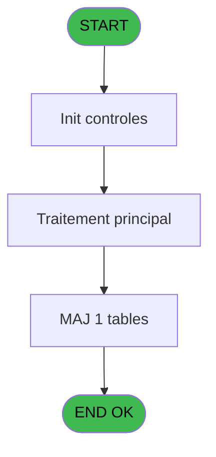
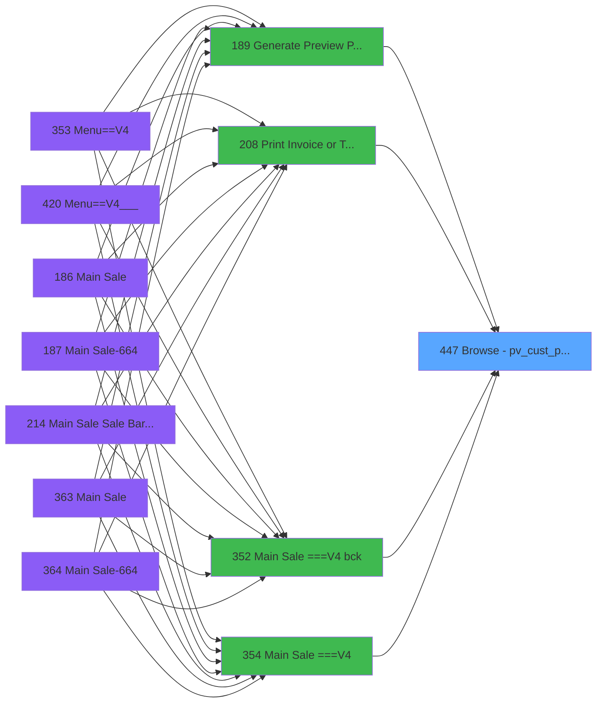

# PVE IDE 447 - Browse - pv_cust_package

> **Analyse**: Phases 1-4 2026-02-03 20:12 -> 20:13 (15s) | Assemblage 20:13
> **Pipeline**: V7.2 Enrichi
> **Structure**: 4 onglets (Resume | Ecrans | Donnees | Connexions)

<!-- TAB:Resume -->

## 1. FICHE D'IDENTITE

| Attribut | Valeur |
|----------|--------|
| Projet | PVE |
| IDE Position | 447 |
| Nom Programme | Browse - pv_cust_package |
| Fichier source | `Prg_447.xml` |
| Dossier IDE | A |
| Taches | 1 (1 ecrans visibles) |
| Tables modifiees | 1 |
| Programmes appeles | 0 |

## 2. DESCRIPTION FONCTIONNELLE

**Browse - pv_cust_package** assure la gestion complete de ce processus, accessible depuis [Generate Preview Payments (IDE 189)](PVE-IDE-189.md), [Main Sale ===V4 (IDE 0)](PVE-IDE-0.md), [Main Sale ===V4 bck (IDE 352)](PVE-IDE-352.md), [Main Sale ===V4 (IDE 354)](PVE-IDE-354.md), [Main Sale ===V4 (IDE 359)](PVE-IDE-359.md), [Main Sale ===V4 (IDE 409)](PVE-IDE-409.md), [Main Sale ===V4 (IDE 415)](PVE-IDE-415.md), [Main Sale ===V4 Booking ACTUEL (IDE 417)](PVE-IDE-417.md), [Main Sale (IDE 440)](PVE-IDE-440.md), [Print Invoice or Ticket (IDE 208)](PVE-IDE-208.md), [Generate Preview Payments 1212 (IDE 434)](PVE-IDE-434.md), [Generate Preview Payments 1112 (IDE 435)](PVE-IDE-435.md), [Generate Preview Payments 1012 (IDE 436)](PVE-IDE-436.md), [Generate Preview Payment 1212E (IDE 437)](PVE-IDE-437.md).

Le flux de traitement s'organise en **1 blocs fonctionnels** :

- **Traitement** (1 tache) : traitements metier divers

**Donnees modifiees** : 1 tables en ecriture (pv_cust_rentals).

## 3. BLOCS FONCTIONNELS

### 3.1 Traitement (1 tache)

Traitements internes.

---

#### 447 - Browse - Ref_Tables.pv_cust_pa [[ECRAN]](#ecran-t1)

**Role** : Traitement : Browse - Ref_Tables.pv_cust_pa.
**Ecran** : 3826 x 195 DLU | [Voir mockup](#ecran-t1)

## 5. REGLES METIER

*(Aucune regle metier identifiee)*

## 6. CONTEXTE

- **Appele par**: [Generate Preview Payments (IDE 189)](PVE-IDE-189.md), [Main Sale ===V4 (IDE 0)](PVE-IDE-0.md), [Main Sale ===V4 bck (IDE 352)](PVE-IDE-352.md), [Main Sale ===V4 (IDE 354)](PVE-IDE-354.md), [Main Sale ===V4 (IDE 359)](PVE-IDE-359.md), [Main Sale ===V4 (IDE 409)](PVE-IDE-409.md), [Main Sale ===V4 (IDE 415)](PVE-IDE-415.md), [Main Sale ===V4 Booking ACTUEL (IDE 417)](PVE-IDE-417.md), [Main Sale (IDE 440)](PVE-IDE-440.md), [Print Invoice or Ticket (IDE 208)](PVE-IDE-208.md), [Generate Preview Payments 1212 (IDE 434)](PVE-IDE-434.md), [Generate Preview Payments 1112 (IDE 435)](PVE-IDE-435.md), [Generate Preview Payments 1012 (IDE 436)](PVE-IDE-436.md), [Generate Preview Payment 1212E (IDE 437)](PVE-IDE-437.md)
- **Appelle**: 0 programmes | **Tables**: 1 (W:1 R:0 L:0) | **Taches**: 1 | **Expressions**: 1

<!-- TAB:Ecrans -->

## 8. ECRANS

### 8.1 Forms visibles (1 / 1)

| # | Position | Tache | Nom | Type | Largeur | Hauteur | Bloc |
|---|----------|-------|-----|------|---------|---------|------|
| 1 | 447 | 447 | Browse - Ref_Tables.pv_cust_pa | Type0 | 3826 | 195 | Traitement |

### 8.2 Mockups Ecrans

---

#### 447 - Browse - Ref_Tables.pv_cust_pa
**Tache** : [447](#t1) | **Type** : Type0 | **Dimensions** : 3826 x 195 DLU
**Bloc** : Traitement | **Titre IDE** : Browse - Ref_Tables.pv_cust_pa

<!-- FORM-DATA:
{
    "width":  3826,
    "vFactor":  8,
    "type":  "Type0",
    "hFactor":  4,
    "controls":  [
                     {
                         "x":  8,
                         "type":  "table",
                         "var":  "",
                         "name":  "",
                         "titleH":  12,
                         "color":  "",
                         "w":  3804,
                         "y":  8,
                         "fmt":  "",
                         "parent":  null,
                         "text":  "",
                         "rowH":  13,
                         "h":  182,
                         "cols":  [
                                      {
                                          "title":  "pos_id",
                                          "layer":  1,
                                          "w":  58
                                      },
                                      {
                                          "title":  "package_id_out",
                                          "layer":  2,
                                          "w":  65
                                      },
                                      {
                                          "title":  "package_id_in",
                                          "layer":  3,
                                          "w":  59
                                      },
                                      {
                                          "title":  "date__start_",
                                          "layer":  4,
                                          "w":  68
                                      },
                                      {
                                          "title":  "date__end_",
                                          "layer":  5,
                                          "w":  68
                                      },
                                      {
                                          "title":  "cat",
                                          "layer":  6,
                                          "w":  20
                                      },
                                      {
                                          "title":  "sub_cat",
                                          "layer":  7,
                                          "w":  34
                                      },
                                      {
                                          "title":  "sub_sub_cat",
                                          "layer":  8,
                                          "w":  52
                                      },
                                      {
                                          "title":  "description",
                                          "layer":  9,
                                          "w":  290
                                      },
                                      {
                                          "title":  "action_type",
                                          "layer":  10,
                                          "w":  66
                                      },
                                      {
                                          "title":  "#_days",
                                          "layer":  11,
                                          "w":  34
                                      },
                                      {
                                          "title":  "price",
                                          "layer":  12,
                                          "w":  97
                                      },
                                      {
                                          "title":  "discount",
                                          "layer":  13,
                                          "w":  39
                                      },
                                      {
                                          "title":  "discount_reason",
                                          "layer":  14,
                                          "w":  66
                                      },
                                      {
                                          "title":  "payer_xcust_id",
                                          "layer":  15,
                                          "w":  60
                                      },
                                      {
                                          "title":  "payment_type",
                                          "layer":  16,
                                          "w":  94
                                      },
                                      {
                                          "title":  "pms_transaction__",
                                          "layer":  17,
                                          "w":  74
                                      },
                                      {
                                          "title":  "validated__",
                                          "layer":  18,
                                          "w":  47
                                      },
                                      {
                                          "title":  "comment",
                                          "layer":  19,
                                          "w":  570
                                      },
                                      {
                                          "title":  "bank_accounting_date",
                                          "layer":  20,
                                          "w":  91
                                      },
                                      {
                                          "title":  "date_create",
                                          "layer":  21,
                                          "w":  68
                                      },
                                      {
                                          "title":  "time_create",
                                          "layer":  22,
                                          "w":  47
                                      },
                                      {
                                          "title":  "user_create",
                                          "layer":  23,
                                          "w":  66
                                      },
                                      {
                                          "title":  "date_update",
                                          "layer":  24,
                                          "w":  68
                                      },
                                      {
                                          "title":  "time_update",
                                          "layer":  25,
                                          "w":  50
                                      },
                                      {
                                          "title":  "user_update",
                                          "layer":  26,
                                          "w":  66
                                      },
                                      {
                                          "title":  "pv_service",
                                          "layer":  27,
                                          "w":  45
                                      },
                                      {
                                          "title":  "cpk_quantity",
                                          "layer":  28,
                                          "w":  77
                                      },
                                      {
                                          "title":  "cpk_unit_price",
                                          "layer":  29,
                                          "w":  97
                                      },
                                      {
                                          "title":  "cpk_vat",
                                          "layer":  30,
                                          "w":  34
                                      },
                                      {
                                          "title":  "cpk_article",
                                          "layer":  31,
                                          "w":  55
                                      },
                                      {
                                          "title":  "lieu_vente",
                                          "layer":  32,
                                          "w":  44
                                      },
                                      {
                                          "title":  "vendeur",
                                          "layer":  33,
                                          "w":  55
                                      },
                                      {
                                          "title":  "cpk_montant_prepaid",
                                          "layer":  34,
                                          "w":  92
                                      },
                                      {
                                          "title":  "saisie_manuelle_prepaid",
                                          "layer":  35,
                                          "w":  95
                                      },
                                      {
                                          "title":  "free_extra",
                                          "layer":  36,
                                          "w":  41
                                      },
                                      {
                                          "title":  "montant_total_pour_free_extra",
                                          "layer":  37,
                                          "w":  118
                                      },
                                      {
                                          "title":  "montant_free_extra",
                                          "layer":  38,
                                          "w":  97
                                      },
                                      {
                                          "title":  "payment_type_original",
                                          "layer":  39,
                                          "w":  94
                                      },
                                      {
                                          "title":  "discount_original",
                                          "layer":  40,
                                          "w":  66
                                      },
                                      {
                                          "title":  "package_id_out_free_extra",
                                          "layer":  41,
                                          "w":  107
                                      },
                                      {
                                          "title":  "ordre_edition",
                                          "layer":  42,
                                          "w":  52
                                      },
                                      {
                                          "title":  "vente_en_mobilite",
                                          "layer":  43,
                                          "w":  72
                                      },
                                      {
                                          "title":  "presence_cm_pass",
                                          "layer":  44,
                                          "w":  77
                                      },
                                      {
                                          "title":  "cashier",
                                          "layer":  45,
                                          "w":  55
                                      },
                                      {
                                          "title":  "prix_net",
                                          "layer":  46,
                                          "w":  97
                                      }
                                  ],
                         "rows":  46
                     },
                     {
                         "x":  12,
                         "type":  "edit",
                         "var":  "",
                         "y":  23,
                         "w":  51,
                         "fmt":  "",
                         "name":  "pos_id",
                         "h":  10,
                         "color":  "",
                         "text":  "",
                         "parent":  1
                     },
                     {
                         "x":  70,
                         "type":  "edit",
                         "var":  "",
                         "y":  23,
                         "w":  51,
                         "fmt":  "",
                         "name":  "package_id_out",
                         "h":  10,
                         "color":  "",
                         "text":  "",
                         "parent":  1
                     },
                     {
                         "x":  135,
                         "type":  "edit",
                         "var":  "",
                         "y":  23,
                         "w":  51,
                         "fmt":  "",
                         "name":  "package_id_in",
                         "h":  10,
                         "color":  "",
                         "text":  "",
                         "parent":  1
                     },
                     {
                         "x":  194,
                         "type":  "edit",
                         "var":  "",
                         "y":  23,
                         "w":  61,
                         "fmt":  "",
                         "name":  "date__start_",
                         "h":  10,
                         "color":  "",
                         "text":  "",
                         "parent":  1
                     },
                     {
                         "x":  262,
                         "type":  "edit",
                         "var":  "",
                         "y":  23,
                         "w":  61,
                         "fmt":  "",
                         "name":  "date__end_",
                         "h":  10,
                         "color":  "",
                         "text":  "",
                         "parent":  1
                     },
                     {
                         "x":  330,
                         "type":  "edit",
                         "var":  "",
                         "y":  23,
                         "w":  13,
                         "fmt":  "",
                         "name":  "cat",
                         "h":  10,
                         "color":  "",
                         "text":  "",
                         "parent":  1
                     },
                     {
                         "x":  350,
                         "type":  "edit",
                         "var":  "",
                         "y":  23,
                         "w":  13,
                         "fmt":  "",
                         "name":  "sub_cat",
                         "h":  10,
                         "color":  "",
                         "text":  "",
                         "parent":  1
                     },
                     {
                         "x":  384,
                         "type":  "edit",
                         "var":  "",
                         "y":  23,
                         "w":  13,
                         "fmt":  "",
                         "name":  "sub_sub_cat",
                         "h":  10,
                         "color":  "",
                         "text":  "",
                         "parent":  1
                     },
                     {
                         "x":  436,
                         "type":  "edit",
                         "var":  "",
                         "y":  23,
                         "w":  283,
                         "fmt":  "",
                         "name":  "description",
                         "h":  10,
                         "color":  "",
                         "text":  "",
                         "parent":  1
                     },
                     {
                         "x":  726,
                         "type":  "edit",
                         "var":  "",
                         "y":  23,
                         "w":  59,
                         "fmt":  "",
                         "name":  "action_type",
                         "h":  10,
                         "color":  "",
                         "text":  "",
                         "parent":  1
                     },
                     {
                         "x":  792,
                         "type":  "edit",
                         "var":  "",
                         "y":  23,
                         "w":  27,
                         "fmt":  "",
                         "name":  "#_days",
                         "h":  10,
                         "color":  "",
                         "text":  "",
                         "parent":  1
                     },
                     {
                         "x":  826,
                         "type":  "edit",
                         "var":  "",
                         "y":  23,
                         "w":  90,
                         "fmt":  "",
                         "name":  "price",
                         "h":  10,
                         "color":  "",
                         "text":  "",
                         "parent":  1
                     },
                     {
                         "x":  923,
                         "type":  "edit",
                         "var":  "",
                         "y":  23,
                         "w":  32,
                         "fmt":  "",
                         "name":  "discount",
                         "h":  10,
                         "color":  "",
                         "text":  "",
                         "parent":  1
                     },
                     {
                         "x":  962,
                         "type":  "edit",
                         "var":  "",
                         "y":  23,
                         "w":  13,
                         "fmt":  "",
                         "name":  "discount_reason",
                         "h":  10,
                         "color":  "",
                         "text":  "",
                         "parent":  1
                     },
                     {
                         "x":  1028,
                         "type":  "edit",
                         "var":  "",
                         "y":  23,
                         "w":  51,
                         "fmt":  "",
                         "name":  "payer_xcust_id",
                         "h":  10,
                         "color":  "",
                         "text":  "",
                         "parent":  1
                     },
                     {
                         "x":  1088,
                         "type":  "edit",
                         "var":  "",
                         "y":  23,
                         "w":  87,
                         "fmt":  "",
                         "name":  "payment_type",
                         "h":  10,
                         "color":  "",
                         "text":  "",
                         "parent":  1
                     },
                     {
                         "x":  1182,
                         "type":  "edit",
                         "var":  "",
                         "y":  23,
                         "w":  31,
                         "fmt":  "",
                         "name":  "pms_transaction__",
                         "h":  10,
                         "color":  "",
                         "text":  "",
                         "parent":  1
                     },
                     {
                         "x":  1256,
                         "type":  "edit",
                         "var":  "",
                         "y":  23,
                         "w":  31,
                         "fmt":  "",
                         "name":  "validated__",
                         "h":  10,
                         "color":  "",
                         "text":  "",
                         "parent":  1
                     },
                     {
                         "x":  1303,
                         "type":  "edit",
                         "var":  "",
                         "y":  23,
                         "w":  563,
                         "fmt":  "",
                         "name":  "comment",
                         "h":  10,
                         "color":  "",
                         "text":  "",
                         "parent":  1
                     },
                     {
                         "x":  1873,
                         "type":  "edit",
                         "var":  "",
                         "y":  23,
                         "w":  61,
                         "fmt":  "",
                         "name":  "bank_accounting_date",
                         "h":  10,
                         "color":  "",
                         "text":  "",
                         "parent":  1
                     },
                     {
                         "x":  1964,
                         "type":  "edit",
                         "var":  "",
                         "y":  23,
                         "w":  61,
                         "fmt":  "",
                         "name":  "date_create",
                         "h":  10,
                         "color":  "",
                         "text":  "",
                         "parent":  1
                     },
                     {
                         "x":  2032,
                         "type":  "edit",
                         "var":  "",
                         "y":  23,
                         "w":  33,
                         "fmt":  "",
                         "name":  "time_create",
                         "h":  10,
                         "color":  "",
                         "text":  "",
                         "parent":  1
                     },
                     {
                         "x":  2079,
                         "type":  "edit",
                         "var":  "",
                         "y":  23,
                         "w":  59,
                         "fmt":  "",
                         "name":  "user_create",
                         "h":  10,
                         "color":  "",
                         "text":  "",
                         "parent":  1
                     },
                     {
                         "x":  2145,
                         "type":  "edit",
                         "var":  "",
                         "y":  23,
                         "w":  61,
                         "fmt":  "",
                         "name":  "date_update",
                         "h":  10,
                         "color":  "",
                         "text":  "",
                         "parent":  1
                     },
                     {
                         "x":  2213,
                         "type":  "edit",
                         "var":  "",
                         "y":  23,
                         "w":  33,
                         "fmt":  "",
                         "name":  "time_update",
                         "h":  10,
                         "color":  "",
                         "text":  "",
                         "parent":  1
                     },
                     {
                         "x":  2263,
                         "type":  "edit",
                         "var":  "",
                         "y":  23,
                         "w":  59,
                         "fmt":  "",
                         "name":  "user_update",
                         "h":  10,
                         "color":  "",
                         "text":  "",
                         "parent":  1
                     },
                     {
                         "x":  2329,
                         "type":  "edit",
                         "var":  "",
                         "y":  23,
                         "w":  26,
                         "fmt":  "",
                         "name":  "pv_service",
                         "h":  10,
                         "color":  "",
                         "text":  "",
                         "parent":  1
                     },
                     {
                         "x":  2374,
                         "type":  "edit",
                         "var":  "",
                         "y":  23,
                         "w":  70,
                         "fmt":  "",
                         "name":  "cpk_quantity",
                         "h":  10,
                         "color":  "",
                         "text":  "",
                         "parent":  1
                     },
                     {
                         "x":  2451,
                         "type":  "edit",
                         "var":  "",
                         "y":  23,
                         "w":  90,
                         "fmt":  "",
                         "name":  "cpk_unit_price",
                         "h":  10,
                         "color":  "",
                         "text":  "",
                         "parent":  1
                     },
                     {
                         "x":  2548,
                         "type":  "edit",
                         "var":  "",
                         "y":  23,
                         "w":  22,
                         "fmt":  "",
                         "name":  "cpk_vat",
                         "h":  10,
                         "color":  "",
                         "text":  "",
                         "parent":  1
                     },
                     {
                         "x":  2582,
                         "type":  "edit",
                         "var":  "",
                         "y":  23,
                         "w":  48,
                         "fmt":  "",
                         "name":  "cpk_article",
                         "h":  10,
                         "color":  "",
                         "text":  "",
                         "parent":  1
                     },
                     {
                         "x":  2637,
                         "type":  "edit",
                         "var":  "",
                         "y":  23,
                         "w":  37,
                         "fmt":  "",
                         "name":  "lieu_vente",
                         "h":  10,
                         "color":  "",
                         "text":  "",
                         "parent":  1
                     },
                     {
                         "x":  2681,
                         "type":  "edit",
                         "var":  "",
                         "y":  23,
                         "w":  48,
                         "fmt":  "",
                         "name":  "vendeur",
                         "h":  10,
                         "color":  "",
                         "text":  "",
                         "parent":  1
                     },
                     {
                         "x":  2736,
                         "type":  "edit",
                         "var":  "",
                         "y":  23,
                         "w":  85,
                         "fmt":  "",
                         "name":  "cpk_montant_prepaid",
                         "h":  10,
                         "color":  "",
                         "text":  "",
                         "parent":  1
                     },
                     {
                         "x":  2828,
                         "type":  "edit",
                         "var":  "",
                         "y":  23,
                         "w":  31,
                         "fmt":  "",
                         "name":  "saisie_manuelle_prepaid",
                         "h":  10,
                         "color":  "",
                         "text":  "",
                         "parent":  1
                     },
                     {
                         "x":  2923,
                         "type":  "edit",
                         "var":  "",
                         "y":  23,
                         "w":  31,
                         "fmt":  "",
                         "name":  "free_extra",
                         "h":  10,
                         "color":  "",
                         "text":  "",
                         "parent":  1
                     },
                     {
                         "x":  2964,
                         "type":  "edit",
                         "var":  "",
                         "y":  23,
                         "w":  90,
                         "fmt":  "",
                         "name":  "montant_total_pour_free_extra",
                         "h":  10,
                         "color":  "",
                         "text":  "",
                         "parent":  1
                     },
                     {
                         "x":  3082,
                         "type":  "edit",
                         "var":  "",
                         "y":  23,
                         "w":  90,
                         "fmt":  "",
                         "name":  "montant_free_extra",
                         "h":  10,
                         "color":  "",
                         "text":  "",
                         "parent":  1
                     },
                     {
                         "x":  3179,
                         "type":  "edit",
                         "var":  "",
                         "y":  23,
                         "w":  87,
                         "fmt":  "",
                         "name":  "payment_type_original",
                         "h":  10,
                         "color":  "",
                         "text":  "",
                         "parent":  1
                     },
                     {
                         "x":  3273,
                         "type":  "edit",
                         "var":  "",
                         "y":  23,
                         "w":  32,
                         "fmt":  "",
                         "name":  "discount_original",
                         "h":  10,
                         "color":  "",
                         "text":  "",
                         "parent":  1
                     },
                     {
                         "x":  3339,
                         "type":  "edit",
                         "var":  "",
                         "y":  23,
                         "w":  51,
                         "fmt":  "",
                         "name":  "package_id_out_free_extra",
                         "h":  10,
                         "color":  "",
                         "text":  "",
                         "parent":  1
                     },
                     {
                         "x":  3446,
                         "type":  "edit",
                         "var":  "",
                         "y":  23,
                         "w":  22,
                         "fmt":  "",
                         "name":  "ordre_edition",
                         "h":  10,
                         "color":  "",
                         "text":  "",
                         "parent":  1
                     },
                     {
                         "x":  3498,
                         "type":  "edit",
                         "var":  "",
                         "y":  23,
                         "w":  31,
                         "fmt":  "",
                         "name":  "vente_en_mobilite",
                         "h":  10,
                         "color":  "",
                         "text":  "",
                         "parent":  1
                     },
                     {
                         "x":  3570,
                         "type":  "edit",
                         "var":  "",
                         "y":  23,
                         "w":  31,
                         "fmt":  "",
                         "name":  "presence_cm_pass",
                         "h":  10,
                         "color":  "",
                         "text":  "",
                         "parent":  1
                     },
                     {
                         "x":  3647,
                         "type":  "edit",
                         "var":  "",
                         "y":  23,
                         "w":  48,
                         "fmt":  "",
                         "name":  "cashier",
                         "h":  10,
                         "color":  "",
                         "text":  "",
                         "parent":  1
                     },
                     {
                         "x":  3702,
                         "type":  "edit",
                         "var":  "",
                         "y":  23,
                         "w":  90,
                         "fmt":  "",
                         "name":  "prix_net",
                         "h":  10,
                         "color":  "",
                         "text":  "",
                         "parent":  1
                     }
                 ],
    "taskId":  "447",
    "height":  195
}
-->

<strong>Champs : 46 champs</strong>

| Pos (x,y) | Nom | Variable | Type |
|-----------|-----|----------|------|
| 12,23 | pos_id | - | edit |
| 70,23 | package_id_out | - | edit |
| 135,23 | package_id_in | - | edit |
| 194,23 | date__start_ | - | edit |
| 262,23 | date__end_ | - | edit |
| 330,23 | cat | - | edit |
| 350,23 | sub_cat | - | edit |
| 384,23 | sub_sub_cat | - | edit |
| 436,23 | description | - | edit |
| 726,23 | action_type | - | edit |
| 792,23 | #_days | - | edit |
| 826,23 | price | - | edit |
| 923,23 | discount | - | edit |
| 962,23 | discount_reason | - | edit |
| 1028,23 | payer_xcust_id | - | edit |
| 1088,23 | payment_type | - | edit |
| 1182,23 | pms_transaction__ | - | edit |
| 1256,23 | validated__ | - | edit |
| 1303,23 | comment | - | edit |
| 1873,23 | bank_accounting_date | - | edit |
| 1964,23 | date_create | - | edit |
| 2032,23 | time_create | - | edit |
| 2079,23 | user_create | - | edit |
| 2145,23 | date_update | - | edit |
| 2213,23 | time_update | - | edit |
| 2263,23 | user_update | - | edit |
| 2329,23 | pv_service | - | edit |
| 2374,23 | cpk_quantity | - | edit |
| 2451,23 | cpk_unit_price | - | edit |
| 2548,23 | cpk_vat | - | edit |
| 2582,23 | cpk_article | - | edit |
| 2637,23 | lieu_vente | - | edit |
| 2681,23 | vendeur | - | edit |
| 2736,23 | cpk_montant_prepaid | - | edit |
| 2828,23 | saisie_manuelle_prepaid | - | edit |
| 2923,23 | free_extra | - | edit |
| 2964,23 | montant_total_pour_free_extra | - | edit |
| 3082,23 | montant_free_extra | - | edit |
| 3179,23 | payment_type_original | - | edit |
| 3273,23 | discount_original | - | edit |
| 3339,23 | package_id_out_free_extra | - | edit |
| 3446,23 | ordre_edition | - | edit |
| 3498,23 | vente_en_mobilite | - | edit |
| 3570,23 | presence_cm_pass | - | edit |
| 3647,23 | cashier | - | edit |
| 3702,23 | prix_net | - | edit |

## 9. NAVIGATION

Ecran unique: **Browse - Ref_Tables.pv_cust_pa**

### 9.3 Structure hierarchique (1 tache)

| Position | Tache | Type | Dimensions | Bloc |
|----------|-------|------|------------|------|
| **447.1** | [**Browse - Ref_Tables.pv_cust_pa** (447)](#t1) [mockup](#ecran-t1) | - | 3826x195 | Traitement |

### 9.4 Algorigramme

> **Legende**: Vert = START/END OK | Rouge = END KO | Bleu = Decisions
> *Algorigramme auto-genere. Utiliser `/algorigramme` pour une synthese metier detaillee.*

<!-- TAB:Donnees -->

## 10. TABLES

### Tables utilisees (1)

| ID | Nom | Description | Type | R | W | L | Usages |
|----|-----|-------------|------|---|---|---|--------|
| 400 | pv_cust_rentals |  | DB |   | **W** |   | 1 |

### Colonnes par table (0 / 1 tables avec colonnes identifiees)

Table 400 - pv_cust_rentals (**W**) - 1 usages

*Table utilisee uniquement en Link ou aucune colonne Real identifiee dans le DataView.*

## 11. VARIABLES

*(Programme sans variables locales mappees)*

## 12. EXPRESSIONS

**1 / 1 expressions decodees (100%)**

### 12.1 Repartition par type

| Type | Expressions | Regles |
|------|-------------|--------|
| CONDITION | 1 | 0 |

### 12.2 Expressions cles par type

#### CONDITION (1 expressions)

| Type | IDE | Expression | Regle |
|------|-----|------------|-------|
| CONDITION | 1 | `CndRange([AU]<>0,[AU])` | - |

<!-- TAB:Connexions -->

## 13. GRAPHE D'APPELS

### 13.1 Chaine depuis Main (Callers)

Main -> ... -> [Generate Preview Payments (IDE 189)](PVE-IDE-189.md) -> **Browse - pv_cust_package (IDE 447)**

Main -> ... -> [Main Sale ===V4 (IDE 0)](PVE-IDE-0.md) -> **Browse - pv_cust_package (IDE 447)**

Main -> ... -> [Main Sale ===V4 bck (IDE 352)](PVE-IDE-352.md) -> **Browse - pv_cust_package (IDE 447)**

Main -> ... -> [Main Sale ===V4 (IDE 354)](PVE-IDE-354.md) -> **Browse - pv_cust_package (IDE 447)**

Main -> ... -> [Main Sale ===V4 (IDE 359)](PVE-IDE-359.md) -> **Browse - pv_cust_package (IDE 447)**

Main -> ... -> [Main Sale ===V4 (IDE 409)](PVE-IDE-409.md) -> **Browse - pv_cust_package (IDE 447)**

Main -> ... -> [Main Sale ===V4 (IDE 415)](PVE-IDE-415.md) -> **Browse - pv_cust_package (IDE 447)**

Main -> ... -> [Main Sale ===V4 Booking ACTUEL (IDE 417)](PVE-IDE-417.md) -> **Browse - pv_cust_package (IDE 447)**

Main -> ... -> [Main Sale (IDE 440)](PVE-IDE-440.md) -> **Browse - pv_cust_package (IDE 447)**

Main -> ... -> [Print Invoice or Ticket (IDE 208)](PVE-IDE-208.md) -> **Browse - pv_cust_package (IDE 447)**

Main -> ... -> [Generate Preview Payments 1212 (IDE 434)](PVE-IDE-434.md) -> **Browse - pv_cust_package (IDE 447)**

Main -> ... -> [Generate Preview Payments 1112 (IDE 435)](PVE-IDE-435.md) -> **Browse - pv_cust_package (IDE 447)**

Main -> ... -> [Generate Preview Payments 1012 (IDE 436)](PVE-IDE-436.md) -> **Browse - pv_cust_package (IDE 447)**

Main -> ... -> [Generate Preview Payment 1212E (IDE 437)](PVE-IDE-437.md) -> **Browse - pv_cust_package (IDE 447)**

### 13.2 Callers

| IDE | Nom Programme | Nb Appels |
|-----|---------------|-----------|
| [189](PVE-IDE-189.md) | Generate Preview Payments | 3 |
| [0](PVE-IDE-0.md) | Main Sale ===V4 | 2 |
| [352](PVE-IDE-352.md) | Main Sale ===V4 bck | 2 |
| [354](PVE-IDE-354.md) | Main Sale ===V4 | 2 |
| [359](PVE-IDE-359.md) | Main Sale ===V4 | 2 |
| [409](PVE-IDE-409.md) | Main Sale ===V4 | 2 |
| [415](PVE-IDE-415.md) | Main Sale ===V4 | 2 |
| [417](PVE-IDE-417.md) | Main Sale ===V4 Booking ACTUEL | 2 |
| [440](PVE-IDE-440.md) | Main Sale | 2 |
| [208](PVE-IDE-208.md) | Print Invoice or Ticket | 1 |
| [434](PVE-IDE-434.md) | Generate Preview Payments 1212 | 1 |
| [435](PVE-IDE-435.md) | Generate Preview Payments 1112 | 1 |
| [436](PVE-IDE-436.md) | Generate Preview Payments 1012 | 1 |
| [437](PVE-IDE-437.md) | Generate Preview Payment 1212E | 1 |

### 13.3 Callees (programmes appeles)

### 13.4 Detail Callees avec contexte

| IDE | Nom Programme | Appels | Contexte |
|-----|---------------|--------|----------|
| - | (aucun) | - | - |

## 14. RECOMMANDATIONS MIGRATION

### 14.1 Profil du programme

| Metrique | Valeur | Impact migration |
|----------|--------|-----------------|
| Lignes de logique | 49 | Programme compact |
| Expressions | 1 | Peu de logique |
| Tables WRITE | 1 | Impact faible |
| Sous-programmes | 0 | Peu de dependances |
| Ecrans visibles | 1 | Ecran unique ou traitement batch |
| Code desactive | 0% (0 / 49) | Code sain |
| Regles metier | 0 | Pas de regle identifiee |

### 14.2 Plan de migration par bloc

#### Traitement (1 tache: 1 ecran, 0 traitement)

- **Strategie** : 1 composant(s) UI (Razor/React) avec formulaires et validation.
- Decomposer les taches en services unitaires testables.

### 14.3 Dependances critiques

| Dependance | Type | Appels | Impact |
|------------|------|--------|--------|
| pv_cust_rentals | Table WRITE (Database) | 1x | Schema + repository |

---
*Spec DETAILED generee par Pipeline V7.2 - 2026-02-03 20:13*
