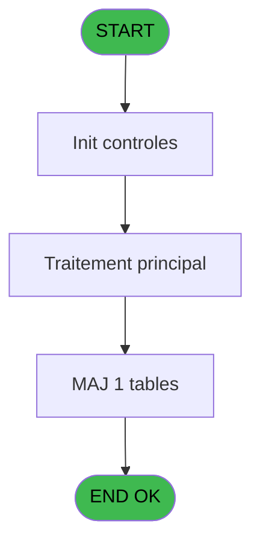
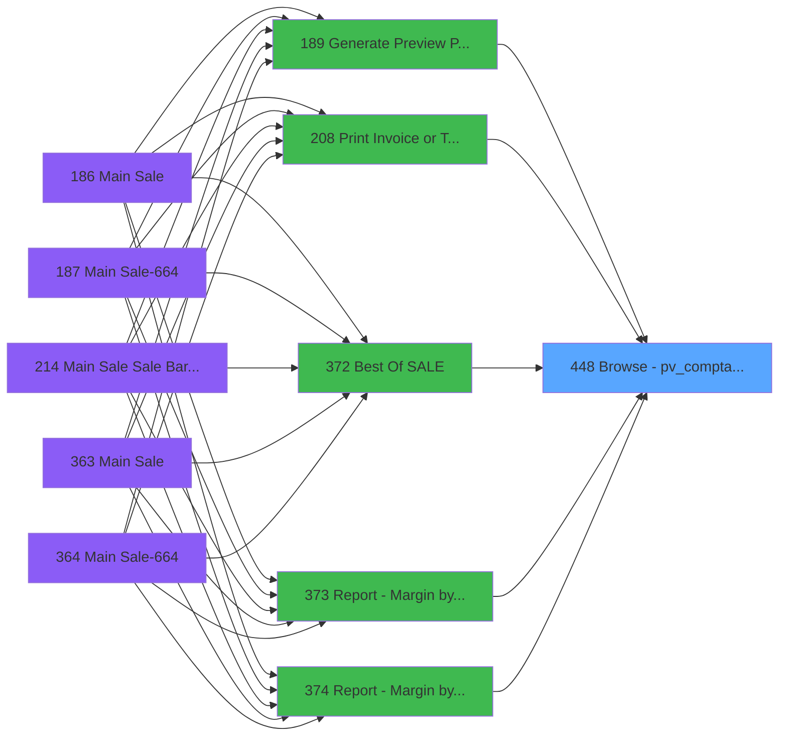

# PVE IDE 448 - Browse - pv_comptab_temp

> **Analyse**: Phases 1-4 2026-02-03 20:13 -> 20:13 (16s) | Assemblage 20:13
> **Pipeline**: V7.2 Enrichi
> **Structure**: 4 onglets (Resume | Ecrans | Donnees | Connexions)

<!-- TAB:Resume -->

## 1. FICHE D'IDENTITE

| Attribut | Valeur |
|----------|--------|
| Projet | PVE |
| IDE Position | 448 |
| Nom Programme | Browse - pv_comptab_temp |
| Fichier source | `Prg_448.xml` |
| Dossier IDE | General |
| Taches | 1 (1 ecrans visibles) |
| Tables modifiees | 1 |
| Programmes appeles | 0 |

## 2. DESCRIPTION FONCTIONNELLE

**Browse - pv_comptab_temp** assure la gestion complete de ce processus, accessible depuis [Generate Preview Payments 1012 (IDE 436)](PVE-IDE-436.md), [Generate Preview Payments (IDE 189)](PVE-IDE-189.md), [Generate Preview Payments 1212 (IDE 434)](PVE-IDE-434.md), [Generate Preview Payments 1112 (IDE 435)](PVE-IDE-435.md), [Generate Preview Payment 1212E (IDE 437)](PVE-IDE-437.md), [Print Invoice or Ticket (IDE 208)](PVE-IDE-208.md), [Best Of (SALE) (IDE 372)](PVE-IDE-372.md), [Report - Margin by Product (IDE 373)](PVE-IDE-373.md), [Report - Margin by Category (IDE 374)](PVE-IDE-374.md), [Report - Margin by Day (IDE 375)](PVE-IDE-375.md), [Report - Margin by Place (IDE 376)](PVE-IDE-376.md), [Report - Margin by Seller (IDE 377)](PVE-IDE-377.md), [Report - Net Margin by Product (IDE 378)](PVE-IDE-378.md), [Print Deposit (IDE 379)](PVE-IDE-379.md), [Print Stat Ventes *NU* (IDE 380)](PVE-IDE-380.md), [Export Insurance (IDE 381)](PVE-IDE-381.md), [Report - Revenue by Product (IDE 382)](PVE-IDE-382.md), [Report - Revenue by Category (IDE 383)](PVE-IDE-383.md), [Report - Revenue by Place (IDE 384)](PVE-IDE-384.md), [Report - Revenue by Seller (IDE 385)](PVE-IDE-385.md).

Le flux de traitement s'organise en **1 blocs fonctionnels** :

- **Calcul** (1 tache) : calculs de montants, stocks ou compteurs

**Donnees modifiees** : 1 tables en ecriture (pv_comptable_tmp).

## 3. BLOCS FONCTIONNELS

### 3.1 Calcul (1 tache)

Calculs metier : montants, stocks, compteurs.

---

#### 448 - Browse - Ref_Tables.pv_comptab [[ECRAN]](#ecran-t1)

**Role** : Traitement : Browse - Ref_Tables.pv_comptab.
**Ecran** : 2191 x 195 DLU | [Voir mockup](#ecran-t1)

## 5. REGLES METIER

*(Aucune regle metier identifiee)*

## 6. CONTEXTE

- **Appele par**: [Generate Preview Payments 1012 (IDE 436)](PVE-IDE-436.md), [Generate Preview Payments (IDE 189)](PVE-IDE-189.md), [Generate Preview Payments 1212 (IDE 434)](PVE-IDE-434.md), [Generate Preview Payments 1112 (IDE 435)](PVE-IDE-435.md), [Generate Preview Payment 1212E (IDE 437)](PVE-IDE-437.md), [Print Invoice or Ticket (IDE 208)](PVE-IDE-208.md), [Best Of (SALE) (IDE 372)](PVE-IDE-372.md), [Report - Margin by Product (IDE 373)](PVE-IDE-373.md), [Report - Margin by Category (IDE 374)](PVE-IDE-374.md), [Report - Margin by Day (IDE 375)](PVE-IDE-375.md), [Report - Margin by Place (IDE 376)](PVE-IDE-376.md), [Report - Margin by Seller (IDE 377)](PVE-IDE-377.md), [Report - Net Margin by Product (IDE 378)](PVE-IDE-378.md), [Print Deposit (IDE 379)](PVE-IDE-379.md), [Print Stat Ventes *NU* (IDE 380)](PVE-IDE-380.md), [Export Insurance (IDE 381)](PVE-IDE-381.md), [Report - Revenue by Product (IDE 382)](PVE-IDE-382.md), [Report - Revenue by Category (IDE 383)](PVE-IDE-383.md), [Report - Revenue by Place (IDE 384)](PVE-IDE-384.md), [Report - Revenue by Seller (IDE 385)](PVE-IDE-385.md)
- **Appelle**: 0 programmes | **Tables**: 1 (W:1 R:0 L:0) | **Taches**: 1 | **Expressions**: 0

<!-- TAB:Ecrans -->

## 8. ECRANS

### 8.1 Forms visibles (1 / 1)

| # | Position | Tache | Nom | Type | Largeur | Hauteur | Bloc |
|---|----------|-------|-----|------|---------|---------|------|
| 1 | 448 | 448 | Browse - Ref_Tables.pv_comptab | Type0 | 2191 | 195 | Calcul |

### 8.2 Mockups Ecrans

---

#### 448 - Browse - Ref_Tables.pv_comptab
**Tache** : [448](#t1) | **Type** : Type0 | **Dimensions** : 2191 x 195 DLU
**Bloc** : Calcul | **Titre IDE** : Browse - Ref_Tables.pv_comptab

<!-- FORM-DATA:
{
    "width":  2191,
    "vFactor":  8,
    "type":  "Type0",
    "hFactor":  4,
    "controls":  [
                     {
                         "x":  8,
                         "type":  "table",
                         "var":  "",
                         "name":  "",
                         "titleH":  12,
                         "color":  "",
                         "w":  2169,
                         "y":  8,
                         "fmt":  "",
                         "parent":  null,
                         "text":  "",
                         "rowH":  13,
                         "h":  182,
                         "cols":  [
                                      {
                                          "title":  "pos_customer_payer_id",
                                          "layer":  1,
                                          "w":  93
                                      },
                                      {
                                          "title":  "xtrack_customer_id",
                                          "layer":  2,
                                          "w":  77
                                      },
                                      {
                                          "title":  "xtrack_package_id_out",
                                          "layer":  3,
                                          "w":  93
                                      },
                                      {
                                          "title":  "xtrack_package_id_in",
                                          "layer":  4,
                                          "w":  87
                                      },
                                      {
                                          "title":  "cte_filiation",
                                          "layer":  5,
                                          "w":  46
                                      },
                                      {
                                          "title":  "cte_imputation",
                                          "layer":  6,
                                          "w":  58
                                      },
                                      {
                                          "title":  "cte_sous_imputation",
                                          "layer":  7,
                                          "w":  81
                                      },
                                      {
                                          "title":  "cte_libelle",
                                          "layer":  8,
                                          "w":  122
                                      },
                                      {
                                          "title":  "cte_libelle_supplem_",
                                          "layer":  9,
                                          "w":  122
                                      },
                                      {
                                          "title":  "cte_credit_debit",
                                          "layer":  10,
                                          "w":  64
                                      },
                                      {
                                          "title":  "cte_flag_annulation",
                                          "layer":  11,
                                          "w":  78
                                      },
                                      {
                                          "title":  "cte_code_type",
                                          "layer":  12,
                                          "w":  60
                                      },
                                      {
                                          "title":  "cte_numero_chrono",
                                          "layer":  13,
                                          "w":  79
                                      },
                                      {
                                          "title":  "cte_avec_change",
                                          "layer":  14,
                                          "w":  73
                                      },
                                      {
                                          "title":  "cte_mode_de_paiement",
                                          "layer":  15,
                                          "w":  94
                                      },
                                      {
                                          "title":  "cte_montant",
                                          "layer":  16,
                                          "w":  101
                                      },
                                      {
                                          "title":  "cte_date_comptable",
                                          "layer":  17,
                                          "w":  81
                                      },
                                      {
                                          "title":  "cte_date_d_operation",
                                          "layer":  18,
                                          "w":  86
                                      },
                                      {
                                          "title":  "cte_heure_operation",
                                          "layer":  19,
                                          "w":  82
                                      },
                                      {
                                          "title":  "cte_nbre_d_articles",
                                          "layer":  20,
                                          "w":  78
                                      },
                                      {
                                          "title":  "cte_flag_hotesses",
                                          "layer":  21,
                                          "w":  72
                                      },
                                      {
                                          "title":  "cte_type_transaction",
                                          "layer":  22,
                                          "w":  82
                                      },
                                      {
                                          "title":  "cte_operateur",
                                          "layer":  23,
                                          "w":  56
                                      },
                                      {
                                          "title":  "pv_service",
                                          "layer":  24,
                                          "w":  45
                                      },
                                      {
                                          "title":  "pv_free_extra",
                                          "layer":  25,
                                          "w":  55
                                      },
                                      {
                                          "title":  "pv_montant_free_extra",
                                          "layer":  26,
                                          "w":  101
                                      },
                                      {
                                          "title":  "pv_vente_en_mobilite",
                                          "layer":  27,
                                          "w":  86
                                      }
                                  ],
                         "rows":  27
                     },
                     {
                         "x":  12,
                         "type":  "edit",
                         "var":  "",
                         "y":  23,
                         "w":  51,
                         "fmt":  "",
                         "name":  "pos_customer_payer_id",
                         "h":  10,
                         "color":  "",
                         "text":  "",
                         "parent":  1
                     },
                     {
                         "x":  105,
                         "type":  "edit",
                         "var":  "",
                         "y":  23,
                         "w":  51,
                         "fmt":  "",
                         "name":  "xtrack_customer_id",
                         "h":  10,
                         "color":  "",
                         "text":  "",
                         "parent":  1
                     },
                     {
                         "x":  182,
                         "type":  "edit",
                         "var":  "",
                         "y":  23,
                         "w":  51,
                         "fmt":  "",
                         "name":  "xtrack_package_id_out",
                         "h":  10,
                         "color":  "",
                         "text":  "",
                         "parent":  1
                     },
                     {
                         "x":  275,
                         "type":  "edit",
                         "var":  "",
                         "y":  23,
                         "w":  51,
                         "fmt":  "",
                         "name":  "xtrack_package_id_in",
                         "h":  10,
                         "color":  "",
                         "text":  "",
                         "parent":  1
                     },
                     {
                         "x":  362,
                         "type":  "edit",
                         "var":  "",
                         "y":  23,
                         "w":  18,
                         "fmt":  "",
                         "name":  "cte_filiation",
                         "h":  10,
                         "color":  "",
                         "text":  "",
                         "parent":  1
                     },
                     {
                         "x":  408,
                         "type":  "edit",
                         "var":  "",
                         "y":  23,
                         "w":  51,
                         "fmt":  "",
                         "name":  "cte_imputation",
                         "h":  10,
                         "color":  "",
                         "text":  "",
                         "parent":  1
                     },
                     {
                         "x":  466,
                         "type":  "edit",
                         "var":  "",
                         "y":  23,
                         "w":  18,
                         "fmt":  "",
                         "name":  "cte_sous_imputation",
                         "h":  10,
                         "color":  "",
                         "text":  "",
                         "parent":  1
                     },
                     {
                         "x":  547,
                         "type":  "edit",
                         "var":  "",
                         "y":  23,
                         "w":  115,
                         "fmt":  "",
                         "name":  "cte_libelle",
                         "h":  10,
                         "color":  "",
                         "text":  "",
                         "parent":  1
                     },
                     {
                         "x":  669,
                         "type":  "edit",
                         "var":  "",
                         "y":  23,
                         "w":  115,
                         "fmt":  "",
                         "name":  "cte_libelle_supplem_",
                         "h":  10,
                         "color":  "",
                         "text":  "",
                         "parent":  1
                     },
                     {
                         "x":  791,
                         "type":  "edit",
                         "var":  "",
                         "y":  23,
                         "w":  9,
                         "fmt":  "",
                         "name":  "cte_credit_debit",
                         "h":  10,
                         "color":  "",
                         "text":  "",
                         "parent":  1
                     },
                     {
                         "x":  855,
                         "type":  "edit",
                         "var":  "",
                         "y":  23,
                         "w":  9,
                         "fmt":  "",
                         "name":  "cte_flag_annulation",
                         "h":  10,
                         "color":  "",
                         "text":  "",
                         "parent":  1
                     },
                     {
                         "x":  933,
                         "type":  "edit",
                         "var":  "",
                         "y":  23,
                         "w":  9,
                         "fmt":  "",
                         "name":  "cte_code_type",
                         "h":  10,
                         "color":  "",
                         "text":  "",
                         "parent":  1
                     },
                     {
                         "x":  993,
                         "type":  "edit",
                         "var":  "",
                         "y":  23,
                         "w":  42,
                         "fmt":  "",
                         "name":  "cte_numero_chrono",
                         "h":  10,
                         "color":  "",
                         "text":  "",
                         "parent":  1
                     },
                     {
                         "x":  1072,
                         "type":  "edit",
                         "var":  "",
                         "y":  23,
                         "w":  9,
                         "fmt":  "",
                         "name":  "cte_avec_change",
                         "h":  10,
                         "color":  "",
                         "text":  "",
                         "parent":  1
                     },
                     {
                         "x":  1145,
                         "type":  "edit",
                         "var":  "",
                         "y":  23,
                         "w":  26,
                         "fmt":  "",
                         "name":  "cte_mode_de_paiement",
                         "h":  10,
                         "color":  "",
                         "text":  "",
                         "parent":  1
                     },
                     {
                         "x":  1239,
                         "type":  "edit",
                         "var":  "",
                         "y":  23,
                         "w":  94,
                         "fmt":  "",
                         "name":  "cte_montant",
                         "h":  10,
                         "color":  "",
                         "text":  "",
                         "parent":  1
                     },
                     {
                         "x":  1340,
                         "type":  "edit",
                         "var":  "",
                         "y":  23,
                         "w":  61,
                         "fmt":  "",
                         "name":  "cte_date_comptable",
                         "h":  10,
                         "color":  "",
                         "text":  "",
                         "parent":  1
                     },
                     {
                         "x":  1421,
                         "type":  "edit",
                         "var":  "",
                         "y":  23,
                         "w":  61,
                         "fmt":  "",
                         "name":  "cte_date_d_operation",
                         "h":  10,
                         "color":  "",
                         "text":  "",
                         "parent":  1
                     },
                     {
                         "x":  1507,
                         "type":  "edit",
                         "var":  "",
                         "y":  23,
                         "w":  46,
                         "fmt":  "",
                         "name":  "cte_heure_operation",
                         "h":  10,
                         "color":  "",
                         "text":  "",
                         "parent":  1
                     },
                     {
                         "x":  1589,
                         "type":  "edit",
                         "var":  "",
                         "y":  23,
                         "w":  22,
                         "fmt":  "",
                         "name":  "cte_nbre_d_articles",
                         "h":  10,
                         "color":  "",
                         "text":  "",
                         "parent":  1
                     },
                     {
                         "x":  1667,
                         "type":  "edit",
                         "var":  "",
                         "y":  23,
                         "w":  9,
                         "fmt":  "",
                         "name":  "cte_flag_hotesses",
                         "h":  10,
                         "color":  "",
                         "text":  "",
                         "parent":  1
                     },
                     {
                         "x":  1739,
                         "type":  "edit",
                         "var":  "",
                         "y":  23,
                         "w":  9,
                         "fmt":  "",
                         "name":  "cte_type_transaction",
                         "h":  10,
                         "color":  "",
                         "text":  "",
                         "parent":  1
                     },
                     {
                         "x":  1821,
                         "type":  "edit",
                         "var":  "",
                         "y":  23,
                         "w":  48,
                         "fmt":  "",
                         "name":  "cte_operateur",
                         "h":  10,
                         "color":  "",
                         "text":  "",
                         "parent":  1
                     },
                     {
                         "x":  1877,
                         "type":  "edit",
                         "var":  "",
                         "y":  23,
                         "w":  26,
                         "fmt":  "",
                         "name":  "pv_service",
                         "h":  10,
                         "color":  "",
                         "text":  "",
                         "parent":  1
                     },
                     {
                         "x":  1922,
                         "type":  "edit",
                         "var":  "",
                         "y":  23,
                         "w":  31,
                         "fmt":  "",
                         "name":  "pv_free_extra",
                         "h":  10,
                         "color":  "",
                         "text":  "",
                         "parent":  1
                     },
                     {
                         "x":  1977,
                         "type":  "edit",
                         "var":  "",
                         "y":  23,
                         "w":  94,
                         "fmt":  "",
                         "name":  "pv_montant_free_extra",
                         "h":  10,
                         "color":  "",
                         "text":  "",
                         "parent":  1
                     },
                     {
                         "x":  2078,
                         "type":  "edit",
                         "var":  "",
                         "y":  23,
                         "w":  31,
                         "fmt":  "",
                         "name":  "pv_vente_en_mobilite",
                         "h":  10,
                         "color":  "",
                         "text":  "",
                         "parent":  1
                     }
                 ],
    "taskId":  "448",
    "height":  195
}
-->

<strong>Champs : 27 champs</strong>

| Pos (x,y) | Nom | Variable | Type |
|-----------|-----|----------|------|
| 12,23 | pos_customer_payer_id | - | edit |
| 105,23 | xtrack_customer_id | - | edit |
| 182,23 | xtrack_package_id_out | - | edit |
| 275,23 | xtrack_package_id_in | - | edit |
| 362,23 | cte_filiation | - | edit |
| 408,23 | cte_imputation | - | edit |
| 466,23 | cte_sous_imputation | - | edit |
| 547,23 | cte_libelle | - | edit |
| 669,23 | cte_libelle_supplem_ | - | edit |
| 791,23 | cte_credit_debit | - | edit |
| 855,23 | cte_flag_annulation | - | edit |
| 933,23 | cte_code_type | - | edit |
| 993,23 | cte_numero_chrono | - | edit |
| 1072,23 | cte_avec_change | - | edit |
| 1145,23 | cte_mode_de_paiement | - | edit |
| 1239,23 | cte_montant | - | edit |
| 1340,23 | cte_date_comptable | - | edit |
| 1421,23 | cte_date_d_operation | - | edit |
| 1507,23 | cte_heure_operation | - | edit |
| 1589,23 | cte_nbre_d_articles | - | edit |
| 1667,23 | cte_flag_hotesses | - | edit |
| 1739,23 | cte_type_transaction | - | edit |
| 1821,23 | cte_operateur | - | edit |
| 1877,23 | pv_service | - | edit |
| 1922,23 | pv_free_extra | - | edit |
| 1977,23 | pv_montant_free_extra | - | edit |
| 2078,23 | pv_vente_en_mobilite | - | edit |

## 9. NAVIGATION

Ecran unique: **Browse - Ref_Tables.pv_comptab**

### 9.3 Structure hierarchique (1 tache)

| Position | Tache | Type | Dimensions | Bloc |
|----------|-------|------|------------|------|
| **448.1** | [**Browse - Ref_Tables.pv_comptab** (448)](#t1) [mockup](#ecran-t1) | - | 2191x195 | Calcul |

### 9.4 Algorigramme

> **Legende**: Vert = START/END OK | Rouge = END KO | Bleu = Decisions
> *Algorigramme auto-genere. Utiliser `/algorigramme` pour une synthese metier detaillee.*

<!-- TAB:Donnees -->

## 10. TABLES

### Tables utilisees (1)

| ID | Nom | Description | Type | R | W | L | Usages |
|----|-----|-------------|------|---|---|---|--------|
| 9 | pv_comptable_tmp |  | TMP |   | **W** |   | 1 |

### Colonnes par table (0 / 1 tables avec colonnes identifiees)

Table 9 - pv_comptable_tmp (**W**) - 1 usages

*Table utilisee uniquement en Link ou aucune colonne Real identifiee dans le DataView.*

## 11. VARIABLES

*(Programme sans variables locales mappees)*

## 12. EXPRESSIONS

**0 / 0 expressions decodees (0%)**

### 12.1 Repartition par type

| Type | Expressions | Regles |
|------|-------------|--------|

### 12.2 Expressions cles par type

<!-- TAB:Connexions -->

## 13. GRAPHE D'APPELS

### 13.1 Chaine depuis Main (Callers)

Main -> ... -> [Generate Preview Payments 1012 (IDE 436)](PVE-IDE-436.md) -> **Browse - pv_comptab_temp (IDE 448)**

Main -> ... -> [Generate Preview Payments (IDE 189)](PVE-IDE-189.md) -> **Browse - pv_comptab_temp (IDE 448)**

Main -> ... -> [Generate Preview Payments 1212 (IDE 434)](PVE-IDE-434.md) -> **Browse - pv_comptab_temp (IDE 448)**

Main -> ... -> [Generate Preview Payments 1112 (IDE 435)](PVE-IDE-435.md) -> **Browse - pv_comptab_temp (IDE 448)**

Main -> ... -> [Generate Preview Payment 1212E (IDE 437)](PVE-IDE-437.md) -> **Browse - pv_comptab_temp (IDE 448)**

Main -> ... -> [Print Invoice or Ticket (IDE 208)](PVE-IDE-208.md) -> **Browse - pv_comptab_temp (IDE 448)**

Main -> ... -> [Best Of (SALE) (IDE 372)](PVE-IDE-372.md) -> **Browse - pv_comptab_temp (IDE 448)**

Main -> ... -> [Report - Margin by Product (IDE 373)](PVE-IDE-373.md) -> **Browse - pv_comptab_temp (IDE 448)**

Main -> ... -> [Report - Margin by Category (IDE 374)](PVE-IDE-374.md) -> **Browse - pv_comptab_temp (IDE 448)**

Main -> ... -> [Report - Margin by Day (IDE 375)](PVE-IDE-375.md) -> **Browse - pv_comptab_temp (IDE 448)**

Main -> ... -> [Report - Margin by Place (IDE 376)](PVE-IDE-376.md) -> **Browse - pv_comptab_temp (IDE 448)**

Main -> ... -> [Report - Margin by Seller (IDE 377)](PVE-IDE-377.md) -> **Browse - pv_comptab_temp (IDE 448)**

Main -> ... -> [Report - Net Margin by Product (IDE 378)](PVE-IDE-378.md) -> **Browse - pv_comptab_temp (IDE 448)**

Main -> ... -> [Print Deposit (IDE 379)](PVE-IDE-379.md) -> **Browse - pv_comptab_temp (IDE 448)**

Main -> ... -> [Print Stat Ventes *NU* (IDE 380)](PVE-IDE-380.md) -> **Browse - pv_comptab_temp (IDE 448)**

Main -> ... -> [Export Insurance (IDE 381)](PVE-IDE-381.md) -> **Browse - pv_comptab_temp (IDE 448)**

Main -> ... -> [Report - Revenue by Product (IDE 382)](PVE-IDE-382.md) -> **Browse - pv_comptab_temp (IDE 448)**

Main -> ... -> [Report - Revenue by Category (IDE 383)](PVE-IDE-383.md) -> **Browse - pv_comptab_temp (IDE 448)**

Main -> ... -> [Report - Revenue by Place (IDE 384)](PVE-IDE-384.md) -> **Browse - pv_comptab_temp (IDE 448)**

Main -> ... -> [Report - Revenue by Seller (IDE 385)](PVE-IDE-385.md) -> **Browse - pv_comptab_temp (IDE 448)**

### 13.2 Callers

| IDE | Nom Programme | Nb Appels |
|-----|---------------|-----------|
| [436](PVE-IDE-436.md) | Generate Preview Payments 1012 | 6 |
| [189](PVE-IDE-189.md) | Generate Preview Payments | 5 |
| [434](PVE-IDE-434.md) | Generate Preview Payments 1212 | 5 |
| [435](PVE-IDE-435.md) | Generate Preview Payments 1112 | 5 |
| [437](PVE-IDE-437.md) | Generate Preview Payment 1212E | 5 |
| [208](PVE-IDE-208.md) | Print Invoice or Ticket | 1 |
| [372](PVE-IDE-372.md) | Best Of (SALE) | 1 |
| [373](PVE-IDE-373.md) | Report - Margin by Product | 1 |
| [374](PVE-IDE-374.md) | Report - Margin by Category | 1 |
| [375](PVE-IDE-375.md) | Report - Margin by Day | 1 |
| [376](PVE-IDE-376.md) | Report - Margin by Place | 1 |
| [377](PVE-IDE-377.md) | Report - Margin by Seller | 1 |
| [378](PVE-IDE-378.md) | Report - Net Margin by Product | 1 |
| [379](PVE-IDE-379.md) | Print Deposit | 1 |
| [380](PVE-IDE-380.md) | Print Stat Ventes *NU* | 1 |
| [381](PVE-IDE-381.md) | Export Insurance | 1 |
| [382](PVE-IDE-382.md) | Report - Revenue by Product | 1 |
| [383](PVE-IDE-383.md) | Report - Revenue by Category | 1 |
| [384](PVE-IDE-384.md) | Report - Revenue by Place | 1 |
| [385](PVE-IDE-385.md) | Report - Revenue by Seller | 1 |

### 13.3 Callees (programmes appeles)

### 13.4 Detail Callees avec contexte

| IDE | Nom Programme | Appels | Contexte |
|-----|---------------|--------|----------|
| - | (aucun) | - | - |

## 14. RECOMMANDATIONS MIGRATION

### 14.1 Profil du programme

| Metrique | Valeur | Impact migration |
|----------|--------|-----------------|
| Lignes de logique | 28 | Programme compact |
| Expressions | 0 | Peu de logique |
| Tables WRITE | 1 | Impact faible |
| Sous-programmes | 0 | Peu de dependances |
| Ecrans visibles | 1 | Ecran unique ou traitement batch |
| Code desactive | 0% (0 / 28) | Code sain |
| Regles metier | 0 | Pas de regle identifiee |

### 14.2 Plan de migration par bloc

#### Calcul (1 tache: 1 ecran, 0 traitement)

- **Strategie** : Services de calcul purs (Domain Services).
- Migrer la logique de calcul (stock, compteurs, montants)

### 14.3 Dependances critiques

| Dependance | Type | Appels | Impact |
|------------|------|--------|--------|
| pv_comptable_tmp | Table WRITE (Temp) | 1x | Schema + repository |

---
*Spec DETAILED generee par Pipeline V7.2 - 2026-02-03 20:13*
