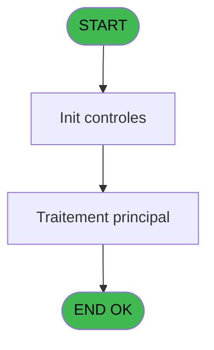
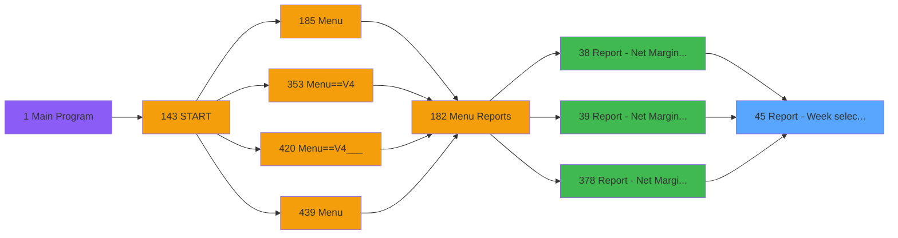

# PVE IDE 45 - Report - Week selection

> **Analyse**: Phases 1-4 2026-02-03 08:54 -> 08:54 (22s) | Assemblage 08:54
> **Pipeline**: V7.2 Enrichi
> **Structure**: 4 onglets (Resume | Ecrans | Donnees | Connexions)

<!-- TAB:Resume -->

## 1. FICHE D'IDENTITE

| Attribut | Valeur |
|----------|--------|
| Projet | PVE |
| IDE Position | 45 |
| Nom Programme | Report - Week selection |
| Fichier source | `Prg_45.xml` |
| Domaine metier | Consultation |
| Taches | 1 (1 ecrans visibles) |
| Tables modifiees | 0 |
| Programmes appeles | 1 |

## 2. DESCRIPTION FONCTIONNELLE

**Report - Week selection** assure la gestion complete de ce processus, accessible depuis [Report - Net Margin by Product (IDE 38)](PVE-IDE-38.md), [Report - Net Margin by Product (IDE 39)](PVE-IDE-39.md), [Report - Net Margin by Product (IDE 378)](PVE-IDE-378.md).

Le flux de traitement s'organise en **1 blocs fonctionnels** :

- **Consultation** (1 tache) : ecrans de recherche, selection et consultation

**Logique metier** : 1 regles identifiees couvrant conditions metier.

## 3. BLOCS FONCTIONNELS

### 3.1 Consultation (1 tache)

Ecrans de recherche et consultation.

---

#### 45 - Week selection [[ECRAN]](#ecran-t1)

**Role** : Selection par l'operateur : Week selection.
**Ecran** : 312 x 173 DLU (MDI) | [Voir mockup](#ecran-t1)

## 5. REGLES METIER

1 regles identifiees:

### Autres (1 regles)

#### [RM-001] Si GetParam ('Output')='Printer' alors '&Print' sinon 'E&xtract')

| Element | Detail |
|---------|--------|
| **Condition** | `GetParam ('Output')='Printer'` |
| **Si vrai** | '&Print' |
| **Si faux** | 'E&xtract') |
| **Expression source** | Expression 13 : `IF (GetParam ('Output')='Printer','&Print','E&xtract')` |
| **Exemple** | Si GetParam ('Output')='Printer' → '&Print'. Sinon → 'E&xtract') |

## 6. CONTEXTE

- **Appele par**: [Report - Net Margin by Product (IDE 38)](PVE-IDE-38.md), [Report - Net Margin by Product (IDE 39)](PVE-IDE-39.md), [Report - Net Margin by Product (IDE 378)](PVE-IDE-378.md)
- **Appelle**: 1 programmes | **Tables**: 1 (W:0 R:1 L:0) | **Taches**: 1 | **Expressions**: 17

<!-- TAB:Ecrans -->

## 8. ECRANS

### 8.1 Forms visibles (1 / 1)

| # | Position | Tache | Nom | Type | Largeur | Hauteur | Bloc |
|---|----------|-------|-----|------|---------|---------|------|
| 1 | 45 | 45 | Week selection | MDI | 312 | 173 | Consultation |

### 8.2 Mockups Ecrans

---

#### 45 - Week selection
**Tache** : [45](#t1) | **Type** : MDI | **Dimensions** : 312 x 173 DLU
**Bloc** : Consultation | **Titre IDE** : Week selection

<!-- FORM-DATA:
{
    "width":  312,
    "vFactor":  8,
    "type":  "MDI",
    "hFactor":  4,
    "controls":  [
                     {
                         "x":  50,
                         "type":  "label",
                         "var":  "",
                         "y":  60,
                         "w":  205,
                         "fmt":  "",
                         "name":  "",
                         "h":  10,
                         "color":  "187",
                         "text":  "Select the week you want to print",
                         "parent":  null
                     },
                     {
                         "x":  0,
                         "type":  "label",
                         "var":  "",
                         "y":  0,
                         "w":  312,
                         "fmt":  "",
                         "name":  "",
                         "h":  41,
                         "color":  "182",
                         "text":  "",
                         "parent":  null
                     },
                     {
                         "x":  13,
                         "type":  "label",
                         "var":  "",
                         "y":  16,
                         "w":  243,
                         "fmt":  "",
                         "name":  "",
                         "h":  10,
                         "color":  "186",
                         "text":  "Week period",
                         "parent":  2
                     },
                     {
                         "x":  47,
                         "type":  "table",
                         "var":  "",
                         "name":  "",
                         "titleH":  12,
                         "color":  "110",
                         "w":  223,
                         "y":  75,
                         "fmt":  "",
                         "parent":  null,
                         "text":  "",
                         "rowH":  16,
                         "h":  50,
                         "cols":  [
                                      {
                                          "title":  "",
                                          "layer":  1,
                                          "w":  207
                                      }
                                  ],
                         "rows":  1
                     },
                     {
                         "x":  0,
                         "type":  "label",
                         "var":  "",
                         "y":  138,
                         "w":  312,
                         "fmt":  "",
                         "name":  "",
                         "h":  35,
                         "color":  "6",
                         "text":  "",
                         "parent":  null
                     },
                     {
                         "x":  50,
                         "type":  "edit",
                         "var":  "",
                         "y":  77,
                         "w":  204,
                         "fmt":  "",
                         "name":  "",
                         "h":  12,
                         "color":  "110",
                         "text":  "",
                         "parent":  5
                     },
                     {
                         "x":  172,
                         "type":  "button",
                         "var":  "",
                         "y":  144,
                         "w":  68,
                         "fmt":  "\u0026Exit",
                         "name":  "",
                         "h":  28,
                         "color":  "",
                         "text":  "",
                         "parent":  null
                     },
                     {
                         "x":  240,
                         "type":  "button",
                         "var":  "",
                         "y":  144,
                         "w":  68,
                         "fmt":  "\u0026Validate",
                         "name":  "",
                         "h":  28,
                         "color":  "",
                         "text":  "",
                         "parent":  null
                     },
                     {
                         "x":  262,
                         "type":  "image",
                         "var":  "",
                         "y":  3,
                         "w":  48,
                         "fmt":  "",
                         "name":  "",
                         "h":  37,
                         "color":  "",
                         "text":  "",
                         "parent":  4
                     }
                 ],
    "taskId":  "45",
    "height":  173
}
-->

<strong>Champs : 1 champs</strong>

| Pos (x,y) | Nom | Variable | Type |
|-----------|-----|----------|------|
| 50,77 | (sans nom) | - | edit |

<strong>Boutons : 2 boutons</strong>

| Bouton | Pos (x,y) | Action |
|--------|-----------|--------|
| Exit | 172,144 | Quitte le programme |
| Validate | 240,144 | Valide la saisie et enregistre |

## 9. NAVIGATION

Ecran unique: **Week selection**

### 9.3 Structure hierarchique (1 tache)

| Position | Tache | Type | Dimensions | Bloc |
|----------|-------|------|------------|------|
| **45.1** | [**Week selection** (45)](#t1) [mockup](#ecran-t1) | MDI | 312x173 | Consultation |

### 9.4 Algorigramme

> **Legende**: Vert = START/END OK | Rouge = END KO | Bleu = Decisions
> *Algorigramme auto-genere. Utiliser `/algorigramme` pour une synthese metier detaillee.*

<!-- TAB:Donnees -->

## 10. TABLES

### Tables utilisees (1)

| ID | Nom | Description | Type | R | W | L | Usages |
|----|-----|-------------|------|---|---|---|--------|
| 385 | pv_equipment |  | DB | R |   |   | 1 |

### Colonnes par table (1 / 1 tables avec colonnes identifiees)

Table 385 - pv_equipment (R) - 1 usages

| Lettre | Variable | Acces | Type |
|--------|----------|-------|------|
| A | P. Date mini | R | Date |
| B | P. Date Maxi | R | Date |
| C | P. Contrôle HD | R | Logical |
| D | P. Période nombre JH | R | Numeric |
| E | P. Jours Période | R | Numeric |
| F | P. YYYYWW | R | Numeric |
| G | P.Annule | R | Logical |
| H | v.Affichage | R | Alpha |
| I | v.Date mini | R | Date |
| J | v.Date maxi | R | Date |
| K | v.Dates anomalie | R | Unicode |

## 11. VARIABLES

### 11.1 Parametres entrants (7)

Variables recues du programme appelant ([Report - Net Margin by Product (IDE 38)](PVE-IDE-38.md)).

| Lettre | Nom | Type | Usage dans |
|--------|-----|------|-----------|
| A | P. Date mini | Date | - |
| B | P. Date Maxi | Date | - |
| C | P. Contrôle HD | Logical | 1x parametre entrant |
| D | P. Période nombre JH | Numeric | - |
| E | P. Jours Période | Numeric | 1x parametre entrant |
| F | P. YYYYWW | Numeric | - |
| G | P.Annule | Logical | - |

### 11.2 Variables de session (4)

Variables persistantes pendant toute la session.

| Lettre | Nom | Type | Usage dans |
|--------|-----|------|-----------|
| H | v.Affichage | Alpha | 4x session |
| I | v.Date mini | Date | 1x session |
| J | v.Date maxi | Date | 1x session |
| K | v.Dates anomalie | Unicode | - |

## 12. EXPRESSIONS

**17 / 17 expressions decodees (100%)**

### 12.1 Repartition par type

| Type | Expressions | Regles |
|------|-------------|--------|
| CALCULATION | 3 | 0 |
| CONDITION | 4 | 0 |
| CONCATENATION | 2 | 5 |
| CONSTANTE | 1 | 0 |
| DATE | 1 | 0 |
| OTHER | 4 | 0 |
| CAST_LOGIQUE | 2 | 0 |

### 12.2 Expressions cles par type

#### CALCULATION (3 expressions)

| Type | IDE | Expression | Regle |
|------|-----|------------|-------|
| CALCULATION | 10 | `StrBuild('No HD for @1@: Dispatch and Amount HT/HD will be wrong. Please communicate this information to your Financial Manager.', [N])` | - |
| CALCULATION | 8 | `v.Date mini [I]*100+v.Date maxi [J]` | - |
| CALCULATION | 4 | `v.Affichage [H]+6` | - |

#### CONDITION (4 expressions)

| Type | IDE | Expression | Regle |
|------|-----|------------|-------|
| CONDITION | 12 | `[N]<>''` | - |
| CONDITION | 15 | `DOW (v.Affichage [H])=2` | - |
| CONDITION | 5 | `[M]='00/00/0000'DATE OR [M]<[L]` | - |
| CONDITION | 11 | `P. Jours Période [E]=0` | - |

#### CONCATENATION (2 expressions)

| Type | IDE | Expression | Regle |
|------|-----|------------|-------|
| CONCATENATION | 13 | `IF (GetParam ('Output')='Printer','&Print','E&xtract')` | [RM-001](#rm-RM-001) |
| CONCATENATION | 2 | `'From '&DStr (v.Affichage [H],'DD/MM/YYYY')&' to '&DStr (v.Affichage [H]+6,'DD/MM/YYYY')` | - |

#### CONSTANTE (1 expressions)

| Type | IDE | Expression | Regle |
|------|-----|------------|-------|
| CONSTANTE | 9 | `0` | - |

#### DATE (1 expressions)

| Type | IDE | Expression | Regle |
|------|-----|------------|-------|
| DATE | 1 | `Date ()` | - |

#### OTHER (4 expressions)

| Type | IDE | Expression | Regle |
|------|-----|------------|-------|
| OTHER | 7 | `[M]` | - |
| OTHER | 14 | `P. Contrôle HD [C]` | - |
| OTHER | 3 | `v.Affichage [H]` | - |
| OTHER | 6 | `[L]` | - |

#### CAST_LOGIQUE (2 expressions)

| Type | IDE | Expression | Regle |
|------|-----|------------|-------|
| CAST_LOGIQUE | 17 | `'FALSE'LOG` | - |
| CAST_LOGIQUE | 16 | `'TRUE'LOG` | - |

<!-- TAB:Connexions -->

## 13. GRAPHE D'APPELS

### 13.1 Chaine depuis Main (Callers)

Main -> ... -> [Report - Net Margin by Product (IDE 38)](PVE-IDE-38.md) -> **Report - Week selection (IDE 45)**

Main -> ... -> [Report - Net Margin by Product (IDE 39)](PVE-IDE-39.md) -> **Report - Week selection (IDE 45)**

Main -> ... -> [Report - Net Margin by Product (IDE 378)](PVE-IDE-378.md) -> **Report - Week selection (IDE 45)**

### 13.2 Callers

| IDE | Nom Programme | Nb Appels |
|-----|---------------|-----------|
| [38](PVE-IDE-38.md) | Report - Net Margin by Product | 1 |
| [39](PVE-IDE-39.md) | Report - Net Margin by Product | 1 |
| [378](PVE-IDE-378.md) | Report - Net Margin by Product | 1 |

### 13.3 Callees (programmes appeles)

### 13.4 Detail Callees avec contexte

| IDE | Nom Programme | Appels | Contexte |
|-----|---------------|--------|----------|
| [58](PVE-IDE-58.md) | Control & Compute hotel days | 1 | Sous-programme |

## 14. RECOMMANDATIONS MIGRATION

### 14.1 Profil du programme

| Metrique | Valeur | Impact migration |
|----------|--------|-----------------|
| Lignes de logique | 39 | Programme compact |
| Expressions | 17 | Peu de logique |
| Tables WRITE | 0 | Impact faible |
| Sous-programmes | 1 | Peu de dependances |
| Ecrans visibles | 1 | Ecran unique ou traitement batch |
| Code desactive | 0% (0 / 39) | Code sain |
| Regles metier | 1 | Quelques regles a preserver |

### 14.2 Plan de migration par bloc

#### Consultation (1 tache: 1 ecran, 0 traitement)

- **Strategie** : Composants de recherche/selection en modales.
- 1 ecran : Week selection

### 14.3 Dependances critiques

| Dependance | Type | Appels | Impact |
|------------|------|--------|--------|
| [Control & Compute hotel days (IDE 58)](PVE-IDE-58.md) | Sous-programme | 1x | Normale - Sous-programme |

---
*Spec DETAILED generee par Pipeline V7.2 - 2026-02-03 08:54*
