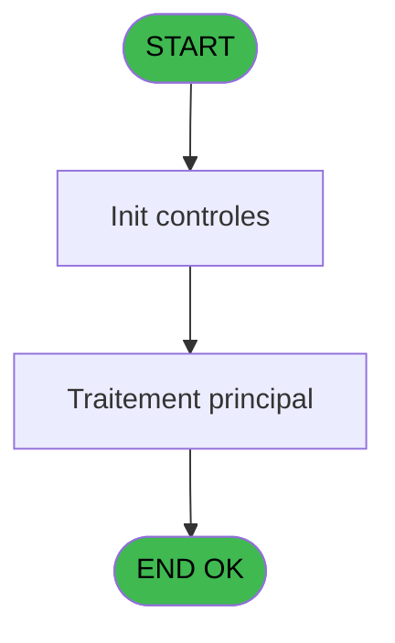
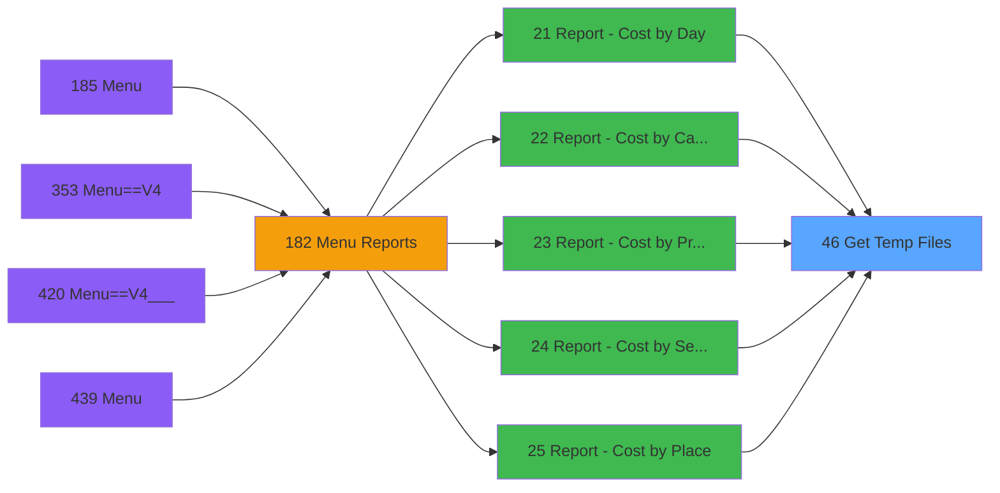
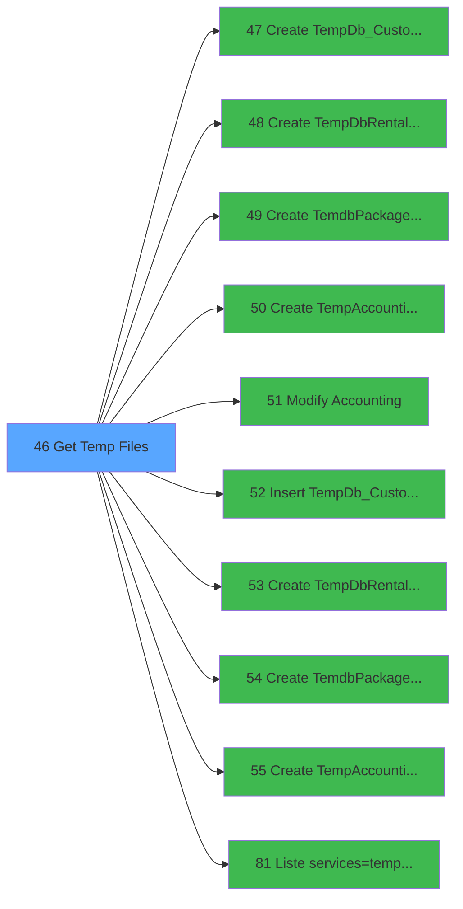

# PVE IDE 46 - Get Temp Files

> **Analyse**: Phases 1-4 2026-02-03 08:55 -> 08:55 (21s) | Assemblage 08:55
> **Pipeline**: V7.2 Enrichi
> **Structure**: 4 onglets (Resume | Ecrans | Donnees | Connexions)

<!-- TAB:Resume -->

## 1. FICHE D'IDENTITE

| Attribut | Valeur |
|----------|--------|
| Projet | PVE |
| IDE Position | 46 |
| Nom Programme | Get Temp Files |
| Fichier source | `Prg_46.xml` |
| Domaine metier | General |
| Taches | 5 (1 ecrans visibles) |
| Tables modifiees | 0 |
| Programmes appeles | 10 |

## 2. DESCRIPTION FONCTIONNELLE

**Get Temp Files** assure la gestion complete de ce processus, accessible depuis [Report - Cost by Day (IDE 21)](PVE-IDE-21.md), [Report - Cost by Category (IDE 22)](PVE-IDE-22.md), [Report - Cost by Product (IDE 23)](PVE-IDE-23.md), [Report - Cost by Seller (IDE 24)](PVE-IDE-24.md), [Report - Cost by Place (IDE 25)](PVE-IDE-25.md), [Report - Margin by Seller (IDE 26)](PVE-IDE-26.md), [Best Of (SALE) (IDE 28)](PVE-IDE-28.md), [Print BestOf (select) (IDE 32)](PVE-IDE-32.md), [Report - Margin by Product (IDE 37)](PVE-IDE-37.md), [Report - Net Margin by Product (IDE 38)](PVE-IDE-38.md), [Report - Net Margin by Product (IDE 39)](PVE-IDE-39.md), [Report - Margin by Product (IDE 40)](PVE-IDE-40.md), [Report - Margin by Day (IDE 41)](PVE-IDE-41.md), [Report - Margin by Category (IDE 42)](PVE-IDE-42.md), [Report - Margin by Place (IDE 43)](PVE-IDE-43.md), [Print/Export Stat Ventes (IDE 63)](PVE-IDE-63.md), [Print Deposit (IDE 64)](PVE-IDE-64.md), [Export Insurance (IDE 65)](PVE-IDE-65.md), [Print Local & Prepaid Rentals (IDE 66)](PVE-IDE-66.md), [Edition UPGRADE (IDE 72)](PVE-IDE-72.md).

Le flux de traitement s'organise en **1 blocs fonctionnels** :

- **Traitement** (5 taches) : traitements metier divers

**Logique metier** : 1 regles identifiees couvrant conditions metier.

Detail : phases du traitement

#### Phase 1 : Traitement (5 taches)

- **46** - (sans nom) **[[ECRAN]](#ecran-t1)**
- **46.1** - Current Files
- **46.1.1** - Drop Table
- **46.1.2** - Count Data **[[ECRAN]](#ecran-t4)**
- **46.2** - Current Files

Delegue a : [Modify Accounting (IDE 51)](PVE-IDE-51.md), [Liste services=>tempo_userlist (IDE 81)](PVE-IDE-81.md)

## 3. BLOCS FONCTIONNELS

### 3.1 Traitement (5 taches)

Traitements internes.

---

#### 46 - (sans nom) [[ECRAN]](#ecran-t1)

**Role** : Traitement interne.
**Ecran** : 483 x 108 DLU (MDI) | [Voir mockup](#ecran-t1)

4 sous-taches directes

| Tache | Nom | Bloc |
|-------|-----|------|
| [46.1](#t2) | Current Files | Traitement |
| [46.1.1](#t3) | Drop Table | Traitement |
| [46.1.2](#t4) | Count Data **[[ECRAN]](#ecran-t4)** | Traitement |
| [46.2](#t41) | Current Files | Traitement |

**Delegue a** : [Modify Accounting (IDE 51)](PVE-IDE-51.md), [Liste services=>tempo_userlist (IDE 81)](PVE-IDE-81.md)

---

#### 46.1 - Current Files

**Role** : Traitement : Current Files.
**Delegue a** : [Modify Accounting (IDE 51)](PVE-IDE-51.md), [Liste services=>tempo_userlist (IDE 81)](PVE-IDE-81.md)

---

#### 46.1.1 - Drop Table

**Role** : Traitement : Drop Table.
**Delegue a** : [Modify Accounting (IDE 51)](PVE-IDE-51.md), [Liste services=>tempo_userlist (IDE 81)](PVE-IDE-81.md)

---

#### 46.1.2 - Count Data [[ECRAN]](#ecran-t4)

**Role** : Traitement : Count Data.
**Ecran** : 120 x 195 DLU | [Voir mockup](#ecran-t4)
**Variables liees** : F (P. Account needed), L (P. Item Accounting), T (v.Nom.TempDbAccounting), X (V Nbre Enreg Account)
**Delegue a** : [Modify Accounting (IDE 51)](PVE-IDE-51.md), [Liste services=>tempo_userlist (IDE 81)](PVE-IDE-81.md)

---

#### 46.2 - Current Files

**Role** : Traitement : Current Files.
**Delegue a** : [Modify Accounting (IDE 51)](PVE-IDE-51.md), [Liste services=>tempo_userlist (IDE 81)](PVE-IDE-81.md)

## 5. REGLES METIER

1 regles identifiees:

### Autres (1 regles)

#### [RM-001] Traitement si Trim({1,29}) est renseigne

| Element | Detail |
|---------|--------|
| **Condition** | `Trim({1` |
| **Si vrai** | 29})<>'' |
| **Si faux** | Trim({1,29})&',','')&''''&Trim(P. Rental needed [D])&'''' |
| **Variables** | D (P. Rental needed) |
| **Expression source** | Expression 14 : `IF(Trim({1,29})<>'',Trim({1,29})&',','')&''''&Trim(P. Rental` |
| **Exemple** | Si Trim({1 → 29})<>''. Sinon → Trim({1,29})&',','')&''''&Trim(P. Rental needed [D])&'''' |

## 6. CONTEXTE

- **Appele par**: [Report - Cost by Day (IDE 21)](PVE-IDE-21.md), [Report - Cost by Category (IDE 22)](PVE-IDE-22.md), [Report - Cost by Product (IDE 23)](PVE-IDE-23.md), [Report - Cost by Seller (IDE 24)](PVE-IDE-24.md), [Report - Cost by Place (IDE 25)](PVE-IDE-25.md), [Report - Margin by Seller (IDE 26)](PVE-IDE-26.md), [Best Of (SALE) (IDE 28)](PVE-IDE-28.md), [Print BestOf (select) (IDE 32)](PVE-IDE-32.md), [Report - Margin by Product (IDE 37)](PVE-IDE-37.md), [Report - Net Margin by Product (IDE 38)](PVE-IDE-38.md), [Report - Net Margin by Product (IDE 39)](PVE-IDE-39.md), [Report - Margin by Product (IDE 40)](PVE-IDE-40.md), [Report - Margin by Day (IDE 41)](PVE-IDE-41.md), [Report - Margin by Category (IDE 42)](PVE-IDE-42.md), [Report - Margin by Place (IDE 43)](PVE-IDE-43.md), [Print/Export Stat Ventes (IDE 63)](PVE-IDE-63.md), [Print Deposit (IDE 64)](PVE-IDE-64.md), [Export Insurance (IDE 65)](PVE-IDE-65.md), [Print Local & Prepaid Rentals (IDE 66)](PVE-IDE-66.md), [Edition UPGRADE (IDE 72)](PVE-IDE-72.md)
- **Appelle**: 10 programmes | **Tables**: 3 (W:0 R:2 L:1) | **Taches**: 5 | **Expressions**: 14

<!-- TAB:Ecrans -->

## 8. ECRANS

### 8.1 Forms visibles (1 / 5)

| # | Position | Tache | Nom | Type | Largeur | Hauteur | Bloc |
|---|----------|-------|-----|------|---------|---------|------|
| 1 | 46 | 46 | (sans nom) | MDI | 483 | 108 | Traitement |

### 8.2 Mockups Ecrans

---

#### 46 - (sans nom)
**Tache** : [46](#t1) | **Type** : MDI | **Dimensions** : 483 x 108 DLU
**Bloc** : Traitement | **Titre IDE** : (sans nom)

<!-- FORM-DATA:
{
    "width":  483,
    "vFactor":  8,
    "type":  "MDI",
    "hFactor":  8,
    "controls":  [
                     {
                         "x":  5,
                         "type":  "label",
                         "var":  "",
                         "y":  1,
                         "w":  472,
                         "fmt":  "",
                         "name":  "",
                         "h":  29,
                         "color":  "",
                         "text":  "",
                         "parent":  null
                     },
                     {
                         "x":  168,
                         "type":  "label",
                         "var":  "",
                         "y":  8,
                         "w":  228,
                         "fmt":  "",
                         "name":  "",
                         "h":  12,
                         "color":  "7",
                         "text":  "Please Wait ...",
                         "parent":  null
                     },
                     {
                         "x":  3,
                         "type":  "label",
                         "var":  "",
                         "y":  30,
                         "w":  472,
                         "fmt":  "",
                         "name":  "",
                         "h":  69,
                         "color":  "",
                         "text":  "",
                         "parent":  null
                     },
                     {
                         "x":  13,
                         "type":  "label",
                         "var":  "",
                         "y":  42,
                         "w":  454,
                         "fmt":  "",
                         "name":  "",
                         "h":  10,
                         "color":  "",
                         "text":  "TempDB SQL   Generation",
                         "parent":  null
                     },
                     {
                         "x":  6,
                         "type":  "line",
                         "var":  "",
                         "y":  55,
                         "w":  466,
                         "fmt":  "",
                         "name":  "",
                         "h":  0,
                         "color":  "",
                         "text":  "",
                         "parent":  null
                     },
                     {
                         "x":  87,
                         "type":  "label",
                         "var":  "",
                         "y":  64,
                         "w":  109,
                         "fmt":  "",
                         "name":  "",
                         "h":  10,
                         "color":  "",
                         "text":  "Date début",
                         "parent":  null
                     },
                     {
                         "x":  87,
                         "type":  "label",
                         "var":  "",
                         "y":  79,
                         "w":  109,
                         "fmt":  "",
                         "name":  "",
                         "h":  10,
                         "color":  "",
                         "text":  "Date fin",
                         "parent":  null
                     },
                     {
                         "x":  6,
                         "type":  "line",
                         "var":  "",
                         "y":  95,
                         "w":  466,
                         "fmt":  "",
                         "name":  "",
                         "h":  0,
                         "color":  "",
                         "text":  "",
                         "parent":  null
                     },
                     {
                         "x":  17,
                         "type":  "image",
                         "var":  "",
                         "y":  3,
                         "w":  72,
                         "fmt":  "",
                         "name":  "",
                         "h":  25,
                         "color":  "",
                         "text":  "",
                         "parent":  null
                     },
                     {
                         "x":  270,
                         "type":  "edit",
                         "var":  "",
                         "y":  64,
                         "w":  122,
                         "fmt":  "",
                         "name":  "P. Date debut",
                         "h":  10,
                         "color":  "",
                         "text":  "",
                         "parent":  null
                     },
                     {
                         "x":  270,
                         "type":  "edit",
                         "var":  "",
                         "y":  79,
                         "w":  122,
                         "fmt":  "",
                         "name":  "P. Date fin",
                         "h":  10,
                         "color":  "",
                         "text":  "",
                         "parent":  null
                     }
                 ],
    "taskId":  "46",
    "height":  108
}
-->

<strong>Champs : 2 champs</strong>

| Pos (x,y) | Nom | Variable | Type |
|-----------|-----|----------|------|
| 270,64 | P. Date debut | - | edit |
| 270,79 | P. Date fin | - | edit |

## 9. NAVIGATION

Ecran unique: ****

### 9.3 Structure hierarchique (5 taches)

| Position | Tache | Type | Dimensions | Bloc |
|----------|-------|------|------------|------|
| **46.1** | [**(sans nom)** (46)](#t1) [mockup](#ecran-t1) | MDI | 483x108 | Traitement |
| 46.1.1 | [Current Files (46.1)](#t2) | MDI | - | |
| 46.1.2 | [Drop Table (46.1.1)](#t3) | - | - | |
| 46.1.3 | [Count Data (46.1.2)](#t4) [mockup](#ecran-t4) | - | 120x195 | |
| 46.1.4 | [Current Files (46.2)](#t41) | MDI | - | |

### 9.4 Algorigramme

> **Legende**: Vert = START/END OK | Rouge = END KO | Bleu = Decisions
> *Algorigramme auto-genere. Utiliser `/algorigramme` pour une synthese metier detaillee.*

<!-- TAB:Donnees -->

## 10. TABLES

### Tables utilisees (3)

| ID | Nom | Description | Type | R | W | L | Usages |
|----|-----|-------------|------|---|---|---|--------|
| 71 | derniere_purge___pur |  | DB | R |   |   | 1 |
| 82 | param_purge______ppu |  | DB |   |   | L | 1 |
| 637 | tempo_zone_secteur | Table temporaire ecran | DB | R |   |   | 1 |

### Colonnes par table (1 / 2 tables avec colonnes identifiees)

Table 71 - derniere_purge___pur (R) - 1 usages

| Lettre | Variable | Acces | Type |
|--------|----------|-------|------|
| A | P. Date debut | R | Date |
| B | P. Date fin | R | Date |
| C | P. Customer needed | R | Logical |
| D | P. Rental needed | R | Logical |
| E | P. Package needed | R | Logical |
| F | P. Account needed | R | Logical |
| G | P. Service GESTION ? | R | Logical |
| H | P . Traiter les refus de vente | R | Numeric |
| I | P. Item Customer | R | Logical |
| J | P. Item Rentals | R | Logical |
| K | P. Item Package | R | Logical |
| L | P. Item Accounting | R | Logical |
| M | v.YYYY debut | R | Numeric |
| N | v.MM debut | R | Numeric |
| O | v.YYYY fin | R | Numeric |
| P | v.MM fin | R | Numeric |
| Q | v.Nom.TempDbCustomer | R | Alpha |
| R | v.Nom.TempDbRentals | R | Alpha |
| S | v.Nom.TempDbPackage | R | Alpha |
| T | v.Nom.TempDbAccounting | R | Alpha |
| U | V Nbre Enreg Customer | R | Numeric |
| V | V Nbre Enreg Rentals | R | Numeric |
| W | V Nbre Enreg Package | R | Numeric |
| X | V Nbre Enreg Account | R | Numeric |
| Y | V.liste des Services | R | Unicode |

Table 637 - tempo_zone_secteur (R) - 1 usages

*Table utilisee uniquement en Link ou aucune colonne Real identifiee dans le DataView.*

## 11. VARIABLES

### 11.1 Parametres entrants (12)

Variables recues du programme appelant ([Report - Cost by Day (IDE 21)](PVE-IDE-21.md)).

| Lettre | Nom | Type | Usage dans |
|--------|-----|------|-----------|
| A | P. Date debut | Date | - |
| B | P. Date fin | Date | - |
| C | P. Customer needed | Logical | - |
| D | P. Rental needed | Logical | 1x parametre entrant |
| E | P. Package needed | Logical | - |
| F | P. Account needed | Logical | - |
| G | P. Service GESTION ? | Logical | 1x parametre entrant |
| H | P . Traiter les refus de vente | Numeric | - |
| I | P. Item Customer | Logical | - |
| J | P. Item Rentals | Logical | - |
| K | P. Item Package | Logical | - |
| L | P. Item Accounting | Logical | - |

### 11.2 Variables de session (13)

Variables persistantes pendant toute la session.

| Lettre | Nom | Type | Usage dans |
|--------|-----|------|-----------|
| M | v.YYYY debut | Numeric | - |
| N | v.MM debut | Numeric | - |
| O | v.YYYY fin | Numeric | - |
| P | v.MM fin | Numeric | - |
| Q | v.Nom.TempDbCustomer | Alpha | - |
| R | v.Nom.TempDbRentals | Alpha | - |
| S | v.Nom.TempDbPackage | Alpha | - |
| T | v.Nom.TempDbAccounting | Alpha | - |
| U | V Nbre Enreg Customer | Numeric | - |
| V | V Nbre Enreg Rentals | Numeric | - |
| W | V Nbre Enreg Package | Numeric | - |
| X | V Nbre Enreg Account | Numeric | - |
| Y | V.liste des Services | Unicode | - |

Toutes les 25 variables (liste complete)

| Cat | Lettre | Nom Variable | Type |
|-----|--------|--------------|------|
| P0 | **A** | P. Date debut | Date |
| P0 | **B** | P. Date fin | Date |
| P0 | **C** | P. Customer needed | Logical |
| P0 | **D** | P. Rental needed | Logical |
| P0 | **E** | P. Package needed | Logical |
| P0 | **F** | P. Account needed | Logical |
| P0 | **G** | P. Service GESTION ? | Logical |
| P0 | **H** | P . Traiter les refus de vente | Numeric |
| P0 | **I** | P. Item Customer | Logical |
| P0 | **J** | P. Item Rentals | Logical |
| P0 | **K** | P. Item Package | Logical |
| P0 | **L** | P. Item Accounting | Logical |
| V. | **M** | v.YYYY debut | Numeric |
| V. | **N** | v.MM debut | Numeric |
| V. | **O** | v.YYYY fin | Numeric |
| V. | **P** | v.MM fin | Numeric |
| V. | **Q** | v.Nom.TempDbCustomer | Alpha |
| V. | **R** | v.Nom.TempDbRentals | Alpha |
| V. | **S** | v.Nom.TempDbPackage | Alpha |
| V. | **T** | v.Nom.TempDbAccounting | Alpha |
| V. | **U** | V Nbre Enreg Customer | Numeric |
| V. | **V** | V Nbre Enreg Rentals | Numeric |
| V. | **W** | V Nbre Enreg Package | Numeric |
| V. | **X** | V Nbre Enreg Account | Numeric |
| V. | **Y** | V.liste des Services | Unicode |

## 12. EXPRESSIONS

**14 / 14 expressions decodees (100%)**

### 12.1 Repartition par type

| Type | Expressions | Regles |
|------|-------------|--------|
| CONDITION | 1 | 5 |
| CONSTANTE | 4 | 0 |
| OTHER | 6 | 0 |
| CAST_LOGIQUE | 2 | 0 |
| REFERENCE_VG | 1 | 0 |

### 12.2 Expressions cles par type

#### CONDITION (1 expressions)

| Type | IDE | Expression | Regle |
|------|-----|------------|-------|
| CONDITION | 14 | `IF(Trim({1,29})<>'',Trim({1,29})&',','')&''''&Trim(P. Rental needed [D])&''''` | [RM-001](#rm-RM-001) |

#### CONSTANTE (4 expressions)

| Type | IDE | Expression | Regle |
|------|-----|------------|-------|
| CONSTANTE | 12 | `'VSERV'` | - |
| CONSTANTE | 13 | `''` | - |
| CONSTANTE | 1 | `'C'` | - |
| CONSTANTE | 11 | `'O'` | - |

#### OTHER (6 expressions)

| Type | IDE | Expression | Regle |
|------|-----|------------|-------|
| OTHER | 5 | `DbName('{1470,3}'DSOURCE, 1)` | - |
| OTHER | 7 | `GetParam('SERVICE')` | - |
| OTHER | 8 | `NOT(P. Service GESTION ? [G])` | - |
| OTHER | 2 | `DbName('{1468,3}'DSOURCE, 1)` | - |
| OTHER | 3 | `DbName('{1469,3}'DSOURCE, 1)` | - |
| ... | | *+1 autres* | |

#### CAST_LOGIQUE (2 expressions)

| Type | IDE | Expression | Regle |
|------|-----|------------|-------|
| CAST_LOGIQUE | 10 | `'TRUE'LOG` | - |
| CAST_LOGIQUE | 6 | `'TRUE'LOG` | - |

#### REFERENCE_VG (1 expressions)

| Type | IDE | Expression | Regle |
|------|-----|------------|-------|
| REFERENCE_VG | 9 | `VG1` | - |

<!-- TAB:Connexions -->

## 13. GRAPHE D'APPELS

### 13.1 Chaine depuis Main (Callers)

Main -> ... -> [Report - Cost by Day (IDE 21)](PVE-IDE-21.md) -> **Get Temp Files (IDE 46)**

Main -> ... -> [Report - Cost by Category (IDE 22)](PVE-IDE-22.md) -> **Get Temp Files (IDE 46)**

Main -> ... -> [Report - Cost by Product (IDE 23)](PVE-IDE-23.md) -> **Get Temp Files (IDE 46)**

Main -> ... -> [Report - Cost by Seller (IDE 24)](PVE-IDE-24.md) -> **Get Temp Files (IDE 46)**

Main -> ... -> [Report - Cost by Place (IDE 25)](PVE-IDE-25.md) -> **Get Temp Files (IDE 46)**

Main -> ... -> [Report - Margin by Seller (IDE 26)](PVE-IDE-26.md) -> **Get Temp Files (IDE 46)**

Main -> ... -> [Best Of (SALE) (IDE 28)](PVE-IDE-28.md) -> **Get Temp Files (IDE 46)**

Main -> ... -> [Print BestOf (select) (IDE 32)](PVE-IDE-32.md) -> **Get Temp Files (IDE 46)**

Main -> ... -> [Report - Margin by Product (IDE 37)](PVE-IDE-37.md) -> **Get Temp Files (IDE 46)**

Main -> ... -> [Report - Net Margin by Product (IDE 38)](PVE-IDE-38.md) -> **Get Temp Files (IDE 46)**

Main -> ... -> [Report - Net Margin by Product (IDE 39)](PVE-IDE-39.md) -> **Get Temp Files (IDE 46)**

Main -> ... -> [Report - Margin by Product (IDE 40)](PVE-IDE-40.md) -> **Get Temp Files (IDE 46)**

Main -> ... -> [Report - Margin by Day (IDE 41)](PVE-IDE-41.md) -> **Get Temp Files (IDE 46)**

Main -> ... -> [Report - Margin by Category (IDE 42)](PVE-IDE-42.md) -> **Get Temp Files (IDE 46)**

Main -> ... -> [Report - Margin by Place (IDE 43)](PVE-IDE-43.md) -> **Get Temp Files (IDE 46)**

Main -> ... -> [Print/Export Stat Ventes (IDE 63)](PVE-IDE-63.md) -> **Get Temp Files (IDE 46)**

Main -> ... -> [Print Deposit (IDE 64)](PVE-IDE-64.md) -> **Get Temp Files (IDE 46)**

Main -> ... -> [Export Insurance (IDE 65)](PVE-IDE-65.md) -> **Get Temp Files (IDE 46)**

Main -> ... -> [Print Local & Prepaid Rentals (IDE 66)](PVE-IDE-66.md) -> **Get Temp Files (IDE 46)**

Main -> ... -> [Edition UPGRADE (IDE 72)](PVE-IDE-72.md) -> **Get Temp Files (IDE 46)**

### 13.2 Callers

| IDE | Nom Programme | Nb Appels |
|-----|---------------|-----------|
| [21](PVE-IDE-21.md) | Report - Cost by Day | 1 |
| [22](PVE-IDE-22.md) | Report - Cost by Category | 1 |
| [23](PVE-IDE-23.md) | Report - Cost by Product | 1 |
| [24](PVE-IDE-24.md) | Report - Cost by Seller | 1 |
| [25](PVE-IDE-25.md) | Report - Cost by Place | 1 |
| [26](PVE-IDE-26.md) | Report - Margin by Seller | 1 |
| [28](PVE-IDE-28.md) | Best Of (SALE) | 1 |
| [32](PVE-IDE-32.md) | Print BestOf (select) | 1 |
| [37](PVE-IDE-37.md) | Report - Margin by Product | 1 |
| [38](PVE-IDE-38.md) | Report - Net Margin by Product | 1 |
| [39](PVE-IDE-39.md) | Report - Net Margin by Product | 1 |
| [40](PVE-IDE-40.md) | Report - Margin by Product | 1 |
| [41](PVE-IDE-41.md) | Report - Margin by Day | 1 |
| [42](PVE-IDE-42.md) | Report - Margin by Category | 1 |
| [43](PVE-IDE-43.md) | Report - Margin by Place | 1 |
| [63](PVE-IDE-63.md) | Print/Export Stat Ventes | 1 |
| [64](PVE-IDE-64.md) | Print Deposit | 1 |
| [65](PVE-IDE-65.md) | Export Insurance | 1 |
| [66](PVE-IDE-66.md) | Print Local & Prepaid Rentals | 1 |
| [72](PVE-IDE-72.md) | Edition UPGRADE | 1 |

### 13.3 Callees (programmes appeles)

### 13.4 Detail Callees avec contexte

| IDE | Nom Programme | Appels | Contexte |
|-----|---------------|--------|----------|
| [47](PVE-IDE-47.md) | Create TempDb_Customer PMS | 1 | Sous-programme |
| [48](PVE-IDE-48.md) | Create TempDbRentals PMS | 1 | Sous-programme |
| [49](PVE-IDE-49.md) | Create TemdbPackage PMS | 1 | Sous-programme |
| [50](PVE-IDE-50.md) | Create TempAccounting PMS | 1 | Sous-programme |
| [51](PVE-IDE-51.md) | Modify Accounting | 1 | Sous-programme |
| [52](PVE-IDE-52.md) | Insert TempDb_Customer ARCH | 1 | Sous-programme |
| [53](PVE-IDE-53.md) | Create TempDbRentals ARCH | 1 | Sous-programme |
| [54](PVE-IDE-54.md) | Create TemdbPackage ARCH | 1 | Sous-programme |
| [55](PVE-IDE-55.md) | Create TempAccounting ARCH | 1 | Sous-programme |
| [81](PVE-IDE-81.md) | Liste services=>tempo_userlist | 1 | Configuration impression |

## 14. RECOMMANDATIONS MIGRATION

### 14.1 Profil du programme

| Metrique | Valeur | Impact migration |
|----------|--------|-----------------|
| Lignes de logique | 124 | Programme compact |
| Expressions | 14 | Peu de logique |
| Tables WRITE | 0 | Impact faible |
| Sous-programmes | 10 | Dependances moderees |
| Ecrans visibles | 1 | Ecran unique ou traitement batch |
| Code desactive | 0% (0 / 124) | Code sain |
| Regles metier | 1 | Quelques regles a preserver |

### 14.2 Plan de migration par bloc

#### Traitement (5 taches: 2 ecrans, 3 traitements)

- **Strategie** : Orchestrateur avec 2 ecrans (Razor/React) et 3 traitements backend (services).
- Les ecrans deviennent des composants UI, les traitements invisibles deviennent des services injectables.
- 10 sous-programme(s) a migrer ou a reutiliser depuis les services existants.
- Decomposer les taches en services unitaires testables.

### 14.3 Dependances critiques

| Dependance | Type | Appels | Impact |
|------------|------|--------|--------|
| [Create TempDbRentals ARCH (IDE 53)](PVE-IDE-53.md) | Sous-programme | 1x | Normale - Sous-programme |
| [Insert TempDb_Customer ARCH (IDE 52)](PVE-IDE-52.md) | Sous-programme | 1x | Normale - Sous-programme |
| [Create TemdbPackage ARCH (IDE 54)](PVE-IDE-54.md) | Sous-programme | 1x | Normale - Sous-programme |
| [Liste services=>tempo_userlist (IDE 81)](PVE-IDE-81.md) | Sous-programme | 1x | Normale - Configuration impression |
| [Create TempAccounting ARCH (IDE 55)](PVE-IDE-55.md) | Sous-programme | 1x | Normale - Sous-programme |
| [Create TempDbRentals PMS (IDE 48)](PVE-IDE-48.md) | Sous-programme | 1x | Normale - Sous-programme |
| [Create TempDb_Customer PMS (IDE 47)](PVE-IDE-47.md) | Sous-programme | 1x | Normale - Sous-programme |
| [Create TemdbPackage PMS (IDE 49)](PVE-IDE-49.md) | Sous-programme | 1x | Normale - Sous-programme |
| [Modify Accounting (IDE 51)](PVE-IDE-51.md) | Sous-programme | 1x | Normale - Sous-programme |
| [Create TempAccounting PMS (IDE 50)](PVE-IDE-50.md) | Sous-programme | 1x | Normale - Sous-programme |

---
*Spec DETAILED generee par Pipeline V7.2 - 2026-02-03 08:55*
