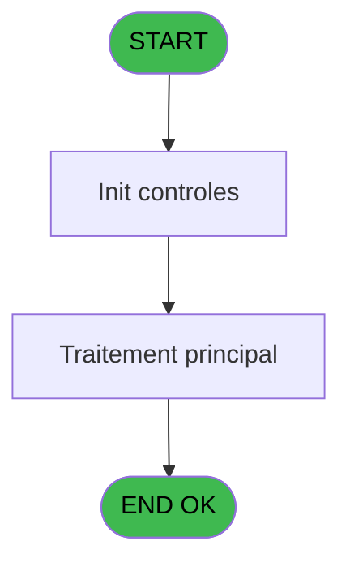
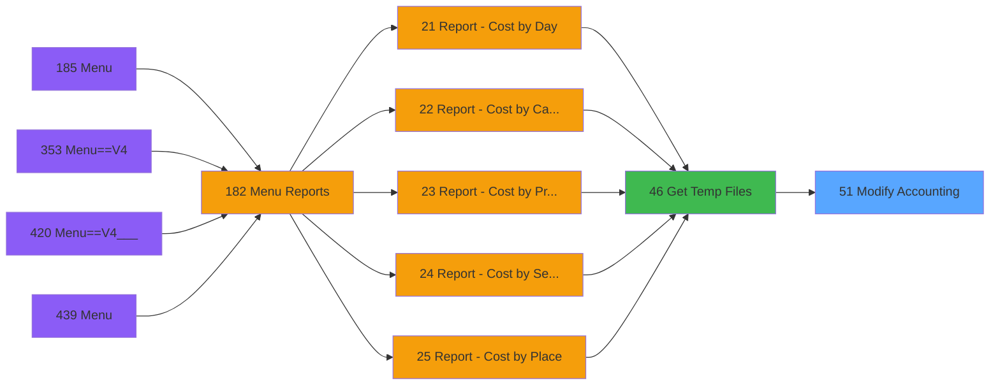

# PVE IDE 51 - Modify Accounting

> **Analyse**: Phases 1-4 2026-02-03 08:57 -> 08:58 (22s) | Assemblage 08:58
> **Pipeline**: V7.2 Enrichi
> **Structure**: 4 onglets (Resume | Ecrans | Donnees | Connexions)

<!-- TAB:Resume -->

## 1. FICHE D'IDENTITE

| Attribut | Valeur |
|----------|--------|
| Projet | PVE |
| IDE Position | 51 |
| Nom Programme | Modify Accounting |
| Fichier source | `Prg_51.xml` |
| Domaine metier | General |
| Taches | 2 (0 ecrans visibles) |
| Tables modifiees | 0 |
| Programmes appeles | 0 |

## 2. DESCRIPTION FONCTIONNELLE

**Modify Accounting** assure la gestion complete de ce processus, accessible depuis [Get Temp Files (IDE 46)](PVE-IDE-46.md).

Le flux de traitement s'organise en **1 blocs fonctionnels** :

- **Traitement** (2 taches) : traitements metier divers

**Logique metier** : 2 regles identifiees couvrant conditions metier.

## 3. BLOCS FONCTIONNELS

### 3.1 Traitement (2 taches)

Traitements internes.

---

#### 51 - (sans nom)

**Role** : Traitement interne.

---

#### 51.1 - Update Accounting [[ECRAN]](#ecran-t2)

**Role** : Traitement : Update Accounting.
**Ecran** : 2230 x 468 DLU | [Voir mockup](#ecran-t2)

## 5. REGLES METIER

2 regles identifiees:

### Autres (2 regles)

#### [RM-001] Si [AN] alors [AQ]-[AR] sinon cte_montant [P])

| Element | Detail |
|---------|--------|
| **Condition** | `[AN]` |
| **Si vrai** | [AQ]-[AR] |
| **Si faux** | cte_montant [P]) |
| **Variables** | P (cte_montant) |
| **Expression source** | Expression 26 : `IF ([AN],[AQ]-[AR],cte_montant [P])` |
| **Exemple** | Si [AN] → [AQ]-[AR]. Sinon → cte_montant [P]) |

#### [RM-002] Traitement si {1,2} est renseigne

| Element | Detail |
|---------|--------|
| **Condition** | `{1` |
| **Si vrai** | 2}<>'' |
| **Si faux** | ' and pv_service IN ('&Trim({1,2})&')','') |
| **Variables** | X (pv_service) |
| **Expression source** | Expression 38 : `IF({1,2}<>'' , ' and pv_service IN ('&Trim({1,2})&')','')` |
| **Exemple** | Si {1 → 2}<>''. Sinon → ' and pv_service IN ('&Trim({1,2})&')','') |

## 6. CONTEXTE

- **Appele par**: [Get Temp Files (IDE 46)](PVE-IDE-46.md)
- **Appelle**: 0 programmes | **Tables**: 4 (W:0 R:1 L:3) | **Taches**: 2 | **Expressions**: 38

<!-- TAB:Ecrans -->

## 8. ECRANS

*(Programme sans ecran visible)*

## 9. NAVIGATION

### 9.3 Structure hierarchique (2 taches)

| Position | Tache | Type | Dimensions | Bloc |
|----------|-------|------|------------|------|
| **51.1** | [**(sans nom)** (51)](#t1) | - | - | Traitement |
| 51.1.1 | [Update Accounting (51.1)](#t2) [mockup](#ecran-t2) | - | 2230x468 | |

### 9.4 Algorigramme

> **Legende**: Vert = START/END OK | Rouge = END KO | Bleu = Decisions
> *Algorigramme auto-genere. Utiliser `/algorigramme` pour une synthese metier detaillee.*

<!-- TAB:Donnees -->

## 10. TABLES

### Tables utilisees (4)

| ID | Nom | Description | Type | R | W | L | Usages |
|----|-----|-------------|------|---|---|---|--------|
| 38 | comptable_gratuite |  | DB | R |   |   | 1 |
| 523 | synthese_garanties | Depots et garanties | TMP |   |   | L | 1 |
| 763 | pv_inv_stock | Articles et stock | DB |   |   | L | 1 |
| 1468 | Table_1468 |  | MEM |   |   | L | 1 |

### Colonnes par table (2 / 1 tables avec colonnes identifiees)

Table 38 - comptable_gratuite (R) - 1 usages

| Lettre | Variable | Acces | Type |
|--------|----------|-------|------|
| A | pos_customer_payer_id | R | Numeric |
| B | pos_customer_id | R | Numeric |
| C | pos_package_id_out | R | Numeric |
| D | pos_package_id_in | R | Numeric |
| E | cte_filiation | R | Numeric |
| F | cte_imputation | R | Numeric |
| G | cte_sous_imputation | R | Numeric |
| H | cte_libelle | R | Unicode |
| I | cte_libelle_supplem_ | R | Unicode |
| J | cte_credit_debit | R | Unicode |
| K | cte_flag_annulation | R | Unicode |
| L | cte_code_type | R | Unicode |
| M | cte_numero_chrono | R | Numeric |
| N | cte_avec_change | R | Unicode |
| O | cte_mode_de_paiement | R | Unicode |
| P | cte_montant | R | Numeric |
| Q | cte_date_comptable | R | Alpha |
| R | cte_date_d_operation | R | Alpha |
| S | cte_heure_operation | R | Alpha |
| T | cte_nbre_d_articles | R | Numeric |
| U | cte_flag_hotesses | R | Unicode |
| V | cte_type_transaction | R | Unicode |
| W | cte_operateur | R | Unicode |
| X | pv_service | R | Unicode |
| Y | gm_societe | R | Unicode |
| Z | gm_compte | R | Numeric |
| BA | gm_filiation | R | Numeric |
| BB | xcust_id | R | Numeric |
| BC | Archive | R | Alpha |
| BD | Retour gratuit | R | Logical |
| BE | retour BARCC | R | Logical |

## 11. VARIABLES

### 11.1 Parametres entrants (4)

Variables recues du programme appelant ([Get Temp Files (IDE 46)](PVE-IDE-46.md)).

| Lettre | Nom | Type | Usage dans |
|--------|-----|------|-----------|
| A | P Nom Table | Alpha | 3x parametre entrant |
| B | P Liste Service | Alpha | 1x parametre entrant |
| C | P Date début | Date | [51.1](#t2) |
| D | P Date fin | Date | [51.1](#t2) |

### 11.2 Autres (27)

Variables diverses.

| Lettre | Nom | Type | Usage dans |
|--------|-----|------|-----------|
| E | cte_filiation | Numeric | 1x refs |
| F | cte_imputation | Numeric | 1x refs |
| G | cte_sous_imputation | Numeric | 1x refs |
| H | cte_libelle | Unicode | 2x refs |
| I | cte_libelle_supplem_ | Unicode | 1x refs |
| J | cte_credit_debit | Unicode | 1x refs |
| K | cte_flag_annulation | Unicode | 1x refs |
| L | cte_code_type | Unicode | 1x refs |
| M | cte_numero_chrono | Numeric | 1x refs |
| N | cte_avec_change | Unicode | 1x refs |
| O | cte_mode_de_paiement | Unicode | 1x refs |
| P | cte_montant | Numeric | 1x refs |
| Q | cte_date_comptable | Alpha | 1x refs |
| R | cte_date_d_operation | Alpha | 2x refs |
| S | cte_heure_operation | Alpha | 1x refs |
| T | cte_nbre_d_articles | Numeric | 1x refs |
| U | cte_flag_hotesses | Unicode | 1x refs |
| V | cte_type_transaction | Unicode | 1x refs |
| W | cte_operateur | Unicode | 1x refs |
| X | pv_service | Unicode | 3x refs |
| Y | gm_societe | Unicode | - |
| Z | gm_compte | Numeric | - |
| BA | gm_filiation | Numeric | - |
| BB | xcust_id | Numeric | - |
| BC | Archive | Alpha | - |
| BD | Retour gratuit | Logical | - |
| BE | retour BARCC | Logical | - |

Toutes les 31 variables (liste complete)

| Cat | Lettre | Nom Variable | Type |
|-----|--------|--------------|------|
| P0 | **A** | P Nom Table | Alpha |
| P0 | **B** | P Liste Service | Alpha |
| P0 | **C** | P Date début | Date |
| P0 | **D** | P Date fin | Date |
| Autre | **E** | cte_filiation | Numeric |
| Autre | **F** | cte_imputation | Numeric |
| Autre | **G** | cte_sous_imputation | Numeric |
| Autre | **H** | cte_libelle | Unicode |
| Autre | **I** | cte_libelle_supplem_ | Unicode |
| Autre | **J** | cte_credit_debit | Unicode |
| Autre | **K** | cte_flag_annulation | Unicode |
| Autre | **L** | cte_code_type | Unicode |
| Autre | **M** | cte_numero_chrono | Numeric |
| Autre | **N** | cte_avec_change | Unicode |
| Autre | **O** | cte_mode_de_paiement | Unicode |
| Autre | **P** | cte_montant | Numeric |
| Autre | **Q** | cte_date_comptable | Alpha |
| Autre | **R** | cte_date_d_operation | Alpha |
| Autre | **S** | cte_heure_operation | Alpha |
| Autre | **T** | cte_nbre_d_articles | Numeric |
| Autre | **U** | cte_flag_hotesses | Unicode |
| Autre | **V** | cte_type_transaction | Unicode |
| Autre | **W** | cte_operateur | Unicode |
| Autre | **X** | pv_service | Unicode |
| Autre | **Y** | gm_societe | Unicode |
| Autre | **Z** | gm_compte | Numeric |
| Autre | **BA** | gm_filiation | Numeric |
| Autre | **BB** | xcust_id | Numeric |
| Autre | **BC** | Archive | Alpha |
| Autre | **BD** | Retour gratuit | Logical |
| Autre | **BE** | retour BARCC | Logical |

## 12. EXPRESSIONS

**38 / 38 expressions decodees (100%)**

### 12.1 Repartition par type

| Type | Expressions | Regles |
|------|-------------|--------|
| CONDITION | 2 | 2 |
| FORMAT | 3 | 0 |
| DATE | 3 | 0 |
| OTHER | 27 | 0 |
| CAST_LOGIQUE | 1 | 0 |
| STRING | 2 | 0 |

### 12.2 Expressions cles par type

#### CONDITION (2 expressions)

| Type | IDE | Expression | Regle |
|------|-----|------------|-------|
| CONDITION | 38 | `IF({1,2}<>'' , ' and pv_service IN ('&Trim({1,2})&')','')` | [RM-002](#rm-RM-002) |
| CONDITION | 26 | `IF ([AN],[AQ]-[AR],cte_montant [P])` | [RM-001](#rm-RM-001) |

#### FORMAT (3 expressions)

| Type | IDE | Expression | Regle |
|------|-----|------------|-------|
| FORMAT | 10 | `'# '&Str(P Date début [C],'10P0')` | - |
| FORMAT | 6 | `DStr({1,4},'YYYYMMDD')` | - |
| FORMAT | 1 | `DStr({1,3},'YYYYMMDD')` | - |

#### DATE (3 expressions)

| Type | IDE | Expression | Regle |
|------|-----|------------|-------|
| DATE | 28 | `DVal(cte_date_d_operation [R],'YYYYMMDD')` | - |
| DATE | 27 | `DVal(cte_date_comptable [Q],'YYYYMMDD')` | - |
| DATE | 5 | `DVal(cte_date_d_operation [R],'YYYYMMDD')` | - |

#### OTHER (27 expressions)

| Type | IDE | Expression | Regle |
|------|-----|------------|-------|
| OTHER | 24 | `cte_avec_change [N]` | - |
| OTHER | 25 | `cte_mode_de_paiement [O]` | - |
| OTHER | 30 | `cte_nbre_d_articles [T]` | - |
| OTHER | 21 | `cte_flag_annulation [K]` | - |
| OTHER | 22 | `cte_code_type [L]` | - |
| ... | | *+22 autres* | |

#### CAST_LOGIQUE (1 expressions)

| Type | IDE | Expression | Regle |
|------|-----|------------|-------|
| CAST_LOGIQUE | 9 | `NOT ([AD]) AND IF ([AN],[AQ]<>[AR],'TRUE'LOG)` | - |

#### STRING (2 expressions)

| Type | IDE | Expression | Regle |
|------|-----|------------|-------|
| STRING | 29 | `TVal(cte_heure_operation [S],'HHMMSS')` | - |
| STRING | 2 | `Trim({1,1})` | - |

### 12.3 Toutes les expressions (38)

Voir les 38 expressions

#### CONDITION (2)

| IDE | Expression Decodee |
|-----|-------------------|
| 26 | `IF ([AN],[AQ]-[AR],cte_montant [P])` |
| 38 | `IF({1,2}<>'' , ' and pv_service IN ('&Trim({1,2})&')','')` |

#### FORMAT (3)

| IDE | Expression Decodee |
|-----|-------------------|
| 1 | `DStr({1,3},'YYYYMMDD')` |
| 6 | `DStr({1,4},'YYYYMMDD')` |
| 10 | `'# '&Str(P Date début [C],'10P0')` |

#### DATE (3)

| IDE | Expression Decodee |
|-----|-------------------|
| 5 | `DVal(cte_date_d_operation [R],'YYYYMMDD')` |
| 27 | `DVal(cte_date_comptable [Q],'YYYYMMDD')` |
| 28 | `DVal(cte_date_d_operation [R],'YYYYMMDD')` |

#### OTHER (27)

| IDE | Expression Decodee |
|-----|-------------------|
| 3 | `[AF]` |
| 4 | `[AG]` |
| 7 | `pv_service [X]` |
| 8 | `P Date début [C]` |
| 11 | `P Nom Table [A]` |
| 12 | `P Liste Service [B]` |
| 13 | `P Date début [C]` |
| 14 | `P Date fin [D]` |
| 15 | `cte_filiation [E]` |
| 16 | `cte_imputation [F]` |
| 17 | `cte_sous_imputation [G]` |
| 18 | `cte_libelle [H]` |
| 19 | `cte_libelle_supplem_ [I]` |
| 20 | `cte_credit_debit [J]` |
| 21 | `cte_flag_annulation [K]` |
| 22 | `cte_code_type [L]` |
| 23 | `cte_numero_chrono [M]` |
| 24 | `cte_avec_change [N]` |
| 25 | `cte_mode_de_paiement [O]` |
| 30 | `cte_nbre_d_articles [T]` |
| 31 | `cte_flag_hotesses [U]` |
| 32 | `cte_type_transaction [V]` |
| 33 | `cte_operateur [W]` |
| 34 | `pv_service [X]` |
| 35 | `P Nom Table [A]` |
| 36 | `P Nom Table [A]` |
| 37 | `Counter(0)` |

#### CAST_LOGIQUE (1)

| IDE | Expression Decodee |
|-----|-------------------|
| 9 | `NOT ([AD]) AND IF ([AN],[AQ]<>[AR],'TRUE'LOG)` |

#### STRING (2)

| IDE | Expression Decodee |
|-----|-------------------|
| 2 | `Trim({1,1})` |
| 29 | `TVal(cte_heure_operation [S],'HHMMSS')` |

<!-- TAB:Connexions -->

## 13. GRAPHE D'APPELS

### 13.1 Chaine depuis Main (Callers)

Main -> ... -> [Get Temp Files (IDE 46)](PVE-IDE-46.md) -> **Modify Accounting (IDE 51)**

### 13.2 Callers

| IDE | Nom Programme | Nb Appels |
|-----|---------------|-----------|
| [46](PVE-IDE-46.md) | Get Temp Files | 1 |

### 13.3 Callees (programmes appeles)

### 13.4 Detail Callees avec contexte

| IDE | Nom Programme | Appels | Contexte |
|-----|---------------|--------|----------|
| - | (aucun) | - | - |

## 14. RECOMMANDATIONS MIGRATION

### 14.1 Profil du programme

| Metrique | Valeur | Impact migration |
|----------|--------|-----------------|
| Lignes de logique | 90 | Programme compact |
| Expressions | 38 | Peu de logique |
| Tables WRITE | 0 | Impact faible |
| Sous-programmes | 0 | Peu de dependances |
| Ecrans visibles | 0 | Ecran unique ou traitement batch |
| Code desactive | 0% (0 / 90) | Code sain |
| Regles metier | 2 | Quelques regles a preserver |

### 14.2 Plan de migration par bloc

#### Traitement (2 taches: 1 ecran, 1 traitement)

- **Strategie** : Orchestrateur avec 1 ecrans (Razor/React) et 1 traitements backend (services).
- Les ecrans deviennent des composants UI, les traitements invisibles deviennent des services injectables.
- Decomposer les taches en services unitaires testables.

### 14.3 Dependances critiques

| Dependance | Type | Appels | Impact |
|------------|------|--------|--------|

---
*Spec DETAILED generee par Pipeline V7.2 - 2026-02-03 08:58*
