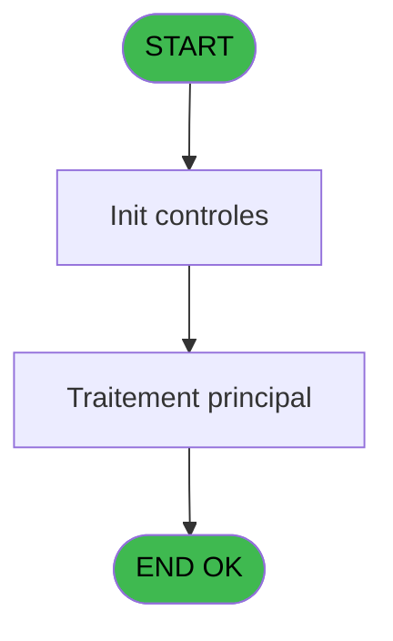
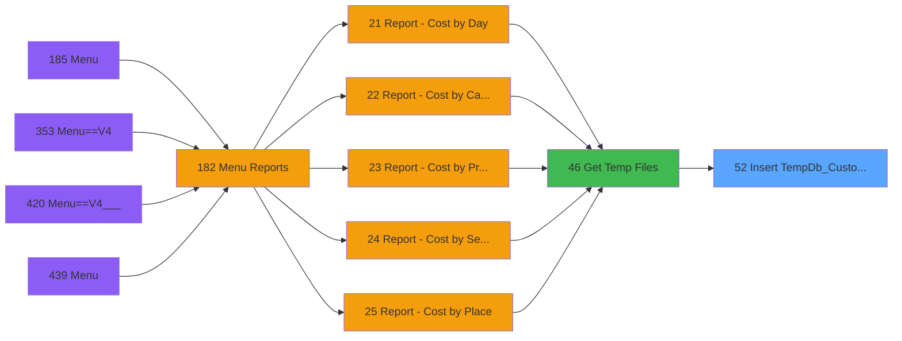

# PVE IDE 52 - Insert TempDb_Customer ARCH

> **Analyse**: Phases 1-4 2026-02-03 08:58 -> 08:58 (20s) | Assemblage 08:58
> **Pipeline**: V7.2 Enrichi
> **Structure**: 4 onglets (Resume | Ecrans | Donnees | Connexions)

<!-- TAB:Resume -->

## 1. FICHE D'IDENTITE

| Attribut | Valeur |
|----------|--------|
| Projet | PVE |
| IDE Position | 52 |
| Nom Programme | Insert TempDb_Customer ARCH |
| Fichier source | `Prg_52.xml` |
| Domaine metier | General |
| Taches | 1 (0 ecrans visibles) |
| Tables modifiees | 0 |
| Programmes appeles | 0 |

## 2. DESCRIPTION FONCTIONNELLE

**Insert TempDb_Customer ARCH** assure la gestion complete de ce processus, accessible depuis [Get Temp Files (IDE 46)](PVE-IDE-46.md).

Le flux de traitement s'organise en **1 blocs fonctionnels** :

- **Traitement** (1 tache) : traitements metier divers

## 3. BLOCS FONCTIONNELS

### 3.1 Traitement (1 tache)

Traitements internes.

---

#### 52 - (sans nom)

**Role** : Traitement interne.

## 5. REGLES METIER

*(Aucune regle metier identifiee)*

## 6. CONTEXTE

- **Appele par**: [Get Temp Files (IDE 46)](PVE-IDE-46.md)
- **Appelle**: 0 programmes | **Tables**: 0 (W:0 R:0 L:0) | **Taches**: 1 | **Expressions**: 5

<!-- TAB:Ecrans -->

## 8. ECRANS

*(Programme sans ecran visible)*

## 9. NAVIGATION

### 9.3 Structure hierarchique (1 tache)

| Position | Tache | Type | Dimensions | Bloc |
|----------|-------|------|------------|------|
| **52.1** | [**(sans nom)** (52)](#t1) | - | - | Traitement |

### 9.4 Algorigramme

> **Legende**: Vert = START/END OK | Rouge = END KO | Bleu = Decisions
> *Algorigramme auto-genere. Utiliser `/algorigramme` pour une synthese metier detaillee.*

<!-- TAB:Donnees -->

## 10. TABLES

### Tables utilisees (0)

| ID | Nom | Description | Type | R | W | L | Usages |
|----|-----|-------------|------|---|---|---|--------|

### Colonnes par table (0 / 0 tables avec colonnes identifiees)

## 11. VARIABLES

### 11.1 Parametres entrants (3)

Variables recues du programme appelant ([Get Temp Files (IDE 46)](PVE-IDE-46.md)).

| Lettre | Nom | Type | Usage dans |
|--------|-----|------|-----------|
| A | P.Nom Fichier Tempdb | Alpha | 1x parametre entrant |
| B | P Date Debut | Date | 1x parametre entrant |
| C | P Date Fin | Date | 1x parametre entrant |

### 11.2 Variables de session (1)

Variables persistantes pendant toute la session.

| Lettre | Nom | Type | Usage dans |
|--------|-----|------|-----------|
| D | v.Requete | Unicode | - |

## 12. EXPRESSIONS

**5 / 5 expressions decodees (100%)**

### 12.1 Repartition par type

| Type | Expressions | Regles |
|------|-------------|--------|
| FORMAT | 2 | 0 |
| CONDITION | 1 | 0 |
| CAST_LOGIQUE | 1 | 0 |
| STRING | 1 | 0 |

### 12.2 Expressions cles par type

#### FORMAT (2 expressions)

| Type | IDE | Expression | Regle |
|------|-----|------------|-------|
| FORMAT | 3 | `DStr(P Date Debut [B],'YYYYMMDD')` | - |
| FORMAT | 2 | `DStr(P Date Fin [C],'YYYYMMDD')` | - |

#### CONDITION (1 expressions)

| Type | IDE | Expression | Regle |
|------|-----|------------|-------|
| CONDITION | 4 | `StrBuild('insert into @1@ (
gm_societe ,
gm_compte ,
gm_filiation ,
xcust_id ,
gm_nom ,
gm_prenom ,
gm_sexe ,
gm_age ,
gm_din_skier_code ,
skier_type ,
snowboarder_type ,
damage_protection , 
deposit,
gmr_debut_sejour,
gmr_fin_sejour,
gmr_qualite)
select 
arc_gm_societe,
arc_gm_compte ,
arc_gm_filiation ,
arc_pos_id ,
arc_gm_nom ,
arc_gm_prenom ,
arc_gm_sexe ,
arc_gm_age ,
arc_gm_din_skier_code ,
arc_skier_type ,
arc_snowboarder_type ,
arc_damage_protection , 
arc_deposit,
arc_debut_sejour,
arc_fin_sejour,
arc_qualite  FROM dbo.arc_pv_customer_dat
INNER join dbo.arc_cafil008_dat
on
arc_gm_societe = arc_gmr_societe and 
arc_gm_compte = arc_gmr_code_gm and 
arc_gm_filiation = arc_gmr_filiation_villag 
where arc_gm_societe<>'''' and (arc_debut_sejour) < = ''@2@'' and (arc_fin_sejour) > = ''@3@''',ExpCalc('1'EXP),ExpCalc('2'EXP),ExpCalc('3'EXP))` | - |

#### CAST_LOGIQUE (1 expressions)

| Type | IDE | Expression | Regle |
|------|-----|------------|-------|
| CAST_LOGIQUE | 5 | `'TRUE'LOG` | - |

#### STRING (1 expressions)

| Type | IDE | Expression | Regle |
|------|-----|------------|-------|
| STRING | 1 | `Trim(P.Nom Fichier Tempdb [A])` | - |

<!-- TAB:Connexions -->

## 13. GRAPHE D'APPELS

### 13.1 Chaine depuis Main (Callers)

Main -> ... -> [Get Temp Files (IDE 46)](PVE-IDE-46.md) -> **Insert TempDb_Customer ARCH (IDE 52)**

### 13.2 Callers

| IDE | Nom Programme | Nb Appels |
|-----|---------------|-----------|
| [46](PVE-IDE-46.md) | Get Temp Files | 1 |

### 13.3 Callees (programmes appeles)

### 13.4 Detail Callees avec contexte

| IDE | Nom Programme | Appels | Contexte |
|-----|---------------|--------|----------|
| - | (aucun) | - | - |

## 14. RECOMMANDATIONS MIGRATION

### 14.1 Profil du programme

| Metrique | Valeur | Impact migration |
|----------|--------|-----------------|
| Lignes de logique | 8 | Programme compact |
| Expressions | 5 | Peu de logique |
| Tables WRITE | 0 | Impact faible |
| Sous-programmes | 0 | Peu de dependances |
| Ecrans visibles | 0 | Ecran unique ou traitement batch |
| Code desactive | 0% (0 / 8) | Code sain |
| Regles metier | 0 | Pas de regle identifiee |

### 14.2 Plan de migration par bloc

#### Traitement (1 tache: 0 ecran, 1 traitement)

- **Strategie** : 1 service(s) backend injectable(s) (Domain Services).
- Decomposer les taches en services unitaires testables.

### 14.3 Dependances critiques

| Dependance | Type | Appels | Impact |
|------------|------|--------|--------|

---
*Spec DETAILED generee par Pipeline V7.2 - 2026-02-03 08:58*
