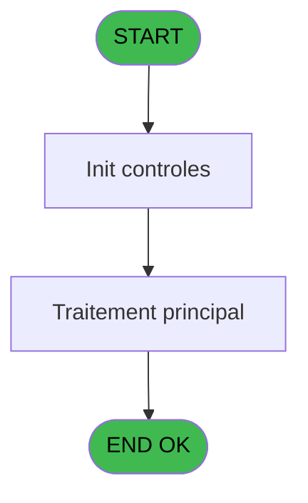
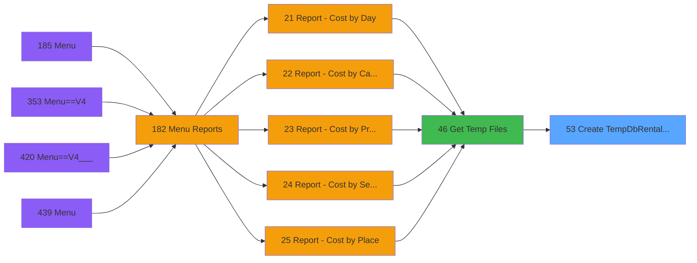

# PVE IDE 53 - Create TempDbRentals ARCH

> **Analyse**: Phases 1-4 2026-02-03 08:58 -> 08:59 (21s) | Assemblage 08:59
> **Pipeline**: V7.2 Enrichi
> **Structure**: 4 onglets (Resume | Ecrans | Donnees | Connexions)

<!-- TAB:Resume -->

## 1. FICHE D'IDENTITE

| Attribut | Valeur |
|----------|--------|
| Projet | PVE |
| IDE Position | 53 |
| Nom Programme | Create TempDbRentals ARCH |
| Fichier source | `Prg_53.xml` |
| Domaine metier | General |
| Taches | 2 (0 ecrans visibles) |
| Tables modifiees | 0 |
| Programmes appeles | 0 |

## 2. DESCRIPTION FONCTIONNELLE

**Create TempDbRentals ARCH** assure la gestion complete de ce processus, accessible depuis [Get Temp Files (IDE 46)](PVE-IDE-46.md).

Le flux de traitement s'organise en **2 blocs fonctionnels** :

- **Traitement** (1 tache) : traitements metier divers
- **Creation** (1 tache) : insertion d'enregistrements en base (mouvements, prestations)

**Logique metier** : 1 regles identifiees couvrant conditions metier.

Detail : phases du traitement

#### Phase 1 : Creation (1 tache)

- **53** - Create TempDbRentals ARCH **[[ECRAN]](#ecran-t1)**

#### Phase 2 : Traitement (1 tache)

- **53.1** - Rentals

## 3. BLOCS FONCTIONNELS

### 3.1 Creation (1 tache)

Insertion de nouveaux enregistrements en base.

---

#### 53 - Create TempDbRentals ARCH [[ECRAN]](#ecran-t1)

**Role** : Traitement : Create TempDbRentals ARCH.
**Ecran** : 625 x 0 DLU | [Voir mockup](#ecran-t1)

### 3.2 Traitement (1 tache)

Traitements internes.

---

#### 53.1 - Rentals

**Role** : Traitement : Rentals.

## 5. REGLES METIER

1 regles identifiees:

### Autres (1 regles)

#### [RM-001] Traitement si {1,2} est renseigne

| Element | Detail |
|---------|--------|
| **Condition** | `{1` |
| **Si vrai** | 2}<>'' |
| **Si faux** | ' and a.arc_pv_service IN ('&Trim({1,2})&')','') |
| **Expression source** | Expression 4 : `IF({1,2}<>'', ' and a.arc_pv_service IN ('&Trim({1,2})&')','` |
| **Exemple** | Si {1 → 2}<>''. Sinon → ' and a.arc_pv_service IN ('&Trim({1,2})&')','') |

## 6. CONTEXTE

- **Appele par**: [Get Temp Files (IDE 46)](PVE-IDE-46.md)
- **Appelle**: 0 programmes | **Tables**: 0 (W:0 R:0 L:0) | **Taches**: 2 | **Expressions**: 4

<!-- TAB:Ecrans -->

## 8. ECRANS

*(Programme sans ecran visible)*

## 9. NAVIGATION

### 9.3 Structure hierarchique (2 taches)

| Position | Tache | Type | Dimensions | Bloc |
|----------|-------|------|------------|------|
| **53.1** | [**Create TempDbRentals ARCH** (53)](#t1) [mockup](#ecran-t1) | - | 625x0 | Creation |
| **53.2** | [**Rentals** (53.1)](#t2) | - | - | Traitement |

### 9.4 Algorigramme

> **Legende**: Vert = START/END OK | Rouge = END KO | Bleu = Decisions
> *Algorigramme auto-genere. Utiliser `/algorigramme` pour une synthese metier detaillee.*

<!-- TAB:Donnees -->

## 10. TABLES

### Tables utilisees (0)

| ID | Nom | Description | Type | R | W | L | Usages |
|----|-----|-------------|------|---|---|---|--------|

### Colonnes par table (0 / 0 tables avec colonnes identifiees)

## 11. VARIABLES

### 11.1 Parametres entrants (4)

Variables recues du programme appelant ([Get Temp Files (IDE 46)](PVE-IDE-46.md)).

| Lettre | Nom | Type | Usage dans |
|--------|-----|------|-----------|
| A | P.Nom Fichier | Alpha | - |
| B | P.Liste Service | Alpha | - |
| C | P Date debut | Date | - |
| D | P Date Fin | Date | - |

## 12. EXPRESSIONS

**4 / 4 expressions decodees (100%)**

### 12.1 Repartition par type

| Type | Expressions | Regles |
|------|-------------|--------|
| CONDITION | 1 | 5 |
| FORMAT | 2 | 0 |
| STRING | 1 | 0 |

### 12.2 Expressions cles par type

#### CONDITION (1 expressions)

| Type | IDE | Expression | Regle |
|------|-----|------------|-------|
| CONDITION | 4 | `IF({1,2}<>'', ' and a.arc_pv_service IN ('&Trim({1,2})&')','')` | [RM-001](#rm-RM-001) |

#### FORMAT (2 expressions)

| Type | IDE | Expression | Regle |
|------|-----|------------|-------|
| FORMAT | 2 | `DStr({1,3},'YYYYMMDD')` | - |
| FORMAT | 1 | `DStr({1,4},'YYYYMMDD')` | - |

#### STRING (1 expressions)

| Type | IDE | Expression | Regle |
|------|-----|------------|-------|
| STRING | 3 | `Trim({1,1})` | - |

<!-- TAB:Connexions -->

## 13. GRAPHE D'APPELS

### 13.1 Chaine depuis Main (Callers)

Main -> ... -> [Get Temp Files (IDE 46)](PVE-IDE-46.md) -> **Create TempDbRentals ARCH (IDE 53)**

### 13.2 Callers

| IDE | Nom Programme | Nb Appels |
|-----|---------------|-----------|
| [46](PVE-IDE-46.md) | Get Temp Files | 1 |

### 13.3 Callees (programmes appeles)

### 13.4 Detail Callees avec contexte

| IDE | Nom Programme | Appels | Contexte |
|-----|---------------|--------|----------|
| - | (aucun) | - | - |

## 14. RECOMMANDATIONS MIGRATION

### 14.1 Profil du programme

| Metrique | Valeur | Impact migration |
|----------|--------|-----------------|
| Lignes de logique | 7 | Programme compact |
| Expressions | 4 | Peu de logique |
| Tables WRITE | 0 | Impact faible |
| Sous-programmes | 0 | Peu de dependances |
| Ecrans visibles | 0 | Ecran unique ou traitement batch |
| Code desactive | 0% (0 / 7) | Code sain |
| Regles metier | 1 | Quelques regles a preserver |

### 14.2 Plan de migration par bloc

#### Creation (1 tache: 1 ecran, 0 traitement)

- **Strategie** : Repository pattern avec Entity Framework Core.
- Insertion via `IRepository<T>.CreateAsync()`

#### Traitement (1 tache: 0 ecran, 1 traitement)

- **Strategie** : 1 service(s) backend injectable(s) (Domain Services).
- Decomposer les taches en services unitaires testables.

### 14.3 Dependances critiques

| Dependance | Type | Appels | Impact |
|------------|------|--------|--------|

---
*Spec DETAILED generee par Pipeline V7.2 - 2026-02-03 08:59*
