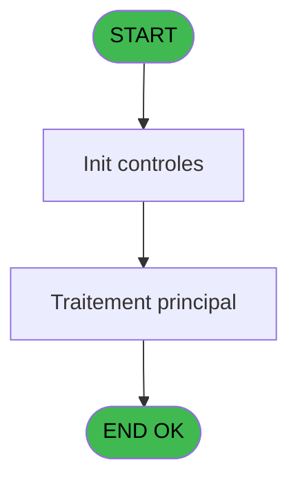
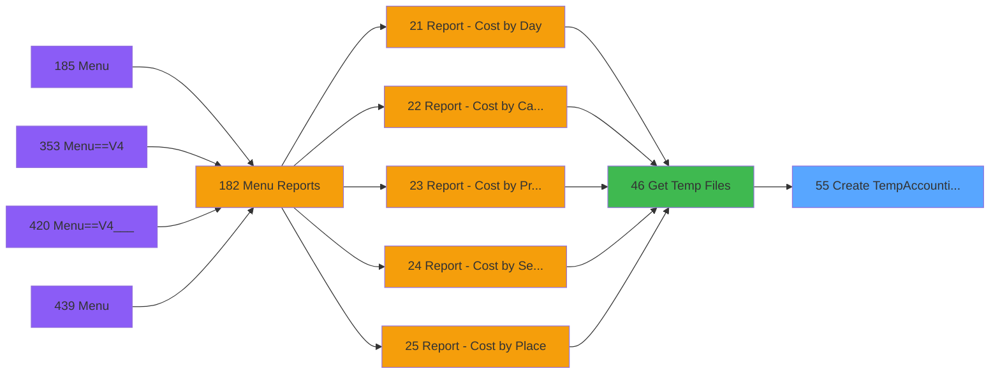

# PVE IDE 55 - Create TempAccounting ARCH

> **Analyse**: Phases 1-4 2026-02-03 08:59 -> 09:00 (20s) | Assemblage 09:00
> **Pipeline**: V7.2 Enrichi
> **Structure**: 4 onglets (Resume | Ecrans | Donnees | Connexions)

<!-- TAB:Resume -->

## 1. FICHE D'IDENTITE

| Attribut | Valeur |
|----------|--------|
| Projet | PVE |
| IDE Position | 55 |
| Nom Programme | Create TempAccounting ARCH |
| Fichier source | `Prg_55.xml` |
| Domaine metier | General |
| Taches | 4 (0 ecrans visibles) |
| Tables modifiees | 0 |
| Programmes appeles | 0 |

## 2. DESCRIPTION FONCTIONNELLE

**Create TempAccounting ARCH** assure la gestion complete de ce processus, accessible depuis [Get Temp Files (IDE 46)](PVE-IDE-46.md).

Le flux de traitement s'organise en **2 blocs fonctionnels** :

- **Creation** (3 taches) : insertion d'enregistrements en base (mouvements, prestations)
- **Traitement** (1 tache) : traitements metier divers

Detail : phases du traitement

#### Phase 1 : Creation (3 taches)

- **55** - Create TempAccounting ARCH **[[ECRAN]](#ecran-t1)**
- **55.2** - Accounting Sql Create
- **55.3** - Accounting Sql Create

#### Phase 2 : Traitement (1 tache)

- **55.1** - Delete Doublons

## 3. BLOCS FONCTIONNELS

### 3.1 Creation (3 taches)

Insertion de nouveaux enregistrements en base.

---

#### 55 - Create TempAccounting ARCH [[ECRAN]](#ecran-t1)

**Role** : Traitement : Create TempAccounting ARCH.
**Ecran** : 614 x 188 DLU | [Voir mockup](#ecran-t1)

---

#### 55.2 - Accounting Sql Create

**Role** : Traitement : Accounting Sql Create.

---

#### 55.3 - Accounting Sql Create

**Role** : Traitement : Accounting Sql Create.

### 3.2 Traitement (1 tache)

Traitements internes.

---

#### 55.1 - Delete Doublons

**Role** : Traitement : Delete Doublons.

## 5. REGLES METIER

*(Aucune regle metier identifiee)*

## 6. CONTEXTE

- **Appele par**: [Get Temp Files (IDE 46)](PVE-IDE-46.md)
- **Appelle**: 0 programmes | **Tables**: 0 (W:0 R:0 L:0) | **Taches**: 4 | **Expressions**: 2

<!-- TAB:Ecrans -->

## 8. ECRANS

*(Programme sans ecran visible)*

## 9. NAVIGATION

### 9.3 Structure hierarchique (4 taches)

| Position | Tache | Type | Dimensions | Bloc |
|----------|-------|------|------------|------|
| **55.1** | [**Create TempAccounting ARCH** (55)](#t1) [mockup](#ecran-t1) | - | 614x188 | Creation |
| 55.1.1 | [Accounting Sql Create (55.2)](#t3) | - | - | |
| 55.1.2 | [Accounting Sql Create (55.3)](#t4) | - | - | |
| **55.2** | [**Delete Doublons** (55.1)](#t2) | - | - | Traitement |

### 9.4 Algorigramme

> **Legende**: Vert = START/END OK | Rouge = END KO | Bleu = Decisions
> *Algorigramme auto-genere. Utiliser `/algorigramme` pour une synthese metier detaillee.*

<!-- TAB:Donnees -->

## 10. TABLES

### Tables utilisees (0)

| ID | Nom | Description | Type | R | W | L | Usages |
|----|-----|-------------|------|---|---|---|--------|

### Colonnes par table (0 / 0 tables avec colonnes identifiees)

## 11. VARIABLES

### 11.1 Parametres entrants (3)

Variables recues du programme appelant ([Get Temp Files (IDE 46)](PVE-IDE-46.md)).

| Lettre | Nom | Type | Usage dans |
|--------|-----|------|-----------|
| B | P.Liste Service | Alpha | 2x parametre entrant |
| C | P Date début | Date | - |
| D | P Date fin | Date | - |

### 11.2 Variables de session (1)

Variables persistantes pendant toute la session.

| Lettre | Nom | Type | Usage dans |
|--------|-----|------|-----------|
| E | v Clause Where | Alpha | - |

### 11.3 Autres (1)

Variables diverses.

| Lettre | Nom | Type | Usage dans |
|--------|-----|------|-----------|
| A | Nom Fichier | Alpha | - |

## 12. EXPRESSIONS

**2 / 2 expressions decodees (100%)**

### 12.1 Repartition par type

| Type | Expressions | Regles |
|------|-------------|--------|
| CONDITION | 1 | 0 |
| CONCATENATION | 1 | 0 |

### 12.2 Expressions cles par type

#### CONDITION (1 expressions)

| Type | IDE | Expression | Regle |
|------|-----|------------|-------|
| CONDITION | 2 | `P.Liste Service [B]<>''` | - |

#### CONCATENATION (1 expressions)

| Type | IDE | Expression | Regle |
|------|-----|------------|-------|
| CONCATENATION | 1 | `' and a.arc_pv_service IN ('&Trim(P.Liste Service [B])&')'` | - |

<!-- TAB:Connexions -->

## 13. GRAPHE D'APPELS

### 13.1 Chaine depuis Main (Callers)

Main -> ... -> [Get Temp Files (IDE 46)](PVE-IDE-46.md) -> **Create TempAccounting ARCH (IDE 55)**

### 13.2 Callers

| IDE | Nom Programme | Nb Appels |
|-----|---------------|-----------|
| [46](PVE-IDE-46.md) | Get Temp Files | 1 |

### 13.3 Callees (programmes appeles)

### 13.4 Detail Callees avec contexte

| IDE | Nom Programme | Appels | Contexte |
|-----|---------------|--------|----------|
| - | (aucun) | - | - |

## 14. RECOMMANDATIONS MIGRATION

### 14.1 Profil du programme

| Metrique | Valeur | Impact migration |
|----------|--------|-----------------|
| Lignes de logique | 15 | Programme compact |
| Expressions | 2 | Peu de logique |
| Tables WRITE | 0 | Impact faible |
| Sous-programmes | 0 | Peu de dependances |
| Ecrans visibles | 0 | Ecran unique ou traitement batch |
| Code desactive | 0% (0 / 15) | Code sain |
| Regles metier | 0 | Pas de regle identifiee |

### 14.2 Plan de migration par bloc

#### Creation (3 taches: 1 ecran, 2 traitements)

- **Strategie** : Repository pattern avec Entity Framework Core.
- Insertion via `IRepository<T>.CreateAsync()`

#### Traitement (1 tache: 0 ecran, 1 traitement)

- **Strategie** : 1 service(s) backend injectable(s) (Domain Services).
- Decomposer les taches en services unitaires testables.

### 14.3 Dependances critiques

| Dependance | Type | Appels | Impact |
|------------|------|--------|--------|

---
*Spec DETAILED generee par Pipeline V7.2 - 2026-02-03 09:00*
