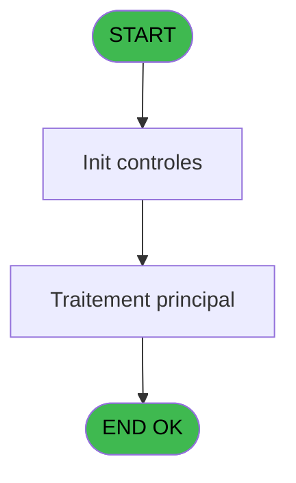
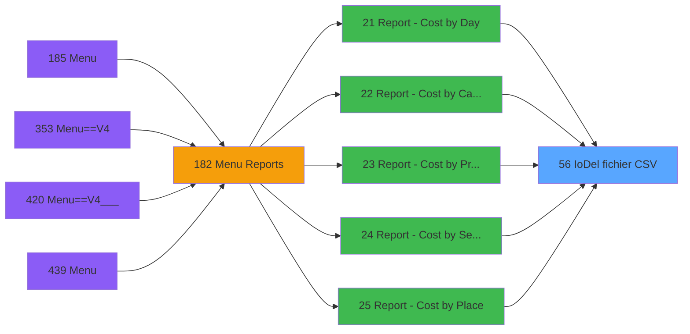

# PVE IDE 56 - IoDel fichier CSV

> **Analyse**: Phases 1-4 2026-02-03 09:00 -> 09:00 (20s) | Assemblage 09:00
> **Pipeline**: V7.2 Enrichi
> **Structure**: 4 onglets (Resume | Ecrans | Donnees | Connexions)

<!-- TAB:Resume -->

## 1. FICHE D'IDENTITE

| Attribut | Valeur |
|----------|--------|
| Projet | PVE |
| IDE Position | 56 |
| Nom Programme | IoDel fichier CSV |
| Fichier source | `Prg_56.xml` |
| Domaine metier | General |
| Taches | 1 (0 ecrans visibles) |
| Tables modifiees | 0 |
| Programmes appeles | 0 |

## 2. DESCRIPTION FONCTIONNELLE

**IoDel fichier CSV** assure la gestion complete de ce processus, accessible depuis [Report - Revenue by Place *NU* (IDE 421)](PVE-IDE-421.md), [Report - Revenue by Seller *NU (IDE 422)](PVE-IDE-422.md), [Report - Cost by Day (IDE 21)](PVE-IDE-21.md), [Report - Cost by Category (IDE 22)](PVE-IDE-22.md), [Report - Cost by Product (IDE 23)](PVE-IDE-23.md), [Report - Cost by Seller (IDE 24)](PVE-IDE-24.md), [Report - Cost by Place (IDE 25)](PVE-IDE-25.md), [Report - Margin by Seller (IDE 26)](PVE-IDE-26.md), [Print Log Packages (IDE 35)](PVE-IDE-35.md), [Report - Margin by Product (IDE 37)](PVE-IDE-37.md), [Report - Net Margin by Product (IDE 38)](PVE-IDE-38.md), [Report - Net Margin by Product (IDE 39)](PVE-IDE-39.md), [Report - Margin by Product (IDE 40)](PVE-IDE-40.md), [Report - Margin by Day (IDE 41)](PVE-IDE-41.md), [Report - Margin by Category (IDE 42)](PVE-IDE-42.md), [Report - Margin by Place (IDE 43)](PVE-IDE-43.md), [Print Deposit (IDE 64)](PVE-IDE-64.md), [Edition UPGRADE (IDE 72)](PVE-IDE-72.md), [Report - Revenue by product (IDE 73)](PVE-IDE-73.md), [Report - Revenue by Category (IDE 75)](PVE-IDE-75.md).

Le flux de traitement s'organise en **1 blocs fonctionnels** :

- **Traitement** (1 tache) : traitements metier divers

## 3. BLOCS FONCTIONNELS

### 3.1 Traitement (1 tache)

Traitements internes.

---

#### 56 - Set Village Address

**Role** : Traitement : Set Village Address.

## 5. REGLES METIER

*(Aucune regle metier identifiee)*

## 6. CONTEXTE

- **Appele par**: [Report - Revenue by Place *NU* (IDE 421)](PVE-IDE-421.md), [Report - Revenue by Seller *NU (IDE 422)](PVE-IDE-422.md), [Report - Cost by Day (IDE 21)](PVE-IDE-21.md), [Report - Cost by Category (IDE 22)](PVE-IDE-22.md), [Report - Cost by Product (IDE 23)](PVE-IDE-23.md), [Report - Cost by Seller (IDE 24)](PVE-IDE-24.md), [Report - Cost by Place (IDE 25)](PVE-IDE-25.md), [Report - Margin by Seller (IDE 26)](PVE-IDE-26.md), [Print Log Packages (IDE 35)](PVE-IDE-35.md), [Report - Margin by Product (IDE 37)](PVE-IDE-37.md), [Report - Net Margin by Product (IDE 38)](PVE-IDE-38.md), [Report - Net Margin by Product (IDE 39)](PVE-IDE-39.md), [Report - Margin by Product (IDE 40)](PVE-IDE-40.md), [Report - Margin by Day (IDE 41)](PVE-IDE-41.md), [Report - Margin by Category (IDE 42)](PVE-IDE-42.md), [Report - Margin by Place (IDE 43)](PVE-IDE-43.md), [Print Deposit (IDE 64)](PVE-IDE-64.md), [Edition UPGRADE (IDE 72)](PVE-IDE-72.md), [Report - Revenue by product (IDE 73)](PVE-IDE-73.md), [Report - Revenue by Category (IDE 75)](PVE-IDE-75.md)
- **Appelle**: 0 programmes | **Tables**: 0 (W:0 R:0 L:0) | **Taches**: 1 | **Expressions**: 1

<!-- TAB:Ecrans -->

## 8. ECRANS

*(Programme sans ecran visible)*

## 9. NAVIGATION

### 9.3 Structure hierarchique (1 tache)

| Position | Tache | Type | Dimensions | Bloc |
|----------|-------|------|------------|------|
| **56.1** | [**Set Village Address** (56)](#t1) | MDI | - | Traitement |

### 9.4 Algorigramme

> **Legende**: Vert = START/END OK | Rouge = END KO | Bleu = Decisions
> *Algorigramme auto-genere. Utiliser `/algorigramme` pour une synthese metier detaillee.*

<!-- TAB:Donnees -->

## 10. TABLES

### Tables utilisees (0)

| ID | Nom | Description | Type | R | W | L | Usages |
|----|-----|-------------|------|---|---|---|--------|

### Colonnes par table (0 / 0 tables avec colonnes identifiees)

## 11. VARIABLES

*(Programme sans variables locales mappees)*

## 12. EXPRESSIONS

**1 / 1 expressions decodees (100%)**

### 12.1 Repartition par type

| Type | Expressions | Regles |
|------|-------------|--------|
| STRING | 1 | 0 |

### 12.2 Expressions cles par type

#### STRING (1 expressions)

| Type | IDE | Expression | Regle |
|------|-----|------------|-------|
| STRING | 1 | `FileDelete (Trim (P. File CSV [A]))` | - |

<!-- TAB:Connexions -->

## 13. GRAPHE D'APPELS

### 13.1 Chaine depuis Main (Callers)

Main -> ... -> [Report - Revenue by Place *NU* (IDE 421)](PVE-IDE-421.md) -> **IoDel fichier CSV (IDE 56)**

Main -> ... -> [Report - Revenue by Seller *NU (IDE 422)](PVE-IDE-422.md) -> **IoDel fichier CSV (IDE 56)**

Main -> ... -> [Report - Cost by Day (IDE 21)](PVE-IDE-21.md) -> **IoDel fichier CSV (IDE 56)**

Main -> ... -> [Report - Cost by Category (IDE 22)](PVE-IDE-22.md) -> **IoDel fichier CSV (IDE 56)**

Main -> ... -> [Report - Cost by Product (IDE 23)](PVE-IDE-23.md) -> **IoDel fichier CSV (IDE 56)**

Main -> ... -> [Report - Cost by Seller (IDE 24)](PVE-IDE-24.md) -> **IoDel fichier CSV (IDE 56)**

Main -> ... -> [Report - Cost by Place (IDE 25)](PVE-IDE-25.md) -> **IoDel fichier CSV (IDE 56)**

Main -> ... -> [Report - Margin by Seller (IDE 26)](PVE-IDE-26.md) -> **IoDel fichier CSV (IDE 56)**

Main -> ... -> [Print Log Packages (IDE 35)](PVE-IDE-35.md) -> **IoDel fichier CSV (IDE 56)**

Main -> ... -> [Report - Margin by Product (IDE 37)](PVE-IDE-37.md) -> **IoDel fichier CSV (IDE 56)**

Main -> ... -> [Report - Net Margin by Product (IDE 38)](PVE-IDE-38.md) -> **IoDel fichier CSV (IDE 56)**

Main -> ... -> [Report - Net Margin by Product (IDE 39)](PVE-IDE-39.md) -> **IoDel fichier CSV (IDE 56)**

Main -> ... -> [Report - Margin by Product (IDE 40)](PVE-IDE-40.md) -> **IoDel fichier CSV (IDE 56)**

Main -> ... -> [Report - Margin by Day (IDE 41)](PVE-IDE-41.md) -> **IoDel fichier CSV (IDE 56)**

Main -> ... -> [Report - Margin by Category (IDE 42)](PVE-IDE-42.md) -> **IoDel fichier CSV (IDE 56)**

Main -> ... -> [Report - Margin by Place (IDE 43)](PVE-IDE-43.md) -> **IoDel fichier CSV (IDE 56)**

Main -> ... -> [Print Deposit (IDE 64)](PVE-IDE-64.md) -> **IoDel fichier CSV (IDE 56)**

Main -> ... -> [Edition UPGRADE (IDE 72)](PVE-IDE-72.md) -> **IoDel fichier CSV (IDE 56)**

Main -> ... -> [Report - Revenue by product (IDE 73)](PVE-IDE-73.md) -> **IoDel fichier CSV (IDE 56)**

Main -> ... -> [Report - Revenue by Category (IDE 75)](PVE-IDE-75.md) -> **IoDel fichier CSV (IDE 56)**

### 13.2 Callers

| IDE | Nom Programme | Nb Appels |
|-----|---------------|-----------|
| [421](PVE-IDE-421.md) | Report - Revenue by Place *NU* | 2 |
| [422](PVE-IDE-422.md) | Report - Revenue by Seller *NU | 2 |
| [21](PVE-IDE-21.md) | Report - Cost by Day | 1 |
| [22](PVE-IDE-22.md) | Report - Cost by Category | 1 |
| [23](PVE-IDE-23.md) | Report - Cost by Product | 1 |
| [24](PVE-IDE-24.md) | Report - Cost by Seller | 1 |
| [25](PVE-IDE-25.md) | Report - Cost by Place | 1 |
| [26](PVE-IDE-26.md) | Report - Margin by Seller | 1 |
| [35](PVE-IDE-35.md) | Print Log Packages | 1 |
| [37](PVE-IDE-37.md) | Report - Margin by Product | 1 |
| [38](PVE-IDE-38.md) | Report - Net Margin by Product | 1 |
| [39](PVE-IDE-39.md) | Report - Net Margin by Product | 1 |
| [40](PVE-IDE-40.md) | Report - Margin by Product | 1 |
| [41](PVE-IDE-41.md) | Report - Margin by Day | 1 |
| [42](PVE-IDE-42.md) | Report - Margin by Category | 1 |
| [43](PVE-IDE-43.md) | Report - Margin by Place | 1 |
| [64](PVE-IDE-64.md) | Print Deposit | 1 |
| [72](PVE-IDE-72.md) | Edition UPGRADE | 1 |
| [73](PVE-IDE-73.md) | Report - Revenue by product | 1 |
| [75](PVE-IDE-75.md) | Report - Revenue by Category | 1 |

### 13.3 Callees (programmes appeles)

### 13.4 Detail Callees avec contexte

| IDE | Nom Programme | Appels | Contexte |
|-----|---------------|--------|----------|
| - | (aucun) | - | - |

## 14. RECOMMANDATIONS MIGRATION

### 14.1 Profil du programme

| Metrique | Valeur | Impact migration |
|----------|--------|-----------------|
| Lignes de logique | 3 | Programme compact |
| Expressions | 1 | Peu de logique |
| Tables WRITE | 0 | Impact faible |
| Sous-programmes | 0 | Peu de dependances |
| Ecrans visibles | 0 | Ecran unique ou traitement batch |
| Code desactive | 0% (0 / 3) | Code sain |
| Regles metier | 0 | Pas de regle identifiee |

### 14.2 Plan de migration par bloc

#### Traitement (1 tache: 0 ecran, 1 traitement)

- **Strategie** : 1 service(s) backend injectable(s) (Domain Services).
- Decomposer les taches en services unitaires testables.

### 14.3 Dependances critiques

| Dependance | Type | Appels | Impact |
|------------|------|--------|--------|

---
*Spec DETAILED generee par Pipeline V7.2 - 2026-02-03 09:00*
