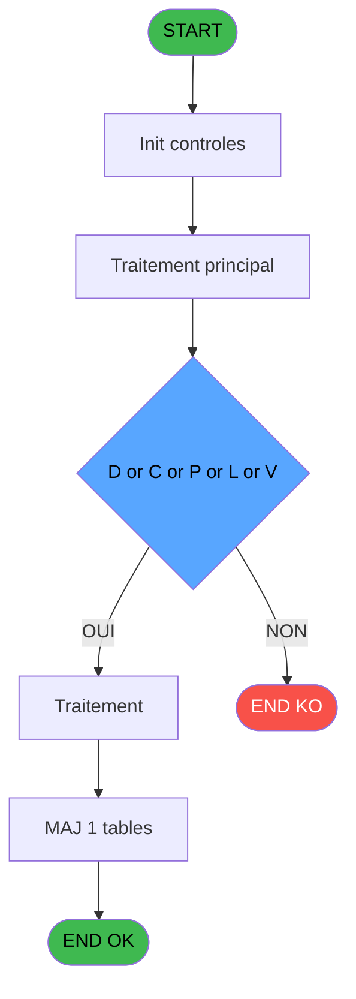
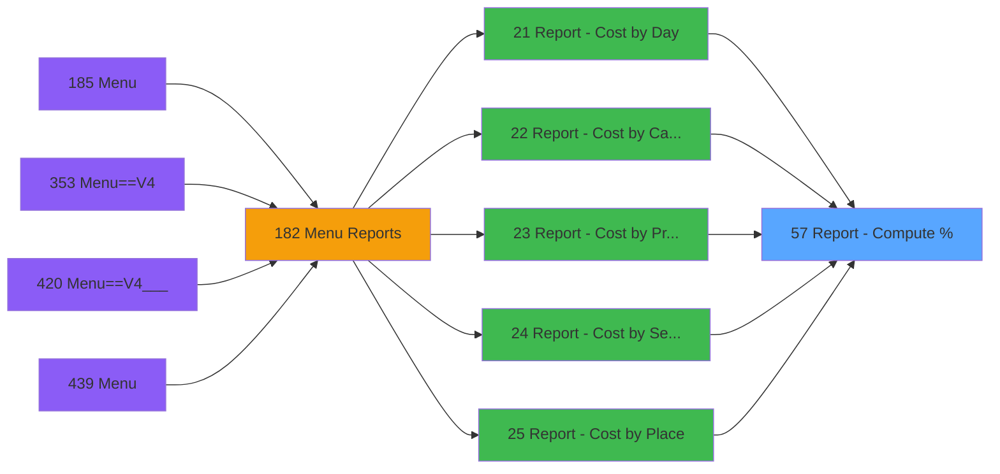

# PVE IDE 57 - Report - Compute %

> **Analyse**: Phases 1-4 2026-02-03 09:00 -> 09:01 (20s) | Assemblage 09:01
> **Pipeline**: V7.2 Enrichi
> **Structure**: 4 onglets (Resume | Ecrans | Donnees | Connexions)

<!-- TAB:Resume -->

## 1. FICHE D'IDENTITE

| Attribut | Valeur |
|----------|--------|
| Projet | PVE |
| IDE Position | 57 |
| Nom Programme | Report - Compute % |
| Fichier source | `Prg_57.xml` |
| Domaine metier | General |
| Taches | 1 (0 ecrans visibles) |
| Tables modifiees | 1 |
| Programmes appeles | 0 |

## 2. DESCRIPTION FONCTIONNELLE

**Report - Compute %** assure la gestion complete de ce processus, accessible depuis [Report - Cost by Day (IDE 21)](PVE-IDE-21.md), [Report - Cost by Category (IDE 22)](PVE-IDE-22.md), [Report - Cost by Product (IDE 23)](PVE-IDE-23.md), [Report - Cost by Seller (IDE 24)](PVE-IDE-24.md), [Report - Cost by Place (IDE 25)](PVE-IDE-25.md), [Report - Margin by Seller (IDE 26)](PVE-IDE-26.md), [Report - Margin by Product (IDE 37)](PVE-IDE-37.md), [Report - Net Margin by Product (IDE 38)](PVE-IDE-38.md), [Report - Net Margin by Product (IDE 39)](PVE-IDE-39.md), [Report - Margin by Product (IDE 40)](PVE-IDE-40.md), [Report - Margin by Day (IDE 41)](PVE-IDE-41.md), [Report - Margin by Category (IDE 42)](PVE-IDE-42.md), [Report - Margin by Place (IDE 43)](PVE-IDE-43.md), [Report - Cost by Day (IDE 369)](PVE-IDE-369.md), [Report - Cost by Place (IDE 370)](PVE-IDE-370.md), [Browse - Ref_Tables.product_pr (IDE 371)](PVE-IDE-371.md), [Report - Margin by Product (IDE 373)](PVE-IDE-373.md), [Report - Margin by Category (IDE 374)](PVE-IDE-374.md), [Report - Margin by Day (IDE 375)](PVE-IDE-375.md), [Report - Margin by Place (IDE 376)](PVE-IDE-376.md).

Le flux de traitement s'organise en **1 blocs fonctionnels** :

- **Traitement** (1 tache) : traitements metier divers

**Donnees modifiees** : 1 tables en ecriture (update_table_codes_log).

**Logique metier** : 1 regles identifiees couvrant conditions metier.

## 3. BLOCS FONCTIONNELS

### 3.1 Traitement (1 tache)

Traitements internes.

---

#### 57 - Compute

**Role** : Traitement : Compute.

## 5. REGLES METIER

1 regles identifiees:

### Autres (1 regles)

#### [RM-001] Traitement si P. D or C or P or L or V [C]='L',[H] est renseigne

| Element | Detail |
|---------|--------|
| **Condition** | `P. D or C or P or L or V [C]='L'` |
| **Si vrai** | [H]<>'' AND [H]<>'ZZZZZZ' |
| **Si faux** | IF(P. D or C or P or L or V [C]='C',[F]<>0 AND [F]<>99,IF(P. D or C or P or L or V [C]='D',[F]<>0 AND [F]<>766644,IF(P. D or C or P or L or V [C]='P',[F]<>0 AND [F]<>999999,IF(P. D or C or P or L or V [C]='V',[G]<>'' AND [G]<>'ZZZZZZZZ','TRUE'LOG))))) |
| **Variables** | C (P. D or C or P or L or V) |
| **Expression source** | Expression 6 : `IF(P. D or C or P or L or V [C]='L',[H]<>'' AND [H]<>'ZZZZZZ` |
| **Exemple** | Si P. D or C or P or L or V [C]='L' → [H]<>'' AND [H]<>'ZZZZZZ' |

## 6. CONTEXTE

- **Appele par**: [Report - Cost by Day (IDE 21)](PVE-IDE-21.md), [Report - Cost by Category (IDE 22)](PVE-IDE-22.md), [Report - Cost by Product (IDE 23)](PVE-IDE-23.md), [Report - Cost by Seller (IDE 24)](PVE-IDE-24.md), [Report - Cost by Place (IDE 25)](PVE-IDE-25.md), [Report - Margin by Seller (IDE 26)](PVE-IDE-26.md), [Report - Margin by Product (IDE 37)](PVE-IDE-37.md), [Report - Net Margin by Product (IDE 38)](PVE-IDE-38.md), [Report - Net Margin by Product (IDE 39)](PVE-IDE-39.md), [Report - Margin by Product (IDE 40)](PVE-IDE-40.md), [Report - Margin by Day (IDE 41)](PVE-IDE-41.md), [Report - Margin by Category (IDE 42)](PVE-IDE-42.md), [Report - Margin by Place (IDE 43)](PVE-IDE-43.md), [Report - Cost by Day (IDE 369)](PVE-IDE-369.md), [Report - Cost by Place (IDE 370)](PVE-IDE-370.md), [Browse - Ref_Tables.product_pr (IDE 371)](PVE-IDE-371.md), [Report - Margin by Product (IDE 373)](PVE-IDE-373.md), [Report - Margin by Category (IDE 374)](PVE-IDE-374.md), [Report - Margin by Day (IDE 375)](PVE-IDE-375.md), [Report - Margin by Place (IDE 376)](PVE-IDE-376.md)
- **Appelle**: 0 programmes | **Tables**: 1 (W:1 R:0 L:0) | **Taches**: 1 | **Expressions**: 6

<!-- TAB:Ecrans -->

## 8. ECRANS

*(Programme sans ecran visible)*

## 9. NAVIGATION

### 9.3 Structure hierarchique (1 tache)

| Position | Tache | Type | Dimensions | Bloc |
|----------|-------|------|------------|------|
| **57.1** | [**Compute** (57)](#t1) | MDI | - | Traitement |

### 9.4 Algorigramme

> **Legende**: Vert = START/END OK | Rouge = END KO | Bleu = Decisions
> *Algorigramme auto-genere. Utiliser `/algorigramme` pour une synthese metier detaillee.*

<!-- TAB:Donnees -->

## 10. TABLES

### Tables utilisees (1)

| ID | Nom | Description | Type | R | W | L | Usages |
|----|-----|-------------|------|---|---|---|--------|
| 524 | update_table_codes_log |  | TMP |   | **W** |   | 1 |

### Colonnes par table (1 / 1 tables avec colonnes identifiees)

Table 524 - update_table_codes_log (**W**) - 1 usages

| Lettre | Variable | Acces | Type |
|--------|----------|-------|------|
| A | P. Total Revenue | W | Numeric |
| B | P. Total Cost | W | Numeric |
| C | P. D or C or P or L or V | W | Alpha |

## 11. VARIABLES

### 11.1 Parametres entrants (3)

Variables recues du programme appelant ([Report - Cost by Day (IDE 21)](PVE-IDE-21.md)).

| Lettre | Nom | Type | Usage dans |
|--------|-----|------|-----------|
| A | P. Total Revenue | Numeric | 2x parametre entrant |
| B | P. Total Cost | Numeric | 2x parametre entrant |
| C | P. D or C or P or L or V | Alpha | 1x parametre entrant |

## 12. EXPRESSIONS

**6 / 6 expressions decodees (100%)**

### 12.1 Repartition par type

| Type | Expressions | Regles |
|------|-------------|--------|
| CALCUL | 3 | 0 |
| CALCULATION | 1 | 0 |
| CAST_LOGIQUE | 1 | 5 |
| OTHER | 1 | 0 |

### 12.2 Expressions cles par type

#### CALCUL (3 expressions)

| Type | IDE | Expression | Regle |
|------|-----|------------|-------|
| CALCUL | 5 | `[N]*100/(P. Total Revenue [A]-P. Total Cost [B])` | - |
| CALCUL | 3 | `[L]*100/P. Total Cost [B]` | - |
| CALCUL | 2 | `[J]*100/P. Total Revenue [A]` | - |

#### CALCULATION (1 expressions)

| Type | IDE | Expression | Regle |
|------|-----|------------|-------|
| CALCULATION | 4 | `[J]-[L]` | - |

#### CAST_LOGIQUE (1 expressions)

| Type | IDE | Expression | Regle |
|------|-----|------------|-------|
| CAST_LOGIQUE | 6 | `IF(P. D or C or P or L or V [C]='L',[H]<>'' AND [H]<>'ZZZZZZ',IF(P. D or C or P or L or V [C]='C',[F]<>0 AND [F]<>99,IF(P. D or C or P or L or V [C]='D',[F]<>0 AND [F]<>766644,IF(P. D or C or P or L or V [C]='P',[F]<>0 AND [F]<>999999,IF(P. D or C or P or L or V [C]='V',[G]<>'' AND [G]<>'ZZZZZZZZ','TRUE'LOG)))))` | [RM-001](#rm-RM-001) |

#### OTHER (1 expressions)

| Type | IDE | Expression | Regle |
|------|-----|------------|-------|
| OTHER | 1 | `GetParam ('SERVICE')` | - |

<!-- TAB:Connexions -->

## 13. GRAPHE D'APPELS

### 13.1 Chaine depuis Main (Callers)

Main -> ... -> [Report - Cost by Day (IDE 21)](PVE-IDE-21.md) -> **Report - Compute % (IDE 57)**

Main -> ... -> [Report - Cost by Category (IDE 22)](PVE-IDE-22.md) -> **Report - Compute % (IDE 57)**

Main -> ... -> [Report - Cost by Product (IDE 23)](PVE-IDE-23.md) -> **Report - Compute % (IDE 57)**

Main -> ... -> [Report - Cost by Seller (IDE 24)](PVE-IDE-24.md) -> **Report - Compute % (IDE 57)**

Main -> ... -> [Report - Cost by Place (IDE 25)](PVE-IDE-25.md) -> **Report - Compute % (IDE 57)**

Main -> ... -> [Report - Margin by Seller (IDE 26)](PVE-IDE-26.md) -> **Report - Compute % (IDE 57)**

Main -> ... -> [Report - Margin by Product (IDE 37)](PVE-IDE-37.md) -> **Report - Compute % (IDE 57)**

Main -> ... -> [Report - Net Margin by Product (IDE 38)](PVE-IDE-38.md) -> **Report - Compute % (IDE 57)**

Main -> ... -> [Report - Net Margin by Product (IDE 39)](PVE-IDE-39.md) -> **Report - Compute % (IDE 57)**

Main -> ... -> [Report - Margin by Product (IDE 40)](PVE-IDE-40.md) -> **Report - Compute % (IDE 57)**

Main -> ... -> [Report - Margin by Day (IDE 41)](PVE-IDE-41.md) -> **Report - Compute % (IDE 57)**

Main -> ... -> [Report - Margin by Category (IDE 42)](PVE-IDE-42.md) -> **Report - Compute % (IDE 57)**

Main -> ... -> [Report - Margin by Place (IDE 43)](PVE-IDE-43.md) -> **Report - Compute % (IDE 57)**

Main -> ... -> [Report - Cost by Day (IDE 369)](PVE-IDE-369.md) -> **Report - Compute % (IDE 57)**

Main -> ... -> [Report - Cost by Place (IDE 370)](PVE-IDE-370.md) -> **Report - Compute % (IDE 57)**

Main -> ... -> [Browse - Ref_Tables.product_pr (IDE 371)](PVE-IDE-371.md) -> **Report - Compute % (IDE 57)**

Main -> ... -> [Report - Margin by Product (IDE 373)](PVE-IDE-373.md) -> **Report - Compute % (IDE 57)**

Main -> ... -> [Report - Margin by Category (IDE 374)](PVE-IDE-374.md) -> **Report - Compute % (IDE 57)**

Main -> ... -> [Report - Margin by Day (IDE 375)](PVE-IDE-375.md) -> **Report - Compute % (IDE 57)**

Main -> ... -> [Report - Margin by Place (IDE 376)](PVE-IDE-376.md) -> **Report - Compute % (IDE 57)**

### 13.2 Callers

| IDE | Nom Programme | Nb Appels |
|-----|---------------|-----------|
| [21](PVE-IDE-21.md) | Report - Cost by Day | 1 |
| [22](PVE-IDE-22.md) | Report - Cost by Category | 1 |
| [23](PVE-IDE-23.md) | Report - Cost by Product | 1 |
| [24](PVE-IDE-24.md) | Report - Cost by Seller | 1 |
| [25](PVE-IDE-25.md) | Report - Cost by Place | 1 |
| [26](PVE-IDE-26.md) | Report - Margin by Seller | 1 |
| [37](PVE-IDE-37.md) | Report - Margin by Product | 1 |
| [38](PVE-IDE-38.md) | Report - Net Margin by Product | 1 |
| [39](PVE-IDE-39.md) | Report - Net Margin by Product | 1 |
| [40](PVE-IDE-40.md) | Report - Margin by Product | 1 |
| [41](PVE-IDE-41.md) | Report - Margin by Day | 1 |
| [42](PVE-IDE-42.md) | Report - Margin by Category | 1 |
| [43](PVE-IDE-43.md) | Report - Margin by Place | 1 |
| [369](PVE-IDE-369.md) | Report - Cost by Day | 1 |
| [370](PVE-IDE-370.md) | Report - Cost by Place | 1 |
| [371](PVE-IDE-371.md) | Browse - Ref_Tables.product_pr | 1 |
| [373](PVE-IDE-373.md) | Report - Margin by Product | 1 |
| [374](PVE-IDE-374.md) | Report - Margin by Category | 1 |
| [375](PVE-IDE-375.md) | Report - Margin by Day | 1 |
| [376](PVE-IDE-376.md) | Report - Margin by Place | 1 |

### 13.3 Callees (programmes appeles)

### 13.4 Detail Callees avec contexte

| IDE | Nom Programme | Appels | Contexte |
|-----|---------------|--------|----------|
| - | (aucun) | - | - |

## 14. RECOMMANDATIONS MIGRATION

### 14.1 Profil du programme

| Metrique | Valeur | Impact migration |
|----------|--------|-----------------|
| Lignes de logique | 25 | Programme compact |
| Expressions | 6 | Peu de logique |
| Tables WRITE | 1 | Impact faible |
| Sous-programmes | 0 | Peu de dependances |
| Ecrans visibles | 0 | Ecran unique ou traitement batch |
| Code desactive | 0% (0 / 25) | Code sain |
| Regles metier | 1 | Quelques regles a preserver |

### 14.2 Plan de migration par bloc

#### Traitement (1 tache: 0 ecran, 1 traitement)

- **Strategie** : 1 service(s) backend injectable(s) (Domain Services).
- Decomposer les taches en services unitaires testables.

### 14.3 Dependances critiques

| Dependance | Type | Appels | Impact |
|------------|------|--------|--------|
| update_table_codes_log | Table WRITE (Temp) | 1x | Schema + repository |

---
*Spec DETAILED generee par Pipeline V7.2 - 2026-02-03 09:01*
