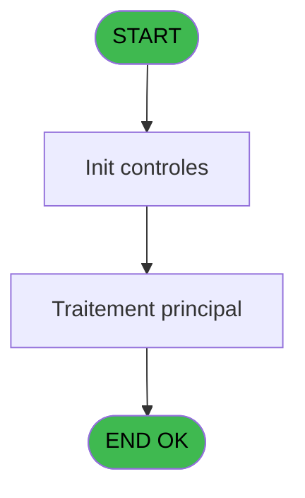
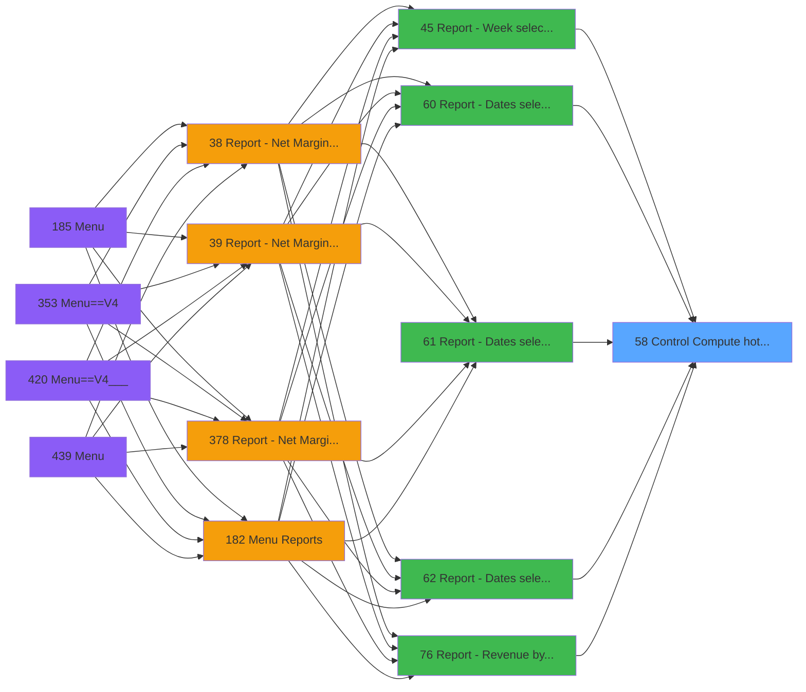

# PVE IDE 58 - Control & Compute hotel days

> **Analyse**: Phases 1-4 2026-02-03 09:01 -> 09:01 (21s) | Assemblage 09:01
> **Pipeline**: V7.2 Enrichi
> **Structure**: 4 onglets (Resume | Ecrans | Donnees | Connexions)

<!-- TAB:Resume -->

## 1. FICHE D'IDENTITE

| Attribut | Valeur |
|----------|--------|
| Projet | PVE |
| IDE Position | 58 |
| Nom Programme | Control & Compute hotel days |
| Fichier source | `Prg_58.xml` |
| Domaine metier | General |
| Taches | 1 (0 ecrans visibles) |
| Tables modifiees | 0 |
| Programmes appeles | 0 |

## 2. DESCRIPTION FONCTIONNELLE

**Control & Compute hotel days** assure la gestion complete de ce processus, accessible depuis [Report - Week selection (IDE 45)](PVE-IDE-45.md), [Report - Dates selection&Print (IDE 60)](PVE-IDE-60.md), [Report - Dates selec&Print-719 (IDE 61)](PVE-IDE-61.md), [Report - Dates selection&PREPA (IDE 62)](PVE-IDE-62.md), [Report - Revenue by Seller (IDE 76)](PVE-IDE-76.md), [Report - Revenue by Place (IDE 77)](PVE-IDE-77.md), [Ecran Prepaid Income GEST (IDE 82)](PVE-IDE-82.md), [Report - Category selection (IDE 91)](PVE-IDE-91.md), [Report - Category selection (IDE 394)](PVE-IDE-394.md), [Report - Revenue by Seller NEW (IDE 406)](PVE-IDE-406.md).

Le flux de traitement s'organise en **1 blocs fonctionnels** :

- **Traitement** (1 tache) : traitements metier divers

**Logique metier** : 3 regles identifiees couvrant conditions metier, valeurs par defaut.

## 3. BLOCS FONCTIONNELS

### 3.1 Traitement (1 tache)

Traitements internes.

---

#### 58 - Computing ... [[ECRAN]](#ecran-t1)

**Role** : Traitement : Computing ....
**Ecran** : 307 x 148 DLU (MDI) | [Voir mockup](#ecran-t1)

## 5. REGLES METIER

3 regles identifiees:

### Autres (3 regles)

#### [RM-001] Traitement conditionnel si V Date en cours [F] est a zero

| Element | Detail |
|---------|--------|
| **Condition** | `V Date en cours [F]=0` |
| **Si vrai** | P. Date début [A] |
| **Si faux** | V Date en cours [F]+1) |
| **Variables** | A (P. Date début), F (V Date en cours) |
| **Expression source** | Expression 1 : `IF (V Date en cours [F]=0,P. Date début [A],V Date en cours ` |
| **Exemple** | Si V Date en cours [F]=0 → P. Date début [A]. Sinon → V Date en cours [F]+1) |

#### [RM-002] Valeur par defaut si P. Dates en anomalie [E] est vide

| Element | Detail |
|---------|--------|
| **Condition** | `P. Dates en anomalie [E]=''` |
| **Si vrai** | '' |
| **Si faux** | RTrim(P. Dates en anomalie [E]) & ', ') & [M] |
| **Variables** | E (P. Dates en anomalie) |
| **Expression source** | Expression 9 : `IF(P. Dates en anomalie [E]='', '', RTrim(P. Dates en anomal` |
| **Exemple** | Si P. Dates en anomalie [E]='' → ''. Sinon → RTrim(P. Dates en anomalie [E]) & ', ') & [M] |

#### [RM-003] Si [K]=[L] alors DStr([K] sinon '##/##/##'), DStr([K], '##/##/##') & '-' & DStr([L], '##/##/##'))

| Element | Detail |
|---------|--------|
| **Condition** | `[K]=[L]` |
| **Si vrai** | DStr([K] |
| **Si faux** | '##/##/##'), DStr([K], '##/##/##') & '-' & DStr([L], '##/##/##')) |
| **Expression source** | Expression 12 : `IF([K]=[L], DStr([K], '##/##/##'), DStr([K], '##/##/##') & '` |
| **Exemple** | Si [K]=[L] → DStr([K] |

## 6. CONTEXTE

- **Appele par**: [Report - Week selection (IDE 45)](PVE-IDE-45.md), [Report - Dates selection&Print (IDE 60)](PVE-IDE-60.md), [Report - Dates selec&Print-719 (IDE 61)](PVE-IDE-61.md), [Report - Dates selection&PREPA (IDE 62)](PVE-IDE-62.md), [Report - Revenue by Seller (IDE 76)](PVE-IDE-76.md), [Report - Revenue by Place (IDE 77)](PVE-IDE-77.md), [Ecran Prepaid Income GEST (IDE 82)](PVE-IDE-82.md), [Report - Category selection (IDE 91)](PVE-IDE-91.md), [Report - Category selection (IDE 394)](PVE-IDE-394.md), [Report - Revenue by Seller NEW (IDE 406)](PVE-IDE-406.md)
- **Appelle**: 0 programmes | **Tables**: 1 (W:0 R:1 L:0) | **Taches**: 1 | **Expressions**: 13

<!-- TAB:Ecrans -->

## 8. ECRANS

*(Programme sans ecran visible)*

## 9. NAVIGATION

### 9.3 Structure hierarchique (1 tache)

| Position | Tache | Type | Dimensions | Bloc |
|----------|-------|------|------------|------|
| **58.1** | [**Computing ...** (58)](#t1) [mockup](#ecran-t1) | MDI | 307x148 | Traitement |

### 9.4 Algorigramme

> **Legende**: Vert = START/END OK | Rouge = END KO | Bleu = Decisions
> *Algorigramme auto-genere. Utiliser `/algorigramme` pour une synthese metier detaillee.*

<!-- TAB:Donnees -->

## 10. TABLES

### Tables utilisees (1)

| ID | Nom | Description | Type | R | W | L | Usages |
|----|-----|-------------|------|---|---|---|--------|
| 392 | pv_invoicehistoline | Historique / journal | DB | R |   |   | 1 |

### Colonnes par table (1 / 1 tables avec colonnes identifiees)

Table 392 - pv_invoicehistoline (R) - 1 usages

| Lettre | Variable | Acces | Type |
|--------|----------|-------|------|
| A | P. Date début | R | Date |
| B | P. Date fin | R | Date |
| C | P. Période nombre JH | R | Numeric |
| D | P. Jours période | R | Numeric |
| E | P. Dates en anomalie | R | Unicode |
| F | V Date en cours | R | Date |
| G | v.Date trouvée ? | R | Logical |
| H | v.Période anomalie début | R | Date |
| I | v.Date anomalie précédente | R | Date |
| J | v.Date/période annomalie | R | Unicode |

## 11. VARIABLES

### 11.1 Parametres entrants (5)

Variables recues du programme appelant ([Report - Week selection (IDE 45)](PVE-IDE-45.md)).

| Lettre | Nom | Type | Usage dans |
|--------|-----|------|-----------|
| A | P. Date début | Date | 1x parametre entrant |
| B | P. Date fin | Date | 1x parametre entrant |
| C | P. Période nombre JH | Numeric | 1x parametre entrant |
| D | P. Jours période | Numeric | 1x parametre entrant |
| E | P. Dates en anomalie | Unicode | 1x parametre entrant |

### 11.2 Variables de session (5)

Variables persistantes pendant toute la session.

| Lettre | Nom | Type | Usage dans |
|--------|-----|------|-----------|
| F | V Date en cours | Date | 5x session |
| G | v.Date trouvée ? | Logical | 1x session |
| H | v.Période anomalie début | Date | - |
| I | v.Date anomalie précédente | Date | - |
| J | v.Date/période annomalie | Unicode | 2x session |

## 12. EXPRESSIONS

**13 / 13 expressions decodees (100%)**

### 12.1 Repartition par type

| Type | Expressions | Regles |
|------|-------------|--------|
| CALCULATION | 2 | 0 |
| CONDITION | 7 | 3 |
| CONSTANTE | 2 | 0 |
| OTHER | 2 | 0 |

### 12.2 Expressions cles par type

#### CALCULATION (2 expressions)

| Type | IDE | Expression | Regle |
|------|-----|------------|-------|
| CALCULATION | 5 | `P. Jours période [D]+1` | - |
| CALCULATION | 4 | `P. Période nombre JH [C]+v.Date/période annomalie [J]` | - |

#### CONDITION (7 expressions)

| Type | IDE | Expression | Regle |
|------|-----|------------|-------|
| CONDITION | 1 | `IF (V Date en cours [F]=0,P. Date début [A],V Date en cours [F]+1)` | [RM-001](#rm-RM-001) |
| CONDITION | 12 | `IF([K]=[L], DStr([K], '##/##/##'), DStr([K], '##/##/##') & '-' & DStr([L], '##/##/##'))` | [RM-003](#rm-RM-003) |
| CONDITION | 9 | `IF(P. Dates en anomalie [E]='', '', RTrim(P. Dates en anomalie [E]) & ', ') & [M]` | [RM-002](#rm-RM-002) |
| CONDITION | 7 | `V Date en cours [F]=P. Date fin [B]` | - |
| CONDITION | 6 | `v.Date/période annomalie [J]=0 OR NOT (v.Date trouvée ? [G])` | - |
| ... | | *+2 autres* | |

#### CONSTANTE (2 expressions)

| Type | IDE | Expression | Regle |
|------|-----|------------|-------|
| CONSTANTE | 8 | `''` | - |
| CONSTANTE | 2 | `''` | - |

#### OTHER (2 expressions)

| Type | IDE | Expression | Regle |
|------|-----|------------|-------|
| OTHER | 11 | `V Date en cours [F]` | - |
| OTHER | 3 | `V Date en cours [F]` | - |

<!-- TAB:Connexions -->

## 13. GRAPHE D'APPELS

### 13.1 Chaine depuis Main (Callers)

Main -> ... -> [Report - Week selection (IDE 45)](PVE-IDE-45.md) -> **Control & Compute hotel days (IDE 58)**

Main -> ... -> [Report - Dates selection&Print (IDE 60)](PVE-IDE-60.md) -> **Control & Compute hotel days (IDE 58)**

Main -> ... -> [Report - Dates selec&Print-719 (IDE 61)](PVE-IDE-61.md) -> **Control & Compute hotel days (IDE 58)**

Main -> ... -> [Report - Dates selection&PREPA (IDE 62)](PVE-IDE-62.md) -> **Control & Compute hotel days (IDE 58)**

Main -> ... -> [Report - Revenue by Seller (IDE 76)](PVE-IDE-76.md) -> **Control & Compute hotel days (IDE 58)**

Main -> ... -> [Report - Revenue by Place (IDE 77)](PVE-IDE-77.md) -> **Control & Compute hotel days (IDE 58)**

Main -> ... -> [Ecran Prepaid Income GEST (IDE 82)](PVE-IDE-82.md) -> **Control & Compute hotel days (IDE 58)**

Main -> ... -> [Report - Category selection (IDE 91)](PVE-IDE-91.md) -> **Control & Compute hotel days (IDE 58)**

Main -> ... -> [Report - Category selection (IDE 394)](PVE-IDE-394.md) -> **Control & Compute hotel days (IDE 58)**

Main -> ... -> [Report - Revenue by Seller NEW (IDE 406)](PVE-IDE-406.md) -> **Control & Compute hotel days (IDE 58)**

### 13.2 Callers

| IDE | Nom Programme | Nb Appels |
|-----|---------------|-----------|
| [45](PVE-IDE-45.md) | Report - Week selection | 1 |
| [60](PVE-IDE-60.md) | Report - Dates selection&Print | 1 |
| [61](PVE-IDE-61.md) | Report - Dates selec&Print-719 | 1 |
| [62](PVE-IDE-62.md) | Report - Dates selection&PREPA | 1 |
| [76](PVE-IDE-76.md) | Report - Revenue by Seller | 1 |
| [77](PVE-IDE-77.md) | Report - Revenue by Place | 1 |
| [82](PVE-IDE-82.md) | Ecran Prepaid Income GEST | 1 |
| [91](PVE-IDE-91.md) | Report - Category selection | 1 |
| [394](PVE-IDE-394.md) | Report - Category selection | 1 |
| [406](PVE-IDE-406.md) | Report - Revenue by Seller NEW | 1 |

### 13.3 Callees (programmes appeles)

### 13.4 Detail Callees avec contexte

| IDE | Nom Programme | Appels | Contexte |
|-----|---------------|--------|----------|
| - | (aucun) | - | - |

## 14. RECOMMANDATIONS MIGRATION

### 14.1 Profil du programme

| Metrique | Valeur | Impact migration |
|----------|--------|-----------------|
| Lignes de logique | 37 | Programme compact |
| Expressions | 13 | Peu de logique |
| Tables WRITE | 0 | Impact faible |
| Sous-programmes | 0 | Peu de dependances |
| Ecrans visibles | 0 | Ecran unique ou traitement batch |
| Code desactive | 0% (0 / 37) | Code sain |
| Regles metier | 3 | Quelques regles a preserver |

### 14.2 Plan de migration par bloc

#### Traitement (1 tache: 1 ecran, 0 traitement)

- **Strategie** : 1 composant(s) UI (Razor/React) avec formulaires et validation.
- Decomposer les taches en services unitaires testables.

### 14.3 Dependances critiques

| Dependance | Type | Appels | Impact |
|------------|------|--------|--------|

---
*Spec DETAILED generee par Pipeline V7.2 - 2026-02-03 09:01*
