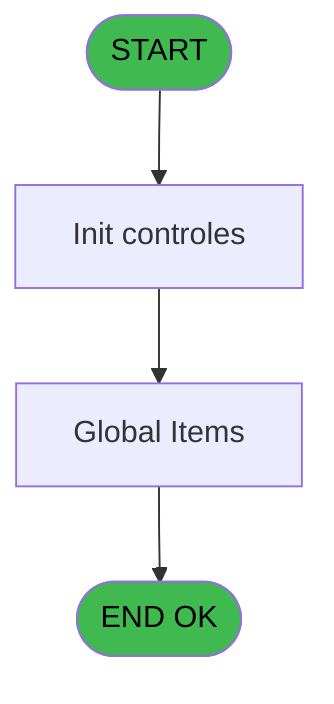
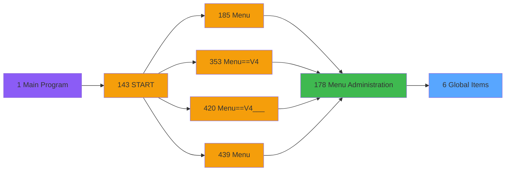
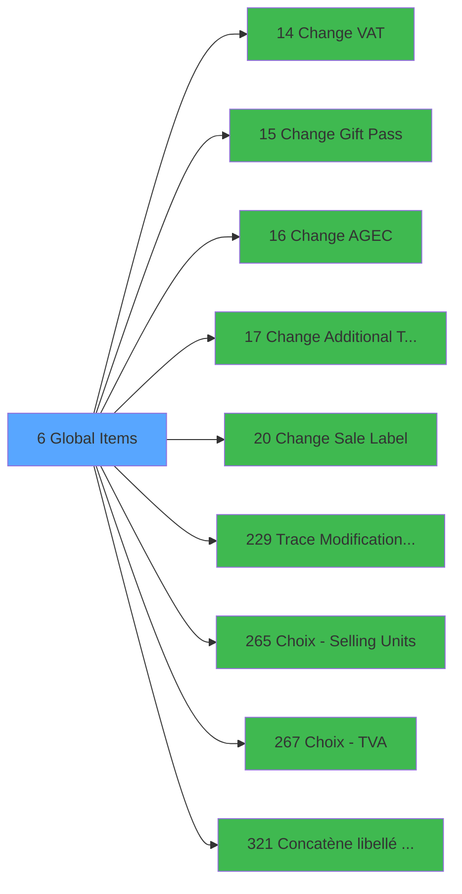

# PVE IDE 6 - Global Items

> **Analyse**: Phases 1-4 2026-02-03 00:54 -> 00:55 (36s) | Assemblage 00:55
> **Pipeline**: V7.2 Enrichi
> **Structure**: 4 onglets (Resume | Ecrans | Donnees | Connexions)

<!-- TAB:Resume -->

## 1. FICHE D'IDENTITE

| Attribut | Valeur |
|----------|--------|
| Projet | PVE |
| IDE Position | 6 |
| Nom Programme | Global Items |
| Fichier source | `Prg_6.xml` |
| Domaine metier | General |
| Taches | 3 (1 ecrans visibles) |
| Tables modifiees | 0 |
| Programmes appeles | 9 |

## 2. DESCRIPTION FONCTIONNELLE

**Global Items** assure la gestion complete de ce processus, accessible depuis [Menu Administration (IDE 178)](PVE-IDE-178.md).

Le flux de traitement s'organise en **1 blocs fonctionnels** :

- **Traitement** (3 taches) : traitements metier divers

## 3. BLOCS FONCTIONNELS

### 3.1 Traitement (3 taches)

Traitements internes.

---

#### 6 - Global Items [[ECRAN]](#ecran-t1)

**Role** : Traitement : Global Items.
**Ecran** : 195 x 17 DLU (MDI) | [Voir mockup](#ecran-t1)
**Delegue a** : [Change VAT (IDE 14)](PVE-IDE-14.md), [Change Gift Pass (IDE 15)](PVE-IDE-15.md), [Change AGEC (IDE 16)](PVE-IDE-16.md)

---

#### 6.1 - Global Items [[ECRAN]](#ecran-t2)

**Role** : Traitement : Global Items.
**Ecran** : 1262 x 396 DLU (MDI) | [Voir mockup](#ecran-t2)
**Delegue a** : [Change VAT (IDE 14)](PVE-IDE-14.md), [Change Gift Pass (IDE 15)](PVE-IDE-15.md), [Change AGEC (IDE 16)](PVE-IDE-16.md)

---

#### 6.1.1 - Mode

**Role** : Traitement : Mode.
**Variables liees** : C (V Mode)
**Delegue a** : [Change VAT (IDE 14)](PVE-IDE-14.md), [Change Gift Pass (IDE 15)](PVE-IDE-15.md), [Change AGEC (IDE 16)](PVE-IDE-16.md)

## 5. REGLES METIER

*(Aucune regle metier identifiee)*

## 6. CONTEXTE

- **Appele par**: [Menu Administration (IDE 178)](PVE-IDE-178.md)
- **Appelle**: 9 programmes | **Tables**: 5 (W:0 R:2 L:3) | **Taches**: 3 | **Expressions**: 10

<!-- TAB:Ecrans -->

## 8. ECRANS

### 8.1 Forms visibles (1 / 3)

| # | Position | Tache | Nom | Type | Largeur | Hauteur | Bloc |
|---|----------|-------|-----|------|---------|---------|------|
| 1 | 6.1 | 6.1 | Global Items | MDI | 1262 | 396 | Traitement |

### 8.2 Mockups Ecrans

---

#### 6.1 - Global Items
**Tache** : [6.1](#t2) | **Type** : MDI | **Dimensions** : 1262 x 396 DLU
**Bloc** : Traitement | **Titre IDE** : Global Items

<!-- FORM-DATA:
{
    "width":  1262,
    "vFactor":  8,
    "type":  "MDI",
    "hFactor":  4,
    "controls":  [
                     {
                         "x":  1,
                         "type":  "label",
                         "var":  "",
                         "y":  47,
                         "w":  1256,
                         "fmt":  "",
                         "name":  "",
                         "h":  18,
                         "color":  "",
                         "text":  "",
                         "parent":  null
                     },
                     {
                         "x":  703,
                         "type":  "label",
                         "var":  "",
                         "y":  51,
                         "w":  51,
                         "fmt":  "",
                         "name":  "",
                         "h":  10,
                         "color":  "142",
                         "text":  "Selling",
                         "parent":  1
                     },
                     {
                         "x":  747,
                         "type":  "label",
                         "var":  "",
                         "y":  51,
                         "w":  79,
                         "fmt":  "",
                         "name":  "",
                         "h":  10,
                         "color":  "142",
                         "text":  "* = zoom to change",
                         "parent":  1
                     },
                     {
                         "x":  860,
                         "type":  "label",
                         "var":  "",
                         "y":  51,
                         "w":  74,
                         "fmt":  "",
                         "name":  "",
                         "h":  10,
                         "color":  "142",
                         "text":  "Purchasing",
                         "parent":  1
                     },
                     {
                         "x":  1,
                         "type":  "label",
                         "var":  "",
                         "y":  0,
                         "w":  1256,
                         "fmt":  "",
                         "name":  "",
                         "h":  42,
                         "color":  "182",
                         "text":  "",
                         "parent":  null
                     },
                     {
                         "x":  488,
                         "type":  "label",
                         "var":  "",
                         "y":  13,
                         "w":  215,
                         "fmt":  "",
                         "name":  "",
                         "h":  14,
                         "color":  "186",
                         "text":  "GLOBAL ITEMS",
                         "parent":  5
                     },
                     {
                         "x":  0,
                         "type":  "table",
                         "var":  "",
                         "name":  "",
                         "titleH":  16,
                         "color":  "110",
                         "w":  1224,
                         "y":  63,
                         "fmt":  "",
                         "parent":  null,
                         "text":  "",
                         "rowH":  17,
                         "h":  293,
                         "cols":  [
                                      {
                                          "title":  "Category",
                                          "layer":  1,
                                          "w":  107
                                      },
                                      {
                                          "title":  "Sub category",
                                          "layer":  2,
                                          "w":  108
                                      },
                                      {
                                          "title":  "Product",
                                          "layer":  3,
                                          "w":  108
                                      },
                                      {
                                          "title":  "Sale label",
                                          "layer":  4,
                                          "w":  112
                                      },
                                      {
                                          "title":  "Copy Cat/S.Cat",
                                          "layer":  5,
                                          "w":  68
                                      },
                                      {
                                          "title":  "Active ?",
                                          "layer":  6,
                                          "w":  35
                                      },
                                      {
                                          "title":  "G.Pass",
                                          "layer":  7,
                                          "w":  37
                                      },
                                      {
                                          "title":  "GO Credit",
                                          "layer":  8,
                                          "w":  40
                                      },
                                      {
                                          "title":  "art_unite_vente",
                                          "layer":  9,
                                          "w":  127
                                      },
                                      {
                                          "title":  "VAT*",
                                          "layer":  10,
                                          "w":  27
                                      },
                                      {
                                          "title":  "VAT2*",
                                          "layer":  11,
                                          "w":  28
                                      },
                                      {
                                          "title":  "Volume                 Price",
                                          "layer":  12,
                                          "w":  100
                                      },
                                      {
                                          "title":  "Unit Price",
                                          "layer":  13,
                                          "w":  56
                                      },
                                      {
                                          "title":  "M\u0026\u0026E Price",
                                          "layer":  14,
                                          "w":  56
                                      },
                                      {
                                          "title":  "In Stock",
                                          "layer":  15,
                                          "w":  45
                                      },
                                      {
                                          "title":  "Bar Code",
                                          "layer":  16,
                                          "w":  51
                                      },
                                      {
                                          "title":  "Nature",
                                          "layer":  17,
                                          "w":  63
                                      },
                                      {
                                          "title":  "Force ticket",
                                          "layer":  18,
                                          "w":  50
                                      }
                                  ],
                         "rows":  18
                     },
                     {
                         "x":  0,
                         "type":  "label",
                         "var":  "",
                         "y":  359,
                         "w":  1256,
                         "fmt":  "",
                         "name":  "",
                         "h":  29,
                         "color":  "182",
                         "text":  "",
                         "parent":  null
                     },
                     {
                         "x":  1092,
                         "type":  "label",
                         "var":  "",
                         "y":  51,
                         "w":  116,
                         "fmt":  "",
                         "name":  "",
                         "h":  10,
                         "color":  "142",
                         "text":  "OGEC",
                         "parent":  null
                     },
                     {
                         "x":  1206,
                         "type":  "image",
                         "var":  "",
                         "y":  4,
                         "w":  48,
                         "fmt":  "",
                         "name":  "",
                         "h":  37,
                         "color":  "",
                         "text":  "",
                         "parent":  5
                     },
                     {
                         "x":  1225,
                         "type":  "button",
                         "var":  "",
                         "y":  62,
                         "w":  32,
                         "fmt":  "ñ",
                         "name":  "",
                         "h":  149,
                         "color":  "",
                         "text":  "",
                         "parent":  null
                     },
                     {
                         "x":  4,
                         "type":  "edit",
                         "var":  "",
                         "y":  82,
                         "w":  104,
                         "fmt":  "",
                         "name":  "V Category",
                         "h":  14,
                         "color":  "110",
                         "text":  "",
                         "parent":  8
                     },
                     {
                         "x":  110,
                         "type":  "edit",
                         "var":  "",
                         "y":  82,
                         "w":  104,
                         "fmt":  "",
                         "name":  "V S/Category",
                         "h":  14,
                         "color":  "110",
                         "text":  "",
                         "parent":  8
                     },
                     {
                         "x":  218,
                         "type":  "edit",
                         "var":  "",
                         "y":  82,
                         "w":  104,
                         "fmt":  "",
                         "name":  "CTRL_001",
                         "h":  14,
                         "color":  "110",
                         "text":  "",
                         "parent":  8
                     },
                     {
                         "x":  327,
                         "type":  "edit",
                         "var":  "",
                         "y":  82,
                         "w":  104,
                         "fmt":  "",
                         "name":  "art_sale_label",
                         "h":  14,
                         "color":  "110",
                         "text":  "",
                         "parent":  8
                     },
                     {
                         "x":  464,
                         "type":  "checkbox",
                         "var":  "",
                         "y":  82,
                         "w":  12,
                         "fmt":  "",
                         "name":  "art_copy_cat_scat",
                         "h":  14,
                         "color":  "6",
                         "text":  "",
                         "parent":  8
                     },
                     {
                         "x":  515,
                         "type":  "checkbox",
                         "var":  "",
                         "y":  82,
                         "w":  12,
                         "fmt":  "",
                         "name":  "v.Art_Actif (Logique)",
                         "h":  14,
                         "color":  "6",
                         "text":  "",
                         "parent":  8
                     },
                     {
                         "x":  552,
                         "type":  "checkbox",
                         "var":  "",
                         "y":  82,
                         "w":  12,
                         "fmt":  "",
                         "name":  "art_free_extra",
                         "h":  14,
                         "color":  "6",
                         "text":  "",
                         "parent":  8
                     },
                     {
                         "x":  591,
                         "type":  "checkbox",
                         "var":  "",
                         "y":  82,
                         "w":  12,
                         "fmt":  "",
                         "name":  "elligible_credit_go",
                         "h":  14,
                         "color":  "6",
                         "text":  "",
                         "parent":  8
                     },
                     {
                         "x":  617,
                         "type":  "edit",
                         "var":  "",
                         "y":  82,
                         "w":  54,
                         "fmt":  "N12.3C",
                         "name":  "CTRL_002",
                         "h":  14,
                         "color":  "110",
                         "text":  "",
                         "parent":  8
                     },
                     {
                         "x":  672,
                         "type":  "edit",
                         "var":  "",
                         "y":  82,
                         "w":  41,
                         "fmt":  "6.6",
                         "name":  "CTRL_003",
                         "h":  14,
                         "color":  "110",
                         "text":  "",
                         "parent":  8
                     },
                     {
                         "x":  716,
                         "type":  "edit",
                         "var":  "",
                         "y":  82,
                         "w":  22,
                         "fmt":  "",
                         "name":  "CTRL_004",
                         "h":  14,
                         "color":  "110",
                         "text":  "",
                         "parent":  8
                     },
                     {
                         "x":  747,
                         "type":  "edit",
                         "var":  "",
                         "y":  82,
                         "w":  22,
                         "fmt":  "",
                         "name":  "CTRL_005",
                         "h":  14,
                         "color":  "110",
                         "text":  "",
                         "parent":  8
                     },
                     {
                         "x":  779,
                         "type":  "checkbox",
                         "var":  "",
                         "y":  83,
                         "w":  12,
                         "fmt":  "",
                         "name":  "v. taxe_add_param_existe?",
                         "h":  9,
                         "color":  "6",
                         "text":  "",
                         "parent":  8
                     },
                     {
                         "x":  803,
                         "type":  "edit",
                         "var":  "",
                         "y":  82,
                         "w":  43,
                         "fmt":  "6.6",
                         "name":  "CTRL_006",
                         "h":  14,
                         "color":  "110",
                         "text":  "",
                         "parent":  8
                     },
                     {
                         "x":  847,
                         "type":  "edit",
                         "var":  "",
                         "y":  82,
                         "w":  48,
                         "fmt":  "N12.3C",
                         "name":  "CTRL_007",
                         "h":  14,
                         "color":  "110",
                         "text":  "",
                         "parent":  8
                     },
                     {
                         "x":  899,
                         "type":  "edit",
                         "var":  "",
                         "y":  82,
                         "w":  50,
                         "fmt":  "N12.3C",
                         "name":  "CTRL_008",
                         "h":  14,
                         "color":  "110",
                         "text":  "",
                         "parent":  8
                     },
                     {
                         "x":  957,
                         "type":  "edit",
                         "var":  "",
                         "y":  82,
                         "w":  50,
                         "fmt":  "N12.3C",
                         "name":  "price_meetings_event",
                         "h":  14,
                         "color":  "110",
                         "text":  "",
                         "parent":  8
                     },
                     {
                         "x":  1012,
                         "type":  "edit",
                         "var":  "",
                         "y":  82,
                         "w":  39,
                         "fmt":  "N9.3C",
                         "name":  "",
                         "h":  14,
                         "color":  "110",
                         "text":  "",
                         "parent":  8
                     },
                     {
                         "x":  1059,
                         "type":  "edit",
                         "var":  "",
                         "y":  82,
                         "w":  45,
                         "fmt":  "",
                         "name":  "v.code barre",
                         "h":  14,
                         "color":  "110",
                         "text":  "",
                         "parent":  8
                     },
                     {
                         "x":  1109,
                         "type":  "combobox",
                         "var":  "",
                         "y":  82,
                         "w":  56,
                         "fmt":  "",
                         "name":  "art_nature_0001",
                         "h":  14,
                         "color":  "110",
                         "text":  "P,S",
                         "parent":  8
                     },
                     {
                         "x":  1193,
                         "type":  "checkbox",
                         "var":  "",
                         "y":  82,
                         "w":  12,
                         "fmt":  "",
                         "name":  "art_force_ticket_0001",
                         "h":  14,
                         "color":  "6",
                         "text":  "",
                         "parent":  8
                     },
                     {
                         "x":  1225,
                         "type":  "button",
                         "var":  "",
                         "y":  210,
                         "w":  32,
                         "fmt":  "ò",
                         "name":  "",
                         "h":  147,
                         "color":  "",
                         "text":  "",
                         "parent":  null
                     },
                     {
                         "x":  2,
                         "type":  "button",
                         "var":  "",
                         "y":  363,
                         "w":  99,
                         "fmt":  "\u0026Mode",
                         "name":  "MODE",
                         "h":  24,
                         "color":  "",
                         "text":  "",
                         "parent":  40
                     },
                     {
                         "x":  112,
                         "type":  "button",
                         "var":  "",
                         "y":  363,
                         "w":  99,
                         "fmt":  "Change \u0026VAT",
                         "name":  "VAT",
                         "h":  24,
                         "color":  "",
                         "text":  "",
                         "parent":  40
                     },
                     {
                         "x":  222,
                         "type":  "button",
                         "var":  "",
                         "y":  363,
                         "w":  108,
                         "fmt":  "Change \u0026Gift Pass",
                         "name":  "b Free Extra_0001",
                         "h":  24,
                         "color":  "",
                         "text":  "",
                         "parent":  40
                     },
                     {
                         "x":  342,
                         "type":  "button",
                         "var":  "",
                         "y":  363,
                         "w":  99,
                         "fmt":  "Change Sale Label",
                         "name":  "CHANGE SLABEL",
                         "h":  24,
                         "color":  "",
                         "text":  "",
                         "parent":  null
                     },
                     {
                         "x":  453,
                         "type":  "button",
                         "var":  "",
                         "y":  363,
                         "w":  99,
                         "fmt":  "Change \u0026OGEC",
                         "name":  "AGEC",
                         "h":  24,
                         "color":  "",
                         "text":  "",
                         "parent":  null
                     },
                     {
                         "x":  564,
                         "type":  "button",
                         "var":  "",
                         "y":  363,
                         "w":  99,
                         "fmt":  "Change \u0026Add. Taxes",
                         "name":  "BCHANGEADDTAX",
                         "h":  24,
                         "color":  "",
                         "text":  "",
                         "parent":  null
                     },
                     {
                         "x":  1155,
                         "type":  "button",
                         "var":  "",
                         "y":  363,
                         "w":  99,
                         "fmt":  "\u0026Exit",
                         "name":  "",
                         "h":  24,
                         "color":  "",
                         "text":  "",
                         "parent":  40
                     }
                 ],
    "taskId":  "6.1",
    "height":  396
}
-->

<strong>Champs : 21 champs</strong>

| Pos (x,y) | Nom | Variable | Type |
|-----------|-----|----------|------|
| 4,82 | V Category | - | edit |
| 110,82 | V S/Category | - | edit |
| 218,82 | CTRL_001 | - | edit |
| 327,82 | art_sale_label | - | edit |
| 464,82 | art_copy_cat_scat | - | checkbox |
| 515,82 | v.Art_Actif (Logique) | - | checkbox |
| 552,82 | art_free_extra | - | checkbox |
| 591,82 | elligible_credit_go | - | checkbox |
| 617,82 | CTRL_002 | - | edit |
| 672,82 | CTRL_003 | - | edit |
| 716,82 | CTRL_004 | - | edit |
| 747,82 | CTRL_005 | - | edit |
| 779,83 | v. taxe_add_param_existe? | - | checkbox |
| 803,82 | CTRL_006 | - | edit |
| 847,82 | CTRL_007 | - | edit |
| 899,82 | CTRL_008 | - | edit |
| 957,82 | price_meetings_event | - | edit |
| 1012,82 | N9.3C | - | edit |
| 1059,82 | v.code barre | - | edit |
| 1109,82 | art_nature_0001 | - | combobox |
| 1193,82 | art_force_ticket_0001 | - | checkbox |

<strong>Boutons : 9 boutons</strong>

| Bouton | Pos (x,y) | Action |
|--------|-----------|--------|
| ñ | 1225,62 | Bouton fonctionnel |
| ò | 1225,210 | Bouton fonctionnel |
| Mode | 2,363 | Bouton fonctionnel |
| Change VAT | 112,363 | Appel [Change VAT (IDE 14)](PVE-IDE-14.md) |
| Change Gift Pass | 222,363 | Appel [Change VAT (IDE 14)](PVE-IDE-14.md) |
| Change Sale Label | 342,363 | Appel [Change VAT (IDE 14)](PVE-IDE-14.md) |
| Change OGEC | 453,363 | Appel [Change VAT (IDE 14)](PVE-IDE-14.md) |
| Change Add. Taxes | 564,363 | Appel [Change VAT (IDE 14)](PVE-IDE-14.md) |
| Exit | 1155,363 | Quitte le programme |

## 9. NAVIGATION

Ecran unique: **Global Items**

### 9.3 Structure hierarchique (3 taches)

| Position | Tache | Type | Dimensions | Bloc |
|----------|-------|------|------------|------|
| **6.1** | [**Global Items** (6)](#t1) [mockup](#ecran-t1) | MDI | 195x17 | Traitement |
| 6.1.1 | [Global Items (6.1)](#t2) [mockup](#ecran-t2) | MDI | 1262x396 | |
| 6.1.2 | [Mode (6.1.1)](#t3) | MDI | - | |

### 9.4 Algorigramme

> **Legende**: Vert = START/END OK | Rouge = END KO | Bleu = Decisions
> *Algorigramme auto-genere. Utiliser `/algorigramme` pour une synthese metier detaillee.*

<!-- TAB:Donnees -->

## 10. TABLES

### Tables utilisees (5)

| ID | Nom | Description | Type | R | W | L | Usages |
|----|-----|-------------|------|---|---|---|--------|
| 67 | tables___________tab |  | DB | R |   |   | 1 |
| 379 | pv_customer_temp |  | DB | R |   |   | 1 |
| 403 | pv_sellers |  | DB |   |   | L | 1 |
| 413 | pv_tva |  | DB |   |   | L | 1 |
| 1628 | Table_1628 |  | MEM |   |   | L | 1 |

### Colonnes par table (2 / 2 tables avec colonnes identifiees)

Table 67 - tables___________tab (R) - 1 usages

| Lettre | Variable | Acces | Type |
|--------|----------|-------|------|
| A | V No exit | R | Logical |
| B | V Key | R | Numeric |
| C | V Mode | R | Alpha |
| D | V Amount format | R | Alpha |
| E | V Decimals | R | Numeric |

Table 379 - pv_customer_temp (R) - 1 usages

| Lettre | Variable | Acces | Type |
|--------|----------|-------|------|
| A | L Color | R | Logical |
| B | V Category | R | Alpha |
| C | V S/Category | R | Alpha |
| D | v.Art_Actif (Logique) | R | Logical |
| E | v.Tri | R | Alpha |
| F | b Gift Pass | R | Alpha |
| G | v.code barre | R | Alpha |
| H | v.Size.Sale Label | R | Numeric |
| I | v.Size.Copy Cat s/Cat | R | Numeric |
| J | v.Size.G. Passl | R | Numeric |
| K | v.Size.Eligible Credit GO | R | Numeric |
| L | v.Size Nature&Force Ticket | R | Numeric |
| M | v.Size M&E Price | R | Numeric |
| N | v.Size à réduire | R | Numeric |
| O | v.Size à réduire titre colonne | R | Numeric |
| P | v. taxe_add_param_existe? | R | Logical |

## 11. VARIABLES

### 11.1 Variables de session (15)

Variables persistantes pendant toute la session.

| Lettre | Nom | Type | Usage dans |
|--------|-----|------|-----------|
| A | V No exit | Logical | 1x session |
| B | V Key | Numeric | - |
| C | V Mode | Alpha | - |
| D | V Amount format | Alpha | - |
| E | V Decimals | Numeric | - |
| G | v.code barre | Alpha | - |
| H | v.Size.Sale Label | Numeric | - |
| I | v.Size.Copy Cat s/Cat | Numeric | - |
| J | v.Size.G. Passl | Numeric | - |
| K | v.Size.Eligible Credit GO | Numeric | - |
| L | v.Size Nature&Force Ticket | Numeric | - |
| M | v.Size M&E Price | Numeric | - |
| N | v.Size à réduire | Numeric | - |
| O | v.Size à réduire titre colonne | Numeric | - |
| P | v. taxe_add_param_existe? | Logical | - |

### 11.2 Autres (1)

Variables diverses.

| Lettre | Nom | Type | Usage dans |
|--------|-----|------|-----------|
| F | b Gift Pass | Alpha | - |

Toutes les 16 variables (liste complete)

| Cat | Lettre | Nom Variable | Type |
|-----|--------|--------------|------|
| V. | **A** | V No exit | Logical |
| V. | **B** | V Key | Numeric |
| V. | **C** | V Mode | Alpha |
| V. | **D** | V Amount format | Alpha |
| V. | **E** | V Decimals | Numeric |
| V. | **G** | v.code barre | Alpha |
| V. | **H** | v.Size.Sale Label | Numeric |
| V. | **I** | v.Size.Copy Cat s/Cat | Numeric |
| V. | **J** | v.Size.G. Passl | Numeric |
| V. | **K** | v.Size.Eligible Credit GO | Numeric |
| V. | **L** | v.Size Nature&Force Ticket | Numeric |
| V. | **M** | v.Size M&E Price | Numeric |
| V. | **N** | v.Size à réduire | Numeric |
| V. | **O** | v.Size à réduire titre colonne | Numeric |
| V. | **P** | v. taxe_add_param_existe? | Logical |
| Autre | **F** | b Gift Pass | Alpha |

## 12. EXPRESSIONS

**10 / 10 expressions decodees (100%)**

### 12.1 Repartition par type

| Type | Expressions | Regles |
|------|-------------|--------|
| CONSTANTE | 2 | 0 |
| OTHER | 4 | 0 |
| NEGATION | 1 | 0 |
| CAST_LOGIQUE | 3 | 0 |

### 12.2 Expressions cles par type

#### CONSTANTE (2 expressions)

| Type | IDE | Expression | Regle |
|------|-----|------------|-------|
| CONSTANTE | 9 | `'VSERV'` | - |
| CONSTANTE | 5 | `1` | - |

#### OTHER (4 expressions)

| Type | IDE | Expression | Regle |
|------|-----|------------|-------|
| OTHER | 6 | `'E'MODE` | - |
| OTHER | 10 | `GetParam ('SERVICE')` | - |
| OTHER | 1 | `GetParam ('AMOUNTFORMAT')` | - |
| OTHER | 2 | `GetParam ('DECIMALNUMBER')` | - |

#### NEGATION (1 expressions)

| Type | IDE | Expression | Regle |
|------|-----|------------|-------|
| NEGATION | 3 | `NOT (V No exit [A])` | - |

#### CAST_LOGIQUE (3 expressions)

| Type | IDE | Expression | Regle |
|------|-----|------------|-------|
| CAST_LOGIQUE | 8 | `INIPut ('RepositionAfterModify=Y','FALSE'LOG)` | - |
| CAST_LOGIQUE | 7 | `INIPut ('RepositionAfterModify=N','FALSE'LOG)` | - |
| CAST_LOGIQUE | 4 | `'FALSE'LOG` | - |

<!-- TAB:Connexions -->

## 13. GRAPHE D'APPELS

### 13.1 Chaine depuis Main (Callers)

Main -> ... -> [Menu Administration (IDE 178)](PVE-IDE-178.md) -> **Global Items (IDE 6)**

### 13.2 Callers

| IDE | Nom Programme | Nb Appels |
|-----|---------------|-----------|
| [178](PVE-IDE-178.md) | Menu Administration | 1 |

### 13.3 Callees (programmes appeles)

### 13.4 Detail Callees avec contexte

| IDE | Nom Programme | Appels | Contexte |
|-----|---------------|--------|----------|
| [14](PVE-IDE-14.md) | Change VAT | 1 | Sous-programme |
| [15](PVE-IDE-15.md) | Change Gift Pass | 1 | Verification solde |
| [16](PVE-IDE-16.md) | Change AGEC | 1 | Sous-programme |
| [17](PVE-IDE-17.md) | Change Additional Taxes | 1 | Sous-programme |
| [20](PVE-IDE-20.md) | Change Sale Label | 1 | Sous-programme |
| [229](PVE-IDE-229.md) | Trace Modification package | 1 | Sous-programme |
| [265](PVE-IDE-265.md) | Choix - Selling Units | 1 | Selection/consultation |
| [267](PVE-IDE-267.md) | Choix - TVA | 1 | Selection/consultation |
| [321](PVE-IDE-321.md) | Concatène libellé Cat/Ss-Cat | 1 | Sous-programme |

## 14. RECOMMANDATIONS MIGRATION

### 14.1 Profil du programme

| Metrique | Valeur | Impact migration |
|----------|--------|-----------------|
| Lignes de logique | 137 | Programme compact |
| Expressions | 10 | Peu de logique |
| Tables WRITE | 0 | Impact faible |
| Sous-programmes | 9 | Dependances moderees |
| Ecrans visibles | 1 | Ecran unique ou traitement batch |
| Code desactive | 0% (0 / 137) | Code sain |
| Regles metier | 0 | Pas de regle identifiee |

### 14.2 Plan de migration par bloc

#### Traitement (3 taches: 2 ecrans, 1 traitement)

- **Strategie** : Orchestrateur avec 2 ecrans (Razor/React) et 1 traitements backend (services).
- Les ecrans deviennent des composants UI, les traitements invisibles deviennent des services injectables.
- 9 sous-programme(s) a migrer ou a reutiliser depuis les services existants.
- Decomposer les taches en services unitaires testables.

### 14.3 Dependances critiques

| Dependance | Type | Appels | Impact |
|------------|------|--------|--------|
| [Choix - Selling Units (IDE 265)](PVE-IDE-265.md) | Sous-programme | 1x | Normale - Selection/consultation |
| [Trace Modification package (IDE 229)](PVE-IDE-229.md) | Sous-programme | 1x | Normale - Sous-programme |
| [Concatène libellé Cat/Ss-Cat (IDE 321)](PVE-IDE-321.md) | Sous-programme | 1x | Normale - Sous-programme |
| [Choix - TVA (IDE 267)](PVE-IDE-267.md) | Sous-programme | 1x | Normale - Selection/consultation |
| [Change Sale Label (IDE 20)](PVE-IDE-20.md) | Sous-programme | 1x | Normale - Sous-programme |
| [Change Gift Pass (IDE 15)](PVE-IDE-15.md) | Sous-programme | 1x | Normale - Verification solde |
| [Change VAT (IDE 14)](PVE-IDE-14.md) | Sous-programme | 1x | Normale - Sous-programme |
| [Change Additional Taxes (IDE 17)](PVE-IDE-17.md) | Sous-programme | 1x | Normale - Sous-programme |
| [Change AGEC (IDE 16)](PVE-IDE-16.md) | Sous-programme | 1x | Normale - Sous-programme |

---
*Spec DETAILED generee par Pipeline V7.2 - 2026-02-03 00:55*
