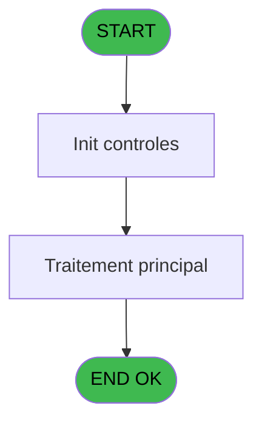
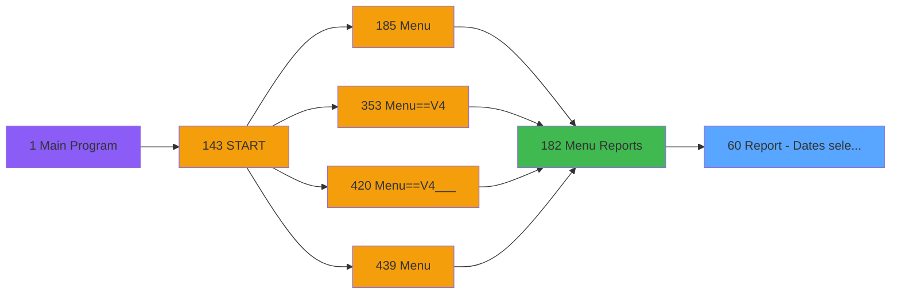
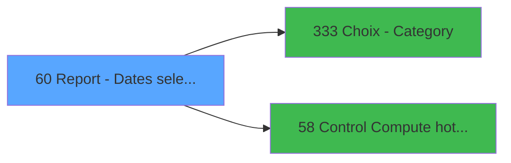

# PVE IDE 60 - Report - Dates selection&Print

> **Analyse**: Phases 1-4 2026-02-03 09:02 -> 09:02 (21s) | Assemblage 09:02
> **Pipeline**: V7.2 Enrichi
> **Structure**: 4 onglets (Resume | Ecrans | Donnees | Connexions)

<!-- TAB:Resume -->

## 1. FICHE D'IDENTITE

| Attribut | Valeur |
|----------|--------|
| Projet | PVE |
| IDE Position | 60 |
| Nom Programme | Report - Dates selection&Print |
| Fichier source | `Prg_60.xml` |
| Domaine metier | Impression |
| Taches | 2 (1 ecrans visibles) |
| Tables modifiees | 0 |
| Programmes appeles | 2 |

## 2. DESCRIPTION FONCTIONNELLE

**Report - Dates selection&Print** assure la gestion complete de ce processus, accessible depuis [Menu Reports (IDE 182)](PVE-IDE-182.md).

Le flux de traitement s'organise en **2 blocs fonctionnels** :

- **Initialisation** (1 tache) : reinitialisation d'etats et de variables de travail
- **Consultation** (1 tache) : ecrans de recherche, selection et consultation

**Logique metier** : 2 regles identifiees couvrant conditions metier.

Detail : phases du traitement

#### Phase 1 : Consultation (1 tache)

- **60** - Dates selection **[[ECRAN]](#ecran-t1)**

Delegue a : [Choix - Category (IDE 333)](PVE-IDE-333.md)

#### Phase 2 : Initialisation (1 tache)

- **60.1** - Init cat

## 3. BLOCS FONCTIONNELS

### 3.1 Consultation (1 tache)

Ecrans de recherche et consultation.

---

#### 60 - Dates selection [[ECRAN]](#ecran-t1)

**Role** : Selection par l'operateur : Dates selection.
**Ecran** : 638 x 223 DLU (Type6) | [Voir mockup](#ecran-t1)
**Variables liees** : F (P.Output Selection), P (P.ManualPrepaidSelection), T (V Dates en anomalie)
**Delegue a** : [Choix - Category (IDE 333)](PVE-IDE-333.md)

### 3.2 Initialisation (1 tache)

Reinitialisation d'etats et variables de travail.

---

#### 60.1 - Init cat

**Role** : Reinitialisation : Init cat.

## 5. REGLES METIER

2 regles identifiees:

### Consultation (1 regles)

#### [RM-001] Si V Date mini [Q]='00/00/0000'DATE alors P.ManualPrepaidSelection [P] sinon V Date mini [Q])

| Element | Detail |
|---------|--------|
| **Condition** | `V Date mini [Q]='00/00/0000'DATE` |
| **Si vrai** | P.ManualPrepaidSelection [P] |
| **Si faux** | V Date mini [Q]) |
| **Variables** | P (P.ManualPrepaidSelection), Q (V Date mini) |
| **Expression source** | Expression 4 : `IF (V Date mini [Q]='00/00/0000'DATE,P.ManualPrepaidSelectio` |
| **Exemple** | Si V Date mini [Q]='00/00/0000'DATE → P.ManualPrepaidSelection [P]. Sinon → V Date mini [Q]) |
| **Impact** | Bloc Consultation |

### Autres (1 regles)

#### [RM-002] Si P.Only Manual Prepaid? [O] alors 'X' sinon '')

| Element | Detail |
|---------|--------|
| **Condition** | `P.Only Manual Prepaid? [O]` |
| **Si vrai** | 'X' |
| **Si faux** | '') |
| **Variables** | O (P.Only Manual Prepaid?) |
| **Expression source** | Expression 27 : `IF(P.Only Manual Prepaid? [O],'X','')` |
| **Exemple** | Si P.Only Manual Prepaid? [O] → 'X'. Sinon → '') |

## 6. CONTEXTE

- **Appele par**: [Menu Reports (IDE 182)](PVE-IDE-182.md)
- **Appelle**: 2 programmes | **Tables**: 1 (W:0 R:1 L:0) | **Taches**: 2 | **Expressions**: 28

<!-- TAB:Ecrans -->

## 8. ECRANS

### 8.1 Forms visibles (1 / 2)

| # | Position | Tache | Nom | Type | Largeur | Hauteur | Bloc |
|---|----------|-------|-----|------|---------|---------|------|
| 1 | 60 | 60 | Dates selection | Type6 | 638 | 223 | Consultation |

### 8.2 Mockups Ecrans

---

#### 60 - Dates selection
**Tache** : [60](#t1) | **Type** : Type6 | **Dimensions** : 638 x 223 DLU
**Bloc** : Consultation | **Titre IDE** : Dates selection

<!-- FORM-DATA:
{
    "width":  638,
    "vFactor":  8,
    "type":  "Type6",
    "hFactor":  4,
    "controls":  [
                     {
                         "x":  4,
                         "type":  "label",
                         "var":  "",
                         "y":  42,
                         "w":  222,
                         "fmt":  "",
                         "name":  "",
                         "h":  60,
                         "color":  "183",
                         "text":  "",
                         "parent":  null
                     },
                     {
                         "x":  230,
                         "type":  "label",
                         "var":  "",
                         "y":  42,
                         "w":  150,
                         "fmt":  "",
                         "name":  "",
                         "h":  130,
                         "color":  "183",
                         "text":  "",
                         "parent":  null
                     },
                     {
                         "x":  385,
                         "type":  "label",
                         "var":  "",
                         "y":  42,
                         "w":  250,
                         "fmt":  "",
                         "name":  "",
                         "h":  130,
                         "color":  "183",
                         "text":  "",
                         "parent":  null
                     },
                     {
                         "x":  237,
                         "type":  "label",
                         "var":  "",
                         "y":  46,
                         "w":  129,
                         "fmt":  "",
                         "name":  "",
                         "h":  15,
                         "color":  "187",
                         "text":  "Output",
                         "parent":  2
                     },
                     {
                         "x":  6,
                         "type":  "label",
                         "var":  "",
                         "y":  49,
                         "w":  215,
                         "fmt":  "",
                         "name":  "",
                         "h":  10,
                         "color":  "187",
                         "text":  "Select the accounting period you want to print",
                         "parent":  null
                     },
                     {
                         "x":  391,
                         "type":  "label",
                         "var":  "",
                         "y":  49,
                         "w":  231,
                         "fmt":  "",
                         "name":  "",
                         "h":  10,
                         "color":  "187",
                         "text":  "Select the range of categories you want to print",
                         "parent":  null
                     },
                     {
                         "x":  11,
                         "type":  "label",
                         "var":  "",
                         "y":  65,
                         "w":  48,
                         "fmt":  "",
                         "name":  "",
                         "h":  12,
                         "color":  "183",
                         "text":  "Date min",
                         "parent":  null
                     },
                     {
                         "x":  392,
                         "type":  "label",
                         "var":  "",
                         "y":  70,
                         "w":  69,
                         "fmt":  "",
                         "name":  "",
                         "h":  12,
                         "color":  "183",
                         "text":  "Category min",
                         "parent":  null
                     },
                     {
                         "x":  11,
                         "type":  "label",
                         "var":  "",
                         "y":  81,
                         "w":  51,
                         "fmt":  "",
                         "name":  "",
                         "h":  12,
                         "color":  "183",
                         "text":  "Date max",
                         "parent":  null
                     },
                     {
                         "x":  4,
                         "type":  "label",
                         "var":  "",
                         "y":  102,
                         "w":  222,
                         "fmt":  "",
                         "name":  "",
                         "h":  70,
                         "color":  "183",
                         "text":  "",
                         "parent":  null
                     },
                     {
                         "x":  391,
                         "type":  "label",
                         "var":  "",
                         "y":  103,
                         "w":  72,
                         "fmt":  "",
                         "name":  "",
                         "h":  12,
                         "color":  "183",
                         "text":  "Category max",
                         "parent":  null
                     },
                     {
                         "x":  36,
                         "type":  "label",
                         "var":  "",
                         "y":  108,
                         "w":  158,
                         "fmt":  "",
                         "name":  "",
                         "h":  15,
                         "color":  "187",
                         "text":  "Discounts \u0026 Free",
                         "parent":  14
                     },
                     {
                         "x":  237,
                         "type":  "label",
                         "var":  "",
                         "y":  108,
                         "w":  129,
                         "fmt":  "",
                         "name":  "",
                         "h":  15,
                         "color":  "187",
                         "text":  "Tax",
                         "parent":  2
                     },
                     {
                         "x":  399,
                         "type":  "line",
                         "var":  "",
                         "y":  145,
                         "w":  221,
                         "fmt":  "",
                         "name":  "",
                         "h":  0,
                         "color":  "",
                         "text":  "",
                         "parent":  null
                     },
                     {
                         "x":  424,
                         "type":  "label",
                         "var":  "",
                         "y":  154,
                         "w":  175,
                         "fmt":  "",
                         "name":  "",
                         "h":  13,
                         "color":  "183",
                         "text":  "Print only the MANUAL PREPAID",
                         "parent":  null
                     },
                     {
                         "x":  4,
                         "type":  "label",
                         "var":  "",
                         "y":  178,
                         "w":  631,
                         "fmt":  "",
                         "name":  "",
                         "h":  43,
                         "color":  "183",
                         "text":  "",
                         "parent":  null
                     },
                     {
                         "x":  0,
                         "type":  "label",
                         "var":  "",
                         "y":  0,
                         "w":  635,
                         "fmt":  "",
                         "name":  "",
                         "h":  41,
                         "color":  "182",
                         "text":  "",
                         "parent":  null
                     },
                     {
                         "x":  13,
                         "type":  "label",
                         "var":  "",
                         "y":  16,
                         "w":  243,
                         "fmt":  "",
                         "name":  "",
                         "h":  10,
                         "color":  "186",
                         "text":  "Accounting period and print options",
                         "parent":  23
                     },
                     {
                         "x":  64,
                         "type":  "edit",
                         "var":  "",
                         "y":  65,
                         "w":  73,
                         "fmt":  "",
                         "name":  "",
                         "h":  12,
                         "color":  "110",
                         "text":  "",
                         "parent":  null
                     },
                     {
                         "x":  64,
                         "type":  "edit",
                         "var":  "",
                         "y":  81,
                         "w":  73,
                         "fmt":  "",
                         "name":  "",
                         "h":  12,
                         "color":  "110",
                         "text":  "",
                         "parent":  null
                     },
                     {
                         "x":  12,
                         "type":  "button",
                         "var":  "",
                         "y":  184,
                         "w":  68,
                         "fmt":  "\u0026Cancel",
                         "name":  "",
                         "h":  28,
                         "color":  "",
                         "text":  "",
                         "parent":  22
                     },
                     {
                         "x":  90,
                         "type":  "button",
                         "var":  "",
                         "y":  184,
                         "w":  68,
                         "fmt":  "\u0026Execute",
                         "name":  "",
                         "h":  28,
                         "color":  "",
                         "text":  "",
                         "parent":  22
                     },
                     {
                         "x":  585,
                         "type":  "image",
                         "var":  "",
                         "y":  3,
                         "w":  48,
                         "fmt":  "",
                         "name":  "",
                         "h":  37,
                         "color":  "",
                         "text":  "",
                         "parent":  25
                     },
                     {
                         "x":  235,
                         "type":  "listbox",
                         "var":  "",
                         "y":  66,
                         "w":  133,
                         "fmt":  "",
                         "name":  "V Printer/Extract_0001",
                         "h":  32,
                         "color":  "110",
                         "text":  "Printer,Extraction",
                         "parent":  2
                     },
                     {
                         "x":  235,
                         "type":  "listbox",
                         "var":  "",
                         "y":  126,
                         "w":  133,
                         "fmt":  "",
                         "name":  "V Before tax/Tax inclusive",
                         "h":  46,
                         "color":  "110",
                         "text":  "Before tax,Tax included",
                         "parent":  2
                     },
                     {
                         "x":  393,
                         "type":  "edit",
                         "var":  "",
                         "y":  85,
                         "w":  22,
                         "fmt":  "",
                         "name":  "CATMINI",
                         "h":  12,
                         "color":  "110",
                         "text":  "",
                         "parent":  null
                     },
                     {
                         "x":  422,
                         "type":  "edit",
                         "var":  "",
                         "y":  85,
                         "w":  152,
                         "fmt":  "",
                         "name":  "label",
                         "h":  12,
                         "color":  "183",
                         "text":  "",
                         "parent":  null
                     },
                     {
                         "x":  423,
                         "type":  "edit",
                         "var":  "",
                         "y":  120,
                         "w":  152,
                         "fmt":  "",
                         "name":  "label_0001",
                         "h":  12,
                         "color":  "183",
                         "text":  "",
                         "parent":  null
                     },
                     {
                         "x":  393,
                         "type":  "edit",
                         "var":  "",
                         "y":  120,
                         "w":  22,
                         "fmt":  "",
                         "name":  "CATMAXI",
                         "h":  12,
                         "color":  "110",
                         "text":  "",
                         "parent":  null
                     },
                     {
                         "x":  34,
                         "type":  "listbox",
                         "var":  "",
                         "y":  126,
                         "w":  163,
                         "fmt":  "",
                         "name":  "Discount",
                         "h":  46,
                         "color":  "110",
                         "text":  "0,1,2",
                         "parent":  14
                     },
                     {
                         "x":  402,
                         "type":  "checkbox",
                         "var":  "",
                         "y":  154,
                         "w":  20,
                         "fmt":  "",
                         "name":  "Print Preview",
                         "h":  13,
                         "color":  "186",
                         "text":  "",
                         "parent":  null
                     }
                 ],
    "taskId":  "60",
    "height":  223
}
-->

<strong>Champs : 7 champs</strong>

| Pos (x,y) | Nom | Variable | Type |
|-----------|-----|----------|------|
| 64,65 | (sans nom) | - | edit |
| 64,81 | (sans nom) | - | edit |
| 393,85 | CATMINI | - | edit |
| 422,85 | label | - | edit |
| 423,120 | label_0001 | - | edit |
| 393,120 | CATMAXI | - | edit |
| 402,154 | Print Preview | - | checkbox |

<strong>Boutons : 2 boutons</strong>

| Bouton | Pos (x,y) | Action |
|--------|-----------|--------|
| Cancel | 12,184 | Annule et retour au menu |
| Execute | 90,184 | Bouton fonctionnel |

## 9. NAVIGATION

Ecran unique: **Dates selection**

### 9.3 Structure hierarchique (2 taches)

| Position | Tache | Type | Dimensions | Bloc |
|----------|-------|------|------------|------|
| **60.1** | [**Dates selection** (60)](#t1) [mockup](#ecran-t1) | Type6 | 638x223 | Consultation |
| **60.2** | [**Init cat** (60.1)](#t2) | MDI | - | Initialisation |

### 9.4 Algorigramme

> **Legende**: Vert = START/END OK | Rouge = END KO | Bleu = Decisions
> *Algorigramme auto-genere. Utiliser `/algorigramme` pour une synthese metier detaillee.*

<!-- TAB:Donnees -->

## 10. TABLES

### Tables utilisees (1)

| ID | Nom | Description | Type | R | W | L | Usages |
|----|-----|-------------|------|---|---|---|--------|
| 379 | pv_customer_temp |  | DB | R |   |   | 2 |

### Colonnes par table (1 / 1 tables avec colonnes identifiees)

Table 379 - pv_customer_temp (R) - 2 usages

| Lettre | Variable | Acces | Type |
|--------|----------|-------|------|
| A | P. Date mini | R | Date |
| B | P. Date Maxi | R | Date |
| C | P. Contrôle HD | R | Logical |
| D | P. Période nombre JH | R | Numeric |
| E | P. Jours Période | R | Numeric |
| F | P.Output Selection | R | Alpha |
| G | P.Before Tax/Tax Included | R | Alpha |
| H | P.Visible Tax | R | Logical |
| I | P.Execute Print Report | R | Logical |
| J | P.Categorie Visible | R | Logical |
| K | P.Catéorie Mini | R | Numeric |
| L | P.Catéorie Maxi | R | Numeric |
| M | P. Discount&Free Visible | R | Logical |
| N | P. Choix Discount,Free | R | Numeric |
| O | P.Only Manual Prepaid? | R | Logical |
| P | P.ManualPrepaidSelection | R | Logical |
| Q | V Date mini | R | Date |
| R | V Date maxi | R | Date |
| S | V Discount/FoC | R | Numeric |
| T | V Dates en anomalie | R | Unicode |
| U | V Output | R | Alpha |
| V | V Tax | R | Alpha |
| W | V Cat Mini | R | Numeric |
| X | V Cat Maxi | R | Numeric |

## 11. VARIABLES

### 11.1 Parametres entrants (16)

Variables recues du programme appelant ([Menu Reports (IDE 182)](PVE-IDE-182.md)).

| Lettre | Nom | Type | Usage dans |
|--------|-----|------|-----------|
| A | P. Date mini | Date | - |
| B | P. Date Maxi | Date | - |
| C | P. Contrôle HD | Logical | 1x parametre entrant |
| D | P. Période nombre JH | Numeric | - |
| E | P. Jours Période | Numeric | 1x parametre entrant |
| F | P.Output Selection | Alpha | - |
| G | P.Before Tax/Tax Included | Alpha | - |
| H | P.Visible Tax | Logical | 1x parametre entrant |
| I | P.Execute Print Report | Logical | - |
| J | P.Categorie Visible | Logical | 1x parametre entrant |
| K | P.Catéorie Mini | Numeric | - |
| L | P.Catéorie Maxi | Numeric | - |
| M | P. Discount&Free Visible | Logical | 1x parametre entrant |
| N | P. Choix Discount,Free | Numeric | - |
| O | P.Only Manual Prepaid? | Logical | 1x parametre entrant |
| P | P.ManualPrepaidSelection | Logical | 3x parametre entrant |

### 11.2 Variables de session (8)

Variables persistantes pendant toute la session.

| Lettre | Nom | Type | Usage dans |
|--------|-----|------|-----------|
| Q | V Date mini | Date | [60](#t1) |
| R | V Date maxi | Date | [60](#t1) |
| S | V Discount/FoC | Numeric | 2x session |
| T | V Dates en anomalie | Unicode | [60](#t1) |
| U | V Output | Alpha | 1x session |
| V | V Tax | Alpha | 2x session |
| W | V Cat Mini | Numeric | - |
| X | V Cat Maxi | Numeric | - |

Toutes les 24 variables (liste complete)

| Cat | Lettre | Nom Variable | Type |
|-----|--------|--------------|------|
| P0 | **A** | P. Date mini | Date |
| P0 | **B** | P. Date Maxi | Date |
| P0 | **C** | P. Contrôle HD | Logical |
| P0 | **D** | P. Période nombre JH | Numeric |
| P0 | **E** | P. Jours Période | Numeric |
| P0 | **F** | P.Output Selection | Alpha |
| P0 | **G** | P.Before Tax/Tax Included | Alpha |
| P0 | **H** | P.Visible Tax | Logical |
| P0 | **I** | P.Execute Print Report | Logical |
| P0 | **J** | P.Categorie Visible | Logical |
| P0 | **K** | P.Catéorie Mini | Numeric |
| P0 | **L** | P.Catéorie Maxi | Numeric |
| P0 | **M** | P. Discount&Free Visible | Logical |
| P0 | **N** | P. Choix Discount,Free | Numeric |
| P0 | **O** | P.Only Manual Prepaid? | Logical |
| P0 | **P** | P.ManualPrepaidSelection | Logical |
| V. | **Q** | V Date mini | Date |
| V. | **R** | V Date maxi | Date |
| V. | **S** | V Discount/FoC | Numeric |
| V. | **T** | V Dates en anomalie | Unicode |
| V. | **U** | V Output | Alpha |
| V. | **V** | V Tax | Alpha |
| V. | **W** | V Cat Mini | Numeric |
| V. | **X** | V Cat Maxi | Numeric |

## 12. EXPRESSIONS

**28 / 28 expressions decodees (100%)**

### 12.1 Repartition par type

| Type | Expressions | Regles |
|------|-------------|--------|
| CONDITION | 6 | 2 |
| CALCULATION | 1 | 0 |
| CONSTANTE | 3 | 0 |
| DATE | 1 | 0 |
| OTHER | 15 | 0 |
| CAST_LOGIQUE | 2 | 0 |

### 12.2 Expressions cles par type

#### CONDITION (6 expressions)

| Type | IDE | Expression | Regle |
|------|-----|------------|-------|
| CONDITION | 4 | `IF (V Date mini [Q]='00/00/0000'DATE,P.ManualPrepaidSelection [P],V Date mini [Q])` | [RM-001](#rm-RM-001) |
| CONDITION | 27 | `IF(P.Only Manual Prepaid? [O],'X','')` | [RM-002](#rm-RM-002) |
| CONDITION | 11 | `V Discount/FoC [S]<>''` | - |
| CONDITION | 16 | `V Dates en anomalie [T]='Printer'` | - |
| CONDITION | 5 | `V Date mini [Q]='00/00/0000'DATE OR V Date mini [Q]<P.ManualPrepaidSelection [P]` | - |
| ... | | *+1 autres* | |

#### CALCULATION (1 expressions)

| Type | IDE | Expression | Regle |
|------|-----|------------|-------|
| CALCULATION | 9 | `StrBuild('No HD for @1@: Dispatch and Amount HT/HD will be wrong. Please communicate this information to your Financial Manager.', V Discount/FoC [S])` | - |

#### CONSTANTE (3 expressions)

| Type | IDE | Expression | Regle |
|------|-----|------------|-------|
| CONSTANTE | 8 | `0` | - |
| CONSTANTE | 2 | `'Printer'` | - |
| CONSTANTE | 1 | `'Before tax'` | - |

#### DATE (1 expressions)

| Type | IDE | Expression | Regle |
|------|-----|------------|-------|
| DATE | 3 | `Date ()` | - |

#### OTHER (15 expressions)

| Type | IDE | Expression | Regle |
|------|-----|------------|-------|
| OTHER | 23 | `V Tax [V]` | - |
| OTHER | 22 | `[Z]` | - |
| OTHER | 21 | `V Tax [V]` | - |
| OTHER | 24 | `[Z]` | - |
| OTHER | 28 | `[AD]` | - |
| ... | | *+10 autres* | |

#### CAST_LOGIQUE (2 expressions)

| Type | IDE | Expression | Regle |
|------|-----|------------|-------|
| CAST_LOGIQUE | 18 | `'TRUE'LOG` | - |
| CAST_LOGIQUE | 17 | `'FALSE'LOG` | - |

### 12.3 Toutes les expressions (28)

Voir les 28 expressions

#### CONDITION (6)

| IDE | Expression Decodee |
|-----|-------------------|
| 5 | `V Date mini [Q]='00/00/0000'DATE OR V Date mini [Q]<P.ManualPrepaidSelection [P]` |
| 4 | `IF (V Date mini [Q]='00/00/0000'DATE,P.ManualPrepaidSelection [P],V Date mini [Q])` |
| 27 | `IF(P.Only Manual Prepaid? [O],'X','')` |
| 10 | `P. Jours Période [E]=0` |
| 11 | `V Discount/FoC [S]<>''` |
| 16 | `V Dates en anomalie [T]='Printer'` |

#### CALCULATION (1)

| IDE | Expression Decodee |
|-----|-------------------|
| 9 | `StrBuild('No HD for @1@: Dispatch and Amount HT/HD will be wrong. Please communicate this information to your Financial Manager.', V Discount/FoC [S])` |

#### CONSTANTE (3)

| IDE | Expression Decodee |
|-----|-------------------|
| 1 | `'Before tax'` |
| 2 | `'Printer'` |
| 8 | `0` |

#### DATE (1)

| IDE | Expression Decodee |
|-----|-------------------|
| 3 | `Date ()` |

#### OTHER (15)

| IDE | Expression Decodee |
|-----|-------------------|
| 6 | `P.ManualPrepaidSelection [P]` |
| 7 | `V Date mini [Q]` |
| 12 | `P. Contrôle HD [C]` |
| 13 | `V Dates en anomalie [T]` |
| 14 | `V Output [U]` |
| 15 | `P.Visible Tax [H]` |
| 19 | `P.Categorie Visible [J]` |
| 20 | `GetParam('SERVICE')` |
| 21 | `V Tax [V]` |
| 22 | `[Z]` |
| 23 | `V Tax [V]` |
| 24 | `[Z]` |
| 25 | `P. Discount&Free Visible [M]` |
| 26 | `V Date maxi [R]` |
| 28 | `[AD]` |

#### CAST_LOGIQUE (2)

| IDE | Expression Decodee |
|-----|-------------------|
| 17 | `'FALSE'LOG` |
| 18 | `'TRUE'LOG` |

<!-- TAB:Connexions -->

## 13. GRAPHE D'APPELS

### 13.1 Chaine depuis Main (Callers)

Main -> ... -> [Menu Reports (IDE 182)](PVE-IDE-182.md) -> **Report - Dates selection&Print (IDE 60)**

### 13.2 Callers

| IDE | Nom Programme | Nb Appels |
|-----|---------------|-----------|
| [182](PVE-IDE-182.md) | Menu Reports | 1 |

### 13.3 Callees (programmes appeles)

### 13.4 Detail Callees avec contexte

| IDE | Nom Programme | Appels | Contexte |
|-----|---------------|--------|----------|
| [333](PVE-IDE-333.md) | Choix - Category | 2 | Selection/consultation |
| [58](PVE-IDE-58.md) | Control & Compute hotel days | 1 | Sous-programme |

## 14. RECOMMANDATIONS MIGRATION

### 14.1 Profil du programme

| Metrique | Valeur | Impact migration |
|----------|--------|-----------------|
| Lignes de logique | 81 | Programme compact |
| Expressions | 28 | Peu de logique |
| Tables WRITE | 0 | Impact faible |
| Sous-programmes | 2 | Peu de dependances |
| Ecrans visibles | 1 | Ecran unique ou traitement batch |
| Code desactive | 0% (0 / 81) | Code sain |
| Regles metier | 2 | Quelques regles a preserver |

### 14.2 Plan de migration par bloc

#### Consultation (1 tache: 1 ecran, 0 traitement)

- **Strategie** : Composants de recherche/selection en modales.
- 1 ecran : Dates selection

#### Initialisation (1 tache: 0 ecran, 1 traitement)

- **Strategie** : Constructeur/methode `InitAsync()` dans l'orchestrateur.

### 14.3 Dependances critiques

| Dependance | Type | Appels | Impact |
|------------|------|--------|--------|
| [Choix - Category (IDE 333)](PVE-IDE-333.md) | Sous-programme | 2x | Haute - Selection/consultation |
| [Control & Compute hotel days (IDE 58)](PVE-IDE-58.md) | Sous-programme | 1x | Normale - Sous-programme |

---
*Spec DETAILED generee par Pipeline V7.2 - 2026-02-03 09:02*
