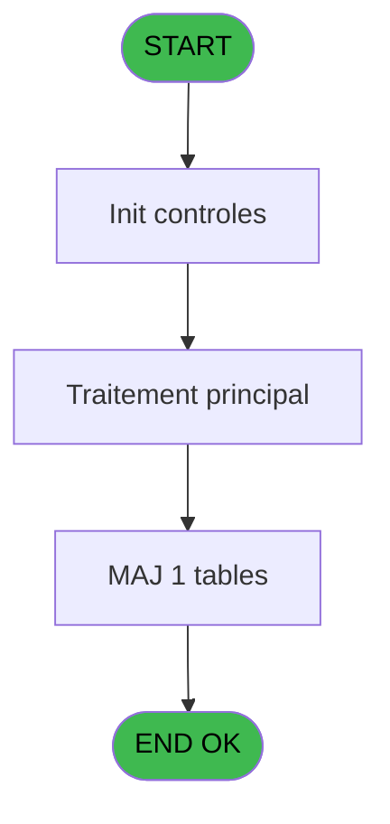
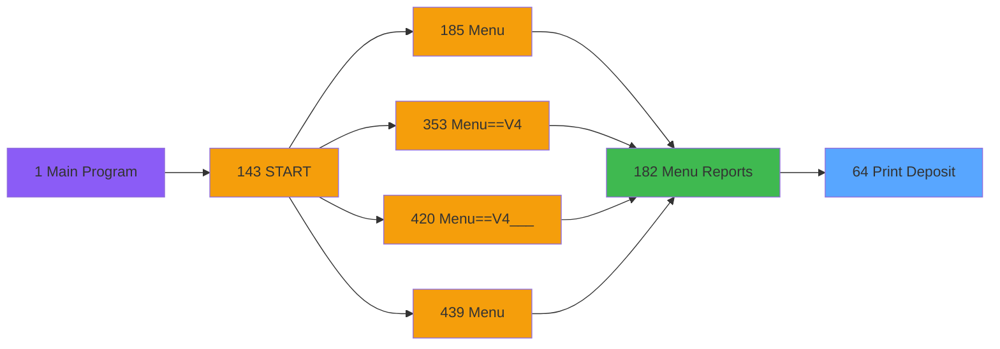
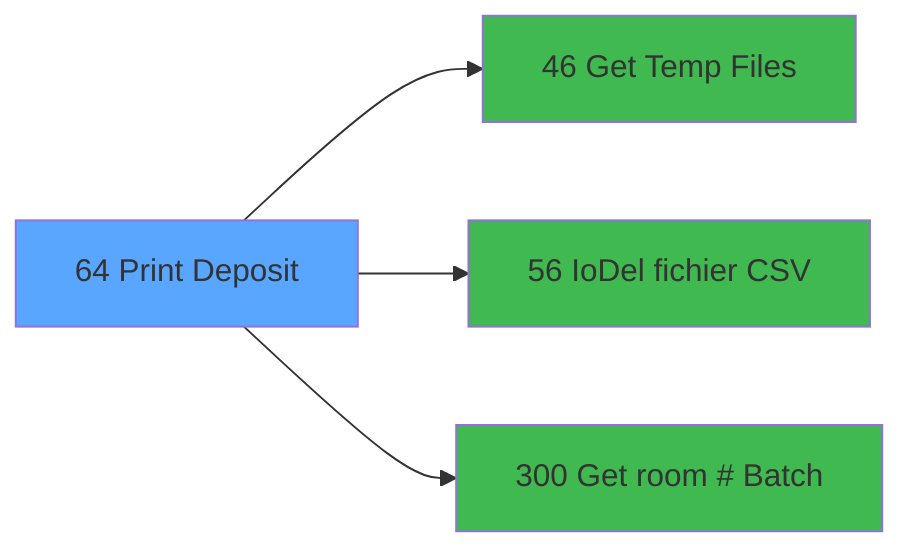

# PVE IDE 64 - Print Deposit

> **Analyse**: Phases 1-4 2026-02-03 09:04 -> 09:04 (20s) | Assemblage 09:04
> **Pipeline**: V7.2 Enrichi
> **Structure**: 4 onglets (Resume | Ecrans | Donnees | Connexions)

<!-- TAB:Resume -->

## 1. FICHE D'IDENTITE

| Attribut | Valeur |
|----------|--------|
| Projet | PVE |
| IDE Position | 64 |
| Nom Programme | Print Deposit |
| Fichier source | `Prg_64.xml` |
| Domaine metier | Impression |
| Taches | 6 (0 ecrans visibles) |
| Tables modifiees | 1 |
| Programmes appeles | 3 |

## 2. DESCRIPTION FONCTIONNELLE

**Print Deposit** assure la gestion complete de ce processus, accessible depuis [Menu Reports (IDE 182)](PVE-IDE-182.md).

Le flux de traitement s'organise en **4 blocs fonctionnels** :

- **Impression** (3 taches) : generation de tickets et documents
- **Creation** (1 tache) : insertion d'enregistrements en base (mouvements, prestations)
- **Consultation** (1 tache) : ecrans de recherche, selection et consultation
- **Traitement** (1 tache) : traitements metier divers

**Donnees modifiees** : 1 tables en ecriture (Table_527).

Detail : phases du traitement

#### Phase 1 : Impression (3 taches)

- **64** - Print Deposits **[[ECRAN]](#ecran-t1)**
- **64.1** - Print
- **64.1.1** - EDITION

#### Phase 2 : Traitement (1 tache)

- **64.1.1.1** - Read Temp file

Delegue a : [Get Temp Files (IDE 46)](PVE-IDE-46.md), [IoDel fichier CSV (IDE 56)](PVE-IDE-56.md), [Get room # (Batch) (IDE 300)](PVE-IDE-300.md)

#### Phase 3 : Consultation (1 tache)

- **64.1.2** - GM Selection

Delegue a : [Get Temp Files (IDE 46)](PVE-IDE-46.md), [Get room # (Batch) (IDE 300)](PVE-IDE-300.md)

#### Phase 4 : Creation (1 tache)

- **64.1.2.1** - Create Temp

#### Tables impactees

| Table | Operations | Role metier |
|-------|-----------|-------------|
| Table_527 | **W** (2 usages) |  |

## 3. BLOCS FONCTIONNELS

### 3.1 Impression (3 taches)

Generation des documents et tickets.

---

#### 64 - Print Deposits [[ECRAN]](#ecran-t1)

**Role** : Generation du document : Print Deposits.
**Ecran** : 314 x 98 DLU (MDI) | [Voir mockup](#ecran-t1)

---

#### 64.1 - Print

**Role** : Generation du document : Print.

---

#### 64.1.1 - EDITION

**Role** : Generation du document : EDITION.

### 3.2 Traitement (1 tache)

Traitements internes.

---

#### 64.1.1.1 - Read Temp file

**Role** : Traitement : Read Temp file.
**Delegue a** : [Get Temp Files (IDE 46)](PVE-IDE-46.md), [IoDel fichier CSV (IDE 56)](PVE-IDE-56.md), [Get room # (Batch) (IDE 300)](PVE-IDE-300.md)

### 3.3 Consultation (1 tache)

Ecrans de recherche et consultation.

---

#### 64.1.2 - GM Selection

**Role** : Selection par l'operateur : GM Selection.

### 3.4 Creation (1 tache)

Insertion de nouveaux enregistrements en base.

---

#### 64.1.2.1 - Create Temp

**Role** : Traitement : Create Temp.

## 5. REGLES METIER

*(Aucune regle metier identifiee)*

## 6. CONTEXTE

- **Appele par**: [Menu Reports (IDE 182)](PVE-IDE-182.md)
- **Appelle**: 3 programmes | **Tables**: 3 (W:1 R:1 L:1) | **Taches**: 6 | **Expressions**: 3

<!-- TAB:Ecrans -->

## 8. ECRANS

*(Programme sans ecran visible)*

## 9. NAVIGATION

### 9.3 Structure hierarchique (6 taches)

| Position | Tache | Type | Dimensions | Bloc |
|----------|-------|------|------------|------|
| **64.1** | [**Print Deposits** (64)](#t1) [mockup](#ecran-t1) | MDI | 314x98 | Impression |
| 64.1.1 | [Print (64.1)](#t2) | MDI | - | |
| 64.1.2 | [EDITION (64.1.1)](#t3) | MDI | - | |
| **64.2** | [**Read Temp file** (64.1.1.1)](#t4) | MDI | - | Traitement |
| **64.3** | [**GM Selection** (64.1.2)](#t5) | MDI | - | Consultation |
| **64.4** | [**Create Temp** (64.1.2.1)](#t6) | MDI | - | Creation |

### 9.4 Algorigramme

> **Legende**: Vert = START/END OK | Rouge = END KO | Bleu = Decisions
> *Algorigramme auto-genere. Utiliser `/algorigramme` pour une synthese metier detaillee.*

<!-- TAB:Donnees -->

## 10. TABLES

### Tables utilisees (3)

| ID | Nom | Description | Type | R | W | L | Usages |
|----|-----|-------------|------|---|---|---|--------|
| 30 | gm-recherche_____gmr | Index de recherche | DB | R |   |   | 1 |
| 527 | Table_527 |  | TMP |   | **W** |   | 2 |
| 1468 | Table_1468 |  | MEM |   |   | L | 1 |

### Colonnes par table (0 / 2 tables avec colonnes identifiees)

Table 30 - gm-recherche_____gmr (R) - 1 usages

*Table utilisee uniquement en Link ou aucune colonne Real identifiee dans le DataView.*

Table 527 - Table_527 (**W**) - 2 usages

*Table utilisee uniquement en Link ou aucune colonne Real identifiee dans le DataView.*

## 11. VARIABLES

### 11.1 Parametres entrants (3)

Variables recues du programme appelant ([Menu Reports (IDE 182)](PVE-IDE-182.md)).

| Lettre | Nom | Type | Usage dans |
|--------|-----|------|-----------|
| A | P.Village | Alpha | - |
| B | P Date mini | Date | - |
| C | P Date maxi | Date | - |

### 11.2 Variables de session (1)

Variables persistantes pendant toute la session.

| Lettre | Nom | Type | Usage dans |
|--------|-----|------|-----------|
| D | v.NomFichierPdf | Alpha | 1x session |

## 12. EXPRESSIONS

**3 / 3 expressions decodees (100%)**

### 12.1 Repartition par type

| Type | Expressions | Regles |
|------|-------------|--------|
| CONCATENATION | 1 | 0 |
| NEGATION | 1 | 0 |
| STRING | 1 | 0 |

### 12.2 Expressions cles par type

#### CONCATENATION (1 expressions)

| Type | IDE | Expression | Regle |
|------|-----|------------|-------|
| CONCATENATION | 1 | `Translate ('%club_exportdata%')&Trim (GetParam ('VILLAGECODE'))&Trim (GetParam ('SERVICE'))&'_SELLING_STATISTICS_'&DStr (Date(),'YYYYMMDD')&'_'&TStr (Time(),'HHMMSS')&'.Pdf'` | - |

#### NEGATION (1 expressions)

| Type | IDE | Expression | Regle |
|------|-----|------------|-------|
| NEGATION | 3 | `NOT (GetParam ('Output')='Printer')` | - |

#### STRING (1 expressions)

| Type | IDE | Expression | Regle |
|------|-----|------------|-------|
| STRING | 2 | `FileDelete (Trim(v.NomFichierPdf [D]))` | - |

<!-- TAB:Connexions -->

## 13. GRAPHE D'APPELS

### 13.1 Chaine depuis Main (Callers)

Main -> ... -> [Menu Reports (IDE 182)](PVE-IDE-182.md) -> **Print Deposit (IDE 64)**

### 13.2 Callers

| IDE | Nom Programme | Nb Appels |
|-----|---------------|-----------|
| [182](PVE-IDE-182.md) | Menu Reports | 1 |

### 13.3 Callees (programmes appeles)

### 13.4 Detail Callees avec contexte

| IDE | Nom Programme | Appels | Contexte |
|-----|---------------|--------|----------|
| [46](PVE-IDE-46.md) | Get Temp Files | 1 | Recuperation donnees |
| [56](PVE-IDE-56.md) | IoDel fichier CSV | 1 | Sous-programme |
| [300](PVE-IDE-300.md) | Get room # (Batch) | 1 | Recuperation donnees |

## 14. RECOMMANDATIONS MIGRATION

### 14.1 Profil du programme

| Metrique | Valeur | Impact migration |
|----------|--------|-----------------|
| Lignes de logique | 82 | Programme compact |
| Expressions | 3 | Peu de logique |
| Tables WRITE | 1 | Impact faible |
| Sous-programmes | 3 | Peu de dependances |
| Ecrans visibles | 0 | Ecran unique ou traitement batch |
| Code desactive | 0% (0 / 82) | Code sain |
| Regles metier | 0 | Pas de regle identifiee |

### 14.2 Plan de migration par bloc

#### Impression (3 taches: 1 ecran, 2 traitements)

- **Strategie** : Templates HTML -> PDF via wkhtmltopdf ou Puppeteer.
- `PrintService` injectable avec choix imprimante

#### Traitement (1 tache: 0 ecran, 1 traitement)

- **Strategie** : 1 service(s) backend injectable(s) (Domain Services).
- 3 sous-programme(s) a migrer ou a reutiliser depuis les services existants.
- Decomposer les taches en services unitaires testables.

#### Consultation (1 tache: 0 ecran, 1 traitement)

- **Strategie** : Composants de recherche/selection en modales.

#### Creation (1 tache: 0 ecran, 1 traitement)

- **Strategie** : Repository pattern avec Entity Framework Core.
- Insertion via `IRepository<T>.CreateAsync()`

### 14.3 Dependances critiques

| Dependance | Type | Appels | Impact |
|------------|------|--------|--------|
| Table_527 | Table WRITE (Temp) | 2x | Schema + repository |
| [Get room # (Batch) (IDE 300)](PVE-IDE-300.md) | Sous-programme | 1x | Normale - Recuperation donnees |
| [IoDel fichier CSV (IDE 56)](PVE-IDE-56.md) | Sous-programme | 1x | Normale - Sous-programme |
| [Get Temp Files (IDE 46)](PVE-IDE-46.md) | Sous-programme | 1x | Normale - Recuperation donnees |

---
*Spec DETAILED generee par Pipeline V7.2 - 2026-02-03 09:04*
