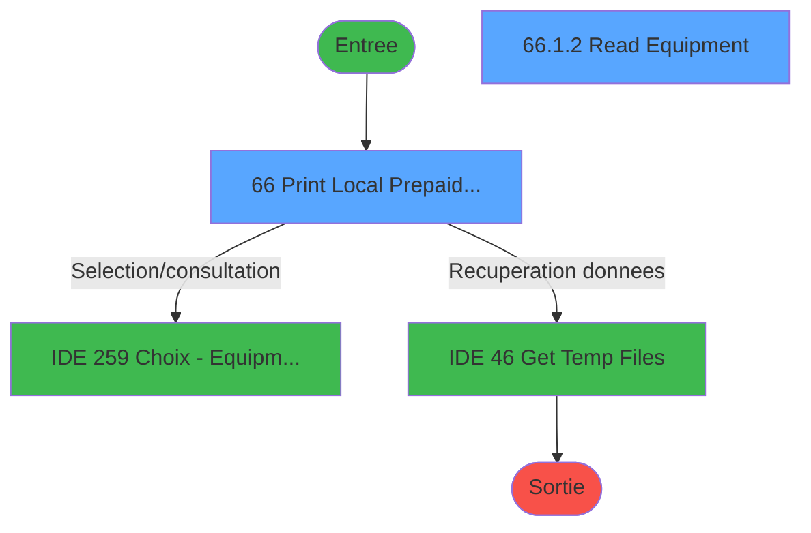
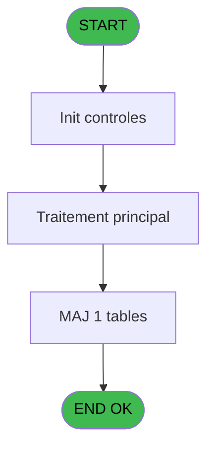
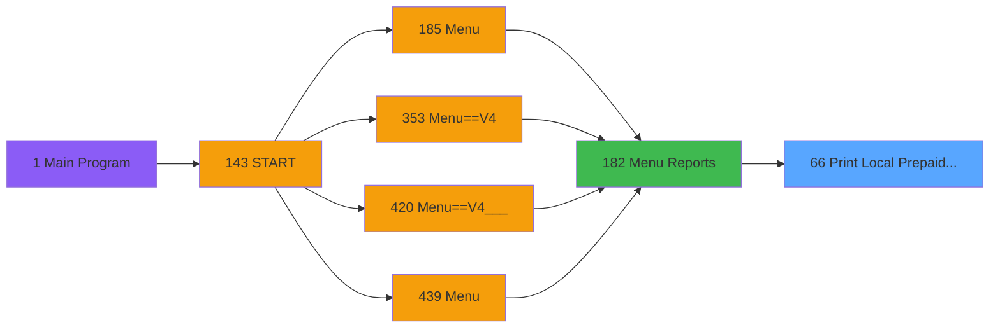
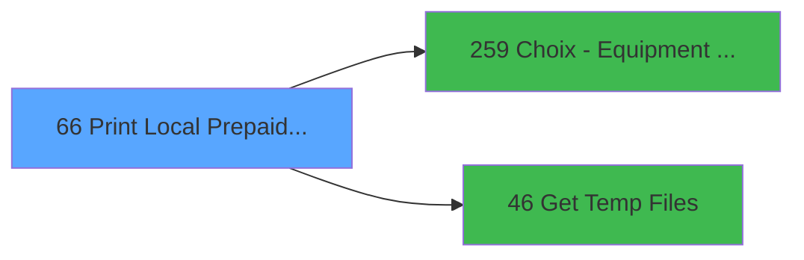

# PVE IDE 66 - Print Local & Prepaid Rentals

> **Analyse**: Phases 1-4 2026-02-03 09:05 -> 09:05 (21s) | Assemblage 09:05
> **Pipeline**: V7.2 Enrichi
> **Structure**: 4 onglets (Resume | Ecrans | Donnees | Connexions)

<!-- TAB:Resume -->

## 1. FICHE D'IDENTITE

| Attribut | Valeur |
|----------|--------|
| Projet | PVE |
| IDE Position | 66 |
| Nom Programme | Print Local & Prepaid Rentals |
| Fichier source | `Prg_66.xml` |
| Domaine metier | Impression |
| Taches | 6 (2 ecrans visibles) |
| Tables modifiees | 1 |
| Programmes appeles | 2 |

## 2. DESCRIPTION FONCTIONNELLE

**Print Local & Prepaid Rentals** assure la gestion complete de ce processus, accessible depuis [Menu Reports (IDE 182)](PVE-IDE-182.md).

Le flux de traitement s'organise en **2 blocs fonctionnels** :

- **Traitement** (3 taches) : traitements metier divers
- **Impression** (3 taches) : generation de tickets et documents

**Donnees modifiees** : 1 tables en ecriture (total_ventes_par_mop_temp).

Detail : phases du traitement

#### Phase 1 : Impression (3 taches)

- **66** - Print Local & Prepaid Rentals **[[ECRAN]](#ecran-t1)**
- **66.1** - Print
- **66.1.1** - EDITION

#### Phase 2 : Traitement (3 taches)

- **66.1.1.1** - Read Temp file
- **66.1.2** - Read Equipment **[[ECRAN]](#ecran-t5)**
- **66.1.2.1** - Read Rentals

Delegue a : [Get Temp Files (IDE 46)](PVE-IDE-46.md)

#### Tables impactees

| Table | Operations | Role metier |
|-------|-----------|-------------|
| total_ventes_par_mop_temp | **W**/L (2 usages) | Donnees de ventes |

## 3. BLOCS FONCTIONNELS

### 3.1 Impression (3 taches)

Generation des documents et tickets.

---

#### 66 - Print Local & Prepaid Rentals [[ECRAN]](#ecran-t1)

**Role** : Generation du document : Print Local & Prepaid Rentals.
**Ecran** : 314 x 175 DLU (MDI) | [Voir mockup](#ecran-t1)
**Variables liees** : C (print modelManufacturer ID), F (Print bouton)

---

#### 66.1 - Print

**Role** : Generation du document : Print.
**Variables liees** : C (print modelManufacturer ID), F (Print bouton)

---

#### 66.1.1 - EDITION

**Role** : Generation du document : EDITION.

### 3.2 Traitement (3 taches)

Traitements internes.

---

#### 66.1.1.1 - Read Temp file

**Role** : Traitement : Read Temp file.
**Delegue a** : [Get Temp Files (IDE 46)](PVE-IDE-46.md)

---

#### 66.1.2 - Read Equipment [[ECRAN]](#ecran-t5)

**Role** : Traitement : Read Equipment.
**Ecran** : 480 x 64 DLU (MDI) | [Voir mockup](#ecran-t5)
**Delegue a** : [Get Temp Files (IDE 46)](PVE-IDE-46.md)

---

#### 66.1.2.1 - Read Rentals

**Role** : Traitement : Read Rentals.
**Delegue a** : [Get Temp Files (IDE 46)](PVE-IDE-46.md)

## 5. REGLES METIER

*(Aucune regle metier identifiee)*

## 6. CONTEXTE

- **Appele par**: [Menu Reports (IDE 182)](PVE-IDE-182.md)
- **Appelle**: 2 programmes | **Tables**: 8 (W:1 R:3 L:6) | **Taches**: 6 | **Expressions**: 7

<!-- TAB:Ecrans -->

## 8. ECRANS

### 8.1 Forms visibles (2 / 6)

| # | Position | Tache | Nom | Type | Largeur | Hauteur | Bloc |
|---|----------|-------|-----|------|---------|---------|------|
| 1 | 66 | 66 | Print Local & Prepaid Rentals | MDI | 314 | 175 | Impression |
| 2 | 66.1.2 | 66.1.2 | Read Equipment | MDI | 480 | 64 | Traitement |

### 8.2 Mockups Ecrans

---

#### 66 - Print Local & Prepaid Rentals
**Tache** : [66](#t1) | **Type** : MDI | **Dimensions** : 314 x 175 DLU
**Bloc** : Impression | **Titre IDE** : Print Local & Prepaid Rentals

<!-- FORM-DATA:
{
    "width":  314,
    "vFactor":  8,
    "type":  "MDI",
    "hFactor":  4,
    "controls":  [
                     {
                         "x":  12,
                         "type":  "label",
                         "var":  "",
                         "y":  47,
                         "w":  288,
                         "fmt":  "",
                         "name":  "",
                         "h":  8,
                         "color":  "187",
                         "text":  "Select the range of starting dates for  customer begin of stay",
                         "parent":  null
                     },
                     {
                         "x":  76,
                         "type":  "label",
                         "var":  "",
                         "y":  62,
                         "w":  64,
                         "fmt":  "",
                         "name":  "",
                         "h":  12,
                         "color":  "183",
                         "text":  "Date min",
                         "parent":  null
                     },
                     {
                         "x":  76,
                         "type":  "label",
                         "var":  "",
                         "y":  79,
                         "w":  64,
                         "fmt":  "",
                         "name":  "",
                         "h":  12,
                         "color":  "183",
                         "text":  "Date max",
                         "parent":  null
                     },
                     {
                         "x":  12,
                         "type":  "label",
                         "var":  "",
                         "y":  97,
                         "w":  288,
                         "fmt":  "",
                         "name":  "",
                         "h":  8,
                         "color":  "187",
                         "text":  "Select the manufacturer \u0026 model of the equipment (all if blank)",
                         "parent":  null
                     },
                     {
                         "x":  76,
                         "type":  "label",
                         "var":  "",
                         "y":  109,
                         "w":  64,
                         "fmt":  "",
                         "name":  "",
                         "h":  12,
                         "color":  "183",
                         "text":  "Manufacturer",
                         "parent":  null
                     },
                     {
                         "x":  76,
                         "type":  "label",
                         "var":  "",
                         "y":  126,
                         "w":  64,
                         "fmt":  "",
                         "name":  "",
                         "h":  12,
                         "color":  "183",
                         "text":  "Model",
                         "parent":  null
                     },
                     {
                         "x":  0,
                         "type":  "label",
                         "var":  "",
                         "y":  0,
                         "w":  312,
                         "fmt":  "",
                         "name":  "",
                         "h":  42,
                         "color":  "182",
                         "text":  "",
                         "parent":  null
                     },
                     {
                         "x":  8,
                         "type":  "label",
                         "var":  "",
                         "y":  16,
                         "w":  253,
                         "fmt":  "",
                         "name":  "",
                         "h":  10,
                         "color":  "186",
                         "text":  "Local \u0026 Prepaid Rentals for a specific period",
                         "parent":  13
                     },
                     {
                         "x":  0,
                         "type":  "label",
                         "var":  "",
                         "y":  139,
                         "w":  312,
                         "fmt":  "",
                         "name":  "",
                         "h":  34,
                         "color":  "6",
                         "text":  "",
                         "parent":  null
                     },
                     {
                         "x":  143,
                         "type":  "edit",
                         "var":  "",
                         "y":  62,
                         "w":  73,
                         "fmt":  "",
                         "name":  "Date mini",
                         "h":  12,
                         "color":  "110",
                         "text":  "",
                         "parent":  null
                     },
                     {
                         "x":  143,
                         "type":  "edit",
                         "var":  "",
                         "y":  79,
                         "w":  73,
                         "fmt":  "",
                         "name":  "Date maxi",
                         "h":  12,
                         "color":  "110",
                         "text":  "",
                         "parent":  null
                     },
                     {
                         "x":  143,
                         "type":  "edit",
                         "var":  "",
                         "y":  109,
                         "w":  28,
                         "fmt":  "2P0Z",
                         "name":  "Manufacturer Id",
                         "h":  12,
                         "color":  "110",
                         "text":  "",
                         "parent":  null
                     },
                     {
                         "x":  143,
                         "type":  "edit",
                         "var":  "",
                         "y":  126,
                         "w":  28,
                         "fmt":  "3P0Z",
                         "name":  "Model Id",
                         "h":  12,
                         "color":  "110",
                         "text":  "",
                         "parent":  null
                     },
                     {
                         "x":  175,
                         "type":  "edit",
                         "var":  "",
                         "y":  109,
                         "w":  125,
                         "fmt":  "",
                         "name":  "",
                         "h":  12,
                         "color":  "183",
                         "text":  "",
                         "parent":  null
                     },
                     {
                         "x":  175,
                         "type":  "edit",
                         "var":  "",
                         "y":  126,
                         "w":  125,
                         "fmt":  "",
                         "name":  "",
                         "h":  12,
                         "color":  "183",
                         "text":  "",
                         "parent":  null
                     },
                     {
                         "x":  174,
                         "type":  "button",
                         "var":  "",
                         "y":  144,
                         "w":  68,
                         "fmt":  "Print",
                         "name":  "Print bouton",
                         "h":  28,
                         "color":  "",
                         "text":  "",
                         "parent":  null
                     },
                     {
                         "x":  262,
                         "type":  "image",
                         "var":  "",
                         "y":  4,
                         "w":  48,
                         "fmt":  "",
                         "name":  "",
                         "h":  37,
                         "color":  "",
                         "text":  "",
                         "parent":  13
                     },
                     {
                         "x":  242,
                         "type":  "button",
                         "var":  "",
                         "y":  144,
                         "w":  68,
                         "fmt":  "Exit",
                         "name":  "",
                         "h":  28,
                         "color":  "",
                         "text":  "",
                         "parent":  null
                     }
                 ],
    "taskId":  "66",
    "height":  175
}
-->

<strong>Champs : 6 champs</strong>

| Pos (x,y) | Nom | Variable | Type |
|-----------|-----|----------|------|
| 143,62 | Date mini | - | edit |
| 143,79 | Date maxi | - | edit |
| 143,109 | Manufacturer Id | - | edit |
| 143,126 | Model Id | - | edit |
| 175,109 | (sans nom) | - | edit |
| 175,126 | (sans nom) | - | edit |

<strong>Boutons : 2 boutons</strong>

| Bouton | Pos (x,y) | Action |
|--------|-----------|--------|
| Print | 174,144 | Lance l'impression |
| Exit | 242,144 | Quitte le programme |

---

#### 66.1.2 - Read Equipment
**Tache** : [66.1.2](#t5) | **Type** : MDI | **Dimensions** : 480 x 64 DLU
**Bloc** : Traitement | **Titre IDE** : Read Equipment

<!-- FORM-DATA:
{
    "width":  480,
    "vFactor":  8,
    "type":  "MDI",
    "hFactor":  8,
    "controls":  [
                     {
                         "x":  2,
                         "type":  "label",
                         "var":  "",
                         "y":  1,
                         "w":  472,
                         "fmt":  "",
                         "name":  "",
                         "h":  29,
                         "color":  "",
                         "text":  "",
                         "parent":  null
                     },
                     {
                         "x":  165,
                         "type":  "label",
                         "var":  "",
                         "y":  8,
                         "w":  228,
                         "fmt":  "",
                         "name":  "",
                         "h":  12,
                         "color":  "7",
                         "text":  "Please Wait ...",
                         "parent":  null
                     },
                     {
                         "x":  0,
                         "type":  "label",
                         "var":  "",
                         "y":  30,
                         "w":  472,
                         "fmt":  "",
                         "name":  "",
                         "h":  32,
                         "color":  "",
                         "text":  "",
                         "parent":  null
                     },
                     {
                         "x":  14,
                         "type":  "image",
                         "var":  "",
                         "y":  3,
                         "w":  72,
                         "fmt":  "",
                         "name":  "",
                         "h":  25,
                         "color":  "",
                         "text":  "",
                         "parent":  null
                     },
                     {
                         "x":  22,
                         "type":  "edit",
                         "var":  "",
                         "y":  39,
                         "w":  441,
                         "fmt":  "",
                         "name":  "",
                         "h":  10,
                         "color":  "",
                         "text":  "",
                         "parent":  4
                     }
                 ],
    "taskId":  "66.1.2",
    "height":  64
}
-->

<strong>Champs : 1 champs</strong>

| Pos (x,y) | Nom | Variable | Type |
|-----------|-----|----------|------|
| 22,39 | (sans nom) | - | edit |

## 9. NAVIGATION

### 9.1 Enchainement des ecrans

**Detail par enchainement :**

| Depuis | Action | Vers | Retour |
|--------|--------|------|--------|
| Print Local & Prepaid Rentals | Selection/consultation | [Choix - Equipment models (IDE 259)](PVE-IDE-259.md) | Retour ecran |
| Print Local & Prepaid Rentals | Recuperation donnees | [Get Temp Files (IDE 46)](PVE-IDE-46.md) | Retour ecran |

### 9.3 Structure hierarchique (6 taches)

| Position | Tache | Type | Dimensions | Bloc |
|----------|-------|------|------------|------|
| **66.1** | [**Print Local & Prepaid Rentals** (66)](#t1) [mockup](#ecran-t1) | MDI | 314x175 | Impression |
| 66.1.1 | [Print (66.1)](#t2) | MDI | - | |
| 66.1.2 | [EDITION (66.1.1)](#t3) | MDI | - | |
| **66.2** | [**Read Temp file** (66.1.1.1)](#t4) | MDI | - | Traitement |
| 66.2.1 | [Read Equipment (66.1.2)](#t5) [mockup](#ecran-t5) | MDI | 480x64 | |
| 66.2.2 | [Read Rentals (66.1.2.1)](#t6) | MDI | - | |

### 9.4 Algorigramme

> **Legende**: Vert = START/END OK | Rouge = END KO | Bleu = Decisions
> *Algorigramme auto-genere. Utiliser `/algorigramme` pour une synthese metier detaillee.*

<!-- TAB:Donnees -->

## 10. TABLES

### Tables utilisees (8)

| ID | Nom | Description | Type | R | W | L | Usages |
|----|-----|-------------|------|---|---|---|--------|
| 388 | pv_hotel_days |  | DB |   |   | L | 2 |
| 389 | pv_equipment_inventory |  | DB | R |   |   | 1 |
| 398 | pv_prestations | Prestations/services vendus | DB | R |   | L | 2 |
| 400 | pv_cust_rentals |  | DB | R |   |   | 1 |
| 404 | pv_sellers_by_week |  | DB |   |   | L | 1 |
| 539 | total_ventes_par_mop_temp | Donnees de ventes | TMP |   | **W** | L | 2 |
| 1469 | Table_1469 |  | MEM |   |   | L | 1 |
| 1471 | Table_1471 |  | MEM |   |   | L | 1 |

### Colonnes par table (2 / 4 tables avec colonnes identifiees)

Table 389 - pv_equipment_inventory (R) - 1 usages

*Table utilisee uniquement en Link ou aucune colonne Real identifiee dans le DataView.*

Table 398 - pv_prestations (R/L) - 2 usages

| Lettre | Variable | Acces | Type |
|--------|----------|-------|------|
| A | Date mini | R | Date |
| B | Date maxi | R | Date |
| C | print modelManufacturer ID | R | Logical |
| D | Manufacturer Id | R | Numeric |
| E | Model Id | R | Numeric |
| F | Print bouton | R | Alpha |

Table 400 - pv_cust_rentals (R) - 1 usages

*Table utilisee uniquement en Link ou aucune colonne Real identifiee dans le DataView.*

Table 539 - total_ventes_par_mop_temp (**W**/L) - 2 usages

| Lettre | Variable | Acces | Type |
|--------|----------|-------|------|
| A | Local TOTAL | W | Numeric |
| B | Prepaid TOTAL | W | Numeric |

## 11. VARIABLES

### 11.1 Autres (6)

Variables diverses.

| Lettre | Nom | Type | Usage dans |
|--------|-----|------|-----------|
| A | Date mini | Date | - |
| B | Date maxi | Date | - |
| C | print modelManufacturer ID | Logical | - |
| D | Manufacturer Id | Numeric | 1x refs |
| E | Model Id | Numeric | 2x refs |
| F | Print bouton | Alpha | - |

## 12. EXPRESSIONS

**7 / 7 expressions decodees (100%)**

### 12.1 Repartition par type

| Type | Expressions | Regles |
|------|-------------|--------|
| CONSTANTE | 1 | 0 |
| DATE | 1 | 0 |
| OTHER | 3 | 0 |
| CAST_LOGIQUE | 1 | 0 |
| CONDITION | 1 | 0 |

### 12.2 Expressions cles par type

#### CONSTANTE (1 expressions)

| Type | IDE | Expression | Regle |
|------|-----|------------|-------|
| CONSTANTE | 7 | `'Print'` | - |

#### DATE (1 expressions)

| Type | IDE | Expression | Regle |
|------|-----|------------|-------|
| DATE | 2 | `Date ()` | - |

#### OTHER (3 expressions)

| Type | IDE | Expression | Regle |
|------|-----|------------|-------|
| OTHER | 4 | `Model Id [E]` | - |
| OTHER | 3 | `Manufacturer Id [D]` | - |
| OTHER | 1 | `GetParam ('SERVICE')` | - |

#### CAST_LOGIQUE (1 expressions)

| Type | IDE | Expression | Regle |
|------|-----|------------|-------|
| CAST_LOGIQUE | 5 | `'TRUE'LOG` | - |

#### CONDITION (1 expressions)

| Type | IDE | Expression | Regle |
|------|-----|------------|-------|
| CONDITION | 6 | `Model Id [E]=0` | - |

<!-- TAB:Connexions -->

## 13. GRAPHE D'APPELS

### 13.1 Chaine depuis Main (Callers)

Main -> ... -> [Menu Reports (IDE 182)](PVE-IDE-182.md) -> **Print Local & Prepaid Rentals (IDE 66)**

### 13.2 Callers

| IDE | Nom Programme | Nb Appels |
|-----|---------------|-----------|
| [182](PVE-IDE-182.md) | Menu Reports | 1 |

### 13.3 Callees (programmes appeles)

### 13.4 Detail Callees avec contexte

| IDE | Nom Programme | Appels | Contexte |
|-----|---------------|--------|----------|
| [259](PVE-IDE-259.md) | Choix - Equipment models | 2 | Selection/consultation |
| [46](PVE-IDE-46.md) | Get Temp Files | 1 | Recuperation donnees |

## 14. RECOMMANDATIONS MIGRATION

### 14.1 Profil du programme

| Metrique | Valeur | Impact migration |
|----------|--------|-----------------|
| Lignes de logique | 117 | Programme compact |
| Expressions | 7 | Peu de logique |
| Tables WRITE | 1 | Impact faible |
| Sous-programmes | 2 | Peu de dependances |
| Ecrans visibles | 2 | Quelques ecrans |
| Code desactive | 0% (0 / 117) | Code sain |
| Regles metier | 0 | Pas de regle identifiee |

### 14.2 Plan de migration par bloc

#### Impression (3 taches: 1 ecran, 2 traitements)

- **Strategie** : Templates HTML -> PDF via wkhtmltopdf ou Puppeteer.
- `PrintService` injectable avec choix imprimante

#### Traitement (3 taches: 1 ecran, 2 traitements)

- **Strategie** : Orchestrateur avec 1 ecrans (Razor/React) et 2 traitements backend (services).
- Les ecrans deviennent des composants UI, les traitements invisibles deviennent des services injectables.
- 2 sous-programme(s) a migrer ou a reutiliser depuis les services existants.
- Decomposer les taches en services unitaires testables.

### 14.3 Dependances critiques

| Dependance | Type | Appels | Impact |
|------------|------|--------|--------|
| total_ventes_par_mop_temp | Table WRITE (Temp) | 1x | Schema + repository |
| [Choix - Equipment models (IDE 259)](PVE-IDE-259.md) | Sous-programme | 2x | Haute - Selection/consultation |
| [Get Temp Files (IDE 46)](PVE-IDE-46.md) | Sous-programme | 1x | Normale - Recuperation donnees |

---
*Spec DETAILED generee par Pipeline V7.2 - 2026-02-03 09:05*
