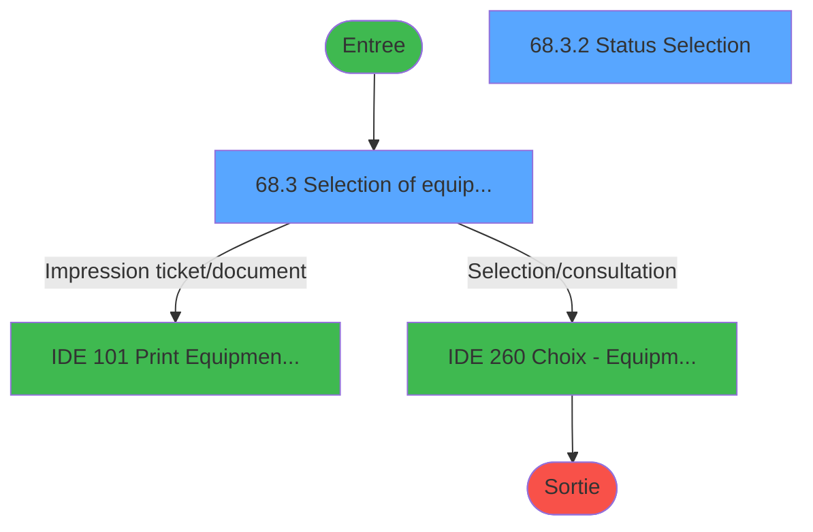
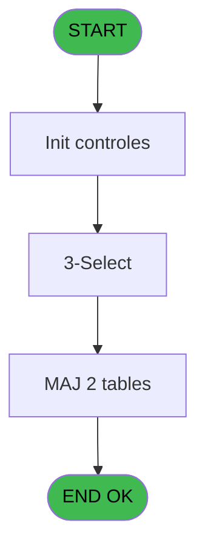
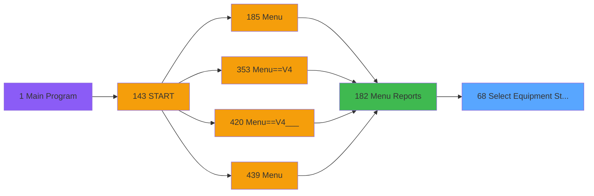
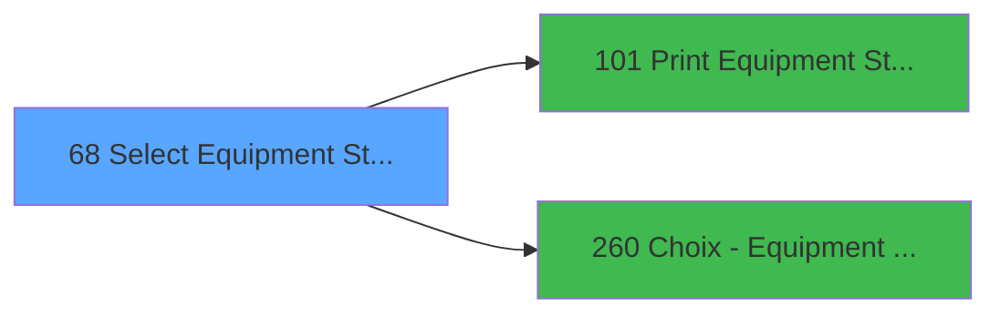

# PVE IDE 68 - Select Equipment / Status

> **Analyse**: Phases 1-4 2026-02-03 09:06 -> 09:06 (20s) | Assemblage 09:06
> **Pipeline**: V7.2 Enrichi
> **Structure**: 4 onglets (Resume | Ecrans | Donnees | Connexions)

<!-- TAB:Resume -->

## 1. FICHE D'IDENTITE

| Attribut | Valeur |
|----------|--------|
| Projet | PVE |
| IDE Position | 68 |
| Nom Programme | Select Equipment / Status |
| Fichier source | `Prg_68.xml` |
| Domaine metier | General |
| Taches | 10 (2 ecrans visibles) |
| Tables modifiees | 2 |
| Programmes appeles | 2 |

## 2. DESCRIPTION FONCTIONNELLE

**Select Equipment / Status** assure la gestion complete de ce processus, accessible depuis [Menu Reports (IDE 182)](PVE-IDE-182.md).

Le flux de traitement s'organise en **3 blocs fonctionnels** :

- **Consultation** (5 taches) : ecrans de recherche, selection et consultation
- **Traitement** (3 taches) : traitements metier divers
- **Creation** (2 taches) : insertion d'enregistrements en base (mouvements, prestations)

**Donnees modifiees** : 2 tables en ecriture (update_table_ensemble, import_recup_numchambre).

Detail : phases du traitement

#### Phase 1 : Consultation (5 taches)

- **68** - Select Equipment / Status **[[ECRAN]](#ecran-t1)**
- **68.3** - Selection of equipments **[[ECRAN]](#ecran-t12)**
- **68.3.1** - Class Selection
- **68.3.2** - Status Selection **[[ECRAN]](#ecran-t15)**
- **68.3.3** - Check Selections

Delegue a : [Choix - Equipment owners (IDE 260)](PVE-IDE-260.md)

#### Phase 2 : Creation (2 taches)

- **68.1** - Create Temp Status
- **68.2.1** - Create Temp Cat

#### Phase 3 : Traitement (3 taches)

- **68.2** - Read Class
- **68.3.1.1** - Tick/Untick All
- **68.3.2.1** - Tick/Untick All

#### Tables impactees

| Table | Operations | Role metier |
|-------|-----------|-------------|
| import_recup_numchambre | **W**/L (4 usages) |  |
| update_table_ensemble | **W**/L (4 usages) |  |

## 3. BLOCS FONCTIONNELS

### 3.1 Consultation (5 taches)

Ecrans de recherche et consultation.

---

#### 68 - Select Equipment / Status [[ECRAN]](#ecran-t1)

**Role** : Traitement : Select Equipment / Status.
**Ecran** : 312 x 173 DLU (MDI) | [Voir mockup](#ecran-t1)

4 sous-taches directes

| Tache | Nom | Bloc |
|-------|-----|------|
| [68.3](#t12) | Selection of equipments **[[ECRAN]](#ecran-t12)** | Consultation |
| [68.3.1](#t13) | Class Selection | Consultation |
| [68.3.2](#t15) | Status Selection **[[ECRAN]](#ecran-t15)** | Consultation |
| [68.3.3](#t17) | Check Selections | Consultation |

**Variables liees** : H (v. action status)
**Delegue a** : [Choix - Equipment owners (IDE 260)](PVE-IDE-260.md)

---

#### 68.3 - Selection of equipments [[ECRAN]](#ecran-t12)

**Role** : Selection par l'operateur : Selection of equipments.
**Ecran** : 675 x 359 DLU (MDI) | [Voir mockup](#ecran-t12)
**Delegue a** : [Choix - Equipment owners (IDE 260)](PVE-IDE-260.md)

---

#### 68.3.1 - Class Selection

**Role** : Selection par l'operateur : Class Selection.
**Variables liees** : G (v. action class)
**Delegue a** : [Choix - Equipment owners (IDE 260)](PVE-IDE-260.md)

---

#### 68.3.2 - Status Selection [[ECRAN]](#ecran-t15)

**Role** : Selection par l'operateur : Status Selection.
**Ecran** : 320 x 246 DLU (Modal) | [Voir mockup](#ecran-t15)
**Variables liees** : H (v. action status)
**Delegue a** : [Choix - Equipment owners (IDE 260)](PVE-IDE-260.md)

---

#### 68.3.3 - Check Selections

**Role** : Selection par l'operateur : Check Selections.
**Delegue a** : [Choix - Equipment owners (IDE 260)](PVE-IDE-260.md)

### 3.2 Creation (2 taches)

Insertion de nouveaux enregistrements en base.

---

#### 68.1 - Create Temp Status

**Role** : Traitement : Create Temp Status.
**Variables liees** : H (v. action status)

---

#### 68.2.1 - Create Temp Cat

**Role** : Traitement : Create Temp Cat.

### 3.3 Traitement (3 taches)

Traitements internes.

---

#### 68.2 - Read Class

**Role** : Traitement : Read Class.
**Variables liees** : G (v. action class)

---

#### 68.3.1.1 - Tick/Untick All

**Role** : Traitement : Tick/Untick All.

---

#### 68.3.2.1 - Tick/Untick All

**Role** : Traitement : Tick/Untick All.

## 5. REGLES METIER

*(Aucune regle metier identifiee)*

## 6. CONTEXTE

- **Appele par**: [Menu Reports (IDE 182)](PVE-IDE-182.md)
- **Appelle**: 2 programmes | **Tables**: 6 (W:2 R:3 L:3) | **Taches**: 10 | **Expressions**: 2

<!-- TAB:Ecrans -->

## 8. ECRANS

### 8.1 Forms visibles (2 / 10)

| # | Position | Tache | Nom | Type | Largeur | Hauteur | Bloc |
|---|----------|-------|-----|------|---------|---------|------|
| 1 | 68.3 | 68.3 | Selection of equipments | MDI | 675 | 359 | Consultation |
| 2 | 68.3.2 | 68.3.2 | Status Selection | Modal | 320 | 246 | Consultation |

### 8.2 Mockups Ecrans

---

#### 68.3 - Selection of equipments
**Tache** : [68.3](#t12) | **Type** : MDI | **Dimensions** : 675 x 359 DLU
**Bloc** : Consultation | **Titre IDE** : Selection of equipments

<!-- FORM-DATA:
{
    "width":  675,
    "vFactor":  8,
    "type":  "MDI",
    "hFactor":  4,
    "controls":  [
                     {
                         "x":  14,
                         "type":  "label",
                         "var":  "",
                         "y":  47,
                         "w":  115,
                         "fmt":  "",
                         "name":  "",
                         "h":  23,
                         "color":  "183",
                         "text":  "Rented equipment only",
                         "parent":  null
                     },
                     {
                         "x":  271,
                         "type":  "label",
                         "var":  "",
                         "y":  47,
                         "w":  34,
                         "fmt":  "",
                         "name":  "",
                         "h":  23,
                         "color":  "183",
                         "text":  "Owner",
                         "parent":  null
                     },
                     {
                         "x":  530,
                         "type":  "label",
                         "var":  "",
                         "y":  47,
                         "w":  43,
                         "fmt":  "",
                         "name":  "",
                         "h":  23,
                         "color":  "183",
                         "text":  "Length",
                         "parent":  null
                     },
                     {
                         "x":  0,
                         "type":  "line",
                         "var":  "",
                         "y":  75,
                         "w":  674,
                         "fmt":  "",
                         "name":  "",
                         "h":  0,
                         "color":  "63",
                         "text":  "",
                         "parent":  null
                     },
                     {
                         "x":  0,
                         "type":  "label",
                         "var":  "",
                         "y":  0,
                         "w":  674,
                         "fmt":  "",
                         "name":  "",
                         "h":  42,
                         "color":  "182",
                         "text":  "",
                         "parent":  null
                     },
                     {
                         "x":  13,
                         "type":  "label",
                         "var":  "",
                         "y":  15,
                         "w":  573,
                         "fmt":  "",
                         "name":  "",
                         "h":  10,
                         "color":  "186",
                         "text":  "Select all criterias you want to apply to your selection of equipments you want to print",
                         "parent":  6
                     },
                     {
                         "x":  0,
                         "type":  "label",
                         "var":  "",
                         "y":  325,
                         "w":  674,
                         "fmt":  "",
                         "name":  "",
                         "h":  34,
                         "color":  "6",
                         "text":  "",
                         "parent":  null
                     },
                     {
                         "x":  136,
                         "type":  "combobox",
                         "var":  "",
                         "y":  51,
                         "w":  45,
                         "fmt":  "",
                         "name":  "Rented equipment",
                         "h":  14,
                         "color":  "110",
                         "text":  "YES,NO",
                         "parent":  null
                     },
                     {
                         "x":  308,
                         "type":  "button",
                         "var":  "",
                         "y":  47,
                         "w":  138,
                         "fmt":  "",
                         "name":  "CTRL_001",
                         "h":  23,
                         "color":  "",
                         "text":  "",
                         "parent":  null
                     },
                     {
                         "x":  581,
                         "type":  "edit",
                         "var":  "",
                         "y":  47,
                         "w":  42,
                         "fmt":  "",
                         "name":  "Length",
                         "h":  23,
                         "color":  "110",
                         "text":  "",
                         "parent":  null
                     },
                     {
                         "x":  539,
                         "type":  "button",
                         "var":  "",
                         "y":  330,
                         "w":  68,
                         "fmt":  "Print",
                         "name":  "Execute",
                         "h":  28,
                         "color":  "",
                         "text":  "",
                         "parent":  13
                     },
                     {
                         "x":  606,
                         "type":  "button",
                         "var":  "",
                         "y":  330,
                         "w":  68,
                         "fmt":  "Exit",
                         "name":  "Exit",
                         "h":  28,
                         "color":  "",
                         "text":  "",
                         "parent":  13
                     },
                     {
                         "x":  625,
                         "type":  "image",
                         "var":  "",
                         "y":  4,
                         "w":  48,
                         "fmt":  "",
                         "name":  "",
                         "h":  37,
                         "color":  "",
                         "text":  "",
                         "parent":  8
                     },
                     {
                         "x":  8,
                         "type":  "subform",
                         "var":  "",
                         "y":  78,
                         "w":  320,
                         "fmt":  "",
                         "name":  "Class Selection",
                         "h":  247,
                         "color":  "",
                         "text":  "",
                         "parent":  null
                     },
                     {
                         "x":  341,
                         "type":  "subform",
                         "var":  "",
                         "y":  78,
                         "w":  320,
                         "fmt":  "",
                         "name":  "Status Selection",
                         "h":  247,
                         "color":  "",
                         "text":  "",
                         "parent":  null
                     }
                 ],
    "taskId":  "68.3",
    "height":  359
}
-->

<strong>Champs : 2 champs</strong>

| Pos (x,y) | Nom | Variable | Type |
|-----------|-----|----------|------|
| 136,51 | Rented equipment | - | combobox |
| 581,47 | Length | - | edit |

<strong>Boutons : 3 boutons</strong>

| Bouton | Pos (x,y) | Action |
|--------|-----------|--------|
| CTRL_001 | 308,47 | Bouton fonctionnel |
| Print | 539,330 | Appel [    Print Equipment / Status (IDE 101)](PVE-IDE-101.md) |
| Exit | 606,330 | Quitte le programme |

---

#### 68.3.2 - Status Selection
**Tache** : [68.3.2](#t15) | **Type** : Modal | **Dimensions** : 320 x 246 DLU
**Bloc** : Consultation | **Titre IDE** : Status Selection

<!-- FORM-DATA:
{
    "width":  320,
    "vFactor":  8,
    "type":  "Modal",
    "hFactor":  4,
    "controls":  [
                     {
                         "x":  5,
                         "type":  "label",
                         "var":  "",
                         "y":  0,
                         "w":  77,
                         "fmt":  "",
                         "name":  "",
                         "h":  12,
                         "color":  "183",
                         "text":  "Status",
                         "parent":  null
                     },
                     {
                         "x":  0,
                         "type":  "table",
                         "var":  "",
                         "name":  "",
                         "titleH":  12,
                         "color":  "110",
                         "w":  276,
                         "y":  14,
                         "fmt":  "",
                         "parent":  null,
                         "text":  "",
                         "rowH":  28,
                         "h":  226,
                         "cols":  [
                                      {
                                          "title":  "",
                                          "layer":  1,
                                          "w":  68
                                      },
                                      {
                                          "title":  "",
                                          "layer":  2,
                                          "w":  171
                                      },
                                      {
                                          "title":  "",
                                          "layer":  3,
                                          "w":  34
                                      }
                                  ],
                         "rows":  3
                     },
                     {
                         "x":  5,
                         "type":  "edit",
                         "var":  "",
                         "y":  18,
                         "w":  57,
                         "fmt":  "",
                         "name":  "",
                         "h":  21,
                         "color":  "110",
                         "text":  "",
                         "parent":  2
                     },
                     {
                         "x":  72,
                         "type":  "edit",
                         "var":  "",
                         "y":  18,
                         "w":  162,
                         "fmt":  "",
                         "name":  "",
                         "h":  21,
                         "color":  "110",
                         "text":  "",
                         "parent":  2
                     },
                     {
                         "x":  252,
                         "type":  "checkbox",
                         "var":  "",
                         "y":  18,
                         "w":  16,
                         "fmt":  "",
                         "name":  "",
                         "h":  21,
                         "color":  "110",
                         "text":  "",
                         "parent":  2
                     },
                     {
                         "x":  275,
                         "type":  "button",
                         "var":  "",
                         "y":  43,
                         "w":  44,
                         "fmt":  "ñ",
                         "name":  "",
                         "h":  100,
                         "color":  "",
                         "text":  "",
                         "parent":  null
                     },
                     {
                         "x":  275,
                         "type":  "button",
                         "var":  "",
                         "y":  142,
                         "w":  44,
                         "fmt":  "ò",
                         "name":  "",
                         "h":  99,
                         "color":  "",
                         "text":  "",
                         "parent":  null
                     },
                     {
                         "x":  275,
                         "type":  "button",
                         "var":  "",
                         "y":  15,
                         "w":  44,
                         "fmt":  "þ",
                         "name":  "",
                         "h":  28,
                         "color":  "",
                         "text":  "",
                         "parent":  null
                     }
                 ],
    "taskId":  "68.3.2",
    "height":  246
}
-->

<strong>Champs : 3 champs</strong>

| Pos (x,y) | Nom | Variable | Type |
|-----------|-----|----------|------|
| 5,18 | (sans nom) | - | edit |
| 72,18 | (sans nom) | - | edit |
| 252,18 | (sans nom) | - | checkbox |

<strong>Boutons : 3 boutons</strong>

| Bouton | Pos (x,y) | Action |
|--------|-----------|--------|
| ñ | 275,43 | Bouton fonctionnel |
| ò | 275,142 | Bouton fonctionnel |
| þ | 275,15 | Bouton fonctionnel |

## 9. NAVIGATION

### 9.1 Enchainement des ecrans

**Detail par enchainement :**

| Depuis | Action | Vers | Retour |
|--------|--------|------|--------|
| Selection of equipments | Impression ticket/document | [    Print Equipment / Status (IDE 101)](PVE-IDE-101.md) | Retour ecran |
| Selection of equipments | Selection/consultation | [Choix - Equipment owners (IDE 260)](PVE-IDE-260.md) | Retour ecran |

### 9.3 Structure hierarchique (10 taches)

| Position | Tache | Type | Dimensions | Bloc |
|----------|-------|------|------------|------|
| **68.1** | [**Select Equipment / Status** (68)](#t1) [mockup](#ecran-t1) | MDI | 312x173 | Consultation |
| 68.1.1 | [Selection of equipments (68.3)](#t12) [mockup](#ecran-t12) | MDI | 675x359 | |
| 68.1.2 | [Class Selection (68.3.1)](#t13) | Modal | - | |
| 68.1.3 | [Status Selection (68.3.2)](#t15) [mockup](#ecran-t15) | Modal | 320x246 | |
| 68.1.4 | [Check Selections (68.3.3)](#t17) | MDI | - | |
| **68.2** | [**Create Temp Status** (68.1)](#t8) | MDI | - | Creation |
| 68.2.1 | [Create Temp Cat (68.2.1)](#t10) | MDI | - | |
| **68.3** | [**Read Class** (68.2)](#t9) | MDI | - | Traitement |
| 68.3.1 | [Tick/Untick All (68.3.1.1)](#t14) | MDI | - | |
| 68.3.2 | [Tick/Untick All (68.3.2.1)](#t16) | MDI | - | |

### 9.4 Algorigramme

> **Legende**: Vert = START/END OK | Rouge = END KO | Bleu = Decisions
> *Algorigramme auto-genere. Utiliser `/algorigramme` pour une synthese metier detaillee.*

<!-- TAB:Donnees -->

## 10. TABLES

### Tables utilisees (6)

| ID | Nom | Description | Type | R | W | L | Usages |
|----|-----|-------------|------|---|---|---|--------|
| 380 | pv_day_modes |  | DB |   |   | L | 1 |
| 399 | pv_package_price |  | DB | R |   |   | 1 |
| 412 | sk_testski |  | DB | R |   |   | 1 |
| 413 | pv_tva |  | DB | R |   |   | 1 |
| 525 | update_table_ensemble |  | TMP |   | **W** | L | 4 |
| 540 | import_recup_numchambre |  | DB |   | **W** | L | 4 |

### Colonnes par table (2 / 5 tables avec colonnes identifiees)

Table 399 - pv_package_price (R) - 1 usages

| Lettre | Variable | Acces | Type |
|--------|----------|-------|------|
| A | Rented equipment | R | Alpha |
| B | Ownership | R | Numeric |
| C | Length | R | Numeric |
| D | Print | R | Alpha |
| E | Exit | R | Alpha |
| F | v. Error ? | R | Logical |
| G | v. action class | R | Logical |
| H | v. action status | R | Logical |
| I | v.Output | R | Alpha |

Table 412 - sk_testski (R) - 1 usages

*Table utilisee uniquement en Link ou aucune colonne Real identifiee dans le DataView.*

Table 413 - pv_tva (R) - 1 usages

*Table utilisee uniquement en Link ou aucune colonne Real identifiee dans le DataView.*

Table 525 - update_table_ensemble (**W**/L) - 4 usages

*Table utilisee uniquement en Link ou aucune colonne Real identifiee dans le DataView.*

Table 540 - import_recup_numchambre (**W**/L) - 4 usages

| Lettre | Variable | Acces | Type |
|--------|----------|-------|------|
| A | v. check status | W | Logical |
| B | v. check class | W | Logical |

## 11. VARIABLES

### 11.1 Variables de session (4)

Variables persistantes pendant toute la session.

| Lettre | Nom | Type | Usage dans |
|--------|-----|------|-----------|
| F | v. Error ? | Logical | - |
| G | v. action class | Logical | - |
| H | v. action status | Logical | - |
| I | v.Output | Alpha | - |

### 11.2 Autres (5)

Variables diverses.

| Lettre | Nom | Type | Usage dans |
|--------|-----|------|-----------|
| A | Rental ? | Logical | - |
| B | Ownership | Numeric | - |
| C | Length | Numeric | - |
| D | Print | Alpha | - |
| E | Exit | Alpha | - |

## 12. EXPRESSIONS

**2 / 2 expressions decodees (100%)**

### 12.1 Repartition par type

| Type | Expressions | Regles |
|------|-------------|--------|
| OTHER | 2 | 0 |

### 12.2 Expressions cles par type

#### OTHER (2 expressions)

| Type | IDE | Expression | Regle |
|------|-----|------------|-------|
| OTHER | 2 | `DbDel ('{525,3}'DSOURCE,'')` | - |
| OTHER | 1 | `DbDel ('{540,3}'DSOURCE,'')` | - |

<!-- TAB:Connexions -->

## 13. GRAPHE D'APPELS

### 13.1 Chaine depuis Main (Callers)

Main -> ... -> [Menu Reports (IDE 182)](PVE-IDE-182.md) -> **Select Equipment / Status (IDE 68)**

### 13.2 Callers

| IDE | Nom Programme | Nb Appels |
|-----|---------------|-----------|
| [182](PVE-IDE-182.md) | Menu Reports | 1 |

### 13.3 Callees (programmes appeles)

### 13.4 Detail Callees avec contexte

| IDE | Nom Programme | Appels | Contexte |
|-----|---------------|--------|----------|
| [101](PVE-IDE-101.md) |     Print Equipment / Status | 1 | Impression ticket/document |
| [260](PVE-IDE-260.md) | Choix - Equipment owners | 1 | Selection/consultation |

## 14. RECOMMANDATIONS MIGRATION

### 14.1 Profil du programme

| Metrique | Valeur | Impact migration |
|----------|--------|-----------------|
| Lignes de logique | 107 | Programme compact |
| Expressions | 2 | Peu de logique |
| Tables WRITE | 2 | Impact faible |
| Sous-programmes | 2 | Peu de dependances |
| Ecrans visibles | 2 | Quelques ecrans |
| Code desactive | 0% (0 / 107) | Code sain |
| Regles metier | 0 | Pas de regle identifiee |

### 14.2 Plan de migration par bloc

#### Consultation (5 taches: 3 ecrans, 2 traitements)

- **Strategie** : Composants de recherche/selection en modales.
- 3 ecrans : Select Equipment / Status, Selection of equipments, Status Selection

#### Creation (2 taches: 0 ecran, 2 traitements)

- **Strategie** : Repository pattern avec Entity Framework Core.
- Insertion via `IRepository<T>.CreateAsync()`

#### Traitement (3 taches: 0 ecran, 3 traitements)

- **Strategie** : 3 service(s) backend injectable(s) (Domain Services).
- 2 sous-programme(s) a migrer ou a reutiliser depuis les services existants.
- Decomposer les taches en services unitaires testables.

### 14.3 Dependances critiques

| Dependance | Type | Appels | Impact |
|------------|------|--------|--------|
| update_table_ensemble | Table WRITE (Temp) | 3x | Schema + repository |
| import_recup_numchambre | Table WRITE (Database) | 3x | Schema + repository |
| [Choix - Equipment owners (IDE 260)](PVE-IDE-260.md) | Sous-programme | 1x | Normale - Selection/consultation |
| [    Print Equipment / Status (IDE 101)](PVE-IDE-101.md) | Sous-programme | 1x | Normale - Impression ticket/document |

---
*Spec DETAILED generee par Pipeline V7.2 - 2026-02-03 09:06*
